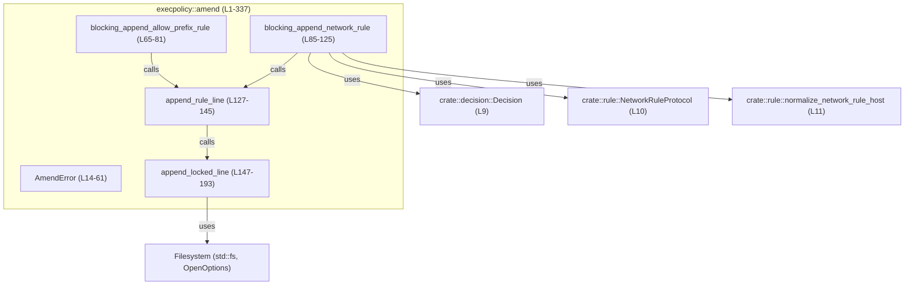
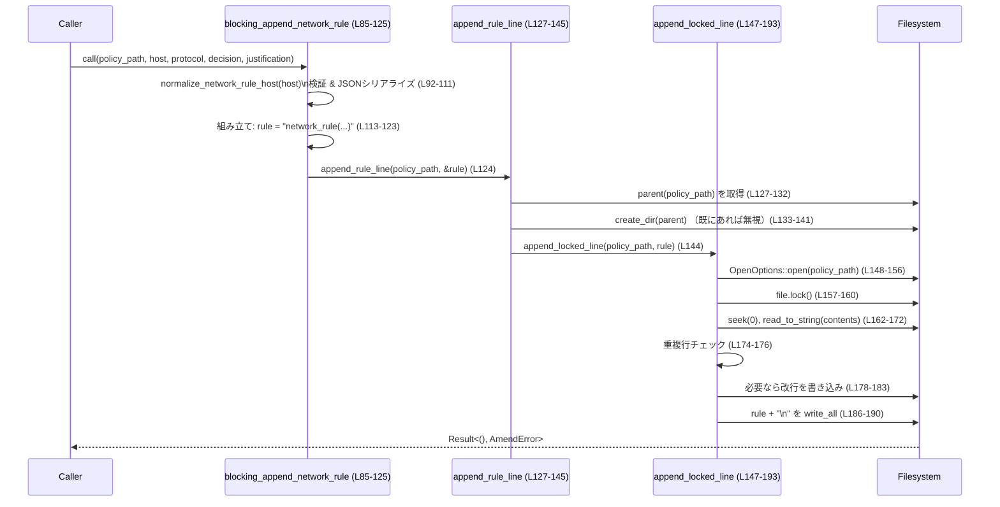

# execpolicy/src/amend.rs コード解説

---

## 0. ざっくり一言

`execpolicy/src/amend.rs` は、ポリシーファイルに対して

- コマンド用の `prefix_rule(...)`
- ネットワーク用の `network_rule(...)`

という 1 行 DSL 形式のルールを、安全に（重複チェック付き・ファイルロック付きで）追記する同期処理を提供するモジュールです（execpolicy/src/amend.rs:L65-81, L85-125, L127-193）。

---

## 1. このモジュールの役割

### 1.1 概要

- このモジュールは、**ポリシーファイルにルールを追記する処理**をカプセル化するために存在し、以下を提供します。
  - `prefix_rule`（コマンドのプレフィクスマッチ）を「allow」で追記する機能（execpolicy/src/amend.rs:L65-81）。
  - `network_rule`（ホスト／プロトコル／判定／理由）を追記する機能（execpolicy/src/amend.rs:L85-125）。
  - ディレクトリ作成・ファイルロック・重複行の抑制を一括して行う内部ヘルパー（execpolicy/src/amend.rs:L127-193）。
- エラーはすべて `AmendError` 列挙体に集約され、呼び出し元が失敗理由を判別できるようになっています（execpolicy/src/amend.rs:L14-61）。

### 1.2 アーキテクチャ内での位置づけ

このチャンクに登場する依存関係は次の通りです。

- 入力の判定:
  - `Decision`（許可/プロンプト/禁止の判定）: `crate::decision::Decision`（execpolicy/src/amend.rs:L9）。
  - ネットワークルール関連:  
    `NetworkRuleProtocol`, `normalize_network_rule_host` from `crate::rule`（execpolicy/src/amend.rs:L10-11）。
- ファイル I/O:
  - `std::fs::OpenOptions` や `std::fs::create_dir` による同期 I/O（execpolicy/src/amend.rs:L1, L133）。
  - `file.lock()` によるアドバイザリ（助言的）ファイルロック（execpolicy/src/amend.rs:L157-160）。
- エラー表現: `thiserror::Error` を使った `AmendError`（execpolicy/src/amend.rs:L12-15）。

全体像を Mermaid で示すと次のようになります（このチャンク範囲: execpolicy/src/amend.rs:L1-337）。



### 1.3 設計上のポイント

- **エラー集約型 `AmendError`**  
  - ほぼすべての I/O とシリアライズの失敗を個別のバリアントで表現しており、原因の粒度が細かい設計です（execpolicy/src/amend.rs:L14-61）。
- **同期かつブロッキング I/O**  
  - 関数名に `blocking_` が付き、doc コメントで「blocking I/O なので async 文脈からは `tokio::task::spawn_blocking` で呼ぶべき」と明示されています（execpolicy/src/amend.rs:L63-65, L83-85）。
- **アドバイザリファイルロック**  
  - `file.lock()` を通じて、同一ファイルへの同時書き込みの競合を避けています（execpolicy/src/amend.rs:L157-160）。
  - コメントで「advisory file locking」と説明されていますが、このチャンクだけではどのクレートがロック機能を提供しているかは分かりません（execpolicy/src/amend.rs:L63-64）。
- **ルール行の重複抑制**  
  - 追記前にファイル全体を読み込み、完全一致する行が存在する場合は何も書かずに成功扱いで終了します（execpolicy/src/amend.rs:L167-176）。
- **ディレクトリ作成の範囲**  
  - `policy_path.parent()` に対応するディレクトリのみを `std::fs::create_dir` で作成します（execpolicy/src/amend.rs:L127-142）。
  - `create_dir_all` ではないため、親の親が存在することが前提になっています（execpolicy/src/amend.rs:L133）。

---

## 2. 主要な機能一覧

- `AmendError`: このモジュールの全てのエラーを表現する列挙体（execpolicy/src/amend.rs:L14-61）。
- `blocking_append_allow_prefix_rule`: `prefix_rule(pattern=[...], decision="allow")` 行をポリシーファイルに追記する（execpolicy/src/amend.rs:L65-81）。
- `blocking_append_network_rule`: `network_rule(host=..., protocol=..., decision=..., justification=...)` 行を追記する（execpolicy/src/amend.rs:L85-125）。
- `append_rule_line`: 親ディレクトリの作成とエラー変換を行った上で、ロック付き追記処理に委譲する内部関数（execpolicy/src/amend.rs:L127-145）。
- `append_locked_line`: ファイルのオープン・ロック・重複チェック・改行調整・追記までを一括で行う内部関数（execpolicy/src/amend.rs:L147-193）。

---

## 3. 公開 API と詳細解説

### 3.1 型一覧（構造体・列挙体など）

#### 3.1.1 型インベントリー

| 名前        | 種別 | 公開 | 役割 / 用途 | 定義位置 |
|------------|------|------|-------------|----------|
| `AmendError` | 列挙体 | `pub` | ルール追記処理全体で発生しうるエラーを表現する。I/O, シリアライズ, 前提違反などを個別のバリアントで区別する。 | `execpolicy/src/amend.rs:L14-61` |

`AmendError` の主なバリアント（抜粋）:

- `EmptyPrefix`: `prefix_rule` 用のトークン配列が空だった場合（execpolicy/src/amend.rs:L16-17）。
- `InvalidNetworkRule(String)`: ホストフォーマットや justification の検証に失敗した場合（execpolicy/src/amend.rs:L18-19, L92-99）。
- `MissingParent { path }`: `policy_path.parent()` が存在しない場合（execpolicy/src/amend.rs:L20-21, L127-132）。
- `CreatePolicyDir { dir, source }`: 親ディレクトリの作成に失敗した場合（execpolicy/src/amend.rs:L22-26, L133-141）。
- `SerializePrefix`, `SerializeNetworkRule`: それぞれ prefix トークンや network rule フィールドの JSON 変換に失敗した場合（execpolicy/src/amend.rs:L27-30, L73-77, L102-105, L119-120）。
- `OpenPolicyFile`, `WritePolicyFile`, `LockPolicyFile`, `SeekPolicyFile`, `ReadPolicyFile`: ファイル操作の各フェーズの失敗（execpolicy/src/amend.rs:L31-55, L148-172, L178-190）。
- `PolicyMetadata`: メタデータ読み取り失敗用のバリアントですが、このチャンク内では使用箇所はありません（execpolicy/src/amend.rs:L56-60）。

#### 3.1.2 関数インベントリー（プロダクションコード）

| 名前 | 公開 | 役割 / 用途 | 定義位置 |
|------|------|------------|----------|
| `blocking_append_allow_prefix_rule` | `pub` | `prefix_rule(pattern=[...], decision="allow")` 行を構築し、ポリシーファイルに追記する同期関数。 | `execpolicy/src/amend.rs:L65-81` |
| `blocking_append_network_rule` | `pub` | ネットワークアクセスルール `network_rule(...)` 行を構築・検証して追記する同期関数。 | `execpolicy/src/amend.rs:L85-125` |
| `append_rule_line` | `fn` | 親ディレクトリの存在を保証し、エラーを `AmendError` に変換した上で、ロック付き追記処理へ委譲する内部関数。 | `execpolicy/src/amend.rs:L127-145` |
| `append_locked_line` | `fn` | ファイルを開いてロックし、内容を読み込んで重複チェックを行い、必要に応じて改行を挿入してルール行を追記する内部関数。 | `execpolicy/src/amend.rs:L147-193` |

※ `mod tests` 内のテスト関数は 6 件ありますが、公開 API ではないためここでは省略し、§6 で挙動確認として触れます（execpolicy/src/amend.rs:L195-337）。

---

### 3.2 関数詳細

#### `blocking_append_allow_prefix_rule(policy_path: &Path, prefix: &[String]) -> Result<(), AmendError>`

**概要**

- `prefix` のトークン列を JSON 文字列としてフォーマットし、  
  `prefix_rule(pattern=[...], decision="allow")` という 1 行を組み立てて、指定されたポリシーファイルに追記します（execpolicy/src/amend.rs:L73-80）。

**引数**

| 引数名      | 型              | 説明 |
|-------------|-----------------|------|
| `policy_path` | `&Path`        | ルールを追記するポリシーファイルのパス。存在しない場合は親ディレクトリを作成してからファイルを作ります（execpolicy/src/amend.rs:L127-145）。 |
| `prefix`      | `&[String]`    | `prefix_rule` の `pattern` 引数として用いるトークン列。最低 1 要素が必要です（execpolicy/src/amend.rs:L69-71）。 |

**戻り値**

- 成功時: `Ok(())`
- 失敗時: `Err(AmendError)`（空 prefix, JSON シリアライズ失敗, ディレクトリ/ファイル操作失敗など）。

**内部処理の流れ**

1. `prefix` が空かをチェックし、空なら `AmendError::EmptyPrefix` を返す（execpolicy/src/amend.rs:L69-71）。
2. 各トークンを `serde_json::to_string` で JSON 文字列（例: `"echo"`) に変換し、`Vec<String>` に集約する（execpolicy/src/amend.rs:L73-77）。
3. `tokens.join(", ")` を `[...]` で囲み、`pattern` 部分の文字列を作る（execpolicy/src/amend.rs:L78）。
4. `prefix_rule(pattern={pattern}, decision="allow")` というルール行文字列を組み立てる（execpolicy/src/amend.rs:L79）。
5. `append_rule_line(policy_path, &rule)` を呼び出して、ディレクトリ作成とロック付き追記処理へ渡す（execpolicy/src/amend.rs:L80）。

**Examples（使用例）**

単純な prefix ルールを追加する例です。

```rust
use std::path::Path;
use execpolicy::amend::blocking_append_allow_prefix_rule; // モジュールパスは仮。実際のパスはこのチャンクからは不明。

fn main() -> Result<(), execpolicy::amend::AmendError> {
    let policy_path = Path::new("rules/default.rules"); // 親ディレクトリ "rules" がなければ作成される

    // `echo "Hello, world!"` というコマンドを許可する prefix_rule を追加する
    blocking_append_allow_prefix_rule(
        policy_path,
        &[String::from("echo"), String::from("Hello, world!")],
    )?;

    Ok(())
}
```

このコードにより、ファイル末尾に次の 1 行が（まだ存在しなければ）追加されます（execpolicy/src/amend.rs:L79）。

```text
prefix_rule(pattern=["echo", "Hello, world!"], decision="allow")
```

**Errors / Panics**

- `Err(AmendError::EmptyPrefix)`  
  - `prefix` が空スライスの場合（execpolicy/src/amend.rs:L69-71）。
- `Err(AmendError::SerializePrefix { .. })`  
  - `serde_json::to_string` が失敗した場合（トークンにシリアライズ不能な値が入っているなど）。  
    根拠: `map_err(|source| AmendError::SerializePrefix { source })`（execpolicy/src/amend.rs:L73-77）。
- それ以外の I/O エラーは `append_rule_line` / `append_locked_line` 内で `OpenPolicyFile`, `WritePolicyFile` 等に変換されます（execpolicy/src/amend.rs:L127-145, L147-190）。
- panic を起こす処理はこのチャンクには見当たりません。エラーはすべて `Result` で返却されています。

**Edge cases（エッジケース）**

- `prefix` が空: 即座に `Err(AmendError::EmptyPrefix)` となり、ファイルには触れません（execpolicy/src/amend.rs:L69-71）。
- `policy_path` に親ディレクトリが無い（例: ルートパスのみ）: `append_rule_line` で `AmendError::MissingParent` になります（execpolicy/src/amend.rs:L127-132）。
- 既に同じ行がファイルに存在する場合: 追記されずに成功 (`Ok(())`) になります（execpolicy/src/amend.rs:L174-176）。

**使用上の注意点**

- コマンド列は JSON 文字列としてエスケープされるため、トークン内にスペースや引用符があっても DSL 上は正しく 1 トークンとして扱われます（execpolicy/src/amend.rs:L73-79）。
- 親ディレクトリは 1 階層分のみ自動作成されます。より深い階層が必要な場合、呼び出し前に別途 `create_dir_all` などで用意する必要があります（execpolicy/src/amend.rs:L127-142）。
- ファイルロックは内部で取得されるため、同一プロセス／同一ロック機構を使う他プロセスと協調する前提です（execpolicy/src/amend.rs:L147-160）。

---

#### `blocking_append_network_rule(policy_path: &Path, host: &str, protocol: NetworkRuleProtocol, decision: Decision, justification: Option<&str>) -> Result<(), AmendError>`

**概要**

- ネットワークアクセスを表す `network_rule(...)` 行を構築し、指定ポリシーファイルに追記します。
- ホスト名の正規化とバリデーション、judgement（`Decision`）の文字列化、justification の非空チェックを行います（execpolicy/src/amend.rs:L92-111, L118-123）。

**引数**

| 引数名        | 型                         | 説明 |
|---------------|----------------------------|------|
| `policy_path` | `&Path`                    | ルールを追記するポリシーファイルのパス。 |
| `host`        | `&str`                     | 対象ホスト名。大文字小文字やフォーマットは `normalize_network_rule_host` によって正規化されます（execpolicy/src/amend.rs:L92-93）。 |
| `protocol`    | `NetworkRuleProtocol`      | プロトコル種別。`as_policy_string()` でポリシーファイル用の文字列表現に変換されます（execpolicy/src/amend.rs:L104-105）。 |
| `decision`    | `Decision`                 | `Allow` / `Prompt` / `Forbidden` などの判定。 `"allow"`, `"prompt"`, `"deny"` にマッピングされます（execpolicy/src/amend.rs:L106-111）。 |
| `justification` | `Option<&str>`           | ルールの理由。`Some("")` や空白のみの文字列は許可されず、`None` か非空文字列のみが許可されます（execpolicy/src/amend.rs:L94-99）。 |

**戻り値**

- 成功時: `Ok(())`。
- 失敗時: `Err(AmendError)`（ホストのバリデーション失敗、justification の空文字、JSON シリアライズ失敗、ファイル関連エラーなど）。

**内部処理の流れ**

1. `normalize_network_rule_host(host)` を呼び、正常化されたホスト名を得る。エラー時には `InvalidNetworkRule(err.to_string())` に変換（execpolicy/src/amend.rs:L92-93）。
2. `if let Some(raw) = justification && raw.trim().is_empty()` により、「Some かつ空または空白のみ」の文字列を検出し、`InvalidNetworkRule("justification cannot be empty")` を返す（execpolicy/src/amend.rs:L94-99）。
3. 正規化後のホストを `serde_json::to_string` で JSON 文字列に変換し、`AmendError::SerializeNetworkRule` にマップする（execpolicy/src/amend.rs:L102-103）。
4. `protocol.as_policy_string()` の結果を JSON 文字列としてシリアライズ（execpolicy/src/amend.rs:L104-105）。
5. `decision` を `"allow"`, `"prompt"`, `"deny"` のいずれかにマッピングし、それを JSON 文字列としてシリアライズ（execpolicy/src/amend.rs:L106-111）。
6. `args` ベクタに `host=...`, `protocol=...`, `decision=...` を格納（execpolicy/src/amend.rs:L113-117）。
7. `justification` が `Some` の場合は JSON 化し、`justification=...` を args に追加（execpolicy/src/amend.rs:L118-121）。
8. `network_rule({args.join(", ")})` という文字列を組み立てる（execpolicy/src/amend.rs:L123）。
9. `append_rule_line(policy_path, &rule)` を呼び出して、実際の追記を行う（execpolicy/src/amend.rs:L124）。

**Examples（使用例）**

GitHub API への HTTPS 接続を許可するルールを追加する例です。

```rust
use std::path::Path;
use execpolicy::amend::{blocking_append_network_rule, AmendError};
use crate::decision::Decision;                 // 実際のモジュールパスはこのチャンクからは不明
use crate::rule::NetworkRuleProtocol;

fn main() -> Result<(), AmendError> {
    let policy_path = Path::new("rules/default.rules");

    blocking_append_network_rule(
        policy_path,
        "Api.GitHub.com",                       // 大文字含みだが normalize される
        NetworkRuleProtocol::Https,
        Decision::Allow,
        Some("Allow https_connect access to api.github.com"),
    )?;

    Ok(())
}
```

期待される追記内容はテストから次のように読み取れます（execpolicy/src/amend.rs:L273-293）。

```text
network_rule(host="api.github.com", protocol="https", decision="allow", justification="Allow https_connect access to api.github.com")
```

**Errors / Panics**

- `Err(AmendError::InvalidNetworkRule(_))`
  - `normalize_network_rule_host` がエラーを返した場合（例: ワイルドカード `*.example.com` が禁止されている。テスト参照: execpolicy/src/amend.rs:L320-336）。
  - `justification` が `Some` かつ `trim().is_empty()` の場合（execpolicy/src/amend.rs:L94-99）。
- `Err(AmendError::SerializeNetworkRule { .. })`
  - ホスト・プロトコル・決定・justification のいずれかの JSON シリアライズに失敗した場合（execpolicy/src/amend.rs:L102-105, L119-121）。
- ファイル関連のエラー
  - `append_rule_line` / `append_locked_line` により `MissingParent`, `CreatePolicyDir`, `OpenPolicyFile` などにマップされます（execpolicy/src/amend.rs:L127-141, L148-190）。
- panic を起こす処理はこのチャンクには見当たりません。

**Edge cases（エッジケース）**

- ホストにワイルドカードを含むケース: テストでは `"*.example.com"` が `Err` になり、メッセージから「ワイルドカード禁止」であることが分かります（execpolicy/src/amend.rs:L320-336）。
- `justification = None`: 理由無しのルールとして生成され、`justification=` フィールドは出力されません（execpolicy/src/amend.rs:L118-123）。
- `justification = Some("   ")`（空白のみ）: `InvalidNetworkRule("justification cannot be empty")` で失敗します（execpolicy/src/amend.rs:L94-99）。
- 同一行が既に存在する場合: `append_locked_line` 側で検知され、追加されません（execpolicy/src/amend.rs:L174-176）。

**使用上の注意点**

- 非同期コンテキスト（`tokio` など）から直接呼ぶと、スレッドプールをブロックする可能性があるため、doc コメントにある通り `tokio::task::spawn_blocking` 経由での呼び出しが推奨されています（execpolicy/src/amend.rs:L83-85）。
- `host` と `protocol` は JSON 文字列としてエスケープされるため、ルール DSL への文字列インジェクションをある程度防いでいますが、最終的な文法は呼び出し元のポリシーパ―サー定義に依存します（execpolicy/src/amend.rs:L102-105, L113-123）。
- `NetworkRuleProtocol` や `Decision` の詳細な定義はこのチャンクには現れず、不明です。

---

#### `append_rule_line(policy_path: &Path, rule: &str) -> Result<(), AmendError>`

**概要**

- 親ディレクトリの存在確認と 1 階層分の作成を行い、その後ロック付きでルール行を追記する内部ヘルパーです（execpolicy/src/amend.rs:L127-145）。

**引数**

| 引数名        | 型      | 説明 |
|---------------|---------|------|
| `policy_path` | `&Path` | ポリシーファイルのパス。 |
| `rule`        | `&str`  | ファイルに追記する 1 行のルール文字列（改行を含めない）。 |

**戻り値**

- 成功時: `Ok(())`。
- 失敗時: `Err(AmendError)`。

**内部処理の流れ**

1. `policy_path.parent()` を取得し、`None` の場合は `AmendError::MissingParent { path }` を返す（execpolicy/src/amend.rs:L127-132）。
2. `std::fs::create_dir(dir)` を呼び、結果に応じて以下のように扱う（execpolicy/src/amend.rs:L133-141）。
   - `Ok(())` → 新規作成成功。
   - `Err` だが `ErrorKind::AlreadyExists` → 既存ディレクトリとして問題なし。
   - それ以外のエラー → `AmendError::CreatePolicyDir { dir, source }` にマップ。
3. `append_locked_line(policy_path, rule)` を呼び出して実際の追記処理を行う（execpolicy/src/amend.rs:L144）。

**Errors / Panics**

- 親ディレクトリ無し → `MissingParent`（execpolicy/src/amend.rs:L127-132）。
- ディレクトリ作成失敗 → `CreatePolicyDir`（execpolicy/src/amend.rs:L133-141）。
- それ以降のエラーは `append_locked_line` 側のエラーに引き継がれます。

**使用上の注意点**

- 1 階層分のみ `create_dir` するため、祖先ディレクトリまでは既に存在している前提です（execpolicy/src/amend.rs:L133）。
- ファイルロック処理などは `append_locked_line` に隠蔽されており、この関数では I/O の詳細を意識せずに使えます。

---

#### `append_locked_line(policy_path: &Path, line: &str) -> Result<(), AmendError>`

**概要**

- 指定ファイルを「作成＋読み取り＋追記モード」で開き、アドバイザリロックを取得した上で、
  - ファイル全体を読み込んで重複行をチェックし、
  - 必要なら改行を挿入し、
  - 最後に新しいルール行を追記する内部関数です（execpolicy/src/amend.rs:L147-193）。

**引数**

| 引数名        | 型      | 説明 |
|---------------|---------|------|
| `policy_path` | `&Path` | ロック／追記対象のファイルパス。 |
| `line`        | `&str`  | 追記したいルール行（末尾改行なし）。 |

**戻り値**

- 成功時: `Ok(())`。
- 失敗時: `Err(AmendError)`。

**内部処理の流れ**

1. `OpenOptions::new().create(true).read(true).append(true).open(policy_path)` でファイルを開き、エラー時は `OpenPolicyFile` に変換する（execpolicy/src/amend.rs:L148-156）。
2. `file.lock()` を呼んでファイルロックを取得し、エラー時は `LockPolicyFile` に変換する（execpolicy/src/amend.rs:L157-160）。
3. `file.seek(SeekFrom::Start(0))` でファイル先頭にシークし、失敗時は `SeekPolicyFile` に変換する（execpolicy/src/amend.rs:L162-166）。
4. `read_to_string(&mut contents)` で全内容を文字列に読み込み、失敗時は `ReadPolicyFile` に変換する（execpolicy/src/amend.rs:L167-172）。
5. `contents.lines().any(|existing| existing == line)` で完全一致する行が既にあるかをチェックし、あれば何も書かずに `Ok(())` を返す（execpolicy/src/amend.rs:L174-176）。
6. `contents` が空でなく、かつ末尾が改行で終わっていない場合、`\n` を書き込む（execpolicy/src/amend.rs:L178-183）。
7. `format!("{line}\n").as_bytes()` を `write_all` で書き込み、失敗時は `WritePolicyFile` に変換する（execpolicy/src/amend.rs:L186-190）。
8. `Ok(())` を返して終了（execpolicy/src/amend.rs:L192）。

**Errors / Panics**

- ファイルオープン失敗 → `OpenPolicyFile`（execpolicy/src/amend.rs:L148-156）。
- ロック取得失敗 → `LockPolicyFile`（execpolicy/src/amend.rs:L157-160）。
- シーク失敗 → `SeekPolicyFile`（execpolicy/src/amend.rs:L162-166）。
- 読み込み失敗 → `ReadPolicyFile`（execpolicy/src/amend.rs:L167-172）。
- 書き込み失敗 → `WritePolicyFile`（execpolicy/src/amend.rs:L178-183, L186-190）。
- panic は使われていません。

**Edge cases（エッジケース）**

- 既に同じ `line` が存在する場合: 追記せずに成功終了します（execpolicy/src/amend.rs:L174-176）。
- ファイルが空の場合: 改行挿入処理はスキップされ、`line + "\n"` のみが書き込まれます（execpolicy/src/amend.rs:L178-183）。
- ファイル末尾に改行がない場合: まず 1 つ改行を追加した上で新しい行を書き足すため、テキストとして行が崩れないことが Tests から確認できます（execpolicy/src/amend.rs:L247-271）。

**使用上の注意点**

- ファイルは `.append(true)` で開かれており、追記専用です（execpolicy/src/amend.rs:L148-152）。シーク位置を変更しても、一般的な OS では書き込みは常に末尾になります（この挙動は Rust 標準ライブラリの仕様に依存します）。
- ファイルロックを取得した状態で読み取りと書き込みを行うため、他のロック対応プロセスからの同時書き込みと整合性が取れますが、ロックを使用しない外部プロセスとの競合は防げません。
- ファイルサイズに上限を設けていないため、大きなポリシーファイルでは `read_to_string` によるメモリ消費が大きくなります（execpolicy/src/amend.rs:L167-172）。

---

### 3.3 その他の関数・テスト

このチャンクには次のテスト関数が含まれ、挙動の検証に利用されています（すべて `#[test]`、execpolicy/src/amend.rs:L195-337）。

| 関数名 | 役割（1 行） | 定義位置 |
|--------|--------------|----------|
| `appends_rule_and_creates_directories` | prefix ルール追記時に親ディレクトリが自動作成されることを検証。 | `execpolicy/src/amend.rs:L201-218` |
| `appends_rule_without_duplicate_newline` | 既に改行付きの末尾に追記しても空行が挿入されないことを検証。 | `execpolicy/src/amend.rs:L220-245` |
| `inserts_newline_when_missing_before_append` | 末尾に改行がない場合、追記前に改行が追加されることを検証。 | `execpolicy/src/amend.rs:L247-271` |
| `appends_network_rule` | `blocking_append_network_rule` がホストの正規化とルール行生成を正しく行うことを検証。 | `execpolicy/src/amend.rs:L273-293` |
| `appends_prefix_and_network_rules` | prefix_rule と network_rule が同一ファイルに順序通り追記されることを検証。 | `execpolicy/src/amend.rs:L295-317` |
| `rejects_wildcard_network_rule_host` | ワイルドカード付きホストが `InvalidNetworkRule` で拒否されることを検証。 | `execpolicy/src/amend.rs:L320-336` |

---

## 4. データフロー

ここでは、`blocking_append_network_rule` を呼び出してネットワークルールを追記する典型的なフローを示します。

### 4.1 処理シナリオの概要

1. 呼び出し元が `policy_path` と `host` などのパラメータを指定して `blocking_append_network_rule` を呼ぶ（execpolicy/src/amend.rs:L85-91）。
2. ホスト名の正規化・justification の検証・各フィールドの JSON 変換を行い、1 行の `network_rule(...)` 文字列を作成（execpolicy/src/amend.rs:L92-123）。
3. `append_rule_line` が親ディレクトリの存在を保証し（execpolicy/src/amend.rs:L127-142）、`append_locked_line` がロックと重複チェックを伴う追記を行う（execpolicy/src/amend.rs:L147-193）。
4. ファイルに行が追加されるか、既に存在していれば何もせず成功します。

### 4.2 シーケンス図



prefix ルールのフローもほぼ同様で、前段の「ルール文字列の組み立て」部分だけが `prefix_rule(...)` に変わります（execpolicy/src/amend.rs:L73-80）。

---

## 5. 使い方（How to Use）

### 5.1 基本的な使用方法

同期コードから prefix ルールと network ルールを追加する典型例です。

```rust
use std::path::PathBuf;
use execpolicy::amend::{
    blocking_append_allow_prefix_rule,
    blocking_append_network_rule,
    AmendError,
};
use crate::decision::Decision;                 // 実際のパスはこのチャンクからは不明
use crate::rule::NetworkRuleProtocol;

fn main() -> Result<(), AmendError> {
    // ポリシーファイルパスを構築する
    let policy_path = PathBuf::from("rules/default.rules");

    // 1. コマンド "curl" を許可する prefix_rule を追加する
    blocking_append_allow_prefix_rule(&policy_path, &[String::from("curl")])?;

    // 2. GitHub API への HTTPS 接続を許可する network_rule を追加する
    blocking_append_network_rule(
        &policy_path,
        "api.github.com",
        NetworkRuleProtocol::Https,
        Decision::Allow,
        Some("Allow https_connect access to api.github.com"),
    )?;

    Ok(())
}
```

テストから、実際にファイル内容が次のようになることが確認できます（execpolicy/src/amend.rs:L295-317）。

```text
prefix_rule(pattern=["curl"], decision="allow")
network_rule(host="api.github.com", protocol="https", decision="allow", justification="Allow https_connect access to api.github.com")
```

### 5.2 よくある使用パターン

1. **複数の prefix ルールを順次追加**

   ```rust
   let cmds = vec![
       vec![String::from("ls")],
       vec![String::from("echo"), String::from("Hello")],
   ];

   for tokens in cmds {
       blocking_append_allow_prefix_rule(&policy_path, &tokens)?;
   }
   ```

   - 同じ tokens を再度追加しても、行内容が完全一致するため重複追加されません（execpolicy/src/amend.rs:L174-176）。

2. **非同期コンテキストからの利用（Tokio）**

   ```rust
   // async fn some_async_task(...) -> Result<(), AmendError> {
   let policy_path = policy_path.clone();
   tokio::task::spawn_blocking(move || {
       blocking_append_network_rule(
           &policy_path,
           "api.github.com",
           NetworkRuleProtocol::Https,
           Decision::Allow,
           None,
       )
   })
   .await
   .expect("join error")?;  // spawn_blocking の中身の Result<(), AmendError> を取り出す
   // }
   ```

   - doc コメントの推奨に従い、ブロッキング I/O を専用スレッドに逃がしています（execpolicy/src/amend.rs:L63-65, L83-85）。

### 5.3 よくある間違い

**(1) 空の prefix を渡す**

```rust
// 誤り例: 空の prefix は許可されない
let empty: Vec<String> = vec![];
let result = blocking_append_allow_prefix_rule(&policy_path, &empty);
// result は Err(AmendError::EmptyPrefix) になる（L69-71）
```

**(2) 空の justification を渡す**

```rust
// 誤り例: Some("") や Some("   ") は InvalidNetworkRule になる
let err = blocking_append_network_rule(
    &policy_path,
    "api.github.com",
    NetworkRuleProtocol::Https,
    Decision::Allow,
    Some("   "),            // 空白だけ
).expect_err("empty justification is rejected");
```

**(3) async コンテキストで直に呼ぶ**

```rust
// 誤り例（概念的）: async fn 内で直接呼ぶとブロッキング I/O によりランタイムを止めうる
// async fn bad() {
//     blocking_append_allow_prefix_rule(&policy_path, &[String::from("ls")]).unwrap();
// }

// 正しいパターン: spawn_blocking を使う
// async fn good() -> Result<(), AmendError> {
//     let policy_path = policy_path.clone();
//     tokio::task::spawn_blocking(move || {
//         blocking_append_allow_prefix_rule(&policy_path, &[String::from("ls")])
//     }).await.expect("join error")?;
//     Ok(())
// }
```

### 5.4 使用上の注意点（まとめ）

- **ブロッキング I/O**  
  すべて同期 I/O であり、巨大なポリシーファイルや遅いストレージでは処理時間が長くなります（execpolicy/src/amend.rs:L148-172, L178-190）。
- **ファイルロック**  
  `file.lock()` に依存したアドバイザリロックであり、同じ方式でロックを取らない他プロセスとの競合は防げません（execpolicy/src/amend.rs:L157-160）。
- **ディレクトリ階層**  
  `append_rule_line` は 1 階層のみ `create_dir` します。より深い階層は呼び出し側で用意する必要があります（execpolicy/src/amend.rs:L133-141）。
- **行の基準は「テキスト完全一致」**  
  重複チェックは `existing == line` であり、空白やフィールドの順序が異なるが意味的には同じルールは別物として扱われます（execpolicy/src/amend.rs:L174-176）。

---

## 6. 変更の仕方（How to Modify）

### 6.1 新しい機能を追加する場合

例: 新しい種類のルール `file_rule(...)` を追加したい場合。

1. **ルール行の組み立て関数を追加**
   - `blocking_append_file_rule` のような関数を、このファイルに新規追加し、`blocking_append_network_rule` と同様のパターンで文字列を構築して `append_rule_line` に渡す（`blocking_append_network_rule` の実装: execpolicy/src/amend.rs:L85-125 を参考）。
2. **バリデーションとシリアライズ**
   - バリデーションに失敗した場合は `AmendError::InvalidNetworkRule` を再利用するか、新たなバリアントを `AmendError` に追加してもよい（execpolicy/src/amend.rs:L18-19）。
   - フィールドの JSON 化は `SerializeNetworkRule` とは別の用途であれば、新バリアントを追加する。
3. **テストの追加**
   - `mod tests` 内に新しい `#[test]` を追加し、期待される 1 行出力とエラーケースを検証する（既存テスト: execpolicy/src/amend.rs:L201-336）。

このチャンクからは、`AmendError` が他モジュールからどのように利用されているかは分かりません。新バリアント追加の影響範囲は crate 全体の参照検索が必要です（このチャンクには現れない）。

### 6.2 既存の機能を変更する場合

- **ルール形式（文字列フォーマット）の変更**
  - たとえば `network_rule` の引数順を変えると、既存ポリシーファイルとの互換性に影響が出ます。テスト `appends_network_rule` や `appends_prefix_and_network_rules` の期待文字列も更新が必要です（execpolicy/src/amend.rs:L273-317）。
- **重複判定ロジックの変更**
  - 「意味的に同じだが表記が違う」ルールも重複とみなしたい場合は、`contents.lines()` をパースする別ロジックを実装する必要があります（execpolicy/src/amend.rs:L174-176）。
  - ただし、このチャンクにはルールのパーサーは存在しないため、別モジュールの設計に依存します（不明）。
- **ディレクトリ作成方法の変更**
  - 複数階層のディレクトリ作成を許容したい場合は、`std::fs::create_dir(dir)` を `create_dir_all(dir)` に変更することが考えられます（execpolicy/src/amend.rs:L133）。
  - 失敗時の `AmendError::CreatePolicyDir` はそのまま流用できます。

変更後は、`mod tests` の全テストを実行して既存仕様との互換性を確認することが望ましいです（execpolicy/src/amend.rs:L195-336）。

---

## 7. 関連ファイル

このモジュールと密接に関係するのは、決定種別とネットワークルール定義を含むモジュールです。このチャンクからはファイルパスは分かりませんが、モジュール名として次のものが確認できます。

| パス / モジュール | 役割 / 関係 |
|-------------------|------------|
| `crate::decision` （実際のファイルパスは不明） | `Decision` 列挙体を提供し、ネットワークルールの `decision` フィールドの値に利用されています（execpolicy/src/amend.rs:L9, L106-111）。 |
| `crate::rule` （`NetworkRuleProtocol`, `normalize_network_rule_host` を含む。実際のファイルパスは不明） | ネットワークルールに関するプロトコル種別とホスト名の正規化／バリデーションを提供します（execpolicy/src/amend.rs:L10-11, L92-93, L104-105）。 |

このチャンクには、ポリシーファイルを実際に解釈・適用する側のコードは現れません。そのため、「追記された `prefix_rule` や `network_rule` がどのように評価されるか」は別モジュールに依存しており、本チャンクからは不明です。
