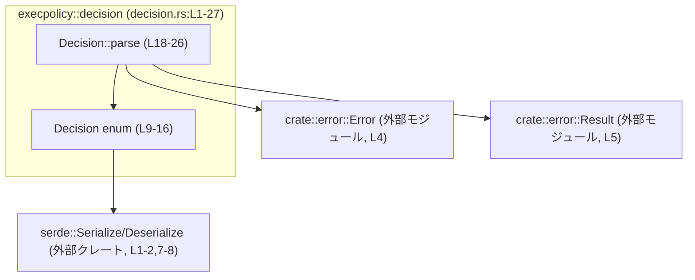
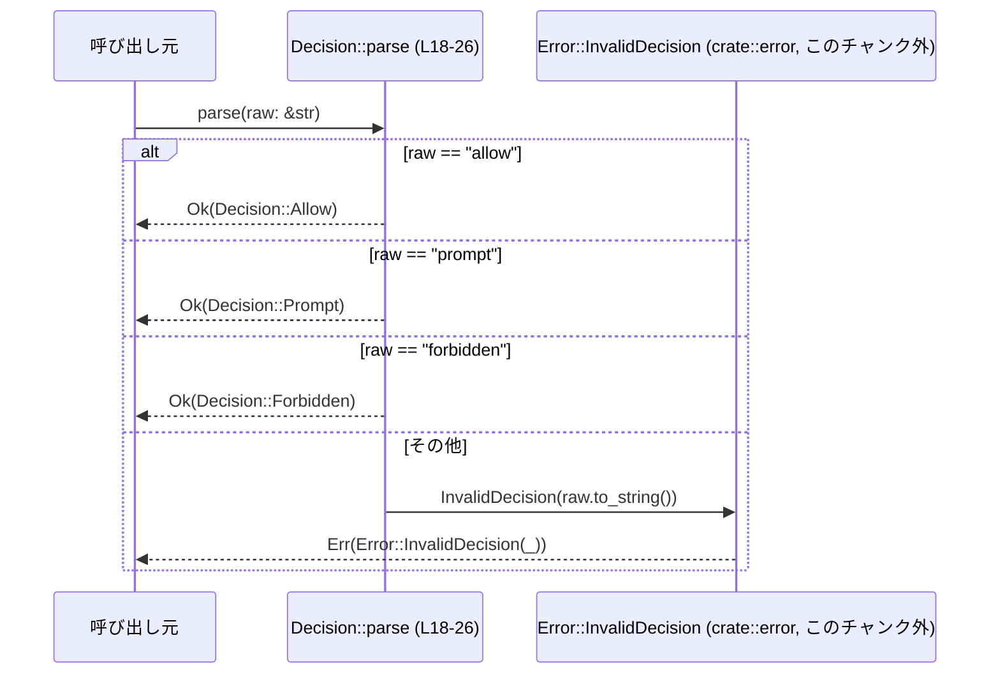

# execpolicy/src/decision.rs コード解説

## 0. ざっくり一言

このモジュールは、コマンド実行ポリシーを表す `Decision` 列挙体と、その文字列からのパース関数 `Decision::parse` を提供するモジュールです（`decision.rs:L7-16`, `decision.rs:L18-26`）。

---

## 1. このモジュールの役割

### 1.1 概要

- コマンドの実行可否ポリシーを **3 種類の状態（Allow / Prompt / Forbidden）** として表現します（`decision.rs:L9-15`）。
- 外部から与えられた文字列（設定値など）を `Decision` 型に変換するためのパーサ `Decision::parse` を提供します（`decision.rs:L18-26`）。
- 不正な文字列に対しては `Error::InvalidDecision` を返し、誤ったポリシーを黙って通さない設計になっています（`decision.rs:L24`）。

### 1.2 アーキテクチャ内での位置づけ

このモジュールは、エラー型モジュール `crate::error` とシリアライザ `serde` に依存しています（`decision.rs:L1-5`, `decision.rs:L7-8`）。



### 1.3 設計上のポイント

- **列挙体での厳密な状態表現**  
  実行ポリシーを `Allow` / `Prompt` / `Forbidden` の 3 値に限定し、他の値を型レベルで排除しています（`decision.rs:L9-15`）。
- **比較・順序付けが可能**  
  `Eq`, `PartialEq`, `Ord`, `PartialOrd` を derive しているため、等価比較やソートに利用できます（`decision.rs:L7`）。
- **コピー可能で軽量な値型**  
  `Clone`, `Copy` を derive しており、所有権を気にせずに値コピーが可能な小さな型として設計されています（`decision.rs:L7`）。
- **シリアライズ／デシリアライズ対応**  
  `Serialize`, `Deserialize` を derive し、`#[serde(rename_all = "camelCase")]` により JSON 等では `"allow"`, `"prompt"`, `"forbidden"` のような camelCase 文字列で表現されます（`decision.rs:L7-8`）。
- **パース時の明示的なエラー処理**  
  `Decision::parse` は `Result<Self>` を返し、未知の文字列は `Error::InvalidDecision` でエラーにします（`decision.rs:L19,L24`）。

---

## 2. 主要な機能一覧

- `Decision` 列挙体: コマンド実行ポリシーを 3 種の状態として表す（`decision.rs:L9-15`）。
- `Decision::parse(&str) -> Result<Decision>`: 文字列 `"allow"`, `"prompt"`, `"forbidden"` を `Decision` に変換し、それ以外はエラーにする（`decision.rs:L18-26`）。

---

## 3. 公開 API と詳細解説

### 3.1 型一覧（構造体・列挙体など）

| 名前       | 種別   | 役割 / 用途                                                                                 | 派生トレイト                                       | 定義位置              |
|------------|--------|----------------------------------------------------------------------------------------------|----------------------------------------------------|-----------------------|
| `Decision` | 列挙体 | コマンド実行に対する判断（即時許可 / ユーザ承認要求 / 完全拒否）を表現するための状態型です。 | `Clone`, `Copy`, `Debug`, `Eq`, `PartialEq`, `Ord`, `PartialOrd`, `Serialize`, `Deserialize` | `decision.rs:L7-16` |

- 列挙子の意味（コメントから読み取れる範囲）:
  - `Allow`: 追加の承認なしでコマンドを実行してよい（`decision.rs:L10-11`）。
  - `Prompt`: 明示的なユーザ承認が必要。`approval_policy="never"` の場合は即座に却下されることがコメントから読み取れます（`decision.rs:L12-13`）。
  - `Forbidden`: 追加検討なしにコマンドを拒否する（`decision.rs:L14-15`）。

### 3.2 関数詳細

#### `Decision::parse(raw: &str) -> Result<Self>`

**概要**

- 文字列 `raw` を `Decision` 列挙体に変換します（`decision.rs:L19-20`）。
- `"allow"`, `"prompt"`, `"forbidden"` の 3 つだけを受け付け、それ以外は `Error::InvalidDecision` を返します（`decision.rs:L21-24`）。

**引数**

| 引数名 | 型      | 説明                                                                                 |
|--------|---------|--------------------------------------------------------------------------------------|
| `raw`  | `&str`  | 実行ポリシーを表す文字列。期待される値は `"allow"`, `"prompt"`, `"forbidden"` です。 |

**戻り値**

- `Result<Self>`（`crate::error::Result` の別名である可能性がありますが、定義はこのチャンクには現れません。`decision.rs:L5,L19`）。
  - `Ok(Decision::Allow)` / `Ok(Decision::Prompt)` / `Ok(Decision::Forbidden)` のいずれか。
  - 文字列が不正な場合は `Err(Error::InvalidDecision(...))`（`decision.rs:L24`）。

**内部処理の流れ（アルゴリズム）**

1. `raw` の値に対して `match` を行います（`decision.rs:L20`）。
2. `raw == "allow"` の場合、`Decision::Allow` を返します（`decision.rs:L21`）。
3. `raw == "prompt"` の場合、`Decision::Prompt` を返します（`decision.rs:L22`）。
4. `raw == "forbidden"` の場合、`Decision::Forbidden` を返します（`decision.rs:L23`）。
5. それ以外の値の場合、`Error::InvalidDecision(raw.to_string())` を返します（`decision.rs:L24`）。

この関数は外部状態を一切参照せず、副作用のない純粋関数として振る舞います（`decision.rs:L19-25`）。

**使用例（正常系）**

```rust
use crate::decision::Decision;
use crate::error::Result; // 実際のパスはこのチャンクからは不明

fn main() -> Result<()> {
    // 設定などから読み込んだ文字列
    let policy_str = "prompt";

    // 文字列から Decision をパース
    let decision = Decision::parse(policy_str)?; // "prompt" なので Ok(Prompt) が返る

    // パース結果に応じた処理
    match decision {
        Decision::Allow => println!("そのまま実行します"),
        Decision::Prompt => println!("ユーザ承認を要求します"),
        Decision::Forbidden => println!("コマンドを拒否します"),
    }

    Ok(())
}
```

**使用例（エラー時）**

```rust
use crate::decision::Decision;

fn parse_or_fallback(raw: &str) -> Decision {
    match Decision::parse(raw) {
        Ok(d) => d,
        Err(e) => {
            eprintln!("不正な decision 値: {e}"); // Error が Display 実装済みであることが前提（このチャンクからは不明）
            // フォールバックポリシーとして Forbidden を選択
            Decision::Forbidden
        }
    }
}
```

**Errors / Panics**

- エラー条件（`Err`）:
  - `raw` が `"allow"`, `"prompt"`, `"forbidden"` のいずれでもない場合（`decision.rs:L21-24`）。
  - このとき `Error::InvalidDecision(raw.to_string())` が生成されます（`decision.rs:L24`）。
- パニック条件:
  - コード上、`panic!` や `unwrap` は使用されておらず、明示的なパニックはありません（`decision.rs:L19-26`）。
  - `to_string()` 自体は標準ライブラリの安全なメソッドであり、通常の使用ではパニックしません。

**Edge cases（エッジケース）**

- 空文字列 `""`:
  - どのパターンにもマッチしないため、`Error::InvalidDecision("".to_string())` になります（`decision.rs:L20,L24`）。
- 大文字・小文字の違い:
  - `"Allow"` や `"ALLOW"` は `"allow"` と一致しないため、エラーとなります。マッチ条件が完全一致であり、大文字小文字を変換していないためです（`decision.rs:L20-23`）。
- 前後に空白が含まれる場合:
  - `"allow "` や `" allow"` も `"allow"` と一致しないため、エラーとなります（`decision.rs:L20-23`）。
- 予期しない値:
  - 例えば `"ask"` や `"deny"` など任意の文字列はすべて `InvalidDecision` エラーになります（`decision.rs:L24`）。

**使用上の注意点**

- **受け付ける文字列は 3 種類のみ**  
  `"allow"`, `"prompt"`, `"forbidden"` 以外はすべてエラーになるため、入力値の事前バリデーションかエラー処理が必須です（`decision.rs:L21-24`）。
- **大小文字や空白は考慮されていない**  
  設定ファイルや CLI などの入力時に、ユーザが大文字で入力する可能性がある場合、呼び出し側で小文字化・トリム処理を行う必要があります。
- **並行性**  
  この関数は外部状態に依存せず、内部でミューテーションや共有資源のアクセスを行っていません（`decision.rs:L19-25`）。  
  そのため、スレッドや非同期タスクから同時に呼び出しても競合状態は発生しません（`&str` 引数とローカル値のみを扱うため）。
- **エラー型の扱い**  
  返される `Error::InvalidDecision` の詳細な構造や表示形式はこのチャンクには現れないため、文字列メッセージの形式などに依存したロジックは避けるのが安全です（`decision.rs:L4-5,L24`）。

### 3.3 その他の関数

このファイルには `Decision::parse` 以外の関数は定義されていません（`decision.rs:L18-26`）。

---

## 4. データフロー

ここでは、文字列から `Decision` を取得する典型的なフローを示します。

1. 呼び出し元が設定やユーザ入力から文字列 `raw` を取得します。
2. `Decision::parse(raw)` を呼び出します。
3. `parse` 内で `raw` に対して `match` が行われ、該当する `Decision` にマッピングされます。
4. マッチしなければ `Error::InvalidDecision` が返されます。



このフローから分かるように、`Decision::parse` は純粋に入力文字列だけに依存し、他のモジュールの状態を参照しないため、テストや再利用がしやすい構造になっています（`decision.rs:L19-25`）。

---

## 5. 使い方（How to Use）

### 5.1 基本的な使用方法

設定値から `Decision` を取得し、分岐に利用する基本パターンです。

```rust
use crate::decision::Decision;
use crate::error::Result; // 正確なパスはこのチャンクからは不明

fn run_with_policy(policy_str: &str) -> Result<()> {
    // 文字列を Decision に変換する
    let decision = Decision::parse(policy_str)?; // decision.rs:L19

    // Decision に応じて処理を分岐
    match decision {
        Decision::Allow => {
            // コマンドをそのまま実行する処理
        }
        Decision::Prompt => {
            // ユーザに確認ダイアログを出す処理
        }
        Decision::Forbidden => {
            // コマンド実行を拒否する処理
        }
    }

    Ok(())
}
```

### 5.2 よくある使用パターン

1. **設定値のパースとデフォルト適用**

```rust
use crate::decision::Decision;

fn parse_with_default(raw: &str) -> Decision {
    // 不正な値は Forbidden にフォールバック
    Decision::parse(raw).unwrap_or(Decision::Forbidden) // decision.rs:L19-24
}
```

1. **CLI 引数からのパース**

```rust
use crate::decision::Decision;
use std::env;

fn from_cli() -> Decision {
    let arg = env::args().nth(1).unwrap_or_else(|| "prompt".to_string());

    // 大文字小文字を許容したい場合はここで正規化
    let normalized = arg.to_ascii_lowercase(); // decision.rs にはないが、呼び出し側で補う例

    Decision::parse(&normalized).unwrap_or(Decision::Forbidden)
}
```

### 5.3 よくある間違い

```rust
use crate::decision::Decision;

// 間違い例: 大文字を渡してしまう
let d = Decision::parse("Allow"); // Err(Error::InvalidDecision(...)) になる（decision.rs:L21-24）

// 正しい例: 小文字に正規化してから渡す
let raw = "Allow";
let d = Decision::parse(&raw.to_ascii_lowercase()).unwrap();
```

```rust
use crate::decision::Decision;

// 間違い例: Result を無視してしまう（コンパイルエラーになるはずだが意図として）
let d = Decision::parse("allow"); // Result<Decision> をそのまま Decision として使おうとする

// 正しい例: ? や match でエラーを処理する
let d = Decision::parse("allow")?; // 上位関数が Result を返す場合
```

### 5.4 使用上の注意点（まとめ）

- 受け付ける文字列は `"allow"`, `"prompt"`, `"forbidden"` のみです（`decision.rs:L21-23`）。
- 大文字小文字や空白をユーザが自由に入力できる場合、呼び出し側で正規化（`trim`, `to_ascii_lowercase` 等）を行う必要があります。
- エラー時には `Error::InvalidDecision` が返されるため、ログ出力やユーザ向けエラーメッセージに利用できますが、そのメッセージ形式に依存したロジックは、このチャンクだけでは安全に書けません（`decision.rs:L24`）。
- 関数は純粋関数であり、スレッドセーフです（共有状態やミューテックスなどを一切使用していません。`decision.rs:L19-25`）。

---

## 6. 変更の仕方（How to Modify）

### 6.1 新しい機能を追加する場合

例: 新しいポリシー `Audit` を追加する場合。

1. **列挙体に新しいバリアントを追加**  
   `Decision` に `Audit` を追加します（`decision.rs:L9-15` 付近）。

   ```rust
   pub enum Decision {
       /// Command may run without further approval.
       Allow,
       /// Request explicit user approval; ...
       Prompt,
       /// Command is blocked without further consideration.
       Forbidden,
       /// Command is allowed but will be audited afterwards.
       Audit,
   }
   ```

2. **`parse` 関数に対応する文字列を追加**（`decision.rs:L20-24`）

   ```rust
   match raw {
       "allow" => Ok(Self::Allow),
       "prompt" => Ok(Self::Prompt),
       "forbidden" => Ok(Self::Forbidden),
       "audit" => Ok(Self::Audit),
       other => Err(Error::InvalidDecision(other.to_string())),
   }
   ```

3. **`serde` のシリアライズ形式**  
   `#[serde(rename_all = "camelCase")]` により、新バリアントは `"audit"` という文字列でシリアライズ／デシリアライズされます（`decision.rs:L7-8`）。  
   追加にあたって特別な設定は不要です。

4. **呼び出し側の分岐処理を更新**  
   `Decision` を `match` している箇所はすべて `Audit` を扱うように変更する必要があります（影響箇所はこのチャンクからは不明）。

### 6.2 既存の機能を変更する場合

- **受け付ける文字列の変更**  
  例えば `"allow"` を `"yes"` に変えたい場合、`parse` の `match` 条件を書き換える必要があります（`decision.rs:L21-23`）。  
  既存の設定値との互換性に影響するため、慎重な移行が必要です。
- **エラーの扱いを変える**  
  例えば不正値をエラーではなく `Forbidden` として扱うようにしたい場合、`other => Err(...)` を `other => Ok(Self::Forbidden)` に変更します（`decision.rs:L24`）。  
  これはセキュリティポリシー上の重要な変更になる可能性があるため、仕様として明示する必要があります。
- **Error 型の変更**  
  `Error::InvalidDecision` のペイロード構造を変える場合は `crate::error` モジュール側の変更になります。このファイルからはその詳細は分かりません（`decision.rs:L4-5,L24`）。

---

## 7. 関連ファイル

| パス / モジュール      | 役割 / 関係                                                                                 |
|------------------------|--------------------------------------------------------------------------------------------|
| `crate::error`         | `Error` 型および `Result` 型を提供するモジュール。`Decision::parse` のエラー型として使用されます（`decision.rs:L4-5,L24`）。 |
| `serde` クレート       | `Serialize`, `Deserialize` トレイトを提供し、`Decision` をシリアライズ／デシリアライズ可能にします（`decision.rs:L1-2,L7`）。 |

※ `crate::error` がどのファイル（例: `src/error.rs`）に定義されているかは、このチャンクには現れません。

---

## 付録: バグ・セキュリティ・テスト・性能に関する観点（このチャンクから読み取れる範囲）

- **潜在的なバグ要因**
  - 仕様として大文字や余計な空白を許容しないため、呼び出し側が入力を正規化していない場合に予期せぬエラーが増える可能性があります（`decision.rs:L20-23`）。
- **セキュリティ上の観点**
  - 不正な値を「許可」ではなくエラーとして扱うため、安全側に倒した設計です（`decision.rs:L24`）。
  - フォールバックを呼び出し側で `Forbidden` にするか `Allow` にするかは、セキュリティポリシーに大きく影響します。このファイルはその決定を呼び出し側に委ねています。
- **テスト**
  - このチャンクにはテストコードは含まれていません（`decision.rs:L1-27`）。
  - 単体テストでは少なくとも以下のケースをカバーするのが自然です:
    - `"allow"`, `"prompt"`, `"forbidden"` それぞれが期待どおりの `Decision` になること。
    - 不正値や空文字、大小文字違いが `InvalidDecision` になること。
- **性能・スケーラビリティ**
  - `match` 文と短い文字列比較のみで構成されており、実行コストは非常に小さいです（`decision.rs:L20-24`）。
  - `to_string()` による一度のヒープ確保（おそらく）はありますが、通常の使用では無視できる程度です（`decision.rs:L24`）。
- **監視・ログ**
  - このファイルにはログ出力は含まれていません（`decision.rs:L1-27`）。
  - 不正値が渡された頻度を把握したい場合は、呼び出し側で `Error::InvalidDecision` をログに出す実装を行う必要があります。
