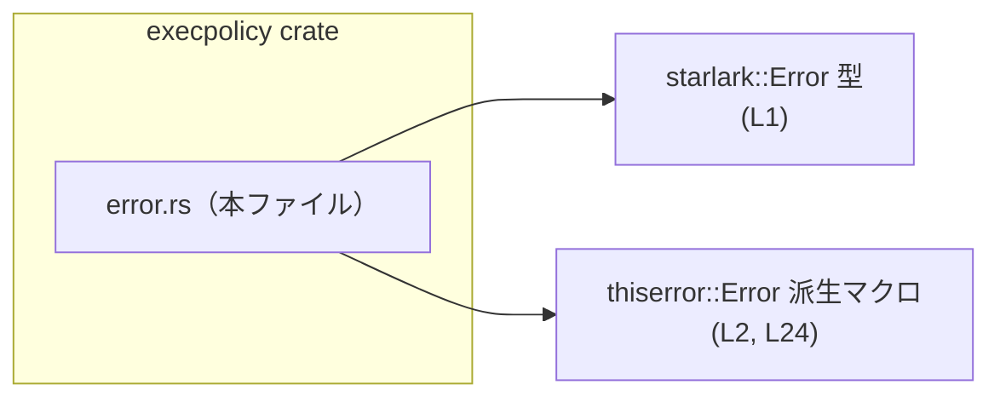
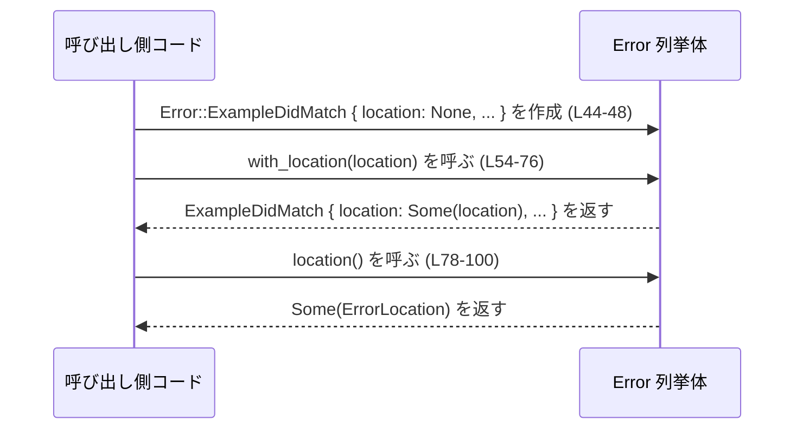
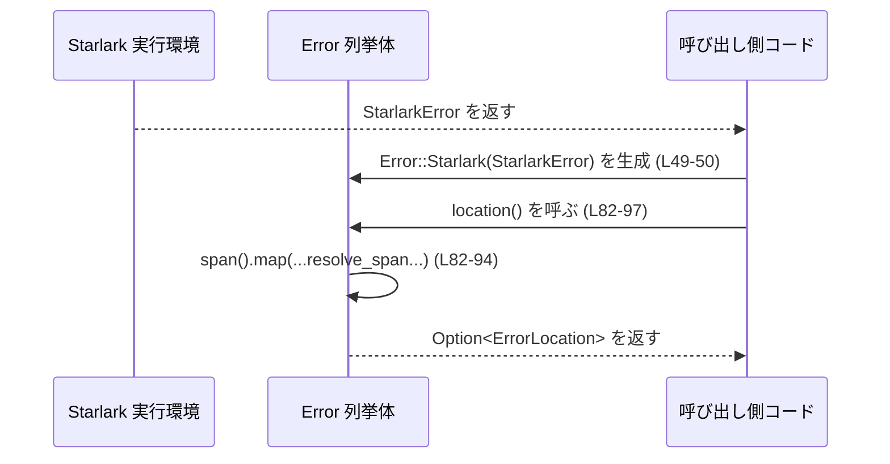

# execpolicy/src/error.rs

---

## 0. ざっくり一言

`execpolicy/src/error.rs` は、クレート全体で使うエラー型と、そのエラーがどのファイルのどの位置で発生したかを示すソースコード位置情報を定義するモジュールです（根拠: `error.rs:L4-22, L24-51`）。

---

## 1. このモジュールの役割

### 1.1 概要

- このモジュールは、ポリシー評価や例示（examples）の検証処理などで発生する **ドメイン固有エラー** と、Starlark 実行時エラーをひとつの `Error` 列挙体に集約するために存在します（根拠: `error.rs:L24-50`）。
- また、エラーの発生箇所を `path`（ファイル名）と `line`/`column` で表す `ErrorLocation` および関連する位置情報型を提供します（根拠: `error.rs:L18-22, L6-16`）。
- `pub type Result<T>` を定義し、このモジュールの `Error` を返す結果型を統一する役割も持っています（根拠: `error.rs:L4`）。

### 1.2 アーキテクチャ内での位置づけ

このモジュールは、外部クレートとして `starlark` と `thiserror` に依存しています（根拠: `error.rs:L1-2`）。  
同一クレート内の他モジュールからの利用状況は、このチャンクには現れません。



### 1.3 設計上のポイント

- **エラー型の一本化**  
  - ドメインエラー（Invalid〜, Example〜）と `StarlarkError` を `enum Error` でまとめています（根拠: `error.rs:L24-50`）。
- **位置情報の分離と再利用**  
  - テキスト位置を `TextPosition`（行/列）と `TextRange`（開始/終了）で分割し、`ErrorLocation` がそれらを組み合わせて保持する構造になっています（根拠: `error.rs:L6-22`）。
- **後付けでの位置付与**  
  - 既に生成されたエラーに対して、あとから `ErrorLocation` を付与する `with_location` メソッドを提供します（根拠: `error.rs:L53-76`）。
- **Starlark との連携**  
  - `Error::Starlark` から `span()` を通じて位置情報を抽出し、共通の `ErrorLocation` に変換します（根拠: `error.rs:L49-50, L82-97`）。
- **状態を持たない設計**  
  - すべての型はイミュータブルなデータを持つだけであり、グローバルな状態や内部可変性はありません（構造体・enum いずれも `pub` フィールドのみ、`Cell` などは存在しないため／根拠: `error.rs:L6-51`）。

---

## 2. 主要な機能一覧

- エイリアス `Result<T>`: このモジュールの `Error` を利用するための共通 `Result` 型定義（根拠: `error.rs:L4`）。
- `TextPosition`: 行番号と列番号を保持するテキスト上の 1 点位置表現（根拠: `error.rs:L6-10`）。
- `TextRange`: 開始・終了位置の組として表現するテキスト範囲（根拠: `error.rs:L12-16`）。
- `ErrorLocation`: ファイルパスとテキスト範囲を持つエラー発生位置情報（根拠: `error.rs:L18-22`）。
- `Error` enum: ドメインエラーおよび Starlark エラーを表現する中心的なエラー型（根拠: `error.rs:L24-50`）。
- `Error::with_location`: Example 系エラーに対して、位置情報を「なければ付ける」メソッド（根拠: `error.rs:L53-76`）。
- `Error::location`: `Error` から `ErrorLocation` を取得するための共通インターフェース（根拠: `error.rs:L78-100`）。

---

## 3. 公開 API と詳細解説

### 3.1 型一覧（構造体・列挙体・型エイリアス）

| 名前 | 種別 | 役割 / 用途 | 定義位置 |
|------|------|-------------|----------|
| `Result<T>` | 型エイリアス | `std::result::Result<T, Error>` の短縮記法。モジュール内外で、このエラー型を使う関数の戻り値として利用する。 | `error.rs:L4` |
| `TextPosition` | 構造体 | テキスト中の 1 つの位置を `line` / `column` で表現する。0 以上の行・列番号を格納するための単純なコンテナ。 | `error.rs:L6-10` |
| `TextRange` | 構造体 | テキスト中の範囲を `start` / `end`（いずれも `TextPosition`）の組として表現する。 | `error.rs:L12-16` |
| `ErrorLocation` | 構造体 | エラーの発生箇所をファイルパス文字列とテキスト範囲で保持する。主にエラーメッセージの位置情報として利用される。 | `error.rs:L18-22` |
| `Error` | 列挙体 | ドメインエラー（Invalid〜, Example〜）と Starlark 実行エラーを表現する中心的なエラー型。`thiserror::Error` により `Display`/`Error` が自動実装される。 | `error.rs:L24-50` |

`TextPosition` と `TextRange` は `Copy` 可能ですが、`ErrorLocation` は `String` を含むため `Copy` ではなく `Clone` のみ実装されています（根拠: `error.rs:L6-19`）。

---

### 3.2 関数詳細

このモジュールに公開されている主なメソッドは、`Error` 型に対する以下の 2 つです。

#### `Error::with_location(self, location: ErrorLocation) -> Self`

**概要**

- `ExampleDidNotMatch` / `ExampleDidMatch` 変種のエラーに対して、まだ位置情報が付与されていない場合に `ErrorLocation` を付加します（根拠: `error.rs:L54-73`）。
- それ以外の変種、あるいはすでに `location: Some(..)` を持つ場合は、元のエラー値をそのまま返します（根拠: `error.rs:L74-75`）。

**引数**

| 引数名 | 型 | 説明 |
|--------|----|------|
| `self` | `Error` | 位置を付加する対象のエラー値。所有権ごと受け取ります。 |
| `location` | `ErrorLocation` | 付加したい位置情報。 |

**戻り値**

- `Self`（`Error`）  
  - 対象が `ExampleDidNotMatch` か `ExampleDidMatch` で、かつ `location` フィールドが `None` であれば、`Some(location)` を設定した新しいエラー値を返します（根拠: `error.rs:L56-63, L65-73`）。
  - それ以外の場合は `self` を変更せずに返します（根拠: `error.rs:L74-75`）。

**内部処理の流れ**

1. `match self` で変種ごとに分岐します（根拠: `error.rs:L55`）。
2. `ExampleDidNotMatch { rules, examples, location: None }` の場合  
   - `rules` / `examples` をムーブし、`location: Some(location)` に設定した新しい `ExampleDidNotMatch` を生成します（根拠: `error.rs:L56-63`）。
3. `ExampleDidMatch { rule, example, location: None }` の場合  
   - `rule` / `example` をムーブし、`location: Some(location)` に設定した新しい `ExampleDidMatch` を生成します（根拠: `error.rs:L65-73`）。
4. それ以外のすべてのパターンでは `other => other` によって元の値をそのまま返します（根拠: `error.rs:L74-75`）。

**Examples（使用例）**

`ExampleDidNotMatch` に後付けで位置情報を付与する例です。同一モジュール内のコードとしてコンパイル可能です。

```rust
// エラー内容のみが分かっている段階でエラーを作成する
let err = Error::ExampleDidNotMatch {
    rules: vec!["rule1".to_string()],                   // 適用を期待したルール名
    examples: vec!["input_example".to_string()],        // 対象となる入力例
    location: None,                                     // まだ位置情報は不明
};

// 後段の処理で位置情報が判明したとする
let loc = ErrorLocation {
    path: "policy.star".to_string(),                    // ファイル名
    range: TextRange {
        start: TextPosition { line: 10, column: 5 },    // 1-origin を想定した位置
        end: TextPosition { line: 10, column: 20 },
    },
};

// with_location を使って、location が None の場合のみ位置を付加する
let err_with_loc = err.with_location(loc);
```

**Errors / Panics**

- このメソッド内ではパニックを発生させるような呼び出し（`unwrap` など）は行っていません（根拠: `error.rs:L54-76`）。
- エラー型を変換しているだけであり、I/O や外部依存呼び出しもありません。

**Edge cases（エッジケース）**

- すでに `location: Some(..)` が設定されている `ExampleDidNotMatch` / `ExampleDidMatch` に対して呼び出した場合  
  - `match` のパターンから外れるため `other => other` としてそのまま返されます。新しい `location` で上書きはされません（根拠: `error.rs:L56-60, L65-69, L74-75`）。
- `InvalidDecision` / `InvalidPattern` / `InvalidExample` / `InvalidRule` / `Starlark` 変種に対して呼び出した場合  
  - いずれも `other` としてマッチし、そのまま返されます（根拠: `error.rs:L24-50, L74-75`）。

**使用上の注意点**

- 位置情報の「上書き」は行いません。外部で上書きしたい場合は、元エラーから必要なフィールドを再構築する必要があります。
- 所有権をムーブする設計のため、`err.with_location(loc)` を呼んだあとは元の `err` は使用できません（Rust の所有権ルールによる）。

---

#### `Error::location(&self) -> Option<ErrorLocation>`

**概要**

- `Error` 値から、可能であれば `ErrorLocation` を取り出します（根拠: `error.rs:L78-99`）。
- `ExampleDidNotMatch` / `ExampleDidMatch` の `location` フィールドや、`StarlarkError` に保持されている span から位置情報を抽出します。

**引数**

| 引数名 | 型 | 説明 |
|--------|----|------|
| `&self` | `&Error` | 位置情報を取得したいエラー値への参照。 |

**戻り値**

- `Option<ErrorLocation>`  
  - 位置情報が利用可能な場合は `Some(ErrorLocation)`、そうでなければ `None` を返します（根拠: `error.rs:L80-82, L82-98`）。

**内部処理の流れ**

1. `match self` により変種ごとに分岐します（根拠: `error.rs:L79`）。
2. `ExampleDidNotMatch` / `ExampleDidMatch`  
   - 構造体パターンで `location` を取り出し、`location.clone()` を返します（根拠: `error.rs:L80-81`）。
3. `Starlark(err)`  
   - `err.span()` を呼び出し、`Option` として span を取得します（根拠: `error.rs:L82`）。
   - `map` で `span` を `ErrorLocation` に変換します（根拠: `error.rs:L82-97`）。
     - `let resolved = span.resolve_span();` により、`begin` / `end` の位置を得ます（根拠: `error.rs:L83`）。
     - `span.filename().to_string()` を `path` として保存します（根拠: `error.rs:L85`）。
     - `resolved.begin` / `resolved.end` の `line` / `column` に `+ 1` した値を `TextPosition` に格納し、1-origin の表示向け位置情報に変換します（根拠: `error.rs:L87-94`）。
4. それ以外の変種  
   - `_ => None` として位置情報はないものと扱います（根拠: `error.rs:L98-99`）。

**Examples（使用例）**

Example 系エラーから位置情報を取得する例です。

```rust
// すでに位置情報付きで作成されたエラー
let err = Error::ExampleDidMatch {
    rule: "rule1".to_string(),
    example: "input_example".to_string(),
    location: Some(ErrorLocation {
        path: "policy.star".to_string(),
        range: TextRange {
            start: TextPosition { line: 10, column: 5 },
            end: TextPosition { line: 10, column: 20 },
        },
    }),
};

// location() を使って位置情報を取り出す
if let Some(loc) = err.location() {
    println!("path: {}", loc.path);
    println!(
        "range: {}:{} - {}:{}",
        loc.range.start.line,
        loc.range.start.column,
        loc.range.end.line,
        loc.range.end.column
    );
}
```

Starlark 由来のエラーから位置を取得する例（疑似コード）:

```rust
// starlark_error はどこかで生成された StarlarkError とする
let starlark_error: StarlarkError = /* ... */;

// Error 型に包む
let err = Error::Starlark(starlark_error);

// span() が Some を返す場合は、location() から ErrorLocation を得られる
if let Some(loc) = err.location() {
    eprintln!("Starlark error at {}:{}",
        loc.path,
        loc.range.start.line,
    );
}
```

**Errors / Panics**

- `location()` 内にはパニックを引き起こす操作（`unwrap` 等）は含まれていません（根拠: `error.rs:L78-100`）。
- `StarlarkError::span()` が `None` を返す場合でも、`map` の前段で `Option` を扱っているためパニックにはなりません。

**Edge cases（エッジケース）**

- `ExampleDidNotMatch` / `ExampleDidMatch` の `location` が `None` の場合  
  - `clone()` により `None` がそのまま返されます（戻り値は `None`）（根拠: `error.rs:L80-81`）。
- `Starlark` 変種で、`err.span()` が `None` を返す場合  
  - `map` が実行されず、そのまま `None` が返ります（根拠: `error.rs:L82-83`）。
- `InvalidDecision` / `InvalidPattern` / `InvalidExample` / `InvalidRule` 変種  
  - すべて `_ => None` ブランチに入り、必ず `None` が返ります（根拠: `error.rs:L26-33, L98-99`）。
- `ErrorLocation` の `line` / `column` 値は Starlark の `span` 情報に `+1` した値です。  
  - Starlark 側が 0-origin を返し、このメソッドは 1-origin の人間向け表示に変換していると推測できますが、仕様の詳細はこのチャンクには現れません（根拠: `error.rs:L87-94`）。

**使用上の注意点**

- 戻り値が `Option` であるため、常に `Some` が返るとは限りません。`match` または `if let` で `None` ケースを考慮する必要があります。
- `ExampleDid〜` 変種では `location.clone()` を行うため、`ErrorLocation` のコピーコスト（`String` のクローン）が発生します（根拠: `error.rs:L18-21, L80-81`）。頻繁な呼び出しがある場合のパフォーマンスに注意が必要です。

---

### 3.3 その他の関数

このファイルには、上記 2 つ以外の関数・メソッド定義はありません（根拠: `error.rs:L1-101`）。

---

## 4. データフロー

ここでは、代表的な処理シナリオとして「ドメインエラー生成 → 位置情報付与 → 位置情報取得」の流れを示します。

### 4.1 概要

1. ルールと例とのマッチング結果から `Error::ExampleDidMatch` や `Error::ExampleDidNotMatch` が生成される（本ファイルには生成箇所は現れませんが、変種定義からその用途が読み取れます／根拠: `error.rs:L38-48`）。
2. 後続の処理で `ErrorLocation` が判明した場合、`with_location` によりエラーに位置情報を付加します（根拠: `error.rs:L54-73`）。
3. 呼び出し側は、最終的なエラー値に対して `location()` を呼び、UI やログに位置情報を表示します（根拠: `error.rs:L78-100`）。

### 4.2 シーケンス図



Starlark エラーの流れは次のようになります。



---

## 5. 使い方（How to Use）

### 5.1 基本的な使用方法

同一ファイル内で `Result<T>` エイリアスと `Error` を利用する基本例です。

```rust
// このファイルの末尾などに想定される関数
fn validate_rule_example() -> Result<()> {                // error.rs:L4 の Result を使用
    let rule = "rule1".to_string();
    let example = "bad_input".to_string();

    // 何らかの検証ロジックの結果、例がルールにマッチしてしまったとする
    let err = Error::ExampleDidMatch {                    // L44-48
        rule,
        example,
        location: None,                                   // ここではまだ位置不明
    };

    // パーサー等から位置情報が得られているとする
    let loc = ErrorLocation {                             // L18-22
        path: "policy.star".to_string(),
        range: TextRange {                                // L12-16
            start: TextPosition { line: 5, column: 1 },   // L6-10
            end: TextPosition { line: 5, column: 20 },
        },
    };

    // 位置情報付きのエラーにして返す
    Err(err.with_location(loc))                           // L54-73
}
```

このように、検証系の関数は `Result<T>` を戻り値として使うことで、クレート全体で `Error` 型を統一できます。

### 5.2 よくある使用パターン

1. **例ごとに位置情報を付けるパターン**

```rust
fn check_examples() -> Result<()> {
    for (idx, example) in ["ex1", "ex2"].iter().enumerate() {
        // マッチしなかった例を検出したとする
        let err = Error::ExampleDidNotMatch {             // L38-42
            rules: vec!["rule1".to_string()],
            examples: vec![example.to_string()],
            location: None,
        };

        // 行番号として enumerate の値を利用（1-origin にする）
        let loc = ErrorLocation {
            path: "policy.star".to_string(),
            range: TextRange {
                start: TextPosition { line: idx + 1, column: 1 },
                end: TextPosition { line: idx + 1, column: 1 },
            },
        };

        return Err(err.with_location(loc));
    }

    Ok(())
}
```

1. **エラー表示時に位置情報を利用するパターン**

```rust
fn report_error(err: &Error) {
    eprintln!("{}", err);                                 // thiserror::Error による Display (L24)

    if let Some(loc) = err.location() {                   // L78-81
        eprintln!(
            "at {}:{}:{}-{}:{}",
            loc.path,
            loc.range.start.line,
            loc.range.start.column,
            loc.range.end.line,
            loc.range.end.column,
        );
    }
}
```

### 5.3 よくある間違い

**誤り例: `with_location` で位置情報を上書きできると期待する**

```rust
// すでに location: Some(..) 付きのエラー
let err = Error::ExampleDidMatch {
    rule: "rule1".to_string(),
    example: "ex".to_string(),
    location: Some(old_loc),
};

// 間違い: with_location で位置情報が new_loc に置き換わると期待している
let err2 = err.with_location(new_loc);  // 実際には old_loc のまま
```

**正しい理解**

```rust
// with_location は location: None の場合にのみ付与する
// 上書きしたい場合は、自分で新しい Error を組み立てる必要がある
let err2 = Error::ExampleDidMatch {
    rule: "rule1".to_string(),
    example: "ex".to_string(),
    location: Some(new_loc),
};
```

理由: `with_location` は `location: None` を持つパターンにだけマッチし、それ以外は `other => other` としてそのまま返す実装のためです（根拠: `error.rs:L56-60, L65-69, L74-75`）。

### 5.4 使用上の注意点（まとめ）

- `Error::location()` の戻り値は必ずしも `Some` ではありません。位置情報のないエラーもあり得るため、呼び出し側で `None` を扱う必要があります（根拠: `error.rs:L78-81, L98-99`）。
- `ErrorLocation` は `Clone` ですが `Copy` ではないため、`location()` は `clone()` を行います。多数のエラーに対して頻繁に呼び出すときは、コストに注意が必要です（根拠: `error.rs:L18-21, L80-81`）。
- このモジュールはスレッドセーフかどうかを直接示す属性は持ちません。`Error` が `Send`/`Sync` かどうかは、内部の `String`, `Vec<String>`, `StarlarkError` の実装に依存し、このチャンクからは判断できません。

---

## 6. 変更の仕方（How to Modify）

### 6.1 新しい機能を追加する場合

1. **新しいエラー種別を追加する**  
   - 新たなドメインエラーが必要な場合は、`enum Error` に変種を追加します（根拠: `error.rs:L24-50`）。
   - 必要なら `#[error("...")]` 属性でエラーメッセージを定義します（`thiserror::Error` によるフォーマット）。

2. **位置情報を持つ新しい変種を追加する**  
   - 位置情報を付与したい場合は、`location: Option<ErrorLocation>` フィールドを持たせると、既存の `with_location` / `location` の設計に近い形で扱えます。
   - ただし、現状の `with_location` / `location` は `ExampleDid〜` と `Starlark` だけを扱っているため、新変種にも対応させる場合は `match` 文に分岐を追加する必要があります（根拠: `error.rs:L56-63, L65-73, L80-82`）。

3. **Starlark 以外の外部エラーを統合する**  
   - 追加で別のエラー型を統合したい場合は、`Error` に新変種を追加し、必要に応じて `location()` で位置情報に変換するロジックを実装します。

### 6.2 既存の機能を変更する場合

- `with_location` の挙動を変更する場合
  - 位置情報の上書きを許可するなど、既存コードの前提が変わる可能性があります。`with_location` を呼び出している箇所をすべて検索し、「既に位置情報が付いている場合の挙動」に依存していないか確認する必要があります（呼び出し箇所はこのチャンクには現れません）。
- `location()` の返り値仕様を変更する場合
  - 現状 `None` を返し得ることが API として想定されているため、常に `Some` を返すような変更は互換性問題を生む可能性があります。
  - 特にログ・UI 表示で `None` ケースを想定しているコードへの影響を確認する必要があります。

---

## 7. 関連ファイル

このチャンクから直接参照できるのは外部クレートのみです。同一クレート内の他ファイルとの関係は、このチャンクには現れません。

| パス / クレート | 役割 / 関係 |
|-----------------|------------|
| `starlark::Error` | Starlark スクリプト評価時のエラー型。`Error::Starlark` 変種としてラップされ、`location()` 内で `span()` を通じて位置情報を抽出する対象となる（根拠: `error.rs:L1, L49-50, L82-97`）。 |
| `thiserror::Error` | `Error` 列挙体に対して `std::error::Error` と `Display` 実装を自動導出するための derive マクロ（根拠: `error.rs:L2, L24`）。 |

テストコードやこの `Error` 型を利用している他モジュール（例: ポリシー評価ロジックなど）のファイルパスは、このチャンクには現れません。
