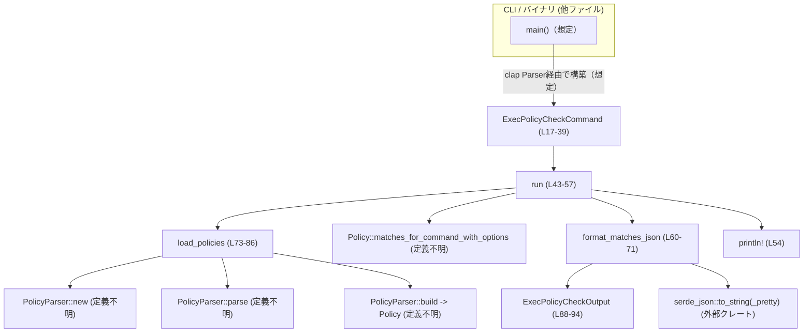
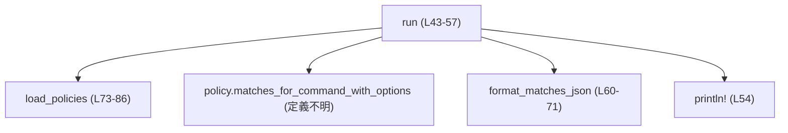
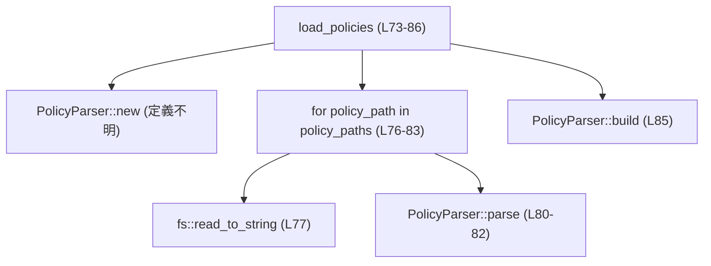

# execpolicy/src/execpolicycheck.rs コード解説

## 0. ざっくり一言

`execpolicycheck.rs` は、**execpolicy ルールファイル群に対してコマンドラインで渡されたコマンドを評価し、その結果を JSON として出力する CLI サブコマンド実装**です（`ExecPolicyCheckCommand` と補助関数群）。  
ポリシーファイルの読み込み → コマンド評価 → JSON 整形までを一連で行います。

---

## 1. このモジュールの役割

### 1.1 概要

このモジュールは次の問題を扱います。

> 「一つ以上の execpolicy ファイルに対して、あるコマンド（トークン列）がどのルールにマッチし、最終的な決定（Decision）がどうなるかを機械可読な JSON で得たい」

それに対し、以下の機能を提供します（根拠: `execpolicycheck.rs:L15-57, L60-71, L73-86, L88-94`）。

- CLI 引数として受け取った **ポリシーファイル群の読み込みとパース**（`load_policies`）
- ポリシーに対する **コマンド評価** の起点（`ExecPolicyCheckCommand::run` から `Policy::matches_for_command_with_options` を呼び出し）
- マッチしたルール集合と決定を **JSON へシリアライズ**（`format_matches_json` と `ExecPolicyCheckOutput`）

### 1.2 アーキテクチャ内での位置づけ

このファイル内のコンポーネントと、他の（このチャンクには定義されない）コンポーネントとの関係を簡略化して表します。



※ `PolicyParser`, `Policy`, `RuleMatch`, `Decision` は `crate::...` からインポートされていますが、このチャンクには定義が現れません（`execpolicycheck.rs:L9-13`）。

### 1.3 設計上のポイント

コードから読み取れる設計上の特徴です。

- **CLI 指向の構造**  
  - `ExecPolicyCheckCommand` は `clap::Parser` を derive しており（`L16`）、CLI サブコマンド引数の束ね役になっています。
- **ステートレスな処理フロー**  
  - `run`, `format_matches_json`, `load_policies` はすべて呼び出しごとに必要なオブジェクトを作成し、グローバルな可変状態を持ちません（`L43-57, L60-71, L73-86`）。
- **エラー処理は `anyhow::Result` で統一**  
  - 3 つの公開関数はすべて `anyhow::Result` を返し、`?` と `with_context` による詳細なエラーコンテキスト付与を行います（`L4-5, L43-44, L53, L60, L67-70, L73-78, L81-82`）。
- **データ表現と JSON 出力の分離**  
  - 出力用の構造体 `ExecPolicyCheckOutput` を別途定義し、そこに `Serialize` を実装することで、ポリシー評価ロジックと JSON フォーマットを分離しています（`L88-94`）。
- **同期的・ブロッキング I/O**  
  - `std::fs::read_to_string` を使用しており、ポリシーファイル読み込みは同期的なブロッキング I/O です（`L77`）。

---

## 2. 主要な機能一覧

このモジュールが提供する主な機能は次のとおりです。

- `ExecPolicyCheckCommand`:  
  CLI 引数（ポリシーファイルパス、評価対象コマンド、オプション）を保持し、`run` で評価を実行するコンテナ（`L15-39, L41-57`）。
- `ExecPolicyCheckCommand::run`:  
  ポリシー読み込み → コマンド評価 → JSON 出力までを一括で行うメインエントリ（`L43-57`）。
- `load_policies`:  
  指定されたパスのポリシーファイルをすべて読み込み、`PolicyParser` でパース・統合して単一の `Policy` を構築する（`L73-86`）。
- `format_matches_json`:  
  `RuleMatch` のスライスと `Decision` を `ExecPolicyCheckOutput` にまとめ、JSON 文字列へシリアライズする（`L60-71, L88-94`）。

---

## 3. 公開 API と詳細解説

### 3.1 型一覧（構造体・列挙体など）

このファイルで定義される型と、その役割・位置をまとめます。

| 名前 | 種別 | 公開範囲 | 役割 / 用途 | 定義位置（根拠） |
|------|------|----------|-------------|------------------|
| `ExecPolicyCheckCommand` | 構造体 | `pub` | CLI サブコマンドの引数集合。ポリシーファイルパス、フラグ、評価対象コマンドを保持する。 | `execpolicycheck.rs:L17-39` |
| `ExecPolicyCheckOutput<'a>` | 構造体 | モジュール内（非 `pub`） | JSON 出力用の内部表現。マッチしたルール群（借用）と最終 `Decision` を包含する。`Serialize` を実装し、フィールド名を camelCase に変更。 | `execpolicycheck.rs:L88-94` |

※ 以下の型はこのファイルでは **インポートのみ** で、定義は他ファイルにあります（定義ファイルはこのチャンクからは特定できません）。

| 名前 | 種別 | 備考 / 用途 | インポート位置 |
|------|------|-------------|----------------|
| `Decision` | 不明（おそらく列挙体） | ルールマッチの結果を表す決定。`ExecPolicyCheckOutput::decision` の型。`Iterator::max` で使用されるので `Ord` を実装している必要がある。 | `L9` |
| `MatchOptions` | 構造体（推測） | `matches_for_command_with_options` に渡すオプション。ここでは `resolve_host_executables` のみ設定。 | `L10, L48-50` |
| `Policy` | 構造体（推測） | ポリシールール集合。`load_policies` の戻り値。`matches_for_command_with_options` メソッドを持つ。 | `L11, L44-51, L73-86` |
| `PolicyParser` | 構造体（推測） | ポリシーファイルを読み込んで `Policy` を構築するビルダー。`new`, `parse`, `build` を提供。 | `L12, L73-85` |
| `RuleMatch` | 構造体（推測） | 個々のルールマッチを表す。`RuleMatch::decision` メソッドでその決定を取得。 | `L13, L60-64` |

### 3.2 関数詳細

#### `ExecPolicyCheckCommand::run(&self) -> Result<()>`

**概要**

- `ExecPolicyCheckCommand` に格納された設定に基づき、ポリシーファイルを読み込み、コマンドを評価し、その結果を JSON として標準出力に書き出します（`L43-57`）。

**引数**

メソッドなので、引数は `&self` のみです。

| 引数名 | 型 | 説明 |
|--------|----|------|
| `self` | `&ExecPolicyCheckCommand` | CLI で渡されたポリシーファイルパス (`rules`)、フラグ (`pretty`, `resolve_host_executables`)、評価対象コマンド (`command`) を含むインスタンス |

**戻り値**

- `Result<()>` (`anyhow::Result<()>`)  
  - 成功時: `Ok(())`。標準出力に JSON が 1 行（または整形された複数行）出力されます（`L53-55`）。  
  - 失敗時: `Err(anyhow::Error)`。ポリシー読み込み・解析・JSON シリアライズ等のエラーが含まれます。

**内部処理の流れ**

1. `load_policies(&self.rules)` を呼び出し、ポリシーファイル群から `Policy` を構築します（`L44`）。  
   - 読み込み・パースエラーがあれば `?` により即座に `Err` を返します。
2. 構築した `policy` に対し、`policy.matches_for_command_with_options(...)` を呼び、`self.command` に対するルールマッチ一覧 `matched_rules` を取得します（`L45-51`）。
   - `MatchOptions` には `resolve_host_executables: self.resolve_host_executables` を設定しています（`L48-50`）。
   - `heuristics_fallback` 引数には `None` を渡しています（`L47`）。挙動の詳細は他ファイルに依存し、このチャンクからは分かりません。
3. `format_matches_json(&matched_rules, self.pretty)` を呼び出して、`matched_rules` と最終 `Decision` を JSON 文字列へ変換します（`L53`）。
4. 得られた JSON を `println!("{json}")` で標準出力へ書き出します（`L54`）。
5. `Ok(())` を返して終了します（`L56`）。

**簡易フローチャート**



**Examples（使用例）**

`clap` の `Parser` derive を前提とした典型的な CLI エントリポイントの例です。

```rust
use clap::Parser; // ExecPolicyCheckCommand が Parser を derive しているため必要 // L6, L16
use execpolicy::execpolicycheck::ExecPolicyCheckCommand; // モジュールパスは例示

fn main() -> anyhow::Result<()> {
    // CLI 引数から構造体を生成（clap の一般的な使い方）
    let cmd = ExecPolicyCheckCommand::parse(); // 生成される関連関数であることが多いが、このファイルには定義は現れない
    
    // ポリシーを読み込み、コマンドを評価し、結果 JSON を標準出力に出す
    cmd.run() // Result<()> を返すので、? で伝播可能
}
```

**Errors / Panics**

- `load_policies` からのエラー（`fs::read_to_string`, `PolicyParser::parse`, `PolicyParser::build` 等）をそのまま `?` で伝播します（`L44`）。
- `format_matches_json` からのエラー（`serde_json::to_string(_pretty)` の失敗）も `?` で伝播します（`L53`）。
- `println!` 自体は I/O エラーで panic する可能性がありますが、このコードでは戻り値を見ておらず、標準的な `println!` の挙動に依存しています（`L54`）。  
  → 通常は OS が異常な状況（例: stdout がクローズされている）でない限り panic しません。
- 明示的な `panic!` 呼び出しはありません。

**Edge cases（エッジケース）**

- `rules` が空の場合  
  - `load_policies` のループが一度も実行されず、`PolicyParser::build()` の挙動に依存します（`L73-86`）。この結果が有効な `Policy` かどうかは他ファイルからしか分かりません。
  - CLI からは `rules` 引数が `required = true` のため、通常は空にならない設計です（`L19`）。
- `command` が空の場合  
  - CLI 的には `required = true` なので、少なくとも 1 トークンは渡される前提です（`L31-38`）。  
  - 構造体をプログラム側で直接構築した場合に空を渡すことは可能ですが、その時の `matches_for_command_with_options` の挙動はこのチャンクからは不明です。
- `matched_rules` が空の場合  
  - `format_matches_json` 内で `decision: None` となり、JSON に `decision` フィールドが出力されない（`skip_serializing_if`）仕様になります（`L60-64, L93`）。

**使用上の注意点**

- `ExecPolicyCheckCommand` を手書きで構築する場合でも、`rules` と `command` は空にしない方が安全です。空のケースで `Policy` 側がどう振る舞うかは他ファイル依存で、このチャンクからは保証できません。
- このメソッドは **同期的にファイルを読み込む** ため、ポリシーファイルが多かったり大きかったりすると実行時間が伸びます（`L77`）。  
  高頻度で呼び出したい場合は、上位レイヤーで `Policy` をキャッシュし、`run` 相当の処理を分解して再利用する設計を検討できます（ただし設計変更になるため、このコード自体の解説を超えます）。
- I/O や JSON シリアライズエラーはすべて `anyhow::Error` としてまとめて返されます。呼び出し側で原因を識別したい場合は、`Error::downcast_ref` 等での型判別が必要です。

**安全性 / セキュリティ観点**

- このメソッドは `self.rules` に指定されたパスのファイルを読み込みます。パスの値は CLI から自由に指定可能なため、ツール利用者にとっては任意のファイルパスを読み込める設計です（`L19-20, L44, L76-78`）。  
  これは CLI ユーティリティとしては一般的な振る舞いですが、「信頼していない入力からパスを受け取って実行するサービス」などに組み込む場合は、呼び出し側でパスを制限する必要があります。

---

#### `format_matches_json(matched_rules: &[RuleMatch], pretty: bool) -> Result<String>`

**概要**

- `RuleMatch` のスライスから、マッチしたルールの一覧と最終的な `Decision` を計算し、それらを JSON 文字列にシリアライズします（`L60-71, L88-94`）。

**引数**

| 引数名 | 型 | 説明 |
|--------|----|------|
| `matched_rules` | `&[RuleMatch]` | ポリシー評価で得られたルールマッチのスライス。借用のみで、所有権は呼び出し側に残ります（`L60`）。 |
| `pretty` | `bool` | `true` の場合は `serde_json::to_string_pretty` を用いて整形済み JSON を生成します。`false` の場合は 1 行のコンパクトな JSON を生成します（`L66-70`）。 |

**戻り値**

- `Result<String>` (`anyhow::Result<String>`)  
  - 成功時: JSON 表現の `String`。  
  - 失敗時: `serde_json` のエラーをラップした `anyhow::Error`。

**内部処理の流れ**

1. 出力用構造体 `ExecPolicyCheckOutput` を生成します（`L61-64`）。
   - `matched_rules` フィールドにそのまま借用スライスを格納。
   - `decision` フィールドには `matched_rules.iter().map(RuleMatch::decision).max()` を評価した結果を格納。  
     - `RuleMatch::decision` で各ルールの `Decision` を取得。  
     - `Iterator::max` により、`Ord` に基づく最大の `Decision` を選択（`L63`）。
     - マッチが 1 件もない場合は `None`。
2. `pretty` フラグに応じて、`serde_json::to_string_pretty` または `serde_json::to_string` を呼びます（`L66-70`）。
3. `serde_json` が返す `Result<String, serde_json::Error>` を `map_err(Into::into)` で `anyhow::Error` に変換して返します（`L67, L69`）。

**Examples（使用例）**

`Policy` を上位層で直接利用しており、CLI を経由せず JSON だけほしい場合の例です。

```rust
use execpolicy::execpolicycheck::format_matches_json; // モジュールパスは例示
use execpolicy::{Policy, MatchOptions}; // 実際のパスはこのチャンクからは不明

fn dump_matches(policy: &Policy, cmd: &[String]) -> anyhow::Result<String> {
    // ポリシーからマッチ結果を取得（メソッド名はこのファイルの呼び出しに基づく）
    let matches = policy.matches_for_command_with_options(
        cmd,
        None,
        &MatchOptions { resolve_host_executables: false },
    );

    // コンパクトな JSON に変換
    format_matches_json(&matches, false)
}
```

**Errors / Panics**

- `serde_json::to_string(_pretty)` が失敗した場合  
  - 例: `RuleMatch` や `Decision` が `Serialize` を正しく実装していない場合、循環参照など。  
  - これらのエラーは `anyhow::Error` としてラップされ、`Err` で返されます（`L67-70`）。
- 明示的な `panic!` はありません。

**Edge cases**

- `matched_rules` が空スライス (`&[]`) の場合（`L60-64`）:
  - `decision` は `None` になります。
  - `ExecPolicyCheckOutput` の `decision` フィールドには `#[serde(skip_serializing_if = "Option::is_none")]` が付いているため、JSON には `decision` フィールド自体が出現しません（`L93`）。
- `matched_rules` 内に異なる `Decision` が混在する場合:
  - `max()` によって「最大」と判定された `Decision` 一つが選択されます（`L63`）。  
    どの値が「最大」かは `Decision` の `Ord` 実装に依存し、このチャンクには現れません。

**使用上の注意点**

- `matched_rules` は参照として `ExecPolicyCheckOutput` に渡されますが、その借用は `serde_json::to_string*` 関数が戻るまでしか必要ありません。Rust のライフタイムシステムによって、呼び出し側で不正なライフタイムを与えた場合はコンパイルエラーになります（`L60-64`）。
- `Decision` の優先順位ロジックは `Decision` 型の `Ord` 実装次第です。この関数側では順序づけのルールを一切知らないため、「最大が最終決定」というポリシーと整合するかどうかは、全体設計に依存します。
- 出力 JSON のフィールド名は camelCase であり、`matchedRules` と `decision` だけです（`L88-93`）。スキーマを前提としたクライアント実装時にはこの点を考慮する必要があります。

**安全性 / セキュリティ観点**

- 入力はすでに内部の `RuleMatch` 型であり、ここでは文字列パース等の生の入力処理は行っていません。そのため、セキュリティ観点の多くは `RuleMatch` / `Decision` / `Policy` の実装側に依存します。
- 出力は JSON 文字列のみで、副作用はありません。

---

#### `load_policies(policy_paths: &[PathBuf]) -> Result<Policy>`

**概要**

- 指定されたパスのすべてのポリシーファイルを読み込み、`PolicyParser` に渡してパースし、単一の `Policy` オブジェクトにまとめます（`L73-86`）。

**引数**

| 引数名 | 型 | 説明 |
|--------|----|------|
| `policy_paths` | `&[PathBuf]` | 読み込むポリシーファイルのパス一覧。`ExecPolicyCheckCommand::rules` から渡されることを想定（`L20, L44, L73`）。 |

**戻り値**

- `Result<Policy>` (`anyhow::Result<Policy>`)  
  - 成功時: 全ポリシーファイルを統合した `Policy`。  
  - 失敗時: 読み込み・パース・ビルドのいずれかで発生したエラーを含む `anyhow::Error`。

**内部処理の流れ**

1. `PolicyParser::new()` でポリシーパ―サのインスタンスを作成します（`L74`）。
2. `for policy_path in policy_paths` により、各パスに対して次を行います（`L76-83`）。
   1. `fs::read_to_string(policy_path)` でファイル内容を読み込みます（`L77`）。  
      読み込み失敗時には `with_context` で「failed to read policy at {path}」というメッセージを付けて `Err` を返します。
   2. `policy_path.to_string_lossy().to_string()` により、ポリシー識別子文字列を生成します（`L79`）。  
      非 UTF-8 文字は損失ありで変換されます。
   3. `parser.parse(&policy_identifier, &policy_file_contents)` で内容をパースします（`L80-82`）。  
      失敗時には「failed to parse policy at {path}」というコンテキストを付けてエラーを返します。
3. すべてのファイルのパースが成功したら、`Ok(parser.build())` を返します（`L85`）。

**簡易フローチャート**



**Examples（使用例）**

`ExecPolicyCheckCommand::run` とは独立に、ポリシーだけを読み込んで他の API で利用したい場合の例です。

```rust
use std::path::PathBuf;
use execpolicy::execpolicycheck::load_policies; // モジュールパスは例示

fn main() -> anyhow::Result<()> {
    let paths = vec![
        PathBuf::from("/etc/execpolicy/base.policy"),
        PathBuf::from("/etc/execpolicy/override.policy"),
    ];

    let policy = load_policies(&paths)?; // ここでファイル読み込みとパースが行われる // L73-86

    // 以降、policy を使って任意のコマンドを評価できる（Policy の API はこのチャンクには現れない）
    Ok(())
}
```

**Errors / Panics**

- `fs::read_to_string(policy_path)` の失敗時（ファイルが存在しない、権限不足等）に `Err(anyhow::Error)` を返します（`L77-78`）。
- `parser.parse(...)` の失敗時（ポリシーファイルのフォーマットエラー等）に `Err(anyhow::Error)` を返します（`L80-82`）。
- `parser.build()` 自体がエラーを返すような設計であれば（このチャンクからは不明）、そのエラーも `?` 経由で伝播することになりますが、ここでは `Ok(parser.build())` としており、`build` が `Result` ではないことが示唆されます（`L85`）。
- 明示的な `panic!` はありません。

**Edge cases**

- `policy_paths` が空スライス (`&[]`) の場合（`L73, L76-83`）:
  - `for` ループは一度も実行されず、`PolicyParser` は何もパースせずに `build()` されます（`L76-83, L85`）。
  - その結果生成される `Policy` が有効かどうか、またはエラーとすべきかは `PolicyParser::build` の実装に依存し、このチャンクからは分かりません。
- 同じパスを複数回指定した場合:
  - `parse` が複数回呼ばれます（`L76-83`）。どのようにマージされるかは `PolicyParser` 側の仕様に依存します。

**使用上の注意点**

- ファイル I/O は同期的であり、`policy_paths` の数だけ直列に処理されます（`L76-77`）。大量のファイルを指定すると読み込み時間が増えます。
- 失敗時には **最初に発生したエラー** で処理が中断され、それ以降のパスは処理されません（`?` による早期リターン、`L77-78, L80-82`）。
- `policy_identifier` は UTF-8 で表現できない文字を含むパスの場合に損失変換されます（`to_string_lossy`, `L79`）。これにより、同じ見た目の識別子にマージされる可能性がありますが、その影響は `PolicyParser` の利用方法次第です。

**安全性 / セキュリティ観点**

- ファイルパスは外部入力由来（CLI）であることが多く、任意のファイルを読み込めます（`L19-20, L73, L76-78`）。  
  サーバプロセスなどに組み込む場合は、呼び出し側でパスのホワイトリストやサンドボックス化を検討する必要があります。
- 読み込んだファイル内容は `PolicyParser::parse` に渡されるだけで、ここでは直接評価・実行されません（`L77-82`）。ポリシーの表現力次第では、実質的にコードに近い表現を含む可能性がありますが、その扱いは `PolicyParser` / `Policy` の責務です。

---

### 3.3 その他の関数

このファイルには、上で説明した 3 つ以外の関数は存在しません（`execpolicycheck.rs:L43-57, L60-71, L73-86` で全て）。

---

## 4. データフロー

典型的な実行シナリオ（CLI から `execpolicy check` のようなサブコマンドが呼ばれた場合）におけるデータフローを示します。

### 4.1 処理の要点

1. 外部の `main` 関数が `ExecPolicyCheckCommand::parse()`（`clap` 由来のメソッド、定義は別）で `ExecPolicyCheckCommand` を構築します（`L16-20, L22-24, L26-29, L31-38`）。
2. `ExecPolicyCheckCommand::run` が呼び出され、`rules` と `command` を使って評価を実行します（`L17-20, L31-38, L43-57`）。
3. `load_policies` が `rules` 上のポリシーファイルを読み込み、`Policy` を構築します（`L44, L73-86`）。
4. `Policy::matches_for_command_with_options` が `command` と `MatchOptions` を入力として `RuleMatch` のリストを返します（`L45-51`）。
5. `format_matches_json` が `matched_rules` から `ExecPolicyCheckOutput` を生成し、`serde_json` で JSON 文字列を作ります（`L53, L60-71, L88-94`）。
6. `println!` が JSON を標準出力に書き出します（`L54`）。

### 4.2 シーケンス図

```mermaid
sequenceDiagram
    participant User as ユーザー
    participant Main as main()（他ファイル）
    participant Clap as clap Parser（派生コード）
    participant Cmd as ExecPolicyCheckCommand (L17-39)
    participant Run as run (L43-57)
    participant LP as load_policies (L73-86)
    participant Parser as PolicyParser（定義不明）
    participant Policy as Policy（定義不明）
    participant JSON as format_matches_json (L60-71)
    participant Serde as serde_json（外部）
    participant Stdout as 標準出力

    User ->> Main: execpolicy check ...（CLI起動）
    Main ->> Clap: ExecPolicyCheckCommand::parse()（想定）
    Clap ->> Cmd: インスタンス生成（rules, pretty, resolve_host_executables, command）

    Main ->> Run: Cmd.run()
    Run ->> LP: load_policies(&Cmd.rules)
    LP ->> Parser: PolicyParser::new()
    loop 各 policy_path
        LP ->> LP: fs::read_to_string(policy_path)
        LP ->> Parser: parse(identifier, contents)
    end
    LP ->> Policy: build()
    Run <<-- LP: Policy

    Run ->> Policy: matches_for_command_with_options(&Cmd.command, None, &MatchOptions{...})
    Run <<-- Policy: Vec<RuleMatch>

    Run ->> JSON: format_matches_json(&matched_rules, Cmd.pretty)
    JSON ->> Serde: to_string(_pretty)(&ExecPolicyCheckOutput)
    JSON <<-- Serde: String(JSON)

    Run <<-- JSON: Result<String>
    Run ->> Stdout: println!("{json}")
    Run ->> Main: Ok(())
    Main ->> User: JSON を表示
```

---

## 5. 使い方（How to Use）

### 5.1 基本的な使用方法

CLI ツールとして利用する場合の典型的な流れを示します。

```rust
use clap::Parser; // ExecPolicyCheckCommand が Parser を derive している // L6, L16
use execpolicy::execpolicycheck::ExecPolicyCheckCommand; // 実際のモジュールパスはプロジェクト構成による

fn main() -> anyhow::Result<()> {
    // 1. CLI引数から設定を構築（clapの一般的な使い方）
    let cmd = ExecPolicyCheckCommand::parse(); // Parserトレイト由来の関連関数（このファイルには定義は現れない）

    // 2. ポリシー読み込み + コマンド評価 + JSON出力
    cmd.run() // L43-57
}
```

実行イメージ:

```bash
$ execpolicy check \
    --rules /etc/execpolicy/base.policy \
    --rules /etc/execpolicy/admin.policy \
    --pretty \
    --resolve-host-executables \
    /usr/bin/ls -la /var/log
```

- `--rules` は複数回指定可能です（`L18-20`）。
- `--pretty` で整形済み JSON 出力になります（`L22-24`）。
- `--resolve-host-executables` の意味は `MatchOptions` / `Policy` 側の仕様に依存しますが、コメントから「basename ルールに対して絶対パスをホスト側定義で解決する」オプションと読み取れます（`L26-29`）。

### 5.2 よくある使用パターン

1. **ライブラリとして JSON だけ取り出す**

   CLI を介さず、アプリケーション内でポリシー評価と JSON 生成を行うパターンです。

   ```rust
   use std::path::PathBuf;
   use execpolicy::execpolicycheck::{load_policies, format_matches_json}; // L60-71, L73-86
   use execpolicy::{MatchOptions, Policy}; // 実際のパスはこのチャンクからは不明

   fn evaluate_and_serialize() -> anyhow::Result<String> {
       let policy = load_policies(&[PathBuf::from("/etc/execpolicy/policy.policy")])?; // L73-86

       let command = vec!["/usr/bin/true".to_string()];
       let matches = policy.matches_for_command_with_options(
           &command,
           None,
           &MatchOptions { resolve_host_executables: true },
       );

       format_matches_json(&matches, true) // L60-71
   }
   ```

2. **ポリシーのキャッシュ利用**

   ポリシーファイルが頻繁に変わらない場合、`load_policies` を一度呼んで `Policy` をキャッシュし、複数のコマンドを評価することもできます。

   ```rust
   fn reuse_policy(policy: &Policy, commands: &[Vec<String>]) -> anyhow::Result<Vec<String>> {
       let mut results = Vec::new();
       for cmd in commands {
           let matches = policy.matches_for_command_with_options(
               cmd,
               None,
               &MatchOptions { resolve_host_executables: false },
           );
           let json = format_matches_json(&matches, false)?; // L60-71
           results.push(json);
       }
       Ok(results)
   }
   ```

### 5.3 よくある間違い

推測を含みますが、このコードから想定される誤用例と正しい例を対比します。

```rust
use execpolicy::execpolicycheck::ExecPolicyCheckCommand;

// 誤り例: 必須フィールドを空のままにして run を呼ぶ
let cmd = ExecPolicyCheckCommand {
    rules: vec![],                // CLIではrequiredだが、構造体リテラルでは空にできてしまう // L19-20
    pretty: false,
    resolve_host_executables: false,
    command: vec![],              // L31-38
};
let _ = cmd.run(); // load_policies や Policy 側の挙動が不明なため、期待外れの結果になる可能性

// 正しい例: 少なくとも1つのルールファイルと1つのコマンドトークンを指定する
let cmd = ExecPolicyCheckCommand {
    rules: vec!["/etc/execpolicy/policy.policy".into()],
    pretty: true,
    resolve_host_executables: false,
    command: vec!["/usr/bin/id".into()],
};
let _ = cmd.run();
```

### 5.4 使用上の注意点（まとめ）

- **前提条件**
  - 通常利用では `rules` / `command` は空でないことが前提です（CLI では `required = true` 指定、`L19, L34`）。
  - ポリシーファイルは `PolicyParser` が解釈可能な形式である必要があります（`L80-82`）。
- **エラー発生時の挙動**
  - いずれかのファイル読み込み・パースに失敗すると、そこで処理は中断され、それまでに読み込んだファイルを統合した `Policy` も返されません（`L77-78, L80-82`）。
  - エラーは `anyhow::Error` にラップされるため、詳細な原因を判断する場合はダウンキャストや `chain()` によるメッセージ確認が必要です。
- **スレッド安全性 / 並行性**
  - このファイルの関数は、内部でスレッドや共有可変状態を扱っていません。したがって、このファイルに限って言えば、複数スレッドから同時に `load_policies` や `format_matches_json` を呼んでも、データ競合は発生しません（各呼び出しがローカルなオブジェクトのみ扱うため、`L73-86, L60-71`）。  
    ただし、`PolicyParser` / `Policy` の内部実装が `Send` / `Sync` であるかどうかはこのチャンクには現れません。
- **パフォーマンス**
  - I/O とパース処理はすべて同期的であり、大量のルールファイルや巨大なファイルを対象にすると処理時間・メモリ使用量が増加します（`L76-77`）。
  - JSON 出力の `pretty` モードは余分な空白や改行を追加するため、コンパクトな出力を必要とする機械処理パイプラインでは `pretty = false` を推奨できます（`L66-70`）。

---

## 6. 変更の仕方（How to Modify）

### 6.1 新しい機能を追加する場合

例として、「YAML 形式での出力オプション」を追加するケースを想定して、どこを変更すべきかを整理します。

1. **CLI 引数の拡張**  
   - `ExecPolicyCheckCommand` にフラグフィールドを追加し、`#[arg(...)]` 属性を設定します（`L17-39`）。  
     例: `pub output_format: OutputFormat` のような列挙型（定義ファイルは別途）。
2. **出力ロジックの拡張**  
   - `run` 内で `format_matches_json` の代わりに、新たに追加した `format_matches` 的な関数を呼び出し、フォーマットを切り替えます（`L43-57`）。
   - 既存の `format_matches_json` を内部で呼ぶラッパーにするなど、互換性を保つ設計も考えられます。
3. **出力用構造体の再利用**  
   - `ExecPolicyCheckOutput` は JSON だけでなく他フォーマットにも流用可能なデータ構造なので、必要に応じて `pub(crate)` 等に公開範囲を広げ、他のモジュールからも使えるようにすることも検討できます（`L88-94`）。
4. **関連モジュールとの接続**  
   - 新機能で `Policy` や `RuleMatch` の新しいフィールドが必要な場合、それらの型定義があるファイルを変更し、このファイルでのシリアライズにも反映させます。

### 6.2 既存の機能を変更する場合

変更時に確認すべき観点を整理します。

- **`ExecPolicyCheckCommand` のフィールド変更**
  - CLI 引数のインターフェースが変わるため、`clap` の仕様（フラグ名、ショートオプション、必須性など）と、ドキュメント・ヘルプメッセージへの影響を確認します（`L18-20, L22-24, L26-29, L31-38`）。
- **`format_matches_json` の JSON 形式変更**
  - 出力 JSON を利用している外部ツールやスクリプトへの互換性影響を確認します。フィールド名は `serde` 属性で制御されているため、変更時には `ExecPolicyCheckOutput` の属性（`rename`, `rename_all`, `skip_serializing_if` 等）を確認します（`L88-94`）。
- **`load_policies` の読み込み戦略変更**
  - 並列読み込みやキャッシュなどを導入する場合、`PolicyParser` が並列利用に対応しているか（`Send` / `Sync`）を他ファイルで確認する必要があります（`L73-86`）。
- **テスト・使用箇所の再確認**
  - このチャンクにはテストコードは現れません（`execpolicycheck.rs` 内に `#[cfg(test)]` 等が存在しない）。  
    変更時には、プロジェクト全体で `ExecPolicyCheckCommand`, `load_policies`, `format_matches_json` がどこから呼ばれているかを検索し、影響範囲を確認する必要があります。

---

## 7. 関連ファイル

このモジュールと密接に関係する型・モジュール（ただし定義ファイルのパスはこのチャンクからは不明）をまとめます。

| パス / モジュール | 役割 / 関係 |
|-------------------|------------|
| `crate::Policy` | `load_policies` の戻り値であり、ポリシーのルール集合を表す。`run` から `matches_for_command_with_options` が呼ばれている（`L11, L44-51, L73-86`）。 |
| `crate::PolicyParser` | 複数のポリシーファイルをパースし、統合して `Policy` を構築するビルダー。`new`, `parse`, `build` が利用されている（`L12, L73-85`）。 |
| `crate::RuleMatch` | 個々のルールマッチを表す型。`format_matches_json` および `ExecPolicyCheckOutput` で使用される（`L13, L60-64, L91-92`）。 |
| `crate::Decision` | ルールマッチから導かれる決定を表す型。`ExecPolicyCheckOutput::decision` フィールドの型であり、`Iterator::max` により最終的な決定が計算される（`L9, L60-64, L94`）。 |
| `crate::MatchOptions` | コマンド評価時のオプションを表す型。ここでは `resolve_host_executables` のみ設定されている（`L10, L48-50`）。 |
| `serde_json` | `ExecPolicyCheckOutput` を JSON にシリアライズするために使用される外部クレート（`L66-70`）。 |
| `clap::Parser` | `ExecPolicyCheckCommand` に CLI パーサを derive する外部クレート。実際の `parse` 関数等の定義はこのファイルには現れない（`L6, L16`）。 |

---

以上が、このチャンク `execpolicy/src/execpolicycheck.rs` に基づいて読み取れる情報と、その実用的な使い方・注意点の整理です。このチャンクに現れない型や関数（`Policy`, `RuleMatch` など）の振る舞いについては、対応するファイルを確認する必要があります。
