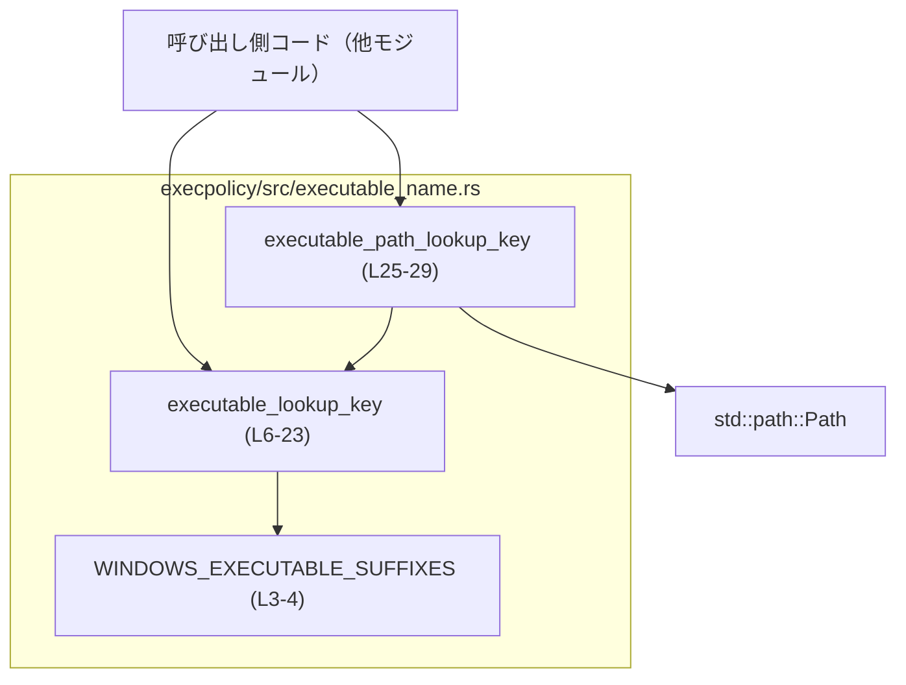
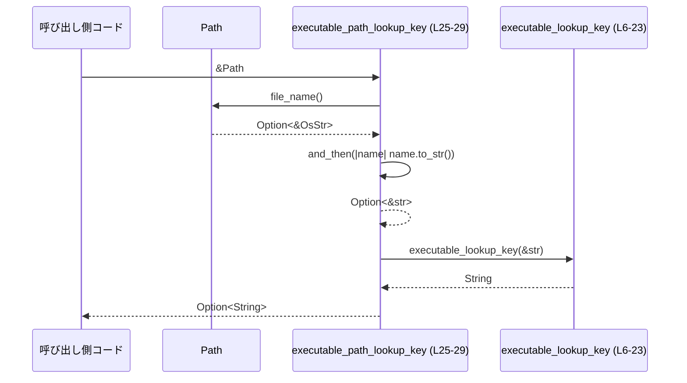

# execpolicy/src/executable_name.rs

## 0. ざっくり一言

実行ファイル名（文字列またはパス）から、「照合用のキー文字列」を生成するための小さなユーティリティ関数を定義したモジュールです。Windows とそれ以外の OS でキーの作り方が異なります。

---

## 1. このモジュールの役割

### 1.1 概要

- このモジュールは **実行ファイル名の正規化** を行い、後段の処理で使いやすい「照合キー」を生成するために存在していると考えられます。  
- 文字列から直接キーを作る関数と、`Path` からファイル名を取り出してキーを作る関数の 2 つを提供します。  
  - `executable_lookup_key`（文字列 → キー）`L6-23`  
  - `executable_path_lookup_key`（`Path` → `Option<String>`）`L25-29`  

### 1.2 アーキテクチャ内での位置づけ

このモジュール内部と標準ライブラリの依存関係は、次のような構造になっています。



- `executable_path_lookup_key` は標準ライブラリの `std::path::Path` を利用し、ファイル名を抽出してから `executable_lookup_key` に委譲します。`L25-28`  
- Windows のみ、`executable_lookup_key` は `WINDOWS_EXECUTABLE_SUFFIXES` 定数を参照して拡張子を取り除きます。`L3-4, L10`  

このチャンクからは、どのモジュールがこれらの関数を呼び出しているかは分かりません（呼び出し側は「Caller」として抽象化しています）。

### 1.3 設計上のポイント

- **OS 依存の分岐をコンパイル時に切り替え**  
  - `#[cfg(windows)]` / `#[cfg(not(windows))]` によって、Windows とそれ以外で異なる実装がコンパイルされます。`L3, L7, L19`
- **Windows では大文字小文字と拡張子を正規化**  
  - Windows の場合、コマンド名を ASCII 小文字化し、`.exe`, `.cmd`, `.bat`, `.com` の拡張子を削除した形をキーとしています。`L3-4, L9-13`
- **非 Windows では文字列のコピーのみ**  
  - 非 Windows 環境では `raw` をそのまま `String` に変換するだけで、ケース変換や拡張子処理は行いません。`L19-21`
- **状態を持たない純粋関数**  
  - グローバルなミュータブル状態は持たず、入力に対して決定的な出力のみを返す純粋関数です（`const` 配列を読み取るだけ）。`L3-4, L6-23, L25-29`
- **エラーは `Option` で表現**  
  - `executable_path_lookup_key` はパスからファイル名や UTF-8 文字列が取得できない場合に `None` を返し、失敗を表現します。`L25-28`

---

## 2. 主要な機能一覧

- 実行ファイル名の正規化（Windows 向け）: 拡張子と大文字小文字を正規化したキーを生成する（`executable_lookup_key`、`L6-23`）
- パスから実行ファイル名キーを生成: `Path` からファイル名を取り出し、正規化済みキー（または `None`）を返す（`executable_path_lookup_key`、`L25-29`）

---

## 3. 公開 API と詳細解説

### 3.1 コンポーネント一覧

このファイルで定義されている主なコンポーネント一覧です。

| 名前 | 種別 | 役割 / 用途 | 定義箇所 |
|------|------|-------------|----------|
| `WINDOWS_EXECUTABLE_SUFFIXES` | 定数 (`[&str; 4]`) | Windows で「実行可能ファイル」とみなす拡張子一覧（`.exe`, `.cmd`, `.bat`, `.com`） | `executable_name.rs:L3-4` |
| `executable_lookup_key` | 関数 | 生のコマンド名文字列から、照合用のキー文字列を生成する | `executable_name.rs:L6-23` |
| `executable_path_lookup_key` | 関数 | `Path` からファイル名を取得し、`executable_lookup_key` を使ってキーを生成する | `executable_name.rs:L25-29` |

---

### 3.2 関数詳細

#### `executable_lookup_key(raw: &str) -> String`

**概要**

- コマンド名などの文字列 `raw` を受け取り、**OS ごとに異なるルール**で照合用キー文字列を生成します。`L6-23`
  - Windows: ASCII 小文字化し、特定の実行可能拡張子を取り除いた文字列  
  - 非 Windows: 入力をそのまま `String` にコピーした文字列  

**引数**

| 引数名 | 型 | 説明 |
|--------|----|------|
| `raw` | `&str` | 実行ファイル名やコマンド名を表す文字列。拡張子付き/無し、大小混在など任意の文字列。 |

**戻り値**

- `String`  
  - Windows: `raw` を ASCII 小文字化し、`.exe`, `.cmd`, `.bat`, `.com` のいずれかの拡張子が末尾にあれば、それを取り除いた文字列。`L7-16`  
  - 非 Windows: `raw` をそのまま `String` にコピーしたもの。`L19-21`  

**内部処理の流れ（アルゴリズム）**

Windows の場合（`#[cfg(windows)]`）`L7-17`:

1. `raw.to_ascii_lowercase()` で ASCII 小文字化し、新しい `String` として `raw` 変数に束縛し直します。`L9`
2. `WINDOWS_EXECUTABLE_SUFFIXES`（`.exe`, `.cmd`, `.bat`, `.com`）を順に走査します。`L3-4, L10`
3. 各 `suffix` について `raw.ends_with(suffix)` を確認し、末尾がその拡張子であれば: `L10-11`
   - `stripped_len = raw.len() - suffix.len()` で拡張子を除いた長さを計算し、`L12`
   - `raw[..stripped_len].to_string()` で拡張子を取り除いた部分を `String` にして返します。`L13`
4. どの拡張子にもマッチしなかった場合、小文字化済みの `raw` をそのまま返します。`L16`

非 Windows の場合（`#[cfg(not(windows))]`）`L19-21`:

1. `raw.to_string()` で `&str` を `String` にコピーして返します。`L21`

**根拠**

- 関数シグネチャと OS ごとの分岐: `executable_name.rs:L6-7, L19`
- Windows での小文字化と拡張子除去ロジック: `executable_name.rs:L9-16`
- 非 Windows での単純コピー: `executable_name.rs:L19-21`

**Examples（使用例）**

Windows/非 Windows での挙動の違いを示す例です。  
（このコード断片は関数と同じモジュール内で利用するケースを想定しています。）

```rust
// Windows 環境での例
#[cfg(windows)]
fn example_windows() {
    let key1 = executable_lookup_key("Cmd.EXE");  // ASCII 小文字化 + .exe 除去
    assert_eq!(key1, "cmd");                      // "Cmd.EXE" -> "cmd"

    let key2 = executable_lookup_key("MyTool");   // 拡張子なし
    assert_eq!(key2, "mytool");                   // 小文字化のみ
}

// 非 Windows 環境での例
#[cfg(not(windows))]
fn example_non_windows() {
    let key1 = executable_lookup_key("ls");       // そのままコピー
    assert_eq!(key1, "ls");

    let key2 = executable_lookup_key("bash.EXE"); // ケースや拡張子はそのまま
    assert_eq!(key2, "bash.EXE");
}
```

**Errors / Panics**

- 明示的なエラー (`Result`) や `panic!` は使用していません。  
- 使用している操作はすべて境界チェック済みであり、条件付きでインデックスを計算しているため、通常の使用ではパニックは起こらない構造です。
  - `raw[..stripped_len]` は、`stripped_len = raw.len() - suffix.len()` で計算され、`ends_with` が真のときだけ実行されるため、範囲外インデックスにはなりません。`L10-13`

**Edge cases（エッジケース）**

- `raw` が空文字列 `""` の場合  
  - Windows: どの `suffix` にもマッチせず、そのまま `""`（小文字化しても空）を返します。`L9-16`  
  - 非 Windows: `""` をそのまま返します。`L21`
- `raw` が拡張子のみ（例: `.exe`）の場合（Windows）  
  - `ends_with(".exe")` が真となり、`stripped_len = 0` になり、`raw[..0]` = `""` を返します。`L10-13`
- `raw` の末尾が拡張子候補と似ていても完全一致しない場合  
  - 例: `"myexe"` は `.exe` では終わっていないので拡張子除去は行われず、小文字化された `"myexe"` が返ります。`L10-16`
- 非 Windows では、大小文字や拡張子に対する特別な処理はありません。`L19-21`

**使用上の注意点**

- **OS 間で仕様が異なる**  
  - Windows では「小文字化 + 拡張子除去」、非 Windows では「入力をそのままコピー」です。  
  - 同じコードベースを複数 OS で動かす場合、得られるキーが異なる可能性がある点に注意が必要です。  
    - 例: `"cmd.exe"` → Windows: `"cmd"`、非 Windows: `"cmd.exe"`.
- **拡張子一覧は固定**  
  - Windows で除去される拡張子は `.exe`, `.cmd`, `.bat`, `.com` に固定されています（`WINDOWS_EXECUTABLE_SUFFIXES`）。`L3-4`  
  - 他の拡張子（例: `.ps1`）を実行可能として扱いたい場合、この定数を拡張する必要があります。
- **並行性（スレッドセーフ）**  
  - この関数は引数のみを読み取り、グローバル可変状態を扱わないため、複数スレッドから同時に呼び出しても安全です。  
  - `WINDOWS_EXECUTABLE_SUFFIXES` は `const` であり、読み取り専用です。`L3-4`

---

#### `executable_path_lookup_key(path: &Path) -> Option<String>`

**概要**

- ファイルパス `path` からファイル名を取り出し、そのファイル名を `executable_lookup_key` に渡して照合用キーを生成します。`L25-29`  
- ファイル名が存在しない場合や UTF-8 に変換できない場合は `None` を返します。

**引数**

| 引数名 | 型 | 説明 |
|--------|----|------|
| `path` | `&Path` | 実行ファイルを指すと想定されるパス。絶対パス・相対パス、拡張子の有無は問わない。 |

**戻り値**

- `Option<String>`  
  - `Some(key)`: ファイル名を取得して UTF-8 に変換し、`executable_lookup_key` による正規化が成功した場合のキー。`L25-28`  
  - `None`: 次のいずれかの場合  
    - `path.file_name()` が `None`（パスがディレクトリやルートのみなど）`L26`  
    - `file_name` が UTF-8 として解釈できず、`to_str()` が `None` を返した場合 `L27`

**内部処理の流れ（アルゴリズム）**

1. `path.file_name()` を呼び出し、パス末尾のファイル名部分を `Option<&OsStr>` で取得します。`L26`
2. `and_then(|name| name.to_str())` により、`OsStr` を UTF-8 `&str` に変換します。  
   - `to_str()` が失敗した場合（非 UTF-8）のときは `None` になります。`L27`
3. `map(executable_lookup_key)` によって、取得した `&str` に `executable_lookup_key` を適用し、`Option<String>` を得ます。`L28`
   - `Some(name_str)` の場合: `Some(executable_lookup_key(name_str))`  
   - `None` の場合: そのまま `None`

**根拠**

- メソッドチェーンの構造: `executable_name.rs:L25-28`
- `file_name` → `to_str` → `map(executable_lookup_key)` の処理順: `executable_name.rs:L26-28`

**Examples（使用例）**

典型的な使い方として、パスから照合キーを取り出す例です。

```rust
use std::path::Path;

// Windows 環境での例
#[cfg(windows)]
fn example_path_windows() {
    let path = Path::new(r"C:\Windows\System32\CMD.EXE"); // 拡張子付きのパス
    let key = executable_path_lookup_key(&path).unwrap(); // Option なので unwrap する例
    assert_eq!(key, "cmd");                               // 小文字 + 拡張子除去
}

// 非 Windows 環境での例
#[cfg(not(windows))]
fn example_path_non_windows() {
    let path = Path::new("/usr/bin/ls");                  // 実行ファイルのパス
    let key = executable_path_lookup_key(&path).unwrap();
    assert_eq!(key, "ls");                                // 拡張子もケースもそのまま（この例では変化なし）
}
```

**Errors / Panics**

- 関数自体は `Option` を返し、`Err` や `panic!` は発生させません。`L25-29`
- ただし、呼び出し側が `unwrap()` を使った場合、`None` のときにパニックする可能性があります。これは呼び出し側の責務です。

**Edge cases（エッジケース）**

- `path` がルートディレクトリのみ（例: `Path::new("/")`）の場合  
  - `file_name()` は `None` を返し、その後の `and_then` / `map` も実行されず、結果は `None` になります。`L26-28`
- `path` がディレクトリで終わる場合（末尾にファイル名がない）  
  - 同様に `file_name()` が `None` となり、`None` を返します。
- ファイル名が非 UTF-8 の場合（主に Unix 系 OS で起こりうる）  
  - `to_str()` が `None` を返し、その後の `map` で `None` のままとなります。`L27-28`
- ファイル名部分が空文字列になるケース  
  - 通常の `Path` 操作では末尾が空文字列になることはほとんどありませんが、仮にそうなった場合も `""` が `executable_lookup_key` に渡され、その仕様に従ったキーが生成されます（Windows では空文字、非 Windows でも空文字）。`L26-28`

**使用上の注意点**

- **`None` を考慮したエラーハンドリング**  
  - `Option` で失敗が表現されているため、`unwrap()` ではなく `match` や `if let` などで `None` をハンドリングする必要があります。
- **非 UTF-8 パスの取り扱い**  
  - 非 UTF-8 のファイル名はキーを生成できず `None` になるため、この関数を利用する処理は「UTF-8 で表現できるファイル名のみを扱う」という前提になります。
- **並行性（スレッドセーフ）**  
  - 引数の `&Path` から読み取るだけで、他の共有ミュータブル状態を変更しないため、並行呼び出しは安全です。  
  - 内部で呼び出している `executable_lookup_key` も純粋関数です。`L25-28`

---

### 3.3 その他の関数

- このファイルには、上記 2 関数以外の補助関数やラッパー関数は定義されていません。`executable_name.rs:L1-29`

---

## 4. データフロー

ここでは、「パスから実行ファイルキーを取得する」典型的なフローを示します。

1. 呼び出し側は `&Path` を `executable_path_lookup_key` に渡します。`L25`
2. `executable_path_lookup_key` が `Path` からファイル名を取り出し、UTF-8 に変換します。`L26-27`
3. 変換できた場合、その文字列を `executable_lookup_key` に渡してキーを生成します。`L28`
4. 生成されたキー文字列を `Some(key)` として呼び出し側に返します。  
   失敗した場合（ファイル名なし or 非 UTF-8）は `None` を返します。



- このチャートはこのファイル内のフローのみを表しており、生成されたキーが後段でどう使われるか（例: マップのキー、ポリシー判定など）は、このチャンクからは分かりません。

---

## 5. 使い方（How to Use）

### 5.1 基本的な使用方法

文字列から直接キーを生成するパターンと、`Path` からキーを生成するパターンの両方の例です。

```rust
use std::path::Path;

// 文字列から直接キーを生成する例
fn basic_from_str() {
    let raw = "MyTool.EXE";                           // 生のコマンド名
    let key = executable_lookup_key(raw);             // 照合用キーを生成
    #[cfg(windows)]
    assert_eq!(key, "mytool");                        // Windows: 小文字 + .exe 除去
    #[cfg(not(windows))]
    assert_eq!(key, "MyTool.EXE");                    // 非 Windows: そのまま
}

// Path からキーを生成する例
fn basic_from_path() {
    let path = Path::new("/usr/bin/ls");              // 実行ファイルへのパス
    let maybe_key = executable_path_lookup_key(&path);// Option<String> を取得

    if let Some(key) = maybe_key {
        println!("キー: {}", key);                    // 正常にキーを取得できた場合
    } else {
        println!("キーを取得できませんでした");        // ファイル名がない / 非 UTF-8 の場合など
    }
}
```

### 5.2 よくある使用パターン

1. **キーをマップのキーとして利用する（想定されるパターン）**  
   関数名に「lookup_key」とあるため、ハッシュマップなどのキーとして使われることが想定されます（これは関数名からの推測です）。

   ```rust
   use std::collections::HashMap;
   use std::path::Path;

   fn store_policy_for_exec(policies: &mut HashMap<String, String>, path: &Path, policy: String) {
       if let Some(key) = executable_path_lookup_key(path) {   // パスから照合キーを作成
           policies.insert(key, policy);                       // キーとポリシーをマップに保存
       }
   }
   ```

2. **OS ごとの差異を明示的にテストする**

   ```rust
   #[cfg(test)]
   mod tests {
       use super::executable_lookup_key;

       #[test]
       fn test_keys() {
           #[cfg(windows)]
           {
               assert_eq!(executable_lookup_key("CMD.EXE"), "cmd");
           }

           #[cfg(not(windows))]
           {
               assert_eq!(executable_lookup_key("CMD.EXE"), "CMD.EXE");
           }
       }
   }
   ```

### 5.3 よくある間違い

以下は、この関数群の仕様から考えられる誤用パターンです。

```rust
use std::path::Path;

// 誤り: OS に関係なくキーが同じだと仮定している
fn wrong_assumption() {
    let key = executable_lookup_key("cmd.exe");

    // Windows では "cmd"、非 Windows では "cmd.exe" になる
    // ↓ これを固定値 "cmd.exe" と比較すると OS によって失敗する
    if key == "cmd.exe" {
        // 誤った判定ロジック
    }
}

// 正しい: OS ごとの仕様を意識した比較
fn correct_usage() {
    let key = executable_lookup_key("cmd.exe");

    #[cfg(windows)]
    assert_eq!(key, "cmd");       // Windows 向けの想定キー

    #[cfg(not(windows))]
    assert_eq!(key, "cmd.exe");   // 非 Windows 向けの想定キー
}
```

**注意すべき誤用パターン**

- `executable_path_lookup_key` の戻り値 `Option<String>` を `unwrap()` で即座に解体し、`None` ケースを考慮しない。  
- Windows と非 Windows でキーの仕様が異なることを意識せず、単一の固定値と比較する。  
- Windows で拡張子を含んだキーを期待する（実際には除去される）。

### 5.4 使用上の注意点（まとめ）

- **OS 間の仕様差**  
  - Windows: 小文字化 + 特定拡張子を除去  
  - 非 Windows: 入力文字列をそのままコピー  
- **`Option` の扱い**  
  - `executable_path_lookup_key` の戻り値 `Option<String>` は `None` を返す可能性があるため、その前提で処理を組み立てる必要があります。
- **非 UTF-8 パス**  
  - 非 UTF-8 のファイル名はキーを生成できず `None` になります。
- **並行性・安全性**  
  - 関数は純粋で、副作用がなく、共有ミュータブル状態もないため、並行呼び出しや再入可能性の観点で特別な注意は不要です。

---

## 6. 変更の仕方（How to Modify）

### 6.1 新しい機能を追加する場合

例として、Windows で新たな実行可能拡張子をサポートする場合を考えます。

1. **拡張子一覧の更新**  
   - `WINDOWS_EXECUTABLE_SUFFIXES` に新しい拡張子文字列を追加します。`executable_name.rs:L3-4`  
   - 例: `.ps1` や `.vbs` などを追加する場合。

   ```rust
   #[cfg(windows)]
   const WINDOWS_EXECUTABLE_SUFFIXES: [&str; 5] = [".exe", ".cmd", ".bat", ".com", ".ps1"];
   ```

2. **関連テストの追加/更新**  
   - 新しい拡張子で想定通りに拡張子が除去されるかをテストします。

3. **影響範囲の確認**  
   - これらのキーを利用している呼び出し側（マップのキー、ポリシー判定など）が、新しい拡張子の追加によってどう振る舞うか確認する必要があります。  
   - 呼び出し側ファイルはこのチャンクには出てこないため、別途検索が必要です。

### 6.2 既存の機能を変更する場合

1. **仕様変更の影響範囲**  
   - `executable_lookup_key` / `executable_path_lookup_key` は「lookup_key」という名前から、**照合キー**として使われていると推測されます。  
   - これらの関数の出力が変わると、キーに基づいた検索やポリシー判定結果が変わる可能性があります。

2. **変更時に注意すべき契約（前提条件）**

   - `executable_lookup_key` の契約（コードから読み取れる仕様）  
     - Windows では「小文字化 + 特定拡張子除去」。`L7-16`  
     - 非 Windows では「そのままコピー」。`L19-21`
   - `executable_path_lookup_key` の契約  
     - ファイル名が取得でき、UTF-8 で表現できる場合のみ `Some(key)` を返す。`L26-28`

   これらの性質を変える場合は、呼び出し側がそれらの契約を前提としていないか確認する必要があります。

3. **テストと呼び出し箇所の再確認**

   - 変更内容に応じて、Windows/非 Windows 両方のテストを用意することが推奨されます。  
   - このファイル内にはテストコードは存在せず、テストの有無はこのチャンクからは分かりません。

---

## 7. 関連ファイル

このチャンクに現れる情報から分かる関連要素は次の通りです。

| パス | 役割 / 関係 |
|------|------------|
| `std::path::Path`（標準ライブラリ） | `executable_path_lookup_key` の引数型として利用され、`file_name()` によるファイル名取得に使われています。`executable_name.rs:L1, L25-27` |

- このモジュールを呼び出している他のファイルや、ポリシー全体の構成は、このチャンクには現れておらず不明です。  
- テストコードの有無も、このファイルからは判断できません。

---

### Bugs / Security / Observability に関する補足

- **明確なバグとして判断できる挙動**は、この短いコードからは見当たりません。拡張子除去やインデックス計算は防御的に書かれています。`L10-13`
- **セキュリティ的観点**では、この関数群はあくまで文字列変換のみを行い、外部コマンドの実行やファイルアクセスはしません。そのため、このファイル単体から直接的なセキュリティリスクは読み取れません。
- **観測性（Observability）**のためのログ出力やメトリクス送信処理は含まれていません（`println!` や `log` マクロなどが存在しません）。`executable_name.rs:L1-29`
