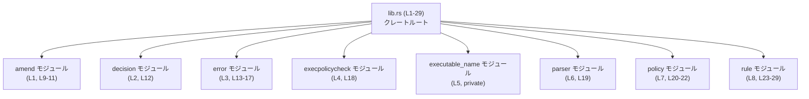
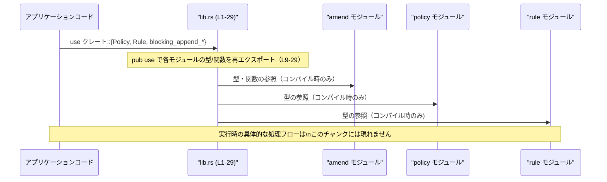

# execpolicy/src/lib.rs コード解説

## 0. ざっくり一言

このファイルはクレートのルート（`lib.rs`）として、内部モジュールを宣言し、それらから選んだ型・関数・エラー型などを再エクスポートする「公開 API の入り口」として機能しています（`lib.rs:L1-29`）。

---

## 1. このモジュールの役割

### 1.1 概要

- このモジュールは、実行ポリシー関連の機能を提供する複数の内部モジュール（`amend`, `decision`, `error`, `execpolicycheck`, `parser`, `policy`, `rule`）をまとめ、外部利用者が使いやすい形で公開するために存在しています（`lib.rs:L1-8,9-29`）。
- 実行ロジックやアルゴリズム自体はここにはなく、すべて各モジュール側にあり、このファイルは **モジュール宣言と `pub use` による公開範囲の調整** のみを行っています。

### 1.2 アーキテクチャ内での位置づけ

`lib.rs` はクレート全体の「正面玄関」として、内部モジュールを束ねています。実行時の処理フローはこのチャンクからは分かりませんが、**コンパイル時の依存関係** は次のようになります。



- 外部クレートからは、`lib.rs` が再エクスポートするシンボル（例: `Policy`, `Rule`, `Result` など）だけが見えます（`lib.rs:L9-29`）。
- `mod executable_name;` は `pub` も `pub(crate)` も付いていないため、**完全に内部専用のモジュール** です（`lib.rs:L5`）。

### 1.3 設計上のポイント

コードから読み取れる設計上の特徴は次の通りです。

- **再エクスポートによるフラットな API**  
  - 多くの型・関数を `rule::Rule` のようなモジュールパスではなく、クレートルートから直接使えるように `pub use` しています（例: `pub use rule::Rule;` `lib.rs:L27`）。
- **エラー型の一本化の可能性**  
  - `error` モジュールから `Error`, `ErrorLocation`, `Result`, `TextPosition`, `TextRange` を再エクスポートしており（`lib.rs:L13-17`）、クレート全体で共通のエラー表現・`Result` エイリアスを使う設計と推測されますが、詳細はこのチャンクだけでは断定できません。
- **可視性制御によるカプセル化**  
  - モジュール宣言は主に `pub(crate) mod ...` で、クレート内部からはアクセスできるが、外部クレートからモジュールとしては直接見えない構成になっています（`lib.rs:L1-4,L6-7`）。
  - 外部からは **ルートに再エクスポートされたシンボルのみ** に依存すればよく、内部構造の変更に耐えやすい API になります。
- **このファイル自身にはロジックや並行処理はない**  
  - 関数定義・メソッド・`async`・`unsafe` などのキーワードは一切なく、Rust の安全性・エラー処理・並行性に関する実装上の工夫は、すべて各モジュール側に存在します。

---

## 2. 主要な機能一覧

このファイルに出てくる名前から、クレートが提供している主な機能のカテゴリだけを列挙します（挙動の詳細はこのチャンクからは分かりません）。

- ポリシー定義・評価関連  
  - `Policy`, `Evaluation`, `MatchOptions` など（`lib.rs:L20-22`）
- ルール定義関連  
  - `Rule`, `PrefixRule`, `PrefixPattern`, `RuleRef`, `RuleMatch`, `PatternToken`, `NetworkRuleProtocol` など（`lib.rs:L23-29`）
- ポリシーのパース関連  
  - `PolicyParser`（`lib.rs:L19`）
- 実行ポリシーチェックのコマンド/エントリポイントらしき型  
  - `ExecPolicyCheckCommand`（`lib.rs:L18`）
- ポリシーの修正（amend）に関する関数・エラー  
  - `blocking_append_allow_prefix_rule`, `blocking_append_network_rule`, `AmendError`（`lib.rs:L9-11`）
- エラー表現と位置情報  
  - `Error`, `ErrorLocation`, `Result`, `TextPosition`, `TextRange`（`lib.rs:L13-17`）

※ 上記の「何をするか」の詳細な挙動は、対応するモジュールのコードがこのチャンクには含まれていないため不明です。

---

## 3. 公開 API と詳細解説

### 3.1 コンポーネント一覧（モジュール・型・関数）

#### モジュール一覧

| 名前              | 種別   | 公開範囲          | 説明（コードから分かる範囲のみ）                                                    | 根拠行              |
|-------------------|--------|-------------------|--------------------------------------------------------------------------------------|---------------------|
| `amend`           | モジュール | `pub(crate)`    | ポリシーを「変更（amend）」する機能をまとめたモジュールと推測されますが詳細不明。    | `lib.rs:L1`, `L9-11` |
| `decision`        | モジュール | `pub(crate)`    | `Decision` 型を提供するモジュール。詳細不明。                                        | `lib.rs:L2`, `L12`  |
| `error`           | モジュール | `pub(crate)`    | エラー関連型・`Result` を提供するモジュール。                                        | `lib.rs:L3`, `L13-17` |
| `execpolicycheck` | モジュール | `pub(crate)`    | `ExecPolicyCheckCommand` を提供するモジュール。詳細不明。                            | `lib.rs:L4`, `L18`  |
| `executable_name` | モジュール | private         | 完全に内部専用の補助モジュール。外部には一切公開されません。                       | `lib.rs:L5`         |
| `parser`          | モジュール | `pub(crate)`    | `PolicyParser` を提供するモジュール。詳細不明。                                      | `lib.rs:L6`, `L19`  |
| `policy`          | モジュール | `pub(crate)`    | `Policy`, `Evaluation`, `MatchOptions` を提供するモジュール。                        | `lib.rs:L7`, `L20-22` |
| `rule`            | モジュール | `pub`           | `Rule` 系の型を提供しつつ、モジュール自体も公開されています。                       | `lib.rs:L8`, `L23-29` |

#### 公開シンボル一覧（型・エイリアス・関数）

Rust の命名規則に基づき、`UpperCamelCase` は「型（構造体・列挙体など）」、`snake_case` は「関数または定数」であると推測できますが、このチャンクには定義本体がないため「推定」であることを明記します。

| 名前                                | 種別（推定）        | 由来モジュール   | 役割 / 用途（名前から推測できる範囲・詳細は不明）                                    | 根拠行      |
|-------------------------------------|---------------------|------------------|----------------------------------------------------------------------------------------|-------------|
| `AmendError`                        | エラー型（推定）    | `amend`          | ポリシー変更系処理におけるエラー表現と推定されます。                                  | `lib.rs:L9` |
| `blocking_append_allow_prefix_rule` | 関数（推定）        | `amend`          | 「allow prefix rule」を追加する同期的な関数と推測されますが、シグネチャは不明です。  | `lib.rs:L10`|
| `blocking_append_network_rule`      | 関数（推定）        | `amend`          | 「network rule」を追加する同期的な関数と推測されますが、シグネチャは不明です。       | `lib.rs:L11`|
| `Decision`                          | 型（推定）          | `decision`       | ポリシー評価の結果（許可/拒否など）を表す型と推測されます。                           | `lib.rs:L12`|
| `Error`                             | エラー型（推定）    | `error`          | クレート全体の代表的なエラー型と思われます。                                          | `lib.rs:L13`|
| `ErrorLocation`                     | 型（推定）          | `error`          | エラーが発生した位置情報（ファイル/行/カラムなど）を保持する型と推測されます。       | `lib.rs:L14`|
| `Result`                            | 型エイリアス（推定）| `error`          | 汎用的な `Result<T, Error>` のようなエイリアスと推測されます。                        | `lib.rs:L15`|
| `TextPosition`                      | 型（推定）          | `error`          | テキスト中の位置（行/列）を表す型と推測されます。                                     | `lib.rs:L16`|
| `TextRange`                         | 型（推定）          | `error`          | テキスト中の範囲（開始位置〜終了位置）を表す型と推測されます。                       | `lib.rs:L17`|
| `ExecPolicyCheckCommand`            | 型（推定）          | `execpolicycheck`| 実行ポリシーをチェックするコマンド/エントリ型と推測されます。                        | `lib.rs:L18`|
| `PolicyParser`                      | 型（推定）          | `parser`         | ポリシー記述をパースするためのパーサと推測されます。                                  | `lib.rs:L19`|
| `Evaluation`                        | 型（推定）          | `policy`         | ポリシー評価結果の詳細情報を持つ型と推測されます。                                    | `lib.rs:L20`|
| `MatchOptions`                      | 型（推定）          | `policy`         | マッチングのオプション指定を行う型と推測されます。                                    | `lib.rs:L21`|
| `Policy`                            | 型（推定）          | `policy`         | 実行ポリシー（ルール集合）を表す型と推測されます。                                    | `lib.rs:L22`|
| `NetworkRuleProtocol`               | 型（推定）          | `rule`           | ネットワークルールで使用するプロトコル種別を表す型と推測されます。                   | `lib.rs:L23`|
| `PatternToken`                      | 型（推定）          | `rule`           | パターン表現を分割したトークンを表す型と推測されます。                                | `lib.rs:L24`|
| `PrefixPattern`                     | 型（推定）          | `rule`           | 接頭辞パターンを表す型と推測されます。                                                | `lib.rs:L25`|
| `PrefixRule`                        | 型（推定）          | `rule`           | 接頭辞に基づくルールを表す型と推測されます。                                          | `lib.rs:L26`|
| `Rule`                              | 型（推定）          | `rule`           | 基本的なポリシールールを表す型と推測されます。                                        | `lib.rs:L27`|
| `RuleMatch`                         | 型（推定）          | `rule`           | ルールとのマッチ結果を表す型と推測されます。                                          | `lib.rs:L28`|
| `RuleRef`                           | 型（推定）          | `rule`           | ルールへの参照/識別子を表す型と推測されます。                                         | `lib.rs:L29`|

> 重要: 上記の「役割 / 用途」はすべて **名前からの推測** であり、実装コードはこのチャンクには含まれていません。

### 3.2 関数詳細（推定される関数・2件）

このファイルには関数定義は含まれていませんが、`amend` モジュールから再エクスポートしている 2 つの `snake_case` 名は関数である可能性が高いです。実装がないため、テンプレート項目の多くは「不明」となります。

#### `blocking_append_allow_prefix_rule(...)`（シグネチャ不明）

**概要**

- `amend` モジュールから再エクスポートされている関数です（`lib.rs:L10`）。
- 名前からは「許可用のプレフィックスルールを追加する同期的（blocking）な操作」を行う関数と推測されますが、実際の挙動や I/O の有無はこのチャンクでは分かりません。

**引数**

| 引数名 | 型 | 説明 |
|--------|----|------|
| （不明） | （不明） | `lib.rs` にはシグネチャが現れないため、引数・型・意味はすべて不明です。 |

**戻り値**

- 型・意味ともに不明です。
- `Result` 型がクレートルートから公開されているため（`lib.rs:L15`）、`Result<_, Error>` のような形を返す可能性はありますが、コードからは断定できません。

**内部処理の流れ**

- 実装は `amend` モジュール側にあり、このチャンクには現れません。
- 従って、アルゴリズムや分岐ロジックについては不明です。

**Examples（使用例）**

以下は **インポート方法のみ** を示す例であり、呼び出しシグネチャは不明です。

```rust
// 仮にクレート名を `execpolicy` とします（正確な名前は Cargo.toml を確認する必要があります）。
use execpolicy::blocking_append_allow_prefix_rule; // lib.rs:L10 で再エクスポートされる関数

fn main() {
    // 実際の引数・戻り値は、このチャンクだけでは分かりません。
    // blocking_append_allow_prefix_rule(...);
}
```

**Errors / Panics**

- このチャンクにはエラー条件や `panic!` に関する情報はありません。
- `AmendError` が公開されているため（`lib.rs:L9`）、この関数が `AmendError` を返す、あるいはそれを `Error` にラップして返す可能性がありますが、推測の域を出ません。

**Edge cases（エッジケース）**

- 全て不明です。

**使用上の注意点**

- 関数名に `blocking` が含まれるため、非同期環境での利用時には注意が必要な可能性がありますが、実装がないため何とも言えません。
- 実際の契約（前提条件やエッジケース）は `amend` モジュールの実装・ドキュメントを確認する必要があります。

#### `blocking_append_network_rule(...)`（シグネチャ不明）

**概要**

- `amend` モジュールから再エクスポートされている関数です（`lib.rs:L11`）。
- 名前からは「ネットワークルールを追加する同期的な関数」と推測されます。

**引数 / 戻り値 / 内部処理**

- `blocking_append_allow_prefix_rule` と同様、このチャンクには一切情報がなく、すべて不明です。

**Examples（使用例）**

```rust
use execpolicy::blocking_append_network_rule; // lib.rs:L11 で再エクスポート

fn main() {
    // 実際のシグネチャは不明のため、ここでは呼び出し例は示せません。
    // blocking_append_network_rule(...);
}
```

**Errors / Edge cases / 使用上の注意点**

- いずれも不明です。
- 詳細は `amend` モジュール側のコード・ドキュメントを参照する必要があります。

### 3.3 その他の関数

- `lib.rs` には、上記 2 つの `amend` 関数以外に、関数と判断できる再エクスポートは現れません（`lib.rs:L9-29`）。
- 他のモジュールに定義された関数やメソッドは、このチャンクからは把握できません。

---

## 4. データフロー

### 4.1 モジュール間のデータ / シンボルフロー

`lib.rs` 自体には実行時の処理はありませんが、**名前解決・シンボル公開のフロー** をシーケンス図で表すと以下のようになります。



- 実際の「データがどう変換されるか」「どの順に関数が呼ばれるか」は、`amend`, `policy`, `rule` などの実装が必要であり、このチャンク単独では分かりません。
- このファイルの主な役割は、「アプリケーションが参照する名前を整理する」ことであり、**データフローというよりは API フロー** に関する情報のみが見えています。

---

## 5. 使い方（How to Use）

### 5.1 基本的な使用方法（再エクスポートを利用する）

ここでは、**クレート名を仮に `execpolicy` とした場合** の、インポートの仕方だけを示します。実際のクレート名は `Cargo.toml` の `name` フィールドを確認する必要があります。

```rust
// クレートのルートから直接、再エクスポートされたシンボルをインポートする         // lib.rs:L9-29 の pub use に対応
use execpolicy::{
    Policy,                      // policy モジュール由来（L22 で再エクスポート）
    Rule,                        // rule モジュール由来（L27）
    RuleMatch,                   // rule モジュール由来（L28）
    ExecPolicyCheckCommand,      // execpolicycheck モジュール由来（L18）
    PolicyParser,                // parser モジュール由来（L19）
    Result,                      // error モジュール由来の Result エイリアスと推定（L15）
};

// ここから先は型の利用イメージのみで、具体的なメソッド名や挙動は不明です。
fn example_usage() -> Result<()> {                                // Result の具体的な中身は不明
    // 実際の生成・呼び出し方法は、各型の定義がないためここでは書けません。
    // ただし、外部コードからは `execpolicy::Policy` のように
    // モジュールパスを意識せずに使えることだけは、このチャンクから分かります。

    Ok(())                                                         // Result が Ok(()) を許容するかも不明だが、例として記述
}
```

この例の目的は、「**クレートルートからフラットにインポートできる**」という API 形状を示すことにあります。`Policy` などの具体的な使い方は、対応モジュールの実装とドキュメントを参照する必要があります。

### 5.2 よくある使用パターン（推奨されるインポート方法）

`lib.rs` の設計から、次のようなパターンが想定されます。

- **外部からはクレートルート経由でインポートする**

```rust
// 推奨されると考えられるパターン（再エクスポートを利用）
use execpolicy::{Policy, Rule, Result};
```

- **内部実装に依存するパスは避ける**

```rust
// 外部クレートからはおそらくコンパイルできない（policy モジュールは pub(crate) のため）
use execpolicy::policy::Policy; // lib.rs:L7 で pub(crate) mod policy; となっている

// 代わりに、再エクスポートされたシンボルを使用する
use execpolicy::Policy;
```

このように、外部コードは **`lib.rs` の `pub use` を信頼する** ことで、内部モジュール構成の変更から切り離されます。

### 5.3 よくある間違い（想定）

このチャンクから想像される誤用例と、その是正方法です。

```rust
// 誤用の可能性が高い例（外部クレート側のコード）
use execpolicy::policy::Policy;  // policy モジュールは pub(crate)、外部には見えない（L7）

// 正しい例（lib.rs の再エクスポートに依存する）
use execpolicy::Policy;          // lib.rs:L22 で再エクスポートされている
```

- **誤用の原因**: 内部モジュール構成を直接参照しようとすること。
- **是正策**: 常にクレートルートで再エクスポートされているシンボルを利用する。

### 5.4 使用上の注意点（まとめ）

この `lib.rs` に関する注意点は次の通りです。

- **並行性**  
  - このファイルには `async` やスレッド操作は一切登場しません。並行性に関する契約・注意点は、各モジュールの実装側を確認する必要があります。
- **エラー処理**  
  - クレート全体で `Error` 型と `Result` エイリアスを公開しており（`lib.rs:L13-15`）、エラー処理はこの型に集約されていると推測されます。具体的なエラー種別や契約は `error` モジュールを参照する必要があります。
- **可視性**  
  - モジュールの可視性（`pub` / `pub(crate)` / private）により、外部からアクセス可能な範囲が厳密に制限されています。外部から内部モジュールに直接依存しようとするとコンパイルエラーになる可能性があります。

---

## 6. 変更の仕方（How to Modify）

### 6.1 新しい機能を追加する場合

このファイルに新しい機能を追加する際の典型的な流れは次のようになります。

1. **新しいモジュールまたは既存モジュールに実装を追加**  
   - 例: `src/new_feature.rs` にモジュールを作る、あるいは既存の `policy` モジュールに型・関数を追加する。  
   - このステップの詳細は、このチャンクには含まれません。

2. **`lib.rs` にモジュール宣言または再エクスポートを追加**  
   - 新しいモジュールなら `pub(crate) mod new_feature;` のように宣言する（`lib.rs:L1-7` のパターンに倣う）。  
   - 外部 API として公開したい型・関数は `pub use new_feature::NewType;` のように再エクスポートする。

3. **公開範囲を検討**  
   - モジュール自体を外部に見せたい場合は `pub mod rule;` のように `pub` を付けます（`lib.rs:L8`）。  
   - ただし、既存設計では `rule` 以外は `pub(crate)` で隠蔽されているため、新規モジュールも同じ方針に合わせるかどうかを検討する必要があります。

### 6.2 既存の機能を変更する場合

- **影響範囲の確認**  
  - `lib.rs` で再エクスポートされているシンボル名（`lib.rs:L9-29`）を変更・削除すると、外部クレートのコンパイルが壊れる可能性があります。
- **契約の維持**  
  - `Result` や `Error` の型定義・意味を変更すると、クレート全体のエラー処理契約に影響します。
- **モジュール構造変更**  
  - 内部モジュールを統廃合したい場合でも、`lib.rs` の `pub use` を維持すれば、外部 API を後方互換に保てます。

---

## 7. 関連ファイル

この `lib.rs` と密接に関係するモジュール名の一覧です。実際のファイルパスは通常、`src/<name>.rs` または `src/<name>/mod.rs` になりますが、**このチャンクにはファイルパスは明記されていない** ため推測に留まります。

| モジュール名        | 役割 / 関係（コードから分かる範囲のみ）                                                | 根拠行        |
|---------------------|------------------------------------------------------------------------------------------|---------------|
| `amend`             | ポリシー変更系の機能と、それに伴うエラー・関数を提供するモジュール。                    | `lib.rs:L1,L9-11` |
| `decision`          | `Decision` 型を提供するモジュール。                                                     | `lib.rs:L2,L12`   |
| `error`             | 共通エラー型・位置情報・`Result` エイリアスを提供するモジュール。                      | `lib.rs:L3,L13-17`|
| `execpolicycheck`   | `ExecPolicyCheckCommand` 型を提供するモジュール。                                       | `lib.rs:L4,L18`   |
| `executable_name`   | 内部専用の補助モジュール。公開 API からは直接参照されません。                           | `lib.rs:L5`       |
| `parser`            | `PolicyParser` を提供するモジュール。                                                   | `lib.rs:L6,L19`   |
| `policy`            | `Policy`・`Evaluation`・`MatchOptions` などポリシー評価関連の型を提供するモジュール。  | `lib.rs:L7,L20-22`|
| `rule`              | `Rule` およびその関連型を提供し、モジュール自体も `pub` として公開されています。      | `lib.rs:L8,L23-29`|

---

### まとめ（安全性 / エラー / 並行性の観点）

- **安全性**  
  - このファイルでは `unsafe` コードは使用されておらず、行っていることは可視性・再エクスポートの設定のみです。
- **エラー**  
  - エラー関連は `error` モジュールに集約され、その代表を `Error` と `Result` としてクレートルートから公開しています（`lib.rs:L13-15`）。
- **並行性**  
  - 並行性に関する情報（スレッド、`Send`/`Sync`、`async`）は一切このチャンクには現れません。並行利用時の注意点は各モジュールの実装を確認する必要があります。

このチャンクだけではコアロジックの詳細やエッジケース、具体的なバグ・セキュリティ問題を評価することはできず、「どのモジュールがあり、どの名前が公開されているか」という API 構造の把握にとどまります。
