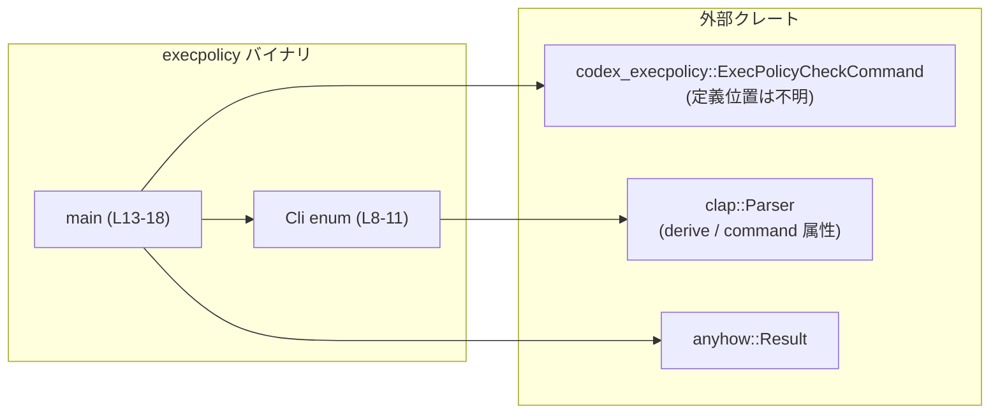
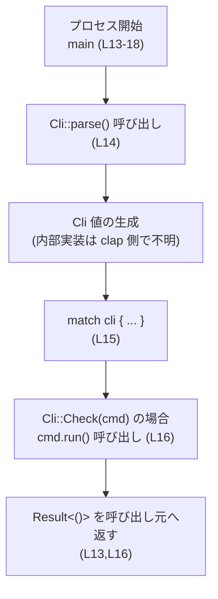
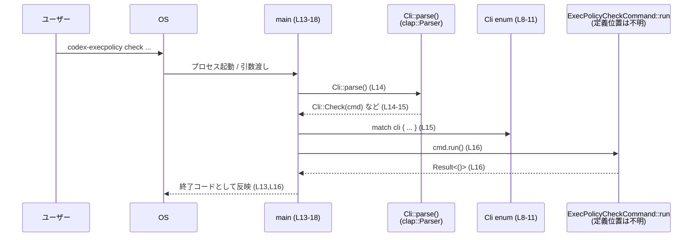

# execpolicy/src/main.rs コード解説

## 0. ざっくり一言

`execpolicy/src/main.rs` は、`codex-execpolicy` という CLI ツールのエントリーポイントであり、コマンドライン引数を `clap` でパースして `ExecPolicyCheckCommand` に処理を委譲する役割を持つファイルです（`execpolicy/src/main.rs:L1-18`）。

---

## 1. このモジュールの役割

### 1.1 概要

- このモジュールは、**実行ポリシー（exec policy）の評価 CLI を起動するためのエントリーポイント**です。
- コマンドライン引数を `clap` で構造体（`Cli` enum）に変換し、その中の `Check` サブコマンドに対応する `ExecPolicyCheckCommand` の `run` メソッドを呼び出します（`execpolicy/src/main.rs:L3,L8-11,L13-17`）。
- 実際のポリシー評価ロジックは外部クレート `codex_execpolicy` 側にあり、このファイルはほぼ「薄いラッパー」として振る舞います。

### 1.2 アーキテクチャ内での位置づけ

このファイルは、バイナリクレートの `main` 関数を提供し、`codex_execpolicy` クレートのコマンド実装に処理を渡します。



- `Cli` は `#[derive(Parser)]` と `#[command(name = "codex-execpolicy")]` により `clap` のパーサ定義として使われます（`execpolicy/src/main.rs:L6-8`）。
- `main` は `Cli::parse()` によって `Cli` を構築し（`execpolicy/src/main.rs:L14`）、`Cli::Check(cmd)` であれば `cmd.run()` を呼び出します（`execpolicy/src/main.rs:L15-16`）。
- エラーハンドリングは `anyhow::Result<()>` に統一されています（`execpolicy/src/main.rs:L1,L13`）。

### 1.3 設計上のポイント

- **責務の分離**  
  - `main.rs` は CLI の初期化とサブコマンドの振り分けのみを行い、業務ロジックは `ExecPolicyCheckCommand` に閉じ込めています（`execpolicy/src/main.rs:L3,L10,L16`）。
- **宣言的な CLI 定義**  
  - `clap` の `derive(Parser)` と `#[command(...)]` 属性を使い、enum `Cli` をそのまま CLI のサブコマンド定義として利用しています（`execpolicy/src/main.rs:L6-8`）。
- **エラーハンドリング方針**  
  - `main` は `anyhow::Result<()>` を返し、サブコマンド実装側の任意のエラーを `anyhow::Error` として集約するスタイルです（`execpolicy/src/main.rs:L1,L13,L16`）。
- **状態と並行性**  
  - このファイル内には状態を保持する構造体や `async`/スレッドなどの並行処理は登場せず、**単純な同期 CLI** として実装されています（`execpolicy/src/main.rs:L8-18` 全体に `unsafe` も `async` も存在しません）。

---

## 2. 主要な機能一覧

このファイルが提供する主な機能は次のとおりです（すべて `execpolicy/src/main.rs` 内）。

- CLI メタ情報の定義:  
  - `#[command(name = "codex-execpolicy")]` により CLI 名を設定します（`execpolicy/src/main.rs:L7`）。
- サブコマンド `Check` の定義:  
  - `Cli::Check(ExecPolicyCheckCommand)` で「ポリシーに対するコマンド評価」サブコマンドを表現します（`execpolicy/src/main.rs:L8-10`）。
- エントリーポイント `main` の定義:  
  - 引数をパースして `Check` サブコマンドに対応する `cmd.run()` を呼び出し、結果をそのまま返します（`execpolicy/src/main.rs:L13-17`）。

---

## 3. 公開 API と詳細解説

このファイル自体には `pub` な API はありませんが、バイナリとして外部から利用される「事実上の公開インターフェース」として `Cli` と `main` を整理します。

### 3.1 型一覧（構造体・列挙体など）

**列挙体インベントリー**

| 名前 | 種別 | 役割 / 用途 | 定義位置 |
|------|------|-------------|----------|
| `Cli` | 列挙体 | `clap` の `Parser` 派生を用いた CLI サブコマンド定義。現在は `Check(ExecPolicyCheckCommand)` 1 つだけを持つ。 | `execpolicy/src/main.rs:L6-11` |

- `Cli` は `#[derive(Parser)]` により `clap::Parser` を実装する enum であることがコードから分かります（`execpolicy/src/main.rs:L2,L6`）。
- `Check` 変種は `ExecPolicyCheckCommand` を内包し、「コマンドをポリシーに対して評価する」意図が doc コメントから読み取れます（`execpolicy/src/main.rs:L9-10`）。

### 3.2 関数詳細（最大 7 件）

まず、このファイルに定義されている関数のインベントリーです。

| 名前 | シグネチャ | 役割 / 用途 | 定義位置 |
|------|------------|-------------|----------|
| `main` | `fn main() -> Result<()>` | プロセスのエントリーポイント。CLI 引数をパースし、`Check` サブコマンドであれば `ExecPolicyCheckCommand::run` に処理を委譲する。 | `execpolicy/src/main.rs:L13-18` |

以下では `main` 関数をテンプレートに従って詳しく説明します。

#### `fn main() -> Result<()>`

**概要**

- Rust の標準エントリーポイントです。
- `clap` により CLI 引数を `Cli` enum に変換し、`Cli::Check(cmd)` の場合に `cmd.run()` を呼んで実行結果を返します（`execpolicy/src/main.rs:L14-16`）。
- 返り値には `anyhow::Result<()>` を用いることで、サブコマンド内部で発生した任意のエラーを集約して呼び出し元（実行環境）に伝えます（`execpolicy/src/main.rs:L1,L13,L16`）。

**引数**

- この関数は引数を取りません。OS からの引数は Rust ランタイム経由で `clap` に渡され、`Cli::parse()` 内部で参照されます（`execpolicy/src/main.rs:L14`）。

**戻り値**

- 型: `anyhow::Result<()>`（`execpolicy/src/main.rs:L1,L13`）
  - 成功時: `Ok(())`
  - 失敗時: `Err(anyhow::Error)`  
    `cmd.run()` の失敗をそのまま返す設計になっています（`execpolicy/src/main.rs:L16`）。

**内部処理の流れ（アルゴリズム）**

`execpolicy/src/main.rs:L13-17` に対応する処理フローです。

1. **CLI 引数のパース**  
   - `let cli = Cli::parse();`  
     - `Cli::parse()` は `clap::Parser` によって生成される関連関数であり、現在のプロセスの引数列を解析し、`Cli` enum の値を構築します（`execpolicy/src/main.rs:L2,L6,L14`）。
2. **サブコマンドの分岐**  
   - `match cli { ... }` で `Cli` のバリアントごとに処理を分岐します（`execpolicy/src/main.rs:L15`）。
3. **Check サブコマンドの実行**  
   - `Cli::Check(cmd) => cmd.run(),`  
     - `cli` が `Check` だった場合、内包されている `ExecPolicyCheckCommand` インスタンスを `cmd` として取り出し、その `run()` メソッドを呼び出します（`execpolicy/src/main.rs:L10,L16`）。
     - `cmd.run()` の戻り値（`anyhow::Result<()>` である必要がある）は `main` の戻り値としてそのまま返されます（`execpolicy/src/main.rs:L13,L16`）。

**処理フロー図**



**Examples（使用例）**

このバイナリは `#[command(name = "codex-execpolicy")]` により CLI 名が `codex-execpolicy` と定義されています（`execpolicy/src/main.rs:L7`）。  
サブコマンド `Check` の詳細な引数は `ExecPolicyCheckCommand` の定義側に依存するため、このファイルからは不明です。

代表的な呼び出しイメージのみを示します。

```sh
# ポリシーに対してコマンドを評価するイメージ
codex-execpolicy check <ARGS...>
# 例: ポリシーファイルやコマンドを指定するオプションなど
# 実際のオプション名・位置は `ExecPolicyCheckCommand` の clap 定義に依存し、このファイルからは分かりません。
```

`--help` などのヘルプ表示も、通常は `clap` が自動で提供しますが、その振る舞いもこのファイル単体からは厳密には分かりません。

**Errors / Panics**

- **`cmd.run()` からのエラー**  
  - `cmd.run()` が `Err(anyhow::Error)` を返した場合、その値がそのまま `main` の戻り値になります（`execpolicy/src/main.rs:L16`）。
  - エラーメッセージの内容や型は `ExecPolicyCheckCommand` の実装に依存し、このファイルには現れません。
- **CLI 引数のパースエラー**  
  - `Cli::parse()` の失敗時にどう振る舞うか（例: `Result` を返さずに標準エラー出力してプロセス終了するかなど）は `clap` の仕様に依存し、このファイルからは分かりません（`execpolicy/src/main.rs:L14`）。
- **panic の可能性**  
  - このファイル内には `unwrap` や `expect`、`panic!`、`unsafe` などは存在しません（`execpolicy/src/main.rs:L1-18` を通覧）。
  - 従って、このファイルの直近のコードからは明示的な `panic` 要因は読み取れませんが、`Cli::parse()` や `cmd.run()` の内部で `panic` が起こる可能性については不明です。

**Edge cases（エッジケース）**

このファイルから読み取れる範囲での代表的なケースです。

- **引数がまったく指定されない場合**  
  - `Cli::parse()` の挙動（ヘルプ表示やエラー終了など）は `clap` の仕様に依存し、このファイルからは断定できません（`execpolicy/src/main.rs:L14`）。
- **未知のサブコマンド・オプションが指定された場合**  
  - `Cli` は `Check` しか持たないため（`execpolicy/src/main.rs:L8-10`）、その他のサブコマンドは受け付けられません。実際にどう扱われるか（エラー表示して終了する等）は `clap` 側の実装に依存します。
- **`cmd.run()` がエラーを返す場合**  
  - `main` はそのエラーをラップせずに返すだけなので、呼び出し元（Rust ランタイム）からは「`main` が `Err` を返した」として扱われます（`execpolicy/src/main.rs:L13,L16`）。

**使用上の注意点**

- **エラー伝播の前提**  
  - `ExecPolicyCheckCommand::run()` は `anyhow::Result<()>` を返す必要があります。型が異なる場合、このコードはコンパイルエラーになります（`execpolicy/src/main.rs:L1,L13,L16`）。
- **サブコマンド追加時の注意**  
  - `Cli` に新しいバリアントを追加した場合、`match cli` ですべてのバリアントを網羅する必要があります。`match` の網羅性が崩れるとコンパイルエラーになるか、`_` パターンで握り潰すことになります（`execpolicy/src/main.rs:L15-16`）。
- **並行性・ブロッキング処理**  
  - この `main` は同期的に `cmd.run()` を呼ぶだけなので、長時間ブロックする処理を `run` 内に追加した場合は、CLI 全体がその間停止することになります。並行実行や非同期処理を導入する場合は、`ExecPolicyCheckCommand` 側の設計が中心になります。

### 3.3 その他の関数

このファイルには `main` 以外の関数定義は存在しません（`execpolicy/src/main.rs:L13-18`）。

---

## 4. データフロー

ここでは、ユーザーが `codex-execpolicy check ...` を実行したときのデータフローを示します。

1. ユーザーがシェルから `codex-execpolicy` コマンドを実行する。
2. OS がプロセスを起動し、引数リストを Rust ランタイム経由でプログラムに渡す。
3. `main` 関数が起動し、`Cli::parse()` を呼んで CLI 引数を `Cli` enum に変換する（`execpolicy/src/main.rs:L13-14`）。
4. `Cli` のバリアントに応じて `match` し、`Cli::Check(cmd)` であれば `cmd.run()` を呼び出す（`execpolicy/src/main.rs:L15-16`）。
5. `cmd.run()` の結果（`Result<()>`）が `main` の戻り値となり、プロセスの終了ステータスに反映される。



- `ExecPolicyCheckCommand::run` 内で何が行われるか（ポリシーの読み込み・検証・外部コマンド実行など）は、このチャンクには現れません。

---

## 5. 使い方（How to Use）

### 5.1 基本的な使用方法

このバイナリは CLI ツールとして利用されます。`name = "codex-execpolicy"` と定義されているため（`execpolicy/src/main.rs:L7`）、通常は次のように呼び出されることが想定されます。

```sh
# ヘルプの表示（一般的な clap ベース CLI の例）
codex-execpolicy --help
codex-execpolicy check --help

# ポリシーに対してコマンドを評価するイメージ
codex-execpolicy check <ARGS...>
```

- `<ARGS...>` の具体的な内容（ポリシーファイル、コマンド文字列、オプション名など）は `ExecPolicyCheckCommand` の定義に依存し、このファイルからは分かりません（`execpolicy/src/main.rs:L3,L10`）。

### 5.2 よくある使用パターン

このファイルから分かる範囲での典型的なパターンは次の通りです。

- **Check サブコマンドを用いた評価**  
  - `codex-execpolicy check ...`  
    - `check` 部分が `Cli::Check` に対応します（`execpolicy/src/main.rs:L8-10`）。
    - 引数は `ExecPolicyCheckCommand` のフィールドにマッピングされますが、詳細はこのチャンクには現れません。

- **ヘルプの確認**（一般的な `clap` CLI の使用例）  
  - `codex-execpolicy --help`  
  - `codex-execpolicy check --help`  
    - `clap` の一般的な挙動として、これらでヘルプが表示されることが多いですが、このファイルだけからは挙動を断定できません。

### 5.3 よくある間違い

ここで挙げるのは「一般的な CLI 誤用の例」であり、このプログラム固有かどうかはこのファイルからは分かりません。

```sh
# （想定される誤用）サブコマンドを指定しない
codex-execpolicy
# → 多くの clap ベース CLI ではエラーやヘルプが表示されるが、
#   実際の挙動は Cli::parse() の実装に依存し、このファイルからは不明。

# （想定される誤用）存在しないサブコマンドを指定
codex-execpolicy foo
# → Cli は Check しか定義していないため (L8-10),
#   `foo` に対応するバリアントは存在しない。
#   これがどのようなエラーとして扱われるかも clap 側の仕様に依存する。
```

### 5.4 使用上の注意点（まとめ）

- **サブコマンドの指定が必須である可能性**  
  - `Cli` が `Check` のみを持つため、サブコマンド無しでの呼び出しは `clap` の扱いに依存します（`execpolicy/src/main.rs:L8-10,L14`）。
- **エラー時の終了コード**  
  - `cmd.run()` がエラーを返した場合、`main` も `Err` を返します（`execpolicy/src/main.rs:L16`）。Rust ランタイムは一般的に非 0 の終了コードを返すため、スクリプトから呼び出す場合は終了ステータスを確認する設計が望ましいです。
- **並行性・スレッドセーフティ**  
  - このファイル内では並行処理は扱っておらず、`main` から `cmd.run()` を同期的に呼ぶだけです（`execpolicy/src/main.rs:L13-16`）。
  - スレッド共有や非同期ランタイムなどに関する注意点は、このファイルからは読み取れません。必要であれば `ExecPolicyCheckCommand` 側の実装を確認する必要があります。

---

## 6. 変更の仕方（How to Modify）

### 6.1 新しい機能を追加する場合

**例: 新しいサブコマンドを追加する**

1. **`Cli` に新しいバリアントを追加する**  
   例: `List` サブコマンドを追加したい場合

   ```rust
   // execpolicy/src/main.rs:L8-11 付近の変更イメージ
   enum Cli {
       /// Evaluate a command against a policy.
       Check(ExecPolicyCheckCommand),
       // ここからは仮の例であり、実際の型名はこのチャンクからは不明
       // List(ExecPolicyListCommand),
   }
   ```

   - 実際には `ExecPolicyListCommand` のような型を `codex_execpolicy` クレート側に定義する必要があります。

2. **`match cli` に分岐を追加する**

   ```rust
   fn main() -> Result<()> {
       let cli = Cli::parse();
       match cli {
           Cli::Check(cmd) => cmd.run(),
           // Cli::List(cmd) => cmd.run(), // 仮想的な追加例
       }
   }
   ```

   - 追加バリアントを網羅しないとコンパイルエラーになるため、`match` の更新は必須です（`execpolicy/src/main.rs:L15-16`）。

3. **テスト・ドキュメントの更新**  
   - 新しいサブコマンドに対する CLI 使用例やテストケース（統合テストなど）を追加することが望ましいです。
   - このファイルにはテストコードは含まれていません（`execpolicy/src/main.rs:L1-18`）。

### 6.2 既存の機能を変更する場合

- **CLI 名を変更したい場合**

  - `#[command(name = "codex-execpolicy")]` を変更します（`execpolicy/src/main.rs:L7`）。
  - 変更に伴い、ドキュメントや呼び出しスクリプトなども更新する必要があります。

- **エラー処理の方針を変えたい場合**

  - 現在は `cmd.run()` の結果をそのまま返しています（`execpolicy/src/main.rs:L16`）。
  - もしエラー内容を加工したりログ出力したりしたい場合は、`match` 内で `cmd.run()` の結果を `match` / `?` で処理し直す形に変更します。

  ```rust
  fn main() -> Result<()> {
      let cli = Cli::parse();
      match cli {
          Cli::Check(cmd) => {
              let result = cmd.run();
              // ここでログ出力などの処理を挿入可能
              result
          }
      }
  }
  ```

- **影響範囲の確認ポイント**

  - `ExecPolicyCheckCommand` の API（特に `run` のシグネチャ）が変わると、このファイルの `cmd.run()` 呼び出しおよび `main` の戻り値型にも影響します（`execpolicy/src/main.rs:L1,L13,L16`）。
  - CLI のインターフェース変更（サブコマンド名やオプション構造）は `clap` の derive が定義された型（`Cli` と `ExecPolicyCheckCommand`）にまたがるため、両方のコードとドキュメントを確認する必要があります。

---

## 7. 関連ファイル

このモジュールと密接に関係する型・モジュールを整理します。

| パス / モジュール | 役割 / 関係 |
|------------------|------------|
| `codex_execpolicy::ExecPolicyCheckCommand` | `Cli::Check` が内包するコマンド型。`run()` メソッドで実際の「コマンドをポリシーに対して評価する」処理を行うと推測されますが、詳細はこのファイルには現れません（`execpolicy/src/main.rs:L3,L9-10,L16`）。 |
| `clap::Parser` | CLI 引数パーサを提供するトレイト。`#[derive(Parser)]` によって `Cli::parse()` などのメソッドが自動生成され、CLI 定義として利用されています（`execpolicy/src/main.rs:L2,L6,L14`）。 |
| `anyhow::Result` | 汎用的なエラー型 `anyhow::Error` を包む `Result` の型エイリアス。`main` の戻り値型として用いることで、`ExecPolicyCheckCommand::run()` からのエラーを集約します（`execpolicy/src/main.rs:L1,L13,L16`）。 |

このチャンクには他のファイル（例: `src/lib.rs` や `ExecPolicyCheckCommand` の定義ファイル）への具体的なパスは現れないため、それらの場所や内容は「不明」となります。
