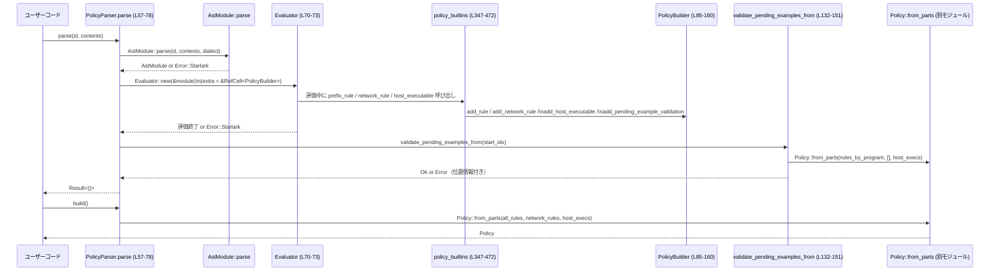

execpolicy/src/parser.rs

---

## 0. ざっくり一言

Starlark（Bazel などで使われるスクリプト言語）で書かれたポリシーファイルを評価し、  
`crate::policy::Policy` オブジェクトに組み立てるためのパーサと、そのための Starlark 組み込み関数群を定義するモジュールです（`execpolicy/src/parser.rs:L38-83, L347-472`）。

---

## 1. このモジュールの役割

### 1.1 概要

- このモジュールは **Starlark 方言で記述されたポリシー定義** を評価して、実行時に利用する `Policy` オブジェクトに変換します（`PolicyParser::parse`, `PolicyParser::build`: `parser.rs:L57-82`）。
- Starlark 側から呼び出される組み込み関数として
  - コマンドラインのプレフィックスマッチ規則 `prefix_rule`（`L348-407`）
  - ネットワークアクセス規則 `network_rule`（`L409-434`）
  - ホスト上の実行ファイル定義 `host_executable`（`L436-471`）
  を提供します。
- さらに、パターン・例示・パスなどの各種パースと検証ロジックを持ち、エラー時にはポリシーファイル中の位置情報付きで `crate::error::Error` を返します（`L170-215`, `L283-333`, `L222-231`, `L259-273`）。

### 1.2 アーキテクチャ内での位置づけ

このモジュールは「ポリシーファイル（テキスト） → `Policy` オブジェクト」の変換を担います。  
外部のポリシーファイルを受け取り、Starlark インタプリタ（`starlark::Evaluator`）に組み込み関数を提供しながら評価し、その副作用として `PolicyBuilder` を構築します（`L57-78`, `L346-472`）。

```mermaid
graph TD
  subgraph "parser.rs (L38-472)"
    PP["PolicyParser (L38-83)"]
    PB["PolicyBuilder (L85-160)"]
    PBlt["policy_builtins (L347-472)"]
  end

  PF["ポリシーテキスト\n(Starlark)"] --> PP
  PP -->|parse() (L57-78)| Eval["starlark::Evaluator (外部)"]
  Eval -->|呼び出し| PBlt

  PBlt -->|prefix_rule / network_rule / host_executable| PB
  PB -->|build() (L153-159)| P["crate::policy::Policy (実装は別モジュール)"]

  PBlt --> R["crate::rule::* (PrefixRule, NetworkRule など)"]
  PBlt --> EN["crate::executable_name::*"]
  PP --> E["crate::error::{Error, ErrorLocation,...}"]
```

### 1.3 設計上のポイント

- **ビルダーの共有と Starlark からの更新**  
  - `PolicyParser` は内部に `RefCell<PolicyBuilder>` を保持し（`L38-40`）、  
    `Evaluator.extra` にその `RefCell` への参照を入れることで、組み込み関数からポリシー構造を組み立てます（`L70-72`, `L336-343`）。
- **例示（examples）の遅延検証**  
  - `prefix_rule` で渡された `match` / `not_match` 例は、その場では評価せず `PendingExampleValidation` として蓄積し（`L116-130`, `L404-405`）、  
    `PolicyParser::parse` の最後で `validate_pending_examples_from` により一括検証します（`L57-58`, `L132-151`）。
- **エラーハンドリング**  
  - Starlark の構文エラーや実行時エラーは `Error::Starlark` にラップされます（`L61-67`, `L70-73`）。
  - 独自の検証エラーは `Error::InvalidPattern` / `Error::InvalidRule` / `Error::InvalidExample` などで表現されます（`L170-215`, `L222-249`, `L283-333`）。
  - Starlark の `FileSpan` から独自の `ErrorLocation` に変換し、行・列番号を 1-origin で保持します（`L259-273`）。
- **並行性**  
  - `PolicyParser` は内部に `RefCell` を持つため、`Sync` ではないと推測できます（このチャンクには `Send`/`Sync` 実装は現れません）。  
    したがって同一インスタンスを複数スレッドから同時に利用する設計にはなっていません。
- **外部への依存**  
  - ルール表現・決定ロジックは `crate::rule`, `crate::decision` に委譲されており、このファイルは主に「構文と入力検証」の役割に専念しています（`L21-36`）。

---

## 2. 主要な機能一覧

- Starlark ポリシーファイルのパースと評価（`PolicyParser::parse`：`L57-78`）
- 構築済みポリシーの取得（`PolicyParser::build`：`L80-82`）
- プレフィックスマッチ規則の定義用組み込み `prefix_rule`（`L348-407`）
- ネットワーク規則の定義用組み込み `network_rule`（`L409-434`）
- ホスト実行ファイル定義用組み込み `host_executable`（`L436-471`）
- コマンドパターンのパース（`parse_pattern`, `parse_pattern_token`：`L170-215`）
- 例示（examples）のパース（`parse_example`, `parse_string_example`, `parse_list_example`, `parse_examples`：`L218-220`, `L283-333`）
- 絶対パスおよび実行ファイル名の検証（`parse_literal_absolute_path`, `validate_host_executable_name`：`L222-249`）
- ネットワーク決定文字列の解釈（`parse_network_rule_decision`：`L252-256`）
- Starlark のエラー位置を `ErrorLocation` に変換（`error_location_from_file_span`：`L259-273`）

---

## 3. 公開 API と詳細解説

### 3.1 型一覧（構造体）

| 名前 | 種別 | 役割 / 用途 | 定義位置 |
|------|------|-------------|----------|
| `PolicyParser` | 構造体（pub） | ポリシーファイルをパースして内部の `PolicyBuilder` を構築し、`Policy` を生成するファサードです。 | `parser.rs:L38-40` |
| `PolicyBuilder` | 構造体（非公開） | プログラム別ルール・ネットワークルール・ホスト実行ファイル・保留中の例示検証を蓄積し、`Policy::from_parts` に渡す生データを保持します。Starlark 組み込みから操作されます。 | `parser.rs:L85-91` |
| `PendingExampleValidation` | 構造体（非公開） | `prefix_rule` に渡された `match` / `not_match` 例と、その適用対象ルール・エラー位置をまとめて保持し、後段で検証するためのデータコンテナです。 | `parser.rs:L162-168` |

### 3.1 補足: 関数／メソッド インベントリー

関数・メソッドとその位置の一覧です（公開／非公開を含む）。

| 名前 | 種別 | 役割（1行） | 定義位置 |
|------|------|-------------|----------|
| `PolicyParser::default` | メソッド（pub, Default実装） | `new()` を呼び出して初期化します。 | `parser.rs:L42-46` |
| `PolicyParser::new` | メソッド（pub） | 空の `PolicyBuilder` を持つ `PolicyParser` を作成します。 | `parser.rs:L48-53` |
| `PolicyParser::parse` | メソッド（pub） | Starlark ポリシー文字列をパース・評価し、`PolicyBuilder` を更新、例示検証を実行します。 | `parser.rs:L55-78` |
| `PolicyParser::build` | メソッド（pub） | 内部の `PolicyBuilder` から `crate::policy::Policy` を構築して返します。 | `parser.rs:L80-82` |
| `PolicyBuilder::new` | メソッド（非公開） | 空の各フィールドを持つ `PolicyBuilder` を作成します。 | `parser.rs:L93-101` |
| `PolicyBuilder::add_rule` | メソッド | プログラム名別のルール MultiMap にルールを追加します。 | `parser.rs:L103-106` |
| `PolicyBuilder::add_network_rule` | メソッド | ネットワークルールのリストに追加します。 | `parser.rs:L108-110` |
| `PolicyBuilder::add_host_executable` | メソッド | ホスト実行ファイル名に対応するパス配列を登録します。 | `parser.rs:L112-114` |
| `PolicyBuilder::add_pending_example_validation` | メソッド | `PendingExampleValidation` をキューに追加します。 | `parser.rs:L116-130` |
| `PolicyBuilder::validate_pending_examples_from` | メソッド | 指定インデックス以降の例示検証を行います。 | `parser.rs:L132-151` |
| `PolicyBuilder::build` | メソッド | 内部フィールドから `Policy::from_parts` を呼び出します。 | `parser.rs:L153-159` |
| `parse_pattern` | 関数 | Starlark のリスト値から `Vec<PatternToken>` を生成します。 | `parser.rs:L170-181` |
| `parse_pattern_token` | 関数 | パターン要素（文字列 or 文字列リスト）を `PatternToken` に変換します。 | `parser.rs:L183-215` |
| `parse_examples` | 関数 | 例示のリストを `Vec<Vec<String>>` に変換します。 | `parser.rs:L218-220` |
| `parse_literal_absolute_path` | 関数 | 文字列から絶対パスの `AbsolutePathBuf` を生成し検証します。 | `parser.rs:L222-231` |
| `validate_host_executable_name` | 関数 | 実行ファイル名が「裸の名前」（パスを含まない）か検証します。 | `parser.rs:L233-249` |
| `parse_network_rule_decision` | 関数 | ネットワーク決定文字列を `Decision` に変換します（`"deny"` 特別扱い）。 | `parser.rs:L252-256` |
| `error_location_from_file_span` | 関数 | Starlark の `FileSpan` を独自の `ErrorLocation` に変換します。 | `parser.rs:L259-273` |
| `attach_validation_location` | 関数 | 例示検証エラーに位置情報を付加します。 | `parser.rs:L276-280` |
| `parse_example` | 関数 | 単一の例示値（文字列 or リスト）をトークン列に変換します。 | `parser.rs:L283-293` |
| `parse_string_example` | 関数 | シェル風文字列を `shlex` でトークンに分割します。 | `parser.rs:L296-307` |
| `parse_list_example` | 関数 | 文字列リストから例示トークン列を作成します。 | `parser.rs:L310-333` |
| `policy_builder` | 関数 | `Evaluator.extra` から `RefMut<PolicyBuilder>` を取り出します。 | `parser.rs:L336-343` |
| `policy_builtins` | 関数（#[starlark_module]） | Starlark 組み込み関数群 `prefix_rule`, `network_rule`, `host_executable` を定義します。 | `parser.rs:L347-472` |
| `prefix_rule` | 組み込み関数 | プレフィックスルールの登録と例示の保留検証登録を行います。 | `parser.rs:L348-407` |
| `network_rule` | 組み込み関数 | ネットワークルールを登録します。 | `parser.rs:L409-434` |
| `host_executable` | 組み込み関数 | 実行ファイル名とその絶対パス集合を登録します。 | `parser.rs:L436-471` |

### 3.2 関数詳細（主要な 7 件）

#### `PolicyParser::parse(&mut self, policy_identifier: &str, policy_file_contents: &str) -> Result<()>`

**概要**  
Starlark 方言で記述されたポリシー文字列をパース・評価し、その過程で Starlark 組み込み関数を通じて `PolicyBuilder` を更新し、最後に保留されていた例示検証を実行します（`parser.rs:L55-78`）。

**引数**

| 引数名 | 型 | 説明 |
|--------|----|------|
| `policy_identifier` | `&str` | エラー時のファイル名として利用される識別子（`AstModule::parse` の filename 引数に渡されます: `L61-63`）。 |
| `policy_file_contents` | `&str` | Starlark ポリシーファイルの全内容文字列です（`L61-64`）。 |

**戻り値**

- `Result<()>`  
  - 成功時: `Ok(())`
  - 失敗時: `Err(Error)`  
    - `Error::Starlark`（構文エラーや評価エラー）の可能性があります（`L61-67`, `L70-73`）。
    - さらに組み込み関数内部で発生した `Error::InvalidRule` や例示検証エラーも `Error` として伝播します（`L144-147` 参照）。

**内部処理の流れ**

1. 現時点で保留されている例示検証の個数を保存します（`pending_validation_count`: `L58`）。
2. `Dialect::Extended` をベースに f-strings を有効化した Starlark 方言を構築します（`L59-60`）。
3. `AstModule::parse` でポリシー文字列をパースし、失敗した場合は `Error::Starlark` にマッピングします（`L61-67`）。
4. `GlobalsBuilder::standard().with(policy_builtins).build()` により、組み込み関数付きのグローバル環境を構築します（`L67`）。
5. `Module::new()` で Starlark モジュール実体を作成し（`L68`）、`Evaluator::new(&module)` を用意します（`L70`）。
6. `eval.extra = Some(&self.builder);` により、`Evaluator.extra` に `RefCell<PolicyBuilder>` への参照をセットします（`L71`）。
7. `eval.eval_module(ast, &globals)` を実行し、Starlark コードを評価します。ここでポリシー定義関数が呼び出され、`PolicyBuilder` が更新されます（`L72`）。
8. 評価後、`validate_pending_examples_from(pending_validation_count)` を呼び出し、評価中に追加された例示だけを検証します（`L74-76`, `L132-151`）。
9. すべて成功した場合に `Ok(())` を返します（`L77`）。

**Examples（使用例）**

```rust
use std::fs;
use execpolicy::parser::PolicyParser; // 実際のパス名はこのチャンクには現れません

fn load_policy(path: &str) -> Result<crate::policy::Policy, crate::error::Error> {
    let contents = fs::read_to_string(path)?;                       // ポリシーファイル読み込み
    let mut parser = PolicyParser::new();                           // パーサを初期化
    parser.parse(path, &contents)?;                                 // パース & 検証
    Ok(parser.build())                                              // Policy を構築して返す
}
```

**Errors / Panics**

- `AstModule::parse` の失敗は `Error::Starlark` に変換されます（`L61-67`）。
- `eval.eval_module` 中に Starlark 実行エラーが発生した場合も `Error::Starlark` として変換されます（`L72`）。
- `PolicyBuilder::validate_pending_examples_from` から、例示のマッチ／非マッチ検証エラーが `Error` として伝播します（`L132-151`）。
- この関数自身は panic を発生させるコードを持ちませんが、組み込み側の `policy_builder` は `Evaluator.extra` が不正な場合に `expect` で panic します（`L336-343`）。`parse` の実装では `extra` を正しく設定しているため、その前提が守られていれば panic は発生しません。

**Edge cases（エッジケース）**

- ポリシー内で `prefix_rule` などを一切呼ばない場合  
  - `pending_example_validations` に追加はなく、`validate_pending_examples_from` は空のスライスを走査して `Ok(())` になります（`L132-151`）。
- 同一 `PolicyParser` インスタンスで複数回 `parse` を呼び出す場合  
  - `pending_validation_count` によって前回までの検証済みエントリはスキップされ、新規追加分だけ検証されます（`L58`, `L132-151`）。

**使用上の注意点**

- `PolicyParser` は内部に `RefCell<PolicyBuilder>` を保持しているため、同時に複数スレッドから `parse` を呼ぶ用途には向きません（`L38-40`）。
- 同一インスタンスで複数ファイルを連続してパースすると、ルールが累積されます。ファイルごとに独立したポリシーを作りたい場合は `PolicyParser::new()` で新しいインスタンスを利用する必要があります（累積をクリアするメソッドはこのチャンクには現れません）。

---

#### `PolicyParser::build(self) -> crate::policy::Policy`

**概要**  
内部に蓄積されたルール・ネットワークルール・ホスト実行ファイル定義を `crate::policy::Policy::from_parts` に渡して最終的な `Policy` オブジェクトを構築します（`parser.rs:L80-82`, `L153-159`）。

**引数**

- なし（`self` の所有権を取り、ビルダーを消費します）。

**戻り値**

- `crate::policy::Policy`  
  - 実際には `PolicyBuilder::build` を呼び出した結果です（`L80-82`, `L153-159`）。  
  - `Policy::from_parts` の仕様・エラー条件はこのチャンクには現れません。

**内部処理の流れ**

1. `self.builder.into_inner()` で `RefCell` から `PolicyBuilder` を取り出し（`L81`）、`PolicyBuilder::build` を呼びます。
2. `PolicyBuilder::build` は `Policy::from_parts` を呼び出し、生成された `Policy` をそのまま返します（`L153-159`）。

**Examples（使用例）**

前掲の `load_policy` 例参照。

**Errors / Panics**

- `PolicyBuilder::build` は `Policy::from_parts` を単に呼び出しており（`L153-159`）、ここでは `Result` を返していません。  
  よって `Policy::from_parts` 側で panic が発生しない前提で設計されています（`Policy::from_parts` はこのチャンクには現れません）。

**使用上の注意点**

- ビルダーを消費するので、このメソッド呼び出し後に同じ `PolicyParser` を再利用することは想定されていません（`self` をムーブしているため）。

---

#### `prefix_rule(...) -> anyhow::Result<NoneType>`

Starlark 組み込み関数（`policy_builtins` 内部、`parser.rs:L348-407`）。

**概要**

- コマンドラインのプレフィックスパターンと決定（allow/deny 等）を受け取り、`PrefixRule` の集合として `PolicyBuilder` に登録します（`L389-401`, `L404-405`）。
- 併せて `match` / `not_match` の例示を登録し、後段で検証できるように `PendingExampleValidation` を追加します（`L371-377`, `L404-405`）。

**引数（Starlark 視点）**

| 引数名 | 型 | 説明 |
|--------|----|------|
| `pattern` | `list` | コマンドラインのトークンパターン。各要素は文字列または文字列リスト（代替候補）です（`L349`, `L170-215`）。 |
| `decision` | `str` or `None` | ルールの決定（例: `"allow"`, `"forbid"`）。省略時は `Decision::Allow`（`L350-359`）。 |
| `match` | `list` or `None` | マッチすべき例示コマンド列のリスト。各要素は文字列 or 文字列リスト（`L351`, `L371-373`）。 |
| `not_match` | `list` or `None` | マッチしてはいけない例示コマンド列のリスト（`L352`, `L373-376`）。 |
| `justification` | `str` or `None` | ルールの理由。空文字列は許可されません（`L353-367`）。 |
| `eval` | `Evaluator` | Starlark 実行コンテキスト（組み込み用）。 |

**戻り値**

- `anyhow::Result<NoneType>`（`L355`）
  - 成功時: `Ok(None)`（Starlark 側では `None` を返す）
  - 失敗時: `Err`（内部で `Error` を `anyhow::Error` に変換）

**内部処理の流れ**

1. `decision` 引数を `Decision::parse` で解釈し、未指定なら `Decision::Allow` とします（`L356-359`）。
2. `justification` が指定されている場合、空白のみでないか検証し、空の場合は `Error::InvalidRule` を返します（`L361-367`）。
3. `parse_pattern` により `pattern` を `Vec<PatternToken>` に変換し、空であればエラー（`L369`, `L170-181`）。
4. `match` / `not_match` 引数を `parse_examples` で `Vec<Vec<String>>` に変換し、`None` の場合は空ベクタを用います（`L371-376`, `L218-220`）。
5. `eval.call_stack_top_location()` から `FileSpan` を取得し、`error_location_from_file_span` で `ErrorLocation` に変換します（`L377-379`, `L259-273`）。
6. `policy_builder(eval)` で `PolicyBuilder` のミュータブル参照を取得します（`L381`, `L336-343`）。
7. `pattern_tokens.split_first()` で先頭トークンと残りに分割し、パターンが空であれば `Error::InvalidPattern` を返します（`L383-385`）。
8. 残りトークンを `Arc<[PatternToken]>` に変換して共有します（`L387`）。
9. 先頭トークンの `alternatives()` を列挙し、それぞれを先頭とする `PrefixRule` を `Arc` として生成、`Vec<RuleRef>` にまとめます（`L389-401`）。
10. `builder.add_pending_example_validation` で例示検証を登録し（`L404-405`）、各ルールを `builder.add_rule` により `rules_by_program` に追加します（`L404-405`）。
11. 最後に `Ok(NoneType)` を返します（`L406`）。

**使用例（Starlark 側）**

```python
# Starlark ポリシーファイル内の例
prefix_rule(
    pattern = ["ssh", ["-p", "--port"], "22"],
    decision = "forbid",
    match = [
        "ssh -p 22 example.com",
    ],
    not_match = [
        "ssh example.com",
    ],
    justification = "SSH ポート 22 の利用は禁止",
)
```

**Errors / Panics**

- `Decision::parse` が未知の決定文字列を受け取ると `Error` を返す可能性があります（実装は別モジュール、`L21`）。
- `pattern` が空のリスト、または要素が文字列／文字列リスト以外の場合、`Error::InvalidPattern` が返ります（`L170-215`）。
- `match` / `not_match` に含まれる要素が不正な型、または空の例の場合、`Error::InvalidExample` が返ります（`L218-220`, `L283-333`）。
- `justification` が空白のみの場合、`Error::InvalidRule` が返ります（`L361-364`）。
- `policy_builder(eval)` 内で `Evaluator.extra` に `RefCell<PolicyBuilder>` が設定されていない場合は、`expect` により panic します（`L336-343`）。`PolicyParser::parse` から利用する限り、その前提は満たされます。

**Edge cases**

- 先頭トークンの代替が 1 つだけの場合でも、`alternatives()` 経由で 1 つの `PrefixRule` が生成されます（`L389-401`）。  
- `match` / `not_match` を省略した場合、例示検証は追加されますがリストは空であり、検証処理はその部分で何もしません（`L371-377`, `L132-151`）。

**使用上の注意点**

- Starlark 側から `pattern` を空リストにするとエラーになります（`L170-181`, `L383-385`）。
- 例示は空文字列や空リストを許容しません。テスト目的でも最低 1 トークンが必要です（`L296-307`, `L310-333`）。

---

#### `network_rule(host, protocol, decision, justification, eval) -> anyhow::Result<NoneType>`

**概要**  
ホスト名・プロトコル・決定を受け取り、`NetworkRule` として `PolicyBuilder` に追加します（`parser.rs:L409-434`）。

**引数（Starlark）**

| 引数名 | 型 | 説明 |
|--------|----|------|
| `host` | `str` | 対象ホスト名またはホストパターン。`normalize_network_rule_host` により正規化されます（`L427-428`）。 |
| `protocol` | `str` | プロトコル文字列（例: `"tcp"`, `"udp"` など、対応内容は `NetworkRuleProtocol::parse` に依存します：`L416`）。 |
| `decision` | `str` | `"deny"` またはその他の決定文字列。`parse_network_rule_decision` で解釈されます（`L417`, `L252-256`）。 |
| `justification` | `str` or `None` | ルールの理由。空白のみは許可されません（`L418-424`）。 |
| `eval` | `Evaluator` | Starlark 実行コンテキスト。 |

**戻り値**

- `anyhow::Result<NoneType>`（成功時は `None` を返す）

**内部処理の流れ**

1. `NetworkRuleProtocol::parse(protocol)` でプロトコルを解釈します（`L416`）。
2. `parse_network_rule_decision(decision)` で決定を `Decision` に変換します（`L417`, `L252-256`）。
3. `justification` が空白のみでないかチェックし、空白のみなら `Error::InvalidRule` を返します（`L418-423`）。
4. `policy_builder(eval)` でミュータブルな `PolicyBuilder` を取得します（`L426`, `L336-343`）。
5. `crate::rule::normalize_network_rule_host(host)?` でホスト表現を正規化します（`L427`）。
6. `NetworkRule` 構造体を作成し（`L427-432`）、`add_network_rule` で builder に追加します（`L427-432`, `L108-110`）。
7. `Ok(NoneType)` を返します（`L433`）。

**Errors / Panics**

- `NetworkRuleProtocol::parse` が未知のプロトコルを受けると `Error` を返す可能性があります（実装はこのチャンクには現れません）。
- `parse_network_rule_decision` は `"deny"` を特例的に `Decision::Forbidden` にマップし、それ以外は `Decision::parse` に委譲します（`L252-256`）。未知の決定文字列はエラーになる可能性があります。
- `normalize_network_rule_host` がホスト表現を検証し、エラー時には `Error` を返します（`L427`、実装はこのチャンクには現れません）。
- `justification` が空白のみの場合は `Error::InvalidRule` が返ります（`L418-421`）。

**使用上の注意点**

- `"deny"` 以外の決定文字列は `Decision::parse` に依存するため、`Decision` モジュールで許可されている値を使用する必要があります（`L252-256`）。
- `host` の表現形式（ワイルドカードなど）は `normalize_network_rule_host` の仕様に従います。このチャンクには具体的な仕様は現れません。

---

#### `host_executable(name, paths, eval) -> anyhow::Result<NoneType>`

**概要**  
ホスト上の実行ファイル名と、その絶対パスの集合を定義し `PolicyBuilder` に登録します（`parser.rs:L436-471`）。  
同一パスが重複して指定されても、1 回だけ登録されます（`L443-467`）。

**引数（Starlark）**

| 引数名 | 型 | 説明 |
|--------|----|------|
| `name` | `str` | 実行ファイル名。パスを含まない「裸の名前」でなければなりません（`L441-442`, `L233-249`）。 |
| `paths` | `list` | 実行ファイルの絶対パス文字列のリスト（`L437-438`, `L443-451`）。 |
| `eval` | `Evaluator` | Starlark 実行コンテキスト。 |

**戻り値**

- `anyhow::Result<NoneType>`

**内部処理の流れ**

1. `validate_host_executable_name(name)?` で `name` が空でなく、パス成分を含まないことを確認します（`L441-442`, `L233-249`）。
2. `parsed_paths` ベクタを作り、`paths.items` をループして処理します（`L443-444`）。
3. 各 `value` を `unpack_str()` で文字列に変換し、失敗した場合は `Error::InvalidRule` を返します（`L445-450`）。
4. `parse_literal_absolute_path(raw)?` で絶対パス検証と変換を行います（`L451`, `L222-231`）。
5. `executable_path_lookup_key(path.as_path())` でパスから実行ファイル名キーを取得し、`None` ならエラー（`L452-457`）。
6. キーが `executable_lookup_key(name)` と一致することを確認し、一致しなければエラー（`L458-462`）。
7. `parsed_paths` にまだ同じパスがなければ追加します（`L464-466`）。
8. 最後に `policy_builder(eval).add_host_executable(executable_lookup_key(name), parsed_paths);` で正規化された名前キーとパス配列を登録します（`L469`）。

**Errors / Panics**

- `name` が空、またはスラッシュを含むなど「裸の名前」でない場合、`Error::InvalidRule`（`L233-249`）。
- `paths` の要素が文字列でない場合、`Error::InvalidRule`（`L445-450`）。
- パスが絶対パスでない場合、または `AbsolutePathBuf` として不正なとき、`Error::InvalidRule`（`L222-231`）。
- パスの basename が `name` と一致しない場合、エラー（`L452-462`）。
- その他 `policy_builder(eval)` が前提を満たさない場合に panic の可能性があります（`L336-343`）。

**使用上の注意点**

- 相対パスはすべてエラーになります。すべての `paths` は絶対パスで指定する必要があります（`L222-225`）。
- `executable_lookup_key` / `executable_path_lookup_key` による正規化が入るため、大文字小文字や拡張子に関する扱いはそれらの実装に依存します（実装はこのチャンクには現れません）。

---

#### `parse_pattern(pattern: UnpackList<Value<'v>>) -> Result<Vec<PatternToken>>`

**概要**  
Starlark 側から渡されたリスト値を、内部のコマンドパターン表現 `Vec<PatternToken>` に変換します（`parser.rs:L170-181`）。

**引数**

| 引数名 | 型 | 説明 |
|--------|----|------|
| `pattern` | `UnpackList<Value<'v>>` | Starlark のリスト引数ラッパー。要素を `parse_pattern_token` で解析します。 |

**戻り値**

- `Result<Vec<PatternToken>>`  
  - 成功時: 少なくとも 1 要素を持つトークン列  
  - `pattern` が空の場合や不正な要素がある場合は `Err(Error::InvalidPattern)`。

**内部処理の流れ**

1. `pattern.items.into_iter().map(parse_pattern_token).collect()` により各要素を `PatternToken` に変換します（`L171-175`）。
2. 変換に失敗した場合（`parse_pattern_token` がエラーを返す場合）はそこで `Err` を返します。
3. 得られた `tokens` が空なら `Error::InvalidPattern("pattern cannot be empty")` を返します（`L176-178`）。
4. それ以外の場合は `Ok(tokens)` を返します（`L179-180`）。

**使用上の注意点**

- `pattern` は空リスト非許可です。この制約は `prefix_rule` でも再度チェックされています（`L383-385`）。
- 各要素の型・内容制約は `parse_pattern_token` によって検証されます（次項）。

---

#### `parse_pattern_token(value: Value<'v>) -> Result<PatternToken>`

**概要**  
パターンリストの各要素（文字列 or 文字列リスト）を、`PatternToken::Single` または `PatternToken::Alts` に変換します（`parser.rs:L183-215`）。

**内部処理の要点**

- `value.unpack_str()` で単一文字列なら `PatternToken::Single`（`L184-185`）。
- `ListRef::from_value(value)` でリストなら、その中の各値を文字列として取り出して `Vec<String>` にします（`L186-201`）。  
  - ここで文字列以外が含まれていると `Error::InvalidPattern("pattern alternative must be a string ...")` を返します（`L191-199`）。
- トークンリスト長に応じて:
  - 0 個: `Error::InvalidPattern("pattern alternatives cannot be empty")`（`L203-206`）
  - 1 個: `PatternToken::Single(single.clone())`（`L207`）
  - 2 個以上: `PatternToken::Alts(tokens)`（`L208-209`）
- 文字列でもリストでもない場合は `Error::InvalidPattern("pattern element must be a string or list of strings ...")`（`L210-214`）。

**使用上の注意点**

- 代替候補のリストが 1 要素のみでも `Single` に正規化されます。  
  つまり、`["cmd"]` と `"cmd"` は同じ意味になります（`L207`）。

---

#### `parse_example(value: Value<'v>) -> Result<Vec<String>>`

**概要**  
単一の「例示」を表す Starlark 値（文字列または文字列リスト）を、コマンドラインのトークン列 `Vec<String>` に変換します（`parser.rs:L283-293`）。

**内部処理の要点**

- `value.unpack_str()` で取得できれば `parse_string_example` に委譲（`L284-285`）。
- `ListRef::from_value(value)` でリストとして取得できれば `parse_list_example` に委譲（`L286-287`）。
- それ以外の型なら `Error::InvalidExample("example must be a string or list of strings ...")` を返します（`L288-292`）。

`parse_string_example` / `parse_list_example` の詳細:

- `parse_string_example`（`L296-307`）
  - `shlex::split(raw)` でシェル風構文に従い文字列をトークンに分割（`L297-299`）。
  - 失敗時: `Error::InvalidExample("example string has invalid shell syntax")`。
  - トークンが空の場合: `Error::InvalidExample("example cannot be an empty string")`（`L301-304`）。
- `parse_list_example`（`L310-333`）
  - リスト内の各値を文字列に変換し、文字列以外があれば `Error::InvalidExample(...)`（`L311-323`）。
  - トークンが空の場合: `Error::InvalidExample("example cannot be an empty list")`（`L327-330`）。

**使用上の注意点**

- 例示として空のコマンド列は許可されません（文字列でもリストでも）。
- 文字列例示では、クォートやエスケープは `shlex` による解析に従います。`shlex` の仕様は外部クレートであり、このチャンクには詳細は現れません。

---

#### `parse_literal_absolute_path(raw: &str) -> Result<AbsolutePathBuf>`

**概要**  
文字列から絶対パスを表す `AbsolutePathBuf` を生成し、相対パスや不正なパスを排除します（`parser.rs:L222-231`）。

**内部処理の流れ**

1. `Path::new(raw).is_absolute()` が `false` の場合、`Error::InvalidRule("host_executable paths must be absolute ...")` を返します（`L223-227`）。
2. `AbsolutePathBuf::try_from(raw.to_string())` を呼び、エラー時には `"invalid absolute path`{raw}`: {error}`" のメッセージで `Error::InvalidRule` に変換します（`L229-230`）。
3. 成功時は `Ok(AbsolutePathBuf)` を返します。

**使用上の注意点**

- この関数は `host_executable` 内でのみ使用されています（`L451`）。  
  他の用途で利用する場合も、同様に「絶対パス前提」であることに留意する必要があります。

---

### 3.3 その他の関数（概要一覧）

| 関数名 | 役割（1 行） | 定義位置 |
|--------|--------------|----------|
| `PolicyBuilder::add_rule` | プログラム名ベースの MultiMap にルールを登録します。 | `parser.rs:L103-106` |
| `PolicyBuilder::add_network_rule` | ネットワークルールを収集します。 | `parser.rs:L108-110` |
| `PolicyBuilder::add_host_executable` | 実行ファイル名とパス配列のマップを更新します。 | `parser.rs:L112-114` |
| `PolicyBuilder::add_pending_example_validation` | 例示検証情報をベクタに追加します。 | `parser.rs:L116-130` |
| `PolicyBuilder::validate_pending_examples_from` | ルール集合ごとに `Policy` を一時生成し、`validate_not_match_examples` / `validate_match_examples` を呼び出します。 | `parser.rs:L132-151` |
| `PolicyBuilder::build` | 蓄積されたデータから `Policy::from_parts` を構築します。 | `parser.rs:L153-159` |
| `validate_host_executable_name` | 実行ファイル名が空でなく、1 要素のパスコンポーネントであることを確認します。 | `parser.rs:L233-249` |
| `parse_network_rule_decision` | `"deny"` を特例的に `Decision::Forbidden` にマップし、それ以外は `Decision::parse` に委譲します。 | `parser.rs:L252-256` |
| `error_location_from_file_span` | Starlark の位置情報を 1-origin の `TextRange` に変換します。 | `parser.rs:L259-273` |
| `attach_validation_location` | `Error` にオプションの `ErrorLocation` を付与します。 | `parser.rs:L276-280` |
| `policy_builder` | `Evaluator.extra` から `RefMut<PolicyBuilder>` を取り出すヘルパーです。`expect` による前提チェックがあります。 | `parser.rs:L336-343` |
| `policy_builtins` | Starlark 用の組み込み関数群を `GlobalsBuilder` に登録します。 | `parser.rs:L347-472` |

---

## 4. データフロー

### 4.1 代表的な処理シナリオ：ポリシーファイルから `Policy` 生成まで

以下は、`PolicyParser::parse` を使って Starlark ポリシーファイルから `Policy` を生成する際のデータフローです。



- 例示検証では、`PendingExampleValidation` ごとに一時的な `Policy` を生成します（`L132-143`）。
- エラーが発生した場合、`attach_validation_location` により、`prefix_rule` 呼び出し位置の `ErrorLocation` が付与されます（`L144-147`, `L276-280`）。

---

## 5. 使い方（How to Use）

### 5.1 基本的な使用方法

Rust 側からポリシーファイルを読み込み、`Policy` を構築する典型的なフローです。

```rust
use std::fs;
use execpolicy::parser::PolicyParser; // 実際のクレートパスはこのチャンクには現れません
use crate::error::Result;            // Result = crate::error::Result（L24）

fn load_policy_file(path: &str) -> Result<crate::policy::Policy> {
    let contents = fs::read_to_string(path)?;    // ファイルを文字列として読み込む
    let mut parser = PolicyParser::new();        // パーサを初期化（L48-53）

    parser.parse(path, &contents)?;             // ポリシーをパース & 検証（L57-78）
    let policy = parser.build();                // Policy オブジェクトを構築（L80-82）

    Ok(policy)
}
```

ポリシーファイル側は Starlark で、組み込み関数を利用してルールを記述します。

```python
# policy.star （例）

host_executable(
    name = "ssh",
    paths = [
        "/usr/bin/ssh",
        "/usr/local/bin/ssh",
    ],
)

prefix_rule(
    pattern = ["ssh", "example.com"],
    decision = "allow",
    match = ["ssh example.com"],
    not_match = ["ssh other.com"],
    justification = "特定ホストへの SSH を許可",
)

network_rule(
    host = "example.com",
    protocol = "tcp",
    decision = "deny",
    justification = "外向き TCP を禁止",
)
```

### 5.2 よくある使用パターン

1. **単一ファイル → 単一 Policy**

   - 上記の通り、`PolicyParser::new()` → `parse()` → `build()` で 1 ファイルから 1 `Policy` を生成。

2. **複数ファイルを統合した Policy**

   - 同じ `PolicyParser` インスタンスに対して複数回 `parse()` を呼ぶと、`PolicyBuilder` の状態が累積されます（`L58`, `L85-90`）。
   - この場合、`build()` で複数ファイル分のルールをまとめた `Policy` が生成されます。

3. **例示によるポリシーの自己検証**

   - `prefix_rule` の `match` / `not_match` に「こうマッチするべき」「こうマッチしてはいけない」コマンド列を複数指定すると、  
     `validate_not_match_examples` / `validate_match_examples` によって、ルール集合に対して実際のマッチング検証が行われます（`L132-151`）。
   - これにより、ポリシーの単体テスト的な利用が可能です。

### 5.3 よくある間違い

```python
# 間違い例: 空のパターン
prefix_rule(
    pattern = [],
    decision = "allow",
)
# -> Error::InvalidPattern("pattern cannot be empty")（L170-181）

# 正しい例: 少なくとも 1 トークンを指定
prefix_rule(
    pattern = ["ssh"],
    decision = "allow",
)
```

```python
# 間違い例: host_executable に相対パス
host_executable(
    name = "ssh",
    paths = ["bin/ssh"],
)
# -> Error::InvalidRule("host_executable paths must be absolute ...")（L222-227）

# 正しい例: 絶対パスを指定
host_executable(
    name = "ssh",
    paths = ["/usr/bin/ssh"],
)
```

```python
# 間違い例: justification が空文字
network_rule(
    host = "example.com",
    protocol = "tcp",
    decision = "deny",
    justification = "   ",  # 空白のみ
)
# -> Error::InvalidRule("justification cannot be empty")（L418-421）
```

### 5.4 使用上の注意点（まとめ）

- **前提条件**
  - `PolicyParser::parse` を通じて組み込みを利用する場合、`Evaluator.extra` の設定などは内部で処理されますが、  
    `policy_builtins` を別のコンテキストで直接使う場合は、`Evaluator.extra` に `RefCell<PolicyBuilder>` を設定する必要があります（`L336-343`）。
- **スレッド安全性**
  - `RefCell<PolicyBuilder>` を共有しているため、`PolicyParser` は `Sync` ではない可能性が高く、  
    同じインスタンスを複数スレッドで同時に利用する設計にはなっていません（`L38-40`）。
- **エラーメッセージと位置情報**
  - Starlark 構文・評価エラーは `Error::Starlark`、  
    ルール・例示の検証エラーは `Error::Invalid*` 系として報告されます（`L61-67`, `L170-215`, `L283-333`）。
  - 例示検証エラーには `prefix_rule` 呼び出し位置の `ErrorLocation` が付与されます（`L132-151`, `L259-273`, `L276-280`, `L377-379`）。
- **パフォーマンス**
  - 例示検証では、`PendingExampleValidation` ごとに `Policy::from_parts` で一時的な `Policy` を生成しています（`L139-143`）。  
    例示数が多いときは、この処理がコストになる可能性があります。

---

## 6. 変更の仕方（How to Modify）

### 6.1 新しい機能を追加する場合（例: 新しい Starlark 組み込み）

1. **データ構造の追加**
   - 追加する情報を保持するフィールドを `PolicyBuilder` に追加します（`parser.rs:L85-91`）。
2. **Starlark 組み込みの追加**
   - `policy_builtins` 内に新しい組み込み関数を定義し（`L347-472`）、`GlobalsBuilder` に登録します（マクロにより自動登録）。
3. **ビルダー更新ロジック**
   - 組み込み内で `policy_builder(eval)` を呼び出し、新しいフィールドを更新します（`L336-343`）。
4. **Policy への橋渡し**
   - `PolicyBuilder::build` で `Policy::from_parts` に追加したフィールドを引き渡すようにします（`L153-159`）。  
     `Policy::from_parts` のシグネチャは別モジュールのため、このチャンクには現れません。

### 6.2 既存の機能を変更する場合（例: パターン仕様を拡張）

- **影響範囲の確認**
  - パターン仕様の変更なら `parse_pattern`, `parse_pattern_token`, `prefix_rule` が主要な入口です（`L170-215`, `L348-407`）。
  - 例示仕様を変える場合は `parse_example`, `parse_string_example`, `parse_list_example`, `parse_examples` を確認します（`L218-220`, `L283-333`）。
- **契約の維持**
  - エラー種別（`InvalidPattern` / `InvalidExample` / `InvalidRule`）やメッセージは、既存の利用コードが依存している可能性があるため、変更する場合は影響を確認する必要があります。
- **テスト**
  - このチャンクにはテストコードは含まれていません。変更時は、特に例示検証とエラーケースをカバーするテストを別ファイルに追加する必要があります。

---

## 7. 関連ファイル

このモジュールと密接に関係する外部モジュール（パスはこのチャンクには明示されていません）:

| パス / モジュール | 役割 / 関係 |
|-------------------|------------|
| `crate::policy` | `PolicyParser::build` および `PolicyBuilder::build` から `Policy::from_parts` を呼び出し、最終的なポリシーオブジェクトを提供します（`L80-82`, `L139-143`, `L153-159`）。 |
| `crate::rule` | `PrefixRule`, `PrefixPattern`, `NetworkRule`, `PatternToken` および `validate_match_examples` / `validate_not_match_examples` を提供します（`L29-36`, `L389-401`, `L427-432`, `L132-151`）。 |
| `crate::decision` | 決定種別 `Decision` とそのパースロジック `Decision::parse` を提供します（`L21`, `L356-359`, `L252-256`）。 |
| `crate::error` | 共通の `Error` 型・`ErrorLocation`・`TextRange`・`Result` エイリアスなどを定義します（`L22-26`, `L24`, `L259-273`）。 |
| `crate::executable_name` | 実行ファイル名とパスの正規化・比較のための `executable_lookup_key` / `executable_path_lookup_key` を提供します（`L27-28`, `L452-469`）。 |

このチャンクには、これら関連モジュールの実装詳細は含まれていないため、挙動の完全な理解には対応するファイルの参照が必要です。
