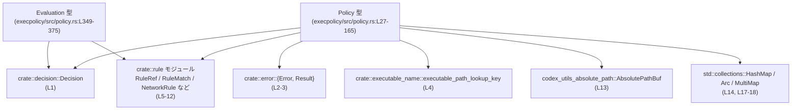
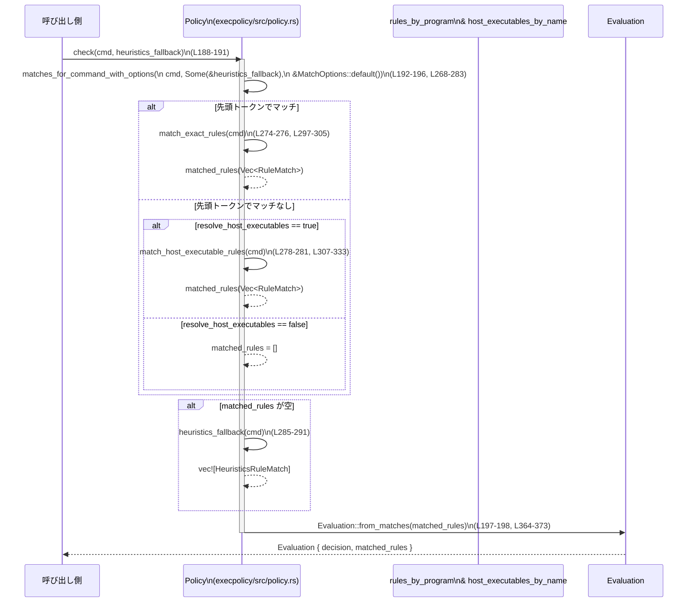

# execpolicy/src/policy.rs コード解説

## 0. ざっくり一言

- コマンド実行およびネットワークアクセスに対する **ルール（許可 / 禁止 / プロンプト）を保持し、コマンド列やホスト名を評価するポリシーエンジンの中核モジュール**です（`Policy` / `Evaluation`）（execpolicy/src/policy.rs:L27-32, L349-355）。
- ルールの登録・マージ・照合（プレフィックスマッチやホスト実行ファイル解決）と、最終的な意思決定の集約を行います（L35-165, L167-186, L188-295）。

---

## 1. このモジュールの役割

### 1.1 概要

- このモジュールは、**プログラム実行とネットワークドメインに関するポリシー判定**を行うために存在し、以下の機能を提供します。
  - プログラム名やコマンドライン引数に基づくルール（`RuleRef`/`PrefixRule`）の保持と照合（L27-32, L67-89, L188-295）。
  - ネットワークアクセス用ルール（`NetworkRule`）の追加と、「許可/拒否」ドメイン一覧の生成（L30, L113-135, L167-186, L337-340）。
  - 実行ファイルのフルパスからホスト上の「既知の実行ファイル名」に解決してルールを適用するロジック（L31, L137-139, L307-333）。
  - 上記の結果を `Evaluation` 構造体として集約し、最終的な `Decision` とマッチしたルール一覧を返却する（L349-375）。

### 1.2 アーキテクチャ内での位置づけ

このモジュールが依存している主要コンポーネントを簡略図で示します。



- `Policy` はルール集合と評価ロジックを一手に引き受ける「サービス」的役割です（L27-32, L34-335）。
- `Evaluation` は評価結果のデータ転送オブジェクト（DTO）的な役割で、シリアライズ属性も付与されています（L349-355）。

### 1.3 設計上のポイント

コードから読み取れる特徴を列挙します。

- **責務分割**
  - `Policy` はルールの保持・更新・照合までを担当し、判定結果そのものは `Evaluation` にまとめています（L27-32, L188-212, L349-375）。
  - ネットワークルール関連処理は `NetworkRule` 型と `compiled_network_domains` に集約されています（L30, L113-135, L167-186）。
  - 実行ファイルのパス解決は `match_host_executable_rules` と `host_executables_by_name` マップに封じ込められています（L31, L137-139, L307-333）。

- **状態の扱い**
  - `Policy` は `MultiMap<String, RuleRef>` と `HashMap<String, Arc<[AbsolutePathBuf]>>` をフィールドに持つ **状態を持つ構造体**です（L27-32）。
  - ルールの追加やマージは `&mut self` メソッドで行い（例: `add_network_rule`, `add_prefix_rule`, `set_host_executable_paths`（L91-111, L113-139））、評価系メソッドは `&self` で読み取り専用です（L167-295）。

- **エラーハンドリング**
  - ルール追加系メソッドは `Result<()>` を返し、入力バリデーションに失敗した場合に `Error` を返します（L91-111, L113-135）。
  - ネットワークホスト文字列の正規化や justification の空文字チェックなど、**入力バリデーションを明示的に行ってから内部状態を更新**しています（L120-127）。
  - `Evaluation::from_matches` は `matched_rules` が空であれば `expect` により panic するため、「呼び出し側が非空を保証する」という契約になっています（L364-368）。

- **並行性**
  - このファイル内には `unsafe`、スレッド同期原語（`Mutex`, `RwLock` など）、`async` 関連構文は登場しません。
  - `Policy` 自体は通常の所有権に基づく構造体であり、`Arc` を用いて参照カウント付き共有を行うフィールドがありますが（`RuleRef`, `Arc<[AbsolutePathBuf]>`）（L31, L96-107, L137-139）、並行アクセス制御は **このモジュールの外側の責任**です。

---

## 2. 主要な機能一覧

このモジュールが提供する主な機能を列挙します。

- **ポリシーオブジェクトの構築**
  - `Policy::new`, `Policy::from_parts`, `Policy::empty` による `Policy` インスタンスの生成（L35-53）。
- **ルールの登録**
  - コマンドラインの先頭トークンに基づくプレフィックスルール追加 (`add_prefix_rule`)（L91-111）。
  - ネットワークアクセスルールの追加 (`add_network_rule`)（L113-135）。
  - ホスト上の実行ファイルパス一覧の設定 (`set_host_executable_paths`)（L137-139）。
- **ポリシーの合成**
  - ベースポリシーにオーバーレイポリシーを重ねる `merge_overlay`（L141-165）。
- **ネットワークドメイン一覧の生成**
  - 許可・禁止されたホスト名リストを生成する `compiled_network_domains`（L167-186, L337-340）。
- **コマンド評価（単体）**
  - 単一のコマンド（`&[String]`）に対する評価 `check`, `check_with_options`（L188-212）。
- **コマンド評価（複数）**
  - 複数コマンドをまとめて評価し、マッチしたルールを集約する `check_multiple`, `check_multiple_with_options`（L214-251）。
- **マッチングロジック**
  - ルールマッチの取得（必要に応じてヒューリスティックフォールバックを使用）する `matches_for_command`, `matches_for_command_with_options`（L253-295）。
  - 正確なプログラム名に対するマッチ `match_exact_rules` と、フルパスからホスト実行ファイル名を解決してマッチする `match_host_executable_rules`（L297-333）。
- **評価結果の表現**
  - `Evaluation` 型と、明示的ルールがマッチしているか確認する `Evaluation::is_match`（L349-362）。
  - 内部用の `Evaluation::from_matches` による `Decision` の集約（最大の `Decision` を採用）（L364-373）。

---

## 3. 公開 API と詳細解説

### 3.1 型一覧（構造体・列挙体など）

このファイルで定義される型の一覧です。

| 名前 | 種別 | 公開 | 役割 / 用途 | 主なフィールド / 内容 | 定義位置 |
|------|------|------|-------------|------------------------|----------|
| `HeuristicsFallback<'a>` | 型エイリアス | 非公開 | `Fn(&[String]) -> Decision` 型の関数参照を `Option` でラップしたもの。ヒューリスティクス用フォールバック関数の有無を表す | `Option<&'a dyn Fn(&[String]) -> Decision>` | execpolicy/src/policy.rs:L20-20 |
| `MatchOptions` | 構造体 | 公開 | ルールマッチ時のオプションを表す。現在は「ホスト実行ファイル解決を行うか」のフラグのみを持つ | `resolve_host_executables: bool` | execpolicy/src/policy.rs:L22-25 |
| `Policy` | 構造体 | 公開 | コマンド実行ルールとネットワークルール、およびホスト実行ファイル情報を保持し、評価 API を提供する中核コンポーネント | `rules_by_program: MultiMap<String, RuleRef>`, `network_rules: Vec<NetworkRule>`, `host_executables_by_name: HashMap<String, Arc<[AbsolutePathBuf]>>` | execpolicy/src/policy.rs:L27-32 |
| `Evaluation` | 構造体 | 公開 | 一度の評価における最終 `Decision` と、対象となった `RuleMatch` の一覧を表現する結果オブジェクト | `decision: Decision`, `matched_rules: Vec<RuleMatch>`（シリアライズ時 `"matchedRules"`） | execpolicy/src/policy.rs:L349-355 |

※ `RuleRef`, `RuleMatch`, `NetworkRule`, `Decision` などは別モジュールで定義されており、このチャンクには定義が現れません（L1-12, L349-355）。

---

### 3.2 関数詳細（主要 7 件）

#### `Policy::add_prefix_rule(&mut self, prefix: &[String], decision: Decision) -> Result<()>`

**概要**

- コマンドラインの先頭トークンとその後続トークン列からなる **プレフィックスルール** を作成し、`rules_by_program` に追加します（L91-111）。
- 空の `prefix` が渡された場合はエラーとして `Error::InvalidPattern` を返します（L92-95）。

**引数**

| 引数名 | 型 | 説明 |
|--------|----|------|
| `prefix` | `&[String]` | コマンドラインのプレフィックスに対応するトークン列。少なくとも 1 要素以上が必要です（L92-95）。 |
| `decision` | `Decision` | このプレフィックスがマッチした場合に採用される意思決定（Allow/Forbidden/Prompt など）（L105）。 |

**戻り値**

- `Result<()>`  
  - 成功時は `Ok(())` を返し、`Policy` 内部の `rules_by_program` にルールが追加されます（L96-111）。
  - 失敗時は `Error` を返します（L92-95）。

**内部処理の流れ**

1. `prefix.split_first()` で先頭トークンと残りを分割し、空の `prefix` の場合は `Error::InvalidPattern("prefix cannot be empty")` を返す（L92-95）。
2. `PrefixRule` 構造体を構築する:
   - `pattern.first` に先頭トークンを `Arc<str>` としてセット（L97-99）。
   - `pattern.rest` に残りのトークンを `PatternToken::Single` に包んだベクタとして格納（L99-103）。
   - `decision` と `justification: None` を設定（L105-107）。
3. `Arc<PrefixRule>` を `RuleRef` に変換し、`rules_by_program` のキーを「先頭トークンの文字列」として挿入する（L96, L109）。
4. `Ok(())` を返す（L110-111）。

**Examples（使用例）**

単純なプレフィックスルールを追加し、`check` で評価する例です。

```rust
use crate::decision::Decision;
use execpolicy::policy::{Policy, MatchOptions}; // 実際のパスはこのチャンクからは不明

fn example_add_prefix_rule() -> Result<(), crate::error::Error> {
    // 空のポリシーを作成する（L51-53）
    let mut policy = Policy::empty();

    // "ls -la" で始まるコマンドを許可するルールを追加する（L91-111）
    let prefix = vec!["ls".to_string(), "-la".to_string()];
    policy.add_prefix_rule(&prefix, Decision::Allow)?;

    // 評価するコマンド
    let cmd = vec!["ls".to_string(), "-la".to_string(), "/tmp".to_string()];

    // ヒューリスティクスは常に Prompt を返すダミー関数とする
    let heuristics = |_: &[String]| Decision::Prompt;

    // ルールにマッチしているので、Evaluation::decision は Allow になる（L188-198）
    let eval = policy.check(&cmd, &heuristics);
    assert_eq!(eval.decision, Decision::Allow);

    Ok(())
}
```

**Errors / Panics**

- `prefix` が空のとき:
  - `split_first()` が `None` を返し、`Error::InvalidPattern("prefix cannot be empty")` を返します（L92-95）。
- この関数自身はパニックを起こしません（`expect` などは使用していません）。

**Edge cases**

- `prefix` が 1 要素だけの場合:
  - `pattern.rest` は空のスライスになりますが、先頭トークンに基づくマッチングは問題なく行われます（L97-103）。
- `prefix` 内の文字列が空文字でも、特別なチェックは行っていません。ルールとしてそのまま扱われます（L92-107）。

**使用上の注意点**

- `prefix` の先頭トークンが `rules_by_program` のキーになるため、**実際にコマンドラインで使用される先頭トークンと一致している必要**があります（`match_exact_rules` が `cmd.first()` をキーにしているため）（L297-303）。
- 既に同じキーにルールが存在する場合でも、そのまま追加され、複数ルールが同一プログラム名に紐づきます（`MultiMap::insert` 利用、L109）。優先順位は `RuleRef::matches` と `Decision` の定義に依存し、このチャンクからは不明です。

---

#### `Policy::add_network_rule(&mut self, host: &str, protocol: NetworkRuleProtocol, decision: Decision, justification: Option<String>) -> Result<()>`

**概要**

- ネットワークアクセス用のルール（`NetworkRule`）を追加します（L113-135）。
- ホスト名の正規化と justification の空文字チェックを行い、無効な定義を拒否します（L120-127）。

**引数**

| 引数名 | 型 | 説明 |
|--------|----|------|
| `host` | `&str` | ルールを適用するホスト名。`normalize_network_rule_host` による正規化対象です（L115, L120）。 |
| `protocol` | `NetworkRuleProtocol` | プロトコル種別（例: TCP/UDP/HTTPS 等と推測されますが、このチャンクからは詳細不明）（L116, L128-131）。 |
| `decision` | `Decision` | ホストに対する許可/禁止/プロンプトを表す（L117, L131）。 |
| `justification` | `Option<String>` | ルールの根拠や説明文。`Some("")` や空白のみはエラー扱いになります（L118, L121-127）。 |

**戻り値**

- `Result<()>`
  - 成功時は `Ok(())` を返し、`network_rules` に新しい `NetworkRule` を push します（L128-135）。
  - 失敗時は `Error`（`Error::InvalidRule` または `normalize_network_rule_host` 由来のエラー）を返します（L120-127）。

**内部処理の流れ**

1. `normalize_network_rule_host(host)` を呼び出し、ホスト名を正規化する。ここでエラーが発生した場合はそのまま返される（L120）。
2. `justification` が `Some(raw)` かつ `raw.trim().is_empty()` の場合、`Error::InvalidRule("justification cannot be empty")` を返す（L121-127）。
3. 正規化済み `host`、指定された `protocol` と `decision`、元の `justification` を使って `NetworkRule` を生成し、`self.network_rules` に push する（L128-133）。
4. `Ok(())` を返す（L134-135）。

**Examples（使用例）**

```rust
use crate::decision::Decision;
use crate::rule::NetworkRuleProtocol;
use execpolicy::policy::Policy; // 実際のモジュールパスは不明

fn example_add_network_rule() -> Result<(), crate::error::Error> {
    let mut policy = Policy::empty(); // L51-53

    // "example.com" への HTTPS (仮) アクセスを許可し、理由を残す
    policy.add_network_rule(
        "Example.COM",                         // 大文字混じりだが normalize される（L120）
        NetworkRuleProtocol::Https,            // プロトコル種別（定義はこのチャンクには現れない）
        Decision::Allow,                       // 許可（L131）
        Some("required by application X".into()) // justification は空でない必要（L121-127）
    )?;

    Ok(())
}
```

**Errors / Panics**

- `normalize_network_rule_host(host)` がエラーを返した場合:
  - そのエラーを `?` でそのまま呼び出し元へ伝播します（L120）。
- `justification` が `Some` だが中身が空または空白のみの場合:
  - `Error::InvalidRule("justification cannot be empty")` を返します（L121-127）。
- パニックを引き起こすコードは含まれていません（`expect` 等なし）。

**Edge cases**

- `justification: None` の場合:
  - 空文字チェックは行われず、そのまま `NetworkRule` に `None` が入ります（L121-127, L128-133）。
- 既に同じホスト・プロトコルのルールが存在する場合:
  - 何も削除せず、単純に新しいルールを末尾に追加するだけです（L128-133）。後続処理（`compiled_network_domains`）での扱いはホスト名単位で行われます（プロトコルは無視）（L167-186）。

**使用上の注意点**

- この関数は `NetworkRule` を単純に追加するだけで、**重複や矛盾するルールの整理は行いません**（L128-135）。最終的なリストの意味は `compiled_network_domains` に依存します（L167-186）。
- justification を必須にはしていませんが、与える場合は **空文字・空白のみを避ける必要**があります（L121-127）。

---

#### `Policy::compiled_network_domains(&self) -> (Vec<String>, Vec<String>)`

**概要**

- `network_rules` に登録されたルールから、**許可されたホスト一覧 (`allowed`) と禁止されたホスト一覧 (`denied`) を生成**します（L167-186）。
- 同一ホストに対して複数のルールがある場合、最後に処理された `Allow` / `Forbidden` ルールが優先される形でホストごとに一意化されます（L171-183, L337-340）。

**引数**

- なし（`&self` のみ）。

**戻り値**

- `(Vec<String>, Vec<String>)`
  - 第 1 要素: 許可されたホスト名のリスト（`Decision::Allow` ベース）（L167-169, L173-176）。
  - 第 2 要素: 禁止されたホスト名のリスト（`Decision::Forbidden` ベース）（L167-169, L177-180）。

**内部処理の流れ**

1. `allowed` と `denied` の空ベクタを作成する（L168-169）。
2. `self.network_rules` を順に走査する（L171）。
3. 各 `rule.decision` に応じて:
   - `Decision::Allow`:
     - `denied` から同じ `rule.host` のエントリを削除（`retain`）し（L174）、`allowed` へ `upsert_domain`（一意上書き）する（L175, L337-340）。
   - `Decision::Forbidden`:
     - `allowed` から同じ `rule.host` のエントリを削除し（L178）、`denied` へ `upsert_domain` する（L179, L337-340）。
   - `Decision::Prompt`:
     - 許可/禁止リストには影響を与えません（L181）。
4. `(allowed, denied)` を返す（L185-186）。

`upsert_domain` の挙動:

- 指定ホストを一旦 `entries` ベクタから削除し（L337-339）、末尾に `host.to_string()` を追加します（L339-340）。
- これにより、**最後に現れたルールが優先**される形で一意なリストが保たれます。

**Examples（使用例）**

```rust
fn example_compiled_network_domains(policy: &execpolicy::policy::Policy) {
    // 事前に add_network_rule でルールが複数登録されていると仮定（L113-135）

    let (allowed, denied) = policy.compiled_network_domains(); // L167-186

    // allowed / denied はホスト名単位で一意のリスト
    for host in allowed {
        println!("allowed host: {}", host);
    }
    for host in denied {
        println!("denied host: {}", host);
    }
}
```

**Errors / Panics**

- この関数は `Result` を返さず、`expect` 等も使用していないため、**エラーを返したりパニックを起こしたりしません**（L167-186, L337-340）。

**Edge cases**

- `network_rules` が空の場合:
  - 両方のベクタは空のまま返されます（L168-169, L171-186）。
- 同一ホストに対し `Allow`, `Forbidden` が交互に追加されている場合:
  - 最後のルールの `Decision` に応じて、最終的に `allowed` または `denied` のどちらか一方のリストにのみ出現します（L173-180, L337-340）。
- 同一ホスト・異なるプロトコルのルール:
  - この関数は `rule.protocol` を参照していないため、**プロトコルに関係なくホスト名単位で集約**します（L171-181）。プロトコル単位での制御が必要な場合は、別途処理が必要です。

**使用上の注意点**

- この関数は `Decision::Prompt` のルールを完全に無視するため、**プロンプトすべきホストの一覧は別途 `network_rules` 自体から抽出する必要**があります（L171-181）。
- セキュリティ上、`denied` リストは「明示的に Forbidden なホストのみ」を指し、ルールが存在しないホストは含まれません。

---

#### `Policy::matches_for_command_with_options(&self, cmd: &[String], heuristics_fallback: HeuristicsFallback<'_>, options: &MatchOptions) -> Vec<RuleMatch>`

**概要**

- 単一のコマンド（`&[String]`）に対して、**該当するルールのマッチングを実行**し、その `RuleMatch` を列挙して返します（L268-295）。
- ルールが一切マッチしない場合、`heuristics_fallback` が指定されていれば **ヒューリスティクスによる 1 件の `HeuristicsRuleMatch` を生成**します（L285-291）。

**引数**

| 引数名 | 型 | 説明 |
|--------|----|------|
| `cmd` | `&[String]` | 評価対象のコマンドライン。先頭要素が「プログラム名またはパス」として扱われます（L270, L297-312）。 |
| `heuristics_fallback` | `HeuristicsFallback<'_>` | 明示的ルールがマッチしなかった場合に呼ばれるフォールバック関数（オプション）。`None` の場合はヒューリスティクスは使用されません（L271-272, L285-291）。 |
| `options` | `&MatchOptions` | マッチング時のオプション。現状は `resolve_host_executables` のみを使用してホスト実行ファイルルールの解決有無を制御します（L272, L278-281, L22-25）。 |

**戻り値**

- `Vec<RuleMatch>`
  - 明示的なルール (`RuleRef`) によるマッチ結果、または（ルールがない場合の）ヒューリスティクスによる `HeuristicsRuleMatch` を含むベクタ（L274-295）。
  - `heuristics_fallback` が `Some` の場合、戻りベクタは必ず少なくとも 1 要素になることが保証されます（コメントは `matches_for_command` にあるが、実装はこの関数に基づきます）（L285-291, L260-266）。

**内部処理の流れ**

1. まず `match_exact_rules(cmd)` を呼び出し、先頭トークンに基づくルールマッチを試みる（L274-276, L297-305）。
   - 戻り値が `Some(vec)` で `!vec.is_empty()` の場合、その `vec` を採用します（L274-276）。
2. `match_exact_rules` が `None` または空ベクタを返した場合:
   - `options.resolve_host_executables` が `true` なら `match_host_executable_rules(cmd)` を試みます（L278-281, L22-25, L307-333）。
   - ここでも空ベクタであれば失敗と見なし、`None` を返します。
3. 1 と 2 の結果、どちらもマッチしなかった場合は `unwrap_or_default()` により空の `Vec<RuleMatch>` を得ます（L283）。
4. `matched_rules` が空で、かつ `heuristics_fallback` が `Some(f)` であれば:
   - `RuleMatch::HeuristicsRuleMatch { command: cmd.to_vec(), decision: f(cmd) }` を 1 要素だけ持つベクタを返します（L285-291）。
5. それ以外の場合は、`matched_rules` をそのまま返します（L292-294）。

**Examples（使用例）**

```rust
fn example_matches_for_command(policy: &execpolicy::policy::Policy) {
    // 評価対象コマンド
    let cmd = vec!["/usr/bin/curl".to_string(), "https://example.com".to_string()];

    // ルールがない場合は Allow するヒューリスティクス
    let heuristics = |_: &[String]| crate::decision::Decision::Allow;

    // ホスト実行ファイル解決を有効にする（L22-25）
    let options = execpolicy::policy::MatchOptions {
        resolve_host_executables: true,
    };

    let matches = policy.matches_for_command_with_options(&cmd, Some(&heuristics), &options); // L268-295

    // matches が空の可能性:
    // - 明示ルールはない
    // - heuristics_fallback が None
    // の場合のみ。ここでは Some(...) を渡しているため、必ず 1 件以上になる（L285-291）。
    assert!(!matches.is_empty());
}
```

**Errors / Panics**

- この関数は `Result` を返さず、panic を起こしうるコード (`expect`, `unwrap`) を内部で使用していません（L268-295）。
- ただし、間接的に呼び出している `match_host_executable_rules` 内では `AbsolutePathBuf::try_from` や `executable_path_lookup_key` が `Result` / `Option` を返し、その失敗を「空ベクタ」（マッチなし）として扱っています（L311-315）。**パニックには変換されません**。

**Edge cases**

- `cmd` が空 (`cmd.first()` が `None`) の場合:
  - `match_exact_rules` は `None` を返し（L297-299）、`match_host_executable_rules` もすぐに空ベクタを返します（L308-310）。
  - その結果 `matched_rules` は空となり、`heuristics_fallback` が `Some` ならヒューリスティクスマッチ 1 件のみが返されます（L285-291）。
- `options.resolve_host_executables == false` の場合:
  - `match_host_executable_rules` は呼ばれず、**プログラム名の完全一致のみでルールを探す**ことになります（L278-281）。

**使用上の注意点**

- **明示ルールがマッチしなかった場合の挙動は `heuristics_fallback` の有無に依存**します。`Policy::check` 系 API は常に `Some` を渡す設計なので、空になることはありません（L188-212）。
- `cmd` に渡すスライスは、それ自体の寿命がこの関数呼び出し中に十分長いことが必要ですが、内部では `cmd.to_vec()` でコピーしているため、`HeuristicsRuleMatch` 内の `command` は所有された `Vec<String>` になります（L288-289）。所有権・ライフタイムの衝突は避けられています。

---

#### `Policy::check(&self, cmd: &[String], heuristics_fallback: &F) -> Evaluation`

**概要**

- 単一のコマンドに対し、**デフォルトの `MatchOptions` を用いてルールマッチングを行い、その結果から `Evaluation` を生成**します（L188-198）。
- ヒューリスティクスを必ず指定するため、戻り値の `Evaluation` は内部的に `matched_rules` が必ず 1 件以上になるよう設計されています（L188-198, L364-368）。

**引数**

| 引数名 | 型 | 説明 |
|--------|----|------|
| `cmd` | `&[String]` | 評価対象のコマンドライン（L188-190）。 |
| `heuristics_fallback` | `&F`（`F: Fn(&[String]) -> Decision`） | 明示ルールがマッチしなかった場合のフォールバックとして呼ばれる関数オブジェクト（L188-191）。 |

**戻り値**

- `Evaluation`
  - 最終決定 `decision` と、`RuleMatch` の一覧 `matched_rules` を持つ評価結果（L197-198, L349-355）。

**内部処理の流れ**

1. `MatchOptions::default()` を生成する（`resolve_host_executables` は `false` になる）（L22-25, L193-196）。
2. `matches_for_command_with_options(cmd, Some(heuristics_fallback), &MatchOptions::default())` を呼び出して、マッチしたルールの一覧を取得する（L192-196）。
3. 得られた `matched_rules` を `Evaluation::from_matches(matched_rules)` に渡し、`Evaluation` を生成して返す（L197-198, L364-373）。

**Examples（使用例）**

```rust
fn example_check(policy: &execpolicy::policy::Policy) {
    let cmd = vec!["/usr/bin/ssh".to_string(), "example.com".to_string()];

    // ルールがなければ Forbidden にするヒューリスティクス
    let heuristics = |_: &[String]| crate::decision::Decision::Forbidden;

    let eval = policy.check(&cmd, &heuristics); // L188-198

    // eval.decision は、ルールがマッチすればその最大優先度の Decision、
    // マッチしなければ heuristics の結果になります（L364-372）
    println!("decision: {:?}", eval.decision);
}
```

**Errors / Panics**

- この関数自体は `Result` を返さず、エラーにはなりません。
- 内部で `Evaluation::from_matches` が `expect` を使用しており、`matched_rules` が空の場合は panic します（L364-368）。
  - ただし `matches_for_command_with_options` を `heuristics_fallback: Some(...)` 付きで呼ぶため、設計上 `matched_rules` は必ず 1 件以上となり、この panic は「到達しない前提」の防御的コードになっています（L192-196, L285-291）。

**Edge cases**

- `cmd` が空の場合:
  - ルールはマッチせず、`heuristics_fallback(cmd)` による `HeuristicsRuleMatch` 1 件のみとなります（L285-291）。
  - それでも `matched_rules` は非空なので `Evaluation::from_matches` の `expect` は発火しません。

**使用上の注意点**

- ホスト実行ファイル解決 (`resolve_host_executables`) は無効 (`false`) のままです（L193-196, L22-25）。フルパスのプログラム名に対して basename ルールを適用したい場合は、`check_with_options` を使用して `MatchOptions` を明示的に指定する必要があります。

---

#### `Policy::check_with_options(&self, cmd: &[String], heuristics_fallback: &F, options: &MatchOptions) -> Evaluation`

**概要**

- `check` と同様に単一コマンドを評価しますが、**呼び出し側が `MatchOptions` を明示的に指定できる**拡張版です（L200-212）。
- `resolve_host_executables` を true にすることで、フルパスからホスト実行ファイル名への解決ロジックを有効化できます（L278-281, L307-333）。

**引数**

| 引数名 | 型 | 説明 |
|--------|----|------|
| `cmd` | `&[String]` | 評価対象コマンド（L201-204）。 |
| `heuristics_fallback` | `&F` | フォールバック関数（L203-207）。 |
| `options` | `&MatchOptions` | マッチングオプション。`resolve_host_executables` の値を参照します（L204-205, L272-281）。 |

**戻り値**

- `Evaluation`（`check` と同様）（L210-212, L349-355）。

**内部処理の流れ**

1. `matches_for_command_with_options(cmd, Some(heuristics_fallback), options)` を呼び出してルールを収集（L209-210）。
2. `Evaluation::from_matches(matched_rules)` で `Evaluation` を生成（L211-212）。

**Examples（使用例）**

```rust
fn example_check_with_options(policy: &execpolicy::policy::Policy) {
    let cmd = vec!["/usr/bin/git".to_string(), "status".to_string()];

    let heuristics = |_: &[String]| crate::decision::Decision::Prompt;

    let options = execpolicy::policy::MatchOptions {
        resolve_host_executables: true, // ホスト実行ファイル解決を有効化（L22-25）
    };

    let eval = policy.check_with_options(&cmd, &heuristics, &options); // L200-212
    println!("decision: {:?}", eval.decision);
}
```

**Errors / Panics**

- `check` と同様、`Evaluation::from_matches` 依存の `expect` のみが潜在的なパニック要因です（L364-368）。
- こちらも `heuristics_fallback: Some(...)` を渡しているため、設計上 `matched_rules` は必ず非空です（L209-210, L285-291）。

**Edge cases**

- `options.resolve_host_executables == true` でも、`cmd[0]` が有効なパスとして `AbsolutePathBuf::try_from` によって解釈できない場合、**ホスト実行ファイル解決は行われず、結果として単なるプログラム名マッチの挙動になります**（L311-313, L278-281）。

**使用上の注意点**

- フルパスの実行ファイルに対して basename ルールを適用したい場合は、
  - `MatchOptions { resolve_host_executables: true }`
  - `Policy::set_host_executable_paths` によるホスト上の実行ファイルパス登録  
  の両方が必要になります（L22-25, L137-139, L307-323）。

---

#### `Evaluation::is_match(&self) -> bool`

**概要**

- `Evaluation` に含まれる `matched_rules` の中に、**ヒューリスティクスではない明示的ルールマッチが 1 つでも存在するか**を判定します（L358-362）。
- これにより、「今の決定が既存ルールによるものか、ヒューリスティクスによるものか」を区別できます。

**引数**

- `&self` のみ。

**戻り値**

- `bool`  
  - `true`: 少なくとも 1 つの `RuleMatch` が `HeuristicsRuleMatch` 以外である場合（L359-362）。
  - `false`: `matched_rules` が全てヒューリスティクスマッチ、あるいは空である場合（後者は `from_matches` の契約上、通常は起こりません）（L359-362, L364-368）。

**内部処理の流れ**

1. `self.matched_rules.iter()` でルールマッチを走査（L359-360）。
2. `matches!` マクロを用い、`RuleMatch::HeuristicsRuleMatch { .. }` ではないものが 1 つでもあれば `any(...)` が `true` を返す（L359-362）。
3. その結果を返却（L358-362）。

**Examples（使用例）**

```rust
fn example_is_match(eval: &execpolicy::policy::Evaluation) {
    if eval.is_match() { // L358-362
        println!("matched by explicit policy rule");
    } else {
        println!("no explicit rule matched; decision is from heuristics");
    }
}
```

**Errors / Panics**

- パニックやエラーを発生させるコードは使用していません（L358-362）。

**Edge cases**

- `Evaluation` がヒューリスティクスマッチのみを含む場合（`RuleMatch::HeuristicsRuleMatch` のみ）:
  - `is_match()` は `false` を返します（L359-362）。
- `matched_rules` が空の場合:
  - `any(...)` は `false` になるため `false` を返しますが、通常 `Evaluation` は `from_matches` によって生成されるため、空の `matched_rules` を持つことは契約違反です（L364-368）。

**使用上の注意点**

- クライアントコードが「**ポリシーファイルによる明示的ルールが適用されたかどうか**」を知りたい場合に利用できます。
- ヒューリスティクスベースの決定をユーザーに説明する際、`is_match() == false` の場合は「この決定はポリシーではなくヒューリスティクスに基づく」と扱うのが自然です。

---

### 3.3 その他の関数（コンポーネントインベントリー）

このファイル内のその他の関数・メソッドを一覧にします。

| 関数名 | 種別 | 公開 | 役割（1 行） | 定義位置 |
|--------|------|------|--------------|----------|
| `Policy::new` | 関連関数 | 公開 | `rules_by_program` のみを与えて `Policy` を構築（`network_rules` / `host_executables_by_name` は空） | execpolicy/src/policy.rs:L35-37 |
| `Policy::from_parts` | 関連関数 | 公開 | 3 つのフィールドを全て指定して `Policy` を構築 | L39-48 |
| `Policy::empty` | 関連関数 | 公開 | 空の `MultiMap` を使って空ポリシーを生成 | L51-53 |
| `Policy::rules` | メソッド | 公開 | `rules_by_program` への参照を返すゲッター | L55-57 |
| `Policy::network_rules` | メソッド | 公開 | `network_rules` スライスを返すゲッター | L59-61 |
| `Policy::host_executables` | メソッド | 公開 | `host_executables_by_name` への参照を返すゲッター | L63-65 |
| `Policy::get_allowed_prefixes` | メソッド | 公開 | `Decision::Allow` な `PrefixRule` だけを抽出し、文字列のプレフィックスリストを返す | L67-89 |
| `Policy::set_host_executable_paths` | メソッド | 公開 | 実行ファイル名に対応するホスト上の実行ファイルパス一覧を登録 | L137-139 |
| `Policy::merge_overlay` | メソッド | 公開 | 別の `Policy` をオーバーレイとして現在のポリシーにマージした新しい `Policy` を返す | L141-165 |
| `Policy::check_multiple` | メソッド | 公開 | 複数コマンドに対する評価を、デフォルトオプションで集約 | L215-226 |
| `Policy::check_multiple_with_options` | メソッド | 公開 | 複数コマンドに対し `MatchOptions` を指定して評価を集約 | L228-251 |
| `Policy::matches_for_command` | メソッド | 公開 | `MatchOptions::default()` を使った `matches_for_command_with_options` のラッパー | L260-266 |
| `Policy::match_exact_rules` | メソッド | 非公開 | 先頭トークンに完全一致するプログラム名のルールだけを使ってマッチング | L297-305 |
| `Policy::match_host_executable_rules` | メソッド | 非公開 | コマンド先頭トークンをパスとして解釈し、basename + ホスト実行ファイル情報を用いてルールマッチング | L307-333 |
| `upsert_domain` | 関数 | 非公開 | ベクタ内のホスト名の既存エントリを削除し、末尾に追加して一意 & 最新化する | L337-340 |
| `render_pattern_token` | 関数 | 非公開 | `PatternToken` を文字列表現（例: `[alt1|alt2]`）に変換 | L342-346 |
| `Evaluation::from_matches` | 関連関数 | 非公開 | `RuleMatch` のリストから最大の `Decision` を選び、`Evaluation` を構築（空の場合は panic） | L364-373 |

---

## 4. データフロー

ここでは、**単一コマンドの評価 (`Policy::check`)** を例に、データの流れを説明します。

### 処理の要点

1. 呼び出し側は `cmd: &[String]` と `heuristics_fallback` 関数を渡して `Policy::check` を呼び出します（L188-191）。
2. `check` は `MatchOptions::default()` とともに `matches_for_command_with_options` を呼び出し、`RuleMatch` の集合を取得します（L192-196）。
3. `matches_for_command_with_options` はまず `match_exact_rules` を試み、マッチがなければ `match_host_executable_rules` を条件付きで試みます（L274-283, L297-305, L307-333）。
4. それでもマッチがなければ、`heuristics_fallback` を用いて `HeuristicsRuleMatch` 1 件を生成します（L285-291）。
5. 最終的に `Evaluation::from_matches` で `Decision` を集約し、`Evaluation` を返します（L197-198, L364-373）。

### シーケンス図



（主に `execpolicy/src/policy.rs:L188-198, L268-295, L297-305, L307-333, L364-373` に対応）

---

## 5. 使い方（How to Use）

### 5.1 基本的な使用方法

ここでは、最小限のルールを設定してコマンドを評価する基本パターンを示します。

```rust
use crate::decision::Decision;
use execpolicy::policy::{Policy, MatchOptions}; // 実際のクレートパスはこのチャンクからは不明

fn main() -> Result<(), crate::error::Error> {
    // 1. 空のポリシーを作成（L51-53）
    let mut policy = Policy::empty();

    // 2. プレフィックスルールを追加: "rm -rf" を禁止（L91-111）
    let dangerous_prefix = vec!["rm".to_string(), "-rf".to_string()];
    policy.add_prefix_rule(&dangerous_prefix, Decision::Forbidden)?;

    // 3. ネットワークルールを追加: "bad.example.com" を禁止（L113-135）
    policy.add_network_rule(
        "bad.example.com",
        crate::rule::NetworkRuleProtocol::Https, // プロトコル定義は別モジュール
        Decision::Forbidden,
        Some("blocked for security reasons".into()),
    )?;

    // 4. 評価したいコマンドを用意
    let cmd = vec!["rm".to_string(), "-rf".to_string(), "/tmp/data".to_string()];

    // 5. ヒューリスティクス: ルールがなければ Prompt にする（L188-198）
    let heuristics = |_: &[String]| Decision::Prompt;

    // 6. ポリシーを評価
    let eval = policy.check(&cmd, &heuristics);

    // 7. 結果を利用
    println!("Decision: {:?}", eval.decision);
    if eval.is_match() { // 明示的ルールがマッチしたか（L358-362）
        println!("Matched explicit policy rule(s).");
    } else {
        println!("Decision is from heuristics.");
    }

    Ok(())
}
```

### 5.2 よくある使用パターン

1. **複数コマンドの一括評価**

```rust
fn evaluate_multiple(policy: &execpolicy::policy::Policy) {
    let commands = vec![
        vec!["ls".to_string(), "-la".to_string()],
        vec!["/usr/bin/ssh".to_string(), "example.com".to_string()],
    ];

    let heuristics = |cmd: &[String]| {
        println!("heuristics called for {:?}", cmd);
        crate::decision::Decision::Prompt
    };

    // すべてのコマンドに対する RuleMatch を集約した Evaluation を得る（L228-251）
    let eval = policy.check_multiple(commands, &heuristics);

    println!("overall decision: {:?}", eval.decision);
    println!("matched_rules.len() = {}", eval.matched_rules.len());
}
```

- `check_multiple` / `check_multiple_with_options` は **各コマンドに対する `matches_for_command_with_options` の結果をベクタに平坦化してから `Evaluation::from_matches` に渡しています**（L239-250, L364-373）。

1. **ホスト実行ファイル解決を使う**

```rust
fn evaluate_with_host_executables(mut policy: execpolicy::policy::Policy) {
    use codex_utils_absolute_path::AbsolutePathBuf;

    // ホスト上で "git" として扱いたい実行ファイルのパスを登録（L137-139）
    let git_paths = vec![AbsolutePathBuf::try_from("/usr/bin/git".to_string()).unwrap()];
    policy.set_host_executable_paths("git".to_string(), git_paths);

    // "git status" を basename ベースのルールで評価したい（L307-333）
    let cmd = vec!["/usr/bin/git".to_string(), "status".to_string()];

    let heuristics = |_: &[String]| crate::decision::Decision::Prompt;

    let options = execpolicy::policy::MatchOptions {
        resolve_host_executables: true,
    };

    let eval = policy.check_with_options(&cmd, &heuristics, &options); // L200-212

    println!("decision: {:?}", eval.decision);
}
```

- `match_host_executable_rules` は `cmd[0]` を `AbsolutePathBuf` に変換し、`executable_path_lookup_key` で basename を求め、その basename に紐づくルールを適用します（L311-319, L326-333）。
- さらに `host_executables_by_name` に登録されたパスに `program` が含まれていない場合、**マッチはすべて無効とされます**（L320-323）。

### 5.3 よくある間違い

```rust
// 間違い例: check_multiple_with_options に空のコマンド列を渡す
fn wrong_empty_commands(policy: &execpolicy::policy::Policy) {
    let commands: Vec<Vec<String>> = Vec::new();

    let heuristics = |_: &[String]| crate::decision::Decision::Prompt;

    // ↓ commands が空の場合、matched_rules も空になり、Evaluation::from_matches で panic の可能性（L239-250, L364-368）
    // let eval = policy.check_multiple_with_options(commands, &heuristics, &MatchOptions::default());
}

// 正しい例: 少なくとも 1 つのコマンドを渡すか、自前で空ケースを判定する
fn correct_empty_commands_handling(policy: &execpolicy::policy::Policy) {
    let commands: Vec<Vec<String>> = Vec::new();
    let heuristics = |_: &[String]| crate::decision::Decision::Prompt;

    if commands.is_empty() {
        // 空の場合の扱いを自前で決める
        println!("no commands to evaluate");
        return;
    }

    let eval = policy.check_multiple(commands, &heuristics); // L215-226
    println!("decision: {:?}", eval.decision);
}
```

- **理由**: `check_multiple_with_options` は `commands.into_iter().flat_map(...).collect()` の結果が空になり得る一方で、`Evaluation::from_matches` は空ベクタを想定していません（L239-250, L364-368）。

その他の典型的な誤用:

- `resolve_host_executables` を `true` にしても `set_host_executable_paths` を呼んでいない場合:
  - 実行ファイルパスが `host_executables_by_name` に登録されていないと、`match_host_executable_rules` は常に空を返します（L320-323）。結果として「ホスト実行ファイル解決を有効にしたつもりでも何もマッチしない」という状態になります。
- `add_network_rule` の `justification` に `Some("   ".to_string())` のような空白のみを渡す:
  - `Error::InvalidRule("justification cannot be empty")` が返されます（L121-127）。

### 5.4 使用上の注意点（まとめ）

- **空入力とパニック**
  - `Evaluation::from_matches` は `matched_rules` が空のとき panic します（`expect`、L364-368）。
  - 通常の `check` / `check_with_options` / `matches_for_command` では `heuristics_fallback` により防がれますが、`check_multiple_with_options` に空の `commands` を渡すと `matched_rules` が空になりうる点に注意が必要です（L239-250）。

- **ホスト実行ファイル解決**
  - `resolve_host_executables` を有効にした場合でも、`cmd[0]` が有効な `AbsolutePathBuf` として解釈できない（または `executable_path_lookup_key` が `None` を返す）ときは、その経路は即座に失敗し、プレーンなプログラム名マッチにフォールバックもしません（空ベクタ扱い）（L308-316, L278-283）。

- **並行性**
  - `Policy` は内部に `HashMap` / `MultiMap` / `Vec` を持つ状態fulな構造体であり、**書き込み操作は `&mut self` メソッドに限定**されています（L27-32, L35-53, L91-139, L141-165）。
  - 複数スレッドから共有する場合は、「構築・変更フェーズ」と「読み取りのみのフェーズ」を分離し、読み取りフェーズでは `&Policy` を共有する設計が適しています。スレッド安全性（`Send`/`Sync` 実装可否）は `RuleRef` 等の型にも依存し、このチャンクからは断定できません。

- **安全性（unsafe の不在）**
  - このファイルには `unsafe` ブロックは存在せず、すべて安全な Rust の範囲で実装されています。

---

## 6. 変更の仕方（How to Modify）

### 6.1 新しい機能を追加する場合

例として、「新しい種類のコマンドルール」を追加したいケースを考えます。

1. **`RuleRef` / `RuleMatch` 側の拡張**
   - 新しいルール型（例: 時刻帯やユーザー属性によるルール）を追加する場合、まずは `RuleRef` が内部的に指すトレイトや `RuleMatch` 列挙体に新バリアントを追加する必要があります。
   - これらは `crate::rule` モジュールに定義されており、このチャンクには現れません（L5-12, L349-355）。

2. **`Policy` への登録経路**
   - `add_prefix_rule` に倣い、新ルール型を生成して `RuleRef` に包み、`rules_by_program` に挿入するメソッドを `Policy` に追加するのが自然です（L91-111）。
   - ルールをプログラム単位で管理したい場合は、`MultiMap<String, RuleRef>` を引き続き利用できます（L29-32）。

3. **評価ロジックへの統合**
   - 新しいルール型のマッチングは `RuleRef::matches(cmd)` 経由で行われ、`match_exact_rules` / `match_host_executable_rules` のループに自動的に組み込まれます（L301-303, L329-333）。
   - 特殊な評価順序が必要な場合は、`matches_for_command_with_options` 内に追加のロジックを挿入することも検討できます（L274-283）。

4. **ネットワーク周りの拡張**
   - プロトコル別のコンパイル結果が必要であれば、`compiled_network_domains` の返り値を拡張する、もしくは別メソッドとして `compiled_network_domains_by_protocol` のような関数を追加するのが自然です（L167-186）。

### 6.2 既存の機能を変更する場合

変更時に注意すべき点を箇条書きにします。

- **`Evaluation::from_matches` の契約**
  - 現状「`matched_rules` は非空であること」を前提に `expect` を使用しています（L364-368）。
  - これを変更して空許容にする場合は、
    - `Decision` のデフォルト値（例: `Decision::Prompt`）を決める必要があります。
    - `check_multiple_with_options` など、空になりうる呼び出し側の挙動も併せて見直す必要があります（L239-250）。

- **ヒューリスティクスの扱い**
  - `matches_for_command` / `matches_for_command_with_options` のコメントには「`heuristics_fallback.is_some()` の場合、返りベクタは非空」と書かれているため（L253-259）、この性質を保つように実装を変更する必要があります。
  - この契約に依存する呼び出し側（`check`, `check_with_options`）も存在します（L188-212）。

- **ネットワークドメインの集約方針**
  - 現在はホスト名単位で `Allow` / `Forbidden` の一意リストを構築し、プロトコルは無視しています（L171-181）。
  - プロトコルを考慮する設計に変更する場合、既存の呼び出し側がプロトコル非依存の挙動を前提にしていないかの確認が必要です。

- **テストと影響範囲**
  - このチャンクにはテストコードは含まれていませんが、ポリシー評価はアプリケーション全体のセキュリティに関わるため、仕様変更時には：
    - 既存のポリシーファイル（ルール定義）を使ったリグレッションテスト
    - `heuristics_fallback` の有無や、`MatchOptions` の各パターンを網羅するテスト
    を追加することが推奨されます。

---

## 7. 関連ファイル

このモジュールと密接に関係するコンポーネントを一覧にします（パスは crate 名から推測されますが、このチャンクからは正確なファイルパスは不明です）。

| パス / モジュール | 役割 / 関係 |
|-------------------|------------|
| `crate::decision` | `Decision` 型を提供し、許可 / 禁止 / プロンプトなどの意思決定を表現します（L1, L171-181, L349-353）。`Evaluation` や `compiled_network_domains` で使用されます。 |
| `crate::error` | `Error` と `Result` 型を提供します（L2-3）。`add_prefix_rule` と `add_network_rule` の入力バリデーションで利用されます（L91-95, L120-127）。 |
| `crate::rule` | `RuleRef`, `RuleMatch`, `NetworkRule`, `NetworkRuleProtocol`, `PrefixRule`, `PrefixPattern`, `PatternToken`, `normalize_network_rule_host` などルール表現とマッチングロジックを提供するモジュールです（L5-12, L67-83, L113-135, L167-186, L349-355）。 |
| `crate::executable_name` | `executable_path_lookup_key` 関数を提供し、`AbsolutePathBuf` から実行ファイルの「lookup key」（basename 等）を導出します（L4, L314-315）。`match_host_executable_rules` で使用されます（L307-333）。 |
| `codex_utils_absolute_path` | `AbsolutePathBuf` 型を提供し、実行ファイルの絶対パスの表現と検証に用いられます（L13, L311-312）。 |
| `multimap` クレート | `MultiMap<String, RuleRef>` により、1 つのプログラム名に対して複数のルールを紐づけるためのデータ構造を提供します（L14, L29-31, L70, L142-147）。 |

このチャンクにはテストモジュールやログ出力に関するコードは含まれておらず、**観測性（ログ/メトリクス）を強化したい場合は、呼び出し側または `RuleRef::matches` の実装側に手を入れる必要があります**。
