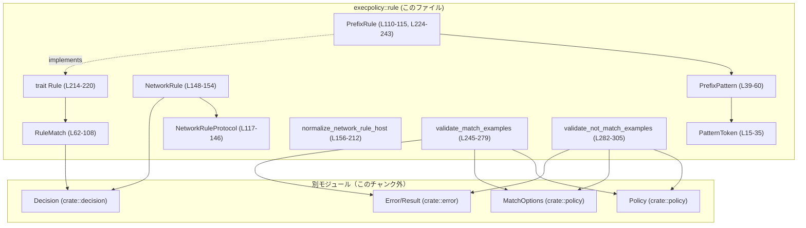
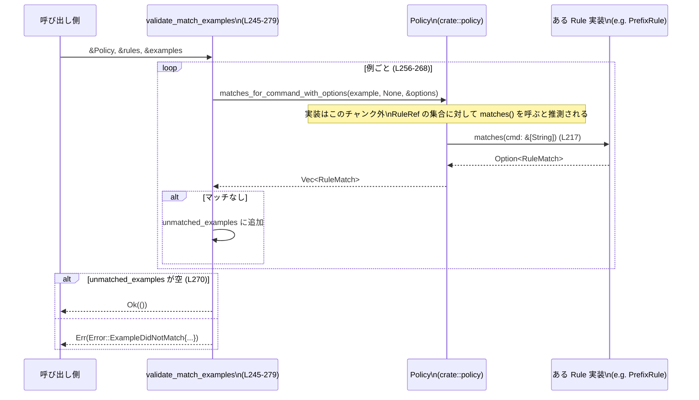

execpolicy/src/rule.rs の解説レポートです。

---

## 0. ざっくり一言

このモジュールは、**コマンド実行ポリシーの「ルール」表現とマッチング・検証処理**を定義する部分です。  
コマンドのプレフィックスマッチング、ネットワークホスト名の正規化、ルール例の検証などを提供します。  
（根拠: `execpolicy/src/rule.rs:L14-19, L37-43, L148-154, L245-279, L282-305`）

---

## 1. このモジュールの役割

### 1.1 概要

- コマンド（`Vec<String>` で表現）に対して、**指定されたパターンにマッチするルール**を提供します（`PrefixRule` / `PrefixPattern`）。  
- ルールにマッチした結果を、シリアライズ可能な `RuleMatch` として表現します。  
- ネットワーク許可ルール用に、**ホスト名文字列の正規化と検証** (`normalize_network_rule_host`) と、プロトコル識別 (`NetworkRuleProtocol`) を提供します。  
- ポリシー全体に対して、**「この例は必ずマッチする/しない」**というサンプルコマンドの検証関数を提供します。  
  （根拠: `execpolicy/src/rule.rs:L37-60, L62-108, L117-154, L156-212, L245-305`）

### 1.2 アーキテクチャ内での位置づけ

このモジュール内と他モジュールとの依存関係を、主要コンポーネントに絞って示します。



- `Policy` や `MatchOptions`、`Decision` / `Error` 型の実装はこのファイルには登場せず、**このチャンク外**です（`use crate::policy::Policy;` などから存在のみが分かります）。  
  （根拠: `execpolicy/src/rule.rs:L1-7, L245-279, L282-305`）

### 1.3 設計上のポイント

- **プレフィックスベースのルール**  
  - コマンドの先頭トークン（プログラム名）をキーとし、後続トークンを `PatternToken` で表現したプレフィックスマッチです。  
    （根拠: `execpolicy/src/rule.rs:L37-43, L45-59, L110-115, L224-238`）

- **動的ディスパッチ可能なルール抽象化**  
  - `trait Rule: Any + Debug + Send + Sync` と `type RuleRef = Arc<dyn Rule>` により、複数種のルール実装をスレッド安全に共有できる設計です。  
    （根拠: `execpolicy/src/rule.rs:L214-223`）

- **シリアライズ可能なマッチ結果**  
  - `RuleMatch` は `Serialize` / `Deserialize` を derive しており、camelCase フィールド名で外部表現できます。  
    （根拠: `execpolicy/src/rule.rs:L62-76`）

- **入力検証を伴うドメイン固有エラー**  
  - ネットワークホスト名およびプロトコル解析、例の検証で、`Error::InvalidRule` や `Error::ExampleDid(Mis|NotMatch)` を返します。  
    （根拠: `execpolicy/src/rule.rs:L125-136, L156-212, L270-278, L292-301`）

- **ヒューリスティックを無効にした厳密検証**  
  - 例の検証では `heuristics_fallback` に `None` を渡し、ヒューリスティックマッチを使わずにポリシー定義だけで検証しています。  
    （根拠: `execpolicy/src/rule.rs:L257-259, L293-294`）

---

## 2. 主要な機能一覧

- コマンドトークンのパターン表現 (`PatternToken`, `PrefixPattern`) とプレフィックスマッチング  
- プレフィックスルール (`PrefixRule`) とルール共通インターフェース (`Rule` trait, `RuleRef`)  
- ルールマッチ結果の表現・シリアライズ (`RuleMatch`)  
- ネットワークルール用のプロトコル表現と解析 (`NetworkRuleProtocol::parse`, `as_policy_string`)  
- ネットワークルール用ホスト名の正規化と検証 (`normalize_network_rule_host`)  
- サンプルコマンドの「必ずマッチする」「必ずマッチしない」検証 (`validate_match_examples`, `validate_not_match_examples`)

---

## 3. 公開 API と詳細解説

### 3.1 型一覧（構造体・列挙体など）

| 名前 | 種別 | 公開範囲 | 役割 / 用途 | 根拠 |
|------|------|----------|-------------|------|
| `PatternToken` | enum | `pub` | コマンドトークン 1 個分のパターン（単一文字列 or 複数候補）を表現します。 | `execpolicy/src/rule.rs:L15-19, L21-35` |
| `PrefixPattern` | struct | `pub` | コマンドの先頭トークンと、後続トークンのパターン列からなるプレフィックスパターンです。 | `execpolicy/src/rule.rs:L37-43, L45-59` |
| `RuleMatch` | enum | `pub` | あるルールがコマンドにマッチした結果を表現します。プレフィックスルールとヒューリスティックルールを区別します。シリアライズ可能です。 | `execpolicy/src/rule.rs:L62-82, L84-107` |
| `PrefixRule` | struct | `pub` | `PrefixPattern` と `Decision` を束ねた、プレフィックスマッチング用のルール実装です。 | `execpolicy/src/rule.rs:L110-115, L224-243` |
| `NetworkRuleProtocol` | enum | `pub` | ネットワークルールで使用可能なプロトコル種別（http/https/socks5_tcp/socks5_udp）を表現します。 | `execpolicy/src/rule.rs:L117-123, L125-145` |
| `NetworkRule` | struct | `pub` | ネットワークアクセスルール 1 件を表現します（ホスト名・プロトコル・決定・任意の理由）。 | `execpolicy/src/rule.rs:L148-154` |
| `Rule` | trait | `pub` | 任意のルール実装が満たすべきインターフェースです。コマンドを受けて `RuleMatch` を返します。`Send + Sync` を要求し、スレッドセーフな利用を前提とします。 | `execpolicy/src/rule.rs:L214-220` |
| `RuleRef` | type alias | `pub` | `Arc<dyn Rule>` の型エイリアスで、ルールの共有ポインタ表現です。 | `execpolicy/src/rule.rs:L222` |

### 3.2 関数詳細（重要なもの）

#### `PrefixPattern::matches_prefix(&self, cmd: &[String]) -> Option<Vec<String>>`

**概要**

`cmd`（コマンド行のトークン列）が `self` のプレフィックスパターンにマッチする場合、  
**マッチしたプレフィックス部分のトークン列** を返します。マッチしなければ `None` です。  
（根拠: `execpolicy/src/rule.rs:L45-59`）

**引数**

| 引数名 | 型 | 説明 |
|--------|----|------|
| `self` | `&PrefixPattern` | 比較対象となるプレフィックスパターンです。 |
| `cmd` | `&[String]` | 実際のコマンドトークン列（プログラム名を含む）です。 |

**戻り値**

- `Some(Vec<String>)` : パターンと同じ長さのプレフィックスがマッチしたとき、その部分のコピー。  
- `None` : 長さが足りない、またはトークンが一致しないとき。

**内部処理の流れ**

1. パターンが要求する長さ `pattern_length = 1 + self.rest.len()` を計算します。  
2. `cmd` の長さが `pattern_length` 未満、または先頭トークン `cmd[0]` が `self.first` と異なる場合は `None` を返します。  
3. 残りのトークンを `self.rest` の各 `PatternToken` と 1:1 で比較し、`matches` がすべて `true` であるか確認します。  
4. 中途で 1 つでもマッチしなければ `None` を返します。  
5. すべてマッチした場合、`cmd[..pattern_length]` を `to_vec` して `Some` で返します。

**Examples（使用例）**

```rust
use std::sync::Arc;
use execpolicy::rule::{PatternToken, PrefixPattern};

// "git commit" のような2トークンのプレフィックスパターンを構築する例
let pattern = PrefixPattern {
    first: Arc::from("git"),                             // 先頭トークンは固定
    rest: Arc::from([PatternToken::Single("commit".into())]),
};

let cmd = vec!["git".to_string(), "commit".to_string(), "-m".to_string()];
let matched = pattern.matches_prefix(&cmd);

assert_eq!(matched, Some(vec!["git".into(), "commit".into()])); // 先頭2トークンのみ返る
```

※ `execpolicy` というクレート名は仮定です。実際のクレート名はこのチャンクからは分かりません。

**Errors / Panics**

- エラー型は返さず、`Option` でマッチ有無のみを表現します。
- インデックスアクセスは **事前の長さチェック** により安全に行われており、パニック要因はありません。  
  （根拠: `execpolicy/src/rule.rs:L47-52`）

**Edge cases（エッジケース）**

- `cmd.len() < 1 + self.rest.len()` の場合は必ず `None`。  
- `cmd` がパターンと同じ長さでも、先頭トークンが `first` と異なれば `None`。  
- パターンが空 (`rest.len() == 0`) の場合、先頭トークンのみで判定します。

**使用上の注意点**

- 戻り値の `Vec<String>` は **新しく確保されたコピー** であり、パフォーマンスに敏感な場面では元スライスの参照で足りるか検討が必要です。  
- プレフィックスがマッチした後の「残りの引数」については何も判定しないため、**完全一致を期待して使用しない**ことが前提です。

---

#### `RuleMatch::decision(&self) -> Decision`

**概要**

`RuleMatch` が保持している `Decision` を取り出して返します。  
どのバリアント（`PrefixRuleMatch` / `HeuristicsRuleMatch`）でも同じく `decision` フィールドを返します。  
（根拠: `execpolicy/src/rule.rs:L84-90`）

**引数**

| 引数名 | 型 | 説明 |
|--------|----|------|
| `self` | `&RuleMatch` | ルールマッチ結果です。 |

**戻り値**

- `Decision` : このマッチが表す許可/拒否などの決定。実際のバリアントはこのチャンクには現れません。

**内部処理の流れ**

- `match self` でバリアントを分岐し、それぞれの `decision` フィールドをコピーして返します。

**使用上の注意点**

- `Decision` の具体的な列挙値や意味は `crate::decision` 内に定義されており、このチャンクだけでは分かりません。

---

#### `RuleMatch::with_resolved_program(self, resolved_program: &AbsolutePathBuf) -> Self`

**概要**

`PrefixRuleMatch` の場合に限り、`resolved_program` フィールドに実際の実行ファイルの絶対パスを設定したコピーを返します。  
`HeuristicsRuleMatch` など他のバリアントはそのまま返します。  
（根拠: `execpolicy/src/rule.rs:L92-107`）

**引数**

| 引数名 | 型 | 説明 |
|--------|----|------|
| `self` | `RuleMatch` | もとのマッチ結果。`self` を消費します（所有権ムーブ）。 |
| `resolved_program` | `&AbsolutePathBuf` | 解決済みの実行ファイルパスです。 |

**戻り値**

- `RuleMatch` : `PrefixRuleMatch` の場合は `resolved_program` のみ更新された新しい値。その他は元の値。

**内部処理の流れ**

1. `self` を `match` して `PrefixRuleMatch` かどうか判定します。  
2. `PrefixRuleMatch` の場合は `matched_prefix`, `decision`, `justification` を引き継ぎつつ、`resolved_program: Some(resolved_program.clone())` を設定します。  
3. それ以外のバリアントは `other => other` としてそのまま返します。

**Edge cases**

- `HeuristicsRuleMatch` に対して呼んでも何も変化しないため、**戻り値が `PrefixRuleMatch` とは限りません**。  
- `AbsolutePathBuf` のクローンコストは、このチャンクからは詳細不明ですが、パス文字列のコピーが発生する可能性があります。

**使用上の注意点**

- 元の値は消費されるため、呼び出し元で `self` を再利用することはできません。  
- すでに `resolved_program` が設定されているかどうかは、`PrefixRuleMatch` の構築ロジックに依存します。このファイルでは `PrefixRule` 実装が `resolved_program: None` で構築しています。  
  （根拠: `execpolicy/src/rule.rs:L229-237`）

---

#### `NetworkRuleProtocol::parse(raw: &str) -> Result<Self>`

**概要**

ネットワークルールの「プロトコル」文字列をパースし、`NetworkRuleProtocol` のいずれかに変換します。  
許可されていない文字列の場合は `Error::InvalidRule` を返します。  
（根拠: `execpolicy/src/rule.rs:L125-136`）

**引数**

| 引数名 | 型 | 説明 |
|--------|----|------|
| `raw` | `&str` | 設定などから読み込んだプロトコル名文字列です。 |

**戻り値**

- `Ok(NetworkRuleProtocol)` : `"http"`, `"https"`, `"https_connect"`, `"http-connect"`, `"socks5_tcp"`, `"socks5_udp"` のいずれかに対応。  
- `Err(Error::InvalidRule)` : 上記以外の文字列が渡された場合。

**内部処理の流れ**

1. `match raw` で文字列リテラルに対して分岐します。  
2. 既知の文字列であれば対応するバリアントの `Ok(...)` を返します。  
3. それ以外は `Error::InvalidRule` に説明メッセージを埋め込み、`Err(...)` を返します。

**Examples**

```rust
use execpolicy::rule::NetworkRuleProtocol;
use execpolicy::error::Result;

let https = NetworkRuleProtocol::parse("https")?;
let socks = NetworkRuleProtocol::parse("socks5_tcp")?;
assert_eq!(https.as_policy_string(), "https");
assert_eq!(socks.as_policy_string(), "socks5_tcp");
```

※ `Result` と `Error` 型のパスはこのファイルの `use crate::error::{Error, Result};` から分かりますが、実際のクレート名はこのチャンクには現れません。

**Errors / Panics**

- 想定外の文字列の場合に `Error::InvalidRule`。  
- パニック要因はありません（単純な `match` のみ）。

**Edge cases**

- `"https_connect"` と `"http-connect"` はどちらも `Https` として扱われます（プロキシ用途と推測されますが、このチャンクからは意図は断定できません）。  
- 大文字・小文字は区別されます。`"HTTP"` はエラーになります。

**使用上の注意点**

- エラー時に返されるメッセージは `"network_rule protocol must be one of ... (got {other})"` という形で、元の `raw` が埋め込まれます。設定ファイルのデバッグに利用できます。

---

#### `normalize_network_rule_host(raw: &str) -> Result<String>`

**概要**

ネットワークルールのホスト指定文字列を検証し、正規化されたホスト名（小文字化・末尾ドット除去・ポート除去など）を返します。  
不正な形式（空・スキーム付き・パス付き・ワイルドカードなど）は `Error::InvalidRule` として拒否します。  
（根拠: `execpolicy/src/rule.rs:L156-212`）

**引数**

| 引数名 | 型 | 説明 |
|--------|----|------|
| `raw` | `&str` | 設定から読み込んだホスト指定文字列（ポートや IPv6 表記を含むことがあります）。 |

**戻り値**

- `Ok(String)` : 正規化されたホスト名（小文字・不要なドット/空白削除済み、ポート部除去済み）。  
- `Err(Error::InvalidRule)` : 不正な形式や禁止条件に当てはまる場合。

**内部処理の流れ（アルゴリズム）**

1. `raw.trim()` で前後の空白を取り除き、空文字ならエラー。  
   （根拠: `execpolicy/src/rule.rs:L156-161`）
2. `"://"`, `'/'`, `'?'`, `'#'` を含む場合、**スキームやパスを含む URL 形式は不可**としてエラー。  
   （根拠: `execpolicy/src/rule.rs:L163-167`）
3. `[` で始まる場合（`[::1]:80` など）:
   - `']'` までを IPv6 リテラルとして切り出し、残り `rest` を検査。  
   - `rest` が空でない場合、`":"` で始まり数字のみからなる場合だけ許容（ポート表現）。それ以外はエラー。  
   - ホスト部分として `inside`（角括弧内の文字列）を採用。  
   （根拠: `execpolicy/src/rule.rs:L170-185`）
4. それ以外の場合、`":"` の出現回数がちょうど 1 回であれば `rsplit_once(':')` して、末尾をポートとして削除する。  
   - ただしホスト部・ポート部ともに非空であり、ポート部は ASCII 数字のみである必要があります。  
   （根拠: `execpolicy/src/rule.rs:L185-192`）
5. `host.trim_end_matches('.')` で末尾のドットを削除し、`trim()` で再度空白を除去した上で `to_ascii_lowercase()` します。  
   （根拠: `execpolicy/src/rule.rs:L194`）
6. 最終的な `normalized` が空ならエラー。  
7. `'*'` を含む場合（ワイルドカード）はエラー。  
8. 任意の空白文字を含む場合もエラー。  
   （根拠: `execpolicy/src/rule.rs:L195-208`）
9. すべて通過した場合に `Ok(normalized)` を返します。

**Examples**

```rust
use execpolicy::rule::normalize_network_rule_host;

// 通常のホスト + ポート
let host = normalize_network_rule_host("EXAMPLE.com:80")?;
assert_eq!(host, "example.com");                          // 小文字化・ポート除去・トリム

// 角括弧付き IPv6 + ポート
let host = normalize_network_rule_host("[2001:db8::1]:443")?;
assert_eq!(host, "2001:db8::1");

// 末尾ドット付き FQDN
let host = normalize_network_rule_host("example.com.")?;
assert_eq!(host, "example.com");
```

**Errors / Panics**

代表的なエラー条件:

- 空文字、またはトリム後に空になる場合: `"network_rule host cannot be empty"`。  
- `http://` のように `"://"` を含む場合: `"network_rule host must be a hostname or IP literal (without scheme or path)"`。  
- `"[::1"` のような閉じ括弧のない IPv6: `"network_rule host has an invalid bracketed IPv6 literal"`。  
- `"[::1]abc"` のような未サポートのサフィックス: `"network_rule host contains an unsupported suffix: {raw}"`。  
- ワイルドカード `*` を含む場合: `"network_rule host must be a specific host; wildcards are not allowed"`。  
- 空白文字を含む場合: `"network_rule host cannot contain whitespace"`。

パニック要因は明示的にはありません。`split_once` / `rsplit_once` の結果は `if let` / `let Some` で安全に扱っています。

**Edge cases**

- `example.com : 80` のような、コロン周辺に空白がある場合は、ポート抽出条件（空白なしの数字列）を満たさないため、ポートとして扱われず `"example.com : 80"` がホストとして処理され、後段で空白を含むためエラーになります。  
- `::1` のような素の IPv6 文字列は、`matches(':').count() != 1` のためポート分離されず、そのまま `normalized` に渡ります。  
- 末尾のドットが複数 (`"example.com.."`) でもすべて削除されます。

**使用上の注意点**

- **ワイルドカードホストは明示的に禁止**されています。プレフィックスやサフィックスでのパターンマッチをしたい場合は、別の仕組みが必要です。  
- ホスト文字列が DNS 名として有効か、IP アドレスとして構文的に正しいかまではチェックしていません（このチャンクにはそのような検証は現れません）。外側の層で追加検証が必要な場合があります。

---

#### `validate_match_examples(policy: &Policy, rules: &[RuleRef], matches: &[Vec<String>]) -> Result<()>`

**概要**

「このコマンド列は少なくとも 1 つのルールにマッチするはず」という**ポジティブ例**のセットを検証します。  
どのルールにもマッチしない例があれば、`Error::ExampleDidNotMatch` を返します。  
（根拠: `execpolicy/src/rule.rs:L245-279`）

**引数**

| 引数名 | 型 | 説明 |
|--------|----|------|
| `policy` | `&Policy` | ルールのマッチングを行うポリシーオブジェクトです。 |
| `rules` | `&[RuleRef]` | 関連するルール群。**エラー時のメッセージ生成にのみ使用**されます。 |
| `matches` | `&[Vec<String>]` | 「必ずマッチするはず」のサンプルコマンド列の集合です。 |

**戻り値**

- `Ok(())` : すべての例が少なくとも 1 つのルールにマッチした場合。  
- `Err(Error::ExampleDidNotMatch { ... })` : マッチしなかった例が 1 つ以上ある場合。

**内部処理の流れ**

1. `MatchOptions { resolve_host_executables: true }` を構築します。  
2. 各 `example` について `policy.matches_for_command_with_options(example, None, &options)` を呼び、  
   - 戻り値の `Vec` が空でなければ「マッチした」とみなして次へ。  
   - 空の場合は `unmatched_examples` に追加します。  
   （表示用に `shlex::try_join` でシェルコマンド風に連結します。）  
   （根拠: `execpolicy/src/rule.rs:L251-268`）
3. 最後に `unmatched_examples` が空なら `Ok(())` を返し、  
   そうでなければ `Error::ExampleDidNotMatch { rules, examples, location: None }` を返します。  
   - `rules` フィールドには、与えられた `rules` スライスの要素を `Debug` 表現（`format!("{rule:?}")`）したものが格納されます。  
   （根拠: `execpolicy/src/rule.rs:L270-278`）

**Examples**

```rust
use execpolicy::rule::{validate_match_examples, RuleRef};
use execpolicy::policy::{Policy, MatchOptions};

// policy や rules の構築方法はこのチャンクには出てこないため、ここではプレースホルダで表現します。
let policy: Policy = /* ポリシー構築 */ unimplemented!();
let rules: Vec<RuleRef> = /* ルール一覧 */ vec![];

let positive_examples: Vec<Vec<String>> = vec![
    vec!["ls".into(), "-la".into()],
    vec!["git".into(), "status".into()],
];

validate_match_examples(&policy, &rules, &positive_examples)?; // すべてマッチしていれば Ok(())
```

**Errors / Panics**

- マッチしない例がある場合は `Error::ExampleDidNotMatch`。  
  - `rules`: `rules` 引数に含まれるルールの `Debug` 文字列表現。  
  - `examples`: シェルコマンド風に連結された unmatched 例。  
  - `location`: `None` 固定（このファイルでは場所情報は付与しません）。
- `shlex::try_join` が失敗した場合は `"unable to render example"` にフォールバックします。  
  （根拠: `execpolicy/src/rule.rs:L264-267`）  
- パニックは特に想定されたコードはなく、通常は `Result` でエラーを表現します。

**Edge cases**

- `matches_for_command_with_options` の実装によっては、複数のルールが同じコマンドにマッチすることがありますが、**1 件以上マッチしていれば成功**とみなします。  
- `matches` が空スライスの場合、ループに入らないため必ず `Ok(())` になります。

**使用上の注意点**

- `rules` 引数は**マッチングには使われず、エラーメッセージ用にのみ使用**されます。`policy` に登録されているルールと `rules` の内容が一致しているかは、この関数ではチェックされません。  
- ヒューリスティックフォールバックは `None` 固定で呼び出しているため、「ヒューリスティックだけでマッチする」ようなケースは **マッチしていない** と見なされます。

---

#### `validate_not_match_examples(policy: &Policy, _rules: &[RuleRef], not_matches: &[Vec<String>]) -> Result<()>`

**概要**

「このコマンド列はどのルールにもマッチしてはいけない」という**ネガティブ例**のセットを検証します。  
1 つでもマッチする例があれば、`Error::ExampleDidMatch` を返します。  
（根拠: `execpolicy/src/rule.rs:L281-305`）

**引数**

| 引数名 | 型 | 説明 |
|--------|----|------|
| `policy` | `&Policy` | ルールマッチングを行うポリシーオブジェクトです。 |
| `_rules` | `&[RuleRef]` | 現状では未使用（プレフィックスに `_` が付されている）。将来的な拡張用と考えられますが、このチャンクからは断定できません。 |
| `not_matches` | `&[Vec<String>]` | 「マッチしてはならない」サンプルコマンド列の集合です。 |

**戻り値**

- `Ok(())` : すべての例が **どのルールにもマッチしない** 場合。  
- `Err(Error::ExampleDidMatch { ... })` : 最初にマッチした例が見つかった時点でエラーを返し、ループを終了します。

**内部処理の流れ**

1. `MatchOptions { resolve_host_executables: true }` を構築します。  
2. 各 `example` について `policy.matches_for_command_with_options(example, None, &options)` を呼び、`first()` で先頭のマッチ（あれば）を取得します。  
   （根拠: `execpolicy/src/rule.rs:L291-295`）
3. もしマッチが見つかったら、その `rule` を `Debug` 表現で文字列化し、`example` も `shlex::try_join` で連結して `Error::ExampleDidMatch` を返します。  
4. 最後までマッチが見つからなければ `Ok(())` を返します。

**Errors / Panics**

- マッチすべきでない例がマッチした場合に `Error::ExampleDidMatch`。  
- `shlex::try_join` が失敗した場合、`"unable to render example"` にフォールバックします。  
- パニック要因は見当たりません。

**Edge cases**

- `not_matches` が空スライスのときは、何も検証されず `Ok(())` になります。  
- 最初に見つかった 1 件だけをエラーに含める設計になっています（すべての違反例を収集はしません）。

**使用上の注意点**

- `validate_match_examples` 同様、ヒューリスティックフォールバックは使わず、ポリシーに明示的に登録されたルールのみに基づきます。  
- `_rules` 引数は現時点で使用されていないため、この関数に渡す `rules` と `policy` が整合しているかどうかは検証されません。

---

### 3.3 その他の関数

| 関数名 | シグネチャ | 役割（1 行） | 根拠 |
|--------|------------|--------------|------|
| `PatternToken::matches` | `fn matches(&self, token: &str) -> bool` | トークンがパターン（単一文字列または候補集合）のいずれかに一致するか判定します。 | `execpolicy/src/rule.rs:L21-27` |
| `PatternToken::alternatives` | `pub fn alternatives(&self) -> &[String]` | パターンで許可されるすべての文字列をスライスとして返します。単一パターンの場合も 1 要素スライスを返します。 | `execpolicy/src/rule.rs:L29-34` |
| `NetworkRuleProtocol::as_policy_string` | `pub fn as_policy_string(self) -> &'static str` | `NetworkRuleProtocol` をポリシー表現用の文字列（`"http"` 等）に変換します。 | `execpolicy/src/rule.rs:L138-145` |
| `Rule::program` | `fn program(&self) -> &str` | ルールが対象とするプログラム名（先頭トークン）を返すトレイトメソッドです。 | `execpolicy/src/rule.rs:L215, L225-227` |
| `Rule::matches` | `fn matches(&self, cmd: &[String]) -> Option<RuleMatch>` | コマンドがこのルールにマッチするかを判定するトレイトメソッドです。 | `execpolicy/src/rule.rs:L217, L229-238` |
| `Rule::as_any` | `fn as_any(&self) -> &dyn Any` | 具象型への downcast に利用するための `Any` 参照を返します。 | `execpolicy/src/rule.rs:L219-220, L240-242` |

---

## 4. データフロー

ここでは、**ポジティブ例の検証**を通じて、コマンドトークンがどのように流れるかを示します。

1. 呼び出し側が `validate_match_examples` に `Policy` とサンプルコマンド列を渡します。  
2. `validate_match_examples` は各サンプルに対して `Policy::matches_for_command_with_options` を呼び出します。  
3. `Policy` は内部に保持する `RuleRef` 群（このチャンクには実装はありません）に対して `Rule::matches` を呼び、`Vec<RuleMatch>` を構築します。  
   - `PrefixRule` 実装の場合、`PrefixPattern::matches_prefix` を使ってマッチ判定を行い、マッチした場合に `RuleMatch::PrefixRuleMatch` を返します。  
4. `validate_match_examples` は `Vec<RuleMatch>` が空かどうかを見て、未マッチ例を収集・エラー化します。

この流れを sequence diagram で表現します（`Policy` の内部実装はこのチャンクには現れませんが、`Rule` トレイトから推測できる最小限の呼び出し関係を示します）。



※ `Policy` 内部で `Rule::matches` をどのように呼び出しているかは、このチャンクには直接記述がないため、上記 sequence の「Policy -> Rule」部分は**関数シグネチャからの推測**であり、実装詳細は不明です。

---

## 5. 使い方（How to Use）

### 5.1 基本的な使用方法

#### プレフィックスルールの定義とマッチング

```rust
use std::sync::Arc;
use execpolicy::rule::{PatternToken, PrefixPattern, PrefixRule, Rule};

// Decision 型の具体的な生成方法はこのチャンクには無いため、プレースホルダを使います。
use execpolicy::decision::Decision; // 実際のパスは use 宣言から分かる

// "ls -la" というプレフィックスにマッチするルールを定義する例
let pattern = PrefixPattern {
    first: Arc::from("ls"),                                // 先頭トークン
    rest: Arc::from([
        PatternToken::Single("-la".into()),                // 2番目のトークンは "-la"
    ]),
};

let decision: Decision = /* 何らかの Decision を構築 */ unimplemented!();

let rule = PrefixRule {
    pattern,
    decision,
    justification: Some("List files in long format".into()),
};

let cmd = vec!["ls".into(), "-la".into(), "/tmp".into()];

if let Some(rule_match) = rule.matches(&cmd) {             // Rule トレイト経由でも可
    let decision = rule_match.decision();                  // 対応する Decision を取得
    // decision の値に応じた処理を行う
}
```

- ここで `rule.matches(&cmd)` は `PrefixPattern::matches_prefix` に基づいてマッチ判定を行います。  
  （根拠: `execpolicy/src/rule.rs:L224-238`）

#### ネットワークホストの正規化

```rust
use execpolicy::rule::{NetworkRule, NetworkRuleProtocol, normalize_network_rule_host};
use execpolicy::decision::Decision; // 具体的な生成はこのチャンク外

let host = normalize_network_rule_host("EXAMPLE.com:443")?; // "example.com"
let protocol = NetworkRuleProtocol::parse("https")?;
let decision: Decision = /* ... */ unimplemented!();

let rule = NetworkRule {
    host,
    protocol,
    decision,
    justification: Some("Allow HTTPS to example.com".into()),
};
```

- 実際に `NetworkRule` がどこで使われるかは、このチャンクには現れませんが、  
  ホスト・プロトコル・決定・理由を束ねる構造体であることはコードから分かります。  
  （根拠: `execpolicy/src/rule.rs:L148-154`）

#### 例の検証によるポリシー定義のチェック

```rust
use execpolicy::rule::{validate_match_examples, validate_not_match_examples, RuleRef};
use execpolicy::policy::Policy;

// policy や rules の具体的な構築方法はこのチャンク外です。
let policy: Policy = /* ... */ unimplemented!();
let rules: Vec<RuleRef> = /* policy に登録されているルール群と同等のもの */ vec![];

let positives = vec![
    vec!["ls".into(), "-la".into()],
];

let negatives = vec![
    vec!["rm".into(), "-rf".into(), "/".into()],
];

validate_match_examples(&policy, &rules, &positives)?;     // マッチしない例があればエラー
validate_not_match_examples(&policy, &rules, &negatives)?; // マッチする例があればエラー
```

### 5.2 よくある使用パターン

- **複数候補のサブコマンドを許可するプレフィックス**

  ```rust
  use std::sync::Arc;
  use execpolicy::rule::{PatternToken, PrefixPattern};

  let pattern = PrefixPattern {
      first: Arc::from("git"),
      rest: Arc::from([
          PatternToken::Alts(vec!["status".into(), "diff".into()]), // どちらかのサブコマンドを許可
      ]),
  };
  ```

- **プレフィックスのみを固定し、後続引数は自由にする**

  - `rest` を短く定義すれば、その後の引数は無制限に許容されます。
  - 例: `["curl", "-fsSL"]` だけを固定し、URL やヘッダは自由にする、など。

### 5.3 よくある間違い（推測されるもの）

コードから推測される「誤用しやすそうな点」を挙げます。

```rust
// 誤り例: プレフィックスパターンを「完全一致」と誤解している
let cmd = vec!["ls".into(), "-la".into(), "/tmp".into()];
let pattern = /* "ls -la" を表す PrefixPattern */;

let matched = pattern.matches_prefix(&cmd);
assert!(matched.is_some()); // 先頭2トークンだけ見ているのでマッチする
// → "/tmp" まで含めた完全一致を期待していると挙動が違う

// 誤り例: ホストにスキームを含めてしまう
let host = normalize_network_rule_host("https://example.com"); // Err(...)
```

### 5.4 使用上の注意点（まとめ）

- **スレッド安全性**  
  - `Rule` トレイトは `Send + Sync` を要求し、`RuleRef = Arc<dyn Rule>` として共有されます。  
    → ルール実装はスレッド安全である必要があります（内部に `Rc` や非同期安全でないミュータブル状態を持たないなど）。  
    （根拠: `execpolicy/src/rule.rs:L214-223`）

- **エラー表現**  
  - 入力の妥当性エラーはすべて `Result` 経由で `Error` により表現され、パニックではなく呼び出し側でハンドリングする設計になっています。

- **ヒューリスティックスの扱い**  
  - `validate_*` 関数は `heuristics_fallback` に `None` を渡しており、定義済みルールだけでのマッチングを検証します。  
    → 実際のランタイムでヒューリスティックマッチを使う場合、ここでの検証結果と挙動が異なる可能性があります。

- **観測性（ログ等）**  
  - このモジュール自体にはログ出力やメトリクス計測はありません。  
    → マッチングや検証の挙動を詳細に観測したい場合は、外側のレイヤー（`Policy` 側など）でログを追加する必要があります。

---

## 6. 変更の仕方（How to Modify）

### 6.1 新しい機能を追加する場合

- **新しい種類のルールを追加したい場合**

  1. このファイル、または別モジュールで新しい構造体（例: `RegexRule` など）を定義し、`Rule` トレイトを実装します。  
     （`PrefixRule` 実装はその例として参照できます: `execpolicy/src/rule.rs:L224-243`）
  2. `Policy` 側でそのルール型を保持・利用するように拡張する必要があります（`Policy` 実装はこのチャンクには現れません）。  
  3. 必要に応じて `RuleMatch` に新しいバリアントを追加し、`decision()` などのメソッドを更新します。

- **ネットワークプロトコルの種類を増やしたい場合**

  1. `NetworkRuleProtocol` に新しいバリアントを追加します。  
  2. `parse` と `as_policy_string` でそのバリアントを扱う分岐を追加します。  
     （根拠: `execpolicy/src/rule.rs:L117-123, L125-145`）

### 6.2 既存の機能を変更する場合の注意点

- **`normalize_network_rule_host` の仕様変更**

  - 空文字・スキーム付き・ワイルドカード・空白を含むホストなど、現在エラーにしている条件を変える場合、  
    **既存の設定ファイルやテストが依存している可能性**が高いため注意が必要です。  
  - 「ポート付きホストを常に許可する/禁止する」などの振る舞いを変えると、`network_rule` を利用している部分に影響します。

- **`validate_*` 関数の仕様変更**

  - 現在は「1件でもマッチすれば OK」「1件でもマッチしたら NG」というシンプルな契約です。  
  - すべてのマッチ結果を収集したり、ヒューリスティックを加味する方向へ変更すると、  
    **ポリシー定義ファイルの検証ロジック全体**に影響します。

- **契約（コントラクト）の確認**

  - `Rule::matches` は「マッチしないときは `None`、マッチするときは `Some(RuleMatch)`」という契約に暗黙的に依存しています（`Policy` の実装はこのチャンクにありませんが、`Vec<RuleMatch>` を返すことから推測できます）。  
  - ルール実装でこの契約を破ると、`validate_*` や `Policy` の期待とズレる可能性があります。

---

## 7. 関連ファイル

このモジュールと密接に関係するモジュール（パスは `use` 宣言から分かる範囲）を挙げます。

| パス / モジュール | 役割 / 関係 |
|-------------------|------------|
| `crate::policy` | `Policy`, `MatchOptions` を提供し、コマンドに対する `matches_for_command_with_options` を実装していると分かります。このモジュールからは宣言のみ参照され、実装はこのチャンクには現れません。<br>（根拠: `execpolicy/src/rule.rs:L4-5, L245-259, L282-295`） |
| `crate::decision` | ルールの結果を表す `Decision` 型を提供します。`PrefixRule`, `RuleMatch`, `NetworkRule` などが保持します。<br>（根拠: `execpolicy/src/rule.rs:L1, L68, L80, L113, L152`） |
| `crate::error` | ドメイン固有の `Error` 型と `Result` エイリアスを提供します。ルール定義の妥当性エラーや例の検証失敗を表現します。<br>（根拠: `execpolicy/src/rule.rs:L2-3, L125-136, L156-212, L270-278, L292-301`） |
| `codex_utils_absolute_path::AbsolutePathBuf` | 実行ファイルの絶対パスを表す型として `RuleMatch::PrefixRuleMatch` で使用されます。<br>（根拠: `execpolicy/src/rule.rs:L6, L69-70, L92-103`） |
| `shlex` クレート | 例のコマンド列をシェル風の 1 行文字列に連結するために使用されます（表示用のみ）。<br>（根拠: `execpolicy/src/rule.rs:L9, L264-267, L298-299`） |

このファイル単体ではテストコード（`#[cfg(test)]` など）は定義されておらず、テストは別ファイルに存在するか、まだ追加されていないと考えられます。
