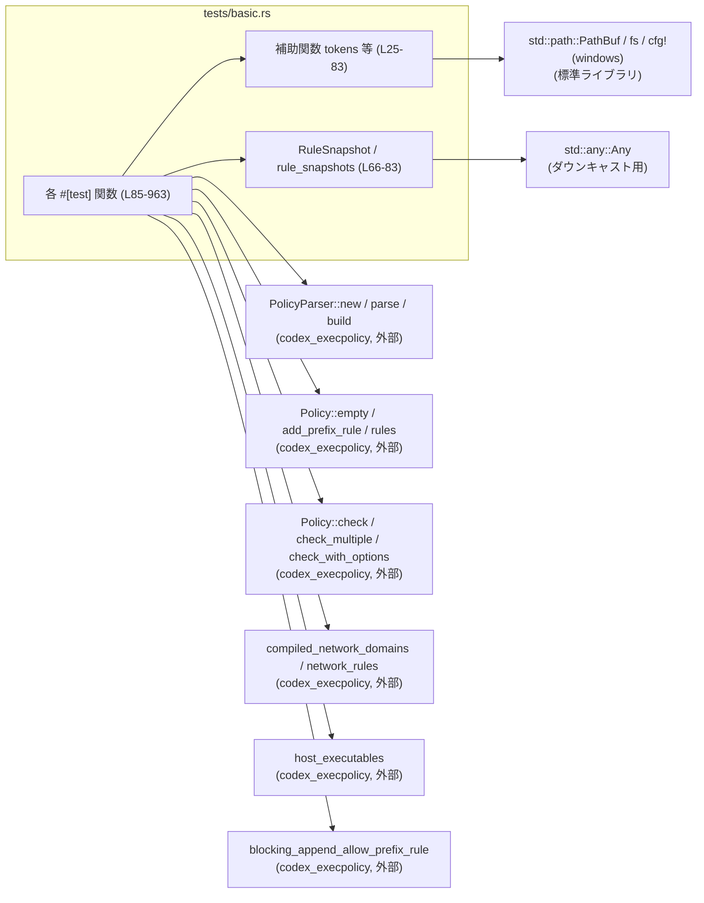
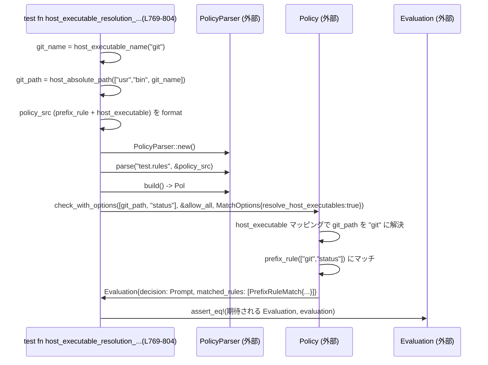

execpolicy/tests/basic.rs

---

## 0. ざっくり一言

`codex_execpolicy` クレートの **ポリシー評価ロジック** を網羅的にテストするモジュールです。  
コマンドのプレフィックスルール・ネットワークルール・ホスト実行ファイル解決などの仕様を、Starlark 風のポリシー DSL からのパース〜評価まで含めて検証しています（根拠: `basic.rs:L85-963`）。

---

## 1. このモジュールの役割

### 1.1 概要

- このテストモジュールは、`codex_execpolicy` の以下の挙動を検証します（根拠: `basic.rs:L85-963`）。
  - `prefix_rule` によるコマンドプレフィックスマッチと意思決定（Allow/Prompt/Forbidden）
  - `network_rule` によるネットワークドメインの許可・拒否リスト
  - `host_executable` によるホスト上の実行ファイルパスと論理名（例: `git`）の対応づけと解決
  - ルールのマージ・優先度（もっとも厳しい Decision が勝つ）とヒューリスティックマッチ
- 併せて、ポリシー DSL のバリデーション（不正な justification やパスがエラーになること）も確認します。

### 1.2 アーキテクチャ内での位置づけ

このファイルは **テストコード** であり、`codex_execpolicy` クレートの公開 API に対する「振る舞い仕様」として機能します。  
主な依存関係は次のとおりです（テキストベースの DSL → パーサ → Policy → 評価）。



- テストは、外部ライブラリ `codex_execpolicy` の API を黒箱的に利用し、その結果 (`Evaluation`, `RuleMatch`, `Decision`) を検証しています（根拠: `basic.rs:L8-21, L85-963`）。

### 1.3 設計上のポイント

- 責務分割
  - **補助関数**（`tokens`, `host_absolute_path`, `starlark_string` 等）でテストに必要な変換・環境依存の差異を吸収しています（根拠: `basic.rs:L25-64`）。
  - `RuleSnapshot` / `rule_snapshots` で `RuleRef` の具象型 (`PrefixRule`) をテストしやすいスナップショットに変換します（根拠: `basic.rs:L66-83`）。
- 状態管理
  - `PolicyParser` はテストごとに新しく生成され、`parse` を複数回呼んでから `build` で `Policy` を構築する、という使い方をしています（根拠: `basic.rs:L103-113, L295-313`）。
  - `Policy` は主に不変オブジェクトとして扱われ、`Policy::empty` → `add_prefix_rule` など、明示的な構築パターンのみを使用しています（根拠: `basic.rs:L249-281`）。
- エラーハンドリング
  - パースやポリシー構築は `anyhow::Result` を通して扱い、テストでは `expect_err` や `?` により成功・失敗の双方を確認しています（根拠: `basic.rs:L6-7, L130-140, L230-247`）。
  - 一部の補助関数（`absolute_path`, `rule_snapshots`）は不正な入力で `panic!` する設計であり、「テスト中に不変条件が破れたら即座に失敗する」方針になっています（根拠: `basic.rs:L37-40, L71-83`）。
- 並行性
  - このファイル内でスレッドや非同期処理は使用されておらず、並行性の懸念はありません。
  - `Arc` は `PrefixPattern.first` のテストデータ構築に使われるだけで、スレッド間共有には使われていません（根拠: `basic.rs:L16-18, L256-260`）。

---

## 2. 主要な機能一覧（コンポーネントインベントリー含む）

### 2.1 機能一覧（高レベル）

- コマンドプレフィックスルールの挙動検証
  - 基本マッチと `Evaluation` の構造（`basic_match` 等）
  - `Decision` の優先順位（Allow / Prompt / Forbidden）の集約
  - `match` / `not_match` 例の強制適用
- ネットワークルールのコンパイルと検証
  - `network_rule` の `NetworkRuleProtocol` 変換と allow/deny リスト生成
  - ワイルドカードホストの拒否
- ホスト実行ファイル (`host_executable`) の検証
  - パスの絶対性・ベース名一致・重複削除・最後の定義優先
  - `MatchOptions.resolve_host_executables` によるパス→論理名解決の挙動
- ポリシー構築 API の挙動
  - `Policy::empty` / `add_prefix_rule` の動作とエラーケース
  - 複数ポリシーファイルのマージ (`PolicyParser::parse` を複数回呼び出し)
- ヒューリスティックマッチ
  - ルールが存在しない場合、または host_executable の許可リストにない場合の `HeuristicsRuleMatch` の動作

### 2.2 関数・型インベントリー（行番号付き）

| 名前 | 種別 | 役割 / 用途 | 行範囲 |
|------|------|-------------|--------|
| `tokens` | 関数 | `&[&str]` を `Vec<String>` に変換するヘルパー。テスト内でコマンドトークン生成に使用。 | `basic.rs:L25-27` |
| `allow_all` | 関数 | フォールバック決定関数として常に `Decision::Allow` を返す。 | `basic.rs:L29-31` |
| `prompt_all` | 関数 | フォールバック決定関数として常に `Decision::Prompt` を返す。 | `basic.rs:L33-35` |
| `absolute_path` | 関数 | `String` から `AbsolutePathBuf` への変換。絶対パスでないと panic。 | `basic.rs:L37-40` |
| `host_absolute_path` | 関数 | OS（Windows / Unix）ごとに適切なルートから `PathBuf` を構築し、文字列に変換。 | `basic.rs:L42-51` |
| `host_executable_name` | 関数 | Windows では `"git"` → `"git.exe"` のように実行ファイル名を補正。 | `basic.rs:L54-59` |
| `starlark_string` | 関数 | `\` と `"` をエスケープし、ポリシー DSL 内に埋め込めるリテラルを生成。 | `basic.rs:L62-63` |
| `RuleSnapshot` | enum | `PrefixRule` のスナップショットを比較用に保持する簡易型。現状は `Prefix` バリアントのみ。 | `basic.rs:L66-69` |
| `rule_snapshots` | 関数 | `RuleRef` スライスを `RuleSnapshot` のベクタに変換。`PrefixRule` 以外は panic。 | `basic.rs:L71-83` |
| `append_allow_prefix_rule_dedupes_existing_rule` | テスト関数 | `blocking_append_allow_prefix_rule` が同一プレフィックスを重複追加しないことを確認。 | `basic.rs:L85-101` |
| `network_rules_compile_into_domain_lists` | テスト関数 | `network_rule` のパースと `compiled_network_domains` での allow/deny リスト生成を確認。 | `basic.rs:L103-128` |
| `network_rule_rejects_wildcard_hosts` | テスト関数 | `host="*"` のようなワイルドカードをパース時に拒否することを確認。 | `basic.rs:L130-140` |
| `basic_match` | テスト関数 | 単純な `prefix_rule` が `Evaluation` に反映されることを確認。 | `basic.rs:L142-167` |
| `justification_is_attached_to_forbidden_matches` | テスト関数 | `decision="forbidden"` の `prefix_rule` に `justification` が保持されることを確認。 | `basic.rs:L169-199` |
| `justification_can_be_used_with_allow_decision` | テスト関数 | `decision="allow"` と `justification` の組み合わせを確認。 | `basic.rs:L201-228` |
| `justification_cannot_be_empty` | テスト関数 | 空白のみの `justification` がパースエラーになることを確認。 | `basic.rs:L230-247` |
| `add_prefix_rule_extends_policy` | テスト関数 | `Policy::add_prefix_rule` が内部ルール集合を拡張し、評価に反映されることを確認。 | `basic.rs:L249-281` |
| `add_prefix_rule_rejects_empty_prefix` | テスト関数 | プレフィックスが空のとき `Error::InvalidPattern` が返ることを確認。 | `basic.rs:L283-293` |
| `parses_multiple_policy_files` | テスト関数 | `PolicyParser` が複数の .rules ファイルをマージする挙動を確認。 | `basic.rs:L295-373` |
| `only_first_token_alias_expands_to_multiple_rules` | テスト関数 | 先頭トークンのエイリアスだけが複数のルールに展開されることを確認。 | `basic.rs:L375-444` |
| `tail_aliases_are_not_cartesian_expanded` | テスト関数 | 2 トークン目以降のエイリアスが `PatternToken::Alts` として保持され、直積展開されないことを確認。 | `basic.rs:L446-508` |
| `match_and_not_match_examples_are_enforced` | テスト関数 | `match` / `not_match` の例が実際の評価結果と一致することを確認。 | `basic.rs:L510-554` |
| `strictest_decision_wins_across_matches` | テスト関数 | 複数プレフィックスマッチ時に最も厳しい `Decision`（Forbidden）が選ばれることを確認。 | `basic.rs:L556-594` |
| `strictest_decision_across_multiple_commands` | テスト関数 | `check_multiple` で複数コマンドの評価結果から最も厳しい `Decision` を選択することを確認。 | `basic.rs:L596-645` |
| `heuristics_match_is_returned_when_no_policy_matches` | テスト関数 | ルール不在時に `HeuristicsRuleMatch` が返ることを確認。 | `basic.rs:L647-663` |
| `parses_host_executable_paths` | テスト関数 | `host_executable` の paths 重複排除と `AbsolutePathBuf` への変換を確認。 | `basic.rs:L665-696` |
| `host_executable_rejects_non_absolute_path` | テスト関数 | 相対パスを含む `host_executable` がパースエラーになることを確認。 | `basic.rs:L698-711` |
| `host_executable_rejects_name_with_path_separator` | テスト関数 | 名前にパスセパレータを含む `host_executable` がパースエラーになることを確認。 | `basic.rs:L713-727` |
| `host_executable_rejects_path_with_wrong_basename` | テスト関数 | name と paths のベース名不一致がパースエラーになることを確認。 | `basic.rs:L729-739` |
| `host_executable_last_definition_wins` | テスト関数 | 同一 name に対する複数 `host_executable` 定義において最後の定義が有効になることを確認。 | `basic.rs:L741-767` |
| `host_executable_resolution_uses_basename_rule_when_allowed` | テスト関数 | 許可リストにある絶対パスコマンドがベース名ルールに解決されることを確認。 | `basic.rs:L769-804` |
| `prefix_rule_examples_honor_host_executable_resolution` | テスト関数 | `prefix_rule` の `match` / `not_match` 例が host_executable 解決を考慮して検証されることを確認。 | `basic.rs:L806-828` |
| `host_executable_resolution_respects_explicit_empty_allowlist` | テスト関数 | 空の paths リストがある場合、host_executable 解決が無効化されることを確認。 | `basic.rs:L830-859` |
| `host_executable_resolution_ignores_path_not_in_allowlist` | テスト関数 | 許可リストにないパスは heuristics 判定にフォールバックすることを確認。 | `basic.rs:L861-894` |
| `host_executable_resolution_falls_back_without_mapping` | テスト関数 | host_executable マッピングが無い場合でもベース名で prefix_rule にマッチするフォールバック解決を確認。 | `basic.rs:L896-925` |
| `host_executable_resolution_does_not_override_exact_match` | テスト関数 | 絶対パスに対する明示的プレフィックスルールが host_executable 解決より優先されることを確認。 | `basic.rs:L928-963` |

---

## 3. 公開 API と詳細解説

このファイル自体は公開 API を定義していませんが、**テストを通じて `codex_execpolicy` の API 契約を示している** ため、代表的な関数について詳細に整理します。

### 3.1 型一覧

| 名前 | 種別 | 役割 / 用途 | 根拠 |
|------|------|-------------|------|
| `RuleSnapshot` | enum | 現状 `Prefix(PrefixRule)` のみを持つスナップショット型。`RuleRef` の具象内容を比較しやすくするために使用。 | `basic.rs:L66-69` |
| `PrefixRule` | 構造体（外部） | プレフィックスパターン・意思決定・正当化メッセージを保持する型。フィールド `pattern`, `decision`, `justification` がテストから読み取れる。 | `basic.rs:L256-263, L316-332, L394-412, L459-473` |
| `PrefixPattern` | 構造体（外部） | コマンドプレフィックスのパターン。`first: Arc<str>` と `rest: Vec<PatternToken>` を持つ。 | `basic.rs:L256-260, L318-321, L395-399, L460-469` |
| `PatternToken` | enum（外部） | パターン中の 2 トークン目以降を表現。`Single(String)` と `Alts(Vec<String>)` がテストから確認できる。 | `basic.rs:L13, L256-260, L327-329, L397-399, L462-469` |
| `Decision` | enum（外部） | 実行ポリシーの判断結果。少なくとも `Allow`, `Prompt`, `Forbidden` が登場。厳しさの順は Forbidden > Prompt > Allow と読み取れる。 | `basic.rs:L8, L155-163, L188-195, L217-223, L261-262, L270-276, L355-367, L574-589, L620-640` |
| `Evaluation` | 構造体（外部） | 評価結果。`decision: Decision` と `matched_rules: Vec<RuleMatch>` を持つ。 | `basic.rs:L155-163, L187-195, L216-223, L269-276, L338-347, L351-369, L418-425, L479-486, L525-534, L573-589, L619-640, L654-660, L687-694, L791-801, L848-856, L883-891, L913-922, L950-959` |
| `RuleMatch` | enum（外部） | マッチしたルールの種類と情報。`PrefixRuleMatch` と `HeuristicsRuleMatch` がテストに登場。 | `basic.rs:L18, L155-163, L188-195, L217-223, L271-276, L340-347, L355-367, L419-425, L480-486, L529-534, L577-589, L622-640, L654-660, L546-549, L795-801, L852-856, L884-891, L916-922, L953-959` |
| `MatchOptions` | 構造体（外部） | マッチングオプションを保持。少なくとも `resolve_host_executables: bool` フィールドがある。 | `basic.rs:L11, L785-789, L841-847, L876-882, L906-912, L944-948` |
| `NetworkRuleProtocol` | enum（外部） | ネットワークルールのプロトコル種別。`Https` バリアントがある。 | `basic.rs:L12, L115-118` |
| `AbsolutePathBuf` | 構造体（外部） | 絶対パスだけを表現する `PathBuf` ラッパー。ホスト実行ファイルパスを安全に扱うために使用。 | `basic.rs:L21, L37-40, L687-694, L758-765, L798-799, L918-921` |

### 3.2 関数詳細（7 件）

#### 3.2.1 `tokens(cmd: &[&str]) -> Vec<String>`

**概要**

テスト内で頻用されるヘルパー関数で、**コマンドライン引数を表す `&[&str]` から所有権付き `Vec<String>` を作る**ために使用します（根拠: `basic.rs:L25-27, L152-153, L183-184`）。

**引数**

| 引数名 | 型 | 説明 |
|--------|----|------|
| `cmd` | `&[&str]` | コマンドの各トークンを表す文字列スライスの配列。 |

**戻り値**

- `Vec<String>`: 引数 `cmd` の各要素を `String` に変換したベクタ。

**内部処理の流れ**

1. `cmd.iter()` で `&str` のイテレータを取得。
2. `map(std::string::ToString::to_string)` で各要素を `String` に変換。
3. `collect()` で `Vec<String>` にまとめて返却（根拠: `basic.rs:L25-27`）。

**Examples（使用例）**

```rust
let cmd = tokens(&["git", "status"]); // ["git".to_string(), "status".to_string()]
let evaluation = policy.check(&cmd, &allow_all); // プレフィックスルール評価に利用
```

（根拠: `basic.rs:L152-153`）

**Errors / Panics**

- エラーや panic は発生しません。すべての `&str` は正しく `String` に変換されます。

**Edge cases（エッジケース）**

- `cmd` が空スライスの場合、空の `Vec<String>` が返ります（コード上、特別扱いはありません）。

**使用上の注意点**

- 毎回 `String` を新規確保するため、巨大なコマンド列に対して多用するとコストが増えますが、テスト用途では問題ない範囲です。

---

#### 3.2.2 `rule_snapshots(rules: &[RuleRef]) -> Vec<RuleSnapshot>`

**概要**

`Policy::rules()` が返す `RuleRef` の配列から、**テストで比較しやすい `RuleSnapshot` のベクタを生成する**ヘルパーです（根拠: `basic.rs:L71-83, L254-265, L314-335`）。

**引数**

| 引数名 | 型 | 説明 |
|--------|----|------|
| `rules` | `&[RuleRef]` | `Policy` の内部ルールを指す参照のスライス。具体的な中身は `PrefixRule` だと想定されている。 |

**戻り値**

- `Vec<RuleSnapshot>`: 現状は `RuleSnapshot::Prefix(PrefixRule)` のみを含むベクタ。

**内部処理の流れ**

1. `rules.iter()` で各 `RuleRef` を走査。
2. `rule.as_ref()` を `&dyn Any` にキャスト（根拠: `basic.rs:L75`）。
3. `downcast_ref::<PrefixRule>()` を試み、成功した場合は `PrefixRule` を `clone()` して `RuleSnapshot::Prefix` に包む（根拠: `basic.rs:L76-77`）。
4. 失敗した場合（`RuleRef` が `PrefixRule` 以外）は `panic!("unexpected rule type in RuleRef: {rule:?}")` でテスト失敗（根拠: `basic.rs:L78-80`）。
5. すべての要素を `collect()` で `Vec<RuleSnapshot>` にまとめる。

**Examples（使用例）**

```rust
let git_rules = rule_snapshots(
    policy.rules().get_vec("git").context("missing git rules")?
);
// git_rules を assert_eq! で期待値と比較
```

（根拠: `basic.rs:L314-335`）

**Errors / Panics**

- `RuleRef` の中に `PrefixRule` 以外の型が含まれていると `panic!` します（根拠: `basic.rs:L78-80`）。

**Edge cases（エッジケース）**

- `rules` が空スライスの場合、空の `Vec<RuleSnapshot>` を返します。
- `RuleRef` に新しいルール型が追加されると、この関数は panic するため、テストのメンテナンスが必要です。

**使用上の注意点**

- テスト専用の関数であり、本番コードからの利用は想定されていません。
- `Any` を用いたダウンキャストに依存しているため、`RuleRef` の実装が変わると影響を受けます。

---

#### 3.2.3 `append_allow_prefix_rule_dedupes_existing_rule() -> Result<()>`

**概要**

`blocking_append_allow_prefix_rule` が、**既存と同じプレフィックスルールを2回追加しようとしても、ファイル内に重複ルールを書き込まない**ことを検証するテストです（根拠: `basic.rs:L85-101`）。

**引数**

- なし（テスト関数）。

**戻り値**

- `anyhow::Result<()>`: エラー発生時にテストを失敗させるために `?` 演算子を利用。

**内部処理の流れ**

1. `tempdir()` で一時ディレクトリを作成し、その下の `rules/default.rules` をポリシーファイルとして指定（根拠: `basic.rs:L87-88`）。
2. `prefix = tokens(&["python3"])` でプレフィックス配列を生成（根拠: `basic.rs:L89`）。
3. `blocking_append_allow_prefix_rule(&policy_path, &prefix)` を 2 回呼ぶ（根拠: `basic.rs:L91-92`）。
4. `fs::read_to_string` でポリシーファイルの内容を読み出し、期待される 1 行だけが存在することを `assert_eq!` で確認（根拠: `basic.rs:L94-99`）。

**Examples（使用例）**

このテスト自体が使用例です:

```rust
let tmp = tempdir().context("create temp dir")?;
let policy_path = tmp.path().join("rules").join("default.rules");
let prefix = tokens(&["python3"]);

blocking_append_allow_prefix_rule(&policy_path, &prefix)?;
blocking_append_allow_prefix_rule(&policy_path, &prefix)?;

let contents = fs::read_to_string(&policy_path).context("read policy")?;
assert_eq!(
    contents,
    r#"prefix_rule(pattern=["python3"], decision="allow")
"#
);
```

（根拠: `basic.rs:L87-99`）

**Errors / Panics**

- `tempdir` や `fs::read_to_string` の I/O エラーが `anyhow::Error` として伝播します。
- `blocking_append_allow_prefix_rule` の内部エラーも `?` によりテスト失敗となります。

**Edge cases（エッジケース）**

- 同じプレフィックスを何度追加してもファイル内容は 1 行のまま、という dedupe の前提がここで固定されています。

**使用上の注意点**

- `policy_path` の親ディレクトリ (`rules`) が存在しない状態から始まっており、`blocking_append_allow_prefix_rule` が必要なディレクトリ作成も行うことが契約として暗黙に含まれています。

---

#### 3.2.4 `network_rules_compile_into_domain_lists() -> Result<()>`

**概要**

`network_rule` DSL を `PolicyParser` でパースし、**`compiled_network_domains` が allow/deny ドメインリストを正しく生成する**ことを検証するテストです（根拠: `basic.rs:L103-128`）。

**引数**

- なし（テスト関数）。

**戻り値**

- `anyhow::Result<()>`

**内部処理の流れ**

1. 4 つの `network_rule(...)` を含む `policy_src` 文字列を定義（allow 2 件, deny 1 件, prompt 1 件）（根拠: `basic.rs:L105-110`）。
2. `PolicyParser::new()` でパーサを作成し、`parse("network.rules", policy_src)` を実行（根拠: `basic.rs:L111-112`）。
3. `parser.build()` で `Policy` を構築（根拠: `basic.rs:L113`）。
4. `policy.network_rules().len()` が 4 であることを確認し、2 番目のルールの `protocol` が `NetworkRuleProtocol::Https` であることを確認（根拠: `basic.rs:L115-119`）。
5. `policy.compiled_network_domains()` を呼び出し、返り値の `(allowed, denied)` が以下であることを検証（根拠: `basic.rs:L121-126`）。
   - `allowed = ["google.com", "api.github.com"]`
   - `denied = ["blocked.example.com"]`
   - `decision="prompt"` のホストはどちらにも含まれない。

**Examples（使用例）**

```rust
let mut parser = PolicyParser::new();
parser.parse("network.rules", policy_src)?;
let policy = parser.build();

let (allowed, denied) = policy.compiled_network_domains();
assert_eq!(
    allowed,
    vec!["google.com".to_string(), "api.github.com".to_string()]
);
assert_eq!(denied, vec!["blocked.example.com".to_string()]);
```

（根拠: `basic.rs:L111-113, L121-126`）

**Errors / Panics**

- パース失敗時には `?` により `Result` がエラーを返します。
- このテストでは意図的なエラーケースは扱っていませんが、別テスト `network_rule_rejects_wildcard_hosts` でホスト `"*"` がエラーになることを確認しています（根拠: `basic.rs:L130-140`）。

**Edge cases（エッジケース）**

- `decision="prompt"` のルールが `allowed`/`denied` どちらにも入らないことが重要な仕様として現れています。

**使用上の注意点**

- ネットワークルールの適用は、このテストから見るとドメイン名レベルで行われ、パスやポートは考慮されていないように見えますが、詳細はクレート側実装に依存します。

---

#### 3.2.5 `add_prefix_rule_extends_policy() -> Result<()>`

**概要**

`Policy::empty` と `Policy::add_prefix_rule` を用いて、**ランタイムにプレフィックスルールを追加できることと、そのルールが評価結果に反映されること**を検証します（根拠: `basic.rs:L249-281`）。

**引数**

- なし（テスト関数）。

**戻り値**

- `anyhow::Result<()>`

**内部処理の流れ**

1. `let mut policy = Policy::empty();` で空のポリシーを作成（根拠: `basic.rs:L251`）。
2. `policy.add_prefix_rule(&tokens(&["ls", "-l"]), Decision::Prompt)?;` で 1 つのプレフィックスルールを追加（根拠: `basic.rs:L252`）。
3. `policy.rules().get_vec("ls")` からルール一覧を取得し、`rule_snapshots` で `RuleSnapshot` に変換（根拠: `basic.rs:L254-255`）。
4. 取得したスナップショットが、`first="ls"`, `rest=[Single("-l")]`, `decision=Prompt`, `justification=None` の `PrefixRule` 1 件であることを `assert_eq!` で確認（根拠: `basic.rs:L256-263`）。
5. `policy.check(&tokens(&["ls", "-l", "/some/important/folder"]), &allow_all)` を実行し、`Evaluation` の `decision` が `Prompt` であること、および `matched_rules` に 1 つの `PrefixRuleMatch` が含まれることを確認（根拠: `basic.rs:L267-279`）。

**Examples（使用例）**

```rust
let mut policy = Policy::empty();
policy.add_prefix_rule(&tokens(&["ls", "-l"]), Decision::Prompt)?;

let evaluation = policy.check(&tokens(&["ls", "-l", "/some/important/folder"]), &allow_all);
assert_eq!(
    Evaluation {
        decision: Decision::Prompt,
        matched_rules: vec![RuleMatch::PrefixRuleMatch {
            matched_prefix: tokens(&["ls", "-l"]),
            decision: Decision::Prompt,
            resolved_program: None,
            justification: None,
        }],
    },
    evaluation
);
```

（根拠: `basic.rs:L249-281`）

**Errors / Panics**

- `add_prefix_rule` 自体は `Result` を返し、`?` によってエラー発生時はテストが失敗します。
- 別テスト `add_prefix_rule_rejects_empty_prefix` により、空のプレフィックス (`&[]`) を渡すと `Error::InvalidPattern("prefix cannot be empty")` となることが確認されています（根拠: `basic.rs:L283-293`）。

**Edge cases（エッジケース）**

- このテストから、`add_prefix_rule` に渡すパターンは **少なくとも 1 トークン以上** 必要であることが契約として読み取れます。

**使用上の注意点**

- `Decision::Prompt` はフォールバックの `allow_all` よりも「厳しい」ため、最終的な `Evaluation.decision` として採用されます（決定の優先順位は他のテストで確認）。

---

#### 3.2.6 `match_and_not_match_examples_are_enforced() -> Result<()>`

**概要**

`prefix_rule` に付与できる `match` / `not_match` 例が、**実行時の評価結果とも整合していること**を検証するテストです（根拠: `basic.rs:L510-554`）。

**引数**

- なし（テスト関数）。

**戻り値**

- `anyhow::Result<()>`

**内部処理の流れ**

1. `pattern = ["git", "status"]` を持つ `prefix_rule` を定義し、`match` に `"git status"` と `["git", "status"]` を、`not_match` に `"git --config ... status"` などを指定した `policy_src` を構築（根拠: `basic.rs:L512-520`）。
2. `PolicyParser::new` → `parse` → `build` で `Policy` を構築（根拠: `basic.rs:L522-524`）。
3. `policy.check(&tokens(&["git", "status"]), &allow_all)` を実行し、`Evaluation` がプレフィックスルール 1 件のみをマッチし `Decision::Allow` であることを確認（根拠: `basic.rs:L525-537`）。
4. `policy.check(&tokens(&["git", "--config", "color.status=always", "status"]), &allow_all)` を実行し、このコマンドはプレフィックスルールにマッチせず、`HeuristicsRuleMatch` 1 件となることを確認（根拠: `basic.rs:L539-552`）。

**Examples（使用例）**

```rust
let policy_src = r#"
prefix_rule(
    pattern = ["git", "status"],
    match = [["git", "status"], "git status"],
    not_match = [
        ["git", "--config", "color.status=always", "status"],
        "git --config color.status=always status",
    ],
)
"#;
let mut parser = PolicyParser::new();
parser.parse("test.rules", policy_src)?;
let policy = parser.build();
```

（根拠: `basic.rs:L512-524`）

**Errors / Panics**

- このテストでは正常系のみ検証していますが、`match` / `not_match` が期待どおりにならない場合は、パーサがエラーを返す契約であると推測されます（ただしコードから直接は確認できません）。

**Edge cases（エッジケース）**

- `match` / `not_match` には文字列形式とトークン配列形式の両方を指定可能であることが分かります（根拠: `basic.rs:L515-519`）。

**使用上の注意点**

- ルール作者は `match` / `not_match` を使うことで、ルールが意図したコマンドだけに適用されることをコンパイル時に検証できます（仕様上の意図は推測ですが、挙動から読み取れます）。

---

#### 3.2.7 `host_executable_resolution_uses_basename_rule_when_allowed() -> Result<()>`

**概要**

`MatchOptions { resolve_host_executables: true }` を指定した評価で、**許可リストに含まれる絶対パス (`/usr/bin/git` など) が、論理名 `git` の `prefix_rule` に解決される**ことを検証するテストです（根拠: `basic.rs:L769-804`）。

**引数**

- なし（テスト関数）。

**戻り値**

- `anyhow::Result<()>`

**内部処理の流れ**

1. OS ごとの実行ファイル名（Windows なら `"git.exe"`）を `host_executable_name("git")` で取得（根拠: `basic.rs:L771`）。
2. `host_absolute_path(&["usr", "bin", &git_name])` で絶対パスを生成し、`starlark_string` で DSL に埋め込めるリテラルへ変換（根拠: `basic.rs:L772-773`）。
3. 以下を含む `policy_src` を構築（根拠: `basic.rs:L774-779`）。
   - `prefix_rule(pattern = ["git", "status"], decision = "prompt")`
   - `host_executable(name = "git", paths = ["<git_path>"])`
4. `PolicyParser` でパースし `build` で `Policy` を構築（根拠: `basic.rs:L780-782`）。
5. `policy.check_with_options(&[git_path.clone(), "status".to_string()], &allow_all, &MatchOptions { resolve_host_executables: true })` を呼び出し（根拠: `basic.rs:L784-789`）。
6. 返された `Evaluation` が以下であることを `assert_eq!` で確認（根拠: `basic.rs:L791-801`）。
   - `decision: Decision::Prompt`
   - `matched_rules` が 1 つの `PrefixRuleMatch`
     - `matched_prefix = tokens(&["git", "status"])`
     - `resolved_program = Some(absolute_path(&git_path))`

**Examples（使用例）**

```rust
let evaluation = policy.check_with_options(
    &[git_path.clone(), "status".to_string()],
    &allow_all,
    &MatchOptions {
        resolve_host_executables: true,
    },
);
assert_eq!(
    evaluation,
    Evaluation {
        decision: Decision::Prompt,
        matched_rules: vec![RuleMatch::PrefixRuleMatch {
            matched_prefix: tokens(&["git", "status"]),
            decision: Decision::Prompt,
            resolved_program: Some(absolute_path(&git_path)),
            justification: None,
        }],
    }
);
```

（根拠: `basic.rs:L784-801`）

**Errors / Panics**

- パースやビルドエラーは `?` により伝播します。
- `absolute_path(&git_path)` は `git_path` が絶対パスであることを前提にしており、そうでない場合は panic します（ただしこのテストでは `host_absolute_path` により絶対パスが生成されるため安全です: `basic.rs:L42-51, L772`）。

**Edge cases（エッジケース）**

- `resolve_host_executables: true` でも、許可リスト (`host_executable`) にパスが存在しない場合は heuristics にフォールバックする、という対比が他テストで確認できます（`host_executable_resolution_ignores_path_not_in_allowlist`, `basic.rs:L861-894`）。

**使用上の注意点**

- host_executable を使う場合、paths リストに **すべての許可したい絶対パス** を列挙する必要があります。
- ベース名が一致していても、paths に含まれていないパスは heuristics 扱いとなります（`host_executable_resolution_ignores_path_not_in_allowlist` の仕様）。

---

### 3.3 その他の関数

テスト関数が多数あるため、残りは用途のみを簡潔にまとめます。

| 関数名 | 役割（1 行） | 根拠 |
|--------|--------------|------|
| `allow_all` | フォールバックの意思決定として常に `Decision::Allow` を返す。 | `basic.rs:L29-31` |
| `prompt_all` | フォールバックの意思決定として常に `Decision::Prompt` を返す。 | `basic.rs:L33-35` |
| `absolute_path` | 文字列から `AbsolutePathBuf` を生成し、失敗時に panic してテストを即時失敗させる。 | `basic.rs:L37-40` |
| `host_absolute_path` | OS ごとのルートからパスを構築するテスト用ユーティリティ。 | `basic.rs:L42-51` |
| `host_executable_name` | Windows では `.exe` を付加するための小さなユーティリティ。 | `basic.rs:L54-59` |
| `starlark_string` | パス文字列を Starlark 風 DSL に埋め込むためのエスケープ処理。 | `basic.rs:L62-63` |
| 各 `#[test] fn ...` | 上記インベントリー表の説明どおり、DSL パーサとポリシー評価ロジックの仕様を検証する。 | `basic.rs:L85-963` |

---

## 4. データフロー

### 4.1 代表的なシナリオ: ホスト実行ファイル解決付き評価

`host_executable_resolution_uses_basename_rule_when_allowed` を例に、**絶対パスコマンドが `git` という論理名に解決され、`prefix_rule` にマッチするまでのデータフロー**を示します（根拠: `basic.rs:L769-804`）。



- データの流れは **テスト → パーサ → Policy 構築 → 評価 → `Evaluation` とマッチ情報の検証** という一方向の流れになっています。
- 同じパターンは、他のテスト（プレフィックスルール、ネットワークルールなど）でも共通です。

---

## 5. 使い方（How to Use）

このファイルそのものはテスト専用ですが、ここにあるコードから **`codex_execpolicy` の実務的な使い方**を読み取ることができます。

### 5.1 基本的な使用方法

ポリシーファイル（文字列）をパースして `Policy` を構築し、コマンドを評価する典型的なフローは次のようになります（根拠: `basic.rs:L142-167, L295-313`）。

```rust
use codex_execpolicy::{PolicyParser, Decision, Evaluation, MatchOptions};

fn main() -> anyhow::Result<()> {
    // 1. ポリシー DSL を用意（ここではプレフィックスルールの例）
    let policy_src = r#"
    prefix_rule(
        pattern = ["git"],
        decision = "prompt",
    )
    "#;

    // 2. パーサに渡して Policy を構築
    let mut parser = PolicyParser::new();                // パーサ生成 (L149, L309)
    parser.parse("user.rules", policy_src)?;             // ポリシーファイルをパース (L150, L310)
    let policy = parser.build();                         // Policy の構築 (L151, L312)

    // 3. 実行予定コマンドをトークン列にする
    let command = vec!["git".to_string(), "status".to_string()];

    // 4. フォールバック関数を用意（ここでは常に Allow）
    let fallback = |_: &[String]| Decision::Allow;

    // 5. Policy で評価
    let evaluation: Evaluation = policy.check(&command, &fallback);

    println!("decision = {:?}", evaluation.decision);
    Ok(())
}
```

### 5.2 よくある使用パターン

1. **複数ポリシーファイルのマージ**（根拠: `basic.rs:L295-313`）

   ```rust
   let mut parser = PolicyParser::new();
   parser.parse("shared.rules", shared_src)?;
   parser.parse("user.rules", user_src)?;
   let policy = parser.build(); // shared + user のルールがマージされる
   ```

2. **複数コマンドの一括評価**（根拠: `basic.rs:L596-645`）

   ```rust
   let commands = vec![
       tokens(&["git", "status"]),
       tokens(&["git", "commit", "-m", "hi"]),
   ];
   let evaluation = policy.check_multiple(&commands, &allow_all);
   // evaluation.decision は全コマンド中でもっとも厳しい Decision
   ```

3. **ホスト実行ファイル解決付き評価**（根拠: `basic.rs:L769-804, L896-925`）

   ```rust
   let options = MatchOptions { resolve_host_executables: true };
   let command = vec![absolute_path_str.clone(), "status".to_string()];
   let evaluation = policy.check_with_options(&command, &allow_all, &options);
   ```

### 5.3 よくある間違い（テストから推測できるもの）

```rust
// 間違い例: host_executable paths に相対パスを書いてしまう
let policy_src = r#"
host_executable(name = "git", paths = ["git"])  // 相対パスなのでエラー (L700-702)
"#;

// 正しい例: 絶対パスを指定する
let git_path = host_absolute_path(&["usr", "bin", "git"]);
let git_path_literal = starlark_string(&git_path);
let policy_src = format!(
    r#"host_executable(name = "git", paths = ["{git_path_literal}"])"#
);
```

```rust
// 間違い例: host_executable name にパスを含めてしまう
let policy_src = r#"host_executable(name = "/usr/bin/git", paths = ["/usr/bin/git"])"#;
// → テストでは "name must be a bare executable name" でエラー (L715-726)

// 正しい例: name は "git" のようなベース名にする
let policy_src = r#"host_executable(name = "git", paths = ["/usr/bin/git"])"#;
```

### 5.4 使用上の注意点（まとめ）

- **前提条件**
  - `host_executable` の `paths` はすべて絶対パスで、かつ `name` と同じベース名を持つ必要があります（根拠: `basic.rs:L698-711, L729-739`）。
  - `add_prefix_rule` に渡すパターンは空であってはならない（根拠: `basic.rs:L283-293`）。
  - `justification` は空文字や空白だけではならない（根拠: `basic.rs:L230-247`）。
- **禁止事項 / エラー条件**
  - `network_rule` の `host="*"` のようなワイルドカードは forbidden（根拠: `basic.rs:L130-140`）。
  - host_executable の `name` にパスセパレータを含めることは禁止（根拠: `basic.rs:L713-727`）。
- **決定の優先順位**
  - `Forbidden` > `Prompt` > `Allow` の順で「厳しさ」が高いとみなされ、複数マッチや複数コマンド評価においてもっとも厳しいものが採用されます（根拠: `basic.rs:L556-594, L596-645`）。
- **フォールバック挙動**
  - ルールにマッチしない場合、あるいは host_executable paths に含まれない場合は `HeuristicsRuleMatch` でフォールバックします（根拠: `basic.rs:L647-663, L830-859, L861-894`）。

---

## 6. 変更の仕方（How to Modify）

このファイルは **テスト仕様** であり、新しい機能追加・仕様変更時にはここにテストを追加・変更することで契約を明示できます。

### 6.1 新しい機能を追加する場合

例: 新しいルールタイプ `time_rule` を追加する場合を想定すると:

1. **補助ユーティリティが必要か検討**
   - パスのエスケープや OS 依存処理が必要なら、`host_absolute_path` や `starlark_string` に倣ってヘルパー関数を追加します（`basic.rs:L42-63`）。

2. **ポリシー DSL 文字列を用意**
   - 既存の `policy_src` 定義方式（raw string or `format!`）に従い、テスト専用の DSL スニペットを作成します（根拠: `basic.rs:L105-110, L295-308, L672-682`）。

3. **`PolicyParser` でパースし `Policy` を構築**
   - `PolicyParser::new` → `parse` → `build` の流れで `Policy` を得ます（根拠: `basic.rs:L111-113, L295-313`）。

4. **評価 API を呼び出し挙動を検証**
   - `check`, `check_multiple`, `check_with_options` から適切なものを選び、`Evaluation` / `RuleMatch` の構造を `assert_eq!` で検証します。

5. **エラーケースのテストも追加**
   - 他のテスト同様、`expect_err("...")` とエラーメッセージ断片の `contains("...")` を使ってバリデーションを確認します（根拠: `basic.rs:L130-140, L230-247, L698-711`）。

### 6.2 既存の機能を変更する場合

- **影響範囲の確認方法**
  - 変更対象の機能に紐づくテスト関数を、インベントリー表と名前から特定します（例: host_executable 周りなら `parses_host_executable_paths` 〜 `host_executable_resolution_does_not_override_exact_match` まで: `basic.rs:L665-963`）。
- **契約（前提・返り値）の確認**
  - たとえば Decision の優先順位を変える場合、`strictest_decision_wins_across_matches` と `strictest_decision_across_multiple_commands` の期待値が変わるかどうかを検討します（根拠: `basic.rs:L556-594, L596-645`）。
  - host_executable の解決仕様を変更する場合、関連テストが多数あるため、一括で仕様を見直す必要があります（根拠: `basic.rs:L769-963`）。
- **テスト更新の注意点**
  - `rule_snapshots` は `PrefixRule` のみに対応しているため、新ルール型追加時にはこのヘルパーも合わせて修正する必要があります（根拠: `basic.rs:L71-83`）。

---

## 7. 関連ファイル

このテストモジュールが依存している主な外部コンポーネントと、その役割です。

| パス / モジュール | 役割 / 関係 |
|------------------|------------|
| `execpolicy/tests/basic.rs` | 本ドキュメントの対象。`codex_execpolicy` の仕様をテストで記述する。 |
| `codex_execpolicy::PolicyParser` | ポリシー DSL（`prefix_rule`, `network_rule`, `host_executable`）をパースして中間状態を保持し、`build()` で `Policy` を生成する（根拠: `basic.rs:L15, L103-113, L295-313`）。 |
| `codex_execpolicy::Policy` | 実行ポリシーを表現する本体。`check`, `check_multiple`, `check_with_options`, `add_prefix_rule`, `rules`, `network_rules`, `host_executables`, `compiled_network_domains` などの API がテストから利用されている（根拠: `basic.rs:L14, L249-281, L295-373, L510-554, L596-645, L665-767`）。 |
| `codex_execpolicy::Decision` / `Evaluation` / `RuleMatch` | 評価結果の型。テストでは `assert_eq!` によりインスタンス全体を比較して、仕様を固定している（根拠: `basic.rs:L8, L10, L18, L155-163, L187-195, L216-223, 他多数`）。 |
| `codex_execpolicy::blocking_append_allow_prefix_rule` | ポリシーファイルに allow プレフィックスルールを追加する、ブロッキングなユーティリティ。重複抑止がテストされている（根拠: `basic.rs:L20, L85-101`）。 |
| `codex_utils_absolute_path::AbsolutePathBuf` | 絶対パスのみを表す型。host_executable で収集したパスの型として利用され、テストでは `absolute_path` を通じて比較される（根拠: `basic.rs:L21, L37-40, L687-694, L758-765`）。 |
| `anyhow` | テスト関数の戻り値に `Result<()>` を使い、`?` によりエラーを簡潔に伝播させるために利用（根拠: `basic.rs:L6-7, L85-101 他`）。 |
| `tempfile::tempdir` | 一時ディレクトリを用いてポリシーファイル I/O のテストを行うために使用（根拠: `basic.rs:L23, L87-88`）。 |

---

### Bugs / Security / Edge Cases の補足

- **潜在的なバグポイント（テスト側）**
  - `rule_snapshots` が `PrefixRule` 以外を panic するため、新たなルール型追加時にテストが一斉に落ちる可能性があります（根拠: `basic.rs:L71-83`）。これは「型が増えたことに気付く」ための意図的な選択と考えられます。
- **セキュリティ関連仕様（推測を含まずテストで確認できる範囲）**
  - host_executable の paths は絶対パスのみ許可し、かつ名称とベース名を一致させることで、**誤ったバイナリへのマッピング**を防いでいます（根拠: `basic.rs:L698-711, L729-739`）。
  - ワイルドカードホスト `*` を禁止することで、ネットワークルールの誤用による過剰許可を防いでいます（根拠: `basic.rs:L130-140`）。
  - `justification` の空白禁止により、「なぜ forbidden なのか」を明示することを強制しています（根拠: `basic.rs:L230-247`）。

このように、`execpolicy/tests/basic.rs` は `codex_execpolicy` の挙動を詳細に固定するテストスイートであり、仕様理解と将来の変更時の安全性確保に重要な役割を果たしています。
