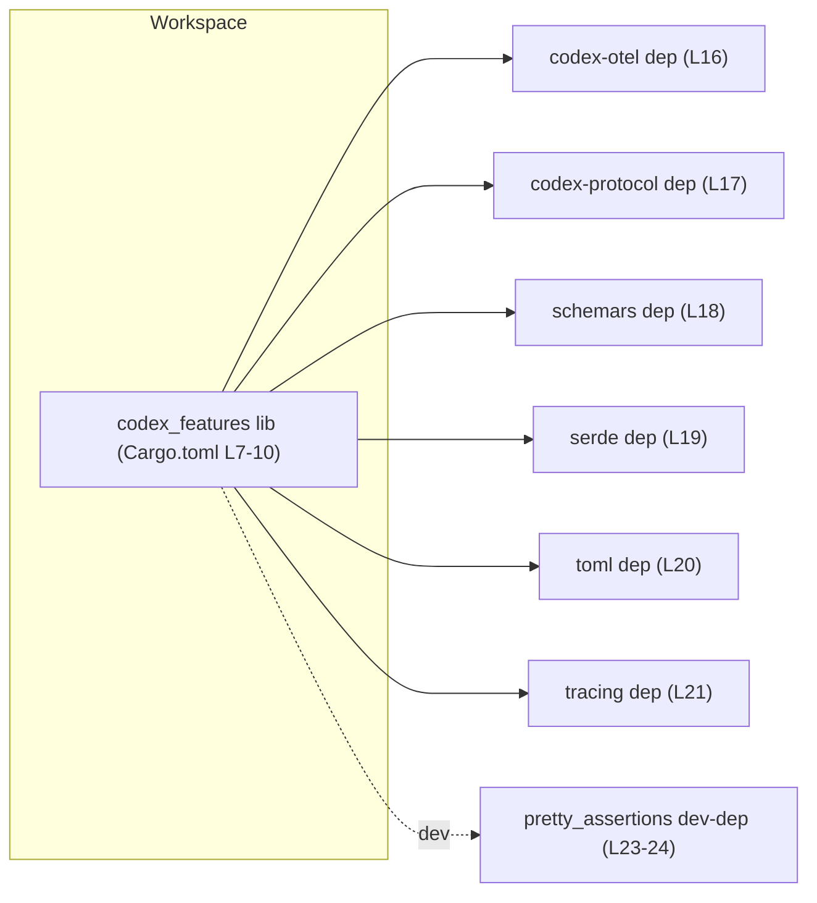
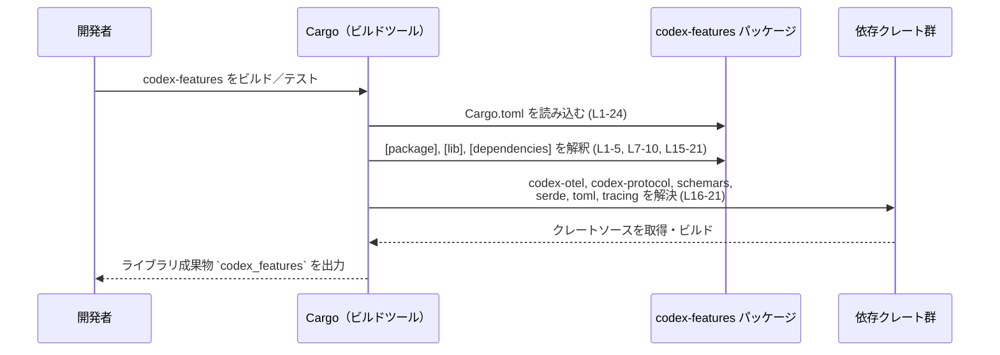

# features/Cargo.toml コード解説

## 0. ざっくり一言

このファイルは、`codex-features` というライブラリクレートの Cargo マニフェストです。  
ビルド対象のライブラリ（`src/lib.rs`）と、依存クレート／ワークスペース設定を定義しています（Cargo.toml:L1-24）。

---

## 1. このモジュールの役割

### 1.1 概要

- このファイルは Rust のビルドツール Cargo に対し、`codex-features` クレートのメタ情報と依存関係を伝えるために存在します（Cargo.toml:L1-5）。
- ライブラリターゲット `codex_features` を `src/lib.rs` からビルドすることを指定し（Cargo.toml:L7-10）、ドキュメントテストを無効化しています（Cargo.toml:L8）。
- 依存クレートとして `codex-otel`, `codex-protocol`, `schemars`, `serde`, `toml`, `tracing` を追加し（Cargo.toml:L15-21）、テスト用に `pretty_assertions` を開発用依存に設定しています（Cargo.toml:L23-24）。

### 1.2 アーキテクチャ内での位置づけ

このファイルからわかる構造を、クレートレベルの依存関係として図示します。  
（すべて features/Cargo.toml の内容のみを反映しています）



- `codex_features` ライブラリクレートが中心であり、上記依存クレートに対して一方向に依存します（Cargo.toml:L15-21）。
- 依存はいずれも `workspace = true` とされており、バージョンや詳細な設定はワークスペースルート側で管理されています（Cargo.toml:L2, L5, L13, L16-21）。  
  ルートの `Cargo.toml` の中身はこのチャンクには現れません。

### 1.3 設計上のポイント

コード（設定）から読み取れる設計上の特徴は次のとおりです。

- **ワークスペース集中管理**  
  - edition, license, version, lints, 各依存のバージョンはすべて `workspace = true` としてルート側に委譲されています（Cargo.toml:L2-3, L5, L13, L16-21）。  
    → クレート個別ではバージョンを持たず、ワークスペース全体で一括管理する方針と解釈できます。
- **ライブラリ専用クレート**  
  - `[lib]` セクションのみが定義されており（Cargo.toml:L7-10）、`[[bin]]` や `[[test]]` などはこのファイルには現れません。  
    → このチャンクからはライブラリクレートとして利用される前提であることのみが分かります。
- **ドキュメントテスト無効化**  
  - `doctest = false` によって、ドキュメントコメント中のコードブロックがテストとして実行されない設定になっています（Cargo.toml:L8）。
- **依存はすべてワークスペース内または標準的なクレート**  
  - `codex-otel`, `codex-protocol` はワークスペース内の別クレートと見なせます（Cargo.toml:L16-17）。  
    `schemars`, `serde`, `toml`, `tracing`, `pretty_assertions` は一般的な公開クレートです（Cargo.toml:L18-21, L24）。
- **安全性・エラー・並行性に関する特別なビルド指定はなし**  
  - `panic` 策略や `overflow-checks` など、挙動を大きく変えるような `[profile]` や `[workspace]` の設定はこのファイルには含まれていません（Cargo.toml:L1-24）。  
    実際のランタイムの安全性・エラーハンドリング・並行性は `src/lib.rs` などコード側に依存し、このチャンクからは分かりません。

---

## 2. 主要な機能一覧

このファイル自体は実行時のロジックを持ちませんが、「ビルド設定上の機能」として以下が挙げられます。

- パッケージメタ情報の定義: `name = "codex-features"` とワークスペース継承の edition/license/version（Cargo.toml:L1-5）。
- ライブラリターゲットの定義: `codex_features` を `src/lib.rs` からビルドし、doctest を無効化（Cargo.toml:L7-10）。
- ワークスペース共通の lints 設定の適用: `[lints] workspace = true`（Cargo.toml:L12-13）。
- 実行時依存クレートの定義: `codex-otel`, `codex-protocol`, `schemars`, `serde`, `toml`, `tracing`（Cargo.toml:L15-21）。
- 開発・テスト用依存クレートの定義: `pretty_assertions`（Cargo.toml:L23-24）。

---

## 3. 公開 API と詳細解説

### 3.1 型一覧（構造体・列挙体など）

このファイルは Cargo の設定ファイルであり、Rust の型（構造体・列挙体など）は定義されていません。  
型の一覧は `src/lib.rs` などコード側を参照する必要がありますが、このチャンクには現れません。

### 3.1 補足: クレート／依存コンポーネント一覧（コンポーネントインベントリー）

このファイルから判明するコンポーネント（クレート／ターゲット／依存）の一覧です。

| コンポーネント名 | 種別 | 役割 / 用途（このファイルから読み取れる範囲） | 根拠 |
|------------------|------|----------------------------------------------|------|
| `codex-features` | パッケージ | ワークスペース内の 1 つのパッケージ。edition, license, version はワークスペースから継承（具体値はこのチャンクには現れない） | Cargo.toml:L1-5 |
| `codex_features` | ライブラリターゲット | `src/lib.rs` からビルドされるライブラリ。ドキュメントテストを無効化 | Cargo.toml:L7-10 |
| `codex-otel` | 実行時依存クレート | ワークスペース内の別クレートへの依存であり、機能詳細はこのチャンクには現れない | Cargo.toml:L16 |
| `codex-protocol` | 実行時依存クレート | 同上。名前からはプロトコル関連と推測できますが、コードからは断定できません | Cargo.toml:L17 |
| `schemars` | 実行時依存クレート | 一般的には JSON Schema 生成に用いられるクレートですが、このリポジトリ内での具体的用途は不明 | Cargo.toml:L18 |
| `serde` | 実行時依存クレート | シリアライズ／デシリアライズ用クレート。`features = ["derive"]` により派生マクロ機能を利用 | Cargo.toml:L19 |
| `toml` | 実行時依存クレート | TOML フォーマットのパース／生成クレート（一般的知識）。このクレートでの具体的利用箇所はこのチャンクには現れない | Cargo.toml:L20 |
| `tracing` | 実行時依存クレート | 構造化ログ／トレース用クレート。`features = ["log"]` で `log` クレートとの連携を有効化 | Cargo.toml:L21 |
| `pretty_assertions` | 開発用依存クレート | テスト失敗時に読みやすい diff を出力するためのアサーション拡張（一般的知識）。本番コードでは使用されない | Cargo.toml:L23-24 |

### 3.2 関数詳細（代替：`[lib]` セクションの詳細）

このファイルには Rust 関数が定義されていないため、代わりにビルド上の中心的な構成要素である `[lib]` セクションを、関数テンプレートに準じて解説します。

#### `[lib]` セクション（ライブラリターゲット定義）

**概要**

- `codex-features` パッケージのライブラリターゲット `codex_features` を定義し、そのビルド元ファイルを `src/lib.rs` に指定します（Cargo.toml:L7-10）。
- ドキュメントコメント内のコードブロックをテストとして実行しないよう `doctest = false` を設定しています（Cargo.toml:L8）。

**「引数」に相当する項目**

| 項目名 | 型（概念的） | 説明 | 根拠 |
|--------|--------------|------|------|
| `name` | 文字列 | 生成されるライブラリクレート名。ここでは `codex_features` | Cargo.toml:L9 |
| `path` | 文字列（パス） | ライブラリのエントリポイントとなるソースファイルへのパス。ここでは `src/lib.rs` | Cargo.toml:L10 |
| `doctest` | bool | ドキュメントテストを有効にするかどうか。`false` により無効化 | Cargo.toml:L8 |

**「戻り値」に相当する結果**

- Cargo がこの設定を読み取ることで、ビルド時に `codex_features` という名前のライブラリ成果物（`.rlib` など）が生成されます。  
  これは一般的な Cargo の挙動に基づく説明であり、このファイル単体の記述では形式のみが示されています（Cargo.toml:L7-10）。

**内部処理の流れ（Cargo 観点の概念的ステップ）**

1. Cargo は `codex-features` パッケージの `Cargo.toml` を読み込みます（Cargo.toml:L1-24）。
2. `[package]` セクションからパッケージ名などを取得し（Cargo.toml:L1-5）、ワークスペース設定を適用します。
3. `[lib]` セクションを検出し、`name`, `path`, `doctest` 設定を取り込みます（Cargo.toml:L7-10）。
4. 指定された `path`（`src/lib.rs`）をコンパイル対象として解決します（Cargo.toml:L10）。
5. ビルド時、依存クレートを解決した上で（Cargo.toml:L15-21）、ライブラリ成果物を生成します。

（3〜5 の挙動は Cargo の一般的仕様に基づくものであり、このファイルだけからは詳細なビルドプロセスまでは読み取れません。）

**Examples（使用例）**

この `[lib]` 設定を前提に、ワークスペース内の別クレートから依存する例を示します。  
以下は一般的なパターンであり、このリポジトリの実際のルート構成はこのチャンクからは分かりません。

```toml
# 他クレート側の Cargo.toml の例（同一ワークスペース内）
[dependencies]
codex-features = { path = "../features" }  # 実際のパスはプロジェクト構成による
```

このように依存を宣言すると、Rust コードからは次のようにライブラリ名 `codex_features` で参照できます。

```rust
// 実際にどのモジュール / 関数が存在するかは、このチャンクには現れません。
// ここでは「codex_features クレートを use できる」という点だけを示します。

use codex_features; // クレートルートをインポート

fn main() {
    // codex_features クレートが提供する API をここから呼び出す想定
    // 具体的な関数や型名は、このチャンクからは不明です。
}
```

**Errors / Panics**

Rust コードの panic ではなく、Cargo 設定として想定されるエラーです。

- `path = "src/lib.rs"` で指定されたファイルが存在しない場合、ビルド時に「ファイルが見つからない」旨のエラーになります（Cargo.toml:L10）。
- `name` を変更した場合、`use codex_features` といった既存のクレート参照が解決できなくなり、依存クレート側でコンパイルエラーになります（Cargo.toml:L9）。
- `doctest = false` のため、ドキュメント中のコードがコンパイル不可能でも doctest として検出されません。これはテストが「落ちない」という意味で、品質上の見逃しリスクにつながります（Cargo.toml:L8）。

**Edge cases（エッジケース）**

- `doctest` を `true` に変更すると、既存のドキュメントコメント中のコードがテストとして実行されるようになります。現状では `false` のため、そのようなテストは走りません（Cargo.toml:L8）。
- `path` を相対パスで指定しているため、プロジェクト内でファイル構成を変更した場合にパスの更新を忘れるとビルドエラーになります（Cargo.toml:L10）。

**使用上の注意点**

- `name` や `path` を変更する際は、ワークスペース内の他クレートからの依存指定や `use` パスに影響するため、必ず影響範囲を確認する必要があります（Cargo.toml:L7-10）。
- `doctest = false` により、ドキュメント中のコードはテストされません。ドキュメントの信頼性を高めたい場合は、将来的に `true` に変更するか、別途テストコード側でサンプルを管理する必要があります（Cargo.toml:L8）。

### 3.3 その他の関数

このファイルには Rust の関数やメソッドは存在しないため、このセクションに該当する項目はありません。

---

## 4. データフロー

このファイルからは実行時のデータフローは読み取れませんが、「ビルド時に Cargo がこのファイルをどのように利用するか」という観点でのフローを示します。



- 実行時にどのようなデータ型がどの依存クレートへ渡されるかは、`src/lib.rs` などコード側に依存し、このチャンクからは全く分かりません。
- 並行性（スレッド使用）やエラーの扱いも、実際の Rust コード側の設計に依存します。このファイルには、それらを直接制御する特別な設定は含まれていません（Cargo.toml:L1-24）。

---

## 5. 使い方（How to Use）

### 5.1 基本的な使用方法

このファイル自体は直接「呼び出す」ものではなく、Cargo が自動的に読み取ります。  
一般的な利用フローは次のようになります。

```bash
# ワークスペースルート（またはこのパッケージディレクトリ）で
cargo build -p codex-features
cargo test -p codex-features
```

- 上記コマンドにより、Cargo は `features/Cargo.toml` を読み込み、依存クレートを解決して `codex_features` ライブラリをビルドします（Cargo.toml:L7-10, L15-21）。
- 実際の API 利用は、他クレートから `codex_features` クレートを `use` して行いますが、その具体的な API は `src/lib.rs` などのコードに依存し、このチャンクには現れません。

### 5.2 よくある使用パターン

このファイルの設定を前提とした典型的なパターンを示します。

1. **ワークスペース内の他クレートからの依存**

    ```toml
    # 別パッケージの Cargo.toml の例
    [dependencies]
    codex-features = { path = "../features" }  # パスはプロジェクト構成による
    ```

    これにより、Rust コードから `codex_features` クレートを利用できます（Cargo.toml:L7-9）。

2. **シリアライズ・ログ関連の活用（一般的な想定）**

    - `serde`（features=["derive"]）が依存に入っているため、データ構造のシリアライズ／デシリアライズを行うロジックが `codex_features` に含まれている可能性がありますが、実際にどの型がどう扱われているかはこのチャンクからは分かりません（Cargo.toml:L19）。
    - `tracing` + `log` ブリッジ機能が有効であるため、`tracing` ベースの計測・ログ出力を行う可能性が高いものの、具体的な計測ポイントやログ内容は不明です（Cargo.toml:L21）。

### 5.3 よくある間違い

Cargo 設定まわりで起こり得る典型的な誤りと、この設定との関係です。

```toml
# 間違い例: [lib] の path を変更したのに、ファイル構成を揃えていない
[lib]
name = "codex_features"
path = "src/main.rs"   # 実際には存在しない、あるいは lib 用ではない

# 正しい例: 実際に存在する lib 用のファイルを指定
[lib]
name = "codex_features"
path = "src/lib.rs"    # Cargo.toml:L10 と一致
```

- `path` と実際のファイル構成が不整合だとビルドエラーになります（Cargo.toml:L10）。

```toml
# 間違い例: クレート名を変更して依存側を更新していない
[package]
name = "codex-features2"  # 依存側はまだ "codex-features" を参照している

# 正しい例: 依存側の Cargo.toml もあわせて修正する
[package]
name = "codex-features"
```

- `name` を変更すると、他クレートの `[dependencies]` 側の名前も合わせて変更する必要があります（Cargo.toml:L4）。

### 5.4 使用上の注意点（まとめ）

- **ワークスペース依存**  
  - `workspace = true` が多用されているため、edition や依存クレートのバージョンはルート設定の影響を強く受けます（Cargo.toml:L2, L5, L13, L16-21）。  
    ルートの変更がこのクレートの挙動に波及する点に注意が必要です。
- **ドキュメントテスト無効化**  
  - `doctest = false` により、ドキュメントのコードサンプルが壊れていても CI では検出されません（Cargo.toml:L8）。
- **安全性・並行性の情報の限界**  
  - このファイル単体からは、メモリ安全性やスレッド安全性の設計、エラーハンドリング戦略は分かりません。Rust の通常の安全性保証以外の特別な設定は見られません（Cargo.toml:L1-24）。

---

## 6. 変更の仕方（How to Modify）

### 6.1 新しい機能を追加する場合

このファイルレベルで関係するのは「新しい外部依存やターゲットを追加する」場合です。

1. **新しい外部クレートに依存した機能を Rust コード側に追加する**  
   - 例: JSON 処理のために別のクレートを使うなど。  
   - 実際のコード変更は `src/lib.rs` などで行います（このチャンクには現れません）。

2. **対応する `[dependencies]` への追記**  
   - 必要に応じて `[dependencies]` ブロックにクレートを追加します（Cargo.toml:L15-21 と同じ形式）。
   - 既存の依存と同じく `workspace = true` を使うかどうかはワークスペースの方針に従います。

3. **ビルド／テストの実行とエラー確認**  
   - `cargo build -p codex-features` / `cargo test -p codex-features` により、設定ミスやバージョン不整合を確認します。

### 6.2 既存の機能を変更する場合

- **[lib] セクションを変更する場合の注意点**（Cargo.toml:L7-10）
  - `name` を変更すると、他クレートからの依存名や `use` パスに影響します。
  - `path` を変更する際は、実際にファイルを移動／作成した上で一致させる必要があります。
- **依存クレートの見直し**（Cargo.toml:L16-21, L23-24）
  - 依存削除：コード側でそのクレートを参照していないことを確認してから削除します。
  - 依存追加：ワークスペースポリシーにしたがい、できる限り `workspace = true` でバージョンを集中管理します。
- **Contracts / Edge Cases（契約とエッジケース）**
  - 契約：`codex-features` というパッケージ／クレート名は依存側から参照される前提の「契約」です（Cargo.toml:L4, L9）。
  - エッジケース：`doctest` を有効化するなどの設定変更は、既存のドキュメントを大量に壊す可能性があり、事前に影響を検討する必要があります（Cargo.toml:L8）。

---

## 7. 関連ファイル

このファイルと密接に関係すると思われるファイル・ディレクトリです（存在は行から推測できますが、中身はこのチャンクには現れません）。

| パス | 役割 / 関係 | 根拠 |
|------|------------|------|
| `features/src/lib.rs` | `codex_features` ライブラリターゲットのエントリポイントとなるソースファイル。公開 API やコアロジックはここに定義されていると考えられますが、中身は不明です | Cargo.toml:L10 |
| ワークスペースルートの `Cargo.toml` | `edition.workspace`, `license.workspace`, `version.workspace`, 依存の `workspace = true` の具体的内容を定義しているファイル。このチャンクには現れません | Cargo.toml:L2-3, L5, L13, L16-21 |
| `codex-otel` クレートのディレクトリ | ワークスペース内の別パッケージ。`codex-features` から依存しており、テレメトリ関連機能を提供している可能性がありますが、中身は不明です | Cargo.toml:L16 |
| `codex-protocol` クレートのディレクトリ | 同上。プロトコル関連の機能を持つと推測されますが、コードがないため断定はできません | Cargo.toml:L17 |

---

### Bugs / Security の観点（このファイルから読み取れる範囲）

- この Cargo 設定だけから、明確なバグやセキュリティ上の脆弱性は特定できません（Cargo.toml:L1-24）。
- ログ／トレース関連の依存（`tracing`）があるため、実装次第では機密情報をログ出力するリスクがありますが、それはコード側の問題であり、このチャンクからは判断できません。
- 依存クレートのバージョンはワークスペース側で集中管理されているため、脆弱性対応のパッチ適用を一括で行いやすい構造と解釈できますが、実際にどのバージョンが使われているかはこのチャンクには現れません。

このファイルは、公開 API やコアロジックそのものではなく、それらが定義されるクレートの「ビルド・依存の枠組み」を決める役割を持っているという点が、理解の要点になります。
