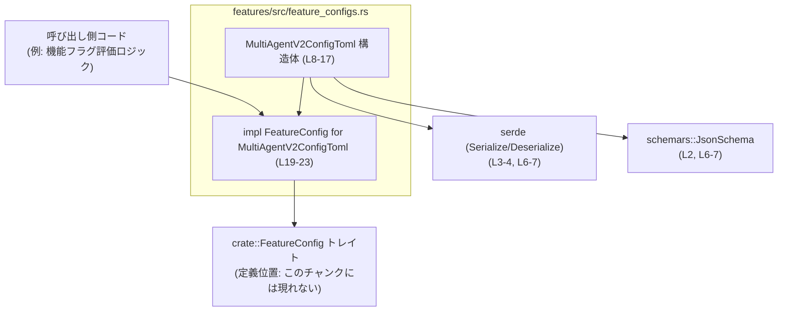
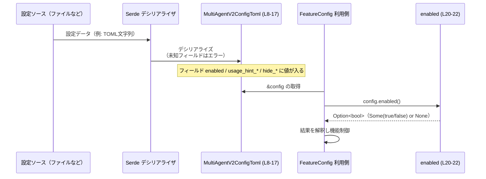

# features/src/feature_configs.rs コード解説

## 0. ざっくり一言

`MultiAgentV2ConfigToml` という機能フラグ用の設定構造体を定義し、それを `FeatureConfig` トレイトの実装として公開するモジュールです。Serde と schemars を用いてシリアライズ／デシリアライズおよび JSON Schema 生成に対応しています。  
根拠: `feature_configs.rs:L1-4, L6-7, L8-17, L19-23`

---

## 1. このモジュールの役割

### 1.1 概要

- MultiAgent V2 機能に関する設定値を保持する構造体 `MultiAgentV2ConfigToml` を定義します。  
  根拠: `feature_configs.rs:L6-7, L8-17`
- その構造体に対して、機能の有効／無効状態を問い合わせるための `FeatureConfig` トレイトを実装します。  
  根拠: `feature_configs.rs:L1, L19-23`
- Serde によるシリアライズ／デシリアライズと JSON Schema 生成に対応し、設定ファイルや外部設定システムとの連携を想定した構造になっています。  
  根拠: `feature_configs.rs:L2-4, L6-7`

### 1.2 アーキテクチャ内での位置づけ

このモジュールは「機能フラグ管理層」の一部として、MultiAgent V2 用の構成情報を表現すると考えられます。`FeatureConfig` トレイトはクレートルートからインポートされており、このトレイトを通じて他のコードから利用されます。  
根拠: `feature_configs.rs:L1, L19-23`



### 1.3 設計上のポイント

- **責務の分割**
  - 設定値の保持は `MultiAgentV2ConfigToml` 構造体が担当し、機能有効判定のインターフェースは `FeatureConfig` トレイトで抽象化されています。  
    根拠: `feature_configs.rs:L8-17, L19-23`
- **状態の持ち方**
  - 構造体は単純なフィールドだけを持つ不変データキャリアであり、内部で追加の状態やロジックを持ちません。すべてのフィールドは `pub` で公開されています。  
    根拠: `feature_configs.rs:L8-16`
- **エラーハンドリング方針**
  - Serde の `#[serde(deny_unknown_fields)]` により、未知のフィールドを含む入力をエラーとして扱う「厳格な」デシリアライズにしています。  
    根拠: `feature_configs.rs:L7`
- **シリアライズ設計**
  - すべてのフィールドが `Option<T>` であり、`None` の場合はシリアライズ時にフィールドを省略します。設定ファイルでの指定は任意である設計です。  
    根拠: `feature_configs.rs:L8-16`
- **型安全性**
  - Rust の安全なコードのみで構成されており、`unsafe` は使用されていません。エラーは主にデシリアライズ時のバリデーションエラーとして扱われます。  
    根拠: `feature_configs.rs` 全体（`unsafe` の不在）

---

## 2. 主要な機能一覧

- MultiAgent V2 設定構造体の定義: 機能有効／無効および利用ヒントに関するオプション設定を保持します。  
  根拠: `feature_configs.rs:L8-16`
- 設定構造体のシリアライズ／デシリアライズ: Serde を使い、未知フィールドを禁止した TOML/JSON などへの変換を可能にします。  
  根拠: `feature_configs.rs:L3-4, L6-7, L8-16`
- JSON Schema の自動生成: `JsonSchema` 派生により、この設定構造体のスキーマを生成可能です。  
  根拠: `feature_configs.rs:L2, L6`
- FeatureConfig トレイト実装: `enabled()` メソッドにより、「この機能が明示的に有効化されているか」を `Option<bool>` で取得できます。  
  根拠: `feature_configs.rs:L1, L19-23`

---

## 3. 公開 API と詳細解説

### 3.1 型一覧（構造体・列挙体など）

#### コンポーネントインベントリー

| 名前 | 種別 | 公開範囲 | 役割 / 用途 | 依存 | 定義位置 |
|------|------|----------|-------------|------|----------|
| `MultiAgentV2ConfigToml` | 構造体 | `pub` | MultiAgent V2 機能に関する設定値（有効フラグやヒント表示用設定など）を保持するデータコンテナ | `serde::Serialize`, `serde::Deserialize`, `schemars::JsonSchema`, 標準ライブラリの `bool`/`String` | `feature_configs.rs:L6-17` |
| `FeatureConfig` | トレイト | 不明（クレート外部定義） | 機能設定オブジェクトから有効フラグなどを取得するための共通インターフェースと推測されます（命名と `enabled` 実装からの推測。定義本体はこのチャンクには現れません） | 不明 | インポート: `feature_configs.rs:L1`（定義は別ファイル） |

> `FeatureConfig` の詳細なメソッド一覧や振る舞いは、このチャンクには現れません。

#### `MultiAgentV2ConfigToml` フィールド一覧

| フィールド名 | 型 | 説明 | Serde 振る舞い | 定義位置 |
|--------------|----|------|----------------|----------|
| `enabled` | `Option<bool>` | MultiAgent V2 機能が有効かどうか。`Some(true)` なら有効、`Some(false)` なら無効、`None` は「未指定」を表します。 | `None` 時はシリアライズ時にフィールドを省略 | `feature_configs.rs:L9-10` |
| `usage_hint_enabled` | `Option<bool>` | 利用ヒントの表示機能を有効にするかどうかを示すフラグ。詳細な意味はこのチャンクからは不明です。 | `None` 時は省略 | `feature_configs.rs:L11-12` |
| `usage_hint_text` | `Option<String>` | 利用ヒントの内容テキスト。指定されていない場合は `None` になります。 | `None` 時は省略 | `feature_configs.rs:L13-14` |
| `hide_spawn_agent_metadata` | `Option<bool>` | エージェント生成に関するメタデータを非表示にするかどうかを制御するフラグと解釈できますが、詳細な解釈はこのチャンクからは確定できません。 | `None` 時は省略 | `feature_configs.rs:L15-16` |

共通の属性:

- `#[derive(Serialize, Deserialize, Debug, Clone, Default, PartialEq, Eq, JsonSchema)]`  
  - Serde によるシリアライズ／デシリアライズ、デバッグ出力、クローン、デフォルト生成、等価比較、JSON Schema 生成をサポートします。  
    根拠: `feature_configs.rs:L6`
- `#[serde(deny_unknown_fields)]`  
  - デシリアライズ時に未定義のフィールドが存在するとエラーにします。  
    根拠: `feature_configs.rs:L7`

### 3.2 関数詳細

このファイルで定義されている公開 API 相当のメソッドは `FeatureConfig` トレイト実装の `enabled` のみです。

#### `enabled(&self) -> Option<bool>`

**定義**

```rust
impl FeatureConfig for MultiAgentV2ConfigToml {          // FeatureConfig トレイトの実装を開始
    fn enabled(&self) -> Option<bool> {                  // enabled メソッドを実装
        self.enabled                                     // 構造体フィールド enabled をそのまま返す
    }
}
```

根拠: `feature_configs.rs:L19-23`

**概要**

`MultiAgentV2ConfigToml` インスタンスに格納されている `enabled` フィールドを、そのまま `Option<bool>` として返します。  
呼び出し側は `Some(true)` / `Some(false)` / `None` の 3 状態を区別して扱う必要があります。

**引数**

| 引数名 | 型 | 説明 |
|--------|----|------|
| `&self` | `&MultiAgentV2ConfigToml` | 対象となる設定オブジェクトへの参照です。所有権は移動せず、借用のみを行います。 |

**戻り値**

- 型: `Option<bool>`
  - `Some(true)`: MultiAgent V2 機能が **明示的に有効化** されている状態。
  - `Some(false)`: MultiAgent V2 機能が **明示的に無効化** されている状態。
  - `None`: 設定ファイル等で `enabled` が **未指定** の状態。実際にどう解釈するか（デフォルトは有効か無効かなど）は `FeatureConfig` を利用する側のコードに依存し、このチャンクには現れません。

**内部処理の流れ**

1. `self` への参照を受け取る。  
   根拠: `feature_configs.rs:L20`
2. 構造体のフィールド `self.enabled` を、そのまま戻り値として返す。  
   - `Option<bool>` は `Copy` トレイトを実装しているため、この返却は値のコピーであり、所有権の移動は起こりません。  
   根拠: `feature_configs.rs:L20-21`

内部に条件分岐やループは存在しません。

**使用例（正常系）**

`MultiAgentV2ConfigToml` を直接構築して `enabled()` を呼び出す基本的な例です。

```rust
use features::feature_configs::MultiAgentV2ConfigToml; // 実際のパス名はクレート構成に依存します（このチャンクには現れません）

fn main() {
    // MultiAgentV2ConfigToml を明示的に作成する
    let config = MultiAgentV2ConfigToml {
        enabled: Some(true),              // 機能を明示的に有効
        usage_hint_enabled: None,         // その他は未指定
        usage_hint_text: None,
        hide_spawn_agent_metadata: None,
    };

    // FeatureConfig トレイトを通じて有効状態を取得
    let enabled = config.enabled();       // 値は Some(true)

    match enabled {
        Some(true) => println!("MultiAgent V2 は有効です"),
        Some(false) => println!("MultiAgent V2 は無効です"),
        None => println!("MultiAgent V2 の状態は未指定です"),
    }
}
```

**使用例（未指定の場合の扱い）**

`enabled` を指定しなかった場合の挙動です。

```rust
fn main() {
    // Default 派生を利用して、すべて None の設定を作る
    let config = MultiAgentV2ConfigToml::default(); // 全フィールド None
    let enabled = config.enabled();                 // enabled は None

    // 利用側でデフォルト値（例: false）を補うパターン
    let is_enabled = enabled.unwrap_or(false);      // None の場合は false とみなす

    println!("有効フラグ: {}", is_enabled);
}
```

> ※ `None` をどのようなデフォルトとして扱うか（例: `false` にするか、別の設定を参照するか）は、呼び出し側の設計に依存し、このファイルからは分かりません。

**Errors / Panics**

- このメソッド自体は、エラーや `panic!` を発生させません。単にフィールド値を返すだけです。  
  根拠: `feature_configs.rs:L20-21`（条件分岐・`panic!` の不在）
- ただし、このメソッドを呼び出す前段階で `MultiAgentV2ConfigToml` をデシリアライズする際には、`deny_unknown_fields` により未知フィールドが存在するとエラーになります。  
  根拠: `feature_configs.rs:L7`

**Edge cases（エッジケース）**

- `enabled` が `None` の場合
  - デフォルトコンストラクタ（`MultiAgentV2ConfigToml::default()`）を使った場合、`enabled` は `None` です。  
    根拠: `feature_configs.rs:L6`（`Default` 派生）、`feature_configs.rs:L9-10`
  - `enabled()` は `None` をそのまま返します。呼び出し側で適切に補完する必要があります。
- `enabled` が `Some(false)` の場合
  - 「明示的に無効化されている」ことを区別して扱えるため、`None`（未指定）との区別が重要です。
- マルチスレッド環境
  - `&self` を取るだけのメソッドであり、内部でミューテーションを行わないため、複数スレッドから同時に呼び出してもデータ競合は発生しません（`MultiAgentV2ConfigToml` 自体が `Send + Sync` となるかは、そのフィールド型に依存しますが、この構造体は `bool` と `String` のみを保持しており、これらは標準的な Rust 環境では `Send + Sync` です）。

**使用上の注意点**

- `Option<bool>` の 3 値を区別すること
  - `None`（未指定）を単純に `false` と同一視すると、設計意図と異なる振る舞いを引き起こす可能性があります。  
- 所有権とコスト
  - `Option<bool>` は `Copy` なので、このメソッドは非常に軽量です。高頻度で呼び出してもパフォーマンス上の問題は通常ありません。
- デシリアライズエラーの伝播
  - 設定読み込み時に未知フィールドでエラーになるため、設定ファイルのキー名変更や拡張には注意が必要です（設定スキーマを変更した場合、呼び出し元でエラー処理を行う必要があります）。  

### 3.3 その他の関数

このファイル内には、`enabled` 以外のメソッドや関数定義は存在しません。  
根拠: `feature_configs.rs` 全体のコード

---

## 4. データフロー

### 4.1 典型的な処理シナリオ

この構造体の代表的な利用フローは、次のように整理できます。

1. 設定ファイル（おそらく TOML）や外部設定ソースから文字列または構造化データを読み込む。  
   - 構造体名に `Toml` が含まれていること、Serde の利用から TOML などの設定形式を想定できますが、具体的な形式はこのチャンクからは確定できません。  
     根拠: `feature_configs.rs:L2-4, L6-7, L8`
2. Serde を用いてデータを `MultiAgentV2ConfigToml` にデシリアライズする。  
   - 未知フィールドがあるとエラーになります（`deny_unknown_fields`）。  
     根拠: `feature_configs.rs:L7`
3. 機能フラグ管理ロジックが `FeatureConfig` トレイトを通じて `enabled()` を呼び出し、機能の有効状態を解釈します。  
   根拠: `feature_configs.rs:L1, L19-23`

### 4.2 シーケンス図



> `設定ソース` や `FeatureConfig 利用側` の具体的な型・モジュールは、このチャンクには現れません。ここでは一般的なデータフローとして示しています。

---

## 5. 使い方（How to Use）

### 5.1 基本的な使用方法

ここでは、コードから直接 `MultiAgentV2ConfigToml` を生成し、`enabled()` を使う最も単純な例を示します。

```rust
use crate::feature_configs::MultiAgentV2ConfigToml; // 実際のパスはクレート構成に依存（このチャンクには現れません）

fn main() {
    // 設定構造体のインスタンスを手動で作成する
    let config = MultiAgentV2ConfigToml {
        enabled: Some(true),                       // MultiAgent V2 を明示的に有効
        usage_hint_enabled: Some(true),            // 利用ヒントも有効
        usage_hint_text: Some("ヒント本文".into()), // 利用ヒントテキスト
        hide_spawn_agent_metadata: Some(false),    // メタデータは非表示にしない
    };

    // FeatureConfig::enabled() を通じて状態を取得
    if config.enabled().unwrap_or(false) {
        println!("MultiAgent V2 機能を実行します");
    } else {
        println!("MultiAgent V2 機能は無効です");
    }
}
```

### 5.2 よくある使用パターン

#### パターン 1: デフォルト値から必要な部分だけ上書き

`Default` 派生により、すべてのフィールドが `None` の状態を簡単に作り、必要なものだけ設定するパターンです。

```rust
fn main() {
    let mut config = MultiAgentV2ConfigToml::default(); // enabled = None など

    // 必要なフィールドのみ設定
    config.enabled = Some(false); // 明示的に無効化とする

    // enabled() で状態を確認
    match config.enabled() {
        Some(true) => println!("有効"),
        Some(false) => println!("無効"),
        None => println!("未指定"),
    }
}
```

#### パターン 2: 設定ファイルからの読み込み（例: TOML）

構造体名に `Toml` が含まれていることと Serde を利用していることから、TOML 設定ファイルでの利用が想定されます。以下は `toml` クレートを利用した一例です（この具体的な利用形態はこのチャンクからは断定できないため、あくまで参考例です）。

```rust
use serde::Deserialize;
use toml; // Cargo.toml で toml クレートを追加していると仮定

use crate::feature_configs::MultiAgentV2ConfigToml;

fn load_config_from_toml(input: &str) -> Result<MultiAgentV2ConfigToml, toml::de::Error> {
    // TOML 文字列から MultiAgentV2ConfigToml にデシリアライズする
    let config: MultiAgentV2ConfigToml = toml::from_str(input)?;
    Ok(config)
}

fn main() -> Result<(), Box<dyn std::error::Error>> {
    let toml_str = r#"
        enabled = true
        usage_hint_enabled = true
        usage_hint_text = "この機能は実験的です"
    "#;

    let config = load_config_from_toml(toml_str)?; // deny_unknown_fields により未知フィールドがあればここでエラー

    println!("enabled: {:?}", config.enabled());

    Ok(())
}
```

> `deny_unknown_fields` により、TOML 側にこの構造体に存在しないキーが含まれていると、`toml::from_str` がエラーを返します。

### 5.3 よくある間違い

```rust
// 間違い例: None と false を区別せず扱う
fn use_config_wrong(config: &MultiAgentV2ConfigToml) {
    // enabled() が None の場合も false と同一視してしまう
    if !config.enabled().unwrap_or(false) {
        // 「未指定」でも「無効」と扱われてしまう
        println!("MultiAgent V2 は無効です（未指定も含む）");
    }
}

// 正しい例の一つ: None を区別して処理する
fn use_config_correct(config: &MultiAgentV2ConfigToml) {
    match config.enabled() {
        Some(true) => println!("MultiAgent V2 は有効です"),
        Some(false) => println!("MultiAgent V2 は無効です"),
        None => {
            // 未指定のケースを別扱いにする
            println!("MultiAgent V2 の状態は未指定です。デフォルトポリシーを適用します。");
        }
    }
}
```

**ポイント**

- `None` は「未指定」であり、「無効」とは意味が異なります。  
  状態設計上、3 値を区別して扱うことが重要です。  
  根拠: `enabled` フィールドが `Option<bool>` である点（`feature_configs.rs:L9-10`）

### 5.4 使用上の注意点（まとめ）

- **前提条件**
  - `enabled()` を呼び出す前に、`MultiAgentV2ConfigToml` を適切に初期化し（デシリアライズまたは手動構築）、`enabled` が意図した値を持っている必要があります。
- **エラーハンドリング**
  - デシリアライズ時に未知フィールドがあるとエラーになるため、設定ファイルに不要なキーを追加すると読み込みに失敗します（`deny_unknown_fields`）。  
    根拠: `feature_configs.rs:L7`
- **スレッド安全性**
  - 構造体はイミュータブルなフィールドのみから構成されており、`&self` を通じた読み取りはデータ競合を引き起こしません。マルチスレッド環境で共有して読み取る用途に適しています。
- **パフォーマンス**
  - `enabled()` は単純なフィールド読み出しで、非常に軽量です。頻繁に呼び出してもボトルネックになりにくいです。
- **セキュリティ観点**
  - 未知フィールドを拒否することで、設定ファイルのタイポや意図しないキーの混入を早期に検出できます。一方で、設定スキーマ変更時には古い設定ファイルでエラーが増える可能性があります。

---

## 6. 変更の仕方（How to Modify）

### 6.1 新しい機能を追加する場合

MultiAgent V2 に新しい設定項目を追加したい場合の代表的な手順です。

1. **フィールドの追加**
   - `MultiAgentV2ConfigToml` に新しい `pub` フィールドを追加します。  
     例: `pub new_option: Option<bool>,`  
     位置: `feature_configs.rs:L8-16` の構造体定義部分に追記。
2. **Serde 属性の付与**
   - 他のフィールドと同様に `#[serde(skip_serializing_if = "Option::is_none")]` を付与することで、「未指定ならシリアライズしない」という一貫した振る舞いを維持できます。  
     根拠: 既存フィールドの属性 `feature_configs.rs:L9, L11, L13, L15`
3. **FeatureConfig 実装の拡張**
   - `FeatureConfig` トレイトに他のメソッド（例えば `usage_hint_enabled()` など）が存在する場合、それらに対する実装を追加する必要があります。ただし、トレイト側の定義はこのチャンクには現れないため、実際に何を追加すべきかは別ファイルを確認する必要があります。  
     根拠: `FeatureConfig` 定義の不在 `feature_configs.rs:L1, L19`
4. **設定読み込みコードの更新**
   - デシリアライズを行うコード側で、新フィールドを利用するように更新します（このファイルには登場しません）。

### 6.2 既存の機能を変更する場合

- **`enabled` の意味を変更する**
  - 例えば、「`None` を `true` とみなす」など、意味論的な変更を行う場合、`enabled()` の実装を変更する必要があります。  
    例: `self.enabled.or(Some(true))` のようにデフォルトを適用する設計も考えられますが、現在のコードでは単純にフィールドを返しています。  
    根拠: 現行実装 `feature_configs.rs:L20-21`
  - この変更は `FeatureConfig` を利用するすべての呼び出し側に影響するため、影響範囲の洗い出しが必要です（呼び出し側の場所はこのチャンクには現れません）。
- **デシリアライズ方針の変更**
  - `#[serde(deny_unknown_fields)]` を削除または変更すると、設定ファイルの互換性・堅牢性に影響します。  
    - 削除すれば未知フィールドを無視するようになります。
    - 追加のバリデーションが必要であれば、別途カスタムデシリアライズロジックを実装することも可能ですが、このファイル内では行われていません。  
    根拠: 現行属性 `feature_configs.rs:L7`
- **変更時の注意点**
  - `Default` 派生や `PartialEq`/`Eq` 派生の意味が変わる可能性があるため、新フィールドのデフォルト値や比較対象としての扱いにも注意が必要です。  
    根拠: `feature_configs.rs:L6`

---

## 7. 関連ファイル

このチャンクから明確に参照されているが、定義が現れないファイル・モジュールとの関係をまとめます。

| パス / シンボル | 役割 / 関係 |
|-----------------|------------|
| `crate::FeatureConfig` | 機能設定オブジェクトの共通インターフェースとなるトレイトです。このファイルでは `MultiAgentV2ConfigToml` に対する実装のみが示されており、トレイト本体の定義や他の実装はこのチャンクには現れません。根拠: `feature_configs.rs:L1, L19-23` |
| `serde` 関連モジュール | `Serialize`, `Deserialize` を提供し、設定構造体のシリアライズ／デシリアライズを担います。このファイルでは derive 属性とフィールド属性を通じて利用されています。根拠: `feature_configs.rs:L3-4, L6-7, L9-16` |
| `schemars::JsonSchema` | JSON Schema を生成するためのトレイトです。`MultiAgentV2ConfigToml` のスキーマ定義を自動生成する用途で利用されていると考えられますが、実際にどこでスキーマを使用しているかはこのチャンクには現れません。根拠: `feature_configs.rs:L2, L6` |

テストコードやこの設定を実際に読み込む処理（例: ファイル I/O を行うモジュール）は、このチャンクには登場しません。そのため、テストの有無や具体的な読み込みパスについては「不明」です。
