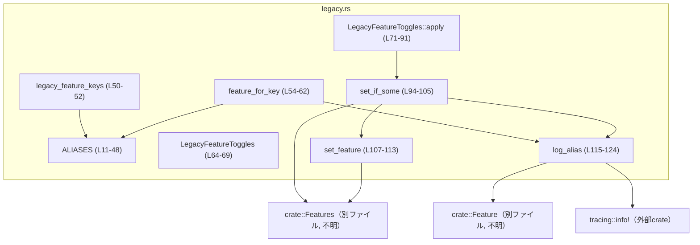
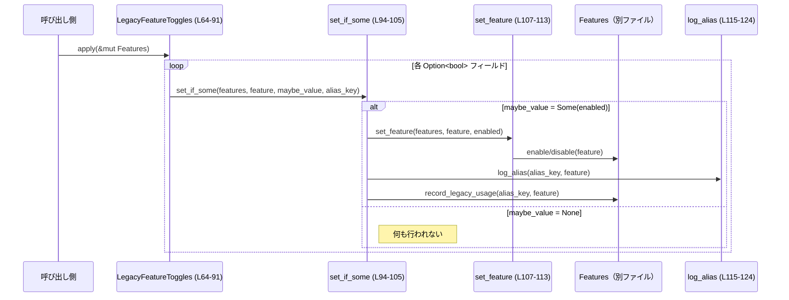

# features/src/legacy.rs コード解説

## 0. ざっくり一言

このモジュールは、古い設定キー（レガシーな「feature toggle」キー）を現在の `Feature` 列挙体と `Features` 管理構造にマッピングするためのユーティリティです（features/src/legacy.rs:L5-48, L50-62, L64-91）。

---

## 1. このモジュールの役割

### 1.1 概要

- このモジュールは、**過去の設定キー名**を扱いつつ、内部的には新しい `Feature` システムに統一するために存在します。
- レガシーキー文字列から `Feature` への変換、および一部のレガシー boolean 設定を `Features` に適用する処理を提供します（features/src/legacy.rs:L11-48, L50-52, L54-62, L64-91）。
- レガシーキーが使われた場合には `tracing` を用いてログ出力し、利用を可視化します（features/src/legacy.rs:L115-124）。

### 1.2 アーキテクチャ内での位置づけ

このモジュールは以下のコンポーネントと連携しています。

- `crate::Feature`：機能フラグを表す列挙体と思われます（features/src/legacy.rs:L1, L7-8, L21-22, 25-26, 30-31, 34, 38, 42, 46, 54, 59, 75, 82, 87, 96, 102, 107, 115）。
- `crate::Features`：複数の `Feature` を有効/無効にし、レガシー利用を記録する管理構造体です（メソッド名から判断できます）（features/src/legacy.rs:L2, L71-72, L95, L101, L103, L107-112）。
- `tracing::info`：レガシーキー使用時のログ出力に利用されます（features/src/legacy.rs:L3, L120-123）。

依存関係を簡略化して示すと以下のようになります。



### 1.3 設計上のポイント

- **レガシーキーと Feature の対応表**  
  - `Alias` 構造体と `ALIASES` 定数スライスで、「レガシーキー文字列 → Feature」の対応を一覧管理しています（features/src/legacy.rs:L5-9, L11-48）。
- **イテレータによる公開**  
  - レガシーキー一覧は `legacy_feature_keys()` で `Iterator<Item=&'static str>` として公開され、呼び出し側はスライス実体を意識せず列挙できます（features/src/legacy.rs:L50-52）。
- **Option<bool> によるトグル入力**  
  - `LegacyFeatureToggles` は各レガシー設定を `Option<bool>` として保持し、「設定が存在しない場合（None）は無視する」という方針を明示しています（features/src/legacy.rs:L64-69, L94-105）。
- **関数分割による責務整理**
  - `LegacyFeatureToggles::apply` は高レベルな適用ロジックを持ち、個々の適用条件は `set_if_some`、実際の on/off は `set_feature` に委譲しています（features/src/legacy.rs:L71-91, L94-113）。
- **レガシー利用のロギングと記録**
  - レガシーキーが使われた場合、`log_alias` で `tracing::info!` によるログを出し、さらに `Features::record_legacy_usage` で内部記録も行っています（features/src/legacy.rs:L94-105, L115-124）。
- **安全性と並行性**
  - `Features` への操作はすべて `&mut Features` 経由で行われ、Rust の借用規則により同時に複数スレッドから同じ `Features` を書き換えることはコンパイル時に制限されます（features/src/legacy.rs:L71-72, L95, L101, L107）。

---

## 2. 主要な機能一覧

- レガシーキー一覧の提供: `legacy_feature_keys` で、認識しているレガシー設定キーの文字列を列挙（features/src/legacy.rs:L50-52）。
- レガシーキーから Feature への変換: `feature_for_key` で、レガシーキー文字列から対応する `Feature` を取得し、利用をログ出力（features/src/legacy.rs:L54-62, L115-124）。
- レガシー boolean トグルから Features への適用: `LegacyFeatureToggles::apply` で、複数のレガシー設定値を `Features` に反映（features/src/legacy.rs:L64-69, L71-91）。
- レガシー適用の共通処理: `set_if_some` で、`Option<bool>` の有無判定とログ・記録・enable/disable 呼び出しを一括で処理（features/src/legacy.rs:L94-105）。
- Feature の有効/無効切り替え: `set_feature` で、`enabled` に応じて `Features::enable` / `Features::disable` を呼び分け（features/src/legacy.rs:L107-113）。
- レガシーキー使用時のログ出力: `log_alias` で、レガシーキーと正規のキー（canonical）をログ出力し、同一の場合はログを省略（features/src/legacy.rs:L115-124）。

---

## 3. 公開 API と詳細解説

### 3.1 型一覧（構造体・列挙体など）

| 名前 | 種別 | 可視性 | 定義位置 | 役割 / 用途 |
|------|------|--------|----------|-------------|
| `Alias` | 構造体 | モジュール内(private) | features/src/legacy.rs:L5-9 | レガシーキー文字列と `Feature` のペアを表す内部用構造体。`ALIASES` テーブルの要素型。 |
| `LegacyFeatureToggles` | 構造体 | `pub(crate)` | features/src/legacy.rs:L64-69 | レガシー設定から受け取った `Option<bool>` のトグル値を保持し、`apply` で `Features` に反映するためのコンテナ。 |

`LegacyFeatureToggles` のフィールド概要（features/src/legacy.rs:L64-69）:

| フィールド名 | 型 | 説明 |
|-------------|----|------|
| `include_apply_patch_tool` | `Option<bool>` | レガシーキー `"include_apply_patch_tool"` に対応するトグル。`Some(true/false)` の場合に `Feature::ApplyPatchFreeform` を切り替え。 |
| `experimental_use_freeform_apply_patch` | `Option<bool>` | レガシーキー `"experimental_use_freeform_apply_patch"` に対応。こちらも `Feature::ApplyPatchFreeform` を制御。 |
| `experimental_use_unified_exec_tool` | `Option<bool>` | レガシーキー `"experimental_use_unified_exec_tool"` に対応。`Feature::UnifiedExec` を制御。 |

### 3.2 関数詳細

#### `legacy_feature_keys() -> impl Iterator<Item = &'static str>`

**定義位置**

- features/src/legacy.rs:L50-52

**概要**

- `ALIASES` に登録されているすべてのレガシーキー文字列を、`Iterator` として返します。
- 戻り値のイテレータは `'static` ライフタイムの `&str` を生成するため、呼び出し側で長期間保持しても安全です（`legacy_key: &'static str` に基づく、features/src/legacy.rs:L7）。

**引数**

- なし。

**戻り値**

- `impl Iterator<Item = &'static str>`  
  `ALIASES` に含まれる各 `Alias` の `legacy_key` フィールドに対するイテレータ（features/src/legacy.rs:L50-52）。

**内部処理の流れ**

1. `ALIASES.iter()` により、`&Alias` のイテレータを取得（features/src/legacy.rs:L51）。
2. `.map(|alias| alias.legacy_key)` により、各要素から `legacy_key` フィールドを取り出すイテレータへ変換（features/src/legacy.rs:L51）。

**Examples（使用例）**

レガシーキーの一覧をログに出力する例です。

```rust
// モジュールパスはプロジェクト構成に依存します。
// ここでは `crate::legacy` にあると仮定しています。
use crate::legacy::legacy_feature_keys; // legacy_feature_keys 関数をインポート

fn print_legacy_keys() {
    // legacy_feature_keys() はイテレータを返す
    for key in legacy_feature_keys() {   // 各レガシーキー文字列を順に取り出す
        println!("supported legacy key: {key}"); // 対応しているレガシーキーを表示
    }
}
```

**Errors / Panics**

- この関数内ではエラー処理や `panic!` 呼び出しは行われていません。
- 単純なイテレータ生成のみであり、`ALIASES` 自体も静的なスライスのため、この関数起因のランタイムエラーはありません（features/src/legacy.rs:L11-48, L50-52）。

**Edge cases（エッジケース）**

- `ALIASES` が空スライスになった場合（現在のコードではそうなっていませんが）、イテレータは空となり、呼び出し側のループは 1 度も回りません。
- 重複する `legacy_key` が存在しても、そのままイテレータに出力されます（現コードでは重複なし、features/src/legacy.rs:L11-48）。

**使用上の注意点**

- 戻り値は **遅延評価** のイテレータです。必要なら `collect::<Vec<_>>()` などで具体的なコレクションに変換できます。
- 返される `&'static str` はプログラム全体で有効なため、構造体のフィールドなどに保持してもライフタイム上の問題はありません。

---

#### `feature_for_key(key: &str) -> Option<Feature>`

**定義位置**

- features/src/legacy.rs:L54-62

**概要**

- レガシーキー文字列 `key` に対応する `Feature` を `ALIASES` から検索し、見つかった場合は `Some(feature)` を返します。
- 見つかった場合には `log_alias` を呼び出し、レガシーキー使用をログ出力します（features/src/legacy.rs:L58-60, L115-124）。

**引数**

| 引数名 | 型 | 説明 |
|--------|----|------|
| `key` | `&str` | レガシー設定から渡されるキー文字列。`ALIASES` の `legacy_key` と一致することを期待。 |

**戻り値**

- `Option<Feature>`  
  - 対応するエントリが `ALIASES` に存在する場合は `Some(feature)` を返します。
  - 対応がなければ `None` を返します（features/src/legacy.rs:L54-62）。

**内部処理の流れ**

1. `ALIASES.iter()` で `&Alias` のイテレータを取得（features/src/legacy.rs:L55）。
2. `.find(|alias| alias.legacy_key == key)` で `legacy_key` と `key` が完全一致する最初の要素を検索（features/src/legacy.rs:L56-57）。
3. 見つかった場合:
   - `.map(|alias| { ... })` のクロージャ内に入り、`log_alias(alias.legacy_key, alias.feature)` でログを記録（features/src/legacy.rs:L58-60, L115-124）。
   - その後 `alias.feature` を返し、最終的に `Some(feature)` となる（features/src/legacy.rs:L60）。
4. 見つからない場合:
   - `find` が `None` を返し、そのまま `None` が戻り値となる（features/src/legacy.rs:L54-62）。

**Examples（使用例）**

レガシーキーから `Feature` を取り出す例です。

```rust
use crate::legacy::feature_for_key;        // feature_for_key 関数をインポート
use crate::Feature;                        // Feature 列挙体（別ファイル）

fn handle_legacy_key(key: &str) {
    match feature_for_key(key) {           // レガシーキーから Feature を取得
        Some(feature) => {
            // 対応する Feature が見つかった場合の処理
            println!("mapped {key} to feature {:?}", feature);
        }
        None => {
            // 未知のレガシーキーの場合の処理
            println!("unknown legacy key: {key}");
        }
    }
}
```

**Errors / Panics**

- 本関数自体は `panic!` を呼び出しません。
- エラー型を返さず、未対応キーは `None` によって表現されます。
- `log_alias` 内で使用する `feature.key()` および `tracing::info!` の内部挙動については、このチャンクからは分かりません（features/src/legacy.rs:L115-124）。

**Edge cases（エッジケース）**

- `key` が空文字列 `""` の場合、`ALIASES` 内に同じキーがなければ `None` が返ります（features/src/legacy.rs:L11-48, L56-57）。
- 大文字小文字の違いを吸収する処理はなく、**完全一致** のみがマッチします（features/src/legacy.rs:L57）。
- `ALIASES` に同じ `legacy_key` が複数登録されている場合、`iter().find(...)` の仕様により **最初の一致** のみが返されます（現コードでは重複なし）。

**使用上の注意点**

- 未知のキーは `None` で返されるため、呼び出し側は `Option` を必ず `match` や `if let` などで扱う必要があります。
- ログ出力は「key が見つかった場合」にのみ行われ、見つからなかった場合はログされません（features/src/legacy.rs:L58-60）。
- セキュリティ上、この関数は文字列比較のみを行い、外部への I/O は `tracing` のログ出力だけです。このコードから明らかな危険な処理はありません。

---

#### `LegacyFeatureToggles::apply(self, features: &mut Features)`

**定義位置**

- features/src/legacy.rs:L71-91

**概要**

- `LegacyFeatureToggles` に格納されたレガシー boolean 設定（`Option<bool>`）を、`Features` に適用します。
- 各フィールドごとに `set_if_some` を呼び出し、`Some(true/false)` の場合にのみ対応する `Feature` を有効/無効化し、レガシー利用を記録します。

**引数**

| 引数名 | 型 | 説明 |
|--------|----|------|
| `self` | `LegacyFeatureToggles`（値所有） | 適用するレガシー設定値の集合。メソッド呼び出しにより消費され、再利用はできません。 |
| `features` | `&mut Features` | 適用対象となる `Features` 管理オブジェクト。変化はこの引数に反映されます。 |

**戻り値**

- 戻り値はありません（`()`）。`features` の状態が副作用として更新されます。

**内部処理の流れ**

1. `include_apply_patch_tool` フィールドに対して `set_if_some` を呼び出し、`Feature::ApplyPatchFreeform` を制御（features/src/legacy.rs:L73-78）。
2. `experimental_use_freeform_apply_patch` についても同じく `Feature::ApplyPatchFreeform` を制御（features/src/legacy.rs:L79-84）。
3. `experimental_use_unified_exec_tool` に対して `Feature::UnifiedExec` を制御（features/src/legacy.rs:L85-90）。
4. `set_if_some` 内では、値が `Some` の場合にのみ `set_feature` と `log_alias`、`Features::record_legacy_usage` が呼ばれます（features/src/legacy.rs:L94-105）。

**Examples（使用例）**

レガシー設定から `Features` を構成する一例です。

```rust
use crate::legacy::LegacyFeatureToggles;  // LegacyFeatureToggles 構造体
use crate::Features;                      // Features 型（別ファイル）

fn apply_legacy_settings() {
    let mut features = Features::default();    // Features の初期化（実装は別ファイル）

    // 例: 2つのレガシー設定が true/false で与えられたとする
    let toggles = LegacyFeatureToggles {
        include_apply_patch_tool: Some(true),          // ApplyPatchFreeform を有効にしたい
        experimental_use_freeform_apply_patch: None,   // このキーは設定されていない
        experimental_use_unified_exec_tool: Some(false), // UnifiedExec を無効にしたい
    };

    toggles.apply(&mut features);              // レガシー設定を Features に適用する
    // この時点で、features には上記のレガシー設定が反映されている
}
```

**Errors / Panics**

- このメソッド自体に `panic!` は含まれていません。
- 内部で呼び出す `set_if_some` / `set_feature` / `Features` のメソッド（`enable`, `disable`, `record_legacy_usage`）の実装はこのチャンクには存在しないため、その内部でのパニック可能性は不明です（features/src/legacy.rs:L94-105, L107-113）。

**Edge cases（エッジケース）**

- すべてのフィールドが `None` の場合、`set_if_some` 内の `if let Some` が成立せず、`Features` に対する更新やログ出力は一切行われません（features/src/legacy.rs:L94-105）。
- `include_apply_patch_tool` と `experimental_use_freeform_apply_patch` の両方が `Some` の場合、`Feature::ApplyPatchFreeform` は **後に呼ばれた方（実装上は `experimental_use_freeform_apply_patch` 側）の値で上書き** されます（features/src/legacy.rs:L73-84）。
- `features` が他の場所で同時にミュータブルに借用されているとコンパイルエラーになります。これは Rust の借用規則によりデータ競合を防ぐためです。

**使用上の注意点**

- `self` は値で取り、`Copy` でも `Clone` でもないため、`apply` 呼び出し後に同じ `LegacyFeatureToggles` インスタンスを再利用することはできません。この設計から、「設定は一度適用する前提」であることが分かります。
- 同じ `Feature` を複数のレガシーキーが制御するケース（ApplyPatchFreeform）では、「最後に呼ばれた `set_if_some` が有効」という挙動であることを前提にすべきです（features/src/legacy.rs:L73-84）。
- 非同期やマルチスレッドで使う場合、`Features` を共有するなら `Mutex` 等で同期したうえで `&mut Features` を得る必要がありますが、`legacy.rs` 内ではそのような並行実行制御は行っていません。

---

#### `set_if_some(features: &mut Features, feature: Feature, maybe_value: Option<bool>, alias_key: &'static str)`

**定義位置**

- features/src/legacy.rs:L94-105

**概要**

- `Option<bool>` で与えられたレガシートグル `maybe_value` をチェックし、`Some` の場合にのみ `Features` を更新・ログ記録・レガシー利用記録を行う共通処理です。

**引数**

| 引数名 | 型 | 説明 |
|--------|----|------|
| `features` | `&mut Features` | 更新対象の `Features`。enable / disable / record_legacy_usage の呼び出しに使用。 |
| `feature` | `Feature` | 制御対象の機能フラグ。`set_feature` および `record_legacy_usage` に渡されます。 |
| `maybe_value` | `Option<bool>` | レガシー設定値。`Some(true/false)` の場合のみ処理が実行されます。 |
| `alias_key` | `&'static str` | レガシーキー文字列。ログおよび `record_legacy_usage` に使用されます。 |

**戻り値**

- 戻り値はありません（`()`）。副作用として `features` の状態とログ出力が行われます。

**内部処理の流れ**

1. `if let Some(enabled) = maybe_value { ... }` で `maybe_value` を判定（features/src/legacy.rs:L100）。
2. `Some` の場合のみブロックに入り、以下を順に実行（features/src/legacy.rs:L100-104）:
   - `set_feature(features, feature, enabled)` で `Features` に対し on/off を適用（features/src/legacy.rs:L101, L107-113）。
   - `log_alias(alias_key, feature)` で、レガシーキー利用のログを出力（features/src/legacy.rs:L102, L115-124）。
   - `features.record_legacy_usage(alias_key, feature)` で、内部にレガシー利用情報を記録（features/src/legacy.rs:L103）。
3. `None` の場合は何も実行されず、`features` もログも変更されません。

**Examples（使用例）**

`set_if_some` は通常 `LegacyFeatureToggles::apply` から呼び出されるため、外部から直接使うことはあまり想定されませんが、挙動例を示します。

```rust
use crate::legacy::set_if_some;     // 実際にはモジュール外非公開なら use できません（可視性に注意）
use crate::{Features, Feature};

fn example(features: &mut Features) {
    // Some(true) の場合: feature を有効化し、ログとレガシー記録を行う
    set_if_some(
        features,
        Feature::UnifiedExec,        // 制御対象の Feature
        Some(true),                  // 有効にしたい
        "experimental_use_unified_exec_tool", // レガシーキー文字列
    );

    // None の場合: 何も起こらない
    set_if_some(
        features,
        Feature::UnifiedExec,
        None,
        "experimental_use_unified_exec_tool",
    );
}
```

（注: 実際には `set_if_some` は `pub` ではなく、この例は挙動説明のための疑似コードです。）

**Errors / Panics**

- `set_if_some` 自体はパニックを含みません。
- `features.record_legacy_usage` および `set_feature` 内の挙動はこのチャンクからは分かりません（features/src/legacy.rs:L101-103, L107-113）。

**Edge cases（エッジケース）**

- `maybe_value` が `None` の場合は完全に no-op です（features/src/legacy.rs:L100-104）。
- `alias_key` と `feature.key()` が一致する場合は `log_alias` 内でログがスキップされますが、`record_legacy_usage` は呼び出されます（features/src/legacy.rs:L102-103, L115-124）。

**使用上の注意点**

- この関数は「値が設定されている場合だけ適用する」というパターンをカプセル化するためのものです。`Option<bool>` の `None` は「設定が存在しないこと」を意味します。
- 並行性の観点では、`&mut Features` を受け取るため、複数スレッドから同時に呼び出すには外側で排他制御を行う必要があります。

---

#### `set_feature(features: &mut Features, feature: Feature, enabled: bool)`

**定義位置**

- features/src/legacy.rs:L107-113

**概要**

- `enabled` の真偽値に応じて、指定された `feature` を `Features` 上で有効化 (`enable`) または無効化 (`disable`) します。

**引数**

| 引数名 | 型 | 説明 |
|--------|----|------|
| `features` | `&mut Features` | 更新対象となる `Features`。 |
| `feature` | `Feature` | 有効/無効状態を切り替える対象。 |
| `enabled` | `bool` | `true` なら有効化、`false` なら無効化します。 |

**戻り値**

- 戻り値はありません（`()`）。

**内部処理の流れ**

1. `if enabled { ... } else { ... }` で分岐（features/src/legacy.rs:L108-111）。
2. `enabled == true` の場合 `features.enable(feature)` を呼び出し（features/src/legacy.rs:L109）。
3. それ以外の場合 `features.disable(feature)` を呼び出し（features/src/legacy.rs:L111）。

**Examples（使用例）**

```rust
use crate::legacy::set_feature;  // 実際には非公開関数であれば use はできません
use crate::{Features, Feature};

fn toggle_feature(features: &mut Features) {
    // Feature を有効化
    set_feature(features, Feature::Collab, true);

    // Feature を無効化
    set_feature(features, Feature::Collab, false);
}
```

**Errors / Panics**

- この関数の中にはパニックを起こす処理はありません。
- 実際の有効化・無効化ロジックは `Features::enable` / `Features::disable` に委譲されており、それらの内部挙動は不明です（features/src/legacy.rs:L109-111）。

**Edge cases（エッジケース）**

- 同じ `Feature` に対して連続して呼び出した場合、最後に呼ばれた `enabled` の値が最終状態となります。これは単純な上書き挙動です。
- `Features` の初期状態に依存せず、`enabled` の値だけで動作が決まります。

**使用上の注意点**

- `set_feature` は非常に薄いラッパーであり、主にコードの読みやすさのために存在しています。
- 大量の Feature をループで一気に切り替える場合、`Features::enable` / `disable` のコストに注意する必要がありますが、legacy.rs からはそのパフォーマンス特性は分かりません。

---

#### `log_alias(alias: &str, feature: Feature)`

**定義位置**

- features/src/legacy.rs:L115-124

**概要**

- レガシーキー `alias` が用いられた場合に、そのキーと `Feature` の標準的なキー（canonical）との差異を `tracing::info!` でログ出力します。
- `alias` と `canonical` が同じ場合はログをスキップします。

**引数**

| 引数名 | 型 | 説明 |
|--------|----|------|
| `alias` | `&str` | 実際に使用されたレガシーキー文字列。 |
| `feature` | `Feature` | 対応する機能フラグ。`feature.key()` で正規のキー文字列を取得します。 |

**戻り値**

- 戻り値はありません（`()`）。

**内部処理の流れ**

1. `let canonical = feature.key();` で `Feature` の正規キー文字列を取得（features/src/legacy.rs:L116）。
2. `if alias == canonical { return; }` で、レガシーキーと正規キーが同じ場合は早期リターンし、ログ出力をスキップ（features/src/legacy.rs:L117-118）。
3. 異なる場合は `info!( %alias, canonical, "legacy feature toggle detected; prefer`[features].{canonical}`" );` を呼び出し、構造化ログを出力（`%alias` は `Display` フォーマットを意味する `tracing` の書き方）（features/src/legacy.rs:L120-123）。

**Examples（使用例）**

通常は `feature_for_key` や `set_if_some` から呼び出されますが、挙動のイメージを示します。

```rust
use crate::legacy::log_alias;  // 実際には非公開関数なら use できません
use crate::Feature;

fn demo_logging() {
    let feature = Feature::Apps;                // 例: "apps" が canonical key だと仮定
    log_alias("connectors", feature);          // レガシーキー "connectors" 使用をログ出力

    // alias が canonical と同じ場合はログされない
    log_alias(feature.key(), feature);         // feature.key() と同一なのでログなし
}
```

**Errors / Panics**

- `log_alias` 自体には `panic!` はなく、`tracing::info!` は通常パニックを起こしません。
- `feature.key()` の実装と戻り値のライフタイム・フォーマットについては、このチャンクには定義がありません（features/src/legacy.rs:L116）。

**Edge cases（エッジケース）**

- `alias` が空文字列でも `feature.key()` と一致しない限りログが出力されます。
- ログメッセージでは `"legacy feature toggle detected; prefer \`[features].{canonical}\`"` のように、正規の設定キー（恐らく TOML や設定ファイル上のキー）への移行を促すメッセージが含まれます（features/src/legacy.rs:L120-123）。

**使用上の注意点**

- ログレベルは `info` であり、運用環境でのログ量に影響する可能性があります。レガシーキーが頻繁に使われる場合、ログが大量になることに留意する必要があります。
- この関数は純粋に観測用途であり、`Features` の状態を変更しません。

---

### 3.3 その他の関数

このファイルに存在する関数はすべて上記で詳細に解説しました。追加で次の内部コンポーネントがあります。

| 名前 | 種別 | 可視性 | 定義位置 | 役割（1 行） |
|------|------|--------|----------|--------------|
| `ALIASES` | `const` スライス (`&[Alias]`) | モジュール内(private) | features/src/legacy.rs:L11-48 | レガシーキーと `Feature` の対応表。`legacy_feature_keys` と `feature_for_key` のデータソース。 |

---

## 4. データフロー

ここでは、代表的な処理である「レガシー boolean トグルを `Features` に適用する」シナリオのデータフローを説明します。

1. 呼び出し側が `LegacyFeatureToggles` を構築し、`apply(&mut Features)` を呼びます（features/src/legacy.rs:L64-69, L71-91）。
2. `apply` は各フィールドごとに `set_if_some` を呼びます（features/src/legacy.rs:L73-90）。
3. `set_if_some` は `Option<bool>` が `Some` かどうかを確認し、`Some` の場合のみ:
   - `set_feature` で `Features` の feature 状態を更新。
   - `log_alias` でレガシーキー使用をログ出力。
   - `Features::record_legacy_usage` で内部記録を行います（features/src/legacy.rs:L94-105）。
4. これを各フィールドに対して繰り返します。

シーケンス図にすると次のようになります。



この流れから分かるポイント:

- `LegacyFeatureToggles` はあくまで入力値のコンテナであり、更新の主体は `Features` です。
- レガシーキーが使われた場合は、`Features` の状態変更と同時に、ログ出力と内部記録が行われます。

---

## 5. 使い方（How to Use）

### 5.1 基本的な使用方法

典型的な使用フローは以下のようになります。

1. 設定システムなどからレガシーキーの boolean 値を読み取り、`LegacyFeatureToggles` に詰める。
2. `LegacyFeatureToggles::apply` を呼んで `Features` に反映する。
3. 場合によっては、文字列キーから直接 `Feature` を引くために `feature_for_key` を使う。

例:

```rust
// モジュールパスは仮のものです。実際のパスに合わせて修正する必要があります。
use crate::legacy::{LegacyFeatureToggles, feature_for_key, legacy_feature_keys};
use crate::Features;

fn configure_features_from_legacy() {
    let mut features = Features::default(); // Features の初期化（実装は別ファイル）

    // 例として、設定ファイルから読み込んだレガシー設定を手動で指定する
    let toggles = LegacyFeatureToggles {
        include_apply_patch_tool: Some(true),                 // レガシーキー1
        experimental_use_freeform_apply_patch: None,          // 未設定
        experimental_use_unified_exec_tool: Some(false),      // レガシーキー2
    };

    // レガシー設定を Features に適用
    toggles.apply(&mut features);

    // 文字列キーから Feature を取得したい場合
    if let Some(feature) = feature_for_key("memory_tool") {
        // ここで feature を使って何らかのロジックを実行できる
        println!("legacy key 'memory_tool' maps to {:?}", feature);
    }

    // 利用可能な全レガシーキーを知りたい場合
    for key in legacy_feature_keys() {
        println!("supported legacy key: {}", key);
    }
}
```

### 5.2 よくある使用パターン

- **設定レイヤからの一括適用**
  - 設定パーサがレガシーキーを `Option<bool>` として `LegacyFeatureToggles` にセットし、起動時に一度だけ `apply` するパターン。
- **キー文字列のバリデーション**
  - レガシー設定ファイルのキーが `feature_for_key` で解決可能かどうかをチェックし、未知のキーを警告するパターン。

### 5.3 よくある間違い

```rust
use crate::legacy::LegacyFeatureToggles;
use crate::Features;

fn wrong_usage() {
    let mut features1 = Features::default();
    let mut features2 = Features::default();

    let toggles = LegacyFeatureToggles::default();

    // 間違い例: 同じインスタンスに対して apply を2回呼ぼうとする
    toggles.apply(&mut features1);
    // toggles.apply(&mut features2); // コンパイルエラー: toggle の所有権は1回目の呼び出しで移動済み

    // 正しい例: 必要であれば別インスタンスを用意する
    let toggles2 = LegacyFeatureToggles::default();
    toggles2.apply(&mut features2);
}
```

- `apply(self, ...)` は `self` を消費するため、**同じインスタンスで複数回適用することはできません**（features/src/legacy.rs:L71-72）。
- これは意図的な設計であり、「レガシー設定は一度適用すればよい」という前提を表現しています。

### 5.4 使用上の注意点（まとめ）

- **前提条件**
  - `Features` は有効な初期状態で渡す必要があります（`Features::enable/disable` が呼ばれます）（features/src/legacy.rs:L107-112）。
  - `LegacyFeatureToggles` のフィールドが `None` の場合、その設定は適用されません（features/src/legacy.rs:L94-105）。
- **エラー/パニック**
  - このモジュール内に明示的なパニックはなく、未知のキーは `None` で表されます。
  - `Feature` や `Features` の内部実装に依存するエラーは、このチャンクからは不明です。
- **並行性**
  - `Features` のミュータブル参照を取る API であるため、スレッド間で共有する場合は呼び出し側で排他制御が必要です。
- **ログと観測性**
  - レガシーキー利用時には `tracing::info!` でログが出力されます。ログ量が問題になる場合は `tracing` のフィルタ設定で制御する必要があります（features/src/legacy.rs:L120-123）。
- **セキュリティ**
  - このモジュールは文字列比較とログ出力、内部状態更新のみを行っており、外部 I/O や危険な操作は含まれていません。このチャンクから明らかなセキュリティ上の問題は見当たりません。

---

## 6. 変更の仕方（How to Modify）

### 6.1 新しい機能を追加する場合（新レガシーキーの対応）

新しいレガシーキーをサポートしたい場合の基本的な手順です。

1. **`ALIASES` にエントリを追加**  
   - `Alias` の新しい要素を `ALIASES` に追加し、レガシーキー文字列と対応する `Feature` を設定します（features/src/legacy.rs:L11-48）。
2. **（必要なら）`LegacyFeatureToggles` にフィールド追加**  
   - boolean トグルとして設定から受け取りたい場合、新しい `Option<bool>` フィールドを `LegacyFeatureToggles` に追加します（features/src/legacy.rs:L64-69）。
3. **`apply` で `set_if_some` を呼び出す**  
   - 新フィールドに対応する `Feature` とレガシーキー文字列を渡して `set_if_some` を呼ぶ行を追加します（features/src/legacy.rs:L73-90）。
4. **外部からの利用**
   - 新しいキーは `legacy_feature_keys` にも自動的に反映されます（features/src/legacy.rs:L50-52）。

### 6.2 既存の機能を変更する場合

- **マッピングの変更**
  - レガシーキーから別の `Feature` へマッピングを変更する場合は、`ALIASES` 内の `feature: Feature::...` を変更します（features/src/legacy.rs:L13-46）。
  - `LegacyFeatureToggles::apply` で同じ `Feature` を参照しているかどうかも確認し、一貫性を保つ必要があります（features/src/legacy.rs:L73-90）。
- **影響範囲の確認**
  - `feature_for_key` や `legacy_feature_keys` は `ALIASES` に直接依存しているため、`ALIASES` 変更時にはこれらの挙動が変わることを念頭に置きます（features/src/legacy.rs:L50-52, L54-62）。
  - `Features::record_legacy_usage` に渡す `alias_key` も `ALIASES` と `LegacyFeatureToggles::apply` にハードコードされているため、文字列を変更する場合は両者の整合性が重要です（features/src/legacy.rs:L73-90, L94-105）。
- **テスト**
  - このファイル内にはテストコードは含まれていません。このため、変更時には別のテストモジュールや統合テスト側で `feature_for_key` と `LegacyFeatureToggles::apply` の挙動が期待通りか確認する必要があります。

---

## 7. 関連ファイル

このモジュールと密接に関係するコンポーネントは、インポートやメソッド呼び出しから次のように推測できます。

| パス / 型 | 役割 / 関係 |
|-----------|------------|
| `crate::Feature` | 機能フラグを表す列挙体または類似の型。`Alias.feature` フィールドや `feature.key()` で使用されます（features/src/legacy.rs:L1, L7-8, L21-22, L25-26, L30-31, L34, L38, L42, L46, L54, L59, L75, L82, L87, L96, L102, L107, L115）。 |
| `crate::Features` | 複数の `Feature` の有効/無効状態を管理する型。`enable`, `disable`, `record_legacy_usage` メソッドが呼ばれています（features/src/legacy.rs:L2, L71-72, L95, L101, L103, L107-112）。 |
| `tracing::info` | 構造化ログのためのマクロ。`log_alias` でレガシーキー使用時の情報を記録します（features/src/legacy.rs:L3, L120-123）。 |

これらの型や関数の具体的な実装はこのチャンクには含まれておらず、詳細な挙動（エラー処理やパフォーマンス特性など）はコードからは分かりません。
