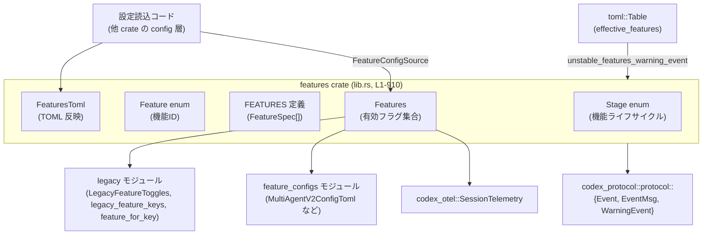
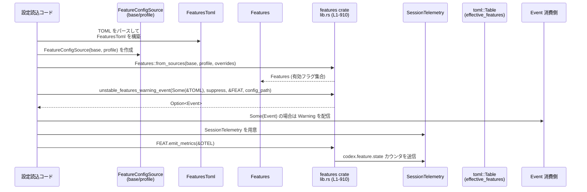

# features/src/lib.rs

## 0. ざっくり一言

Codex の「機能フラグ（feature flags）」を一元管理し、設定ファイル（TOML 相当）などの入力から最終的な有効機能セットを決定するためのレジストリ兼ロジックを提供するモジュールです（`features/src/lib.rs:L1-910` 全体）。

> 注: この回答では元ファイルの実際の行番号情報がないため、位置の根拠としては「`features/src/lib.rs:L1-910`（このチャンク全体）」を一律で示します。

---

## 1. このモジュールの役割

### 1.1 概要

- このモジュールは **「すべての機能フラグを一元的に定義・管理し、設定に基づいて有効な機能セットを決定する」** ために存在します。
- 機能のライフサイクル（開発中・実験的・安定・非推奨・削除済み）を `Stage` で分類します。
- `Features` 構造体が「有効な機能の集合」と「レガシーキーの利用状況メタデータ」を保持し、TOML などの設定からこれを構築します。
- Telemetry（計測）および Warning イベントの発行もここから行われます。

### 1.2 アーキテクチャ内での位置づけ

主な依存関係と役割の関係は次のとおりです。



- 設定読込層が `FeaturesToml` や `FeatureConfigSource` を組み立て、`Features::from_sources` に渡します。
- `Features` は `legacy` モジュール経由で古いキーやフラグ形式を解釈します。
- 有効になっている機能情報は Telemetry に送られます（`emit_metrics`）。
- `unstable_features_warning_event` 関数により、「開発中機能が有効になっている」という Warning を `codex_protocol::Event` として生成します。

### 1.3 設計上のポイント

コードから読み取れる設計上の特徴は次の通りです（`features/src/lib.rs:L1-910`）。

- **明示的なレジストリ**  
  `Feature` enum と `FeatureSpec` 配列 (`FEATURES`) によって、すべての機能フラグが **コンパイル時に列挙** されています。  
  `Feature::info()` は `FEATURES` から自分に対応する `FeatureSpec` を検索し、見つからない場合は `unreachable!` でパニックになります（内部不変条件の前提）。

- **ステージ管理**  
  ライフサイクル（`Stage::UnderDevelopment`, `Stage::Experimental`, `Stage::Stable`, `Stage::Deprecated`, `Stage::Removed`）を明示し、メニュー表記やアナウンス文など UI 向けメタデータも持ちます。

- **設定 → 有効フラグ の変換ロジックの分離**
  - `FeaturesToml` / `FeatureToml<T>` / `FeatureConfig` トレイトが「設定ファイルとしての表現」を担当します。
  - `Features` が「実際に有効になっている機能集合」を担当します。

- **レガシー互換性**  
  `legacy_usage_notice`, `LegacyFeatureUsage`, `legacy::feature_for_key`, `legacy_feature_keys` で、古いキー名・古いフラグ方式の利用を検出し、ユーザー向けの警告文を組み立てます。

- **順序決定性**  
  有効な機能やレガシー使用状況は `BTreeSet` / `BTreeMap` で管理され、列挙順が安定します（ログやテレメトリの安定化に寄与）。

- **エラーハンドリング・安全性**
  - 外部入力（設定キー）が未知の場合には `tracing::warn!` でログに記録しつつ無視します。
  - `Feature::info` など内部不変条件違反の場合のみ `unreachable!` によるパニックが発生しうる設計です。
  - `unsafe` コードは存在せず、すべて安全な Rust で実装されています。
  - 並行性プリミティブ（`Mutex` など）は使っておらず、`Features` は通常の `Send + Sync` な値として扱われますが、並行アクセス時の排他制御は呼び出し側の責任範囲です。

---

## 2. 主要な機能一覧

このモジュール（crate）が提供する主な機能は次の通りです（`features/src/lib.rs:L1-910`）。

- **機能レジストリ**
  - `Feature` enum と `FeatureSpec` / `FEATURES` による「すべての機能フラグの定義」とメタデータ管理。
  - ライフサイクル `Stage` と UI 用メタ情報（メニュー名・説明・アナウンス文）の提供。

- **有効機能セットの構築**
  - `Features::with_defaults` によるデフォルト有効フラグセットの生成。
  - `Features::from_sources` による base/profile 設定＋オーバーライドからの統合。
  - `normalize_dependencies` によるフラグ間依存関係の正規化。

- **設定（TOML）との変換**
  - `FeaturesToml`, `FeatureToml<T>`, `FeatureConfig` による `[features]` テーブルとのマッピング。
  - `Features::apply_map` / `Features::apply_toml` による `BTreeMap<String, bool>` から `Features` への変換。
  - `feature_for_key`, `canonical_feature_for_key`, `is_known_feature_key` によるキー名から `Feature` への解決。

- **レガシーキーおよび互換性の管理**
  - `LegacyFeatureUsage` と `Features::record_legacy_usage*` による「古いキーの使用履歴」の記録。
  - `legacy_usage_notice` / `web_search_details` によるユーザ向けの説明文生成。
  - `legacy::LegacyFeatureToggles` / `legacy::feature_for_key` の利用による旧形式サポート。

- **テレメトリと警告イベント**
  - `Features::emit_metrics` による、デフォルトから変更された機能フラグの Telemetry 送信。
  - `unstable_features_warning_event` による「開発中機能が有効」の Warning `Event` 生成。

---

## 3. 公開 API と詳細解説

### 3.1 型一覧（構造体・列挙体など）

定義されている主な型と役割です（位置はすべて `features/src/lib.rs:L1-910`）。

| 名前 | 種別 | 役割 / 用途 |
|------|------|-------------|
| `Stage` | enum | 機能フラグのライフサイクル（開発中・実験的・安定・非推奨・削除済み）を表します。UI での表示用メタ情報取得メソッドも持ちます。 |
| `Feature` | enum | 個々の機能フラグの識別子。ツールやモード、有効化オプションなど多数のバリアントが定義されています。 |
| `LegacyFeatureUsage` | struct | レガシーなキー名で機能が指定された際の使用記録（エイリアス名・対応する `Feature`・メッセージ）を保持します。`BTreeSet` で集合管理されます。 |
| `Features` | struct | 有効な `Feature` の集合と、その構築過程で検出したレガシーキー利用情報を保持する中心的な型です。 |
| `FeatureOverrides` | struct | コマンドライン等からの追加オーバーライドを表す「上書き設定」。例: `include_apply_patch_tool`, `web_search_request`。 |
| `FeatureConfigSource<'a>` | struct | base/profile など、1 つの設定ソースからの feature 関連設定をまとめたもの。`FeaturesToml` への参照や legacy 用フラグを含みます。 |
| `FeaturesToml` | struct | `[features]` テーブルに対応する設定表現。`multi_agent_v2` のような構造体付き設定と、その他のブーリアンエントリを持ちます。 |
| `FeatureToml<T>` | enum | 特定の feature 用に「単純な bool」と「詳細設定構造体」のどちらかを受け取るための enum（`#[serde(untagged)]`）。 |
| `FeatureConfig` | trait | `FeatureToml<T>` で使う「設定構造体側が実装するべきインターフェース」。`enabled()` で有効/無効の明示的指定を返します。 |
| `FeatureSpec` | struct | 1 つの `Feature` に対応するメタデータ（キー文字列、`Stage`, デフォルト有効状態）を保持します。 |
| `FEATURES` | `&'static [FeatureSpec]` | すべての `FeatureSpec` をまとめた静的配列。`Feature::info` やキー解決ロジックの基礎データです。 |

外部から直接使われることが多いのは `Feature`, `Features`, `FeaturesToml`, `FeatureOverrides`, `FeatureConfigSource`, `FEATURES` です。

### 3.2 重要な関数・メソッド詳細（抜粋）

ここでは特に重要と思われる 7 個の関数/メソッドについて詳しく説明します（すべて `features/src/lib.rs:L1-910` 内に定義）。

---

#### `Features::with_defaults() -> Features`

**概要**

- `FEATURES` レジストリに基づき、`default_enabled == true` の機能だけを有効にした `Features` を生成します。
- すべての構築フローの起点となる「デフォルト状態」を提供します。

**引数**

- なし（関連関数）

**戻り値**

- `Features`: デフォルトで有効な機能のみ `enabled` セットに含まれ、`legacy_usages` は空のインスタンス。

**内部処理の流れ**

1. 空の `BTreeSet<Feature>` を作成します。
2. 静的配列 `FEATURES` をループし、`spec.default_enabled` が `true` の `spec.id` を `set` に挿入します。
3. `Features { enabled: set, legacy_usages: BTreeSet::new() }` を返します。

**Examples（使用例）**

```rust
use features::Features; // crate 名は実際のパスに合わせてください

fn main() {
    // デフォルト設定から機能セットを構築する
    let features = Features::with_defaults();          // default_enabled=true の機能だけ有効

    // 例: apps がデフォルトで有効か確認
    if features.enabled(features::Feature::Apps) {     // Feature::Apps が enabled に含まれているかを確認
        println!("Apps feature is enabled by default");
    }
}
```

**Errors / Panics**

- この関数自体は `Result` を返さず、パニックの可能性もありません。
- 内部で利用する `FEATURES` は静的データであり、通常の利用ではエラー要素はありません。

**Edge cases（エッジケース）**

- `FEATURES` が空配列であっても正しく動作し、`enabled` が空の `Features` が返ります。
- 特定のプラットフォーム依存の条件（`cfg!(windows)` など）で `default_enabled` が変化しても、それに従って集合が構築されます。

**使用上の注意点**

- この関数は「デフォルト」状態のみを生成します。設定ファイルやオーバーライドを反映させるには `from_sources` を合わせて利用します。
- 直接 `Features` を `Default::default()` で作ると **何も有効になっていない** 状態になる点に注意が必要です（`with_defaults` はあくまで「レジストリのデフォルト」で初期化します）。

---

#### `Features::from_sources(base: FeatureConfigSource<'_>, profile: FeatureConfigSource<'_>, overrides: FeatureOverrides) -> Features`

**概要**

- base（グローバル）設定、profile（プロファイル）設定、および `FeatureOverrides` をすべて適用し、依存関係も正規化した最終的な `Features` を構築します。
- 実際のアプリケーションでは、機能フラグを決定する中心的な入口になります。

**引数**

| 引数名 | 型 | 説明 |
|--------|----|------|
| `base` | `FeatureConfigSource<'_>` | グローバルな設定ソース（例: デフォルトプロファイル）。旧形式フラグや `[features]` を含みます。 |
| `profile` | `FeatureConfigSource<'_>` | プロファイルごとの設定ソース。base を上書き・追加する形で適用されます。 |
| `overrides` | `FeatureOverrides` | コマンドライン引数などの最終オーバーライド（最も後で適用されます）。 |

**戻り値**

- `Features`: 適用順に従ってすべてのソースを反映し、依存関係が正規化された有効機能セット。

**内部処理の流れ**

1. `Features::with_defaults()` でデフォルト状態から開始します。
2. `for source in [base, profile]` で順に:
   - `LegacyFeatureToggles` を構築し、`LegacyFeatureToggles::apply(&mut features)` を呼びます。
   - `source.features` がある場合には `features.apply_toml(feature_entries)` を呼び、`FeaturesToml` を介して `[features]` テーブルを適用します。
3. 最後に `overrides.apply(&mut features)` を呼び、明示的オーバーライドを適用します。
4. `features.normalize_dependencies()` を実行し、フラグ間の依存関係を補正します（例: `SpawnCsv` → `Collab` を自動有効化）。
5. 最終的な `features` を返します。

**Examples（使用例）**

```rust
use std::collections::BTreeMap;
use features::{
    Features, FeaturesToml, FeatureConfigSource, FeatureOverrides, Feature,
};

fn build_features() -> Features {
    // base の TOML 設定を模したもの
    let mut base_map = BTreeMap::new();
    base_map.insert("apps".to_string(), true);          // [features].apps = true
    let base_toml = FeaturesToml::from(base_map);       // BTreeMap から FeaturesToml に変換

    // profile の TOML 設定（ここでは空の例）
    let profile_toml = FeaturesToml::default();

    let base_src = FeatureConfigSource {
        features: Some(&base_toml),                     // base 設定を参照として渡す
        include_apply_patch_tool: None,
        experimental_use_freeform_apply_patch: None,
        experimental_use_unified_exec_tool: None,
    };

    let profile_src = FeatureConfigSource {
        features: Some(&profile_toml),                  // profile 設定
        ..Default::default()
    };

    let overrides = FeatureOverrides {
        include_apply_patch_tool: Some(true),           // コマンドライン等からのオーバーライド例
        web_search_request: None,
    };

    let features = Features::from_sources(base_src, profile_src, overrides);

    // 例: Apps が有効で、apply_patch_tool 関連の legacy トグルが適用されている
    assert!(features.enabled(Feature::Apps));
    features
}
```

**Errors / Panics**

- この関数自身は `Result` を返さず、通常はパニックしません。
- ただし内部で `Feature::info()` → `unreachable!` に到達する可能性はありますが、それは `FEATURES` と `Feature` enum が一致していない場合のみで、通常は開発時に検出されるべき内部不変条件です。

**Edge cases（エッジケース）**

- `base` / `profile` のどちらか、または両方の `features` が `None` の場合でも動作し、legacy トグルと overrides のみが適用されます。
- `profile` 側で base と同じキーが指定された場合、最後に適用された値が有効になります（上書き）。
- `overrides` は最後に適用されるため、設定ファイルの値よりも優先されます。

**使用上の注意点**

- base / profile の適用順は固定で `[base, profile]` です。プロファイルを複数段階で適用したい場合は、呼び出し側で事前にマージしてから渡す必要があります。
- この関数を通さずに `Features` を直接操作すると、`normalize_dependencies` が呼ばれないため、依存関係の不整合が発生する可能性があります。

---

#### `Features::apply_map(&mut self, m: &BTreeMap<String, bool>)`

**概要**

- `BTreeMap<String, bool>` 形式のトグルマップ（通常は `[features]` の生パース結果に相当）を現在の `Features` に適用します。
- レガシーキーの記録や未知キーの警告ログ出力もここで行われます。

**引数**

| 引数名 | 型 | 説明 |
|--------|----|------|
| `m` | `&BTreeMap<String, bool>` | `キー -> 有効/無効` のトグルマップ。キーは canonical でも legacy でも構いません。 |

**戻り値**

- なし（`&mut self` をインプレースで変更します）。

**内部処理の流れ**

1. `for (k, v) in m` ですべてのエントリを走査します。
2. 特定のレガシーキー名に対して特別処理を行います。
   - `"web_search_request"` / `"web_search_cached"`: `record_legacy_usage_force` で特定のラベル名を記録。
   - `"tui_app_server"`: 完全に無視して `continue`（削除済み互換フラグ）。
3. `feature_for_key(k)` でキー文字列から `Feature` を解決します。
   - `Some(feat)` の場合:
     - `Feature::TuiAppServer` はここでもスキップして `continue`。
     - キー文字列 `k` が canonical な `feat.key()` と異なる場合は `record_legacy_usage` でレガシー使用を記録。
     - `*v` が `true` なら `enable(feat)`, `false` なら `disable(feat)`。
   - `None` の場合:
     - `tracing::warn!("unknown feature key in config: {k}")` で警告ログを出し、キーは無視されます。

**Examples（使用例）**

```rust
use std::collections::BTreeMap;
use features::{Features, Feature};

fn apply_simple_map() {
    let mut features = Features::with_defaults();  // デフォルトから開始

    let mut map = BTreeMap::new();
    map.insert("apps".to_string(), false);        // apps を無効化
    map.insert("web_search_request".to_string(), true);

    features.apply_map(&map);                     // マップを適用

    assert!(!features.enabled(Feature::Apps));    // apps が無効になっている
}
```

**Errors / Panics**

- 未知のキーがあってもパニックにはなりません。`tracing::warn!` によるログ出力のみです。
- `feature_for_key` が `Some(feat)` を返した時点で、`Feature` と `FEATURES` が矛盾していると、さらに別の場所で `unreachable!` に達する可能性はありますが、通常は発生しません。

**Edge cases（エッジケース）**

- `"tui_app_server"` キーは完全に無視されるため、設定しても実際の動作には影響しません。
- `"web_search_request"` / `"web_search_cached"` を指定すると、レガシー使用として記録されますが、実際の有効化/無効化は `feature_for_key` および legacy モジュールによる解決結果に依存します。
- 同一キーが複数回マップに入っている場合は、`BTreeMap` の性質上、最後の値だけが有効です。

**使用上の注意点**

- 直接 `apply_map` を呼ぶ場合、事前に `Features::with_defaults` などで初期状態を作っておく必要があります。
- レガシーキー名を使うと `LegacyFeatureUsage` で記録されます。ユーザ通知やログに活用する場合は `legacy_feature_usages()` をあわせて利用します。

---

#### `feature_for_key(key: &str) -> Option<Feature>`

**概要**

- 文字列キーから対応する `Feature` を解決します。
- canonical キー（`FEATURES` の `key`）に加え、`legacy` モジュールで定義されたレガシーエイリアスにも対応します。

**引数**

| 引数名 | 型 | 説明 |
|--------|----|------|
| `key` | `&str` | `"[features].apps"` のようなプレフィックスなしのキー名（例: `"apps"`, `"multi_agent"` など）。 |

**戻り値**

- `Some(Feature)`：認識されたキーに対応する `Feature`。
- `None`：canonical/legacy のいずれにも該当しない未知キー。

**内部処理の流れ**

1. `for spec in FEATURES` で `FEATURES` を走査し、`spec.key == key` なら `Some(spec.id)` を返します。
2. 見つからない場合は、`legacy::feature_for_key(key)` を呼び、その結果を返します。

**Examples（使用例）**

```rust
use features::{feature_for_key, Feature};

fn main() {
    // canonical キーから Feature を取得
    assert_eq!(feature_for_key("apps"), Some(Feature::Apps));

    // 未知キーは None
    assert!(feature_for_key("nonexistent_feature").is_none());
}
```

**Errors / Panics**

- パニックは発生しません。
- 戻り値が `None` の場合は呼び出し側で適切に処理する必要があります（例: 設定の検証やログ出力）。

**Edge cases（エッジケース）**

- 大文字/小文字は区別されます（`spec.key == key` で単純比較）。
- `legacy::feature_for_key` の中身はこのチャンクには現れないため、どのようなエイリアスが定義されているかはここからは分かりません。

**使用上の注意点**

- 設定ファイルのバリデーションなどで「知られているキーかどうか」を判断したい場合には、`is_known_feature_key` を使うと `Option` ではなく `bool` で扱えます。

---

#### `Features::emit_metrics(&self, otel: &SessionTelemetry)`

**概要**

- デフォルト状態から変化した機能フラグについて、Telemetry カウンタ `codex.feature.state` を送信します。
- どの機能が非デフォルト状態であるかを観測するための集計用機能です。

**引数**

| 引数名 | 型 | 説明 |
|--------|----|------|
| `otel` | `&SessionTelemetry` | Telemetry 送信用のオブジェクト（外部 crate `codex_otel` で定義）。 |

**戻り値**

- なし。

**内部処理の流れ**

1. `for feature in FEATURES` ですべての `FeatureSpec` を走査します。
2. `Stage::Removed` のものはスキップします（削除済みフラグは計測対象外）。
3. `self.enabled(feature.id) != feature.default_enabled` の場合のみ:
   - `otel.counter("codex.feature.state", 1, &[("feature", feature.key), ("value", &self.enabled(feature.id).to_string())]);` を呼び、1 インクリメントします。

**Examples（使用例）**

```rust
use features::Features;
use codex_otel::SessionTelemetry;

fn record_metrics(features: &Features, otel: &SessionTelemetry) {
    // デフォルトから変更されたフラグのみをカウントする
    features.emit_metrics(otel);
}
```

**Errors / Panics**

- この関数自体はパニックしません。
- `SessionTelemetry::counter` の実装によるエラーやパニックの可能性は、このチャンクには現れないため不明です。

**Edge cases（エッジケース）**

- すべての機能がデフォルト状態と一致している場合、何もカウンタが送信されません。
- 同じセッション内で何度も呼ぶと、そのたびに同じフラグがインクリメントされ続けるため、呼び出しタイミングは設計上の前提（例: セッション開始時のみ）に依存します。

**使用上の注意点**

- 高頻度で呼び出すと Telemetry の負荷が増える可能性があります。典型的にはセッション開始時や設定読み込み直後など、限られたタイミングで呼ぶことが想定されます。

---

#### `FeaturesToml::entries(&self) -> BTreeMap<String, bool>`

**概要**

- `FeaturesToml` 内のブーリアンエントリと、構造体付きの `multi_agent_v2` 設定を 1 つの `BTreeMap<String, bool>` に統合して返します。
- `Features::apply_toml` から利用され、TOML 表現を汎用的なマップ形式に変換する役割を持ちます。

**引数**

- なし（メソッド）

**戻り値**

- `BTreeMap<String, bool>`：キーは canonical な feature キー文字列（例: `"multi_agent_v2"`）、値は有効/無効を表す bool。

**内部処理の流れ**

1. `let mut entries = self.entries.clone();` で内部の `entries` マップをコピーします。
2. `self.multi_agent_v2.as_ref().and_then(FeatureToml::enabled)` で `multi_agent_v2` の有効状態（`Option<bool>`）を取得します。
3. `Some(enabled)` の場合:
   - `entries.insert(Feature::MultiAgentV2.key().to_string(), enabled);` で canonical キー名を用いて追加/上書きします。
4. 最終的な `entries` を返します。

**Examples（使用例）**

```rust
use features::{FeaturesToml, FeatureToml, MultiAgentV2ConfigToml};
use std::collections::BTreeMap;

fn inspect_entries(toml_cfg: &FeaturesToml) {
    let map: BTreeMap<String, bool> = toml_cfg.entries();   // ブーリアンマップに展開
    for (key, enabled) in map {
        println!("feature {key}: {enabled}");
    }
}
```

（`MultiAgentV2ConfigToml` の実装はこのチャンクには現れません。）

**Errors / Panics**

- パニックは発生しません。

**Edge cases（エッジケース）**

- `multi_agent_v2` が `None` の場合、`entries` には何も追加されません。
- `multi_agent_v2` が `FeatureToml::Config` で、有効/無効を返さない（`enabled() -> None`）実装の場合も、追加されません。
- 内部 `entries` に既に `"multi_agent_v2"` キーがある場合、`insert` で上書きされます。

**使用上の注意点**

- `entries()` は内部マップのコピーを返すため、呼び出しコストは `entries` のサイズに比例します。極端に大きな設定マップを頻繁に変換する場合は注意が必要です（通常の feature フラグ数では問題になりにくい規模です）。

---

#### `FeatureToml<T>::enabled(&self) -> Option<bool>`

**概要**

- `FeatureToml<T>` が「単純な bool 指定」か「構造体による詳細設定」かに応じて、有効状態を `Option<bool>` として返します。
- 詳細設定構造体（`T: FeatureConfig`）の場合は、構造体に委譲して有効/無効を判断します。

**引数**

- なし（メソッド）

**戻り値**

- `Some(bool)`：明示的に有効/無効が指定されている場合。
- `None`：構造体側が有効/無効を指定しておらず、デフォルトに従うべき場合。

**内部処理の流れ**

1. `match self` で enum バリアントを判定。
2. `Self::Enabled(enabled)` の場合、`Some(*enabled)` を返します。
3. `Self::Config(config)` の場合、`config.enabled()` を呼び、その結果を返します。

**Examples（使用例）**

```rust
use features::{FeatureToml, FeatureConfig};

// ダミーの設定構造体
#[derive(Clone)]
struct MyFeatureConfig {
    pub enabled_flag: Option<bool>,
}

impl FeatureConfig for MyFeatureConfig {
    fn enabled(&self) -> Option<bool> {
        self.enabled_flag
    }
}

fn example() {
    let simple = FeatureToml::Enabled(true);            // 単純な bool 指定
    assert_eq!(simple.enabled(), Some(true));

    let cfg = MyFeatureConfig { enabled_flag: None };   // 有効/無効を指定しない構造体
    let complex = FeatureToml::Config(cfg);
    assert_eq!(complex.enabled(), None);                // None が返る
}
```

**Errors / Panics**

- パニックは発生しません。

**Edge cases（エッジケース）**

- `Config(config)` かつ `config.enabled()` が常に `None` を返す実装の場合、この feature の有効/無効は完全に別のロジックに委ねられます。

**使用上の注意点**

- `FeatureConfig` 実装側で `enabled()` の意味を適切に定義する必要があります。明示的指定がない場合に `None` を返すことで、上位ロジックに「デフォルトに従う」判断を委ねられます。

---

#### `unstable_features_warning_event(effective_features: Option<&Table>, suppress_unstable_features_warning: bool, features: &Features, config_path: &str) -> Option<Event>`

**概要**

- 有効化された `[features]` テーブルの中に `Stage::UnderDevelopment` （開発中）な機能が含まれている場合に、警告用の `Event` を構築します。
- 設定ファイルのパスもメッセージに含め、ユーザーに `suppress_unstable_features_warning` の設定方法を案内します。

**引数**

| 引数名 | 型 | 説明 |
|--------|----|------|
| `effective_features` | `Option<&toml::Table>` | 実際に有効になっている `[features]` テーブル相当の TOML テーブル。`key -> Value`。 |
| `suppress_unstable_features_warning` | `bool` | `true` の場合は警告生成を完全に抑制します。 |
| `features` | `&Features` | 現在有効な機能セット。`effective_features` だけではなく、実際に enabled なものだけを対象にするために使用します。 |
| `config_path` | `&str` | 設定ファイルのパス。メッセージ文中に埋め込まれます。 |

**戻り値**

- `Some(Event)`：開発中機能が有効であり、かつ警告が抑制されていない場合。
- `None`：警告不要または抑制されている場合。

**内部処理の流れ**

1. `suppress_unstable_features_warning` が `true` ならすぐに `None` を返します。
2. `under_development_feature_keys` という `Vec<String>` を用意します。
3. `effective_features` が `Some(table)` の場合、テーブルを反復します:
   - `value.as_bool() == Some(true)` のときだけ処理（`true` 以外の値や `false` はスキップ）。
   - `FEATURES` から `spec.key == key` な `FeatureSpec` を探し、見つからなければスキップ。
   - `features.enabled(spec.id)` が `true` でなければスキップ（TOML 上 true でも、最終的に無効化されていれば対象外）。
   - `spec.stage` が `Stage::UnderDevelopment` の場合のみ、`under_development_feature_keys.push(spec.key.to_string())`。
4. `under_development_feature_keys` が空なら `None` を返します。
5. `join(", ")` でキー一覧を文字列にまとめ、警告メッセージ文字列を組み立てます。
6. `Event { id: String::new(), msg: EventMsg::Warning(WarningEvent { message }) }` を構築し、`Some(event)` を返します。

**Examples（使用例）**

```rust
use features::{Features, unstable_features_warning_event};
use toml::Table;

fn maybe_warn(features: &Features, config_path: &str, effective: &Table) {
    let event_opt = unstable_features_warning_event(
        Some(effective),
        false,                // 警告を抑制しない
        features,
        config_path,
    );

    if let Some(event) = event_opt {
        // codex_protocol::protocol::Event をロギングや UI に渡す
        println!("Warning event: {:?}", event.msg);
    }
}
```

**Errors / Panics**

- パニックは発生しません。
- `effective_features` の `Value` が bool でない場合は `as_bool() != Some(true)` となり自動的にスキップされます。

**Edge cases（エッジケース）**

- `effective_features` が `None` の場合、開発中機能が有効かどうかを判定する材料がないため、常に `None`（警告なし）になります。
- `effective_features` に `true` が設定されていても、`features.enabled(spec.id)` が `false` の場合は警告対象になりません。つまり、**最終的に有効なものだけ** が警告されます。
- 複数の開発中機能が有効な場合は、カンマ区切りで列挙されます。

**使用上の注意点**

- `suppress_unstable_features_warning` を設定ファイル側で制御することで、ユーザーが警告の有無を選べる設計になっています。
- 警告メッセージには `config_path` を含めており、ユーザーがどの設定ファイルを編集すればよいか分かるようになっています。

---

### 3.3 その他の関数・メソッド一覧

ここでは補助的な関数・単純なラッパーをまとめます（いずれも `features/src/lib.rs:L1-910`）。

| 関数 / メソッド名 | 所属 | 役割（1 行） |
|-------------------|------|--------------|
| `Stage::experimental_menu_name` | `Stage` | `Stage::Experimental` の場合にメニュー表示名を返し、それ以外は `None` を返します。 |
| `Stage::experimental_menu_description` | `Stage` | `Stage::Experimental` の説明文を返し、それ以外は `None`。 |
| `Stage::experimental_announcement` | `Stage` | `Stage::Experimental` のアナウンス文（空文字列なら `None`）を返します。 |
| `Feature::key` | `Feature` | `FeatureSpec` 経由で canonical なキー文字列（例: `"apps"`）を取得します。 |
| `Feature::stage` | `Feature` | 現在の `Stage` を `FeatureSpec` から取得します。 |
| `Feature::default_enabled` | `Feature` | `FeatureSpec` の `default_enabled` を返します。 |
| `Features::enabled` | `Features` | 指定された `Feature` が現在有効かどうかを返します。 |
| `Features::apps_enabled_for_auth` | `Features` | `Feature::Apps` が有効かつ `has_chatgpt_auth == true` のとき `true` を返します。 |
| `Features::use_legacy_landlock` | `Features` | `Feature::UseLegacyLandlock` が有効かどうかを返します。 |
| `Features::enable` | `Features` | 指定 `Feature` を `enabled` セットに追加します（チェーン可能）。 |
| `Features::disable` | `Features` | 指定 `Feature` を `enabled` セットから削除します（チェーン可能）。 |
| `Features::set_enabled` | `Features` | bool に応じて `enable`/`disable` のどちらかを呼びます。 |
| `Features::record_legacy_usage_force` | `Features` | レガシーキー使用を、キー名に関わらず強制的に `legacy_usages` に追加します。 |
| `Features::record_legacy_usage` | `Features` | canonical キー名と同じ場合は無視し、それ以外を `record_legacy_usage_force` に委譲します。 |
| `Features::legacy_feature_usages` | `Features` | `legacy_usages` をイテレータとして返します。 |
| `Features::enabled_features` | `Features` | 現在有効な全 `Feature` を `Vec<Feature>` として返します。 |
| `Features::normalize_dependencies` | `Features` | `SpawnCsv` → `Collab`、`CodeModeOnly` → `CodeMode`、`JsReplToolsOnly` 依存チェックなどの依存関係を正規化します。 |
| `Features::apply_toml` | `Features` | `FeaturesToml` から `entries()` を取り出して `apply_map` を呼ぶ薄いラッパーです。 |
| `FeatureOverrides::apply` | `FeatureOverrides` | `LegacyFeatureToggles` と `web_search_request` オーバーライドを適用します。 |
| `legacy_usage_notice` | free | レガシーキー使用時の summary / details メッセージを生成します。 |
| `web_search_details` | free | web search 関連の詳細説明文（静的文字列）を返します。 |
| `canonical_feature_for_key` | free | canonical キーのみを対象に `Feature` を解決します（legacy エイリアスは無視）。 |
| `is_known_feature_key` | free | `feature_for_key(key).is_some()` を返すユーティリティです。 |

---

## 4. データフロー

ここでは、典型的な「設定ファイルを読み込んで機能フラグを決定し、警告イベントとメトリクスを出す」フローを示します（`features/src/lib.rs:L1-910` 全体にまたがる処理）。

### 処理の要点

1. 設定読込層が base/profile の `[features]` テーブルをパースし、`FeaturesToml` と `FeatureConfigSource` を組み立てます。
2. `Features::from_sources` を呼び、レガシー設定やオーバーライドを含めた最終的な `Features` を構築します。
3. `unstable_features_warning_event` に `effective_features` を渡し、開発中機能の警告が必要か判定します。
4. セッション開始時などに `Features::emit_metrics` を呼び、デフォルトから変更された機能状態を Telemetry に送ります。



---

## 5. 使い方（How to Use）

### 5.1 基本的な使用方法

代表的なフローは「デフォルト + 設定ファイル + オーバーライド → Features → 確認・警告・メトリクス」という形になります。

```rust
use std::collections::BTreeMap;
use features::{
    Features, FeaturesToml, FeatureConfigSource, FeatureOverrides, Feature,
    unstable_features_warning_event,
};
use codex_otel::SessionTelemetry;
use toml::Table; // 実際には toml::from_str で Table を取得するなど

fn main() {
    // 1. TOML から FeaturesToml を構築したと仮定した例 ---------------------
    let mut map = BTreeMap::new();                         // [features] テーブル相当のマップ
    map.insert("apps".to_string(), true);                  // apps を有効化
    let features_toml = FeaturesToml::from(map);           // BTreeMap から FeaturesToml へ

    let base_src = FeatureConfigSource {
        features: Some(&features_toml),                    // base に features_toml を指定
        ..Default::default()
    };

    let profile_src = FeatureConfigSource::default();      // profile は空

    // コマンドラインなどからのオーバーライド
    let overrides = FeatureOverrides {
        include_apply_patch_tool: Some(true),              // legacy トグルの一例
        web_search_request: None,
    };

    // 2. 最終的な Features を構築 ------------------------------------------
    let features = Features::from_sources(base_src, profile_src, overrides);

    // 3. 機能フラグを参照して処理分岐 --------------------------------------
    if features.apps_enabled_for_auth(true) {              // ChatGPT 認証済みかつ Apps 有効なら
        println!("Apps functionality is available");
    }

    // 4. 開発中機能の警告イベントを生成 ------------------------------------
    let effective_features: Table = Table::new();          // 実際には config 合成結果を渡す
    if let Some(event) = unstable_features_warning_event(
        Some(&effective_features),
        false,                                             // suppress_unstable_features_warning == false
        &features,
        "config.toml",
    ) {
        println!("Warning: {:?}", event.msg);              // codex_protocol::Event を処理
    }

    // 5. メトリクス送信 ---------------------------------------------------
    let otel = SessionTelemetry::new();                    // 仮のコンストラクタ（実装は別 crate）
    features.emit_metrics(&otel);                          // 非デフォルトなフラグのみカウント
}
```

### 5.2 よくある使用パターン

1. **単純なブールフラグだけを使う設定**

   - `[features]` 内に `apps = true` のようなブール値のみを記述し、`FeaturesToml` の `entries` / `apply_toml` を経由して `Features` を構築します。
   - `FeatureToml<T>` や `FeatureConfig` を使わないシンプルなケースです。

2. **詳細設定を持つ feature（`multi_agent_v2` など）**

   - `[features.multi_agent_v2]` のように、専用の設定構造体で高度な設定を行いたい場合、`MultiAgentV2ConfigToml: FeatureConfig` が使われます。
   - `FeatureToml<MultiAgentV2ConfigToml>` を通じて、有効/無効だけでなく詳細なパラメータも渡されます。
   - 有効/無効だけを単純に指定したい場合は `multi_agent_v2 = true/false` のように `FeatureToml::Enabled` を使うこともできます。

3. **レガシーキーとの互換運用**

   - 古い設定ファイルで `web_search_request` や `web_search` を指定している場合でも、`apply_map` や `legacy::feature_for_key` を通じて適切な `Feature` にマッピングされます。
   - その際には `LegacyFeatureUsage` に情報が記録されるため、アプリケーション側で「あなたの設定は古い形式です」といった警告を UI に表示できます。

### 5.3 よくある間違い

```rust
use features::{Features, Feature};

// 間違い例: Features::default() を使ってしまう
fn wrong() {
    let mut features = Features::default();        // enabled が空の状態で開始してしまう

    // 設定ファイルの一部だけを手で enable する
    features.enable(Feature::Apps);
    // これでは他の default_enabled な機能が有効になっていない可能性がある
}

// 正しい例: with_defaults + from_sources を通す
fn correct() {
    // より安全: レジストリのデフォルトを起点にすべての設定ソースを適用
    let features = Features::from_sources(
        Default::default(),                        // base
        Default::default(),                        // profile
        Default::default(),                        // overrides
    );

    // 必要なら追加で enable/disable する
    let mut features = features;
    features.set_enabled(Feature::Apps, true);
}
```

**ポイント**

- `Default::default()` で作られた `Features` は、**デフォルト有効フラグがまったく反映されていない** 初期状態です。
- 多くの場合は `with_defaults` または `from_sources` を起点にする方が意図に近い挙動になります。

### 5.4 使用上の注意点（まとめ）

- **前提条件**
  - `Feature` enum と `FEATURES` 配列は 1 対 1 で対応していることが前提です。これが崩れると `Feature::info` 内の `unreachable!` に到達する可能性があります。
  - `Features::from_sources` を通して構築する場合、`normalize_dependencies` が自動で呼ばれるため、依存関係の整合性が保たれます。

- **エラーハンドリング**
  - 設定ファイル中の未知キーは `tracing::warn!` で警告ログが出るだけで、動作には影響しません。
  - レガシーキーは `LegacyFeatureUsage` に記録されるため、必要に応じてユーザーに案内できます。

- **並行性**
  - このモジュール内では非同期処理や並行性プリミティブ（`Mutex` など）は使用されていません。
  - `Features` は通常の値オブジェクトとして扱われるため、複数スレッドから読み取る場合はイミュータブル参照を共有するか、必要に応じて呼び出し側で同期化する設計になります。

- **パフォーマンス**
  - `FEATURES` のサイズは限られており、`BTreeMap` / `BTreeSet` を使った操作はオーダー的には `O(n log n)` ですが、n が小さいため実用上は軽量です。
  - `emit_metrics` や `apply_map` などのループ処理も、feature 数が多くない限り問題になりにくい設計です。

- **セキュリティ観点**
  - このファイル内で外部コマンドの実行やファイルアクセス等は一切行っておらず、扱うのは設定値とメタデータのみです。
  - 設定由来の文字列を用いて `tracing::warn!` や `Event` メッセージを生成していますが、そのままログや UI に表示される場合は、別レイヤーでのサニタイズ・エスケープ方針に従う必要があります。

---

## 6. 変更の仕方（How to Modify）

### 6.1 新しい機能フラグを追加する場合

このモジュールから読み取れる「追加時の入口」は次の通りです。

1. **`Feature` enum へのバリアント追加**  
   - 新しい機能名を `Feature` enum に追加します（`features/src/lib.rs:L1-910`）。

2. **`FEATURES` 配列への `FeatureSpec` 追加**  
   - `FEATURES` に新しい `FeatureSpec` を追加し、`id` に先ほどの `Feature` バリアント、`key` に canonical なキー文字列、`stage` と `default_enabled` を設定します。
   - ここでの `key` が `[features]` テーブル内の canonical 名として使われます。

3. **必要に応じて `FeatureToml<T>` / `FeatureConfig` を利用**  
   - 単純な bool だけでなく詳細設定が必要な場合は、`feature_configs` モジュール側で `T: FeatureConfig` な設定構造体を定義し、`FeaturesToml` にフィールドを追加します。

4. **legacy キーが必要な場合**  
   - 古い形式のキーとの互換性を保ちたい場合は、`legacy` モジュール内にマッピングを追加し、`legacy_feature_keys` も更新します（このチャンクには定義が現れないため詳細は不明です）。

5. **テスト追加**  
   - `#[cfg(test)] mod tests;` が存在するため、同ディレクトリのテストモジュールで新機能フラグに対する振る舞いを追加することが想定されます（テスト内容自体はこのチャンクには現れません）。

### 6.2 既存の機能を変更する場合

- **主な影響箇所**

  - `Feature` enum のバリアント名を変えると、`FEATURES` をはじめ、この enum を使っているすべてのコードに影響します。
  - `FeatureSpec.stage` を変更すると、`unstable_features_warning_event` の警告対象や `/experimental` メニュー表示などに影響します。
  - `FeatureSpec.default_enabled` を変えると、`with_defaults` や `emit_metrics`（非デフォルトと判断される条件）が変わります。

- **注意すべき契約・前提条件**

  - `Feature::info()` が `unreachable!` に到達しないよう、必ず enum と `FEATURES` の対応を維持する必要があります。
  - `normalize_dependencies` のロジックは特定の `Feature` バリアントに依存しているため、新しい依存関係を追加したり既存の依存関係を変えたりする場合は、このメソッドも合わせて確認します。

- **既存設定との互換性**

  - `legacy_usage_notice` のメッセージや `web_search_details` の説明文に URL などがハードコードされているため、仕様変更に応じて必要に応じて更新する必要があります。
  - 古い設定ファイルでの挙動を変えたくない場合は、`legacy` モジュール側のマッピングも慎重に扱う必要があります。

---

## 7. 関連ファイル

このモジュールと密接に関連するファイル・ディレクトリは次の通りです。

| パス | 役割 / 関係 |
|------|------------|
| `features/src/feature_configs.rs` | 機能フラグごとの詳細設定構造体（例: `MultiAgentV2ConfigToml`）や、それに対応する `FeatureConfig` 実装を提供します。`FeatureToml<T>` と組み合わせて使用されます。 |
| `features/src/legacy.rs` | レガシーな機能フラグ・キー名を扱うモジュールです。`LegacyFeatureToggles`, `legacy_feature_keys`, `legacy::feature_for_key` を定義し、本ファイルから利用されています。 |
| `codex_otel` crate | `SessionTelemetry` を提供し、`Features::emit_metrics` で使用されます。 |
| `codex_protocol` crate | `Event`, `EventMsg`, `WarningEvent` を定義し、`unstable_features_warning_event` の戻り値として利用されます。 |
| `features/src/lib.rs`（`mod tests;`） | 本ファイル用のテストモジュール（具体的なテストコードはこのチャンクには現れません）。 |

このファイルは、これらの関連モジュールと協調しつつ、機能フラグの定義・解決・テレメトリ・警告生成を一元的に担う中核コンポーネントになっています。
