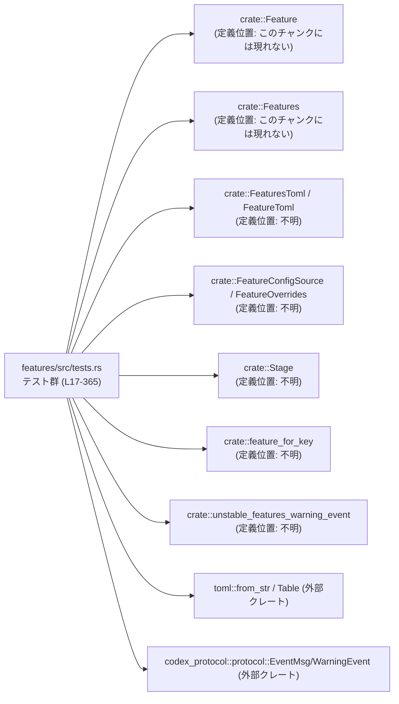
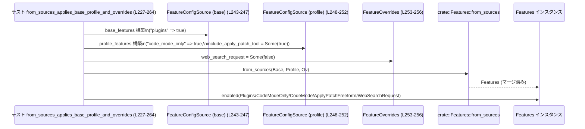
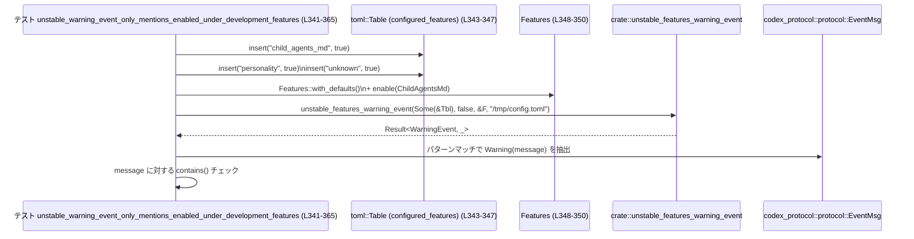

# features/src/tests.rs コード解説

## 0. ざっくり一言

`features/src/tests.rs` は、機能フラグ（feature flags）まわりの **仕様テスト** を集めたモジュールです。  
各 `Feature` のステージ（安定/実験/開発中/削除済み）、デフォルト値、依存関係、設定ファイル（TOML）からの反映、および不安定機能の警告イベントの挙動を検証します。

---

## 1. このモジュールの役割

### 1.1 概要

このモジュールは、次のような問題を解決するために存在します。

- 機能フラグまわりの仕様（デフォルト有効/無効・ステージ・依存関係）が **破壊されていないか** をテストで保証する
- `FeaturesToml` や `FeatureConfigSource` 経由での設定値読み込みと `FeatureOverrides` の上書きロジックが、期待通りに働くことを検証する
- 不安定（UnderDevelopment / Experimental）な機能の有効化時に、適切な警告イベントが生成されることを検証する

これにより、危険な機能が誤って有効化されたり、設定ファイル記述が予期せぬ挙動を引き起こすリスクを下げています。

### 1.2 アーキテクチャ内での位置づけ

このテストモジュールは、`crate` 内の feature フラグ関連 API と、外部クレート（`toml`, `codex_protocol`）に依存しています。



- 根拠: `use` 文および関数呼び出し  
  `features/src/tests.rs:L1-15, L56-71, L74-81, L137-145, L203-215, L227-264, L266-339, L341-365`

### 1.3 設計上のポイント

- **仕様テスト指向**  
  ロジックはすべて本体コード側にあり、このファイルは仕様を記述する「テスト仕様書」の役割を担っています。
  - 例: すべての `Stage::UnderDevelopment` な機能はデフォルト無効であるべき、など  
    `features/src/tests.rs:L17-28, L101-107, L110-116, L125-134, L149-152, L161-170, L197-200`

- **セキュリティ関連の検証**  
  危険度の高い機能（実行許可承認、リモート制御、サンドボックス切り替えなど）が、開発中扱いかつデフォルト無効であることをテストで固定しています。  
  `features/src/tests.rs:L45-54, L101-107, L110-116, L149-152, L161-170, L197-200, L342-365`

- **依存関係の正規化テスト**  
  一部の機能フラグには他機能への依存があり、`Features::normalize_dependencies()` を通じて自動で補完されることを検証しています。  
  `features/src/tests.rs:L74-81, L203-215`

- **設定ファイルとの連携**  
  TOML からの読込み (`toml::from_str`) → `FeaturesToml` → `Features::from_sources` → `Features` インスタンス → `enabled()` / `apps_enabled_for_auth()` という流れを通した一連の挙動をテストしています。  
  `features/src/tests.rs:L227-264, L266-339`

- **エラーハンドリング**  
  テスト内では `expect` による `Result` の即時チェックと `panic!` によるテスト失敗を用い、通常のエラー伝播は行っていません。  
  `features/src/tests.rs:L273, L293, L318, L357, L360`

- **並行性**  
  並行・非同期処理は登場せず、すべて単一スレッド前提の同期テストです。このファイルからは並行性に関する情報は読み取れません。

---

## 2. 主要な機能一覧

このモジュールがテストしている主な「機能」（仕様）を整理します。

- **ステージとデフォルト有効状態の整合性**
  - UnderDevelopment な機能はデフォルト無効  
    `features/src/tests.rs:L17-28, L101-107, L110-116, L125-134, L149-152, L161-170, L197-200`
  - デフォルト有効な機能は Stable or Removed である  
    `features/src/tests.rs:L30-42`
  - 個別機能のステージ/デフォルト有効チェック（ToolSuggest, Collab 等）  
    `features/src/tests.rs:L45-54, L119-122, L155-158, L191-194`

- **機能のメニュー表記・説明文（Experimental の UI 情報）**
  - `JsRepl`, `GuardianApproval`, `ImageDetailOriginal` のメニュー名・説明文・アナウンスのテスト  
    `features/src/tests.rs:L56-71, L83-98, L172-181`

- **機能キーのエイリアス解決**
  - `feature_for_key("use_legacy_landlock")` など、旧キーと新キーの対応  
    `features/src/tests.rs:L136-146, L185-188`

- **依存関係の正規化**
  - `CodeModeOnly` → `CodeMode`  
    `features/src/tests.rs:L73-81`
  - `SpawnCsv` → `Collab`（片方向の依存）  
    `features/src/tests.rs:L202-215`

- **アプリ機能の有効条件**
  - `Feature::Apps` と `apps_enabled_for_auth(has_chatgpt_auth)` の組み合わせ  
    `features/src/tests.rs:L217-225`

- **設定ファイル（TOML）からの読み込み・マージ**
  - 基本プロファイル + プロファイル + オーバーライドのマージ仕様  
    `features/src/tests.rs:L227-264`
  - `multi_agent_v2` の boolean / table 形式 TOML のデシリアライズと `entries()` の挙動  
    `features/src/tests.rs:L266-308, L310-339`

- **不安定機能の警告イベント生成**
  - 設定ファイル内の不安定機能だけを警告メッセージに含める挙動  
    `features/src/tests.rs:L341-365`

---

## 3. 公開 API と詳細解説

### 3.1 型一覧（構造体・列挙体など）

このファイル内で **利用** されている主な型と、その役割です（定義は他ファイル／クレートにあります）。

| 名前 | 種別 | 役割 / 用途 | 根拠 |
|------|------|-------------|------|
| `Feature` | 列挙体（enum と推測） | 個々の機能フラグを表す識別子。`Feature::CodeModeOnly` など多数のバリアントが使用される。 | `features/src/tests.rs:L1, L45-47, L56-70, L74-80, L85-97, L101-107, L110-116, L119-122, L125-134, L137-145, L149-152, L155-158, L161-170, L172-181, L185-194, L197-200, L203-215, L217-225, L259-263, L328-329` |
| `Stage` | 列挙体 | 機能のステージ（`Stable`, `Experimental{..}`, `UnderDevelopment`, `Removed` など）を表現。 | `features/src/tests.rs:L7, L17-28, L30-42, L45-47, L51-53, L62-69, L88-97, L101-107, L110-116, L119-122, L125-134, L149-152, L155-158, L161-170, L172-181, L191-194, L197-200` |
| `Features` | 構造体 | 機能フラグの集合。`with_defaults`, `enable`, `enabled`, `normalize_dependencies`, `apps_enabled_for_auth` などを提供。 | `features/src/tests.rs:L5, L73-81, L202-215, L217-225, L243-263, L319-328, L348-350, L354-355` |
| `FeaturesToml` | 構造体 | TOML からデシリアライズする設定表現。`entries()`, `multi_agent_v2` フィールドを持つ。 | `features/src/tests.rs:L6, L231-241, L266-280, L282-308, L310-339` |
| `FeatureToml` | 列挙体 | 単一機能の TOML 表現（boolean や詳細設定）を表す。 | `features/src/tests.rs:L4, L279-280` |
| `MultiAgentV2ConfigToml` | 構造体 | `multi_agent_v2` 機能の詳細設定（enabled, usage_hint_enabled 等）を保持。 | `features/src/tests.rs:L300-307, L331-337` |
| `FeatureConfigSource` | 構造体 | `Features::from_sources` に渡す設定ソース。`features` と `include_apply_patch_tool` などのフィールドを持つ。 | `features/src/tests.rs:L2, L243-252, L320-324` |
| `FeatureOverrides` | 構造体 | 実行時での機能上書き用。ここでは `web_search_request` の上書きに使用。 | `features/src/tests.rs:L3, L253-256, L325-326` |
| `Table` | 型エイリアス（toml::Table） | TOML テーブルを表すマップ。`unstable_features_warning_event` への入力として利用。 | `features/src/tests.rs:L14, L343-346, L351-352` |
| `TomlValue` | 列挙体（toml::Value） | TOML の値。ここでは Boolean 値として使用。 | `features/src/tests.rs:L15, L344-346` |
| `BTreeMap` | 標準ライブラリ構造体 | 機能名（文字列）→ 有効フラグ（bool）のマップに使用。 | `features/src/tests.rs:L13, L229-240, L276-278, L297-298, L329-330` |
| `EventMsg` / `WarningEvent` | 構造体 / 列挙体 | 不安定機能警告イベントの型。メッセージ文字列を取り出すのに用いられる。 | `features/src/tests.rs:L10-11, L351-361` |

> 定義位置（ソースファイルパス）は、このチャンクには現れないため不明です。

### 3.2 関数詳細（代表 7 件）

以下はいずれも `#[test]` 関数であり、戻り値型は `()` です。

---

#### `from_sources_applies_base_profile_and_overrides()`

**定義位置**: `features/src/tests.rs:L227-264`

**概要**

- `Features::from_sources` が、複数の設定ソース（ベース / プロファイル / オーバーライド）をどのようにマージするかを検証するテストです。
- 具体的には、`plugins` と `code_mode_only` が有効になり、依存関係として `code_mode` と `apply_patch_freeform` が有効化され、オーバーライドによって `web_search_request` が無効になることを確認します。  
  根拠: `features/src/tests.rs:L229-263`

**引数**

- テスト関数のため、引数はありません。

**戻り値**

- 戻り値は `()` であり、すべての `assert_eq!` が通ればテスト成功です。

**内部処理の流れ**

1. ベースエントリとして `"plugins" => true` を持つ `FeaturesToml` を構築。  
   `features/src/tests.rs:L229-234`
2. プロファイルエントリとして `"code_mode_only" => true` を持つ `FeaturesToml` を構築。  
   `features/src/tests.rs:L236-241`
3. `Features::from_sources` に対し、以下を渡して `Features` インスタンスを生成:
   - 第1引数: ベース features  
   - 第2引数: プロファイル features + `include_apply_patch_tool: Some(true)`  
   - 第3引数: `FeatureOverrides` で `web_search_request: Some(false)`  
   `features/src/tests.rs:L243-257`
4. 結果の `features` について、次を検証:
   - `Plugins`, `CodeModeOnly`, `CodeMode`, `ApplyPatchFreeform` が有効 (`enabled(...) == true`)
   - `WebSearchRequest` が無効 (`enabled(...) == false`)  
   `features/src/tests.rs:L259-263`

**Examples（使用例）**

テストそのものが `from_sources` の典型的な使用例になっています。実用コードに近い形に書き換えると次のようになります。

```rust
// TOML から FeaturesToml を読み込んだ後に、複数ソースをマージして Features を構築する例
let base_features: FeaturesToml = /* ベース設定を読み込み */;      // ベースプロファイル
let profile_features: FeaturesToml = /* プロファイル設定を読み込み */; // プロファイルごとの設定

let features = Features::from_sources(                          // 3つのソースをマージして Features を構築
    FeatureConfigSource {
        features: Some(&base_features),                         // ベース設定
        ..Default::default()
    },
    FeatureConfigSource {
        features: Some(&profile_features),                      // プロファイル設定
        include_apply_patch_tool: Some(true),                   // apply-patch ツールを明示的に有効化
        ..Default::default()
    },
    FeatureOverrides {
        web_search_request: Some(false),                        // Web 検索をオーバーライドで無効化
        ..Default::default()
    },
);

// 利用例：特定のフラグをチェックして機能を切り替える
if features.enabled(Feature::Plugins) {                         // plugins が有効ならプラグイン機能を提供
    // プラグイン関連処理
}
```

- このテストから読み取れる契約は、「`include_apply_patch_tool: Some(true)` を指定すると `ApplyPatchFreeform` が有効になる」「`FeatureOverrides.web_search_request = Some(false)` は `WebSearchRequest` を無効化する」という点です。  
  根拠: `features/src/tests.rs:L249-256, L259-263`

**Errors / Panics**

- `Features::from_sources` 自体のエラーハンドリングはこのファイルからは分かりません。
- このテスト内では `expect` を呼んでいないため、テストが失敗するのは `assert_eq!` の条件が満たされない場合のみです。

**Edge cases（エッジケース）**

- このテストは「両方のソースが非空」「オーバーライドが一つ存在する」ケースのみをカバーします。
- ベース/プロファイルが `None` の場合や、同じキーが衝突した場合の挙動はこのチャンクには現れません。

**使用上の注意点**

- 実装利用側では、オーバーライドを強制的な上書きとして扱う設計である可能性が高く、このテストは `web_search_request` がその代表例であることを示します。
- `include_apply_patch_tool` のような「フラグを暗黙有効化するオプション」があるため、「TOML だけ見ても最終的な `Features` の有効状態は分からない」点に注意が必要です。

---

#### `multi_agent_v2_feature_config_deserializes_boolean_toggle()`

**定義位置**: `features/src/tests.rs:L266-280`

**概要**

- `multi_agent_v2 = true` という **boolean 形式** の TOML エントリが、`FeaturesToml` に正しくデシリアライズされることを検証します。
- `entries()` と `multi_agent_v2` フィールドの両方が期待通りであることを確認しています。  
  根拠: `features/src/tests.rs:L266-280`

**内部処理の流れ**

1. TOML 文字列 `multi_agent_v2 = true` を `toml::from_str` で `FeaturesToml` に変換し、`expect` でパース成功を要求。  
   `features/src/tests.rs:L266-273`
2. `features.entries()` が `"multi_agent_v2" => true` の `BTreeMap` になることを検証。  
   `features/src/tests.rs:L275-278`
3. `features.multi_agent_v2` が `Some(FeatureToml::Enabled(true))` であることを検証。  
   `features/src/tests.rs:L279-280`

**Errors / Panics**

- TOML パースに失敗した場合、`.expect("features table should deserialize")` により panic し、テストが失敗します。  
  `features/src/tests.rs:L273`

**Edge cases**

- `multi_agent_v2 = false` や未指定の場合の挙動は、このテストからは分かりません。
- boolean 形式と table 形式を同時に書いた場合の挙動も不明です。

**使用上の注意点**

- boolean 形式で指定した場合、`entries()` にも反映される契約があると読み取れます。
- 機能ごとに「boolean 形式」と「テーブル形式」の両方をサポートする設計であり、ユーザーはどちらの記法も選べるようになっています（詳細挙動は他ファイル参照）。

---

#### `multi_agent_v2_feature_config_deserializes_table()`

**定義位置**: `features/src/tests.rs:L282-308`

**概要**

- `[multi_agent_v2]` テーブル形式の TOML を `FeaturesToml` にデシリアライズしたときの挙動を検証します。
- `enabled = true` などのサブキーが適切に `MultiAgentV2ConfigToml` にマッピングされることを確認します。  
  根拠: `features/src/tests.rs:L282-307`

**内部処理の流れ**

1. `[multi_agent_v2]` テーブルを含む TOML を `toml::from_str` でパースし、`FeaturesToml` に変換。  
   `features/src/tests.rs:L282-293`
2. `features.entries()` が `"multi_agent_v2" => true` を含むマップになることを検証。  
   `features/src/tests.rs:L295-298`
3. `features.multi_agent_v2` が `FeatureToml::Config(MultiAgentV2ConfigToml { .. })` となり、中身のフィールドが指定通りであることを検証。  
   `features/src/tests.rs:L299-307`

**Errors / Panics**

- TOML パース失敗時に `.expect("features table should deserialize")` が panic します。  
  `features/src/tests.rs:L293`

**Edge cases**

- `enabled` を指定しない場合や、一部のフィールドだけ指定した場合の挙動は別テスト（後述）で確認されています。
- 無効な型（例: 文字列を `enabled` に渡す）などの挙動はこのチャンクにはありません。

**使用上の注意点**

- テーブル形式でも `entries()` には boolean 形式と同様 `"multi_agent_v2" => true` が入ることから、「機能が有効化されているかどうか」は `entries()` だけ見ても判断できるように設計されていると解釈できます。
- 一方で詳細設定（usage_hint_* など）は `MultiAgentV2ConfigToml` にのみ存在し、コード側で明示的に参照する必要があります。

---

#### `multi_agent_v2_feature_config_usage_hint_enabled_does_not_enable_feature()`

**定義位置**: `features/src/tests.rs:L310-339`

**概要**

- `[multi_agent_v2]` テーブルで `usage_hint_enabled = false` のみを指定した場合に、**機能自体は有効化されない** という仕様を検証します。
- 同時に、その場合 `entries()` が空になることを確認し、「トップレベルの有効フラグ」と「詳細設定」が分離されていることを明らかにしています。  
  根拠: `features/src/tests.rs:L310-339`

**内部処理の流れ**

1. `[multi_agent_v2] usage_hint_enabled = false` の TOML を `FeaturesToml` にパース。  
   `features/src/tests.rs:L312-318`
2. `Features::from_sources` でその `FeaturesToml` を第1ソースとして `Features` を構築。オーバーライド等はデフォルト。  
   `features/src/tests.rs:L319-326`
3. 検証:
   - `features.enabled(Feature::MultiAgentV2)` は `false`（機能は有効化されない）  
     `features/src/tests.rs:L328`
   - `features_toml.entries()` は空の `BTreeMap`  
     `features/src/tests.rs:L329-330`
   - `features_toml.multi_agent_v2` は `Config(MultiAgentV2ConfigToml { enabled: None, usage_hint_enabled: Some(false), usage_hint_text: None, hide_spawn_agent_metadata: None })`  
     `features/src/tests.rs:L331-337`

**Errors / Panics**

- TOML パース失敗時に `.expect("features table should deserialize")` が panic します。  
  `features/src/tests.rs:L318`

**Edge cases**

- `usage_hint_enabled = true` など、他の値での挙動はこのチャンクには現れません。
- `enabled = false` を明示した場合との違いも不明です。

**使用上の注意点**

- 「usage_hint_* 系のフィールドは UI 上のヒント制御用であり、それだけでは機能有効化フラグとして扱われない」という重要な契約を示しています。
- 実装側で `entries()` を使って「どの機能が有効か」を判断する場合、`entries()` に含まれない設定は「機能を有効にしない付帯設定」とみなす設計であることが分かります。

---

#### `enable_fanout_normalization_enables_multi_agent_one_way()`

**定義位置**: `features/src/tests.rs:L202-215`

**概要**

- `SpawnCsv`（enable_fanout 的な機能）が有効化されている場合に、依存機能 `Collab`（multi_agent）が自動的に有効化されるが、その逆は成立しないという片方向依存を検証します。  
  根拠: `features/src/tests.rs:L203-215`

**内部処理の流れ**

1. `Features::with_defaults()` から `enable_fanout_features` を生成し、`Feature::SpawnCsv` を有効化。  
   `features/src/tests.rs:L203-205`
2. `enable_fanout_features.normalize_dependencies()` を呼び依存関係を正規化。  
   `features/src/tests.rs:L206`
3. 検証:
   - `SpawnCsv` と `Collab` がともに有効。  
     `features/src/tests.rs:L207-208`
4. 別の `Features` インスタンス `collab_features` を生成し、`Feature::Collab` のみを有効化 → `normalize_dependencies()`。  
   `features/src/tests.rs:L210-212`
5. 検証:
   - `Collab` は有効だが `SpawnCsv` は無効のまま。  
     `features/src/tests.rs:L213-214`

**Errors / Panics**

- エラーや panic は発生しない前提のテストです（`Result` を扱っていません）。

**Edge cases**

- 複数の依存関係（例: A が B と C に依存）のようなケースの挙動はこのチャンクには現れません。

**使用上の注意点**

- 「機能 A が機能 B に依存している」仕様を実装するときは、このテストのように片方向であることを明示することが重要です。  
  ここでは `SpawnCsv → Collab` のみが成立し、`Collab → SpawnCsv` にはなっていません。

---

#### `apps_require_feature_flag_and_chatgpt_auth()`

**定義位置**: `features/src/tests.rs:L217-225`

**概要**

- アプリ機能を有効化するには、`Feature::Apps` が有効であり、かつ `apps_enabled_for_auth(has_chatgpt_auth)` に `true` を渡せる認証条件が満たされている必要がある、という契約を検証します。  
  根拠: `features/src/tests.rs:L217-225`

**内部処理の流れ**

1. デフォルトの `Features` を作成。  
   `features/src/tests.rs:L219`
2. `Feature::Apps` を有効化していない状態で `apps_enabled_for_auth(false)` が `false` であることを確認。  
   `features/src/tests.rs:L220`
3. `features.enable(Feature::Apps)` でフラグを有効化。  
   `features/src/tests.rs:L222`
4. 再度 `apps_enabled_for_auth(false)` を呼び、依然として `false` であることを確認（フラグだけでは足りない）。  
   `features/src/tests.rs:L223`
5. `apps_enabled_for_auth(true)` が `true` を返すこと（フラグ + 認証条件が揃った）を確認。  
   `features/src/tests.rs:L224`

**Errors / Panics**

- エラー処理はなく、条件違反時は `assert!` によるテスト失敗となります。

**Edge cases**

- `has_chatgpt_auth` の詳細（トークン形式や期限切れなど）はこのテストからは分かりません。
- 他の認証条件（組織設定など）が必要かどうかも不明です。

**使用上の注意点**

- 実装利用側では、「フラグが有効だからといって必ず UI 上に Apps を出してよいわけではない。認証条件もチェックする必要がある」という点が重要です。

---

#### `js_repl_is_experimental_and_user_toggleable()`

**定義位置**: `features/src/tests.rs:L56-71`

**概要**

- `Feature::JsRepl` が Experimental ステージであり、ユーザが UI からオン/オフ可能な機能として正しく定義されていることを検証します。
- Node.js のバージョン要求文言が `node-version.txt` に記載された値に同期していることも確認します。  
  根拠: `features/src/tests.rs:L56-71`

**内部処理の流れ**

1. `Feature::JsRepl.info()` から `spec.stage` を取得。  
   `features/src/tests.rs:L58-59`
2. `include_str!("../../node-version.txt")` により Node.js の要求バージョン文字列を読み込み、改行を除去。  
   `features/src/tests.rs:L60`
3. 検証:
   - `stage` が `Stage::Experimental{..}` であること。  
     `features/src/tests.rs:L62`
   - `stage.experimental_menu_name()` が `"JavaScript REPL"` であること。  
     `features/src/tests.rs:L63`
   - `stage.experimental_menu_description()` が、Node バージョンを含んだ期待文字列と一致すること。  
     `features/src/tests.rs:L64-69`
   - `Feature::JsRepl.default_enabled()` が `false` であること。  
     `features/src/tests.rs:L70`

**Errors / Panics**

- `include_str!` はコンパイル時にファイルが存在しないとコンパイルエラーになるため、実行時エラーは発生しません。
- 期待文字列との不一致は `assert_eq!` によるテスト失敗になります。

**Edge cases**

- `Stage::Experimental` のフィールド内容（リリース予定やフィードバック URL など）が他にあるかどうかは、このテストでは使われていません。

**使用上の注意点**

- UI 表示文言がコード内のハードコード文字列ではなく、外部ファイル（`node-version.txt`）から読み取ったバージョンを含む形で生成されている点に注意が必要です。  
  バージョン更新時にテキストファイルだけ変更すればよい設計になっています。

---

#### `unstable_warning_event_only_mentions_enabled_under_development_features()`

**定義位置**: `features/src/tests.rs:L341-365`

**概要**

- `unstable_features_warning_event` が出力する警告メッセージに、次のみが含まれることを検証します。
  - 実際に有効化されている不安定機能（ここでは `child_agents_md`）
  - config ファイルのパス
- 逆に、`personality` のような安定機能は、設定に含まれていてもメッセージに現れないことを確認します。  
  根拠: `features/src/tests.rs:L341-365`

**内部処理の流れ**

1. TOML `Table` に `"child_agents_md"`, `"personality"`, `"unknown"` の3項目をすべて `true` として登録。  
   `features/src/tests.rs:L343-346`
2. `Features::with_defaults()` → `Feature::ChildAgentsMd` を有効化。  
   `features/src/tests.rs:L348-350`
3. `unstable_features_warning_event` を呼び出し、
   - 設定テーブル
   - `suppress_unstable_features_warning = false`
   - 現在の `features`
   - コンフィグファイルパス `/tmp/config.toml`  
   を渡す。結果の `Result` を `.expect("warning event")` でチェック。  
   `features/src/tests.rs:L351-357`
4. イベントメッセージを `EventMsg::Warning(WarningEvent { message })` として取り出し、次を検証:
   - `"child_agents_md"` を含む  
   - `"personality"` を含まない  
   - `"/tmp/config.toml"` を含む  
   `features/src/tests.rs:L359-364`

**Errors / Panics**

- `unstable_features_warning_event(..)` が `Err` を返した場合、`.expect("warning event")` により panic します。  
  `features/src/tests.rs:L357`
- 期待通りのメッセージでない場合は `assert!` によりテストが失敗します。

**Edge cases**

- `"unknown"` エントリがメッセージに含まれるかどうかは、このテストではチェックしていません。
  - したがって、不明なキーの扱い（無視するかどうか）はこのチャンクには現れません。
- `suppress_unstable_features_warning = true` の場合の挙動も不明です。

**使用上の注意点**

- 警告メッセージは「不安定機能のうち実際に有効なもの」に絞られるという契約を示しています。
- セキュリティ上重要な点として、ユーザーが config に書いただけで有効にはなっていない機能（または安定な機能）については、警告に含めない設計であることが分かります。

---

### 3.3 その他の関数

残りのテスト関数の役割を一覧にします。

| 関数名 | 役割（1 行） | 根拠 |
|--------|--------------|------|
| `under_development_features_are_disabled_by_default` | すべての `Stage::UnderDevelopment` の機能が `default_enabled == false` であることを一括検証。 | `features/src/tests.rs:L17-28` |
| `default_enabled_features_are_stable` | `default_enabled == true` な機能は `Stage::Stable` または `Removed` のみであることを検証。 | `features/src/tests.rs:L30-42` |
| `use_legacy_landlock_is_stable_and_disabled_by_default` | `UseLegacyLandlock` が Stable だがデフォルト無効であることを検証。 | `features/src/tests.rs:L44-48` |
| `use_linux_sandbox_bwrap_is_removed_and_disabled_by_default` | `UseLinuxSandboxBwrap` が Removed かつデフォルト無効であることを検証。 | `features/src/tests.rs:L50-54` |
| `code_mode_only_requires_code_mode` | `CodeModeOnly` を有効化すると依存して `CodeMode` も有効化されることを検証。 | `features/src/tests.rs:L73-81` |
| `guardian_approval_is_experimental_and_user_toggleable` | `GuardianApproval` の Experimental ステージ・メニュー名・説明文・アナウンス・デフォルト無効を検証。 | `features/src/tests.rs:L83-98` |
| `request_permissions_is_under_development` | `ExecPermissionApprovals` が UnderDevelopment かつデフォルト無効であることを検証。 | `features/src/tests.rs:L100-107` |
| `request_permissions_tool_is_under_development` | `RequestPermissionsTool` が UnderDevelopment かつデフォルト無効であることを検証。 | `features/src/tests.rs:L109-116` |
| `tool_suggest_is_stable_and_enabled_by_default` | `ToolSuggest` が Stable かつデフォルト有効であることを検証。 | `features/src/tests.rs:L118-122` |
| `tool_search_is_under_development_and_disabled_by_default` | `ToolSearch` が UnderDevelopment かつデフォルト無効であることを検証。 | `features/src/tests.rs:L124-128` |
| `general_analytics_is_under_development_and_disabled_by_default` | `GeneralAnalytics` が UnderDevelopment かつデフォルト無効であることを検証。 | `features/src/tests.rs:L130-134` |
| `use_linux_sandbox_bwrap_is_a_removed_feature_key` | 文字列キー `"use_legacy_landlock"`, `"use_linux_sandbox_bwrap"` が対応する `Feature` に解決されることを検証。 | `features/src/tests.rs:L136-145` |
| `image_generation_is_under_development` | `ImageGeneration` が UnderDevelopment かつデフォルト無効であることを検証。 | `features/src/tests.rs:L148-152` |
| `tool_call_mcp_elicitation_is_stable_and_enabled_by_default` | `ToolCallMcpElicitation` が Stable かつデフォルト有効であることを検証。 | `features/src/tests.rs:L154-158` |
| `remote_control_is_under_development` | `RemoteControl` が UnderDevelopment かつデフォルト無効であることを検証。 | `features/src/tests.rs:L160-164` |
| `use_agent_identity_is_under_development` | `UseAgentIdentity` が UnderDevelopment かつデフォルト無効であることを検証。 | `features/src/tests.rs:L166-170` |
| `image_detail_original_feature_is_experimental_and_user_toggleable` | `ImageDetailOriginal` の Experimental ステージとメニュー名・デフォルト無効を検証。 | `features/src/tests.rs:L172-181` |
| `collab_is_legacy_alias_for_multi_agent` | `"multi_agent"` と `"collab"` の両方が `Feature::Collab` に解決されることを検証。 | `features/src/tests.rs:L184-188` |
| `multi_agent_is_stable_and_enabled_by_default` | `Collab`（multi-agent）が Stable かつデフォルト有効であることを検証。 | `features/src/tests.rs:L190-194` |

---

## 4. データフロー

### 4.1 設定ファイルから機能フラグが有効になるまで

`from_sources_applies_base_profile_and_overrides (L227-264)` を例に、データの流れを示します。

1. アプリケーション側で複数の設定ソース（ベース・プロファイル・オーバーライド）を構築する。
2. `Features::from_sources` を呼び出し、内部でそれらの設定をマージして `Features` インスタンスを生成する。
3. 呼び出し側は `features.enabled(Feature::X)` で個々のフラグ状態を確認し、機能の ON/OFF を決定する。



- 根拠: `features/src/tests.rs:L229-263`

---

### 4.2 不安定機能の警告イベント生成フロー

`unstable_warning_event_only_mentions_enabled_under_development_features (L341-365)` でのデータフローです。



- 根拠: `features/src/tests.rs:L343-364`

---

## 5. 使い方（How to Use）

### 5.1 基本的な使用方法

このファイルのテストコードを元に、アプリケーション側での `Features` 利用の一例です。

```rust
// 1. TOML 設定を読み込み、FeaturesToml にデシリアライズする
let config_str = std::fs::read_to_string("config/features.toml")?; // 設定ファイルを文字列として読み込む
let features_toml: FeaturesToml = toml::from_str(&config_str)?;    // TOML を FeaturesToml に変換する

// 2. FeatureConfigSource と FeatureOverrides を組み立てる
let base_source = FeatureConfigSource {                            // ベース設定ソース
    features: Some(&features_toml),                                // 読み込んだ TOML を参照で渡す
    ..Default::default()
};

let profile_source = FeatureConfigSource::default();               // プロファイル設定なしのデフォルト

let overrides = FeatureOverrides {                                 // 実行時オーバーライド
    web_search_request: Some(false),                               // 例: Web 検索を強制的に無効化
    ..Default::default()
};

// 3. from_sources で Features を構築する
let features = Features::from_sources(                             // 3 ソースをマージして最終的な Features を得る
    base_source,
    profile_source,
    overrides,
);

// 4. 機能フラグを参照して挙動を切り替える
if features.enabled(Feature::MultiAgentV2) {                       // multi_agent_v2 が有効なら
    // 複数エージェント機能を有効にしたコードを実行する
}

if features.apps_enabled_for_auth(/*has_chatgpt_auth*/ true) {     // 認証済みなら Apps 機能を有効にする
    // Apps 関連の UI を表示する
}
```

- 基本的なパターンは、テスト `from_sources_applies_base_profile_and_overrides` および `apps_require_feature_flag_and_chatgpt_auth` から読み取れます。  
  根拠: `features/src/tests.rs:L227-264, L217-225`

### 5.2 よくある使用パターン

1. **依存関係の自動有効化を前提とした利用**

   - 例: `CodeModeOnly` をオンにすると自動で `CodeMode` も有効になる。  
     根拠: `features/src/tests.rs:L73-81`
   - コード側では `enabled(Feature::CodeModeOnly)` のチェックだけで済ませ、`CodeMode` の個別チェックは省略できる設計になっていると考えられます。

2. **詳細設定のみ行う MultiAgentV2**

   - `multi_agent_v2` のテーブル内で `usage_hint_enabled` などのフィールドを設定しつつ、機能本体は有効化しないパターン。  
     根拠: `features/src/tests.rs:L310-339`
   - これは「UI 上にヒントのみ出すが機能はまだ使えない」ような段階的ロールアウトに使えます。

3. **不安定機能の警告表示**

   - `unstable_features_warning_event` を呼び、ユーザが有効化している不安定機能をまとめて警告するパターン。  
     根拠: `features/src/tests.rs:L341-365`

### 5.3 よくある間違い

テストから推測できる「誤用しそうなパターン」と、その正しい使い方です。

```rust
// 間違い例: usage_hint_enabled だけ指定すれば multi_agent_v2 が有効になると期待している
let features_toml: FeaturesToml = toml::from_str(r#"
[multi_agent_v2]
usage_hint_enabled = false
"#).unwrap();

let features = Features::from_sources(
    FeatureConfigSource { features: Some(&features_toml), ..Default::default() },
    FeatureConfigSource::default(),
    FeatureOverrides::default(),
);

// 誤り: ここで true を期待するとテストと矛盾する
assert!(features.enabled(Feature::MultiAgentV2));  // ← テストでは false になると明示されている

// 正しい例: enabled を明示的に true にする
let features_toml: FeaturesToml = toml::from_str(r#"
[multi_agent_v2]
enabled = true
usage_hint_enabled = false
"#).unwrap();

let features = Features::from_sources(
    FeatureConfigSource { features: Some(&features_toml), ..Default::default() },
    FeatureConfigSource::default(),
    FeatureOverrides::default(),
);

assert!(features.enabled(Feature::MultiAgentV2));  // enabled = true によって有効化される
```

- 根拠: `features/src/tests.rs:L282-308, L310-339`

### 5.4 使用上の注意点（まとめ）

- **セキュリティ関連機能は UnderDevelopment + デフォルト無効**
  - `ExecPermissionApprovals`, `RequestPermissionsTool`, `RemoteControl`, `ImageGeneration`, 各種サンドボックス関連フラグなどは、開発中かつデフォルト無効であることがテストで固定されています。  
    実行時にこれらを有効にする場合、リスクを踏まえた上で明示的に設定する必要があります。  
    根拠: `features/src/tests.rs:L45-54, L101-107, L110-116, L149-152, L161-170, L197-200`
- **依存関係の片方向性を前提にする**
  - `SpawnCsv` → `Collab` のように、依存関係は片方向であることが明示されています。逆方向の自動有効化は行われません。  
    根拠: `features/src/tests.rs:L203-215`
- **Apps 利用にはフラグ + 認証条件が必要**
  - `Feature::Apps` を有効にするだけでは不十分で、`apps_enabled_for_auth(true)` を返せる認証状態が必要です。  
    根拠: `features/src/tests.rs:L217-225`
- **不安定機能の警告は有効な不安定機能に限る**
  - すべての設定値ではなく、有効化された不安定機能のみ警告されます。  
    根拠: `features/src/tests.rs:L341-365`

---

## 6. 変更の仕方（How to Modify）

### 6.1 新しい機能を追加する場合（テスト観点）

このファイルの構造から、新しい `Feature` を追加したときに関係しそうなテストは次のとおりです。

1. **ステージ/デフォルト有効状態のテスト**
   - UnderDevelopment なら `under_development_features_are_disabled_by_default` に自動的に含まれるため、`crate::FEATURES` の登録だけで基本チェックはかかります。  
     `features/src/tests.rs:L17-28`
   - デフォルト有効にする場合は `default_enabled_features_are_stable` により、ステージが Stable/Removed かどうかチェックされます。  
     `features/src/tests.rs:L30-42`

2. **個別仕様がある場合**
   - UI 表示名や説明文、依存関係などに特別な仕様がある機能は、既存のパターン（`js_repl_is_experimental_and_user_toggleable` など）に倣って、専用のテスト関数を追加するのが自然です。  
     例: Experimental でメニューに出す必要がある場合。

3. **設定ファイル経由の挙動**
   - TOML フィールドを新設する場合は、`multi_agent_v2` 系のテストのように boolean/テーブルそれぞれのデシリアライズと `entries()` の挙動をテストすると、仕様が明確になります。  
     `features/src/tests.rs:L266-339`

### 6.2 既存の機能を変更する場合

- **影響範囲の確認**
  - 機能のステージやデフォルト有効状態を変更する場合、以下のテストが落ちる可能性があります。
    - `under_development_features_are_disabled_by_default`  
    - `default_enabled_features_are_stable`  
    - 各機能の個別テスト（例: `tool_suggest_is_stable_and_enabled_by_default`）  
      根拠: `features/src/tests.rs:L17-42, L119-122, L155-158, L191-194` 等
- **依存関係仕様変更**
  - `normalize_dependencies()` の仕様を変更する場合、`code_mode_only_requires_code_mode` や `enable_fanout_normalization_enables_multi_agent_one_way` のテストが対象になります。  
    根拠: `features/src/tests.rs:L73-81, L203-215`
- **設定ファイル仕様変更**
  - `FeaturesToml`, `FeatureToml` の構造変更や `entries()` の仕様変更は、`multi_agent_v2` 系テストおよび `from_sources_applies_base_profile_and_overrides` に影響します。  
    根拠: `features/src/tests.rs:L227-264, L266-339`
- **警告イベントの変更**
  - 警告メッセージの形式を変える場合は、`unstable_warning_event_only_mentions_enabled_under_development_features` を更新する必要があります。  
    根拠: `features/src/tests.rs:L341-365`

---

## 7. 関連ファイル

このテストモジュールと密接に関係すると思われる型・関数は `crate::...` として参照されていますが、具体的なファイルパスはこのチャンクには現れません。そのため、推測は行わず識別子名のみを列挙します。

| パス / 識別子 | 役割 / 関係 |
|---------------|------------|
| `crate::Feature` | 機能フラグの列挙体。テスト内で多数のバリアントが使用され、ステージやデフォルト有効状態が検証されます。 |
| `crate::Stage` | 機能のステージ（Stable / Experimental / UnderDevelopment / Removed）を表し、仕様上の制約をテストしています。 |
| `crate::Features` | 機能フラグの集合と、その操作 API（`with_defaults`, `enable`, `enabled`, `normalize_dependencies`, `apps_enabled_for_auth` など）を提供する型です。 |
| `crate::FeaturesToml`, `crate::FeatureToml`, `crate::MultiAgentV2ConfigToml` | TOML からの設定デシリアライズと、その中間表現を担う型群です。 |
| `crate::FeatureConfigSource`, `crate::FeatureOverrides` | `Features::from_sources` に渡される設定ソースおよびオーバーライドを表し、設定マージロジックの入力になります。 |
| `crate::feature_for_key` | 文字列キーから `Feature` へのマッピングを行う関数であり、古いキー名の互換性をテストしています。 |
| `crate::unstable_features_warning_event` | 不安定機能の有効化に関する警告イベントを生成する関数であり、その出力メッセージがテストされています。 |
| `codex_protocol::protocol::EventMsg`, `WarningEvent` | 警告イベントを表す外部プロトコル型で、`unstable_features_warning_event` の戻り値に使用されます。 |
| `toml::from_str`, `toml::Table`, `toml::Value` | 設定ファイル（TOML）のパースと内部表現に用いられる外部クレートの型です。 |

> これらの具体的な定義場所（ファイルパス）は、このチャンクには現れないため不明です。
