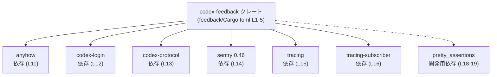
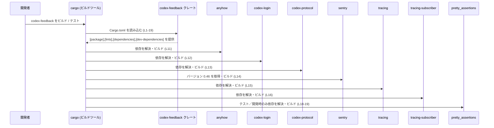

# feedback/Cargo.toml

## 0. ざっくり一言

`feedback/Cargo.toml` は、Rust クレート `codex-feedback` の **Cargo マニフェスト** であり、パッケージ情報・ワークスペース設定・依存クレート・開発用依存クレートを宣言しています（根拠: `feedback/Cargo.toml:L1-5,10-19`）。

---

## 1. このモジュールの役割

### 1.1 概要

- このファイルは、Rust クレート `codex-feedback` の **ビルド設定と依存関係** を定義するために存在します（根拠: `name = "codex-feedback"` 行, `feedback/Cargo.toml:L2`）。
- バージョン・エディション・ライセンス・リント・依存クレートをワークスペース全体で共有する構成になっています（根拠: `.workspace = true` 指定, `feedback/Cargo.toml:L3-5,7-8,11-13,15-16`）。

### 1.2 アーキテクチャ内での位置づけ

`codex-feedback` クレートが、どのクレートに依存してビルドされるかを表した依存関係図です。



- 実行時にどのような API を呼び出しているかは、このマニフェストだけからは分かりません。
- ただし、`codex-feedback` が上記クレートにリンクされることは、依存宣言から読み取れます（根拠: `[dependencies]`, `[dev-dependencies]`, `feedback/Cargo.toml:L10-19`）。

### 1.3 設計上のポイント

- **ワークスペース前提のパッケージ定義**  
  `version.workspace = true`, `edition.workspace = true`, `license.workspace = true` により、バージョン・エディション・ライセンスをワークスペース共通設定から継承します（根拠: `feedback/Cargo.toml:L3-5`）。  
  → このクレートは Cargo ワークスペースの一員として使われることを前提にしています。

- **リント設定のワークスペース共有**  
  `[lints]` セクションで `workspace = true` を指定し、リント設定もワークスペースから継承します（根拠: `feedback/Cargo.toml:L7-8`）。

- **依存バージョンの集中管理**  
  `anyhow`, `codex-login`, `codex-protocol`, `tracing`, `tracing-subscriber` は `workspace = true` によりワークスペース側でバージョンを一元管理します（根拠: `feedback/Cargo.toml:L11-13,15-16`）。

- **一部依存のみローカル指定**  
  `sentry` はこのファイルで直接 `version = "0.46"` を指定しています（根拠: `feedback/Cargo.toml:L14`）。  
  一方、`pretty_assertions` は開発用依存としてワークスペース共有設定を使っています（根拠: `feedback/Cargo.toml:L18-19`）。

---

## 2. 主要な機能一覧

このファイル自体は Rust の関数や型を定義しませんが、ビルドや依存管理の観点で次の機能を持ちます。

- **パッケージメタデータの定義**  
  クレート名と、ワークスペースから継承されるバージョン・エディション・ライセンスの指定（根拠: `feedback/Cargo.toml:L1-5`）。

- **リント設定の継承**  
  ワークスペースレベルで定義されたリント方針をこのクレートに適用（根拠: `feedback/Cargo.toml:L7-8`）。

- **ランタイム依存クレートの宣言**  
  `anyhow`, `codex-login`, `codex-protocol`, `sentry`, `tracing`, `tracing-subscriber` への依存宣言（根拠: `feedback/Cargo.toml:L10-16`）。

- **開発・テスト用依存クレートの宣言**  
  `pretty_assertions` への開発用依存宣言（根拠: `feedback/Cargo.toml:L18-19`）。

### 2.1 コンポーネントインベントリー（依存クレート）

| 名前               | 種別             | バージョン指定              | 役割 / 用途（このチャンクから分かる範囲） | 根拠 |
|--------------------|------------------|-----------------------------|--------------------------------------------|------|
| `codex-feedback`   | パッケージ       | `version.workspace = true`  | 本ファイルで定義されるクレート本体        | `feedback/Cargo.toml:L1-3` |
| `anyhow`           | 依存クレート     | `workspace = true`          | ワークスペースでバージョンを共有する外部依存（用途はこのファイルからは不明） | `feedback/Cargo.toml:L11` |
| `codex-login`      | 依存クレート     | `workspace = true`          | プロジェクト内または外部のクレート。名前からログイン関連の可能性はありますが、用途はコードからは不明 | `feedback/Cargo.toml:L12` |
| `codex-protocol`   | 依存クレート     | `workspace = true`          | プロジェクト内または外部のクレート。名前からプロトコル定義の可能性はありますが、用途はコードからは不明 | `feedback/Cargo.toml:L13` |
| `sentry`           | 依存クレート     | `version = "0.46"`          | バージョン 0.46 に固定された外部依存。内容・用途はこのファイルからは不明 | `feedback/Cargo.toml:L14` |
| `tracing`          | 依存クレート     | `workspace = true`          | ワークスペースでバージョンを共有する依存（一般にはトレースログ用クレート名ですが、用途はここからは断定不可） | `feedback/Cargo.toml:L15` |
| `tracing-subscriber` | 依存クレート   | `workspace = true`          | 上記 `tracing` の購読側と思われる名称ですが、具体用途は不明 | `feedback/Cargo.toml:L16` |
| `pretty_assertions`| 開発用依存       | `workspace = true`          | テスト・開発時のみに使用される依存（名称からアサーション用と推測されますが、詳細は不明） | `feedback/Cargo.toml:L18-19` |

> 備考: 役割欄で用途に言及している部分は、クレート名から一般的に連想されるものであり、このリポジトリのコードから直接確認できるものではありません。

---

## 3. 公開 API と詳細解説

このファイルは **Cargo の設定ファイル** であり、Rust の関数・構造体・列挙体などの公開 API は含まれていません（根拠: 全行が TOML セクションであり、Rust コードではないこと, `feedback/Cargo.toml:L1-19`）。

### 3.1 型一覧（構造体・列挙体など）

このファイルには型定義が存在しないため、一覧は空になります。

| 名前 | 種別 | 役割 / 用途 |
|------|------|-------------|
| （なし） | -  | このファイルはマニフェストのみを定義し、型は定義していません |

### 3.2 関数詳細

Rust の関数定義が存在しないため、このセクションに挙げる関数はありません。

- `feedback/Cargo.toml` の内容からは、`codex-feedback` クレートの公開関数・メソッド・エラー型・並行性の扱いは **一切分かりません**。

### 3.3 その他の関数

- 同上の理由により、補助関数やラッパー関数もこのファイルからは特定できません。

---

## 4. データフロー

このファイル自体は実行時ロジックを持たないため、**実行時のデータフロー** や API 呼び出し関係は不明です。  
ここでは、`feedback/Cargo.toml` に基づく **ビルド時の依存解決フロー** を示します。



- 実際に `codex-feedback` からどの依存クレートのどの関数が呼ばれるかは、このファイルからは分かりません。
- ただし、ビルド時に上記クレート群が解決されることは、依存宣言から読み取れます（根拠: `feedback/Cargo.toml:L10-19`）。

---

## 5. 使い方（How to Use）

### 5.1 基本的な使用方法

このファイルを含むワークスペースで `codex-feedback` クレートをビルド・テストする典型的なコマンド例です。

```bash
# ワークスペースルート（パスはこのチャンクからは不明）で実行する想定

# codex-feedback クレートのみをビルド
cargo build -p codex-feedback

# codex-feedback クレートのテストを実行
cargo test -p codex-feedback
```

- これらのコマンドが有効であるためには、`codex-feedback` がワークスペースのメンバーとして正しく登録されている必要があります（`version.workspace = true` などから、その前提が推測されます。根拠: `feedback/Cargo.toml:L3`）。

### 5.2 よくある使用パターン

- **依存の追加（一般論）**  
  新しい依存クレートを使う場合は、通常 `[dependencies]` セクションにエントリを追加します。  
  このプロジェクトでは、バージョン管理をワークスペース側で行うパターン（`workspace = true`）が採用されているため、同様の方針に従う可能性があります（根拠: `feedback/Cargo.toml:L11-13,15-16`）。

- **開発専用依存の追加**  
  テスト用・開発ツール用クレートは `[dev-dependencies]` セクションに追加されます（`pretty_assertions` の例, 根拠: `feedback/Cargo.toml:L18-19`）。

### 5.3 よくある間違い

このファイル固有の誤用パターンはコードからは分かりませんが、`workspace = true` を多用する構成における一般的な注意点を挙げます。

```toml
# 誤り例（一般論）: 個別クレート側でも version を直接指定してしまう
[dependencies]
sentry = { version = "0.46" }
anyhow = { version = "1.0", workspace = true } # version と workspace の指定が混在

# 望ましい一貫例（一般論）: バージョンはすべて workspace で管理する
[dependencies]
anyhow = { workspace = true }
```

- 上記は一般的なパターンであり、このワークスペースが実際にどう定義されているかは、このチャンクからは分かりません。

### 5.4 使用上の注意点（まとめ）

- `version.workspace = true` 等の設定により、このファイル単体ではビルドできず、**必ず Cargo ワークスペースの一部として利用することが前提** になっています（根拠: `feedback/Cargo.toml:L3-5,7-8,11-13,15-16`）。
- 依存関係のバージョンはワークスペース側に隠れているため、依存更新や脆弱性対応はワークスペースルートの設定を確認する必要があります（このチャンクにはそのファイルは現れていません）。

---

## 6. 変更の仕方（How to Modify）

### 6.1 新しい機能を追加する場合（このファイルの観点）

ここでは「新しい機能 = 新しいクレート依存を追加する」ケースに限定して説明します。

1. **ワークスペースの方針確認**  
   - 既存の依存が `workspace = true` を使っているため、バージョン管理をワークスペースルートにまとめる方針の可能性があります（根拠: `feedback/Cargo.toml:L11-13,15-16`）。
2. **ワークスペース側に依存を追加**（一般論）  
   - ルートの `Cargo.toml`（パス不明）に `[workspace.dependencies]` 等で依存とバージョンを追加する構成が多いです。  
   - このリポジトリの具体的な構成は、このチャンクからは確認できません。
3. **本ファイルにエイリアスを追加**  
   - `feedback/Cargo.toml` の `[dependencies]` に `xxx = { workspace = true }` のような形でエントリを追加することが想定されます。
4. **ビルド・テスト**  
   - `cargo build -p codex-feedback` や `cargo test -p codex-feedback` を実行し、依存解決・ビルドが成功することを確認します。

### 6.2 既存の機能を変更する場合（このファイルの観点）

- **依存バージョンの更新**
  - `sentry` のようにローカルでバージョンを指定している依存は、このファイル内でバージョン文字列を更新します（根拠: `feedback/Cargo.toml:L14`）。
  - `workspace = true` の依存については、ワークスペースルートの設定を変更する必要があります（このチャンクではそのファイルは不明）。

- **リントポリシーの変更**
  - `lints.workspace = true` により、このクレート固有のリント設定は記述されていません（根拠: `feedback/Cargo.toml:L7-8`）。
  - リントポリシーを変更するには、ワークスペース側の定義を確認・変更する必要があります。

- **注意すべき契約・エッジケース（設定レベル）**
  - このファイルをワークスペース外で単独利用しようとすると、`.workspace = true` を含むフィールドで Cargo からエラーになる可能性があります。  
    → `codex-feedback` はワークスペースメンバーであることを前提に設計されていると解釈できます（根拠: `feedback/Cargo.toml:L3-5,7-8,11-13,15-16`）。

---

## 7. 関連ファイル

このチャンクには `feedback/Cargo.toml` 以外のファイルは含まれていませんが、設定内容から論理的に関連があると考えられるファイルを挙げます。

| パス | 役割 / 関係 |
|------|------------|
| （不明: ルートワークスペースの `Cargo.toml`） | `version.workspace = true`, `edition.workspace = true`, `license.workspace = true`, `[lints] workspace = true`, 各依存の `workspace = true` などの設定から、このクレートが参照するワークスペース共通設定を保持するファイルが存在すると考えられます。ただし、実際のパスや内容はこのチャンクには現れていません（根拠: `feedback/Cargo.toml:L3-5,7-8,11-13,15-16`）。 |
| `feedback/Cargo.toml` | 本ドキュメントの対象ファイル。`codex-feedback` クレートのパッケージメタデータと依存関係を定義します（根拠: `feedback/Cargo.toml:L1-19`）。 |

> Rust クレートのエントリポイント（`src/lib.rs` や `src/main.rs` など）は一般的に存在しますが、このチャンクにはディレクトリ構成が含まれていないため、`codex-feedback` クレートにおける具体的なファイル名・パスは不明です。
