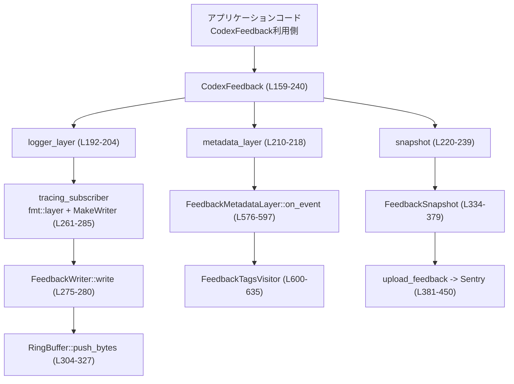
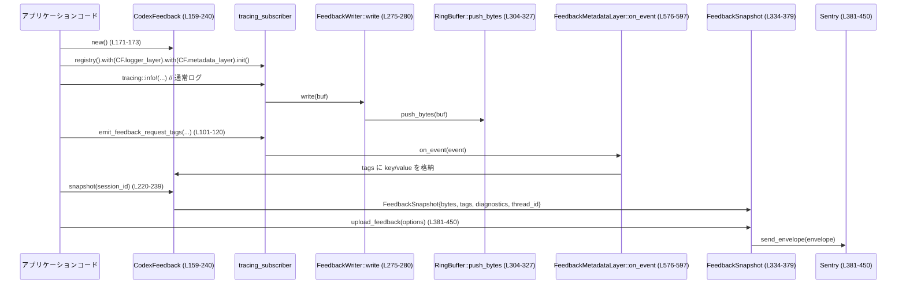

# feedback/src/lib.rs コード解説

## 0. ざっくり一言

このモジュールは、CLI セッションのログとメタデータをリングバッファに収集し、Sentry へのフィードバック送信や一時ファイルへの保存を行うためのユーティリティを提供します（`lib.rs:L30-35`, `L159-240`, `L381-554`）。

---

## 1. このモジュールの役割

### 1.1 概要

- セッション中のログをメモリ内リングバッファ（固定サイズ）に記録し、任意のタイミングでスナップショットとして取り出す機能を提供します（`RingBuffer`, `CodexFeedback`。`lib.rs:L287-332`, `L159-240`）。
- HTTP リクエストや認証に関する構造化メタデータを `tracing` のイベントとして収集し、タグとしてフィードバックに添付します（`FeedbackRequestTags`, `FeedbackMetadataLayer`。`lib.rs:L37-53`, `L567-597`）。
- 収集したログとメタデータ、および追加の診断情報や任意ファイルを添付して Sentry に送信する機能を提供します（`FeedbackSnapshot::upload_feedback`。`lib.rs:L381-450`）。

### 1.2 アーキテクチャ内での位置づけ

主なコンポーネントと依存関係の概略です。



- アプリケーション側は `CodexFeedback` を生成し、`logger_layer` / `metadata_layer` を `tracing_subscriber` に登録します。
- 以後のログは `FeedbackWriter` 経由で `RingBuffer` に蓄積され、`FEEDBACK_TAGS_TARGET` のイベントは `FeedbackMetadataLayer` がタグとして収集します。
- 必要に応じて `snapshot()` で `FeedbackSnapshot` を取得し、Sentry 送信やファイル保存を行います。

### 1.3 設計上のポイント

- **責務の分離**
  - ログ蓄積: `RingBuffer` + `FeedbackWriter`（`lib.rs:L287-332`, `L271-285`）
  - メタデータタグ収集: `FeedbackMetadataLayer` + `FeedbackTagsVisitor`（`lib.rs:L567-635`）
  - スナップショットとアップロード: `FeedbackSnapshot` + `FeedbackUploadOptions`（`lib.rs:L334-554`）
- **スレッド安全性**
  - ログ・タグは `Arc<FeedbackInner>` 内の `Mutex` で保護され、マルチスレッドな `tracing` ログから安全に利用できます（`lib.rs:L242-245`, `L275-280`, `L576-597`）。
- **エラーハンドリング**
  - Sentry DSN のパース失敗などは `anyhow::Result` で呼び出し側に返します（`lib.rs:L381-400`）。
  - ログ書き込み時のロック取得失敗は `io::ErrorKind::Other` にマッピングして返します（`lib.rs:L275-280`）。
  - スナップショット取得時はロックのポイズンを `expect` で検出し、パニックさせます（`lib.rs:L220-239`）。
- **メモリ制限**
  - ログはバイト数上限付きリングバッファに保持し、それを超えた分は古いログから破棄します（`lib.rs:L287-327`）。
- **プライバシー配慮**
  - 認証関連フィールドは基本的に「存在するかどうか」などのブールや抽象化された情報のみ記録し、コメントでもその意図を明示しています（`lib.rs:L143-155` のコメント）。

---

## 2. 主要な機能一覧

- フィードバック用タグの発行: HTTP リクエスト・認証状態を `tracing` のイベントとして構造化ログ出力（`emit_feedback_request_tags*`。`lib.rs:L101-157`）。
- ログのリングバッファ収集: `tracing_subscriber` 用の `MakeWriter` 実装を通じてログを固定サイズバッファに保存（`FeedbackMakeWriter`, `FeedbackWriter`, `RingBuffer`。`lib.rs:L256-332`）。
- メタデータタグ収集レイヤー: `target: "feedback_tags"` のイベントから key/value タグを抽出・蓄積（`FeedbackMetadataLayer`。`lib.rs:L567-597`）。
- スナップショット作成: 現在のログバイト列・タグ・診断情報・スレッド ID をまとめた `FeedbackSnapshot` を生成（`lib.rs:L220-239`, `L334-339`）。
- Sentry へのフィードバック送信: スナップショットをもとに Event + Attachment を組み立てて Sentry に送信（`upload_feedback`。`lib.rs:L381-450`）。
- 添付ファイル生成: ログ本文・診断テキスト・任意追加ファイルを Sentry Attachment に変換（`feedback_attachments`。`lib.rs:L501-554`）。
- 一時ファイルへの保存: ログスナップショットを temp ディレクトリに `.log` ファイルとして保存（`save_to_temp_file`。`lib.rs:L373-379`）。

---

## 3. 公開 API と詳細解説

### 3.1 型一覧（構造体・列挙体など）

主要な公開型とその役割です。

| 名前 | 種別 | 公開範囲 | 行番号 | 役割 / 用途 |
|------|------|----------|--------|-------------|
| `FeedbackRequestTags<'a>` | 構造体 | `pub` | `lib.rs:L37-53` | HTTP リクエスト・認証関連のタグ情報を一時的に保持する入力用構造体 |
| `CodexFeedback` | 構造体 | `pub` | `lib.rs:L159-162` | ログとタグを収集するフィードバック・コンテナ。`logger_layer` / `metadata_layer` / `snapshot` を提供 |
| `FeedbackMakeWriter` | 構造体 | `pub` | `lib.rs:L256-259` | `tracing_subscriber` の `MakeWriter` 実装。`fmt::layer()` から利用される |
| `FeedbackWriter` | 構造体 | `pub` | `lib.rs:L271-273` | 実際にバイト列を `RingBuffer` に書き込む `Write` 実装 |
| `FeedbackSnapshot` | 構造体 | `pub` | `lib.rs:L334-339` | スナップショットされたログ・タグ・診断情報・スレッド ID を保持する |
| `FeedbackUploadOptions<'a>` | 構造体 | `pub` | `lib.rs:L341-349` | Sentry アップロード時の分類・理由・タグ・添付ファイル等のオプション |
| `FeedbackDiagnostics` | 構造体 | `pub use` | `lib.rs:L25-28` | 追加診断情報を表す型。定義は `feedback_diagnostics` モジュール内（このチャンクには定義が現れません） |
| `FeedbackDiagnostic` | 構造体 | `pub use` | `lib.rs:L25-28` | 個別の診断項目。定義は別モジュール |
| `FEEDBACK_DIAGNOSTICS_ATTACHMENT_FILENAME` | 定数 | `pub use` | `lib.rs:L25-28` | 診断情報添付ファイルのファイル名文字列（実体は別モジュール） |

内部用の主な構造体:

| 名前 | 種別 | 公開範囲 | 行番号 | 役割 / 用途 |
|------|------|----------|--------|-------------|
| `FeedbackRequestSnapshot<'a>` | 構造体 | `crate` 内のみ | `lib.rs:L55-70` | `FeedbackRequestTags` を所有性の都合に合わせてコピーしたスナップショット |
| `FeedbackInner` | 構造体 | モジュール私有 | `lib.rs:L242-245` | `RingBuffer` とタグマップを保持する内部状態 |
| `RingBuffer` | 構造体 | モジュール私有 | `lib.rs:L287-290` | 固定サイズのバイト列リングバッファ |
| `FeedbackMetadataLayer` | 構造体 | モジュール私有 | `lib.rs:L567-570` | `tracing_subscriber::Layer` 実装。タグイベントを `BTreeMap` に集約 |
| `FeedbackTagsVisitor` | 構造体 | モジュール私有 | `lib.rs:L600-603` | `tracing::field::Visit` 実装。イベントフィールドを `BTreeMap<String, String>` に変換 |

### 3.2 関数詳細（主要 7 件）

#### `emit_feedback_request_tags(tags: &FeedbackRequestTags<'_>)`

**概要**

HTTP リクエスト/認証の情報を `FeedbackRequestTags` から受け取り、`target: "feedback_tags"` の `tracing::info!` イベントとして出力します（`lib.rs:L101-120`）。これにより `FeedbackMetadataLayer` がタグとして収集できます。

**引数**

| 引数名 | 型 | 説明 |
|--------|----|------|
| `tags` | `&FeedbackRequestTags<'_>` | ログに書き出すリクエスト/認証に関するタグ情報 |

**戻り値**

- なし（副作用として `tracing` イベントを生成します）。

**内部処理の流れ**

1. `FeedbackRequestSnapshot::from_tags(tags)` で、`Option` や `Option<bool>` を `String`/`&str` に変換したスナップショットを作成します（`lib.rs:L72-98`）。
2. `tracing::info!` を `target: FEEDBACK_TAGS_TARGET` で呼び出し、各フィールドを `tracing::field::debug` で出力します（`lib.rs:L103-118`）。
3. これらのイベントは `metadata_layer()` によって拾われ、タグマップに保存されます。

**Examples（使用例）**

```rust
use feedback::{FeedbackRequestTags, emit_feedback_request_tags};

fn handle_request() {
    let tags = FeedbackRequestTags {                     // リクエストに関するタグを構築
        endpoint: "/v1/chat/completions",
        auth_header_attached: true,
        auth_header_name: Some("Authorization"),
        auth_mode: Some("api_key"),
        auth_retry_after_unauthorized: Some(false),
        auth_recovery_mode: None,
        auth_recovery_phase: None,
        auth_connection_reused: Some(true),
        auth_request_id: Some("req-123"),
        auth_cf_ray: Some("cf-ray-id"),
        auth_error: None,
        auth_error_code: None,
        auth_recovery_followup_success: None,
        auth_recovery_followup_status: None,
    };

    emit_feedback_request_tags(&tags);                   // タグを tracing イベントとして出力
}
```

**Errors / Panics**

- 関数自体は `Result` を返さず、内部でパニックを発生させるコードもありません。
- ただし、`tracing` の実装側でパニックや I/O エラーが発生する可能性はありますが、このモジュールからは見えません。

**Edge cases（エッジケース）**

- `FeedbackRequestTags` の各 `Option` フィールドが `None` の場合、対応するフィールドは空文字列または空の `String` に変換されて出力されます（`lib.rs:L77-96`）。
- `endpoint` は必須フィールドであり、`&str` なので `None` にはなりません（`lib.rs:L39`）。

**使用上の注意点**

- 実際にタグを収集するには、`CodexFeedback::metadata_layer()` を `tracing_subscriber` に登録しておく必要があります（`lib.rs:L210-218`, `L567-597`）。
- 含める文字列には、極力秘密情報（API キー値など）を直接含めないようにすることが望ましいです。現在のコードは主に「有無」や ID などを想定しています。

---

#### `emit_feedback_request_tags_with_auth_env(tags: &FeedbackRequestTags<'_>, auth_env: &AuthEnvTelemetry)`

**概要**

`emit_feedback_request_tags` と同様にリクエスト/認証タグを出力しつつ、`AuthEnvTelemetry` の情報（環境変数に API キーが設定されているか等）も合わせて出力します（`lib.rs:L122-157`）。

**引数**

| 引数名 | 型 | 説明 |
|--------|----|------|
| `tags` | `&FeedbackRequestTags<'_>` | リクエスト/認証タグ情報 |
| `auth_env` | `&AuthEnvTelemetry` | 環境変数ベースの認証設定に関するテレメトリ情報（別 crate から） |

**戻り値**

- なし。

**内部処理の流れ**

1. `FeedbackRequestSnapshot` の生成は `emit_feedback_request_tags` と同様です（`lib.rs:L126`, `L72-98`）。
2. `tracing::info!` でタグに加え、
   - `auth_env_openai_api_key_present`
   - `auth_env_codex_api_key_present`
   - `auth_env_codex_api_key_enabled`
   - `auth_env_provider_key_name`
   - `auth_env_provider_key_present`
   - `auth_env_refresh_token_url_override_present`
   を出力します（`lib.rs:L143-155`）。

**Examples（使用例）**

```rust
use feedback::{FeedbackRequestTags, emit_feedback_request_tags_with_auth_env};
use codex_login::AuthEnvTelemetry;

fn handle_request_with_env(auth_env: &AuthEnvTelemetry) {
    let tags = FeedbackRequestTags {
        endpoint: "/v1/chat/completions",
        auth_header_attached: false,
        auth_header_name: None,
        auth_mode: Some("env"),
        auth_retry_after_unauthorized: None,
        auth_recovery_mode: None,
        auth_recovery_phase: None,
        auth_connection_reused: None,
        auth_request_id: None,
        auth_cf_ray: None,
        auth_error: None,
        auth_error_code: None,
        auth_recovery_followup_success: None,
        auth_recovery_followup_status: None,
    };

    emit_feedback_request_tags_with_auth_env(&tags, auth_env); // 環境変数由来の情報もログに含める
}
```

**Errors / Panics**

- この関数自体もエラーやパニックを返しません。
- `auth_env.provider_env_key_name` が `None` の場合は空文字列として出力されます（`lib.rs:L147-149`）。

**Edge cases**

- `provider_env_key_name` が任意の文字列であることから、「値」ではなく「名前」だけが記録されるように設計されています（コメント参照、`lib.rs:L146-147`）。
- `provider_env_key_present` のようなブール値は `String` に変換され `"true"` / `"false"` として記録されます（`lib.rs:L150-152`）。

**使用上の注意点**

- API キーの「有無」などのメタ情報は記録されますが、実際のキー値は出力されません。この前提のもとで設計されています。
- 追加のプライバシー要件がある場合は、この関数で出力するフィールドを見直す必要があります。

---

#### `CodexFeedback::logger_layer<S>(&self) -> impl Layer<S> + Send + Sync + 'static`

**概要**

`tracing_subscriber::fmt::layer()` をベースに、`CodexFeedback` のリングバッファへ全レベル（TRACE 以上）のログを書き込む `Layer` を生成します（`lib.rs:L187-204`）。

**引数**

| 引数名 | 型 | 説明 |
|--------|----|------|
| `self` | `&CodexFeedback` | 共有するリングバッファを持つ `CodexFeedback` インスタンス |

ジェネリック:

| パラメータ | 制約 | 説明 |
|-----------|------|------|
| `S` | `tracing::Subscriber + for<'a> LookupSpan<'a>` | `tracing_subscriber` の Layer として接続可能な Subscriber 型 |

**戻り値**

- `impl Layer<S> + Send + Sync + 'static`  
  `fmt::Layer` に `FeedbackMakeWriter` を組み合わせ、`Targets::new().with_default(Level::TRACE)` が適用されたもの。

**内部処理の流れ**

1. `tracing_subscriber::fmt::layer()` を呼び出し（`lib.rs:L196`）。
2. `.with_writer(self.make_writer())` で、このモジュールの `MakeWriter` 実装を組み合わせます（`lib.rs:L197`, `L181-185`, `L261-268`）。
3. タイムスタンプに `SystemTime` を利用し、ANSI・target の出力を無効化します（`lib.rs:L198-200`）。
4. `.with_filter(Targets::new().with_default(Level::TRACE))` によって、全 target で TRACE 以上のログをキャプチャします（`lib.rs:L201-203`）。

**Examples（使用例）**

```rust
use feedback::CodexFeedback;
use tracing_subscriber::layer::SubscriberExt;
use tracing_subscriber::util::SubscriberInitExt;

fn init_logging() {
    let feedback = CodexFeedback::new();                 // デフォルト容量(4MiB)のフィードバックバッファを作成

    tracing_subscriber::registry()
        .with(feedback.logger_layer())                  // ログをリングバッファに書き出す layer を追加
        .init();                                        // Subscriber を初期化
}
```

**Errors / Panics**

- このメソッド自体は `Result` を返しません。
- `tracing_subscriber` の初期化 (`.init()`) でパニックする可能性はありますが、このメソッドの範囲外です。

**Edge cases**

- フィルタは `Targets::new().with_default(Level::TRACE)` で固定されており、ユーザーの `RUST_LOG` 設定とは無関係にすべてのログレベルをキャプチャします（`lib.rs:L201-203`）。
- ログが多い場合、リングバッファの容量を超えた古いログは破棄されます（`RingBuffer::push_bytes`。`lib.rs:L304-327`）。

**使用上の注意点**

- `logger_layer` を登録しておかないと、`CodexFeedback::snapshot()` のログ部分は空または限定的になります。
- ユーザーがコンソール出力用にも別の `fmt::Layer` を入れる場合は、`with(feedback.logger_layer()).with(other_layer)` のように layer を積み重ねる必要があります。

---

#### `CodexFeedback::metadata_layer<S>(&self) -> impl Layer<S> + Send + Sync + 'static`

**概要**

`target: "feedback_tags"` のイベントから key/value タグを抽出し、内部のタグマップに蓄積する `Layer` を生成します（`lib.rs:L206-218`, `L567-597`）。

**引数・戻り値**

- `CodexFeedback::logger_layer` と同様に `self: &CodexFeedback` を引数に取り、`impl Layer<S>` を返します。

**内部処理の流れ**

1. `FeedbackMetadataLayer { inner: self.inner.clone() }` で内部 state を共有した layer を構築します（`lib.rs:L214-216`）。
2. `.with_filter(Targets::new().with_target(FEEDBACK_TAGS_TARGET, Level::TRACE))` により、`target == "feedback_tags"` のイベントのみに反応するようフィルタリングします（`lib.rs:L217`）。
3. 各イベントに対し、
   - `event.metadata().target()` が `"feedback_tags"` でない場合は即 return（`lib.rs:L576-581`）。
   - `FeedbackTagsVisitor::default()` で Visitor を作成し、`event.record(&mut visitor)` でフィールドを `BTreeMap<String, String>` に収集（`lib.rs:L583-585`, `L600-635`）。
   - `self.inner.tags` の `Mutex` をロックし、`MAX_FEEDBACK_TAGS` を超えない範囲でタグを挿入します（`lib.rs:L589-596`, `L35`）。

**Examples（使用例）**

```rust
use feedback::{CodexFeedback, FEEDBACK_TAGS_TARGET};
use tracing_subscriber::layer::SubscriberExt;

fn init_logging_with_tags() {
    let feedback = CodexFeedback::new();

    tracing_subscriber::registry()
        .with(feedback.logger_layer())
        .with(feedback.metadata_layer())                // タグ収集用 layer を追加
        .init();

    // どこかの処理で:
    tracing::info!(target: FEEDBACK_TAGS_TARGET, model = "gpt-5", cached = true, "tags");
}
```

**Errors / Panics**

- `inner.tags.lock()` は `.expect("mutex poisoned")` を使用しており、ロックがポイズンされていればパニックします（`lib.rs:L589-590`）。

**Edge cases**

- すでに存在するキーに対しては上書きします（`guard.insert(key, value)`、`lib.rs:L591-595`）。
- タグ数が `MAX_FEEDBACK_TAGS`（64）に達している場合、新しいキーは追加されず、既存キーのみ上書きされます（`lib.rs:L35`, `L591-593`）。
- 数値や bool、`Debug` 表現も全て文字列化されて格納されます（`FeedbackTagsVisitor`。`lib.rs:L605-633`）。

**使用上の注意点**

- タグのキー名は、後で Sentry などで利用しやすいよう、一貫した命名を採用する必要があります。
- タグ数の上限があるため、過度に多くのキーを使うと後続のタグが落ちる可能性があります。

---

#### `CodexFeedback::snapshot(&self, session_id: Option<ThreadId>) -> FeedbackSnapshot`

**概要**

現在のリングバッファ内容・タグマップ・環境から収集した診断情報をまとめて `FeedbackSnapshot` を生成します（`lib.rs:L220-239`）。

**引数**

| 引数名 | 型 | 説明 |
|--------|----|------|
| `session_id` | `Option<ThreadId>` | セッション固有の ID。`None` の場合は内部で新しい `ThreadId` を生成して付与 |

**戻り値**

- `FeedbackSnapshot`  
  ログバイト列 (`bytes`)、タグマップ (`tags`)、診断情報 (`feedback_diagnostics`)、スレッド ID (`thread_id`) を含む。

**内部処理の流れ**

1. `self.inner.ring.lock().expect("mutex poisoned")` でリングバッファをロックし、`snapshot_bytes()` でバイト列コピーを取得（`lib.rs:L221-225`, `L329-331`）。
2. `self.inner.tags` についても同様にロックし、`BTreeMap` をクローン（`lib.rs:L226-230`）。
3. `FeedbackDiagnostics::collect_from_env()` を呼び出し、環境変数などから診断情報を作成（`lib.rs:L234`。実装は別モジュール）。
4. `session_id` が `Some` の場合はそれを文字列化して `thread_id` とし、`None` の場合は `"no-active-thread-" + ThreadId::new()` を生成して使用（`lib.rs:L235-237`）。

**Examples（使用例）**

```rust
use feedback::CodexFeedback;
use codex_protocol::ThreadId;

fn take_snapshot(feedback: &CodexFeedback, session_id: ThreadId) {
    let snapshot = feedback.snapshot(Some(session_id));  // 現セッションのスナップショットを取得
    // ここで snapshot.upload_feedback(...) や snapshot.save_to_temp_file() を呼び出す
}
```

**Errors / Panics**

- `Mutex` がポイズンされている場合、`expect("mutex poisoned")` によりパニックします（`lib.rs:L223`, `L228`）。

**Edge cases**

- セッション ID が `None` の場合、`thread_id` は `"no-active-thread-"` + 新規スレッド ID という形式になります（`lib.rs:L235-237`）。
- ログやタグが空の場合でも、空の `Vec` / `BTreeMap` として含まれます。

**使用上の注意点**

- `snapshot()` 自体は軽量ですが、ログ量が多い場合には `Vec<u8>` のコピー分だけメモリを消費します。
- 長期間のプロセスで多くのスナップショットを保持するとメモリ使用量が増えるため、不要になったスナップショットは早めに破棄する必要があります。

---

#### `FeedbackSnapshot::upload_feedback(&self, options: FeedbackUploadOptions<'_>) -> Result<()>`

**概要**

スナップショット内容と `FeedbackUploadOptions` を用いて Sentry の `Envelope` を構築し、イベントと添付ファイルを送信します（`lib.rs:L381-450`）。

**引数**

| 引数名 | 型 | 説明 |
|--------|----|------|
| `self` | `&FeedbackSnapshot` | 送信するログ・タグ・診断情報を持つスナップショット |
| `options` | `FeedbackUploadOptions<'_>` | 分類、理由、追加タグ、添付ログの有無などのオプション（`lib.rs:L341-349`） |

**戻り値**

- `anyhow::Result<()>`  
  - 成功時: `Ok(())`
  - 失敗時: `Err(anyhow::Error)`（現状、主に DSN パース失敗時）

**内部処理の流れ**

1. `ClientOptions` を使い、`SENTRY_DSN` 定数から `Client` を構築（`lib.rs:L395-400`）。
   - DSN 文字列のパースに失敗すると `anyhow!("invalid DSN: {e}")` で `Err` を返します（`lib.rs:L397`）。
2. `self.upload_tags(...)` を呼び出し、Sentry 用タグの `BTreeMap` を生成（`lib.rs:L402-407`, `L452-499`）。
3. `options.classification` に応じて Sentry の `Level`（Error/Info）を決定（`lib.rs:L409-412`）。
4. Event タイトルを `"[<分類表示>]: Codex session <thread_id>"` の形式で組み立て（`lib.rs:L414-419`, `L557-565`）。
5. `Event` を構築し、`options.reason` がある場合は `Exception` を追加（`lib.rs:L421-436`）。
6. `Envelope` に Event を追加し、`self.feedback_attachments(...)` から取得した添付ファイルを順に追加（`lib.rs:L437-445`, `L501-554`）。
7. `client.send_envelope(envelope)` で送信し、`flush(Some(Duration::from_secs(UPLOAD_TIMEOUT_SECS)))` で最大 10 秒待機（`lib.rs:L447-448`, `L33`）。
8. 最後に `Ok(())` を返却。

**Examples（使用例）**

```rust
use feedback::{CodexFeedback, FeedbackUploadOptions};
use codex_protocol::ThreadId;
use codex_protocol::protocol::SessionSource;

fn send_feedback_example() -> anyhow::Result<()> {
    let feedback = CodexFeedback::new();
    // ... ここでログやタグを溜める ...

    let snapshot = feedback.snapshot(Some(ThreadId::new()));   // スナップショット取得

    let options = FeedbackUploadOptions {
        classification: "bug",                                // 分類: bug / bad_result / good_result / safety_check / その他
        reason: Some("unexpected panic in completion handler"),
        tags: None,                                           // 追加のクライアントタグ（任意）
        include_logs: true,                                   // ログを添付するか
        extra_attachment_paths: &[],                          // 追加ファイルがなければ空 slice
        session_source: Some(SessionSource::Cli),             // セッションの種別
        logs_override: None,                                  // ログ内容を差し替えたい場合に使用
    };

    snapshot.upload_feedback(options)                         // Sentry に送信
}
```

**Errors / Panics**

- DSN パースに失敗した場合のみ `Err(anyhow!("invalid DSN: {e}"))` を返します（`lib.rs:L397`）。
- `client.send_envelope` や `flush` の失敗は、この関数では明示的に扱われておらず、`Result` には反映されません（Sentry ライブラリ側の振る舞いに依存）。

**Edge cases**

- `options.include_logs == false` の場合、`feedback_attachments` はログ添付を追加しませんが、診断情報の添付も `include_logs` フラグに連動して抑制されます（`lib.rs:L501-527`, `L365-371`）。
- `logs_override` が `Some` の場合、リングバッファのログではなく、与えられたバイト列が添付されます（`lib.rs:L511-514`）。
- `reason` が `None` の場合、`Exception` は Event に追加されません（`lib.rs:L427-436`）。

**使用上の注意点**

- ネットワーク障害などによる Sentry 送信失敗は `Result` からは検知できません。信頼性が重要な場合は、Sentry クライアント側のログや統計を別途監視する必要があります。
- ログにはユーザー入力や認証情報が含まれる可能性があるため、Sentry に送信してよい情報かどうかを運用レベルで管理する必要があります。

---

#### `FeedbackSnapshot::feedback_attachments(&self, include_logs: bool, extra_attachment_paths: &[PathBuf], logs_override: Option<Vec<u8>>) -> Vec<sentry::protocol::Attachment>`

**概要**

Sentry に添付する `Attachment` のリストを構築します。ログ本体、診断情報、任意の追加ファイルを含みます（`lib.rs:L501-554`）。

**引数**

| 引数名 | 型 | 説明 |
|--------|----|------|
| `self` | `&FeedbackSnapshot` | 元となるログ・診断情報を持つスナップショット |
| `include_logs` | `bool` | ログおよび診断情報を添付するかどうか |
| `extra_attachment_paths` | `&[PathBuf]` | 追加で読み込むファイルパスの配列 |
| `logs_override` | `Option<Vec<u8>>` | ログ添付の内容を上書きするための任意バッファ |

**戻り値**

- `Vec<Attachment>`  
  Sentry の `Attachment` 型のベクタ。

**内部処理の流れ**

1. 空の `attachments` ベクタを作成（`lib.rs:L509`）。
2. `include_logs` が `true` の場合、
   - `logs_override.unwrap_or_else(|| self.bytes.clone())` を `buffer` とする `"codex-logs.log"` 添付を追加（`lib.rs:L511-517`）。
3. `self.feedback_diagnostics_attachment_text(include_logs)` が `Some(text)` を返した場合（`include_logs == true` のときのみ）、
   - 診断情報をテキスト化した添付ファイル（`FEEDBACK_DIAGNOSTICS_ATTACHMENT_FILENAME`）を追加（`lib.rs:L520-527`, `L365-371`）。
4. `extra_attachment_paths` の各パスに対して `fs::read` し、
   - 成功: ファイル名を取得し、テキスト添付として追加（`lib.rs:L529-550`）。
   - 失敗: `tracing::warn!` で警告を出し、そのファイルはスキップ（`lib.rs:L530-538`）。
5. `attachments` を返却（`lib.rs:L553`）。

**Examples（使用例）**

```rust
use feedback::CodexFeedback;
use codex_protocol::ThreadId;
use std::path::PathBuf;

fn build_attachments_example() {
    let feedback = CodexFeedback::new();
    let snapshot = feedback.snapshot(Some(ThreadId::new()));

    let extra = vec![PathBuf::from("/tmp/extra.log")];

    let attachments = snapshot.feedback_attachments(
        true,                                            // ログと診断情報も含める
        &extra,                                          // 追加ログファイル
        None,                                            // logs_override は指定しない
    );

    // attachments を snapshot.upload_feedback 内で利用するのが通常の経路
}
```

**Errors / Panics**

- `fs::read` の失敗は `tracing::warn!` でログ出力され、該当ファイルをスキップするだけでパニックしません（`lib.rs:L530-538`）。

**Edge cases**

- `include_logs == false` の場合、ログ添付・診断添付は完全に省略され、`extra_attachment_paths` 由来の添付のみになります（`lib.rs:L511-527`）。
- `logs_override` を `Some` にすると、リングバッファの内容に関係なくそのバッファが `"codex-logs.log"` として添付されます。
- `extra_attachment_paths` のファイル名が取得できない場合、`"extra-log.log"` というデフォルト名が使われます（`lib.rs:L541-544`）。

**使用上の注意点**

- 大きな追加ファイルを多数添付すると、Sentry へ送信するペイロードが大きくなり、送信に時間がかかる可能性があります。
- `include_logs` フラグは診断情報の添付にも影響するため、「診断だけ添付したい」というケースには別の制御が必要になるかもしれません（現状の設計では不可）。

---

### 3.3 その他の関数

補助的な関数や内部ロジックです。

| 関数名 | 種別 | 行番号 | 役割（1 行） |
|--------|------|--------|--------------|
| `FeedbackRequestSnapshot::from_tags` | 関連関数 | `lib.rs:L72-98` | `FeedbackRequestTags` から `String` / `&str` ベースのスナップショットを構築 |
| `CodexFeedback::new` | メソッド | `lib.rs:L171-173` | デフォルト容量（4MiB）のリングバッファを持つ `CodexFeedback` を生成 |
| `CodexFeedback::with_capacity` | メソッド（crate 内） | `lib.rs:L175-179` | 任意バイト数上限でリングバッファ容量を指定できるコンストラクタ |
| `CodexFeedback::make_writer` | メソッド | `lib.rs:L181-185` | `FeedbackMakeWriter` を返し、`fmt::layer` の writer として使えるようにする |
| `FeedbackInner::new` | 関連関数 | `lib.rs:L247-253` | `RingBuffer` とタグマップを初期化 |
| `FeedbackMakeWriter::make_writer` | トレイト実装 | `lib.rs:L261-268` | `MakeWriter` トレイトの実装。新しい `FeedbackWriter` を返す |
| `FeedbackWriter::write` | トレイト実装 | `lib.rs:L275-280` | ログバイト列をリングバッファに追記 |
| `FeedbackWriter::flush` | トレイト実装 | `lib.rs:L282-284` | 実装上は何も行わず、常に `Ok(())` を返す |
| `RingBuffer::new` | 関連関数 | `lib.rs:L292-298` | 指定容量の空のリングバッファを生成 |
| `RingBuffer::len` | メソッド | `lib.rs:L300-302` | 現在の使用バイト数を返す |
| `RingBuffer::push_bytes` | メソッド | `lib.rs:L304-327` | 新たなバイト列を追記し、必要に応じて古いデータを先頭から削除 |
| `RingBuffer::snapshot_bytes` | メソッド | `lib.rs:L329-331` | 現在のバッファ内容を `Vec<u8>` としてコピー |
| `FeedbackSnapshot::as_bytes` | メソッド（crate 内） | `lib.rs:L351-354` | ログバイト列へのスライスアクセスを提供 |
| `FeedbackSnapshot::feedback_diagnostics` | メソッド | `lib.rs:L356-358` | 現在の診断情報への参照を返す |
| `FeedbackSnapshot::with_feedback_diagnostics` | メソッド | `lib.rs:L360-363` | 診断情報を差し替えた新しい `FeedbackSnapshot` を返す |
| `FeedbackSnapshot::feedback_diagnostics_attachment_text` | メソッド | `lib.rs:L365-371` | ログ添付の有無に応じて診断情報をテキスト化（または `None`） |
| `FeedbackSnapshot::save_to_temp_file` | メソッド | `lib.rs:L373-379` | temp ディレクトリに `<thread_id>.log` としてログを書き出す |
| `FeedbackSnapshot::upload_tags` | メソッド（private） | `lib.rs:L452-499` | クライアントタグ・内部タグを統合しつつ予約キーを尊重したタグマップを生成 |
| `display_classification` | 関数（private） | `lib.rs:L557-565` | 分類文字列を Sentry Event タイトル用の表示文字列に変換 |
| `FeedbackMetadataLayer::on_event` | トレイト実装 | `lib.rs:L576-597` | `"feedback_tags"` target のイベントからタグを収集し `FeedbackInner` に格納 |
| `FeedbackTagsVisitor::{record_*}` | トレイト実装 | `lib.rs:L605-633` | 各種フィールド型を文字列化して `tags: BTreeMap<String, String>` に保存 |
| テスト関数群 | `#[test]` | `lib.rs:L648-800` | リングバッファ挙動、タグ収集、添付ファイル生成、タグマージロジックの検証 |

---

## 4. データフロー

代表的なシナリオ: **CLI セッション中にログとタグを収集し、終了時に Sentry にフィードバックを送る**。



要点:

- 通常ログは `FeedbackWriter::write` → `RingBuffer::push_bytes` を通じてリングバッファに蓄積されます。
- `emit_feedback_request_tags*` や `target: "feedback_tags"` 付きのログは、`FeedbackMetadataLayer::on_event` によってタグマップへ取り込まれます。
- スナップショット時点でのバッファとタグが `FeedbackSnapshot` に封入され、`upload_feedback` で Sentry に送信されます。

---

## 5. 使い方（How to Use）

### 5.1 基本的な使用方法

**目的:** CLI アプリケーションでフィードバック用ログ・タグを収集し、エラー発生時に Sentry に送信する流れの例です。

```rust
use feedback::{
    CodexFeedback, FeedbackRequestTags, FeedbackUploadOptions,
    emit_feedback_request_tags_with_auth_env,
};
use codex_login::AuthEnvTelemetry;
use codex_protocol::ThreadId;
use codex_protocol::protocol::SessionSource;
use tracing_subscriber::layer::SubscriberExt;
use tracing_subscriber::util::SubscriberInitExt;

fn main() -> anyhow::Result<()> {
    // 1. フィードバックコンテナを作成
    let feedback = CodexFeedback::new();                     // 4MiB のリングバッファ

    // 2. tracing_subscriber を初期化
    tracing_subscriber::registry()
        .with(feedback.logger_layer())                       // ログをリングバッファに書き込む
        .with(feedback.metadata_layer())                     // タグを収集する
        .init();

    let session_id = ThreadId::new();

    // 3. リクエスト前にタグを出力
    let auth_env = AuthEnvTelemetry::collect();              // 仮の API: 実際は別 crate の実装に依存
    let req_tags = FeedbackRequestTags {
        endpoint: "/v1/chat/completions",
        auth_header_attached: true,
        auth_header_name: Some("Authorization"),
        auth_mode: Some("api_key"),
        auth_retry_after_unauthorized: Some(false),
        auth_recovery_mode: None,
        auth_recovery_phase: None,
        auth_connection_reused: Some(true),
        auth_request_id: Some("req-123"),
        auth_cf_ray: None,
        auth_error: None,
        auth_error_code: None,
        auth_recovery_followup_success: None,
        auth_recovery_followup_status: None,
    };
    emit_feedback_request_tags_with_auth_env(&req_tags, &auth_env);

    // 4. アプリケーションのメイン処理
    if let Err(e) = run_app_logic() {
        tracing::error!(error = %e, "application error");
    }

    // 5. 終了時にスナップショットを取得
    let snapshot = feedback.snapshot(Some(session_id));

    // 6. Sentry にフィードバックをアップロード
    let options = FeedbackUploadOptions {
        classification: "bug",
        reason: Some("application error"),
        tags: None,
        include_logs: true,
        extra_attachment_paths: &[],
        session_source: Some(SessionSource::Cli),
        logs_override: None,
    };
    snapshot.upload_feedback(options)?;                      // ここで Sentry に送信

    Ok(())
}

// アプリケーションのロジック（例）
fn run_app_logic() -> anyhow::Result<()> {
    tracing::info!("doing work...");
    // ...
    Ok(())
}
```

### 5.2 よくある使用パターン

1. **ログだけローカルに保存したい場合**

```rust
use feedback::CodexFeedback;
use codex_protocol::ThreadId;

fn save_logs_to_temp(feedback: &CodexFeedback) -> std::io::Result<()> {
    let snapshot = feedback.snapshot(Some(ThreadId::new()));
    let path = snapshot.save_to_temp_file()?;                // /tmp/codex-feedback-<id>.log に保存
    println!("saved logs to {}", path.display());
    Ok(())
}
```

1. **追加の診断情報を含めて添付内容を確認したい場合**

```rust
use feedback::{CodexFeedback, FeedbackDiagnostics, FeedbackDiagnostic};
use codex_protocol::ThreadId;

fn inspect_attachments(feedback: &CodexFeedback) {
    let snapshot = feedback
        .snapshot(Some(ThreadId::new()))
        .with_feedback_diagnostics(FeedbackDiagnostics::new(vec![
            FeedbackDiagnostic {
                headline: "Proxy environment variables are set and may affect connectivity."
                    .to_string(),
                details: vec!["HTTPS_PROXY = https://example.com:443".to_string()],
            },
        ]));

    let attachments = snapshot.feedback_attachments(true, &[], None);
    for a in attachments {
        println!("attachment: {} ({} bytes)", a.filename, a.buffer.len());
    }
}
```

### 5.3 よくある間違い

```rust
use feedback::{CodexFeedback, FeedbackUploadOptions};
use codex_protocol::ThreadId;

// 間違い例: metadata_layer を登録していないため、タグが収集されない
fn wrong_init() {
    let feedback = CodexFeedback::new();
    tracing_subscriber::registry()
        .with(feedback.logger_layer())
        .init();                                           // metadata_layer を付けていない
}

// 正しい例: logger_layer と metadata_layer の両方を登録
fn correct_init() {
    let feedback = CodexFeedback::new();
    tracing_subscriber::registry()
        .with(feedback.logger_layer())
        .with(feedback.metadata_layer())                   // ここが重要
        .init();
}

// 間違い例: include_logs=false にしておきながらログ添付を期待する
fn wrong_upload(snapshot: &feedback::FeedbackSnapshot) -> anyhow::Result<()> {
    let options = FeedbackUploadOptions {
        classification: "bug",
        reason: None,
        tags: None,
        include_logs: false,                               // ログは添付されない
        extra_attachment_paths: &[],
        session_source: None,
        logs_override: None,
    };
    snapshot.upload_feedback(options)
}
```

### 5.4 使用上の注意点（まとめ）

- **スレッド安全性**
  - ログ・タグへの書き込みは `Mutex` によって保護され、`Arc` で共有されます（`lib.rs:L242-245`, `L275-280`, `L576-597`）。
  - ただし、ロックがポイズンされると `snapshot()` や `FeedbackMetadataLayer::on_event` の `expect` によりパニックする可能性があります。

- **エラー処理**
  - `upload_feedback` は DSN パースエラーのみ `Err` を返し、ネットワークエラーなどは `Result` に反映されません（`lib.rs:L397`, `L447-449`）。
  - ログ書き込み `FeedbackWriter::write` はロック取得失敗時に `io::ErrorKind::Other` を返します（`lib.rs:L275-280`）。

- **プライバシーとセキュリティ**
  - ログおよびタグにはユーザーデータやリクエスト情報が含まれうるため、Sentry への送信が許容される情報かどうかをアプリケーションレベルで管理する必要があります。
  - `emit_feedback_request_tags_with_auth_env` は API キーそのものではなく、「存在するかどうか」等のメタ情報のみを出力するよう設計されていますが（`lib.rs:L143-155`）、追加のフィールドを出すときは同様の配慮が必要です。

- **パフォーマンス**
  - リングバッファ容量 (`DEFAULT_MAX_BYTES` は 4MiB) を超えると古いログが破棄されます（`lib.rs:L30`, `L304-327`）。
  - 非常に大量のログを短時間に出力すると、Sentry 添付用の `Vec<u8>` のコピー負荷が増大します（`snapshot_bytes`, `upload_feedback`）。

---

## 6. 変更の仕方（How to Modify）

### 6.1 新しい機能を追加する場合

1. **新しい分類（classification）の追加**
   - 新しい分類文字列を扱いたい場合は、`display_classification` の `match` に分岐を追加します（`lib.rs:L557-565`）。
   - 併せて、`upload_feedback` 内の `level` 決定ロジックも必要に応じて更新します（`lib.rs:L409-412`）。

2. **追加のタグフィールドの導入**
   - HTTP リクエストや認証に関する新フィールドをタグとして扱いたい場合:
     - `FeedbackRequestTags` にフィールドを追加（`lib.rs:L37-53`）。
     - `FeedbackRequestSnapshot::from_tags` で `Option` からの変換ロジックを追加（`lib.rs:L72-98`）。
     - `emit_feedback_request_tags*` の `tracing::info!` マクロにフィールドを追加（`lib.rs:L103-118`, `L127-156`）。

3. **診断情報のソース拡張**
   - 環境変数以外の情報を診断に含めたい場合は、`FeedbackDiagnostics::collect_from_env()`（別モジュール）や、`FeedbackSnapshot::with_feedback_diagnostics`（`lib.rs:L360-363`）を利用し、新しい診断を組み立ててからスナップショットに適用します。

### 6.2 既存の機能を変更する場合

- **リングバッファ容量の変更**
  - グローバルなデフォルト容量を変える場合は `DEFAULT_MAX_BYTES` を変更します（`lib.rs:L30`）。
  - 呼び出し側で個別に指定したい場合は `CodexFeedback::with_capacity` を利用します（`lib.rs:L175-179`）。
  - `RingBuffer::push_bytes` は容量 0 の場合でも安全に動作しますが、常に空となる点に注意します（`lib.rs:L304-327`）。

- **タグマージの優先順位**
  - アップロード時のタグ優先順位は
    1. 内部で組み立てた予約タグ（thread_id, classification など。`lib.rs:L460-470`）
    2. クライアント提供タグ（`client_tags`。`lib.rs:L479-487`）
    3. 内部で収集した `self.tags`（`lib.rs:L489-496`）
    の順になっています。
  - この順序を変更したい場合は `upload_tags` のループ順や `Entry::Vacant` の扱いを変更します。

- **タグ数上限 (`MAX_FEEDBACK_TAGS`) の変更**
  - タグキー数の上限を変えるには定数 `MAX_FEEDBACK_TAGS` を変更します（`lib.rs:L35`）。
  - 変更後は `FeedbackMetadataLayer::on_event` の挙動も確認してください（`lib.rs:L591-593`）。

- **エラー処理の拡張**
  - 送信失敗を呼び出し側に通知したい場合は、`upload_feedback` 内で `client.send_envelope` や `flush` の戻り値を確認できるかどうかを調査し、この関数の `Result` に反映する必要があります（現状のコードからは不明）。

---

## 7. 関連ファイル

このモジュールと密接に関係するファイル・外部コンポーネントです。

| パス / モジュール | 役割 / 関係 |
|------------------|------------|
| `feedback_diagnostics` モジュール | `FeedbackDiagnostics`, `FeedbackDiagnostic`, `FEEDBACK_DIAGNOSTICS_ATTACHMENT_FILENAME` の定義と、`collect_from_env`, `attachment_text` など診断関連ロジックを提供（`lib.rs:L25-28`, `L234`, `L365-371`）。物理パス（`feedback/src/feedback_diagnostics.rs` など）はこのチャンクからは特定できません。 |
| `codex_login::AuthEnvTelemetry` | 環境変数ベースの認証設定に関するテレメトリ情報を提供し、`emit_feedback_request_tags_with_auth_env` で利用されます（`lib.rs:L14`, `L122-156`）。 |
| `codex_protocol::ThreadId` / `codex_protocol::protocol::SessionSource` | スレッド/セッション ID・セッション種別を表現し、`snapshot` や `upload_feedback` のタグ付けに利用されます（`lib.rs:L15-16`, `L220-239`, `L341-349`, `L452-467`）。 |
| `sentry` crate | Sentry クライアント・イベント・添付ファイル・トランスポート機構を提供し、`upload_feedback` および `feedback_attachments` で利用されます（`lib.rs:L386-393`, `L501-507`）。 |
| `tracing` / `tracing_subscriber` crate | 構造化ログとサブスクライバ/レイヤー機構を提供し、本モジュールのログ収集・タグ抽出の基盤を構成します（`lib.rs:L17-23`, `L187-218`, `L572-597`）。 |

このファイル単体で確認できる情報は以上です。その他の実装詳細（`FeedbackDiagnostics` の中身など）は、このチャンクには現れないため不明です。
