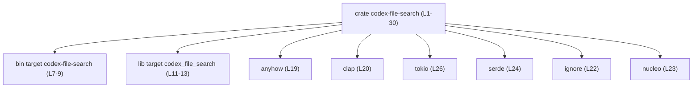
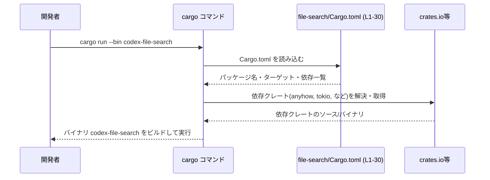

# file-search/Cargo.toml コード解説

## 0. ざっくり一言

`file-search/Cargo.toml` は、`codex-file-search` クレートの **パッケージ情報・バイナリ／ライブラリターゲット・依存クレート** を定義する Cargo マニフェストファイルです（Cargo.toml:L1-30）。

---

## 1. このモジュールの役割

### 1.1 概要

- このファイルは Rust のビルドツール `cargo` が読む設定ファイルで、`codex-file-search` クレートの構成を定義します（Cargo.toml:L1-5）。
- CLI バイナリ `codex-file-search`（`src/main.rs`）とライブラリ `codex_file_search`（`src/lib.rs`）の 2 つのターゲットを持つクレートであることを示します（Cargo.toml:L7-13）。
- エラー処理・CLI 引数パース・ファイル走査・シリアライズ・非同期/並行処理などのための依存クレートを、ワークスペース共通設定として宣言しています（Cargo.toml:L18-26）。

### 1.2 アーキテクチャ内での位置づけ

この Cargo.toml は、ワークスペース内にある `codex-file-search` クレートのマニフェストであり、クレート全体のビルド単位と依存関係のハブとして機能します。

- パッケージ全体の基本情報: `[package]`（Cargo.toml:L1-5）
- 実行可能バイナリ: `[[bin]] name = "codex-file-search"`（Cargo.toml:L7-9）
- 再利用可能なライブラリ: `[lib] name = "codex_file_search"`（Cargo.toml:L11-13）
- 共通依存クレート: `[dependencies]`（Cargo.toml:L18-26）
- テストや開発補助用: `[dev-dependencies]`（Cargo.toml:L28-30）

依存関係の関係性を簡略化した図は次のとおりです。



> 補足: `[dependencies]` はクレート全体に適用されるため、実際にはバイナリ・ライブラリ両方から利用可能です。ただし、このチャンクには `src/main.rs` / `src/lib.rs` のコードがないため、どの依存クレートが実際に使われているかは分かりません。

### 1.3 設計上のポイント

- **ワークスペース集中管理**  
  - パッケージの `version`・`edition`・`license` はワークスペース側で一括定義されており、このクレートでは `*.workspace = true` で参照のみ行います（Cargo.toml:L3-5）。
  - 依存クレートもすべて `{ workspace = true }` としており、バージョンや詳細設定はワークスペースルートの Cargo.toml に集約されています（Cargo.toml:L19-26, L29-30）。

- **バイナリ + ライブラリ構成**  
  - CLI ツールとしての実行ファイル（`codex-file-search`）と、ロジックを切り出したライブラリ（`codex_file_search`）を分離できる構成になっています（Cargo.toml:L7-13）。

- **並行・非同期処理の利用可能性**  
  - `tokio`（非同期ランタイム）と `crossbeam-channel`（スレッド間チャネル）に依存するよう設定されているため、非同期タスクやマルチスレッドメッセージングに基づく並行処理を実装できる状態です（Cargo.toml:L21, L26）。
  - 実際にどう使っているかは、このチャンクには現れません。

- **静的解析 / Lint の共通設定**  
  - `[lints] workspace = true` により、コンパイラの警告ポリシーなどはワークスペース側で統一的に管理されます（Cargo.toml:L15-16）。

---

## 2. 主要な機能一覧（Cargo.toml が提供する役割）

ここでは、このファイルがクレートに対して提供している「機能」を箇条書きで整理します。

- パッケージメタデータ定義: クレート名やバージョン・エディション・ライセンスをワークスペースから参照する（Cargo.toml:L1-5）。
- バイナリターゲット定義: `codex-file-search` バイナリと、そのエントリポイント `src/main.rs` を宣言する（Cargo.toml:L7-9）。
- ライブラリターゲット定義: `codex_file_search` ライブラリと、そのルート `src/lib.rs` を宣言する（Cargo.toml:L11-13）。
- Lint 設定の委譲: 警告/エラー方針をワークスペース共通設定に委譲する（Cargo.toml:L15-16）。
- 共通依存クレートの宣言: エラー処理（`anyhow`）、CLI パース（`clap`）、並行処理（`crossbeam-channel`）、ファイル探索（`ignore`）、検索アルゴリズム（`nucleo`）、シリアライズ（`serde` / `serde_json`）、非同期ランタイム（`tokio`）を利用可能にする（Cargo.toml:L18-26）。
- 開発用依存クレートの宣言: テスト時のアサーション改善（`pretty_assertions`）や一時ファイル操作（`tempfile`）を利用可能にする（Cargo.toml:L28-30）。

---

## 3. 公開 API と詳細解説

### 3.1 型一覧の代わり: コンポーネントインベントリー

このファイル自体は **関数や構造体を定義しない** 設定ファイルです。そのため、ここでは代わりに「ビルドターゲット」と「依存クレート」のインベントリーを示します。

#### ビルドターゲット一覧

| 名前                | 種別 | 役割 / 用途                                           | 定義箇所                  |
|---------------------|------|--------------------------------------------------------|---------------------------|
| `codex-file-search` | bin  | CLI ツールの実行可能バイナリ。エントリポイントは `src/main.rs` | Cargo.toml:L7-9           |
| `codex_file_search` | lib  | ファイル検索ロジックなどをまとめるライブラリクレート         | Cargo.toml:L11-13         |

> 補足: ライブラリ名はパッケージ名に対応しますが、このクレートでは `-` から `_` への変換を明示的に指定しています（Cargo.toml:L2, L12）。

#### 依存クレート一覧（共通）

| 名前               | 種別           | 役割 / 用途（一般的な用途）                                  | 定義箇所        |
|--------------------|----------------|---------------------------------------------------------------|-----------------|
| `anyhow`           | dependency     | エラー型をまとめて扱うための汎用エラー処理クレート           | Cargo.toml:L19  |
| `clap`             | dependency     | CLI 引数パーサ。`derive` 機能で構造体に引数定義を付与可能    | Cargo.toml:L20  |
| `crossbeam-channel`| dependency     | マルチスレッド間のメッセージング（チャネル）                 | Cargo.toml:L21  |
| `ignore`           | dependency     | `.gitignore` などを考慮したファイルツリー走査                 | Cargo.toml:L22  |
| `nucleo`           | dependency     | 高速な検索・スコアリング用途のライブラリ                     | Cargo.toml:L23  |
| `serde`            | dependency     | シリアライズ／デシリアライズ基盤。`derive` で自動実装可能     | Cargo.toml:L24  |
| `serde_json`       | dependency     | JSON 形式のシリアライズ／デシリアライズ                      | Cargo.toml:L25  |
| `tokio`            | dependency     | 非同期ランタイム。`full` 機能により主要コンポーネント一式を利用可能 | Cargo.toml:L26  |

#### 開発用依存クレート一覧

| 名前                | 種別           | 役割 / 用途                                      | 定義箇所        |
|---------------------|----------------|---------------------------------------------------|-----------------|
| `pretty_assertions` | dev-dependency | テスト失敗時に見やすい差分を表示するアサーション拡張 | Cargo.toml:L29  |
| `tempfile`          | dev-dependency | 一時ファイル／ディレクトリの生成・管理              | Cargo.toml:L30  |

> これらの依存クレートが実際にどのように使われているかは、このチャンクには現れません。ここでは、クレート一般の用途を記載しています。

### 3.2 設定セクション詳細（関数テンプレート相当）

このファイルには関数が存在しないため、代わりに主要な設定セクションを「関数詳細テンプレート」に相当する粒度で説明します。

#### `[package]` セクション（Cargo.toml:L1-5）

**概要**

- クレート全体の基本的なメタデータ（名前・バージョン・エディション・ライセンス）を定義します。
- バージョン・エディション・ライセンスはワークスペースから継承します。

**主なキー**

| キー                   | 値                          | 説明                                        | 根拠                     |
|------------------------|-----------------------------|---------------------------------------------|--------------------------|
| `name`                 | `"codex-file-search"`       | パッケージ名。クレートを一意に識別する      | Cargo.toml:L2           |
| `version.workspace`    | `true`                      | バージョンをワークスペースから取得する      | Cargo.toml:L3           |
| `edition.workspace`    | `true`                      | Rust edition をワークスペースから取得する   | Cargo.toml:L4           |
| `license.workspace`    | `true`                      | ライセンス表記をワークスペースから取得する  | Cargo.toml:L5           |

**Edge cases / 使用上の注意点**

- パッケージ名とライブラリ名は独立  
  - 通常、ライブラリ名はパッケージ名の `-` を `_` に変換したものになりますが、このクレートでは `[lib]` で明示的に指定しており、将来名前を変える場合は両方を同期させる必要があります（Cargo.toml:L2, L12）。
- ワークスペース依存  
  - `*.workspace = true` を使うため、ワークスペースルートの Cargo.toml に `version`・`edition`・`license` が定義されていないとビルドエラーになります。このチャンクにはワークスペースルートは現れません。

**Bugs/Security 観点**

- このセクション自体はセキュリティ機能を直接制御しませんが、ライセンスやエディションがワークスペースに依存するため、ワークスペース設定と整合しているかの確認が必要です。

---

#### `[[bin]]` セクション（Cargo.toml:L7-9）

**概要**

- 実行可能バイナリ `codex-file-search` のターゲットを定義します。

**主なキー**

| キー   | 値                   | 説明                               | 根拠             |
|--------|----------------------|------------------------------------|------------------|
| `name` | `"codex-file-search"`| 生成されるバイナリの名前           | Cargo.toml:L8    |
| `path` | `"src/main.rs"`      | エントリポイントとなるソースファイル | Cargo.toml:L9    |

**Edge cases / 使用上の注意点**

- `path` のファイル存在  
  - `src/main.rs` が存在しない場合、ビルドは失敗します。このチャンクには `src/main.rs` の内容や存在確認は含まれていません。
- 複数バイナリ  
  - このクレートで定義されている `[[bin]]` は 1 つだけです（Cargo.toml:L7-9）。追加したい場合は `[[bin]]` セクションを複数書く必要があります。

---

#### `[lib]` セクション（Cargo.toml:L11-13）

**概要**

- ライブラリクレート `codex_file_search` のターゲットを定義します。

**主なキー**

| キー   | 値                    | 説明                                  | 根拠             |
|--------|-----------------------|---------------------------------------|------------------|
| `name` | `"codex_file_search"` | ライブラリクレートの名前              | Cargo.toml:L12   |
| `path` | `"src/lib.rs"`        | ライブラリのルートソースファイル      | Cargo.toml:L13   |

**Edge cases / 使用上の注意点**

- クレート名とパス  
  - `src/lib.rs` が存在しない場合、ライブラリターゲットのコンパイルは失敗します（存在はこのチャンクからは不明）。
- バイナリとの関係  
  - 一般には `src/main.rs` から `codex_file_search` クレートを `use` してロジックを共有しますが、その実装があるかどうかは、このチャンクには現れません。

---

#### `[dependencies]` セクション（Cargo.toml:L18-26）

**概要**

- クレート共通で利用可能な依存クレートを宣言します。
- すべて `{ workspace = true }` としており、バージョンや一部の詳細設定はワークスペース側で指定されます。

**主なキー（クレート）**

上記「依存クレート一覧」と同じなので、ここでは特に特徴的なものだけ補足します。

- `clap` に `features = ["derive"]` を付与しており、構造体への属性マクロによる CLI 定義が可能です（Cargo.toml:L20）。
- `serde` に `features = ["derive"]` を付与しており、構造体・列挙体に `#[derive(Serialize, Deserialize)]` を付けてシリアライズ可能です（Cargo.toml:L24）。
- `tokio` に `features = ["full"]` を付与しており、TCP/UDP・ファイル I/O・タイマーなど、多くの非同期コンポーネントを利用可能な設定です（Cargo.toml:L26）。

**並行性・エラー処理の観点**

- エラー処理  
  - `anyhow` によって、関数の戻り値を `Result<T, anyhow::Error>` に統一し、さまざまなエラー型をまとめる実装が可能です（Cargo.toml:L19）。
- 非同期 / 並行処理  
  - `tokio` と `crossbeam-channel` に依存しており、非同期タスクとスレッド間メッセージングを組み合わせた並行処理を実装できる状態です（Cargo.toml:L21, L26）。  
    実際のパターン（例: `tokio::spawn` の使用有無）はこのチャンクには現れません。

**Edge cases / 使用上の注意点**

- ワークスペースバージョン依存  
  - 個別にバージョンが書かれていないため、ワークスペースルートでバージョンを変更すると、このクレートにも影響します。
- `tokio` の `full` 機能  
  - `full` は多くのサブコンポーネントを有効にするため、バイナリサイズ・コンパイル時間に影響する可能性があります。  
    これは一般論であり、このクレートがどの機能を実際に使っているかは、このチャンクには現れません。

**Bugs/Security 観点**

- 依存クレートの脆弱性  
  - セキュリティリスクは主に依存クレートのバージョンに起因しますが、本ファイルにはバージョンが明示されておらず、ワークスペース側の定義に依存します（Cargo.toml:L19-26）。  
    実際のバージョンや既知の脆弱性の有無は、このチャンクからは分かりません。

### 3.3 その他の設定セクション

| セクション名   | 役割（1 行）                                             | 定義箇所          |
|----------------|----------------------------------------------------------|-------------------|
| `[lints]`      | コンパイラ警告・lint 設定をワークスペースから継承する   | Cargo.toml:L15-16 |
| `[dev-dependencies]` | テストや開発補助にのみ使われる依存クレートを定義 | Cargo.toml:L28-30 |

---

## 4. データフロー

このファイル自身は実行時の処理を持ちませんが、**ビルド・実行時に Cargo がどのようにこのファイルを利用するか** という観点でデータフローを示します。

### 4.1 Cargo によるビルドフロー



- `[[bin]]` セクションの `name = "codex-file-search"` により、`cargo run --bin codex-file-search` でこのターゲットが選択されます（Cargo.toml:L7-9）。
- `[dependencies]` セクションで列挙されたクレートは、コンパイル時に解決され、コードで `use` されていればリンクされます（Cargo.toml:L18-26）。
- `[dev-dependencies]` のクレートは、通常 `cargo test` 等のときにのみ利用されます（Cargo.toml:L28-30）。

---

## 5. 使い方（How to Use）

### 5.1 基本的な使用方法（開発者視点）

この Cargo.toml を前提に、開発者が行う典型的な操作は以下のとおりです。

```bash
# CLI バイナリをビルドして実行
cargo run --bin codex-file-search

# テストを実行（dev-dependencies が利用される可能性がある）
cargo test

# ライブラリクレートとして他プロジェクトから利用する（ワークスペース外の場合）
# Cargo.toml の dependencies に path または git を追加する側の操作が必要
```

> 実際のコマンドの挙動（どのような CLI 引数を受け付けるかなど）は `src/main.rs` / `src/lib.rs` の内容によりますが、このチャンクにはそれらのコードは含まれていません。

### 5.2 よくある使用パターン（Cargo.toml 編集例）

#### 依存クレートを 1 つ追加する（一般例）

次のように、このファイルに追記することで新しい依存クレートを追加できます。

```toml
[dependencies]
anyhow = { workspace = true }
# ...既存の依存...
tokio = { workspace = true, features = ["full"] }

# 新規に async-trait を追加する例（一般例）
async-trait = "0.1"
```

> 現在のファイルでは、既存の依存はすべて `{ workspace = true }` を利用しているため、一般的にはワークスペース側のポリシーに合わせるのが自然です。

#### 新しいバイナリを追加する（一般例）

```toml
[[bin]]
name = "codex-file-search"
path = "src/main.rs"

# 新しいバイナリターゲットを追加する例（一般例）
[[bin]]
name = "codex-file-search-debug"
path = "src/debug_main.rs"
```

> このクレートでは現在 `[[bin]]` が 1 つのみ定義されています（Cargo.toml:L7-9）。追加のバイナリを追加する場合は、`src/debug_main.rs` のような対応するファイルを用意する必要があります。

### 5.3 よくある間違い（一般論）

```toml
# 間違い例: バイナリ path と実ファイル名が一致していない
[[bin]]
name = "codex-file-search"
path = "src/app.rs"  # 実際には main.rs しか存在しないとビルドエラーになる

# 正しい例: 実在するファイルを指定する
[[bin]]
name = "codex-file-search"
path = "src/main.rs"
```

```toml
# 間違い例: ワークスペース方針と異なるバージョンを個別指定してしまう
[dependencies]
anyhow = "1.0"  # ワークスペースでは別バージョンを使っている可能性

# このクレートの方針に合わせる例
[dependencies]
anyhow = { workspace = true }
```

> 上記は一般的な誤用例であり、実際にこのリポジトリで発生しているかどうかは、このチャンクからは分かりません。

### 5.4 使用上の注意点（まとめ）

- **ワークスペース依存**  
  - バージョンや lint 設定をほぼすべてワークスペースに委譲しているため、変更はワークスペースルートの Cargo.toml 側で行うことが多くなります（Cargo.toml:L3-5, L15-16, L19-26, L29-30）。
- **並行・非同期ライブラリの選定**  
  - `tokio` と `crossbeam-channel` を同時に依存に持つため、実装側では「非同期タスク」と「スレッド間メッセージング」のどちらを使うか（あるいは両方か）を意識する必要があります。  
    ただし、どの方式が採用されているかはこのチャンクには現れません。
- **テスト用依存の利用範囲**  
  - `pretty_assertions` や `tempfile` は dev-dependency であり、本番コードから直接使うことは想定されません（Cargo.toml:L28-30）。本番コードで使用している場合は注意が必要です。

---

## 6. 変更の仕方（How to Modify）

### 6.1 新しい機能を追加する場合（Cargo.toml 観点）

新しいファイル検索機能などを実装する際、このファイルに対して考えられる変更は次のようになります。

1. **必要な依存クレートの追加**  
   - 例: 新しいフォーマットの設定ファイルを読みたい場合、対応するパーサクレートを `[dependencies]` に追加する（一般例）。
   - 一般的にはワークスペース側の方針に合わせて `{ workspace = true }` またはバージョン明示を選択します。

2. **新しいバイナリターゲットの追加**  
   - デバッグ用 / 実験的な CLI を追加したい場合、`[[bin]]` セクションを追加し、別の `path` を指すようにします（一般例）。

3. **ライブラリ名・パスの調整**  
   - ライブラリ構造の変更（`src/` 以下の構成変更）が必要な場合、`[lib]` の `path` を変更します（Cargo.toml:L11-13）。

> 実際にどの関数・モジュールを変更すべきかは `src/lib.rs` やその配下のコードによりますが、本チャンクにはそれらは現れません。

### 6.2 既存の機能を変更する場合（注意点）

- **依存クレートの削除・更新**  
  - ある依存クレートを削除する場合、`src/` 以下のコードで `use` していないかを確認する必要があります。
  - ワークスペースのバージョン更新は、他クレートへの影響もあるため、ワークスペース全体で検討する必要があります。

- **ターゲット名の変更**  
  - `[[bin]] name` を変更すると、`cargo run --bin` で指定する名前も変わります（Cargo.toml:L8）。
  - CI やドキュメントなどで古い名前を参照していないか確認する必要があります。

- **Contracts / Edge Cases（設定上の契約）**  
  - `path` に指定したファイルが存在すること（Cargo.toml:L9, L13）。
  - ワークスペースルートの設定と整合していること（`*.workspace = true` に対応するキーが存在すること）。

- **Tests**  
  - `dev-dependencies` を変更した場合、これを利用しているテストコード（一般には `tests/` ディレクトリや `src/lib.rs` 内の `#[cfg(test)]` モジュール）を再確認する必要があります。このチャンクにはテストコードは現れません。

---

## 7. 関連ファイル

この Cargo.toml から直接参照されている、関係の深いファイル・設定は次のとおりです。

| パス / 名称                        | 役割 / 関係                                                                 | 根拠                        |
|------------------------------------|-------------------------------------------------------------------------------|-----------------------------|
| `src/main.rs`                     | バイナリターゲット `codex-file-search` のエントリポイント。CLI ロジックなど | Cargo.toml:L7-9             |
| `src/lib.rs`                      | ライブラリクレート `codex_file_search` のルート。ファイル検索ロジックなど   | Cargo.toml:L11-13           |
| ワークスペースルートの `Cargo.toml`（パス不明） | `version`・`edition`・`license`・依存クレートの実バージョン・lint 設定を定義 | Cargo.toml:L3-5, L15-16, L19-26, L29-30 |

> `src/main.rs` および `src/lib.rs` の具体的な内容、ワークスペースルートの設定内容は、このチャンクには現れないため不明です。
