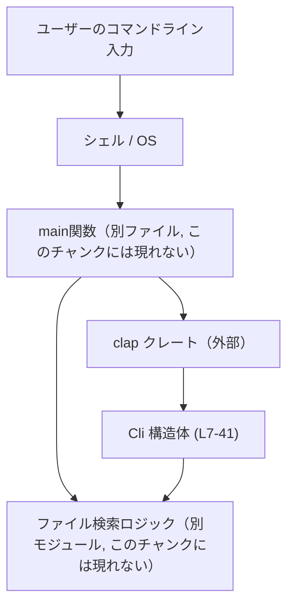
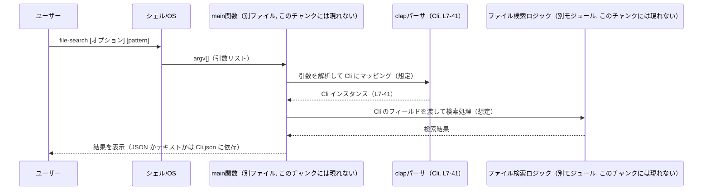

# file-search/src/cli.rs コード解説

## 0. ざっくり一言

`file-search` コマンドの **コマンドライン引数（CLI オプション）を宣言するための構造体 `Cli`** を、`clap` の derive マクロで定義しているファイルです（`file-search/src/cli.rs:L7-41`）。

---

## 1. このモジュールの役割

### 1.1 概要

- このモジュールは、**ファジーにファイル名を検索するコマンド**のための **CLI 設定コンテナ `Cli`** を提供します（`file-search/src/cli.rs:L7-10`）。
- 出力形式（JSON/テキスト）、結果件数の上限、検索ディレクトリ、ワーカースレッド数、除外パターン、検索パターンなどを 1 つの構造体にまとめています（`file-search/src/cli.rs:L11-41`）。
- 実際の検索処理・スレッド生成などは別モジュール側に委ねられており、このファイルは **設定値の受け渡しの境界** を担います。

### 1.2 アーキテクチャ内での位置づけ

このファイルに含まれる情報から読み取れる依存関係は以下の通りです。

- `Cli` は外部クレート `clap` の `Parser` 派生を利用して、コマンドライン引数との対応付けを行う意図になっています（`file-search/src/cli.rs:L4-5, L8-9`）。
- `Cli` のフィールド型として、標準ライブラリの `NonZero` と `PathBuf` を利用しています（`file-search/src/cli.rs:L1-2, L17, L21, L34`）。
- `Cli` を実際にどこから呼び出すか（`main` 関数や検索ロジックの所在）は、このチャンクには現れません。



- `Cli 構造体 (L7-41)` がこのチャンクの中心コンポーネントです。

### 1.3 設計上のポイント（コードから読み取れる範囲）

- **clap の derive ベースの CLI 設定**
  - `#[derive(Parser)]` により、`Cli` は `clap::Parser` トレイトを実装するように指定されています（`file-search/src/cli.rs:L4-5, L8`）。
  - `#[command(version)]` により、バージョン情報オプションを自動生成する指定が含まれます（`file-search/src/cli.rs:L9`）。

- **型による不正値の防止**
  - `limit` と `threads` が `NonZero<usize>` で定義されており、**0 を許容しないスレッド数・件数上限**を型レベルで表現しています（`file-search/src/cli.rs:L16-17, L32-34`）。

- **オプション/繰り返し引数の明示**
  - `cwd` と `pattern` は `Option` で定義され、**指定されない場合がある**ことを表現しています（`file-search/src/cli.rs:L20-21, L40-41`）。
  - `exclude` は `Vec<String>` かつ `ArgAction::Append` で、**複数回指定可能な除外パターン**として設計されています（`file-search/src/cli.rs:L36-38`）。

- **並行性に関する考慮**
  - `threads` のコメントから、I/O がボトルネックであるため論理 CPU 数ではなく **少数スレッド（デフォルト 2）** を使う設計方針が読み取れます（`file-search/src/cli.rs:L27-33`）。

---

## 2. 主要な機能一覧

このファイルが提供する主要な機能（= CLI 設定項目）は以下の通りです（すべて `Cli` 構造体のフィールドとして表現）。

- JSON 出力フラグ: `--json` で結果を JSON 形式で出力するかどうかを指定（`L11-13`）。
- 検索結果件数の上限: `--limit` / `-l` で返す結果数の最大値を指定（`L15-17`）。
- 検索ディレクトリ: `--cwd` / `-C` でどのディレクトリ以下を検索するかを指定（`L19-21`）。
- インデックス計算フラグ: `--compute-indices` でマッチしたファイルインデックスを出力に含めるかどうかを指定（`L23-25`）。
- ワーカースレッド数: `--threads` で検索処理に使用するスレッド数を指定（`L27-34`）。
- 除外パターン: `--exclude` / `-e` を複数回指定して、除外するパターンを列挙（`L36-38`）。
- 検索パターン: 位置引数 `pattern` として、検索文字列を受け取る（`L40-41`）。

---

## 3. 公開 API と詳細解説

### 3.1 型一覧（構造体）

| 名前 | 種別 | 公開範囲 | 役割 / 用途 | 定義位置 |
|------|------|----------|-------------|----------|
| `Cli` | 構造体 | `pub` | コマンドライン引数から得られる検索設定一式（出力形式、件数上限、ディレクトリ、スレッド数など）を保持するコンテナ | `file-search/src/cli.rs:L7-41` |

#### 3.1.1 `Cli` フィールド一覧（コンポーネントインベントリー）

| 親型 | フィールド名 | 型 | 公開? | CLI オプション / 位置 | 概要 | 定義位置 |
|------|--------------|----|-------|------------------------|------|----------|
| `Cli` | `json` | `bool` | `pub` | `--json`（長いオプション） | 結果を JSON 形式で出力するかどうかのフラグ。デフォルトは `"false"`（文字列として指定） | `L11-13` |
| `Cli` | `limit` | `NonZero<usize>` | `pub` | `--limit`, `-l` | 返す結果件数の上限。0 は型的に禁止され、デフォルトは `"64"` | `L15-17` |
| `Cli` | `cwd` | `Option<PathBuf>` | `pub` | `--cwd`, `-C` | 検索の起点とするディレクトリ。指定がなければ `None` となり、後続ロジック側で解釈される | `L19-21` |
| `Cli` | `compute_indices` | `bool` | `pub` | `--compute-indices` | 出力にマッチしたファイルのインデックスを含めるかどうかのフラグ。デフォルト `"false"` | `L23-25` |
| `Cli` | `threads` | `NonZero<usize>` | `pub` | `--threads` | 検索で使用するワーカースレッド数。I/O ボトルネックを考慮してデフォルト `"2"` に設定されている | `L27-34` |
| `Cli` | `exclude` | `Vec<String>` | `pub` | `--exclude`, `-e`（複数回指定可, `ArgAction::Append`） | 検索から除外するパターンのリスト。指定回数だけ要素が追加される | `L36-38` |
| `Cli` | `pattern` | `Option<String>` | `pub` | 位置引数（名前付きオプションではない） | ファイル名をファジー検索するための検索パターン。存在しない場合 `None` | `L40-41` |

> 備考: CLI 上のオプション名やデフォルト値は `clap` の属性マクロから読み取れるものであり、実際のパース・検証処理は `clap` クレート側に実装されています（`L4-5, L8-9`）。  

### 3.2 関数詳細

このファイルには **手書きの関数定義は存在しません**。

- `#[derive(Parser)]` により `Cli` に対して `clap::Parser` トレイト実装が生成されることが想定されますが、その具体的なメソッド（例: `parse`）やシグネチャは、このチャンク内には現れません（`file-search/src/cli.rs:L4-5, L8`）。
- そのため、「既存関数」に対してテンプレート形式で詳細を記述することは、このファイル単体からはできません。

代わりに、**各フィールドの契約とエッジケース**を後述の「使用上の注意点」で整理します（§5.4）。

### 3.3 その他の関数

- 補助関数やラッパー関数は、このファイルには定義されていません。

---

## 4. データフロー

このファイル単体には処理ロジックは含まれていませんが、`Cli` の役割から **想定される典型的なデータフロー**を示します（`main` 関数や検索ロジックの具体的な実装はこのチャンクには現れません）。

1. ユーザーがシェル上で `file-search` コマンドを、さまざまなオプション付きで実行する。
2. OS/シェルが引数リスト（`argv`）をプログラムに渡す。
3. 別ファイルで定義されている `main` 関数が、`clap` の機構を通じて `Cli` にパースする（想定）。
4. 生成された `Cli` インスタンスが、ファイル検索ロジックに渡され、フィールド値に応じて挙動（スレッド数・出力形式・除外パターンなど）が決まる。



> 注意: `main` やファイル検索ロジックの実装はこのチャンクには現れないため、上記は **設計意図を推測したフロー**であり、実際の実装と完全に一致するかどうかはコードから断定できません。

---

## 5. 使い方（How to Use）

### 5.1 基本的な使用方法（Rust コード側）

`Cli` は `clap::Parser` を derive しているため、典型的には以下のような `main` 関数から利用することが想定されます（これは**利用例**であり、このレポジトリに必ず存在するコードではありません）。

```rust
use clap::Parser;              // clap::Parser トレイトをインポートする  // file-search/src/cli.rs:L4
use crate::cli::Cli;           // 同じクレート内の cli モジュールから Cli をインポートすると仮定

fn main() {
    // コマンドライン引数を Cli 構造体にパースする（clap の一般的な使い方の例）
    let cli = Cli::parse();    // Parser トレイト由来の parse メソッドを呼び出す（想定）

    // 以降、Cli の各フィールドを使って処理を制御する（利用例）
    if cli.json {
        // JSON 形式で出力する処理へ分岐
    }

    // cli.limit, cli.cwd, cli.threads なども自由に参照可能
}
```

### 5.2 よくある使用パターン（CLI レベルの例）

以下は CLI からの呼び出し例であり、`Cli` のフィールドにどのようにマッピングされるかのイメージです。

```text
# デフォルト設定（カレントディレクトリ, limit=64, threads=2）
file-search "pattern"

# JSON で出力し、最大 10 件、2 スレッドで検索
file-search --json --limit 10 --threads 2 "pattern"

# 特定ディレクトリを起点にし、除外パターンを複数指定
file-search -C /path/to/dir -e "target" -e ".git" "pattern"

# マッチしたファイルインデックスも計算して出力
file-search --compute-indices "pattern"
```

> これらのコマンドが実際にどのように動作するか（例: `cwd` 未指定時の扱いなど）は、後続の検索ロジック側の実装に依存し、このチャンクからは分かりません。

### 5.3 よくある間違い（と想定される挙動）

このファイルから読み取れる型制約に基づいて、起こり得る誤用例を挙げます。

```text
# （誤用例の可能性）0 を指定したスレッド数
file-search --threads 0 "pattern"

# （誤用例の可能性）0 を指定した limit
file-search --limit 0 "pattern"
```

- `threads` と `limit` はどちらも `NonZero<usize>` のため、**0 は型の制約に反する値**です（`file-search/src/cli.rs:L16-17, L32-34`）。
- 実際に `0` を指定したときの挙動（パースエラーで終了するかどうか）は `clap` と `NonZero` の実装に依存し、このファイルだけからは断定できませんが、**エラー扱いになる可能性が高い**ことは示唆されます。

### 5.4 使用上の注意点（契約・エッジケース・安全性）

このモジュール全体について、コードから読み取れる前提条件・エッジケース・安全性の観点をまとめます。

#### 契約・前提条件（Contracts）

- `limit` / `threads`  
  - いずれも `NonZero<usize>` であり、**0 を取り得ないことが型レベルの契約**です（`file-search/src/cli.rs:L16-17, L32-34`）。
  - 呼び出し側（検索ロジック）は、「limit ≥ 1」「threads ≥ 1」が常に成り立つ前提で実装できるはずです。

- `cwd`  
  - 型が `Option<PathBuf>` であるため、**`None` の場合は「デフォルトの作業ディレクトリ」を意味する**ような扱いになることが想定されますが、具体的な意味付けは後続ロジックに依存し、このファイルからは分かりません（`file-search/src/cli.rs:L19-21`）。

- `pattern`  
  - `Option<String>` であり、**検索パターンなし（`None`）も許容されている**ことが分かります（`file-search/src/cli.rs:L40-41`）。
  - その場合に何をするか（標準入力から読むなど）は、このチャンクには現れません。

#### エッジケース

- `exclude` が空 (`Vec::is_empty() == true`) の場合  
  - 単に除外パターンが 0 件であることを表し、特別な扱いは必要ない前提で設計されています（`file-search/src/cli.rs:L36-38`）。
- オプション未指定時
  - `json` / `compute_indices`: `default_value = "false"` により `false` になる（`file-search/src/cli.rs:L12-13, L24-25`）。
  - `limit`: デフォルトで `NonZero<usize>` に変換可能な `"64"` が与えられている（`L16-17`）。
  - `threads`: 同様に `"2"` がデフォルト（`L32-34`）。
  - `cwd` / `pattern`: 指定しなければ `None` になると考えられますが、これは `clap` の標準的な挙動に依存します。

#### 安全性・エラー・並行性

- メモリ安全性
  - このファイルにはポインタ操作や unsafe ブロックはなく、すべて安全な標準型・外部クレートを用いた宣言のみです（`file-search/src/cli.rs` 全体）。
- エラー
  - CLI の値が正しい型・制約に合わない場合（`NonZero` に 0 を渡すなど）、パース時にエラーが発生し得ますが、そのメッセージや終了コードは `clap` の挙動に依存し、このチャンクには現れません。
- 並行性
  - `threads: NonZero<usize>` と、コメントにおける I/O ボトルネックの説明から、**スレッドプールのサイズを CLI から制御する設計**であることが読み取れます（`file-search/src/cli.rs:L27-34`）。
  - 実際のスレッド生成や同期処理は別モジュール側にあり、このファイルには現れません。

---

## 6. 変更の仕方（How to Modify）

### 6.1 新しい機能（CLI オプション）を追加する場合

1. **フィールド追加**
   - `pub struct Cli` に新しいフィールドを追加します（`file-search/src/cli.rs:L10-41`）。
   - 例: フラグなら `bool`、数値なら `usize` や `NonZero<usize>`、文字列なら `String` / `PathBuf` など。

2. **clap 属性の付与**
   - 新フィールドの直前に `#[clap(...)]` または `#[arg(...)]` を付け、オプション名・短縮形・デフォルト値・アクションなどを指定します（既存フィールドの指定を参考にする: `L12, L16, L20, L24, L33, L37`）。

3. **後続ロジック側の対応**
   - 追加フィールドを利用する検索ロジックや出力処理側のコード（別ファイル）で、新しい設定値を参照するよう修正する必要があります。
   - どのファイルにロジックがあるかはこのチャンクには現れないため、別途リポジトリ全体を検索して `Cli` の利用箇所を確認する必要があります。

### 6.2 既存の機能（フィールド）を変更する場合

- **型の変更**
  - 例: `NonZero<usize>` → `usize` などに変更する場合は、後続ロジックが「必ず 1 以上である」という前提で書かれていないかを確認する必要があります（契約変更）。
- **オプション名の変更**
  - `#[clap(long = "...", short = '...')]` などの属性を変更すると CLI 互換性が失われるため、既存のユーザー向けの互換性要件があるかどうかを確認する必要があります。
- **デフォルト値の変更**
  - `limit` や `threads` のデフォルト値を変える場合、性能やユーザー期待値に影響します（`file-search/src/cli.rs:L16-17, L32-34`）。
  - コメントに書かれている設計上の理由（「I/O がボトルネックなので 2 スレッドが効率的」など）と整合するかも要確認です（`L27-30`）。

---

## 7. 関連ファイル

このモジュールと密接に関係すると考えられるファイル・コンポーネントを、コードから分かる範囲と推測レベルを分けて整理します。

| パス / コンポーネント | 役割 / 関係 |
|-----------------------|------------|
| `file-search/src/cli.rs` | 本レポートで説明しているファイル。`Cli` 構造体を定義し、CLI 引数とプログラム内部設定の橋渡しを行う。 |
| `clap` クレート（外部依存） | `#[derive(Parser)]` と属性マクロの提供元。`Cli` に対するコマンドライン引数パース処理をコンパイル時に生成する（`file-search/src/cli.rs:L4-5, L8-9`）。 |
| `std::path` / `std::num`（標準ライブラリ） | `PathBuf` と `NonZero<usize>` の定義元。CLI から受け取った値の型表現として利用される（`file-search/src/cli.rs:L1-2, L17, L21, L34`）。 |
| （不明：別ファイル） | 実際に `Cli` を使ってファイル検索を行うロジック・`main` 関数を含むモジュール。**このチャンクには現れない**ため、正確なパスはコードからは特定できません。 |

---

### Bugs / Security / Tests / 性能 についての補足（このファイルに限定した観点）

- **潜在的なバグ源**
  - このファイルは宣言のみで、副作用を伴う処理はありません。バグが生じるとすれば、後続ロジック側が `Cli` のフィールド意味を取り違えるケースです（例えば `limit` を「0 もありえる」と誤解するなど）。
- **セキュリティ**
  - 入力はすべて CLI 文字列であり、このファイル自体にはファイル I/O や OS コマンド実行などの処理はありません。そのため、セキュリティ上の懸念はこのファイル単体からは見えません。
- **テスト**
  - このチャンクにはユニットテストや統合テストの記述は含まれていません。`Cli` の動作確認は通常、`clap` によるパース結果を検証するテスト（別ファイル）で行うことが多いですが、その有無はここからは分かりません。
- **性能 / スケーラビリティ**
  - CLI パース自体は軽量であり、このファイルの宣言が性能ボトルネックになることは通常ありません。
  - コメントにある通り、I/O を伴うファイルツリー走査がボトルネックと想定されており、それに合わせて `threads` のデフォルトが小さめ（2）に設定されています（`file-search/src/cli.rs:L27-34`）。
