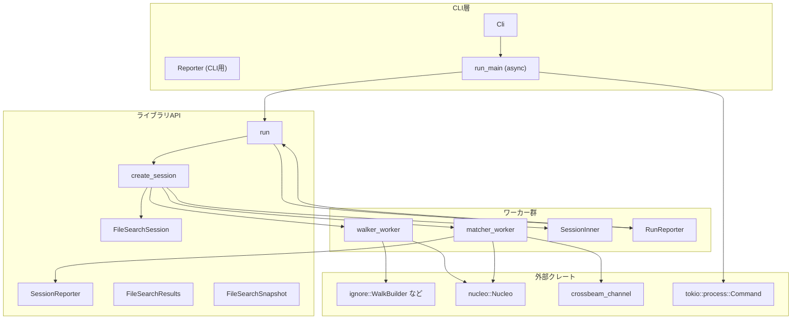
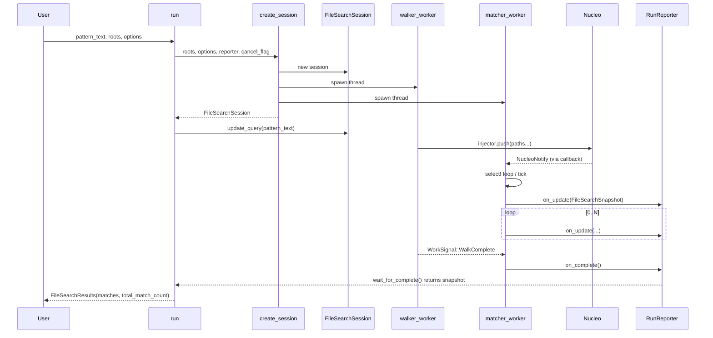

# file-search/src/lib.rs

## 0. ざっくり一言

`nucleo` と `ignore` クレートを用いて、ディレクトリツリーを非同期に走査しつつファジーマッチでファイル／ディレクトリを検索するライブラリです。  
CLI フロントエンド向けの同期 API（`run` / `run_main`）と、インクリメンタル検索向けのセッション API（`FileSearchSession`）を提供します。  
（本説明の根拠コード範囲: `lib.rs:L1-1068`）

---

## 1. このモジュールの役割

### 1.1 概要

- このモジュールは **ファイルシステムを横断的に走査し、クエリ文字列に対するファジーマッチ結果を返す** ために存在します。
- 提供機能:
  - コマンドラインからの一発検索（`run_main` / `run`）
  - 状態を保持する検索セッション（`create_session` / `FileSearchSession`）
  - 検索結果のスコア・種類（ファイル/ディレクトリ）・ハイライト用インデックスの取得
  - `.gitignore` 等の無視ルールの制御

（根拠: `FileMatch`, `FileSearchSession`, `create_session`, `run_main`, `run` 定義より — `lib.rs:L1-1068`）

### 1.2 アーキテクチャ内での位置づけ

主要コンポーネントと依存関係は概ね次のようになっています。



（範囲: 本ファイル全体 `lib.rs:L1-1068`。`Cli` 本体は `mod cli;` のためこのチャンクには現れません。）

### 1.3 設計上のポイント

- **責務分割**
  - ファイルツリー走査: `walker_worker`（`ignore::WalkBuilder` を利用）
  - マッチングとデバウンス: `matcher_worker`（`nucleo::Nucleo` + `crossbeam_channel`）
  - API 表面: `run`, `run_main`, `create_session`, `FileSearchSession`
  - 同期待ち合わせ: `RunReporter`（`SessionReporter` 実装＋`RwLock` + `Condvar`）
- **状態管理**
  - 検索セッション状態は `SessionInner` を `Arc` で共有し、スレッドから参照
  - キャンセルフラグは外部注入可能な `Arc<AtomicBool>` と、セッション専用 `shutdown: Arc<AtomicBool>` の二系統
- **並行性**
  - ディレクトリ走査は `ignore::WalkBuilder::build_parallel` によるスレッドプール
  - マッチングは専用スレッド（`matcher_worker`）で `crossbeam_channel::select!` によるイベント駆動
  - セッション API はスレッドセーフな `SessionReporter: Send + Sync + 'static` を介して更新を通知
- **エラーハンドリング**
  - 公開 API は `anyhow::Result` を返却（`create_session`, `run_main`, `run`）
  - 一部の I/O／外部コマンドは `?` 演算子で早期リターン
  - 走査中の個々の `ignore::DirEntry` エラーは無視し、ウォークは継続

---

## 2. 主要な機能一覧（コンポーネントインベントリー）

### 2.1 公開型・トレイト・関数一覧

| 名前 | 種別 | 公開 | 役割 / 用途 | 根拠 |
|------|------|------|-------------|------|
| `Cli` | 構造体 | `pub use` | CLI オプションを表す。定義は `cli` モジュールにあり、このチャンクには現れない。 | `lib.rs:L1-1068` |
| `FileMatch` | 構造体 | `pub` | 1 件のマッチ結果（スコア, 相対パス, 種類, ルート, マッチインデックス） | `lib.rs:L1-1068` |
| `MatchType` | enum | `pub` | マッチ対象がファイルかディレクトリかを区別 | `lib.rs:L1-1068` |
| `FileSearchResults` | 構造体 | `pub` | `run` の結果: マッチ一覧と総マッチ件数 | `lib.rs:L1-1068` |
| `FileSearchSnapshot` | 構造体 | `pub` | セッション中のスナップショット（クエリ, matches, 走査状況など） | `lib.rs:L1-1068` |
| `FileSearchOptions` | 構造体 | `pub` | 検索設定: limit, exclude パターン, スレッド数, インデックス計算, gitignore 尊重 | `lib.rs:L1-1068` |
| `SessionReporter` | トレイト | `pub` | セッション型 API のコールバック（更新・完了通知） | `lib.rs:L1-1068` |
| `FileSearchSession` | 構造体 | `pub` | セッションベース検索のハンドル。`update_query` でクエリ更新。drop 時にシャットダウン。 | `lib.rs:L1-1068` |
| `Reporter` | トレイト | `pub` | CLI 用の同期レポータ（1件ずつ表示・警告） | `lib.rs:L1-1068` |
| `file_name_from_path` | 関数 | `pub` | パス文字列から末尾コンポーネント（ファイル名）を抽出 | `lib.rs:L1-1068` |
| `create_session` | 関数 | `pub` | ワーカーを立ち上げ `FileSearchSession` を生成 | `lib.rs:L1-1068` |
| `run_main` | 関数 (async) | `pub` | CLI エントリポイント。`Cli` を受け取り、結果を `Reporter` に出力 | `lib.rs:L1-1068` |
| `run` | 関数 | `pub` | 1 回のクエリに対する同期検索。`FileSearchResults` を返す | `lib.rs:L1-1068` |
| `cmp_by_score_desc_then_path_asc` | 関数 | `pub` | 「スコア降順・パス昇順」でソートするコンパレータを生成 | `lib.rs:L1-1068` |

### 2.2 内部コンポーネント一覧（抜粋）

| 名前 | 種別 | 公開 | 役割 / 用途 | 根拠 |
|------|------|------|-------------|------|
| `SessionInner` | 構造体 | private | セッション共有状態（設定, ディレクトリ, フラグ, reporter など） | `lib.rs:L1-1068` |
| `WorkSignal` | enum | private | `matcher_worker` スレッドへの指示（クエリ更新, Nucleo 通知, 走査完了, 終了） | `lib.rs:L1-1068` |
| `build_override_matcher` | 関数 | private | `ignore::overrides::Override` を構築し、除外パターンを適用 | `lib.rs:L1-1068` |
| `get_file_path` | 関数 | private | 絶対パスから、最も深いルートに対する相対パス＋ルート index を計算 | `lib.rs:L1-1068` |
| `walker_worker` | 関数 | private | ディレクトリ走査し `Nucleo` にアイテムを注入 | `lib.rs:L1-1068` |
| `matcher_worker` | 関数 | private | `Nucleo` の tick/snapshot を監視し、`SessionReporter` にスナップショットを通知 | `lib.rs:L1-1068` |
| `RunReporter` | 構造体 | private | `run` 専用の `SessionReporter` 実装。Condvar で完了待ち合わせ | `lib.rs:L1-1068` |

テスト専用コンポーネント（`RecordingReporter` など）は §7 で簡単に触れます。

---

## 3. 公開 API と詳細解説

### 3.1 型一覧（構造体・列挙体など）

代表的な公開型のみ抜粋して整理します。

| 名前 | 種別 | フィールド / 概要 | 用途 |
|------|------|------------------|------|
| `FileMatch` | 構造体 | `score: u32`, `path: PathBuf`（検索ルートからの相対パス）, `match_type: MatchType`, `root: PathBuf`（ルートディレクトリ絶対パス）, `indices: Option<Vec<u32>>` | 1 件の検索結果を表現 |
| `MatchType` | enum | `File`, `Directory` | マッチ対象がファイルかディレクトリか |
| `FileSearchResults` | 構造体 | `matches: Vec<FileMatch>`, `total_match_count: usize` | `run` の戻り値 |
| `FileSearchSnapshot` | 構造体 | `query`, `matches`, `total_match_count`, `scanned_file_count`, `walk_complete` | セッション中の最新スナップショット（インクリメンタル検索の状態） |
| `FileSearchOptions` | 構造体 | `limit: NonZero<usize>`, `exclude: Vec<String>`, `threads: NonZero<usize>`, `compute_indices: bool`, `respect_gitignore: bool` | 検索挙動の設定 |
| `FileSearchSession` | 構造体 | `inner: Arc<SessionInner>`（private） | インクリメンタル検索セッションのハンドル |
| `SessionReporter` | トレイト | `fn on_update(&self, snapshot: &FileSearchSnapshot)`, `fn on_complete(&self)` | セッション結果の受け取り窓口 |
| `Reporter` | トレイト | `fn report_match`, `fn warn_matches_truncated`, `fn warn_no_search_pattern` | CLI 出力用インターフェース |

---

### 3.2 関数詳細（最大 7 件）

#### 1. `create_session(search_directories, options, reporter, cancel_flag) -> anyhow::Result<FileSearchSession>`

**概要**

- 指定されたディレクトリ群を対象に検索セッションを初期化し、ディレクトリ走査スレッド (`walker_worker`) とマッチングスレッド (`matcher_worker`) を起動します。
- 非同期にスナップショットを `SessionReporter` に通知します。

**引数**

| 引数名 | 型 | 説明 |
|--------|----|------|
| `search_directories` | `Vec<PathBuf>` | 検索ルートディレクトリのリスト。少なくとも 1 つ必要。 |
| `options` | `FileSearchOptions` | 検索設定（limit, exclude, threads, compute_indices, respect_gitignore）。 |
| `reporter` | `Arc<dyn SessionReporter>` | スナップショットと完了通知を受けるオブジェクト。`Send + Sync + 'static` 必須。 |
| `cancel_flag` | `Option<Arc<AtomicBool>>` | 外部からキャンセルを指示するフラグ。`None` の場合は新規に `false` 初期化。 |

**戻り値**

- `Ok(FileSearchSession)` – 検索セッションのハンドル。
- `Err(anyhow::Error)` – 主に引数不正（検索ディレクトリが空）や `build_override_matcher` のエラー時。

**内部処理の流れ**

1. `FileSearchOptions` を分解し、`limit`, `threads`, `compute_indices`, `respect_gitignore` を取得。
2. `search_directories.first()` が `None` なら `anyhow::bail!` でエラー。（最低 1 つ必要）
3. `build_override_matcher` で `exclude` パターンから `ignore::overrides::Override` を構築（なければ `None`）。
4. `crossbeam_channel::unbounded` でワーカー間通信用チャネルを作成（`work_tx`, `work_rx`）。
5. `Nucleo::new` で `nucleo` インスタンスを生成し、`notify` クロージャ経由で `WorkSignal::NucleoNotify` を飛ばす。
6. `SessionInner` を `Arc` で作成し、`search_directories`, オプション値, `cancelled` フラグなどを保持。
7. `matcher_worker` を新規スレッドで起動（`inner.clone()`, `work_rx`, `nucleo` を渡す）。
8. `walker_worker` を新規スレッドで起動（`inner.clone()`, `override_matcher`, `injector` を渡す）。
9. `FileSearchSession { inner }` を返却。

**Examples（使用例）**

```rust
use std::path::PathBuf;
use std::sync::Arc;
use std::sync::atomic::AtomicBool;
use file_search::{FileSearchOptions, create_session, SessionReporter, FileSearchSnapshot};

struct MyReporter;
impl SessionReporter for MyReporter {
    fn on_update(&self, snapshot: &FileSearchSnapshot) {
        println!("query={} matches={}", snapshot.query, snapshot.matches.len());
    }
    fn on_complete(&self) {
        println!("complete");
    }
}

fn main() -> anyhow::Result<()> {
    let roots = vec![PathBuf::from(".")];                 // カレントディレクトリを検索ルートにする
    let options = FileSearchOptions::default();           // デフォルトオプション
    let reporter = Arc::new(MyReporter);
    let cancel = Arc::new(AtomicBool::new(false));        // 外部キャンセル用フラグ

    let session = create_session(roots, options, reporter, Some(cancel))?;
    session.update_query("src");                          // クエリを投入
    // 実際のアプリではここで UI イベントループなどを回す
    Ok(())
}
```

**Errors / Panics**

- エラー条件:
  - `search_directories` が空の場合: `"at least one search directory is required"` で `Err` を返す。
  - `build_override_matcher` 内で `OverrideBuilder::add` / `build` が失敗した場合。
- パニック要因はこの関数内にはありません（`unwrap` 等なし）。

**Edge cases（エッジケース）**

- `exclude` が空: `build_override_matcher` は `Ok(None)` を返し、オーバーライドなしで走査。
- `cancel_flag` が `Some(flag)` かつ `flag` が既に `true`: ワーカーは比較的早期にキャンセルを検出し、`on_complete` のみ通知される可能性がある（マッチは 0 件）。

**使用上の注意点**

- `SessionReporter` は複数スレッドから呼ばれる可能性があるため、内部状態を持つ場合は自前で同期化が必要です。
- `cancel_flag` を複数セッションで共有する場合、あるセッションで `true` にすると、同じフラグを参照する他のセッションもキャンセルされます（`shutdown` と区別される点に注意）。  
  （テスト `dropping_session_does_not_cancel_siblings_with_shared_cancel_flag` で挙動確認）

---

#### 2. `FileSearchSession::update_query(&self, pattern_text: &str)`

**概要**

- 既存セッションに対してクエリ文字列を更新し、`nucleo` に再マッチングを促す軽量操作です。
- ディレクトリwalkは再利用され、インデックス済みのアイテムに対してクエリが掛け直されます。

**引数**

| 引数名 | 型 | 説明 |
|--------|----|------|
| `pattern_text` | `&str` | 新しい検索クエリ文字列 |

**戻り値**

- 返り値はありません。エラーは無視され、ワーカー側が `WorkSignal::QueryUpdated` を受理しなかった場合も呼び出し側に知らせません。

**内部処理の流れ**

1. `pattern_text.to_string()` で所有権付き String に変換。
2. `WorkSignal::QueryUpdated(query)` を `inner.work_tx.send()` で `matcher_worker` に送信。
3. `send` の戻り値は `let _ =` で破棄され、`Err`（チャネルクローズ）時も無視。

**Examples**

```rust
// `session` は既に `create_session` で作られているとする
session.update_query("foo");     // 最初のクエリ
session.update_query("foobar");  // 追加入力（matcher側ではインクリメンタルに扱われる）
```

**Errors / Panics**

- このメソッド内部でパニックは発生しません。
- チャネルが既にクローズしている場合 `send` は `Err` を返しますが、無視されます。

**Edge cases**

- 空文字列 `""` を渡した場合、`nucleo` 側がどのように解釈するかはこのコードからは不明ですが、クエリとして更新されます。
- セッションがほぼ終了（`matcher_worker` が終わりかけ）しているタイミングで呼び出しても、新しいクエリが反映されない可能性があります。

**使用上の注意点**

- `update_query` 自体は非常に軽量ですが、頻繁に呼び出すとそのたびに `nucleo.pattern.reparse` が走るため、過度な連打は避けるのが無難です。
- 結果は `SessionReporter::on_update` で受け取る前提で設計されています。同期的な結果取得には `run` を使用します。

---

#### 3. `run(pattern_text, roots, options, cancel_flag) -> anyhow::Result<FileSearchResults>`

**概要**

- 1 回の検索クエリに対して同期的に結果を取得する高水準 API です。
- 内部で `create_session` と `RunReporter` を使い、非同期セッションを同期インターフェースにラップしています。

**引数**

| 引数名 | 型 | 説明 |
|--------|----|------|
| `pattern_text` | `&str` | 検索クエリ |
| `roots` | `Vec<PathBuf>` | 検索ルートディレクトリ |
| `options` | `FileSearchOptions` | 検索設定 |
| `cancel_flag` | `Option<Arc<AtomicBool>>` | 外部キャンセルフラグ |

**戻り値**

- `Ok(FileSearchResults)` – 最終スナップショットの `matches` と `total_match_count` を格納。
- `Err(anyhow::Error)` – `create_session` でのエラーをそのまま返す。

**内部処理の流れ**

1. `RunReporter::default()` を `Arc` で包み、`reporter` として用意。
2. `create_session(roots, options, reporter.clone(), cancel_flag)` を呼び出し、セッションを開始。
3. `session.update_query(pattern_text)` でクエリを投入。
4. `reporter.wait_for_complete()` で `RunReporter` が `on_complete` を受け取るまでブロック。
5. 取得した `FileSearchSnapshot` の `matches` と `total_match_count` を用いて `FileSearchResults` を構築し返却。

**Examples**

```rust
use std::num::NonZero;
use std::path::PathBuf;
use file_search::{run, FileSearchOptions};

fn main() -> anyhow::Result<()> {
    let results = run(
        "src",
        vec![PathBuf::from(".")],
        FileSearchOptions {
            limit: NonZero::new(50).unwrap(),
            exclude: vec!["target/**".to_string()],
            threads: NonZero::new(4).unwrap(),
            compute_indices: true,
            respect_gitignore: true,
        },
        None,
    )?;

    println!("total matches = {}", results.total_match_count);
    for m in results.matches {
        println!("{:?}", m.full_path());
    }
    Ok(())
}
```

**Errors / Panics**

- `create_session` に準じたエラーがそのまま返ります。
- `RunReporter` 内部では `RwLock::write/read` と `Condvar::wait` の `unwrap` が使われていますが、これは標準ライブラリのロック poisoning を想定したものです。通常の使用ではパニックは起きません。

**Edge cases**

- `cancel_flag` が `true` の場合:
  - 走査とマッチングは早期終了し、`RunReporter` には `on_complete` のみが飛ぶ可能性があります。
  - その場合 `matches` は空、`total_match_count` は 0 のままになります（テスト `cancel_exits_run` が確認）。
- 非 ASCII のパス:
  - `walker_worker` で `path.to_str()` に失敗したエントリはスキップされるため、そのようなパスは検索結果に現れません。

**使用上の注意点**

- 長時間ブロッキングする可能性があるため、GUI スレッドや非同期ランタイムのメインスレッドで直接呼び出すと応答性が下がります。別スレッドや `spawn_blocking` の利用が適切です。
- 大規模ディレクトリツリーの検索では、`threads` と `limit` を適切に調整する必要があります。

---

#### 4. `run_main(Cli { .. }, reporter) -> anyhow::Result<()>`（async）

**概要**

- CLI アプリケーションのエントリポイントとして設計されています。
- `Cli` 構造体からオプションを受け取り、`run` を呼び出して `Reporter` に結果を出力します。
- パターンが指定されない場合は、UNIX では `ls -al`、Windows では `cmd /c <cwd>` を実行してディレクトリ一覧を表示します。

**引数**

| 引数名 | 型 | 説明 |
|--------|----|------|
| `Cli { pattern, limit, cwd, compute_indices, json: _, exclude, threads }` | `Cli` | CLI パラメータ一式。`json` フラグはこの関数では使われていません。 |
| `reporter` | `T: Reporter` | CLI 出力のための同期レポータ |

**戻り値**

- `Ok(())` – 処理成功またはパターン未指定時の一覧表示完了。
- `Err(anyhow::Error)` – カレントディレクトリ取得失敗や外部コマンド実行失敗など。

**内部処理の流れ**

1. `cwd` が `Some(dir)` ならそれを、`None` なら `std::env::current_dir()?` を `search_directory` とする。
2. `pattern` が `Some(pattern)` の場合:
   - `run(..)` を呼び、得られた `FileSearchResults` を `reporter.report_match` で 1 件ずつ出力。
   - `total_match_count > matches.len()` なら `reporter.warn_matches_truncated` を呼ぶ。
3. `pattern` が `None` の場合:
   - `reporter.warn_no_search_pattern(&search_directory)` を呼ぶ。
   - `#[cfg(unix)]` では `Command::new("ls").arg("-al").current_dir(search_directory)` を実行。
   - `#[cfg(windows)]` では `cmd /c <search_directory>` を実行。
   - その後 `Ok(())` を返す。

**Examples**

```rust
use file_search::{Cli, run_main, Reporter, FileMatch};
use std::num::NonZero;
use std::path::PathBuf;

struct StdoutReporter;
impl Reporter for StdoutReporter {
    fn report_match(&self, m: &FileMatch) {
        println!("{} ({:?})", m.full_path().display(), m.score);
    }
    fn warn_matches_truncated(&self, total: usize, shown: usize) {
        eprintln!("showing {shown} of {total} matches");
    }
    fn warn_no_search_pattern(&self, dir: &std::path::Path) {
        eprintln!("no pattern; listing {}", dir.display());
    }
}

#[tokio::main]
async fn main() -> anyhow::Result<()> {
    let cli = Cli {
        pattern: Some("src".to_string()),
        limit: NonZero::new(20).unwrap(),
        cwd: Some(PathBuf::from(".")),
        compute_indices: false,
        json: false,
        exclude: Vec::new(),
        threads: NonZero::new(2).unwrap(),
    };
    run_main(cli, StdoutReporter).await
}
```

**Errors / Panics**

- `current_dir` 取得失敗、`run` 内のエラー、`tokio::process::Command` 実行エラーなどは `anyhow::Error` として伝播。
- パニック要素はありません。

**Edge cases**

- Windows ブロック:
  - `cmd /c <search_directory>` は「そのパス名をコマンドとして実行」しようとするため、実際にはエラー終了する可能性があります。ただしコード上ではその結果をチェックしていません。
- `json` フラグは現状使われておらず、将来拡張の余地があると解釈できますが、このチャンクからは詳細不明です。

**使用上の注意点**

- 非同期関数のため、`tokio` ランタイム上でのみ直接呼び出せます。
- CLI レイヤでは `Reporter` 実装が標準出力／標準エラーへの書き込みを担うため、色付けや JSON 出力などは `Reporter` 側で行います。

---

#### 5. `walker_worker(inner, override_matcher, injector)`

**概要**

- `ignore::WalkBuilder` を使って検索ルート配下をマルチスレッドで走査し、見つかったパスを `Nucleo` のインデックスに注入します。
- キャンセルフラグやシャットダウンフラグを一定間隔でチェックし、探索を早期終了することができます。

**引数**

| 引数名 | 型 | 説明 |
|--------|----|------|
| `inner` | `Arc<SessionInner>` | セッション共有状態（ルートディレクトリやキャンセルフラグなど） |
| `override_matcher` | `Option<ignore::overrides::Override>` | 除外パターン用オーバーライド（なければ `None`） |
| `injector` | `Injector<Arc<str>>` | `Nucleo` にアイテムを追加するための注入器 |

**戻り値**

- 返り値はなく、副作用として `Nucleo` インデックスが構築され、完了時に `WorkSignal::WalkComplete` が `matcher_worker` へ送られます。

**内部処理の流れ**

1. 最初の検索ルート `first_root` を取得。なければ `WorkSignal::WalkComplete` を送信して終了（通常は `create_session` で防止）。
2. `WalkBuilder::new(first_root)` に他のルートを `add(root)` し、スレッド数・隠しファイル処理・シンボリックリンク追跡・gitignore 設定などを構成。
3. `override_matcher` があれば `walk_builder.overrides(override_matcher)` を適用。
4. `build_parallel().run(|| { ... })` で並行ウォーカーを開始。
   - 各ワーカーは `CHECK_INTERVAL=1024` ごとに `cancelled` / `shutdown` を確認し、`Quit` で早期終了可能。
   - 各エントリについて:
     - `entry.path().to_str()` に失敗したものはスキップ。
     - `get_file_path(path, &search_directories)` により、対応するルート＋相対パスを取得。
     - `injector.push(Arc::from(full_path), |_, cols| cols[0] = Utf32String::from(relative_path));` で `Nucleo` に登録。
5. ウォーク完了後、`inner.work_tx.send(WorkSignal::WalkComplete)` を送信。

**Errors / Panics**

- 個別エントリのエラー (`Err(entry)`) は無視して `WalkState::Continue` にしているため、探索全体は継続します。
- `work_tx.send` の失敗は無視されます。
- パニック要因はありません。

**Edge cases**

- 非 UTF-8 パスは `to_str()` が `None` となりスキップされます。
- シンボリックリンク:
  - `follow_links(true)` のため、リンク先のファイル／ディレクトリも探索対象になります。
- `.gitignore` の扱い:
  - `respect_gitignore` が `false` の場合、`git_ignore`, `git_global`, `git_exclude`, `ignore`, `parents` すべてを無効化します。
  - `require_git(true)` のため、`.git` ディレクトリが存在しない場合は上位ディレクトリの `.gitignore` は無視されます。  
    （テスト `parent_gitignore_outside_repo_does_not_hide_repo_files` を参照）

**使用上の注意点**

- 直接呼び出すのではなく、`create_session` からスレッドとして起動される前提の内部関数です。
- 走査にかかるコストはディレクトリサイズに比例するため、巨大ツリーでは `exclude` や `respect_gitignore` を適切に設定することで負荷を抑えられます。

---

#### 6. `matcher_worker(inner, work_rx, nucleo) -> anyhow::Result<()>`

**概要**

- `walker_worker` が注入したアイテムに対して `nucleo` のパターンマッチを実行し、変化があったときに `SessionReporter` へスナップショットを通知する中核ワーカーです。
- クエリ更新や `nucleo` 内部の通知、ウォーク完了、シャットダウンなど、多数のイベントを `crossbeam_channel::select!` で処理します。

**引数**

| 引数名 | 型 | 説明 |
|--------|----|------|
| `inner` | `Arc<SessionInner>` | セッション共有状態 |
| `work_rx` | `Receiver<WorkSignal>` | `create_session` / `walker_worker` からの指示チャネル |
| `nucleo` | `Nucleo<Arc<str>>`（mutable） | 検索対象のインデックスとパターンを保持するエンジン |

**戻り値**

- `Ok(())` – 正常終了（キャンセル・シャットダウン含む）。
- エラーを返すケースは現時点のコードではありません（`?` を使っていないため）。

**内部処理の流れ（ざっくり）**

1. `config = Config::DEFAULT.match_paths()` を取得し、`compute_indices` が `true` の場合のみ `indices_matcher = Some(Matcher::new(config.clone()))` を作成。
2. ループ内で `select!` により以下を待ち合わせる:
   - `recv(work_rx)`:
     - `QueryUpdated(query)`:
       - 直前のクエリ `last_query` との prefix 関係に応じて `append` フラグを決め、`nucleo.pattern.reparse` を呼ぶ。
       - `will_notify` を `true` にし、`next_notify = after(0ms)` にセット（すぐに通知）。
     - `NucleoNotify`:
       - 既に通知予定でなければ、`will_notify = true` にし `next_notify = after(TICK_TIMEOUT_MS)`（デバウンス）。
     - `WalkComplete`:
       - `walk_complete = true` にし、まだ通知予定がなければ直ちに通知するよう `next_notify = after(0ms)`。
     - `Shutdown`:
       - ループを `break`。
   - `recv(next_notify)`:
     - `will_notify = false` にし、`nucleo.tick(TICK_TIMEOUT_MS)` を呼び出してマッチ状態を更新。
     - `status.changed` なら `snapshot = nucleo.snapshot()` を取得し、上限 `limit` までのマッチを `FileMatch` に変換。
       - `get_file_path` でルート index と相対パスを求める。
       - `compute_indices` が有効なら `pattern.indices` でマッチインデックスを計算し、ソート・重複除去。
       - `Path::new(full_path).is_dir()` で `MatchType::Directory` か `File` を決定。
     - `FileSearchSnapshot { ... }` を構築し、`inner.reporter.on_update(&snapshot)` を呼ぶ。
     - もし `!status.running && walk_complete` なら `inner.reporter.on_complete()` を呼ぶ。
   - `default(Duration::from_millis(100))`:
     - 何もしない（ループ末尾でキャンセルフラグをチェック）。
3. ループ末尾で `cancel_requested()` または `shutdown_requested()` が `true` なら `break`。
4. ループを抜けた後、必ず `inner.reporter.on_complete()` を呼んでから `Ok(())` を返す。

**Errors / Panics**

- この関数内ではエラー型を返すコードがなく、`anyhow::Result<()>` は常に `Ok(())` を返します。
- `reporter.on_update` / `on_complete` がパニックする可能性はありますが、それは呼び出し側の実装に依存します。

**Edge cases**

- `WalkComplete` 前でも `nucleo` がマッチセットを更新すれば `on_update` が呼ばれます（ストリーミング）。  
  （テスト `session_streams_updates_before_walk_complete`）
- クエリが空、またはマッチしない場合:
  - `total_match_count = 0`, `matches = []` のスナップショットが配信されます。  
    （テスト `session_emits_complete_when_query_changes_with_no_matches`）
- `on_complete` は状況によって 1 回以上呼ばれる可能性がありますが、`SessionReporter` の契約は「少なくとも 1 回」となっています。

**使用上の注意点**

- 内部ワーカー用であり、ライブラリ利用者が直接呼び出すことは想定されていません。
- `SessionReporter` 実装側では、`on_update` と `on_complete` が複数回呼ばれる可能性を考慮して idempotent（複数回呼んでも問題ない）にしておくと安全です。

---

#### 7. `cmp_by_score_desc_then_path_asc(score_of, path_of) -> impl FnMut(&T, &T) -> Ordering`

**概要**

- 任意の型 `T` に対して、「スコア降順、スコアが同じ場合はパス昇順」でソートするためのコンパレータ関数を生成します。

**引数**

| 引数名 | 型 | 説明 |
|--------|----|------|
| `score_of` | `FScore: Fn(&T) -> u32` | スコアを抽出する関数 |
| `path_of` | `FPath: Fn(&T) -> &str` | パス文字列を抽出する関数 |

**戻り値**

- `impl FnMut(&T, &T) -> Ordering` – `slice.sort_by` などに渡す比較関数。

**内部処理の流れ**

1. `move |a, b| match score_of(b).cmp(&score_of(a)) { ... }` というクロージャを返す。
2. スコア比較では `b` と `a` を逆にしているため **降順** になる。
3. スコアが等しければ `path_of(a).cmp(path_of(b))` でパス昇順にソート。

**Examples**

```rust
use file_search::cmp_by_score_desc_then_path_asc;

let mut items = vec![
    (100, "b.txt".to_string()),
    (100, "a.txt".to_string()),
    (50, "z.txt".to_string()),
];

items.sort_by(cmp_by_score_desc_then_path_asc(
    |t| t.0,
    |t| t.1.as_str(),
));

assert_eq!(
    items,
    vec![
        (100, "a.txt".to_string()),
        (100, "b.txt".to_string()),
        (50, "z.txt".to_string())
    ]
);
```

**Errors / Panics**

- パニックするコードは含まれていません。

**Edge cases**

- パスが同一かつスコアも同一の要素同士の順序は安定ソートでなければ不定です（`sort_by` は安定でない）。

**使用上の注意点**

- 比較に使うスコアとパスは、同じコレクション内で一貫性がある必要があります（比較のたびに変わるような値を返すクロージャは避けるべきです）。

---

### 3.3 その他の関数

| 関数名 | 役割（1 行） |
|--------|--------------|
| `file_name_from_path(path: &str) -> String` | 文字列パスからファイル名部分（最後のコンポーネント）を返し、失敗時は元の文字列を返す。 |
| `build_override_matcher(search_directory, exclude)` | `exclude` パターンから `ignore::overrides::Override` を構築して検索ルートに適用する。 |
| `get_file_path(path, search_directories)` | 絶対パス `path` がどのルート配下かを判定し、最も深いルートに対する相対パスとルート index を返す。 |
| `RunReporter::wait_for_complete(&self) -> FileSearchSnapshot` | `Condvar` を使って `on_complete` が呼ばれるまでブロックし、最後のスナップショットを返す。 |

---

## 4. データフロー

### 4.1 代表的な処理シナリオ: `run` による同期検索

ユーザーコードが `run` を呼び出したとき、データは以下のように流れます。



（すべて `lib.rs:L1-1068` のコードから導出）

ポイント:

- `Walker` と `Matcher` はスレッドとして並行動作します。
- `Matcher` は `crossbeam_channel::select!` と `Nucleo` の通知を使って、一定間隔でスナップショットを作成。
- `RunReporter` は最後に受け取ったスナップショットを `RwLock` に保持し、`Condvar` で完了を待つことで同期 API を実現しています。

---

## 5. 使い方（How to Use）

### 5.1 基本的な使用方法（同期検索 API）

最も単純な利用は `run` 関数による同期検索です。

```rust
use std::path::PathBuf;
use std::num::NonZero;
use file_search::{run, FileSearchOptions};

fn main() -> anyhow::Result<()> {
    let roots = vec![PathBuf::from(".")];             // カレントディレクトリを検索
    let options = FileSearchOptions {
        limit: NonZero::new(30).unwrap(),             // 上位30件まで取得
        exclude: vec!["target/**".into()],            // target ディレクトリ配下を除外
        threads: NonZero::new(4).unwrap(),
        compute_indices: true,                        // ハイライト用インデックスを計算
        respect_gitignore: true,                      // .gitignore を尊重
    };

    let results = run("main.rs", roots, options, None)?;
    for m in results.matches {
        println!(
            "{} ({:?})",
            m.full_path().display(),
            m.match_type,
        );
    }
    Ok(())
}
```

### 5.2 よくある使用パターン

1. **CLI アプリケーションとして使用（`run_main`）**
   - `Cli` 構造体（通常は `clap` や `argh` などでパース）を渡し、`Reporter` 実装で表示を制御します。
2. **インクリメンタル検索（`create_session` + `update_query`）**
   - 編集中のクエリに応じてリアルタイムに候補を更新する UI（例: ファイルピッカー）に向きます。
   - `SessionReporter` で更新イベントを受け取り、UI を再描画する形になります。

```rust
// 疑似コード: インクリメンタル検索 UI での利用イメージ
let session = create_session(roots, FileSearchOptions::default(), reporter, None)?;
loop {
    let query = read_from_user_input();
    session.update_query(&query);
    // reporter.on_update 内で UI を更新する
}
```

1. **キャンセル可能な長時間検索**
   - 外部から `Arc<AtomicBool>` を保持しておき、ユーザー操作（例: Esc キー）に応じて `store(true, Ordering::Relaxed)` を行う。

### 5.3 よくある間違い

```rust
// 間違い例: セッションを作っただけでクエリを送っていない
let session = create_session(roots, FileSearchOptions::default(), reporter, None)?;
// ここで何もせず終了 → walker_worker は動くが、マッチングが行われない

// 正しい例: 少なくとも 1 回は update_query を呼び出す
let session = create_session(roots, FileSearchOptions::default(), reporter, None)?;
session.update_query("pattern");
```

```rust
// 間違い例: `run` を GUI メインスレッドで直接呼ぶ（長時間ブロックの可能性）
let results = run("pattern", roots, options, None)?;  // UI が固まる可能性

// 正しい例: 別スレッドで実行する
std::thread::spawn(move || {
    let results = run("pattern", roots, options, None);
    // 終了時に UI スレッドへ結果を渡す
});
```

### 5.4 使用上の注意点（まとめ）

- **スレッド安全性**
  - `SessionReporter` は複数スレッドから呼ばれる可能性があるため、内部状態を守るためには `Mutex` 等が必要です。
- **キャンセル**
  - `cancel_flag` と `shutdown` は別物であり、セッションを drop しても他セッションが共有する `cancel_flag` は変更されません。
- **パスエンコーディング**
  - 非 UTF-8 パスは検索対象から除外されます（`to_str()` 失敗のため）。
- **.gitignore の扱い**
  - `respect_gitignore: true` かつ `.git/` が存在するディレクトリではローカル `.gitignore` が尊重されます。
  - `.git/` が存在しない場合、親ディレクトリの `.gitignore` は無視されます（`require_git(true)`）。

---

## 6. 変更の仕方（How to Modify）

### 6.1 新しい機能を追加する場合

例: 「拡張子フィルタ機能」を追加したい場合の方針。

1. **設定の追加**
   - `FileSearchOptions` に新しいフィールド（例: `allowed_extensions: Vec<String>`）を追加。
2. **共有状態への反映**
   - `SessionInner` に同フィールドをコピーし、`create_session` で値を設定。
3. **フィルタロジックの実装**
   - `walker_worker` 内で `entry.path()` に対して拡張子チェックを行い、条件に合わないものは `injector.push` しないようにする。
   - または `matcher_worker` 内で `FileMatch` を構築する際にフィルタする。
4. **公開 API の更新**
   - `FileSearchOptions::default` にデフォルト値を設定。
   - 必要であれば CLI の `Cli` 構造体（`cli` モジュール）にもオプションを追加し、`run_main` で `FileSearchOptions` に渡す。

### 6.2 既存の機能を変更する場合

- **影響範囲の確認**
  - 変更したい機能に関連するテストを先に確認する（このファイル末尾のテスト群）。
  - たとえば `.gitignore` の挙動を変える場合は `parent_gitignore_outside_repo_does_not_hide_repo_files` や `git_repo_still_respects_local_gitignore_when_enabled` を参照。
- **契約の維持**
  - `SessionReporter::on_complete` は「少なくとも 1 回呼ばれる」契約になっているため、呼び出し順序を変更する場合でもこの性質を維持する必要があります。
  - `run` はキャンセル時に空の結果を返す（`matches = []`, `total_match_count = 0`）ことがテストで確認されているため、この挙動を変える際にはテストと利用コードの影響を精査する必要があります。
- **テストの更新**
  - 挙動を変更した場合は対応するテストを更新し、新たなエッジケースがあれば追加します。

---

## 7. 関連ファイル

| パス | 役割 / 関係 |
|------|------------|
| `file-search/src/cli.rs` | `Cli` 構造体など CLI 周辺の定義を提供します。`run_main` の引数として使用されます（このチャンクには実装が現れません）。 |
| `file-search/src/lib.rs`（本ファイル） | 検索ロジック／ワーカー／公開 API（`run`, `create_session`, `FileSearchSession` など）を提供します。 |
| `tests`（本ファイル末尾の `mod tests`） | スコア計算、ソート順、セッションのストリーミング挙動、キャンセル、`gitignore` の扱いなど、多くの契約を検証しています。 |

---

### Bugs / Security / Contracts / Edge Cases / Tests / 性能に関する補足

- **潜在的なバグ・注意点**
  - Windows でパターン無しのときに実行する `cmd /c <search_directory>` は、意図通りディレクトリ一覧を表示しない可能性がありますが、ライブラリ機能には影響しません。
  - `on_complete` が `matcher_worker` 内で複数回呼ばれるケースがありますが、契約上「少なくとも 1 回」であり、テストも複数回を許容しています。
- **セキュリティ**
  - `tokio::process::Command` の呼び出しでは、ユーザー入力がシェル経由で展開されることはなく、引数として直接渡されているため、シェルインジェクションリスクは低い設計です（ただし Windows の `cmd /c` でのコマンド解釈には注意）。
  - `follow_links(true)` によりシンボリックリンク先も検索対象となるため、意図しないパスへアクセスする可能性があります。信頼できないディレクトリをルートにする場合はリスクを考慮する必要があります。
- **契約とエッジケース**
  - キャンセル時は空結果で早期終了する（テスト `cancel_exits_run`）。
  - `.gitignore` の適用は `require_git(true)` により、`git` の挙動にかなり近いものになっています（テスト 2 件）。
- **テストカバレッジ**
  - スコア計算・ソート順・ファイル名抽出・セッションのストリーミング挙動・クエリ変更時の更新・キャンセル・`gitignore` 振る舞いなどが網羅されています。
- **性能 / スケーラビリティ**
  - 検索は `ignore` の並列ウォーカーと `nucleo` のインデックスを用いるため、大規模なコードベースにも対応しやすい構成です。
  - `compute_indices` を `false` にすることで、ハイライト用インデックス計算コストを回避できます。
  - `threads` オプションでウォーカースレッド数を制御できます。

以上が、本チャンク（`lib.rs:L1-1068`）から読み取れる設計と API の概要です。
