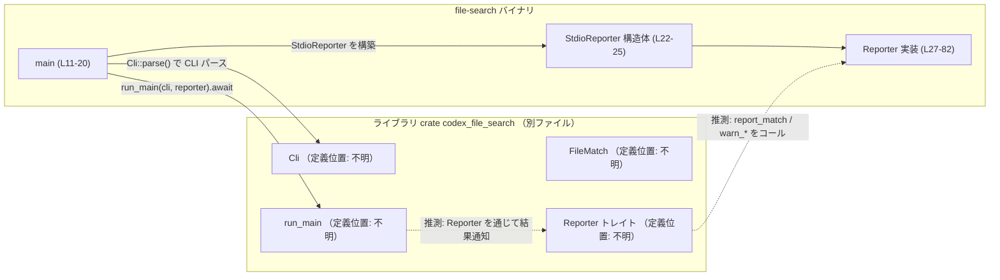
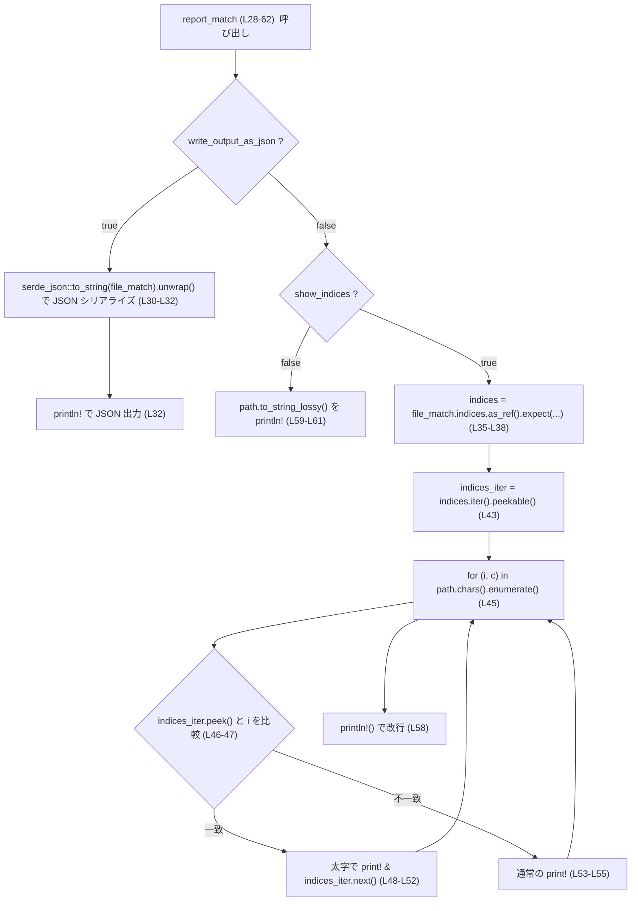
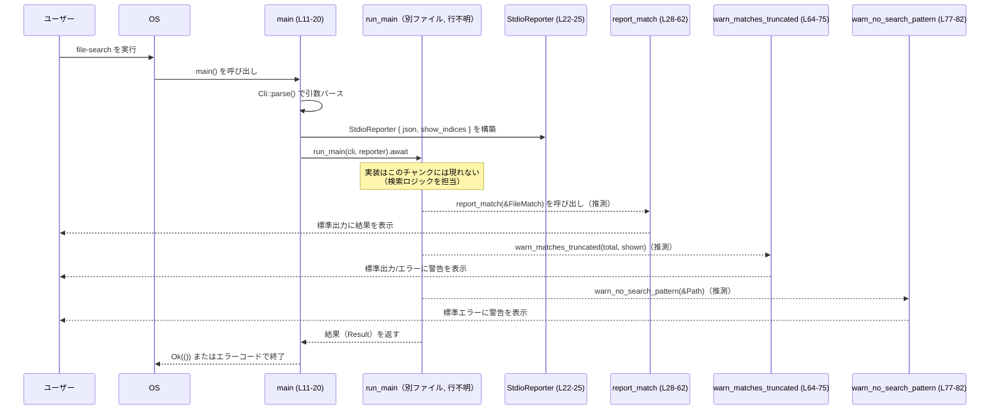

# file-search/src/main.rs コード解説

## 0. ざっくり一言

`file-search/src/main.rs` は、ファイル検索ツールの **CLI エントリポイント** となるバイナリ用モジュールで、  
コマンドライン引数のパースと、結果表示用の `Reporter` 実装（標準出力/JSON/強調表示）を提供します  
（根拠: `file-search/src/main.rs:L4-L9, L11-L20, L22-L82`）。

※ このファイルは 1 チャンクのみ（1/1）で、main 関数と `StdioReporter` 実装の全体が含まれています。

---

## 1. このモジュールの役割

### 1.1 概要

- このモジュールは **コマンドラインからファイル検索を実行するためのエントリポイント** です。
- `clap` で CLI 引数 (`Cli`) をパースし、その設定に応じて出力形式を制御する `StdioReporter` を作成します。
- 検索処理自体はライブラリ側の `codex_file_search::run_main` に委譲し、このモジュールは **入出力（CLI と標準出力/エラー）を担当** します。  
  （根拠: `file-search/src/main.rs:L4-L9, L11-L20, L22-L82`）

### 1.2 アーキテクチャ内での位置づけ

このモジュールは「バイナリ crate」として、ライブラリ crate `codex_file_search` の公開 API を利用します。  
CLI からの入力を `Cli` 型に変換し、検索結果の表示は `Reporter` トレイト実装で行います。



- `Cli`, `FileMatch`, `Reporter`, `run_main` の定義はこのチャンクには現れません（別ファイルに存在）。  
  （根拠: `file-search/src/main.rs:L4-L8`）

### 1.3 設計上のポイント

- **責務分割**
  - 検索ロジックは `run_main`（ライブラリ側）に集約し、このファイルは CLI と出力だけを扱います。  
    （根拠: `file-search/src/main.rs:L11-L20`）
- **状態管理**
  - `StdioReporter` は 2 つの bool フィールドのみを持つ軽量な構造体で、内部で可変状態やバッファは持ちません。  
    （根拠: `file-search/src/main.rs:L22-L25`）
- **エラーハンドリング**
  - `main` は `anyhow::Result<()>` を返し、`run_main` のエラーを `?` でそのまま伝播します。  
    （根拠: `file-search/src/main.rs:L11-L20`）
  - JSON シリアライズやインデックス有無に関しては `unwrap` / `expect` に依存しており、想定外の状態ではパニックが発生し得ます。  
    （根拠: `file-search/src/main.rs:L30-L32, L35-L38, L67-L69`）
- **並行性**
  - `#[tokio::main]` により Tokio ランタイム上で `async fn main` が実行されます。  
    非同期処理の詳細は `run_main` に委譲され、このファイル内の処理はすべて同期的です。  
    （根拠: `file-search/src/main.rs:L11-L12, L18`）
- **出力形式の切り替え**
  - `--json` フラグで JSON 出力、`--compute-indices` フラグ（かつ端末出力のとき）でパス文字列中のマッチ箇所を太字で強調、そのどちらでもない場合はパス文字列をそのまま表示します。  
    （根拠: `file-search/src/main.rs:L13-L18, L28-L62, L64-L75`）

---

## 2. 主要な機能一覧

- CLI 引数 (`Cli`) のパースと `StdioReporter` の初期化（根拠: `file-search/src/main.rs:L11-L18, L22-L25`）
- ライブラリ関数 `run_main` の呼び出しとエラー伝播（根拠: `file-search/src/main.rs:L11-L20`）
- 検索結果 (`FileMatch`) の出力
  - JSON 形式でのシリアライズ出力（根拠: `file-search/src/main.rs:L28-L33`）
  - 一致インデックスを用いたパス文字列中の強調表示（太字）（根拠: `file-search/src/main.rs:L34-L58`）
  - 単純なパス文字列出力（根拠: `file-search/src/main.rs:L59-L61`）
- 検索結果が制限により切り捨てられた場合の警告出力（JSON / テキスト）（根拠: `file-search/src/main.rs:L64-L75`）
- 検索パターンが指定されなかった場合の警告出力（根拠: `file-search/src/main.rs:L77-L82`）

### 2.1 コンポーネント一覧（インベントリー）

| 名称 | 種別 | 役割 / 用途 | 定義位置 |
|------|------|-------------|----------|
| `main` | 関数（非同期） | CLI をパースし、`StdioReporter` を構築して `run_main` を呼び出すエントリポイント | `file-search/src/main.rs:L11-L20` |
| `StdioReporter` | 構造体 | 出力形式（JSON / 強調表示 / プレーン）を制御する Reporter 実装の状態保持 | `file-search/src/main.rs:L22-L25` |
| `Reporter for StdioReporter` | trait 実装 | `Reporter` トレイトの 3 メソッドを `StdioReporter` 用に実装 | `file-search/src/main.rs:L27-L83` |
| `StdioReporter::report_match` | メソッド | 各ファイルマッチの出力（JSON / 強調表示 / 単純表示）を行う | `file-search/src/main.rs:L28-L62` |
| `StdioReporter::warn_matches_truncated` | メソッド | 表示件数が制限により切り捨てられた際の警告を出力 | `file-search/src/main.rs:L64-L75` |
| `StdioReporter::warn_no_search_pattern` | メソッド | 検索パターン未指定時にディレクトリ内容を表示する旨の警告を出力 | `file-search/src/main.rs:L77-L82` |

---

## 3. 公開 API と詳細解説

### 3.1 型一覧（構造体・列挙体など）

> このファイル内で定義されている型はモジュール外には `pub` で公開されていませんが、動作理解のために整理します。

| 名前 | 種別 | 役割 / 用途 | 主なフィールド | 定義位置 |
|------|------|-------------|----------------|----------|
| `StdioReporter` | 構造体 | 検索結果・警告の表示方法を制御する Reporter 実装 | `write_output_as_json: bool` … JSON 出力するかどうか<br>`show_indices: bool` … パス中の一致位置を強調表示するかどうか | `file-search/src/main.rs:L22-L25` |

- `StdioReporter` は `Reporter` トレイトを実装しており、`run_main` に渡されます（根拠: `file-search/src/main.rs:L7, L11-L18, L27-L83`）。
- `Reporter` トレイト自体の定義はこのチャンクには現れません。

---

### 3.2 関数詳細

#### `#[tokio::main] async fn main() -> anyhow::Result<()>`

**概要**

- アプリケーションのエントリポイントです。
- CLI 引数を `Cli::parse()` で取得し、その内容から `StdioReporter` を構築して `run_main` を非同期に呼び出します。  
  （根拠: `file-search/src/main.rs:L11-L18`）

**引数**

- なし（通常の `main` 関数と同様、引数は `std::env::args` から `clap` が取得します）。

**戻り値**

- `anyhow::Result<()>`
  - 成功時は `Ok(())`
  - 失敗時は `run_main` から伝播したエラーを `anyhow::Error` にラップした `Err` を返すと考えられますが、`run_main` の具体的な戻り値型はこのチャンクには現れません。

**内部処理の流れ**

1. `Cli::parse()` でコマンドライン引数をパースし、`Cli` インスタンスを得る。  
   （根拠: `file-search/src/main.rs:L13`）
2. `StdioReporter` を構築し、そのフィールドを `cli.json` と `cli.compute_indices && stdout().is_terminal()` で初期化する。  
   （根拠: `file-search/src/main.rs:L14-L17`）
3. `run_main(cli, reporter).await?` を実行し、検索処理をライブラリに委譲する。エラーならそのまま `?` で返す。  
   （根拠: `file-search/src/main.rs:L18`）
4. 成功時は `Ok(())` を返して終了する。  
   （根拠: `file-search/src/main.rs:L19`）

**Examples（使用例）**

このモジュールそのものの使い方として、`main` はすでに完成した例です。

```rust
use std::io::IsTerminal;                           // 端末かどうかを判定するトレイト
use clap::Parser;                                  // Clap の Parser トレイト
use codex_file_search::{Cli, Reporter, run_main};  // ライブラリ側の型（定義場所はこのチャンクには無い）

struct StdioReporter {
    write_output_as_json: bool,
    show_indices: bool,
}

#[tokio::main]                                      // Tokio ランタイムを起動して async main を実行
async fn main() -> anyhow::Result<()> {
    let cli = Cli::parse();                        // コマンドライン引数をパース

    // CLI 設定から Reporter を構築
    let reporter = StdioReporter {
        write_output_as_json: cli.json,            // --json フラグに対応すると考えられる
        show_indices: cli.compute_indices          // --compute-indices フラグに対応
            && std::io::stdout().is_terminal(),    // 出力先が端末のときのみ強調表示
    };

    // メインの検索処理をライブラリに委譲
    run_main(cli, reporter).await?;                // エラーは ? で呼び出し元（OS）に伝播
    Ok(())
}
```

**Errors / Panics**

- **Errors（戻り値）**
  - `run_main(cli, reporter).await?` 部分で `Err` が返された場合に、そのエラーが `anyhow::Error` に変換されて `main` からも `Err` として返されます。  
    `run_main` の具体的なエラー条件はこのチャンクには現れません。  
    （根拠: `file-search/src/main.rs:L18`）
- **Panics**
  - この関数内で `unwrap` / `expect` を直接呼んでおらず、明示的なパニックはありません。
  - `Cli::parse()` や `run_main` 内部でのパニックの有無は、このチャンクからは分かりません。

**Edge cases（エッジケース）**

- CLI 引数が不正な場合
  - `Cli::parse()` によってエラー扱いになり、通常は `clap` がヘルプやエラーを表示してプロセスを終了しますが、具体的な挙動は `Cli` の定義に依存し、このチャンクには現れません。
- `stdout` が端末（tty）ではない場合
  - `show_indices` は `false` になるため、強調表示は行われません。  
    （根拠: `file-search/src/main.rs:L16`）

**使用上の注意点**

- `main` 自体に特別な前提条件はありませんが、`#[tokio::main]` のため **Tokio ランタイムに依存**します。
- `run_main` のシグネチャやエラー条件はこのチャンクには無いため、そこを変更する場合はライブラリ側の実装を確認する必要があります。

---

#### `fn report_match(&self, file_match: &FileMatch)`

**概要**

- 1 件の検索結果 (`FileMatch`) を受け取り、設定に応じて
  - JSON 文字列
  - 強調表示付きのパス
  - プレーンなパス文字列
  のいずれかの形式で標準出力に表示します。  
  （根拠: `file-search/src/main.rs:L28-L62`）

**引数**

| 引数名 | 型 | 説明 |
|--------|----|------|
| `self` | `&StdioReporter` | 出力形式を示す設定（`write_output_as_json`, `show_indices`）を保持するインスタンスへの共有参照 |
| `file_match` | `&FileMatch` | 1 件の検索結果。`indices` フィールドと `path` フィールドが利用されています。 |

`FileMatch` の構造やその他フィールドはこのチャンクには現れませんが、少なくとも以下があることが分かります（根拠: `file-search/src/main.rs:L35-L38, L45, L59-L60`）:

- `file_match.indices`: `Option<Vec<u32>>` に類似した型（`as_ref().expect(...)` と `iter()` が呼ばれており、イテレータ要素と `i as u32` を比較している）
- `file_match.path`: `to_string_lossy()` メソッドを持つ型（おそらく `Path`/`PathBuf`）

**戻り値**

- なし（`()`）

**内部処理の流れ**

1. `self.write_output_as_json` が `true` の場合  
   - `serde_json::to_string(file_match).unwrap()` で JSON 文字列にシリアライズし、`println!("{json}");` で出力。  
     （根拠: `file-search/src/main.rs:L28-L33`）
2. そうでなく、`self.show_indices` が `true` の場合  
   - `file_match.indices.as_ref().expect(...)` でインデックスのスライス参照を取得。`None` の場合はパニック。  
     （根拠: `file-search/src/main.rs:L34-L38`）
   - `indices.iter().peekable()` で先読み可能なイテレータを作成。  
     （根拠: `file-search/src/main.rs:L43`）
   - `file_match.path.to_string_lossy().chars().enumerate()` でパス文字列の各文字とそのインデックス `i` を走査。  
     （根拠: `file-search/src/main.rs:L45`）
   - 各文字に対して
     - `indices_iter.peek()` で次のインデックスを確認し、`**next == i as u32` ならその文字を ANSI エスケープシーケンス `\x1b[1m...\x1b[0m` で太字表示し、イテレータを 1 つ進める。  
     - それ以外の場合は文字をそのまま表示。
     （根拠: `file-search/src/main.rs:L46-L56`）
   - ループ終了後に改行を `println!()` で出力。  
     （根拠: `file-search/src/main.rs:L58`）
3. 上記どちらでもない場合（`write_output_as_json == false` かつ `show_indices == false`）  
   - `println!("{}", file_match.path.to_string_lossy());` でパス文字列をそのまま出力。  
     （根拠: `file-search/src/main.rs:L59-L61`）

**Mermaid フロー図（report_match (L28-62)）**



**Examples（使用例）**

`Reporter` は通常ライブラリ内部で呼び出されるため、`report_match` を直接呼ぶことはあまり想定されません。ただし動作イメージとして、簡易的に呼び出す例を示します。

```rust
// 注意: FileMatch の定義はこのチャンクには無いため、ここでは仮の型として扱います。
// 実際には codex_file_search クレート内の定義を参照する必要があります。

fn demo_report_match(reporter: &StdioReporter, file_match: &codex_file_search::FileMatch) {
    // 設定に応じて JSON / 強調表示 / プレーン 出力のいずれかが行われる
    reporter.report_match(file_match);
}
```

**Errors / Panics**

- **JSON シリアライズ失敗**
  - `serde_json::to_string(file_match).unwrap()` により、シリアライズが失敗した場合はパニックします。  
    （根拠: `file-search/src/main.rs:L30-L32`）
- **インデックス未設定**
  - `self.show_indices == true` の場合に `file_match.indices` が `None` であると、`expect("--compute-indices was specified")` によるパニックが発生します。  
    （根拠: `file-search/src/main.rs:L34-L38`）
- **標準出力の書き込みエラー**
  - `print!` / `println!` マクロは標準出力への書き込みに失敗した場合にパニックする可能性があります（これは Rust 標準ライブラリの仕様に依存します）。

**Edge cases（エッジケース）**

- `write_output_as_json == true` かつ `file_match` が巨大・複雑な場合
  - シリアライズコストが大きくなりますが、このファイルからは具体的な制限は読み取れません。
- インデックス配列が空の場合
  - ループは通常通り走りますが、`indices_iter.peek()` は常に `None` となるため、すべての文字が通常表示されます。  
    （根拠: `file-search/src/main.rs:L45-L56`）
- インデックスがパス文字列の長さより大きい場合
  - そのインデックスはループ中で一度も一致せず、無視されます（パニックはしません）。  
    （根拠: `file-search/src/main.rs:L45-L56`）
- パスに非 UTF-8 文字が含まれる場合
  - `to_string_lossy()` により代替文字を含む文字列に変換されますが、具体的な挙動は `Path::to_string_lossy` の仕様に依存し、このチャンクには詳細が現れません。

**使用上の注意点**

- `show_indices` を `true` にする場合は、呼び出し側（おそらく `run_main`）が `file_match.indices` に `Some` をセットすることが **契約** になっています。そうでないとパニックします。
- JSON 出力を利用する場合、`FileMatch` が `serde::Serialize` を実装していること、およびシリアライズが失敗しないことを前提としています。
- パス中にターミナル制御コードや非常に長い文字列が含まれている場合、それがそのまま出力されるため、端末上での表示に影響する可能性があります（ログ用途などでは注意が必要です）。

---

#### `fn warn_matches_truncated(&self, total_match_count: usize, shown_match_count: usize)`

**概要**

- 検索結果が制限（`--limit` など）により一部のみ表示されている場合に、  
  その旨を JSON またはテキストで警告表示します。  
  （根拠: `file-search/src/main.rs:L64-L75`）

**引数**

| 引数名 | 型 | 説明 |
|--------|----|------|
| `self` | `&StdioReporter` | 出力形式設定を持つインスタンスへの参照 |
| `total_match_count` | `usize` | 実際の総マッチ数 |
| `shown_match_count` | `usize` | 表示されたマッチ数 |

**戻り値**

- なし（`()`）

**内部処理の流れ**

1. `self.write_output_as_json` が `true` の場合  
   - `json!({"matches_truncated": true})` で JSON 値を作成し、`serde_json::to_string(&value).unwrap()` で文字列化します。  
   - それを `println!("{json}");` で出力します。  
     （根拠: `file-search/src/main.rs:L65-L69`）
2. そうでない場合  
   - `eprintln!` で英語の警告文を標準エラー出力に表示します。警告文中には `shown_match_count` と `total_match_count` が埋め込まれます。  
     （根拠: `file-search/src/main.rs:L71-L73`）

**Examples（使用例）**

```rust
fn demo_warn_truncated(reporter: &StdioReporter) {
    let total = 100;      // 実際は 100 件マッチした
    let shown = 20;       // 20 件だけ表示した
    reporter.warn_matches_truncated(total, shown); // 設定に応じて JSON またはテキストで警告
}
```

**Errors / Panics**

- JSON モード時に `serde_json::to_string(&value).unwrap()` が失敗するとパニックします。  
  （根拠: `file-search/src/main.rs:L66-L69`）
- `eprintln!` の書き込みエラーによるパニックの可能性は標準ライブラリに依存します。

**Edge cases（エッジケース）**

- `total_match_count == shown_match_count` の場合でも、この関数が呼ばれれば「切り捨てられた」とみなす JSON (`{"matches_truncated": true}`) が出力されます。  
  呼び出し側で条件を制御する必要があります。  
  （この関数内には条件チェックは存在しません。根拠: `file-search/src/main.rs:L64-L75`）
- `total_match_count < shown_match_count` のような矛盾した値も受け取りますが、この関数は値を検証せず単に埋め込むだけです。

**使用上の注意点**

- JSON モードでは、出力は単一のキー `matches_truncated: true` のみを含むオブジェクトです。スキーマに依存するツールを組み合わせる場合は、この形を前提にする必要があります。
- `total_match_count` と `shown_match_count` の一貫性（論理的な整合性）は呼び出し側で保証する必要があります。

---

#### `fn warn_no_search_pattern(&self, search_directory: &Path)`

**概要**

- 検索パターンが指定されなかった場合に、「現在のディレクトリ内容を表示する」旨の警告を標準エラー出力に表示します。  
  （根拠: `file-search/src/main.rs:L77-L82`）

**引数**

| 引数名 | 型 | 説明 |
|--------|----|------|
| `self` | `&StdioReporter` | （フィールドは使用していません） |
| `search_directory` | `&Path` | 表示対象となるディレクトリのパス |

**戻り値**

- なし（`()`）

**内部処理の流れ**

1. `eprintln!` で英語のメッセージを標準エラーに出力します。  
   メッセージ中の `{}` プレースホルダには `search_directory.to_string_lossy()` が埋め込まれます。  
   （根拠: `file-search/src/main.rs:L78-L81`）

**Examples（使用例）**

```rust
use std::path::Path;

fn demo_warn_no_pattern(reporter: &StdioReporter) {
    let dir = Path::new(".");  // カレントディレクトリ
    reporter.warn_no_search_pattern(dir);
    // => "No search pattern specified. Showing the contents of the current directory (.):"
    //    というメッセージが標準エラーに出力される
}
```

**Errors / Panics**

- `eprintln!` の書き込みエラーでパニックが発生する可能性があります（標準ライブラリの仕様に依存）。
- `to_string_lossy()` 自体はパニックしない設計ですが、詳細は `Path` のドキュメントに依存し、このチャンクには現れません。

**Edge cases（エッジケース）**

- `search_directory` が存在しないパスであっても、この関数は単にパス文字列を表示するだけで、存在チェックなどは行いません。
- 非 UTF-8 のパスの場合、`to_string_lossy()` による代替文字が含まれる可能性があります。

**使用上の注意点**

- この関数は JSON 出力モードでも常にテキストメッセージを出力します（`write_output_as_json` は参照していません）。  
  JSON に完全に統一したい場合は、この挙動を考慮して設計する必要があります。

---

### 3.3 その他の関数

このファイルには、上記以外の補助関数やラッパー関数は存在しません。  
`Cli`, `FileMatch`, `Reporter`, `run_main` の定義は別ファイルにあり、このチャンクには現れません。

---

## 4. データフロー

ここでは、典型的な「CLI 実行から検索結果表示まで」の流れを、  
このファイルから観測できる範囲で説明します。

1. ユーザーが `file-search` バイナリを CLI から実行する。
2. OS により `main (L11-20)` が呼び出され、`Cli::parse()` で引数がパースされる。
3. `StdioReporter` が、`--json` / `--compute-indices` と出力先が端末かどうかに応じて初期化される。
4. `run_main(cli, reporter)` が呼ばれ、非同期で検索処理が実行される。
5. `run_main` は（推測ですが）検索結果や状況に応じて `Reporter` トレイトのメソッドを呼び出し、  
   `StdioReporter::report_match` や `warn_matches_truncated` などが実行され、標準出力/エラーに結果が出力される。

### シーケンス図



- `run_main` から `report_match` 等への呼び出しは、`Reporter` トレイトの設計から推測されるものであり、  
  具体的な呼び出し箇所はこのチャンクには現れません。

---

## 5. 使い方（How to Use）

### 5.1 基本的な使用方法

最も典型的な利用は、`file-search` バイナリを CLI から直接実行する形です。  
このファイル自体をライブラリとして使うケースは少ないと考えられます。

**例: プレーンな検索結果の表示**

```bash
# カレントディレクトリ以下で "pattern" を検索
file-search pattern
```

- `--json` を付けず、`stdout` が端末の場合でも `--compute-indices` を指定しなければ  
  パスのみが 1 行ずつ表示されます（根拠: `file-search/src/main.rs:L14-L17, L28-L62`）。

**例: JSON 出力モード**

```bash
# 検索結果を JSON で取得（スクリプトなどから扱いやすい）
file-search --json pattern
```

- この場合 `write_output_as_json == true` となり、`report_match` および  
  `warn_matches_truncated` は JSON 文字列を出力します。  
  （根拠: `file-search/src/main.rs:L14-L17, L28-L33, L64-L69`）

**例: 強調表示付き出力**

```bash
# 端末上で一致部分を太字表示
file-search --compute-indices pattern
```

- `stdout` が端末（たとえば通常のシェル）であれば `show_indices == true` となり、  
  パス文字列の一致位置が太字で表示されます。  
  （根拠: `file-search/src/main.rs:L16, L34-L58`）

### 5.2 よくある使用パターン

1. **スクリプトからの利用（JSON モード）**
   - `--json` を付けて実行し、出力を `jq` や他のツールで処理する。
2. **インタラクティブ利用（強調表示）**
   - `--compute-indices` を付けて実行し、端末上でマッチ箇所が視覚的に分かるようにする。
3. **制限付き検索**
   - （推測）`--limit` オプションを組み合わせ、結果数が多いときに切り捨てを行う。  
     この場合、`warn_matches_truncated` が警告を出します（呼び出し自体はライブラリ側で行われると考えられます）。

### 5.3 よくある間違い

```rust
// 間違いの例: show_indices だけを true にして indices を設定しない Reporter を自作する
struct MyReporter {
    show_indices: bool,
}

impl Reporter for MyReporter {
    fn report_match(&self, file_match: &FileMatch) {
        // StdioReporter と同様に indices を使おうとすると...
        let indices = file_match.indices.as_ref().expect("--compute-indices was specified");
        // indices が None の場合にパニックする
    }
}

// 正しい例: show_indices == true のときは FileMatch.indices が必ず Some になるように
// run_main 側（または FileMatch を構築するコード）で契約を満たす必要がある。
```

- `StdioReporter` は `show_indices == true` なら `indices` が `Some` であることを前提としており、  
  他の `Reporter` 実装でも同様の前提を置く場合は、**上流側でインデックスを必ず計算・設定する必要があります**。  
  （根拠: `file-search/src/main.rs:L34-L38`）

```bash
# 間違いの例: パイプに流しても強調表示されると思っている
file-search --compute-indices pattern | less

# 実際には stdout が端末でないため show_indices は false となり、
# 強調表示は行われません。
```

- `stdout().is_terminal()` を見ているため、パイプやリダイレクトを行うと強調表示は無効になります。  
  （根拠: `file-search/src/main.rs:L16`）

### 5.4 使用上の注意点（まとめ）

- **前提条件**
  - `show_indices == true` のとき、`FileMatch.indices` が `Some` であること（さもないと `expect` でパニック）。  
    （根拠: `file-search/src/main.rs:L34-L38`）
  - JSON モードでは `FileMatch` および警告用のオブジェクトが `serde_json::to_string` で問題なくシリアライズできること。
- **エラー / パニック条件**
  - JSON シリアライズ失敗時の `unwrap()` によるパニック。  
    （根拠: `file-search/src/main.rs:L30-L32, L67-L69`）
  - `show_indices == true` かつ `indices == None` の場合の `expect()` によるパニック。  
    （根拠: `file-search/src/main.rs:L34-L38`）
- **並行性・出力の混在**
  - `StdioReporter` は内部状態を持たず `&self` しか受け取らないため、型レベルではスレッドセーフになりやすい構造です。一方で、標準出力・エラーはプロセス全体で共有されるため、他スレッド・タスクからの出力と混ざる可能性はあります。
- **パフォーマンス**
  - 強調表示モードではパス文字列を 1 文字ずつ走査しますが、インデックスを 1 度だけ前から順になめるアルゴリズムになっており、コメントにある通り最悪 O(N^2) になる実装は避けられています。  
    （根拠: コメント `file-search/src/main.rs:L39-L42`）

---

## 6. 変更の仕方（How to Modify）

### 6.1 新しい機能を追加する場合

例として「別の出力形式（例えば JSON Lines ではなくまとめた JSON 配列）」を追加する場合を考えます。

1. **設定フラグの追加**
   - `Cli` に新しいフラグ（例: `--json-array`）を追加し、このチャンクには現れない `codex_file_search::Cli` の定義を修正します。
2. **StdioReporter にフィールド追加**
   - `StdioReporter` に `write_output_as_json_array: bool` のようなフィールドを追加。  
     （変更場所: `file-search/src/main.rs:L22-L25`）
3. **main での初期化を変更**
   - `Cli` から新しいフラグ値を読み取り、`StdioReporter` のフィールドを設定。  
     （変更場所: `file-search/src/main.rs:L14-L17`）
4. **Reporter 実装の分岐を拡張**
   - `report_match` 内で `write_output_as_json_array` を優先した分岐を追加し、必要に応じてバッファや終了時のフラッシュ処理を考慮します。  
     （変更場所: `file-search/src/main.rs:L28-L62`）

この際、`run_main` の呼び出し側インターフェース（`run_main(cli, reporter)`）は変えずに、Reporter の実装だけを変更するのが自然です。

### 6.2 既存の機能を変更する場合

- **JSON スキーマを変更したい場合**
  - `report_match` および `warn_matches_truncated` の `serde_json::to_string` 部分と、`FileMatch` のシリアライズ定義（別ファイル）を合わせて確認する必要があります。
- **パニックを避けたい場合**
  - `unwrap` / `expect` を `match` や `if let` に書き換え、失敗時にエラーを返すか、警告のみ出して処理継続するなどの方針を検討します。
  - ただし、その場合は `Reporter` トレイトの戻り値型（現在は `()` と見える）がエラーを返せる形に変えられるかどうか、ライブラリ側の影響範囲を確認する必要があります。
- **インデックス強調ロジックを変更したい場合**
  - `report_match` 内の `for (i, c)` ループと `indices_iter` の扱いが中心です（`file-search/src/main.rs:L45-L57`）。
  - `indices` の意味（文字単位かバイト単位か）やソート済みであるという前提は、コメントの通り run_main 側の仕様と密接に結びついているため、そちらも併せて確認が必要です。  
    （根拠: コメント `file-search/src/main.rs:L39-L42`）

---

## 7. 関連ファイル

このモジュールと密接に関係するのは、ライブラリ crate `codex_file_search` 内の型と関数です。  
具体的なファイルパスはこのチャンクには現れないため、「このチャンクには現れない」と明記します。

| パス/クレート | 役割 / 関係 |
|---------------|------------|
| `codex_file_search::Cli` | コマンドライン引数定義とパースロジックを提供する型。`Cli::parse()` を通じて `main` から利用される（定義位置はこのチャンクには現れない）。 |
| `codex_file_search::FileMatch` | 検索結果 1 件を表す型。`Reporter::report_match` から利用され、`indices` や `path` フィールドが参照される（定義位置はこのチャンクには現れない）。 |
| `codex_file_search::Reporter` | 出力処理を抽象化するトレイト。`StdioReporter` がこれを実装し、`run_main` に渡される（定義位置はこのチャンクには現れない）。 |
| `codex_file_search::run_main` | 検索処理のメインロジックを実装する非同期関数。`main` から呼び出される（定義位置はこのチャンクには現れない）。 |
| クレート `clap` | `Cli::parse()` の実装に利用される CLI パーサー。 |
| クレート `serde_json` | `FileMatch` や警告オブジェクトを JSON 文字列に変換するために利用。 |
| クレート `tokio` | `#[tokio::main]` により非同期ランタイムを提供。 |
| クレート `anyhow` | `main` の戻り値型として汎用的なエラーラッパーを提供。 |

このファイル内にはテストコードは含まれていません。テストの有無や場所は別ファイルを確認する必要があります（このチャンクには現れません）。
