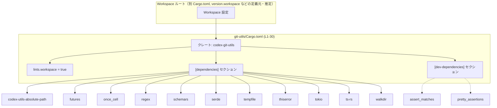
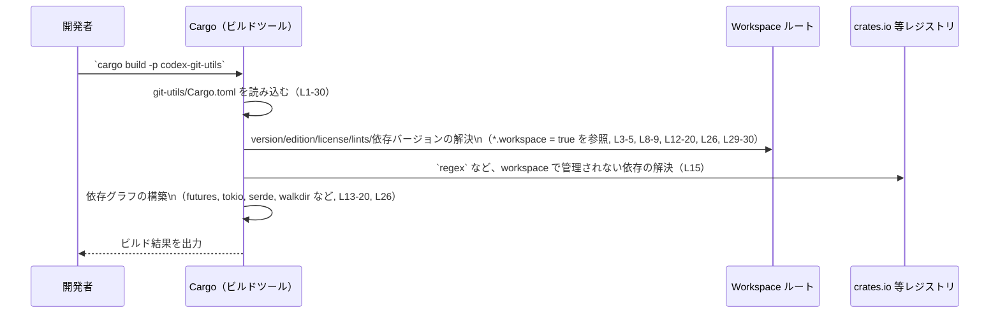

# git-utils/Cargo.toml コード解説

## 0. ざっくり一言

`git-utils/Cargo.toml` は、Rust クレート `codex-git-utils` のパッケージ情報と依存クレートを定義する Cargo マニフェストです（Cargo.toml:L1-6, L11-30）。

---

## 1. このモジュールの役割

### 1.1 概要

- このファイルは、クレート名 `codex-git-utils` を定義し（Cargo.toml:L1-2）、バージョン・エディション・ライセンスを **workspace 共通設定から継承** するよう指定しています（Cargo.toml:L3-5）。
- 読み込みに使用される README ファイルを `README.md` に設定しています（Cargo.toml:L6）。
- `lints.workspace = true` により、コンパイラリント（警告・エラーのポリシー）を workspace ルートで一元管理します（Cargo.toml:L8-9）。
- `[dependencies]` と `[dev-dependencies]` で、非同期処理、ファイルシステム操作、エラー処理、シリアライズなどの外部クレートへの依存を宣言します（Cargo.toml:L11-26, L28-30）。

### 1.2 アーキテクチャ内での位置づけ

このファイルは **ビルド時** に Cargo によって読み込まれ、workspace ルートの設定と組み合わされて `codex-git-utils` クレートの依存グラフを構築する起点になります（Cargo.toml:L1-5, L11-26, L28-30）。

依存関係のイメージは次のようになります。



- workspace ルート（`WS`）の存在は `*.workspace = true` の指定から推定できますが、ファイルパスなどの詳細はこのチャンクには現れません（Cargo.toml:L3-5, L8-9, L12-20, L26, L29-30）。

### 1.3 設計上のポイント

このマニフェストから読み取れる設計上の特徴は次のとおりです。

- **workspace 統合管理**  
  - `version.workspace = true` / `edition.workspace = true` / `license.workspace = true` により、バージョン・エディション・ライセンスを workspace ルートに集約しています（Cargo.toml:L3-5）。
  - `lints.workspace = true` により、リント設定も workspace ルートで統一しています（Cargo.toml:L8-9）。
- **依存バージョンの workspace 一元管理**  
  - 多くの依存クレートについて `workspace = true` を指定し（例: `codex-utils-absolute-path`, `futures`, `once_cell`, `schemars`, `serde`, `tempfile`, `thiserror`, `tokio`, `ts-rs`, `walkdir`）、バージョンや細かい設定を workspace で一括管理する構造になっています（Cargo.toml:L12, L13-14, L16-20, L21-25, L26）。
  - 一方で、`regex = "1"` のように、このクレート内で直接バージョンを指定している依存もあります（Cargo.toml:L15）。
- **機能付き依存の利用**  
  - `futures` に `["alloc"]`、`serde` に `["derive"]`、`tokio` に `["macros", "process", "rt", "time"]`、`ts-rs` に TypeScript/Serde 用の複数の機能を有効化するなど、利用する機能を明示的に指定しています（Cargo.toml:L13, L17, L20-25）。
- **テスト用依存の分離**  
  - `[dev-dependencies]` に `assert_matches` と `pretty_assertions` を追加することで、テスト時のみ必要な機能を本番バイナリから切り離しています（Cargo.toml:L28-30）。

---

## 2. 主要な機能一覧

このファイルはコード本体ではなくマニフェストのため、**公開 API やコアロジックそのものは含まれていません**（Cargo.toml:L1-30）。  
ここでは、このクレートが利用できる外部ライブラリ群と、それが一般的に提供する機能を整理します。

- パスユーティリティ: `codex-utils-absolute-path` による絶対パス関連の処理（Cargo.toml:L12）。
- 非同期処理基盤: `futures`（`alloc` 機能つき）および `tokio`（マクロ・プロセス・ランタイム・時間機能付き）による非同期・並行処理基盤（Cargo.toml:L13, L20）。
- グローバル/遅延初期化: `once_cell` による一度だけ初期化される静的値の管理（Cargo.toml:L14）。
- 正規表現処理: `regex` による文字列マッチング・パターン検索（Cargo.toml:L15）。
- スキーマ生成: `schemars` による JSON Schema などのスキーマ生成（Cargo.toml:L16）。
- シリアライズ/デシリアライズ: `serde`（`derive` 機能つき）による構造体のシリアライズ/デシリアライズ（Cargo.toml:L17）。
- 一時ファイル・ディレクトリ: `tempfile` による一時ファイル管理（Cargo.toml:L18）。
- エラー定義: `thiserror` によるエラー型の定義支援（Cargo.toml:L19）。
- TypeScript 型生成: `ts-rs` による Rust 型からの TypeScript 型定義生成（Cargo.toml:L21-25）。
- ディレクトリ走査: `walkdir` によるファイルシステムの再帰的な走査（Cargo.toml:L26）。
- テスト支援: `assert_matches` / `pretty_assertions` によるテストアサーションの補助（Cargo.toml:L28-30）。

> これらのライブラリが実際にどのように呼ばれているか、どの API が公開されているかは、このファイル単体からは分かりません。

---

## 3. 公開 API と詳細解説

### 3.1 型一覧（構造体・列挙体など）

このファイルは Cargo マニフェストであり、Rust の構造体・列挙体などの **型定義は一切含まれていません**（Cargo.toml:L1-30）。

#### 参考: コンポーネントインベントリー（ビルド単位・依存クレート）

| 名前                       | 種別           | 役割 / 用途（一般的な意味）                                   | 根拠                          |
|----------------------------|----------------|--------------------------------------------------------------|-------------------------------|
| `codex-git-utils`          | クレート       | Git 関連ユーティリティを提供するクレート名（名称から推測）    | Cargo.toml:L1-2              |
| `codex-utils-absolute-path`| 依存クレート   | 絶対パス操作ユーティリティ                                   | Cargo.toml:L12               |
| `futures`                  | 依存クレート   | 非同期処理の Future/Stream 等を提供                          | Cargo.toml:L13               |
| `once_cell`                | 依存クレート   | 遅延初期化される静的値などを提供                             | Cargo.toml:L14               |
| `regex`                    | 依存クレート   | 正規表現による文字列処理                                     | Cargo.toml:L15               |
| `schemars`                 | 依存クレート   | 構造体定義からのスキーマ生成                                 | Cargo.toml:L16               |
| `serde`                    | 依存クレート   | シリアライズ/デシリアライズのフレームワーク                   | Cargo.toml:L17               |
| `tempfile`                 | 依存クレート   | 一時ファイル・ディレクトリ管理                               | Cargo.toml:L18               |
| `thiserror`                | 依存クレート   | カスタムエラー型の derive 宏                                 | Cargo.toml:L19               |
| `tokio`                    | 依存クレート   | 非同期ランタイム・タイマー・プロセス操作など                  | Cargo.toml:L20               |
| `ts-rs`                    | 依存クレート   | Rust 型から TypeScript 型への変換                            | Cargo.toml:L21-25            |
| `walkdir`                  | 依存クレート   | 再帰的なディレクトリ走査                                     | Cargo.toml:L26               |
| `assert_matches`           | dev依存クレート| パターンマッチングを用いたテスト用アサート                  | Cargo.toml:L28               |
| `pretty_assertions`        | dev依存クレート| 差分が見やすいアサーション                                   | Cargo.toml:L29-30            |

> 役割 / 用途は各クレートの一般的な用途に基づく説明であり、このクレート内での具体的な使われ方は Cargo.toml からは分かりません。

### 3.2 関数詳細（最大 7 件）

このファイルには **関数定義が一切存在しない** ため、関数単位の詳細解説は適用できません（Cargo.toml:L1-30）。

- 公開 API（関数・メソッド・型）は、`src/` 以下の Rust ソースコードに定義されていると考えられますが、その内容はこのチャンクには現れません。

### 3.3 その他の関数

- このチャンク内に関数やメソッドは存在しません（Cargo.toml:L1-30）。

---

## 4. データフロー

コードレベルのデータフローはこのファイルからは分かりませんが、**ビルド時に Cargo がどのようにこのファイルを利用するか** というフローは概ね次のように整理できます。

### Cargo によるビルド時の処理フロー（概念図）



- **対象コード範囲**: git-utils/Cargo.toml:L1-30  
- 実際の Git 操作や非同期処理などの「ランタイムのデータフロー」は Rust ソースコード側にあり、このチャンクには現れません。

---

## 5. 使い方（How to Use）

### 5.1 基本的な使用方法

このファイル自身は直接「呼び出す」対象ではなく、Cargo によって自動的に読み込まれます。  
外部のクレートから `codex-git-utils` を利用する場合の、**一般的な依存追加例**は次のようになります。

```toml
# 他プロジェクト側の Cargo.toml の例（このリポジトリ固有ではなく、一般的な書き方）
[dependencies]
codex-git-utils = "x.y.z"  # git-utils/Cargo.toml の name に対応（Cargo.toml:L2）
```

- 実際のバージョン `x.y.z` は、このクレートが公開されている場合は crates.io や workspace ルートの設定を確認する必要があります（Cargo.toml:L3）。

同一リポジトリ内の別クレートから、**パス依存**で参照する一般的な例も挙げます（リポジトリ構成はこのチャンクからは分からないため、あくまで例です）。

```toml
# 同一リポジトリ内の別クレートからの参照例（一般形）
[dependencies]
codex-git-utils = { path = "git-utils" }  # 実際のパスはリポジトリ構成に依存
```

### 5.2 よくある使用パターン

Cargo.toml の使い方として想定されるパターンをいくつか挙げます。

1. **workspace 共有バージョンの利用**（本ファイルが取っているパターン）  
   - ルート `Cargo.toml` に依存バージョンや edition をまとめて定義し、個別クレート側では `*.workspace = true` を使う（Cargo.toml:L3-5, L12-20, L26, L29-30）。

2. **機能付き依存の宣言**  
   - `tokio` に必要な機能だけを付けて依存を宣言することで、バイナリサイズやコンパイル時間を抑えつつ必要な機能を利用する（Cargo.toml:L20）。
   - `serde` に `derive` 機能を付けて、構造体への自動実装を利用する（Cargo.toml:L17）。

3. **テスト専用依存の切り分け**  
   - `assert_matches` や `pretty_assertions` のようなテスト用ライブラリを `[dev-dependencies]` として宣言し、本番ビルドからは除外する（Cargo.toml:L28-30）。

### 5.3 よくある間違い

Cargo.toml を編集する際に起こりやすい誤りと、このファイルの構造から見た注意点です。

```toml
# 誤りの例: workspace 管理と矛盾するバージョン指定
[dependencies]
serde = "1.0"                     # ← ここで直接バージョン指定してしまう
```

```toml
# 本ファイルと整合的な書き方の例
[dependencies]
serde = { workspace = true, features = ["derive"] }  # Cargo.toml:L17 と同じ形式
```

- このファイルでは `serde` を workspace 管理にしているため（Cargo.toml:L17）、個別クレート側で別バージョンを指定すると、依存解決が複雑になったりビルドエラーになる可能性があります。
- `tokio` など、**機能セットを変える変更**は他クレートとの整合性にも影響する可能性があり、workspace 全体の方針を確認する必要があります（Cargo.toml:L20）。

### 5.4 使用上の注意点（まとめ）

- **workspace 設定との整合性**  
  - `*.workspace = true` となっている項目は、ルート `Cargo.toml` の設定と整合している必要があります（Cargo.toml:L3-5, L8-9, L12-20, L26, L29-30）。
- **機能の追加・削除の影響**  
  - `tokio` や `ts-rs` の features を変更すると、このクレート内のコードや他クレートの期待と食い違う場合があります（Cargo.toml:L20-25）。
- **依存バージョンとセキュリティ**  
  - `regex = "1"` のようにローカルでバージョン指定している依存については（Cargo.toml:L15）、`Cargo.lock` や advisories を確認し、既知の脆弱性がないかを別途チェックする必要があります。
  - 本ファイルだけでは、依存クレートの具体的なバージョンや脆弱性の有無は判定できません。

---

## 6. 変更の仕方（How to Modify）

### 6.1 新しい機能を追加する場合

新しい機能をコード側に追加し、それに外部クレートが必要になる場合、このファイルでの一般的な変更手順は次のとおりです。

1. **workspace 側の方針確認**  
   - 既存の依存を見ると、多くが `workspace = true` を使っています（Cargo.toml:L12-20, L26, L29-30）。  
     新しい依存を追加する際も、まず workspace ルート `Cargo.toml` にバージョンを追加するかどうかを検討するのが自然です。
2. **[dependencies] への追加**  
   - 新しいランタイム依存は `[dependencies]` セクションに追加します（Cargo.toml:L11-26）。
3. **[dev-dependencies] への追加**  
   - テスト専用のライブラリは `[dev-dependencies]` に追加します（Cargo.toml:L28-30）。
4. **features の検討**  
   - `tokio` や `serde` のように、必要な機能だけを有効化することで不要なコードの取り込みを避けるパターンがこのファイルで使われています（Cargo.toml:L13, L17, L20, L21-25）。

### 6.2 既存の機能を変更する場合

既存の依存や設定を変更するときに注意すべき点です。

- **依存クレートのバージョン変更**  
  - `regex = "1"` のようにローカルでバージョンを指定している項目を変更する場合（Cargo.toml:L15）、ソースコード側の API 互換性と、workspace 内の他クレートとの整合性を確認する必要があります。
- **features の追加・削除**  
  - `tokio` の機能セット（`macros`, `process`, `rt`, `time`）や `ts-rs` の features を変更すると（Cargo.toml:L20-25）、  
    - コード側で使用している機能が使えなくなる  
    - 逆に不要な機能を有効にしてしまう  
    といった影響がありえます。
- **workspace 共有設定の変更**  
  - `version.workspace = true` などの共有設定を解除して、個別に設定することも可能ですが（Cargo.toml:L3-5）、その場合は workspace 全体のポリシー変更になるため、影響範囲が大きくなります。

---

## 7. 関連ファイル

このファイルと密接に関係するファイル・設定は次のとおりです。

| パス / 設定                       | 役割 / 関係                                                                 | 根拠                           |
|----------------------------------|----------------------------------------------------------------------------|--------------------------------|
| `git-utils/Cargo.toml`           | 本マニフェスト。クレート名・依存・lints などを定義                         | Cargo.toml:L1-30              |
| `README.md`                      | クレートの Readme として参照されるドキュメントファイル                     | Cargo.toml:L6                 |
| （workspace ルートの `Cargo.toml`） | `version.workspace`, `edition.workspace`, `license.workspace`, `lints.workspace`, `workspace = true` 依存の設定元 | Cargo.toml:L3-5, L8-9, L12-20, L26, L29-30 |
| `Cargo.lock`                     | 依存クレートの確定バージョン・解決結果を保持するファイル（一般的な Cargo プロジェクト構成） | Cargo の仕様に基づく一般知識  |

- workspace ルート `Cargo.toml` の具体的な位置や内容は、このチャンクからは分かりませんが、`*.workspace = true` の利用から、その存在が前提とされていることが分かります（Cargo.toml:L3-5, L8-9, L12-20, L26, L29-30）。
- 公開 API やコアロジックは `src/` 以下の Rust ソースコード側にあり、このチャンクには現れません。
