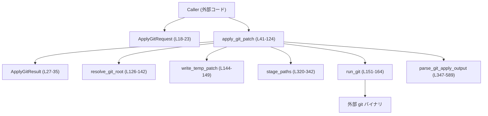
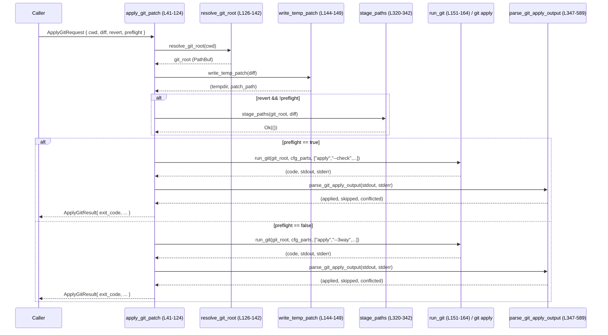

# git-utils/src/apply.rs コード解説

## 0. ざっくり一言

このファイルは、**システムの `git` コマンドを呼び出して unified diff を適用／チェックし、その結果を構造化して返すヘルパー**と、`git apply` の出力メッセージから影響ファイルを抽出するパーサを提供します（`apply.rs:L1-589`）。

---

## 1. このモジュールの役割

### 1.1 概要

- このモジュールは、**テキストとして渡された unified diff を、対象リポジトリに `git apply` で適用する問題**を解決するために存在し、次の機能を提供します。
  - `ApplyGitRequest` / `ApplyGitResult` によるパッチ適用リクエスト／結果の表現（`apply.rs:L18-35`）
  - `apply_git_patch` による `git apply` の実行と結果の収集（`apply.rs:L41-124`）
  - diff テキストからファイルパスを抽出する `extract_paths_from_patch` と、それを使った `stage_paths`（`apply.rs:L193-212`, `L320-342`）
  - `git apply` の標準出力／標準エラーを解析し、ファイルごとの適用／スキップ／コンフリクトを分類する `parse_git_apply_output`（`apply.rs:L347-589`）

### 1.2 アーキテクチャ内での位置づけ

`apply_git_patch` を中心に、ファイルシステム／外部プロセス／パーサが連携します。



- 呼び出し側は `ApplyGitRequest` を組み立てて `apply_git_patch` を呼び出し、`ApplyGitResult` を受け取ります（`apply.rs:L18-23`, `L27-35`, `L41-124`）。
- `apply_git_patch` は:
  - `resolve_git_root` でリポジトリルートを取得（`L126-142`）
  - diff を一時ファイルに書き出し（`write_temp_patch`, `L144-149`）
  - revert のとき必要に応じて `stage_paths` で対象ファイルをステージング（`L49-52`, `L320-342`）
  - `run_git` で `git apply` もしくは `git apply --check` を実行（`L75-105`, `L151-164`）
  - 出力を `parse_git_apply_output` で解析し、パス群を分類（`L84-91`, `L106-113`, `L347-589`）

### 1.3 設計上のポイント

- **責務の分割**
  - `apply_git_patch`: 外部インタフェース／全体の制御フロー（`L41-124`）
  - `resolve_git_root`, `run_git`, `write_temp_patch`, `render_command_for_log`: `git` コマンド実行・補助（`L126-191`, `L151-164`）
  - `extract_paths_from_patch`, `stage_paths`: diff テキストからパスを抽出し、ステージングに利用（`L193-212`, `L320-342`）
  - `parse_git_apply_output`, `unescape_c_string`, `read_diff_git_token`: `git` の出力や diff ヘッダのパース（`L214-317`, `L347-589`）
- **状態管理**
  - ランタイム状態はすべてローカル変数で管理され、グローバルな可変状態は使用していません。
  - 正規表現は `once_cell::sync::Lazy` で静的初期化され、スレッドセーフに共有されます（`L380-439`）。
- **エラーハンドリング**
  - OS／プロセス呼び出し (`Command::output`, `tempfile::tempdir`, `fs::write`) が失敗する場合に `io::Result` の `Err` を返します（例: `apply_git_patch` 内の `?`, `apply.rs:L41-52`）。
  - `git apply` 自体の成功／失敗は `ApplyGitResult.exit_code` に格納され、Rust の `Err` にはしません（`L115-123`）。
- **安全性と並行性**
  - `std::process::Command` に直接引数を渡しているため、シェル展開がなく、パスなどにシェルインジェクションの危険はありません（`run_git`, `apply.rs:L151-158`）。
  - 静的 `Lazy<Regex>` は同期化されており、複数スレッドから `parse_git_apply_output` を呼んでもデータ競合はありません（`L380-439`）。
  - テストでは `Mutex` と `OnceLock` で環境依存の `git` 呼び出しを直列化しています（`apply.rs:L595-605`）。

---

## 2. 主要な機能一覧

- パッチ適用:
  - `apply_git_patch`: diff テキストを `git apply` で適用／チェックし、ファイルごとの適用状況とコマンド出力を返す（`apply.rs:L41-124`）。
- Git ルート解決:
  - `resolve_git_root`: 指定ディレクトリから `git rev-parse --show-toplevel` でリポジトリルートを取得（`L126-142`）。
- 一時パッチファイル管理:
  - `write_temp_patch`: diff テキストを一時ディレクトリ配下の `patch.diff` に書き出す（`L144-149`）。
- 外部 `git` 実行ヘルパ:
  - `run_git`: 任意の git サブコマンドを実行し、終了コードと stdout/stderr を返す（`L151-164`）。
- Diff からのパス抽出:
  - `extract_paths_from_patch`: `diff --git` ヘッダからパスを抽出し、`a/` / `b/` や `/dev/null` を正規化して返す（`L193-212`）。
- パス解析ユーティリティ:
  - `parse_diff_git_paths`, `read_diff_git_token`, `normalize_diff_path`, `unescape_c_string`: ヘッダ行・C 風エスケープを解析（`L214-270`, `L272-317`）。
- ステージング:
  - `stage_paths`: diff 中に現れ、かつ実在するパスのみを `git add` する（`L320-342`）。
- `git apply` 出力パーサ:
  - `parse_git_apply_output`: `git apply` の stdout/stderr を解析し、applied / skipped / conflicted に分類（`L347-589`）。

---

## 3. 公開 API と詳細解説

### 3.1 型一覧（構造体など）

| 名前 | 種別 | 公開範囲 | 役割 / 用途 | 定義位置 |
|------|------|----------|-------------|----------|
| `ApplyGitRequest` | 構造体 | `pub` | `apply_git_patch` に渡すパラメータ（作業ディレクトリ、diff テキスト、revert フラグ、preflight フラグ）をまとめる | `apply.rs:L18-23` |
| `ApplyGitResult`  | 構造体 | `pub` | `git apply` 実行結果の終了コード、分類済みパス、stdout/stderr、ログ用コマンド文字列を保持する | `apply.rs:L27-35` |

#### 関数インベントリー（コンポーネント一覧）

公開関数と内部関数をまとめた表です。

| 名前 | 種別 | 公開範囲 | 主な役割 | 定義位置 |
|------|------|----------|----------|----------|
| `apply_git_patch` | 関数 | `pub` | diff を一時ファイルに書き出し、`git apply` または `git apply --check` を実行し、結果を `ApplyGitResult` にまとめる | `apply.rs:L41-124` |
| `resolve_git_root` | 関数 | 非公開 | `git rev-parse --show-toplevel` を実行し、リポジトリルートパスを返す | `apply.rs:L126-142` |
| `write_temp_patch` | 関数 | 非公開 | 一時ディレクトリを作成し、`patch.diff` に diff テキストを書き込む | `apply.rs:L144-149` |
| `run_git` | 関数 | 非公開 | `git` コマンドを構築・実行し、終了コードと stdout/stderr を返す | `apply.rs:L151-164` |
| `quote_shell` | 関数 | 非公開 | ログ用にコマンドを再現するため、引数文字列をシェル安全な形にクォートする | `apply.rs:L166-175` |
| `render_command_for_log` | 関数 | 非公開 | `(cd <cwd> && git …)` 形式のログ用コマンド文字列を組み立てる | `apply.rs:L177-191` |
| `extract_paths_from_patch` | 関数 | `pub` | diff テキスト中の `diff --git` ヘッダから、影響を受けるパスを抽出する | `apply.rs:L193-212` |
| `parse_diff_git_paths` | 関数 | 非公開 | `diff --git` ヘッダ行から 2 つのパスを取り出す | `apply.rs:L214-219` |
| `read_diff_git_token` | 関数 | 非公開 | 1 つのパス（引用符付き／無し）をトークンとして読み取る | `apply.rs:L221-255` |
| `normalize_diff_path` | 関数 | 非公開 | `/dev/null` や先頭 `a/` / `b/` を除去し、空であれば `None` を返す | `apply.rs:L257-270` |
| `unescape_c_string` | 関数 | 非公開 | C 風のエスケープシーケンス（`\t`, `\n`, 8 進数など）を実文字に展開する | `apply.rs:L272-317` |
| `stage_paths` | 関数 | `pub` | diff 内に現れる既存ファイルだけを `git add --` でステージする | `apply.rs:L320-342` |
| `parse_git_apply_output` | 関数 | `pub` | `git apply` の stdout/stderr を解析して applied / skipped / conflicted の 3 グループに分類する | `apply.rs:L347-589` |
| `regex_ci` | 関数 | 非公開 | 大文字小文字無視オプション `(?i)` を付けた Regex を生成する | `apply.rs:L591-593` |

テストモジュール内のヘルパー（ライブラリ利用者からは非公開）:

| 名前 | 種別 | 役割 | 定義位置 |
|------|------|------|----------|
| `env_lock` | 関数 | テスト間で環境を直列化するための `Mutex` を取得する | `apply.rs:L602-605` |
| `run` | 関数 | 任意のコマンドを実行して終了コードと出力を返すテスト用ヘルパー | `apply.rs:L607-617` |
| `init_repo` | 関数 | 一時ディレクトリに最小限設定済みの git リポジトリを作成する | `apply.rs:L620-627` |
| `read_file_normalized` | 関数 | CRLF を LF に正規化してファイル内容を読む | `apply.rs:L630-634` |
| 各種 `#[test]` 関数 | 関数 | 公開 API やパーサの動作確認 | `apply.rs:L636-846` |

### 3.2 関数詳細（代表 7 件）

#### `apply_git_patch(req: &ApplyGitRequest) -> io::Result<ApplyGitResult>`（`apply.rs:L41-124`）

**概要**

- `ApplyGitRequest` で指定された作業ディレクトリと diff テキストを使って `git apply` を実行し、その終了コード・標準出力・標準エラー、およびファイルごとの適用状況を `ApplyGitResult` として返します。
- `preflight = true` の場合は `git apply --check` 相当の dry-run を行い、ワーキングツリーやインデックスを変更しません（`apply.rs:L75-101`）。

**引数**

| 引数名 | 型 | 説明 |
|--------|----|------|
| `req` | `&ApplyGitRequest` | 作業ディレクトリ（`cwd`）、diff テキスト（`diff`）、revert フラグ（`revert`）、dry-run フラグ（`preflight`）を含むリクエスト |

**戻り値**

- `Ok(ApplyGitResult)`:
  - `exit_code`: `git apply` の終了コード。0 以外は `git` 側の失敗を示す（`L115-117`）。
  - `applied_paths` / `skipped_paths` / `conflicted_paths`: `parse_git_apply_output` により分類されたパス（`L106-113`）。
  - `stdout` / `stderr`: `git apply` の生の出力（`L115-121`）。
  - `cmd_for_log`: ログ出力用の `(cd <root> && git …)` 形式のコマンド文字列（`L103`, `L115-122`）。
- `Err(io::Error)`:
  - git ルートの解決、tempfile 作成、ファイル書き込み、`git` プロセス起動など OS レベルで失敗した場合（`?` 演算子により伝播、`L41-52`, `L75-84`, `L103-105`）。

**内部処理の流れ**

1. `resolve_git_root(&req.cwd)` でリポジトリルートを取得（`apply.rs:L42`, `L126-142`）。
2. `write_temp_patch(&req.diff)` で一時ディレクトリと `patch.diff` を作成し、diff を書き込む。ディレクトリは `_guard` で関数終了まで生存させる（`L45-47`, `L144-149`）。
3. `revert && !preflight` の場合は、`stage_paths` で diff に含まれる既存ファイルをステージングし、リバート時の index mismatch を減らす（`L49-52`, `L320-342`）。
4. `git apply` の引数を組み立てる:
   - 基本: `["apply", "--3way"]`（`L55`）。
   - revert 時は `-R` を追加（`L56-58`）。
   - 環境変数 `CODEX_APPLY_GIT_CFG` があれば、`-c key=value` を `cfg_parts` に追加（`L61-71`）。
   - 最後にパッチファイルパスを引数に追加（`L73`）。
5. `preflight == true` の場合:
   - `["apply", "--check", maybe "-R", <patch>]` を `check_args` として構築（`L77-81`）。
   - `render_command_for_log` で `cmd_for_log` を作る（`L82`）。
   - `run_git` で `git apply --check` を実行（`L83`）。
   - 出力を `parse_git_apply_output` に渡してパス分類を取得し、sort + dedup（`L84-91`）。
   - `ApplyGitResult` を構築して返す（`L92-100`）。
6. `preflight == false` の場合:
   - `render_command_for_log` で `cmd_for_log` を作る（`L103`）。
   - `run_git` で `git apply` を実行（`L104`）。
   - 出力を `parse_git_apply_output` に渡してパス分類を取得し、sort + dedup（`L106-113`）。
   - `ApplyGitResult` を構築して返す（`L115-123`）。

**Examples（使用例）**

最小限の利用例（新規ファイルの追加パッチを適用）:

```rust
use std::path::PathBuf;
use git_utils::apply::{ApplyGitRequest, apply_git_patch}; // 実際のモジュールパスは仮

fn apply_simple_patch() -> std::io::Result<()> {
    let diff = r#"diff --git a/hello.txt b/hello.txt
new file mode 100644
--- /dev/null
+++ b/hello.txt
@@ -0,0 +1,2 @@
+hello
+world
"#; // unified diff テキスト

    let req = ApplyGitRequest {
        cwd: PathBuf::from("/path/to/repo"), // git 管理下のディレクトリ
        diff: diff.to_string(),
        revert: false,
        preflight: false,
    };

    let res = apply_git_patch(&req)?;       // OS レベルの失敗で Err
    if res.exit_code == 0 {
        println!("applied: {:?}", res.applied_paths);
    } else {
        eprintln!("git apply failed: {}", res.stderr);
    }
    Ok(())
}
```

`preflight` を使って適用前にチェックする例（`git apply --check` 相当、`apply.rs:L75-101`）:

```rust
let req = ApplyGitRequest {
    cwd: root.to_path_buf(),
    diff: diff.to_string(),
    revert: false,
    preflight: true, // dry-run のみ
};
let res = apply_git_patch(&req)?;
println!("exit_code = {}", res.exit_code);
println!("cmd_for_log = {}", res.cmd_for_log);
// ファイルシステムは変更されない
```

**Errors / Panics**

- **Rust の `Err` になる条件**
  - `resolve_git_root` 内の `git rev-parse --show-toplevel` が非 0 終了コードを返した場合、`io::Error::other` で `Err` になる（`apply.rs:L133-141`）。
  - tempfile の作成、パッチファイル書き込み、`git` プロセス起動で OS エラーが発生した場合 (`?` 経由)。
- **`ApplyGitResult.exit_code` に反映されるエラー**
  - パッチの適用失敗、コンフリクト、対象ファイル不存在など、`git apply` 側の論理エラーは `exit_code != 0` として表現されます（`apply.rs:L160-163`, `L115-117`）。
- **panic の可能性**
  - 本関数内で `unwrap` や明示的な `panic!` は使用していません（`unwrap_or` は安全なデフォルト値付き、`L132`, `L160`）。

**Edge cases（エッジケース）**

- `req.cwd` が git リポジトリでない場合:
  - `resolve_git_root` が `Err` を返し、`apply_git_patch` も `Err` で終了（`apply.rs:L133-141`）。
- diff が空文字列の場合:
  - 一時ファイルには空が書かれますが、`git apply` の挙動は `git` 側に依存します。コード上は特別扱いはなく、そのまま実行（`apply.rs:L45-45`, `L73`）。
- `revert = true` かつ `preflight = true` の場合:
  - ステージング (`stage_paths`) は呼ばれず（`apply.rs:L49-52`）、`git apply --check -R` のみが実行される（`L77-81`）。
- `CODEX_APPLY_GIT_CFG` が不正フォーマット（`=` を含まないなど）の場合:
  - そのエントリは無視され、他の設定だけが `-c` として渡されます（`apply.rs:L61-71`）。

**使用上の注意点**

- `exit_code` が 0 であっても、`applied_paths` が空である可能性はあります（小さなパッチなど）。結果の解釈は `exit_code` とセットで行う必要があります。
- `ApplyGitResult` の `stdout` / `stderr` には `git apply` のメッセージがそのまま含まれるため、ユーザー表示やログ出力に使えますが、機械的な解釈には `parse_git_apply_output` を使うのが前提です。
- 外部 `git` バイナリに依存しているため、実行環境に `git` がインストールされていることが前提条件です（`run_git`, `apply.rs:L151-164`）。

---

#### `extract_paths_from_patch(diff_text: &str) -> Vec<String>`（`apply.rs:L193-212`）

**概要**

- diff テキストから、`diff --git` ヘッダに現れるパスを抽出し、`a/` / `b/` プレフィックスや `/dev/null` を除去したうえでソート済みの `Vec<String>` として返します。

**引数**

| 引数名 | 型 | 説明 |
|--------|----|------|
| `diff_text` | `&str` | unified diff 全文。複数ファイルを含んでいてもよい |

**戻り値**

- diff 中に現れるファイルパスの集合（重複なし・ソート済み）。
  - `a/` / `b/` プレフィックスは取り除かれます。
  - `/dev/null` や `a/dev/null`、`b/dev/null` は無視されます（新規追加／削除ファイルの擬似パス）。

**内部処理の流れ**

1. 空の `BTreeSet<String>` を作成（重複排除・ソート用、`apply.rs:L195`）。
2. `diff_text.lines()` をループし、各行を `trim` した後、`"diff --git "` プレフィックスを持つ行だけを対象とする（`L196-200`）。
3. 残り部分を `parse_diff_git_paths` に渡して、2 つのパス (`a`, `b`) を取得（`L201-203`）。
4. 各パスに対して `normalize_diff_path(&a, "a/")` / `normalize_diff_path(&b, "b/")` を呼び出し、`Some` のものだけをセットに追加（`L204-209`）。
5. 最後に `BTreeSet` から `Vec` に変換して返す（`L210-211`）。

**Examples（使用例）**

単純な diff からパスを抽出:

```rust
let diff = "\
diff --git a/src/lib.rs b/src/lib.rs
--- a/src/lib.rs
+++ b/src/lib.rs
@@ -1,1 +1,1 @@
-old
+new
";

let paths = extract_paths_from_patch(diff);
assert_eq!(paths, vec!["src/lib.rs".to_string()]);
```

引用符付きヘッダや `/dev/null` を含むケースはテストで検証されています（`apply.rs:L636-655`）。

**Errors / Panics**

- OS 操作は行っておらず、`Result` も返さないため、通常の利用で `Err` は発生しません。
- 関数内に `unwrap` や `panic!` は使用されていません。

**Edge cases（エッジケース）**

- ヘッダが不完全（パスが 1 つだけなど）の場合:
  - `parse_diff_git_paths` が `None` を返し、その行は無視されます（`apply.rs:L201-203`, `L214-218`）。
- ヘッダのパスが空文字列、あるいは `/dev/null` / `a/dev/null` / `b/dev/null` の場合:
  - `normalize_diff_path` が `None` を返し、結果には含まれません（`apply.rs:L257-270`）。
- diff テキストが空、あるいは `diff --git` を含まない場合:
  - 戻り値は空のベクタになります。

**使用上の注意点**

- `stage_paths` のように「実在ファイルのみを対象にしたい」場合は、この関数で取得したパスに対してさらにファイル存在チェックを行う必要があります（`stage_paths`, `apply.rs:L320-327`）。
- 戻り値は UTF-8 文字列ベースであり、元 diff のエンコーディングが異なる場合の扱いは呼び出し側に依存します。

---

#### `stage_paths(git_root: &Path, diff: &str) -> io::Result<()>`（`apply.rs:L320-342`）

**概要**

- 指定された diff テキストに含まれるパスのうち、実際にディスク上に存在するものだけを `git add --` でステージングします。
- リバート時の index mismatch を減らすため、`apply_git_patch` の revert パスから呼び出されます（`apply.rs:L49-52`）。

**引数**

| 引数名 | 型 | 説明 |
|--------|----|------|
| `git_root` | `&Path` | 対象リポジトリのルートディレクトリ |
| `diff` | `&str` | unified diff テキスト |

**戻り値**

- 常に `Ok(())` を返します。`git add` が失敗しても `Err` にはしません（`apply.rs:L338-341`）。

**内部処理の流れ**

1. `extract_paths_from_patch(diff)` で diff 内のパスを取得（`apply.rs:L321`）。
2. 各パスを `git_root.join(&p)` で結合し、`symlink_metadata` が `Ok` ならば実在とみなし `existing` に追加（`L322-327`）。
3. `existing` が空なら何もせず `Ok(())` を返す（`L329-331`）。
4. `git add -- <existing...>` のコマンドを構築し、`git_root` をカレントディレクトリとして実行（`L332-338`）。
5. `git add` の終了コードは `_code` として捨てられ、成功／失敗に関わらず `Ok(())` を返す（`L339-341`）。

**Examples（使用例）**

`apply_git_patch` 内での利用例（revert 時）:

```rust
if req.revert && !req.preflight {
    // revert の前に、diff 内の既存ファイルだけをステージング
    stage_paths(&git_root, &req.diff)?;
}
```

単独利用する場合:

```rust
let repo_root = PathBuf::from("/path/to/repo");
let diff = /* ... diff テキスト ... */;
stage_paths(&repo_root, &diff)?; // 実在するパスだけが git add される
```

**Errors / Panics**

- `extract_paths_from_patch` は `Result` を返さないのでここではエラー源になりません。
- OS レベルのエラー（`symlink_metadata` や `Command::output` の失敗）は `io::Result` 経由で `Err` になります（`apply.rs:L325`, `L338`）。
- `git add` が非 0 終了コードで終わった場合も、この関数は `Ok(())` を返します（`L339-341`）。

**Edge cases（エッジケース）**

- diff にパスが含まれない／すべてのパスが存在しない場合:
  - `existing` が空となり、`git add` は実行されません（`apply.rs:L329-331`）。
- シンボリックリンクを含む場合:
  - `symlink_metadata` を使っているため、リンクそのものの存在を確認します（リンク先の存在有無は関係ありません、`L325`）。
- `git_root` が git リポジトリでない場合:
  - `git add` の挙動は `git` に依存しますが、この関数は終了コードに関わらず `Ok(())` を返します。

**使用上の注意点**

- `git add` の失敗が無視される設計のため、「ステージングが確実に行われた」ことを前提にするロジックには使わない方が安全です。必要ならば呼び出し側で `git status` などを確認する必要があります。
- `stage_paths` 自体は並行呼び出しに対する排他制御を行っていないため、同じリポジトリに対して複数プロセス／スレッドから同時に呼ぶ場合の整合性は、コード上は保証されません。

---

#### `parse_git_apply_output(stdout: &str, stderr: &str) -> (Vec<String>, Vec<String>, Vec<String>)`（`apply.rs:L347-589`）

**概要**

- `git apply` の標準出力／標準エラーに現れるメッセージを解析し、ファイルごとに
  - 正常適用された `applied`
  - スキップされた `skipped`
  - コンフリクトなどが発生した `conflicted`
  の 3 グループに分類して返します。

**引数**

| 引数名 | 型 | 説明 |
|--------|----|------|
| `stdout` | `&str` | `git apply` の標準出力 |
| `stderr` | `&str` | `git apply` の標準エラー出力 |

**戻り値**

- `(applied_paths, skipped_paths, conflicted_paths)` の 3 要素タプル。
  - 各ベクタは重複・ソート済み（`BTreeSet` 由来）です（`apply.rs:L358-360`, `L584-588`）。

**内部処理の流れ（概要）**

1. `stdout` と `stderr` を改行で連結し、空文字列は除外（`apply.rs:L351-356`）。
2. 3 つの `BTreeSet<String>`（`applied`, `skipped`, `conflicted`）と、`last_seen_path` を初期化（`L358-361`）。
3. 内部ヘルパ `add` で、パス文字列の `trim`・引用符外し・C 風エスケープの解除を行い、セットに挿入（`L363-378`）。
4. 多数の正規表現（静的 `Lazy<Regex>`）で各種メッセージパターンを定義（`L380-439`）。
5. 各行について次の優先順で処理（`L441-572`）:
   - `"Checking patch <path>..."` で `last_seen_path` を更新（`L447-452`）。
   - `"Applied patch ... cleanly"` → `applied` に追加し `conflicted` / `skipped` から削除（`L455-467`）。
   - `"Applied patch ... with conflicts"` や `"Applying patch ... with N rejects"` → `conflicted` に追加し、他セットから削除（`L468-491`）。
   - `"U <path>"` → `conflicted` に分類（`L493-505`）。
   - `"error: patch failed"` / `"patch does not apply"` → `skipped` に追加し、`last_seen_path` 更新（`L507-517`）。
   - 三方向マージ開始／直接適用へのフォールバックは無視（`L520-523`）。
   - 三方向マージが完全に失敗した場合などは、`last_seen_path` に対して `skipped` とする（`L525-533`）。
   - 各種 I/O 問題やインデックス不整合などのエラーは `skipped` に分類（`L535-557`）。
   - バイナリマージ不能の警告などは `conflicted` に分類（`L560-571`）。
6. 最後に「conflicted > applied > skipped」の優先順位でセットを調整（`L575-582`）。
7. `BTreeSet` から `Vec` に変換して返す（`L584-588`）。

**Examples（使用例）**

標準エラーに「patch failed」が出たケース（テストと同等、`apply.rs:L657-663`）:

```rust
let stderr = r#"error: patch failed: "hello\tworld.txt":1
"#;
let (applied, skipped, conflicted) = parse_git_apply_output("", stderr);
assert!(applied.is_empty());
assert!(conflicted.is_empty());
assert_eq!(skipped, vec!["hello\tworld.txt".to_string()]);
```

`apply_git_patch` 内では、`run_git` の戻り値に対して直接呼ばれています（`apply.rs:L84-85`, `L106-107`）。

**Errors / Panics**

- `Result` を返さない純粋関数であり、通常利用で `Err` は発生しません。
- 正規表現生成には `regex_ci` を使いますが、パターン文字列はソースコード中で固定のため、ランタイムで invalid regex が渡されることはありません（`apply.rs:L380-439`, `L591-593`）。
  - ただし、パターンを変更してコンパイルエラーにならない誤った正規表現にした場合、初回利用時に `panic!` します（`unwrap_or_else` 内で `panic!`、`L591-593`）。

**Edge cases（エッジケース）**

- `stdout` / `stderr` が空の場合:
  - 両方空なら `combined` も空となり、戻り値はすべて空ベクタです（`apply.rs:L351-356`, `L441-445`）。
- 同じパスに対して複数のメッセージが出る場合:
  - 行ごとにセットの挿入／削除を行い、最後に「conflicted > applied > skipped」の優先順位で調整します（`apply.rs:L575-582`）。
- 引用符付きパス（例: `"hello\tworld.txt"`）:
  - `add` 内で両端の引用符が除去され、内部の C 風エスケープが展開されます（`apply.rs:L363-377`）。
- `last_seen_path` の利用:
  - 三方向マージの失敗メッセージなど、パスが明記されないメッセージは `last_seen_path` に属性付けされます（`apply.rs:L525-533`）。
  - `last_seen_path` は `"Checking patch <path>"` やステータス行の処理で更新されます（`apply.rs:L447-452`, `L455-476`, `L493-503`, `L514-516`, `L548-555`）。

**使用上の注意点**

- この関数は `git` のメッセージに強く依存しており、`git` のバージョンやロケールによる出力フォーマットの違いに対しては、コードからは保証されません。文字列や正規表現を変更する場合は、対応するテストケースの追加が必要です。
- `BTreeSet` を利用しているため、同じパスが複数回出現しても結果には一度だけ現れます。

**設計上の留意点（順序と `last_seen_path`）**

- `APPLIED_CLEAN` などの処理では、`add` 実行後に `applied.iter().next_back()` でパスを取得し `last_seen_path` に保存しています（`apply.rs:L455-465`）。
  - `BTreeSet` は辞書順にソートされるため、「最後に処理したパス」が常に「`next_back` で得られるパス」と一致する保証はありません。
  - そのため、複数パスを含む複雑な出力に対して `last_seen_path` が意図したファイルを指すかどうかは、コードだけからは明確ではありません。

---

#### `unescape_c_string(input: &str) -> String`（`apply.rs:L272-317`）

**概要**

- C 言語風のエスケープシーケンスを含む文字列（例: `"hello\tworld.txt"` の中身）を、実際の文字列にデコードします。
- 8 進数エスケープ（`\123` など）にも対応します。

**引数**

| 引数名 | 型 | 説明 |
|--------|----|------|
| `input` | `&str` | バックスラッシュによるエスケープを含む文字列 |

**戻り値**

- エスケープが展開された新しい `String`。

**対応するエスケープ**

- `\n`, `\r`, `\t`, `\b`, `\f`, `\a`, `\v`, `\\`, `\"`, `\'`
- `\0`〜`\777` 形式の 8 進数（最大 3 桁） → 該当する Unicode コードポイント（`apply.rs:L295-312`）。

**内部処理の流れ**

1. `input.chars().peekable()` を使って 1 文字ずつ走査（`apply.rs:L273-275`）。
2. バックスラッシュでない文字はそのまま `out` に追加（`L275-278`）。
3. バックスラッシュの場合:
   - 次の文字が存在しなければ `\` を追加して終了（`L280-283`）。
   - 次の文字に応じて対応する文字を `out` に追加（`match next { ... }`、`L284-294`）。
   - 8 進数の場合は、最大 2 文字まで追加で読み取り、全体を 8 進数として解釈（`L295-308`）。
4. ループ終了後、`out` を返す（`L315-316`）。

**Examples（使用例）**

```rust
assert_eq!(unescape_c_string(r"hello\tworld"), "hello\tworld");
assert_eq!(unescape_c_string(r"\141\142\143"), "abc"); // 8進数: 141= 'a', 142= 'b', 143= 'c'
```

`parse_git_apply_output` や `extract_paths_from_patch` の内部で、引用符付きパスのデコードに使われています（`apply.rs:L370-372`, `L250-252`）。

**Errors / Panics**

- `from_u32` が `None` を返した場合（不正なコードポイント）は、その文字をスキップしますが、panic にはなりません（`apply.rs:L309-311`）。
- 関数自体は `Result` を返さず、`unwrap` も使用していません。

**Edge cases（エッジケース）**

- 終端のバックスラッシュ: 末尾が `\` で終わる場合、`out.push('\\')` したうえでループを終了します（`apply.rs:L280-283`）。
- 未知のエスケープ（例: `\x`）: バックスラッシュは削除され、次の文字 (`x`) のみが追加されます（`apply.rs:L313-314`）。
- 8 進数が途中で終わる場合（例: `\7a`）:
  - `7` を 8 進数として解釈し、その後 `a` は通常の文字として扱われます（`apply.rs:L295-308`）。

**使用上の注意点**

- 意図せずバックスラッシュを削除してしまう可能性がある（未知のエスケープなど）ため、「エスケープをそのまま残したい」用途には適しません。
- 8 進数エスケープは最大 3 桁まで処理されるため、それ以上の桁数は分割して解釈されます。

---

#### `read_diff_git_token(chars: &mut Peekable<Chars<'_>>) -> Option<String>`（`apply.rs:L221-255`）

**概要**

- `diff --git` 行の残り部分から、1 つのパス（引用符付きまたは非引用符）を読み取ります。
- 引用符付きの場合は、内部の C 風エスケープを保持したまま文字列を取り出し、その後 `unescape_c_string` に渡します。

**引数**

| 引数名 | 型 | 説明 |
|--------|----|------|
| `chars` | `&mut std::iter::Peekable<std::str::Chars<'_>>` | 行文字列を走査中のイテレータ |

**戻り値**

- 読み取ったパス文字列を `Some` で返す。トークンがない場合や空白のみの場合は `None` を返すことがあります（`apply.rs:L247-253`）。

**内部処理の流れ**

1. 先頭の空白文字をスキップ（`apply.rs:L222-224`）。
2. 次の文字が `"` または `'` なら引用符として記録し、1 文字進める（`L225-228`）。
3. ループで文字を 1 つずつ読み取り:
   - 引用符付きの場合:
     - 同じ引用符に遭遇したら終了（`apply.rs:L231-234`）。
     - バックスラッシュは `\` + 次の文字をそのまま `out` に追加（`L235-241`）。
   - 非引用符の場合:
     - 空白に遭遇したらトークン終了（`L242-244`）。
   - それ以外はそのまま `out` に追加（`L245`）。
4. ループ終了後:
   - `quote` が `None` かつ `out` が空なら `None`（トークンなし、`L247-248`）。
   - 引用符付きであれば `unescape_c_string(&out)` を呼び出し、そうでなければ `out` をそのまま返す（`L250-253`）。

**Examples（使用例）**

```rust
let mut chars = r#""a/hello\tworld.txt" "b/hello\tworld.txt""#.chars().peekable();
let token1 = read_diff_git_token(&mut chars).unwrap();
let token2 = read_diff_git_token(&mut chars).unwrap();
// token1, token2 は unescape 済み: 例として "a/hello\tworld.txt" など
```

`parse_diff_git_paths` から 2 回呼ばれています（`apply.rs:L214-218`）。

**Errors / Panics**

- `unwrap_or` の利用はありますが、`chars.next()` の前には存在チェックをしているため、通常は panic になりません（`apply.rs:L222-224` で `peek` チェック）。

**Edge cases（エッジケース）**

- 引用符が開かれて閉じられない場合:
  - 行末まで読み取って終了します。`unescape_c_string` に渡されますが、特別扱いはありません。
- 空白だけのトークン:
  - `out` が空で `quote.is_none()` の場合、`None` を返します（`apply.rs:L247-248`）。

**使用上の注意点**

- この関数は diff ヘッダ用に設計されており、任意のシェルコマンド行や別形式の文字列には直接流用しない前提です。

---

#### `resolve_git_root(cwd: &Path) -> io::Result<PathBuf>`（`apply.rs:L126-142`）

**概要**

- 指定ディレクトリをカレントディレクトリとして `git rev-parse --show-toplevel` を実行し、リポジトリルートパスを取得します。

**引数**

| 引数名 | 型 | 説明 |
|--------|----|------|
| `cwd` | `&Path` | `git` を実行する作業ディレクトリ |

**戻り値**

- `Ok(PathBuf)`:
  - `git rev-parse --show-toplevel` が成功し、その標準出力をトリムしたものを `PathBuf` に変換して返します（`apply.rs:L140-141`）。
- `Err(io::Error)`:
  - `Command::output` の OS エラー、あるいは git の終了コードが非 0 の場合。

**内部処理の流れ**

1. `git rev-parse --show-toplevel` を `cwd` で実行（`apply.rs:L127-131`）。
2. 終了コードを取得し、0 でない場合はエラーメッセージを含む `io::Error::other` で `Err` を返す（`L132-138`）。
3. 標準出力を UTF-8 として読み取り、`trim` して `PathBuf` に変換（`L140-141`）。

**使用上の注意点**

- `cwd` が git 管理下でない場合は必ず `Err` になります。ライブラリ利用時にはこの前提を満たす必要があります。
- `stdout` を UTF-8 として解釈しているため、エンコーディングが異なる環境では挙動が未定義です（`apply.rs:L140`）。

---

### 3.3 その他の関数（補助的な関数）

| 関数名 | 役割（1 行） | 定義位置 |
|--------|--------------|----------|
| `write_temp_patch` | diff テキストを一時ディレクトリ内の `patch.diff` に書き出し、そのディレクトリとファイルパスを返す | `apply.rs:L144-149` |
| `run_git` | `git` コマンドを組み立て、`cwd` で実行し、終了コードと stdout/stderr を返す | `apply.rs:L151-164` |
| `quote_shell` | ログ用に、文字列をシェルに安全な形式（単一引用符など）で表現する | `apply.rs:L166-175` |
| `render_command_for_log` | `(cd <cwd> && git …)` 形式のコマンド文字列を組み立ててログ用に提供する | `apply.rs:L177-191` |
| `parse_diff_git_paths` | `diff --git` 行から 2 つのパスを `read_diff_git_token` 経由で取得する | `apply.rs:L214-219` |
| `normalize_diff_path` | `/dev/null` や `a/` / `b/` を除去し、空になった場合は `None` を返す | `apply.rs:L257-270` |
| `regex_ci` | 与えられたパターンに `(?i)` を付加して大文字小文字無視の `Regex` を生成する | `apply.rs:L591-593` |

---

## 4. データフロー

ここでは、`apply_git_patch` を使って通常のパッチ適用を行うシナリオのデータフローを示します（`apply.rs:L41-124`）。



要点:

- `apply_git_patch` 自体は diff をファイルに書き出すだけで、実際のパッチ適用ロジックは完全に `git` バイナリに委譲しています。
- dry-run (`preflight = true`) の場合は `--check` モードが使われ、ファイルシステムは変更されません（`apply.rs:L75-101`）。
- 実適用時は `--3way` による三方向マージを試み、状況に応じて `parse_git_apply_output` が詳細なコンフリクト／スキップ情報を返します。

---

## 5. 使い方（How to Use）

### 5.1 基本的な使用方法

1. 適用したい unified diff を文字列として用意する。
2. `ApplyGitRequest` を構築する。
3. `apply_git_patch` を呼び出し、`ApplyGitResult` を確認する。

```rust
use std::path::PathBuf;
use git_utils::apply::{ApplyGitRequest, ApplyGitResult, apply_git_patch};

fn main() -> std::io::Result<()> {
    // 1. diff テキストを用意
    let diff = r#"diff --git a/foo.txt b/foo.txt
--- a/foo.txt
+++ b/foo.txt
@@ -1,1 +1,1 @@
-old
+new
"#;

    // 2. リクエストを構築
    let req = ApplyGitRequest {
        cwd: PathBuf::from("/path/to/repo"), // git 管理下のパス
        diff: diff.to_string(),
        revert: false,
        preflight: false, // 実際に適用
    };

    // 3. パッチ適用
    let res: ApplyGitResult = apply_git_patch(&req)?;

    println!("git apply exit code: {}", res.exit_code);
    println!("applied_paths   = {:?}", res.applied_paths);
    println!("skipped_paths   = {:?}", res.skipped_paths);
    println!("conflicted_paths = {:?}", res.conflicted_paths);
    println!("cmd_for_log     = {}", res.cmd_for_log);

    Ok(())
}
```

### 5.2 よくある使用パターン

1. **適用前に preflight チェックを行う**

```rust
let preflight_req = ApplyGitRequest {
    cwd: root.to_path_buf(),
    diff: diff.to_string(),
    revert: false,
    preflight: true,  // dry-run
};
let preflight_res = apply_git_patch(&preflight_req)?;
if preflight_res.exit_code != 0 {
    eprintln!("Patch will not apply cleanly:\n{}", preflight_res.stderr);
    // 実適用を見送るなど
}
```

1. **適用後にリバートパッチを適用する**

```rust
// forward patch
let apply_req = ApplyGitRequest {
    cwd: root.to_path_buf(),
    diff: diff.to_string(),
    revert: false,
    preflight: false,
};
let apply_res = apply_git_patch(&apply_req)?;
assert_eq!(apply_res.exit_code, 0);

// revert patch (stage_paths を通してインデックスを調整)
let revert_req = ApplyGitRequest {
    cwd: root.to_path_buf(),
    diff: diff.to_string(), // 同じ diff
    revert: true,
    preflight: false,
};
let revert_res = apply_git_patch(&revert_req)?;
assert_eq!(revert_res.exit_code, 0);
```

このパターンはテスト `apply_then_revert_success` で検証されています（`apply.rs:L725-758`）。

1. **preflight 時にはインデックスを変更しないことを確認したいケース**

テスト `revert_preflight_does_not_stage_index` のように、`git diff --cached --name-only` を前後で比較することで、preflight がインデックスに影響しないことを確認できます（`apply.rs:L761-803`）。

### 5.3 よくある間違い

```rust
// 間違い例: git 管理外のディレクトリを cwd に指定している
let req = ApplyGitRequest {
    cwd: PathBuf::from("/tmp/not-a-repo"),
    diff: diff.to_string(),
    revert: false,
    preflight: false,
};
let res = apply_git_patch(&req); // resolve_git_root が Err を返す
// => io::Error("not a git repository ...")

// 正しい例: git リポジトリのルート、または配下のディレクトリを指定する
let req = ApplyGitRequest {
    cwd: PathBuf::from("/path/to/repo"),
    ..req
};
let res = apply_git_patch(&req)?;
```

```rust
// 間違い例: exit_code を見ずに applied_paths だけを頼りにする
let res = apply_git_patch(&req)?;
if !res.applied_paths.is_empty() {
    // ここで成功とみなしてしまうと、部分適用やコンフリクトを見落とす可能性
}

// 正しい例: exit_code と conflicted/skipped をあわせて見る
let res = apply_git_patch(&req)?;
if res.exit_code != 0 || !res.conflicted_paths.is_empty() {
    eprintln!("some hunks failed: {:?}", res.conflicted_paths);
}
```

### 5.4 使用上の注意点（まとめ）

- `apply_git_patch` は OS エラーと git ロジックエラーを分けて扱います。
  - OS エラー: `io::Result::Err` として返されます。
  - git ロジックエラー: `ApplyGitResult.exit_code != 0` として表現されます。
- `parse_git_apply_output` は git の英語メッセージを前提としており、ロケールやバージョン変更でメッセージが変わると分類精度に影響する可能性があります。
- 並行性:
  - ライブラリコード自体はスレッドセーフなデータ構造（`Lazy`, `BTreeSet` 等）を使っていますが、同じリポジトリのワーキングツリー／インデックスを複数スレッドから同時に操作することによる race condition は考慮されていません。
  - テストでは `env_lock()` による `Mutex` で直列化されている点からも、実運用でも 1 リポジトリあたり直列実行にする方が安全と解釈できます（`apply.rs:L602-605`, `L667-669` など）。

---

## 6. 変更の仕方（How to Modify）

### 6.1 新しい機能を追加する場合

例として、「`git apply` 実行時に追加のフラグを渡したい」場合を考えます。

1. **エントリポイントの検討**
   - 外部から制御したい場合は、`ApplyGitRequest` に新しいフィールドを追加するのが自然です（`apply.rs:L18-23`）。
2. **`apply_git_patch` での引数組み立て**
   - `args: Vec<String>` に新しいフラグを挿入します（`apply.rs:L55-58`, `L73`）。
   - preflight パス (`check_args`) も同じフラグを反映する必要があるか確認します（`apply.rs:L77-81`）。
3. **ログコマンドへの反映**
   - `render_command_for_log` は `args` と `git_cfg` をそのままクォートして連結するので、特別な変更は不要な場合が多いです（`apply.rs:L177-191`）。
4. **パーサとの整合性**
   - 新しい git メッセージを解析したい場合は、`parse_git_apply_output` の正規表現群を追加／変更し、適切なセットに分類する処理を追加します（`apply.rs:L380-439`, `L441-572`）。
5. **テストの追加**
   - 新しいフラグの有無や、出力メッセージに対するパーサの挙動を確認するテストを `mod tests` に追加します（`apply.rs:L595-846`）。

### 6.2 既存の機能を変更する場合

- **`apply_git_patch` の挙動を変える場合**
  - `preflight` や `revert` の意味を変えると、多くのテストが影響を受けます（`apply.rs:L761-845` のテスト群参照）。
  - OS エラーと git エラーの扱い（`io::Result` vs `exit_code`）は呼び出し側の契約に関わるため、互換性に注意が必要です。
- **パス抽出ロジック (`extract_paths_from_patch` / `stage_paths`) を変更する場合**
  - `/dev/null` や `a/` / `b/` プレフィックスの扱いを変えるとテスト `extract_paths_*` が影響を受けます（`apply.rs:L636-655`）。
  - `stage_paths` は `git add` の失敗を無視する設計のため、「失敗時に Err を返す」ように変えると `apply_git_patch` のエラー契約も変わります（`apply.rs:L320-342`, `L49-52`）。
- **出力パーサ (`parse_git_apply_output`) を変更する場合**
  - 正規表現パターンの微調整は、Git のメッセージ仕様とテストケースを見比べながら行う必要があります。
  - `last_seen_path` と優先順位ロジック（`conflicted > applied > skipped`）の変更は、複数メッセージが混在する場合の分類結果に影響します（`apply.rs:L361`, `L575-582`）。

---

## 7. 関連ファイル

このチャンクには `apply.rs` 以外のファイル情報は現れませんが、テスト内で同一ファイルの API を利用しています。

| パス | 役割 / 関係 |
|------|------------|
| `git-utils/src/apply.rs` | 本モジュール本体。パッチ適用ヘルパーと出力パーサを提供。 |
| （不明） | 他のモジュール（例: パス解決、ログ出力、CLI 等）が本モジュールをどう利用しているかは、このチャンクには現れません。 |

---

## 付録: テスト・安全性・性能に関する補足

### テストの概要

`#[cfg(test)] mod tests` 内で、主に次のケースがカバーされています（`apply.rs:L595-846`）。

- `extract_paths_from_patch`:
  - 引用符付きヘッダ、`/dev/null` ヘッダ、C 風エスケープを含むヘッダの処理（`L636-655`）。
- `parse_git_apply_output`:
  - 引用符付きパスと `\t` エスケープの復号（`L657-663`）。
- `apply_git_patch`:
  - 新規ファイル追加の成功ケース（`L667-683`）。
  - 競合発生時に非 0 終了コードになること（`L685-705`）。
  - インデックスに存在しないファイルの変更時、非 0 終了コードになること（`L708-722`）。
  - 適用後のリバートが成功し、内容が元に戻ること（`L725-758`）。
  - revert + preflight 時にインデックスが変更されないこと（`L761-803`）。
  - preflight が部分的な適用をブロックし、実際の apply では `--check` が使われないこと（`L807-845`）。

### 安全性・セキュリティ上の論点

- **シェルインジェクションの回避**
  - 実際に実行される `git` コマンドは `std::process::Command` 経由で引数を渡しており（`apply.rs:L151-158`, `L332-337`）、シェルを経由しません。
  - `render_command_for_log` は文字列としてログ用コマンドを生成しますが、これは実行されず、`quote_shell` によりシェルクォートも行われます（`apply.rs:L166-175`, `L177-191`）。
- **外部コマンド依存**
  - 外部 `git` バイナリに依存しているため、悪意のある `git` 実装がシステムにインストールされている場合、その挙動に従います。これは一般的な外部コマンド依存と同様の前提です。
- **パス処理**
  - diff から抽出するパスは文字列として扱われ、ファイルシステムへのアクセス時には `git_root.join(&p)` を通じて解決されます（`apply.rs:L324`）。
  - `..` 等を含むパスについて特別な制限は設けていないため、diff の内容次第ではリポジトリ外のパスにアクセスしうるかどうかは、上位層の検証に依存します（コードからは制約が読み取れません）。

### 性能・スケーラビリティに関する観察

- すべてのテキスト処理は行単位・文字単位で行われており、時間計算量は diff サイズ／出力サイズに対して線形です（`extract_paths_from_patch`, `parse_git_apply_output`, `unescape_c_string`）。
- 正規表現は `Lazy<Regex>` で一度だけコンパイルされ、以降はキャッシュされたインスタンスを再利用します（`apply.rs:L380-439`）。これにより、繰り返し呼び出し時のオーバーヘッドが抑えられています。
- パッチ適用にかかる大部分の時間は外部 `git` コマンドの実行に依存します。

以上が、このモジュールの公開 API・コアロジック・データフロー・安全性・エッジケースを中心とした解説です。
