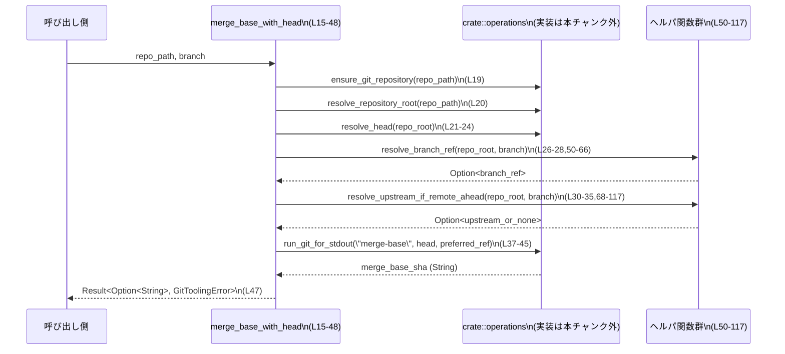

# git-utils\src\branch.rs

## 0. ざっくり一言

ローカルリポジトリの `HEAD` と指定ブランチ（ローカル・リモートの状態を考慮）のあいだの **マージベース（共通祖先コミットの SHA）** を取得するユーティリティ関数と、そのための内部ヘルパ関数・テストが定義されています（`git-utils\src\branch.rs:L10-48,L50-117,L119-255`）。

---

## 1. このモジュールの役割

### 1.1 概要

- このモジュールは **「HEAD と指定ブランチのマージベース SHA を、安全に（エラー/未初期化ケースを区別しつつ）取得したい」という問題** を解決するために存在します。
- `git merge-base HEAD <branch>` 相当の処理を行い、さらに
  - HEAD がまだ無い
  - ブランチが存在しない・解決できない
  場合にはエラーではなく `Ok(None)` を返すように設計されています（`git-utils\src\branch.rs:L10-15,L21-28`）。
- ローカルブランチとその upstream（リモート追跡ブランチ）のどちらを基準にするかを、双方の進み具合から選択します（`git-utils\src\branch.rs:L30-35,L68-117`）。

### 1.2 アーキテクチャ内での位置づけ

- 唯一の公開 API は `merge_base_with_head` であり、他はこの関数からのみ呼ばれる内部ヘルパです（`git-utils\src\branch.rs:L15-48,L50-117`）。
- 外部モジュール `crate::operations` が提供する関数群に依存して、Git リポジトリ存在確認・ルート解決・HEAD 解決・Git コマンド呼び出しを行います（`git-utils\src\branch.rs:L19-21,L37-45,L51-59,L72-81,L93-102`）。

```mermaid
flowchart LR
    Caller["他モジュール / CLI\n(呼び出し側)"]
    MB["merge_base_with_head\n(L15-48)"]
    RBR["resolve_branch_ref\n(L50-66)"]
    RUA["resolve_upstream_if_remote_ahead\n(L68-117)"]
    Ops["crate::operations\n(実装は本チャンク外)"]

    Caller --> MB
    MB --> Ops:::ext  %% ensure_git_repository, resolve_repository_root, resolve_head
    MB --> RBR
    MB --> RUA
    MB --> Ops:::ext  %% run_git_for_stdout("merge-base", ...)

    RBR --> Ops:::ext  %% run_git_for_stdout("rev-parse", ...)
    RUA --> Ops:::ext  %% run_git_for_stdout("rev-parse", "rev-list", ...)

    classDef ext fill:#eee,stroke:#555
```

> `crate::operations` 内の実装ファイルパスは、このチャンクからは分かりません。

### 1.3 設計上のポイント

- 責務の分割  
  - 公開 API: 高レベルな「マージベース取得ロジック」 (`merge_base_with_head`)（`L15-48`）
  - 非公開ヘルパ:
    - ブランチ名のリビジョン解決 (`resolve_branch_ref`)（`L50-66`）
    - upstream が「リモート側が進んでいる」かどうかの判定 (`resolve_upstream_if_remote_ahead`)（`L68-117`）
- 状態管理  
  - すべての関数は引数だけに依存し、モジュール内でグローバル状態は保持しません（`static` や `lazy_static` は存在しない: `git-utils\src\branch.rs` 全体）。
- エラーハンドリング方針
  - git コマンド実行結果を `Result<String, GitToolingError>` として受け取り（`run_git_for_stdout`）、`GitToolingError::GitCommand` の場合の扱いをケースごとに変えています。
    - ブランチが存在しない, upstream が設定されていない, `rev-list` が失敗した、といったケースでは **`Ok(None)` として扱う**（`L61-64,L82-90,L93-106`）。
    - それ以外の I/O などのエラーは **そのまま `Err` として呼び出し元に伝播**します。
  - HEAD やブランチが解決できない場合も、ライブラリ利用者にとっては「正常な '未検出'」として `Ok(None)` を返す設計です（`L21-28`）。
- 並行性
  - 自身は共有状態を持たない純粋な関数群であり、コード上からはスレッド安全性を阻害する要素（`unsafe` やグローバル可変状態）は見られません（`git-utils\src\branch.rs` に `unsafe` 無し）。
  - ただし、背後で利用する Git リポジトリや `crate::operations` 内部の実装の並列実行可否は、このチャンクからは不明です。

---

## 2. 主要な機能一覧

- マージベース取得: `merge_base_with_head` で HEAD と指定ブランチ（ローカル/リモート）の間のマージベース SHA を取得する（`L10-15,L30-47`）。
- ブランチ参照解決: `resolve_branch_ref` でブランチ名から `git rev-parse --verify` 相当の解決を行う（`L50-59`）。
- upstream 進捗判定: `resolve_upstream_if_remote_ahead` で `branch` の upstream が「リモート側が進んでいる」場合のみ、その upstream 名を返す（`L68-117`）。
- テスト用 Git ラッパ: `run_git_in`, `run_git_stdout`, `init_test_repo`, `commit` で実際に `git` コマンドを叩くテスト補助関数を提供する（`L128-165`）。
- 動作検証テスト:
  - ローカルだけのブランチ間のマージベースが期待通りか（`merge_base_returns_shared_commit`）（`L167-194`）。
  - リモートのほうが進んでいる場合に upstream を優先してマージベースを計算するか（`merge_base_prefers_upstream_when_remote_ahead`）（`L196-239`）。
  - ブランチが存在しない場合に `None` を返すか（`merge_base_returns_none_when_branch_missing`）（`L241-255`）。

### 2.1 コンポーネントインベントリー（関数一覧）

| 名前 | 種別 | 公開範囲 | 役割 / 用途 | 定義位置 |
|------|------|----------|-------------|----------|
| `merge_base_with_head` | 関数 | `pub` | HEAD とブランチ（ローカル/リモート）間のマージベース SHA を返す | `git-utils\src\branch.rs:L15-48` |
| `resolve_branch_ref` | 関数 | 非公開 | ブランチ名を `rev-parse --verify` で解決し、存在しなければ `None` を返す | `git-utils\src\branch.rs:L50-66` |
| `resolve_upstream_if_remote_ahead` | 関数 | 非公開 | `branch@{upstream}` を解決し、`rev-list --left-right --count branch...upstream` で upstream 側に新規コミットがあれば upstream 名を返す | `git-utils\src\branch.rs:L68-117` |
| `tests::run_git_in` | テスト補助関数 | テストのみ | 指定ディレクトリで `git` コマンドを実行し、成功をアサートする | `git-utils\src\branch.rs:L128-135` |
| `tests::run_git_stdout` | テスト補助関数 | テストのみ | `git` コマンドの標準出力を UTF-8 文字列として取得 | `git-utils\src\branch.rs:L137-145` |
| `tests::init_test_repo` | テスト補助関数 | テストのみ | 空の Git リポジトリを `main` ブランチで初期化し、`core.autocrlf=false` をセット | `git-utils\src\branch.rs:L147-150` |
| `tests::commit` | テスト補助関数 | テストのみ | 固定のユーザー情報でコミットを作成 | `git-utils\src\branch.rs:L152-165` |
| `tests::merge_base_returns_shared_commit` | テスト | テストのみ | ローカルブランチ間で `git merge-base` の結果と API の結果が一致することを検証 | `git-utils\src\branch.rs:L167-194` |
| `tests::merge_base_prefers_upstream_when_remote_ahead` | テスト | テストのみ | upstream（リモート）が書き換えられて進んでいるケースで upstream を基準にしているか検証 | `git-utils\src\branch.rs:L196-239` |
| `tests::merge_base_returns_none_when_branch_missing` | テスト | テストのみ | ブランチ未存在時に `None` が返ることを検証 | `git-utils\src\branch.rs:L241-255` |

---

## 3. 公開 API と詳細解説

### 3.1 型一覧

このファイル内で新しく定義されている構造体・列挙体はありません。  
外部からインポートしているのは `GitToolingError` のみです（`git-utils\src\branch.rs:L4`）。

### 3.2 関数詳細

#### `merge_base_with_head(repo_path: &Path, branch: &str) -> Result<Option<String>, GitToolingError>`

**概要**

- Git リポジトリ直下または任意の下位ディレクトリ `repo_path` と、ブランチ名 `branch` を受け取り、  
  `git merge-base HEAD <preferred_ref>` 相当のマージベースコミット SHA を返します（`git-utils\src\branch.rs:L10-15,L37-43`）。
- `preferred_ref` はローカルブランチと upstream（リモート追跡ブランチ）を比較し、「リモートが進んでいれば upstream、そうでなければローカルブランチ」を選びます（`git-utils\src\branch.rs:L30-35,L68-117`）。
- HEAD やブランチが存在しないなど、マージベースを特定できない場合は `Ok(None)` を返します（`L21-28`）。

**引数**

| 引数名 | 型 | 説明 |
|--------|----|------|
| `repo_path` | `&Path` | 対象 Git リポジトリのルートまたはその配下のパス（`ensure_git_repository` / `resolve_repository_root` に渡される: `L19-20`）。 |
| `branch` | `&str` | 比較対象ブランチ名（`resolve_branch_ref` や `resolve_upstream_if_remote_ahead` に渡される: `L26,L31`）。 |

**戻り値**

- `Ok(Some(String))`  
  - マージベースコミットが特定できた場合の SHA 文字列です（`L37-47`）。
- `Ok(None)`  
  - 以下のような場合に返ります。
    - リポジトリに HEAD が存在しない（`resolve_head` が `Ok(None)` を返した場合: `L21-24`）。
    - 指定ブランチが存在しない / 解決できない（`resolve_branch_ref` が `Ok(None)` → `L26-28,L50-66`）。
    - upstream が無い、または upstream 判定ロジックが「リモートが進んでいない」と判断した場合（`L30-35,L68-117`）。
- `Err(GitToolingError)`  
  - 上記の「正常な未検出」以外のエラーが発生した場合です。  
    `ensure_git_repository`, `resolve_repository_root`, `resolve_head`, `resolve_branch_ref`, `resolve_upstream_if_remote_ahead`, `run_git_for_stdout` のいずれかが `Err` を返すと、そのまま伝播します（`L19-21,L26-27,L30-32,L37-45`）。

**内部処理の流れ（アルゴリズム）**

1. `ensure_git_repository(repo_path)?` で `repo_path` が Git リポジトリ内であることを検証する（`L19`）。
2. `resolve_repository_root(repo_path)?` でリポジトリルートパス `repo_root` を取得する（`L20`）。
3. `resolve_head(repo_root.as_path())?` で HEAD の参照を取得する。
   - `Some(head)` ならそのまま使用し、`None` なら `Ok(None)` で早期リターンする（`L21-24`）。
4. `resolve_branch_ref(repo_root.as_path(), branch)?` でブランチ名を解決し、`Some(branch_ref)` なら進行、`None` なら `Ok(None)` を返す（`L26-28,L50-66`）。
5. `resolve_upstream_if_remote_ahead(repo_root.as_path(), branch)?` を呼び出し、upstream が「リモートが進んでいる」と判定された場合のみ `preferred_ref` を upstream に置き換える。それ以外はローカルブランチを使用する（`L30-35,L68-117`）。
6. `run_git_for_stdout(repo_root.as_path(), ["merge-base", head, preferred_ref], None)?` を呼び出し、マージベースの SHA を取得する（`L37-45`）。
7. `Ok(Some(merge_base))` を返す（`L47`）。

**Examples（使用例）**

以下は、この関数を CLI ツールなどから呼び出す最小限の例です。  
クレート名は仮に `your_crate` としています。

```rust
use std::path::Path;                                        // Path 型をインポート
use your_crate::branch::merge_base_with_head;               // 公開APIをインポート
use your_crate::GitToolingError;                            // エラー型をインポート

fn main() -> Result<(), GitToolingError> {                  // エラーを伝播するmain
    let repo = Path::new(".");                              // カレントディレクトリをリポジトリとして扱う
    let branch = "main";                                    // 比較対象のブランチ名

    match merge_base_with_head(repo, branch)? {             // マージベースを取得
        Some(sha) => println!("merge-base: {sha}"),         // SHAが取得できた場合
        None => println!("merge-baseを特定できませんでした"), // HEADやブランチが無い等
    }

    Ok(())                                                  // 正常終了
}
```

**Errors / Panics**

- `Err(GitToolingError)` になる代表的なケース
  - `ensure_git_repository`, `resolve_repository_root`, `resolve_head` などが I/O エラー等で失敗した場合（`L19-21`）。
  - `resolve_branch_ref` / `resolve_upstream_if_remote_ahead` / `run_git_for_stdout("merge-base", ...)` が `GitToolingError`（`GitCommand` 以外も含む）を返した場合（`L26-27,L30-32,L37-45`）。  
    ※ ただし、これら内部関数のうち `GitToolingError::GitCommand` を `Ok(None)` に変換している部分もあり、その場合は Err にはなりません（`L61-64,L82-90,L93-106`）。
- この関数内には `panic!` や `unwrap` は存在せず、直接的なパニック要因は見られません（`L15-48`）。

**Edge cases（エッジケース）**

- HEAD が存在しない（unborn ブランチなど）  
  → `resolve_head` が `Ok(None)` を返し、そのまま `Ok(None)` を返す（`L21-24`）。
- ブランチが存在しない / 解決できない  
  → `resolve_branch_ref` が `Ok(None)` → `Ok(None)` を返す（`L26-28,L50-66`）。
- upstream が設定されていない / 無効  
  → `resolve_upstream_if_remote_ahead` が `Ok(None)` となり、ローカルブランチをそのまま比較対象とする（`L30-35,L72-90`）。
- ローカルと upstream が両方進んでいる（履歴が分岐している）ケース  
  → `resolve_upstream_if_remote_ahead` は `right > 0`（upstream 側に固有コミットが 1 つ以上）であれば `Some(upstream)` を返すため、ローカル側も進んでいても upstream を優先します（`L93-96,L108-113`）。
- `git merge-base` 相当のコマンドが失敗した場合  
  → `run_git_for_stdout` が `Err(GitToolingError::GitCommand { .. })` などを返せば、そのまま `Err` として呼び出し元に伝播します（`L37-45`）。

**使用上の注意点**

- `Ok(None)` は「異常系」ではなく「条件的にマージベースが決められない」という **正常系** として扱われています。  
  呼び出し側では `None` の扱いを明示的に設計する必要があります（`L21-28`）。
- リポジトリパスが Git 管理下でない場合は `ensure_git_repository` でエラーになり、`Err(GitToolingError)` として返るため、その場合は `match` などでエラー処理を行う必要があります（`L19`）。
- 内部で複数回 Git コマンド相当の処理を呼び出しているため（HEAD 解決・ブランチ解決・upstream 判定・merge-base 計算: `L21,L26,L30,L37`）、高頻度ループから大量に呼ぶとパフォーマンスに影響する可能性があります。
- スレッド安全性について、この関数自身は共有状態を持たないため同時に複数スレッドから呼び出せますが、同じリポジトリパスに対して同時に書き込みを行うような処理と組み合わせる場合は、Git リポジトリ側の整合性に注意が必要です。

---

#### `resolve_upstream_if_remote_ahead(repo_root: &Path, branch: &str) -> Result<Option<String>, GitToolingError>`

**概要**

- ブランチ `branch` の upstream（通常はリモート追跡ブランチ）を取得し、  
  `rev-list --left-right --count branch...upstream` によって upstream 側が進んでいる場合にのみ、その upstream 名を返す関数です（`git-utils\src\branch.rs:L68-79,L93-100`）。
- upstream が無い、または「リモートが進んでいない」場合は `Ok(None)` を返します（`L82-90,L108-116`）。

**引数**

| 引数名 | 型 | 説明 |
|--------|----|------|
| `repo_root` | `&Path` | Git リポジトリルートパス（`run_git_for_stdout` に渡される: `L72-74,L93-95`）。 |
| `branch` | `&str` | 対象ローカルブランチ名。`"{branch}@{upstream}"` の形で upstream を指定するために用いられます（`L78`）。 |

**戻り値**

- `Ok(Some(String))`  
  - `branch` に上流ブランチが設定されており、`rev-list` の結果 `right > 0`（upstream 側に固有コミットが 1 つ以上）だった場合の upstream 名です（`L82-88,L108-113`）。
- `Ok(None)`  
  - upstream が設定されていない / 空文字列で返ってきた場合（`L82-86`）。
  - upstream 解決や `rev-list` が `GitToolingError::GitCommand { .. }` を返した場合（`L89-90,L103-105`）。
  - `rev-list` は成功したが upstream 側に固有コミットが無い（`right <= 0`）場合（`L108-116`）。
- `Err(GitToolingError)`  
  - 上記以外のエラー（`GitCommand` 以外の `GitToolingError` 等）が発生した場合（`L89-90,L103-106`）。

**内部処理の流れ**

1. `run_git_for_stdout(repo_root, ["rev-parse", "--abbrev-ref", "--symbolic-full-name", "{branch}@{upstream}"], None)` を実行し、upstream 名（例: `origin/main`）を取得（`L72-79`）。
2. 得られた文字列を `trim()` し、空文字列なら `Ok(None)` を返す（`L82-86`）。
3. upstream 解決で `GitToolingError::GitCommand { .. }` によるエラーが発生した場合も、存在しない upstream とみなし `Ok(None)` を返す（`L89`）。
4. それ以外のエラーは `Err(other)` としてそのまま返す（`L90`）。
5. 次に `run_git_for_stdout(repo_root, ["rev-list", "--left-right", "--count", "{branch}...{upstream}"], None)` を実行し、`"left right"` の形式の文字列を得る（`L93-101`）。
6. ここでも `GitCommand` エラーの場合は `Ok(None)`、それ以外は `Err` を返す（`L103-106`）。
7. 出力文字列を `split_whitespace()` で 2 つに分割し、両方を `i64` にパース（失敗時は 0 とみなす）する（`L108-110`）。
8. `right > 0` なら `Ok(Some(upstream))`、そうでなければ `Ok(None)` を返す（`L112-116`）。

**Examples（使用例）**

この関数はモジュール内からのみ呼び出されています。`merge_base_with_head` での利用イメージは以下です（`L30-35`）。

```rust
let preferred_ref =
    if let Some(upstream) = resolve_upstream_if_remote_ahead(repo_root.as_path(), branch)? {
        // upstream が優先されるケース
        resolve_branch_ref(repo_root.as_path(), &upstream)?.unwrap_or(branch_ref)
    } else {
        // upstream が無い、または進んでいない場合はローカルブランチを使う
        branch_ref
    };
```

**Errors / Panics**

- `run_git_for_stdout` が `GitToolingError::GitCommand { .. }` を返した場合は、**Err ではなく `Ok(None)`** を返す設計になっています（`L89-90,L103-105`）。
- `GitCommand` 以外のエラー（どのようなものかは `GitToolingError` の定義次第で、このチャンクからは不明）は `Err` として呼び出し元に伝播します（`L90,L105-106`）。
- `unwrap` は使われておらず、パース失敗時も `unwrap_or(0)` を用いて 0 にフォールバックするため、この関数内の処理でパニックは発生しない設計です（`L108-110`）。

**Edge cases（エッジケース）**

- upstream が設定されていない / `branch@{upstream}` が解決できない  
  → `run_git_for_stdout` が `GitCommand` エラーを返し、`Ok(None)`（`L72-81,L89-90`）。
- `rev-list` の出力フォーマットが想定と違う  
  → `split_whitespace()` の結果が 2 要素未満でも `unwrap_or("0")` を用いるため、両方 0 として扱われ `Ok(None)` になります（`L108-110,L112-116`）。
- ローカルと upstream が互いに複数の固有コミットを持つ場合  
  → `right`（upstream 側固有コミット数）が 0 より大きい限り `Some(upstream)` を返し、ローカル側の進み具合は考慮されません（`L108-113`）。

**使用上の注意点**

- この関数は「upstream が進んでいるかどうか」を判定するロジックであり、ローカルが進んでいるかどうかは UI 上の判断など、呼び出し側で別途考慮する必要があります。
- `GitToolingError::GitCommand` を「存在しない / 設定されていない」と同一視して `Ok(None)` に変換する設計のため、ログなどで「そもそもコマンドが失敗しているかどうか」を観測したい場合は、`run_git_for_stdout` の内部実装や呼び出し箇所にフックを追加する必要があります（このチャンクからは不明）。

---

#### `resolve_branch_ref(repo_root: &Path, branch: &str) -> Result<Option<String>, GitToolingError>`

**概要**

- `git rev-parse --verify <branch>` 相当の処理でブランチ名 `branch` を解決し、  
  成功すれば `Ok(Some(rev))`、ブランチが存在しなければ `Ok(None)` を返す関数です（`git-utils\src\branch.rs:L50-59,L61-65`）。
- この関数は、ブランチ未存在をエラー（`Err`）ではなく `None` として扱うことで、呼び出し側が「ブランチの有無」を判定しやすくしています。

**引数**

| 引数名 | 型 | 説明 |
|--------|----|------|
| `repo_root` | `&Path` | Git リポジトリルートパス（`run_git_for_stdout` の `current_dir` に対応: `L51-53`）。 |
| `branch` | `&str` | 解決対象のブランチ名。`rev-parse --verify` に渡されます（`L54-57`）。 |

**戻り値**

- `Ok(Some(String))`  
  - `run_git_for_stdout` が `Ok(rev)` を返した場合（`L51-52,L61-62`）。
- `Ok(None)`  
  - `run_git_for_stdout` が `Err(GitToolingError::GitCommand { .. })` を返した場合（`L61-64`）。  
    ブランチ未存在や不正なリファレンス名が原因で `rev-parse` が失敗した場合が該当すると考えられますが、詳細は `GitToolingError` の定義次第で、このチャンクからは断定できません。
- `Err(GitToolingError)`  
  - 上記以外のエラー（`GitCommand` 以外）をそのまま返します（`L64-65`）。

**内部処理の流れ**

1. `run_git_for_stdout` に `["rev-parse", "--verify", branch]` を渡して実行する（`L51-57`）。
2. 戻り値 `rev` を `match` で分岐し、成功時は `Ok(Some(rev))` として返す（`L61-62`）。
3. `GitToolingError::GitCommand { .. }` の場合は「ブランチ未存在」などとみなし `Ok(None)` とする（`L61-64`）。
4. それ以外のエラーは `Err(other)` としてそのまま返す（`L64-65`）。

**Examples（使用例）**

`merge_base_with_head` からは以下のように使用されています（`L26-28`）。

```rust
let Some(branch_ref) = resolve_branch_ref(repo_root.as_path(), branch)? else {
    // ブランチが存在しない/解決できない場合はマージベースも求められないため None を返す
    return Ok(None);
};
```

**Errors / Panics**

- `GitToolingError::GitCommand { .. }` → `Ok(None)` として扱われるため、呼び出し側の `?` で伝播することはありません（`L61-64`）。
- それ以外の `GitToolingError` は `Err` として返され、`merge_base_with_head` などで `?` により伝播します（`L64-65`）。
- `unwrap` や `panic!` は用いられていません（`L50-66`）。

**Edge cases（エッジケース）**

- ブランチ名が空文字列の場合  
  → `rev-parse` の扱いは `git` 仕様に依存しますが、失敗した場合でも `GitToolingError::GitCommand` として `Ok(None)` に変換されると考えられます（`L51-57,L61-64`）。
- ブランチ名に特殊な文字が含まれる場合  
  → こちらも `git rev-parse` の仕様に従い、失敗すれば `Ok(None)` になります。

**使用上の注意点**

- この関数だけを直接利用する場合でも、「存在しないブランチ」「不正な名前」が `Err` ではなく `Ok(None)` になることを前提として扱う必要があります。
- 「なぜ解決できなかったのか」（存在しないのか、権限の問題か、など）を区別したい場合は、`GitToolingError` の詳細が必要ですが、このチャンクからはその構造は分かりません。

---

### 3.3 その他の関数（テスト用）

| 関数名 | 役割（1 行） | 定義位置 |
|--------|--------------|----------|
| `tests::run_git_in` | 指定ディレクトリで `git` コマンドを実行し、終了ステータスが成功であることをアサートする | `git-utils\src\branch.rs:L128-135` |
| `tests::run_git_stdout` | `git` コマンドの標準出力を取得し、UTF-8 としてトリムした文字列を返す | `git-utils\src\branch.rs:L137-145` |
| `tests::init_test_repo` | `git init --initial-branch=main` と設定を行うテスト用リポジトリ初期化関数 | `git-utils\src\branch.rs:L147-150` |
| `tests::commit` | 固定ユーザー名とメールアドレスでコミットを作成する | `git-utils\src\branch.rs:L152-165` |
| `tests::merge_base_returns_shared_commit` | ローカルブランチ間で `git merge-base HEAD main` と `merge_base_with_head` の結果が一致することを検証 | `git-utils\src\branch.rs:L167-194` |
| `tests::merge_base_prefers_upstream_when_remote_ahead` | リモート側が履歴を書き換えて進んでいる状況で upstream (`origin/main`) を優先する挙動を検証 | `git-utils\src\branch.rs:L196-239` |
| `tests::merge_base_returns_none_when_branch_missing` | 存在しないブランチ名を渡したときに `Ok(None)` が返ることを検証 | `git-utils\src\branch.rs:L241-255` |

---

## 4. データフロー

ここでは `merge_base_with_head` 呼び出し時の代表的なデータフローを示します。

1. 呼び出し側が `repo_path` と `branch` を指定して `merge_base_with_head` を呼び出す（`L15-18`）。
2. リポジトリ存在確認とルート解決を行う（`L19-20`）。
3. HEAD, ブランチ参照、upstream などを順に解決する（`L21-35,L50-117`）。
4. 最終的に `run_git_for_stdout("merge-base", head, preferred_ref)` によってマージベース SHA を取得し、`Option<String>` に包んで返す（`L37-47`）。



- `Helper` 内ではさらに `run_git_for_stdout` が `rev-parse` や `rev-list` コマンド相当の処理を行っており、その結果を基に `Option<String>` を返します（`L51-59,L72-79,L93-100`）。
- エラーは原則として `GitToolingError` として `Result` で伝播しますが、存在しないブランチや upstream などは `None` として吸収されます（`L61-64,L82-90,L103-106`）。

---

## 5. 使い方（How to Use）

### 5.1 基本的な使用方法

最も典型的な利用は、「現在の HEAD と `main` ブランチのマージベースを取得し、存在するなら表示する」処理です。

```rust
use std::path::Path;                                      // Path型をインポート
use your_crate::branch::merge_base_with_head;             // 公開APIをインポート（クレート名は仮）
use your_crate::GitToolingError;                          // エラー型をインポート

fn main() -> Result<(), GitToolingError> {                // エラーを呼び出し元に伝播するmain
    let repo = Path::new(".");                            // カレントディレクトリを対象リポジトリとみなす
    let branch = "main";                                  // 比較対象ブランチ名

    match merge_base_with_head(repo, branch)? {           // マージベースを取得
        Some(sha) => println!("merge-base: {sha}"),       // マージベースが見つかった場合
        None => println!("merge-baseを特定できませんでした"), // HEADやブランチが未定義の場合など
    }

    Ok(())                                                // 正常終了
}
```

### 5.2 よくある使用パターン

- **リモートとローカルの差分確認前の基準点取得**  
  `git fetch` 実行後に `merge_base_with_head(repo, "main")` を呼び、  
  得られたマージベースを基準に `git log` や `git diff` を行う用途が考えられます。  
  （この用途自体はコードから直接は読み取れませんが、`merge_base` の一般的な使い方として自然です。）
- **ブランチ存在チェック込みのマージベース取得**  
  ブランチが存在しない場合も `Err` ではなく `Ok(None)` となるため、  
  「ブランチが無い場合は 'ブランチ未作成' と表示、それ以外はマージベースを表示」といった分岐を書きやすくなっています（`L26-28,L50-66`）。

### 5.3 よくある間違い

以下はコードから推測される、誤りやすい使用方法とその修正例です。

```rust
# // 誤り例: Ok(None) をエラー扱いしてしまう
# use std::path::Path;
# use your_crate::{branch::merge_base_with_head, GitToolingError};
fn wrong_example() -> Result<(), GitToolingError> {
    let repo = Path::new(".");
    let branch = "main";

    // NG: NoneもErrもまとめて「失敗」として扱っている
    if merge_base_with_head(repo, branch)?.is_none() {   // Noneをエラー扱い
        return Err(GitToolingError::Other(               // 仮のエラー変種名: 実際の定義は不明
            "failed to get merge base".into()
        ));
    }

    Ok(())
}
```

上記のような「`None` をエラー扱いする」コードは、この API の設計意図と合いません。  
正しくは `Err` と `Ok(None)` を区別する必要があります。

```rust
# use std::path::Path;
# use your_crate::{branch::merge_base_with_head, GitToolingError};
fn correct_example() -> Result<(), GitToolingError> {
    let repo = Path::new(".");
    let branch = "main";

    match merge_base_with_head(repo, branch)? {
        Some(sha) => println!("merge-base: {sha}"),      // 正常にマージベース取得
        None => println!("HEADまたはブランチが存在しないため、merge-baseは未定義"), 
    }

    Ok(())
}
```

### 5.4 使用上の注意点（まとめ）

- `Err(GitToolingError)` と `Ok(None)` を区別する  
  - `Err` は「I/O などの失敗」、`None` は「HEAD / ブランチ / upstream が無いなどの正当な未定義」を表します（`L21-28,L61-64,L82-90,L103-106`）。
- リポジトリパスは Git 管理下である必要がある  
  - そうでない場合、`ensure_git_repository` によって `Err` になります（`L19`）。
- 実行環境に Git コマンド相当の処理が存在する前提  
  - `run_git_for_stdout` がどのように実装されているかはこのチャンクからは不明ですが、`"merge-base"`, `"rev-parse"`, `"rev-list"` といったサブコマンド名を渡しているため、それらのコマンドに対応する処理が実行可能である必要があります（`L37-43,L51-57,L72-79,L93-100`）。
- 並列実行時の注意  
  - 関数自体は純粋関数ですが、同一リポジトリに対して並列に書き込み操作を行う他タスクと同時に実行すると、Git 側の状態変化のタイミングにより結果が変わる可能性があります。

---

## 6. 変更の仕方（How to Modify）

### 6.1 新しい機能を追加する場合

例として、「タグに対しても同様のマージベース計算を行いたい」などの機能を追加する場合を考えます。

1. **エントリポイントの選定**  
   - 現在の高レベルロジックは `merge_base_with_head` に集約されているため、  
     新機能が「別のエントリポイントを持つべきか」「既存関数にオプション引数を追加すべきか」を決める必要があります（`L15-48`）。
2. **参照解決ロジックの再利用**  
   - ブランチ名解決と類似の処理であれば、`resolve_branch_ref` に似たヘルパを追加するか、パラメータ化して再利用できるか検討します（`L50-66`）。
3. **upstream 判定ロジックの拡張**  
   - 「リモートが進んでいる場合に upstream を優先する」というロジックは `resolve_upstream_if_remote_ahead` に閉じ込められているため、  
     ここに新しい判定条件を足す、あるいは別関数として切り出すと影響範囲を限定できます（`L68-117`）。
4. **テストの追加**  
   - 既存テストはローカルブランチ・リモート追跡ブランチ・ブランチ未存在の 3 ケースをカバーしています（`L167-255`）。  
     新しい要件に合わせて、同様のスタイルでテストを追加するのが自然です。

### 6.2 既存の機能を変更する場合

- 影響範囲の確認
  - 実際に Git コマンドを叩く部分はすべて `run_git_for_stdout` に集約されており、この関数の呼び出しは `merge_base_with_head`, `resolve_branch_ref`, `resolve_upstream_if_remote_ahead` の 3 箇所にあります（`L37-45,L51-59,L72-81,L93-102`）。
  - upstream 判定ロジックを変える場合は `resolve_upstream_if_remote_ahead` のみが対象です（`L68-117`）。
- 契約（前提条件・返り値の意味）
  - 「未検出は `Ok(None)`」という契約を破ると、既存の呼び出し側・テストが壊れるため、そのまま維持するかどうかを慎重に検討する必要があります（`L21-28,L61-64,L82-90,L103-106,L241-252`）。
- テストの確認
  - 仕様変更時は、既存テスト 3 本の意図を確認し、必要に応じて期待値を更新するか新規テストを追加します（`L167-194,L196-239,L241-255`）。

---

## 7. 関連ファイル

| パス | 役割 / 関係 |
|------|------------|
| `crate::operations`（正確なファイルパスは不明） | `ensure_git_repository`, `resolve_head`, `resolve_repository_root`, `run_git_for_stdout` を提供し、本モジュールから Git 関連の下位操作として呼び出されます（`git-utils\src\branch.rs:L5-8,L19-21,L37-45,L51-59,L72-81,L93-102`）。 |
| `crate::GitToolingError`（定義ファイルはこのチャンクには現れない） | すべての公開・非公開関数で共通して使用されるエラー型です（`git-utils\src\branch.rs:L4,L15-18,L50-52,L68-71,L167-168,L196-197,L241-242`）。 |
| `git-utils\src\branch.rs` 内 `tests` モジュール | このファイル自身に定義されるテスト群であり、`merge_base_with_head` の主要な挙動（ローカルブランチ、リモート優先、ブランチ未存在）を検証します（`git-utils\src\branch.rs:L119-255`）。 |

このチャンクでは上記以外のファイルは登場せず、他モジュールとの関係については追加情報が無いため不明です。
