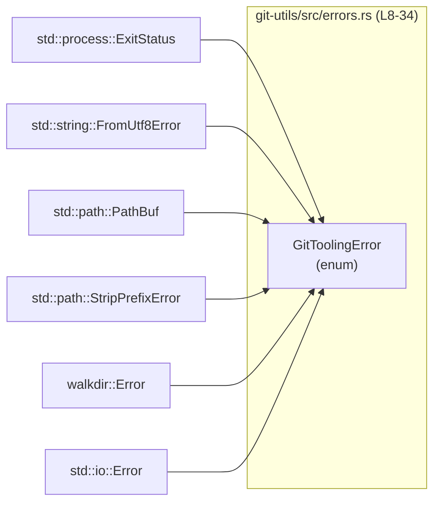
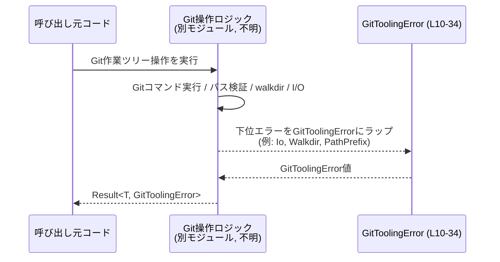

# git-utils/src/errors.rs コード解説

## 0. ざっくり一言

`GitToolingError` という 1 つの公開 enum を定義し、Git の作業ツリー（worktree）スナップショット管理で発生しうるエラーを型として整理するモジュールです（`git-utils/src/errors.rs:L8-10`）。  
標準ライブラリや `walkdir` などの下位エラーを一つのドメイン固有エラー型にまとめています（`git-utils/src/errors.rs:L11-34`）。

---

## 1. このモジュールの役割

### 1.1 概要

- 「Git worktree スナップショットを管理する処理」から返されるエラーを表現するための共通エラー型を提供します（`git-utils/src/errors.rs:L8-10`）。
- Git コマンドの失敗、UTF-8 でない出力、Git リポジトリでないパス、リポジトリ外へのパス逸脱、`walkdir` や標準 I/O のエラーなど、複数のエラー要因を 1 つの enum に集約します（`git-utils/src/errors.rs:L11-34`）。
- `thiserror::Error` の derive と `#[from]` 属性により、下位エラーから `GitToolingError` への変換を自動化し、`?` 演算子で自然に伝播できるようにしています（`git-utils/src/errors.rs:L5-6,L9,L29-34`）。

### 1.2 アーキテクチャ内での位置づけ

このモジュールは、Git ツール系ロジックの「エラー表現層」にあたると解釈できます。

依存関係（このファイル内で確認できる範囲）:

- 依存しているもの（入力側）
  - `std::process::ExitStatus`（Git コマンドの終了ステータス）`git-utils/src/errors.rs:L2,L14`
  - `std::string::FromUtf8Error`（非 UTF-8 文字列エラー）`git-utils/src/errors.rs:L3,L21`
  - `std::path::PathBuf`（ファイルパス）`git-utils/src/errors.rs:L1,L24,L26,L28`
  - `std::path::StripPrefixError`（パスのプレフィックス処理エラー）`git-utils/src/errors.rs:L30`
  - `std::io::Error`（一般的な I/O エラー）`git-utils/src/errors.rs:L34`
  - `walkdir::Error`（ディレクトリ再帰走査エラー）`git-utils/src/errors.rs:L6,L32`
  - `thiserror::Error`（エラー derive マクロ）`git-utils/src/errors.rs:L5,L9`
- このモジュールを利用する側（出力側）
  - このチャンクには現れません（どのファイルから `GitToolingError` が使われているかは不明です）。

依存関係の概念図（このファイルに現れる範囲のみ）:



### 1.3 設計上のポイント

コードから読み取れる特徴を列挙します。

- **単一のドメインエラー型**  
  - Git 関連の様々な失敗要因を `GitToolingError` 1 つの enum に集約しています（`git-utils/src/errors.rs:L10-34`）。
- **コンテキスト付きエラー**  
  - Git コマンド関連のエラーでは、実行したコマンド文字列・終了ステータス・標準エラー出力などのコンテキストを保持します（`git-utils/src/errors.rs:L11-16,L17-22`）。
- **パス検証の契約を反映した型**  
  - リポジトリでないパス、相対でないパス、リポジトリ外へ逸脱するパスといった条件を、専用のバリアントとして区別しています（`git-utils/src/errors.rs:L23-28`）。
- **下位エラーの透過的なラップ**  
  - `PathPrefix`, `Walkdir`, `Io` バリアントは、`#[from]` と `#[error(transparent)]` により下位エラーを透過的にラップし、`From` 実装を自動生成する構造になっています（`git-utils/src/errors.rs:L29-34`）。
- **安全性・並行性**  
  - このファイルは安全な Rust のみを使用し、`unsafe` は含まれていません（`git-utils/src/errors.rs` 全体）。  
  - すべてのフィールドは所有データ（`String`, `PathBuf` 等）または標準／外部エラー型であり、内部可変性や共有状態は持っていません（`git-utils/src/errors.rs:L11-16,L18-22,L23-34`）。

---

## 2. 主要な機能一覧

このモジュールが提供する主要な機能を列挙します。

- Git 関連処理の共通エラー型 `GitToolingError` の定義（`git-utils/src/errors.rs:L8-10`）
- Git コマンド失敗時の詳細情報（コマンド文字列・終了ステータス・stderr）の保持（`GitCommand` バリアント, `git-utils/src/errors.rs:L11-16`）
- Git コマンド出力が UTF-8 として解釈できない場合のエラー表現（`GitOutputUtf8`, `git-utils/src/errors.rs:L17-22`）
- Git リポジトリでないパスの検出と表現（`NotAGitRepository`, `git-utils/src/errors.rs:L23-24`）
- リポジトリルートからの相対パスでないパスの検出（`NonRelativePath`, `git-utils/src/errors.rs:L25-26`）
- リポジトリルート外へ抜けるパスの検出（`PathEscapesRepository`, `git-utils/src/errors.rs:L27-28`）
- `StripPrefixError` / `walkdir::Error` / `std::io::Error` を `GitToolingError` に自動変換するラッパー（`PathPrefix`, `Walkdir`, `Io`, `git-utils/src/errors.rs:L29-34`）

---

## 3. 公開 API と詳細解説

### 3.1 型一覧（構造体・列挙体など）

#### コンポーネントインベントリー

このチャンクに現れる型とバリアントを一覧します。

| 名前 | 種別 | 公開? | 行範囲 | 役割 / 用途 |
|------|------|-------|--------|-------------|
| `GitToolingError` | 列挙体 (enum) | `pub` | `git-utils/src/errors.rs:L10-34` | Git worktree 管理で発生しうるエラーをまとめたドメイン固有エラー型 |
| `GitToolingError::GitCommand` | バリアント | - | `git-utils/src/errors.rs:L11-16` | Git コマンドの終了ステータスが失敗だった場合のエラー。コマンド文字列・終了ステータス・標準エラー出力を保持 |
| `GitToolingError::GitOutputUtf8` | バリアント | - | `git-utils/src/errors.rs:L17-22` | Git コマンド出力が UTF-8 でデコードできなかった場合のエラー。コマンド文字列と `FromUtf8Error` を保持 |
| `GitToolingError::NotAGitRepository` | バリアント | - | `git-utils/src/errors.rs:L23-24` | 指定パスが Git リポジトリでない場合のエラー |
| `GitToolingError::NonRelativePath` | バリアント | - | `git-utils/src/errors.rs:L25-26` | リポジトリルートからの相対パスでないパスを検出した場合のエラー |
| `GitToolingError::PathEscapesRepository` | バリアント | - | `git-utils/src/errors.rs:L27-28` | 正規化結果がリポジトリルート外へ抜けるパスになった場合のエラー |
| `GitToolingError::PathPrefix` | バリアント | - | `git-utils/src/errors.rs:L29-30` | 作業ツリー内のパス処理で `StripPrefixError` が発生した場合のラッパー |
| `GitToolingError::Walkdir` | バリアント | - | `git-utils/src/errors.rs:L31-32` | `walkdir::Error` を透過的にラップするエラー |
| `GitToolingError::Io` | バリアント | - | `git-utils/src/errors.rs:L33-34` | `std::io::Error` を透過的にラップする一般的な I/O エラー |

補足:

- `#[derive(Debug, Error)]` により、`GitToolingError` は標準の `std::error::Error` トレイトを実装し、`?` 演算子で扱えるエラー型になります（`git-utils/src/errors.rs:L5,L9`）。
- `PathPrefix`, `Walkdir`, `Io` の各バリアントのフィールドに付与された `#[from]` 属性により、それぞれの下位エラーから `GitToolingError` への `From` 実装が生成されます（`git-utils/src/errors.rs:L29-34`）。これは `thiserror` クレートの仕様に基づく挙動です。

### 3.2 関数詳細（最大 7 件）

このファイル内には **明示的な関数定義は存在しません**（メタ情報 `functions=0` とコードからの確認による）。  
そのため、通常の「関数シグネチャに基づく詳細解説」は該当しません。

ただし、`thiserror::Error` と `#[from]` により **暗黙的な変換関数（`From` 実装）** が生成される点は重要です。概念的には次のような変換が存在します（実際のコードはマクロ展開により生成され、明示的には書かれていません）。

#### `impl From<std::io::Error> for GitToolingError`（概念的な説明）

**概要**

- `Io` バリアント（`Io(#[from] std::io::Error)`）により、`std::io::Error` から `GitToolingError` への変換が自動生成されます（`git-utils/src/errors.rs:L33-34`）。
- これにより、`Result<_, std::io::Error>` を返す処理の上位で `Result<_, GitToolingError>` として `?` 演算子で伝播できます。

**引数 / 戻り値**

- 概念的なシグネチャ: `fn from(err: std::io::Error) -> GitToolingError`
- 戻り値は `GitToolingError::Io(err)` に相当します。

**内部処理の流れ（アルゴリズム）**

- 受け取った `std::io::Error` を、そのまま `Io` バリアントの内部フィールドとして包みます。

同様の変換が `StripPrefixError`（`PathPrefix` バリアント, `git-utils/src/errors.rs:L29-30`）や `walkdir::Error`（`Walkdir` バリアント, `git-utils/src/errors.rs:L31-32`）に対しても生成されると考えられます（`thiserror` の仕様に基づく）。

### 3.3 その他の関数

- このチャンクには補助関数やラッパー関数は定義されておらず、すべて型定義のみです。

---

## 4. データフロー

このモジュールはエラー型のみを定義しており、実際の処理フロー（Git コマンド実行など）は他のモジュール側にあります。このファイルから読み取れる範囲で、**エラーの流れ** を概念図として示します。



注意:

- `GitOps` に相当する具体的な関数やモジュールは、このチャンクには現れません。上図は、`GitToolingError` が Result のエラー型として使われる典型像を示した概念図です。
- `PathPrefix`, `Walkdir`, `Io` バリアントは、`#[from]` により下位エラーから自動変換されるため、`GitOps` 側では `?` 演算子を使うだけで `GitToolingError` にまとめられる設計になっています（`git-utils/src/errors.rs:L29-34`）。

---

## 5. 使い方（How to Use）

### 5.1 基本的な使用方法

`GitToolingError` をエラー型として利用する、典型的な関数の例です（この関数自体はリポジトリには含まれていません。使用例です）。

```rust
use std::process::Command;                           // Gitコマンド実行に使用する
use std::path::{Path, PathBuf};                     // パス操作に使用する
use git_utils::errors::GitToolingError;             // 本モジュールのエラー型をインポートする（仮のパス）

// Gitリポジトリ内でファイル一覧を取得する関数の例
fn list_files_in_repo(repo_root: &Path) -> Result<Vec<PathBuf>, GitToolingError> {
    // リポジトリ判定に失敗した場合に NotAGitRepository を返すような処理を行う想定
    if !repo_root.join(".git").is_dir() {           // .git ディレクトリの存在を確認
        return Err(GitToolingError::NotAGitRepository {
            path: repo_root.to_path_buf(),          // エラー文言用にパスを保持
        });
    }

    // walkdir を使った走査。walkdir::Error は `?` により GitToolingError::Walkdir に変換される
    let mut paths = Vec::new();
    for entry in walkdir::WalkDir::new(repo_root) { // ディレクトリを再帰走査
        let entry = entry?;                         // walkdir::Error -> GitToolingError::Walkdir
        paths.push(entry.path().to_path_buf());
    }

    Ok(paths)                                       // 正常ならパス一覧を返す
}
```

ポイント:

- 戻り値のエラー型を `Result<_, GitToolingError>` にすることで、本モジュールのエラー表現に統一できます。
- `Walkdir` や `Io` バリアントに付いている `#[from]` により、`walkdir::Error` や `std::io::Error` を `?` で簡潔に伝播できます（`git-utils/src/errors.rs:L29-34`）。

### 5.2 よくある使用パターン

1. **上位 API の共通エラー型として採用**

   ```rust
   pub fn snapshot_worktree(/* ... */) -> Result<(), GitToolingError> {
       // 内部で Git コマンド実行、ファイル I/O、walkdir などを行う
       // それぞれのエラーは `?` 演算子で GitToolingError に変換して返す
       Ok(())
   }
   ```

2. **バリアントに応じたエラー処理**

   ```rust
   fn handle_error(err: GitToolingError) {
       match err {
           GitToolingError::GitCommand { command, status, stderr } => {
               eprintln!("git失敗: {command} -> {status:?}: {stderr}");
           }
           GitToolingError::NotAGitRepository { path } => {
               eprintln!("指定ディレクトリはGitリポジトリではありません: {path:?}");
           }
           other => {
               // それ以外はログに残して上位に再度渡すなど
               eprintln!("作業ツリーエラー: {other}");
           }
       }
   }
   ```

### 5.3 よくある間違い

このファイルから推測できる範囲で、起こりうる誤用例と正しい使い方を示します。

```rust
// 誤り例: 下位エラーをそのまま返してしまう
fn do_something() -> Result<(), std::io::Error> {
    // 他の部分では Result<_, GitToolingError> を使っているのに、
    // ここだけ std::io::Error を返してしまうとエラー型が揃わない
    std::fs::read_to_string("config.txt")?;
    Ok(())
}

// 正しい例: GitToolingError に統一する
fn do_something_fixed() -> Result<(), GitToolingError> {
    // Io バリアントの #[from] により std::io::Error からの変換が自動で行われる
    std::fs::read_to_string("config.txt")?; // std::io::Error -> GitToolingError::Io
    Ok(())
}
```

### 5.4 使用上の注意点（まとめ）

**契約・前提条件（Contracts）**

- パス関連バリアントから読み取れる契約（`git-utils/src/errors.rs:L23-28`）:
  - リポジトリのルートディレクトリは Git リポジトリ（`.git` を含む）であることが前提。
  - 呼び出し元が扱うパスは「リポジトリルートからの相対パス」であること。
  - 正規化・結合後にリポジトリ外へ出るパスは許容されない。
- これらの前提が守られない場合、それぞれ `NotAGitRepository` / `NonRelativePath` / `PathEscapesRepository` が選択される設計になっています。

**エッジケース**

- 非 UTF-8 出力 (`GitOutputUtf8`, `git-utils/src/errors.rs:L17-22`)  
  - Git コマンドの出力がバイナリ混在で UTF-8 として不正な場合に検出されます。
  - 呼び出し側が UTF-8 以外のエンコーディングを許容したい場合には、別途設計が必要です（この型は UTF-8 前提の設計になっています）。
- パスの正規化・結合  
  - パス処理で `StripPrefixError` が発生した場合は、`PathPrefix` バリアントでラップされます（`git-utils/src/errors.rs:L29-30`）。
  - どの条件で `StripPrefixError` が発生するかは、このチャンクの外（パス処理ロジック）に依存し、このファイルからは分かりません。

**Bugs / Security 観点**

- このファイルには `unsafe` コードや共有可変状態はなく、エラーは不変データとして保持されるだけです（`git-utils/src/errors.rs` 全体）。
- `PathEscapesRepository` バリアント（`git-utils/src/errors.rs:L27-28`）から、リポジトリ外へ抜けるパスを検出している設計意図が読み取れます。これはディレクトリトラバーサル的な問題を防ぐための安全策として機能しうると解釈できます。
- `GitCommand` バリアントの `stderr: String` には、Git コマンドの出力がそのまま入る想定です（`git-utils/src/errors.rs:L11-16`）。  
  エラー内容を UI に表示する際には、出力がユーザーの入力を含む可能性がある点を考慮し、適切なサニタイズやエスケープを行う必要があります（このファイル内での扱いは読み取れません）。

**パフォーマンス・スケーラビリティ**

- 各バリアントは `String` や `PathBuf` を所有しているため、エラーが大量に生成されるケースではメモリ使用量が増えますが、通常のエラー頻度であれば問題になりにくい設計です（`git-utils/src/errors.rs:L11-16,L18-24,L26-28`）。
- `Walkdir` や `Io` のようなラッパーバリアントは下位エラーをそのまま包むだけであり、余計なコピーや変換は発生しません（`git-utils/src/errors.rs:L31-34`）。

**観測性（Observability）**

- 各バリアントには、人間が読めるエラーメッセージが `#[error("...")]` として付与されています（`git-utils/src/errors.rs:L11,17,23,25,27,29`）。
- `#[error(transparent)]` が付いた `Walkdir` / `Io` は、下位エラーのメッセージをそのまま再利用するため、ログや UI に出す際にも情報が失われにくい構造になっています（`git-utils/src/errors.rs:L31,33`）。

---

## 6. 変更の仕方（How to Modify）

### 6.1 新しい機能を追加する場合（新しいエラー要因の追加）

新たなエラー要因を表現したい場合、次のステップが自然です。

1. **バリアントの追加**
   - `GitToolingError` に新しいバリアントを追加します（`git-utils/src/errors.rs:L10-34`）。
   - 例: 認証エラーを表す `Auth` バリアントなど。
2. **エラーメッセージの定義**
   - `#[error("...")]` 属性で、人間が理解しやすいメッセージを付与します（既存バリアントを参考、`git-utils/src/errors.rs:L11,17,23,25,27,29`）。
3. **必要に応じて `#[from]` を付ける**
   - 下位エラー型からの自動変換を行いたい場合、フィールドに `#[from]` を付けます（`PathPrefix`, `Walkdir`, `Io` を参照, `git-utils/src/errors.rs:L29-34`）。
4. **呼び出し側での利用**
   - 新しいエラー要因が発生する箇所で、そのバリアントを生成するようにコードを変更します。  
   - このチャンクには呼び出しコードがないため、どこを変更するかは不明です。

### 6.2 既存の機能を変更する場合

- **バリアント名やフィールドの変更**
  - `GitToolingError` は公開型 (`pub`) のため、そのバリアントをパターンマッチしている呼び出し側コードが存在する可能性があります（`git-utils/src/errors.rs:L10`）。
  - 名前やフィールド構造を変えると、外部コードのコンパイルエラーにつながるため、影響範囲の確認が必要です（このチャンクからは利用箇所は分かりません）。
- **エラーメッセージの変更**
  - `#[error("...")]` 内の文字列を変更しても、型シグネチャには影響しません（`git-utils/src/errors.rs:L11,17,23,25,27,29`）。
  - ただし、テストでメッセージ文字列を直接比較している場合は影響します（テストコードはこのチャンクには現れません）。
- **`#[from]` や `#[error(transparent)]` の削除／追加**
  - 削除すると、対応する `From` 実装が生成されなくなり、`?` 演算子による暗黙変換が使えなくなります。
  - 追加すると、新たに自動変換が利用できるようになります。  
  - これらは `thiserror` の仕様に依存し、このファイルだけでマクロ展開後のコードは確認できません。

---

## 7. 関連ファイル

このチャンクから直接分かる関連は、外部クレートや標準ライブラリとの関係のみです。  
同一クレート内の他ファイルとの関係は、このチャンクには現れません。

| パス / クレート | 役割 / 関係 |
|----------------|------------|
| `std::path::PathBuf` (`git-utils/src/errors.rs:L1,L24,L26,L28`) | パス情報を保持するための標準ライブラリ型 |
| `std::process::ExitStatus` (`git-utils/src/errors.rs:L2,L14`) | Git コマンドの終了ステータスを表現する型 |
| `std::string::FromUtf8Error` (`git-utils/src/errors.rs:L3,L21`) | UTF-8 デコード失敗を表現する標準エラー型 |
| `std::path::StripPrefixError` (`git-utils/src/errors.rs:L30`) | パスプレフィックス除去に失敗した場合の標準エラー型 |
| `std::io::Error` (`git-utils/src/errors.rs:L34`) | 一般的な I/O エラー型 |
| `thiserror::Error` (`git-utils/src/errors.rs:L5,L9`) | エラー型 derive 用の外部クレート。`GitToolingError` に `Error` 実装や `From` 実装を与える |
| `walkdir::Error` (`git-utils/src/errors.rs:L6,L32`) | ディレクトリ再帰走査で発生するエラー型 |

**テストコード**

- このチャンクにはテストコード（`#[cfg(test)]` モジュールなど）は現れません。  
  そのため、`GitToolingError` の振る舞いを検証するテストがどこにあるか、存在するかどうかは分かりません。
