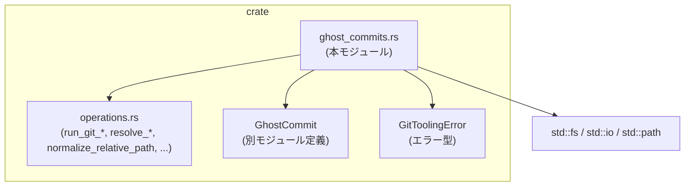

git-utils/src/ghost_commits.rs

---

## 0. ざっくり一言

- Git リポジトリのワーキングツリーの状態を「ゴーストコミット」として一時的に保存し、後から安全に復元するためのユーティリティです。
- トラッキングされていないファイルや大きな生成物ディレクトリを扱うためのフィルタリングと保存ポリシーも含まれます。

> 注: 提示されたチャンクには行番号情報が含まれていないため、`ファイル名:L開始-終了` 形式での厳密な行番号は記載できません。根拠は関数・型名とコード上の挙動で示します。

---

## 1. このモジュールの役割

### 1.1 概要

- このモジュールは **Git ワーキングツリーの現在の状態を、参照が更新されない「隠れコミット（ghost commit）」として保存し、後からその状態に復元する** ために存在します。
- 具体的には、以下を行います。
  - 一時的な Git インデックス（`GIT_INDEX_FILE`）を使って、ワーキングツリーのスナップショットを作成し、`git commit-tree` でコミットオブジェクトだけを作成する。
  - スナップショット取得時に存在した「未追跡ファイル／ディレクトリ」の情報を保持し、復元時に「後から作られた未追跡のゴミ」だけを安全に掃除する。
  - サイズの大きな未追跡ファイル・ディレクトリや依存物ディレクトリ（`node_modules` など）を、スナップショットから除外／特別扱いする。

### 1.2 アーキテクチャ内での位置づけ

このモジュールは、`crate::operations` が提供する Git コマンドラッパーの上に構築された高レベルユーティリティです。



- `ghost_commits.rs`
  - 公開 API: ゴーストコミットの作成・復元 (`create_ghost_commit*`, `restore_ghost_commit*`, `capture_ghost_snapshot_report`)
  - 内部: Git ステータス解析、未追跡ファイルのスナップショット・フィルタリング
- `operations.rs`（外部モジュール）
  - `run_git_for_status`, `run_git_for_stdout`, `run_git_for_stdout_all` などの Git 実行ラッパー
  - `ensure_git_repository`, `resolve_repository_root`, `resolve_head`, `normalize_relative_path` などの基盤機能
- `GhostCommit`
  - ゴーストコミットIDと、スナップショット取得時点での「既存の未追跡ファイル／ディレクトリ」のリストを保持する型です（定義は別ファイル）。

### 1.3 設計上のポイント

- **一時インデックスを使用**
  - `tempfile::Builder` で一時ディレクトリを作成し、`GIT_INDEX_FILE` を設定して `git read-tree`, `git add`, `git write-tree`, `git commit-tree` を実行します。
  - これにより、ユーザーの通常のインデックス（ステージング状態）を壊さずにスナップショットを作成します。

- **参照を更新しないコミット**
  - `git commit-tree` を直接呼び出してコミットオブジェクトだけを作成し、ブランチや HEAD を更新しません。
  - ゴーストコミット ID は `GhostCommit` 経由でアプリケーション側に渡されます。

- **未追跡ファイルの二重管理**
  - 「スナップショットに含める未追跡ファイル」と「スナップショットには含めないが削除対象からも除外する大きな未追跡ファイル／ディレクトリ」を区別して管理します。
  - `UntrackedSnapshot` と `StatusSnapshot` で詳細に管理しています。

- **デフォルト無視ディレクトリ**
  - `.gitignore` に書かれていなくても、`node_modules`, `.venv`, `build` などの既定ディレクトリは完全に無視します（スナップショットにも、削除対象にも含めない）。

- **サブディレクトリスコープ**
  - `repo_subdir` と `repo_prefix` を用いることで、リポジトリ内のサブディレクトリに対して相対的にスナップショット／復元を行えます（テスト `restore_from_subdirectory_*` 参照）。

- **エラーハンドリング**
  - すべての公開関数は `Result<_, GitToolingError>` を返し、Git コマンド失敗や I/O エラーを一元的に伝播します。
  - `ensure_git_repository` で非 Git ディレクトリを早期に検出し、`GitToolingError::NotAGitRepository` を返します（テスト `restore_requires_git_repository`）。

- **安全性 (Rust 観点)**
  - このモジュール内に `unsafe` コードはなく、同期処理のみです。
  - すべての外部コマンド呼び出しはラッパー関数を通じて行われ、戻り値は `Result` で検査されます。

---

## 2. 主要な機能一覧

- ゴーストコミットの作成:
  - `create_ghost_commit`: ワーキングツリーのスナップショットからゴーストコミットを作成する。
  - `create_ghost_commit_with_report`: ゴーストコミットと、除外された未追跡ファイル／ディレクトリのレポートを同時に返す。

- スナップショットレポートのみ取得:
  - `capture_ghost_snapshot_report`: コミットを作らずに、現在の未追跡状況レポートだけを取得する。

- ゴーストコミットからの復元:
  - `restore_ghost_commit`: `GhostCommit` オブジェクトに基づいてワーキングツリーを復元し、「新しく増えた未追跡ファイル」を削除する。
  - `restore_ghost_commit_with_options`: 復元時の大きな未追跡ファイル・ディレクトリの扱いをオプションで制御する。
  - `restore_to_commit`: 単純にコミット ID にワーキングツリーを合わせる（未追跡ファイルのクリーンアップは行わない）。

- Git ステータススナップショット:
  - `capture_status_snapshot`: `git status --porcelain=2 -z` をパースし、追跡済み・未追跡・大きな未追跡ディレクトリなどの情報をまとめて取得する。

- 大きな未追跡ディレクトリ検出:
  - `detect_large_untracked_dirs`: 未追跡ファイルとディレクトリ一覧から、しきい値以上のファイル数を持つディレクトリを検出する。

- 未追跡ファイルの削除:
  - `remove_new_untracked`: スナップショット時点で存在していなかった未追跡ファイル／ディレクトリだけを削除する。

- オプションと設定:
  - `CreateGhostCommitOptions`, `RestoreGhostCommitOptions`, `GhostSnapshotConfig`: ゴーストコミット作成／復元の挙動を細かく制御する設定オブジェクト。
  - `GhostSnapshotReport`, `LargeUntrackedDir`, `IgnoredUntrackedFile`: スナップショット時の統計情報を表す型。

---

## 3. 公開 API と詳細解説

### 3.1 型一覧（構造体・列挙体など）

| 名前 | 種別 | 公開性 | 主なフィールド / 役割 |
|------|------|--------|------------------------|
| `CreateGhostCommitOptions<'a>` | 構造体 | `pub` | ゴーストコミット作成時のオプション。`repo_path`, `message`, `force_include`, `ghost_snapshot` を保持します。 |
| `RestoreGhostCommitOptions<'a>` | 構造体 | `pub` | ゴーストコミット復元時のオプション。`repo_path`, `ghost_snapshot` を保持します。 |
| `GhostSnapshotConfig` | 構造体 | `pub` | スナップショット時に「大きな未追跡ファイル／ディレクトリ」をどう扱うかを制御します。`ignore_large_untracked_files`, `ignore_large_untracked_dirs`, `disable_warnings`。 |
| `GhostSnapshotReport` | 構造体 | `pub` | ゴーストスナップショット時に「除外された大きな未追跡ファイル／ディレクトリ」をまとめたレポート。 |
| `LargeUntrackedDir` | 構造体 | `pub` | 検出された大きな未追跡ディレクトリ（`path`, `file_count`）。 |
| `IgnoredUntrackedFile` | 構造体 | `pub` | サイズが大きいためスナップショットから除外された未追跡ファイル（`path`, `byte_size`）。 |
| `UntrackedSnapshot` | 構造体 | `fn` 内部 | 未追跡ファイル／ディレクトリの詳細スナップショット。公開されません。 |
| `StatusSnapshot` | 構造体 | `fn` 内部 | 追跡済みパスと `UntrackedSnapshot` をまとめた内部用構造体。 |

> すべての構造体定義は `git-utils/src/ghost_commits.rs` 内にありますが、このチャンクには行番号情報が含まれていないため、正確な行番号は記載できません。

### 3.2 関数詳細（代表 7 件）

#### `create_ghost_commit(options: &CreateGhostCommitOptions<'_>) -> Result<GhostCommit, GitToolingError>`

**概要**

- ワーキングツリーの現在の状態をゴーストコミットとして保存します。
- 実体は `create_ghost_commit_with_report` を呼び出し、レポート部分を捨てています。

**引数**

| 引数名 | 型 | 説明 |
|--------|----|------|
| `options` | `&CreateGhostCommitOptions<'_>` | リポジトリパス・メッセージ・強制的に含めるパス・スナップショット設定を含むオプション。 |

**戻り値**

- `Ok(GhostCommit)`: 作成されたゴーストコミット。コミット ID とスナップショット時の「既存未追跡ファイル／ディレクトリ」の情報を持ちます。
- `Err(GitToolingError)`: Git コマンド失敗、リポジトリでないディレクトリなど。

**内部処理の流れ**

1. `create_ghost_commit_with_report(options)` を呼び出します。
2. 戻り値の `(GhostCommit, GhostSnapshotReport)` から `GhostCommit` 部分だけを返します。

**Examples（使用例）**

```rust
use git_utils::ghost_commits::{CreateGhostCommitOptions, create_ghost_commit};
use git_utils::GhostCommit;
use git_utils::GitToolingError;
use std::path::Path;

fn snapshot_repo(repo: &Path) -> Result<GhostCommit, GitToolingError> {
    // オプションを生成し、カスタムメッセージを設定する
    let options = CreateGhostCommitOptions::new(repo)
        .message("my snapshot");

    // ゴーストコミットを作成
    let ghost = create_ghost_commit(&options)?;
    Ok(ghost)
}
```

**Errors / Panics**

- `ensure_git_repository` が失敗した場合: `GitToolingError::NotAGitRepository` など。
- `resolve_repository_root` や Git コマンド (`run_git_for_status` など) の失敗は、`GitToolingError` として伝播します。
- パニックは発生しない設計です（`unwrap` / `expect` はテストコード以外では使用されていません）。

**Edge cases（エッジケース）**

- HEAD が存在しないリポジトリ:
  - `resolve_head` が「親なし」を返すケースを考慮しており、親のないコミットとしてゴーストコミットが作られます（テスト `create_snapshot_without_existing_head`）。
- `options.message` が `None` の場合:
  - デフォルトメッセージ `"codex snapshot"` が使用されます。

**使用上の注意点**

- `options.repo_path` は Git リポジトリ内である必要があります（サブディレクトリも可）。
- ゴーストコミットはブランチにぶら下がらない孤立コミットです。参照管理は呼び出し側の責任になります。

---

#### `create_ghost_commit_with_report(options: &CreateGhostCommitOptions<'_>) -> Result<(GhostCommit, GhostSnapshotReport), GitToolingError>`

**概要**

- ゴーストコミットを作成し、その過程で
  - スナップショットから除外された大きな未追跡ファイル
  - 大きな未追跡ディレクトリ
  の一覧を `GhostSnapshotReport` として返します。

**引数**

同上 `options: &CreateGhostCommitOptions<'_>`。

**戻り値**

- `Ok((GhostCommit, GhostSnapshotReport))`
  - `GhostCommit`: 実際のスナップショットコミット。
  - `GhostSnapshotReport`: 除外された未追跡ファイル／ディレクトリのリスト。

**内部処理の流れ**

1. `ensure_git_repository(options.repo_path)` で対象が Git リポジトリであることを確認。
2. `resolve_repository_root` と `repo_subdir` で
   - リポジトリルート (`repo_root`)
   - `options.repo_path` から見た相対プレフィックス (`repo_prefix`)
   を取得。
3. `resolve_head(repo_root)` で親コミット ID（存在しない場合は `None`）を取得。
4. `prepare_force_include(repo_prefix, &options.force_include)` で強制含有パスを正規化し、リポジトリからの脱出を検査。
5. `capture_status_snapshot(...)` を呼び出して、以下を取得。
   - 追跡済みファイル (`tracked_paths`)
   - 未追跡ファイル・ディレクトリ・大きな未追跡ファイル／ディレクトリ情報 (`UntrackedSnapshot`)
6. 未追跡スナップショットから、警告用の
   - `warning_ignored_files` (`IgnoredUntrackedFile` の Vec)
   - `large_untracked_dirs` (`LargeUntrackedDir` の Vec)
   を作成。
7. 一時ディレクトリを作成し、`GIT_INDEX_FILE` 環境変数を設定。
8. 親がある場合は `git read-tree <parent>` を一時インデックスに対して実行し、既存の追跡ファイルを読み込む。
9. インデックスに追加するパス
   - `tracked_paths`
   - 大きさ制限で除外されなかった未追跡ファイル (`untracked_files_for_index`)
   を結合し、`dedupe_paths` で重複を除去。
10. `add_paths_to_index` で、これらのパスをチャンクに分割して `git add --all -- <paths>` します。
11. `force_include` がある場合は、別途 `git add --force -- <paths>` で追加。
12. `git write-tree` を呼び出し、インデックス内容からツリーIDを取得。
13. `default_commit_identity()` で、ゴーストコミット専用の author / committer 情報を環境変数に追加。
14. `git commit-tree <tree> [-p parent] -m <message>` を実行し、コミットIDを取得。
15. `GhostCommit::new` を呼び出し、以下を埋め込んだ `GhostCommit` を構築。
    - コミット ID と親 ID
    - スナップショット前から存在していた未追跡ファイル：
      - `existing_untracked.files`
      - サイズ超過によりスナップショットから除外された `ignored_untracked_files` （`merge_preserved_untracked_files`）
    - 同様に未追跡ディレクトリ：
      - `existing_untracked.dirs`
      - 大きな未追跡ディレクトリ `ignored_large_untracked_dirs`（`merge_preserved_untracked_dirs`）
16. `(ghost_commit, GhostSnapshotReport { ... })` を返す。

**Examples（使用例）**

```rust
use git_utils::ghost_commits::{
    CreateGhostCommitOptions, GhostSnapshotConfig,
    create_ghost_commit_with_report,
};
use git_utils::GitToolingError;
use std::path::PathBuf;

fn snapshot_with_report(repo: &PathBuf) -> Result<(), GitToolingError> {
    // 10MB より大きい未追跡ファイルはスナップショットから除外
    let config = GhostSnapshotConfig {
        ignore_large_untracked_files: Some(10 * 1024 * 1024),
        ignore_large_untracked_dirs: None,
        disable_warnings: false,
    };

    let options = CreateGhostCommitOptions::new(repo)
        .ghost_snapshot(config)
        .force_include(vec![PathBuf::from("important.log")]);

    let (ghost, report) = create_ghost_commit_with_report(&options)?;

    println!("ghost commit id: {}", ghost.id());
    for file in report.ignored_untracked_files {
        eprintln!(
            "ignored large file: {} ({} bytes)",
            file.path.display(),
            file.byte_size
        );
    }

    Ok(())
}
```

**Errors / Panics**

- `prepare_force_include` が、`..` などでリポジトリを脱出するパスを検出した場合:
  - `GitToolingError::PathEscapesRepository` を返します（テスト `create_ghost_commit_rejects_force_include_parent_path`）。
- `run_git_for_status` / `run_git_for_stdout` などが失敗した場合:
  - それぞれのラッパーが `GitToolingError` を返し、この関数からもそのまま伝播されます。

**Edge cases**

- 親コミットが存在しない場合:
  - `git read-tree` は実行されず、空ツリーからのスナップショットになります。
- `force_include` により指定されたパスは、
  - 大きな未追跡ファイルのしきい値には関係なく必ずインデックスに追加されます。
- `.gitignore` で無視されているファイル／ディレクトリ:
  - `git status --porcelain=2 --untracked-files=all` の出力では通常表示されないため、スナップショットにも削除対象にも含まれません（テスト `restore_preserves_ignored_*` 系）。

**使用上の注意点**

- 大量のファイルがあるリポジトリでは、`git status`, `git add`, `git write-tree` の実行時間が支配的になります。
- ゴーストコミットは現在のインデックス内容とは独立して作られますが、「Codex 自身が以前に `git add` した変更」が一時インデックスに残る可能性がある旨がコメントで説明されています。

---

#### `capture_ghost_snapshot_report(options: &CreateGhostCommitOptions<'_>) -> Result<GhostSnapshotReport, GitToolingError>`

**概要**

- コミットを作成せずに、現在のワーキングツリーにおける
  - サイズ超過で除外される未追跡ファイル
  - 大きな未追跡ディレクトリ
  のレポートだけを取得します。

**引数・戻り値**

- 引数: `CreateGhostCommitOptions`（コミットは作成されませんが、しきい値や `force_include` はレポート生成に使用されます）。
- 戻り値: `GhostSnapshotReport`。

**内部処理の流れ**

1. `ensure_git_repository` と `resolve_repository_root` でリポジトリ情報を取得。
2. `repo_subdir` で `repo_prefix` を求める。
3. `prepare_force_include` で `force_include` を正規化。
4. `capture_existing_untracked(...)` を呼び出し、`UntrackedSnapshot` を取得。
5. `existing_untracked.ignored_untracked_files` / `.ignored_large_untracked_dirs` を `GhostSnapshotReport` に変換する際に、
   - `to_session_relative_path` により `repo_prefix` を取り除いたセッション相対パスに変換します。

**使用例**

```rust
fn print_snapshot_report(repo: &Path) -> Result<(), GitToolingError> {
    let options = CreateGhostCommitOptions::new(repo);
    let report = capture_ghost_snapshot_report(&options)?;

    for dir in report.large_untracked_dirs {
        println!("large dir: {} ({} files)", dir.path.display(), dir.file_count);
    }

    for file in report.ignored_untracked_files {
        println!("large file: {} ({} bytes)", file.path.display(), file.byte_size);
    }

    Ok(())
}
```

**Edge cases / 注意点**

- コミットを作成しないため、`resolve_head` や一時インデックスの処理は行われません。
- `.disable_warnings` フラグは `GhostSnapshotConfig` に存在しますが、このファイル内では直接使用されていません（警告の出力場所は本チャンクからは分かりません）。

---

#### `restore_ghost_commit_with_options(options: &RestoreGhostCommitOptions<'_>, commit: &GhostCommit) -> Result<(), GitToolingError>`

**概要**

- `GhostCommit` で表現されたゴーストコミットにワーキングツリーを復元します。
- 復元前に存在しなかった未追跡ファイル／ディレクトリだけを削除し、復元時点での「元からあった未追跡」は保持します。

**引数**

| 引数名 | 型 | 説明 |
|--------|----|------|
| `options` | `&RestoreGhostCommitOptions<'_>` | リポジトリパス・スナップショット設定（復元時の大きな未追跡の扱い） |
| `commit` | `&GhostCommit` | 復元対象のゴーストコミット。`id()`, `preexisting_untracked_files()`, `preexisting_untracked_dirs()` が使用されます。 |

**戻り値**

- `Ok(())` または `Err(GitToolingError)`。

**内部処理の流れ**

1. `ensure_git_repository(options.repo_path)` で Git リポジトリを確認。
2. `resolve_repository_root` と `repo_subdir` によりルートとプレフィックスを決定。
3. `capture_existing_untracked(...)` を呼び出し、復元前の未追跡スナップショット（`current_untracked`）を取得。
4. `restore_to_commit_inner(repo_root, repo_prefix, commit.id())` により、
   - `git restore --source <commit> --worktree -- <prefix>` を実行してワーキングツリーをコミット状態に戻します。
   - インデックスは変更しません（ステージ済みの変更を守るため）。
5. `remove_new_untracked(repo_root, commit.preexisting_untracked_files(), commit.preexisting_untracked_dirs(), current_untracked)` を呼び出し、
   - 復元前に存在していた未追跡 (`preexisting_*`) は残し、
   - 復元後に「新規の未追跡」となったファイル・ディレクトリのみ削除します。

**Examples（使用例）**

```rust
use git_utils::ghost_commits::{
    CreateGhostCommitOptions, RestoreGhostCommitOptions,
    create_ghost_commit, restore_ghost_commit_with_options,
};
use git_utils::GitToolingError;
use std::path::Path;

fn snapshot_and_restore(repo: &Path) -> Result<(), GitToolingError> {
    // スナップショットを作成
    let ghost = create_ghost_commit(&CreateGhostCommitOptions::new(repo))?;

    // 復元時に大きな未追跡ディレクトリを無視しない設定に変更して復元
    let restore_opts = RestoreGhostCommitOptions::new(repo)
        .ignore_large_untracked_dirs(0); // 0 => しきい値無効（Large dir を特別扱いしない）

    restore_ghost_commit_with_options(&restore_opts, &ghost)?;
    Ok(())
}
```

**Errors / エッジケース**

- 非 Git ディレクトリで呼び出した場合:
  - `ensure_git_repository` により `GitToolingError::NotAGitRepository` を返します（テスト `restore_requires_git_repository`）。
- サブディレクトリで呼び出した場合:
  - `repo_prefix` によって復元範囲が限定されます。
  - 例: `workspace/` 下のみを復元し、ルートファイルは変化しない（テスト `restore_from_subdirectory_restores_files_relatively`）。

**使用上の注意点**

- 復元と削除の対象となるのは
  - `commit.id()` に含まれる Git 管理ファイル
  - `remove_new_untracked` が見ている「未追跡」だけです。
- `.gitignore` によって無視されるファイルや `DEFAULT_IGNORED_DIR_NAMES` に含まれるディレクトリは、`capture_status_snapshot` からそもそも見えないため、基本的に復元・削除の対象になりません。

---

#### `restore_to_commit_inner(repo_root: &Path, repo_prefix: Option<&Path>, commit_id: &str) -> Result<(), GitToolingError>`

**概要**

- 内部用の復元関数で、`git restore --source <commit> --worktree -- <path>` を実行して、ワーキングツリーを指定コミットに合わせます。
- インデックス（ステージング状態）は変更しません。

**引数**

| 引数名 | 型 | 説明 |
|--------|----|------|
| `repo_root` | `&Path` | Git リポジトリのルートディレクトリ。 |
| `repo_prefix` | `Option<&Path>` | 復元対象を限定するプレフィックス。`None` の場合は `"."` を対象とします。 |
| `commit_id` | `&str` | 復元対象のコミット ID。 |

**内部処理**

1. `restore_args` として
   - `["restore", "--source", commit_id, "--worktree", "--", <prefix-or-.>]`
   を構築。
2. `run_git_for_status(repo_root, restore_args, None)` を実行。
3. 結果をそのまま返します。

**注意点**

- `--staged` を付けていないため、ユーザーがステージ済みの変更は保持されます。
- プレフィックスを指定することで、サブディレクトリからの復元呼び出しに対応しています（テスト `restore_from_subdirectory_*`）。

---

#### `capture_status_snapshot(repo_root: &Path, repo_prefix: Option<&Path>, ignore_large_untracked_files: Option<i64>, ignore_large_untracked_dirs: Option<i64>, force_include: &[PathBuf]) -> Result<StatusSnapshot, GitToolingError>`

**概要**

- `git status --porcelain=2 -z --untracked-files=all` の出力をパースし、
  - 追跡済みパス (`tracked_paths`)
  - 未追跡ファイル・ディレクトリ
  - スナップショットから除外すべき大きな未追跡ファイル (`ignored_untracked_files`)
  - 大きな未追跡ディレクトリ (`ignored_large_untracked_dirs`)
  をまとめて取得するコアロジックです。

**引数**

| 引数名 | 型 | 説明 |
|--------|----|------|
| `repo_root` | `&Path` | リポジトリルート。Git コマンドの `cwd`。 |
| `repo_prefix` | `Option<&Path>` | ステータス取得を限定するプレフィックス。 |
| `ignore_large_untracked_files` | `Option<i64>` | サイズ上限（バイト）。`Some(threshold)` ならそのサイズを超える未追跡ファイルはスナップショットから除外。`None` または `<= 0` で無効。 |
| `ignore_large_untracked_dirs` | `Option<i64>` | ファイル数しきい値。しきい値以上の未追跡ファイルを含むディレクトリを大きな未追跡ディレクトリとして扱う。 |
| `force_include` | `&[PathBuf]` | サイズ上限とは無関係にスナップショットへ含めるべきパスの一覧。 |

**戻り値**

- `StatusSnapshot { tracked_paths, untracked: UntrackedSnapshot, ... }`。

**内部処理の流れ（抜粋）**

1. Git コマンド引数を構築:
   - `["status", "--porcelain=2", "-z", "--untracked-files=all", "--", <prefix?>]`
2. `run_git_for_stdout_all` で NUL 区切りの出力を取得。空ならデフォルト値を返す。
3. 出力を `'\0'` で split し、それぞれのレコードの先頭バイトで分岐:
   - `'?'`（未追跡）または `'!'`（ignored; ただし `--ignored` なしでは通常出ない）:
     - `"?? path"` を「コード」と「パス」に分解。
     - `normalize_relative_path` を通して正規化。
     - `should_ignore_for_snapshot` が `true` の場合（`node_modules` など）、スキップ。
     - 絶対パス（`repo_root.join(normalized)`) のファイル種別を判定。
       - ディレクトリなら `untracked.dirs` に追加。
       - 未追跡ファイルかつコード `"?"` なら
         - `untracked_files_for_dir_scan` に追加（大きなディレクトリ検出用）。
         - `ignore_large_untracked_files` が有効で、`untracked_file_size` がしきい値を超え、`is_force_included` でない場合:
           - `ignored_untracked_files` に追加。
         - それ以外のケースでは
           - `untracked.files` と `untracked.untracked_files_for_index` の両方に追加。
       - コード `"!"` の場合は `untracked.files` のみに追加。
   - `'1'`, `'2'`, `'u'`（追跡済みの変更・リネーム・競合）:
     - `extract_status_path_after_fields(record, N)` でファイルパス部分を取り出し、正規化して `tracked_paths` に追加。
   - その他は無視。
4. `ignore_large_untracked_dirs` が `Some(threshold > 0)` の場合:
   - `detect_large_untracked_dirs(&untracked_files_for_dir_scan, &untracked.dirs, Some(threshold))` を呼び出し、大きな未追跡ディレクトリを検出。
   - 検出されたディレクトリ配下にある
     - `untracked.files`
     - `untracked.dirs`
     - `untracked.untracked_files_for_index`
     - `untracked.ignored_untracked_files`
     をすべて削除（これらは「大きな未追跡ディレクトリに属する」として集約）。
   - 一方で `ignored_large_untracked_dir_files` と `ignored_large_untracked_dirs` に別途保存する。

**Edge cases**

- `output` が空文字列:
  - 変更・未追跡がない場合は `StatusSnapshot::default()` を返します。
- `ignore_large_untracked_files` / `ignore_large_untracked_dirs` が `None` または `<= 0`:
  - それぞれの機能は完全に無効化されます。

**使用上の注意点**

- この関数は内部用であり、直接呼び出すケースは想定されていません。
- 未追跡ディレクトリ検出は `untracked.dirs` と `untracked_files_for_dir_scan` の関係に依存しているため、`git status` の出力形式変更に影響される可能性があります。

---

#### `detect_large_untracked_dirs(files: &[PathBuf], dirs: &[PathBuf], threshold: Option<i64>) -> Vec<LargeUntrackedDir>`

**概要**

- 未追跡ファイルと未追跡ディレクトリの一覧から、`threshold` 個以上の未追跡ファイルを含むディレクトリを検出します。

**引数**

| 引数名 | 型 | 説明 |
|--------|----|------|
| `files` | `&[PathBuf]` | 未追跡ファイルのリスト（相対パス）。 |
| `dirs` | `&[PathBuf]` | 未追跡ディレクトリのリスト（相対パス）。 |
| `threshold` | `Option<i64>` | ファイル数しきい値。`None` や `<= 0` の場合は検出を行わない。 |

**戻り値**

- `Vec<LargeUntrackedDir>`:
  - `file_count >= threshold` のディレクトリが、`file_count` 降順・`path` 昇順で返されます。

**内部アルゴリズム**

1. `threshold` が `None` または `<= 0` の場合、空の `Vec` を返す。
2. `dirs` を「パスの深さ（コンポーネント数）」の降順・パスの昇順でソートし、`sorted_dirs` を作成。
3. 各 `file` について、`sorted_dirs` の中から
   - `file.starts_with(dir)` を満たす最初のディレクトリを探し、そのディレクトリをカウンタのキーとします。
   - 見つからない場合は `file.parent()`、それもなければ `"."` をキーにします。
4. `BTreeMap<PathBuf, i64>` でディレクトリごとのファイル数を集計。
5. 集計結果から `count >= threshold` のものだけを `LargeUntrackedDir` に変換し、`file_count` 降順・パス昇順でソートして返します。

**Edge cases**

- `dirs` に `file` の親ディレクトリが含まれていない場合:
  - そのファイルは自身の親ディレクトリ（または `"."`）に集計されます。
- 返される `path` は、もとの `dirs` に含まれているパスまたは `"."` になります。

---

#### `remove_new_untracked(repo_root: &Path, preserved_files: &[PathBuf], preserved_dirs: &[PathBuf], current: UntrackedSnapshot) -> Result<(), GitToolingError>`

**概要**

- 復元前に存在していた未追跡ファイル・ディレクトリ（`preserved_*`）を保存しつつ、
  - 復元前後の差分として「新しく存在する未追跡ファイル・ディレクトリ (`current`)」のうち、保存対象ではないものだけを削除します。

**引数**

| 引数名 | 型 | 説明 |
|--------|----|------|
| `repo_root` | `&Path` | リポジトリルート。削除対象の絶対パスを構築するために使います。 |
| `preserved_files` | `&[PathBuf]` | スナップショット時点で存在していた未追跡ファイルの一覧。 |
| `preserved_dirs` | `&[PathBuf]` | 同じく未追跡ディレクトリの一覧。 |
| `current` | `UntrackedSnapshot` | 復元直前に `capture_existing_untracked` で取得した未追跡スナップショット。 |

**内部処理**

1. `current.files` と `current.dirs` が両方空であれば、何もせずに終了。
2. `preserved_files` を `HashSet<PathBuf>` に格納し、高速に検索できるようにする。
3. `preserved_dirs` を `Vec<PathBuf>` にコピー。
4. `current.files` それぞれに対して:
   - `should_preserve(path, &preserved_file_set, &preserved_dirs_vec)` を呼び出し、
     - `true` ならスキップ。
     - `false` なら `remove_path(&repo_root.join(&path))?` で削除。
5. `current.dirs` それぞれに対して同様に処理。

**`should_preserve` の仕様**

- 次のいずれかを満たすとき `true` を返します。
  - `preserved_files` に `path` が含まれている。
  - `preserved_dirs` のいずれかについて `path.starts_with(dir)` が成り立つ。

**Edge cases / 挙動上のポイント**

- すべての削除は `remove_path` を通じて行われます。
  - ファイルかディレクトリかを `symlink_metadata` で判定し、ディレクトリなら再帰的に削除。
  - すでに存在しない場合（`io::ErrorKind::NotFound`）はエラーにせず無視。
- `.gitignore` で無視されたファイル・ディレクトリや、`DEFAULT_IGNORED_DIR_NAMES` に含まれるディレクトリは
  - そもそも `current` に含まれないため、この関数で削除されません（テスト `restore_preserves_ignored_*`, `snapshot_ignores_default_ignored_directories` 参照）。

**使用上の注意点**

- この関数も内部用であり、直接呼び出す場合は「`current` は復元前に取得したスナップショットである」ことが前提条件になります。
- `repo_root` からの相対パスで処理するため、`preserved_*` や `current.*` に絶対パスを混在させると誤動作します。

---

### 3.3 その他の関数インベントリー

公開 API と内部ヘルパーをまとめます（行番号は不明のためファイル名のみ記載します）。

| 関数名 / メソッド名 | 種別 | 公開性 | 定義位置 | 役割（1 行） |
|---------------------|------|--------|----------|--------------|
| `CreateGhostCommitOptions::new` | メソッド | `pub` | ghost_commits.rs | リポジトリパスから作成オプションを初期化する。 |
| `CreateGhostCommitOptions::message` | メソッド | `pub` | ghost_commits.rs | コミットメッセージを設定するビルダーメソッド。 |
| `CreateGhostCommitOptions::ghost_snapshot` | メソッド | `pub` | ghost_commits.rs | `GhostSnapshotConfig` を直接設定する。 |
| `CreateGhostCommitOptions::ignore_large_untracked_files` | メソッド | `pub` | ghost_commits.rs | 未追跡ファイルのサイズしきい値を設定（<=0 で無効）。 |
| `CreateGhostCommitOptions::force_include` | メソッド | `pub` | ghost_commits.rs | 強制的にスナップショットへ含めるパス一覧を設定。 |
| `CreateGhostCommitOptions::push_force_include` | メソッド | `pub` | ghost_commits.rs | 強制含有パスを 1 つ追加。 |
| `RestoreGhostCommitOptions::new` | メソッド | `pub` | ghost_commits.rs | リポジトリパスから復元オプションを初期化。 |
| `RestoreGhostCommitOptions::ghost_snapshot` | メソッド | `pub` | ghost_commits.rs | 復元時の `GhostSnapshotConfig` を設定。 |
| `RestoreGhostCommitOptions::ignore_large_untracked_files` | メソッド | `pub` | ghost_commits.rs | 復元時に大きな未追跡ファイルを「常に保存」として扱うしきい値。 |
| `RestoreGhostCommitOptions::ignore_large_untracked_dirs` | メソッド | `pub` | ghost_commits.rs | 復元時に大きな未追跡ディレクトリを「常に保存」として扱うしきい値。 |
| `create_ghost_commit` | 関数 | `pub` | ghost_commits.rs | ゴーストコミットのみを作成する高レベル API。 |
| `capture_ghost_snapshot_report` | 関数 | `pub` | ghost_commits.rs | スナップショットレポートだけを取得する。 |
| `create_ghost_commit_with_report` | 関数 | `pub` | ghost_commits.rs | ゴーストコミットとレポートを同時に取得する。 |
| `restore_ghost_commit` | 関数 | `pub` | ghost_commits.rs | デフォルトオプションでゴーストコミットから復元する。 |
| `restore_ghost_commit_with_options` | 関数 | `pub` | ghost_commits.rs | オプション指定でゴーストコミットから復元する。 |
| `restore_to_commit` | 関数 | `pub` | ghost_commits.rs | 単一コミット ID にワーキングツリーを復元する（未追跡の掃除なし）。 |
| `detect_large_untracked_dirs` | 関数 | `fn` | ghost_commits.rs | 大きな未追跡ディレクトリを検出する内部関数。 |
| `to_session_relative_path` | 関数 | `fn` | ghost_commits.rs | `repo_prefix` を取り除いたセッション相対パスに変換。 |
| `capture_status_snapshot` | 関数 | `fn` | ghost_commits.rs | Git ステータスの総合スナップショットを取得。 |
| `capture_existing_untracked` | 関数 | `fn` | ghost_commits.rs | `capture_status_snapshot` から `UntrackedSnapshot` 部分だけを取り出す。 |
| `extract_status_path_after_fields` | 関数 | `fn` | ghost_commits.rs | porcelain v2 レコードから N 個目以降のフィールドとしてパスを抽出。 |
| `should_ignore_for_snapshot` | 関数 | `fn` | ghost_commits.rs | `DEFAULT_IGNORED_DIR_NAMES` に一致するコンポーネントを含むか判定。 |
| `prepare_force_include` | 関数 | `fn` | ghost_commits.rs | `force_include` パスを正規化し、`repo_prefix` を適用。 |
| `is_force_included` | 関数 | `fn` | ghost_commits.rs | パスが `force_include` のいずれかの配下かを判定。 |
| `untracked_file_size` | 関数 | `fn` | ghost_commits.rs | 未追跡ファイルのサイズを `i64` として取得。 |
| `add_paths_to_index` | 関数 | `fn` | ghost_commits.rs | パスをチャンクに分けて `git add --all --` する。 |
| `dedupe_paths` | 関数 | `fn` | ghost_commits.rs | `Vec<PathBuf>` から重複パスを除去。 |
| `merge_preserved_untracked_files` | 関数 | `fn` | ghost_commits.rs | 未追跡ファイルリストに `IgnoredUntrackedFile` をマージ。 |
| `merge_preserved_untracked_dirs` | 関数 | `fn` | ghost_commits.rs | 未追跡ディレクトリリストに `LargeUntrackedDir` をマージ。 |
| `remove_new_untracked` | 関数 | `fn` | ghost_commits.rs | 新規の未追跡ファイル／ディレクトリのみを削除。 |
| `should_preserve` | 関数 | `fn` | ghost_commits.rs | 未追跡パスを保存すべきかどうかを判定。 |
| `remove_path` | 関数 | `fn` | ghost_commits.rs | ファイルまたはディレクトリを削除（存在しなければ無視）。 |
| `default_commit_identity` | 関数 | `fn` | ghost_commits.rs | ゴーストコミット用の author / committer 環境変数一覧を返す。 |

テストモジュール内の関数・テストケースも多数ありますが、ここでは主要 API 挙動の説明に必要なもののみ本文で参照しています。

---

## 4. データフロー

### 4.1 ゴーストコミット作成のデータフロー

以下は `create_ghost_commit_with_report` の典型的な処理フローです（`git-utils/src/ghost_commits.rs` 内、行番号情報なし）。

```mermaid
sequenceDiagram
    participant User
    participant Opt as CreateGhostCommitOptions
    participant GC as ghost_commits.rs
    participant Ops as operations.rs
    participant Git as git

    User->>Opt: new(repo_path).message(...).ghost_snapshot(...)
    User->>GC: create_ghost_commit_with_report(&Opt)

    GC->>Ops: ensure_git_repository(repo_path)
    GC->>Ops: resolve_repository_root(repo_path)
    GC->>Ops: repo_subdir(repo_root, repo_path)
    GC->>Ops: resolve_head(repo_root)
    GC->>GC: prepare_force_include(repo_prefix, Opt.force_include)

    GC->>GC: capture_status_snapshot(repo_root, repo_prefix, cfg, force_include)
    GC->>GC: build warning_ignored_files / large_untracked_dirs

    GC->>FS: create tempdir (tempfile::Builder)
    GC->>Git: GIT_INDEX_FILE=tmp/index git read-tree <parent?>
    GC->>GC: dedupe_paths(tracked_paths + untracked_files_for_index)
    loop chunks of ~64 paths
        GC->>Git: GIT_INDEX_FILE=tmp/index git add --all -- <chunk>
    end
    alt force_include not empty
        GC->>Git: GIT_INDEX_FILE=tmp/index git add --force -- <force_include>
    end

    GC->>Git: GIT_INDEX_FILE=tmp/index git write-tree
    GC->>Git: GIT_INDEX_FILE=tmp/index + identity git commit-tree <tree> [-p parent] -m message

    GC->>GC: GhostCommit::new(commit_id, parent, preserved_files, preserved_dirs)
    GC-->>User: (GhostCommit, GhostSnapshotReport)
```

**ポイント**

- Git ステータス解析 → 一時インデックス構築 → write-tree → commit-tree という順で処理します。
- 未追跡の扱い（スナップショットに含める／含めない／保存のみ）は、`capture_status_snapshot` の段階で決定されます。

### 4.2 ゴーストコミット復元のデータフロー

`restore_ghost_commit_with_options` の処理フローです。

```mermaid
sequenceDiagram
    participant User
    participant Opt as RestoreGhostCommitOptions
    participant GC as ghost_commits.rs
    participant Ops as operations.rs
    participant Git as git

    User->>Opt: new(repo_path).ghost_snapshot(...)
    User->>GC: restore_ghost_commit_with_options(&Opt, &GhostCommit)

    GC->>Ops: ensure_git_repository(Opt.repo_path)
    GC->>Ops: resolve_repository_root(Opt.repo_path)
    GC->>Ops: repo_subdir(repo_root, Opt.repo_path)

    GC->>GC: capture_existing_untracked(repo_root, repo_prefix, cfg, [])
    GC->>GC: current_untracked = UntrackedSnapshot

    GC->>GC: restore_to_commit_inner(repo_root, repo_prefix, commit.id())
    GC->>Git: git restore --source <commit> --worktree -- <prefix or .>

    GC->>GC: remove_new_untracked(
                repo_root,
                commit.preexisting_untracked_files(),
                commit.preexisting_untracked_dirs(),
                current_untracked
            )
    GC-->>User: Ok(())
```

**ポイント**

- 「復元前の未追跡 (`current_untracked`)」と「スナップショット時点での未追跡 (`preexisting_*`)」の差分に基づいて削除対象を決めます。
- `.gitignore` や `DEFAULT_IGNORED_DIR_NAMES` により見えないパスは、この差分計算の対象に含まれません。

---

## 5. 使い方（How to Use）

### 5.1 基本的な使用方法

典型的なフローは「スナップショット作成 → 後で復元」です。

```rust
use git_utils::ghost_commits::{
    CreateGhostCommitOptions,
    RestoreGhostCommitOptions,
    create_ghost_commit,
    restore_ghost_commit_with_options,
};
use git_utils::GitToolingError;
use std::path::Path;

// リポジトリをスナップショットしてゴーストコミットを作成する
fn take_snapshot(repo: &Path) -> Result<git_utils::GhostCommit, GitToolingError> {
    let options = CreateGhostCommitOptions::new(repo)
        .message("codex undo point")
        .ignore_large_untracked_files(10 * 1024 * 1024); // 10MB 超はスナップから除外

    let ghost = create_ghost_commit(&options)?;
    Ok(ghost)
}

// 以前に取得したゴーストコミットに復元する
fn restore_snapshot(repo: &Path, ghost: &git_utils::GhostCommit) -> Result<(), GitToolingError> {
    let restore_options = RestoreGhostCommitOptions::new(repo);
    restore_ghost_commit_with_options(&restore_options, ghost)
}
```

- スナップショット時点で存在した未追跡ファイル／ディレクトリは、復元後も残ります。
- スナップショット後に作成された一時ファイル（未追跡）は、復元時に削除されます（`.gitignore` やデフォルト無視ディレクトリを除く）。

### 5.2 よくある使用パターン

1. **大きなアーティファクトをスナップショットから除外したい**

```rust
let ghost_config = GhostSnapshotConfig {
    ignore_large_untracked_files: Some(50 * 1024 * 1024), // 50MB 超は除外
    ignore_large_untracked_dirs: Some(500),               // 500 ファイル以上の未追跡ディレクトリは除外
    disable_warnings: false,
};

let options = CreateGhostCommitOptions::new(repo)
    .ghost_snapshot(ghost_config);

let (ghost, report) = create_ghost_commit_with_report(&options)?;
```

1. **サブディレクトリだけをスナップショット・復元したい**

```rust
let workspace = repo.join("workspace");

// workspace 以下だけを対象にスナップショット
let ghost = create_ghost_commit(&CreateGhostCommitOptions::new(&workspace))?;

// workspace 以下だけを復元（ルートファイルには影響しない）
restore_ghost_commit(&workspace, &ghost)?;
```

### 5.3 よくある間違い

```rust
// 間違い例: リポジトリではないパスを渡している
let temp_dir = tempfile::tempdir()?;
let ghost = create_ghost_commit(&CreateGhostCommitOptions::new(temp_dir.path()))?;
// => GitToolingError::NotAGitRepository となる

// 正しい例: 事前に Git リポジトリを初期化し、そのパスを渡す
fn init_and_snapshot() -> Result<(), GitToolingError> {
    let temp_dir = tempfile::tempdir()?;
    // ここで git init などを実行してリポジトリ化する必要がある
    // 省略: tests::init_test_repo のようなヘルパー相当
    let ghost = create_ghost_commit(&CreateGhostCommitOptions::new(temp_dir.path()))?;
    Ok(())
}
```

```rust
// 間違い例: リポジトリルートに対するゴーストコミットを
// サブディレクトリから復元しようとしている
let ghost = create_ghost_commit(&CreateGhostCommitOptions::new(repo_root))?;
let subdir = repo_root.join("workspace");
restore_ghost_commit(&subdir, &ghost)?;
// => 意図しない範囲だけ復元される可能性がある

// 正しい例: スナップショットと復元で同じベースパスを使う
let workspace = repo_root.join("workspace");
let ghost = create_ghost_commit(&CreateGhostCommitOptions::new(&workspace))?;
restore_ghost_commit(&workspace, &ghost)?;
```

### 5.4 使用上の注意点（まとめ）

- **前提条件**
  - `CreateGhostCommitOptions::new` / `RestoreGhostCommitOptions::new` に渡す `repo_path` は Git リポジトリ内のパスである必要があります。
  - ゴーストコミットの復元対象は、そのときの `repo_path` と `GhostCommit` を作成したときの `repo_path` の関係（ルートかサブディレクトリか）に依存します。

- **未追跡・無視ファイルの扱い**
  - `.gitignore` によって無視されるファイル／ディレクトリは、スナップショットにも削除判定にも基本的に現れません。
  - `DEFAULT_IGNORED_DIR_NAMES`（`node_modules`, `.venv` など）に含まれるディレクトリも同様に完全に無視されます。

- **大きな未追跡ファイル・ディレクトリ**
  - しきい値を超える未追跡ファイルは、デフォルトではスナップショットから除外されますが、「存在していた」という情報は `GhostCommit` に保存され、復元時に誤って削除されないようになっています。
  - しきい値を 0 以下に設定すると、「大きな未追跡」としての特別扱い自体が無効になります。

- **パフォーマンス**
  - 大規模なリポジトリでは、`git status` と `git add` の負荷が高くなります。
  - `add_paths_to_index` で 64 パス単位にチャンク分割しているため、非常に長いコマンドラインになることを防いでいますが、チャンクサイズは固定です。

- **並行性**
  - このモジュール自体は同期的に動作しますが、復元中にユーザーがワーキングツリーを同時に変更した場合の挙動は定義されていません。
  - 外部の並行更新がある環境では、ゴーストスナップショット直前と復元直後の一貫性に注意が必要です。

---

## 6. 変更の仕方（How to Modify）

### 6.1 新しい機能を追加する場合

例: 「特定のファイルパターンを常にスナップショットから除外する」機能を追加したい場合。

1. **設定項目の追加**
   - `GhostSnapshotConfig` に新しいフィールド（例: `extra_excluded_patterns: Vec<String>`）を追加します。
   - `Default` 実装を更新して初期値を設定します。

2. **オプションメソッドの追加**
   - `CreateGhostCommitOptions` / `RestoreGhostCommitOptions` に対応するビルダーメソッドを追加します。

3. **ステータススナップショットでの反映**
   - `capture_status_snapshot` 内の `record_type == '?'` / `'!'` 分岐で、
     - `should_ignore_for_snapshot` のロジックを拡張するか、
     - 別関数を呼び出して追加パターンを評価します。

4. **復元ロジックへの影響確認**
   - 新たに無視するパターンが、復元時に削除対象に含まれないことを確認します（`remove_new_untracked` に渡る `UntrackedSnapshot` がどう変わるか）。

5. **テストの追加**
   - 既存のテストスタイル（`#[test]` + 一時リポジトリ + 実際の Git コマンド）に倣って、新しい挙動を検証するテストを追加します。

### 6.2 既存の機能を変更する場合

- **影響範囲の確認**
  - 関数や型名で `rg` / `ripgrep` 等を使って使用箇所を検索し、このファイル以外に依存箇所がないか確認します（`GhostCommit` のフィールド構造などは別ファイルにあります）。
  - Git コマンドの呼び出し (`run_git_for_*`) の引数形式を変更する場合は、`operations` モジュール側の仕様にも注意します。

- **契約（前提条件・返り値の意味）**
  - 例: `ignore_large_untracked_files` の「0 以下で無効」という意味を変える場合、テスト `snapshot_ignores_large_untracked_files` などの期待値も変わるため、仕様として明示的に整理し直す必要があります。
  - `restore_to_commit_inner` が「インデックスを変えない」という契約を持っていることもコメントで明示されています。ここを変えるとユーザーのワークフローに影響するため注意が必要です。

- **テストとリグレッション**
  - 本ファイルには多くのエンドツーエンドテストが含まれており、未追跡ファイル・`.gitignore`・デフォルト無視ディレクトリの組み合わせを網羅的に検証しています。
  - 挙動を変えると多くのテストが影響を受けるため、まずテストを読み、期待されている契約を把握した上で変更を行うと安全です。

---

## 7. 関連ファイル

| パス | 役割 / 関係 |
|------|------------|
| `git-utils/src/ghost_commits.rs` | 本モジュール。ゴーストコミットの作成・復元ロジックとテスト一式。 |
| `git-utils/src/operations.rs`（仮名） | `run_git_for_status`, `run_git_for_stdout`, `run_git_for_stdout_all`, `ensure_git_repository`, `resolve_repository_root`, `resolve_head`, `normalize_relative_path`, `repo_subdir`, `apply_repo_prefix_to_force_include` などのユーティリティを提供します（ファイル名は実際の構成に依存）。 |
| `git-utils/src/lib.rs` など | `GhostCommit` や `GitToolingError` の型定義、および本モジュールの公開を行う可能性が高いファイルです（このチャンクからは正確な位置は分かりません）。 |
| `git-utils/src/ghost_commits.rs`（tests モジュール内） | ゴーストコミット機能の挙動を検証する統合テストが多数定義されています。 |

---

## Bugs / Security / Contracts / Edge Cases（補足）

### 潜在的な注意点（バグ・セキュリティ）

- **ファイル削除とシンボリックリンク**
  - `remove_path` は `symlink_metadata` → `remove_dir_all` / `remove_file` の順で呼び出します。
  - パスの実体が削除前後に切り替わるようなレースコンディションがある環境では、意図しない対象を削除する可能性がありますが、通常のローカルリポジトリ利用では問題になりにくいパターンです。

- **Git 出力形式への依存**
  - `capture_status_snapshot` は `git status --porcelain=2` のフォーマットに依存しています。
  - 将来 Git の出力形式が変わった場合、`extract_status_path_after_fields` のフィールド数などが合わなくなる可能性があります。

### 契約 / エッジケースのまとめ

- `ignore_large_untracked_files`, `ignore_large_untracked_dirs`
  - 正の値: 機能有効。
  - 0 または負の値: 機能無効（しきい値による特別扱いを一切行わない）。
- `.gitignore` による無視
  - `--untracked-files=all` でも、`--ignored` を付けていないため、無視パターンにマッチするファイルはステータス出力に現れません。
  - よって、スナップショット・復元・クリーンアップのいずれの対象にも基本的に含まれません。
- デフォルト無視ディレクトリ (`DEFAULT_IGNORED_DIR_NAMES`)
  - これらがパスコンポーネントに含まれている場合、積極的にスナップショット対象から除外されます。
  - 既に存在するものも、新しく作成されたものも、ゴースト機能からは「透明な存在」として扱われます。

以上が、このファイルに基づいて読み取れる `ghost_commits` モジュールの構造と挙動の整理です。
