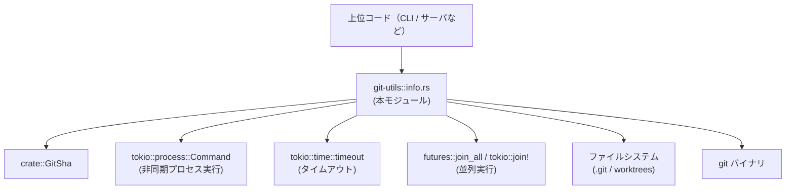
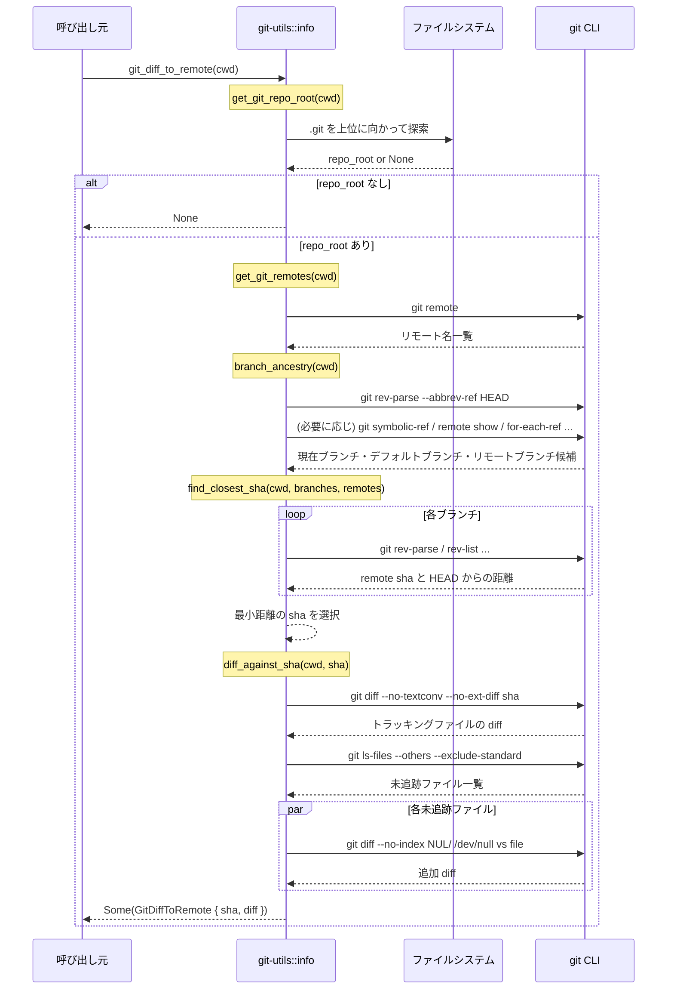
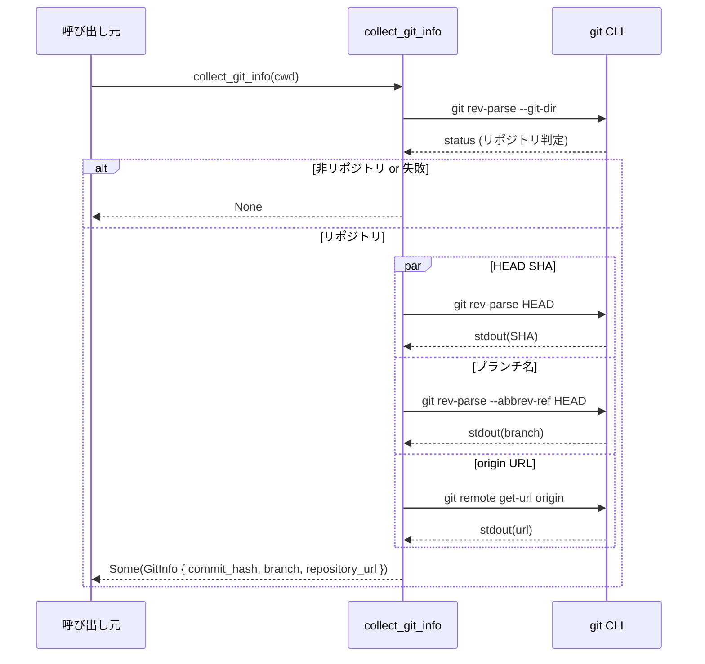

git-utils/src/info.rs

---

## 0. ざっくり一言

- コマンドライン `git` とファイルシステムを使って、リポジトリの各種メタ情報（コミット、ブランチ、リモート、差分、ルートパスなど）を非同期に収集するユーティリティ群です。

※ 行番号はこのインターフェース上では取得できないため、`git-utils/src/info.rs` 内の定義に対する説明として記載します（厳密な Lxxx 番号は付与できません）。

---

## 1. このモジュールの役割

### 1.1 概要

- このモジュールは **「現在の作業ディレクトリが属する Git リポジトリの状態を問い合わせる」** ためのユーティリティを提供します。
- `git` バイナリを直接呼び出し、**タイムアウト付きの非同期実行**でハングを防ぎつつ、コミット情報・ブランチ・リモート URL・未コミット差分などを取得します。
- `.git` ディレクトリ／ファイルを直接読むことで、**ワークツリー構成下の「信頼判定用ルート」**も解決します。

### 1.2 アーキテクチャ内での位置づけ

このファイルは「Git 情報取得レイヤー」として、外部世界（`git` コマンドとファイルシステム）との境界に位置づきます。



- 上位のアプリケーションはこのモジュールの `pub async fn` 群を呼び出し、Git の状態を取得します。
- 実際の Git 操作はすべて `run_git_command_with_timeout` を通じて `git` コマンドを起動して行われます。
- リポジトリルート検出や worktree 対応は `resolve_root_git_project_for_trust` / `find_ancestor_git_entry` が担当します。

### 1.3 設計上のポイント

- **非同期 + タイムアウト**
  - すべての `git` 呼び出しは `tokio::process::Command` + `tokio::time::timeout` でラップされ、5 秒で打ち切られます（`GIT_COMMAND_TIMEOUT` 定数）。
  - `command.kill_on_drop(true)` により、Future がドロップされた場合にも子プロセスが残らないようにしています。
- **エラーは基本的に「None / 空ベクタ」で表現**
  - 多くの関数は `Option<T>` や `Vec<T>` を返し、Git 未インストール・非リポジトリ・タイムアウト・パース失敗などを「None」や「空」として扱います。
  - 例外的なパニックを避け、呼び出し側から見た挙動を安定させています。
- **CLI Git ベース**
  - `git2` クレートなどは使わず、外部 `git` バイナリへの依存に統一されています。
  - `GIT_OPTIONAL_LOCKS=0` を設定しているため、読み取り操作でロックが作成されにくいようにしています。
- **ワークツリー対応の慎重なファイルシステム処理**
  - `.git` がディレクトリの場合と「`gitdir:` を含むファイル」の場合の両方を扱い、worktrees 構成時に「メインリポジトリ」のルートを導出します。

---

## 2. コンポーネントインベントリー（関数・構造体一覧）

### 2.1 型（構造体）一覧

| 名前 | 種別 | 公開範囲 | 役割 / 用途 | 根拠 |
|------|------|----------|------------|------|
| `GitInfo` | 構造体 (`Serialize, Deserialize, JsonSchema, TS`) | `pub` | 現在のコミット SHA・ブランチ名・リポジトリ URL を保持するメタ情報コンテナ | `git-utils/src/info.rs` 内定義 |
| `GitDiffToRemote` | 構造体 (`Serialize, Deserialize`) | `pub` | あるリモート上の SHA と、その SHA からの差分テキストをまとめる | 同上 |
| `CommitLogEntry` | 構造体 (`Serialize, Deserialize`) | `pub` | `recent_commits` 用の最小限コミット情報（SHA, Unix タイムスタンプ, サブジェクト） | 同上 |
| `GitSha` | 構造体（タプル構造体と思われる） | 外部 (`crate::GitSha`) | SHA1 文字列をラップする型。`GitInfo`, `GitDiffToRemote` で使用 | 同上（import のみ） |

※ `GitSha` の具体的なフィールド構造はこのファイルには出現せず、`.0` でアクセスされていることのみが分かります。

### 2.2 関数インベントリー（概要）

公開（`pub`）関数:

| 関数名 | シグネチャ（要約） | 役割 / 用途 |
|--------|--------------------|------------|
| `get_git_repo_root` | `fn(&Path) -> Option<PathBuf>` | `.git` エントリを上位ディレクトリまで探索し、リポジトリルートを返す |
| `collect_git_info` | `async fn(&Path) -> Option<GitInfo>` | CLI git（`rev-parse`, `remote get-url`）からコミット SHA・ブランチ名・リポジトリ URL を並列で収集 |
| `get_git_remote_urls` | `async fn(&Path) -> Option<BTreeMap<String,String>>` | `git remote -v` を解析し、fetch 用リモート名→URL のマップを取得 |
| `get_git_remote_urls_assume_git_repo` | `async fn(&Path) -> Option<BTreeMap<String,String>>` | 上記と同等だが、事前の「git repo チェック」を省略 |
| `get_head_commit_hash` | `async fn(&Path) -> Option<GitSha>` | `git rev-parse HEAD` から現在の HEAD SHA を取得 |
| `get_has_changes` | `async fn(&Path) -> Option<bool>` | `git status --porcelain` 出力から未コミット変更の有無を論理値で返す |
| `recent_commits` | `async fn(&Path, usize) -> Vec<CommitLogEntry>` | `git log` をフォーマット付きで呼び出し、HEAD から辿れる最新コミット一覧を返す |
| `git_diff_to_remote` | `async fn(&Path) -> Option<GitDiffToRemote>` | もっとも HEAD に近い「リモートに存在する SHA」を探索し、その SHA との差分（追跡外ファイルも含む）を取得 |
| `default_branch_name` | `async fn(&Path) -> Option<String>` | シンボリック `refs/remotes/<remote>/HEAD` や `git remote show` を使ってデフォルトブランチ名を推定 |
| `resolve_root_git_project_for_trust` | `fn(&Path) -> Option<PathBuf>` | worktree を考慮して「信頼判定に使うべきメインリポジトリルート」を求める |
| `local_git_branches` | `async fn(&Path) -> Vec<String>` | ローカルブランチ一覧を取得し、デフォルトブランチがあれば先頭に移動する |
| `current_branch_name` | `async fn(&Path) -> Option<String>` | 現在チェックアウトされているブランチ名を返す（detached HEAD の場合は `None`） |

内部（非公開）関数の主なもの:

- `run_git_command_with_timeout`：全ての git コマンド実行の共通ラッパ（タイムアウト付き、`GIT_OPTIONAL_LOCKS=0` 設定）。
- `parse_git_remote_urls`：`git remote -v` のテキストから fetch remotes を抽出。
- `get_git_remotes`：`git remote` からリモート名一覧を取得し、`origin` を先頭に並べ替え。
- `get_default_branch`, `get_default_branch_local`：デフォルトブランチ候補の決定ロジック。
- `branch_ancestry`：現在ブランチ → デフォルトブランチ → HEAD を含むリモートブランチ……という「ブランチ祖先リスト」を構築。
- `branch_remote_and_distance`：ブランチごとに「リモート上の SHA」と「HEAD からの距離（コミット数）」を計算。
- `find_closest_sha`：上記情報から最も距離の短い SHA を選択。
- `diff_against_sha`：指定 SHA との diff と、未追跡ファイルの `--no-index` diff を連結。
- `find_ancestor_git_entry`, `canonicalize_or_raw`：`.git` エントリ探索・実パス解決のユーティリティ。

---

## 3. 公開 API と詳細解説

### 3.1 型一覧（詳細）

| 名前 | フィールド | 説明 |
|------|-----------|------|
| `GitInfo` | `commit_hash: Option<GitSha>` | `git rev-parse HEAD` で取得した SHA。失敗時や非リポジトリでは `None`。 |
|          | `branch: Option<String>` | `git rev-parse --abbrev-ref HEAD` の結果。`HEAD`（detached）の場合は `None` にされる。 |
|          | `repository_url: Option<String>` | `git remote get-url origin` の結果。`origin` がない、または失敗時は `None`。 |
| `GitDiffToRemote` | `sha: GitSha` | 比較対象となる「リモート上にも存在する SHA」。 |
|                  | `diff: String` | その SHA から HEAD までの差分 + 未追跡ファイルとの `--no-index` diff を含むテキスト。 |
| `CommitLogEntry` | `sha: String` | コミット SHA（生文字列）。 |
|                  | `timestamp: i64` | コミッター時刻の Unix 秒。`git log` で `%ct` として取得。 |
|                  | `subject: String` | コミットメッセージの 1 行目サブジェクト。 |

---

### 3.2 重要な関数の詳細（7件）

#### 1. `collect_git_info(cwd: &Path) -> Option<GitInfo>`

**概要**

- 引数 `cwd` を作業ディレクトリとする Git リポジトリから、現 HEAD SHA・ブランチ名・`origin` の URL を「並列に」収集します。
- `cwd` が Git リポジトリ内でない場合や、`git` 実行が失敗した場合は `None` を返します。

**引数**

| 引数名 | 型 | 説明 |
|--------|----|------|
| `cwd` | `&Path` | Git コマンドを実行するカレントディレクトリ。リポジトリ直下でもサブディレクトリでもよい。 |

**戻り値**

- `Some(GitInfo)`：`cwd` が Git リポジトリ内であり、少なくとも初回の `rev-parse --git-dir` が成功した場合。
  - 個々のフィールドはさらに `Option` なので、取得失敗しても部分的に `None` になります。
- `None`：`git` が実行できない／タイムアウトした／`cwd` がリポジトリ内でない場合。

**内部処理の流れ**

1. `run_git_command_with_timeout(&["rev-parse", "--git-dir"], cwd)` で「Git リポジトリかどうか」を確認。非成功ステータスなら `None`。
2. `tokio::join!` を用いて以下の 3 コマンドを並列実行:
   - `git rev-parse HEAD`
   - `git rev-parse --abbrev-ref HEAD`
   - `git remote get-url origin`
3. 各 `Output` について、ステータスが成功かつ UTF-8 として解釈可能な場合のみ値を利用。
   - SHA: `GitSha::new(hash.trim())` に変換。
   - ブランチ: `HEAD`（detached）でない場合のみ `Some` に設定。
   - URL: トリムして `Some` に設定。
4. これらから `GitInfo` を構築して `Some` で返却。

**Examples（使用例）**

```rust
use git_utils::info::collect_git_info;
use std::path::Path;

#[tokio::main]
async fn main() {
    let cwd = Path::new("."); // カレントディレクトリ
    if let Some(info) = collect_git_info(cwd).await {
        if let Some(sha) = info.commit_hash {
            println!("HEAD: {}", sha.0); // GitSha の内部文字列を表示（GitSha がタプル構造体と仮定）
        }
        if let Some(branch) = info.branch {
            println!("Branch: {branch}");
        }
        if let Some(url) = info.repository_url {
            println!("Origin: {url}");
        }
    } else {
        println!("Git リポジトリではないか、git コマンドが失敗しました");
    }
}
```

**Errors / Panics**

- パニックは発生しません（`unwrap` は使用されていません）。
- 以下のケースでは `None` を返します。
  - `git` コマンドの起動エラーまたはタイムアウト。
  - `rev-parse --git-dir` が非 0 ステータスを返した場合（非リポジトリなど）。

**Edge cases**

- detached HEAD の場合：ブランチ名は `HEAD` になるため、`branch` フィールドは `None` になります。
- `origin` が存在しないリポジトリ：`repository_url` は `None` になりますが、`commit_hash` や `branch` は取得されます。
- 巨大リポジトリやネットワークファイルシステムで `git` が 5 秒以内に応答しない場合：タイムアウト扱いとなり `None`。

**使用上の注意点**

- 非同期関数なので `tokio` などの非同期ランタイム上で `.await` する必要があります。
- `cwd` は存在するパスである必要があります。存在しない場合、`git` コマンド自体が失敗して `None` になりえます。
- `None` と `Some(GitInfo { field: None, .. })` を明確に区別する必要があります（前者は「リポジトリでない」、後者は「部分的な情報取得失敗」）。

---

#### 2. `git_diff_to_remote(cwd: &Path) -> Option<GitDiffToRemote>`

**概要**

- HEAD から辿れるブランチ群を解析し、「リモートにも存在する SHA のうち HEAD に最も近いもの」を探し、その SHA からの差分をテキストとして返します。
- 差分には未追跡ファイルも `git diff --no-index /dev/null <file>` で含められます。

**引数**

| 引数名 | 型 | 説明 |
|--------|----|------|
| `cwd` | `&Path` | Git リポジトリ内のディレクトリ。 |

**戻り値**

- `Some(GitDiffToRemote)`：ベース SHA の探索と diff 取得が成功した場合。
- `None`：リポジトリ外、リモート無し、ベース SHA 探索失敗、`git diff` 失敗など。

**内部処理の流れ**

1. `get_git_repo_root(cwd)?` で `.git` を上位ディレクトリに遡って探索。見つからなければ `None`。
2. `get_git_remotes(cwd).await?` でリモート名一覧（`origin` を先頭）を取得。失敗時 `None`。
3. `branch_ancestry(cwd).await?` で現在ブランチ・デフォルトブランチ・HEAD を含むリモートブランチをリストアップ。
4. `find_closest_sha(cwd, &branches, &remotes).await?` で各ブランチに対し
   - リモート上のブランチ SHA を確認 (`branch_remote_and_distance`)。
   - `HEAD` からの距離（コミット数）を計算し、最小距離の SHA を選択。
5. `diff_against_sha(cwd, &base_sha).await?` でその SHA との差分と未追跡ファイル diff を取得。
6. `GitDiffToRemote { sha: base_sha, diff }` を返す。

**Examples（使用例）**

```rust
use git_utils::info::git_diff_to_remote;
use std::path::Path;

#[tokio::main]
async fn main() {
    let cwd = Path::new(".");
    match git_diff_to_remote(cwd).await {
        Some(diff_info) => {
            println!("Base SHA on remote: {}", diff_info.sha.0);
            println!("Diff:\n{}", diff_info.diff);
        }
        None => {
            println!("リモート上の基準 SHA を特定できなかったか、Git リポジトリではありません");
        }
    }
}
```

**Errors / Panics**

- パニックはありません。
- 以下のいずれかで `None` になります。
  - `.git` エントリが見つからない（`get_git_repo_root` が `None`）。
  - リモートが 1 つもない、または `git remote` 実行が失敗。
  - `branch_ancestry` 内での各種 `git` コマンドがエラー／タイムアウト。
  - `find_closest_sha` 内で距離計算に失敗し、どのブランチも有効な SHA を返さなかった。
  - `diff_against_sha` 内の `git diff` / `git ls-files` が非期待ステータスを返す。

**Edge cases**

- どのブランチもリモートに存在しない場合：`find_closest_sha` が `None` を返し、最終的に `None`。
- ブランチが多数存在する場合：ブランチ数 × リモート数分の `git rev-parse` / `rev-list` が走るため時間がかかる可能性があります。ただし各呼び出しは 5 秒タイムアウト付き。
- 未追跡ファイルが非常に多い場合：`join_all` でそれぞれの `git diff --no-index` を実行するためコマンド数が増えます。

**使用上の注意点**

- 大規模リポジトリや多数のリモート・ブランチがある環境では、実行時間が長くなる可能性があります。
- 差分テキストはそのまま `git diff` の出力形式なので、独自パースする場合は Diff フォーマットを前提に実装する必要があります。
- 「最も近い SHA」の定義は「HEAD から見てコミット数の距離が最小のもの」です。必ずしも「デフォルトブランチ上の SHA」とは限りません。

---

#### 3. `recent_commits(cwd: &Path, limit: usize) -> Vec<CommitLogEntry>`

**概要**

- HEAD から辿れる直近コミットの SHA・タイムスタンプ・サブジェクトを取得します。
- Git ではないディレクトリやエラー時は **空ベクタ** を返します。

**引数**

| 引数名 | 型 | 説明 |
|--------|----|------|
| `cwd` | `&Path` | `git log` を実行するディレクトリ。 |
| `limit` | `usize` | 取得する最大件数。`0` の場合は `-n` オプションを付けません（Git 側のデフォルト）。 |

**戻り値**

- `Vec<CommitLogEntry>`：正常時は `limit` まで、またはそれ以下のコミットが詰められます。
- 失敗時は `Vec::new()`（空）。

**内部処理の流れ**

1. `rev-parse --git-dir` を呼び出して Git リポジトリ判定。失敗したら空ベクタ返却。
2. `fmt = "%H%x1f%ct%x1f%s"` というフォーマット文字列を組み立て、`git log` を呼び出す:
   - `git log [-n <limit>] --pretty=format:<fmt>`
3. 標準出力を UTF-8 として解釈し、各行を以下のように分割:
   - 区切り文字 `\u{001f}`（Unit Separator）で `sha`, `timestamp`, `subject` に分割。
4. `timestamp` は `i64` にパースし、失敗時は `0` として扱う（`unwrap_or(0)`）。
5. 不正な行（SHA または timestamp が空）はスキップ。

**Examples（使用例）**

```rust
use git_utils::info::recent_commits;
use std::path::Path;

#[tokio::main]
async fn main() {
    let commits = recent_commits(Path::new("."), 5).await;
    for c in commits {
        println!("{} {} {}", c.timestamp, c.sha, c.subject);
    }
}
```

**Errors / Panics**

- パニックしません（`unwrap_or` のみ使用）。
- `git` コマンドの失敗やタイムアウトはすべて「空ベクタ」で表現されます。

**Edge cases**

- `limit == 0`：`-n` オプションを付与しないため、Git のデフォルト件数が使用されます（実際には全履歴ですが、環境設定によっては変わる可能性あり）。
- コミットが 1 件もないリポジトリ：空ベクタ。
- 一部の行が壊れている（UTF-8 でない／区切りがおかしい）：その行だけスキップされ、他は正常に処理されます。

**使用上の注意点**

- 空ベクタ＝エラーとは限らず、本当にコミットがないケースも含まれます。
- タイムスタンプがパースできない場合 0 になります。0 を特別扱いする場合は注意が必要です。

---

#### 4. `resolve_root_git_project_for_trust(cwd: &Path) -> Option<PathBuf>`

**概要**

- `.git` ディレクトリ／ファイルおよび `worktrees` ディレクトリを辿って、**「信頼判定（トラスト）に使うべきメインリポジトリのルートパス」** を決定します。
- `git` コマンドを呼び出さず、ファイルシステム検査のみで完結します。

**引数**

| 引数名 | 型 | 説明 |
|--------|----|------|
| `cwd` | `&Path` | 対象ディレクトリ（ディレクトリでなければ親ディレクトリから探索）。 |

**戻り値**

- `Some(PathBuf)`：メインリポジトリのルートディレクトリ。
- `None`：`.git` が見つからない、または worktree 解析に失敗した場合。

**内部処理の流れ**

1. `base = cwd`（ディレクトリなら）または `cwd.parent()` から開始。
2. `find_ancestor_git_entry(base)` で上位階層に `.git` が存在するディレクトリとその `.git` パスを探す。
3. `.git` がディレクトリなら、その親ディレクトリを `canonicalize_or_raw` して返す。
4. `.git` がファイルであれば、その内容を読み込み `gitdir:` プレフィックスをパース。
5. `gitdir` のパス文字列を `AbsolutePathBuf::resolve_path_against_base` に渡し、実際の gitdir パスを解決。
6. その親が `worktrees` ディレクトリか確認し、そこから 2 階層上（`<common_dir>/..`）をメインリポジトリルートとみなして返す。

**Examples（使用例）**

```rust
use git_utils::info::resolve_root_git_project_for_trust;
use std::path::Path;

fn main() {
    let cwd = Path::new(".");
    match resolve_root_git_project_for_trust(cwd) {
        Some(root) => println!("Trust root: {}", root.display()),
        None => println!("Git プロジェクトルートを特定できませんでした"),
    }
}
```

**Errors / Panics**

- `.git` ファイル読込時のエラー、UTF-8 以外はすべて `None` として扱われます。
- `canonicalize_or_raw` は `std::fs::canonicalize(path).unwrap_or(path)` のため、パス解決が失敗しても panic せず元のパスを返します。

**Edge cases**

- `.git` が見つからないパス：`None`。
- `.git` ファイルに `gitdir:` 行がない／空文字列：`None`。
- `gitdir` パスの親ディレクトリ名が `worktrees` でない場合：worktree と判断せず `None` を返します（メインリポジトリルートの推定は行わない）。

**使用上の注意点**

- worktree でない通常のリポジトリでは、`get_git_repo_root` とほぼ同じ結果になりますが、`canonicalize` によってシンボリックリンクが解決される場合があります。
- worktree 対応時に「メインリポジトリのルート」を得る用途に特化しているため、単なるリポジトリルート取得には `get_git_repo_root` の方がシンプルです。

---

#### 5. `get_git_remote_urls(cwd: &Path) -> Option<BTreeMap<String, String>>`

**概要**

- `git remote -v` の結果から fetch リモートのみを抽出し、`{リモート名: URL}` の連想配列として返します。
- まず `rev-parse --git-dir` でリポジトリチェックを行います。

**引数**

| 引数名 | 型 | 説明 |
|--------|----|------|
| `cwd` | `&Path` | Git コマンドのカレントディレクトリ。 |

**戻り値**

- `Some(map)`：少なくとも 1 つ以上の fetch リモートが存在した場合。
- `None`：Git でないディレクトリ、`git` エラー、または fetch リモートが 1 つもない場合。

**内部処理の流れ**

1. `rev-parse --git-dir` で Git リポジトリか確認。失敗時 `None`。
2. `get_git_remote_urls_assume_git_repo(cwd).await` を呼び出し結果をそのまま返す。
   - 内部では `git remote -v` の出力を `parse_git_remote_urls` で解析。

**Examples（使用例）**

```rust
use git_utils::info::get_git_remote_urls;
use std::path::Path;
use std::collections::BTreeMap;

#[tokio::main]
async fn main() {
    if let Some(remotes) = get_git_remote_urls(Path::new(".")).await {
        for (name, url) in remotes {
            println!("{name} => {url}");
        }
    }
}
```

**Errors / Panics**

- パニックはありません。
- `git` 実行エラー／タイムアウト、UTF-8 パース失敗、`remote -v` に fetch エントリが 1 行もない場合は `None`。

**Edge cases**

- push のみのリモートや、fetch/push で URL が異なるリモート構成：`(fetch)` の付いたエントリのみを採用します。
- 同じリモート名で複数行ある場合：ループで後勝ちですが、通常は 1 行です。

**使用上の注意点**

- `None` ＝「Git でない」だけでなく「単に fetch リモートがない」ケースも含みます。
- リモート名の順序は `BTreeMap` によりソートされます（辞書順）。

---

#### 6. `local_git_branches(cwd: &Path) -> Vec<String>`

**概要**

- ローカルブランチ名一覧を取得し、`main` / `master` といった「デフォルトブランチ候補」が存在すれば先頭に移動したベクタを返します。

**引数**

| 引数名 | 型 | 説明 |
|--------|----|------|
| `cwd` | `&Path` | `git branch` を実行するディレクトリ。 |

**戻り値**

- 取得したローカルブランチ名を格納した `Vec<String>`。エラー時は空ベクタ。

**内部処理の流れ**

1. `git branch --format=%(refname:short)` を呼び出し、成功かつ UTF-8 の場合に限り行単位で取得。
2. 行ごとに `trim` → 空行除去した文字列ベクタに変換。
3. `branches.sort_unstable()` でソート。
4. `get_default_branch_local(cwd).await` により `main` / `master` が存在するか確認。
5. 存在し、`branches` に含まれている場合は、その要素を取り出して `branches[0]` に挿入。

**Examples（使用例）**

```rust
use git_utils::info::local_git_branches;
use std::path::Path;

#[tokio::main]
async fn main() {
    let branches = local_git_branches(Path::new(".")).await;
    println!("Branches (default first if detected):");
    for b in branches {
        println!("  {b}");
    }
}
```

**Errors / Panics**

- エラーはすべて空ベクタで表現されます。
- パニックはありません。

**Edge cases**

- ブランチが 0 個：空ベクタ。
- `main` / `master` のどちらも存在しない：単にソートされたブランチ一覧になります。
- `main` と `master` 両方が存在する場合：`get_default_branch_local` は固定順で `main` → `master` を試すため、`main` が優先されます。

**使用上の注意点**

- 「デフォルトブランチ」の決定ルールは `get_default_branch_local` 固有であり、リモート設定には依存しません（`origin/HEAD` とは異なることがあります）。

---

#### 7. `run_git_command_with_timeout(args: &[&str], cwd: &Path) -> Option<std::process::Output>`

**概要**

- `git` コマンドを非同期に起動し、固定 5 秒タイムアウト付きで `stdout` / `stderr` / `exit status` を取得する共通ユーティリティです。
- モジュール内のほぼ全ての Git 操作はこの関数を通じて行われます。

**引数**

| 引数名 | 型 | 説明 |
|--------|----|------|
| `args` | `&[&str]` | `git` に渡す引数配列（サブコマンドとオプション）。 |
| `cwd` | `&Path` | コマンドのカレントディレクトリ。 |

**戻り値**

- `Some(Output)`：5 秒以内に `git` プロセスが正常に spawn / 終了した場合。
- `None`：spawn エラー、タイムアウト、I/O エラーなどいずれかが発生した場合。

**内部処理の流れ**

1. `Command::new("git")` を構築。
2. `env("GIT_OPTIONAL_LOCKS", "0")` を設定し、`args` と `current_dir(cwd)`、`kill_on_drop(true)` を設定。
3. `timeout(GIT_COMMAND_TIMEOUT, command.output()).await` を呼び出し、`Output` を待機。
4. `Ok(Ok(output))`（タイムアウトなし & コマンド成功実行）なら `Some(output)`、それ以外は `None`。

**Examples（使用例）**

※ 通常は直接使わず、高レベル関数経由で利用しますが、例として:

```rust
use git_utils::info::run_git_command_with_timeout; // 実際には pub ではないので同モジュール内で使用
use std::path::Path;

async fn show_git_version() {
    if let Some(out) = run_git_command_with_timeout(&["--version"], Path::new(".")).await {
        println!("{}", String::from_utf8_lossy(&out.stdout));
    }
}
```

**Errors / Panics**

- パニックはありません。
- タイムアウトや spawn エラーはすべて `None` として扱われ、呼び出し元が分岐処理を行います。

**Edge cases**

- `git` バイナリが PATH になく spawn に失敗した場合も `None`。
- タイムアウト直前まで大量の標準出力を出していた場合、それまでの出力は破棄されます（`timeout` で Future 自体が `Err` となる）。

**使用上の注意点**

- `args` にユーザー入力を直接渡す場合でも、`Command` はシェルを経由しないため、シェルインジェクションのリスクは低いです（ただし Git 側の挙動には注意が必要です）。
- 5 秒のタイムアウトはハードコードされており、呼び出し元では変更できません。

---

### 3.3 その他の関数（概要）

| 関数名 | 公開 | 役割（1 行） |
|--------|------|--------------|
| `get_git_repo_root` | `pub` | `.git` を上位ディレクトリに向かって探索し、最初に見つかったディレクトリをリポジトリルートとして返す。 |
| `get_git_remote_urls_assume_git_repo` | `pub` | `git rev-parse` による事前チェックなしで `git remote -v` をパース。 |
| `get_head_commit_hash` | `pub` | `git rev-parse HEAD` の結果を `GitSha` として返す。 |
| `get_has_changes` | `pub` | `git status --porcelain` 出力が空かどうかで変更有無を判定。 |
| `default_branch_name` | `pub` | リモートのシンボリック HEAD や `git remote show` 出力からデフォルトブランチ名を推定。 |
| `current_branch_name` | `pub` | `git branch --show-current` を用いて現在のブランチ名を取得。 |
| `get_git_remotes` | 内部 | `git remote` 出力を解析し、`origin` を先頭に並べたリモート名配列を返す。 |
| `get_default_branch` | 内部 | リモート設定（`refs/remotes/<remote>/HEAD` や `remote show`）からデフォルトブランチを取得。 |
| `get_default_branch_local` | 内部 | `refs/heads/main` / `master` の存在確認のみに基づきデフォルトブランチ候補を返す。 |
| `branch_ancestry` | 内部 | 現在ブランチ、デフォルトブランチ、HEAD を含むリモートブランチを順番に列挙したリストを作る。 |
| `branch_remote_and_distance` | 内部 | ブランチが各リモート上に存在するか調べ、存在する場合にその SHA と HEAD からの距離（コミット数）を計算。 |
| `find_closest_sha` | 内部 | 複数ブランチの `(remote_sha, distance)` 情報から、最も distance の小さい `GitSha` を返す。 |
| `diff_against_sha` | 内部 | 指定 SHA との `git diff` と、未追跡ファイルの `--no-index` diff をまとめて 1 つの文字列にする。 |
| `parse_git_remote_urls` | 内部 | `git remote -v` の出力から `(fetch)` 行のみを解析し、名前→URL マップを返す。 |
| `find_ancestor_git_entry` | 内部 | 親ディレクトリを遡って `.git` ファイルまたはディレクトリを探す。 |
| `canonicalize_or_raw` | 内部 | `std::fs::canonicalize` に成功すれば実パス、失敗すれば元の `PathBuf` を返す。 |

---

## 4. データフロー

### 4.1 `git_diff_to_remote` のデータフロー

`cwd` からリモート上の基準 SHA と diff を取得するまでの流れです。



### 4.2 `collect_git_info` の並列実行



---

## 5. 使い方（How to Use）

### 5.1 基本的な使用方法

典型的には、`tokio` ランタイムの中で Git 情報をまとめて取得し、UI やログに表示するといった用途が想定されます。

```rust
use git_utils::info::{
    collect_git_info,
    git_diff_to_remote,
    local_git_branches,
    current_branch_name,
};
use std::path::Path;

#[tokio::main] // tokio ランタイムを起動
async fn main() -> anyhow::Result<()> {
    let cwd = Path::new(".");

    // 1. 基本的な Git 情報
    if let Some(info) = collect_git_info(cwd).await {
        if let Some(sha) = info.commit_hash {
            println!("HEAD: {}", sha.0); // GitSha の内部文字列
        }
        if let Some(branch) = info.branch {
            println!("Branch: {branch}");
        }
        if let Some(url) = info.repository_url {
            println!("Origin: {url}");
        }
    }

    // 2. デフォルトブランチを先頭にしたブランチ一覧
    let branches = local_git_branches(cwd).await;
    println!("Local branches: {:?}", branches);

    // 3. 現在ブランチ名
    if let Some(cur) = current_branch_name(cwd).await {
        println!("Current branch: {cur}");
    }

    // 4. リモートとの差分
    if let Some(diff_info) = git_diff_to_remote(cwd).await {
        println!("Remote base SHA: {}", diff_info.sha.0);
        // 差分テキストは必要に応じてページングなどで表示
    }

    Ok(())
}
```

### 5.2 よくある使用パターン

- **「Git リポジトリでなければ何もしない」パターン**

  ```rust
  let cwd = Path::new(target_path);
  if let Some(info) = collect_git_info(cwd).await {
      // GitInfo が得られた場合のみ UI 表示などを行う
  } // None の場合はサイレントにスキップ
  ```

- **「差分があるかだけ知りたい」パターン**

  ```rust
  use git_utils::info::get_has_changes;

  if let Some(has_changes) = get_has_changes(Path::new(".")).
      await {
      if has_changes {
          println!("未コミットの変更があります");
      } else {
          println!("クリーンです");
      }
  } else {
      println!("Git リポジトリでない、または git コマンドが失敗しました");
  }
  ```

- **「デフォルトブランチ名を UI に表示」パターン**

  ```rust
  use git_utils::info::default_branch_name;

  if let Some(base) = default_branch_name(Path::new(".")).await {
      println!("Default branch: {base}");
  }
  ```

### 5.3 よくある間違い

```rust
// 間違い例: 非同期関数を同期コンテキストから直接呼ぶ
// let info = collect_git_info(Path::new("."));
// ↑ コンパイルエラー: async fn は Future を返すので .await が必要

// 正しい例:
let info = collect_git_info(Path::new(".")).await;
```

```rust
// 間違い例: None を考慮せずに unwrap してしまう
// let info = collect_git_info(Path::new(".")).await.unwrap();
// ↑ Git リポジトリでない環境では panic の可能性

// 正しい例: パターンマッチで安全に扱う
if let Some(info) = collect_git_info(Path::new(".")).await {
    // 使用
}
```

### 5.4 使用上の注意点（まとめ）

- すべての `async fn` は **Tokio ランタイム**上で呼び出す必要があります（`tokio::process` と `tokio::time` に依存）。
- 5 秒で `git` コマンドがタイムアウトするため、非常に大きなリポジトリでは情報取得に失敗し `None` / 空ベクタになる可能性があります。
- エラーは例外ではなく **戻り値で表現** されます（`Option` や空ベクタ）。呼び出し側で適切に分岐する必要があります。
- 外部 `git` バイナリが PATH にない場合や、権限不足などによるエラーもすべて「None / 空」として扱われます。ログ出力などはこのモジュールでは行われません（観測性は呼び出し側に依存します）。

---

## 6. 変更の仕方（How to Modify）

### 6.1 新しい機能を追加する場合

1. **新しい Git 情報を取得したい場合**
   - 既存の `run_git_command_with_timeout` を再利用し、必要な `git` サブコマンドを実行する関数を追加します。
   - エラー時の挙動は既存関数と一貫させます（`Option` や空ベクタを返すスタイル）。
2. **既存構造体にフィールドを追加したい場合**
   - `GitInfo` や `CommitLogEntry` にフィールドを加える場合は、対応する `collect_git_info` / `recent_commits` のパース処理も拡張します。
   - `serde` / `JsonSchema` / `TS` 派生を利用しているため、外部との互換性に注意が必要です（API 変更となる可能性があります）。
3. **タイムアウト値を変えたい場合**
   - `GIT_COMMAND_TIMEOUT` 定数を調整するだけですが、全関数に影響するため慎重さが必要です。

### 6.2 既存の機能を変更する場合の注意点

- **契約（Contracts）**
  - `collect_git_info` / `git_diff_to_remote` などは「失敗時に `None` を返す」契約に依存している可能性があります。例外を投げたりパニックさせるような変更は上位コードに影響します。
  - `recent_commits` や `local_git_branches` はエラー時も空ベクタを返す設計です。`Result` に変更すると呼び出し側の対応が必要になります。
- **エッジケースの扱い**
  - detached HEAD を `None` ブランチとして扱うロジックを変更すると、UI 表示などの挙動が変わります。
  - リモートやブランチが存在しないケースでも極力正常系の戻り値（空／None）で済ませている点に留意します。
- **テストと使用箇所の確認**
  - このファイル内にテストコードは現れません。変更後は、このモジュールを使用している他ファイルのテストを確認する必要があります（どのファイルが使用しているかは、このチャンクからは分かりません）。

---

## 7. 関連ファイル

| パス | 役割 / 関係 |
|------|------------|
| `crate::GitSha`（正確なパスは不明） | SHA 文字列を表す型。本モジュールの多くの関数でコミット識別子として使用される。`GitSha::new` および `.0` フィールドアクセスが行われている。 |
| `codex_utils_absolute_path::AbsolutePathBuf` | `resolve_root_git_project_for_trust` 内で `gitdir` パスの解決に使用されるユーティリティ。 |
| `tokio::process::Command` / `tokio::time::timeout` | 非同期プロセス実行とタイムアウト制御の基盤。 |
| `futures::future::join_all` / `tokio::join!` | 複数の `git` コマンドを並列実行するための非同期ユーティリティ。 |

---

## Bugs / Security / Edge Cases / Performance の補足

- **潜在的なバグ**
  - このチャンクに明確なロジック矛盾や panic パスは見当たりません。すべての外部 I/O は `Option` ベースで保護されています。
- **セキュリティ**
  - すべての `git` 起動は `Command::new("git")` + 明示的 `args` で行われ、シェルを経由しないため、シェルインジェクションのリスクは低いです。
  - 一方で、`cwd` や一部の引数は上位から渡される可能性があるため、権限のないディレクトリでの `git` 実行や意図しないリポジトリへのアクセスに注意が必要です。
- **エッジケース**
  - worktree 構成・detached HEAD・リモートなし・ブランチなし・空リポジトリなど、多くのケースを `None` / 空ベクタで吸収する設計になっています。
- **Performance / Scalability**
  - ブランチやリモートが非常に多い場合、`git_diff_to_remote` の `branch_remote_and_distance` ループは多数の `git rev-parse` / `rev-list` を発行します。
  - それでも各コマンドには 5 秒のタイムアウトがあるため、最悪でも一定時間で応答は返ってきます（ただし結果は `None` になり得ます）。

以上が `git-utils/src/info.rs` の公開 API とコアロジック、データフロー、および Rust 特有の安全性・エラー・並行性の観点を含めた解説です。
