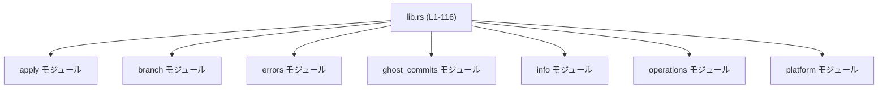
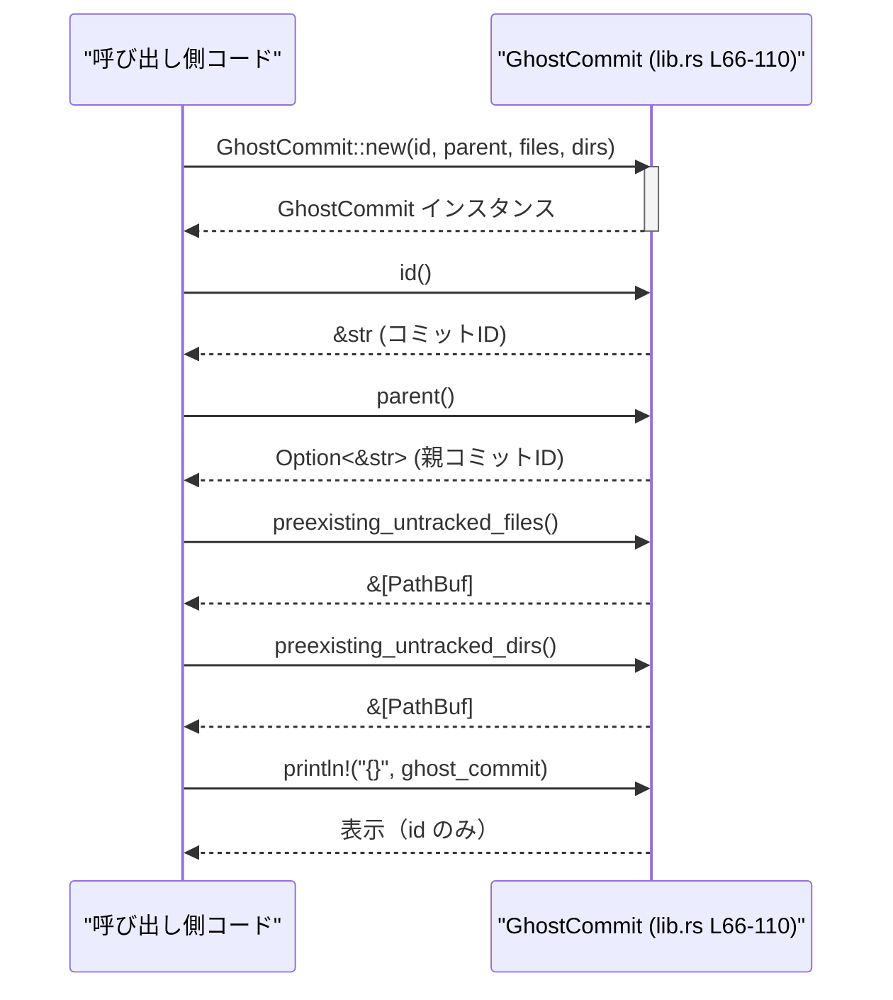

# git-utils/src/lib.rs

## 0. ざっくり一言

このファイルは `git-utils` クレート全体の公開窓口として、各種 Git 操作用モジュールを再エクスポートしつつ、`GitSha` と `GhostCommit` という基本的なドメイン型を定義するエントリポイントです。[根拠: git-utils/src/lib.rs:L4-47, L55-73]

---

## 1. このモジュールの役割

### 1.1 概要

- このモジュールは、Git リポジトリに対する操作・情報取得・一時コミット（ゴーストコミット）などを行う内部モジュールをひとまとめにし、利用者が上位レベルの API 群にアクセスできるようにします。[根拠: L4-10, L12-47]
- 併せて、コミット SHA を表現する `GitSha` 型と、ゴーストコミットのメタデータを表現する `GhostCommit` 型を提供します。[根拠: L55-58, L66-73]
- JSON Schema 生成や TypeScript 型生成用の派生属性を付与し、Rust 以外の環境との連携も想定した設計になっています。[根拠: L55-57, L67]

### 1.2 アーキテクチャ内での位置づけ

このファイルはクレートのルート (`lib.rs`) として、各モジュールを `mod` 宣言し、それらから型や関数を `pub use` で再エクスポートしています。[根拠: L4-10, L12-47]



- `operations` モジュールは宣言されていますが、このファイルからは何も再エクスポートされていないため、内部的な実装詳細をまとめる役割と推測できます（定義は本チャンクにはありません）。[根拠: L9]
- それ以外のモジュールは、このファイル経由で多数の型・関数が公開されています。[根拠: L12-47]

### 1.3 設計上のポイント

- **フェイサード（窓口）設計**  
  - 利用者は `git-utils` クレートのルートから、パッチ適用・ブランチ情報・エラー型・ゴーストコミット操作・リポジトリ情報取得・シンボリックリンク作成といった API にアクセスできます。[根拠: L12-47]
- **ドメイン値オブジェクトの導入**  
  - `GitSha` は `String` の透明ラッパーとして定義され、型レベルで「Git の SHA」であることを区別できます。[根拠: L55-58]
  - `GhostCommit` はコミット ID や親コミット、スナップショット取得時点で既に存在していた未追跡ファイル/ディレクトリのリストをまとめる構造体です。[根拠: L66-73]
- **シリアライズ/スキーマ/型生成の一元化**  
  - `GitSha` と `GhostCommit` は `Serialize`, `Deserialize`, `JsonSchema`, `TS` などを derive しており、JSON シリアライズと JSON Schema/TypeScript 型生成が可能です。[根拠: L55, L67]
- **安全性・並行性**  
  - このファイル内では `unsafe` ブロックは一切使われておらず、メモリアクセスはすべて安全な Rust の仕組みに依存しています。[根拠: L1-116 内に `unsafe` が存在しない]
  - 提供される型は所有権を持つデータ（`String`, `PathBuf`, `Vec`）の単純な保持と読み取りのみで、内部可変性はありません。よって、読み取り専用であればスレッド間共有時の競合は発生しにくい設計です。[根拠: L66-73, L91-108]

---

## 2. 主要な機能一覧

このファイル自体の実装は少ないですが、多数の機能を再エクスポートしています。

- **Git パッチ適用関連**（`apply` モジュール由来）[根拠: L12-17]  
  - `ApplyGitRequest`, `ApplyGitResult`  
  - `apply_git_patch`, `extract_paths_from_patch`, `parse_git_apply_output`, `stage_paths`  
  → 関数名から、パッチ適用や `git apply` コマンド出力の解析、ステージング対象パス抽出/追加などに関係する API と解釈できます（実装は本チャンク外）。
- **ブランチ・マージ関連**[根拠: L18]  
  - `merge_base_with_head`  
  → `HEAD` と他ブランチとのマージベース計算に関する関数名ですが、実装はこのチャンクにはありません。
- **Git ツール共通エラー型**[根拠: L19]  
  - `GitToolingError`  
  → Git 操作に関するエラーを表すと考えられる列挙体/構造体（定義は `errors` モジュールにあり、このチャンクにはありません）。
- **ゴーストコミット / スナップショット関連**[根拠: L20-31, L66-73]  
  - 設定・レポート型: `CreateGhostCommitOptions`, `GhostSnapshotConfig`, `GhostSnapshotReport`, `IgnoredUntrackedFile`, `LargeUntrackedDir`, `RestoreGhostCommitOptions`  
  - 操作関数: `capture_ghost_snapshot_report`, `create_ghost_commit`, `create_ghost_commit_with_report`, `restore_ghost_commit`, `restore_ghost_commit_with_options`, `restore_to_commit`  
  - メタデータ型: `GhostCommit`（このファイルで定義）  
  → リポジトリの状態を一時コミット＝ゴーストコミットとして保存し、後から戻すための API 群とそのメタデータ型です。
- **リポジトリ情報取得 / 差分関連**[根拠: L32-46]  
  - 型: `CommitLogEntry`, `GitDiffToRemote`, `GitInfo`  
  - 関数: `collect_git_info`, `current_branch_name`, `default_branch_name`, `get_git_remote_urls`, `get_git_remote_urls_assume_git_repo`, `get_git_repo_root`, `get_has_changes`, `get_head_commit_hash`, `git_diff_to_remote`, `local_git_branches`, `recent_commits`, `resolve_root_git_project_for_trust`  
  → ブランチ名・リモート URL・HEAD コミット・差分・最近のコミットログなど、Git リポジトリのメタ情報を収集する API 群と読み取れます（実装は `info` モジュールにあり、本チャンク外）。
- **プラットフォーム依存機能**[根拠: L47]  
  - `create_symlink`  
  → シンボリックリンク生成を行う関数であると解釈できますが、実装は `platform` モジュールにあります。
- **コミット SHA ラッパー**[根拠: L55-64]  
  - `GitSha` 構造体とそのコンストラクタ `GitSha::new`。
- **ゴーストコミットメタデータ**[根拠: L66-110]  
  - `GhostCommit` 構造体と、そのコンストラクタ・各種ゲッター・`Display` 実装。

---

## 3. 公開 API と詳細解説

### 3.1 型一覧（コンポーネントインベントリー：型）

このチャンクで確認できる型、および再エクスポートされる主な型の一覧です。

| 名前 | 種別 | 公開/内部 | 役割 / 用途 | 定義/宣言位置 |
|------|------|-----------|-------------|----------------|
| `CommitID` | 型エイリアス (`String`) | 内部 | コミット ID を表す内部エイリアス。`GhostCommit` 内部で使用。 | git-utils/src/lib.rs:L53 |
| `GitSha` | 構造体（タプル構造体、`String` ラッパー） | 公開 | Git の SHA 値を表す透明ラッパー。JSON/TS 型生成対応。 | git-utils/src/lib.rs:L55-58 |
| `GhostCommit` | 構造体 | 公開 | ゴーストコミットの ID、親、スナップショット取得時点の既存未追跡ファイル/ディレクトリを保持。 | git-utils/src/lib.rs:L66-73 |
| `ApplyGitRequest` | 構造体/型（詳細不明） | 公開 | Git パッチ適用リクエスト関連の型と推測されますが、定義は `apply` モジュール内で本チャンクにはありません。 | 再エクスポート: git-utils/src/lib.rs:L12 |
| `ApplyGitResult` | 構造体/型（詳細不明） | 公開 | パッチ適用結果を表す型と推測されますが、定義は本チャンク外です。 | 再エクスポート: L13 |
| `GitToolingError` | 構造体/列挙体（詳細不明） | 公開 | Git 操作で発生するエラーを表す汎用エラー型と考えられます。 | 再エクスポート: L19 |
| `CreateGhostCommitOptions` | 構造体（詳細不明） | 公開 | ゴーストコミット作成時のオプション設定と推測されます。 | 再エクスポート: L20 |
| `GhostSnapshotConfig` | 構造体（詳細不明） | 公開 | スナップショット取得の設定値と推測されます。 | 再エクスポート: L21 |
| `GhostSnapshotReport` | 構造体（詳細不明） | 公開 | スナップショット結果のレポートデータと推測されます。 | 再エクスポート: L22 |
| `IgnoredUntrackedFile` | 構造体（詳細不明） | 公開 | 無視されている未追跡ファイル情報と推測されます。 | 再エクスポート: L23 |
| `LargeUntrackedDir` | 構造体（詳細不明） | 公開 | 大きな未追跡ディレクトリ情報と推測されます。 | 再エクスポート: L24 |
| `RestoreGhostCommitOptions` | 構造体（詳細不明） | 公開 | ゴーストコミットからの復元オプションと推測されます。 | 再エクスポート: L25 |
| `CommitLogEntry` | 構造体（詳細不明） | 公開 | コミットログ 1 件分の情報と推測されます。 | 再エクスポート: L32 |
| `GitDiffToRemote` | 構造体（詳細不明） | 公開 | リモートとの差分情報と推測されます。 | 再エクスポート: L33 |
| `GitInfo` | 構造体（詳細不明） | 公開 | リポジトリ全体の概要情報をまとめた型と推測されます。 | 再エクスポート: L34 |

> ※ 上記「推測されます」は、型名とモジュール名からの解釈であり、実際のフィールド構成・詳細な意味はこのチャンクには現れません。

### 3.2 関数詳細（最大 7 件）

このファイルで **実装が見えている** 関数（メソッド）に絞って詳細を記載します。

---

#### `GitSha::new(sha: &str) -> GitSha`

**概要**

- 引数の文字列から新しい `GitSha` インスタンスを生成するコンストラクタです。[根拠: L60-63]
- SHA の形式（長さ・16進文字のみかどうか）は検証しません。

**引数**

| 引数名 | 型 | 説明 |
|--------|----|------|
| `sha` | `&str` | Git のコミット SHA を表す文字列（フォーマット検証は行われません）。[根拠: L61] |

**戻り値**

- `GitSha`：内部に `sha.to_string()` で生成した `String` を 1 フィールドとして保持する新しいインスタンス。[根拠: L61-63]

**内部処理の流れ**

1. 引数 `sha` を `String` に変換します（`sha.to_string()`）。[根拠: L62]
2. その `String` をタプルフィールドに持つ `GitSha` を `Self(...)` で生成して返します。[根拠: L62]

**Examples（使用例）**

```rust
use crate::GitSha; // 同一クレート内から利用する場合                         // GitSha 型をインポート

fn example_git_sha() {                                                   // サンプル関数の定義
    let raw_sha = "0123456789abcdef0123456789abcdef01234567";            // 40桁のSHA文字列（例）
    let sha = GitSha::new(raw_sha);                                      // &str から GitSha を生成

    // Debug 表示（GitSha は Debug を derive 済み）
    println!("{:?}", sha);                                               // GitSha("0123...") のように表示される想定
}
```

**Errors / Panics**

- 明示的なエラーハンドリングは行っておらず、`Result` も返しません。[根拠: シグネチャ L60-63]
- `sha.to_string()` は通常パニックしないため、ここでパニックが発生する条件は想定されません。

**Edge cases（エッジケース）**

- 空文字列 `""` を渡した場合：空の `String` を持つ `GitSha` が生成されます（検証なし）。[根拠: 実装に条件分岐がない L61-63]
- SHA でない文字列を渡した場合：そのままラップされます。フォーマット検査は利用側の責任になります。

**使用上の注意点**

- `GitSha` を「常に正しい SHA である」前提で使う場合は、`new` を呼ぶ前にフォーマット検証を行う必要があります。
- 型レベルで SHA とその他の文字列を区別したいときに有用ですが、バリデーションは別途実装が必要です。

---

#### `GhostCommit::new(id: CommitID, parent: Option<CommitID>, preexisting_untracked_files: Vec<PathBuf>, preexisting_untracked_dirs: Vec<PathBuf>) -> GhostCommit`

**概要**

- ゴーストコミットのメタデータをまとめた `GhostCommit` インスタンスを生成するコンストラクタです。[根拠: L75-89]
- コミット ID、親コミット ID、スナップショット取得時点で既に存在していた未追跡ファイル/ディレクトリの一覧を受け取ります。[根拠: L69-72, L78-81]

**引数**

| 引数名 | 型 | 説明 |
|--------|----|------|
| `id` | `CommitID` (`String` のエイリアス) | ゴーストコミットのコミット ID。[根拠: L53, L78] |
| `parent` | `Option<CommitID>` | 親コミットの ID。`None` の場合、作成時に `HEAD` が存在しなかったことを表すとコメントから読み取れます。[根拠: L70, L79, L96] |
| `preexisting_untracked_files` | `Vec<PathBuf>` | スナップショット時点で既に存在していた未追跡/無視されたファイルパスの一覧。[根拠: L71, L80, L101-103] |
| `preexisting_untracked_dirs` | `Vec<PathBuf>` | 同様に、既存の未追跡/無視されたディレクトリパスの一覧。[根拠: L72, L81, L106-108] |

**戻り値**

- `GhostCommit`：渡された値をそのままフィールドに格納したインスタンス。[根拠: L82-88]

**内部処理の流れ**

1. 構造体リテラル `Self { ... }` で `GhostCommit` を生成します。[根拠: L83-88]
2. フィールド `id`, `parent`, `preexisting_untracked_files`, `preexisting_untracked_dirs` に、それぞれ同名の引数をムーブします。[根拠: L84-87]

**Examples（使用例）**

```rust
use std::path::PathBuf;                                                 // PathBuf 型をインポート
use crate::GhostCommit;                                                 // GhostCommit 型をインポート

fn example_ghost_commit() {                                             // サンプル関数定義
    let id = "0123456789abcdef0123456789abcdef01234567".to_string();    // ゴーストコミットID（文字列）
    let parent = Some("fedcba9876543210fedcba9876543210fedcba98".into());// 親コミットID（Optionで包む）

    let preexisting_files = vec![                                       // 既存の未追跡ファイル一覧
        PathBuf::from("tmp/cache.dat"),
        PathBuf::from("logs/debug.log"),
    ];

    let preexisting_dirs = vec![                                        // 既存の未追跡ディレクトリ一覧
        PathBuf::from("tmp"),
    ];

    let ghost = GhostCommit::new(                                       // GhostCommit インスタンスの生成
        id,
        parent,
        preexisting_files,
        preexisting_dirs,
    );

    println!("ghost commit id = {}", ghost.id());                       // id() ゲッターでコミットIDを参照
}
```

**Errors / Panics**

- バリデーションや I/O は行っておらず、`Result` も返さないため、ここではエラーは発生しません。[根拠: シグネチャ L77-82]
- フィールド代入のみのため、通常はパニック条件もありません。

**Edge cases（エッジケース）**

- `parent` に `None` を渡すと、親コミットなし（`HEAD` 不在）のゴーストコミットとして扱えるようになります。[根拠: コメント L96]
- `preexisting_untracked_files` / `dirs` を空ベクタで渡すと、それぞれ「既存の未追跡ファイル/ディレクトリはない」状態を表現します。[根拠: 条件分岐がない L80-81, L101-108]
- `id` が空文字列や不正な SHA であっても、そのまま受け入れます（検証なし）。

**使用上の注意点**

- コミット ID の正当性やファイル/ディレクトリパスが本当に「既存の未追跡」なのかは、このコンストラクタでは検証されません。上位で整合性を保つ必要があります。
- `Vec<PathBuf>` は所有権をムーブするため、呼び出し側でこれらのベクタを後から使うことはできなくなります（Rust の所有権ルール）。

---

#### `GhostCommit::id(&self) -> &str`

**概要**

- ゴーストコミットのコミット ID を参照として返すゲッターメソッドです。[根拠: L91-94]

**引数**

| 引数名 | 型 | 説明 |
|--------|----|------|
| `&self` | `&GhostCommit` | 参照経由で `GhostCommit` にアクセスします。所有権は移動しません。[根拠: L92] |

**戻り値**

- `&str`：内部フィールド `id: String` への参照。[根拠: L93]

**内部処理の流れ**

1. `&self.id` を返すだけの単純なゲッターです。[根拠: L93]

**Examples（使用例）**

- `GhostCommit::new` のサンプルコード内の `ghost.id()` 呼び出しを参照してください。[根拠: L91-94]

**Errors / Panics**

- パニックを起こす処理は含まれていません。

**Edge cases**

- `id` が空文字列や不正な SHA でも、そのまま参照を返します。バリデーションは行われません。

**使用上の注意点**

- 参照 `&str` が返るため、呼び出し側でライフタイムを意識して使用する必要がありますが、`GhostCommit` が生きている間は有効です。

---

#### `GhostCommit::parent(&self) -> Option<&str>`

**概要**

- 親コミット ID を参照として返すゲッターメソッドです。ゴーストコミット作成時に `HEAD` が存在しないなどの理由で親がない場合は `None` を返します。[根拠: L96-99]

**引数**

| 引数名 | 型 | 説明 |
|--------|----|------|
| `&self` | `&GhostCommit` | ゴーストコミットインスタンスへの参照。 |

**戻り値**

- `Option<&str>`：  
  - `Some(&str)`：親コミット ID の参照。  
  - `None`：親コミットが存在しない場合。  
  `self.parent.as_deref()` により `Option<String>` を `Option<&str>` に変換しています。[根拠: L98]

**内部処理の流れ**

1. 内部フィールド `Option<CommitID>` に対して `as_deref()` を呼び、`Option<&String>` ではなく `Option<&str>` として返します。[根拠: L98]

**Examples（使用例）**

- `GhostCommit::new` のサンプルで生成した `ghost` に対し、`if let Some(parent) = ghost.parent() { ... }` のように利用できます。

**Errors / Panics**

- ありません。

**Edge cases**

- `parent` フィールドが `None` の場合：`None` をそのまま返します。[根拠: L98]
- 親 ID が空文字列でも `Some("")` として返されます。内容の検証は行いません。

**使用上の注意点**

- 返り値が `Option<&str>` であるため、`match` もしくは `if let` などで `None` ケースを必ず考慮する必要があります。

---

#### `GhostCommit::preexisting_untracked_files(&self) -> &[PathBuf]`

**概要**

- スナップショット取得時点で既に存在していた未追跡/無視されたファイルパスのスライスを返すゲッターメソッドです。[根拠: L101-103]

**引数**

| 引数名 | 型 | 説明 |
|--------|----|------|
| `&self` | `&GhostCommit` | ゴーストコミットへの参照。 |

**戻り値**

- `&[PathBuf]`：内部フィールド `preexisting_untracked_files` への共有参照スライス。[根拠: L102-103]

**内部処理の流れ**

1. `&self.preexisting_untracked_files` を返すだけです。[根拠: L103]

**Examples（使用例）**

- 例：

```rust
fn print_preexisting_files(ghost: &crate::GhostCommit) {                // GhostCommit への参照を受け取る
    for path in ghost.preexisting_untracked_files() {                   // スライスをイテレート
        println!("preexisting file: {}", path.display());               // PathBuf を表示
    }
}
```

**Errors / Panics**

- ありません。

**Edge cases**

- リストが空の場合：空スライス `&[]` として返されます。[根拠: Vec への参照であり、特別な分岐なし L102-103]

**使用上の注意点**

- 返り値はスライス `&[PathBuf]` であり、各 `PathBuf` も所有権を持つオブジェクトですが、参照経由でしかアクセスできません。変更したい場合は、別途 `GhostCommit` にミュータブルなメソッドを追加するか、コピーして編集する必要があります（このファイルにはミュータブルメソッドはありません）。[根拠: L75-110 に `&mut self` メソッドがない]

---

#### `GhostCommit::preexisting_untracked_dirs(&self) -> &[PathBuf]`

**概要**

- スナップショット取得時点で既に存在していた未追跡/無視されたディレクトリパスのスライスを返します。[根拠: L106-108]

**引数・戻り値・内部処理**

- `preexisting_untracked_files` と同様で、対象フィールドが `preexisting_untracked_dirs` に変わるだけです。[根拠: L107-108]

**Examples（使用例）**

- `preexisting_untracked_files` の例と同様に、`ghost.preexisting_untracked_dirs()` をループすれば一覧を取得できます。

**Errors / Panics / Edge cases / 使用上の注意点**

- 上記 `preexisting_untracked_files` と同様です。

---

#### `impl fmt::Display for GhostCommit { fn fmt(&self, f: &mut fmt::Formatter<'_>) -> fmt::Result }`

**概要**

- `GhostCommit` を `Display` トレイトとして表示可能にする実装です。  
  表示内容はコミット ID のみです。[根拠: L112-115]

**引数**

| 引数名 | 型 | 説明 |
|--------|----|------|
| `&self` | `&GhostCommit` | 表示対象のゴーストコミット。 |
| `f` | `&mut fmt::Formatter<'_>` | フォーマッタ。`println!` などから渡されます。 |

**戻り値**

- `fmt::Result`：フォーマット処理が成功したかどうかを示す結果。[根拠: L113]

**内部処理の流れ**

1. `write!(f, "{}", self.id)` を呼び出し、`id` フィールドの文字列をそのまま書き込みます。[根拠: L114]
2. `write!` マクロの結果をそのまま返します。[根拠: L114]

**Examples（使用例）**

```rust
use crate::GhostCommit;                                                 // GhostCommit 型をインポート

fn print_ghost(ghost: &GhostCommit) {                                   // GhostCommit への参照を受け取る
    println!("{}", ghost);                                              // Display 実装により id() が出力される
}
```

**Errors / Panics**

- 書き込み先（例：標準出力）がエラーになった場合、`fmt::Result::Err` が返る可能性がありますが、これは `println!` 側で処理されます。
- 関数内でパニックを起こすコードはありません。

**Edge cases**

- `id` が空文字列でも、そのまま空行として表示されます。

**使用上の注意点**

- `Debug` と違い、`Display` では `GhostCommit` の詳細（親や未追跡ファイル一覧）は表示されず、ID のみになります。ログなどで詳細情報が必要な場合は、`{:?}`（`Debug`）を利用するか、個別にフィールドを出力する必要があります。[根拠: `#[derive(Debug, ...)]` L67, `Display` 実装 L112-115]

---

### 3.3 その他の関数（コンポーネントインベントリー：関数）

このファイルでは本体実装が見えないものの、再エクスポートされている公開関数の一覧です（役割は関数名から読める範囲で記載します）。

| 関数名 | 元モジュール | 役割（関数名からの解釈） | 宣言位置（再エクスポート） |
|--------|--------------|--------------------------|-----------------------------|
| `apply_git_patch` | `apply` | Git パッチをリポジトリに適用する関数と推測されます。 | git-utils/src/lib.rs:L14 |
| `extract_paths_from_patch` | `apply` | パッチから含まれるファイルパスを抽出する関数と推測されます。 | L15 |
| `parse_git_apply_output` | `apply` | `git apply` コマンドの出力を解析する関数と推測されます。 | L16 |
| `stage_paths` | `apply` | 指定したパスを Git ステージに追加する関数と推測されます。 | L17 |
| `merge_base_with_head` | `branch` | 指定ブランチと `HEAD` とのマージベースを計算する関数と推測されます。 | L18 |
| `capture_ghost_snapshot_report` | `ghost_commits` | ゴーストスナップショットのレポートを取得する関数と推測されます。 | L26 |
| `create_ghost_commit` | `ghost_commits` | ゴーストコミットを作成する関数と推測されます。 | L27 |
| `create_ghost_commit_with_report` | `ghost_commits` | ゴーストコミット作成とレポート取得を同時に行う関数と推測されます。 | L28 |
| `restore_ghost_commit` | `ghost_commits` | ゴーストコミット状態にリポジトリを復元する関数と推測されます。 | L29 |
| `restore_ghost_commit_with_options` | `ghost_commits` | オプション指定付きの復元処理関数と推測されます。 | L30 |
| `restore_to_commit` | `ghost_commits` | 任意のコミット ID へリポジトリを戻す関数と推測されます。 | L31 |
| `collect_git_info` | `info` | リポジトリのさまざまな情報をまとめて取得する関数と推測されます。 | L35 |
| `current_branch_name` | `info` | 現在のブランチ名を取得する関数と推測されます。 | L36 |
| `default_branch_name` | `info` | リポジトリのデフォルトブランチ名を取得する関数と推測されます。 | L37 |
| `get_git_remote_urls` | `info` | 設定されているリモート URL 一覧を取得する関数と推測されます。 | L38 |
| `get_git_remote_urls_assume_git_repo` | `info` | リポジトリ存在を前提としてリモート URL を取得する関数と推測されます。 | L39 |
| `get_git_repo_root` | `info` | Git リポジトリのルートパスを取得する関数と推測されます。 | L40 |
| `get_has_changes` | `info` | 作業ツリーに変更があるかどうかを取得する関数と推測されます。 | L41 |
| `get_head_commit_hash` | `info` | HEAD のコミットハッシュを取得する関数と推測されます。 | L42 |
| `git_diff_to_remote` | `info` | リモートとの diff を取得する関数と推測されます。 | L43 |
| `local_git_branches` | `info` | ローカルブランチ一覧を取得する関数と推測されます。 | L44 |
| `recent_commits` | `info` | 最近のコミット履歴を取得する関数と推測されます。 | L45 |
| `resolve_root_git_project_for_trust` | `info` | 信頼できるプロジェクトルートを決定する関数と推測されます。 | L46 |
| `create_symlink` | `platform` | シンボリックリンクを作成する OS 依存関数と推測されます。 | L47 |

> これらの関数の具体的なシグネチャ（引数・戻り値・エラー型・非同期かどうか）は、このチャンクからは分かりません。

---

## 4. データフロー

このファイルから直接読み取れるデータフローとして、`GhostCommit` を生成して参照する流れを示します。



- すべてのメソッドは所有権を移動せずに参照を返すため、`GhostCommit` インスタンスは複数箇所から安全に読み取りできます。[根拠: すべて `&self` メソッド L91-108, Display L112-115]
- データの更新はこのファイル内の API では行われないため、`GhostCommit` は「生成後は読み取り専用のスナップショットメタデータ」として扱われます。[根拠: `impl GhostCommit` 内にミュータブルメソッドがない L75-110]

> ゴーストコミットの作成や復元処理の内部フロー（`create_ghost_commit` 等の実装）は `ghost_commits` モジュール側にあり、このチャンクには現れません。

---

## 5. 使い方（How to Use）

### 5.1 基本的な使用方法

`GitSha` と `GhostCommit` を用いて、コミット ID と既存未追跡ファイル情報を保持し、表示する基本パターンです。

```rust
use std::path::PathBuf;                                                 // PathBuf 型をインポート
use crate::{GitSha, GhostCommit};                                      // 同一クレート内の型をインポート

fn basic_usage() {                                                      // 基本的な使用例関数
    // Git SHA 文字列から GitSha を生成する
    let sha_str = "0123456789abcdef0123456789abcdef01234567";           // コミットSHAの文字列
    let sha = GitSha::new(sha_str);                                     // GitSha::new でラップする

    // ゴーストコミットのメタデータを作成する
    let ghost_id = sha.0.clone();                                       // GitSha の内部 String を再利用（タプルフィールド）
    let parent = None;                                                  // 親コミットなしとする例

    let preexisting_files = vec![PathBuf::from("tmp/cache.dat")];       // 既存未追跡ファイル
    let preexisting_dirs = vec![PathBuf::from("tmp")];                  // 既存未追跡ディレクトリ

    let ghost = GhostCommit::new(                                       // GhostCommit インスタンスを生成
        ghost_id,
        parent,
        preexisting_files,
        preexisting_dirs,
    );

    // 情報の参照と表示
    println!("ghost commit id = {}", ghost.id());                       // id() でコミットIDを取得
    println!("ghost commit (Display) = {}", ghost);                     // Display 実装で id のみ出力

    for path in ghost.preexisting_untracked_files() {                   // 既存未追跡ファイルを列挙
        println!("preexisting file: {}", path.display());
    }
}
```

### 5.2 よくある使用パターン

1. **GitSha を型安全な ID として利用する**

   - 関数の引数・戻り値に生の `String` ではなく `GitSha` を使用することで、「ここは Git の SHA」という意図を明確にできます。[根拠: L55-58]

   ```rust
   use crate::GitSha;                                                   // GitSha 型をインポート

   fn requires_sha(sha: GitSha) {                                       // GitSha を引数として受け取る
       println!("commit sha: {:?}", sha);                               // Debug 表示
   }
   ```

2. **GhostCommit をシリアライズして保存・通信する**

   - `GhostCommit` は `Serialize` / `Deserialize` を derive しているため、JSON にシリアライズしてファイルや RPC 経由でやりとりできます。[根拠: L67]

   ```rust
   use crate::GhostCommit;                                              // GhostCommit 型
   use serde_json;                                                      // JSON シリアライザ

   fn serialize_ghost(ghost: &GhostCommit) -> serde_json::Result<String> {
       serde_json::to_string(ghost)                                     // GhostCommit -> JSON 文字列
   }
   ```

### 5.3 よくある間違い

1. **`GhostCommit::id()` の戻り値を所有 `String` と誤解する**

```rust
// 誤りの例：id() の戻り値を直接ムーブしようとする
// fn consume_id(id: String) { /* ... */ }

// fn wrong(ghost: &crate::GhostCommit) {
//     let id = ghost.id(); // &str しか得られない
//     consume_id(id);      // コンパイルエラー: &str を String に暗黙変換できない
// }

// 正しい例：必要に応じて to_string() で String に変換する
fn correct(ghost: &crate::GhostCommit) {
    let id_str = ghost.id().to_string();                                // &str -> String に変換
    // consume_id(id_str);                                              // 所有 String を受け取る関数に渡せる
}
```

1. **`GitSha` を使わず `String` を直接使い続ける**

- クレート内には `GitSha` という専用型が用意されているため、コミット SHA を扱う箇所で `String` を使い続けると型混同が発生しやすくなります。`GitSha` を使うことでコンパイル時に区別できます。[根拠: L55-58]

### 5.4 使用上の注意点（まとめ）

- `GitSha::new` や `GhostCommit::new` は値の妥当性チェックを行わないため、SHA 文字列やパスの検証は呼び出し側で行う必要があります。[根拠: L60-63, L77-82]
- `GhostCommit` は読み取り用 API しか持たず、内部状態を変更するメソッドが定義されていません。生成後の変更が必要な場合は、新しいインスタンスを作り直す設計が適しています。[根拠: L75-110]
- 並行性：このファイルのコードはすべて同期的で、スレッドや `async`/`await` は使用していません。[根拠: L1-116 に async/スレッド関連コードがない]  
  - `GhostCommit` は所有データのみを保持し、内部可変性もないため、通常の `Send`/`Sync` 要件を満たせば複数スレッドで共有しても安全に読み取れる設計です（具体的な `Send`/`Sync` 実装はコンパイラ導出に依存します）。
- 観測性（ログ・メトリクス）：このファイルではログ出力やメトリクス収集のコードは存在しません。[根拠: L1-116]

---

## 6. 変更の仕方（How to Modify）

### 6.1 新しい機能を追加する場合

1. **新しいドメイン型を追加する**

   - 例：`GitRef` や追加のメタデータ構造体などを `lib.rs` に定義する場合は、`GitSha` や `GhostCommit` と同様に必要なトレイト（`Serialize`, `Deserialize`, `JsonSchema`, `TS` など）を derive するかどうかを検討します。[根拠: L55, L67]
   - 型を外部から利用可能にするには `pub struct` とし、このファイル内に定義した場合はそのまま公開されます。

2. **サブモジュールの API を新しく公開する**

   - 既存の `mod xxx;` で宣言されているモジュールに関数や型を追加し、それをクレートの公開 API に含めるには、このファイルで `pub use xxx::NewTypeOrFn;` を追加します。[根拠: 既存の `pub use` 群 L12-47]
   - 新しいモジュールを追加する場合は、`mod new_module;` とし、その後必要なシンボルを `pub use` する構造を踏襲すると一貫性が保たれます。

3. **GhostCommit にフィールドを追加する**

   - フィールド追加時には、`new` コンストラクタの引数と `Self { ... }` 初期化部分を忘れずに更新します。[根拠: L77-82]
   - JSON/TS スキーマの互換性（後方互換性）が必要かどうかを事前に検討します。フィールド追加は多くの場合後方互換ですが、削除や型変更は注意が必要です。

### 6.2 既存の機能を変更する場合

- **GitSha のバリデーションを追加する**

  - `GitSha::new` に SHA 形式チェックを追加したい場合、現在はエラーを返さないシグネチャのため、戻り値を `Result<GitSha, Error>` に変更すると API 互換性が壊れます。[根拠: 現状のシグネチャ L60-63]
  - 互換性を維持するには、新たに `try_new` のようなメソッドを追加し、従来の `new` は非バリデーションのまま残す方針が考えられます。

- **GhostCommit の表示形式を変更する**

  - `Display` 実装は現在、ID のみを出力します。[根拠: L112-115]
  - 追加情報（親やファイル数など）を表示するように変更すると、既存のログ解析などに影響が出る可能性があります。`Debug` 表示を使うか、新しいメソッド（例：`to_summary_string`）を追加する方法もあります。

- **フィールドの型を変更する**

  - 例：`CommitID` を `String` 以外の型に変更すると、`GhostCommit` とそれを使う全てのコードに影響します。[根拠: L53, L69-70]
  - 変更前に、`CommitID` を使用している箇所を静的解析などで洗い出す必要があります。

- **テスト**

  - このファイルにはテストコード（`#[cfg(test)]`）が存在しないため、変更の影響を確認するには別のテストモジュールや上位の統合テストが存在するかをリポジトリ全体で確認する必要があります。[根拠: L1-116 に `#[cfg(test)]` がない]

---

## 7. 関連ファイル

このモジュールと密接に関係するモジュール（ファイルパスは明示されていませんが、`mod` 宣言および `pub use` から存在が示唆されます）をまとめます。

| パス / モジュール | 役割 / 関係 |
|------------------|------------|
| `crate::apply` | Git パッチ適用や `git apply` 出力解析、ステージング処理を提供するモジュールと推測されます。`ApplyGitRequest` などの型と `apply_git_patch` などの関数を定義。[根拠: `mod apply;` L4, `pub use apply::...` L12-17] |
| `crate::branch` | ブランチやマージベース関連の処理をまとめたモジュールと推測されます。`merge_base_with_head` を定義。[根拠: L5, L18] |
| `crate::errors` | Git 操作全般のエラー型を定義するモジュール。`GitToolingError` を公開。[根拠: L6, L19] |
| `crate::ghost_commits` | ゴーストコミット作成・スナップショット・復元処理、および関連オプションやレポート型を提供するモジュール。`GhostCommit` と強く関連。[根拠: L7, L20-31, L66-73] |
| `crate::info` | リポジトリの各種情報（ブランチ名、リモート URL、差分、コミットログなど）を取得するモジュール。[根拠: L8, L32-46] |
| `crate::operations` | 本ファイルからは再エクスポートされておらず、内部実装用ユーティリティをまとめたモジュールと考えられますが、内容はこのチャンクには現れません。[根拠: L9] |
| `crate::platform` | プラットフォーム依存の処理（シンボリックリンク作成など）を提供するモジュール。`create_symlink` を公開。[根拠: L10, L47] |

---

### Bugs / Security の観点（本ファイルに関するメモ）

- **バリデーション欠如による論理バグの可能性**  
  - `GitSha` および `GhostCommit` は、ID やパスの妥当性チェックを行わずに受け入れます。[根拠: L60-63, L77-82]  
    → 上位で誤った値を渡すと、そのまま外部へシリアライズ・ログ出力される可能性があり、論理バグやデータ不整合の原因になり得ます。
- **パス情報の漏えいリスク**  
  - `GhostCommit` はファイルシステム上のパス情報 (`PathBuf`) を保持します。[根拠: L71-72]  
    → これをログや外部インタフェースへそのまま出力すると、ユーザー環境のディレクトリ構造など機微情報が漏れる可能性があります。利用時に情報公開範囲を制御する必要があります。
- **メモリ安全性**  
  - このファイルには `unsafe` コードが存在せず、所有権・借用も標準的なパターンのみです。[根拠: L1-116]  
    → メモリ安全性の観点で特別な懸念はありません。

以上のように、`git-utils/src/lib.rs` はクレート全体の API 面を構成する比較的薄いレイヤーであり、コアなロジックは各サブモジュールに委譲されています。その中で `GitSha` と `GhostCommit` が、Git 関連の値を型として明示的に扱う中心的な役割を果たしています。
