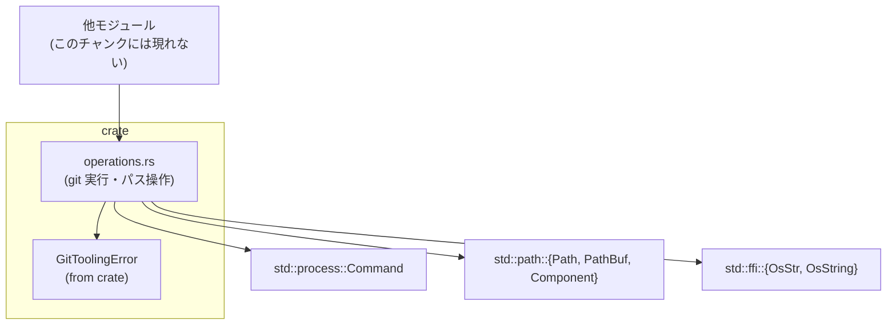
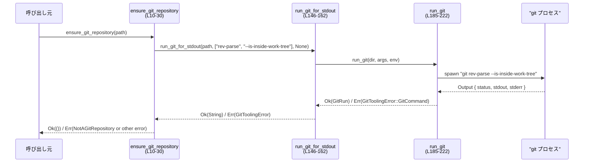

# git-utils\src\operations.rs

## 0. ざっくり一言

`git` コマンドを呼び出すための共通ラッパーと、Git リポジトリに関連するパス操作（ルート検出・相対パス正規化・サブディレクトリ判定）を提供するモジュールです（`git-utils\src\operations.rs` 全体）。

---

## 1. このモジュールの役割

### 1.1 概要

- このモジュールは **外部の `git` コマンドを安全に実行し、その結果を `GitToolingError` によるエラー型でラップする** ために存在します（`run_git*` 群, `run_git`。`git-utils\src\operations.rs:L133-L183, L185-L222`）。
- あわせて、**Git リポジトリ前提のパス操作**（リポジトリ存在確認、`HEAD` 解決、リポジトリルートやサブディレクトリの計算、相対パスの正規化）を提供します（`ensure_git_repository`, `resolve_head`, `resolve_repository_root`, `normalize_relative_path`, `repo_subdir`。`git-utils\src\operations.rs:L10-L90, L106-L123`）。

### 1.2 アーキテクチャ内での位置づけ

このモジュールは以下のような関係を持ちます。



- 呼び出し元（他のモジュール）は `Ops` の関数を使って Git 状態の問い合わせやコマンド実行を行うことが想定されます（ただし、このチャンクには呼び出し側のコードは現れません）。
- エラーはすべて `GitToolingError` に統一されます（`git-utils\src\operations.rs:L8, L20-L27, L48-L78, L80-L90, L133-L183, L185-L222`）。
- 外部プロセス実行には `std::process::Command` が用いられます（`git-utils\src\operations.rs:L6, L201-L210`）。

### 1.3 設計上のポイント

- **責務の分割**
  - Git コマンド実行のコアは `run_git` に集約し（`git-utils\src\operations.rs:L185-L222`）、返却値をラップ・整形する薄いラッパー関数（`run_git_for_status`, `run_git_for_stdout`, `run_git_for_stdout_all`）を用意する構造になっています（`git-utils\src\operations.rs:L133-L183`）。
  - パス計算に関する処理（相対パス正規化・サブディレクトリ判定）は別関数に分離されています（`normalize_relative_path`, `repo_subdir`, `non_empty_path`。`git-utils\src\operations.rs:L48-L78, L106-L131`）。
- **状態を持たない設計**
  - すべての関数は引数のみを入力とし、モジュール内にグローバル状態はありません。`GitRun` 構造体も関数ローカルでのみ使われ、外部に公開されません（`git-utils\src\operations.rs:L236-L239`）。
- **エラーハンドリング方針**
  - 外部コマンドの終了ステータスが成功以外の場合、標準エラー出力を `String` に変換して `GitToolingError::GitCommand` に格納します（`git-utils\src\operations.rs:L210-L216`）。
  - UTF-8 変換エラーは `GitToolingError::GitOutputUtf8` に変換し、どのコマンドで失敗したかを保持します（`git-utils\src\operations.rs:L155-L161, L179-L182`）。
  - Git が「リポジトリではない」として 128 で終了する場合を特別扱いし、より意味のある `NotAGitRepository` エラーや `None` を返します（`ensure_git_repository`, `resolve_head`。`git-utils\src\operations.rs:L23-L27, L42-L44`）。
- **安全なパス処理**
  - 相対パス中の `..` によりリポジトリ外へ抜けることを検出し、エラーにします（`git-utils\src\operations.rs:L57-L61`）。
  - 絶対パスやプレフィックス付きパスは `NonRelativePath` エラーとして弾きます（`git-utils\src\operations.rs:L63-L67, L71-L75`）。

---

## 2. 主要な機能一覧

- Git リポジトリ検証: `ensure_git_repository` — 指定ディレクトリが Git リポジトリか確認する（`git-utils\src\operations.rs:L10-L30`）。
- HEAD 解決: `resolve_head` — `HEAD` のコミット SHA を取得し、「HEAD がない」ケースを `None` で返す（`git-utils\src\operations.rs:L32-L46`）。
- 相対パス正規化: `normalize_relative_path` — `.` と `..` を解決し、リポジトリ外への脱出や絶対パスを禁止する（`git-utils\src\operations.rs:L48-L78`）。
- リポジトリルート取得: `resolve_repository_root` — Git が認識するリポジトリ・トップレベルパスを取得する（`git-utils\src\operations.rs:L80-L90`）。
- パスへのリポジトリプレフィックス付与: `apply_repo_prefix_to_force_include` — 一群のパスに共通の接頭パスを付与する（`git-utils\src\operations.rs:L92-L104`）。
- サブディレクトリ判定: `repo_subdir` — ルートとパスから、リポジトリ内サブディレクトリを計算する（`git-utils\src\operations.rs:L106-L123`）。
- Git コマンド実行（成功/失敗のみ知りたい）: `run_git_for_status` — 成否のみを `Result<(), GitToolingError>` で返す（`git-utils\src\operations.rs:L133-L144`）。
- Git コマンド実行（トリム済み標準出力）: `run_git_for_stdout` — 標準出力を UTF-8 文字列に変換し、前後空白をトリムして返す（`git-utils\src\operations.rs:L146-L162`）。
- Git コマンド実行（生の標準出力）: `run_git_for_stdout_all` — 標準出力をトリムせずそのまま UTF-8 文字列に変換して返す（`git-utils\src\operations.rs:L164-L183`）。
- Git コマンド実行のコア: `run_git` — 引数ベクタ・環境変数の設定・プロセス実行・終了コードチェックを行う内部関数（`git-utils\src\operations.rs:L185-L222`）。

---

## 3. 公開 API と詳細解説

### 3.1 型一覧（構造体・列挙体など）

このモジュールには **外部に公開される型（`pub`）はありません**。内部でのみ利用される構造体として `GitRun` があります。

| 名前       | 種別   | 可視性    | 役割 / 用途 | 根拠 |
|------------|--------|-----------|-------------|------|
| `GitRun`   | 構造体 | `struct`（モジュール内非公開） | 実行した `git` コマンド文字列と、その `std::process::Output` をまとめて保持するための内部用コンテナです。`run_git` の戻り値としてのみ使われます。 | `git-utils\src\operations.rs:L236-L239` |

### 3.2 関数詳細（最大 7 件）

以下では、公開 API（`pub(crate)`）およびコアロジックとして重要な関数を 7 件選び、詳細に説明します。

---

#### `ensure_git_repository(path: &Path) -> Result<(), GitToolingError>`

**概要**

- 指定されたディレクトリが Git リポジトリ（作業ツリー内）かどうかをチェックし、そうでない場合にエラーを返します（`git-utils\src\operations.rs:L10-L30`）。
- 内部的には `git rev-parse --is-inside-work-tree` を実行し、出力と終了コードから判定します。

**引数**

| 引数名 | 型        | 説明 |
|--------|-----------|------|
| `path` | `&Path`   | Git リポジトリであることを期待するディレクトリパスです。`std::process::Command::current_dir` に渡されます。 |

**戻り値**

- `Ok(())`: `path` が Git の作業ツリー内と判定された場合。
- `Err(GitToolingError)`:
  - `NotAGitRepository { path }`: Git の終了コードや出力から、リポジトリではないと判断された場合。
  - それ以外の `GitToolingError`（`run_git_for_stdout` / `run_git` 由来）。

**内部処理の流れ**

1. `run_git_for_stdout(path, ["rev-parse", "--is-inside-work-tree"], None)` を呼び出します（`git-utils\src\operations.rs:L11-L18`）。
2. `Ok(output)` の場合:
   - `output.trim() == "true"` なら `Ok(())` を返します（`git-utils\src\operations.rs:L19`）。
   - それ以外の出力なら `GitToolingError::NotAGitRepository { path }` を返します（`git-utils\src\operations.rs:L20-L22`）。
3. `Err(GitToolingError::GitCommand { status, .. })` かつ `status.code() == Some(128)` の場合、これも「リポジトリではない」とみなして `NotAGitRepository { path }` を返します（`git-utils\src\operations.rs:L23-L27`）。
4. それ以外のエラーは、そのまま上位に返します（`git-utils\src\operations.rs:L28`）。

**Examples（使用例）**

```rust
use std::path::Path;
use git_utils::GitToolingError; // 実際のパスは本クレート構成に依存（このチャンクには現れない）

fn main() -> Result<(), GitToolingError> {
    // カレントディレクトリをGitリポジトリとして期待する例
    let path = Path::new(".");

    // リポジトリであるか確認する
    ensure_git_repository(path)?; // リポジトリでなければErr(GitToolingError)になる

    // ここまで来ればGitリポジトリと判定された
    Ok(())
}
```

**Errors / Panics**

- Errors:
  - Git 実行に失敗（`git` 不在・実行権限なしなど）した場合は、`run_git` 由来のエラー（`GitToolingError` の何らかのバリアント）になります（`git-utils\src\operations.rs:L185-L222`）。
  - `git rev-parse` が 128 で終了、または `"true"` 以外の出力を返した場合は、`NotAGitRepository { path }` になります。
- Panics:
  - この関数内で `panic!` や `unwrap` は使用されていません（`git-utils\src\operations.rs:L10-L30`）。パニックは発生しません。

**Edge cases（エッジケース）**

- `path` が存在しないディレクトリの場合:
  - `git` 実行が失敗して `GitToolingError` となる可能性があります（`command.output()?` 部分。`git-utils\src\operations.rs:L209`）。
- `git` コマンドがインストールされていない場合:
  - `Command::new("git").output()` が `std::io::Error` を返し、それが `GitToolingError` に変換されます（変換の詳細はこのチャンクには現れません。`git-utils\src\operations.rs:L201-L210`）。
- `git rev-parse` が予期しない出力（`"true"` / `"false"` 以外）を返す場合:
  - `"true"` 以外はすべて「リポジトリでない」とみなされます（`git-utils\src\operations.rs:L19-L22`）。

**使用上の注意点**

- リポジトリでない場合は `NotAGitRepository` エラーとなるため、上位で明示的にハンドリングする前提で使う設計になっています。
- この関数は **リポジトリの種類や状態（ベアリポジトリなど）** については区別していません。`rev-parse --is-inside-work-tree` の結果に完全に依存しています。

---

#### `resolve_head(path: &Path) -> Result<Option<String>, GitToolingError>`

**概要**

- 指定ディレクトリの `HEAD` が指すコミットの SHA-1 を文字列で返します（`git-utils\src\operations.rs:L32-L46`）。
- リポジトリだが `HEAD` が存在しない（履歴がない）場合は `Ok(None)` を返します。

**引数**

| 引数名 | 型      | 説明 |
|--------|---------|------|
| `path` | `&Path` | Git リポジトリ（またはそう期待する場所）のパス。 |

**戻り値**

- `Ok(Some(sha))`: `HEAD` が存在し、そのコミット ID を取得できた場合。
- `Ok(None)`: `git rev-parse` がステータスコード 128 で終了し、「HEAD がない」と判断された場合。
- `Err(GitToolingError)`: それ以外の Git 実行エラーなど。

**内部処理の流れ**

1. `run_git_for_stdout(path, ["rev-parse", "--verify", "HEAD"], None)` を呼び出します（`git-utils\src\operations.rs:L33-L41`）。
2. `Ok(sha)` の場合は `Ok(Some(sha))` を返します（`git-utils\src\operations.rs:L42`）。
3. `Err(GitToolingError::GitCommand { status, .. })` かつ `status.code() == Some(128)` の場合は `Ok(None)` を返します（`git-utils\src\operations.rs:L43`）。
4. それ以外のエラーはそのまま返します（`git-utils\src\operations.rs:L44`）。

**Examples（使用例）**

```rust
use std::path::Path;
use git_utils::GitToolingError;

fn print_head(path: &Path) -> Result<(), GitToolingError> {
    match resolve_head(path)? {
        Some(sha) => println!("HEAD = {sha}"),  // HEAD が存在する場合
        None => println!("HEAD が存在しません（空リポジトリなど）"),
    }
    Ok(())
}
```

**Errors / Panics**

- Errors:
  - Git 実行に失敗した場合や、UTF-8 変換に失敗した場合は `GitToolingError` として返ります（`run_git_for_stdout` 経由。`git-utils\src\operations.rs:L146-L162`）。
- Panics:
  - この関数自身はパニックを起こすコード（`unwrap` 等）を含みません（`git-utils\src\operations.rs:L32-L46`）。

**Edge cases**

- 空リポジトリ（コミットが存在しない）のケース:
  - 通常 Git は `rev-parse --verify HEAD` をステータス 128 で失敗させるため、この関数は `Ok(None)` を返します（`git-utils\src\operations.rs:L43`）。
- `HEAD` の参照が壊れているなどの異常状態:
  - Git のエラーメッセージや終了コードに依存します。128 以外の終了コードや他の異常は、そのまま `Err(GitToolingError)` になります。

**使用上の注意点**

- `None` と `Err(..)` を意味的に区別する必要があります。`None` は「Git 的に妥当だが HEAD がない」ケースであり、`Err` はそれ以外の失敗です。
- 戻り値はトリム済みの SHA 文字列です（余分な改行や空白は除去済み。`git-utils\src\operations.rs:L155-L158`）。

---

#### `normalize_relative_path(path: &Path) -> Result<PathBuf, GitToolingError>`

**概要**

- 指定されたパスを **相対パスとして** 正規化し、`.` や `..` を解決して返します（`git-utils\src\operations.rs:L48-L78`）。
- パスが絶対パスであったり、`..` によってルートより上へ抜ける場合にはエラーとして扱います。

**引数**

| 引数名 | 型      | 説明 |
|--------|---------|------|
| `path` | `&Path` | 正規化対象のパス。相対パスである必要があります。 |

**戻り値**

- `Ok(PathBuf)`: 正規化済み相対パス。
- `Err(GitToolingError::NonRelativePath { path })`: 絶対パスまたはプレフィックス付きパス、あるいはコンポーネントを含まないパスだった場合（`git-utils\src\operations.rs:L63-L67, L71-L75`）。
- `Err(GitToolingError::PathEscapesRepository { path })`: `..` によってルート上位に抜けてしまう形になる場合（`git-utils\src\operations.rs:L57-L61`）。

**内部処理の流れ**

1. `result` として空の `PathBuf` を作成し、`saw_component` フラグを `false` に初期化します（`git-utils\src\operations.rs:L49-L50`）。
2. `path.components()` を順に処理し、`saw_component = true` に設定します（`git-utils\src\operations.rs:L51-L52`）。
3. 各コンポーネントに応じて以下を行います（`git-utils\src\operations.rs:L53-L68`）:
   - `Component::Normal(part)`: `result.push(part)` で追加。
   - `Component::CurDir` (`.`): 何もしない。
   - `Component::ParentDir` (`..`): `result.pop()` を試み、ポップに失敗した場合は `PathEscapesRepository` エラー。
   - `Component::RootDir` または `Component::Prefix(_)`: `NonRelativePath` エラー。
4. ループ終了後、`saw_component` が `false` のまま（コンポーネントが一つもなかった）場合も `NonRelativePath` エラーを返します（`git-utils\src\operations.rs:L71-L75`）。
5. それ以外の場合、`Ok(result)` を返します（`git-utils\src\operations.rs:L77`）。

**Examples（使用例）**

```rust
use std::path::Path;
use git_utils::GitToolingError;

// 相対パスの正規化例
fn example() -> Result<(), GitToolingError> {
    let path = Path::new("src/../tests/./unit");
    let normalized = normalize_relative_path(path)?; // "tests/unit" に相当するパスが返る
    println!("normalized = {:?}", normalized);
    Ok(())
}
```

**Errors / Panics**

- Errors:
  - 絶対パス（例: `/foo/bar`）やドライブプレフィックス付きパス（Windows の `C:\foo` など）は `NonRelativePath` になります（`git-utils\src\operations.rs:L63-L67`）。
  - `..` が多すぎてルートより上に出てしまう場合は `PathEscapesRepository` になります（`git-utils\src\operations.rs:L57-L61`）。
- Panics:
  - パニックを発生させるコードはありません（`git-utils\src\operations.rs:L48-L78`）。

**Edge cases**

- 空パス（`Path::new("")`）:
  - `components()` が空となり、`saw_component` が `false` のため `NonRelativePath` です（`git-utils\src\operations.rs:L71-L75`）。
- `.` のみのパス（`Path::new(".")`）:
  - `Component::CurDir` のみを含むため、`result` は空になりますが、`saw_component` は `true` になっているので `Ok(PathBuf::new())` が返ります（`git-utils\src\operations.rs:L51-L56, L77`）。
- `..` のみのパス（`Path::new("..")`）:
  - `result.pop()` が失敗して `PathEscapesRepository` になります（`git-utils\src\operations.rs:L57-L61`）。

**使用上の注意点**

- 戻り値は **必ず相対パス** であり、ルートやプレフィックスは含まれません。
- リポジトリ外へのエスケープを防ぐ目的で使われているため、「あえてリポジトリ外を指す相対パスを許可したい」といった用途には適しません。

---

#### `repo_subdir(repo_root: &Path, repo_path: &Path) -> Option<PathBuf>`

**概要**

- `repo_root` と `repo_path` の関係から、`repo_path` が `repo_root` 以下にある場合、そのサブディレクトリ部分（相対パス）を返します（`git-utils\src\operations.rs:L106-L123`）。
- 同じパスの場合は `None`、ルート外であり `strip_prefix` に失敗した場合も `None` になりますが、後者については **パスの正規化（`canonicalize`）による再試行** が行われます。

**引数**

| 引数名     | 型      | 説明 |
|------------|---------|------|
| `repo_root` | `&Path` | Git リポジトリのルートディレクトリを表すパス。 |
| `repo_path` | `&Path` | サブディレクトリかどうかを判定したいパス。 |

**戻り値**

- `Some(subdir)`: `repo_path` が `repo_root` のサブディレクトリであり、その部分が非空であった場合の相対パス。
- `None`: `repo_root == repo_path` の場合、または `canonicalize` してもなお `repo_root` のプレフィックスでない場合、または `non_empty_path` 判定で空とみなされた場合。

**内部処理の流れ**

1. `repo_root == repo_path` の場合、`None` を返します（`git-utils\src\operations.rs:L107-L109`）。
2. `repo_path.strip_prefix(repo_root)` を試み、成功した場合は `non_empty_path` を通して `Some(..)` / `None` を返します（`git-utils\src\operations.rs:L111-L115`）。
3. 失敗した場合は `or_else` ブロックで以下を行います（`git-utils\src\operations.rs:L115-L122`）:
   - `repo_root_canon = repo_root.canonicalize().ok()?`。エラーの場合は `None`。
   - `repo_path_canon = repo_path.canonicalize().ok()?`。エラーの場合は `None`。
   - `repo_path_canon.strip_prefix(&repo_root_canon)` を試し、成功した場合は再度 `non_empty_path` を通して返します。
4. いずれのパスでも `strip_prefix` に成功しない場合は `None`。

**Examples（使用例）**

```rust
use std::path::Path;

fn example_repo_subdir() {
    let root = Path::new("/home/user/project");
    let sub  = Path::new("/home/user/project/src/lib");

    match repo_subdir(root, sub) {
        Some(rel) => println!("subdir = {:?}", rel), // "src/lib" に相当
        None => println!("サブディレクトリではない、または同じパス"),
    }
}
```

**Errors / Panics**

- Errors:
  - この関数は `Result` ではなく `Option` を返すため、ファイルシステムエラー（`canonicalize` 失敗）はすべて `None` に吸収されます（`git-utils\src\operations.rs:L116-L117`）。
- Panics:
  - パニックを起こすコードは含まれていません（`git-utils\src\operations.rs:L106-L123`）。

**Edge cases**

- シンボリックリンクを含む場合:
  - 直接の `strip_prefix` に失敗しても、`canonicalize` された絶対パス同士で再度 `strip_prefix` を試みるため、リンク解決後のパス関係でサブディレクトリ判定されます（`git-utils\src\operations.rs:L115-L122`）。
- `repo_root` や `repo_path` の `canonicalize` が失敗した場合（存在しないパスなど）:
  - `ok()?` により `None` が返ります（`git-utils\src\operations.rs:L116-L117`）。
- `repo_root == repo_path`:
  - 常に `None` が返ります（`git-utils\src\operations.rs:L107-L109`）。

**使用上の注意点**

- ファイルシステム上のエラーと「サブディレクトリでない」ケースがいずれも `None` になるため、原因の区別はできません。
- 戻り値のパスは `non_empty_path` を通すだけであり、さらに `normalize_relative_path` などを通しているわけではありません（`git-utils\src\operations.rs:L125-L131`）。

---

#### `run_git_for_stdout<I, S>(dir: &Path, args: I, env: Option<&[(OsString, OsString)]>) -> Result<String, GitToolingError>`

**概要**

- `run_git` を使って Git コマンドを実行し、標準出力を UTF-8 文字列としてトリムして返します（`git-utils\src\operations.rs:L146-L162`）。
- 行末の改行など、前後の空白を削除する用途に向いています。

**引数**

| 引数名 | 型 | 説明 |
|--------|----|------|
| `dir`  | `&Path` | `git` を実行する作業ディレクトリです。`Command::current_dir` に渡されます（`git-utils\src\operations.rs:L201-L203`）。 |
| `args` | `I` where `I: IntoIterator<Item = S>` | `git` に渡す引数の列です。`S: AsRef<OsStr>` により、`&str`, `OsString` などから渡せます（`git-utils\src\operations.rs:L152-L153`）。 |
| `env`  | `Option<&[(OsString, OsString)]>` | 追加で設定する環境変数のキー・値ペア配列。`None` の場合は設定しません（`git-utils\src\operations.rs:L203-L207`）。 |

**戻り値**

- `Ok(String)`: Git の標準出力を UTF-8 としてデコードし、`trim()` 済みの文字列。
- `Err(GitToolingError)`:
  - Git 実行失敗 (`GitCommand` など)。
  - UTF-8 変換失敗 (`GitOutputUtf8` バリアント。`git-utils\src\operations.rs:L158-L161` 参照)。

**内部処理の流れ**

1. `run_git(dir, args, env)?` を呼び出し、`GitRun` を取得します（`git-utils\src\operations.rs:L155`）。
2. `String::from_utf8(run.output.stdout)` を呼び出して UTF-8 文字列に変換します（`git-utils\src\operations.rs:L156`）。
3. 成功した場合は `value.trim().to_string()` を `Ok` として返します（`git-utils\src\operations.rs:L156-L157`）。
4. 失敗した場合は `GitToolingError::GitOutputUtf8 { command, source }` を返します（`git-utils\src\operations.rs:L158-L161`）。

**Examples（使用例）**

```rust
use std::ffi::OsString;
use std::path::Path;
use git_utils::GitToolingError;

fn print_git_version() -> Result<(), GitToolingError> {
    let dir = Path::new(".");
    let output = run_git_for_stdout(
        dir,
        vec![OsString::from("--version")], // git --version
        None,
    )?;
    println!("git version: {output}");
    Ok(())
}
```

**Errors / Panics**

- Errors:
  - 終了コードが成功でない場合は、`run_git` 内で `GitToolingError::GitCommand { command, status, stderr }` に変換されます（`git-utils\src\operations.rs:L210-L216`）。
  - 標準出力が UTF-8 でない場合、`GitOutputUtf8 { command, source }` が返ります（`git-utils\src\operations.rs:L158-L161`）。
- Panics:
  - `unwrap` や `expect` は使用されておらず、パニックはありません（`git-utils\src\operations.rs:L146-L162`）。

**Edge cases**

- 標準出力が大量のデータの場合:
  - 全てをメモリ上に `String` として保持します。大きな出力には注意が必要です。
- 出力の前後スペースが意味を持つコマンドの場合:
  - `trim()` によってスペースや改行が削除されるため、トリム不要の場合は `run_git_for_stdout_all` を使う必要があります（`git-utils\src\operations.rs:L164-L183`）。

**使用上の注意点**

- NUL 区切り (`-z` オプション) など、区切り文字に敏感な出力を扱う場合には **この関数は不適切** です。必ず `run_git_for_stdout_all` を利用します。
- UTF-8 以外のエンコーディングを返す環境では UTF-8 変換エラーになる可能性があります。

---

#### `run_git_for_stdout_all<I, S>(...) -> Result<String, GitToolingError>`

**概要**

- `run_git_for_stdout` と同様に Git コマンドを実行しますが、標準出力に対して **トリムや加工を一切行わず**、UTF-8 文字列としてそのまま返します（`git-utils\src\operations.rs:L164-L183`）。
- NUL 区切りなどの「区切りに敏感な出力」を扱う場面向けです。

**引数・戻り値**

- シグネチャと意味は `run_git_for_stdout` と同一ですが、戻り値の文字列に対する加工が異なります（`git-utils\src\operations.rs:L167-L173, L179-L182`）。

**内部処理の流れ**

1. `run_git(dir, args, env)?` で `GitRun` を取得します（`git-utils\src\operations.rs:L177`）。
2. `String::from_utf8(run.output.stdout)` を呼び出し、UTF-8 文字列として返します（`git-utils\src\operations.rs:L179-L182`）。
3. `trim()` や `to_string()` などの追加処理は行いません（コメントでも明示されています。`git-utils\src\operations.rs:L175-L176`）。

**Examples（使用例）**

```rust
use std::ffi::OsString;
use std::path::Path;
use git_utils::GitToolingError;

// NUL区切りのパスリストを取得する例
fn list_tracked_files_null_sep() -> Result<Vec<String>, GitToolingError> {
    let dir = Path::new(".");
    let output = run_git_for_stdout_all(
        dir,
        vec![OsString::from("ls-files"), OsString::from("-z")],
        None,
    )?;
    // "\0" で split してパスのベクタにする
    let paths: Vec<String> = output
        .split('\0')
        .filter(|s| !s.is_empty())
        .map(|s| s.to_string())
        .collect();
    Ok(paths)
}
```

**Errors / Panics**

- Errors:
  - `run_git_for_stdout` と同じく、Git 実行失敗・UTF-8 変換失敗を `GitToolingError` に包んで返します（`git-utils\src\operations.rs:L177-L182`）。
- Panics:
  - パニック要素はありません。

**Edge cases**

- 出力末尾に改行が含まれる場合も、そのまま残ります（`trim()` しないため）。
- NUL 文字を含む出力も `String` 中にそのまま保持されます。

**使用上の注意点**

- 呼び出し側で改行や NUL を含む出力を適切にパース・処理する必要があります。
- `run_git_for_stdout` と違い、末尾改行を前提に `split('\n')` するなどの処理を書きやすい一方で、不要な空白を自動で取り除いてはくれません。

---

#### `run_git<I, S>(dir: &Path, args: I, env: Option<&[(OsString, OsString)]>) -> Result<GitRun, GitToolingError>`

**概要**

- 実際に `git` プロセスを起動し、終了コードと出力をチェックする **コア関数** です（`git-utils\src\operations.rs:L185-L222`）。
- 成功時には `GitRun`（コマンド文字列 + 出力）を返し、失敗時には `GitToolingError::GitCommand { .. }` を返します。

**引数**

| 引数名 | 型 | 説明 |
|--------|----|------|
| `dir`  | `&Path` | `git` を実行する作業ディレクトリ。 |
| `args` | `I` where `I: IntoIterator<Item = S>` | `git` に渡す引数列。 |
| `env`  | `Option<&[(OsString, OsString)]>` | 追加で設定する環境変数。（キー・値ともに `OsString`） |

**戻り値**

- `Ok(GitRun { command, output })`: 終了コードが成功（`status.success() == true`）かつ、プロセス生成に成功した場合（`git-utils\src\operations.rs:L218-L221`）。
- `Err(GitToolingError::GitCommand { command, status, stderr })`: プロセスは生成できたが、終了コードが成功でない場合（`git-utils\src\operations.rs:L210-L216`）。
- その他の `GitToolingError`:
  - `command.output()?` がエラーを返した場合に、`?` によって `GitToolingError` に変換されます（詳細はこのチャンクには現れません。`git-utils\src\operations.rs:L209`）。

**内部処理の流れ**

1. `args.into_iter()` でイテレータを取得し、`size_hint` からベクタ容量を推定して `args_vec` を構築します（`git-utils\src\operations.rs:L194-L199`）。
2. `build_command_string(&args_vec)` を呼び、`"git " + args` 形式の人間可読な文字列を作成します（`git-utils\src\operations.rs:L200`）。
3. `Command::new("git")` でコマンドを作成し、`current_dir(dir)` を設定します（`git-utils\src\operations.rs:L201-L203`）。
4. `env` が `Some` の場合、各 `(key, value)` を `command.env(key, value)` で追加します（`git-utils\src\operations.rs:L203-L207`）。
5. `command.args(&args_vec)` を設定し、`command.output()?` でプロセスを実行します（`git-utils\src\operations.rs:L208-L209`）。
6. `output.status.success()` を確認し、偽であれば `stderr` を UTF-8 lossily 変換した文字列とともに `GitToolingError::GitCommand` を返します（`git-utils\src\operations.rs:L210-L216`）。
7. 成功の場合は `GitRun { command: command_string, output }` を返します（`git-utils\src\operations.rs:L218-L221`）。

**Examples（使用例）**

通常は `run_git_for_*` 経由で使われる想定のため、直接利用する場面は少ないと考えられますが、例えば標準エラーも含めて詳細に扱いたい場合に用いることができます。

```rust
use std::ffi::OsString;
use std::path::Path;
use git_utils::GitToolingError;

fn raw_git_status(dir: &Path) -> Result<(), GitToolingError> {
    let run = run_git(
        dir,
        vec![OsString::from("status"), OsString::from("--short")],
        None,
    )?;
    eprintln!("command: {}", run.command);
    eprintln!("stdout: {}", String::from_utf8_lossy(&run.output.stdout));
    eprintln!("stderr: {}", String::from_utf8_lossy(&run.output.stderr));
    Ok(())
}
```

**Errors / Panics**

- Errors:
  - プロセス生成エラー（`std::io::Error`）は `?` により `GitToolingError` に変換されます（変換の具体的定義はこのチャンクにはありません。`git-utils\src\operations.rs:L209`）。
  - 終了コードが成功でない場合は `GitCommand` バリアントとして詳細情報入りのエラーになります（`git-utils\src\operations.rs:L210-L216`）。
- Panics:
  - `unwrap` などは利用しておらず、パニック要素はありません。

**Edge cases**

- 引数が空 (`args` が空イテレータ) の場合:
  - `build_command_string` は `"git"` だけを返します（`git-utils\src\operations.rs:L224-L227`）。
  - 実行されるコマンドも `git` のみであり、通常はヘルプやバージョン情報を出して終了します。
- `env` が空配列で `Some(&[])` の場合:
  - For ループを通りますが、何も設定されません（`git-utils\src\operations.rs:L203-L207`）。

**使用上の注意点**

- `build_command_string` はエラー用の人間可読な文字列であり、実際の引数は `OsString` ベースで安全に渡されています。そのため、**シェルインジェクションのようなリスクは `Command` の使用によって回避** されています（`git-utils\src\operations.rs:L200-L201, L208`）。
- 大量の標準出力・標準エラーをすべてメモリに読み込む点に注意が必要です。

---

### 3.3 その他の関数

以下は補助的／比較的単純なラッパー関数です。

| 関数名 | シグネチャ（概要） | 役割（1 行） | 根拠 |
|--------|--------------------|--------------|------|
| `resolve_repository_root` | `pub(crate) fn resolve_repository_root(path: &Path) -> Result<PathBuf, GitToolingError>` | `git rev-parse --show-toplevel` を実行し、Git が認識するリポジトリルートパスを返します。内部では `run_git_for_stdout` を呼び、結果を `PathBuf::from` でラップするだけです。 | `git-utils\src\operations.rs:L80-L90` |
| `apply_repo_prefix_to_force_include` | `pub(crate) fn apply_repo_prefix_to_force_include(prefix: Option<&Path>, paths: &[PathBuf]) -> Vec<PathBuf>` | プレフィックスが指定されていれば `prefix.join(path)` を全要素に適用し、なければ元のパス配列をコピーして返します。空配列なら即座に空ベクタを返します。 | `git-utils\src\operations.rs:L92-L104` |
| `run_git_for_status` | `pub(crate) fn run_git_for_status<I, S>(...) -> Result<(), GitToolingError>` | `run_git` を呼び出し、成功時の戻り値を捨てて `Ok(())` にすることで「成功／失敗」だけを返すラッパーです。 | `git-utils\src\operations.rs:L133-L144` |
| `non_empty_path` | `fn non_empty_path(path: &Path) -> Option<PathBuf>` | `path.as_os_str().is_empty()` で空パスを判定し、非空の場合のみ `Some(path.to_path_buf())` を返すユーティリティです。`repo_subdir` 内のフィルタとして使われます。 | `git-utils\src\operations.rs:L125-L131` |
| `build_command_string` | `fn build_command_string(args: &[OsString]) -> String` | エラーメッセージ用に `"git arg1 arg2 ..."` 形式の人間可読なコマンド文字列を作る関数です。引数がない場合は `"git"` を返します。 | `git-utils\src\operations.rs:L224-L234` |

---

## 4. データフロー

ここでは代表的なシナリオとして、`ensure_git_repository` が内部で Git コマンドを実行してリポジトリ判定を行う流れを示します。

### シナリオ説明

1. 呼び出し元が `ensure_git_repository(path)` を呼びます。
2. モジュールは `run_git_for_stdout` を通じて `git rev-parse --is-inside-work-tree` を実行します。
3. `run_git_for_stdout` は内部で `run_git` を呼び、`git` プロセスを生成して標準出力をキャプチャします。
4. 結果の標準出力・終了コードをもとに、`ensure_git_repository` は `Ok(())` か `NotAGitRepository` エラーを返します。



- `Caller` はこのチャンクには現れませんが、他モジュールがこの関数群を使うことが想定されます。
- すべてのエラーは `GitToolingError` によって表現され、途中のどの段階で失敗したかはバリアント内容（`GitCommand`, `GitOutputUtf8`, `NotAGitRepository` など）から判別できます。

---

## 5. 使い方（How to Use）

### 5.1 基本的な使用方法

典型的なフローとして、「リポジトリルートを取得 → リポジトリであることを確認 → HEAD を取得」という流れの例を示します。

```rust
use std::path::Path;
use git_utils::GitToolingError;
// 実際のモジュールパスはこのチャンクには現れないが、仮に `git_utils::operations` とする
// use git_utils::operations::{ensure_git_repository, resolve_repository_root, resolve_head};

fn inspect_repo(path: &Path) -> Result<(), GitToolingError> {
    // 1. 指定パスがGitリポジトリであることを確認する
    ensure_git_repository(path)?; // L10-30

    // 2. リポジトリルートを取得する
    let root = resolve_repository_root(path)?; // L80-90
    println!("repo root: {:?}", root);

    // 3. HEAD コミットを取得する
    match resolve_head(path)? { // L32-46
        Some(sha) => println!("HEAD = {sha}"),
        None => println!("HEAD が存在しません（空リポジトリなど）"),
    }

    Ok(())
}
```

### 5.2 よくある使用パターン

1. **特定パス群へのリポジトリプレフィックス付与**

```rust
use std::path::{Path, PathBuf};

fn make_force_include_paths(root: &Path) -> Vec<PathBuf> {
    let relative_paths = vec![PathBuf::from("src/lib.rs"), PathBuf::from("README.md")];

    // リポジトリルートをプレフィックスにして絶対パスに変換する
    apply_repo_prefix_to_force_include(Some(root), &relative_paths) // L92-104
}
```

1. **相対パスを安全に正規化してから利用する**

```rust
use std::path::Path;
use git_utils::GitToolingError;

fn safe_relative(path: &Path) -> Result<(), GitToolingError> {
    let normalized = normalize_relative_path(path)?; // L48-78
    println!("normalized: {:?}", normalized);
    Ok(())
}
```

### 5.3 よくある間違い

```rust
use std::path::Path;
use git_utils::GitToolingError;

// 間違い例: 絶対パスを normalize_relative_path に渡してしまう
fn wrong_usage() -> Result<(), GitToolingError> {
    let abs = Path::new("/etc/passwd");
    let _ = normalize_relative_path(abs)?; // L48-78
    // ↑ NonRelativePath エラーになる可能性が高い
    Ok(())
}

// 正しい例: normalize_relative_path には相対パスのみを渡す
fn correct_usage() -> Result<(), GitToolingError> {
    let rel = Path::new("src/../tests");
    let normalized = normalize_relative_path(rel)?;
    println!("normalized = {:?}", normalized);
    Ok(())
}
```

```rust
use std::path::Path;

// 間違い例: repo_subdir の None を「必ずサブディレクトリがある」と決め打ちして unwrap
fn wrong_repo_subdir(root: &Path, path: &Path) {
    let subdir = repo_subdir(root, path).unwrap(); // root==path や、パス不整合で panic の可能性
    println!("{:?}", subdir);
}

// 正しい例: None を考慮してマッチする
fn correct_repo_subdir(root: &Path, path: &Path) {
    match repo_subdir(root, path) {
        Some(subdir) => println!("Subdir: {:?}", subdir),
        None => println!("サブディレクトリではない、またはパスを解決できない"),
    }
}
```

### 5.4 使用上の注意点（まとめ）

- **エラーの意味の取り扱い**
  - `NotAGitRepository`, `PathEscapesRepository`, `NonRelativePath` など、異なるバリアントが異なる問題を表します。上位コードで適切に区別して扱う必要があります（`git-utils\src\operations.rs:L20-L27, L57-L67, L71-L75`）。
- **外部プロセス実行のコスト**
  - `run_git*` 系は都度 `git` プロセスを起動します。高頻度で呼び出すと性能に影響する可能性があります（`git-utils\src\operations.rs:L201-L210`）。
- **セキュリティ上の観点**
  - 引数は `Command` に配列で渡しており、シェルを経由しないためシェルインジェクションのリスクは抑えられています（`git-utils\src\operations.rs:L200-L201, L208`）。
  - 一方で、**ユーザー入力をそのまま `git` の引数に渡す設計** にする場合、Git の側の挙動（任意のパスアクセスなど）については別途検討が必要です。
- **並行性**
  - グローバル状態を持たない純粋な関数群のため、複数スレッドから同時に呼び出してもデータレースは発生しません。ただし、`git` プロセスの多重起動や I/O 負荷には注意が必要です。

---

## 6. 変更の仕方（How to Modify）

### 6.1 新しい機能を追加する場合

1. **新しい Git コマンドラッパーを追加する**
   - 例: `git-utils\src\operations.rs` に `pub(crate) fn list_branches(...)` のような関数を追加する場合、
     - コマンド実行には既存の `run_git_for_status` / `run_git_for_stdout` / `run_git_for_stdout_all` のいずれかを利用することが推奨されます（`git-utils\src\operations.rs:L133-L183`）。
     - エラー種別を増やしたい場合は `GitToolingError` 側の定義を修正する必要がありますが、その定義はこのチャンクには現れません。
2. **パス操作系機能を拡張する**
   - `normalize_relative_path` や `repo_subdir` と同様のパターンで、`Path` を入力として `Result` または `Option` を返す関数を追加します（`git-utils\src\operations.rs:L48-L78, L106-L123`）。
   - リポジトリ境界をまたぐかどうかの判定などは、既存の `PathEscapesRepository` や `NonRelativePath` を再利用するとエラー設計の一貫性が保てます。

### 6.2 既存の機能を変更する場合

- **影響範囲の確認**
  - `run_git` や `run_git_for_stdout*` の振る舞いを変えると、このモジュール内のすべての Git ラッパーだけでなく、クレート全体でこれらを使用している機能に影響します（このチャンクには使用箇所は現れませんが、影響は広範囲になる可能性があります）。
- **契約（前提条件・返り値の意味）に関する注意**
  - `ensure_git_repository` は「128 の終了コードを NotAGitRepository と解釈する」契約に基づいています（`git-utils\src\operations.rs:L23-L27`）。この意味付けを変更すると、呼び出し側の期待を裏切る可能性があります。
  - `normalize_relative_path` の「絶対パスはエラー」「`..` で外に出ようとしたらエラー」という仕様（`git-utils\src\operations.rs:L57-L61, L63-L67`）は、安全性に直結するため、変更には慎重さが必要です。
- **テスト・使用箇所の再確認**
  - このファイル内にはテストコードが含まれていません（`git-utils\src\operations.rs` 全体）。変更時には、クレート全体のテスト（別ファイル）を見つけて追加・修正することが望ましいです。
- **バグ・セキュリティの観点**
  - 出力のトリミング仕様（`run_git_for_stdout` vs `run_git_for_stdout_all`）を変えると、区切り文字の扱いを前提としている呼び出し側が壊れる可能性があります（`git-utils\src\operations.rs:L155-L157, L175-L182`）。
  - `run_git` 内での `stderr` の取り扱い（lossy UTF-8 変換）は、ログ用途には十分ですが、バイナリデータを扱う場合に問題になるかもしれません（`git-utils\src\operations.rs:L211-L215`）。

---

## 7. 関連ファイル

このチャンクから直接参照される他ファイルは次の通りです。

| パス | 役割 / 関係 |
|------|------------|
| `crate::GitToolingError`（具体的なファイルパスはこのチャンクには現れない） | すべての関数が返すエラー型です。`GitCommand`, `GitOutputUtf8`, `NotAGitRepository`, `PathEscapesRepository`, `NonRelativePath` などのバリアントが存在することがコードから読み取れます（`git-utils\src\operations.rs:L8, L20-L27, L57-L67, L71-L75, L155-L161, L179-L182, L210-L216`）。 |

- このファイルから他のモジュールを `use` しているのは `GitToolingError` のみであり、他のクレート内モジュールとの依存関係はこのチャンクには現れていません。
