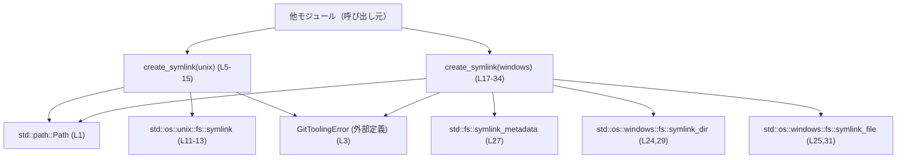
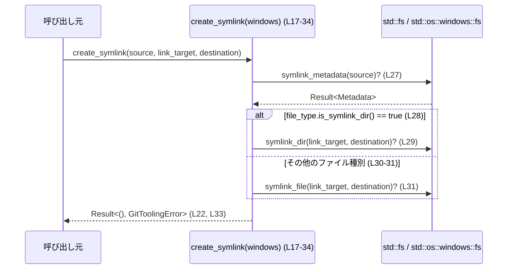

# git-utils/src/platform.rs コード解説

## 0. ざっくり一言

- OS ごとに異なるシンボリックリンク作成 API を、単一の `create_symlink` 関数としてラップするプラットフォーム依存ユーティリティです（platform.rs:L5-34）。
- Unix と Windows 以外ではコンパイルエラーにして、未対応プラットフォームでの誤用を防いでいます（platform.rs:L36-37）。

---

## 1. このモジュールの役割

### 1.1 概要

- このモジュールは、**シンボリックリンク（symlink）の作成を抽象化**するために存在し、呼び出し側からは OS 差異を意識せずにリンクを作成できるようにする機能を提供します（platform.rs:L5-34）。
- エラーはクレート共通の `GitToolingError` 型で呼び出し元に返し、OS や標準ライブラリのエラーを `?` 演算子で伝播させます（platform.rs:L10, L22, L27, L29, L31）。

### 1.2 アーキテクチャ内での位置づけ

依存関係を簡略化した図です。`create_symlink` の Unix/Windows 実装と、標準ライブラリとの関係を示しています。



- 呼び出し元は `create_symlink` を 1 つの API として使いますが、ビルドターゲットが Unix か Windows かによって実際にコンパイルされる実装が切り替わります（platform.rs:L5, L17, L36）。
- エラー型 `GitToolingError` はこのファイルでは定義されておらず、クレートの別の場所で定義されています（platform.rs:L3）。

### 1.3 設計上のポイント

- **プラットフォームごとの分岐をコンパイル時に解決**  
  - `#[cfg(unix)]` / `#[cfg(windows)]` / `#[cfg(not(any(unix, windows)))]` により、不要な実装はコンパイル自体されません（platform.rs:L5, L17, L36）。
- **統一された関数シグネチャ**  
  - Unix 版・Windows 版ともに同じシグネチャの `pub fn create_symlink(...) -> Result<(), GitToolingError>` を提供し、呼び出し側は OS 差異を意識しません（platform.rs:L6-10, L18-22）。
- **エラー処理は Result + `?` による伝播**  
  - すべての I/O エラーは `?` 演算子経由で `GitToolingError` に変換されて上位に返されます（platform.rs:L13, L22, L27, L29, L31）。
- **状態レスでスレッドセーフ**  
  - すべての引数は `&Path` 参照のみで、内部に可変なグローバル状態やキャッシュはありません（platform.rs:L6-9, L18-21）。  
    Rust の所有権・借用ルールに従い、関数自身はデータ競合を起こさない構造です。

---

## 2. 主要な機能一覧（コンポーネントインベントリー）

このファイルに登場する公開関数・コンパイル時コンポーネントの一覧です。

| 名前 | 種別 | 範囲(行) | 説明 / 役割 |
|------|------|----------|-------------|
| `create_symlink` (unix) | 関数（公開） | platform.rs:L5-15 | Unix 用の symlink 作成ラッパー。`std::os::unix::fs::symlink` を直接呼び出します。 |
| `create_symlink` (windows) | 関数（公開） | platform.rs:L17-34 | Windows 用の symlink 作成ラッパー。`source` のメタデータに基づいて `symlink_dir` / `symlink_file` を切り替えます。 |
| `compile_error!` | コンパイル時マクロ | platform.rs:L36-37 | Unix/Windows 以外のターゲットを完全に非対応にし、ビルドエラーにします。 |

※ ビルド時には、ターゲット OS に対応する `create_symlink` が 1 つだけコンパイルされます（platform.rs:L5, L17, L36）。

---

## 3. 公開 API と詳細解説

### 3.1 型一覧（構造体・列挙体など）

このファイル内で新規に定義される型はありません。  
外部から利用する主な型は次の 2 つです。

| 名前 | 種別 | 範囲(行) | 役割 / 用途 |
|------|------|----------|-------------|
| `Path` | 構造体（標準ライブラリ） | platform.rs:L1, L6-9, L18-21 | ファイルシステム上のパスを表す型。リンク元・リンク先・コピー元のパスを表現します。 |
| `GitToolingError` | エラー型（外部定義） | platform.rs:L3, L10, L22 | このクレートが共通で用いるエラー型。`?` 演算子で I/O エラー等がこの型に変換されて返されます。詳細な定義はこのチャンクには現れません。 |

### 3.2 関数詳細

#### `create_symlink(_source: &Path, link_target: &Path, destination: &Path) -> Result<(), GitToolingError>` （Unix）

**概要**

- Unix 環境でシンボリックリンクを作成する関数です（platform.rs:L5-15）。
- `link_target` を指すシンボリックリンクを `destination` のパスに作成します（platform.rs:L8-9, L13）。

**引数**

| 引数名 | 型 | 説明 |
|--------|----|------|
| `_source` | `&Path` | Unix 版では未使用の引数です。シグネチャ統一のために存在し、先頭に `_` を付けることでコンパイラの未使用警告を抑制しています（platform.rs:L6-7）。 |
| `link_target` | `&Path` | 新たに作るシンボリックリンクが指す先のパス（ターゲット）（platform.rs:L8, L13）。 |
| `destination` | `&Path` | 作成するシンボリックリンク自体のパス（platform.rs:L9, L13）。 |

**戻り値**

- `Ok(())`  
  - シンボリックリンク作成に成功したことを表します（platform.rs:L13-14）。
- `Err(GitToolingError)`  
  - ファイルシステム操作でエラーが発生した場合に返されます。`symlink` が返すエラーを `?` でそのまま伝播します（platform.rs:L13）。

**内部処理の流れ**

1. `std::os::unix::fs::symlink` 関数をスコープにインポートします（platform.rs:L11）。
2. `symlink(link_target, destination)?;` を実行し、OS にシンボリックリンク作成を依頼します（platform.rs:L13）。
3. エラーが発生した場合は `?` により即座に `Err(GitToolingError)` として呼び出し元に返されます（platform.rs:L13）。
4. 成功した場合は `Ok(())` を返します（platform.rs:L14）。

**Examples（使用例）**

Unix 環境で、`target.txt` を指す `link.txt` を作成する例です。  
モジュールパスはプロジェクト構成によって異なりますが、ここでは `crate::platform` という配置を仮定した例を示します（実際のパスはプロジェクトを確認する必要があります）。

```rust
use std::path::Path;
use crate::platform::create_symlink; // モジュールパスは構成によって異なる点に注意

fn main() -> Result<(), crate::GitToolingError> {
    // リンク先（ターゲット）となるパス
    let target = Path::new("target.txt");
    // 作成したいシンボリックリンクのパス
    let link = Path::new("link.txt");

    // Unix 版では第1引数 _source は使われないのでダミーで渡せる
    create_symlink(target, target, link)?; // ここでは source = target という単純な例

    Ok(())
}
```

※ 実際にどのモジュールパスでインポートするかは、このチャンクからは分かりません。

**Errors / Panics**

- `Err(GitToolingError)` となる典型的な条件（`symlink` のエラーに依存）：
  - `destination` の親ディレクトリが存在しない（`ENOENT` など）。
  - `destination` を作成する権限がない（パーミッションエラー）。
  - `destination` がすでに存在し上書きが許可されていない場合。  
  （いずれも `std::os::unix::fs::symlink` の一般的な挙動に従います。）
- この関数内に `panic!` を呼び出すコードは存在しません（platform.rs:L5-15）。

**Edge cases（エッジケース）**

- `link_target` が存在しない場合  
  - 多くの Unix 実装では「壊れたシンボリックリンク」としてリンクを作成できますが、挙動は OS に依存します。コード上はエラー処理を特別に行っていないため、標準ライブラリの結果がそのまま `GitToolingError` に反映されます（platform.rs:L13）。
- `destination` がすでに存在する場合  
  - 上書き不可であればエラーが返り、そのまま `Err(GitToolingError)` になります（platform.rs:L13）。
- `_source` がどのようなパスであっても Unix 版では使用されません（platform.rs:L7, L13）。

**使用上の注意点**

- **前提条件**
  - Unix 版がコンパイルされるのはターゲットが Unix のときのみです（platform.rs:L5, L36）。
  - 呼び出し元は `GitToolingError` を適切に処理できる前提が必要です（platform.rs:L3, L10）。
- **並行性**
  - 関数自体は共有参照のみを取り、内部に共有状態を持たないため、複数スレッドから安全に呼び出せます。  
    ただし、同じ `destination` に対して複数スレッドが同時にリンク作成を行うと、OS レベルの競合（ファイルが既に存在する等）が発生し得ます。
- **パフォーマンス**
  - 単一のシステムコールを発行するだけの軽量な処理です。大量に呼び出す場合も I/O コスト以外のオーバーヘッドは小さいです。

---

#### `create_symlink(source: &Path, link_target: &Path, destination: &Path) -> Result<(), GitToolingError>` （Windows）

**概要**

- Windows 環境でシンボリックリンクを作成する関数です（platform.rs:L17-34）。
- `source` のメタデータを調べて、それが「ディレクトリを指すシンボリックリンク」かそうでないかを判定し、  
  ディレクトリ用の `symlink_dir` またはファイル用の `symlink_file` のどちらかで `destination` にリンクを作成します（platform.rs:L23-25, L27-32）。

**引数**

| 引数名 | 型 | 説明 |
|--------|----|------|
| `source` | `&Path` | メタデータを取得する元のパス。これがディレクトリを指すシンボリックリンクかどうかで、作成するリンク種別を決定します（platform.rs:L19, L27-29）。 |
| `link_target` | `&Path` | 新たに作るシンボリックリンクが指す先のパス（ターゲット）（platform.rs:L20, L29, L31）。 |
| `destination` | `&Path` | 作成するシンボリックリンク自体のパス（platform.rs:L21, L29, L31）。 |

**戻り値**

- `Ok(())`  
  - メタデータ取得とリンク作成がすべて成功した場合に返されます（platform.rs:L27-33）。
- `Err(GitToolingError)`  
  - メタデータ取得（`symlink_metadata`）や `symlink_dir` / `symlink_file` に失敗した場合のエラーをラップして返します（platform.rs:L27, L29, L31）。

**内部処理の流れ**

1. Windows 固有の拡張 API をインポートします（platform.rs:L23-25）。
   - `FileTypeExt` … `FileType` に `is_symlink_dir` などのメソッドを追加するトレイト。
   - `symlink_dir` / `symlink_file` … ディレクトリ用／ファイル用のシンボリックリンク作成関数。
2. `std::fs::symlink_metadata(source)?` で `source` のメタデータを取得します（platform.rs:L27）。
3. `metadata.file_type().is_symlink_dir()` により、「ディレクトリを指すシンボリックリンク」かどうかを判定します（platform.rs:L27-29）。
4. 条件に応じて以下のどちらかを実行します（platform.rs:L28-32）。
   - ディレクトリを指すシンボリックリンクの場合: `symlink_dir(link_target, destination)?;`
   - それ以外の場合: `symlink_file(link_target, destination)?;`
5. いずれの呼び出しでも `?` によるエラー伝播を行い、最後に `Ok(())` を返します（platform.rs:L29-33）。

**Examples（使用例）**

Windows で、既存のシンボリックリンク `source_link` と同じ種類（ディレクトリ／ファイル）のリンクを別の場所に複製するような使い方が想定できます（コード上の命名からの推測であり、このチャンクだけでは用途は断定できません）。

```rust
use std::path::Path;
use crate::platform::create_symlink;

fn clone_symlink() -> Result<(), crate::GitToolingError> {
    // 既存のリンク（もしくは参照元）を表すパス
    let source = Path::new("original_link");
    // 新しいリンクが指す先
    let target = Path::new("actual_target");
    // 新しいリンクのパス
    let dest = Path::new("cloned_link");

    // source のメタデータに基づき、ディレクトリリンクかファイルリンクかを自動選択
    create_symlink(source, target, dest)?;

    Ok(())
}
```

※ `source` と `link_target` の関係（例えば「source がすでに link_target を指すシンボリックリンクである」など）は、このチャンクには明示されていません。

**Errors / Panics**

- `Err(GitToolingError)` となる典型的な条件：
  - `source` のメタデータ取得に失敗した場合（存在しない、権限がない等）。  
    → `symlink_metadata(source)?` の `?` により直ちにエラーが返されます（platform.rs:L27）。
  - `symlink_dir` / `symlink_file` が OS からエラーを受け取った場合（ターゲットが不正、パスが長すぎる、権限不足等）（platform.rs:L29, L31）。
- この関数内で `panic!` を直接起こすコードは存在しません（platform.rs:L17-34）。

**Edge cases（エッジケース）**

- `source` が存在しない場合  
  - `symlink_metadata(source)?` でエラーになり、そのまま `Err(GitToolingError)` が返されます（platform.rs:L27）。
- `source` がシンボリックリンクではない場合  
  - `metadata.file_type().is_symlink_dir()` は通常 `false` になり、`symlink_file` 分岐に入ります（platform.rs:L27-32）。
  - その結果、`link_target` がディレクトリであってもファイル用の `symlink_file` が呼ばれ、OS 側でエラーになる可能性があります。  
    この関数は「`source` がシンボリックリンクである」ことを前提にしていると解釈できますが、その前提はコード内では明示的にはチェックされていません（platform.rs:L27-32）。
- `source` が「ディレクトリを指すシンボリックリンク」でないもの（通常のディレクトリ・ファイル・シンボリックリンク（ファイル）など）であればすべて「ファイルリンク」として扱われます（platform.rs:L28-32）。

**使用上の注意点**

- **前提条件**
  - Windows 環境でのみコンパイルされます（platform.rs:L17, L36）。
  - `source` は少なくとも存在しており、メタデータが取得できる必要があります（platform.rs:L27）。
  - 「ディレクトリを指すシンボリックリンク」であるかどうかだけを判定し、それ以外をまとめてファイル扱いにする設計である点に注意が必要です（platform.rs:L28-32）。
- **よく起こり得る誤用**
  - `source` に通常のディレクトリを渡すと、`is_symlink_dir()` が `false` となり `symlink_file` が選ばれ、ディレクトリに対するファイルリンク作成を試みることになります（platform.rs:L27-32）。  
    その場合、OS エラーが返って `Err(GitToolingError)` になります。
- **並行性**
  - Unix 版と同様、関数自体は共有参照だけを受け取り、内部に状態を持ちません（platform.rs:L18-21）。  
    複数スレッドから同時に呼び出してもメモリ安全性の問題はありませんが、同じパスに対する I/O 競合は OS 依存です。
- **パフォーマンス**
  - `symlink_metadata` の 1 回の呼び出し + symlink 作成 1 回という最小限の I/O にとどまっており、I/O コスト以上の大きな負荷はありません（platform.rs:L27-31）。

---

### 3.3 その他の関数

- このファイルには、`create_symlink` 以外の関数や補助関数は定義されていません（platform.rs:L1-37）。

---

## 4. データフロー

ここでは Windows 実装における典型的なフロー（platform.rs:L17-34）をシーケンス図で示します。



要点：

- 呼び出し元は `source`, `link_target`, `destination` の 3 つのパスを渡します（platform.rs:L18-21）。
- `create_symlink` は `source` のメタデータを用いてディレクトリリンクかファイルリンクかを決定し、適切な標準ライブラリ関数を呼び出します（platform.rs:L27-32）。
- すべての I/O エラーは `?` により `GitToolingError` に変換されてそのまま呼び出し元に返されます（platform.rs:L22, L27, L29, L31, L33）。

Unix 版はこのうち `symlink_metadata` と分岐を持たず、`symlink(link_target, destination)?` を呼び出して `Ok(())` を返す単純なフローです（platform.rs:L11-14）。

---

## 5. 使い方（How to Use）

### 5.1 基本的な使用方法

代表的な使用方法として、「あるターゲットを指すシンボリックリンクを所定の場所に作成する」ケースを示します。  
モジュールパスは仮定です。

```rust
use std::path::Path;
// 実際のモジュールパスはプロジェクト構成に依存する
use crate::platform::create_symlink;

fn create_config_symlink() -> Result<(), crate::GitToolingError> {
    // 例: 実際の設定ファイル
    let real_config = Path::new("/etc/myapp/config.toml");
    // ホームディレクトリ直下に置くシンボリックリンク
    let home_link = Path::new("/home/user/.config/myapp/config.toml");

    // Unix では source は未使用なのでダミーでもよい
    // Windows では source のメタデータが使われる
    create_symlink(real_config, real_config, home_link)?;

    Ok(())
}
```

- Unix では `_source` は使われません（platform.rs:L7）。
- Windows では `source` のメタデータが使われるため、Windows での使用形態に応じて `source` の意味づけを設計する必要があります（platform.rs:L27-29）。

### 5.2 よくある使用パターン

1. **Unix 前提の簡易リンク作成**
   - Unix のみをターゲットにする場合、`source` と `link_target` に同じパスを渡しても問題ありません（Unix では `source` 未使用のため）（platform.rs:L7, L13）。

2. **Windows で既存シンボリックリンクを複製する**
   - `source` に既存のシンボリックリンクのパスを渡し、そのリンクの種別に応じて `link_target` / `destination` を指定することで、同じ種別のリンクを別の場所に作る用途が考えられます（platform.rs:L27-32）。  
   - これは関数名・引数名からの推測であり、実際の用途は本チャンクからは断定できません。

### 5.3 よくある間違い

```rust
use std::path::Path;
use crate::platform::create_symlink;

fn wrong_on_windows() -> Result<(), crate::GitToolingError> {
    let dir = Path::new("some_directory");
    let target = Path::new("some_directory");     // ディレクトリ
    let dest = Path::new("link_to_directory");

    // 間違い例（Windows想定）:
    // source に「通常のディレクトリ」のパスを渡している
    create_symlink(dir, target, dest)?;          // file_type.is_symlink_dir() は false → symlink_file を呼ぶ

    Ok(())
}
```

- 上記のように、Windows で `source` に通常のディレクトリを渡すと `is_symlink_dir()` は `false` になり、ファイル用の `symlink_file` が呼ばれます（platform.rs:L27-32）。  
  ディレクトリに対してファイルリンクを作成しようとして OS エラーになる可能性があります。
- `source` の意味づけ（シンボリックリンクであること等）を呼び出し側で満たす必要があります。

### 5.4 使用上の注意点（まとめ）

- このモジュールは **Unix と Windows のみサポート** しており、その他のプラットフォームではコンパイルエラーになります（platform.rs:L36-37）。
- `GitToolingError` はこのファイルでは定義されていないため、その変換ロジック（`From<std::io::Error>` 実装など）はクレートの他の場所を確認する必要があります（platform.rs:L3, L10, L22）。
- スレッド安全性は Rust の型システムによって保証されていますが、ファイルシステム上の競合（同じパスに対する同時操作）は OS の振る舞いに依存します。
- ログ出力やトレースは行っていないため、失敗理由を利用者に伝えたい場合は、`GitToolingError` を受け取った呼び出し元でログやユーザー向けメッセージを実装する必要があります（platform.rs:L5-34）。

---

## 6. 変更の仕方（How to Modify）

### 6.1 新しい機能を追加する場合

例: 他の OS（例: WASI など）でのサポートを追加したい場合。

1. 新しい `#[cfg(...)]` ブロックで `create_symlink` の別実装を追加します。  
   - 既存の Unix / Windows 実装と同じシグネチャにする必要があります（platform.rs:L6-10, L18-22）。
2. 対応する標準ライブラリ／OS API を呼び出すコードを書きます。
3. `#[cfg(not(any(unix, windows)))]` の条件を変更し、新しいプラットフォームを除外条件から外すか、`any(unix, windows, new_os)` のように拡張します（platform.rs:L36）。
4. 新しい環境で `GitToolingError` へのエラー変換が問題ないことを確認します（`?` のための `From` 実装など）。

### 6.2 既存の機能を変更する場合

- **Windows の判定ロジックを変更したい場合**
  - ディレクトリリンクとファイルリンクの判定は `is_symlink_dir()` のみで行われています（platform.rs:L27-32）。  
    ここに `is_symlink_file()` や通常のディレクトリ判定などを追加したい場合は、  
    `metadata.file_type()` をより詳細に解析するロジックをこの if 文の中に追加します。
- **エラー型の扱いを変更したい場合**
  - `?` を使っているため、`GitToolingError` が標準ライブラリのエラー型から変換可能である必要があります（platform.rs:L13, L27, L29, L31）。  
    エラー設計を変える場合は、`GitToolingError` 側の `From` 実装や `Result` の型パラメータを変更する必要があります。

変更時には、`#[cfg]` 条件によりどの実装がどのターゲットで有効になるかを必ず確認することが重要です（platform.rs:L5, L17, L36）。

---

## 7. 関連ファイル

このモジュールと密接に関係すると考えられるファイル・定義です（本チャンクに現れないものは「不明」とします）。

| パス | 役割 / 関係 |
|------|------------|
| `git-utils/src/platform.rs` | 本モジュール本体。OS ごとの symlink 作成 API を提供します。 |
| （不明）`GitToolingError` 定義ファイル | `crate::GitToolingError` の定義場所。I/O エラーなどをラップする共通エラー型であり、このモジュールの戻り値型として利用されています（platform.rs:L3, L10, L22）。 |
| （不明）呼び出し側モジュール | `create_symlink` を使用して実際に symlink を作成する CLI やライブラリコード。パスはこのチャンクには現れません。 |

### テスト・バグ・セキュリティに関する補足

- **テスト**
  - このファイル内には `#[cfg(test)]` や `mod tests` などのテストコードは存在しません（platform.rs:L1-37）。
- **潜在的なバグ要因**
  - Windows 実装で `source` がシンボリックリンクでない場合も、ファイルリンクとして扱われてしまう点は、呼び出し側の前提条件と密接に関係します（platform.rs:L27-32）。  
    仕様として意図されているかどうかは、このチャンクからは判断できません。
- **セキュリティ**
  - このモジュールはシンボリックリンクを作成するため、呼び出し側がユーザー入力など信頼できないパスを渡す場合は、一般的な「シンボリックリンク攻撃」などへの注意が必要です。  
    ただし、その対策ロジックはこのファイル内には含まれておらず、呼び出し元の設計に依存します（platform.rs:L5-34）。
