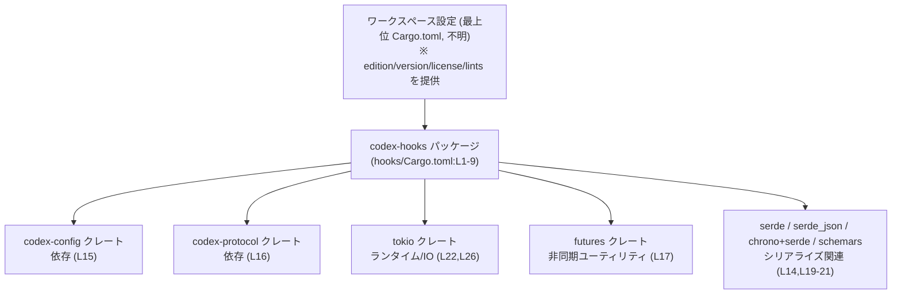
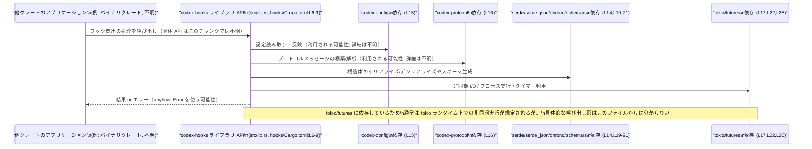

# hooks/Cargo.toml

## 0. ざっくり一言

`codex-hooks` というライブラリクレートの Cargo マニフェストであり、ワークスペース共通設定を継承しつつ、非同期処理（tokio/futures）・設定/プロトコル周り（codex-config/codex-protocol）・シリアライズ（serde/serde_json/chrono/schemars）などの依存関係を定義しています（`hooks/Cargo.toml:L1-5,L12-22`）。

---

## 1. このモジュールの役割

### 1.1 概要

- このファイルは Rust のパッケージマニフェスト（Cargo.toml）であり、`codex-hooks` クレートのビルド設定・ライブラリターゲット情報・リント設定・依存クレート・開発用依存クレートを宣言します（`hooks/Cargo.toml:L1-26`）。
- edition / license / version / lints はワークスペースの設定を継承しており、このクレート固有の値は明示されていません（`hooks/Cargo.toml:L2-3,L5,L11`）。
- ライブラリターゲット名 `codex_hooks` と実装ファイル `src/lib.rs` が指定されており（`hooks/Cargo.toml:L6-9`）、公開 API やコアロジックはそちらに実装されていると読み取れます。

### 1.2 アーキテクチャ内での位置づけ

このファイルから分かる範囲での依存関係を図示します。



- `codex-hooks` はワークスペースに属する 1 つのライブラリクレートとして位置づけられます（`hooks/Cargo.toml:L1-3`）。
- ランタイムや非同期基盤として `tokio` と `futures` に依存しているため、このクレート内部では非同期・並行処理が行われている可能性がありますが、具体的な API やフローはこのファイルからは分かりません（`hooks/Cargo.toml:L17,L22,L26`）。
- 設定・プロトコル・シリアライズ関連の依存が揃っているため、設定情報やプロトコルデータをシリアライズ/デシリアライズして扱うクレートであることが示唆されます（`hooks/Cargo.toml:L14-16,L19-21`）。

### 1.3 設計上のポイント（マニフェスト観点）

このファイルから読み取れる設計上の特徴は次のとおりです。

- **ワークスペース継承の積極利用**  
  - edition / license / version / lints をすべて `workspace = true` にしており、バージョンやポリシーをワークスペース全体で一元管理しています（`hooks/Cargo.toml:L2-3,L5,L11`）。
- **ライブラリ専用クレート**  
  - `[lib]` セクションのみが存在し、バイナリターゲットの定義はありません。`name = "codex_hooks"` および `path = "src/lib.rs"` が指定されているため、ライブラリとして再利用されることを前提とした構成です（`hooks/Cargo.toml:L6-9`）。
- **ドキュメントテストの無効化**  
  - `doctest = false` が設定されており、ドキュコメントに埋め込まれたコード例はテストとして実行されません（`hooks/Cargo.toml:L7`）。
- **エラー処理とシリアライズのための依存**  
  - `anyhow` に依存しており、高レベルなエラーラッパーである `anyhow::Error` を用いた API が採用されている可能性があります（`hooks/Cargo.toml:L13`）。
  - `serde`（derive 機能付き）、`serde_json`、`chrono`（serde 機能付き）、`schemars` への依存により、構造体のシリアライズ/デシリアライズや JSON Schema 生成が行われる前提で設計されていると考えられます（`hooks/Cargo.toml:L14,L19-21`）。
- **非同期・並行処理基盤の利用**  
  - `futures`（alloc 機能付き）と `tokio`（io-util/process/time 機能付き）を依存に持ち、開発用には `tokio` の `macros` と `rt-multi-thread` も有効になっています（`hooks/Cargo.toml:L17,L22,L26`）。  
    これにより、非同期 I/O やプロセス実行を行うコード、および tokio ランタイムを前提にしたテストが存在すると推測されます。
- **リントポリシーのワークスペース統一**  
  - `[lints] workspace = true` により、コンパイラや Clippy の警告レベルなどはワークスペース側のポリシーに委ねられています（`hooks/Cargo.toml:L10-11`）。

---

## 2. 主要な機能一覧（コンポーネントインベントリー）

このセクションでは、コードではなく「コンポーネント（クレート・ターゲット・依存）」の一覧を示します。

### 2.1 コンポーネント一覧（関数・構造体はこのファイルには存在しない）

| 名前 | 種別 | 説明 | 定義位置 |
|------|------|------|----------|
| `codex-hooks` | パッケージ名 | ワークスペース内でのパッケージ識別子。`name = "codex-hooks"` として定義。 | `hooks/Cargo.toml:L1-5` |
| `codex_hooks` | ライブラリターゲット名 | 実際に `use codex_hooks::...` として利用されるライブラリのクレート名。 | `hooks/Cargo.toml:L6-8` |
| `src/lib.rs` | ライブラリ実装ファイル | 公開 API とコアロジックが実装される Rust ソース。 | `hooks/Cargo.toml:L9` |
| edition (ワークスペース) | 設定 | Rust 言語仕様のバージョン（例: 2021）。具体値はワークスペース側で定義。 | `hooks/Cargo.toml:L2` |
| license (ワークスペース) | 設定 | ライセンス文字列。具体値はワークスペース側で定義。 | `hooks/Cargo.toml:L3` |
| version (ワークスペース) | 設定 | パッケージバージョン。具体値はワークスペース側で定義。 | `hooks/Cargo.toml:L5` |
| lints (ワークスペース) | 設定 | コンパイル/Clippy 等のリント設定をワークスペースから継承。 | `hooks/Cargo.toml:L10-11` |
| `anyhow` | 依存クレート | 高レベルエラー処理用のクレート。エラー型統一に使われることが多い。 | `hooks/Cargo.toml:L13` |
| `chrono` (features: `serde`) | 依存クレート | 日時型とその serde シリアライズを提供。 | `hooks/Cargo.toml:L14` |
| `codex-config` | 依存クレート | codex 系の設定管理用クレート（詳細はこのファイルからは不明）。 | `hooks/Cargo.toml:L15` |
| `codex-protocol` | 依存クレート | codex 系のプロトコル定義/処理用クレート（詳細はこのファイルからは不明）。 | `hooks/Cargo.toml:L16` |
| `futures` (features: `alloc`) | 依存クレート | 非同期処理ユーティリティ。ヒープ確保を伴う型を利用可能。 | `hooks/Cargo.toml:L17` |
| `regex` | 依存クレート | 正規表現マッチング。 | `hooks/Cargo.toml:L18` |
| `schemars` | 依存クレート | `serde` 対応型から JSON Schema を生成。 | `hooks/Cargo.toml:L19` |
| `serde` (features: `derive`) | 依存クレート | シリアライズ/デシリアライズ基盤と derive マクロ。 | `hooks/Cargo.toml:L20` |
| `serde_json` | 依存クレート | JSON のシリアライズ/デシリアライズ。 | `hooks/Cargo.toml:L21` |
| `tokio` (features: `io-util`, `process`, `time`) | 依存クレート | 非同期 I/O, プロセス実行, 時刻/タイマー機能を提供するランタイム。 | `hooks/Cargo.toml:L22` |
| `pretty_assertions` | 開発用依存 | テスト用に、差分が分かりやすいアサーションを提供。 | `hooks/Cargo.toml:L24` |
| `tempfile` | 開発用依存 | 一時ファイル/ディレクトリの作成。テストでの一時資源管理に利用。 | `hooks/Cargo.toml:L25` |
| `tokio` (features: `macros`, `rt-multi-thread`, `time`) | 開発用依存 | テスト時に tokio のマクロ（`#[tokio::test]` など）とマルチスレッドランタイムを利用するための設定。 | `hooks/Cargo.toml:L26` |

**補足**:  
このファイルには **関数・構造体・列挙体などのコード定義は一切登場しません**。それらは `src/lib.rs` などのソースファイル側にのみ存在し、このチャンクには現れません（`hooks/Cargo.toml:L1-26`）。

---

## 3. 公開 API と詳細解説

### 3.1 型一覧（構造体・列挙体など）

このファイルは Cargo の設定ファイルであり、Rust の型定義（構造体・列挙体・トレイトなど）は含まれていません。  
`codex-hooks` クレートの公開 API や型は、`[lib]` で指定された `src/lib.rs` 側に定義されており、このチャンクからは内容を特定できません（`hooks/Cargo.toml:L6-9`）。

### 3.2 関数詳細（最大 7 件）

関数定義が存在しないため、このセクションで詳述できる関数はありません。  
公開 API の関数一覧や詳細は `src/lib.rs` などのコードを参照する必要があります（`hooks/Cargo.toml:L9`）。

### 3.3 その他の関数

同様に、このファイルには補助関数やラッパー関数も一切含まれていません。

---

## 4. データフロー

このファイル自体は設定のみを含み、実行時の処理フローは記述されていません。  
ここでは **「codex-hooks クレートが他のクレートから利用される際に、どの依存クレートが関わりうるか」** を、依存関係に基づく概念図として示します。



**重要な注意**:

- 上記は **依存関係から推測した概念図** であり、実際の関数名・メソッド名・処理順序は **このチャンクには一切書かれていません**。  
  実際のデータフローを正確に知るには `src/lib.rs` などの実装を読む必要があります（`hooks/Cargo.toml:L9,L12-22`）。

---

## 5. 使い方（How to Use）

### 5.1 基本的な使用方法（クレートとしての利用）

このファイルは `codex-hooks` クレート自身のマニフェストです。  
他のクレートからこのライブラリを利用する場合の典型的な設定例を示します。

```toml
# 他クレート側の Cargo.toml から見た依存例（同一ワークスペース内想定）
[dependencies]
codex-hooks = { path = "hooks" }  # hooks ディレクトリにあるこのパッケージを参照
```

```rust
// 他クレート側からの利用例（API 名はこのチャンクからは分からないため、抽象的な例）
use codex_hooks; // hooks/Cargo.toml の [lib].name に対応 (L6-8)

#[tokio::main] // tokio ランタイム上で実行する前提の一例
async fn main() -> anyhow::Result<()> {
    // ここで codex_hooks クレートが提供する非同期 API を呼び出す想定
    // 具体的な関数名や引数は src/lib.rs を参照する必要がある。
    Ok(())
}
```

- `codex_hooks` というクレート名は `[lib] name = "codex_hooks"` から確定情報として読み取れます（`hooks/Cargo.toml:L6-8`）。
- `tokio::main` アトリビュートは、`codex-hooks` が tokio/futures に依存していることから一般的に想定できる利用形態の一例です（`hooks/Cargo.toml:L17,L22,L26`）。  
  ただし、実際に tokio ランタイム必須かどうかは実装側を確認する必要があります。

### 5.2 よくある使用パターン（想定されるもの）

このチャンクから直接 API は分からないため、**依存関係から一般的に想定されるパターン** を列挙します。

1. **非同期処理と組み合わせた利用**  
   - tokio/futures に依存しているため、`async fn` を持つ API やストリームベースの処理が定義されている可能性があります（`hooks/Cargo.toml:L17,L22,L26`）。
   - その場合、呼び出し側は tokio ランタイム（`#[tokio::main]` や `#[tokio::test]`）上で API を利用するのが自然です。

2. **設定とプロトコルの橋渡し**  
   - `codex-config` と `codex-protocol` に依存しているため、設定値を読み出してプロトコルメッセージを生成/変換するような処理が実装されている可能性があります（`hooks/Cargo.toml:L15-16`）。

3. **JSON ベースのシリアライズ/スキーマの利用**  
   - `serde` / `serde_json` / `chrono+serde` / `schemars` により、設定やフック定義を JSON で保存・交換したり、そのスキーマを生成する用途が考えられます（`hooks/Cargo.toml:L14,L19-21`）。

これらはいずれも **推測レベル** であり、実際の API/ロジックはコード側を確認する必要があります。

### 5.3 よくある間違い（このマニフェスト周り）

このファイルの内容から想定される注意点は次のとおりです。

- **`src/lib.rs` を削除/移動してしまう**  
  - `[lib] path = "src/lib.rs"` に固定されているため、ファイルが存在しない場合やパスを変更した場合にはビルドが失敗します（`hooks/Cargo.toml:L9`）。
- **ワークスペース側の設定との齟齬**  
  - edition / license / version / lints を `workspace = true` にしているため、ワークスペースの設定を変更した際にはこのクレートにも影響します（`hooks/Cargo.toml:L2-3,L5,L11`）。
  - 個別に異なる設定を持ちたい場合は、`workspace = true` を外して明示的に設定する必要があります。
- **tokio ランタイムを用意せずに非同期 API を利用する**  
  - もし `codex-hooks` の API が tokio ランタイムを前提にしている場合（依存関係から一般的に想定されます）、呼び出し側でランタイムを用意しないと実行時にデッドロックやパニックを引き起こす可能性があります。  
    この前提が実際にあるかどうかはソースコードを確認する必要があります（`hooks/Cargo.toml:L17,L22,L26`）。

### 5.4 使用上の注意点（まとめ）

- **設定ファイルとしての前提条件**
  - `src/lib.rs` が存在すること（`hooks/Cargo.toml:L9`）。
  - ワークスペースの Cargo.toml に、このパッケージが含まれていること（`hooks/Cargo.toml:L2-3,L5,L11` からワークスペース前提であると分かります）。
- **エラー処理**
  - `anyhow` 依存から、エラー型が `anyhow::Error` に統一されている可能性がありますが、これはコードを確認するまで断定できません（`hooks/Cargo.toml:L13`）。
- **並行性・非同期性**
  - tokio/futures に依存しているため、非同期/並行処理が行われる可能性があります。呼び出し側では適切なランタイムコンテキストを用意する必要があるかもしれません（`hooks/Cargo.toml:L17,L22,L26`）。
- **ドキュメントテストが無効**
  - `doctest = false` により、ドキュメントコメントに埋め込んだ例は自動テストされません。  
    サンプルコードと実装の乖離に気付きにくくなる点に注意が必要です（`hooks/Cargo.toml:L7`）。

---

## 6. 変更の仕方（How to Modify）

### 6.1 新しい機能を追加する場合（マニフェスト側）

新しい機能を実装するにあたり、マニフェストを変更する典型的なパターンを整理します。

1. **新しい外部クレートに依存したい場合**
   - `[dependencies]` セクションに新しい依存を追加します（`hooks/Cargo.toml:L12-22`）。
   - ワークスペースでバージョンを統一している場合は、ワークスペース側 Cargo.toml にも依存定義を追加し、`workspace = true` を利用する形に揃えると一貫性が保たれます（このチャンクにはワークスペースの定義は現れません）。

2. **非同期機能の拡張**
   - tokio の追加機能（例: `fs`, `net`）が必要なら、`[dependencies] tokio` の `features` に追記します（`hooks/Cargo.toml:L22`）。
   - ただし、ワークスペースで tokio の機能セットを統一している場合、そのポリシーに従う必要があります（この点はワークスペース側定義が不明なため、ここからは断定できません）。

3. **JSON/スキーマ機能の拡張**
   - `schemars` や `serde` の追加機能が必要な場合は、それぞれの `features` フィールドを拡張します（`hooks/Cargo.toml:L19-20`）。

### 6.2 既存の機能を変更する場合（マニフェスト側）

既存設定の変更時に注意すべき点を列挙します。

- **ライブラリ名・パスの変更**
  - `[lib] name` や `path` を変更すると、  
    - 他クレートからの `use` / `Cargo.toml` の依存名  
    - 実際のファイル構成  
    に影響します（`hooks/Cargo.toml:L6-9`）。  
    変更時は、呼び出し側やビルドスクリプトなど関連箇所の修正が必要です。
- **依存クレートの版本上げ/削除**
  - `anyhow` / `tokio` / `serde` などのメジャーバージョンを変更すると、API 互換性が失われることがあります。  
    このファイルからはバージョン指定が `workspace = true` によって隠されているため、実際のバージョンはワークスペース側を確認する必要があります（`hooks/Cargo.toml:L13-14,L17,L19-22`）。
- **ワークスペース継承の解除**
  - `edition.workspace = true` などを個別値に変更すると、このクレートだけ設定がずれるため、  
    - ビルドフラグの違い  
    - lint ポリシーの違い  
    が生じます（`hooks/Cargo.toml:L2-3,L5,L11`）。  
    意図しない差異を生まないよう、ワークスペース方針と整合性をとる必要があります。

---

## 7. 関連ファイル

このマニフェストと密接に関係するファイル/設定をまとめます。

| パス / 設定 | 役割 / 関係 |
|------------|-------------|
| `hooks/src/lib.rs` | `[lib] path = "src/lib.rs"` で指定された、`codex-hooks` クレートの実装ファイル。公開 API とコアロジックがここに定義されます（`hooks/Cargo.toml:L6-9`）。 |
| （ワークスペースルートの `Cargo.toml`） | `edition.workspace = true` などから存在が示唆される、ワークスペース全体の設定ファイル。edition / license / version / lints および依存クレートのバージョンなどが定義されていると考えられます（`hooks/Cargo.toml:L2-3,L5,L11,L13-22`）。ファイルパスや内容はこのチャンクには現れません。 |
| `hooks/Cargo.lock`（存在すれば） | 実際に解決された依存バージョンを固定するロックファイル。依存クレートのバージョンを確認する際に利用されます。このチャンクには有無が記載されていません。 |
| `hooks/tests/*.rs`（存在すれば） | `pretty_assertions`, `tempfile`, dev 用 `tokio` を利用するテストコードが置かれていると考えられる場所ですが、実際の配置はこのチャンクからは分かりません（`hooks/Cargo.toml:L23-26`）。 |

---

### 安全性 / エラー / 並行性のまとめ（このファイルから読み取れる範囲）

- **安全性（Rust 言語特有のメモリ安全など）**
  - Rust 自身の安全性モデルに関する情報は、このファイルだけからは特別な設定は読み取れません。通常の Rust クレートとしてビルドされる前提です（`hooks/Cargo.toml:L1-5`）。
- **エラー処理**
  - `anyhow` が依存に含まれているため、エラーは `anyhow::Result<T>` / `anyhow::Error` ベースの高レベルエラー伝播が採用されている可能性が高いですが、具体的な API 契約はソースコードを確認する必要があります（`hooks/Cargo.toml:L13`）。
- **並行性**
  - `tokio`（`io-util`, `process`, `time`）と `futures` への依存から、非同期 I/O・プロセス実行・タイマー機能を用いた並行処理が行われていると考えられます（`hooks/Cargo.toml:L17,L22,L26`）。
  - 開発用には `rt-multi-thread` 機能が有効化されており、マルチスレッドランタイムでの動作・テストが想定されています（`hooks/Cargo.toml:L26`）。
  - ただし、どの関数がどのようなスレッド/タスクモデルを前提としているかは、このファイルからは分かりません。
