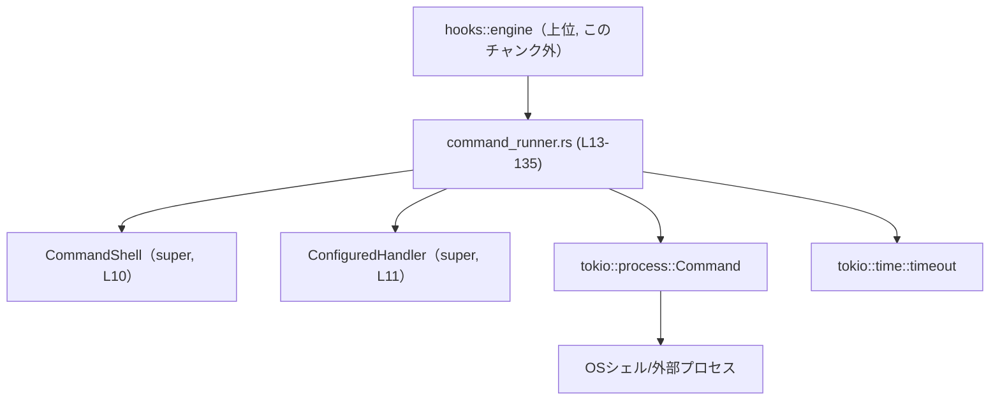
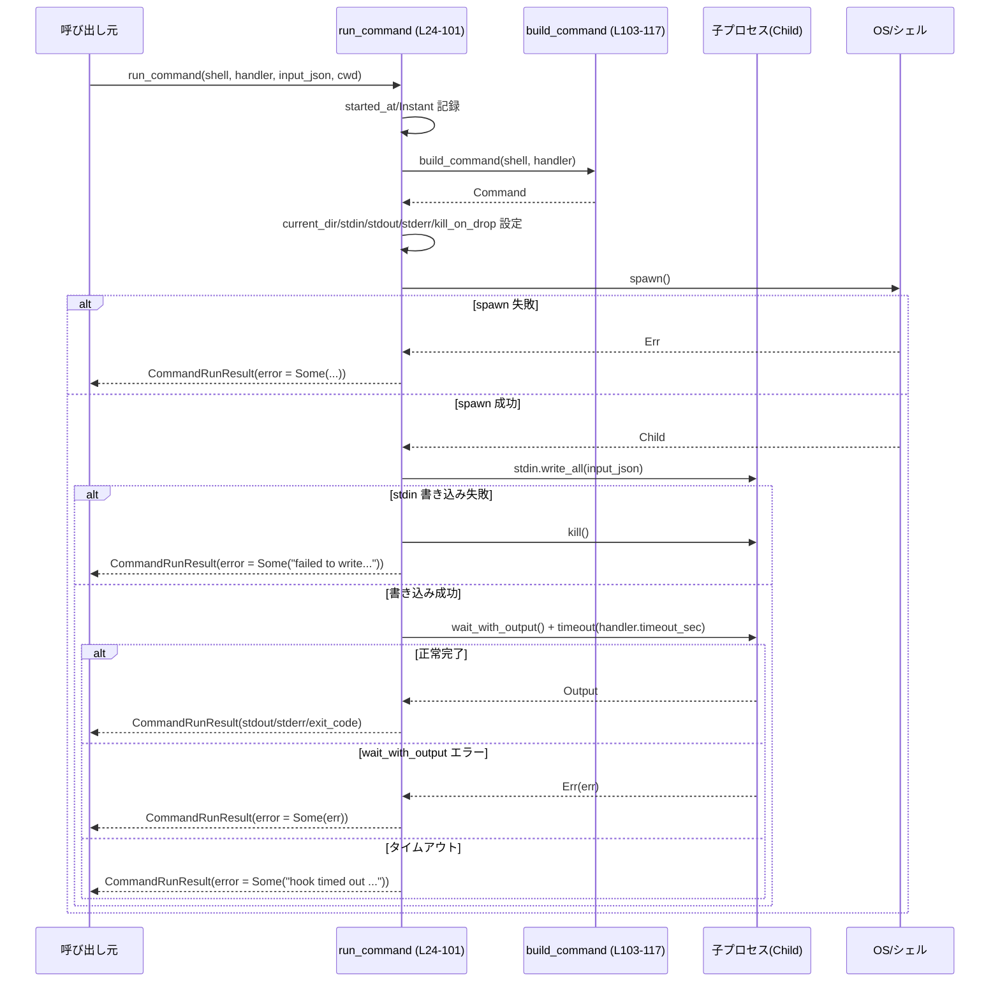
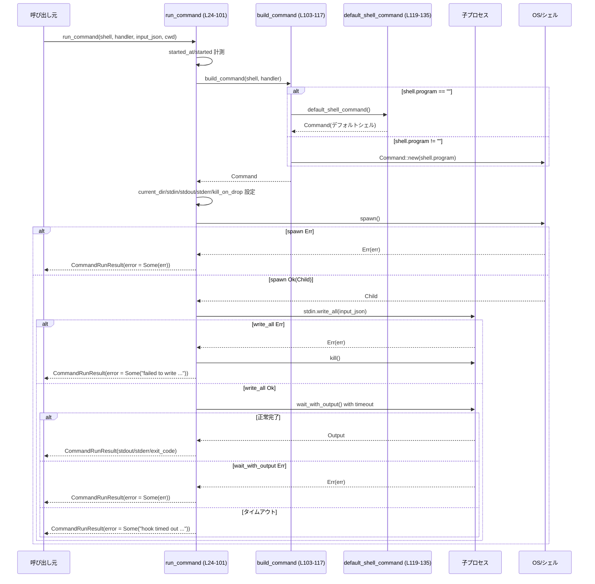

# hooks/src/engine/command_runner.rs

## 0. ざっくり一言

外部コマンド（フック）を非同期に実行し、標準入出力や終了コード、エラー内容、実行時間をまとめて返すユーティリティです（command_runner.rs:L13-22, L24-101）。

---

## 1. このモジュールの役割

### 1.1 概要

このモジュールは、**設定されたシェルとコマンド**を使って外部プロセスを起動し、その実行結果を `CommandRunResult` にまとめて返します（command_runner.rs:L13-22, L24-101）。

- `CommandShell` と `ConfiguredHandler`（どちらも上位モジュールで定義）から、実行するシェル・コマンド・タイムアウト秒などを受け取ります（command_runner.rs:L24-28, L71）。
- Tokio の非同期プロセス API を利用して、標準入力への書き込み・タイムアウト付きの待機を行います（command_runner.rs:L33-40, L56-59, L71-72）。
- 成功/失敗/タイムアウトなど、あらゆる結果を `CommandRunResult` に正規化します（command_runner.rs:L41-52, L60-68, L73-99）。

### 1.2 アーキテクチャ内での位置づけ

このファイルは `hooks::engine` 配下の一部で、上位の「フック実行エンジン」から呼び出され、OS 上のシェル経由でコマンドを実行します。



- `Engine` が `run_command` を呼び出します（呼び出し元はこのチャンクには現れません）。
- `run_command` は `build_command` / `default_shell_command` で `tokio::process::Command` を構築します（command_runner.rs:L33, L103-117, L119-135）。
- 実際のプロセス起動は OS のシェル／コマンドに委ねられます（command_runner.rs:L41, L119-134）。

### 1.3 設計上のポイント

コードから読み取れる特徴は次のとおりです。

- **責務の分割**
  - 外部プロセスの起動と結果収集は `run_command` に集約（command_runner.rs:L24-101）。
  - シェルコマンドの構築は `build_command` / `default_shell_command` に分離（command_runner.rs:L103-117, L119-135）。
- **状態管理**
  - すべて関数ローカルな変数のみを使用し、構造体に状態を保持しません。関数は再入可能で、同時に複数回呼んでも共有可変状態はありません。
- **エラーハンドリング**
  - プロセス起動失敗、標準入力への書き込み失敗、完了待ちの失敗、タイムアウトの 4 パターンを `CommandRunResult.error` に文字列として格納します（command_runner.rs:L41-52, L56-68, L82-90, L91-99）。
  - 時刻と経過時間は常に記録され、エラーがあっても `CommandRunResult` は必ず返されます（command_runner.rs:L30-31, L45-47, L61-63, L75-77, L84-86, L93-95）。
- **並行性**
  - すべて Tokio の非同期 I/O で記述されており、`run_command` は `async fn` です（command_runner.rs:L24）。
  - 外部プロセスを表す `child` は関数内に閉じており、共有されません（command_runner.rs:L41-54, L56-70, L71-100）。
  - `kill_on_drop(true)` により、`Child` がドロップされる際にプロセスを kill するよう設定しています（command_runner.rs:L39）。

---

## 2. 主要な機能一覧（コンポーネントインベントリー）

このチャンクに現れる構造体・関数の一覧です（行番号付き）。

### 2.1 型・構造体

| 名前 | 種別 | 行範囲 | 役割 / 用途 |
|------|------|--------|-------------|
| `CommandRunResult` | 構造体 | command_runner.rs:L13-22 | 外部コマンド実行のメタ情報・標準出力・標準エラー・終了コード・エラー内容をまとめた結果オブジェクト |

※ `CommandShell` と `ConfiguredHandler` は `super` モジュールからインポートされる型で、このチャンクには定義がありません（command_runner.rs:L10-11）。フィールドとして `program`, `args`, `command`, `timeout_sec` が存在することのみコードから分かります（command_runner.rs:L103-115, L71）。

### 2.2 関数

| 関数名 | 行範囲 | 可視性 | 役割（1 行） |
|--------|--------|--------|--------------|
| `run_command` | command_runner.rs:L24-101 | `pub(crate)` | シェル・ハンドラ設定に基づいて外部コマンドを非同期で実行し、`CommandRunResult` を生成する |
| `build_command` | command_runner.rs:L103-117 | private | `CommandShell` と `ConfiguredHandler` から `tokio::process::Command` を構築する |
| `default_shell_command` | command_runner.rs:L119-135 | private | プラットフォームに応じてデフォルトのシェルコマンド（Windows: `cmd.exe /C`, 非 Windows: `$SHELL -lc`）を構築する |

---

## 3. 公開 API と詳細解説

### 3.1 型一覧（構造体・列挙体など）

#### `CommandRunResult`（command_runner.rs:L13-22）

| フィールド名   | 型            | 説明 |
|----------------|---------------|------|
| `started_at`   | `i64`         | 実行開始時刻（UTC Unix タイムスタンプ秒）（command_runner.rs:L15, L30） |
| `completed_at` | `i64`         | 実行完了時刻（UTC Unix タイムスタンプ秒）（command_runner.rs:L16, L46, L62, L75, L84, L93） |
| `duration_ms`  | `i64`         | 実行時間（ミリ秒）。`Instant::now()` から `elapsed().as_millis()` を `i64` に変換し、オーバーフロー時は `i64::MAX` を格納（command_runner.rs:L17, L31, L47, L63, L77, L86, L95） |
| `exit_code`    | `Option<i32>` | プロセスの終了コード。正常終了時は `Some(code)`、起動失敗・タイムアウトなどでコードが得られない場合は `None`（command_runner.rs:L18, L48, L64, L78, L86, L95） |
| `stdout`       | `String`      | 標準出力。成功時は UTF-8 として変換（非 UTF-8 はロスレス変換で置換）、エラー時は空文字列（command_runner.rs:L19, L49, L65, L78） |
| `stderr`       | `String`      | 標準エラー出力。`stdout` と同様の変換/格納（command_runner.rs:L20, L50, L66, L79, L88, L97） |
| `error`        | `Option<String>` | 実行に関するエラーメッセージ。成功時は `None`、各種失敗時に `Some(...)`（command_runner.rs:L21, L51, L67, L80, L89, L98） |

この構造体は、API 利用者が「コマンドがどう振る舞ったか」を一目で把握できるよう、結果情報を 1 箇所にまとめています。

### 3.2 関数詳細

#### `run_command(shell: &CommandShell, handler: &ConfiguredHandler, input_json: &str, cwd: &Path) -> CommandRunResult`（command_runner.rs:L24-101）

**概要**

- 指定されたシェル・コマンド・カレントディレクトリで外部プロセスを起動し、`input_json` を標準入力に書き込んだ上で、その終了をタイムアウト付きで待機し、結果を `CommandRunResult` として返す非同期関数です。

**引数**

| 引数名       | 型                     | 説明 |
|-------------|------------------------|------|
| `shell`     | `&CommandShell`        | 使用するシェルプログラムや追加引数を表す設定。`program` と `args` が利用されます（command_runner.rs:L24, L103-115）。 |
| `handler`   | `&ConfiguredHandler`   | 実行するコマンド文字列やタイムアウト秒を含む設定。`command` と `timeout_sec` が利用されます（command_runner.rs:L25, L71, L110, L114）。 |
| `input_json`| `&str`                 | 外部プロセス標準入力に書き込む JSON 文字列（command_runner.rs:L27, L56-58）。 |
| `cwd`       | `&Path`                | 子プロセスのカレントディレクトリとして設定されるパス（command_runner.rs:L28, L35）。 |

**戻り値**

- `CommandRunResult`  
  - 実行開始・終了時刻、経過時間、終了コード、標準出力/標準エラーの内容、そしてエラーが発生した場合のメッセージを含みます（command_runner.rs:L41-52, L60-68, L73-99）。

**内部処理の流れ（アルゴリズム）**

1. **タイムスタンプとタイマーの開始**  
   - 現在時刻（UTC）を `started_at` として取得し（command_runner.rs:L30）、`Instant::now()` による高精度タイマーを開始します（command_runner.rs:L31）。
2. **`Command` の構築と基本設定**  
   - `build_command(shell, handler)` で OS コマンドのベースを構築し（command_runner.rs:L33）、カレントディレクトリ・標準入出力を `Stdio::piped()` に設定し、`kill_on_drop(true)` を有効にします（command_runner.rs:L35-39）。
3. **子プロセスの起動**  
   - `command.spawn()` で子プロセスを起動し、失敗した場合はエラー内容を格納した `CommandRunResult` を即座に返します（command_runner.rs:L41-52）。
4. **標準入力への書き込み**  
   - `child.stdin.take()` で標準入力ハンドルを取得し、`input_json` を非同期で書き込みます（command_runner.rs:L56-58）。
   - 書き込みに失敗した場合は、子プロセスを kill したうえでエラー入りの `CommandRunResult` を返します（command_runner.rs:L59-68）。
5. **タイムアウト付きの完了待ち**  
   - `Duration::from_secs(handler.timeout_sec)` でタイムアウト時間を作成し（command_runner.rs:L71）、`tokio::time::timeout` で `child.wait_with_output()` を包んで await します（command_runner.rs:L71-72）。
6. **結果の分岐処理**  
   - `Ok(Ok(output))`: 正常に完了した場合、`output.status.code()`・`output.stdout`・`output.stderr` から `CommandRunResult` を構築（command_runner.rs:L73-81）。
   - `Ok(Err(err))`: 完了待ち中にエラーが発生した場合（例: OS エラー）、エラー文字列のみを格納した結果を返します（command_runner.rs:L82-90）。
   - `Err(_)`: タイムアウトした場合、`"hook timed out after {}s"` というメッセージを `error` に格納した結果を返します（command_runner.rs:L91-99）。

**処理フロー図（run_command 全体）**

この図は `run_command` の主な処理の流れを表します（command_runner.rs:L24-101）。



**Examples（使用例）**

`run_command` を呼び出す典型例です。`CommandShell` と `ConfiguredHandler` の定義はこのチャンクにはありませんが、フィールド名から推測される最小限の使用例を示します。

```rust
use std::path::Path;
use hooks::engine::command_runner::{run_command, CommandRunResult}; // モジュールパスは仮の例
use hooks::engine::{CommandShell, ConfiguredHandler};              // 実際のパスはコードベースに依存

#[tokio::main] // Tokio ランタイムを起動
async fn main() -> anyhow::Result<()> {
    // シェルの設定例（Unix 想定）
    let shell = CommandShell {
        program: String::new(),      // 空文字列だと default_shell_command() が使われる（command_runner.rs:L103-110）
        args: vec![],                // 追加引数はここに入る（command_runner.rs:L113）
        // 他にフィールドがあれば実際の定義に従う
    };

    // 実行するフックコマンドとタイムアウト
    let handler = ConfiguredHandler {
        command: "echo hello".into(), // 実行したいシェルコマンド（command_runner.rs:L110, L114）
        timeout_sec: 10,              // 10秒のタイムアウト（command_runner.rs:L71）
        // 他のフィールドがあれば適宜初期化
    };

    let cwd = Path::new(".");         // カレントディレクトリ
    let input_json = r#"{"event": "test"}"#; // 子プロセス標準入力に渡す JSON

    let result: CommandRunResult = run_command(&shell, &handler, input_json, cwd).await;

    println!("exit_code: {:?}", result.exit_code);
    println!("stdout: {}", result.stdout);
    println!("stderr: {}", result.stderr);
    println!("error: {:?}", result.error);

    Ok(())
}
```

**Errors / Panics**

- **`CommandRunResult.error` に格納されるパターン**
  - プロセス起動失敗（`command.spawn()` が `Err` を返した場合）  
    → `error: Some(err.to_string())`（command_runner.rs:L41-52）。
  - 標準入力への書き込み失敗（パイプの破損など）  
    → 子プロセスに対して `kill()` を試行した後、`"failed to write hook stdin: {err}"` を格納（command_runner.rs:L56-68）。
  - `wait_with_output()` が OS レベルのエラーになる場合  
    → `error: Some(err.to_string())`（command_runner.rs:L82-90）。
  - タイムアウト  
    → `error: Some(format!("hook timed out after {}s", handler.timeout_sec))`（command_runner.rs:L91-99）。
- **panic の可能性**
  - `started.elapsed().as_millis().try_into().unwrap_or(i64::MAX)` は `unwrap_or` を使っており、オーバーフロー時も panic ではなく `i64::MAX` を設定します（command_runner.rs:L47, L63, L77, L86, L95）。
  - 確認できる範囲で `unwrap`・`expect` は使用されておらず、この関数内に panic 要因は見当たりません。

**Edge cases（エッジケース）**

- **`handler.timeout_sec` が 0 の場合**  
  - `Duration::from_secs(0)` となり、`timeout` はほぼ即座にタイムアウトとして扱います（command_runner.rs:L71-72）。
- **`input_json` が空文字列の場合**  
  - 書き込みは即時に成功し、プロセスには空の標準入力が渡されます（command_runner.rs:L56-58）。特別な処理はありません。
- **プロセスが大量の出力を行う場合**  
  - `wait_with_output()` は `stdout`/`stderr` を全てメモリにバッファしてから返すため、大きな出力でメモリ使用量が増加する可能性があります（command_runner.rs:L72-80）。
- **標準出力/標準エラーが非 UTF-8 の場合**
  - `String::from_utf8_lossy` により、不正なバイト列は置換文字に差し替えられつつ `String` に変換されます（command_runner.rs:L78-79）。
- **シェルまたはコマンドが存在しない場合**
  - OS からファイルが見つからない等のエラーとなり、`spawn()` または `wait_with_output()` のいずれかが `Err` となって `error` にメッセージが格納されると考えられます（command_runner.rs:L41-52, L82-90）。

**使用上の注意点**

- この関数は **Tokio ランタイム上からのみ** 呼び出す必要があります。`async fn` で `tokio::process::Command` や `tokio::time::timeout` を使用しているためです（command_runner.rs:L24, L7-8）。
- `cwd` は存在するディレクトリであることが前提です。存在しないパスの場合、`spawn()` が失敗する可能性があります（command_runner.rs:L35, L41-52）。
- `handler.command` はシェルに渡される文字列であり、**シェルによる解釈（展開やリダイレクトなど）が行われる**ことに注意が必要です（command_runner.rs:L110, L114, L119-134）。
- 多数の `run_command` を並列実行すると、プロセス数や I/O によるシステム負荷が高くなります。制御はこの関数外側で行う必要があります（このチャンクには制限ロジックはありません）。
- タイムアウト時のプロセス終了は `kill_on_drop(true)` に依存しており、`Child` がドロップされたタイミングで kill が試行されます（command_runner.rs:L39）。呼び出し側で `run_command` の Future をキャンセルしたり、戻り値を即座に破棄した場合の挙動も考慮が必要です。

---

#### `build_command(shell: &CommandShell, handler: &ConfiguredHandler) -> Command`（command_runner.rs:L103-117）

**概要**

- `CommandShell` と `ConfiguredHandler` の情報をもとに、実行すべきシェルコマンド（`tokio::process::Command`）を構築します。

**引数**

| 引数名   | 型                   | 説明 |
|----------|----------------------|------|
| `shell`  | `&CommandShell`      | シェルプログラム名と追加引数を保持する設定。`program` が空かどうかで使用するシェルを切り替えます（command_runner.rs:L103-110, L112-115）。 |
| `handler`| `&ConfiguredHandler` | 実行するコマンド文字列を保持する設定。`handler.command` がシェルへの引数として渡されます（command_runner.rs:L110, L114）。 |

**戻り値**

- `tokio::process::Command`  
  - 実行するシェル＋コマンド文字列が設定された `Command`。標準入出力やカレントディレクトリの設定は `run_command` 側で行います（command_runner.rs:L35-38）。

**内部処理の流れ**

1. `shell.program.is_empty()` をチェック（command_runner.rs:L104）。
2. 空文字列なら `default_shell_command()` を呼んでデフォルトシェルを取得（command_runner.rs:L104-106）。
3. 空でない場合は `Command::new(&shell.program)` で指定シェルを起動する `Command` を生成（command_runner.rs:L107-108）。
4. 再度 `shell.program.is_empty()` を確認し（command_runner.rs:L109）、分岐：
   - 空文字列の場合: `command.arg(&handler.command)` を追加して返す（command_runner.rs:L110-111）。
   - 空でない場合: `command.args(&shell.args)` でシェルに付与する追加引数を設定し、さらに `handler.command` を追加して返す（command_runner.rs:L113-116）。

**Examples（使用例）**

```rust
use tokio::process::Command;
use hooks::engine::{CommandShell, ConfiguredHandler}; // 実際のパスはコードベースに依存

fn make_command() -> Command {
    let shell = CommandShell {
        program: "/bin/bash".into(),       // 独自にシェルを指定
        args: vec!["-c".into()],           // シェル用の引数
    };

    let handler = ConfiguredHandler {
        command: "echo hello".into(),      // シェルに渡すコマンド文字列
        timeout_sec: 5,
    };

    // 実際には async コンテキストで run_command から呼ばれますが、
    // build_command 自体は同期関数です。
    let command = build_command(&shell, &handler); // command_runner.rs:L103-117
    command
}
```

**Errors / Panics**

- この関数内では OS との対話は行っておらず、`Command::new` の構築のみで、`spawn()` は呼んでいません（command_runner.rs:L103-108）。
- `unwrap` / `expect` は使用されておらず、ここで panic が発生する可能性は確認できません。

**Edge cases**

- `shell.program` が空文字列の場合は常に `default_shell_command()` が選択されます（command_runner.rs:L104-106, L109-111）。
- `shell.args` が空配列の場合でも問題なく動作し、そのまま `handler.command` のみが追加されます（command_runner.rs:L113-116）。
- `handler.command` が空文字列の場合、空コマンドがシェルに渡されることになりますが、ここで特別な扱いはありません（command_runner.rs:L110, L114）。

**使用上の注意点**

- `handler.command` は **シェル経由で実行される** ため、シェルインジェクション等のリスクは、この文字列の出所やサニタイズに依存します。
- `CommandShell` の `program` と `args` の組み合わせは、実際に OS 上で期待する挙動になるか検証する必要があります（この関数は単に連結するだけです）。

---

#### `default_shell_command() -> Command`（command_runner.rs:L119-135）

**概要**

- 実行環境（Windows / 非 Windows）に応じて、デフォルトのシェルコマンドを構築します。

**引数**

- なし。

**戻り値**

- `tokio::process::Command`  
  - Windows 環境: `COMSPEC` 環境変数または `"cmd.exe"` をプログラムとし、`/C` を引数に追加した `Command`（command_runner.rs:L120-126）。  
  - 非 Windows 環境: `SHELL` 環境変数または `"/bin/sh"` をプログラムとし、`-lc` を引数に追加した `Command`（command_runner.rs:L128-134）。

**内部処理の流れ**

- **Windows (`#[cfg(windows)]`)**（command_runner.rs:L120-126）
  1. `std::env::var("COMSPEC")` を読み取り、失敗した場合は `"cmd.exe"` をデフォルト値として利用。
  2. `Command::new(comspec)` でシェルコマンドを構築。
  3. `.arg("/C")` を付与し、戻り値とする。
- **非 Windows (`#[cfg(not(windows))]`)**（command_runner.rs:L128-134）
  1. `std::env::var("SHELL")` を読み取り、失敗した場合は `"/bin/sh"` をデフォルト値として利用。
  2. `Command::new(shell)` でシェルコマンドを構築。
  3. `.arg("-lc")` を付与し、戻り値とする。

**Examples（使用例）**

```rust
use tokio::process::Command;

// プラットフォームに応じたデフォルトシェルを取得する例
fn make_default_shell() -> Command {
    let cmd = default_shell_command(); // command_runner.rs:L119-135
    cmd
}
```

**Errors / Panics**

- 環境変数の取得には `unwrap_or_else` を用いており、取得失敗時もデフォルト値が使われるため panic にはなりません（command_runner.rs:L122, L130）。
- この関数も `spawn()` を呼んでいないため、その場で OS からエラーが返ることはありません。

**Edge cases**

- `COMSPEC` または `SHELL` が存在しても、その指す値が実行可能ファイルでない場合は、実際の `spawn()` 時にエラーとなります（`spawn()` はこのチャンクでは `run_command` 内で呼ばれます：command_runner.rs:L41）。
- 非 Windows 環境で `SHELL` が空文字列で設定されている場合でも、ここではその値を利用します（command_runner.rs:L130）。その場合の挙動は OS に依存します。

**使用上の注意点**

- どのシェルが実行されるかは環境変数に依存するため、本番環境などでは `CommandShell.program` を明示的に設定することで挙動を固定することも考えられます。

---

### 3.3 その他の関数

このファイルには上記 3 関数のみが定義されており、補助的な小さなラッパー関数は存在しません（command_runner.rs:L24-101, L103-117, L119-135）。

---

## 4. データフロー

代表的なシナリオとして、「フック実行要求が渡され、外部プロセスの結果が `CommandRunResult` にまとめられるまで」のデータの流れを示します。

### 4.1 処理の要点

- 呼び出し元は、シェル設定 (`CommandShell`) とハンドラ設定 (`ConfiguredHandler`)、入力 JSON、作業ディレクトリを `run_command` に渡します（command_runner.rs:L24-28）。
- `run_command` は `build_command` / `default_shell_command` を通じて `Command` を構築し（command_runner.rs:L33, L103-117, L119-135）、子プロセスを起動します（command_runner.rs:L41）。
- `input_json` は子プロセスの標準入力に書き込まれ（command_runner.rs:L56-58）、標準出力・標準エラーは `wait_with_output()` でまとめて収集されます（command_runner.rs:L72-80）。
- 結果のステータスや時刻情報は `CommandRunResult` にまとめられ、呼び出し元に返されます（command_runner.rs:L73-99）。

### 4.2 シーケンス図



---

## 5. 使い方（How to Use）

### 5.1 基本的な使用方法

このモジュールを利用する典型的な流れは次のとおりです。

1. `CommandShell` と `ConfiguredHandler` を用意する（どのシェルで、どのコマンドを、どのくらいのタイムアウトで実行するかの設定）。
2. `cwd`（作業ディレクトリ）と `input_json` を準備する。
3. Tokio ランタイム上で `run_command` を `await` し、返ってきた `CommandRunResult` を確認する。

```rust
use std::path::Path;
use hooks::engine::command_runner::{run_command, CommandRunResult};
use hooks::engine::{CommandShell, ConfiguredHandler};

async fn run_hook_example() -> Result<(), Box<dyn std::error::Error>> {
    let shell = CommandShell {
        program: String::new(),  // 空なら default_shell_command() 使用
        args: vec![],
    };

    let handler = ConfiguredHandler {
        command: "my-hook-script --flag".into(),
        timeout_sec: 30,         // 30 秒でタイムアウト
    };

    let cwd = Path::new("/path/to/repo");
    let input_json = r#"{"event": "pre-commit"}"#;

    let result: CommandRunResult = run_command(&shell, &handler, input_json, cwd).await;

    if let Some(err) = &result.error {
        eprintln!("hook failed: {err}");
    } else {
        println!("exit: {:?}, stdout: {}", result.exit_code, result.stdout);
    }

    Ok(())
}
```

### 5.2 よくある使用パターン

1. **デフォルトシェルに任せるパターン**  
   - `shell.program` を空文字列にし、`handler.command` にシェルスクリプトやワンライナーを指定（command_runner.rs:L104-106, L110-111）。
2. **特定のシェル／インタプリタを明示するパターン**
   - 例えば `program = "/usr/bin/python"`、`args = ["-u", "script.py"]` とし、`handler.command` を引数として渡す等（command_runner.rs:L107-108, L113-116）。  
   ※ 実際の構成はコードベースに依存し、このチャンクだけでは確定できません。

### 5.3 よくある間違い

```rust
// 間違い例: 同期関数から直接 run_command を呼ぶ（Tokio ランタイムがない）
fn wrong() {
    // コンパイルエラーまたは実行時にランタイムがない
    // let result = run_command(&shell, &handler, "{}", Path::new(".")).await;
}

// 正しい例: Tokio ランタイム上で async コンテキストから呼び出す
#[tokio::main]
async fn correct() {
    // shell, handler, cwd, input_json を構築した上で:
    let result = run_command(&shell, &handler, "{}", Path::new(".")).await;
}
```

```rust
// 間違い例: cwd に存在しないパスを指定する
let cwd = Path::new("/path/does/not/exist");
// run_command(&shell, &handler, "{}", cwd).await; // spawn 時にエラー（error に格納される可能性）

// 正しい例: 実在するディレクトリを指定する
let cwd = Path::new("/tmp"); // 実在することがわかっているパス
let result = run_command(&shell, &handler, "{}", cwd).await;
```

### 5.4 使用上の注意点（まとめ）

- **非同期コンテキスト必須**  
  - `run_command` は Tokio の非同期機能を用いているため、Tokio ランタイム内から `await` する必要があります（command_runner.rs:L24, L6-8）。
- **シェル経由実行**  
  - `handler.command` はシェルに渡され、シェルによる展開・リダイレクトが行われます（command_runner.rs:L110, L114, L119-134）。コマンド文字列の出所やエスケープに注意が必要です。
- **タイムアウトの意味**  
  - `handler.timeout_sec` で指定するタイムアウトは、`wait_with_output()` に対する制限であり、タイムアウトした場合は `CommandRunResult.error` にメッセージが入り、`exit_code` は `None` になります（command_runner.rs:L71-72, L91-99）。
- **メモリ使用量**  
  - `wait_with_output()` は標準出力と標準エラーをすべてメモリに保持してから返します。出力が非常に多いプロセスを実行すると、メモリ消費が大きくなる可能性があります（command_runner.rs:L72-80）。

---

## 6. 変更の仕方（How to Modify）

### 6.1 新しい機能を追加する場合

- **追加の結果情報を持たせたい場合**
  - 例: プロセスの PID を結果として返したいなど。
    1. `CommandRunResult` に新しいフィールドを追加する（command_runner.rs:L13-22）。
    2. `run_command` で `child.id()` 等からその情報を取得し、`CommandRunResult` の全ての構築箇所に値を埋める（command_runner.rs:L44-52, L60-68, L73-81, L82-90, L91-99）。
- **標準入力以外の入出力制御を追加したい場合**
  - 例: 標準エラーをログにストリーミングしたい場合。
    - `run_command` 内の `stdin`/`stdout`/`stderr` 設定と、`wait_with_output()` 部分（command_runner.rs:L35-38, L71-80）を拡張することが自然です。

### 6.2 既存の機能を変更する場合

- **タイムアウト動作を変更する**
  - 影響範囲: `handler.timeout_sec` の利用箇所と `timeout(...)` の呼び出し（command_runner.rs:L71-72, L91-99）。
  - 戻り値として `exit_code` や部分的な `stdout` を残すかどうかは、`CommandRunResult` の意味に関わるため、利用側の契約も確認する必要があります。
- **シェル選択ロジックを変更する**
  - 影響範囲: `build_command` と `default_shell_command`（command_runner.rs:L103-117, L119-135）。
  - `shell.program` の空文字列の扱いを変更する場合、`CommandShell` を生成している全ての箇所に影響が出る可能性があります（このチャンクには生成コードは現れません）。
- 変更時は、`CommandRunResult` を利用している呼び出し元（テストや他モジュール）で、`error` や `exit_code` の扱いが変わらないかを確認する必要があります。

---

## 7. 関連ファイル

このチャンクから参照されているが、定義が現れない型・機能は次のとおりです。

| パス / シンボル | 役割 / 関係 |
|----------------|------------|
| `super::CommandShell` | シェルプログラム名 (`program`) と追加引数 (`args`) を保持する設定。`build_command` で参照されています（command_runner.rs:L10, L103-115）。 |
| `super::ConfiguredHandler` | 実行するコマンド文字列 (`command`) とタイムアウト秒 (`timeout_sec`) を保持する設定。`run_command` および `build_command` で参照されています（command_runner.rs:L11, L25, L71, L110, L114）。 |
| `chrono::Utc` | 実行開始・終了時刻のタイムスタンプ取得に使用されています（command_runner.rs:L30, L46, L62, L75, L84, L93）。 |
| `tokio::process::Command` | 外部プロセスの起動・操作に使用されている非同期コマンド型です（command_runner.rs:L7, L33, L103-108, L119-134）。 |

---

## 補足: 潜在的な問題点・セキュリティ／契約・テスト・パフォーマンスの観点

### 潜在的な問題点・セキュリティ上の注意

- **シェルインジェクションの可能性**
  - `handler.command` がシェルに渡され、そのまま解釈されます（command_runner.rs:L110, L114, L119-134）。この文字列が外部入力に由来する場合、シェルインジェクションのリスクがあります。
- **大量出力によるメモリ使用**
  - `wait_with_output()` は全出力をバッファするため、非常に大量の出力を生成するコマンド実行には注意が必要です（command_runner.rs:L72-80）。
- **タイムアウト時のプロセス終了**
  - タイムアウト時に明示的に `child.kill()` は呼ばれておらず、`kill_on_drop(true)` に依存しています（command_runner.rs:L39, L91-99）。プラットフォームやランタイムの挙動に依存する部分であることを意識する必要があります。

### 契約（Contracts）・エッジケースのまとめ

- 前提条件
  - `cwd` は実在するディレクトリであることが望ましい（command_runner.rs:L35）。
  - `handler.timeout_sec` は 0 以上の整数であると想定されます（`Duration::from_secs` に渡すため）（command_runner.rs:L71）。
- 戻り値の契約
  - 成功時: `error == None` かつ `exit_code == Some(code)`（command_runner.rs:L73-81）。
  - 起動失敗/書き込み失敗/待機失敗/タイムアウト時: `error == Some(...)` かつ `exit_code == None`（command_runner.rs:L41-52, L60-68, L82-90, L91-99）。

### テスト

- このファイルにはテストコード（`#[cfg(test)]` や `mod tests`）は含まれていません（command_runner.rs 全体）。
- 実際のテストは別ファイルに存在する可能性がありますが、このチャンクからは分かりません。

### パフォーマンス・スケーラビリティの観点（要点）

- `run_command` は外部プロセス起動という比較的重い操作を行うため、頻度と並列度を制御する必要があります（command_runner.rs:L41-54）。
- すべての I/O は非同期で行われており、Tokio のスレッドプールを活用できますが、プロセス数や出力量に応じて OS リソースがボトルネックになります。

以上が、`hooks/src/engine/command_runner.rs` の機能・データフロー・エッジケース・使用上の注意の整理です。
