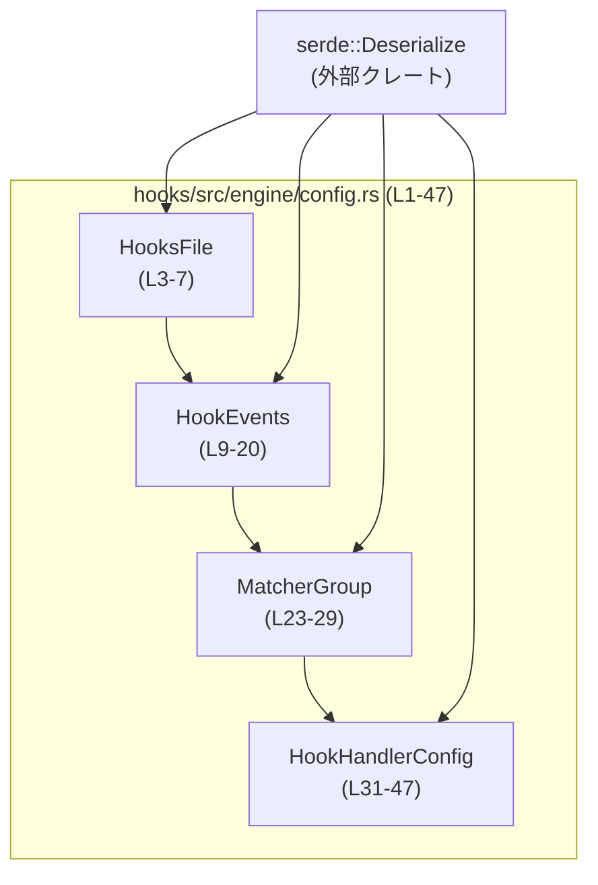
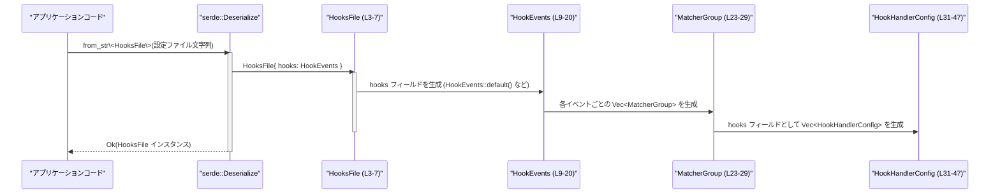

# hooks/src/engine/config.rs コード解説

## 0. ざっくり一言

このモジュールは、外部設定ファイルから「各種フック（hooks）の定義」を `serde` で読み込むための設定用データ構造を定義しています。  
どのイベントに対して、どのタイプのフック（コマンド／プロンプト／エージェント）を、どの条件で実行するかを表現します。

---

## 1. このモジュールの役割

### 1.1 概要

- このモジュールは **フック設定ファイルの構造** を定義し、`serde::Deserialize` によって外部フォーマット（例: YAML/JSON）から読み込めるようにしています。
- 対応しているイベントは `PreToolUse` / `PostToolUse` / `SessionStart` / `UserPromptSubmit` / `Stop` です（`HookEvents` のフィールドから判読可能です。`config.rs:L9-20`）。
- 各イベントに対して、任意個の「マッチャーグループ（条件 + フック群）」を定義でき、その中でフックの種類と詳細（コマンドやタイムアウトなど）を指定します（`MatcherGroup`, `HookHandlerConfig`。`config.rs:L23-47`）。

### 1.2 アーキテクチャ内での位置づけ

コードから読み取れる依存関係は以下です。

- `serde::Deserialize` に依存し、すべての構造体／列挙体をデシリアライズ可能にしている（`config.rs:L1, L3, L9, L23, L31`）。
- 外部からは「設定ファイル → `HooksFile` → `HookEvents` → `MatcherGroup` → `HookHandlerConfig`」という階層構造で参照されることが想定されます。



**補足**: `pub(crate)` で公開されているため、これらの型は「このクレート内部（特に hooks エンジン）」からのみ利用される設計です（`config.rs:L4, L10, L24, L33`）。

### 1.3 設計上のポイント

コードから読み取れる設計上の特徴は次のとおりです。

- **設定専用のデータ構造**  
  - 振る舞い（メソッドや関数）は一切なく、純粋にデータ構造のみを定義しています（このファイル内に関数定義はありません）。
- **`serde` によるデシリアライズ前提**  
  - 全ての型が `Deserialize` を derive しており（`config.rs:L3, L9, L23, L31`）、`#[serde(rename = ...)]` や `#[serde(default)]`、`#[serde(tag = "type")]` などを使って外部フォーマットとのマッピングを制御しています。
- **デフォルト値を多用**  
  - 多くのフィールドに `#[serde(default)]` が付いており、設定ファイルにフィールドが欠けていてもデシリアライズに失敗しにくい設計になっています（`config.rs:L5, L11, L13, L15, L17, L19, L25, L27, L37, L39, L41`）。
- **イベント別・条件別のフック定義**  
  - イベント → マッチャーグループ → フックの三段階構造で hooks を定義します。
- **エラーの発生点はデシリアライズ時**  
  - 実行時ロジックは含まれず、主なエラー要因は「設定ファイルの形式がこの構造と一致しないこと」に集約されます（`#[serde(tag = "type")]` と各 `#[serde(rename)]` から読み取れます。`config.rs:L31-47`）。

---

## 2. 主要な機能一覧

このファイルには関数はありませんが、以下の「型」が機能の中心です。

- `HooksFile`: フック設定ファイル全体のルートオブジェクト。
- `HookEvents`: 各イベントごとのフック定義（`PreToolUse` 等）をまとめるコンテナ。
- `MatcherGroup`: マッチ条件と、その条件にマッチしたときのフック群の組み合わせ。
- `HookHandlerConfig`: 実際に実行されるフックの種類とパラメータ（コマンド／プロンプト／エージェント）を表す列挙体。

---

## 3. 公開 API と詳細解説

### 3.1 型一覧（構造体・列挙体など）

このチャンクに出現する主要な型のインベントリです。

| 名前 | 種別 | 役割 / 用途 | 主なフィールド / バリアント | 定義位置（根拠） |
|------|------|------------|----------------------------|------------------|
| `HooksFile` | 構造体 | フック設定ファイル全体のルート。1つの設定ファイル全体を表現する。 | `hooks: HookEvents` | `hooks/src/engine/config.rs:L3-7` |
| `HookEvents` | 構造体 | イベントごとのフック定義をまとめるコンテナ。 | `pre_tool_use`, `post_tool_use`, `session_start`, `user_prompt_submit`, `stop`（いずれも `Vec<MatcherGroup>`） | `hooks/src/engine/config.rs:L9-20` |
| `MatcherGroup` | 構造体 | 1つのマッチ条件（オプション）と、その条件で有効になるフック群の組み合わせ。 | `matcher: Option<String>`, `hooks: Vec<HookHandlerConfig>` | `hooks/src/engine/config.rs:L23-29` |
| `HookHandlerConfig` | 列挙体 | 個々のフックの設定。種別ごとに異なるパラメータを持ちうる。 | `Command { command, timeout_sec, r#async, status_message }`, `Prompt {}`, `Agent {}` | `hooks/src/engine/config.rs:L31-47` |

#### Serde 属性の意味（このファイルから分かる範囲）

- `#[serde(default)]`  
  - 該当フィールドが設定ファイル上に存在しない場合でも、デフォルト値（型の `Default` 実装）を使ってデシリアライズします。
- `#[serde(rename = "...")]`  
  - 設定ファイル上で使用するキー名／値を明示します（例: `PreToolUse` など。`config.rs:L11-20, L34-47`）。
- `#[serde(tag = "type")]` + バリアントでの `rename`  
  - `HookHandlerConfig` は「タグ付き列挙体」としてデシリアライズされます。設定ファイル側で `type: "command"` などと書くことで対応するバリアントが選ばれます（`config.rs:L31-35, L44-47`）。
- `#[serde(default, rename = "timeout", alias = "timeoutSec")]`  
  - 設定ファイル上では `timeout` または `timeoutSec` のどちらでも `timeout_sec` フィールドにマッピングされ、未指定なら `None` になります（`config.rs:L37-38`）。

### 3.2 関数詳細

このファイルには関数定義が存在しないため、このセクションで詳細説明する関数はありません。  
すべての挙動は `serde` によるデシリアライズ時の動作（外部ライブラリ側のロジック）に委ねられています。

### 3.3 その他の関数

- このチャンクには関数やメソッドは一切現れません。

---

## 4. データフロー

このモジュールに関連する代表的なデータフローは、「設定ファイルを読み込んで `HooksFile` にデシリアライズする」という流れです。  
以下は、その典型的なシーケンスを示します（デシリアライズの実装自体はこのファイルにはありませんが、`Deserialize` 派生と属性から推測可能な範囲です）。



**ポイント**

- 欠けているイベントやフック、matcher は、`#[serde(default)]` によって自動的に「空」や「None」として扱われます（`config.rs:L5, L11-20, L25, L27, L37, L39, L41`）。
- `HookHandlerConfig` の `type` が `"command"`, `"prompt"`, `"agent"` のいずれかにマッチしない場合、`serde` 側でデシリアライズエラーになります（`config.rs:L31-35, L44-47`）。

---

## 5. 使い方（How to Use）

### 5.1 基本的な使用方法

このモジュールは、クレート内部から `HooksFile` をターゲット型として `serde` でデシリアライズして使うことが想定されます。

#### 設定ファイル（例: YAML）

`HookHandlerConfig` の属性から読み取れる外部表現の一例です（`config.rs:L31-47` を反映）。

```yaml
# hooks.yaml の例: PreToolUse と UserPromptSubmit にフックを設定
hooks:
  PreToolUse:
    - matcher: "tool_name == 'search'"
      hooks:
        - type: "command"
          command: "echo PreToolUse hook"
          timeout: 10        # timeoutSec でもよい
          async: true
          statusMessage: "Running pre-tool hook"
  UserPromptSubmit:
    - hooks:
        - type: "prompt"
        - type: "agent"
```

#### Rust側での読み込み例（クレート内部）

```rust
use std::fs;                       // ファイル読み込み用
use serde_yaml;                    // YAML デシリアライズ用クレートの例
use crate::engine::config::HooksFile; // 同一クレート内からの参照を想定（pub(crate) のため）

fn load_hooks_from_file(path: &str) -> Result<HooksFile, Box<dyn std::error::Error>> {
    let contents = fs::read_to_string(path)?;          // 設定ファイルを文字列として読み込む
    let hooks_file: HooksFile = serde_yaml::from_str(&contents)?; // YAML を HooksFile にデシリアライズ
    Ok(hooks_file)                                     // 呼び出し元に返す
}
```

**言語固有の安全性・エラー・並行性**

- **所有権 / 借用**  
  - `HooksFile` などの構造体はすべて所有型（`HookEvents`, `Vec`, `String`, `Option`, `bool`, `u64`）から成り立っており、ライフタイムパラメータはありません。このため、デシリアライズ後の値は通常の所有権ルールに従います。
- **エラー**  
  - 上記例の `serde_yaml::from_str` は `Result<HooksFile, _>` を返し、不正な設定ファイルの場合は `Err` になります。エラー条件は主に「キー名／値の型／`type` の値がコード中の定義と一致しない場合」です（`#[serde(rename)]`, `#[serde(tag = "type")]`。`config.rs:L11-20, L31-47`）。
- **並行性**  
  - フィールド型は `String`, `Vec<T>`, `Option<T>`, `bool`, `u64` のみであり、これらは Rust 標準ライブラリにおいて `Send + Sync` な型です。そのため、`HooksFile` 全体を `Arc<HooksFile>` で包んでスレッド間共有するような利用形態でも、データ競合は生じにくい設計です（このファイル内で `unsafe` や内部可変性は利用されていません）。

### 5.2 よくある使用パターン

#### 特定イベントのフック一覧を取得して処理する

```rust
use crate::engine::config::{HooksFile, HookHandlerConfig}; // pub(crate) のため同クレート内を想定

fn handle_pre_tool_use_hooks(config: &HooksFile) {
    // PreToolUse イベントに紐づく MatcherGroup のリストを取得
    for group in &config.hooks.pre_tool_use {
        // matcher の有無で条件を判断（意味付けはこのファイルからは不明）
        if let Some(expr) = &group.matcher {
            // ここで expr を評価する処理が別モジュールにある想定（このチャンクには出現しません）
            // evaluate_matcher(expr, context);
        }

        // 対応する hooks を順に処理
        for hook in &group.hooks {
            match hook {
                HookHandlerConfig::Command { command, timeout_sec, r#async, status_message } => {
                    // コマンド実行ロジックは別モジュール側（このチャンクには出現しません）
                    // run_command(command, *timeout_sec, *r#async, status_message.as_deref());
                }
                HookHandlerConfig::Prompt {} => {
                    // プロンプト系フックの扱い
                }
                HookHandlerConfig::Agent {} => {
                    // エージェント系フックの扱い
                }
            }
        }
    }
}
```

### 5.3 よくある間違い（推測できる範囲）

コード中の `#[serde(rename = "...")]` から想定される誤用例です。

```yaml
# 間違い例: イベント名のキーが rename と一致していない
hooks:
  pre_tool_use:   # 小文字スネークケース → HookEvents では PreToolUse が期待されている（L11）
    - hooks: []
```

```yaml
# 正しい例
hooks:
  PreToolUse:
    - hooks: []
```

- 同様に、`HookHandlerConfig` では `type` の値として `"command"`, `"prompt"`, `"agent"` のいずれかが必要です（`config.rs:L34, L44, L46`）。  
  それ以外の値を指定するとデシリアライズエラーになります。

### 5.4 使用上の注意点（まとめ）

- **フィールド省略時の挙動**  
  - `hooks` 全体を省略すると、`HooksFile { hooks: HookEvents::default() }` となり、全イベントのフックは空扱いです（`config.rs:L3-7, L5`）。
  - 各イベントフィールドを省略すると、そのイベントの `Vec<MatcherGroup>` は空ベクタとして扱われます（`config.rs:L11-20`）。
  - `matcher` を省略した `MatcherGroup` は `None` になります（`config.rs:L25-26`）。
  - `timeout_sec`, `status_message` を省略すると `None` になります（`config.rs:L37-38, L41-42`）。
  - `r#async` を省略すると `false` になります（`bool` の `Default`。`config.rs:L39-40`）。
- **設定ファイル互換性**  
  - `#[serde(rename = "...")]` を変更すると既存の設定ファイルが読めなくなります。互換性を保つには `alias` を増やす方式が安全です（`timeout` と `timeoutSec` のように。`config.rs:L37-38`）。
- **セキュリティ / バグ観点（このファイルから言える範囲）**  
  - `Command` バリアントは任意の文字列コマンドを保持しますが、実際のコマンド実行処理はこのチャンクには存在しません。そのため、コマンドインジェクション等の安全性は、このファイル単体からは評価できません。
  - `Prompt` / `Agent` バリアントは現状フィールドを持たず、マーカー的な役割を果たしていると考えられますが、具体的な意味付けは他ファイル側に依存します。

---

## 6. 変更の仕方（How to Modify）

### 6.1 新しい機能を追加する場合

このモジュールに対して考えられる代表的な拡張パターンを示します。

#### 新しいイベント種別を追加する

1. `HookEvents` にフィールドを追加する（`config.rs:L9-20` 付近）。

   ```rust
   #[derive(Debug, Default, Deserialize)]
   pub(crate) struct HookEvents {
       // 既存フィールド...
       #[serde(rename = "BeforeShutdown", default)]
       pub before_shutdown: Vec<MatcherGroup>,
   }
   ```

2. それに応じて、イベントを消費するロジック側（このチャンクの外）で `before_shutdown` フィールドを扱う処理を追加する。
3. ドキュメントや設定ファイルのサンプルに `BeforeShutdown` キーを追記する。

#### 新しいフック種別を追加する

1. `HookHandlerConfig` に新しいバリアントを追加する（`config.rs:L31-47`）。

   ```rust
   #[derive(Debug, Clone, Deserialize)]
   #[serde(tag = "type")]
   pub(crate) enum HookHandlerConfig {
       // 既存...
       #[serde(rename = "webhook")]
       Webhook {
           url: String,
       },
   }
   ```

2. `match HookHandlerConfig` を行っている箇所（このチャンクには出現しません）に新バリアントの分岐を追加する。
3. 設定ファイルでは `type: "webhook"` で新バリアントを指定できるようになります。

**注意（契約面）**

- 既存の `type` 値 (`"command"`, `"prompt"`, `"agent"`) を変更すると後方互換性が失われるため、追加は新しい `rename` として行い、既存の `rename` は保持する方が安全です。

### 6.2 既存の機能を変更する場合

- **フィールド名や型を変更する前に確認すべき点**
  - `#[serde(rename = "...")]` を伴うフィールドは、外部フォーマットとの契約そのものです。この値を変えると既存の設定ファイルが使えなくなる可能性があります（`config.rs:L11-20, L34-47`）。
  - `#[serde(default)]` を外すと、設定ファイル上でフィールドが欠けている場合にデシリアライズエラーが発生します。
- **影響範囲の調査**
  - この型を参照しているモジュール（例: hooks 実行エンジン、マッチャー評価ロジック、コマンド実行ロジックなど）を検索し、`HookEvents`, `MatcherGroup`, `HookHandlerConfig` の利用箇所を確認する必要があります。
- **テスト**
  - このチャンク内にはテストコードは存在しません。設定ファイルの互換性を確認するには、少なくとも以下をカバーするテストデータが必要です（いずれもこのファイルから導けるエッジケースです）。
    - 全イベントが定義されている設定
    - いくつかのイベントが省略されている設定
    - `type` 値が異常な設定（エラーになることの確認）
    - `timeout` / `timeoutSec` の両方を使った設定

---

## 7. 関連ファイル

このチャンク内から直接参照されている外部依存や、関係が明確なコンポーネントは次のとおりです。

| パス / クレート | 役割 / 関係 |
|-----------------|------------|
| `serde::Deserialize` | すべての設定型のデシリアライズを提供するトレイトです。`HooksFile`, `HookEvents`, `MatcherGroup`, `HookHandlerConfig` に derive され、設定ファイルからの読み込みを可能にします（`hooks/src/engine/config.rs:L1, L3, L9, L23, L31`）。 |

このチャンクには、これらの設定型を実際に利用しているモジュール（例: フック実行エンジン、マッチャー評価ロジック、コマンド実行モジュール）の情報は現れません。そのため、具体的にどのファイルから呼ばれているかは、このチャンク単体からは分かりません。
