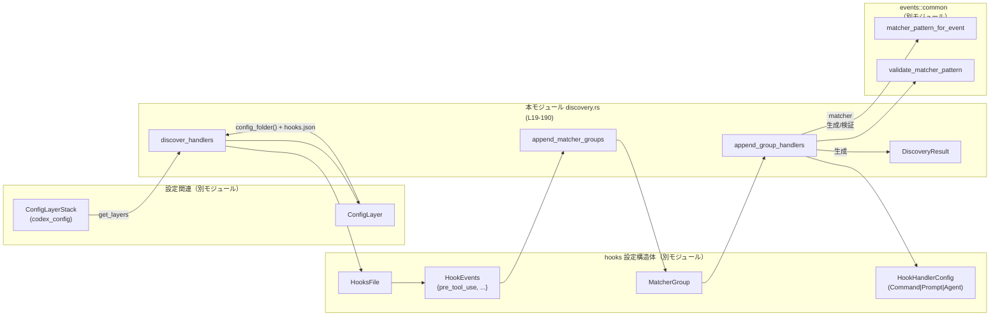
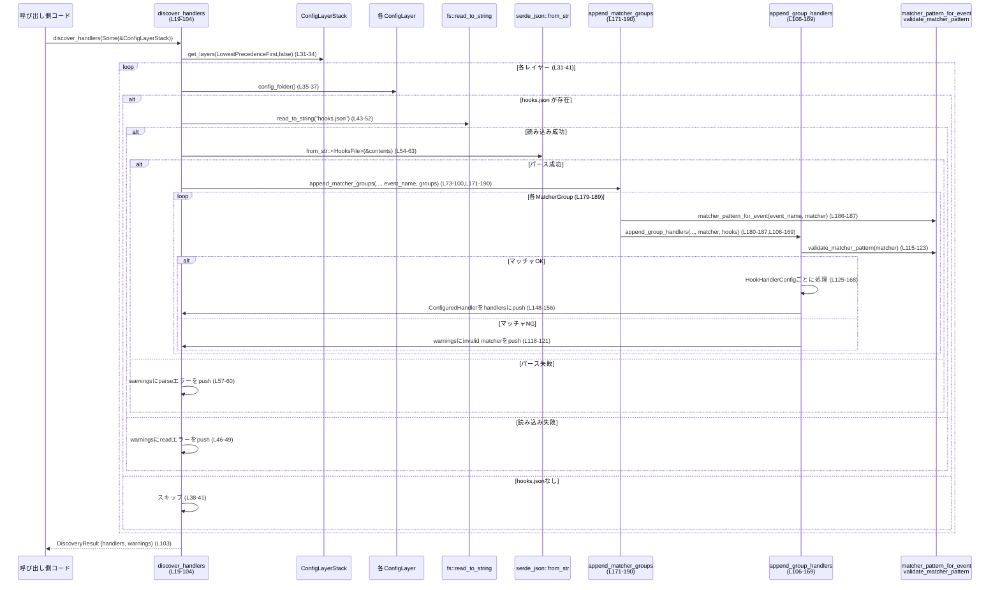

hooks/src/engine/discovery.rs

---

## 0. ざっくり一言

`hooks.json` という設定ファイル群から、実行可能なフック（`ConfiguredHandler`）の一覧を発見・検証し、同時に警告メッセージも集約するモジュールです（`DiscoveryResult` と `discover_handlers` が中核）（hooks/src/engine/discovery.rs:L14-24,L19-24,L103-103）。

---

## 1. このモジュールの役割

### 1.1 概要

- このモジュールは **フック設定ファイル（hooks.json）を探索・パースし、実行時に利用するハンドラ定義に変換する** 役割を持ちます（L31-41,L43-63,L65-71,L73-100）。
- 設定エラー（ファイル読み込み・JSONパース・マッチャ不正・未対応のフック種別など）は **失敗として中断せず、警告文字列として蓄積** します（L43-63,L115-123,L133-139,L140-146,L159-166）。
- サポートされていないフック種別（`Prompt`/`Agent`）や `async` フラグ付きフックはスキップし、理由を警告に残します（L133-139,L159-166）。

### 1.2 アーキテクチャ内での位置づけ

外部コンポーネントとの関係を簡略化した依存関係図です。



- `discover_handlers` が **ただ一つの外部向けエントリポイント** であり、設定レイヤーから `ConfiguredHandler` 群と警告を構築します（L19-24,L27-29,L31-101,L103-103）。
- マッチャ関連のロジック（イベントごとにマッチャをどう扱うか）は `matcher_pattern_for_event` と `validate_matcher_pattern`（いずれも別モジュール）に委譲されており、本モジュールはその結果を使ってフィルタリングするだけです（L11-12,L115-123,L186-187,L203-203,L217-217,L253-253,L289-289,L315-315）。
- 実際にフックを実行する処理はこのファイルには存在せず、ここでは **設定から実行時構造体 `ConfiguredHandler` への変換まで** を担当しています（L7,L148-156）。

### 1.3 設計上のポイント

- **副作用は I/O とログ用の警告蓄積のみ**  
  - ファイル読み込み (`fs::read_to_string`) と JSON パース (`serde_json::from_str`) 以外は、メモリ上のベクタを構築するだけです（L43-63）。
- **エラーは例外でなく警告として扱う方針**  
  - 読み込み・パース・マッチャ検証・未サポートフック種別・async フラグなどは、すべて `warnings: Vec<String>` にメッセージを追加し、「処理継続可能なエラー」として扱っています（L43-63,L115-123,L133-139,L140-146,L159-166）。
- **表示順序の安定化**  
  - `display_order` を増分しながら `ConfiguredHandler` に埋め込むことで、探索順に安定した並び順を維持する設計になっています（L27-29,L147-157）。
- **マッチャの事前検証による安全性**  
  - マッチャ文字列は `validate_matcher_pattern` で検証し、エラー時にはそのグループをスキップします（L115-123）。  
    これにより、後続の処理で危険な正規表現などによるランタイムエラーを防いでいると解釈できます（ただし検証の詳細は別モジュールのため不明です）。
- **同期・シングルスレッド前提の実装**  
  - 非同期処理（`async`/`await`）やスレッドは使用せず、ブロッキング I/O によるシンプルな実装です（全体を通して `async` 関数や `std::thread` の使用なし）。

---

## 2. 主要な機能一覧

- 設定レイヤーからフック定義を発見: `discover_handlers` が `ConfigLayerStack` を走査し、各レイヤーの `hooks.json` を読み込みます（L19-24,L31-41）。
- hooks.json のパースとイベント別グループ展開: `HooksFile` からイベントごとの `MatcherGroup` 群を取り出し、全 `HookEventName` に対して処理します（L54-63,L65-71,L73-91）。
- グループごとのマッチャ検証とハンドラ登録: `append_matcher_groups` と `append_group_handlers` がマッチャを検証し、有効な `Command` フックだけを `ConfiguredHandler` として登録します（L171-190,L106-169,L147-157）。

---

## 3. 公開 API と詳細解説

### 3.1 型一覧（構造体・列挙体など）

| 名前 | 種別 | 役割 / 用途 | 定義位置 |
|------|------|-------------|----------|
| `DiscoveryResult` | 構造体 | フック探索の結果として、構成済みハンドラ一覧と警告メッセージ一覧を保持する | hooks/src/engine/discovery.rs:L14-17 |

※ `ConfiguredHandler`, `HookHandlerConfig`, `HooksFile`, `MatcherGroup` はこのファイル外で定義されているため、ここでは詳細不明ですが、`ConfiguredHandler` は実行時に利用されるフック定義、`HookHandlerConfig`/`MatcherGroup`/`HooksFile` は JSON 設定を表す中間構造体として利用されています（L7-10,L54-63,L171-178）。

---

### 3.2 関数詳細

#### `discover_handlers(config_layer_stack: Option<&ConfigLayerStack>) -> DiscoveryResult`

**定義位置**: hooks/src/engine/discovery.rs:L19-104

**概要**

- `ConfigLayerStack` に登録された複数の設定レイヤーを走査し、各レイヤー配下の `hooks.json` を読み込んでパースし、有効なフックを `ConfiguredHandler` として列挙します（L19-24,L31-41,L54-63,L73-100）。
- 失敗が発生しても処理を中断せず、その内容を `warnings` に追加します（L43-63）。

**引数**

| 引数名 | 型 | 説明 |
|--------|----|------|
| `config_layer_stack` | `Option<&ConfigLayerStack>` | 設定レイヤーのスタック。`None` の場合、探索は行われず、空の結果が返ります（L19-25）。 |

**戻り値**

- `DiscoveryResult`  
  - `handlers`: 発見されたすべての `ConfiguredHandler` の一覧（L14-16,L27,L103）。
  - `warnings`: 失敗・未サポート条件などの警告メッセージ一覧（L14-17,L28,L43-63,L133-139,L140-146,L159-166）。

**内部処理の流れ**

1. `config_layer_stack` が `None` の場合、空のハンドラと警告を持つ `DiscoveryResult` を即座に返します（L19-25）。
2. `handlers`, `warnings`, `display_order` を初期化します（L27-29）。
3. `ConfigLayerStack::get_layers` を `LowestPrecedenceFirst`、`include_disabled = false` で呼び出し、レイヤーを走査します（L31-34）。
4. 各レイヤーについて:
   - `config_folder()` から設定フォルダパスを取得できない場合、そのレイヤーはスキップします（L35-37）。
   - `folder.join("hooks.json")` で `hooks.json` のパスを組み立て、ファイルが存在しなければスキップします（L38-41）。
   - `fs::read_to_string` でファイルを読み込み、失敗時には警告を追加して次のレイヤーへ進みます（L43-52）。
   - `serde_json::from_str` で `HooksFile` としてパースし、失敗時には警告を追加して次のレイヤーへ進みます（L54-63）。
5. パース成功後、`parsed.hooks` から各イベントごとのグループを取り出し（`pre_tool_use`, `post_tool_use`, `session_start`, `user_prompt_submit`, `stop`）、それぞれに対応する `HookEventName` とペアにしてループします（L65-71,L73-91）。
6. 各イベントについて `append_matcher_groups` を呼び出し、具体的な `ConfiguredHandler` を `handlers` に積み上げていきます（L92-99）。
7. すべてのレイヤー・イベントの処理後、`DiscoveryResult { handlers, warnings }` を返します（L103）。

**Examples（使用例）**

以下は、アプリケーション起動時にフックを読み込む典型的な使い方の例です。

```rust
use codex_config::ConfigLayerStack;                         // ConfigLayerStack 型をインポートする
use hooks::engine::discovery::{discover_handlers, DiscoveryResult}; // 本モジュールの API をインポートする

fn load_hooks(stack: Option<&ConfigLayerStack>) -> DiscoveryResult { // 設定スタックからフックを読み込む関数
    let result = discover_handlers(stack);                            // discover_handlers を呼び出して探索を行う
    for warning in &result.warnings {                                // 警告メッセージをログ出力する
        eprintln!("hook discovery warning: {warning}");
    }
    result                                                           // handlers と warnings を呼び出し元に返す
}
```

**Errors / Panics**

- この関数自体は `Result` を返さず、エラーはすべて `warnings` に文字列として格納されます。
  - ファイル読み込み失敗: `"failed to read hooks config {path}: {err}"`（L43-52）。
  - JSON パース失敗: `"failed to parse hooks config {path}: {err}"`（L54-63）。
- コード中に `unwrap` や `panic!` は存在せず、標準ライブラリの I/O / JSON パース API からのエラーはすべて `match` で処理されています（L43-52,L54-63）。
- `unsafe` ブロックは存在せず、メモリ安全性はコンパイラにより保証される通常の Rust コードです（ファイル全体）。

**Edge cases（エッジケース）**

- `config_layer_stack == None`  
  - 空の `DiscoveryResult`（`handlers` と `warnings` が空）を即座に返します（L19-25）。
- 特定レイヤーに `config_folder()` がない / `hooks.json` が存在しない  
  - そのレイヤーは silently スキップされ、警告も追加されません（L35-41）。
- `hooks.json` の読み込み・パースに失敗したレイヤー  
  - そのレイヤーのフックはすべて無視されますが、警告が追加され、他のレイヤーの処理は続行されます（L43-63）。
- いずれのレイヤーからも有効なフックが見つからない場合  
  - `handlers` が空の `DiscoveryResult` が返ります（L27,L103）。

**使用上の注意点**

- エラー検知を失敗として扱いたい場合は、呼び出し側で `warnings` をチェックし、必要に応じてアプリケーション起動を中止するなどのポリシーを決める必要があります（設計上、ここでは中断しません）（L14-17,L43-63）。
- `discover_handlers` はブロッキング I/O（ファイル読み込み）を行うため、UI スレッドや低レイテンシが求められるループから呼ぶ場合は注意が必要です（L43-52）。
- `ConfigLayerStackOrdering::LowestPrecedenceFirst` でレイヤーを列挙しているため、後段のレイヤーが前段のレイヤーのフックとどのように競合・共存するかは、後続の処理側のポリシーに依存します（L31-34）。このモジュールは単にすべてを列挙するだけで、優先順位の解決は行いません。

---

#### `append_group_handlers(...)`

```rust
fn append_group_handlers(
    handlers: &mut Vec<ConfiguredHandler>,
    warnings: &mut Vec<String>,
    display_order: &mut i64,
    source_path: &Path,
    event_name: codex_protocol::protocol::HookEventName,
    matcher: Option<&str>,
    group_handlers: Vec<HookHandlerConfig>,
)
```

**定義位置**: hooks/src/engine/discovery.rs:L106-169

**概要**

- 1つの `MatcherGroup` に含まれるフック群（`HookHandlerConfig`）を検証し、実際に有効な `ConfiguredHandler` を `handlers` に追加する責務を持ちます（L106-114,L125-168）。
- マッチャがあれば検証し、エラーならそのグループ全体をスキップして警告を追加します（L115-123）。
- `Command` タイプのみをサポートし、`Prompt`/`Agent`/`async` フックはスキップして警告に記録します（L127-132,L133-139,L159-166）。

**引数**

| 引数名 | 型 | 説明 |
|--------|----|------|
| `handlers` | `&mut Vec<ConfiguredHandler>` | 生成されたハンドラを追記していくベクタ（L106-108,L148-156）。 |
| `warnings` | `&mut Vec<String>` | 警告メッセージを追記していくベクタ（L107-108,L118-121,L134-137,L141-144,L159-166）。 |
| `display_order` | `&mut i64` | 追加するハンドラの表示順を管理するカウンタ。追加のたびにインクリメントされます（L109,L147-157）。 |
| `source_path` | `&Path` | このグループが定義されている `hooks.json` のファイルパス。警告や `ConfiguredHandler` に格納されます（L110,L118-121,L134-137,L141-144,L154-155）。 |
| `event_name` | `HookEventName` | このグループが対象とするフックイベント名（PreToolUse など）（L111,L149）。 |
| `matcher` | `Option<&str>` | このグループに適用されるマッチャ文字列（イベントごとに解釈は別モジュール）。`None` の場合はマッチャなしとして扱われます（L112,L115-123,L150）。 |
| `group_handlers` | `Vec<HookHandlerConfig>` | このグループに属する生のフック設定（Command/Prompt/Agent）。所有権を受け取り、消費します（L113,L125-168）。 |

**戻り値**

- 戻り値はなく、副作用として `handlers`, `warnings`, `display_order` を更新します（L106-109,L147-157,L118-121,L134-137,L141-144,L159-166）。

**内部処理の流れ**

1. マッチャの検証:
   - `matcher` が `Some` で、かつ `validate_matcher_pattern(matcher)` が `Err` の場合、  
     `"invalid matcher {matcher:?} in {source_path}: {err}"` を `warnings` に追加し、グループ全体の処理を中止します（`return`）（L115-123）。
2. 各 `HookHandlerConfig` に対してループ（L125-168）:
   - `Command` バリアントの場合（L127-132）:
     1. `r#async == true` なら `"skipping async hook in {source_path}: async hooks are not supported yet"` を警告に追加し、そのハンドラをスキップします（L133-139）。
     2. `command.trim().is_empty()` なら `"skipping empty hook command in {source_path}"` を警告に追加し、そのハンドラをスキップします（L140-146）。
     3. それ以外は `timeout_sec.unwrap_or(600).max(1)` でタイムアウト秒数を決定し（L147-147）、`ConfiguredHandler` を構築して `handlers` にプッシュします（L148-156）。
     4. `display_order` を `+1` します（L157-157）。
   - `Prompt` バリアントの場合、 `"skipping prompt hook in {source_path}: prompt hooks are not supported yet"` を警告に追加し、スキップします（L159-162）。
   - `Agent` バリアントの場合、 `"skipping agent hook in {source_path}: agent hooks are not supported yet"` を警告に追加し、スキップします（L163-166）。

**Examples（使用例）**

テストコードから簡略化した例です。`UserPromptSubmit` イベントでは、（別モジュールの実装により）不正なマッチャは `None` にされる挙動が確認できます（L205-239）。

```rust
use std::path::Path;                                                // Path 型をインポートする
use codex_protocol::protocol::HookEventName;                        // HookEventName 列挙体をインポートする
use hooks::engine::discovery::append_group_handlers;                // append_group_handlers をインポートする
use hooks::engine::config::HookHandlerConfig;                       // HookHandlerConfig をインポートする（別モジュール）
use crate::events::common::matcher_pattern_for_event;               // イベント別マッチャ生成関数

fn build_prompt_submit_handlers() {
    let mut handlers = Vec::new();                                  // 結果を格納する handlers ベクタ
    let mut warnings = Vec::new();                                  // 警告メッセージの格納先
    let mut display_order = 0;                                      // 表示順のカウンタ

    append_group_handlers(
        &mut handlers,                                              // 生成された ConfiguredHandler をここに追加する
        &mut warnings,                                              // 警告メッセージをここに追加する
        &mut display_order,                                         // display_order をインクリメントするための参照
        Path::new("/tmp/hooks.json"),                               // このフック定義が書かれているファイルパス
        HookEventName::UserPromptSubmit,                            // 対象イベント
        matcher_pattern_for_event(                                  // イベントに応じたマッチャを生成
            HookEventName::UserPromptSubmit,
            Some("["),
        ),
        vec![HookHandlerConfig::Command {                           // Command タイプのフックを 1 件定義
            command: "echo hello".to_string(),
            timeout_sec: None,
            r#async: false,
            status_message: None,
        }],
    );

    // このケースでは warnings は空で、handlers に 1 件の ConfiguredHandler が追加されます
}
```

**Errors / Panics**

- `validate_matcher_pattern` が `Err` を返した場合:
  - `warnings` にメッセージを追加し、そのグループのハンドラは 1 件も登録されません（L115-123）。
- `timeout_sec` は `unwrap_or(600).max(1)` で補正されるため、`None` や 0（または負の値であっても型が許せば）による問題は、少なくとも「1秒未満のタイムアウト」にはなりません（L147）。
- `panic!` や `unwrap` は使われておらず、`match` と条件分岐だけで制御しています（L125-168）。

**Edge cases（エッジケース）**

- `matcher == None`  
  - マッチャ検証はスキップされ、すべてのハンドラがマッチャなしで登録されます（L115-116,L150）。  
    テストで `UserPromptSubmit` + `"["` のケースでも `matcher: None` で登録されることが確認できます（L205-239）。
- `matcher` が `Some` だが不正なパターン  
  - `validate_matcher_pattern` がエラーを返し、警告が追加され、グループ全体がスキップされます（L115-123）。
- `Command` で `r#async == true`  
  - 警告が追加され、そのハンドラはスキップされます（L133-139）。
- `Command` の `command` が空文字列または空白のみ  
  - `.trim().is_empty()` により検知され、警告が追加され、ハンドラはスキップされます（L140-146）。
- `Prompt` / `Agent` バリアント  
  - いずれも「not supported yet」として警告が追加され、スキップされます（L159-166）。

**使用上の注意点**

- `append_group_handlers` は **単独で公開されていない内部ヘルパー** ですが、テストモジュールからは直接呼ばれています（L192-203,L205-328）。
- マッチャ検証に失敗した場合、そのグループ内のフックは 1 件も登録されない設計のため、「一部だけ有効にする」といった挙動はありません（L115-123）。
- `display_order` は引数として受け取りインクリメントするため、呼び出し側で **初期値と共有の仕方** を正しく管理する必要があります。`discover_handlers` では 0 から開始し、イベントを跨いで単一のカウンタとして使っています（L27-29,L147-157,L73-100）。

---

#### `append_matcher_groups(...)`

```rust
fn append_matcher_groups(
    handlers: &mut Vec<ConfiguredHandler>,
    warnings: &mut Vec<String>,
    display_order: &mut i64,
    source_path: &Path,
    event_name: codex_protocol::protocol::HookEventName,
    groups: Vec<MatcherGroup>,
)
```

**定義位置**: hooks/src/engine/discovery.rs:L171-190

**概要**

- 特定イベントに対する `MatcherGroup` の一覧から、各グループのマッチャを `matcher_pattern_for_event` で生成しつつ、そのグループのフックを `append_group_handlers` に委譲して `ConfiguredHandler` と警告を構築します（L171-178,L179-189）。
- イベントごとにマッチャの解釈を切り替えるロジック自体は、`matcher_pattern_for_event` に隠蔽されています（L186-187,L203-203,L217-217,L253-253,L289-289,L315-315）。

**引数**

| 引数名 | 型 | 説明 |
|--------|----|------|
| `handlers` | `&mut Vec<ConfiguredHandler>` | 生成されたハンドラを蓄積するベクタ（L172-172,L180-187）。 |
| `warnings` | `&mut Vec<String>` | 警告メッセージを蓄積するベクタ（L173-173,L180-187）。 |
| `display_order` | `&mut i64` | 表示順カウンタ（L174-174,L180-187）。 |
| `source_path` | `&Path` | hooks.json のパス（L175-175,L180-187）。 |
| `event_name` | `HookEventName` | 対象イベント名（L176-176,L180-187）。 |
| `groups` | `Vec<MatcherGroup>` | そのイベントに対する `MatcherGroup` 一覧。所有権ごと受け取り、消費します（L177-178,L179-189）。 |

**戻り値**

- 戻り値はなく、副作用として `handlers`, `warnings`, `display_order` を更新します（L171-178,L179-189）。

**内部処理の流れ**

1. `groups` を `for group in groups` で順に取り出します（L179-179）。
2. 各 `group` について、`matcher_pattern_for_event(event_name, group.matcher.as_deref())` を呼び、イベントに応じてマッチャ文字列を生成（あるいは `None` に変換）します（L180-187）。
3. その結果のマッチャと `group.hooks` を `append_group_handlers` に渡して処理を委譲します（L180-187）。
4. これにより、イベントごとにマッチャ解釈ルールを変えながらも、共通のグループ処理ロジックを再利用しています。

**Examples（使用例）**

`discover_handlers` 内からの呼び出しが代表的な使い方です（L73-100,L92-99）。概念的には次のように動作します。

```rust
fn process_event_groups_for_pre_tool_use(
    handlers: &mut Vec<ConfiguredHandler>,                  // ハンドラ出力先
    warnings: &mut Vec<String>,                             // 警告出力先
    display_order: &mut i64,                                // 表示順
    source_path: &Path,                                     // hooks.json のパス
    pre_tool_use_groups: Vec<MatcherGroup>,                 // PreToolUse の MatcherGroup 一覧
) {
    append_matcher_groups(
        handlers,
        warnings,
        display_order,
        source_path,
        HookEventName::PreToolUse,                          // 対象イベントを指定
        pre_tool_use_groups,                                // 対象イベントのグループ一覧
    );
}
```

**Errors / Panics**

- `append_matcher_groups` 自身はエラーを生成せず、`append_group_handlers` と `matcher_pattern_for_event` に委譲しています（L179-189）。
- `panic!` や `unwrap` は使用されていません。

**Edge cases（エッジケース）**

- `groups` が空の場合  
  - ループが即座に終了し、何も変更されません（L179-189）。
- `group.matcher` が `None`  
  - `group.matcher.as_deref()` が `None` となり、そのまま `matcher_pattern_for_event` に渡されます（L186-187）。その挙動は別モジュール依存で、このチャンクからは不明です。
- イベントによってマッチャの扱いが変わるケース  
  - テストから、`UserPromptSubmit` イベントでは不正なマッチャ `"["` が `None` として扱われる一方、`PreToolUse` イベントでは `"^Bash$"` や `"*"` などがそのまま保持されることが読み取れます（L205-239,L241-275,L277-301）。

**使用上の注意点**

- イベントごとにマッチャの意味が変わる設計になっているため、`matcher_pattern_for_event` の仕様に依存した挙動になります（L186-187,L203-203,L217-217,L253-253,L289-289,L315-315）。
- `groups` は所有権をムーブして消費するため、呼び出し側で再利用することはできません（L179-189）。

---

### 3.3 その他の関数（テスト用）

| 関数名 | 役割（1 行） | 定義位置 |
|--------|--------------|----------|
| `user_prompt_submit_ignores_invalid_matcher_during_discovery` | `UserPromptSubmit` イベントでは、不正なマッチャが無視され `matcher: None` でハンドラが登録されることを検証するテスト | L205-239 |
| `pre_tool_use_keeps_valid_matcher_during_discovery` | `PreToolUse` イベントで有効なマッチャが保持されることを検証するテスト | L241-275 |
| `pre_tool_use_treats_star_matcher_as_match_all` | `PreToolUse` イベントで `"*"` マッチャがそのまま保持される（＝全マッチ扱い）ことを検証するテスト | L277-301 |
| `post_tool_use_keeps_valid_matcher_during_discovery` | `PostToolUse` イベントで有効なマッチャが保持されることを検証するテスト | L303-328 |

---

## 4. データフロー

### 4.1 代表的な処理シナリオ

**シナリオ**: アプリケーション起動時に `discover_handlers` を呼び出し、`hooks.json` から `ConfiguredHandler` を構築する流れ。

1. 呼び出し側が `ConfigLayerStack` を用意し、`discover_handlers(Some(&stack))` を呼ぶ（L19-24）。
2. 各レイヤーの `config_folder` から `hooks.json` のパスを組み立て、ファイルの存在を確認する（L31-41）。
3. 既存する `hooks.json` を読み込み (`fs::read_to_string`)・パース (`serde_json::from_str`) し、`HooksFile` に変換する（L43-63）。
4. `parsed.hooks` からイベント別に `MatcherGroup` を取り出し、`append_matcher_groups` で処理する（L65-71,L73-100,L171-190）。
5. `append_matcher_groups` は `matcher_pattern_for_event` でマッチャ文字列を生成しつつ、各グループを `append_group_handlers` に委譲する（L171-190,L186-187,L180-187）。
6. `append_group_handlers` がマッチャ検証（`validate_matcher_pattern`）と `HookHandlerConfig` のフィルタリングを行い、最終的な `ConfiguredHandler` を `handlers` に追加する（L115-123,L125-168）。
7. 全レイヤー・全イベントの処理後、`DiscoveryResult` として `handlers` と `warnings` が呼び出し側に返る（L103）。

### 4.2 シーケンス図



---

## 5. 使い方（How to Use）

### 5.1 基本的な使用方法

アプリケーション起動時にフック設定を読み込み、後続処理で利用する例です。

```rust
use codex_config::ConfigLayerStack;                      // 設定レイヤースタックの型をインポート
use hooks::engine::discovery::{discover_handlers, DiscoveryResult}; // 本モジュールの API をインポート

fn init_hooks(stack: Option<&ConfigLayerStack>) -> Vec<ConfiguredHandler> { // フックを初期化する関数
    let result: DiscoveryResult = discover_handlers(stack);                // hooks.json からフックを探索・構築する
    for warning in &result.warnings {                                      // 発生した警告をログに出力する
        eprintln!("[hook warning] {warning}");
    }
    result.handlers                                                        // 有効なフック一覧だけを呼び出し元に返す
}
```

- ここでは `warnings` をログ表示したうえで無視していますが、要件に応じて起動中断などのポリシーを実装できます（L14-17,L43-63,L133-139,L140-146,L159-166）。

### 5.2 よくある使用パターン

1. **特定イベントのフックだけを使う**

   ```rust
   use codex_protocol::protocol::HookEventName;            // HookEventName 列挙体をインポート

   fn get_pre_tool_use_hooks(stack: Option<&ConfigLayerStack>) -> Vec<ConfiguredHandler> {
       let result = discover_handlers(stack);              // すべてのイベントのフックを探索する
       result.handlers
           .into_iter()
           .filter(|h| h.event_name == HookEventName::PreToolUse) // PreToolUse イベントだけに絞り込む
           .collect()
   }
   ```

2. **警告を厳格に扱う**

   ```rust
   fn load_hooks_strict(stack: Option<&ConfigLayerStack>) -> anyhow::Result<Vec<ConfiguredHandler>> {
       let result = discover_handlers(stack);                     // フック探索
       if !result.warnings.is_empty() {                          // 警告が 1 件でもあればエラーとして返す
           let joined = result.warnings.join("\n");               // 警告メッセージを 1 つの文字列にまとめる
           anyhow::bail!("hook discovery reported warnings:\n{joined}");
       }
       Ok(result.handlers)                                       // 警告がなければハンドラ一覧を返す
   }
   ```

### 5.3 よくある間違い

```rust
// 間違い例: ConfigLayerStack を用意せずに None を渡してしまう
let handlers = discover_handlers(None).handlers;           // handlers は常に空になってしまう（L19-25）

// 正しい例: 実際の ConfigLayerStack インスタンスの参照を渡す
let stack = build_config_layer_stack();                    // どこかで設定レイヤーを構築する（別モジュール）
let handlers = discover_handlers(Some(&stack)).handlers;   // 有効なフックが探索される
```

```rust
// 間違い例: warnings を完全に無視し、エラー状況に気づけない
let DiscoveryResult { handlers, .. } = discover_handlers(Some(&stack)); // warnings を捨てている

// より安全な例: warnings をログや監視に流す
let result = discover_handlers(Some(&stack));
for w in &result.warnings {
    log::warn!("hook discovery warning: {w}");             // 監視基盤などに出力
}
let handlers = result.handlers;
```

### 5.4 使用上の注意点（まとめ）

- **エラー処理ポリシー**  
  - 本モジュールは「なるべく多くのフックを有効化しつつ、問題は warnings で報告する」という方針です（L43-63,L115-123,L133-139,L140-146,L159-166）。  
    呼び出し側で、警告が一定数以上なら起動を中断する等のポリシーを明示的に決める必要があります。
- **ブロッキング I/O**  
  - `fs::read_to_string` による同期ファイル読み込みのため、大量のレイヤーや巨大な `hooks.json` がある場合は起動時間に影響します（L43-52）。必要に応じて別スレッドや起動前準備ステップに移すことが検討されます。
- **セキュリティ上の注意**  
  - このモジュール自体はフックを「発見」して `ConfiguredHandler` に変換するだけで、実行は別のコンポーネントが担います（L7,L148-156）。  
    ただし、`command` 文字列はここでは内容を検証せずそのまま保持しているため（L127-132,L148-152）、後続の実行側でコマンドインジェクションなどの対策を行う必要があります。
- **並行性**  
  - スレッドセーフな共有状態は持たず、単純なローカル変数だけで完結しています（L27-29,L106-109,L171-178）。  
    そのため `DiscoveryResult` を `Send`/`Sync` なコンテキストで使うかどうかは、`ConfiguredHandler` など関連型の実装に依存します（このチャンクからは不明です）。

---

## 6. 変更の仕方（How to Modify）

### 6.1 新しい機能を追加する場合

1. **新しい Hook イベントを追加したい場合**
   - `HookEvents` / `HookEventName` に新しいイベント列挙値とフィールドを追加（別ファイル、ここからは詳細不明）。
   - 本モジュールでは `discover_handlers` 内のイベント列挙配列に、そのイベントを追加する必要があります（L73-91）。
   - `matcher_pattern_for_event` と `validate_matcher_pattern` が新イベントに対応していることを確認します（L11-12,L186-187）。

2. **新しい HookHandlerConfig バリアントを追加したい場合**
   - `HookHandlerConfig` に新バリアントを追加（別ファイル）。
   - `append_group_handlers` の `match handler` に対応する分岐（サポート or スキップの方針）を追加します（L125-168）。
   - サポートする場合は `ConfiguredHandler` にどうマッピングするかを決め、必要なら `ConfiguredHandler` の型も拡張します（L148-156）。

3. **マッチャの解釈ルールを変更したい場合**
   - イベントごとの `matcher_pattern_for_event` の挙動を変更し、テストを追加・更新します（L186-187,L203-203,L217-217,L253-253,L289-289,L315-315）。
   - `append_group_handlers` のマッチャ検証（`validate_matcher_pattern`）の扱いが要件に合っているか確認します（L115-123）。

### 6.2 既存の機能を変更する場合

- **タイムアウトのデフォルト値変更**
  - 現在は `timeout_sec.unwrap_or(600).max(1)` で 600 秒（10 分）がデフォルトです（L147）。  
    変更する場合はこのリテラル値を修正し、ドキュメントやテスト（`timeout_sec` を検証しているテストがあれば）も更新します。
- **エラーをより厳格に扱いたい場合**
  - たとえばマッチャ検証エラーを致命的エラーにしたい場合、`append_group_handlers` で `return` ではなく `panic!` や `Result` 返却に切り替える必要があります（L115-123）。  
    ただしこの方針変更はモジュール全体の設計（「警告で済ます」方針）と整合するか慎重な検討が必要です。
- **警告メッセージのフォーマット変更**
  - エラー文言はすべて `format!` で生成されているため、ログ基盤の仕様に合わせてフォーマットを統一したい場合は、それぞれの `warnings.push(format!( ... ))` を修正します（L46-49,L57-60,L118-121,L134-137,L141-144,L159-166）。
- **パフォーマンス改善（多数レイヤー・巨大ファイルへの対応）**
  - 本ファイル内では同期的な `read_to_string` を使っています（L43-52）。非同期化や並列化を行う場合は、この部分の API を差し替え、`discover_handlers` のインターフェース（同期 vs 非同期）も合わせて変更する必要があります。

---

## 7. 関連ファイル

| パス | 役割 / 関係 |
|------|------------|
| `hooks/src/engine/config.rs`（推定） | `HookHandlerConfig`, `HooksFile`, `MatcherGroup`, `HookEvents` など、hooks.json の設定構造体を定義していると考えられます（L8-10,L54-63,L171-178）。実際の中身はこのチャンクには現れません。 |
| `hooks/src/engine/mod.rs` など（推定） | `ConfiguredHandler` 型を定義しているモジュール。`Command` フック設定が最終的にどのように実行されるかはここで決まると考えられます（L7,L148-156）。 |
| `crate/events/common.rs` 付近 | `matcher_pattern_for_event` と `validate_matcher_pattern` を定義するモジュール。イベントごとのマッチャ解釈やパターン検証ロジックを担当します（L11-12,L186-187,L203-203,L217-217,L253-253,L289-289,L315-315）。 |
| `codex_config` クレート | `ConfigLayerStack` と `ConfigLayerStackOrdering` を提供し、設定ファイルのレイヤリングと探索順序を管理します（L4-5,L19-24,L31-34）。 |
| `codex_protocol::protocol` | `HookEventName` 列挙体を提供し、サポートされるフックイベントの種類を定義します（L73-91,L111,L176,L197,L216,L252,L288,L314）。 |
| `hooks/src/engine/discovery.rs`（本ファイルのテストモジュール） | マッチャの扱いやデフォルトタイムアウトなど、本モジュールの振る舞いに関するユニットテストを提供します（L192-328）。 |

このレポートは、与えられたコード（hooks/src/engine/discovery.rs）の内容のみを根拠に記述しており、他ファイルの詳細な実装や設計意図については、このチャンクから分かる範囲にとどめています。
