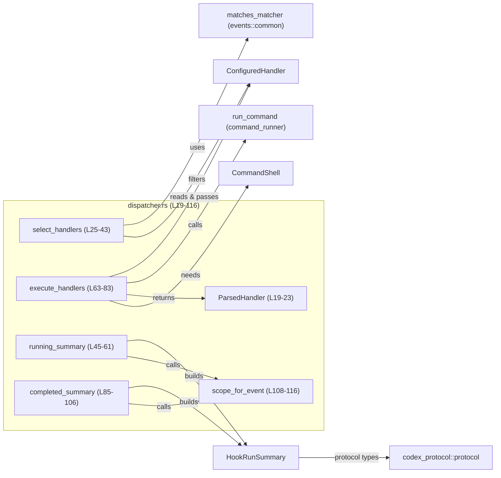
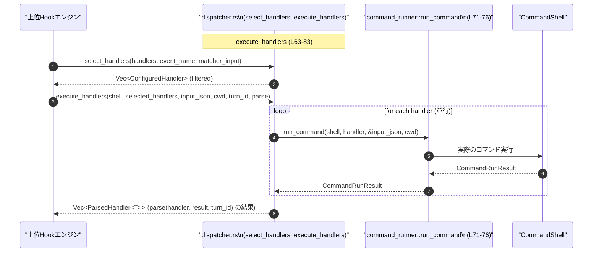

# hooks/src/engine/dispatcher.rs

## 0. ざっくり一言

Hook の設定（`ConfiguredHandler`）から対象イベントにマッチするハンドラを選択し、シェルコマンドを非同期に実行した結果をパースしつつ、実行サマリ（`HookRunSummary`）を組み立てるためのディスパッチ処理をまとめたモジュールです。  
（hooks/src/engine/dispatcher.rs:L19-23, L25-43, L45-61, L63-83, L85-106）

---

## 1. このモジュールの役割

### 1.1 概要

- このモジュールは **Hook の設定済みハンドラ群から、実際に実行するハンドラを選択し、並行実行・結果集約を行う問題** を解決するために存在し、以下の機能を提供します。
  - イベント種別・マッチャ（matcher）に基づくハンドラの選択（フィルタリング）  
    （hooks/src/engine/dispatcher.rs:L25-43）
  - 実行開始前・実行完了後の `HookRunSummary` の組み立て  
    （hooks/src/engine/dispatcher.rs:L45-61, L85-106）
  - シェルコマンドによるハンドラを非同期に一括実行し、呼び出し元指定のパーサで `ParsedHandler<T>` に変換するディスパッチ処理  
    （hooks/src/engine/dispatcher.rs:L19-23, L63-83）

### 1.2 アーキテクチャ内での位置づけ

このモジュールは「hooks エンジン」内で、**実行対象ハンドラの決定とコマンド実行のオーケストレーション** を担当します。

主な依存関係は次の通りです。

- 入力:
  - `ConfiguredHandler` … 設定ファイルなどから読み込まれた Hook ハンドラ定義（上位モジュールから渡される）  
    （hooks/src/engine/dispatcher.rs:L13-15, L127-142）
  - `HookEventName` … どのイベントに対する Hook かを表す列挙体（プロトコル側）  
    （hooks/src/engine/dispatcher.rs:L6）
  - `matches_matcher` … ハンドラの `matcher` と実際の入力を突き合わせる関数  
    （hooks/src/engine/dispatcher.rs:L17, L33-39）

- 実行基盤:
  - `CommandShell` … 実際にコマンドを実行するためのシェル抽象  
    （hooks/src/engine/dispatcher.rs:L13, L63-69）
  - `run_command` / `CommandRunResult` … シェルコマンドの実行関数と実行結果  
    （hooks/src/engine/dispatcher.rs:L15-16, L71-76, L85-104）

- プロトコル:
  - `HookCompletedEvent`, `HookRunSummary`, `HookRunStatus`, `HookScope`, `HookHandlerType`, `HookExecutionMode` など  
    （hooks/src/engine/dispatcher.rs:L5-11, L45-61, L85-106）

依存関係を簡易図にすると次のようになります。



※ `matches_matcher`, `run_command`, `CommandShell`, `ConfiguredHandler` の詳細実装はこのチャンクには現れません。

### 1.3 設計上のポイント

- **責務の分割**
  - ハンドラ選択 (`select_handlers`) と、実際のコマンド実行 (`execute_handlers`) が関数レベルで分離されています。  
    （hooks/src/engine/dispatcher.rs:L25-43, L63-83）
  - 実行サマリ構築は `running_summary` / `completed_summary` で別関数になっており、呼び出し元から再利用しやすい形になっています。  
    （hooks/src/engine/dispatcher.rs:L45-61, L85-106）

- **状態の扱い**
  - このモジュール内には長寿命の状態（struct フィールド）を持つオブジェクトはなく、すべての関数は入力を受け取り出力を返す純粋関数（`execute_handlers` も外部副作用を `run_command` に委譲）として実装されています。  
    （hooks/src/engine/dispatcher.rs:L19-23, L25-43, L45-61, L63-83, L85-106）

- **非同期実行・並行性**
  - `execute_handlers` は `join_all` によって、複数ハンドラのコマンド実行を **同時に進行する非同期タスク** として扱っています。  
    （hooks/src/engine/dispatcher.rs:L3, L63-83）
  - `join_all` は与えられた Future の結果を **元の順序通り** の `Vec` にして返すため、 `handlers.into_iter().zip(results)` による対応付けが安全に行える前提になっています。  
    （hooks/src/engine/dispatcher.rs:L71-82）

- **エラーハンドリング**
  - このファイル内では `Result` 型を直接は扱っていません。コマンド実行の成否やエラー情報は `CommandRunResult` 側に閉じ込められている設計に見えますが、詳細はこのチャンクには現れません。  
    （hooks/src/engine/dispatcher.rs:L63-83, L85-104）

---

## 2. 主要な機能一覧（コンポーネントインベントリー）

### 2.1 ランタイムコンポーネント一覧

| 名前 | 種別 | 役割 / 用途 | 定義位置 |
|------|------|-------------|----------|
| `ParsedHandler<T>` | 構造体 | コマンド実行後の Hook 完了イベント (`HookCompletedEvent`) と、汎用データ `T` を 1 つのオブジェクトとして保持するラッパー | hooks/src/engine/dispatcher.rs:L19-23 |
| `select_handlers` | 関数 | イベント種別と matcher に基づき、`ConfiguredHandler` のリストから実行対象をフィルタリングし、順序を保った `Vec` を返す | hooks/src/engine/dispatcher.rs:L25-43 |
| `running_summary` | 関数 | 実行開始時点の `HookRunSummary` を、`HookRunStatus::Running` 状態で生成する | hooks/src/engine/dispatcher.rs:L45-61 |
| `execute_handlers` | 非同期関数 | 複数の `ConfiguredHandler` に対して `run_command` を並行に実行し、その結果とハンドラ情報からコールバック `parse` で `ParsedHandler<T>` ベクタを生成する | hooks/src/engine/dispatcher.rs:L63-83 |
| `completed_summary` | 関数 | 実行完了後の `HookRunSummary` を、`CommandRunResult` と任意の出力エントリから構築する | hooks/src/engine/dispatcher.rs:L85-106 |
| `scope_for_event` | 関数（非公開） | イベント種別 (`HookEventName`) に応じて `HookScope`（Thread / Turn）を決定するヘルパー | hooks/src/engine/dispatcher.rs:L108-116 |

### 2.2 テスト用コンポーネント一覧

| 名前 | 種別 | 役割 / 用途 | 定義位置 |
|------|------|-------------|----------|
| `make_handler` | 関数 | テスト用に簡単に `ConfiguredHandler` を構築するためのヘルパー | hooks/src/engine/dispatcher.rs:L127-142 |
| `select_handlers_keeps_duplicate_stop_handlers` 他 7 件 | テスト関数 | `select_handlers` が matcher の扱いや順序保持など、期待通りのフィルタリングを行うことを検証する | hooks/src/engine/dispatcher.rs:L144-166, L168-190, L192-213, L215-236, L238-259, L261-277, L279-305, L307-336 |

---

## 3. 公開 API と詳細解説

### 3.1 型一覧

| 名前 | 種別 | 役割 / 用途 | 主なフィールド | 定義位置 |
|------|------|-------------|----------------|----------|
| `ParsedHandler<T>` | 構造体 | 1 つのハンドラ実行結果をまとめて表現するための汎用ラッパー。完了イベント + 型パラメータ `T` の付加情報を保持する。 | `completed: HookCompletedEvent`（完了イベント）、`data: T`（パース済みデータ） | hooks/src/engine/dispatcher.rs:L19-23 |

`ParsedHandler<T>` 自体は単純なコンテナであり、ロジックは持ちません。`execute_handlers` から渡される `parse` 関数の戻り値として利用されます。  
（hooks/src/engine/dispatcher.rs:L63-70）

---

### 3.2 重要な関数の詳細

#### `select_handlers(handlers: &[ConfiguredHandler], event_name: HookEventName, matcher_input: Option<&str>) -> Vec<ConfiguredHandler>`

**概要**

指定された `event_name`（Hook イベント種別）と、場合によっては `matcher_input`（ツール名など）に基づいて、`handlers` から実行対象のハンドラを抽出し、そのクローンを順序通りに返します。  
（hooks/src/engine/dispatcher.rs:L25-43）

**引数**

| 引数名 | 型 | 説明 |
|--------|----|------|
| `handlers` | `&[ConfiguredHandler]` | 候補となるハンドラのスライス |
| `event_name` | `HookEventName` | 今回処理している Hook のイベント種別 |
| `matcher_input` | `Option<&str>` | matcher 判定に使う文字列（ツール名やセッション名など）。イベント種別によっては無視されます。 |

**戻り値**

- `Vec<ConfiguredHandler>`  
  フィルタ条件にマッチしたハンドラの集合。**元の `handlers` の順序が保持されます。**  
  （順序保持は `.iter().filter(...).filter(...).cloned().collect()` の性質から読み取れます。hooks/src/engine/dispatcher.rs:L30-42 およびテスト L307-336）

**内部処理の流れ**

1. `handlers.iter()` でイテレータを作成します。  
   （hooks/src/engine/dispatcher.rs:L30-31）
2. 第一段階フィルタとして、`handler.event_name == event_name` のものだけに絞り込みます。  
   （hooks/src/engine/dispatcher.rs:L32）
3. 第二段階フィルタとして、イベント種別ごとに matcher の扱いを変えています。  
   （hooks/src/engine/dispatcher.rs:L33-40）
   - `PreToolUse` / `PostToolUse` / `SessionStart`  
     → `matches_matcher(handler.matcher.as_deref(), matcher_input)` が `true` のものだけ採用。  
       （hooks/src/engine/dispatcher.rs:L34-38）
   - `UserPromptSubmit` / `Stop`  
     → matcher は無視し、すべて `true`（このイベントに属するハンドラなら全採用）。  
       （hooks/src/engine/dispatcher.rs:L39）
4. フィルタ後の要素を `.cloned()` で `ConfiguredHandler` のクローンにし、`collect()` で `Vec` にします。  
   （hooks/src/engine/dispatcher.rs:L41-42）

**Examples（使用例）**

最も単純な使い方は、イベント種別に対応するハンドラ一覧を得ることです。

```rust
use codex_protocol::protocol::HookEventName;
use hooks::engine::dispatcher::select_handlers; // 実際のパスはクレート構成に依存します

fn example_select(handlers: Vec<ConfiguredHandler>) {
    // "Stop" イベント用のハンドラをすべて取得する（matcher は無視）
    let selected = select_handlers(&handlers, HookEventName::Stop, None);
    // selected は handlers 内の Stop ハンドラだけ、かつ元の順序通りになります
}
```

ツール名に応じた PreToolUse ハンドラを選ぶ例:

```rust
use codex_protocol::protocol::HookEventName;

fn example_select_tool(handlers: Vec<ConfiguredHandler>) {
    // ツール名 "Bash" にマッチする PreToolUse ハンドラを選択
    let selected = select_handlers(&handlers, HookEventName::PreToolUse, Some("Bash"));
    // tests::pre_tool_use_matches_tool_name で期待挙動が確認されています
}
```

**Errors / Panics**

- この関数自身は `Result` を返さず、内部で `unwrap` 等も行っていないため、**select_handlers 内で明示的に panic するコードはありません。**  
  （hooks/src/engine/dispatcher.rs:L25-43）
- ただし、内部で呼び出している `matches_matcher` が不正な正規表現などをどのように扱うかは、このチャンクからは分かりません。  
  （hooks/src/engine/dispatcher.rs:L37）

**Edge cases（エッジケース）**

- `handlers` が空の場合  
  → そのまま空の `Vec` が返ります（イテレータに要素がないため）。  
  （hooks/src/engine/dispatcher.rs:L30-42）
- 同じ `event_name` を持つハンドラが複数ある場合  
  → すべて残り、**宣言順（元配列の順序）が保持されます**。テスト `select_handlers_preserves_declaration_order` がこれを検証しています。  
    （hooks/src/engine/dispatcher.rs:L307-336）
- matcher のオーバーラップ（複数の matcher が同じ入力にマッチ）  
  → その入力にマッチしたハンドラが複数返ります。テスト `select_handlers_keeps_overlapping_session_start_matchers` を参照。  
    （hooks/src/engine/dispatcher.rs:L168-190）
- `UserPromptSubmit` と `Stop` の場合  
  → matcher は一切考慮されず、該当イベントのハンドラがすべて返ります。テスト `user_prompt_submit_ignores_matcher` で確認されています。  
    （hooks/src/engine/dispatcher.rs:L39, L279-305）

**使用上の注意点**

- `PreToolUse` / `PostToolUse` / `SessionStart` で使用する matcher が不正な正規表現だった場合の挙動は `matches_matcher` に依存します。このファイルからは安全性は判断できません。  
  （hooks/src/engine/dispatcher.rs:L34-38）
- ハンドラの実行順を制御したい場合、**`handlers` の順序がそのまま保持される**ことを前提として、事前に `display_order` フィールドなどでソートしてから渡す設計が自然です（テストが display_order を確認しているため）。  
  （hooks/src/engine/dispatcher.rs:L145-166, L307-336）

---

#### `running_summary(handler: &ConfiguredHandler) -> HookRunSummary`

**概要**

1 つのハンドラに対して、**実行開始直後の状態** を表す `HookRunSummary` を構築します。ステータスは `Running` で、開始時刻は現在時刻が埋められます。  
（hooks/src/engine/dispatcher.rs:L45-61）

**引数**

| 引数名 | 型 | 説明 |
|--------|----|------|
| `handler` | `&ConfiguredHandler` | サマリの元になるハンドラ設定。ID などの情報をここから取得します。 |

**戻り値**

- `HookRunSummary`  
  `handler` の情報を元に、`HookHandlerType::Command`・`HookExecutionMode::Sync`・`HookRunStatus::Running` などが設定されたサマリ構造体。  
  （hooks/src/engine/dispatcher.rs:L46-60）

**内部処理の流れ**

1. `id` に `handler.run_id()` をセットします。  
   （hooks/src/engine/dispatcher.rs:L47）
2. `event_name`, `source_path`, `display_order`, `status_message` などを `handler` からコピーします。  
   （hooks/src/engine/dispatcher.rs:L48, L52-55）
3. `handler_type` は固定で `HookHandlerType::Command`、`execution_mode` は固定で `HookExecutionMode::Sync` に設定します。  
   （hooks/src/engine/dispatcher.rs:L49-50）
4. `scope` は `scope_for_event(handler.event_name)` で決定します。  
   （hooks/src/engine/dispatcher.rs:L51, L108-116）
5. `started_at` には `chrono::Utc::now().timestamp()` による現在時刻の UNIX タイムスタンプを設定し、`completed_at` と `duration_ms` はまだ不明なので `None` にします。  
   （hooks/src/engine/dispatcher.rs:L56-58）
6. `entries` は空の `Vec::new()` で初期化されます。  
   （hooks/src/engine/dispatcher.rs:L59）

**Examples（使用例）**

```rust
fn start_hook(handler: &ConfiguredHandler) {
    // 実行開始時点のサマリを作成
    let summary = running_summary(handler);

    // ここで summary をログに出したり、外部に通知したりできる
    println!("Hook is running: id = {}", summary.id);
}
```

**Errors / Panics**

- この関数内では `Result` は使用されていません。
- 潜在的な panic 要因としては `handler.run_id()` や `chrono::Utc::now()` が挙げられますが、それらの実装はこのチャンクには現れません。`running_summary` 自体は panic を明示的に起こすコードを含みません。  
  （hooks/src/engine/dispatcher.rs:L45-61）

**Edge cases**

- `handler.status_message` が `None` の場合でも、そのまま `None` としてコピーされます。  
  （hooks/src/engine/dispatcher.rs:L55）
- `handler.source_path` が空や不正なパスであっても、ここでは値の妥当性チェックは行っていません。  
  （hooks/src/engine/dispatcher.rs:L52）

**使用上の注意点**

- `execution_mode` は常に `HookExecutionMode::Sync` に固定されています。実際の実行が非同期であっても、「Hook ハンドラ自体は同期的なコマンド」という意味合いで使っている可能性がありますが、詳細な設計意図はこのチャンクにはありません。  
  （hooks/src/engine/dispatcher.rs:L50）
- `scope` は `event_name` に応じて自動的に決定されるため、`running_summary` の呼び出し側で `scope` を変更することはできません（変更したい場合は `scope_for_event` の修正が必要です）。  
  （hooks/src/engine/dispatcher.rs:L51, L108-116）

---

#### `execute_handlers<T>(shell: &CommandShell, handlers: Vec<ConfiguredHandler>, input_json: String, cwd: &Path, turn_id: Option<String>, parse: fn(&ConfiguredHandler, CommandRunResult, Option<String>) -> ParsedHandler<T>) -> Vec<ParsedHandler<T>>`

**概要**

指定された `handlers` それぞれについて `run_command` を **非同期に並行実行** し、その実行結果 (`CommandRunResult`) とハンドラ情報を、呼び出し元が提供する `parse` 関数で `ParsedHandler<T>` に変換して返します。  
（hooks/src/engine/dispatcher.rs:L63-83）

**引数**

| 引数名 | 型 | 説明 |
|--------|----|------|
| `shell` | `&CommandShell` | コマンド実行に使用するシェルの抽象。`run_command` に渡されます。 |
| `handlers` | `Vec<ConfiguredHandler>` | 実行対象のハンドラ一覧。所有権はこの関数に移動し、結果は `ParsedHandler<T>` としてのみ返されます。 |
| `input_json` | `String` | コマンドに渡す JSON 形式の入力文字列。全ハンドラで共通に使用されます。 |
| `cwd` | `&Path` | コマンドを実行するカレントディレクトリ。 |
| `turn_id` | `Option<String>` | 追加コンテキスト（会話ターン ID など）。そのまま `parse` に渡されます。 |
| `parse` | `fn(&ConfiguredHandler, CommandRunResult, Option<String>) -> ParsedHandler<T>` | ハンドラ設定と実行結果、`turn_id` から `ParsedHandler<T>` を組み立てるコールバック関数。 |

**戻り値**

- `Vec<ParsedHandler<T>>`  
  各ハンドラに対して 1 要素ずつ、`parse` によって生成された `ParsedHandler<T>` を格納したベクタ。**元の `handlers` の順序が保持されます。**  
  （handlers.into_iter().zip(results) に基づく。hooks/src/engine/dispatcher.rs:L78-82）

**内部処理の流れ**

1. `join_all` を使い、各 `handler` に対して `run_command(shell, handler, &input_json, cwd)` を呼ぶ Future のベクタを作成し、一括で待ち合わせます。  
   （hooks/src/engine/dispatcher.rs:L3, L71-76）
   - これにより、各ハンドラの実行は同時に進行し、すべての完了を待ってから次に進みます。
2. `handlers.into_iter()` で元の `handlers` ベクタを消費しつつ、`results`（`join_all` の戻り値）と `zip` して `(handler, result)` のペアにします。  
   （hooks/src/engine/dispatcher.rs:L78-80）
3. 各ペアに対して `parse(&handler, result, turn_id.clone())` を呼び、その戻り値 `ParsedHandler<T>` を収集して `Vec` にします。  
   （hooks/src/engine/dispatcher.rs:L81-82）
   - `turn_id.clone()` が使われているのは、`parse` 呼び出しごとに同じ `Option<String>` を渡すためです。

**Examples（使用例）**

簡単な `parse` を用意して、ハンドラと実行結果をそのまま `ParsedHandler` に包む例です。

```rust
use std::path::Path;
use hooks::engine::dispatcher::{execute_handlers, ParsedHandler};

// 非常に単純な parse 関数の例
fn simple_parse(
    handler: &ConfiguredHandler,
    run_result: CommandRunResult,
    turn_id: Option<String>,
) -> ParsedHandler<CommandRunResult> {
    // HookCompletedEvent はここでは仮に run_result から組み立てるとします
    // 詳細はこのチャンクにはありません
    let completed_event = HookCompletedEvent {
        // フィールドはプロトコル定義に依存（このファイルには現れません）
        // ...
        // 仮に handler と run_result から生成されると想定
    };

    ParsedHandler {
        completed: completed_event,
        data: run_result, // そのまま CommandRunResult を保持
    }
}

async fn run_all(shell: &CommandShell, handlers: Vec<ConfiguredHandler>) {
    let results = execute_handlers(
        shell,
        handlers,
        "{}".to_string(),           // 空の JSON
        Path::new("."),
        Some("turn-1".to_string()), // turn_id の例
        simple_parse,
    );

    // results には各ハンドラの ParsedHandler が順序通りに並ぶ
}
```

※ `HookCompletedEvent` の具体的なフィールドはこのチャンクには現れないため、上記はパターンのみを示した擬似コードです。

**Errors / Panics**

- `execute_handlers` のシグネチャは `-> Vec<ParsedHandler<T>>` であり、`Result` は返しません。コマンド実行中のエラーは `CommandRunResult` の内容として表現される設計と考えられますが、`CommandRunResult` の詳細はこのチャンクにはありません。  
  （hooks/src/engine/dispatcher.rs:L63-83）
- `join_all` の内部での panic や、`run_command` が panic する可能性は、このファイルからは分かりません。
- `turn_id.clone()` は `Option<String>` のクローンであり、ここで panic は起こりません。  
  （hooks/src/engine/dispatcher.rs:L68-69, L81）

**Edge cases**

- `handlers` が空ベクタの場合  
  → `join_all` に渡される Future のリストも空になり、すぐに空の `Vec` が返ります。その結果、戻り値も空の `Vec<ParsedHandler<T>>` になります。  
    （hooks/src/engine/dispatcher.rs:L71-82）
- `turn_id` が `None` の場合  
  → `parse` には毎回 `None` が渡されます。`parse` 側でそれを考慮する必要があります。  
    （hooks/src/engine/dispatcher.rs:L68, L81）
- `run_command` が長時間ブロックする場合  
  → すべてのハンドラを `join_all` で待つため、最も遅いハンドラの完了まで `execute_handlers` は戻りません。

**使用上の注意点（並行性・性能）**

- `join_all` は「与えた全 Future を同時にポーリングする」ため、**ハンドラ数が多い場合には一度に多数のコマンドを起動する**ことになります。OS のプロセス数制限やリソース利用に注意する必要があります。  
  （hooks/src/engine/dispatcher.rs:L71-76）
- 実行順は「完了順」ではなく「元の配列順」で返ってきます。実際の完了時刻に基づいてソートしたい場合は、呼び出し元で `ParsedHandler<T>` 内の情報を見て並べ替える必要があります。  
  （hooks/src/engine/dispatcher.rs:L78-82）
- この関数は `async fn` であり、呼び出し側には Tokio などの非同期ランタイム上から `.await` する前提があります。非同期ランタイム外で `.await` しようとするとコンパイルエラーになります。

---

#### `completed_summary(handler: &ConfiguredHandler, run_result: &CommandRunResult, status: HookRunStatus, entries: Vec<codex_protocol::protocol::HookOutputEntry>) -> HookRunSummary`

**概要**

ハンドラ実行が完了した後に、`CommandRunResult` と出力エントリ（ログなど）をもとに `HookRunSummary` を構築します。開始時刻・終了時刻・所要時間は `run_result` から取得し、`status` は呼び出し元が指定します。  
（hooks/src/engine/dispatcher.rs:L85-106）

**引数**

| 引数名 | 型 | 説明 |
|--------|----|------|
| `handler` | `&ConfiguredHandler` | どのハンドラの実行結果かを示す設定。ID や event_name などに使用。 |
| `run_result` | `&CommandRunResult` | 実行開始・終了時刻や duration など、コマンド実行のメタ情報。 |
| `status` | `HookRunStatus` | 実行の最終ステータス（成功・失敗など）。 |
| `entries` | `Vec<HookOutputEntry>` | ログや出力情報をまとめたエントリリスト。 |

**戻り値**

- `HookRunSummary`  
  実行完了時点の情報を含むサマリ構造体。`started_at`, `completed_at`, `duration_ms` がすべて埋められています。  
  （hooks/src/engine/dispatcher.rs:L91-105）

**内部処理の流れ**

1. `running_summary` と同様に、`id`, `event_name`, `handler_type`, `execution_mode`, `scope`, `source_path`, `display_order`, `status_message` を設定します。  
   （hooks/src/engine/dispatcher.rs:L92-101）
2. `started_at` は `run_result.started_at` に設定します。  
   （hooks/src/engine/dispatcher.rs:L101）
3. `completed_at` は `Some(run_result.completed_at)` にラップされます。  
   （hooks/src/engine/dispatcher.rs:L102）
4. `duration_ms` は `Some(run_result.duration_ms)` にラップされます。  
   （hooks/src/engine/dispatcher.rs:L103）
5. `entries` は引数で渡されたものがそのままセットされます。  
   （hooks/src/engine/dispatcher.rs:L104）

**Examples（使用例）**

```rust
fn finish_hook(
    handler: &ConfiguredHandler,
    run_result: &CommandRunResult,
    entries: Vec<codex_protocol::protocol::HookOutputEntry>,
) {
    // ここでは成功した場合の例として HookRunStatus::Succeeded を仮定
    let summary = completed_summary(
        handler,
        run_result,
        HookRunStatus::Succeeded,
        entries,
    );

    // summary をイベントログや外部システムに送信するなど
}
```

**Errors / Panics**

- `completed_summary` 自体は `Result` を返さず、`unwrap` 等も行っていません。  
  （hooks/src/engine/dispatcher.rs:L85-106）
- `run_result.started_at`, `run_result.completed_at`, `run_result.duration_ms` の値の妥当性（負値など）はここでは検証されません。

**Edge cases**

- `entries` が空ベクタの場合  
  → 問題なく空のリストとして反映されます。  
    （hooks/src/engine/dispatcher.rs:L104）
- `status` にどの値をセットするかは呼び出し元の責務です。この関数はステータスに関するロジック（成功/失敗判断）は行いません。  
  （hooks/src/engine/dispatcher.rs:L99）

**使用上の注意点**

- `HookExecutionMode::Sync` や `HookHandlerType::Command` が固定値である点は、プロトコルとの整合性に関わります。将来、他の handler_type や execution_mode を扱う場合は、この関数の修正が必要です。  
  （hooks/src/engine/dispatcher.rs:L94-95）
- `scope` は `scope_for_event` に委譲されるため、イベント種別ごとのスコープ定義を変えたい場合は `scope_for_event` を変更する必要があります。  
  （hooks/src/engine/dispatcher.rs:L96, L108-116）

---

#### `scope_for_event(event_name: HookEventName) -> HookScope`（非公開）

**概要**

イベント種別に応じて、Hook のスコープ（Thread 単位か Turn 単位か）を決定します。  
（hooks/src/engine/dispatcher.rs:L108-116）

**挙動**

- `HookEventName::SessionStart` → `HookScope::Thread`  
- `HookEventName::PreToolUse` / `PostToolUse` / `UserPromptSubmit` / `Stop` → `HookScope::Turn`  
  （hooks/src/engine/dispatcher.rs:L110-115）

`running_summary` と `completed_summary` の両方から呼び出され、scope を一貫して決定しています。  
（hooks/src/engine/dispatcher.rs:L51, L96）

---

### 3.3 その他の関数（テスト）

テストモジュール内の補助関数は次の通りです。

| 関数名 | 役割（1 行） | 定義位置 |
|--------|--------------|----------|
| `make_handler` | 指定の event_name, matcher, command, display_order からテスト用 `ConfiguredHandler` を組み立てる | hooks/src/engine/dispatcher.rs:L127-142 |

各テストケースは、`select_handlers` の挙動を以下の観点で検証しています。

- Stop イベントで重複ハンドラがすべて保持されること  
  （`select_handlers_keeps_duplicate_stop_handlers`、hooks/src/engine/dispatcher.rs:L144-166）
- SessionStart イベントで matcher がオーバーラップしても両方選択されること  
  （hooks/src/engine/dispatcher.rs:L168-190）
- Pre/PostToolUse イベントでツール名にマッチしたハンドラのみ選択されること  
  （hooks/src/engine/dispatcher.rs:L192-213, L215-236）
- `*` matcher や正規表現の OR (`Edit|Write`) が期待通り動作すること  
  （hooks/src/engine/dispatcher.rs:L238-259, L261-277）
- UserPromptSubmit イベントで matcher が無視され、すべてのハンドラが選択されること  
  （hooks/src/engine/dispatcher.rs:L279-305）
- 宣言順が保たれること  
  （hooks/src/engine/dispatcher.rs:L307-336）

---

## 4. データフロー

ここでは、**「イベントに対するハンドラを選択し、並行実行して結果をパースする」** 一連の流れを示します。

### 4.1 代表的な処理シナリオ

1. 上位レイヤ（例: Hook エンジン）が、全 `ConfiguredHandler` リストと発生した `HookEventName` を持っている。
2. `select_handlers` を使って、対象イベントと matcher_input に合致するハンドラのサブセットを得る。
3. 得られたハンドラ群を `execute_handlers` に渡し、`CommandShell` と `input_json`, `cwd`, `turn_id`, `parse` とともに非同期実行する。
4. `execute_handlers` が返した `Vec<ParsedHandler<T>>` をもとに、必要に応じて `running_summary` / `completed_summary` を構築して外部に通知する（このファイル内ではサマリ関数の定義のみで、呼び出しは他モジュール想定）。

### 4.2 シーケンス図



この図は、`execute_handlers`（hooks/src/engine/dispatcher.rs:L63-83）が `run_command` をまとめて呼び出し、それぞれの結果を `parse` で `ParsedHandler<T>` に変換した上で返す流れを表しています。

---

## 5. 使い方（How to Use）

### 5.1 基本的な使用方法

典型的なフローは次のようになります。

```rust
use std::path::Path;
use codex_protocol::protocol::HookEventName;
use hooks::engine::dispatcher::{
    select_handlers, execute_handlers, running_summary, completed_summary, ParsedHandler,
};

// 具体的な CommandShell, ConfiguredHandler, CommandRunResult の定義はこのファイルには無いので仮定
async fn handle_event(
    shell: &CommandShell,
    all_handlers: Vec<ConfiguredHandler>,
    event_name: HookEventName,
    matcher_input: Option<&str>,
    input_json: String,
    cwd: &Path,
    turn_id: Option<String>,
) {
    // 1. イベントに合致するハンドラを選択
    let selected = select_handlers(&all_handlers, event_name, matcher_input);

    // 2. 実行開始サマリを必要に応じて生成（外部通知などに利用）
    for handler in &selected {
        let summary = running_summary(handler);
        // summary をログなどに送る
    }

    // 3. ハンドラを並行実行し、結果をパース
    fn parse_example(
        handler: &ConfiguredHandler,
        result: CommandRunResult,
        turn_id: Option<String>,
    ) -> ParsedHandler<CommandRunResult> {
        // HookCompletedEvent の生成方法はプロトコル仕様に依存
        // ここでは簡略化しておく
        let completed = HookCompletedEvent {
            // ...
        };
        ParsedHandler { completed, data: result }
    }

    let parsed_results: Vec<ParsedHandler<CommandRunResult>> = execute_handlers(
        shell,
        selected,
        input_json,
        cwd,
        turn_id,
        parse_example,
    ).await;

    // 4. 完了サマリを生成して通知するなど
    for parsed in parsed_results {
        // run_result は parsed.data から取り出す
        let run_result = parsed.data;
        let handler = /* 対応する handler を自分で紐付ける必要があります */;
        let entries = Vec::new(); // 必要に応じて作成

        let summary = completed_summary(
            handler,
            &run_result,
            HookRunStatus::Succeeded, // 成否に応じて設定
            entries,
        );
        // summary を通知
    }
}
```

※ 実際には `ParsedHandler<T>` の `data` に、`HookCompletedEvent` と `HookRunSummary` を生成するために必要な情報を含めるような `T` を設計することになります。

### 5.2 よくある使用パターン

1. **特定ツールに対する Pre/Post Hook**

   ```rust
   let selected = select_handlers(
       &all_handlers,
       HookEventName::PreToolUse,
       Some("Bash"),
   );
   // Bash 用の PreToolUse ハンドラだけが選ばれる
   ```

   テスト `pre_tool_use_matches_tool_name` がこのパターンを検証しています。  
   （hooks/src/engine/dispatcher.rs:L192-213）

2. **セッション開始時に複数 Hook をまとめて実行**

   ```rust
   let selected = select_handlers(
       &all_handlers,
       HookEventName::SessionStart,
       Some("startup"), // セッション名など
   );
   // オーバーラップする matcher があっても、両方実行される
   ```

   テスト `select_handlers_keeps_overlapping_session_start_matchers` 参照。  
   （hooks/src/engine/dispatcher.rs:L168-190）

3. **UserPromptSubmit イベントで matcher を無視**

   ```rust
   let selected = select_handlers(
       &all_handlers,
       HookEventName::UserPromptSubmit,
       None, // matcher_input は使われない
   );
   // イベント名が UserPromptSubmit のハンドラは全て選択される
   ```

   テスト `user_prompt_submit_ignores_matcher` 参照。  
   （hooks/src/engine/dispatcher.rs:L279-305）

### 5.3 よくある間違い

```rust
// 間違い例: PreToolUse なのに matcher_input を渡していない
let selected = select_handlers(
    &handlers,
    HookEventName::PreToolUse,
    None, // matcher_input が None だと matches_matcher 側の挙動に依存する
);

// 正しい（意図が明確な）例: ツール名を明示的に渡す
let selected = select_handlers(
    &handlers,
    HookEventName::PreToolUse,
    Some("Bash"),
);
```

```rust
// 間違い例: execute_handlers に &handlers を渡そうとしている
// async fn example(shell: &CommandShell, handlers: &Vec<ConfiguredHandler>) {
//     let results = execute_handlers(shell, handlers, ...); // コンパイルエラー: 所有権の型が違う
// }

// 正しい例: 所有権を渡す（Vec を move）する
async fn example(shell: &CommandShell, handlers: Vec<ConfiguredHandler>) {
    let results = execute_handlers(shell, handlers, "{}", Path::new("."), None, parse_fn).await;
    // handlers はここではもう使えない（所有権は execute_handlers に移動済み）
}
```

### 5.4 モジュール全体の注意点（安全性・並行性）

- **所有権**  
  - `execute_handlers` は `handlers: Vec<ConfiguredHandler>` の所有権を奪うため、呼び出し後に同じ `ConfiguredHandler` を直接参照することはできません。必要なら事前にクローンしておく必要があります。  
    （hooks/src/engine/dispatcher.rs:L63-66, L78-82）
- **並行性**  
  - `join_all` により全ハンドラが同時に実行されるため、外部システムが高負荷になり得ます。ハンドラ数が多い場合は上位レイヤで並列度を制御する必要があります。  
    （hooks/src/engine/dispatcher.rs:L71-76）
- **セキュリティ**  
  - 実行されるのはシェルコマンド（`CommandShell` + `run_command`）であり、コマンドインジェクション等のリスクはこのモジュールではなく `command_runner` 側に依存します。ここでは単にハンドラと入力を渡しているだけです。  
    （hooks/src/engine/dispatcher.rs:L15-16, L71-76）

---

## 6. 変更の仕方（How to Modify）

### 6.1 新しい機能を追加する場合

1. **新しいイベント種別を追加する場合**
   - `HookEventName` に列挙値を追加した場合、このモジュール内での対応が必要になるのは:
     - `select_handlers` の `match event_name` 節（matcher を使うかどうか）  
       （hooks/src/engine/dispatcher.rs:L33-40）
     - `scope_for_event` の `match event_name` 節（Thread/Turn スコープの割り当て）  
       （hooks/src/engine/dispatcher.rs:L108-116）
   - それぞれに分岐を追加し、必要であればテストを増やして挙動を検証します。

2. **新しい実行モードや handler_type を追加する場合**
   - 現在は `running_summary` / `completed_summary` の双方で `HookHandlerType::Command` と `HookExecutionMode::Sync` が固定値になっています。  
     （hooks/src/engine/dispatcher.rs:L49-50, L94-95）
   - これらを条件に応じて変えたい場合は、関数の引数に handler_type / execution_mode を追加する、または `ConfiguredHandler` に基づいて決定するロジックを組み込む、といった変更が考えられます。

3. **ParsedHandler<T> にフィールドを追加したい場合**
   - `ParsedHandler<T>` は汎用ラッパーなので、例えば `summary: HookRunSummary` などを追加することもできます。その場合、`execute_handlers` の `parse` 関数実装側で新フィールドの初期化が必要になります。  
     （hooks/src/engine/dispatcher.rs:L19-23, L69-70）

### 6.2 既存の機能を変更する場合の注意点

- **select_handlers の挙動変更**
  - matcher の扱いや順序の保証を変更する場合、既存テストが仕様を表しているため、それらを確認・必要に応じて修正する必要があります。  
    （hooks/src/engine/dispatcher.rs:L144-166, L168-190, L192-213, L215-236, L238-259, L261-277, L279-305, L307-336）
  - 特に `select_handlers_preserves_declaration_order` は「宣言順維持」が暗黙の契約であることを示しています。  
    （hooks/src/engine/dispatcher.rs:L307-336）

- **scope_for_event の変更**
  - `running_summary` と `completed_summary` はこの関数を通じて `scope` を決定しているため、スコープの意味を変えると、Hook のライフサイクルを扱う他モジュールにも影響します。  
    （hooks/src/engine/dispatcher.rs:L51, L96, L108-116）

- **実行並列度を制御したい場合**
  - 現状 `execute_handlers` は常に `join_all` で「全ハンドラ同時実行」です。並列度制御が必要なら:
    - `execute_handlers` 内でバッチに分けて `join_all` する
    - あるいは `join_all` をやめて自前で `FuturesUnordered` などを使う
  - いずれにせよ、戻り値の順序（現在は元の handlers 順）をどう扱うかを設計する必要があります。  
    （hooks/src/engine/dispatcher.rs:L71-82）

---

## 7. 関連ファイル

このモジュールと密接に関係しそうなファイル（名前から判断できる範囲）は次の通りです。

| パス | 役割 / 関係 |
|------|------------|
| `hooks/src/engine/command_runner.rs` | `CommandRunResult` 型と `run_command` 関数を提供し、このモジュールからコマンド実行に利用されます。`execute_handlers` のコア依存先です。 （hooks/src/engine/dispatcher.rs:L15-16, L71-76） |
| `hooks/src/engine/mod.rs` または同ディレクトリの他ファイル | `CommandShell` や `ConfiguredHandler` の定義元と推測されますが、具体的な位置はこのチャンクにはありません。 （hooks/src/engine/dispatcher.rs:L13-14, L127-142） |
| `hooks/src/events/common.rs` | `matches_matcher` の実装があると推測されます。select_handlers の matcher ロジックの詳細はここに依存します。 （hooks/src/engine/dispatcher.rs:L17, L33-39） |
| `codex_protocol` クレート内の `protocol` モジュール | `HookCompletedEvent`, `HookRunSummary`, `HookRunStatus`, `HookScope`, `HookHandlerType`, `HookEventName` などの型定義を提供します。 （hooks/src/engine/dispatcher.rs:L5-11） |

※ 具体的なファイル名・構成はこのチャンクには現れないため、モジュールパスから推測できる範囲にとどめています。
