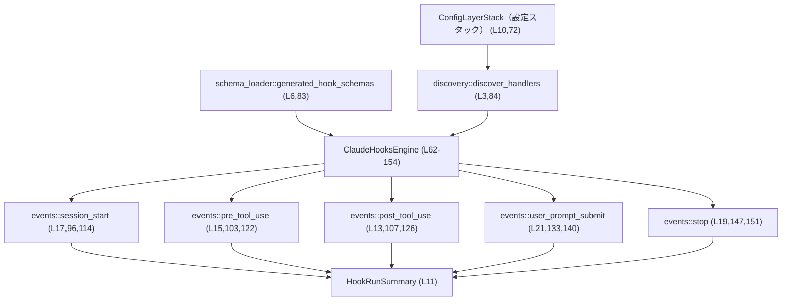
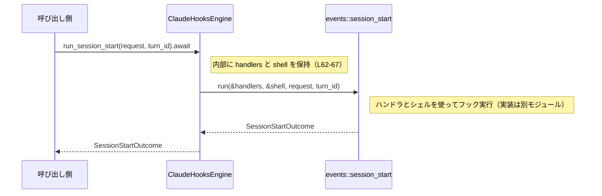

# hooks/src/engine/mod.rs

## 0. ざっくり一言

このモジュールは、設定から発見されたフックハンドラを管理し、各種イベント（セッション開始、ツール実行前後、プロンプト送信、停止）に応じて外部フックをプレビュー・実行するための「フックエンジン」を提供する部分です（`ClaudeHooksEngine`）。  

---

## 1. このモジュールの役割

### 1.1 概要

- このモジュールは **外部フック（おそらくシェルコマンド）をイベント駆動で実行するためのエンジン** を提供します。  
- 設定レイヤーからフック定義を探索して `ConfiguredHandler` として保持し、各イベントごとに `preview_*` / `run_*` API を通してフックの実行または実行予定の一覧を返します（`ClaudeHooksEngine` 定義とメソッド: `hooks/src/engine/mod.rs:L62-154`）。
- 実際のフック実行ロジックは `crate::events::*` モジュールに委譲され、このモジュールは「ハンドラ集合＋実行用シェル＋イベントごとのエントリポイント」をまとめる役割です（`run_*` / `preview_*` がすべて委譲している: `hooks/src/engine/mod.rs:L96-153`）。

### 1.2 アーキテクチャ内での位置づけ

このモジュールは「engine」として、設定・スキーマ・イベント処理モジュールと連携します。

**主なコンポーネント（サブモジュール・外部依存）のインベントリー**

| コンポーネント | 種別 | 役割（コードから分かる範囲） | 定義/利用位置 |
|----------------|------|------------------------------|---------------|
| `command_runner` | サブモジュール | 名前から外部コマンド実行の支援と推測されますが、このチャンクには使用箇所がありません。 | `hooks/src/engine/mod.rs:L1-1` |
| `config` | サブモジュール | フック関連の設定用モジュールと推測されますが詳細は不明です。 | `hooks/src/engine/mod.rs:L2-2` |
| `discovery` | サブモジュール | 設定レイヤーからハンドラを探索し `discover_handlers` を提供（実際に使用） | `hooks/src/engine/mod.rs:L3,84` |
| `dispatcher` | サブモジュール | 名前からハンドラ実行の振り分けロジックと推測されますが、このチャンクには参照がありません。 | `hooks/src/engine/mod.rs:L4-4` |
| `output_parser` | サブモジュール | 名前からフック出力のパースを担当すると推測されますが詳細不明です。 | `hooks/src/engine/mod.rs:L5-5` |
| `schema_loader` | サブモジュール | `generated_hook_schemas` を通じてスキーマをロードする（実際に呼び出しあり） | `hooks/src/engine/mod.rs:L6,83` |
| `ConfigLayerStack` | 外部クレート型 | フック設定を含むレイヤード設定スタック（詳細実装は外部クレート） | `hooks/src/engine/mod.rs:L10,72` |
| `HookRunSummary` | 外部クレート型 | フックの実行結果サマリー（プレビュー結果などに使用） | `hooks/src/engine/mod.rs:L11,96-112,133-148` |
| `crate::events::*` | 他モジュール | 各イベント（session_start, pre_tool_use など）の `preview` / `run` 関数を提供 | `hooks/src/engine/mod.rs:L13-22,96-112,114-153` |

依存関係を図示すると次のようになります。



### 1.3 設計上のポイント

コードから読み取れる特徴を箇条書きにします。

- **フラグによる有効・無効切り替え**  
  `ClaudeHooksEngine::new` で `enabled: bool` を受け取り、`false` のときは設定探索やスキーマ読み込みを行わず、空のハンドラ集合を持つエンジンを返します（`hooks/src/engine/mod.rs:L70-81`）。  
  → フック機能をオーバーヘッド少なく完全にオフにできる設計です。

- **設定に基づくハンドラ探索**  
  `ConfigLayerStack` を `discovery::discover_handlers` に渡し、`handlers` と `warnings` をまとめて取得しています（`hooks/src/engine/mod.rs:L84-89`）。  
  → ハンドラ定義の解釈やバリデーションの詳細は `discovery` 側に集約されています。

- **ハンドラ設定の明示的な構造体**  
  `ConfiguredHandler` がイベント名、マッチャー、コマンド文字列、タイムアウト秒数、ステータスメッセージ、ソースファイルパス、表示順を保持します（`hooks/src/engine/mod.rs:L31-39`）。  
  → フックの「何を・いつ・どこから実行するか」が一つの型にまとまっています。

- **実行用シェルの抽象化**  
  `CommandShell` が `program`（シェル本体）と `args`（既定の引数）を保持します（`hooks/src/engine/mod.rs:L24-28`）。  
  → 実行環境（例: `bash`, `sh`, `powershell` など）を設定で切り替えられる前提の設計です。

- **イベントごとのエントリポイントを薄く保つ**  
  `preview_*` / `run_*` はすべて `crate::events::<event>::preview` / `run` に委譲する薄いラッパーになっています（`hooks/src/engine/mod.rs:L96-112,114-153`）。  
  → このモジュールは「状態保持＋ルーティング」に集中し、実際の実行ロジックはイベントごとのモジュールに分離されています。

- **スレッド安全性・エラー伝搬**  
  - すべての `run_*` は `async fn` であり、非同期実行を想定しています（`hooks/src/engine/mod.rs:L114-120,122-124,126-131,140-145,151-153`）。  
  - `ClaudeHooksEngine` のメソッドはすべて `&self` を受け取るだけで、内部状態の変更は行いません（`hooks/src/engine/mod.rs:L69-153`）。  
  - 戻り値に `Result` を用いず、イベントごとの `Outcome` 型にエラーや失敗情報を含める設計と推測されますが、Outcome の中身はこのチャンクからは分かりません。  

---

## 2. 主要な機能一覧

このモジュールが提供する主な機能を列挙します。

- フック実行シェルの指定 (`CommandShell`)  
- フックハンドラ設定の表現 (`ConfiguredHandler`) と識別子生成 (`run_id`)  
- 設定レイヤーからのフックハンドラ発見とエンジン初期化 (`ClaudeHooksEngine::new`)  
- 既知フック設定に関する警告メッセージの取得 (`ClaudeHooksEngine::warnings`)  
- セッション開始イベントのプレビューと実行 (`preview_session_start`, `run_session_start`)  
- ツール実行前イベントのプレビューと実行 (`preview_pre_tool_use`, `run_pre_tool_use`)  
- ツール実行後イベントのプレビューと実行 (`preview_post_tool_use`, `run_post_tool_use`)  
- ユーザープロンプト送信イベントのプレビューと実行 (`preview_user_prompt_submit`, `run_user_prompt_submit`)  
- セッション停止イベントのプレビューと実行 (`preview_stop`, `run_stop`)  

---

## 3. 公開 API と詳細解説

### 3.1 型一覧（構造体）

このチャンクに定義されている主要な構造体と、その役割・位置を整理します。

| 名前 | 種別 | 役割 / 用途 | 主なフィールド | 定義位置 |
|------|------|-------------|----------------|----------|
| `CommandShell` | 構造体 | フック実行時に利用するシェルプログラムと共通引数を表現します。 | `program: String`, `args: Vec<String>` | `hooks/src/engine/mod.rs:L24-28` |
| `ConfiguredHandler` | 構造体 | 1 つのフックハンドラ定義（どのイベントでどのコマンドをどの条件で実行するか）を保持します。 | `event_name`, `matcher`, `command`, `timeout_sec`, `status_message`, `source_path`, `display_order` | `hooks/src/engine/mod.rs:L31-39` |
| `ClaudeHooksEngine` | 構造体 | 発見済みのフックハンドラ集合と警告、シェル設定を保持し、イベントごとのプレビュー・実行 API を提供するエンジンです。 | `handlers: Vec<ConfiguredHandler>`, `warnings: Vec<String>`, `shell: CommandShell` | `hooks/src/engine/mod.rs:L62-67` |

### 3.2 関数詳細（重要関数）

#### `ConfiguredHandler::run_id(&self) -> String`

**概要**

- フックハンドラの実行単位を識別する文字列 ID を生成します（`hooks/src/engine/mod.rs:L41-49`）。  
- イベント種別ラベル、表示順、ソースファイルパスを `:` で連結した形式です。

**引数**

| 引数名 | 型 | 説明 |
|--------|----|------|
| `&self` | `&ConfiguredHandler` | 対象のフックハンドラインスタンス |

**戻り値**

- `String`  
  `"{event_name_label}:{display_order}:{source_path}"` という形式の文字列です（`hooks/src/engine/mod.rs:L42-48`）。

**内部処理の流れ**

1. `self.event_name_label()` を呼び出し、イベント名の文字列表現（例: `"pre-tool-use"`）を取得します（`hooks/src/engine/mod.rs:L45-51`）。
2. `self.display_order` と `self.source_path.display()` を使い、`format!` で `"{label}:{display_order}:{path}"` 形式の文字列を生成します（`hooks/src/engine/mod.rs:L42-48`）。
3. 生成した `String` を返します。

**Examples（使用例）**

```rust
use std::path::PathBuf;
use codex_protocol::protocol::HookEventName;

// ConfiguredHandler の生成例（他フィールドも最低限埋める）
let handler = ConfiguredHandler {
    event_name: HookEventName::PreToolUse,
    matcher: None,
    command: "echo pre".to_string(),
    timeout_sec: 10,
    status_message: Some("Running pre hook".to_string()),
    source_path: PathBuf::from("/hooks/pre_tool_use.sh"),
    display_order: 1,
};

// 実行IDの生成
let id = handler.run_id();
// id は "pre-tool-use:1:/hooks/pre_tool_use.sh" のような文字列になります
```

※ `HookEventName` の定義はこのチャンクにはありませんが、`event_name_label` の `match` から少なくとも `PreToolUse`, `PostToolUse`, `SessionStart`, `UserPromptSubmit`, `Stop` の 5 つのバリアントが存在することが分かります（`hooks/src/engine/mod.rs:L52-57`）。

**Errors / Panics**

- `Result` や `Option` を使用しておらず、`unwrap` などもありません（`hooks/src/engine/mod.rs:L42-48`）。  
- 一般的な `format!` / `PathBuf::display` の利用のみであり、このレベルで特別なパニック条件は見当たりません（メモリ不足などのランタイムレベルの異常は除きます）。

**Edge cases（エッジケース）**

- `source_path` が相対パスや空パスであっても、`display()` の文字列表現がそのまま使われます。形式上の制限はありません（`hooks/src/engine/mod.rs:L47-48`）。
- `display_order` は `i64` で負の値も取り得ます（`hooks/src/engine/mod.rs:L38`）。負の値の場合もそのまま文字列化されます。

**使用上の注意点**

- `run_id` のフォーマット（`label:order:path`）は固定されています（`hooks/src/engine/mod.rs:L42-48`）。この文字列に依存するログ解析・UI・テストなどが存在する可能性があるため、形式を変更する際は影響範囲の確認が必要です。
- 文字列長は `source_path` の長さに依存するため、非常に長いパスを使うと ID も長くなります。

---

#### `ClaudeHooksEngine::new(enabled: bool, config_layer_stack: Option<&ConfigLayerStack>, shell: CommandShell) -> Self`

**概要**

- フック機能の有効・無効と設定レイヤー、シェル設定に基づき、新しい `ClaudeHooksEngine` を構築します（`hooks/src/engine/mod.rs:L69-90`）。
- `enabled == false` の場合はハンドラ探索をスキップし、空のエンジンを返します。

**引数**

| 引数名 | 型 | 説明 |
|--------|----|------|
| `enabled` | `bool` | フック機能を有効にするかどうか。`false` の場合はハンドラなしのエンジンになります（`hooks/src/engine/mod.rs:L71,75-81`）。 |
| `config_layer_stack` | `Option<&ConfigLayerStack>` | ハンドラ探索に利用する設定スタック。`None` の場合にどう扱うかは `discovery::discover_handlers` 側の実装に依存します（`hooks/src/engine/mod.rs:L72,84`）。 |
| `shell` | `CommandShell` | フック実行時に使用するシェルプログラムと引数設定（`hooks/src/engine/mod.rs:L73,88-89`）。 |

**戻り値**

- `ClaudeHooksEngine`（`Self`）  
  - `enabled == false` の場合: `handlers` と `warnings` が空のインスタンス（`hooks/src/engine/mod.rs:L75-81`）。  
  - `enabled == true` の場合: `discovery::discover_handlers` の結果から `handlers` と `warnings` を取り込んだインスタンス（`hooks/src/engine/mod.rs:L83-89`）。

**内部処理の流れ**

1. `enabled` が `false` なら、`handlers` と `warnings` に空の `Vec` を持つ `ClaudeHooksEngine` を即座に返します（`hooks/src/engine/mod.rs:L75-81`）。
2. `enabled` が `true` の場合、まず `schema_loader::generated_hook_schemas()` を呼び出し、その戻り値は `_`（ダミー変数）に束縛して捨てます（`hooks/src/engine/mod.rs:L83`）。  
   - 戻り値の型や副作用はこのチャンクからは不明ですが、「スキーマの初期化・検証」のような副作用を期待する呼び出しと考えられます。
3. `discovery::discover_handlers(config_layer_stack)` を呼び出し、`discovered` という変数に束縛します（`hooks/src/engine/mod.rs:L84`）。  
   - `discovered.handlers`, `discovered.warnings` の 2 フィールドを参照していることから、探索結果の構造体であることが分かります（`hooks/src/engine/mod.rs:L85-87`）。
4. `handlers`, `warnings`, `shell` をフィールドに持つ `ClaudeHooksEngine` を構築し、返します（`hooks/src/engine/mod.rs:L85-89`）。

**Examples（使用例）**

```rust
use codex_config::ConfigLayerStack;

// シェル設定の構築
let shell = CommandShell {
    program: "bash".to_string(),            // 実行するシェル（例）
    args: vec!["-c".to_string()],           // 共通の引数（例）
};

// 設定スタック（詳細はこのチャンクにはありません）
let config_stack: ConfigLayerStack = /* アプリ側で構築 */;

// フック機能を有効にしてエンジンを作成
let engine = ClaudeHooksEngine::new(true, Some(&config_stack), shell.clone());

// フック機能を完全に無効化したエンジン
let disabled_engine = ClaudeHooksEngine::new(false, Some(&config_stack), shell);
assert!(disabled_engine.warnings().is_empty());
```

**Errors / Panics**

- このコンストラクタ自体は `Result` を返しておらず、`unwrap` 等も使っていません（`hooks/src/engine/mod.rs:L69-90`）。  
- `discovery::discover_handlers` や `schema_loader::generated_hook_schemas` が内部でパニックやエラーを起こす可能性については、このチャンクからは判断できません。

**Edge cases（エッジケース）**

- `enabled == false` の場合、`config_layer_stack` の値に関わらず `discovery` と `schema_loader` は呼ばれません（`hooks/src/engine/mod.rs:L75-81`）。  
- `config_layer_stack == None` の場合の挙動は `discovery::discover_handlers` の実装次第です（`hooks/src/engine/mod.rs:L72,84`）。このチャンクにはその詳細はありません。
- `shell` がどのようなプログラムを指していてもこの関数レベルではチェックされません。妥当性は呼び出し側または後段のモジュールに委ねられています。

**使用上の注意点**

- フック機能を完全に無効化したい場合は `enabled` を `false` にするのが最も簡単で、設定構築やディスカバリ処理によるコストも避けられます。  
- `ClaudeHooksEngine` は生成時にハンドラ集合を固定し、その後は変更しません（`handlers` フィールドはプライベートで、ミューテータは存在しません: `hooks/src/engine/mod.rs:L62-67,69-153`）。設定変更を反映するには、新しいエンジンを作り直す設計です。

---

#### `ClaudeHooksEngine::run_session_start(&self, request: SessionStartRequest, turn_id: Option<String>) -> SessionStartOutcome`

```rust
pub(crate) async fn run_session_start(
    &self,
    request: SessionStartRequest,
    turn_id: Option<String>,
) -> SessionStartOutcome {
    crate::events::session_start::run(&self.handlers, &self.shell, request, turn_id).await
}
```

（`hooks/src/engine/mod.rs:L114-120`）

**概要**

- セッション開始イベントに対して、登録済みフックを実行する非同期関数です。  
- ハンドラ集合とシェル設定を `crate::events::session_start::run` に渡し、その結果である `SessionStartOutcome` を返します。

**引数**

| 引数名 | 型 | 説明 |
|--------|----|------|
| `&self` | `&ClaudeHooksEngine` | 登録済みハンドラとシェル設定を持つエンジン。 |
| `request` | `SessionStartRequest` | セッション開始イベントに関する情報。構造はこのチャンクにはありませんが、イベントモジュールからインポートされています（`hooks/src/engine/mod.rs:L17-18`）。 |
| `turn_id` | `Option<String>` | 追加の ID などを渡すためのオプション値。`None` の場合の扱いはイベントモジュール側の実装に依存します。 |

**戻り値**

- `SessionStartOutcome`  
  セッション開始フックの実行結果を表す型です（`hooks/src/engine/mod.rs:L17,114-120`）。  
  内容（成功／失敗の詳細など）はこのチャンクからは分かりません。

**内部処理の流れ**

1. `crate::events::session_start::run` を呼び出し、`&self.handlers`, `&self.shell`, `request`, `turn_id` を引数として渡します（`hooks/src/engine/mod.rs:L119`）。
2. 非同期関数を `.await` して結果の `SessionStartOutcome` を受け取ります（`hooks/src/engine/mod.rs:L119-120`）。
3. 受け取った `SessionStartOutcome` をそのまま呼び出し元に返します。

**Examples（使用例）**

```rust
use crate::events::session_start::SessionStartRequest;
// ClaudeHooksEngine / CommandShell の import はクレート構成に依存します（このチャンクからは不明）。

async fn start_session(engine: &ClaudeHooksEngine, req: SessionStartRequest) {
    // turn_id なしで実行
    let outcome = engine.run_session_start(req, None).await;

    // outcome の詳細な扱いは SessionStartOutcome の仕様によります
    // println!("{:?}", outcome);
}
```

**Errors / Panics**

- この関数自体は `Result` 型を返さず、エラー情報は `SessionStartOutcome` にカプセル化されていると考えられます（`hooks/src/engine/mod.rs:L114-120`）。  
- `unwrap` 等による明示的なパニックはありません。  
- 実際のコマンド実行やエラー処理は `session_start::run` 側で行われるため、この関数のエラー振る舞いを理解するにはそちらの実装を確認する必要があります。

**Edge cases（エッジケース）**

- `self.handlers` が空のときの挙動（フックを 1 つも実行しないか、何らかのデフォルト動作があるか）は、このチャンクからは分かりません（`hooks/src/engine/mod.rs:L63-66,119`）。  
- `turn_id == None` の場合の扱いも `session_start::run` の実装に依存しており、このチャンクには現れません。

**使用上の注意点**

- `async fn` であるため、Tokio や async-std などの非同期ランタイム上で `.await` する必要があります（`hooks/src/engine/mod.rs:L114`）。  
- `request` は値として消費されるため、同じ `SessionStartRequest` を複数回使い回す場合はクローンなどが必要です（`Clone` 実装の有無はこのチャンクからは不明です）。

---

#### `ClaudeHooksEngine::run_pre_tool_use(&self, request: PreToolUseRequest) -> PreToolUseOutcome`

```rust
pub(crate) async fn run_pre_tool_use(&self, request: PreToolUseRequest) -> PreToolUseOutcome {
    crate::events::pre_tool_use::run(&self.handlers, &self.shell, request).await
}
```

（`hooks/src/engine/mod.rs:L122-124`）

**概要**

- ツール実行前イベントに関連するフックを実行する非同期関数です。  
- ハンドラ集合とシェル設定を `pre_tool_use::run` に渡して結果を受け取ります。

**引数**

| 引数名 | 型 | 説明 |
|--------|----|------|
| `&self` | `&ClaudeHooksEngine` | フックハンドラとシェル設定を保持するエンジン。 |
| `request` | `PreToolUseRequest` | ツール実行前イベントに関する情報（詳細はこのチャンクにはありませんが `hooks/src/engine/mod.rs:L15,103,122` で使用されています）。 |

**戻り値**

- `PreToolUseOutcome`  
  ツール実行前フックの実行結果を表します（`hooks/src/engine/mod.rs:L15,122-124`）。

**内部処理の流れ**

1. `crate::events::pre_tool_use::run(&self.handlers, &self.shell, request)` を呼び出します（`hooks/src/engine/mod.rs:L123`）。
2. `.await` して `PreToolUseOutcome` を受け取り、そのまま返します（`hooks/src/engine/mod.rs:L123-124`）。

**Examples（使用例）**

```rust
use crate::events::pre_tool_use::PreToolUseRequest;

async fn before_tool(engine: &ClaudeHooksEngine, req: PreToolUseRequest) {
    let outcome = engine.run_pre_tool_use(req).await;
    // outcome を見てツール実行を続行するかキャンセルするかなどを判断する設計が想定されますが、
    // 具体的な字段はこのチャンクにはありません。
}
```

**Errors / Panics**

- この関数自体は `Result` を返さず、エラーは `PreToolUseOutcome` に含まれる設計と考えられます（`hooks/src/engine/mod.rs:L122-124`）。
- 明示的なパニック操作はありません。

**Edge cases**

- ハンドラが存在しない場合や、request に特定のフィールドが欠けている場合の挙動は `pre_tool_use::run` に依存し、このチャンクからは分かりません。

**使用上の注意点**

- 非同期関数であり、`.await` が必須です。  
- ツール実行前の制御フロー（例えば「フックがエラーを返したらツールを止める」など）はアプリケーション側で `PreToolUseOutcome` を解釈して実装する必要があります。

---

#### `ClaudeHooksEngine::run_post_tool_use(&self, request: PostToolUseRequest) -> PostToolUseOutcome`

```rust
pub(crate) async fn run_post_tool_use(
    &self,
    request: PostToolUseRequest,
) -> PostToolUseOutcome {
    crate::events::post_tool_use::run(&self.handlers, &self.shell, request).await
}
```

（`hooks/src/engine/mod.rs:L126-131`）

**概要**

- ツール実行後に関連するフックを非同期に実行します。  
- ツールの結果を加工したり、ログ送信などを行うフックがここにぶら下がる想定です（実際のロジックは `post_tool_use::run` 側）。

**引数**

| 引数名 | 型 | 説明 |
|--------|----|------|
| `&self` | `&ClaudeHooksEngine` | エンジンインスタンス。 |
| `request` | `PostToolUseRequest` | ツール実行後の情報を含むリクエスト（`hooks/src/engine/mod.rs:L13,108,126`）。 |

**戻り値**

- `PostToolUseOutcome`  
  実行したフックの結果をまとめた型（詳細不明）。

**内部処理の流れ**

1. `crate::events::post_tool_use::run(&self.handlers, &self.shell, request)` を呼び出します（`hooks/src/engine/mod.rs:L130`）。
2. `.await` して `PostToolUseOutcome` をそのまま返します（`hooks/src/engine/mod.rs:L130-131`）。

**Examples（使用例）**

```rust
use crate::events::post_tool_use::PostToolUseRequest;

async fn after_tool(engine: &ClaudeHooksEngine, req: PostToolUseRequest) {
    let outcome = engine.run_post_tool_use(req).await;
    // outcome に基づき、ユーザーへのメッセージ表示などを行うといった使い方が想定されます。
}
```

**Errors / Panics / Edge cases**

- `run_pre_tool_use` と同様、この関数自体は `Result` を返さず、エラーは `PostToolUseOutcome` に閉じ込められます（`hooks/src/engine/mod.rs:L126-131`）。  
- ハンドラが空の場合や、request が特定の条件を満たさない場合の挙動は不明です。

**使用上の注意点**

- 非同期コンテキストから呼び出す必要があります。  
- ツールの結果を外部システムに送信するようなフックを想定すると、ここでのフック実行は時間やネットワーク I/O を伴う可能性があります（ただし、その実装はこのチャンクにはありません）。

---

#### `ClaudeHooksEngine::run_user_prompt_submit(&self, request: UserPromptSubmitRequest) -> UserPromptSubmitOutcome`

```rust
pub(crate) async fn run_user_prompt_submit(
    &self,
    request: UserPromptSubmitRequest,
) -> UserPromptSubmitOutcome {
    crate::events::user_prompt_submit::run(&self.handlers, &self.shell, request).await
}
```

（`hooks/src/engine/mod.rs:L140-145`）

**概要**

- ユーザーがプロンプトを送信したタイミングでフックを実行する非同期関数です。  
- 入力の検査やログ記録等に利用されることが多いタイミングですが、具体的な用途はこのチャンクからは分かりません。

**引数**

| 引数名 | 型 | 説明 |
|--------|----|------|
| `&self` | `&ClaudeHooksEngine` | エンジン。 |
| `request` | `UserPromptSubmitRequest` | ユーザープロンプト送信イベントの情報（`hooks/src/engine/mod.rs:L21,133,140`）。 |

**戻り値**

- `UserPromptSubmitOutcome`  
  プロンプト送信フックの結果。詳細なフィールドはこのチャンクにはありません。

**内部処理の流れ**

1. `crate::events::user_prompt_submit::run(&self.handlers, &self.shell, request)` を呼び出します（`hooks/src/engine/mod.rs:L144`）。
2. `.await` して `UserPromptSubmitOutcome` を返します（`hooks/src/engine/mod.rs:L144-145`）。

**Examples（使用例）**

```rust
use crate::events::user_prompt_submit::UserPromptSubmitRequest;

async fn on_prompt(engine: &ClaudeHooksEngine, req: UserPromptSubmitRequest) {
    let outcome = engine.run_user_prompt_submit(req).await;
    // outcome をチェックして、プロンプトの拒否・書き換えなどを行う設計も考えられますが、
    // 具体的な仕様は Outcome 型次第です。
}
```

**Errors / Panics / Edge cases**

- 他の `run_*` と同様、エラー情報は Outcome 型にカプセル化されていると考えられます（`hooks/src/engine/mod.rs:L140-145`）。  
- この関数の中でパニックを起こしうる操作は見当たりません。

**使用上の注意点**

- ユーザー入力に直接関わるフックである可能性が高く、設定に基づいて任意コマンドを実行する場合、セキュリティ上のリスクが高くなりがちです。  
  - このモジュール自体はコマンドを直接実行していませんが、`ConfiguredHandler.command` フィールド（`hooks/src/engine/mod.rs:L34`）を含むハンドラを `events::user_prompt_submit::run` に渡しているためです。  
  - 実際の防御策・サニタイズは `events` や下位モジュールの実装依存であり、このチャンクからは確認できません。

---

#### `ClaudeHooksEngine::run_stop(&self, request: StopRequest) -> StopOutcome`

```rust
pub(crate) async fn run_stop(&self, request: StopRequest) -> StopOutcome {
    crate::events::stop::run(&self.handlers, &self.shell, request).await
}
```

（`hooks/src/engine/mod.rs:L151-153`）

**概要**

- セッション停止イベントに対してフックを実行する非同期関数です。  
- セッション終了時のクリーンアップやログ送信などに対応すると考えられます。

**引数**

| 引数名 | 型 | 説明 |
|--------|----|------|
| `&self` | `&ClaudeHooksEngine` | エンジン。 |
| `request` | `StopRequest` | 停止イベントの情報（`hooks/src/engine/mod.rs:L19,147,151`）。 |

**戻り値**

- `StopOutcome`  
  停止イベント向けフックの結果（`hooks/src/engine/mod.rs:L19,151-153`）。

**内部処理の流れ**

1. `crate::events::stop::run(&self.handlers, &self.shell, request)` を呼び出します（`hooks/src/engine/mod.rs:L152`）。
2. `.await` して `StopOutcome` を返します（`hooks/src/engine/mod.rs:L152-153`）。

**Examples（使用例）**

```rust
use crate::events::stop::StopRequest;

async fn on_stop(engine: &ClaudeHooksEngine, req: StopRequest) {
    let outcome = engine.run_stop(req).await;
    // outcome に応じて後処理を行うなど
}
```

**Errors / Panics / Edge cases**

- パターンは他の `run_*` と同様で、この関数自体はエラー型を返さず、内部処理は `stop::run` に委譲されています（`hooks/src/engine/mod.rs:L151-153`）。

**使用上の注意点**

- セッション終了時の処理であるため、このフックでの失敗をどう扱うか（無視する / ユーザーに報告する / ログのみなど）はアプリケーション設計次第です。  
- 実行に時間がかかるフックがあると、停止処理全体を遅らせる可能性があります。

---

### 3.3 その他の関数

このチャンクに定義されている他のメソッドを一覧にします。

| 関数名 | シグネチャ | 役割（1 行） | 定義位置 |
|--------|------------|--------------|----------|
| `ConfiguredHandler::event_name_label` | `fn event_name_label(&self) -> &'static str` | `HookEventName` を、人間向けの短いラベル文字列（例: `"pre-tool-use"`）に変換します。 | `hooks/src/engine/mod.rs:L51-59` |
| `ClaudeHooksEngine::warnings` | `fn warnings(&self) -> &[String]` | ハンドラ発見時に `discovery` から収集された警告メッセージ一覧をスライスで返します。 | `hooks/src/engine/mod.rs:L92-94` |
| `ClaudeHooksEngine::preview_session_start` | `fn preview_session_start(&self, request: &SessionStartRequest) -> Vec<HookRunSummary>` | セッション開始イベントで「実行される可能性のあるフック」のサマリーを返します。 | `hooks/src/engine/mod.rs:L96-101` |
| `ClaudeHooksEngine::preview_pre_tool_use` | `fn preview_pre_tool_use(&self, request: &PreToolUseRequest) -> Vec<HookRunSummary>` | ツール実行前イベントのフック実行プレビュー。 | `hooks/src/engine/mod.rs:L103-105` |
| `ClaudeHooksEngine::preview_post_tool_use` | `fn preview_post_tool_use(&self, request: &PostToolUseRequest) -> Vec<HookRunSummary>` | ツール実行後イベントのフック実行プレビュー。 | `hooks/src/engine/mod.rs:L107-112` |
| `ClaudeHooksEngine::preview_user_prompt_submit` | `fn preview_user_prompt_submit(&self, request: &UserPromptSubmitRequest) -> Vec<HookRunSummary>` | プロンプト送信イベントのフック実行プレビュー。 | `hooks/src/engine/mod.rs:L133-138` |
| `ClaudeHooksEngine::preview_stop` | `fn preview_stop(&self, request: &StopRequest) -> Vec<HookRunSummary>` | 停止イベントのフック実行プレビュー。 | `hooks/src/engine/mod.rs:L147-149` |

これら `preview_*` はいずれも `crate::events::<event>::preview` に処理を委譲するだけの薄いラッパーです（`hooks/src/engine/mod.rs:L96-101,103-105,107-112,133-138,147-149`）。

---

## 4. データフロー

代表的な処理として「セッション開始フックの実行」を例に、データがどのように流れるかを説明します。

1. 呼び出し側が `SessionStartRequest` と任意の `turn_id` を用意し、`ClaudeHooksEngine::run_session_start` を `await` します（`hooks/src/engine/mod.rs:L114-120`）。
2. `ClaudeHooksEngine` は内部に保持している `handlers: Vec<ConfiguredHandler>` と `shell: CommandShell` を参照として取り出し、それらと `request`, `turn_id` を `crate::events::session_start::run` に渡します（`hooks/src/engine/mod.rs:L63-66,119`）。
3. `session_start::run` は、受け取ったハンドラとシェル設定に従ってフックを実行し、`SessionStartOutcome` を返します（実装はこのチャンクにはありません）。
4. `ClaudeHooksEngine::run_session_start` はこの `SessionStartOutcome` をそのまま呼び出し元に返します（`hooks/src/engine/mod.rs:L119-120`）。

これをシーケンス図で表すと次のようになります。



`preview_*` 系の関数も同様のパターンで、`handlers` と `request`（および場合によっては他のコンテキスト）をイベントモジュールの `preview` 関数に渡し、`Vec<HookRunSummary>` を受け取って返しています（`hooks/src/engine/mod.rs:L96-101,103-105,107-112,133-138,147-149`）。

---

## 5. 使い方（How to Use）

### 5.1 基本的な使用方法

ここでは、同一クレート内からフックエンジンを作成し、セッション開始フックを実行するまでの流れの例を示します。

```rust
use codex_config::ConfigLayerStack;
use crate::engine::ClaudeHooksEngine;           // 実際のパスはクレート構成によります
use crate::engine::CommandShell;
use crate::events::session_start::SessionStartRequest;

#[tokio::main] // Tokio ランタイムを使う例
async fn main() {
    // 1. シェル設定を用意する（L24-28）
    let shell = CommandShell {
        program: "bash".to_string(),
        args: vec!["-c".to_string()],
    };

    // 2. 設定スタックを構築（詳細はこのチャンクにはない）
    let config_stack: ConfigLayerStack = /* アプリケーション固有の構築処理 */;

    // 3. エンジンを生成（L69-90）
    let engine = ClaudeHooksEngine::new(
        true,                   // hooks を有効化
        Some(&config_stack),
        shell,
    );

    // 4. セッション開始リクエストを作る（構造は events モジュール側）
    let request: SessionStartRequest = /* 必要なフィールドを設定 */;

    // 5. フックを実行（L114-120）
    let outcome = engine.run_session_start(request, None).await;

    // 6. outcome を確認してアプリケーション側の処理を続行
    // println!("{:?}", outcome);
}
```

ポイント:

- `ClaudeHooksEngine` は `enabled` フラグと `ConfigLayerStack`、`CommandShell` を引数に `new` で構築します（`hooks/src/engine/mod.rs:L70-74`）。
- 実行系のメソッド（`run_*`）はすべて `async fn` なので、非同期コンテキストから `.await` する必要があります（`hooks/src/engine/mod.rs:L114,122,126,140,151`）。

### 5.2 よくある使用パターン

1. **事前プレビューと実行の組み合わせ**

   プレビューで「どのフックが実行されるか」をユーザーに表示し、その上で実行するパターンです。

   ```rust
   use crate::events::pre_tool_use::PreToolUseRequest;

   async fn run_with_preview(engine: &ClaudeHooksEngine, req: PreToolUseRequest) {
       // まず実行予定のフック一覧を取得（L103-105）
       let previews = engine.preview_pre_tool_use(&req);
       // previews: Vec<HookRunSummary> を UI に表示するなど

       // ユーザー承認後に実際のフックを実行（L122-124）
       let outcome = engine.run_pre_tool_use(req).await;
       // outcome を確認して必要な処理を行う
   }
   ```

2. **フック機能の一括無効化**

   テスト時やセーフモードではフックを全て無効化したい場合があります。その場合は `enabled = false` でエンジンを生成します（`hooks/src/engine/mod.rs:L75-81`）。

   ```rust
   let engine = ClaudeHooksEngine::new(
       false,          // 無効化
       None,           // 設定スタックも不要になるケース
       shell,
   );
   // preview/run を呼んでも、handlers が空のため後段で何も実行されない実装が想定されますが、
   // 正確な挙動は events モジュール側の実装を確認する必要があります。
   ```

### 5.3 よくある間違い

以下は起こり得る誤用例とその修正例です。

```rust
// 間違い例: 非同期コンテキスト外で .await を使用しようとしている
fn bad() {
    let engine = /* ... */;
    let request = /* SessionStartRequest ... */;
    // let outcome = engine.run_session_start(request, None).await; // コンパイルエラー
}

// 正しい例: async fn の中、または Tokio などのランタイム上で .await する
#[tokio::main]
async fn good() {
    let engine = /* ClaudeHooksEngine を new で構築 */;
    let request = /* SessionStartRequest ... */;
    let outcome = engine.run_session_start(request, None).await;
}
```

```rust
// 間違い例: hooks を有効にしたつもりが enabled = false になっている
let shell = /* ... */;
let config_stack = /* ... */;

// enabled = false のため、handlers は常に空
let engine = ClaudeHooksEngine::new(false, Some(&config_stack), shell);

// 正しい例: hooks を実際に有効にする
let engine = ClaudeHooksEngine::new(true, Some(&config_stack), shell);
```

### 5.4 使用上の注意点（まとめ）

- **非同期実行**  
  すべての `run_*` メソッドは `async fn` であり、非同期ランタイム上で `.await` する必要があります（`hooks/src/engine/mod.rs:L114,122,126,140,151`）。同期コンテキストから直接呼ぶことはできません。

- **状態の不変性**  
  `ClaudeHooksEngine` の API はすべて `&self` であり、内部の `handlers` や `warnings` を変更するメソッドはありません（`hooks/src/engine/mod.rs:L69-153`）。  
  エンジン生成後に設定を変更しても、既存エンジンには反映されないため、必要に応じて再生成する必要があります。

- **セキュリティ上の注意**  
  - `ConfiguredHandler` に `command: String` フィールドがあること（`hooks/src/engine/mod.rs:L34`）、および `CommandShell` がシェルプログラムを表すこと（`hooks/src/engine/mod.rs:L24-28`）から、外部コマンド実行が関与していると考えられます。  
  - このモジュール自体はコマンド実行を行っていませんが、信頼できない入力からフック設定が生成される場合、コマンドインジェクションなどのリスクが生じます。実際の対策状況は下位モジュールの実装依存です。

- **エラー処理**  
  このモジュールのメソッドは `Result` を返さず、Outcome 型や `HookRunSummary` にエラー情報をカプセル化する設計です（`hooks/src/engine/mod.rs:L96-112,114-153`）。  
  そのため、エラーの有無・詳細を確認するには各 Outcome 型の仕様を把握しておく必要があります。

---

## 6. 変更の仕方（How to Modify）

### 6.1 新しい機能を追加する場合

1. **新しいイベント種別を追加する場合**

   例: 新しい `HookEventName::Something` が追加されたとき。

   - `ConfiguredHandler::event_name_label` に新しいイベント名に対応するラベルを追加する必要があります（`hooks/src/engine/mod.rs:L51-58`）。  

     ```rust
     fn event_name_label(&self) -> &'static str {
         match self.event_name {
             // 既存ケース...
             codex_protocol::protocol::HookEventName::Stop => "stop",
             codex_protocol::protocol::HookEventName::Something => "something", // 追加
         }
     }
     ```

   - 対応するイベントモジュール（例: `crate::events::something`）に `preview` / `run` を用意し、このエンジンに `preview_something` / `run_something` メソッドを追加します。  
     既存の `preview_*` / `run_*` メソッドを参考に、`&self.handlers` と `&self.shell` を渡す形に揃えると一貫した設計になります（`hooks/src/engine/mod.rs:L96-112,114-153`）。

2. **ハンドラ設定項目を追加する場合**

   - 新しいフィールドを `ConfiguredHandler` に追加します（`hooks/src/engine/mod.rs:L31-39`）。  
   - そのフィールドを利用する下位モジュール（おそらく `discovery`, `dispatcher`, `command_runner` など）を合わせて変更する必要があります。  
   - `run_id` のフォーマットに新フィールドを組み込むかどうかも検討する必要があります（`hooks/src/engine/mod.rs:L42-48`）。

### 6.2 既存の機能を変更する場合

- **ハンドラ識別子形式（`run_id`）を変更する場合**

  - 現状、`"{event_label}:{display_order}:{source_path}"` という形式で生成されています（`hooks/src/engine/mod.rs:L42-48`）。  
  - この形式に依存するログ解析や UI が存在する可能性があるため、変更時には呼び出し側を検索し、影響範囲を確認する必要があります。

- **`new` の挙動を変更する場合**

  - `enabled == false` の場合に `discovery` や `schema_loader` を呼ぶかどうか、`config_layer_stack == None` の扱いなどを変更すると、起動時のコストや警告メッセージの有無が変わります（`hooks/src/engine/mod.rs:L70-90`）。  
  - 特に、`schema_loader::generated_hook_schemas()` の呼び出し有無はスキーマ検証のタイミングに影響する可能性があります。

- **イベントの実行フローを変えたい場合**

  - このモジュールはイベントごとの実行を完全に `crate::events::*::run` に委譲しているため（`hooks/src/engine/mod.rs:L114-120,122-124,126-131,140-145,151-153`）、実際のフロー変更は `events` モジュール側で行うのが自然です。  
  - ここで変更するのは、例えば特定イベントの実行前後に共通処理を挟みたいときなど、「全イベントに共通するメタロジック」を追加したい場合になります。

---

## 7. 関連ファイル

このモジュールと密接に関係するファイル・モジュールを整理します。

| パス / モジュール | 役割 / 関係 |
|-------------------|------------|
| `hooks/src/engine/command_runner.rs` | `mod command_runner;` として宣言されており（`hooks/src/engine/mod.rs:L1`）、名前から外部コマンド実行のラッパーであると推測できますが、このチャンクには使用箇所がありません。 |
| `hooks/src/engine/config.rs` | フック設定に関する構造体や読み込みロジックを持つと推測されますが、詳細はこのチャンクからは分かりません（`hooks/src/engine/mod.rs:L2`）。 |
| `hooks/src/engine/discovery.rs` | `discover_handlers` を提供し、`ConfigLayerStack` から `handlers` と `warnings` を生成します（`hooks/src/engine/mod.rs:L3,84-87`）。 |
| `hooks/src/engine/dispatcher.rs` | ハンドラの実行順序制御やフィルタリング等を担当すると推測されますが、このチャンクには直接の呼び出しはありません（`hooks/src/engine/mod.rs:L4`）。 |
| `hooks/src/engine/output_parser.rs` | フックの標準出力・標準エラーなどを解析するユーティリティの可能性がありますが、詳細は不明です（`hooks/src/engine/mod.rs:L5`）。 |
| `hooks/src/engine/schema_loader.rs` | `generated_hook_schemas()` を通じてフックスキーマをロード／生成するモジュールであり、`ClaudeHooksEngine::new` の開始時に呼び出されています（`hooks/src/engine/mod.rs:L6,83`）。 |
| `crate::events::session_start` | `SessionStartRequest` / `SessionStartOutcome` 型と、`preview` / `run` 関数を提供し、セッション開始イベントのフック処理の本体を担当します（`hooks/src/engine/mod.rs:L17-18,96-101,114-120`）。 |
| `crate::events::pre_tool_use` | ツール実行前フック処理を担当するモジュールです（`hooks/src/engine/mod.rs:L15-16,103-105,122-124`）。 |
| `crate::events::post_tool_use` | ツール実行後フック処理を担当するモジュールです（`hooks/src/engine/mod.rs:L13-14,107-112,126-131`）。 |
| `crate::events::user_prompt_submit` | プロンプト送信時のフック処理を担当するモジュールです（`hooks/src/engine/mod.rs:L21-22,133-138,140-145`）。 |
| `crate::events::stop` | セッション停止時のフック処理を担当するモジュールです（`hooks/src/engine/mod.rs:L19-20,147-149,151-153`）。 |

このファイル自体にはテストコード（`mod tests` など）は含まれておらず、テストの所在はこのチャンクからは分かりません。
