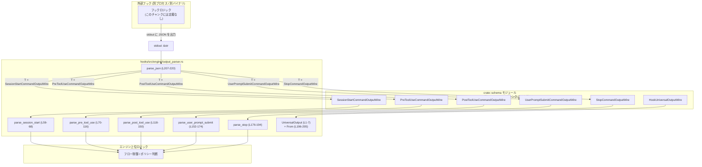
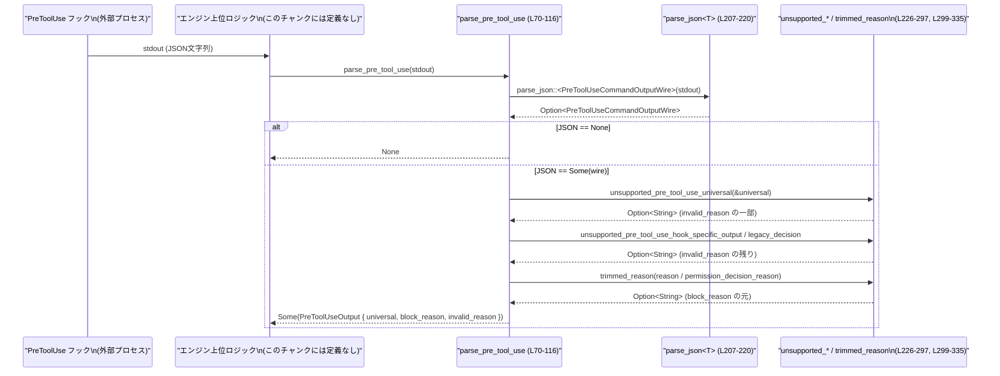

# hooks/src/engine/output_parser.rs コード解説

## 0. ざっくり一言

外部フックプロセスが標準出力に書き出した JSON をパースし、各イベント（セッション開始・ツール実行前後・ユーザープロンプト送信・停止）ごとの内部用構造体に変換しつつ、仕様に違反した出力を検出してフラグ付けするモジュールです（`output_parser.rs` 全体）。

---

## 1. このモジュールの役割

### 1.1 概要

- このモジュールは、フックの標準出力（文字列）から `crate::schema` で定義された `*CommandOutputWire` 型へ JSON デシリアライズし、その後このファイル内の `*Output` 型へ変換する役割を持ちます（`parse_*` 群, `parse_json` / `output_parser.rs:L59-220`）。
- 同時に、サポートしていないフィールドや不整合な組み合わせ（理由なしの block など）を検出し、`invalid_reason` や `invalid_block_reason` として文字列メッセージで返します（`output_parser.rs:L85-91, L121-137, L155-163, L179-187, L226-236, L238-243, L246-297, L299-321`）。
- これにより、上位のエンジンは「フックの意図した決定（block など）」と「その出力が仕様上妥当かどうか」を分けて判断できます。

### 1.2 アーキテクチャ内での位置づけ

このファイルは、「フックの線形化された JSON 出力」と「エンジン内部で扱いやすい構造体」の間の変換とバリデーションを担当します。



※ `crate::schema` や「エンジン上位ロジック」の実体（ファイルパスや詳細な型定義）はこのチャンクには現れません。

### 1.3 設計上のポイント

- **共通部分の抽象化**  
  全てのフック出力に共通するフィールド（`continue_processing`, `stop_reason`, `suppress_output`, `system_message`）は `UniversalOutput` にまとめられています（`output_parser.rs:L1-7, L196-205`）。

- **イベント別の薄いラッパー構造体**  
  各イベントごとに専用の `*Output` 構造体を持ち、`UniversalOutput` に加えて、そのイベント固有のフラグや追加コンテキストのみを保持する構成です（`SessionStartOutput` 〜 `StopOutput` / `output_parser.rs:L9-47`）。

- **バリデーションとビジネスロジックの分離**  
  フック出力の妥当性チェックは主に `unsupported_*` 系関数で行われ、`parse_*` 関数はその結果を使用して `invalid_reason` / `invalid_block_reason` と `should_block` などの最終値を組み立てています（`output_parser.rs:L85-91, L121-137, L155-163, L179-187, L226-236, L238-243, L246-297, L299-321`）。

- **エラー処理方針**  
  JSON パースやバリデーション失敗は `Option` と `invalid_*` 文字列で表現され、パニックや `Result` は使用していません（`parse_json` / `output_parser.rs:L207-220`）。  
  - JSON と構造体の不整合 → `None` を返す（呼び出し側が「フック出力なし」と等価に扱える）。
  - 仕様違反だが JSON としてはパースできる → `Some` を返しつつ `invalid_reason` / `invalid_block_reason` に説明を格納。

- **スレッド安全性**  
  このファイルにはグローバル状態や `unsafe` ブロックは存在せず、全ての関数は引数に基づいて新しい値を返すだけの純粋関数です（`output_parser.rs` 全体）。

---

## 2. 主要な機能一覧

このモジュールが提供する主な機能は次の通りです。

- フック標準出力 JSON のパース（`parse_json` / `output_parser.rs:L207-220`）。
- セッション開始フック出力の変換（`parse_session_start` → `SessionStartOutput` / `output_parser.rs:L59-68`）。
- ツール実行前フック出力の変換と詳細なバリデーション（`parse_pre_tool_use` → `PreToolUseOutput` / `output_parser.rs:L70-116`）。
- ツール実行後フック出力の変換とブロック判定（`parse_post_tool_use` → `PostToolUseOutput` / `output_parser.rs:L118-150`）。
- ユーザープロンプト送信フック出力の変換（`parse_user_prompt_submit` → `UserPromptSubmitOutput` / `output_parser.rs:L152-174`）。
- セッション停止フック出力の変換（`parse_stop` → `StopOutput` / `output_parser.rs:L176-194`）。
- サポートしていないフィールド・決定の検出（`unsupported_*` 系関数 / `output_parser.rs:L226-297, L299-321`）。
- 理由文字列の前後空白除去と空文字チェック（`trimmed_reason` / `output_parser.rs:L329-335`）。

### 2.1 コンポーネント一覧（構造体・関数）

#### 構造体

| 名前 | 役割 / 用途 | 行番号 |
|------|------------|--------|
| `UniversalOutput` | 全イベント共通のフック出力（`continue_processing`, `stop_reason`, `suppress_output`, `system_message`）をまとめた構造体 | `output_parser.rs:L1-7` |
| `SessionStartOutput` | セッション開始フックの出力。`UniversalOutput` と追加コンテキスト文字列を保持 | `output_parser.rs:L9-13` |
| `PreToolUseOutput` | ツール実行前フックの出力。`UniversalOutput` に加え、ブロック理由と無効理由を保持 | `output_parser.rs:L15-20` |
| `PostToolUseOutput` | ツール実行後フックの出力。ブロック有無、理由、追加コンテキスト、無効理由などを含む | `output_parser.rs:L22-30` |
| `UserPromptSubmitOutput` | ユーザープロンプト送信フックの出力。ブロック有無と理由、追加コンテキストを保持 | `output_parser.rs:L32-39` |
| `StopOutput` | セッション停止フックの出力。ブロック有無と理由を保持 | `output_parser.rs:L41-47` |

#### 関数・impl

| 名前 | 種別 | 役割 / 用途 | 行番号 |
|------|------|-------------|--------|
| `parse_session_start` | 関数 | セッション開始フックの JSON 出力を `SessionStartCommandOutputWire` 経由で `SessionStartOutput` に変換 | `output_parser.rs:L59-68` |
| `parse_pre_tool_use` | 関数 | ツール実行前フックの JSON 出力をパースし、旧 API / 新 API 双方に対応しつつ `PreToolUseOutput` に変換 | `output_parser.rs:L70-116` |
| `parse_post_tool_use` | 関数 | ツール実行後フックの JSON 出力をパースし、ブロック判定や無効理由を組み立てて `PostToolUseOutput` に変換 | `output_parser.rs:L118-150` |
| `parse_user_prompt_submit` | 関数 | ユーザープロンプト送信フックの JSON 出力をパースし、`UserPromptSubmitOutput` に変換 | `output_parser.rs:L152-174` |
| `parse_stop` | 関数 | セッション停止フックの JSON 出力をパースし、`StopOutput` に変換 | `output_parser.rs:L176-194` |
| `impl From<HookUniversalOutputWire> for UniversalOutput` | impl | `schema` レイヤのユニバーサル出力を `UniversalOutput` にマッピング | `output_parser.rs:L196-205` |
| `parse_json` | 関数 | `stdout` 文字列を汎用的に JSON → 任意の `T: Deserialize` に変換。空文字や非オブジェクト JSON は `None` | `output_parser.rs:L207-220` |
| `invalid_block_message` | 関数 | 「decision:block だが理由がない」ケースのエラーメッセージ文字列生成 | `output_parser.rs:L222-224` |
| `unsupported_pre_tool_use_universal` | 関数 | PreToolUse イベントで許可されない `UniversalOutput` の組合せを検出 | `output_parser.rs:L226-236` |
| `unsupported_post_tool_use_universal` | 関数 | PostToolUse イベントで許可されない `UniversalOutput` の組合せを検出 | `output_parser.rs:L238-243` |
| `unsupported_post_tool_use_hook_specific_output` | 関数 | PostToolUse の hook-specific 部分で未サポートなフィールド（`updatedMCPToolOutput`）を検出 | `output_parser.rs:L246-254` |
| `unsupported_pre_tool_use_hook_specific_output` | 関数 | PreToolUse の hook-specific 部分の詳細なバリデーション（permissionDecison 系・additionalContext など） | `output_parser.rs:L256-297` |
| `unsupported_pre_tool_use_legacy_decision` | 関数 | 旧式の `decision`/`reason` ベース API のバリデーション | `output_parser.rs:L299-321` |
| `invalid_pre_tool_use_reason_message` | 関数 | PreToolUse で deny だが理由が空のケースのメッセージ生成 | `output_parser.rs:L324-327` |
| `trimmed_reason` | 関数 | 文字列の前後空白を削除し、空文字なら `None` とするヘルパー | `output_parser.rs:L329-335` |

---

## 3. 公開 API と詳細解説

ここでは、このモジュール内で特に中心となる 7 関数について詳細を説明します。

### 3.1 型一覧（構造体）

前述の表を参照してください（`output_parser.rs:L1-47`）。すべて `pub(crate)` であり、クレート内の他モジュールから利用される前提です。

---

### 3.2 関数詳細（7件）

#### `parse_session_start(stdout: &str) -> Option<SessionStartOutput>`

**概要**

- セッション開始フックの標準出力文字列を JSON としてパースし、`SessionStartOutput` に変換します（`output_parser.rs:L59-68`）。
- JSON が空・不正・スキーマ不一致の場合は `None` を返します（`parse_json` / `output_parser.rs:L207-220`）。

**引数**

| 引数名 | 型 | 説明 |
|--------|----|------|
| `stdout` | `&str` | フックプロセスの標準出力全体（JSON 文字列であることを期待） |

**戻り値**

- `Option<SessionStartOutput>`  
  - `Some(SessionStartOutput)` : パースに成功し、構造体を生成できた場合。  
  - `None` : JSON でない／空文字／期待した `SessionStartCommandOutputWire` としてデシリアライズできない場合。

**内部処理の流れ**

1. `parse_json::<SessionStartCommandOutputWire>(stdout)` で JSON → ワイヤ型に変換（`output_parser.rs:L59-60`）。
2. `hook_specific_output.additional_context` を取り出して `Option<String>` にする（存在しない場合は `None` / `output_parser.rs:L61-63`）。
3. `wire.universal` を `UniversalOutput::from` で内部表現に変換（`output_parser.rs:L65, L196-205`）。
4. 以上を `SessionStartOutput { universal, additional_context }` として `Some` で返す（`output_parser.rs:L64-67`）。

**Examples（使用例）**

> JSON スキーマは `crate::schema::SessionStartCommandOutputWire` の serde 設定に依存するため、このチャンクからは厳密には分かりません。以下は「JSON として有効なら `parse_session_start` でパースを試みられる」という意味での参考例です。

```rust
use hooks::engine::output_parser::parse_session_start;

fn handle_session_start(stdout: &str) {
    // フック stdout をパースする
    if let Some(out) = parse_session_start(stdout) {
        // universal 部分のフラグを参照
        if let Some(reason) = &out.universal.stop_reason {
            eprintln!("Session will be stopped: {reason}");
        }

        if let Some(ctx) = &out.additional_context {
            println!("Additional context from hook: {ctx}");
        }
    } else {
        // JSON でなかったりスキーマ不一致の場合
        eprintln!("SessionStart hook output could not be parsed");
    }
}
```

**Errors / Panics**

- `parse_json` 内部での JSON パースエラーは `ok()?` により `None` となり、パニックはしません（`output_parser.rs:L215-220`）。
- この関数自身もパニックしうる箇所（`unwrap` など）はありません。

**Edge cases（エッジケース）**

- `stdout` が空文字または空白のみ → `parse_json` が早期に `None` を返し、この関数も `None`（`output_parser.rs:L211-214`）。
- JSON のルートが配列や文字列などオブジェクトでない → `value.is_object()` 判定により `None`（`output_parser.rs:L215-217`）。
- JSON がオブジェクトでも、フィールドや型が `SessionStartCommandOutputWire` と一致しない → `serde_json::from_value` 失敗で `None`（`output_parser.rs:L219-220`）。

**使用上の注意点**

- `None` は「フックが何も言っていない」のか「JSON として解釈できない出力だったのか」を区別しません。ログやメトリクスは呼び出し側で行う必要があります。
- `SessionStartOutput` には `invalid_reason` のようなエラーフィールドがありません。仕様チェックはこの関数ではほとんど行っていない点に注意します（このチャンクからは追加の仕様制約は読み取れません）。

---

#### `parse_pre_tool_use(stdout: &str) -> Option<PreToolUseOutput>`

**概要**

- ツール実行前フックの JSON 出力をパースし、旧 API（`decision`/`reason`）と新 API（`hook_specific_output.permission_decision` 系）を両方サポートしつつ、仕様違反を検出して `invalid_reason` に格納する処理です（`output_parser.rs:L70-116, L256-297, L299-321`）。

**引数**

| 引数名 | 型 | 説明 |
|--------|----|------|
| `stdout` | `&str` | PreToolUse フックの標準出力（JSON 文字列） |

**戻り値**

- `Option<PreToolUseOutput>`  
  - `None` : JSON パース失敗・スキーマ不一致など。  
  - `Some(PreToolUseOutput)` : パース成功。`invalid_reason` に仕様違反メッセージが入る場合があります。

`PreToolUseOutput` のフィールド（`output_parser.rs:L15-20`）:

- `universal: UniversalOutput`
- `block_reason: Option<String>` … ブロック時の理由（新 API/旧 API いずれか）
- `invalid_reason: Option<String>` … 出力が仕様的に無効な場合の説明

**内部処理の流れ**

1. `parse_json::<PreToolUseCommandOutputWire>(stdout)` でワイヤ型へパース（`output_parser.rs:L71-76`）。
2. `universal` を `UniversalOutput::from` で変換（`output_parser.rs:L77, L196-205`）。
3. `hook_specific_output: Option<PreToolUseHookSpecificOutputWire>` を `as_ref()` で参照に変換（`output_parser.rs:L78`）。
4. `use_hook_specific_decision` を判定（`output_parser.rs:L79-84`）:
   - hook-specific 出力があり、以下のいずれかがセットされている場合に `true`:
     - `permission_decision`
     - `permission_decision_reason`
     - `updated_input`
     - `additional_context`
5. `invalid_reason` を計算（`output_parser.rs:L85-91`）:
   1. まず `unsupported_pre_tool_use_universal(&universal)` でユニバーサル部の仕様違反をチェック:
      - `continue_processing == false` → `"unsupported continue:false"`（`output_parser.rs:L226-229`）。
      - `stop_reason.is_some()` → `"unsupported stopReason"`（`output_parser.rs:L229-231`）。
      - `suppress_output == true` → `"unsupported suppressOutput"`（`output_parser.rs:L231-233`）。
   2. 上記が問題なければ、`use_hook_specific_decision` に応じて:
      - `true` の場合: `unsupported_pre_tool_use_hook_specific_output(output)`（`output_parser.rs:L86-87, L256-297`）。
      - `false` の場合: `unsupported_pre_tool_use_legacy_decision(decision.as_ref(), reason.as_deref())`（`output_parser.rs:L88-90, L299-321`）。
6. `block_reason` を計算（`output_parser.rs:L92-109`）:
   - `invalid_reason.is_none()` のときのみ計算し、無効な出力ではブロック理由を無視。
   - 新 API 使用時 (`use_hook_specific_decision == true`):
     - `permission_decision` が `Deny` で、`permission_decision_reason` が空白以外を含む場合に、そのトリム済み文字列を `Some`（`output_parser.rs:L94-100, L329-335`）。
   - 旧 API 使用時:
     - `decision` が `Block` で、`reason` が非空白 → トリムした文字列を `Some`（`output_parser.rs:L102-104`）。
7. `PreToolUseOutput { universal, block_reason, invalid_reason }` を返す（`output_parser.rs:L111-115`）。

**hook-specific 出力のバリデーション（重要ポイント）**

`unsupported_pre_tool_use_hook_specific_output` のロジック（`output_parser.rs:L256-297`）:

- `updated_input.is_some()` → `"unsupported updatedInput"` で無効扱い（L259-260）。
- `additional_context` が空白以外の文字を持つ → `"unsupported additionalContext"`（L261-267）。
- `permission_decision` による分岐（L269-295）:
  - `Allow` → `"unsupported permissionDecision:allow"`（L270-272）。
  - `Ask` → `"unsupported permissionDecision:ask"`（L273-275）。
  - `Deny`:
    - `permission_decision_reason` が空白のみ or `None` → `invalid_pre_tool_use_reason_message()`（L276-283, L324-327）。
    - そうでなければ OK（L283-285）。
  - `None` かつ `permission_decision_reason.is_some()` → `"permissionDecisionReason without permissionDecision"`（L288-291）。

**旧 API のバリデーション**

`unsupported_pre_tool_use_legacy_decision`（`output_parser.rs:L299-321`）:

- `Approve` → `"unsupported decision:approve"`（L303-306）。
- `Block` かつ `reason` が空白 or `None` → `invalid_block_message("PreToolUse")`（L307-313, L222-224）。
- `decision == None` かつ `reason.is_some()` → `"reason without decision"`（L314-319）。

**Examples（使用例）**

> JSON キーと enum のシリアライズ形式は `crate::schema` に依存し、このチャンクからは確定できません。以下の JSON は概念的な例であり、実環境ではスキーマに合わせて修正する必要があります。

```rust
use hooks::engine::output_parser::parse_pre_tool_use;

fn handle_pre_tool_use(stdout: &str) {
    match parse_pre_tool_use(stdout) {
        None => {
            eprintln!("PreToolUse hook output was not valid JSON or did not match the schema");
        }
        Some(out) => {
            if let Some(invalid) = &out.invalid_reason {
                // フック出力の形式が仕様外
                eprintln!("PreToolUse hook output is invalid: {invalid}");
                return;
            }

            if let Some(reason) = &out.block_reason {
                // 有効な deny
                println!("Tool use is blocked: {reason}");
            } else {
                println!("Tool use is allowed (no block_reason)");
            }
        }
    }
}
```

**Errors / Panics**

- JSON パースエラー・スキーマ不一致 → `parse_json` が `None`、この関数も `None` を返す（`output_parser.rs:L71-76, L207-220`）。
- 本関数および関連ヘルパーには `unwrap`・`expect` 等はなく、入力に応じてパニックする箇所はありません。

**Edge cases（代表例）**

- `universal.continue_processing == false` → `invalid_reason = "PreToolUse hook returned unsupported continue:false"`（`output_parser.rs:L226-229`）。
- `permission_decision == Some(Deny)` だが `permission_decision_reason` が空 or 空白のみ → `invalid_reason = "PreToolUse hook returned permissionDecision:deny without a non-empty permissionDecisionReason"`（`output_parser.rs:L276-283, L324-327`）。
- 旧 API で `decision == Some(Block)` かつ `reason` が空文字 → `invalid_reason = invalid_block_message("PreToolUse")`（`output_parser.rs:L307-313, L222-224`）。
- `decision == None` で `reason.is_some()` → `"reason without decision"`（`output_parser.rs:L314-319`）。
- 上記のいずれかで `invalid_reason.is_some()` の場合、`block_reason` は常に `None` になります（`output_parser.rs:L92-109`）。

**使用上の注意点**

- 上位ロジックは、**ブロック判定に `block_reason` を、出力の健全性チェックに `invalid_reason` を使う**という二段階の扱いを前提にする必要があります。
- `invalid_reason.is_some()` の場合は、フックの指示（deny など）をそのまま信頼すべきでないことを示します。
- `parse_pre_tool_use` が `None` を返すケース（JSON として解釈不能）は、`invalid_reason` とは別レイヤーのエラーであり、ログ・フォールバック戦略が必要です。

---

#### `parse_post_tool_use(stdout: &str) -> Option<PostToolUseOutput>`

**概要**

- ツール実行後フックの JSON 出力をパースし、ブロック決定 (`should_block`) とその妥当性 (`invalid_reason` / `invalid_block_reason`) を組み立てます（`output_parser.rs:L118-150`）。

**引数・戻り値**

- 引数: `stdout: &str`（PostToolUse フックの標準出力）
- 戻り値: `Option<PostToolUseOutput>` (`output_parser.rs:L22-30, L118-150`)

`PostToolUseOutput` フィールド:

- `universal: UniversalOutput`
- `should_block: bool`
- `reason: Option<String>`
- `invalid_block_reason: Option<String>`
- `additional_context: Option<String>`
- `invalid_reason: Option<String>`

**内部処理の流れ**

1. `parse_json::<PostToolUseCommandOutputWire>(stdout)` でワイヤ型へデコード（`output_parser.rs:L119`）。
2. `universal` を `UniversalOutput::from` で変換（`output_parser.rs:L120, L196-205`）。
3. `invalid_reason` を計算（`output_parser.rs:L121-125`）:
   - `unsupported_post_tool_use_universal(&universal)`:
     - `suppress_output == true` → `"unsupported suppressOutput"`（`output_parser.rs:L238-241`）。
   - さらに `wire.hook_specific_output` があれば `unsupported_post_tool_use_hook_specific_output`:
     - `updated_mcp_tool_output.is_some()` → `"unsupported updatedMCPToolOutput"`（`output_parser.rs:L246-251`）。
4. `should_block` を決定: `matches!(wire.decision, Some(BlockDecisionWire::Block))`（`output_parser.rs:L126`）。
5. `invalid_block_reason` を計算（`output_parser.rs:L127-137`）:
   - `should_block == true` かつ `reason` が `None` または空白のみ → `invalid_block_message("PostToolUse")`。
   - そうでなく、`should_block == false` かつ `universal.continue_processing == true` かつ `reason.is_some()` → `"PostToolUse hook returned reason without decision"`。
6. `additional_context` を hook-specific 出力から取得（`output_parser.rs:L138-140`）。
7. 最終的な `should_block` は以下の条件すべてを満たすときのみ `true`（`output_parser.rs:L143-145`）:
   - 元の `should_block` が `true`。
   - `invalid_reason.is_none()`。
   - `invalid_block_reason.is_none()`。

**Examples（使用例）**

```rust
use hooks::engine::output_parser::parse_post_tool_use;

fn handle_post_tool_use(stdout: &str) {
    if let Some(out) = parse_post_tool_use(stdout) {
        if let Some(invalid) = &out.invalid_reason {
            eprintln!("PostToolUse output invalid: {invalid}");
        }

        if let Some(invalid_block) = &out.invalid_block_reason {
            eprintln!("PostToolUse block decision invalid: {invalid_block}");
        }

        if out.should_block {
            if let Some(reason) = &out.reason {
                println!("Blocking further actions: {reason}");
            }
        }
    }
}
```

**Errors / Panics**

- JSON パース失敗 → `None`（`output_parser.rs:L119, L207-220`）。
- 仕様違反そのものは `invalid_reason` / `invalid_block_reason` で表現され、パニックは発生しません。

**Edge cases**

- `decision == Block` なのに `reason` が空 → `invalid_block_reason` にメッセージ、`should_block == false`（`output_parser.rs:L127-133, L143-145, L222-224`）。
- `decision == None` or `Approve`（具体的値は schema 依存）だが `universal.continue_processing == true` で `reason.is_some()` → `"reason without decision"`（`output_parser.rs:L133-135`）。
- `universal.suppress_output == true` → `invalid_reason = "PostToolUse hook returned unsupported suppressOutput"`、`should_block` は必ず `false`（`output_parser.rs:L238-241, L143-145`）。

**使用上の注意点**

- 上位コードは **`should_block` だけでなく `invalid_reason` / `invalid_block_reason` を必ず確認** する必要があります。
- 「ブロックはしないが仕様違反がある」という状態もあり得ます（`invalid_*` が `Some` だが `should_block == false`）。

---

#### `parse_user_prompt_submit(stdout: &str) -> Option<UserPromptSubmitOutput>`

**概要**

- ユーザープロンプト送信時のフック出力をパースし、ブロック判定とその妥当性のみをチェックする、比較的シンプルな関数です（`output_parser.rs:L152-174`）。

**引数・戻り値**

- 引数: `stdout: &str`
- 戻り値: `Option<UserPromptSubmitOutput>`（`output_parser.rs:L32-39, L152-174`）

**内部処理の流れ**

1. `parse_json::<UserPromptSubmitCommandOutputWire>(stdout)` でパース（`output_parser.rs:L153`）。
2. `should_block` を `matches!(wire.decision, Some(BlockDecisionWire::Block))` で判定（`output_parser.rs:L154`）。
3. `invalid_block_reason`:
   - `should_block == true` かつ `reason` が `None` または空白 → `invalid_block_message("UserPromptSubmit")`（`output_parser.rs:L155-163, L222-224`）。
   - 上記以外では `None`。
4. `additional_context` を hook-specific 出力から抽出（`output_parser.rs:L164-166`）。
5. `UserPromptSubmitOutput` を組み立て。`should_block` は **`should_block && invalid_block_reason.is_none()`** で再評価されます（`output_parser.rs:L168-170`）。

**例**

```rust
use hooks::engine::output_parser::parse_user_prompt_submit;

fn handle_user_prompt(stdout: &str) {
    if let Some(out) = parse_user_prompt_submit(stdout) {
        if let Some(invalid) = &out.invalid_block_reason {
            eprintln!("UserPromptSubmit block invalid: {invalid}");
        }

        if out.should_block {
            println!("User prompt is blocked: {:?}", out.reason);
        }
    }
}
```

**注意点**

- `UniversalOutput` の内容に対する追加の制約は、この関数では行われていません（`unsupported_*` 呼び出しがないため / `output_parser.rs:L152-174`）。
- `invalid_block_reason` がセットされている場合は `should_block` が `false` になる点に注意します。

---

#### `parse_stop(stdout: &str) -> Option<StopOutput>`

**概要**

- セッション停止時のフック出力をパースし、`BlockDecisionWire::Block` の場合に理由の有無をチェックする関数です（`output_parser.rs:L176-194`）。

**引数・戻り値**

- 引数: `stdout: &str`
- 戻り値: `Option<StopOutput>`（`output_parser.rs:L41-47, L176-194`）

**内部処理の流れ**

1. `parse_json::<StopCommandOutputWire>(stdout)`（`output_parser.rs:L177`）。
2. `should_block` を `matches!(wire.decision, Some(BlockDecisionWire::Block))` で計算（`output_parser.rs:L178`）。
3. `invalid_block_reason`:
   - `should_block == true` かつ `reason` が `None` or 空白 → `invalid_block_message("Stop")`（`output_parser.rs:L179-187, L222-224`）。
4. `StopOutput` を返す。`should_block` は再評価され、`invalid_block_reason.is_none()` のときだけ `true`（`output_parser.rs:L188-191`）。

**特徴**

- PostToolUse と違い、`universal` フィールドに対する追加制約はありません（`unsupported_*` 呼び出しなし）。
- ブロック理由の必須チェックのみ行います。

---

#### `parse_json<T>(stdout: &str) -> Option<T> where T: for<'de> serde::Deserialize<'de>`

**概要**

- 任意の `T` に対して、標準出力文字列から JSON オブジェクトを安全にデシリアライズするための汎用ヘルパーです（`output_parser.rs:L207-220`）。

**引数**

| 引数名 | 型 | 説明 |
|--------|----|------|
| `stdout` | `&str` | トリミング前の標準出力文字列 |

**戻り値**

- `Option<T>`  
  - `Some(T)` : JSON オブジェクトとしてパースでき、かつ `T` へのデシリアライズに成功。  
  - `None` : 空文字／非オブジェクト JSON／パースエラー／デシリアライズエラー。

**内部処理の流れ**

1. `stdout.trim()` で前後の空白を除去（`output_parser.rs:L211`）。
2. トリミング結果が空なら `None` を返す（`output_parser.rs:L212-214`）。
3. `serde_json::from_str::<serde_json::Value>(trimmed)` を実行し、失敗したら `None`（`ok()?` / `output_parser.rs:L215`）。
4. `value.is_object()` でルートがオブジェクトかチェック。違えば `None`（`output_parser.rs:L216-217`）。
5. `serde_json::from_value(value).ok()` で最終的に `T` にデシリアライズし、成功すれば `Some(T)`（`output_parser.rs:L219-220`）。

**Examples（使用例）**

この関数単体は汎用的なので、簡単な例を示します。

```rust
use serde::Deserialize;

#[derive(Deserialize)]
struct Demo {
    message: String,
}

fn parse_demo(stdout: &str) -> Option<Demo> {
    // output_parser.rs の parse_json と同じシグネチャを仮定
    output_parser::parse_json::<Demo>(stdout)
}
```

**Errors / Panics**

- `serde_json::from_str` / `serde_json::from_value` のエラーはすべて `ok()?` によって `None` に変換され、パニックはしません（`output_parser.rs:L215, L219-220`）。

**Edge cases**

- `stdout` が `"   "` のように空白だけ → `trim` 後空になり `None`（`output_parser.rs:L211-214`）。
- JSON が `[]` や `"foo"` → `is_object()` が `false` になり `None`（`output_parser.rs:L215-217`）。

**使用上の注意点**

- root が配列の JSON は受け付けない設計です。スキーマ側でオブジェクト形を前提にしていることを反映しています。
- エラー内容は失われるため、詳細なトラブルシュートには呼び出し側で再度 `serde_json::from_str` を行うなどの工夫が必要です。

---

#### `unsupported_pre_tool_use_hook_specific_output(...) -> Option<String>`

**概要**

- PreToolUse の hook-specific 出力が仕様に沿っているかどうかを詳細にチェックし、違反時に説明文字列を返すヘルパーです（`output_parser.rs:L256-297`）。
- `parse_pre_tool_use` の `invalid_reason` の一部として使われます（`output_parser.rs:L85-91`）。

**引数**

| 引数名 | 型 | 説明 |
|--------|----|------|
| `output` | `&crate::schema::PreToolUseHookSpecificOutputWire` | PreToolUse 専用の hook-specific 出力。フィールドはこのチャンクには定義されていませんが、`updated_input`, `additional_context`, `permission_decision`, `permission_decision_reason` が存在することが分かります（`output_parser.rs:L259-265, L269-295`）。 |

**戻り値**

- `Option<String>`  
  - `Some(msg)` : 仕様違反が検出された場合の説明メッセージ。  
  - `None` : 現在のサポート範囲内で問題なし。

**内部処理の流れ**

1. `updated_input.is_some()` の場合、`"unsupported updatedInput"` を返す（`output_parser.rs:L259-260`）。
2. そうでなければ、`additional_context` をトリムして非空かどうかを `trimmed_reason` で判定（`output_parser.rs:L261-265, L329-335`）。非空なら `"unsupported additionalContext"` を返す（`output_parser.rs:L267`）。
3. 上記どちらも問題なければ `permission_decision` に対して `match`（`output_parser.rs:L269-295`）:
   - `Allow` → `"unsupported permissionDecision:allow"`。
   - `Ask` → `"unsupported permissionDecision:ask"`。
   - `Deny`:
     - `permission_decision_reason` がトリムして非空でなければ `invalid_pre_tool_use_reason_message()`（`output_parser.rs:L276-283, L324-327`）。
     - そうであれば `None`（許容）。
   - `None`:
     - `permission_decision_reason.is_some()` なら `"permissionDecisionReason without permissionDecision"`。
     - そうでなければ `None`。

**使用上の注意点**

- この関数は **「何をサポートしていないか」を明確に列挙したホワイトリスト／ブラックリスト的なロジック** であり、新しいフィールドや決定値を追加する際はここを拡張する必要があります。
- `trimmed_reason` による空白除去によって「スペースだけの additional_context / permission_decision_reason」は「値がない」とみなされます（`output_parser.rs:L329-335`）。

---

### 3.3 その他の関数

上記で詳細に説明しなかったヘルパー関数の一覧です。

| 関数名 | 役割（1行） | 行番号 |
|--------|------------|--------|
| `invalid_block_message(event_name: &str) -> String` | `decision:block` なのに理由が空のケースの共通メッセージ生成 | `output_parser.rs:L222-224` |
| `unsupported_pre_tool_use_universal(universal: &UniversalOutput) -> Option<String>` | PreToolUse でサポートされないユニバーサルフラグ（`continue:false`, `stopReason`, `suppressOutput`）を検出 | `output_parser.rs:L226-236` |
| `unsupported_post_tool_use_universal(universal: &UniversalOutput) -> Option<String>` | PostToolUse でサポートされない `suppress_output` を検出 | `output_parser.rs:L238-243` |
| `unsupported_post_tool_use_hook_specific_output(output: &PostToolUseHookSpecificOutputWire) -> Option<String>` | PostToolUse で `updatedMCPToolOutput` が使われているかを検出 | `output_parser.rs:L246-254` |
| `unsupported_pre_tool_use_legacy_decision(decision, reason) -> Option<String>` | 旧 API の `decision`/`reason` 組合せが仕様外かどうかを判定 | `output_parser.rs:L299-321` |
| `invalid_pre_tool_use_reason_message() -> String` | `permissionDecision:deny` なのに理由が空の時のメッセージ生成 | `output_parser.rs:L324-327` |
| `trimmed_reason(reason: &str) -> Option<String>` | 前後空白を削除し、空なら `None`、非空なら `Some(String)` にする | `output_parser.rs:L329-335` |

---

## 4. データフロー

### 4.1 代表的なシナリオ：PreToolUse フック出力の処理

PreToolUse フックの結果がどのように解釈されるかを、関数呼び出しとデータの流れで示します。



この図は、`parse_pre_tool_use` が `parse_json` と複数の `unsupported_*` ヘルパーを組み合わせて、**「フックが何をしようとしたか」と「それが仕様的に妥当か」** を切り分けていることを示しています（`output_parser.rs:L70-116, L226-297, L299-335`）。

---

## 5. 使い方（How to Use）

### 5.1 基本的な使用方法

典型的には、フックプロセスを実行し、その標準出力を文字列として取得してから、対応する `parse_*` 関数に渡します。

```rust
use hooks::engine::output_parser::{
    parse_session_start,
    parse_pre_tool_use,
    parse_post_tool_use,
    parse_user_prompt_submit,
    parse_stop,
};

fn handle_hooks() {
    // それぞれのイベントでフックを実行し、stdout を得たと仮定する
    let session_start_stdout = run_session_start_hook(); // 実装はこのチャンクには現れません
    let pre_tool_stdout      = run_pre_tool_use_hook();
    let post_tool_stdout     = run_post_tool_use_hook();
    let prompt_stdout        = run_user_prompt_submit_hook();
    let stop_stdout          = run_stop_hook();

    if let Some(out) = parse_session_start(&session_start_stdout) {
        // セッション開始時の共通フラグや追加コンテキストを使用
        println!("Session started, continue: {}", out.universal.continue_processing);
    }

    if let Some(pre) = parse_pre_tool_use(&pre_tool_stdout) {
        if pre.invalid_reason.is_none() && pre.block_reason.is_some() {
            // ツール実行をブロックするなど
        }
    }

    if let Some(post) = parse_post_tool_use(&post_tool_stdout) {
        if post.should_block {
            // 後続処理を止める
        }
    }

    if let Some(prompt) = parse_user_prompt_submit(&prompt_stdout) {
        if prompt.should_block {
            // プロンプトを拒否
        }
    }

    if let Some(stop) = parse_stop(&stop_stdout) {
        if stop.should_block {
            // セッション終了など
        }
    }
}
```

### 5.2 よくある使用パターン

- **「無効出力」をログしつつ無視するパターン**  
  - `invalid_reason` / `invalid_block_reason` が `Some` のとき、警告ログを出して「フックなし」と同等に扱う。
- **フックに強い制約をかけるパターン**  
  - `parse_*` が `None` を返した場合もエラー扱いとし、処理自体を安全側に倒す（例: すべて block）。

### 5.3 よくある間違い

```rust
// 間違い例: invalid_reason を無視して block_reason だけを見る
if let Some(out) = parse_pre_tool_use(stdout) {
    if let Some(reason) = out.block_reason {
        // invalid_reason が Some でもブロックしてしまう
        block_tool_use(reason);
    }
}

// 正しい例: まず invalid_reason を確認してからブロック判断
if let Some(out) = parse_pre_tool_use(stdout) {
    if out.invalid_reason.is_none() {
        if let Some(reason) = out.block_reason {
            block_tool_use(reason);
        }
    } else {
        log::warn!("PreToolUse hook output invalid: {:?}", out.invalid_reason);
    }
}
```

### 5.4 使用上の注意点（まとめ）

- `parse_*` が `None` の場合と、`Some` だが `invalid_reason` などがある場合は意味が異なります。前者は「JSON として解釈不可」、後者は「JSON としては正しいが仕様違反」です。
- フックの出力仕様が変わった場合（例えば新しいフィールドを追加したとき）は、`unsupported_*` 関数のロジックを確認・更新する必要があります（`output_parser.rs:L226-297, L299-321`）。
- ログやメトリクス（観測性）はこのモジュールでは提供されていないため、呼び出し側できめ細かく実施する必要があります。

---

## 6. 変更の仕方（How to Modify）

### 6.1 新しい機能を追加する場合

例: 新しいフックイベント `OnSomething` を追加したい場合。

1. `crate::schema` に `OnSomethingCommandOutputWire` および関連型を追加する（このチャンクには定義がないため、別モジュールを参照する必要があります）。
2. 本ファイルに `OnSomethingOutput` 構造体を追加し、`UniversalOutput` とそのイベント固有フィールドを持たせます（`SessionStartOutput` などを参考 / `output_parser.rs:L9-47`）。
3. `parse_on_something(stdout: &str) -> Option<OnSomethingOutput>` を追加し、既存の `parse_*` 関数と同じパターンで実装します。
   - `parse_json::<OnSomethingCommandOutputWire>` を利用（`output_parser.rs:L207-220`）。
   - 必要に応じて `unsupported_*` スタイルのヘルパーを追加してバリデーションを行う（`output_parser.rs:L226-297, L299-321`）。
4. 上位ロジックから新しい `parse_on_something` を呼び出すコードを追加します。

### 6.2 既存の機能を変更する場合

変更の際に注意すべき点:

- **契約（前提条件・返り値の意味）**
  - `parse_*` が `None` を返す条件（JSON が空／不正／スキーマ不一致）を変えると、上位ロジックの解釈にも影響します（`output_parser.rs:L207-220`）。
  - `invalid_reason` / `invalid_block_reason` の条件を変えると、「どこまでを仕様違反とみなすか」の境界が変わります（`output_parser.rs:L85-91, L121-137, L155-163, L179-187, L226-297, L299-321`）。

- **影響範囲の確認方法**
  - `PreToolUseOutput` などの構造体のフィールドを変更する場合は、クレート内でそれを利用しているすべての箇所を検索し、コンパイルエラーだけでなく意味的な変更も確認する必要があります。
  - `UniversalOutput` や `From<HookUniversalOutputWire>` の変更（`output_parser.rs:L1-7, L196-205`）は全イベントに影響します。

- **テスト**
  - 想定される JSON 入力に対して `parse_*` の戻り値（`should_block`, `block_reason`, `invalid_*` など）が期待通りかどうかを確認するユニットテスト・統合テストを用意するのが望ましいです。
  - 特に `unsupported_pre_tool_use_hook_specific_output` と `unsupported_pre_tool_use_legacy_decision` は条件分岐が多いため、網羅的なテストが重要です（`output_parser.rs:L256-297, L299-321`）。

- **パフォーマンス・スケーラビリティ**
  - このモジュールは主に JSON パースと軽量な文字列処理のみであり、通常の使用ではボトルネックになる可能性は低いと考えられます（`output_parser.rs:L207-220, L329-335`）。
  - 大量のフック呼び出しがある場合でも、各関数は `alloc` と `serde_json` の範囲に収まるため、スレッドごとに独立して安全に並列実行できます（共有状態がないため）。

---

## 7. 関連ファイル

このモジュールと密接に関係するのは、`crate::schema` モジュール内のワイヤ型です。ファイルパスはこのチャンクからは分かりませんが、モジュール名としては以下が参照されています（`output_parser.rs:L49-57`）。

| パス / モジュール | 役割 / 関係 |
|-------------------|------------|
| `crate::schema::SessionStartCommandOutputWire` | `parse_session_start` が JSON をデシリアライズする先のワイヤ型 | `output_parser.rs:L55, L59-60` |
| `crate::schema::PreToolUseCommandOutputWire` | `parse_pre_tool_use` の元となるワイヤ型。`decision` / `reason` / `hook_specific_output` などを含む | `output_parser.rs:L52, L71-76` |
| `crate::schema::PostToolUseCommandOutputWire` | `parse_post_tool_use` の入力となる型 | `output_parser.rs:L51, L119` |
| `crate::schema::UserPromptSubmitCommandOutputWire` | `parse_user_prompt_submit` の入力となる型 | `output_parser.rs:L57, L153` |
| `crate::schema::StopCommandOutputWire` | `parse_stop` の入力となる型 | `output_parser.rs:L56, L177` |
| `crate::schema::HookUniversalOutputWire` | 全イベント共通のユニバーサル部分のワイヤ型。`UniversalOutput` へ `From` 変換される | `output_parser.rs:L50, L196-205` |
| `crate::schema::BlockDecisionWire` | `decision` フィールド用の enum（少なくとも `Block` 変種が存在）。ブロック判定に使用 | `output_parser.rs:L49, L126, L154, L178` |
| `crate::schema::PreToolUseDecisionWire` | 旧 API の PreToolUse 用 `decision` enum（`Approve` / `Block` など） | `output_parser.rs:L53, L102-105, L299-321` |
| `crate::schema::PreToolUsePermissionDecisionWire` | 新 API の permission ベース決定 enum（`Allow` / `Ask` / `Deny` など） | `output_parser.rs:L54, L80-83, L94-100, L269-287` |
| `crate::schema::PreToolUseHookSpecificOutputWire` | PreToolUse 用の hook-specific 出力。`unsupported_pre_tool_use_hook_specific_output` で詳細チェック | `output_parser.rs:L256-297` |
| `crate::schema::PostToolUseHookSpecificOutputWire` | PostToolUse 用 hook-specific 出力。`updated_mcp_tool_output` などを持つ | `output_parser.rs:L246-254` |

以上が本ファイルの構造と振る舞いです。このチャンクに含まれない部分（フック実行方法、`schema` の定義内容など）は、別ファイルを参照する必要があります。
