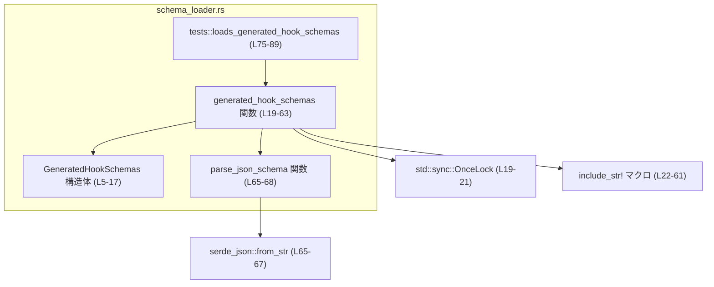
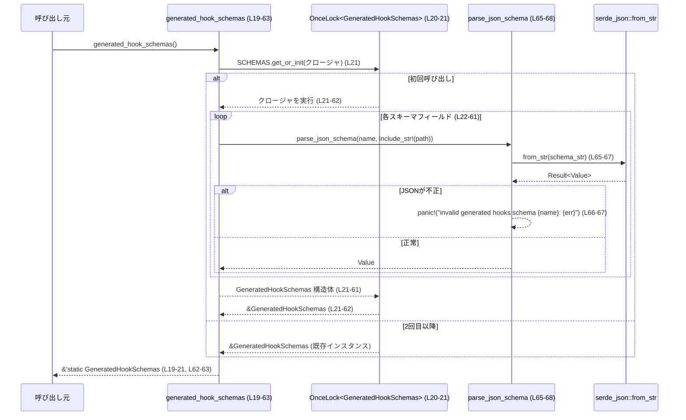

# hooks/src/engine/schema_loader.rs コード解説

## 0. ざっくり一言

このモジュールは、フック処理用の各種コマンドに対応する **JSON スキーマをコンパイル時に埋め込み、初回アクセス時にだけまとめてパースして共有するためのローダ** です（`schema_loader.rs:L5-63`）。

---

## 1. このモジュールの役割

### 1.1 概要

- このモジュールは、事前に生成された JSON スキーマファイル（`schema/generated/*.schema.json`）を `include_str!` でバイナリに埋め込み、`serde_json::Value` としてパースします（`schema_loader.rs:L22-61`）。
- パース結果は `GeneratedHookSchemas` 構造体に格納され、`generated_hook_schemas` 関数経由で **`&'static` な共有参照** として提供されます（`schema_loader.rs:L5-17`, `L19-63`）。
- 初回アクセスのみパースを行い、それ以降はキャッシュを使うため、パフォーマンスとスレッド安全性を両立しています（`OnceLock` 利用、`schema_loader.rs:L19-21`）。

### 1.2 アーキテクチャ内での位置づけ

このチャンクから分かる依存関係を簡略化した図です。



- 外部依存：
  - `std::sync::OnceLock` により、`GeneratedHookSchemas` の初期化は **スレッド安全な一度きりの遅延初期化** になります（`schema_loader.rs:L19-21`）。
  - `serde_json::Value` と `serde_json::from_str` により、JSON スキーマ文字列をパースします（`schema_loader.rs:L3`, `L65-67`）。
- 呼び出し元（このモジュール外から `generated_hook_schemas` がどう使われるか）は、このチャンクには現れません。

### 1.3 設計上のポイント

- **コンパイル時埋め込み + 実行時パース**
  - `include_str!` でスキーマファイルをコンパイル時に文字列として埋め込み（`schema_loader.rs:L22-61`）、実行時に `serde_json::from_str` でパースします（`schema_loader.rs:L65-67`）。
- **遅延・一度きりの初期化**
  - `OnceLock<GeneratedHookSchemas>` を `static` に保持し（`schema_loader.rs:L19-21`）、`get_or_init` で初回呼び出し時のみスキーマをまとめて構築します（`schema_loader.rs:L21-62`）。
- **crate 内公開 API**
  - 構造体とメイン関数はいずれも `pub(crate)` で、同一クレート内の他モジュールから利用される前提になっています（`schema_loader.rs:L6`, `L19`）。
- **エラーハンドリング方針：内部アセットの不正は panic**
  - スキーマ JSON が不正な場合は `panic!` で即座に異常終了させます（`schema_loader.rs:L65-67`）。これはユーザー入力ではなく、ビルド時に含める内部資源の整合性を前提にした方針と解釈できます。
- **テストによる最低限の検証**
  - テストでは各スキーマのトップレベルの `"type"` フィールドが `"object"` であることを検証し、少なくとも JSON としてパース可能であること、および基本的な形が想定どおりであることを確認しています（`schema_loader.rs:L75-88`）。

---

## 2. 主要な機能一覧

### 2.1 コンポーネント一覧（インベントリー）

| 名前 | 種別 | 役割 / 用途 | 定義位置 |
|------|------|-------------|----------|
| `GeneratedHookSchemas` | 構造体 | 各種フックコマンドの入力・出力用 JSON スキーマを `serde_json::Value` としてまとめて保持するコンテナ | `schema_loader.rs:L5-17` |
| `generated_hook_schemas` | 関数（`pub(crate)`） | `GeneratedHookSchemas` を `OnceLock` を介して遅延初期化し、`&'static GeneratedHookSchemas` を返すファクトリ兼アクセサ | `schema_loader.rs:L19-63` |
| `parse_json_schema` | 関数（プライベート） | 埋め込まれたスキーマ文字列を JSON としてパースし、失敗時にはスキーマ名付きで panic するユーティリティ | `schema_loader.rs:L65-68` |
| `tests::loads_generated_hook_schemas` | テスト関数 | `generated_hook_schemas` が全スキーマを正しくロードし、トップレベル `"type"` が `"object"` であることを検証する | `schema_loader.rs:L75-89` |

### 2.2 機能概要

- フック用コマンドスキーマの読み込みと保持  
  - 各コマンド（`post-tool-use`, `pre-tool-use`, `session-start`, `user-prompt-submit`, `stop`）の input/output スキーマを `serde_json::Value` としてロードし、`GeneratedHookSchemas` に格納します（`schema_loader.rs:L7-16`, `L22-61`）。
- スキーマへのグローバルアクセス提供  
  - `generated_hook_schemas` から、どこからでも同じスキーマインスタンスへの `&'static` 参照を取得できます（`schema_loader.rs:L19-21`, `L62-63`）。
- スキーマファイルの整合性検証  
  - パースに失敗した場合は即時 panic、テストではトップレベル `"type"` を検証し、ビルド済みバイナリに含めるスキーマが整合しているか確認しています（`schema_loader.rs:L65-67`, `L75-88`）。

---

## 3. 公開 API と詳細解説

### 3.1 型一覧（構造体）

| 名前 | 種別 | フィールド | 役割 / 用途 | 定義位置 |
|------|------|-----------|-------------|----------|
| `GeneratedHookSchemas` | 構造体（`pub(crate)`） | `post_tool_use_command_input`, `post_tool_use_command_output`, `pre_tool_use_command_input`, `pre_tool_use_command_output`, `session_start_command_input`, `session_start_command_output`, `user_prompt_submit_command_input`, `user_prompt_submit_command_output`, `stop_command_input`, `stop_command_output`（すべて `serde_json::Value`） | 各フックコマンドの入力/出力スキーマを保持するための単純なデータコンテナ | `schema_loader.rs:L5-16` |

各フィールドは、対応するスキーマファイルからロードされた JSON オブジェクトになります（`schema_loader.rs:L22-61`）。

---

### 3.2 関数詳細

#### `generated_hook_schemas() -> &'static GeneratedHookSchemas`

**概要**

- `GeneratedHookSchemas` のインスタンスを、初回呼び出し時にのみ生成し、以降は同じインスタンスを `&'static` 参照として返す関数です（`schema_loader.rs:L19-21`）。
- クレート内の他のモジュールから、すべてのフックスキーマにアクセスする入口になります（`schema_loader.rs:L19`, `L7-16`）。

**引数**

- なし。

**戻り値**

- `&'static GeneratedHookSchemas`  
  - プロセスのライフタイム全体で有効な、共有の `GeneratedHookSchemas` への不変参照です（`schema_loader.rs:L19-21`, `L62-63`）。

**内部処理の流れ**

1. `static SCHEMAS: OnceLock<GeneratedHookSchemas>` を定義します（`schema_loader.rs:L20`）。
2. `SCHEMAS.get_or_init(...)` を呼び出し、内部の値がまだ初期化されていない場合は、渡したクロージャを実行します（`schema_loader.rs:L21`）。
3. クロージャ内で `GeneratedHookSchemas { ... }` を構築し、各フィールドについて `parse_json_schema(name, include_str!(path))` を呼び出して JSON スキーマをパースします（`schema_loader.rs:L22-61`）。
4. すべてのフィールドが `serde_json::Value` として得られた `GeneratedHookSchemas` が `OnceLock` に保存され、その参照が返されます（`schema_loader.rs:L21-22`, `L62`）。
5. 2回目以降の呼び出しでは、既に格納済みの `GeneratedHookSchemas` への参照が、ロック開放後に再利用されます（`OnceLock` の仕様。コード上は `get_or_init` の呼び出しのみが現れます：`schema_loader.rs:L21`）。

**使用例**

このモジュール外（同一クレート内）からスキーマを取得して利用する例です。

```rust
// hooks/src/engine/他のモジュール.rs からの利用例（仮のコード例）
use crate::engine::schema_loader::generated_hook_schemas; // pub(crate) 関数をインポート

fn inspect_post_tool_use_schema() {
    // 初回呼び出し時にスキーマ群が初期化される
    let schemas = generated_hook_schemas(); // &'static GeneratedHookSchemas を取得

    // post-tool-use の入力スキーマを参照
    let input_schema = &schemas.post_tool_use_command_input; // serde_json::Value への参照

    // ここで input_schema["properties"] などを使って検証ロジックを組むことができます
    // （実際の検証処理は、このチャンクには定義されていません）
}
```

このコードは、`generated_hook_schemas` の返す参照を使って、特定のコマンドのスキーマを取り出す典型的な利用方法を示しています。

**Errors / Panics**

- この関数自体は `Result` を返さず、エラーは `parse_json_schema` 内の `panic!` として処理されます（`schema_loader.rs:L65-67`）。
- どれか 1 つでもスキーマ文字列が不正な JSON である場合：
  - `serde_json::from_str` がエラーを返し（`schema_loader.rs:L65-67`）、それが `unwrap_or_else` の中で `panic!("invalid generated hooks schema {name}: {err}")` を起こします。
  - 結果として、初回呼び出し時にプロセス（または少なくともスレッド）がパニックします。

**Edge cases（エッジケース）**

- **スキーマファイルが存在しない／読み込めない場合**
  - `include_str!` はコンパイル時マクロなので、パスが不正でファイルが存在しない場合、コンパイルエラーになります（この挙動は Rust の標準仕様によるもので、このファイルには直接は記述されていません）。
- **スキーマ JSON が空文字列や不正な JSON の場合**
  - `serde_json::from_str` がエラーを返し、`panic!` を起こします（`schema_loader.rs:L65-67`）。
- **多重呼び出し・並行呼び出し**
  - `OnceLock` によって、多数のスレッドから同時に `generated_hook_schemas` を呼び出した場合でも、一度だけ初期化されることが保証されます（`schema_loader.rs:L19-21`）。  
    `OnceLock` のスレッド安全性は標準ライブラリの仕様に依存します。

**使用上の注意点**

- 初期化時の panic は回復不能として扱われるため、スキーマファイルはビルドプロセスや CI などで十分に検証しておく必要があります（`schema_loader.rs:L65-67`, `L75-88`）。
- `GeneratedHookSchemas` は不変参照で提供されるため、スキーマを実行時に書き換えることは想定されていません（`schema_loader.rs:L19-21`）。
- スキーマはバイナリに埋め込まれるため、**ホットリロードや動的差し替えはこの実装だけではできません**。変更には再ビルドが必要です（`include_str!` 利用、`schema_loader.rs:L22-61`）。

---

#### `parse_json_schema(name: &str, schema: &str) -> Value`

**概要**

- 与えられた JSON 文字列 `schema` をパースして `serde_json::Value` に変換し、パースに失敗した場合にはスキーマ名 `name` を含むメッセージで `panic!` するヘルパー関数です（`schema_loader.rs:L65-67`）。
- `generated_hook_schemas` からのみ呼び出される内部実装です（`schema_loader.rs:L22-61`, `L65-68`）。

**引数**

| 引数名 | 型 | 説明 | 根拠 |
|--------|----|------|------|
| `name` | `&str` | スキーマの論理名。エラーメッセージでどのスキーマが不正だったかを識別するために使用されます。 | `schema_loader.rs:L65`, `L22-61` |
| `schema` | `&str` | JSON スキーマ本文の文字列。`include_str!` から渡されることを前提としています。 | `schema_loader.rs:L65`, `L22-61` |

**戻り値**

- `serde_json::Value`  
  - 成功時には、`schema` 引数を `serde_json::from_str` した結果の `Value` が返ります（`schema_loader.rs:L65-67`）。

**内部処理の流れ**

1. `serde_json::from_str(schema)` を呼び出し、`Result<Value, _>` を得ます（`schema_loader.rs:L65-66`）。
2. 結果に対して `unwrap_or_else` を呼び出し、エラーの場合は `panic!("invalid generated hooks schema {name}: {err}")` でパニックします（`schema_loader.rs:L66-67`）。
3. 成功の場合は `Value` がそのまま返されます（`schema_loader.rs:L65-67`）。

**使用例**

この関数は `generated_hook_schemas` 内部からのみ利用されていますが、挙動のイメージを示すための単独例です。

```rust
use serde_json::Value;

// schema_loader.rs: parse_json_schema と同等の挙動を模した例
fn demo() {
    let name = "example";
    let schema_str = r#"{ "type": "object" }"#; // 有効な JSON

    let value: Value = crate::engine::schema_loader::parse_json_schema(name, schema_str);
    // 実際には parse_json_schema はモジュール内スコープの関数なので、
    // このような直接呼び出しは schema_loader.rs の外からはできません（プライベート関数のため）。
}
```

この例は **挙動の説明用** であり、実際のコードベースでは `parse_json_schema` は `pub` ではありません（`schema_loader.rs:L65`）。

**Errors / Panics**

- `serde_json::from_str(schema)` がエラーを返した場合：
  - `unwrap_or_else` のクロージャが実行され、`panic!` します（`schema_loader.rs:L65-67`）。
  - パニックメッセージにはスキーマ名 `name` とエラー内容 `err` が含まれます。
- これは **内部アセット（スキーマファイル）に対する整合性チェック** の性質を持つため、ユーザー入力に由来するエラーではありません。

**Edge cases（エッジケース）**

- `schema` が空文字列、途中で途切れた JSON、無効なエスケープシーケンスなどを含む場合：
  - `serde_json::from_str` が失敗し、即座に panic となります（`schema_loader.rs:L65-67`）。
- `schema` が巨大な JSON の場合：
  - メモリ使用量やパース時間が増大しますが、そのような制限・ガードはこの関数には実装されていません（`schema_loader.rs:L65-67`）。

**使用上の注意点**

- この関数は **エラーを Result で返さず、必ず panic する** 方針であるため、外部入力の検証には適しません。
- `name` はエラーメッセージに直接埋め込まれるため、デバッグしやすい名前を渡すことが前提になっています（`schema_loader.rs:L66-67`）。

---

### 3.3 その他の関数

| 関数名 | 役割（1 行） | 定義位置 |
|--------|--------------|----------|
| `tests::loads_generated_hook_schemas` | すべてのスキーマが `generated_hook_schemas` により正常にロードされ、トップレベル `"type"` が `"object"` であることを検証するテスト | `schema_loader.rs:L75-89` |

---

## 4. データフロー

### 4.1 代表的な処理シナリオ：初回スキーマロード

`generated_hook_schemas` が初めて呼ばれたときのデータフローを示します。



要点：

- スキーマファイルは `include_str!` によりコンパイル時に文字列として埋め込まれ（`schema_loader.rs:L22-61`）、実行時に `serde_json::from_str` で Value に変換されます（`schema_loader.rs:L65-67`）。
- 変換結果は `GeneratedHookSchemas` にまとめられ、一度だけ `OnceLock` に格納されます（`schema_loader.rs:L19-21`）。
- 2回目以降の呼び出しでは、パースは行われず、既存インスタンスへの参照だけが返されます。

---

## 5. 使い方（How to Use）

### 5.1 基本的な使用方法

典型的な利用フローは、「スキーマを取得 → 特定フィールドを取り出す → 別のロジックで検証に使う」という形になります。

```rust
use crate::engine::schema_loader::generated_hook_schemas; // schema_loader.rs:L19

fn validate_user_prompt(payload: &serde_json::Value) {
    // スキーマ群への &'static 参照を取得
    let schemas = generated_hook_schemas(); // 初回のみ内部でパースと初期化が発生（L19-21）

    // ユーザプロンプト送信コマンドの入力スキーマを取得
    let schema = &schemas.user_prompt_submit_command_input; // L13

    // ここで schema と payload を使ってバリデーションを行う処理を実装できます
    // （実際のバリデーションロジックは、このチャンクには定義されていません）
}
```

### 5.2 よくある使用パターン

- **複数箇所からの共通スキーマ利用**
  - 同じスキーマ（例：`session_start_command_input`）を複数の関数やモジュールで使う場合でも、毎回 `generated_hook_schemas()` を呼んで問題ありません。内部では同じ `OnceLock` に格納されたインスタンスへの参照が返るだけです（`schema_loader.rs:L19-21`）。
- **入力・出力スキーマの組み合わせ利用**
  - あるコマンドの input / output をペアで扱うような処理（ログやトレーサーなど）でも、同じ `GeneratedHookSchemas` から両方を取り出せます（`schema_loader.rs:L7-16`）。

### 5.3 よくある間違い（想定されるもの）

コードから推測できる範囲での誤用例です。

```rust
// 誤りの例（概念的なもの）:
// スキーマを外部入力に対してそのまま書き換えてしまう
fn wrong_usage() {
    let schemas = generated_hook_schemas();
    // Value は可変ですが、ここでスキーマ自体を書き換えると、
    // プロセス全体で共有されている &'static データが変わってしまう可能性があります。
    // （このファイルではミュータブル参照は取得していません）
    // let schema_mut = &mut schemas.post_tool_use_command_input; // コンパイルエラー: &mut は取得できない
}

// 正しい例: 不変参照として読み取り専用で扱う
fn correct_usage() {
    let schemas = generated_hook_schemas();
    let schema = &schemas.post_tool_use_command_input;
    // schema を読み取り専用で利用する
}
```

- `generated_hook_schemas` の戻り値は `&'static GeneratedHookSchemas` なので、**ミュータブル参照は取得できません**（所有権・借用規則により）。このため、スキーマの変更はそもそもできない設計になっています（`schema_loader.rs:L19-21`）。

### 5.4 使用上の注意点（まとめ）

- スキーマの不正は初回アクセス時の panic として扱われるため、本番前にテスト（`loads_generated_hook_schemas` など）で検証しておく必要があります（`schema_loader.rs:L75-88`）。
- ランタイム中にスキーマを差し替える用途には向きません。JSON スキーマを変更したい場合はスキーマファイルとバイナリを再ビルドする必要があります（`include_str!`, `schema_loader.rs:L22-61`）。
- `generated_hook_schemas` はスレッドセーフに遅延初期化されるため、複数スレッドから同時に呼び出しても問題ありません（`OnceLock` 利用、`schema_loader.rs:L19-21`）。

---

## 6. 変更の仕方（How to Modify）

### 6.1 新しい機能を追加する場合

**例：新しいフックコマンド `foo` の input/output スキーマを追加したい場合**

1. **スキーマファイルの追加**
   - `schema/generated/foo.command.input.schema.json` などの JSON スキーマファイルを追加します。  
     このファイル群はこのチャンクには現れませんが、`include_str!` のパスと整合する必要があります（`schema_loader.rs:L22-61`）。
2. **構造体へのフィールド追加**
   - `GeneratedHookSchemas` に対応する `pub foo_command_input: Value` などのフィールドを追加します（`schema_loader.rs:L5-16`）。
3. **初期化ロジックの追加**
   - `generated_hook_schemas` 内の `GeneratedHookSchemas { ... }` リテラルに、新しいフィールドの初期化を追加します。  
     例：`foo_command_input: parse_json_schema("foo.command.input", include_str!("../../schema/generated/foo.command.input.schema.json")),`（`schema_loader.rs:L21-61`）。
4. **テストの追加・更新**
   - `tests::loads_generated_hook_schemas` に、新しいフィールドに対する `"type"` チェックを追加します（`schema_loader.rs:L79-88`）。

### 6.2 既存の機能を変更する場合

- **スキーマの差し替え**
  - JSON スキーマの内容を変更するだけであれば、対応する `.schema.json` ファイルを修正し、再ビルドします。  
    コード側の変更は不要です（`include_str!` のパスが変わらない限り、`schema_loader.rs:L22-61`）。
- **スキーマファイル名・パスの変更**
  - `include_str!` のパスと名前（表示名）を一致させる必要があります。  
    例：`"post-tool-use.command.input"` と `"../../schema/generated/post-tool-use.command.input.schema.json"` は対になっています（`schema_loader.rs:L22-25`）。
- **エラーハンドリング方針の変更**
  - panic ではなく `Result` で返したい場合は、`parse_json_schema` の `unwrap_or_else` を外し、`generated_hook_schemas` の戻り値を `Result<&'static GeneratedHookSchemas, Error>` などに変更する必要があり、呼び出し側の契約も変わります（`schema_loader.rs:L19-21`, `L65-67`）。

変更時の注意点：

- `GeneratedHookSchemas` のフィールドを削除・名称変更する場合、それを利用している他モジュールやテストをすべて確認する必要があります（このチャンクには利用箇所は現れませんが、`schema_loader.rs:L7-16`, `L79-88` からテスト依存は確認できます）。
- `parse_json_schema` の挙動を変えると、すべてのスキーマロードに影響するため、バグやセキュリティ上の影響を慎重に評価する必要があります（`schema_loader.rs:L65-67`）。

---

## 7. 関連ファイル

このチャンクから直接参照されているファイル・モジュールは以下のとおりです。

| パス / 要素 | 役割 / 関係 | 根拠 |
|------------|------------|------|
| `../../schema/generated/post-tool-use.command.input.schema.json` など計 10 ファイル | 各フックコマンドの input/output 用 JSON スキーマ。`include_str!` でコンパイル時に文字列として埋め込まれます。 | `schema_loader.rs:L22-61` |
| `std::sync::OnceLock` | `GeneratedHookSchemas` をスレッドセーフに一度だけ遅延初期化するための標準ライブラリ型。 | `schema_loader.rs:L1`, `L19-21` |
| `serde_json::Value`, `serde_json::from_str` | JSON スキーマ文字列を構造化データ `Value` にパースするための型と関数。 | `schema_loader.rs:L3`, `L65-67` |
| `pretty_assertions::assert_eq` | テストでスキーマの `"type"` フィールドを検証するためのアサーションマクロ。 | `schema_loader.rs:L73`, `L79-88` |

---

## 補足：Bugs/Security・Contracts/Edge Cases・Performance 観点のまとめ

- **Bugs/Security**
  - スキーマが不正な JSON である場合に panic する設計ですが、スキーマはビルドに含める内部ファイルであり、通常はユーザー入力ではありません（`schema_loader.rs:L22-25`, `L65-67`）。  
    そのため、主な影響は可用性（起動時 / 初回利用時のクラッシュ）であり、直接的なセキュリティ脆弱性とは言えません。
- **Contracts（契約） / Edge Cases**
  - 契約：`generated_hook_schemas` を呼び出せば、すべてのスキーマが正しい JSON であることを前提に `Value` として取得できる、という前提があります（`schema_loader.rs:L19-21`, `L22-61`）。  
  - エッジケース：スキーマファイルが壊れているときに panic すること、存在しないファイルパスを指定するとコンパイルエラーになることが想定されます。
- **Performance/Scalability**
  - 初回呼び出し時に全スキーマをまとめてパースするため、そのタイミングで CPU・メモリ負荷が集中します（`schema_loader.rs:L21-61`）。  
  - 以降は `OnceLock` からの参照取得のみで、追加のパースコストはありません。スキーマ数が増えるほど初期化コストが増えますが、ランタイム中のコストはほぼ一定です。

このファイルにはログ出力やメトリクス計測はなく、観測可能性（Observability）を高めるには、panic の代わりにエラーを返してログに出すなど、別途の仕組みが必要になります。
