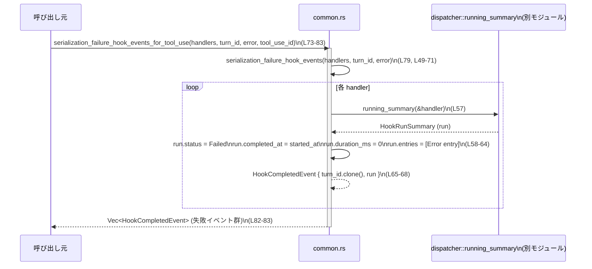
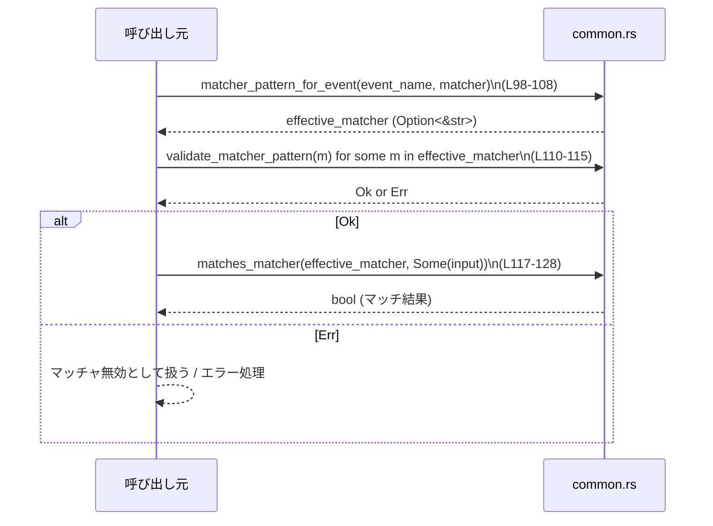

# hooks/src/events/common.rs コード解説

## 0. ざっくり一言

`hooks/src/events/common.rs` は、フック実行結果（`HookCompletedEvent`）の生成や、フックのマッチャ文字列（正規表現ベース）を扱うための共通ユーティリティ関数群を提供するモジュールです（common.rs:L11-132）。  

---

## 1. このモジュールの役割

### 1.1 概要

- フックの追加コンテキスト文字列の整形・集約（common.rs:L11-47）
- シリアライゼーション失敗時の `HookCompletedEvent` / `HookRunSummary` を一括生成（common.rs:L49-96）
- ツール実行（tool use）と紐づいたフック実行 ID を生成（common.rs:L85-96）
- イベントごとのマッチャパターンの適用可否判定、および正規表現マッチング（common.rs:L98-132）

### 1.2 アーキテクチャ内での位置づけ

このモジュールは以下の外部コンポーネントに依存しています。

- `codex_protocol::protocol::{HookCompletedEvent, HookEventName, HookOutputEntry, HookOutputEntryKind, HookRunStatus, HookRunSummary}`（common.rs:L1-6）
- `crate::engine::{ConfiguredHandler, dispatcher}`（common.rs:L8-9）

依存関係を簡略化すると次のようになります。

```mermaid
graph TD
    subgraph Protocol[crate: codex_protocol::protocol]
        HCE[HookCompletedEvent]
        HEN[HookEventName]
        HOE[HookOutputEntry]
        HOEK[HookOutputEntryKind]
        HRS[HookRunStatus]
        HRSum[HookRunSummary]
    end

    subgraph Engine[crate::engine]
        CH[ConfiguredHandler]
        DISP[dispatcher::running_summary]\n(定義はこのチャンク外)
    end

    subgraph Common[hooks::events::common.rs]
        JTC[join_text_chunks]
        ANC[append_additional_context]
        SFE[serialization_failure_hook_events]
        SFET[serialization_failure_hook_events_for_tool_use]
        HCT[hook_completed_for_tool_use]
        HRT[hook_run_for_tool_use]
        MPE[matcher_pattern_for_event]
        VMP[validate_matcher_pattern]
        MM[matches_matcher]
    end

    CH --> SFE
    DISP --> SFE
    HRSum --> SFE
    HCE --> SFE
    SFE --> SFET
    SFET --> HCT
    HCT --> HRT

    HEN --> MPE
    MPE --> VMP
    VMP --> MM
```

※ `dispatcher::running_summary` の実装はこのチャンクには含まれていません。

### 1.3 設計上のポイント

- **ステートレスなユーティリティ集**  
  すべての関数は引数のみを入力とし、グローバル状態を持ちません。スレッドセーフに呼び出しできます（common.rs:L11-132）。
- **エラーハンドリング**  
  - 文字列整形系は `Option<String>` を返して「結果がない」ケースを明示（common.rs:L11-26）。
  - マッチャ検証は `Result<(), regex::Error>` を返して正規表現パースの失敗を表現（common.rs:L110-115）。
  - マッチング関数はエラーを返さず、「マッチしない（false）」で表現（common.rs:L117-128）。
- **安全な正規表現利用**  
  不正なパターンは `validate_matcher_pattern` が `Err` を返し、`matches_matcher` では内部でパース失敗を検出して false を返します（common.rs:L110-115, L117-128）。
- **並行性**  
  すべての関数は `&mut` 引数以外に共有状態を持たないため、同じインスタンスを共有しない限りデータ競合の心配はありません。`regex::Regex::new` も関数ローカルで生成されています。

---

## 2. 主要な機能・コンポーネント一覧

### 2.1 コンポーネント一覧（関数・モジュール）

| 名前 | 種別 | 公開範囲 | 行範囲 | 役割 / 用途 |
|------|------|----------|--------|-------------|
| `join_text_chunks` | 関数 | `pub(crate)` | common.rs:L11-17 | 文字列ベクタを空チェックしつつ `"\n\n"` 区切りで結合し、空なら `None` を返す |
| `trimmed_non_empty` | 関数 | `pub(crate)` | common.rs:L19-26 | 文字列を `trim` した結果が空なら `None`、そうでなければ `String` にして返す |
| `append_additional_context` | 関数 | `pub(crate)` | common.rs:L28-38 | 追加コンテキスト文字列を `HookOutputEntry` として `entries` に追加し、別ベクタにも保持する |
| `flatten_additional_contexts` | 関数 | `pub(crate)` | common.rs:L40-47 | `&[String]` のイテレータを 1 本の `Vec<String>` にフラット化する |
| `serialization_failure_hook_events` | 関数 | `pub(crate)` | common.rs:L49-71 | シリアライゼーション失敗時の `HookCompletedEvent` を、ハンドラごとに生成する |
| `serialization_failure_hook_events_for_tool_use` | 関数 | `pub(crate)` | common.rs:L73-83 | 上記のイベントを tool use ID 付きの run ID に変換する |
| `hook_completed_for_tool_use` | 関数 | `pub(crate)` | common.rs:L85-91 | 1 つの `HookCompletedEvent` の run ID を tool use 用に書き換える |
| `hook_run_for_tool_use` | 関数 | `pub(crate)` | common.rs:L93-95 | `HookRunSummary` の `id` を `"元ID:tool_use_id"` 形式に変換する |
| `matcher_pattern_for_event` | 関数 | `pub(crate)` | common.rs:L98-108 | イベント種別ごとに、マッチャ文字列を使用してよいか判定する |
| `validate_matcher_pattern` | 関数 | `pub(crate)` | common.rs:L110-115 | マッチャ文字列が正規表現として妥当か検証する（`*` / 空文字は特例で常に OK） |
| `matches_matcher` | 関数 | `pub(crate)` | common.rs:L117-128 | マッチャ（オプションの正規表現文字列）と入力文字列のマッチングを行う |
| `is_match_all_matcher` | 関数 | `fn`（private） | common.rs:L131-132 | 空文字または `"*"` を「すべてにマッチするマッチャ」として判定する |
| `tests` | モジュール | `#[cfg(test)]` | common.rs:L135-211 | マッチャ関連関数のテスト群を提供する |

### 2.2 主要な機能一覧（概要）

- テキスト結合ユーティリティ: `join_text_chunks`, `trimmed_non_empty`
- フック出力コンテキスト操作: `append_additional_context`, `flatten_additional_contexts`
- シリアライゼーション失敗イベント生成: `serialization_failure_hook_events`, `serialization_failure_hook_events_for_tool_use`
- ツール呼び出し用 run ID 付与: `hook_completed_for_tool_use`, `hook_run_for_tool_use`
- イベント用マッチャの管理と評価: `matcher_pattern_for_event`, `validate_matcher_pattern`, `matches_matcher`

---

## 3. 公開 API と詳細解説

### 3.1 型一覧（このファイルで利用するが定義しない型）

このファイル内で新たな型定義はありませんが、外部の型を多用します。

| 名前 | 種別 | 出典 | 役割 / 用途 |
|------|------|------|-------------|
| `HookCompletedEvent` | 構造体 | `codex_protocol::protocol` | 1 回のフック実行（1 ハンドラ）の完了イベントを表す（common.rs:L1, L65-68, L79-82, L85-90）。 |
| `HookRunSummary` | 構造体 | 同上 | フック実行のサマリ（ID, 状態, 時刻, ログなど）を保持（common.rs:L6, L57-61, L93-95）。 |
| `HookRunStatus` | 列挙体 | 同上 | フック実行の状態（ここでは `Failed` を使用）（common.rs:L5, L58）。 |
| `HookOutputEntry` | 構造体 | 同上 | フック出力の 1 エントリ（テキスト + 種別）を表す（common.rs:L3, L33-36, L61-64）。 |
| `HookOutputEntryKind` | 列挙体 | 同上 | 出力エントリの種別（`Context`, `Error` 等）（common.rs:L4, L34, L62）。 |
| `HookEventName` | 列挙体 | 同上 | フックのイベント種別（Pre/PostToolUse, SessionStart, UserPromptSubmit, Stop）（common.rs:L2, L98-107）。 |
| `ConfiguredHandler` | 構造体 | `crate::engine` | フックハンドラの設定情報を表すと推測されますが、このチャンクからは詳細不明です（common.rs:L8, L49-51, L73-75）。 |
| `dispatcher::running_summary` | 関数 | `crate::engine::dispatcher` | ハンドラから `HookRunSummary` を初期化する関数と推測されますが、実装はこのチャンクにはありません（common.rs:L9, L57）。 |

※ `ConfiguredHandler` や `dispatcher::running_summary` の詳細仕様は、このチャンクには現れません。

---

### 3.2 関数詳細（重要な 7 件）

#### `serialization_failure_hook_events(handlers: Vec<ConfiguredHandler>, turn_id: Option<String>, error_message: String) -> Vec<HookCompletedEvent>`（common.rs:L49-71）

**概要**

シリアライゼーション失敗時に、与えられた全ての `ConfiguredHandler` について失敗済みの `HookCompletedEvent` を生成します。各イベントには、エラーメッセージを含む `HookOutputEntry` が 1 件だけ含まれます。

**引数**

| 引数名 | 型 | 説明 |
|--------|----|------|
| `handlers` | `Vec<ConfiguredHandler>` | 対象となるフックハンドラ群。1 要素につき 1 つの `HookCompletedEvent` が生成されます（common.rs:L49-51, L54-69）。 |
| `turn_id` | `Option<String>` | 対話のターン ID。`Some` であればすべての `HookCompletedEvent::turn_id` にクローンされます（common.rs:L51-52, L66）。 |
| `error_message` | `String` | シリアライゼーションエラーの説明文。各イベントの `HookOutputEntry` にクローンされて格納されます（common.rs:L52-53, L61-64）。 |

**戻り値**

- 型: `Vec<HookCompletedEvent>`
- 意味: `handlers` の要素数と同じ数だけ、失敗状態の `HookCompletedEvent` を返します。

**内部処理の流れ**

1. `handlers.into_iter()` でハンドラごとのイテレーションを開始します（common.rs:L54-56）。
2. 各ハンドラに対して `dispatcher::running_summary(&handler)` を呼び出し、初期状態の `HookRunSummary` を取得します（common.rs:L57）。
3. `run.status` を `HookRunStatus::Failed` に設定します（common.rs:L58）。
4. `run.completed_at` を `Some(run.started_at)` に設定し、開始時刻と同一の完了時刻とします（common.rs:L59）。
5. `run.duration_ms` を `Some(0)` とし、実行時間 0ms とします（common.rs:L60）。
6. `run.entries` に、`HookOutputEntryKind::Error` と `error_message.clone()` を持つ 1 要素だけのベクタを代入します（common.rs:L61-64）。
7. 上記の `run` と `turn_id.clone()` から `HookCompletedEvent` を構築します（common.rs:L65-68）。
8. 最終的に、`collect()` でベクタにまとめて返します（common.rs:L70）。

**Examples（使用例）**

```rust
use hooks::events::common::serialization_failure_hook_events;
use crate::engine::ConfiguredHandler;

// 例示用: handlers を仮に用意（実際にはどこか別の場所で設定されている想定）
let handlers: Vec<ConfiguredHandler> = /* ... */;

// あるターンでフックの出力シリアライズに失敗した場合
let turn_id = Some("turn-123".to_string());
let error_message = "failed to serialize hook output to JSON".to_string();

// すべてのハンドラに対して「失敗済み」の HookCompletedEvent を生成する
let events = serialization_failure_hook_events(handlers, turn_id, error_message);

// ここで events をイベントバスやログに流すなどの処理を行う
```

**Errors / Panics**

- この関数自身は `Result` を返さず、通常の入力では panic の可能性もありません。
- `dispatcher::running_summary` 側の挙動や panic の有無は、このチャンクでは不明です（common.rs:L57）。

**Edge cases（エッジケース）**

- `handlers` が空のとき: 空の `Vec<HookCompletedEvent>` が返ります（`into_iter().map(...).collect()` より）。
- `turn_id` が `None` のとき: 生成される各 `HookCompletedEvent` の `turn_id` も `None` になります（common.rs:L66）。
- `error_message` が空文字でも、そのまま `text` に入ります。

**使用上の注意点**

- `handlers` を `Vec` ごと消費する（`into_iter()`）ため、呼び出し後に同じ `handlers` を再利用することはできません（所有権が移動します）。
- 実際にシリアライゼーションが成功したケースでは使用すべきではなく、あくまで「失敗時の補償イベント生成」に限定されます。

---

#### `serialization_failure_hook_events_for_tool_use(handlers: Vec<ConfiguredHandler>, turn_id: Option<String>, error_message: String, tool_use_id: &str) -> Vec<HookCompletedEvent>`（common.rs:L73-83）

**概要**

`serialization_failure_hook_events` で生成した失敗イベントに対し、各 `HookRunSummary::id` を特定の tool use（ツール呼び出し）と関連づけた ID に変換した `HookCompletedEvent` を生成します。

**引数**

| 引数名 | 型 | 説明 |
|--------|----|------|
| `handlers` | `Vec<ConfiguredHandler>` | 対象ハンドラ一覧（common.rs:L73-75）。 |
| `turn_id` | `Option<String>` | 対話ターン ID（common.rs:L75-76）。 |
| `error_message` | `String` | エラーメッセージ（common.rs:L76-77）。 |
| `tool_use_id` | `&str` | ツール呼び出しを識別する ID（common.rs:L77-78）。 |

**戻り値**

- 型: `Vec<HookCompletedEvent>`
- 意味: 各イベントの `run.id` が `"元のID:tool_use_id"` という形式で上書きされた失敗イベント群です。

**内部処理の流れ**

1. `serialization_failure_hook_events(handlers, turn_id, error_message)` を呼び出し、失敗イベントベクタを得る（common.rs:L79）。
2. そのイテレータに対し、`hook_completed_for_tool_use(event, tool_use_id)` を `map` で適用（common.rs:L79-82）。
3. `collect()` で再度ベクタにまとめて返却します（common.rs:L82）。

**Examples（使用例）**

```rust
use hooks::events::common::serialization_failure_hook_events_for_tool_use;

let handlers: Vec<ConfiguredHandler> = /* ... */;
let turn_id = Some("turn-123".to_string());
let error_message = "failed to serialize tool output".to_string();
let tool_use_id = "bash-42";

// ツール実行単位で ID が紐づいた失敗イベントを生成する
let events = serialization_failure_hook_events_for_tool_use(
    handlers,
    turn_id,
    error_message,
    tool_use_id,
);
```

**Errors / Panics**

- 呼び出し先の `serialization_failure_hook_events` および `hook_completed_for_tool_use` が panic しない限り、この関数からの panic は想定されません。
- エラー型を返さない設計のため、「失敗イベントが作れない」ケースは考慮されていません。

**Edge cases**

- `handlers` が空の場合: 空ベクタを返します。
- `tool_use_id` が空文字でも `"元ID:"` という形式で ID が生成されます（common.rs:L93-95）。

**使用上の注意点**

- `tool_use_id` のフォーマットや一意性はこの関数ではチェックしていません。呼び出し側で担保する必要があります。
- `handlers` の所有権は消費されます。

---

#### `append_additional_context(entries: &mut Vec<HookOutputEntry>, additional_contexts_for_model: &mut Vec<String>, additional_context: String)`（common.rs:L28-38）

**概要**

追加コンテキスト文字列をフック出力エントリと「モデル用のコンテキスト一覧」の両方に追加します。

**引数**

| 引数名 | 型 | 説明 |
|--------|----|------|
| `entries` | `&mut Vec<HookOutputEntry>` | フック実行ログに蓄積する出力エントリの可変参照（common.rs:L28-30, L33-36）。 |
| `additional_contexts_for_model` | `&mut Vec<String>` | モデルへの入力コンテキストとして送る文字列一覧の可変参照（common.rs:L30-31, L37）。 |
| `additional_context` | `String` | 追加するコンテキスト本文。`entries` と `additional_contexts_for_model` 両方に保存されます（common.rs:L31-37）。 |

**戻り値**

- なし（`()`）。引数ベクタが直接更新されます。

**内部処理の流れ**

1. `HookOutputEntry { kind: HookOutputEntryKind::Context, text: additional_context.clone() }` を生成し、`entries.push(...)` で追加（common.rs:L33-36）。
2. `additional_contexts_for_model.push(additional_context)` で、元の `String` をモデル用一覧に追加（common.rs:L37）。

クローン分はログ用、オリジナルはモデル用に使われる構造です。

**Examples（使用例）**

```rust
use hooks::events::common::append_additional_context;
use codex_protocol::protocol::{HookOutputEntry, HookOutputEntryKind};

let mut entries: Vec<HookOutputEntry> = Vec::new();
let mut model_contexts: Vec<String> = Vec::new();

let ctx = "Some extra instruction for the model".to_string();

// entries と model_contexts の両方を更新する
append_additional_context(&mut entries, &mut model_contexts, ctx);

// entries[0].kind == Context, entries[0].text == "Some extra instruction for the model"
// model_contexts[0] == "Some extra instruction for the model"
```

**Errors / Panics**

- 通常の状況では panic 要因はありません（`Vec::push` が OOM で panic しうる程度）。

**Edge cases**

- `additional_context` が空文字でも、そのまま両方のベクタに追加されます。

**使用上の注意点**

- `additional_context` の所有権はこの関数にムーブされます。呼び出し後に同じ値を使いたい場合は、事前にクローンしておく必要があります。

---

#### `flatten_additional_contexts<'a>(additional_contexts: impl IntoIterator<Item = &'a [String]>) -> Vec<String>`（common.rs:L40-47）

**概要**

`&[String]` のコレクションを 1 本の `Vec<String>` にまとめるユーティリティです。ネストされたコンテキストリストをフラット化するのに使います。

**引数**

| 引数名 | 型 | 説明 |
|--------|----|------|
| `additional_contexts` | `impl IntoIterator<Item = &'a [String]>` | `&[String]` のイテレータに変換可能な値。各スライスが順に結合されます（common.rs:L40-42, L43-46）。 |

**戻り値**

- 型: `Vec<String>`
- 意味: すべてのスライスの要素をクローンし、1 本のベクタに詰めたもの。

**内部処理の流れ**

1. `additional_contexts.into_iter()` でイテレータを得る（common.rs:L43-44）。
2. 各 `chunk: &[String]` に対して `chunk.iter().cloned()` を実行し、要素を `String` としてクローン（common.rs:L45）。
3. `flat_map` により、すべてのクローン結果を 1 本にまとめ、`collect()` で `Vec<String>` を生成（common.rs:L43-47）。

**Examples（使用例）**

```rust
use hooks::events::common::flatten_additional_contexts;

let ctx1 = vec!["A".to_string(), "B".to_string()];
let ctx2 = vec!["C".to_string()];

// &Vec<String> は &[String] に自動的に参照外しされる
let flat = flatten_additional_contexts(vec![ctx1.as_slice(), ctx2.as_slice()]);

assert_eq!(flat, vec!["A".to_string(), "B".to_string(), "C".to_string()]);
```

**Errors / Panics**

- 標準的な `Vec` 操作と同様、非常に大きなデータでメモリ不足となった場合に panic の可能性があります。

**Edge cases**

- 入力イテレータが空: 空ベクタを返します。
- 各スライスが空: そのスライスは無視され、他の要素だけが返ります。

**使用上の注意点**

- すべての要素をクローンするため、要素数が多い場合にはメモリと処理時間のコストに注意が必要です。

---

#### `matcher_pattern_for_event(event_name: HookEventName, matcher: Option<&str>) -> Option<&str>`（common.rs:L98-108）

**概要**

フックイベント種別ごとに、与えられたマッチャ文字列をそのまま利用してよいかを判定します。マッチャをサポートしないイベントでは `None` を返し、マッチャを無効化します。

**引数**

| 引数名 | 型 | 説明 |
|--------|----|------|
| `event_name` | `HookEventName` | 対象イベント種別（Pre/PostToolUse, SessionStart, UserPromptSubmit, Stop）（common.rs:L98-103）。 |
| `matcher` | `Option<&str>` | 元のマッチャ文字列。`Some` でもイベントが未対応なら `None` として扱われます（common.rs:L98-101, L103-105）。 |

**戻り値**

- 型: `Option<&str>`
- 意味: イベントがマッチャをサポートしていれば元の `matcher` を返し、サポートしていなければ `None` を返します（common.rs:L103-107）。

**内部処理の流れ**

1. `match event_name { ... }` でイベント種別に応じた分岐を行う（common.rs:L102-107）。
2. `PreToolUse`, `PostToolUse`, `SessionStart` の場合は、もとの `matcher` をそのまま返す（common.rs:L103-105）。
3. `UserPromptSubmit`, `Stop` の場合は、`None` を返す（common.rs:L106-107）。

**Examples（使用例）**

```rust
use codex_protocol::protocol::HookEventName;
use hooks::events::common::matcher_pattern_for_event;

let matcher = Some("^Bash$");

assert_eq!(
    matcher_pattern_for_event(HookEventName::PreToolUse, matcher),
    matcher,
);

// UserPromptSubmit ではマッチャが無効化される
assert_eq!(
    matcher_pattern_for_event(HookEventName::UserPromptSubmit, matcher),
    None,
);
```

**Errors / Panics**

- エラー / panic を発生させません。単純な列挙値マッチングです。

**Edge cases**

- `matcher` が `None` の場合も、そのまま `None` が返ります（対応イベントでも未対応イベントでも）。

**使用上の注意点**

- イベントごとにマッチャが有効かどうかを明示的に制御したい場合は、`matches_matcher` を呼ぶ前に必ずこの関数を通すと仕様が明確になります（テストでもこの前提で検証されています：common.rs:L186-211）。

---

#### `validate_matcher_pattern(matcher: &str) -> Result<(), regex::Error>`（common.rs:L110-115）

**概要**

マッチャ文字列が妥当な正規表現かどうかを事前検証する関数です。ただし、空文字列と `"*"` は特別扱いで「常にマッチャとして有効」とみなし、正規表現コンパイルを行いません。

**引数**

| 引数名 | 型 | 説明 |
|--------|----|------|
| `matcher` | `&str` | 検証対象のマッチャ文字列（common.rs:L110-111）。 |

**戻り値**

- 型: `Result<(), regex::Error>`
- 意味: 妥当なマッチャなら `Ok(())`、不正な正規表現なら `Err(regex::Error)` を返します（common.rs:L110-115）。

**内部処理の流れ**

1. `is_match_all_matcher(matcher)` を呼び出し、空文字または `"*"` かどうか判定（common.rs:L111-112, L131-132）。
2. 該当する場合は正規表現をコンパイルせずに `Ok(())` を返す（common.rs:L111-112）。
3. それ以外の場合は `regex::Regex::new(matcher)` を呼び、成功すれば `map(|_| ())` で `Ok(())` に変換、失敗時は `Err(regex::Error)` をそのまま返す（common.rs:L114-115）。

**Examples（使用例）**

```rust
use hooks::events::common::validate_matcher_pattern;

// マッチャ未指定風のパターンも OK
assert!(validate_matcher_pattern("*").is_ok());
assert!(validate_matcher_pattern("").is_ok());

// 正しい正規表現
assert!(validate_matcher_pattern("Edit|Write").is_ok());
assert!(validate_matcher_pattern("^Bash$").is_ok());

// 間違った正規表現
assert!(validate_matcher_pattern("[").is_err());
```

**Errors / Panics**

- 不正な正規表現（例: `"["`）に対して `Err(regex::Error)` を返します（common.rs:L110-115, L179-182）。
- panic は通常の使用では発生しません。

**Edge cases**

- `matcher == ""` または `"*"` の場合は、「すべてにマッチするマッチャ」として扱われ、`Ok(())` が返ります（common.rs:L111-112, L131-132）。
- 非 ASCII 文字や大文字小文字など、正規表現エンジンが許容する範囲であれば特に制限はありません。

**使用上の注意点**

- ユーザ入力など信頼できない文字列をマッチャとして受け付ける場合は、**保存する前** あるいは **実際に使う前** にこの関数で検証しておくと安全です。
- `matches_matcher` は不正な正規表現に対して false を返しますが、「なぜマッチしないかわからない」という状態を避けるためにも、事前検証を行う設計が望ましいです。

---

#### `matches_matcher(matcher: Option<&str>, input: Option<&str>) -> bool`（common.rs:L117-128）

**概要**

マッチャ（`Option<&str>`）と入力文字列（`Option<&str>`）の組について、正規表現によるマッチングを行います。マッチャ未指定や「すべてにマッチ」パターンの場合は、入力の内容に関わらず true を返します。

**引数**

| 引数名 | 型 | 説明 |
|--------|----|------|
| `matcher` | `Option<&str>` | 正規表現マッチャ。`None` は「すべての入力にマッチ」と解釈されます（common.rs:L117-121）。 |
| `input` | `Option<&str>` | 判定対象の文字列。`None` の場合、原則としてマッチしない扱い（common.rs:L117, L121-127）。 |

**戻り値**

- 型: `bool`
- 意味: マッチすれば true、マッチしなければ false を返します。

**内部処理の流れ**

1. `match matcher` により分岐（common.rs:L118-128）。
2. `None` の場合: マッチャ未指定とみなし、常に true を返す（common.rs:L119）。
3. `Some(matcher)` かつ `is_match_all_matcher(matcher) == true` の場合: 空文字または `"*"` のため、常に true を返す（common.rs:L120）。
4. それ以外の場合:  
   a. `input.and_then(|input| { ... })` で、`input` が `Some` の場合のみ内部ロジックを実行（common.rs:L121-127）。  
   b. `regex::Regex::new(matcher).ok()` で正規表現コンパイルを試み、成功した場合にのみ `regex.is_match(input)` を評価（common.rs:L123-125）。  
   c. 全体を `Option<bool>` として扱い、`unwrap_or(false)` で `None` の場合は false を返す（common.rs:L127）。

結果として:

- `input == None` → 常に false。
- 不正な正規表現 → コンパイル失敗により false。
- 妥当な正規表現 → 通常の `Regex::is_match` に従う。

**Examples（使用例）**

```rust
use hooks::events::common::matches_matcher;

// マッチャ未指定は常に true
assert!(matches_matcher(None, Some("Bash")));
assert!(matches_matcher(None, Some("Write")));

// "*" / "" は何にでもマッチ
assert!(matches_matcher(Some("*"), Some("Anything")));
assert!(matches_matcher(Some(""), Some("SessionStart")));

// 正規表現としてのマッチング
assert!(matches_matcher(Some("Edit|Write"), Some("Edit")));
assert!(!matches_matcher(Some("Edit|Write"), Some("Bash")));

// 不正な正規表現は false
assert!(!matches_matcher(Some("["), Some("Bash")));

// 入力が None の場合も false
assert!(!matches_matcher(Some(".*"), None));
```

**Errors / Panics**

- 不正な正規表現でも `Regex::new` の `Result` を `ok()` で落とし、false にフォールバックしているため、エラーは返しません（common.rs:L123-127）。
- 通常の使用において panic は発生しません。

**Edge cases**

- `matcher == None`: 入力の有無・内容に関係なく true（common.rs:L119）。
- `matcher == ""` または `"*"`: 入力の有無に関わらず true。ただし `input == None` でも true にはなっていません。実装上は `matcher` 条件で早期 return するため `input` は見ません（common.rs:L120）。
- `input == None`: 上記の「matcher == None / match-all」を除き false（`and_then` により `None` から `None`, `unwrap_or(false)`）（common.rs:L121-127）。
- 不正な正規表現: false（common.rs:L123-127, L179-182）。

**使用上の注意点**

- 「マッチャが無い場合にすべてにマッチさせる」という仕様が組み込まれているため、`None` を「マッチさせたくない」という意味で使うことはできません。  
  「何にもマッチさせたくない」場合は、常に false になるようなパターン（例: `"(?!)"`）を使う必要があります。
- 毎回 `Regex::new` を呼んでいるため、頻繁な呼び出しが性能上のボトルネックになる可能性があります。パフォーマンスが問題になる場合は、呼び出し側でコンパイル済み `Regex` をキャッシュする設計も検討対象になります（ただし、このモジュールの範囲外）。

---

### 3.3 その他の関数一覧（簡易解説）

| 関数名 | 行範囲 | 役割（1 行） |
|--------|--------|--------------|
| `join_text_chunks(chunks: Vec<String>) -> Option<String>` | common.rs:L11-17 | ベクタが空なら `None`、そうでなければ `"\n\n"` で結合した文字列を `Some` で返す。 |
| `trimmed_non_empty(text: &str) -> Option<String>` | common.rs:L19-26 | 前後空白を削除した結果が空文字なら `None`、そうでなければ `Some(String)` を返す。 |
| `hook_completed_for_tool_use(event: HookCompletedEvent, tool_use_id: &str) -> HookCompletedEvent` | common.rs:L85-91 | `event.run` の `id` を `hook_run_for_tool_use` で書き換えた新しいイベントを返す。 |
| `hook_run_for_tool_use(run: HookRunSummary, tool_use_id: &str) -> HookRunSummary` | common.rs:L93-95 | `run.id` を `"元ID:tool_use_id"` に更新して返す。 |
| `is_match_all_matcher(matcher: &str) -> bool` | common.rs:L131-132 | `matcher` が空文字または `"*"` であれば true を返すヘルパー関数。 |

---

### 3.4 テストコードの概要

テストモジュール `tests`（common.rs:L135-211）は、マッチャ関連の仕様をカバーしています。

- マッチャ未指定 (`None`) の場合はすべてにマッチ（common.rs:L144-148）。
- `"*"` および空文字列 `""` はマッチャとして常に OK かつ、あらゆる入力にマッチ（common.rs:L150-162）。
- 正規表現としてのマッチング（`"Edit|Write"`, `"^Bash$"`）が期待通り機能する（common.rs:L164-177）。
- 不正な正規表現 `"["` が `validate_matcher_pattern` で `Err`、`matches_matcher` で false になる（common.rs:L179-182）。
- `matcher_pattern_for_event` がイベント種別に応じて `Some`/`None` を返す（common.rs:L186-211）。

これらのテストが、仕様説明の根拠にもなっています。

---

## 4. データフロー

### 4.1 シリアライゼーション失敗イベント生成フロー

このシナリオでは、あるターンでフックのシリアライゼーションに失敗したとき、全ハンドラ分の失敗イベントを生成し、さらに tool use ID を付与する流れを示します。



このフローから分かる要点:

- 1 ハンドラにつき 1 イベントが生成される。
- すべてのイベントで `HookRunStatus::Failed` とエラー出力 1 件が設定される。
- tool use ID は `hook_run_for_tool_use` を通じて `run.id` に付与される（common.rs:L85-95）。

### 4.2 マッチャ適用フロー

イベント名とマッチャ文字列を用いて、実際に入力文字列へのマッチングを行う典型的な流れです。



このフローにより:

- イベントによってはマッチャが無視される（`matcher_pattern_for_event` で `None`）。
- 不正な正規表現は事前に検出される（`validate_matcher_pattern`）。
- 実際のマッチングは `matches_matcher` に委ねられます。

---

## 5. 使い方（How to Use）

### 5.1 基本的な使用方法（シリアライゼーション失敗時）

```rust
use hooks::events::common::serialization_failure_hook_events_for_tool_use;
use crate::engine::ConfiguredHandler;
use codex_protocol::protocol::HookCompletedEvent;

// どこかで構成済みのフックハンドラ一覧
fn current_handlers() -> Vec<ConfiguredHandler> {
    // 実装はこのチャンクには存在しないため仮置き
    vec![]
}

fn handle_serialization_error(
    turn_id: &str,
    tool_use_id: &str,
    error: &str,
) -> Vec<HookCompletedEvent> {
    let handlers = current_handlers();
    let error_message = error.to_string();

    serialization_failure_hook_events_for_tool_use(
        handlers,
        Some(turn_id.to_string()),
        error_message,
        tool_use_id,
    )
    // 呼び出し元で events をログ/送信などに利用する
}
```

流れ:

1. その時点で有効な `ConfiguredHandler` 一覧を取得。
2. `serialization_failure_hook_events_for_tool_use` を呼び、失敗イベント群を生成。
3. 生成されたイベントをイベントバス・監視システムなどへ送信する。

### 5.2 よくある使用パターン

#### パターン 1: 追加コンテキストの集約とフラット化

```rust
use hooks::events::common::{append_additional_context, flatten_additional_contexts};
use codex_protocol::protocol::{HookOutputEntry, HookOutputEntryKind};

fn collect_contexts() {
    let mut entries = Vec::<HookOutputEntry>::new();
    let mut model_contexts_1 = Vec::<String>::new();
    let mut model_contexts_2 = Vec::<String>::new();

    append_additional_context(
        &mut entries,
        &mut model_contexts_1,
        "ctx-1".to_string(),
    );
    append_additional_context(
        &mut entries,
        &mut model_contexts_2,
        "ctx-2".to_string(),
    );

    // モデルに渡すときに 1 本の Vec<String> にまとめる
    let flat = flatten_additional_contexts(vec![
        model_contexts_1.as_slice(),
        model_contexts_2.as_slice(),
    ]);

    // flat == ["ctx-1", "ctx-2"]
}
```

#### パターン 2: イベント名 + マッチャによるフィルタリング

```rust
use codex_protocol::protocol::HookEventName;
use hooks::events::common::{matcher_pattern_for_event, validate_matcher_pattern, matches_matcher};

fn should_run_hook(event_name: HookEventName, matcher: Option<&str>, input: &str) -> bool {
    // イベントでマッチャがサポートされているか確認
    let effective = matcher_pattern_for_event(event_name, matcher);

    if let Some(m) = effective {
        // マッチャの正当性を事前チェック
        if let Err(err) = validate_matcher_pattern(m) {
            eprintln!("Invalid matcher pattern: {err}");
            return false;
        }
    }

    matches_matcher(effective, Some(input))
}
```

### 5.3 よくある間違い

```rust
use codex_protocol::protocol::HookEventName;
use hooks::events::common::{matcher_pattern_for_event, matches_matcher};

// 誤り例: イベントによるマッチャ制限を無視している
fn wrong_usage(event_name: HookEventName, matcher: Option<&str>, input: &str) -> bool {
    // UserPromptSubmit や Stop でもマッチャをそのまま使ってしまう
    matches_matcher(matcher, Some(input))
}

// 正しい例: まず matcher_pattern_for_event でフィルタする
fn correct_usage(event_name: HookEventName, matcher: Option<&str>, input: &str) -> bool {
    let effective = matcher_pattern_for_event(event_name, matcher);
    matches_matcher(effective, Some(input))
}
```

```rust
use hooks::events::common::{validate_matcher_pattern, matches_matcher};

// 誤り例: 不正な正規表現を想定せず、結果が false でも原因が分からない
fn wrong_no_validation(matcher: &str, input: &str) -> bool {
    matches_matcher(Some(matcher), Some(input))
}

// 正しい例: 事前に検証し、問題があれば早期に知らせる
fn correct_with_validation(matcher: &str, input: &str) -> bool {
    match validate_matcher_pattern(matcher) {
        Ok(()) => matches_matcher(Some(matcher), Some(input)),
        Err(err) => {
            eprintln!("Invalid matcher: {err}");
            false
        }
    }
}
```

### 5.4 使用上の注意点（まとめ）

- **所有権とムーブ**  
  - `serialization_failure_hook_events` / `_for_tool_use` は `handlers: Vec<ConfiguredHandler>` の所有権を消費します（common.rs:L49-51, L73-75）。再利用が必要ならクローンが必要です。
  - `append_additional_context` の `additional_context` もムーブされます（common.rs:L31-37）。
- **正規表現の信頼性**  
  - ユーザ指定のマッチャは `validate_matcher_pattern` で検証してから保存・適用するのが安全です（common.rs:L110-115）。
- **マッチャ未指定の意味**  
  - `matcher == None` は「すべてにマッチする」と解釈されます（common.rs:L119）。「何にもマッチさせない」という意味ではありません。
- **並行性**  
  - 共有ミュータブル状態はなく、`&mut` 引数を同時に複数スレッドで触らない限りデータ競合は生じません。
- **性能面**  
  - `matches_matcher` は毎回 `Regex::new` を呼ぶため、同一マッチャで大量に呼び出すとパフォーマンスが低下する可能性があります（common.rs:L123-125）。

---

## 6. 変更の仕方（How to Modify）

### 6.1 新しい機能を追加する場合

1. **追加すべき場所**  
   - フックイベントやマッチャに関する共通処理であれば、この `common.rs` に追加するのが自然です。
2. **既存の関数を再利用**  
   - 追加コンテキスト操作には `append_additional_context`, `flatten_additional_contexts` を再利用すると一貫性が保てます（common.rs:L28-38, L40-47）。
   - シリアライゼーション失敗以外の失敗ケースでも、`serialization_failure_hook_events` を参考に `HookRunSummary` の初期値設定を行うとよいでしょう（common.rs:L49-71）。
3. **マッチャ関連の拡張**  
   - 新しい `HookEventName` を追加し、マッチャをサポートしたい場合は `matcher_pattern_for_event` の `match` 式に分岐を追加します（common.rs:L102-107）。
4. **テストの追加**  
   - 仕様を変更・追加した場合は `#[cfg(test)] mod tests` 内に対応するテストケースを追加し、既存のテストスタイル（`pretty_assertions::assert_eq` 等）に合わせます（common.rs:L135-211）。

### 6.2 既存の機能を変更する場合の注意点

- **契約（仕様）の維持**  
  - `matches_matcher` の「matcher == None なら常に true」という仕様は、テストで明示的に依存されています（common.rs:L144-148）。変更する場合は仕様変更として影響範囲をよく確認する必要があります。
  - `"*"` および空文字が「マッチャ未指定（全マッチ）」として扱われる仕様も複数テストで確認されているため（common.rs:L150-162）、変更時にはテスト更新が必要です。
- **エラー処理の一貫性**  
  - `validate_matcher_pattern` がエラーを返す一方で `matches_matcher` はエラーを返さず false にフォールバックするという現在の設計を踏まえ、呼び出し側の期待を壊さないよう注意が必要です。
- **関連する呼び出し元の確認**  
  - `serialization_failure_hook_events` や `matcher_pattern_for_event` は、クレート内の複数箇所から呼ばれている可能性があります。このチャンクだけでは参照先を特定できないため、IDE の参照検索などで呼び出し元を確認してから変更することが推奨されます。

---

## 7. 関連ファイル

このモジュールと密接に関係するが、このチャンクには定義が現れないコンポーネントをまとめます。

| パス / コンポーネント | 役割 / 関係 |
|------------------------|------------|
| `codex_protocol::protocol::HookCompletedEvent` | フック実行完了時のイベント構造体。本モジュールの失敗イベント生成関数の主要な出力となります（common.rs:L1, L65-68, L79-82, L85-90）。 |
| `codex_protocol::protocol::HookRunSummary` | フック実行サマリ。`dispatcher::running_summary` により生成され、本モジュールで失敗状態に上書きされます（common.rs:L6, L57-61, L93-95）。 |
| `codex_protocol::protocol::HookOutputEntry` / `HookOutputEntryKind` | フック出力のログエントリ。追加コンテキストやエラーメッセージを格納するために使用します（common.rs:L3-4, L33-36, L61-64）。 |
| `codex_protocol::protocol::HookEventName` | フックイベント種別。`matcher_pattern_for_event` で、マッチャを適用してよいイベントかどうかを判定するために使用されます（common.rs:L2, L98-107）。 |
| `crate::engine::ConfiguredHandler` | フックハンドラ設定。`serialization_failure_hook_events(_for_tool_use)` の入力となるハンドラリストです（common.rs:L8, L49-51, L73-75）。 |
| `crate::engine::dispatcher::running_summary` | ハンドラから `HookRunSummary` を初期化する関数。本モジュールでは「失敗」用サマリのベースとして利用しています（common.rs:L9, L57）。 |
| `regex` クレート | マッチャ文字列のコンパイル・マッチングに利用されます（common.rs:L110-115, L117-127）。 |

これらの型や関数の詳細な仕様は、このチャンクには含まれていないため、必要に応じてそれぞれの定義元ファイルを参照する必要があります。
