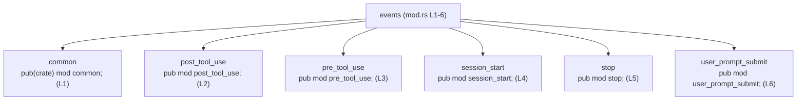

# hooks/src/events/mod.rs コード解説

## 0. ざっくり一言

- `hooks` クレート内の `events` モジュール直下にあるサブモジュールを宣言し、それぞれの公開範囲（`pub` / `pub(crate)`）を定めている集約用モジュールです（`hooks/src/events/mod.rs:L1-6`）。

---

## 1. このモジュールの役割

### 1.1 概要

- このモジュールは、`events` ディレクトリ配下のイベント関連サブモジュールを宣言し、クレート内外からのアクセス方法を決める役割を持ちます。
- 実際の処理ロジック（関数・構造体など）はすべて別ファイル（各サブモジュール側）にあり、このファイルには定義されていません（`hooks/src/events/mod.rs:L1-6`）。

### 1.2 アーキテクチャ内での位置づけ

- `hooks::events` モジュールの入口として機能し、そこから各サブモジュールへコンパイル時依存関係が張られます。
- 可視性は以下のように分かれています。
  - `common`: クレート内からのみ参照可能（`pub(crate)`、`L1`）
  - `post_tool_use`, `pre_tool_use`, `session_start`, `stop`, `user_prompt_submit`: クレート外からも参照可能（`pub`、`L2-6`）



### 1.3 設計上のポイント

- サブモジュールを 1 箇所（`mod.rs`）に集約して宣言する構成になっています（`L1-6`）。
- `common` だけを `pub(crate)` とし、他を `pub` にすることで、「内部共通コード」と「外部にも公開するイベント別コード」を分けています（`L1-6`）。
- このファイル内には関数・構造体・列挙体などのロジックは一切定義されていません（`L1-6`）。

---

## 2. 主要な機能一覧

このファイル自体の「機能」は、サブモジュールの宣言と公開範囲の制御に限られます。

- `common` サブモジュールの宣言（クレート内公開）: `pub(crate) mod common;`（`L1`）
- `post_tool_use` サブモジュールの宣言（クレート外にも公開）: `pub mod post_tool_use;`（`L2`）
- `pre_tool_use` サブモジュールの宣言（クレート外にも公開）: `pub mod pre_tool_use;`（`L3`）
- `session_start` サブモジュールの宣言（クレート外にも公開）: `pub mod session_start;`（`L4`）
- `stop` サブモジュールの宣言（クレート外にも公開）: `pub mod stop;`（`L5`）
- `user_prompt_submit` サブモジュールの宣言（クレート外にも公開）: `pub mod user_prompt_submit;`（`L6`）

---

## 3. 公開 API と詳細解説

### 3.0 このチャンクにおけるコンポーネントインベントリー

このファイル（チャンク 1/1）に現れるコンポーネントは、**モジュール宣言のみ**です。関数・構造体・列挙体などの定義はありません。

#### モジュール一覧

| 名前                | 種別     | 公開範囲                | 概要（このチャンクから分かること）                                      | 定義位置                         |
|---------------------|----------|-------------------------|--------------------------------------------------------------------------|----------------------------------|
| `common`            | モジュール | クレート内（`pub(crate)`） | `events` 配下のサブモジュールとして宣言されている。中身はこのチャンクには現れない。 | `hooks/src/events/mod.rs:L1`     |
| `post_tool_use`     | モジュール | クレート外にも公開（`pub`） | 同上。サブモジュールとして宣言されていることのみ分かる。                | `hooks/src/events/mod.rs:L2`     |
| `pre_tool_use`      | モジュール | クレート外にも公開（`pub`） | 同上。                                                                  | `hooks/src/events/mod.rs:L3`     |
| `session_start`     | モジュール | クレート外にも公開（`pub`） | 同上。                                                                  | `hooks/src/events/mod.rs:L4`     |
| `stop`              | モジュール | クレート外にも公開（`pub`） | 同上。                                                                  | `hooks/src/events/mod.rs:L5`     |
| `user_prompt_submit`| モジュール | クレート外にも公開（`pub`） | 同上。                                                                  | `hooks/src/events/mod.rs:L6`     |

#### このチャンク内に定義される関数・構造体

| 種別       | 名前 | 備考 |
|------------|------|------|
| 関数       | なし | このファイルには関数定義はありません（`L1-6`）。 |
| 構造体     | なし | 同上。 |
| 列挙体     | なし | 同上。 |
| トレイト   | なし | 同上。 |

### 3.1 型一覧（構造体・列挙体など）

- このファイルには、構造体・列挙体・トレイトなどの型定義は存在しません（`hooks/src/events/mod.rs:L1-6`）。
- 型が登場するのは、各サブモジュール側です（このチャンクには現れません）。

### 3.2 関数詳細（最大 7 件）

- このファイルには関数定義が 1 つもないため、詳細解説対象となる関数はありません（`hooks/src/events/mod.rs:L1-6`）。
- 関数の公開 API やコアロジックは、`post_tool_use` など各サブモジュール側にあると考えられますが、このチャンクには現れないため内容は不明です。

### 3.3 その他の関数

- 該当なし（関数が存在しません）。

---

## 4. データフロー

このファイル単体からは、実行時のデータフローやイベント処理の内容は読み取れません。  
ここでは、**Rust のモジュール解決と利用の流れ**に限定して図示します。

### モジュール解決の流れ（コンパイル時）

別モジュールから `events` 配下のサブモジュールを利用する場合の依存関係イメージです。

```mermaid
sequenceDiagram
    participant Caller as 呼び出し側モジュール
    participant Events as crate::events<br/>(mod.rs L1-6)
    participant PT as events::post_tool_use<br/>(宣言: L2)

    Caller->>Events: use crate::events::post_tool_use;
    Note over Events: mod post_tool_use; により<br/>サブモジュールを解決（L2）
    Events-->>PT: コンパイル時にサブモジュールをリンク
    Caller->>PT: post_tool_use 内の公開APIを利用<br/>(具体的なAPIはこのチャンクには現れない)
```

- 重要な点は、「`mod post_tool_use;` が存在することで、`crate::events::post_tool_use` というパスが有効になる」ということです（`L2`）。
- 実際にどのようなデータが流れるか、どの関数が呼び出されるかは、このファイルだけからは不明です。

---

## 5. 使い方（How to Use）

### 5.1 基本的な使用方法

このモジュールの主な使い方は、「他のコードから `events` 配下のサブモジュールにアクセスするための入口」として利用することです。

#### クレート内部からの利用例

```rust
// events モジュール配下の post_tool_use サブモジュールをインポートする
use crate::events::post_tool_use; // 有効なのは mod.rs に `pub mod post_tool_use;` があるため（L2）

// common は pub(crate) なので、同じクレート内であればインポート可能
use crate::events::common; // `pub(crate) mod common;` によってクレート内限定で公開（L1）
```

#### クレート外からの利用例（クレート名は仮に your_crate_name とします）

```rust
// library クレート your_crate_name の利用側コード

// 外部クレートからは pub なサブモジュールのみ利用可能
use your_crate_name::events::post_tool_use;       // L2 の `pub mod post_tool_use;` により有効
use your_crate_name::events::pre_tool_use;        // L3
use your_crate_name::events::session_start;       // L4
use your_crate_name::events::stop;                // L5
use your_crate_name::events::user_prompt_submit;  // L6

// common は pub(crate) なので、外部クレートからは参照できない
// use your_crate_name::events::common; // コンパイルエラーになる
```

※ 具体的にどの関数を呼ぶかは、各サブモジュールの中身がこのチャンクにはないため不明です。

### 5.2 よくある使用パターン

このファイルの役割は「モジュールの公開」であり、典型的なパターンは以下のとおりです。

- クレート内の他モジュールが、`crate::events::...` 経由でイベント別モジュールを `use` する。
- 外部クレートが、`your_crate_name::events::...` 経由でイベント別モジュールを `use` する（`pub` のみ）。

### 5.3 よくある間違い

#### 1. `pub(crate)` と `pub` の違いに起因する利用エラー

```rust
// 間違い例: 外部クレートから common を使おうとしている
// use your_crate_name::events::common; // コンパイルエラー（L1 は pub(crate)）

// 正しい例: common はクレート内部でのみ利用する
use crate::events::common; // 同一クレート内からの利用は OK（L1）
```

#### 2. mod 宣言に対応するファイルが存在しない

- `pub mod post_tool_use;`（`L2`）に対応する `post_tool_use.rs` か `post_tool_use/mod.rs` が存在しない場合、コンパイルエラーになります。
- 実際のファイル構成はこのチャンクには含まれませんが、Rust のモジュール規則としてこの制約が存在します。

### 5.4 使用上の注意点（まとめ）

- 可視性:
  - 外部クレートから利用可能なのは `pub` なサブモジュールのみです（`L2-6`）。
  - `common` はクレート内部専用です（`L1`）。
- 契約・前提条件:
  - 各 `mod` 宣言に対応するソースファイルがプロジェクト内に存在している必要があります（存在しないとコンパイルエラー）。
- セキュリティ・公開範囲:
  - `pub` を付けると、そのサブモジュールの API がクレート外にも公開されます。意図せず外部に露出したくないものは `pub(crate)` か非公開にする必要があります。

---

## 6. 変更の仕方（How to Modify）

### 6.1 新しい機能を追加する場合

新しいイベント用サブモジュールを追加する機械的な手順です。

1. `hooks/src/events/` 配下に新しいファイルを作成する  
   - 例: `new_event.rs` または `new_event/mod.rs`（実際のファイル名はプロジェクト構成に依存）
2. `hooks/src/events/mod.rs` に対応する `mod` 宣言を追加する  
   - クレート外にも公開したい場合:

     ```rust
     pub mod new_event;
     ```

   - クレート内専用にしたい場合:

     ```rust
     pub(crate) mod new_event;
     ```

3. 必要に応じて、他のモジュールから `use crate::events::new_event;` などで利用します。

### 6.2 既存の機能を変更する場合

このファイルでの典型的な変更は「公開範囲の変更」です。

- 例: `stop` を外部公開したくない場合（現在は `pub mod stop;` `L5`）:

  ```rust
  // 変更前（クレート外にも公開）
  pub mod stop;

  // 変更後（クレート内限定公開）
  pub(crate) mod stop;
  ```

- 変更時に確認すべき点:
  - 外部クレートから `events::stop` を使用しているコードがないか（あればコンパイルエラーになる）。
  - クレート内部からの利用は引き続き可能か（`crate::events::stop` でアクセスできるか）。
- 逆に、`common` を外部にも公開したい場合は `pub(crate)` を `pub` に変更できますが、内部実装を外部に晒すことになるため、公開ポリシーに注意が必要です。

---

## 7. 関連ファイル

このファイルから推定できる関連ファイルは、Rust の通常のモジュール探索規則に基づきます。  
実際にどちらのパスが使われているかは、このチャンクからは分かりません。

| パス候補                                   | 役割 / 関係                                                                                  |
|--------------------------------------------|---------------------------------------------------------------------------------------------|
| `hooks/src/events/common.rs` または `hooks/src/events/common/mod.rs` | `pub(crate) mod common;`（L1）に対応するサブモジュール。中身はこのチャンクには現れません。 |
| `hooks/src/events/post_tool_use.rs` または `hooks/src/events/post_tool_use/mod.rs` | `pub mod post_tool_use;`（L2）に対応するサブモジュール。                                   |
| `hooks/src/events/pre_tool_use.rs` または `hooks/src/events/pre_tool_use/mod.rs`  | `pub mod pre_tool_use;`（L3）に対応するサブモジュール。                                    |
| `hooks/src/events/session_start.rs` または `hooks/src/events/session_start/mod.rs` | `pub mod session_start;`（L4）に対応するサブモジュール。                                   |
| `hooks/src/events/stop.rs` または `hooks/src/events/stop/mod.rs`                    | `pub mod stop;`（L5）に対応するサブモジュール。                                            |
| `hooks/src/events/user_prompt_submit.rs` または `hooks/src/events/user_prompt_submit/mod.rs` | `pub mod user_prompt_submit;`（L6）に対応するサブモジュール。                             |

---

### Bugs / Security / Edge cases / Performance について

- このファイルには実行時ロジックが存在しないため、直接的なバグ・セキュリティ問題・パフォーマンス問題は見当たりません（`L1-6`）。
- リスクがあるとすれば、「本来内部に留めるべきモジュールを `pub` にしてしまう」「`mod` 宣言とファイル構成がずれてコンパイルできなくなる」といった公開範囲・構成管理上の問題になります。  
  これらはコードの動作というより、API デザインとビルド管理上の注意点です。
