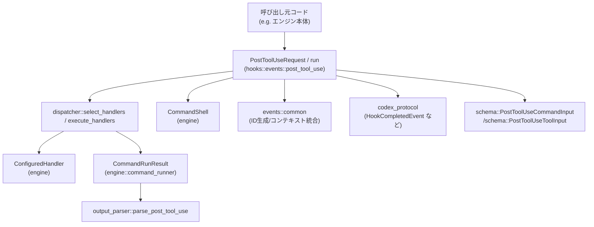
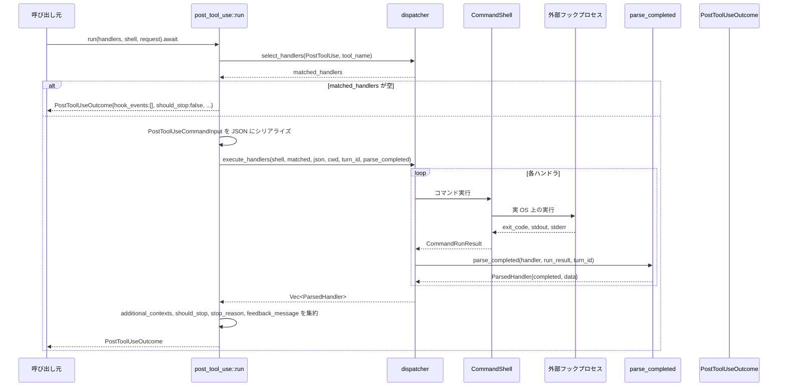

# hooks/src/events/post_tool_use.rs コード解説

## 0. ざっくり一言

このモジュールは、ツール実行後の「PostToolUse」フックを実行・解析し、  
外部フックスクリプトの出力から「止めるかどうか」「モデルに返す文脈やフィードバック」を取りまとめる処理を提供します（根拠: `post_tool_use.rs:L52-153`, `L155-291`）。

---

## 1. このモジュールの役割

### 1.1 概要

- このモジュールは **PostToolUse フック**（ツール実行後に呼ばれる拡張ポイント）を扱います。
- 設定されたハンドラ（外部コマンド）を選択・実行し、その結果を `HookCompletedEvent` と各種フラグ (`should_stop` など) に集約します（`run`）（`post_tool_use.rs:L68-153`）。
- フックコマンドの標準出力・終了コードを解析し、失敗・ブロック・停止・追加コンテキスト・フィードバックなどの状態にマッピングします（`parse_completed`）（`post_tool_use.rs:L155-291`）。

### 1.2 アーキテクチャ内での位置づけ

主な関係は次のとおりです。

- 上位レイヤからは `PostToolUseRequest` を渡して `preview` / `run` を呼びます（`post_tool_use.rs:L21-33`, `L52-66`, `L68-153`）。
- 実際のフック実行は `crate::engine::dispatcher` に委譲します（`post_tool_use.rs:L56-60`, `L73-77`, `L115-123`, `L279-280`）。
- フックの JSON 出力の詳細なパースは `crate::engine::output_parser::parse_post_tool_use` に委譲します（`post_tool_use.rs:L179-180`）。
- 汎用的な共通処理（ID 付与、追加コンテキストのマージ、シリアライズ失敗時の扱いなど）は `super::common` にあります（`post_tool_use.rs:L12`, `L63`, `L105-111`, `L125-139`, `L145-146`, `L191-195`）。

依存関係を図示します（範囲: `run`/`parse_completed` = `post_tool_use.rs:L68-153`, `L155-291`）:



### 1.3 設計上のポイント

- **責務分割**
  - `run` は「ハンドラ選択＋実行＋集約」のオーケストレーションのみを担当します（`post_tool_use.rs:L68-153`）。
  - 実際のフック結果解釈（ステータス・エントリ・追加コンテキスト・フィードバック）は `parse_completed` に切り出されています（`post_tool_use.rs:L155-291`）。
- **状態管理**
  - フックごとの一時的な状態は `PostToolUseHandlerData` に保持します（`post_tool_use.rs:L44-50`）。
  - モジュール自体はグローバルな可変状態を持たず、関数はすべて引数と戻り値で完結します（関数定義全体より）。
- **エラーハンドリング方針**
  - JSON 入力のシリアライズ失敗は早期に `serialization_failure_outcome` で処理し、適切な `HookCompletedEvent` を返します（`post_tool_use.rs:L88-113`, `L293-301`）。
  - フック実行時のエラーや終了コードは、`HookRunStatus` と `HookOutputEntry` にマッピングされ、呼び出し元は構造化された情報として扱えます（`post_tool_use.rs:L155-275`）。
- **並行性**
  - `run` は `async fn` として定義され、`dispatcher::execute_handlers` の非同期実行を `await` します（`post_tool_use.rs:L68`, `L115-123`）。
  - このモジュール内では共有可変状態や `unsafe` は使用しておらず（ファイル全体より）、スレッド安全性は主に呼び出し元と `dispatcher` に依存します。

---

## 2. 主要な機能一覧（コンポーネントインベントリー含む）

### 2.1 型・関数のインベントリー

このチャンクに定義されている主な型・関数の一覧です。

#### 型

| 名前 | 種別 | 可視性 | 役割 / 用途 | 定義位置 |
|------|------|--------|-------------|----------|
| `PostToolUseRequest` | 構造体 | `pub` | PostToolUse フック実行に必要なコンテキスト（セッション・ツール情報・ツール応答など）を保持します。 | `post_tool_use.rs:L21-33` |
| `PostToolUseOutcome` | 構造体 | `pub` | フック実行後の結果（`HookCompletedEvent` 一覧、停止フラグ、追加コンテキスト、フィードバック）を保持します。 | `post_tool_use.rs:L35-42` |
| `PostToolUseHandlerData` | 構造体 | `pub(crate)` 外（テストでは `use super::PostToolUseHandlerData;`） | 単一ハンドラの解析結果（停止フラグ、停止理由、追加コンテキスト、フィードバック）を保持します。`ParsedHandler` の `data` として利用されます。 | `post_tool_use.rs:L44-50` |

#### 関数（本体）

| 関数名 | 可視性 | 役割 / 用途 | 定義位置 |
|--------|--------|-------------|----------|
| `preview` | `pub(crate)` | 実際にフックを実行せず、どのハンドラが PostToolUse 用にマッチするかを `HookRunSummary` として一覧します。 | `post_tool_use.rs:L52-66` |
| `run` | `pub(crate)` `async` | PostToolUse フックを実行し、全ハンドラの結果を `PostToolUseOutcome` に集約します。 | `post_tool_use.rs:L68-153` |
| `parse_completed` | `fn`（モジュール内） | 個々のハンドラ実行結果 (`CommandRunResult`) を解析し、`ParsedHandler<PostToolUseHandlerData>` に変換します。 | `post_tool_use.rs:L155-291` |
| `serialization_failure_outcome` | `fn`（モジュール内） | 入力シリアライズに失敗した場合のデフォルト `PostToolUseOutcome` を構築します。 | `post_tool_use.rs:L293-301` |

#### テスト用関数

| 関数名 | 種類 | 役割 / 用途 | 定義位置 |
|--------|------|-------------|----------|
| 各種 `#[test]` 関数 | テスト | `parse_completed` と `preview` のさまざまな条件下での振る舞いを検証します。 | `post_tool_use.rs:L322-510` |
| `handler` | テストヘルパ | PostToolUse 用のダミー `ConfiguredHandler` を作成します。 | `post_tool_use.rs:L513-523` |
| `run_result` | テストヘルパ | ダミーの `CommandRunResult` を作成します。 | `post_tool_use.rs:L525-535` |
| `request_for_tool_use` | テストヘルパ | ダミーの `PostToolUseRequest` を作成します。 | `post_tool_use.rs:L537-549` |

---

## 3. 公開 API と詳細解説

### 3.1 型一覧（詳細）

| 名前 | フィールド（要約） | 説明 | 根拠 |
|------|--------------------|------|------|
| `PostToolUseRequest` | `session_id: ThreadId`, `turn_id: String`, `cwd: PathBuf`, `transcript_path: Option<PathBuf>`, `model: String`, `permission_mode: String`, `tool_name: String`, `tool_use_id: String`, `command: String`, `tool_response: Value` | PostToolUse フックに渡される全コンテキストをまとめた入力です。セッション・ターン・カレントディレクトリ・モデル設定・対象ツールやツール応答などを含みます。 | `post_tool_use.rs:L21-33` |
| `PostToolUseOutcome` | `hook_events: Vec<HookCompletedEvent>`, `should_stop: bool`, `stop_reason: Option<String>`, `additional_contexts: Vec<String>`, `feedback_message: Option<String>` | フック処理全体の結果です。各ハンドラの完了イベント一覧のほか、実際に処理を止めるべきか、停止理由、モデルに渡す追加コンテキストやフィードバックを集約しています。 | `post_tool_use.rs:L35-42`, `L141-152` |
| `PostToolUseHandlerData` | `should_stop: bool`, `stop_reason: Option<String>`, `additional_contexts_for_model: Vec<String>`, `feedback_messages_for_model: Vec<String>` | 個々のハンドラが示した「停止要求」「理由」「追加文脈」「フィードバック」を保持します。`run` ではこれらを集約して `PostToolUseOutcome` を構築します。 | `post_tool_use.rs:L44-50`, `L125-139`, `L284-289` |

### 3.2 関数詳細

#### `preview(handlers: &[ConfiguredHandler], request: &PostToolUseRequest) -> Vec<HookRunSummary>`

**概要**

- PostToolUse イベントに対して実際にどのハンドラがマッチするかを確認するためのプレビュー機能です。
- フックコマンドを実行せず、`HookRunSummary` の一覧だけを返します（根拠: `post_tool_use.rs:L52-66`）。

**引数**

| 引数名 | 型 | 説明 |
|--------|----|------|
| `handlers` | `&[ConfiguredHandler]` | 全ての設定済みフックハンドラ一覧。`dispatcher::select_handlers` でフィルタされます。 |
| `request` | `&PostToolUseRequest` | 対象の PostToolUse イベント情報。`tool_name` と `tool_use_id` が利用されます。 |

**戻り値**

- `Vec<HookRunSummary>`  
  PostToolUse イベントにマッチした各ハンドラの実行サマリ（まだ実行されていない情報）です（`post_tool_use.rs:L56-65`）。

**内部処理の流れ**

1. `dispatcher::select_handlers` を呼び、`HookEventName::PostToolUse` かつ `matcher` が `request.tool_name` にマッチするハンドラだけを抽出します（`post_tool_use.rs:L56-60`）。
2. 抽出された各ハンドラに対し、`dispatcher::running_summary(&handler)` でベースの `HookRunSummary` を作ります（`post_tool_use.rs:L63`）。
3. そのサマリに対して `common::hook_run_for_tool_use(..., &request.tool_use_id)` を適用し、tool_use_id を組み込んだ ID などに変換します（`post_tool_use.rs:L63`）。
4. 最終的な `HookRunSummary` のベクタを返します（`post_tool_use.rs:L61-65`）。

**Examples（使用例）**

テスト内の `preview_and_completed_run_ids_include_tool_use_id` が利用例になっています（`post_tool_use.rs:L480-486`）。

```rust
// テストコード相当の簡略例
let request = request_for_tool_use("tool-call-456"); // ダミーの PostToolUseRequest を構築（L537-549）
let runs = preview(&[handler()], &request);          // 単一の ConfiguredHandler に対する preview（L481-483）

assert_eq!(runs.len(), 1);
assert_eq!(
    runs[0].id,
    "post-tool-use:0:/tmp/hooks.json:tool-call-456"
); // tool_use_id が ID に含まれることを確認（L485）
```

**Errors / Panics**

- この関数内では `Result` や `panic!` は使用されておらず、`dispatcher::select_handlers`・`common::hook_run_for_tool_use` がパニックしない前提で、常に `Vec` を返します（`post_tool_use.rs:L52-66`）。
- 例外的なエラー状況は、呼び出し元・`dispatcher` 側で扱われる設計です（詳細はこのチャンクには現れません）。

**Edge cases（エッジケース）**

- `handlers` にマッチするハンドラが一つもない場合、空の `Vec` を返します（`select_handlers` が空ベクタを返す可能性）（`post_tool_use.rs:L56-60`）。
- `request.tool_name` がハンドラの `matcher` とマッチしない場合も同様です。

**使用上の注意点**

- 実際には外部コマンドを実行しないため、「実行結果」ではなく「実行予定一覧」を知るための API です。
- `run` と同じフィルタロジックを使用するため、「どのハンドラが走るか」を事前に確認する用途に向きます。

---

#### `run(handlers: &[ConfiguredHandler], shell: &CommandShell, request: PostToolUseRequest) -> PostToolUseOutcome`

**概要**

- PostToolUse フックを実行するメイン関数です。
- 対象のハンドラを選択し、非同期に外部コマンドを実行し、`parse_completed` で結果を解析したうえで `PostToolUseOutcome` に集約します（`post_tool_use.rs:L68-153`）。

**引数**

| 引数名 | 型 | 説明 |
|--------|----|------|
| `handlers` | `&[ConfiguredHandler]` | 全フックハンドラ一覧。PostToolUse イベントにマッチするものだけが選択されます。 |
| `shell` | `&CommandShell` | コマンド実行に使用するシェル・ランナーの抽象。`dispatcher::execute_handlers` に渡されます。 |
| `request` | `PostToolUseRequest` | PostToolUse フック対象のコンテキスト。所有権は `run` に移動します。 |

**戻り値**

- `PostToolUseOutcome`  
  全ハンドラを実行・解析した結果の集約です（`post_tool_use.rs:L141-152`）。

**内部処理の流れ**

1. `dispatcher::select_handlers` で PostToolUse 用かつ `tool_name` がマッチするハンドラを抽出します（`post_tool_use.rs:L73-77`）。
2. 抽出結果が空の場合、フックを一切実行せず、空の `hook_events`・`should_stop=false` などを持つ `PostToolUseOutcome` を即座に返します（`post_tool_use.rs:L78-86`）。
3. `PostToolUseCommandInput` 構造体を組み立て、`serde_json::to_string` で JSON 文字列にシリアライズします（`post_tool_use.rs:L88-102`）。
   - `tool_name` フィールドはここでは `"Bash"` に固定されています（`post_tool_use.rs:L96`）。
4. シリアライズに失敗した場合、`common::serialization_failure_hook_events_for_tool_use` で `HookCompletedEvent` を生成し（`post_tool_use.rs:L105-110`）、`serialization_failure_outcome` で失敗用の `PostToolUseOutcome` を返します（`post_tool_use.rs:L111-112`, `L293-301`）。
5. シリアライズに成功した場合、`dispatcher::execute_handlers` を呼び出し、各ハンドラを非同期に実行します。`parse_completed` がコールバックとして渡され、各ハンドラの `CommandRunResult` を `ParsedHandler<PostToolUseHandlerData>` に変換します（`post_tool_use.rs:L115-123`）。
6. 実行結果（`results`）から以下を集約します（`post_tool_use.rs:L125-139`）。
   - `additional_contexts`: `common::flatten_additional_contexts` で複数ハンドラの追加文脈を統合。
   - `should_stop`: どれか一つでも `PostToolUseHandlerData.should_stop` が `true` なら `true`。
   - `stop_reason`: 最初に見つかった `stop_reason` を採用。
   - `feedback_message`: 全ハンドラの `feedback_messages_for_model` を集めて `common::join_text_chunks` で結合。
7. 最後に `PostToolUseOutcome` を構築します（`post_tool_use.rs:L141-152`）。
   - `hook_events` は各 `ParsedHandler.completed` を `common::hook_completed_for_tool_use` で加工し、`tool_use_id` を ID などに埋め込んだ形で格納します（`post_tool_use.rs:L142-147`）。

**Examples（使用例）**

簡略化した実行例です（テストの `request_for_tool_use` を利用: `post_tool_use.rs:L537-549`）。

```rust
use crate::events::post_tool_use::{PostToolUseRequest, run};
use crate::engine::{ConfiguredHandler, CommandShell};

async fn handle_post_tool_use(
    handlers: &[ConfiguredHandler],
    shell: &CommandShell,
) -> anyhow::Result<()> {
    // PostToolUseRequest を組み立てる（詳細はアプリケーション側のロジック）
    let request = PostToolUseRequest {
        // ... session_id, turn_id, cwd, model, tool_name などをセットする
        // この例では省略
        session_id: ThreadId::new(),
        turn_id: "turn-1".to_string(),
        cwd: std::path::PathBuf::from("/tmp"),
        transcript_path: None,
        model: "gpt-test".to_string(),
        permission_mode: "default".to_string(),
        tool_name: "Bash".to_string(),
        tool_use_id: "tool-call-456".to_string(),
        command: "echo hello".to_string(),
        tool_response: serde_json::json!({"ok": true}),
    };

    let outcome = run(handlers, shell, request).await;

    // should_stop や additional_contexts を見て後続処理を制御する
    if outcome.should_stop {
        println!("Stopped by hook: {:?}", outcome.stop_reason);
    }
    for ctx in outcome.additional_contexts {
        println!("Additional context: {}", ctx);
    }
    if let Some(feedback) = outcome.feedback_message {
        println!("Model feedback: {}", feedback);
    }

    Ok(())
}
```

**Errors / Panics**

- JSON シリアライズエラー  
  - `serde_json::to_string` が `Err` の場合、`serialization_failure_outcome` を通じて「フック未実行だがエラーイベントあり」のような `PostToolUseOutcome` を返します（`post_tool_use.rs:L88-113`, `L293-301`）。
  - パニックにはせず、エラーはフックイベントとして外部に通知されます。
- フックコマンド実行時のエラー／状態コード  
  - 個々のエラー処理は `parse_completed` に委ねられます（`post_tool_use.rs:L115-123`, `L155-275`）。
  - `run` 自体は `Result` を返さず、常に `PostToolUseOutcome` を返す設計です。
- パニックの可能性  
  - この関数内に `unwrap` 等はなく、明示的なパニック要因は見当たりません（ファイル全体より）。
  - ただし、呼び出される外部関数（`dispatcher` や `common`）がパニックするかどうかはこのチャンクからは分かりません。

**Edge cases（エッジケース）**

- **マッチするハンドラがない**  
  - `matched.is_empty()` の場合、外部コマンドは一切実行されず、`hook_events` は空、`should_stop=false` の `PostToolUseOutcome` がそのまま返されます（`post_tool_use.rs:L73-86`）。
- **シリアライズ失敗**  
  - 失敗しても `run` はパニックせず、`serialization_failure_outcome` で標準化された失敗結果を返します（`post_tool_use.rs:L88-113`, `L293-301`）。
- **複数ハンドラが異なる `stop_reason` を返すケース**  
  - `stop_reason` は `results.iter().find_map` で最初に見つかったものだけを採用します（`post_tool_use.rs:L131-133`）。
  - `should_stop` は「どれか一つでも `true` なら `true`」です（`post_tool_use.rs:L130`）。

**使用上の注意点**

- `run` は `async fn` のため、Tokio などの非同期ランタイム上で `.await` する必要があります（`post_tool_use.rs:L68`, `L115-123`）。
- `request` は所有権ごと `run` に渡されるので、呼び出し後は `request` を再利用できません（Rust の所有権仕様に基づきます）。
- `PostToolUseCommandInput.tool_name` が `"Bash"` にハードコードされています（`post_tool_use.rs:L96`）。  
  - このコードからは、「PostToolUse フックは Bash ツール専用である」という前提が置かれているように読み取れます。
  - 他ツールに対しても同じフックを使う場合は、このフィールドの扱いに注意が必要です。

---

#### `parse_completed(handler: &ConfiguredHandler, run_result: CommandRunResult, turn_id: Option<String>) -> dispatcher::ParsedHandler<PostToolUseHandlerData>`

**概要**

- 単一の PostToolUse フックハンドラ実行結果（外部コマンドの実行結果）を解析し、`HookRunStatus`・`HookOutputEntry` 一覧・`PostToolUseHandlerData` に変換します（`post_tool_use.rs:L155-291`）。
- フックの標準出力（JSON 形式を想定）、標準エラー、終了コード、実行エラーを見て、  
  「成功・停止・ブロック・失敗」「モデルへのフィードバック・追加コンテキスト」などを決定します。

**引数**

| 引数名 | 型 | 説明 |
|--------|----|------|
| `handler` | `&ConfiguredHandler` | 実行したハンドラ設定。`dispatcher::completed_summary` に渡され、イベントのメタデータに反映されます。 |
| `run_result` | `CommandRunResult` | 外部コマンドの実行結果（終了コード・stdout/stderr・エラー情報など）です。 |
| `turn_id` | `Option<String>` | このフック実行が紐づくターン ID。`HookCompletedEvent.turn_id` に保存されます。 |

**戻り値**

- `dispatcher::ParsedHandler<PostToolUseHandlerData>`  
  - `completed`: `HookCompletedEvent`（`HookRunStatus` や `HookOutputEntry` を含む）  
  - `data`: `PostToolUseHandlerData`（停止フラグ、停止理由、追加文脈、フィードバック）

**内部処理の流れ（アルゴリズム）**

1. 初期状態として、`status = HookRunStatus::Completed`、`entries = Vec::new()`、その他フラグ／ベクタを空で用意します（`post_tool_use.rs:L160-165`）。
2. `run_result.error` を確認し、`Some(error)` の場合は
   - `status = Failed` に変更。
   - `HookOutputEntryKind::Error` のエントリを追加（`error.to_string()`）します（`post_tool_use.rs:L167-174`）。
3. `run_result.error` が `None` の場合は `exit_code` によって分岐します（`post_tool_use.rs:L175-275`）。
   - **`Some(0)`（正常終了）**（`post_tool_use.rs:L176-244`）
     1. `stdout.trim()` を `trimmed_stdout` として取得します（`post_tool_use.rs:L177-178`）。
     2. 空文字列なら何もしません（`post_tool_use.rs:L178-179`）。
     3. 非空で `output_parser::parse_post_tool_use(&run_result.stdout)` が `Some(parsed)` を返した場合（`post_tool_use.rs:L179-180`）:
        - `parsed.universal.system_message` があれば `Warning` エントリを追加（`post_tool_use.rs:L181-186`）。
        - `invalid_reason` と `invalid_block_reason` が両方 `None` で、`additional_context` がある場合は `common::append_additional_context` で `entries` と `additional_contexts_for_model` に反映（`post_tool_use.rs:L187-195`）。
        - `parsed.universal.continue_processing` が `false` の場合:
          - `status = Stopped`、`should_stop = true`、`stop_reason = parsed.universal.stop_reason.clone()`（`post_tool_use.rs:L197-201`）。
          - `stop_reason` か `"PostToolUse hook stopped execution"` を `Stop` エントリとして追加（`post_tool_use.rs:L201-207`）。
          - `parsed.reason` をトリムして非空ならそれをフィードバック、それ以外は `stop_text` をフィードバックとして `feedback_messages_for_model` に追加（`post_tool_use.rs:L209-214`）。
        - そうでなければ、`invalid_reason` / `invalid_block_reason` / `should_block` の順に評価します（`post_tool_use.rs:L215-236`）。
          - `invalid_reason` があれば `status = Failed` + `Error` エントリ。
          - `invalid_block_reason` があれば同様に `Error` エントリ。
          - `should_block` が `true` なら `status = Blocked` とし、`parsed.reason` があれば `Feedback` エントリと `feedback_messages_for_model` に追加。
     4. `parse_post_tool_use` が `None` で、かつ `trimmed_stdout` が `{` もしくは `[` で始まる場合は  
        `status = Failed` とし、「invalid post-tool-use JSON output」という `Error` エントリを追加します（`post_tool_use.rs:L237-242`）。
     5. それ以外の（プレーンテキスト）stdout は無視されます（`plain_stdout_is_ignored_for_post_tool_use` テストの期待: `post_tool_use.rs:L458-477`）。
   - **`Some(2)`**（特別扱いの終了コード）:  
     - `stderr` を `common::trimmed_non_empty` に通し、文字列が取れた場合は `Feedback` エントリとして追加し、`feedback_messages_for_model` にも保存します（`post_tool_use.rs:L245-252`）。
     - `stderr` が空だった場合は `status = Failed` とし、「exited with code 2 but did not write feedback」の `Error` エントリを追加します（`post_tool_use.rs:L252-258`）。
     - この分岐では `status` を `Blocked` や `Stopped` に変更せず、初期の `Completed` のままである点に注意が必要です（`post_tool_use.rs:L160-162`, `L245-259`）。テストでも「ブロックせずフィードバックのみ」として検証されています（`post_tool_use.rs:L407-425`）。
   - **その他の `Some(exit_code)`**（`!= 0, 2`）:  
     - `status = Failed` に変更し、「hook exited with code {exit_code}」の `Error` エントリを追加します（`post_tool_use.rs:L260-265`）。
   - **`None`（終了コードなし）**:  
     - `status = Failed` に変更し、「hook exited without a status code」の `Error` エントリを追加します（`post_tool_use.rs:L267-272`）。
4. 最終的に `HookCompletedEvent` を構築し、`dispatcher::completed_summary` を利用して `run` 部分を埋めます（`post_tool_use.rs:L277-280`）。
5. `dispatcher::ParsedHandler { completed, data: PostToolUseHandlerData { ... } }` を返します（`post_tool_use.rs:L282-290`）。

**Examples（使用例）**

テストコードが典型的な使用例です。例えば「continue=false で停止するケース」（`post_tool_use.rs:L427-455`）:

```rust
let parsed = parse_completed(
    &handler(),                                           // テスト用 ConfiguredHandler（L513-523）
    run_result(
        Some(0),
        r#"{"continue":false,"stopReason":"halt after bash output","reason":"post-tool hook says stop"}"#,
        "",
    ),                                                    // stdout に JSON、exit_code=0（L431-435）
    Some("turn-1".to_string()),
);

assert_eq!(
    parsed.data,
    PostToolUseHandlerData {
        should_stop: true,
        stop_reason: Some("halt after bash output".to_string()),
        additional_contexts_for_model: Vec::new(),
        feedback_messages_for_model: vec!["post-tool hook says stop".to_string()],
    }
);
assert_eq!(parsed.completed.run.status, HookRunStatus::Stopped);
```

**Errors / Panics**

- すべてのエラーは `HookRunStatus` と `HookOutputEntryKind::Error/Warning/Feedback/Stop` の形に正規化されます。
- `panic!` の使用はなく、`match` 文で全ケースを網羅しているため、入力が `CommandRunResult` の前提を満たしていればパニックしない設計です（`post_tool_use.rs:L167-275`）。

**Edge cases（エッジケース）**

- **stdout が空文字（`""`）**  
  - exit_code=0 かつ `stdout.trim().is_empty()` の場合は何もせず、`status=Completed` かつエントリなしのまま終了します（`post_tool_use.rs:L177-179`）。
- **stdout がプレーンテキスト（JSON ではない）**  
  - `parse_post_tool_use` が `None` を返し、さらに `{`/`[` で始まらない場合は無視されます（`post_tool_use.rs:L179-180`, `L237-243` と `plain_stdout_is_ignored_for_post_tool_use` テスト: `L458-477`）。
- **stdout が JSON ライクだが、パーサが `None` を返す**  
  - 先頭が `{` または `[` の場合、「invalid post-tool-use JSON output」として `status=Failed` + `Error` エントリになります（`post_tool_use.rs:L237-242`）。
- **exit_code=2 で stderr が空**  
  - Completed ではなく `status=Failed` に変更され、エラーエントリが追加されます（`post_tool_use.rs:L252-258`）。
- **ブロック vs 停止の違い**  
  - `should_block` が `true` の場合: `status=Blocked`、`should_stop` は `false` のままです（`post_tool_use.rs:L227-235` とテスト `block_decision_stops_normal_processing`: `L322-344`）。
  - `continue_processing=false` の場合: `status=Stopped`、`should_stop=true` になります（`post_tool_use.rs:L197-215`）。

**使用上の注意点**

- `parse_post_tool_use` の仕様に強く依存します。特に `parsed.universal.continue_processing`・`should_block`・`invalid_reason`・`invalid_block_reason`・`reason`・`additional_context` などのフィールド構造はこのチャンクからは詳細不明ですが、意味的に「続行可否・ブロック・エラー理由・追加文脈」として扱われています（`post_tool_use.rs:L181-236`）。
- exit_code=2 の扱いは特別で、「モデルにフィードバックは伝えるがフローは継続する」用途に使われています（`post_tool_use.rs:L245-252`, `L407-425`）。
- `PostToolUseHandlerData.should_stop` は「Stopped 状態の時のみ true」であり、Blocked の時は false である点に注意が必要です（`post_tool_use.rs:L162`, `L197-200`, `L227-229`, テストにも反映）。

---

#### `serialization_failure_outcome(hook_events: Vec<HookCompletedEvent>) -> PostToolUseOutcome`

**概要**

- 入力 JSON のシリアライズに失敗した場合に使用される補助関数です。
- フックは実行されていないが、「シリアライズ失敗」というイベントのみを含んだ `PostToolUseOutcome` を構築します（`post_tool_use.rs:L293-301`）。

**引数**

| 引数名 | 型 | 説明 |
|--------|----|------|
| `hook_events` | `Vec<HookCompletedEvent>` | シリアライズ失敗に対応する完了イベント一覧。`common::serialization_failure_hook_events_for_tool_use` で生成されます（`post_tool_use.rs:L105-110`）。 |

**戻り値**

- `PostToolUseOutcome`  
  - `hook_events`: 引数そのまま  
  - `should_stop=false`, `stop_reason=None`, `additional_contexts` 空、`feedback_message=None`

**内部処理の流れ**

1. フィールドをそのまま詰めた `PostToolUseOutcome` リテラルを返すだけのシンプルな関数です（`post_tool_use.rs:L293-300`）。

**使用上の注意点**

- `run` 以外から直接呼び出されることは通常想定されていません（`post_tool_use.rs:L104-113`）。
- シリアライズ失敗自体は「フックの実行結果」ではありませんが、外形上は `HookCompletedEvent` として扱われます。

### 3.3 その他の関数（テスト用）

| 関数名 | 役割（1 行） | 定義位置 |
|--------|--------------|----------|
| `block_decision_stops_normal_processing` | `parse_completed` がブロック判定を `HookRunStatus::Blocked` かつ `should_stop=false` として扱うことを確認します。 | `post_tool_use.rs:L322-344` |
| `additional_context_is_recorded` | `additionalContext` が `PostToolUseHandlerData.additional_contexts_for_model` と `HookOutputEntryKind::Context` に反映されることを検証します。 | `post_tool_use.rs:L346-374` |
| `unsupported_updated_mcp_tool_output_fails_open` | `updatedMCPToolOutput` がサポートされていないケースで `HookRunStatus::Failed` + エラーエントリになることを検証します（詳細なパースロジックは別モジュール）。 | `post_tool_use.rs:L376-405` |
| `exit_two_surfaces_feedback_to_model_without_blocking` | exit_code=2 のとき、stderr のメッセージがフィードバックとして伝わるがステータスは Completed のままであることを検証します。 | `post_tool_use.rs:L407-425` |
| `continue_false_stops_with_reason` | `continue=false` 時に `Stopped` ステータス・`should_stop=true`・`stop_reason`・フィードバックが設定されることを検証します。 | `post_tool_use.rs:L427-455` |
| `plain_stdout_is_ignored_for_post_tool_use` | プレーンテキスト stdout が無視されることを検証します。 | `post_tool_use.rs:L458-477` |
| `preview_and_completed_run_ids_include_tool_use_id` | `preview` と `hook_completed_for_tool_use` で run.id に tool_use_id が含まれることを検証します。 | `post_tool_use.rs:L479-495` |
| `serialization_failure_run_ids_include_tool_use_id` | シリアライズ失敗時でも run.id に tool_use_id が含まれることを検証します。 | `post_tool_use.rs:L497-510` |
| `handler` / `run_result` / `request_for_tool_use` | テスト用のダミー `ConfiguredHandler`、`CommandRunResult`、`PostToolUseRequest` を提供します。 | `post_tool_use.rs:L513-549` |

---

## 4. データフロー

### 4.1 代表的な処理シナリオ：`run` によるフック実行

`run` を呼び出したとき、データは次のように流れます（範囲: `post_tool_use.rs:L68-153`, `L155-291`）。

1. 呼び出し元が `PostToolUseRequest` とハンドラ一覧、`CommandShell` を用意し、`run(handlers, shell, request).await` を呼びます（`post_tool_use.rs:L68-72`）。
2. `dispatcher::select_handlers` が、PostToolUse 用かつ `tool_name` にマッチする `ConfiguredHandler` を選びます（`post_tool_use.rs:L73-77`）。
3. 入力用の `PostToolUseCommandInput` を生成し JSON 文字列にシリアライズします（`post_tool_use.rs:L88-102`）。
4. `dispatcher::execute_handlers` が、各ハンドラを外部プロセスとして実行し、`CommandRunResult` を `parse_completed` に渡します（`post_tool_use.rs:L115-123`, `L155-291`）。
5. `parse_completed` が `HookCompletedEvent` と `PostToolUseHandlerData` に変換し、それらが `results: Vec<ParsedHandler<PostToolUseHandlerData>>` に集約されます。
6. `run` が `results` を走査し、`additional_contexts`・`should_stop`・`stop_reason`・`feedback_message` を計算します（`post_tool_use.rs:L125-139`）。
7. 最後に `PostToolUseOutcome` が呼び出し元に返されます（`post_tool_use.rs:L141-152`）。

Mermaid のシーケンス図（範囲: `run`/`parse_completed` = `post_tool_use.rs:L68-153`, `L155-291`）:



---

## 5. 使い方（How to Use）

### 5.1 基本的な使用方法

PostToolUse フックを利用する典型的なフローは以下の通りです。

1. ツール実行後に、セッション情報・ツール応答などを元に `PostToolUseRequest` を構築します（`post_tool_use.rs:L21-33`）。
2. ハンドラ一覧（`ConfiguredHandler` のスライス）と `CommandShell` を用意します。
3. `run` を `await` し、返ってきた `PostToolUseOutcome` を見て後続処理を分岐します。

```rust
use hooks::events::post_tool_use::{PostToolUseRequest, run};
use crate::engine::{ConfiguredHandler, CommandShell};
use codex_protocol::ThreadId;
use serde_json::json;

async fn handle_tool_use_post_hooks(
    handlers: &[ConfiguredHandler],
    shell: &CommandShell,
) {
    let request = PostToolUseRequest {
        session_id: ThreadId::new(),
        turn_id: "turn-1".to_string(),
        cwd: std::path::PathBuf::from("/tmp"),
        transcript_path: None,
        model: "gpt-test".to_string(),
        permission_mode: "default".to_string(),
        tool_name: "Bash".to_string(),              // ハンドラの matcher と一致させる必要がある
        tool_use_id: "tool-call-123".to_string(),
        command: "echo hello".to_string(),
        tool_response: json!({"ok": true}),
    };

    let outcome = run(handlers, shell, request).await;

    if outcome.should_stop {
        // フックが「停止すべき」と判断したケース
        eprintln!("Stopped by hook: {:?}", outcome.stop_reason);
        return;
    }

    if let Some(feedback) = outcome.feedback_message {
        // モデルにフィードバックを渡すなどの処理
        println!("Model feedback: {}", feedback);
    }
}
```

### 5.2 よくある使用パターン

- **事前プレビューと本実行を組み合わせる**
  - `preview` を使って「どのハンドラが実行されるか」をログに出したうえで、`run` を実行するパターンです（`post_tool_use.rs:L52-66`, テスト `preview_and_completed_run_ids_include_tool_use_id`: `L479-495`）。
- **停止とブロックの使い分け**
  - ツール実行結果が危険と判断されたが処理フローは継続したい場合 → フック側で「block」相当の出力を行い、`HookRunStatus::Blocked` とフィードバックだけを返す（`post_tool_use.rs:L227-235`, `L322-344`）。
  - 以後の処理を完全に止めたい場合 → `continue=false` と `stopReason` を指定し、「Stopped」状態と `should_stop=true` を返す（`post_tool_use.rs:L197-215`, `L427-455`）。

### 5.3 よくある間違い

```rust
// 間違い例: tool_name とハンドラの matcher が一致していない
let request = PostToolUseRequest {
    tool_name: "MyTool".to_string(),        // ハンドラ側が "^Bash$" を想定している場合（tests の handler 参照: L513-523）
    // ...
};
let outcome = run(handlers, shell, request).await;
// matched が空になり、フックが一切実行されない（post_tool_use.rs:L73-86）

// 正しい例: ハンドラの matcher に合わせる
let request = PostToolUseRequest {
    tool_name: "Bash".to_string(),          // tests の handler と一致（L515-517）
    // ...
};
let outcome = run(handlers, shell, request).await;
```

```rust
// 間違い例: exit_code=2 を「停止」と誤解する
// 実際には status=Completed のままで、should_stop=false です（L245-252, L407-425）

// 正しい理解:
let parsed = parse_completed(
    &handler(),
    run_result(Some(2), "", "post hook says pause"),
    Some("turn-1".to_string()),
);
// parsed.completed.run.status == Completed
// parsed.data.should_stop == false
// parsed.data.feedback_messages_for_model にメッセージのみ入る
```

### 5.4 使用上の注意点（まとめ）

- **前提条件**
  - `run` は非同期関数なので、Tokio 等のランタイム内で呼び出す必要があります（`post_tool_use.rs:L68`, `L115-123`）。
  - `handlers` の `ConfiguredHandler.event_name` と `tool_name` の matcher が、`request.tool_name` と整合している必要があります（`post_tool_use.rs:L73-77`, テストの `handler`: `L513-517`）。
- **エラーハンドリングの契約**
  - シリアライズ失敗は `HookCompletedEvent` として表現され、`PostToolUseOutcome` に反映されます（`post_tool_use.rs:L88-113`, `L293-301`）。
  - フックコマンド側は、終了コード・stdout JSON・stderr を通じて「停止」「ブロック」「失敗」「フィードバック」「追加文脈」を表現する必要があります（`post_tool_use.rs:L176-273`）。
- **バグ/セキュリティ上の懸念（このチャンクから読み取れる範囲）**
  - `PostToolUseCommandInput.tool_name` が `"Bash"` に固定されているため（`post_tool_use.rs:L96`）、`request.tool_name` が他値の場合に「選択されたハンドラ」と「渡されるツール名」が食い違う可能性があります。  
    ただし、このコードのみからは「PostToolUse は常に Bash 用である」という前提かどうかは断定できません。
  - 外部コマンド実行自体に伴うセキュリティリスク（任意コード実行など）は `dispatcher` や設定ファイル側の責務であり、このチャンクだけでは詳細は分かりません。
- **パフォーマンス・スケーラビリティ**
  - `dispatcher::execute_handlers` がどのような並列実行戦略を取るかは不明ですが、`run` が単一の `await` でまとめて待つ形になっているため、一度の PostToolUse で実行されるハンドラ数が多いと、その分だけ外部プロセス起動コストが増えることが想定されます（`post_tool_use.rs:L115-123`）。
  - `run` 内の集約処理はすべてメモリ内のイテレーションであり、計算量は `O(N)`（ハンドラ数に比例）です（`post_tool_use.rs:L125-139`）。
- **オブザーバビリティ（観測性）**
  - このモジュール自体はログ出力を行いませんが、`HookCompletedEvent` と `HookOutputEntry` が「観測用イベント」として機能します（`post_tool_use.rs:L4-9`, `L170-173`, `L183-185`, `L205-208`, `L218-220`, `L224-226`, `L231-233`, `L239-242`）。
  - 呼び出し元で `hook_events` を収集・ログ化することで、フックの動作トレースが可能になります（`post_tool_use.rs:L35-42`, `L141-147`）。

---

## 6. 変更の仕方（How to Modify）

### 6.1 新しい機能を追加する場合

例: PostToolUse フックで「警告レベル別の扱い」を追加したい場合。

1. **パースロジックの拡張**
   - まず `output_parser::parse_post_tool_use` 側で、必要なフィールド（例: `warningLevel`）をパースするように拡張します（このチャンクには定義がないため詳細は不明）。
2. **`PostToolUseHandlerData` の拡張**
   - 警告レベルを集約したい場合は、`PostToolUseHandlerData` にフィールドを追加します（`post_tool_use.rs:L44-50`）。
3. **`parse_completed` の分岐追加**
   - `parsed` の新フィールドを見て、必要に応じて `HookOutputEntry` を追加したり、`HookRunStatus` を変更したりします（`post_tool_use.rs:L181-236` 付近に追記）。
4. **`run` の集約処理の調整**
   - 新しいフィールドを全ハンドラから集約したい場合は、`run` 内の `results.iter()` のループにロジックを追加します（`post_tool_use.rs:L125-139`）。
5. **テストの追加**
   - `mod tests` 内に新しいテストケースを追加し、期待するステータスやエントリ、データが設定されることを検証します（既存テスト: `post_tool_use.rs:L322-510`）。

### 6.2 既存の機能を変更する場合

- **停止とブロックの基準を変更する**
  - 影響範囲:
    - `parse_completed` の `continue_processing` / `should_block` 分岐（`post_tool_use.rs:L197-215`, `L227-235`）。
    - `PostToolUseHandlerData.should_stop` の集約方法（`post_tool_use.rs:L125-131`）。
    - 該当テスト（`block_decision_stops_normal_processing`: `L322-344`, `continue_false_stops_with_reason`: `L427-455`）。
  - 変更時の注意:
    - `HookRunStatus` の意味を変える場合は、呼び出し元が前提としている契約（例えば「Blocked のときは UI 上で警告表示のみ」など）に影響します。このチャンクからは UI の詳細は分かりません。
- **exit_code=2 の扱いを変更する**
  - 現状は「Completed + フィードバックのみ」です（`post_tool_use.rs:L245-252`, `L407-425`）。
  - もしこれを「Failed」や「Stopped」と解釈するように変える場合は、テスト `exit_two_surfaces_feedback_to_model_without_blocking` を更新し、`run` の利用側のロジックも確認する必要があります。
- **シリアライズ失敗時の扱いを変える**
  - `run` 内の `Err(error)` 分岐（`post_tool_use.rs:L104-113`）と `serialization_failure_outcome`（`post_tool_use.rs:L293-301`）を変更します。
  - `common::serialization_failure_hook_events_for_tool_use` が生成するイベント ID と整合性が取れていることをテストで確認します（`post_tool_use.rs:L497-510`）。

---

## 7. 関連ファイル

このモジュールと密接に関係するファイル・モジュール（名称はコードから推測できる範囲）:

| パス / モジュール | 役割 / 関係 | 根拠 |
|-------------------|------------|------|
| `crate::engine::dispatcher` | ハンドラの選択 (`select_handlers`) と実行 (`execute_handlers`)、および `completed_summary`・`ParsedHandler` 型を提供します。PostToolUse フックの実行フローの中心的コンポーネントです。 | `post_tool_use.rs:L16`, `L56-60`, `L73-77`, `L115-123`, `L279-283` |
| `crate::engine::command_runner::CommandRunResult` | 外部フックコマンド実行の結果（exit_code, stdout, stderr, error）を表す型です。`parse_completed` の入力として使われます。 | `post_tool_use.rs:L15`, `L157`, `L176-275`, テスト `run_result`: `L525-535` |
| `crate::engine::output_parser` | フックの stdout を解析する `parse_post_tool_use` を提供します。PostToolUse 用 JSON の仕様はここに依存します。 | `post_tool_use.rs:L17`, `L179-180` |
| `hooks::events::common` (`super::common`) | イベント ID 生成（`hook_run_for_tool_use`, `hook_completed_for_tool_use`）、追加コンテキストの統合（`append_additional_context`, `flatten_additional_contexts`）、シリアライズ失敗時のイベント生成などの共通処理を提供します。 | `post_tool_use.rs:L12`, `L63`, `L105-111`, `L125-139`, `L145-146`, `L191-195`, `L210-213`, テスト内 `use crate::events::common;` `L320`, `L492-493`, `L502-507` |
| `crate::schema::{PostToolUseCommandInput, PostToolUseToolInput}` | フックに渡す JSON 入力のスキーマを定義する型です。`serde_json::to_string` によりシリアライズされます。 | `post_tool_use.rs:L18-19`, `L88-102` |
| `codex_protocol::protocol` | `HookCompletedEvent`, `HookRunStatus`, `HookRunSummary`, `HookOutputEntry(Kind)` など、フックプロトコル全体の共通型を提供します。 | `post_tool_use.rs:L3-9`, `L35-42`, `L160-173`, `L181-186`, `L205-208`, `L218-220`, `L224-226`, `L231-233`, `L239-242` |
| `tests` モジュール（同ファイル内） | `parse_completed` と `preview` の振る舞いを網羅的に検証するユニットテスト群です。PostToolUse の契約を読み解く手がかりになります。 | `post_tool_use.rs:L303-551` |

このチャンクに現れない他ファイル（実際の `dispatcher` 実装や `output_parser::parse_post_tool_use` の中身など）については、ここでは詳細不明です。
