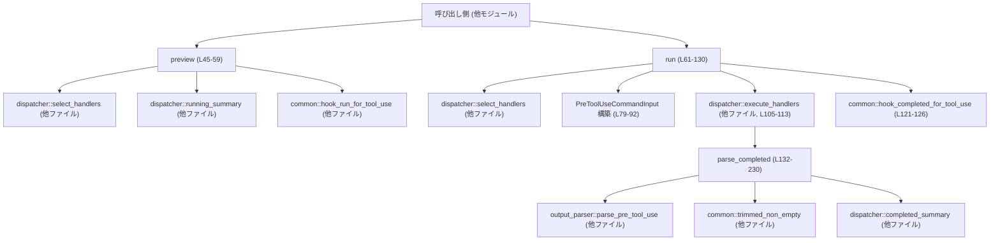
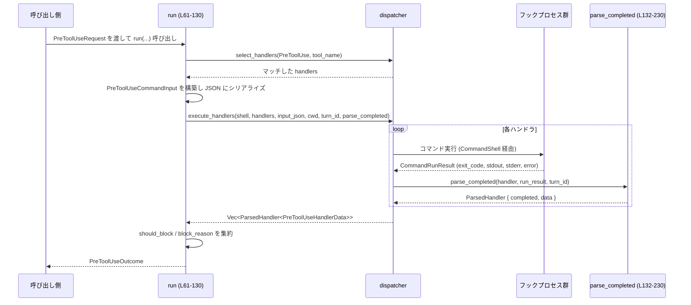

# hooks/src/events/pre_tool_use.rs コード解説

## 0. ざっくり一言

PreToolUse フック（ツール実行前のフック）を対象に、

- 対象ハンドラのプレビュー（実行計画の一覧）
- 実際のハンドラ実行と結果パース
- 「ツール実行をブロックすべきかどうか」の集約判定

を行うモジュールです。

---

## 1. このモジュールの役割

### 1.1 概要

このモジュールは **ツールが実行される前に外部フック（hook）を実行し、その結果に応じてツール実行を許可・ブロックする** ための機能を提供します。

- 呼び出し側から `PreToolUseRequest` を受け取り、対象ハンドラを選択して実行します（`run` 関数、`pre_tool_use.rs:L61-130`）。
- 各ハンドラの標準出力・標準エラー・終了コードから `HookCompletedEvent` と内部データ (`PreToolUseHandlerData`) を構築します（`parse_completed`、`pre_tool_use.rs:L132-230`）。
- 全ハンドラ結果を集約し、最終的にツール実行をブロックするかどうかを `PreToolUseOutcome` として返します（`pre_tool_use.rs:L115-129`）。

### 1.2 アーキテクチャ内での位置づけ

このモジュールは「events 層」にあり、下位の `engine::{dispatcher, command_runner, output_parser}` に処理を委譲しています。



> ※ ノードに記載した行番号は `pre_tool_use.rs` 内での定義範囲です。

### 1.3 設計上のポイント

コードから読み取れる特徴は次のとおりです。

- **責務分割**
  - このモジュールは「PreToolUse 専用」のイベント処理に特化し、汎用的なプロセス実行・ハンドラ管理は `dispatcher` や `command_runner` に委譲しています（`pre_tool_use.rs:L45-59`, `L61-113`）。
  - 実際のフック出力の JSON パースやスキーマ解釈は `output_parser::parse_pre_tool_use` に委譲し、本モジュールはその結果（`invalid_reason`, `block_reason`, `universal.system_message` など）だけを扱います（`pre_tool_use.rs:L154-175`）。

- **状態管理**
  - ハンドラごとのブロック情報は `PreToolUseHandlerData` という小さな構造体で保持し（`pre_tool_use.rs:L39-43`）、`dispatcher::ParsedHandler` の `data` フィールドとして返します（`pre_tool_use.rs:L223-229`）。
  - 集約レベルでは `PreToolUseOutcome` に `should_block` / `block_reason` と全 `hook_events` をまとめます（`pre_tool_use.rs:L32-37`, `L120-129`）。

- **エラーハンドリング方針**
  - **フック入力のシリアライズ失敗** は「イベントとしてはエラーを記録しつつ、ツール実行はブロックしない（fail open）」挙動になっています（`serialization_failure_outcome`, `pre_tool_use.rs:L232-237`）。
  - フックプロセスのエラーは `HookRunStatus::Failed` にしつつ、`PreToolUseHandlerData::should_block` は `false` のままになるため、やはり「フック異常時は原則ブロックしない」設計と解釈できます（例: `pre_tool_use.rs:L142-149`, `L201-214`）。
  - ただし **exit code 2** または明示的な `block_reason` はツール実行をブロックするシグナルとして扱われます（`pre_tool_use.rs:L168-175`, `L184-193`）。

- **非同期処理**
  - `run` は `async fn` であり、`dispatcher::execute_handlers` の完了を `await` します（`pre_tool_use.rs:L61-65`, `L105-113`）。並行実行の詳細（ハンドラを並列実行するかどうか）は `dispatcher` 側に隠蔽されています。

- **安全性**
  - このファイル内に `unsafe` ブロックは存在せず、標準的な Rust の所有権／借用ルールの範囲で実装されています。

---

## 2. 主要な機能一覧

- PreToolUse フックのプレビュー生成: ハンドラの実行サマリ（`HookRunSummary`）を生成する（`preview`、`pre_tool_use.rs:L45-59`）。
- PreToolUse フックの実行: 対象ハンドラを選択し、入力 JSON を渡して実行する（`run`、`pre_tool_use.rs:L61-113`）。
- フック実行結果の解析: プロセスの終了コード・標準出力・標準エラーから `HookCompletedEvent` とブロック判定を構築する（`parse_completed`、`pre_tool_use.rs:L132-230`）。
- シリアライズ失敗時のアウトカム構築: 失敗時も「ブロックしない」アウトカムを返す（`serialization_failure_outcome`、`pre_tool_use.rs:L232-237`）。
- （テスト）PreToolUse の JSON スキーマ解釈とブロック条件の振る舞いの検証（`tests` モジュール、`pre_tool_use.rs:L240-538`）。

---

## 3. 公開 API と詳細解説

### 3.1 型一覧（構造体・列挙体など）

| 名前 | 種別 | 公開範囲 | 役割 / 用途 | 主なフィールド | 定義位置 |
|------|------|----------|-------------|----------------|----------|
| `PreToolUseRequest` | 構造体 | `pub` | PreToolUse フック実行に必要なコンテキストをまとめた入力。セッション・ターン・カレントディレクトリ・モデル・ツール名・コマンドなどを含む。 | `session_id: ThreadId`, `turn_id: String`, `cwd: PathBuf`, `transcript_path: Option<PathBuf>`, `model: String`, `permission_mode: String`, `tool_name: String`, `tool_use_id: String`, `command: String` | `pre_tool_use.rs:L19-30` |
| `PreToolUseOutcome` | 構造体 | `pub` | PreToolUse フック実行結果の集約。各ハンドラごとの `HookCompletedEvent` と、全体としてツール実行をブロックすべきかどうかを保持する。 | `hook_events: Vec<HookCompletedEvent>`, `should_block: bool`, `block_reason: Option<String>` | `pre_tool_use.rs:L32-37` |
| `PreToolUseHandlerData` | 構造体 | モジュール内 (`pub` なし) | 単一ハンドラの実行結果に対応する内部データ。集約時に使用される。 | `should_block: bool`, `block_reason: Option<String>` | `pre_tool_use.rs:L39-43` |

### 3.2 関数詳細（主要 4 件）

#### `preview(handlers: &[ConfiguredHandler], request: &PreToolUseRequest) -> Vec<HookRunSummary>`

**概要**

- PreToolUse イベントにマッチするハンドラを選択し、それぞれの実行サマリ (`HookRunSummary`) を生成して返します（`pre_tool_use.rs:L45-59`）。
- 実行は行わず、「これからどのハンドラがどの run id で実行されるか」を確認する用途です。

**引数**

| 引数名 | 型 | 説明 |
|--------|----|------|
| `handlers` | `&[ConfiguredHandler]` | 登録済みのフックハンドラ一覧。`dispatcher::select_handlers` の入力になります（`pre_tool_use.rs:L45-51`）。 |
| `request` | `&PreToolUseRequest` | この PreToolUse イベントに関するコンテキスト。`tool_name` と `tool_use_id` を使用します（`pre_tool_use.rs:L47-57`）。 |

**戻り値**

- `Vec<HookRunSummary>`  
  PreToolUse にマッチした各ハンドラの実行サマリ。`id` には `tool_use_id` が含まれます（テストより、`"pre-tool-use:0:/tmp/hooks.json:tool-call-123"` など、`pre_tool_use.rs:L469-475`）。

**内部処理の流れ**

1. `dispatcher::select_handlers` を呼び出し、`HookEventName::PreToolUse` と `request.tool_name` でハンドラをフィルタリングします（`pre_tool_use.rs:L49-53`）。
2. 返ってきたハンドラ配列を `into_iter()` で走査し（`pre_tool_use.rs:L54-55`）、各ハンドラについて:
   - `dispatcher::running_summary(&handler)` で基本的な `HookRunSummary` を生成する。
   - それを `common::hook_run_for_tool_use(..., &request.tool_use_id)` に渡して、`tool_use_id` を含む run id 付きのサマリに変換する（`pre_tool_use.rs:L56-57`）。
3. すべてのサマリを `collect()` して `Vec<HookRunSummary>` として返す（`pre_tool_use.rs:L58`）。

**Examples（使用例）**

以下は、単純なハンドラ一覧に対して PreToolUse プレビューを取得する例です。

```rust
// PreToolUseRequest と ConfiguredHandler をインポートする                      // 必要な型をインポート
use hooks::events::pre_tool_use::{PreToolUseRequest, preview};                // モジュールパスは利用側のクレート名に応じて調整
use hooks::engine::ConfiguredHandler;                                         // ハンドラ設定型

fn main() {                                                                   // 同期のエントリポイント
    let handlers: Vec<ConfiguredHandler> = vec![/* 事前に構成済みのハンドラ */]; // 登録済みハンドラ一覧

    let request = PreToolUseRequest {                                         // PreToolUse イベントの入力
        session_id: codex_protocol::ThreadId::new(),                          // スレッド ID（protocol 側の型）
        turn_id: "turn-1".to_string(),                                        // 会話ターン ID
        cwd: std::path::PathBuf::from("/tmp"),                                // 実行ディレクトリ
        transcript_path: None,                                                // 会話ログファイル（なければ None）
        model: "gpt-test".to_string(),                                        // 使用モデル名
        permission_mode: "default".to_string(),                               // 権限制御モード
        tool_name: "Bash".to_string(),                                        // 対象ツール名
        tool_use_id: "tool-call-123".to_string(),                             // ツール呼び出し ID
        command: "echo hello".to_string(),                                    // 実際に実行されるコマンド
    };

    let runs = preview(&handlers, &request);                                  // プレビューを取得
    for summary in runs {                                                     // 各ハンドラのサマリを表示
        println!("run id: {}", summary.id);                                   // run.id には tool_use_id が含まれる
    }
}
```

**Errors / Panics**

- この関数内では `Result` や `?`、`unwrap` は使用しておらず、**このモジュールの範囲ではパニックを発生させるコードはありません**（`pre_tool_use.rs:L45-59`）。
- 実際のエラー処理（設定不備など）は `dispatcher::select_handlers` や `common::hook_run_for_tool_use` の実装に依存し、このチャンクからは分かりません。

**Edge cases（エッジケース）**

- `handlers` に PreToolUse にマッチするハンドラが 0 件の場合、空の `Vec` を返します（`select_handlers` の戻りが空なら、そのまま `collect()` されるため、`pre_tool_use.rs:L49-58`）。
- `request.tool_name` がどのハンドラの `matcher` とも一致しない場合も、同様に空ベクタになります。

**使用上の注意点**

- `runs[i].id` が `tool_use_id` を含んでいることはテストで保証されています（`preview_and_completed_run_ids_include_tool_use_id`, `pre_tool_use.rs:L469-475`）。`tool_use_id` をキーにログを関連付ける用途に利用できます。
- 実行そのものではなく「これから走る予定のハンドラ」を知るための API であり、副作用はありません。

---

#### `run(handlers: &[ConfiguredHandler], shell: &CommandShell, request: PreToolUseRequest) -> PreToolUseOutcome`

**概要**

- PreToolUse フックを実際に実行し、全ハンドラの結果を `HookCompletedEvent` として集約するとともに、「ツール実行をブロックすべきか」を決定します（`pre_tool_use.rs:L61-130`）。
- 非同期関数であり、内部で `dispatcher::execute_handlers` の完了を待機します。

**引数**

| 引数名 | 型 | 説明 |
|--------|----|------|
| `handlers` | `&[ConfiguredHandler]` | 登録済みハンドラ一覧。`preview` と同じく `select_handlers` に渡されます（`pre_tool_use.rs:L61-68`）。 |
| `shell` | `&CommandShell` | コマンド実行環境を抽象化したオブジェクト。`dispatcher::execute_handlers` に渡されます（`pre_tool_use.rs:L62`, `L105-107`）。 |
| `request` | `PreToolUseRequest` | PreToolUse イベントの入力。所有権を取り、関数内でクローンしながら使用します（`pre_tool_use.rs:L64`, `L79-91`）。 |

**戻り値**

- `PreToolUseOutcome`  
  - `hook_events`: 全ハンドラの `HookCompletedEvent`（`common::hook_completed_for_tool_use` 経由で `tool_use_id` に結び付けられたもの、`pre_tool_use.rs:L121-126`）。
  - `should_block`: 少なくとも 1 つのハンドラがブロックを指示したかどうか（`pre_tool_use.rs:L115-116`）。
  - `block_reason`: ブロックする理由（最初に見つかったもの、`pre_tool_use.rs:L116-118`）。

**内部処理の流れ**

1. `dispatcher::select_handlers` で PreToolUse にマッチするハンドラを選択します（`pre_tool_use.rs:L66-70`）。
2. マッチしたハンドラが空であれば、空の `hook_events` と `should_block = false` を持つ `PreToolUseOutcome` を即座に返します（`pre_tool_use.rs:L71-77`）。
3. `PreToolUseCommandInput` を組み立て、`serde_json::to_string` で JSON にシリアライズします（`pre_tool_use.rs:L79-92`）。
   - 失敗した場合:
     - `common::serialization_failure_hook_events_for_tool_use` で `HookCompletedEvent` を生成し（`pre_tool_use.rs:L95-100`）、
     - `serialization_failure_outcome` を返します（`should_block = false`、`pre_tool_use.rs:L101-102`, `L232-237`）。
4. シリアライズに成功した場合、`dispatcher::execute_handlers` を呼び出して全ハンドラを実行します（`pre_tool_use.rs:L105-113`）。  
   - 第 5 引数にターン ID（`Some(request.turn_id.clone())`）を渡し（`pre_tool_use.rs:L110`）、
   - 第 6 引数としてコールバック関数 `parse_completed` を指定します（`pre_tool_use.rs:L111`）。
5. `execute_handlers` から返された `results` を元に:
   - `should_block`: `results.iter().any(|r| r.data.should_block)` で集約（`pre_tool_use.rs:L115-116`）。
   - `block_reason`: 最初に `Some` の `block_reason` を持つ要素を `find_map` で取得（`pre_tool_use.rs:L116-118`）。
6. 各 `result.completed` を `common::hook_completed_for_tool_use(..., &request.tool_use_id)` でラップし、`hook_events` として格納します（`pre_tool_use.rs:L121-126`）。
7. 上記 3 つをまとめて `PreToolUseOutcome` を返します（`pre_tool_use.rs:L120-129`）。

**Examples（使用例）**

以下は、Tokio ランタイム上で `run` を呼び出し、結果に応じてツール実行をブロックするかを判断する例です。

```rust
use hooks::events::pre_tool_use::{PreToolUseRequest, PreToolUseOutcome, run}; // PreToolUse の型と関数をインポート
use hooks::engine::{ConfiguredHandler, CommandShell};                         // エンジン側の型
use codex_protocol::ThreadId;                                                // セッション ID 型

#[tokio::main]                                                               // Tokio ランタイムを起動
async fn main() {                                                            // 非同期 main 関数
    let handlers: Vec<ConfiguredHandler> = vec![/* 事前に構成済みのハンドラ */]; // フックハンドラ一覧
    let shell = CommandShell::default();                                     // コマンド実行シェル（実装に依存）

    let request = PreToolUseRequest {                                        // PreToolUse の入力を構築
        session_id: ThreadId::new(),                                         // 新しいセッション ID
        turn_id: "turn-1".to_string(),                                       // 会話ターン ID
        cwd: std::path::PathBuf::from("/tmp"),                               // コマンド実行ディレクトリ
        transcript_path: None,                                               // 会話ログはなし
        model: "gpt-test".to_string(),                                       // 利用モデル名
        permission_mode: "default".to_string(),                              // 権限制御モード
        tool_name: "Bash".to_string(),                                       // ツール名
        tool_use_id: "tool-call-123".to_string(),                            // ツール呼び出し ID
        command: "rm -rf /tmp/sandbox".to_string(),                          // 実行予定コマンド
    };

    let outcome: PreToolUseOutcome = run(&handlers, &shell, request).await;  // PreToolUse フックを実行

    for event in &outcome.hook_events {                                      // 各ハンドラの実行結果を確認
        println!("hook run id: {}", event.run.id);                           // run.id には tool_use_id が含まれる
    }

    if outcome.should_block {                                                // should_block に応じてツール実行を制御
        eprintln!(
            "tool execution blocked: {}",
            outcome.block_reason.as_deref().unwrap_or("no reason provided")  // ブロック理由を表示
        );
    } else {
        println!("tool execution allowed");                                  // ブロックされない場合のメッセージ
        // ここで実際のツール（例: Bash）を実行する                           // ツールの起動は呼び出し側の責務
    }
}
```

**Errors / Panics**

- フック入力の JSON シリアライズに失敗した場合:
  - `common::serialization_failure_hook_events_for_tool_use` を使ってエラーイベントを生成し、`should_block = false` のアウトカムを返します（`pre_tool_use.rs:L95-102`, `L232-237`）。
- この関数内には `unwrap` や `expect` はなく、`serde_json::to_string` の失敗も明示的にハンドリングされているため、このファイル内のコードは原則として **パニックしません**。
- `dispatcher::execute_handlers` や `CommandShell` の内部のパニック可能性は、このチャンクからは不明です。

**Edge cases（エッジケース）**

- **マッチするハンドラが 0 件** の場合、フック実行はスキップされ、空の `hook_events` と `should_block = false` が返されます（`pre_tool_use.rs:L71-77`）。
- **入力 JSON のシリアライズ失敗** の場合も `should_block = false` であり、シリアライズエラーが原因でツール実行がブロックされることはありません（`pre_tool_use.rs:L79-102`, `L232-237`）。
- **複数のハンドラがブロック理由を返す** 場合でも、`block_reason` には最初に見つかったものだけが格納されます（`pre_tool_use.rs:L116-118`）。
- `tool_name` フィールドとは別に、`PreToolUseCommandInput` 内の `tool_name` に `"Bash"` がハードコードされています（`pre_tool_use.rs:L87`）。この理由や他ツールへの影響は、このチャンクからは分かりません。

**使用上の注意点**

- 設計として、**フック側の異常（JSON シリアライズ失敗やハンドラの失敗）は原則「ツール実行をブロックしない」** 方向（fail-open）になっています。セキュリティ上、フックを「強制的なガード」とみなすかどうかはシステム全体の設計で検討する必要があります。
- `run` は `async fn` なので、必ず非同期ランタイム（Tokio など）の中で `await` する必要があります。

---

#### `parse_completed(handler: &ConfiguredHandler, run_result: CommandRunResult, turn_id: Option<String>) -> dispatcher::ParsedHandler<PreToolUseHandlerData>`

**概要**

- 単一ハンドラの実行結果 (`CommandRunResult`) を解析し、`HookCompletedEvent` と `PreToolUseHandlerData`（should_block / block_reason）を構築します（`pre_tool_use.rs:L132-230`）。
- 終了コード・標準出力・標準エラー・実行エラーの組み合わせから、`HookRunStatus` を `Completed / Failed / Blocked` のいずれかに設定します。

**引数**

| 引数名 | 型 | 説明 |
|--------|----|------|
| `handler` | `&ConfiguredHandler` | 実行したハンドラの設定。`dispatcher::completed_summary` に渡されます（`pre_tool_use.rs:L133`, `L219-221`）。 |
| `run_result` | `CommandRunResult` | プロセス実行結果。`exit_code`, `stdout`, `stderr`, `error` を含みます（`pre_tool_use.rs:L134-135`, `L142-215`）。 |
| `turn_id` | `Option<String>` | この実行が属するターン ID（存在しない場合もある）。`HookCompletedEvent` に格納されます（`pre_tool_use.rs:L135`, `L218-221`）。 |

**戻り値**

- `dispatcher::ParsedHandler<PreToolUseHandlerData>`  
  - `completed: HookCompletedEvent`: ログ・UI 等で利用可能な実行結果イベント（`pre_tool_use.rs:L218-221`）。
  - `data: PreToolUseHandlerData`: `should_block` と `block_reason` を格納した内部データ（`pre_tool_use.rs:L223-229`）。

**内部処理の流れ**

1. 初期状態として、`entries = Vec::new()`, `status = HookRunStatus::Completed`, `should_block = false`, `block_reason = None` を用意します（`pre_tool_use.rs:L137-140`）。
2. `run_result.error` を確認します（`pre_tool_use.rs:L142-149`）。
   - `Some(error)` の場合:
     - `status = Failed`。
     - `HookOutputEntryKind::Error` で `error.to_string()` を `entries` に追加。
3. `run_result.error` が `None` の場合、`run_result.exit_code` に応じて分岐します（`pre_tool_use.rs:L150-215`）。
   - `Some(0)`（正常終了）:
     1. `trimmed_stdout = run_result.stdout.trim()` を計算（`pre_tool_use.rs:L152-153`）。
     2. `trimmed_stdout` が空なら何もせず終了（`pre_tool_use.rs:L153-154`）。
     3. 非空の場合は `output_parser::parse_pre_tool_use(&run_result.stdout)` を試みます（`pre_tool_use.rs:L154`）。
        - `Some(parsed)` が返ってきた場合:
          - `parsed.universal.system_message` があれば `Warning` として `entries` に追加（`pre_tool_use.rs:L155-159`）。
          - `parsed.invalid_reason` があれば:
            - `status = Failed`。
            - `Error` として `invalid_reason` を `entries` に追加（`pre_tool_use.rs:L161-166`）。
          - それ以外で `parsed.block_reason` があれば:
            - `status = Blocked`。
            - `should_block = true`。
            - `block_reason = Some(reason.clone())`。
            - `Feedback` として `reason` を `entries` に追加（`pre_tool_use.rs:L167-175`）。
        - `None` が返ってきた場合:
          - `trimmed_stdout` が `{` または `[` で始まる場合のみ、「JSON っぽいが解析できない」と見なし、
            - `status = Failed`、
            - `Error` として `"hook returned invalid pre-tool-use JSON output"` を追加（`pre_tool_use.rs:L176-181`）。
          - それ以外の stdout は無視されます（`plain_stdout_is_ignored` テスト、`pre_tool_use.rs:L399-416`）。
   - `Some(2)`（特別扱い）:
     - `common::trimmed_non_empty(&run_result.stderr)` で stderr をトリミングしつつ空でないかを確認（`pre_tool_use.rs:L185-186`）。
     - 非空であれば:
       - `status = Blocked`。
       - `should_block = true`。
       - `block_reason = Some(reason.clone())`。
       - `Feedback` として `reason` を `entries` に追加（`pre_tool_use.rs:L186-192`）。
     - 空であれば:
       - `status = Failed`。
       - `Error` として `"PreToolUse hook exited with code 2 but did not write a blocking reason to stderr"` を追加（`pre_tool_use.rs:L193-199`）。
   - `Some(exit_code)`（0 でも 2 でもない）:
     - `status = Failed`。
     - `Error` として `format!("hook exited with code {exit_code}")` を追加（`pre_tool_use.rs:L201-206`）。
   - `None`（終了コード取得失敗）:
     - `status = Failed`。
     - `Error` として `"hook exited without a status code"` を追加（`pre_tool_use.rs:L208-213`）。
4. 上記の `status` と `entries` を用いて `dispatcher::completed_summary(handler, &run_result, status, entries)` を呼び出し、`HookCompletedEvent` を組み立てます（`pre_tool_use.rs:L218-221`）。
5. `dispatcher::ParsedHandler` に `completed` と `PreToolUseHandlerData { should_block, block_reason }` を詰めて返します（`pre_tool_use.rs:L223-229`）。

**Examples（使用例）**

テストコードとほぼ同じ形式で、exit code 2 + stderr によるブロックを解釈する例です。

```rust
use hooks::events::pre_tool_use::{PreToolUseHandlerData};                    // 内部データ型
use hooks::events::pre_tool_use::parse_completed;                            // パーサ関数
use hooks::engine::{ConfiguredHandler, command_runner::CommandRunResult};    // ハンドラ設定と実行結果型
use codex_protocol::protocol::{HookEventName, HookRunStatus};                // プロトコルの型

fn example_block_by_exit_code_two() {                                        // デモ用関数
    let handler = ConfiguredHandler {                                        // テストと同様のハンドラ構成
        event_name: HookEventName::PreToolUse,
        matcher: Some("^Bash$".to_string()),
        command: "echo hook".to_string(),
        timeout_sec: 5,
        status_message: None,
        source_path: std::path::PathBuf::from("/tmp/hooks.json"),
        display_order: 0,
    };

    let run_result = CommandRunResult {                                      // exit code 2 + stderr を持つ結果
        started_at: 1,
        completed_at: 2,
        duration_ms: 1,
        exit_code: Some(2),
        stdout: "".to_string(),
        stderr: "blocked by policy\n".to_string(),
        error: None,
    };

    let parsed = parse_completed(&handler, run_result, Some("turn-1".into())); // parse_completed を直接呼び出し

    assert_eq!(                                                              // should_block が true になっていることを確認
        parsed.data,
        PreToolUseHandlerData {
            should_block: true,
            block_reason: Some("blocked by policy".to_string()),
        }
    );
    assert_eq!(parsed.completed.run.status, HookRunStatus::Blocked);         // ステータスは Blocked
}
```

**Errors / Panics**

- この関数内では `panic!` や `unwrap` を使用しておらず、異常系はすべて `HookRunStatus::Failed` とエントリの追加で表現されます（`pre_tool_use.rs:L142-215`）。
- `output_parser::parse_pre_tool_use` が返す `parsed.invalid_reason` の内容は、このモジュールにとって外部契約です。テストからは、例えば `permissionDecision:"ask"` の場合、`invalid_reason` に `"PreToolUse hook returned unsupported permissionDecision:ask"` が入ることが分かります（`unsupported_permission_decision_fails_open`, `pre_tool_use.rs:L317-343`）。

**Edge cases（エッジケース）**

テストから確認できる主なエッジケースと挙動をまとめます。

- **ブロック決定 (permissionDecision / decision)**
  - `permissionDecision:"deny"` と適切な JSON を stdout に出力した場合、`should_block = true`、`status = Blocked` となり、`Feedback` エントリが追加されます（`permission_decision_deny_blocks_processing`, `pre_tool_use.rs:L258-285`）。
  - レガシー形式の `{"decision":"block","reason":"..."}` でも同様にブロックされます（`deprecated_block_decision_blocks_processing`, `pre_tool_use.rs:L287-314`）。
- **サポートされない決定値**
  - `permissionDecision:"ask"` のようにサポートされない値は、`status = Failed`、`should_block = false` になり、「fail open」挙動となります（`pre_tool_use.rs:L317-343`）。
  - レガシー形式の `{"decision":"approve"}` も同様です（`deprecated_approve_decision_fails_open`, `pre_tool_use.rs:L345-367`）。
- **追加コンテキストの扱い**
  - `additionalContext` フィールドが付与された場合はサポート外とみなされ、`status = Failed`、`should_block = false` になります（`unsupported_additional_context_fails_open`, `pre_tool_use.rs:L371-397`）。
- **プレーンな stdout**
  - JSON でない普通の stdout は無視され、`status = Completed`、エントリなしとなります（`plain_stdout_is_ignored`, `pre_tool_use.rs:L399-416`）。
- **JSON 風だが不正な stdout**
  - `{` または `[` で始まるがパースに失敗する stdout は、「不正な JSON」とみなされ `status = Failed` になります（`invalid_json_like_stdout_fails_instead_of_becoming_noop`, `pre_tool_use.rs:L418-441`）。
- **exit code 2 + stderr**
  - すでに示した通り、明示的なブロックとして扱われます（`exit_code_two_blocks_processing`, `pre_tool_use.rs:L443-466`）。
- **その他の exit code / なし**
  - 0 や 2 以外の終了コード、および終了コードなし (`None`) はいずれも `status = Failed` として扱われます（`pre_tool_use.rs:L201-214`）。

**使用上の注意点**

- ブロック条件は **`should_block` / `block_reason` フィールドのみ** に反映されます。`status = Failed` であっても `should_block = false` の場合、集約結果としてはツール実行をブロックしません（テスト各種より）。
- JSON っぽい stdout だがパースできない場合に限り失敗とみなされ、プレーンテキスト stdout は完全に無視される点に注意が必要です（`pre_tool_use.rs:L152-154`, `L176-181`, `L399-416`）。
- exit code 2 によるブロック時は、ブロック理由を stderr に書き出す必要があります。空の場合は `Failed` 扱いとなり、ブロックされません（`pre_tool_use.rs:L184-199`）。

---

#### `serialization_failure_outcome(hook_events: Vec<HookCompletedEvent>) -> PreToolUseOutcome`

**概要**

- PreToolUse フック入力の JSON シリアライズに失敗した場合などに使用されるヘルパー関数です（`pre_tool_use.rs:L232-237`）。
- 渡された `hook_events` をそのまま保持しつつ、`should_block = false`, `block_reason = None` の `PreToolUseOutcome` を構築します。

**引数**

| 引数名 | 型 | 説明 |
|--------|----|------|
| `hook_events` | `Vec<HookCompletedEvent>` | シリアライズ失敗時に生成されたイベント一覧（`common::serialization_failure_hook_events_for_tool_use` の結果、`pre_tool_use.rs:L95-101`）。 |

**戻り値**

- `PreToolUseOutcome`  
  - `hook_events`: 引数で渡されたものをそのまま設定。
  - `should_block: false`。
  - `block_reason: None`。

**内部処理の流れ**

1. 引数で渡された `hook_events` をそのままフィールドに設定し、
2. `should_block = false`, `block_reason = None` を固定値で設定して `PreToolUseOutcome` を返します（`pre_tool_use.rs:L232-237`）。

**使用上の注意点**

- 設計として「シリアライズに失敗した場合でもツール実行はブロックしない」というポリシーを明示する関数です。  
  フックをセキュリティ境界として使う場合、この挙動が望ましいかどうかはシステム全体で検討する必要があります。

---

### 3.3 その他の関数（テスト用ユーティリティ）

テストモジュール内の補助関数は以下のとおりです（`pre_tool_use.rs:L502-538`）。

| 関数名 | 役割（1 行） | 定義位置 |
|--------|--------------|----------|
| `handler()` | PreToolUse 用に設定された `ConfiguredHandler` を返すテスト用ヘルパー。`matcher: "^Bash$"` などの共通設定を持つ。 | `pre_tool_use.rs:L502-511` |
| `run_result(exit_code, stdout, stderr)` | `CommandRunResult` を簡単に構築するためのヘルパー。テストケースごとの標準出力・標準エラーを設定する。 | `pre_tool_use.rs:L514-523` |
| `request_for_tool_use(tool_use_id)` | `PreToolUseRequest` を簡単に構築するヘルパー。`tool_use_id` を引数で指定可能。 | `pre_tool_use.rs:L526-537` |

---

## 4. データフロー

### 4.1 代表的な処理シナリオ: PreToolUse 実行時のフロー

呼び出し側が `run` を呼んでから、ツール実行可否が判定されるまでのデータフローを示します。

1. 呼び出し側が `PreToolUseRequest` を構築し、`run(&handlers, &shell, request)` を `await` します（`pre_tool_use.rs:L61-65`）。
2. `run` 内で PreToolUse にマッチするハンドラが選択されます（`select_handlers`, `pre_tool_use.rs:L66-70`）。
3. `PreToolUseCommandInput` が構築され、JSON にシリアライズされます（`pre_tool_use.rs:L79-92`）。
4. `dispatcher::execute_handlers` がハンドラを実行し、その結果を `parse_completed` で解析します（`pre_tool_use.rs:L105-113`, `L132-230`）。
5. 各ハンドラの `ParsedHandler.data` の `should_block` / `block_reason` が `run` で集約され、`PreToolUseOutcome` として返されます（`pre_tool_use.rs:L115-129`）。



---

## 5. 使い方（How to Use）

### 5.1 基本的な使用方法

典型的なフローは次の通りです。

1. `ConfiguredHandler` を設定し、エンジンに登録する。
2. ツール実行前に `PreToolUseRequest` を構築する。
3. `preview` でどのハンドラが対象になるか確認する（任意）。
4. `run` を呼び出し、`PreToolUseOutcome.should_block` / `block_reason` を見てツール実行を制御する。

全体像のサンプルです。

```rust
use hooks::events::pre_tool_use::{PreToolUseRequest, PreToolUseOutcome, preview, run}; // PreToolUse 関連 API
use hooks::engine::{ConfiguredHandler, CommandShell};                                   // エンジン側の型
use codex_protocol::{ThreadId, protocol::HookEventName};                               // プロトコルの型

#[tokio::main]                                                                          // 非同期ランタイムを起動
async fn main() -> anyhow::Result<()> {                                                 // エラーを anyhow::Result でラップ
    // 1. ハンドラ設定を用意する                                                         
    let handler = ConfiguredHandler {
        event_name: HookEventName::PreToolUse,                                          // PreToolUse イベントに反応
        matcher: Some("^Bash$".to_string()),                                            // tool_name "Bash" にマッチ
        command: "/usr/local/bin/pre_tool_use_hook".to_string(),                        // 実行するフックコマンド
        timeout_sec: 5,
        status_message: None,
        source_path: std::path::PathBuf::from("/etc/hooks.json"),
        display_order: 0,
    };
    let handlers = vec![handler];                                                       // ハンドラ一覧

    // 2. PreToolUseRequest を構築する                                                   
    let request = PreToolUseRequest {
        session_id: ThreadId::new(),
        turn_id: "turn-1".to_string(),
        cwd: std::path::PathBuf::from("/workdir"),
        transcript_path: None,
        model: "gpt-4".to_string(),
        permission_mode: "default".to_string(),
        tool_name: "Bash".to_string(),
        tool_use_id: "tool-call-123".to_string(),
        command: "rm -rf /tmp/sandbox".to_string(),
    };

    // 3. preview で実行予定のハンドラを確認する                                          
    let previews = preview(&handlers, &request);
    for summary in &previews {
        println!("planned pre-tool-use run id: {}", summary.id);                        // 実行予定の run id を確認
    }

    // 4. run で実際にフックを実行する                                                   
    let shell = CommandShell::default();
    let outcome: PreToolUseOutcome = run(&handlers, &shell, request).await;

    for event in &outcome.hook_events {
        println!("hook {:?} finished with status {:?}", event.run.id, event.run.status); // 各ハンドラの結果を表示
    }

    if outcome.should_block {
        eprintln!(
            "tool execution blocked: {}",
            outcome.block_reason.as_deref().unwrap_or("no reason")
        );
        // ここでツール実行を中止する                                                     
    } else {
        println!("tool execution allowed");
        // ここでツールを実行する                                                         
    }

    Ok(())
}
```

### 5.2 よくある使用パターン

- **許可ポリシーエンジンとしての利用**
  - フック側でコマンド内容や権限情報を検査し、`permissionDecision:"deny"` や `decision:"block"` を返す。
  - 呼び出し側は `PreToolUseOutcome.should_block` / `block_reason` のみを見てツール実行を制御する。

- **警告メッセージのみの利用**
  - フック側が `universal.system_message`（Warning）だけを返し、`block_reason` も exit code 2 も使わない。
  - この場合、`status` は `Completed` のまま、`should_block = false` でツールは実行されます。

- **exit code ベースのブロック**
  - JSON を一切返さず、exit code 2 と stderr だけでブロック理由を伝える（`pre_tool_use.rs:L184-193`）。
  - JSON パースに依存しないため、フック実装がシンプルになります。

### 5.3 よくある間違い

```rust
// 間違い例: PreToolUseOutcome.should_block を無視してツールを常に実行してしまう
let outcome = run(&handlers, &shell, request).await;
run_tool(&request.command); // フック結果を見ていない

// 正しい例: should_block / block_reason を見てからツール実行を行う
let outcome = run(&handlers, &shell, request).await;
if outcome.should_block {
    eprintln!(
        "tool execution blocked by hook: {}",
        outcome.block_reason.as_deref().unwrap_or("no reason provided")
    );
} else {
    run_tool(&request.command);
}
```

```rust
// 間違い例: exit code 2 を返しても stderr に理由を書かないフック実装
// 結果として status=Failed にはなるが、ブロックはされない（pre_tool_use.rs:L193-199）。

// 正しい例: exit code 2 と stderr でブロック理由を明示する
eprintln!("blocked by policy: dangerous command");
std::process::exit(2);
```

### 5.4 使用上の注意点（まとめ）

- **ブロックの契約**
  - ブロック判定は `block_reason` / exit code 2 によってのみ設定されます。フック側が `invalid_reason` でエラーを返すだけではブロックされません。
- **fail-open 設計**
  - フックの JSON が不正、またはシリアライズ失敗、exit code が 0/2 以外の場合でも、原則として `should_block = false`（＝ツールは実行）となるケースが多い点に注意が必要です。
- **スレッド・非同期**
  - このモジュールは `async fn run` で非同期 API を提供していますが、内部でスレッドを直接扱ってはいません。並行実行の詳細は `dispatcher::execute_handlers` の実装に依存します。
- **安全性**
  - 本ファイルには `unsafe` は存在せず、所有権・借用もシンプルな参照/所有権の移動のみです。
  - 実際に外部コマンドを実行するのは `CommandShell` / `command_runner` 側であり、コマンドインジェクションや権限管理などのセキュリティ対策はそちらに依存します。

---

## 6. 変更の仕方（How to Modify）

### 6.1 新しい機能を追加する場合

例: PreToolUse フックの出力フォーマットを拡張し、新しいフィールドに基づく挙動追加を行いたい場合。

1. **出力スキーマの拡張**
   - `output_parser::parse_pre_tool_use` が返す構造体に新フィールド（例: `audit_log`）を追加する（このファイル外）。
2. **`parse_completed` の拡張**
   - `parsed` から新フィールドを読み取り、それを `entries` に変換したり、新しい `HookRunStatus` へのマッピングを追加する（`pre_tool_use.rs:L154-175` あたりに処理を追加）。
3. **集約ロジックへの反映**
   - 新フィールドが「ブロック条件」に影響する場合は、`PreToolUseHandlerData` にフィールドを追加し（`pre_tool_use.rs:L39-43`）、`run` での集約処理を変更する（`pre_tool_use.rs:L115-118`）。
4. **テストの追加**
   - `tests` モジュール内に対応するテストケースを追加し、期待される `HookRunStatus` や `entries` を検証する（`pre_tool_use.rs:L258-498` を参考にする）。

### 6.2 既存の機能を変更する場合

- **ブロック条件の変更**
  - 例えば、`invalid_reason` があれば必ずブロックしたい場合:
    - `parse_completed` 内で `status = Failed` ではなく `Blocked` に変更し、`should_block = true` にする必要があります（`pre_tool_use.rs:L161-167`）。
    - これによりセキュリティポリシーが変わるため、既存テスト（`unsupported_*` 系）も更新が必要です。
- **fail-open / fail-closed の切り替え**
  - JSON パース失敗や exit code != 0/2 の扱いをブロックに変更したい場合:
    - `pre_tool_use.rs:L176-181`, `L201-214` で `status` と `should_block` の設定を変える必要があります。
- **影響範囲の確認**
  - `PreToolUseOutcome` のフィールド契約（`should_block`, `block_reason`）は他モジュールから直接参照される可能性が高いため、意味を変える場合は呼び出し側の確認が必須です。
  - `HookOutputEntry` の内容（kind / text）はログや UI に表示される前提で設計されている可能性があり、文言変更も注意が必要です。

---

## 7. 関連ファイル

このモジュールと密接に関係するコンポーネントは、インポートと呼び出しから次のように整理できます。

| パス / コンポーネント | 役割 / 関係 | 根拠 |
|-----------------------|------------|------|
| `crate::engine::dispatcher` | ハンドラ選択 (`select_handlers`)、実行 (`execute_handlers`)、サマリ生成 (`running_summary`, `completed_summary`)、`ParsedHandler` 型の定義を提供します。PreToolUse の実行フローの中核です。 | `pre_tool_use.rs:L49-56`, `L66-70`, `L105-113`, `L136`, `L219-224` |
| `crate::engine::command_runner::CommandRunResult` | 外部コマンド実行結果（終了コード、stdout、stderr、エラー）を表す型で、`parse_completed` の入力になっています。 | `pre_tool_use.rs:L14`, `L134-135` |
| `crate::engine::CommandShell` | コマンド実行環境を抽象化する型で、`dispatcher::execute_handlers` に渡されます。 | `pre_tool_use.rs:L12`, `L62`, `L105-107` |
| `crate::engine::output_parser::parse_pre_tool_use` | PreToolUse フックの stdout をパースし、`invalid_reason` / `block_reason` / `universal.system_message` を含む構造体を返します。JSON スキーマの解釈を担います。 | `pre_tool_use.rs:L16`, `L154-175` |
| `crate::schema::PreToolUseCommandInput` | フックプロセスに渡す入力 JSON のスキーマ。`serde_json::to_string` でシリアライズされます。 | `pre_tool_use.rs:L17`, `L79-92` |
| `crate::schema::PreToolUseToolInput` / `crate::schema::NullableString` | `PreToolUseCommandInput` のフィールドとして使用される補助スキーマ。`transcript_path` や `command` のラップを行います。 | `pre_tool_use.rs:L82-89` |
| `crate::events::common` | run id の生成 (`hook_run_for_tool_use`)、`HookCompletedEvent` のラップ（`hook_completed_for_tool_use`）、シリアライズ失敗用イベント生成（`serialization_failure_hook_events_for_tool_use`）、stderr のトリムなどを提供します。 | `pre_tool_use.rs:L11`, `L56-57`, `L95-101`, `L121-125`, `L185-186`, `L481-483`, `L491-496` |
| `codex_protocol::*` | `ThreadId`, `HookCompletedEvent`, `HookEventName`, `HookOutputEntry`, `HookOutputEntryKind`, `HookRunStatus`, `HookRunSummary` などのプロトコル型を提供します。 | `pre_tool_use.rs:L3-9`, `L34-36`, `L145-148`, `L218-221`, `L244-248` |

以上が `hooks/src/events/pre_tool_use.rs` に関するコンポーネント一覧・データフロー・公開 API の解説です。このチャンクに現れない内部実装（`dispatcher`, `output_parser` など）の詳細は、各ファイル側を参照する必要があります。
