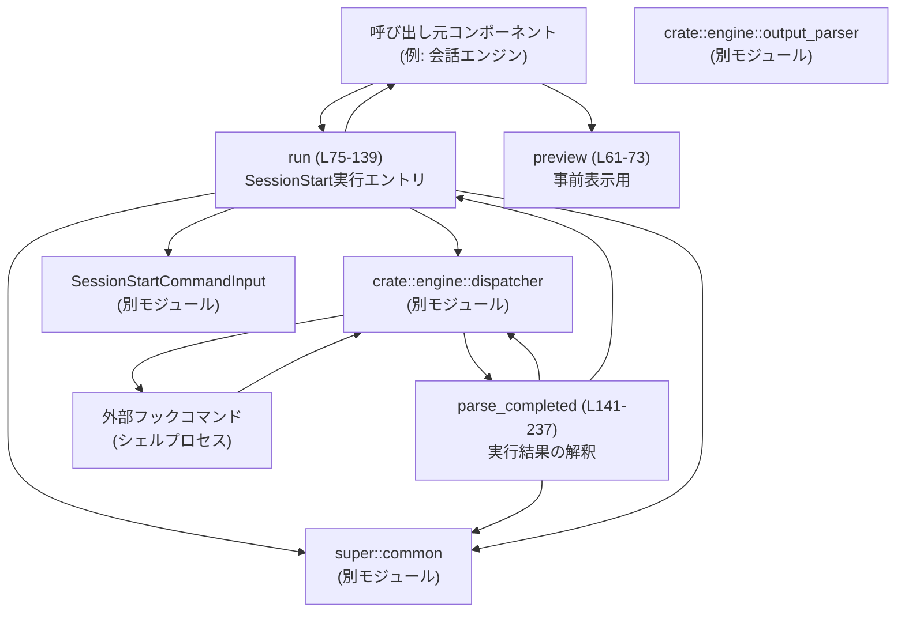
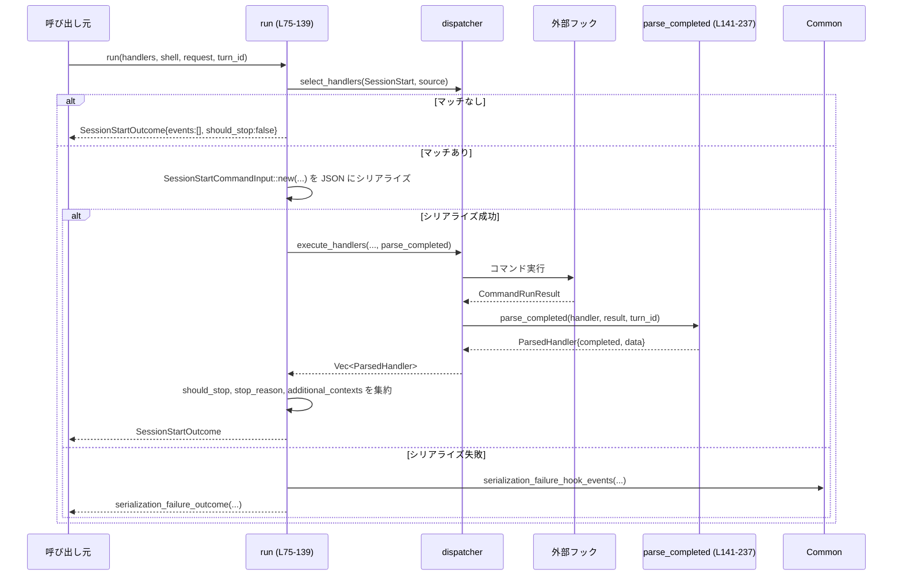
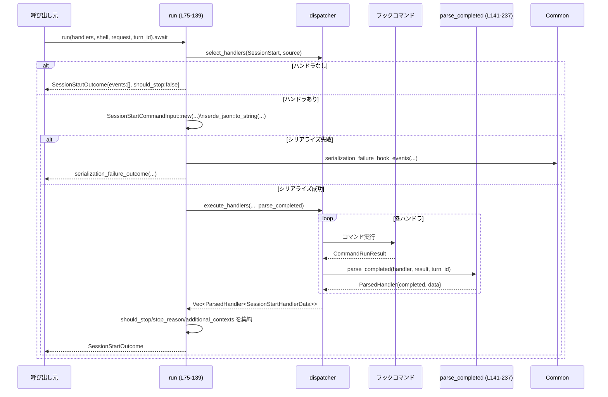

# hooks/src/events/session_start.rs

---

## 0. ざっくり一言

`SessionStart` フック（セッション開始時に実行される外部コマンド）を選択・実行し、その結果をパースして「セッションを続行するか／止めるか」と「モデルに渡す追加コンテキスト」を決定するモジュールです（`session_start.rs:L19-245`）。

---

## 1. このモジュールの役割

### 1.1 概要

- このモジュールは **セッション開始時（SessionStart イベント）に紐づくフックコマンド** を実行し、その標準出力を解釈する役割を持ちます（`session_start.rs:L61-139`）。
- 具体的には、ハンドラ選択 → 入力 JSON の生成 → フック実行 → 出力のパース → 集約結果 `SessionStartOutcome` の構築、という流れを提供します。
- 出力のパースでは、**JSON 形式の構造化出力** と **プレーンテキストの追加コンテキスト** の両方を扱い、停止指示や警告を `HookRunStatus` と `HookOutputEntry` に反映します（`session_start.rs:L141-237`）。

### 1.2 アーキテクチャ内での位置づけ

このモジュールは「フックエンジン」の一部として、`dispatcher`, `output_parser`, `common`, `SessionStartCommandInput` と連携しています（`session_start.rs:L11-17,L61-73,L95-121,L164-205`）。



- `preview` はどのハンドラが走るかのサマリを返すだけで、実行は行いません（`session_start.rs:L61-73`）。
- `run` は非同期関数として、`dispatcher::execute_handlers` にコールバック `parse_completed` を渡して実際のフック実行を委譲します（`session_start.rs:L113-121,L141-145`）。
- `parse_completed` は `CommandRunResult` を解析し、`HookCompletedEvent` と内部状態 `SessionStartHandlerData` をまとめて返します（`session_start.rs:L141-237`）。
- `common` モジュールは、シリアライズ失敗時のイベント生成や追加コンテキストの整形を担当しています（`session_start.rs:L105-110,L127-131,L173-178,L199-204`）。

### 1.3 設計上のポイント

- **イベントソースの明示化**  
  `SessionStartSource` という enum で「Startup/Resume/Clear」を明示し、文字列は `as_str` 経由でのみ扱います（`session_start.rs:L19-34`）。  
  これにより、呼び出し側は型安全にソースを指定できます。

- **状態集約専用の内部データ構造**  
  フックごとの実行結果から集約するために、内部用 `SessionStartHandlerData` を定義し、`execute_handlers` コールバックから返しています（`session_start.rs:L54-59,L141-145`）。

- **エラーハンドリング方針**  
  - JSON シリアライズ失敗 → 「シリアライズ失敗イベント」を生成して返し、フック本体は実行しません（`session_start.rs:L95-111,L239-245`）。
  - フック実行エラー・非ゼロ終了コード・ステータスコードなしなどは、すべて `HookRunStatus::Failed` と `Error` エントリで表現します（`session_start.rs:L152-160,L207-221`）。
  - JSON らしいがパース不能な stdout（`{` または `[` で始まる）は「不正な JSON 出力」として失敗扱いし、プレーンテキストコンテキストにはしません（`session_start.rs:L162-165,L191-197`）。

- **非同期・並行性**  
  - `run` は `async fn` であり、内部で `dispatcher::execute_handlers` を `await` します（`session_start.rs:L75-80,L113-121`）。
  - 共有状態は持たず、引数はすべて `&` 参照か所有権移動で渡されるため、スレッド安全性は主に `dispatcher` と `CommandShell` 側の実装に依存します。このモジュール単体ではミュータブルなグローバル状態を持ちません。

- **所有権とライフタイム**  
  - `SessionStartRequest` は `run` に所有権で渡され、内部で `clone` して JSON 入力に使われます（`session_start.rs:L75-80,L95-102`）。
  - `handlers` と `shell` はイミュータブル参照として渡されるため、このモジュールがそれらを変更することはありません（`session_start.rs:L75-78`）。

### 1.4 コンポーネント一覧（型・関数）

#### 型一覧

| 名前 | 種別 | 公開範囲 | 説明 | 定義位置 |
|------|------|----------|------|----------|
| `SessionStartSource` | enum | `pub` | セッション開始のソース（`Startup`/`Resume`/`Clear`）を表現し、文字列化ヘルパーを提供します。 | `session_start.rs:L19-34` |
| `SessionStartRequest` | struct | `pub` | `run`/`preview` に渡す入力。セッション ID、カレントディレクトリ、トランスクリプトパス、モデル名、権限モード、ソースを含みます。 | `session_start.rs:L36-44` |
| `SessionStartOutcome` | struct | `pub` | フック実行の集約結果。各フックのイベント、停止フラグ、停止理由、追加コンテキストを含みます。 | `session_start.rs:L46-52` |
| `SessionStartHandlerData` | struct | `pub(crate)`（モジュール外には非公開） | 各ハンドラの内部状態（stop 指示の有無、stop_reason、モデル用追加コンテキスト）を保持します。`execute_handlers` の戻り値で利用。 | `session_start.rs:L54-59` |

#### 関数一覧

| 名前 | 種別 | 公開範囲 | 概要 | 定義位置 |
|------|------|----------|------|----------|
| `SessionStartSource::as_str` | メソッド | `pub` | ソースを `"startup"` などの &`'static str` に変換します。 | `session_start.rs:L26-33` |
| `preview` | 関数 | `pub(crate)` | SessionStart 用にマッチするハンドラを選択し、その実行サマリのみを返します（実行はしない）。 | `session_start.rs:L61-73` |
| `run` | 関数（async） | `pub(crate)` | ハンドラ選択・入力 JSON 生成・フック実行・結果パースを行い、`SessionStartOutcome` を返します。 | `session_start.rs:L75-139` |
| `parse_completed` | 関数 | `fn`（モジュール内のみ） | `CommandRunResult` を `HookCompletedEvent` と `SessionStartHandlerData` に変換します。`execute_handlers` のコールバック。 | `session_start.rs:L141-237` |
| `serialization_failure_outcome` | 関数 | `fn`（モジュール内のみ） | シリアライズ失敗時に、既に作成済みの `HookCompletedEvent` 群と空のコンテキストをまとめた `SessionStartOutcome` を返します。 | `session_start.rs:L239-245` |
| `plain_stdout_becomes_model_context` | テスト関数 | `#[test]` | プレーンな stdout を追加コンテキストとして扱うことを確認します。 | `session_start.rs:L263-287` |
| `continue_false_preserves_context_for_later_turns` | テスト関数 | `#[test]` | `continue:false` の JSON 出力時に、停止しつつ追加コンテキストが保存されることを確認します。 | `session_start.rs:L289-323` |
| `invalid_json_like_stdout_fails_instead_of_becoming_model_context` | テスト関数 | `#[test]` | JSON らしいが不正な stdout を失敗として扱い、コンテキストにはしないことを確認します。 | `session_start.rs:L325-353` |
| `handler` | テスト用ヘルパー | `fn` | テスト用の `ConfiguredHandler` ダミー値を生成します。 | `session_start.rs:L355-365` |
| `run_result` | テスト用ヘルパー | `fn` | 指定した終了コード・stdout・stderr を持つ `CommandRunResult` を生成します。 | `session_start.rs:L367-377` |

---

## 2. 主要な機能一覧

- SessionStart ソース種別の管理: `SessionStartSource` と `as_str` により、開始理由（起動・再開・クリア）を文字列として扱えるようにします（`session_start.rs:L19-34`）。
- SessionStart リクエストの表現: `SessionStartRequest` にセッション ID・作業ディレクトリ・モデルなどの情報を保持します（`session_start.rs:L36-44`）。
- フック実行結果の集約: `SessionStartOutcome` に、各ハンドラの完了イベント・停止情報・追加コンテキストをまとめます（`session_start.rs:L46-52,L123-138`）。
- ハンドラプレビュー: `preview` で、実際に実行せずにどのハンドラが対象になるかのサマリを得られます（`session_start.rs:L61-73`）。
- フック実行と結果パース: `run` + `parse_completed` で、外部コマンドの stdout/exit code を解析して `HookRunStatus` やコンテキストに変換します（`session_start.rs:L75-139,L141-237`）。
- シリアライズ失敗時のフォールバック: JSON 生成に失敗した場合でも、失敗イベントを含む `SessionStartOutcome` を返します（`session_start.rs:L95-111,L239-245`）。

---

## 3. 公開 API と詳細解説

### 3.1 型一覧（構造体・列挙体など）

| 名前 | 種別 | 役割 / 用途 | 主なフィールド | 定義位置 |
|------|------|-------------|----------------|----------|
| `SessionStartSource` | enum | セッション開始のトリガー種別。フィルタリングやロギング用途で文字列化されます。 | `Startup`, `Resume`, `Clear` | `session_start.rs:L19-24` |
| `SessionStartRequest` | struct | SessionStart フック実行時の入力一式。`run` と `preview` に渡されます。 | `session_id: ThreadId`, `cwd: PathBuf`, `transcript_path: Option<PathBuf>`, `model: String`, `permission_mode: String`, `source: SessionStartSource` | `session_start.rs:L36-44` |
| `SessionStartOutcome` | struct | SessionStart フック群の実行・パース結果。呼び出し元はこれを元に制御フローを決定します。 | `hook_events: Vec<HookCompletedEvent>`, `should_stop: bool`, `stop_reason: Option<String>`, `additional_contexts: Vec<String>` | `session_start.rs:L46-52` |
| `SessionStartHandlerData` | struct | 各ハンドラごとの内部状態。`execute_handlers` の戻り値に埋め込まれ、`run` で集約されます。 | `should_stop: bool`, `stop_reason: Option<String>`, `additional_contexts_for_model: Vec<String>` | `session_start.rs:L54-59` |

---

### 3.2 関数詳細

ここでは特に重要な 4 つの関数について詳しく説明します。

---

#### `SessionStartSource::as_str(self) -> &'static str`

**概要**

`SessionStartSource` の各バリアントを `"startup"`, `"resume"`, `"clear"` のような静的文字列に変換します（`session_start.rs:L26-33`）。

**引数**

| 引数名 | 型 | 説明 |
|--------|----|------|
| `self` | `SessionStartSource` | 変換対象のソース種別。値の所有権をムーブしますが、`Copy` なので呼び出し元でも利用可能です（`session_start.rs:L19-20`）。 |

**戻り値**

- `&'static str`: `"startup"` / `"resume"` / `"clear"` のいずれか（`session_start.rs:L29-31`）。

**内部処理の流れ**

1. `match self` で 3 つのバリアントを網羅的にパターンマッチします（`session_start.rs:L28-32`）。
2. 各バリアントに対応する固定文字列を返します。

**Examples（使用例）**

```rust
// SessionStartSource を文字列に変換してログに出す例
use hooks::events::session_start::SessionStartSource;

fn log_source(source: SessionStartSource) {
    // as_str() は 'static な文字列スライスを返す
    let label = source.as_str(); // "startup" など
    println!("session start source = {}", label);
}
```

**Errors / Panics**

- この関数はエラーも panic も発生しません。全バリアントを網羅した `match` になっています（`session_start.rs:L28-32`）。

**Edge cases（エッジケース）**

- enum に将来バリアントが追加された場合は、コンパイルエラーによって `match` の未網羅が検出されます（Rust のパターンマッチ特性）。

**使用上の注意点**

- 返る文字列は `'static` なので、ライフタイム管理を意識せず安全に保持できます。
- 外部プロトコルや設定でソースを文字列指定する場合、この文字列との対応が前提になります。

---

#### `preview(handlers: &[ConfiguredHandler], request: &SessionStartRequest) -> Vec<HookRunSummary>`

**概要**

SessionStart イベント用に適用されるハンドラをフィルタリングし、それぞれの「実行予定サマリ」を返します。実際にはコマンドを実行しません（`session_start.rs:L61-73`）。

**引数**

| 引数名 | 型 | 説明 |
|--------|----|------|
| `handlers` | `&[ConfiguredHandler]` | システムに登録されている全ハンドラ一覧。イミュータブル参照のため変更しません。 |
| `request` | `&SessionStartRequest` | イベントソースなどの情報。`source` をマッチ条件に使用します。 |

**戻り値**

- `Vec<HookRunSummary>`: 対象となるハンドラごとの実行サマリ（コマンド・タイムアウト・表示順などを含むと推測されます）。`dispatcher::running_summary` の戻り値です（`session_start.rs:L71-72`）。

**内部処理の流れ**

1. `dispatcher::select_handlers` に `HookEventName::SessionStart` と `Some(request.source.as_str())` を渡し、対象ハンドラをフィルタリングします（`session_start.rs:L65-69`）。
2. 得られたハンドラのイテレータに対して `dispatcher::running_summary` を適用し、`HookRunSummary` のベクタに収集して返します（`session_start.rs:L70-72`）。

**Examples（使用例）**

```rust
// SessionStart フックのプレビューを取得する例
use hooks::events::session_start::{SessionStartRequest, SessionStartSource};
use crate::engine::ConfiguredHandler;

fn preview_session_start(handlers: &[ConfiguredHandler]) {
    let req = SessionStartRequest {
        session_id: /* ThreadId を用意 */,
        cwd: std::env::current_dir().unwrap(),
        transcript_path: None,
        model: "gpt-4".to_string(),
        permission_mode: "read-write".to_string(),
        source: SessionStartSource::Startup,
    };

    let summaries = crate::hooks::events::session_start::preview(handlers, &req);
    for summary in summaries {
        // summary の詳細は dispatcher 側の定義に依存
        println!("will run handler: {:?}", summary);
    }
}
```

**Errors / Panics**

- この関数内で `Result` は扱っておらず、panic を起こすような API (`unwrap` など) も使用していません。
- 失敗要因があるとすれば `dispatcher::select_handlers` / `running_summary` 内の実装ですが、それはこのチャンクには現れません。

**Edge cases（エッジケース）**

- マッチするハンドラが 0 件の場合: 空の `Vec<HookRunSummary>` を返します（`session_start.rs:L65-72`）。

**使用上の注意点**

- 実際のフックコマンドは実行されないため、副作用（ファイル書き込みなど）は発生しません。
- UI に「これから実行されるフックの一覧」を表示する用途などに適しています。

---

#### `run(handlers: &[ConfiguredHandler], shell: &CommandShell, request: SessionStartRequest, turn_id: Option<String>) -> SessionStartOutcome`

**概要**

SessionStart フックを実際に実行し、その結果を `SessionStartOutcome` として集約します。非同期関数であり、外部プロセス実行を含みます（`session_start.rs:L75-139`）。

**引数**

| 引数名 | 型 | 説明 |
|--------|----|------|
| `handlers` | `&[ConfiguredHandler]` | 登録済み全ハンドラ。SessionStart 用にフィルタされます。 |
| `shell` | `&CommandShell` | コマンド実行環境。`dispatcher::execute_handlers` に渡されます。 |
| `request` | `SessionStartRequest` | 実行に必要な全入力。所有権が移動します。 |
| `turn_id` | `Option<String>` | 会話ターン ID。イベントに紐づけるために `HookCompletedEvent` に渡されます（`session_start.rs:L224-226`）。 |

**戻り値**

- `SessionStartOutcome`:  
  - `hook_events`: 各フック実行の `HookCompletedEvent` 一覧（`dispatcher::completed_summary` に基づく）（`session_start.rs:L133-135`）。
  - `should_stop`: どれかのハンドラが `should_stop` を立てたかどうか（`session_start.rs:L123-124`）。
  - `stop_reason`: 最初に見つかった `stop_reason`（`session_start.rs:L124-126`）。
  - `additional_contexts`: 全ハンドラから集約された追加コンテキスト文字列のリスト（`session_start.rs:L127-131`）。

**内部処理の流れ（アルゴリズム）**



1. `dispatcher::select_handlers` を用いて、`HookEventName::SessionStart` と `request.source.as_str()` でハンドラを絞り込みます（`session_start.rs:L81-85`）。
2. マッチしたハンドラが空であれば、空のイベントと `should_stop: false` を持つ `SessionStartOutcome` を即座に返します（`session_start.rs:L86-93`）。
3. `SessionStartCommandInput::new` に必要な値（`session_id`, `transcript_path`, `cwd`, `model`, `permission_mode`, `source`）を渡し、`serde_json::to_string` で JSON 文字列にシリアライズします（`session_start.rs:L95-102`）。
4. シリアライズに失敗した場合、`common::serialization_failure_hook_events` でエラーフックイベントを構築し、`serialization_failure_outcome` でラップして返します（`session_start.rs:L103-111,L239-245`）。
5. シリアライズ成功時は、`dispatcher::execute_handlers` に `shell`, マッチしたハンドラ一覧, JSON 入力, `cwd`, `turn_id`, `parse_completed` を渡し、すべてのハンドラを実行します（`session_start.rs:L113-121`）。
6. `execute_handlers` から `Vec<ParsedHandler<SessionStartHandlerData>>` を受け取り、以下を集約します（`session_start.rs:L123-131,L133-137`）:
   - `should_stop`: どれかの `result.data.should_stop` が `true` か。
   - `stop_reason`: 最初に `Some` だった `result.data.stop_reason`。
   - `additional_contexts`: 全ハンドラの `additional_contexts_for_model` を `common::flatten_additional_contexts` で平坦化。
7. 各 `ParsedHandler` から `completed` を取り出して `hook_events` に格納し、`SessionStartOutcome` を返します（`session_start.rs:L133-138`）。

**Examples（使用例）**

```rust
// SessionStart フックを実行し、結果に基づいて処理を分岐する例
use hooks::events::session_start::{SessionStartRequest, SessionStartSource, SessionStartOutcome};
use crate::engine::{CommandShell, ConfiguredHandler};

async fn start_session(
    handlers: &[ConfiguredHandler],   // 登録済みフック
    shell: &CommandShell,            // コマンド実行用シェル
) -> anyhow::Result<()> {
    let req = SessionStartRequest {
        session_id: /* ThreadId を用意 */,
        cwd: std::env::current_dir()?,          // 作業ディレクトリ
        transcript_path: None,                  // まだトランスクリプトがなければ None
        model: "gpt-4".to_string(),
        permission_mode: "read-write".to_string(),
        source: SessionStartSource::Startup,    // 起動時
    };

    let outcome = hooks::events::session_start::run(
        handlers,
        shell,
        req,
        Some("turn-1".to_string()),
    ).await;

    // 各フックのログやステータスにアクセス
    for event in &outcome.hook_events {
        println!("hook run: {:?}", event.run.status);
    }

    if outcome.should_stop {
        // 何らかのフックがセッション停止を要求したケース
        println!("session should stop: {:?}", outcome.stop_reason);
        // 必要であれば early return
    } else {
        // モデルに渡す追加コンテキストを利用
        for ctx in &outcome.additional_contexts {
            println!("extra context: {}", ctx);
        }
    }

    Ok(())
}
```

**Errors / Panics**

- **JSON シリアライズ失敗**（`serde_json::to_string` の `Err`）  
  - 例外で止まらず、`serialization_failure_outcome` 経由で `SessionStartOutcome` を返します（`session_start.rs:L95-111,L239-245`）。
  - この場合 `should_stop` は `false` で、`hook_events` には失敗を示すエントリが含まれると推測されます（`common::serialization_failure_hook_events` の実装はこのチャンクには現れません）。

- **フック実行エラー**  
  - 個々のエラーは `parse_completed` 内で `HookRunStatus::Failed` と `HookOutputEntryKind::Error` に変換されます（`session_start.rs:L152-159,L207-221`）。
  - `run` 自体は panic せず、`SessionStartOutcome` を常に返します。

- **非同期実行**  
  - `run` 自体は `async` であり、Tokio などのランタイム上で `await` される前提です。非同期コンテキスト以外から `.await` するとコンパイルエラーになります（Rust の言語仕様）。

**Edge cases（エッジケース）**

- **ハンドラマッチなし**:  
  `matched.is_empty()` の場合、`hook_events` が空で `should_stop == false` の `SessionStartOutcome` を即座に返します（`session_start.rs:L81-93`）。

- **セッション ID やパスに特殊文字**:  
  それらは JSON にシリアライズされるため、UTF-8 として正しく扱えない場合に `serde_json::to_string` が失敗しうる点がエッジケースです（`session_start.rs:L95-102`）。失敗時は上記の通り `serialization_failure_outcome` で処理します。

- **複数ハンドラが stop を要求**:  
  最初に `Some` だった `stop_reason` のみを採用し（`find_map`）、それ以外は無視されます（`session_start.rs:L124-126`）。

**使用上の注意点**

- `request` は所有権で消費されるため、同じ `SessionStartRequest` を複数回使いたい場合は呼び出し側で `clone` する必要があります。
- `SessionStartOutcome.should_stop` を必ず確認し、必要であればセッションを中断する契約になっています（`session_start.rs:L75-80,L123-138`）。
- フックコマンドは外部プロセスとして実行される前提のため、認証・権限・入力検証などのセキュリティ対策は設定や `CommandShell` 側で行う必要があります。このモジュールは stdout をそのままコンテキストとして扱うことがあるため（`session_start.rs:L199-204`）、後段での使用時にサニタイズが必要な場合があります。

---

#### `parse_completed(handler: &ConfiguredHandler, run_result: CommandRunResult, turn_id: Option<String>) -> dispatcher::ParsedHandler<SessionStartHandlerData>`

**概要**

`dispatcher::execute_handlers` から渡される `CommandRunResult` を解釈し、`HookCompletedEvent` と内部状態 `SessionStartHandlerData` を生成します（`session_start.rs:L141-237`）。Exit code・stdout・エラーの種別ごとに `HookRunStatus` と `HookOutputEntry` を組み立てます。

**引数**

| 引数名 | 型 | 説明 |
|--------|----|------|
| `handler` | `&ConfiguredHandler` | 実行したハンドラの設定。`completed_summary` に渡してメタ情報に利用します。 |
| `run_result` | `CommandRunResult` | 実際の実行結果。exit code, stdout, stderr, error を含みます。所有権を受け取ります。 |
| `turn_id` | `Option<String>` | この実行を紐づけるターン ID。`HookCompletedEvent` に保存されます（`session_start.rs:L224-226`）。 |

**戻り値**

- `dispatcher::ParsedHandler<SessionStartHandlerData>`  
  - `completed: HookCompletedEvent`（`dispatcher::completed_summary` で生成）  
  - `data: SessionStartHandlerData`（`should_stop` / `stop_reason` / `additional_contexts_for_model` を含む）

**内部処理の流れ**

```mermaid
flowchart TD
    A["parse_completed (L141-237)"] --> B{"run_result.error は Some か？"}
    B -- Yes --> C["status = Failed; Error エントリ追加"]
    B -- No --> D{"exit_code == Some(0) ?"}
    D -- Yes --> E["trimmed_stdout = stdout.trim()"]
    E --> F{"trimmed_stdout.is_empty() ?"}
    F -- Yes --> G["何もしない（Completed, entries空）"]
    F -- No --> H{"parse_session_start(stdout) に成功？"}
    H -- Yes --> I["system_message を Warning エントリに追加"]
    I --> J["additional_context があれば Context エントリ + data に反映"]
    J --> K["suppress_output は無視（読み捨て）"]
    K --> L{"continue_processing == false ?"}
    L -- Yes --> M["status = Stopped; should_stop = true; stop_reason を設定し Stop エントリ追加"]
    L -- No --> N["何もしない（Completed）"]
    H -- No --> O{"stdout が '{' または '[' で始まる？"}
    O -- Yes --> P["status = Failed; Errorエントリ(\"invalid ... JSON\")"]
    O -- No --> Q["stdout全体を追加コンテキストとして Context エントリ + data に反映"]
    D -- No --> R{"exit_code は Some？"}
    R -- Yes --> S["status = Failed; Errorエントリ(\"hook exited with code ...\")"]
    R -- No --> T["status = Failed; Errorエントリ(\"without a status code\")"]
```

（対応コード: `session_start.rs:L141-222`）

**Examples（使用例）**

`parse_completed` は直接呼び出すことは通常なく、`execute_handlers` のコールバックとして使われますが、テストでは直接利用されています（`session_start.rs:L263-287` など）。

```rust
// テストと同様に、プレーンな stdout がコンテキストとして扱われるケース
use crate::engine::command_runner::CommandRunResult;
use crate::engine::ConfiguredHandler;
use codex_protocol::protocol::{HookEventName, HookRunStatus, HookOutputEntry, HookOutputEntryKind};

fn example_parse() {
    let handler = ConfiguredHandler {
        event_name: HookEventName::SessionStart,
        matcher: None,
        command: "echo hook".to_string(),
        timeout_sec: 600,
        status_message: None,
        source_path: std::path::PathBuf::from("/tmp/hooks.json"),
        display_order: 0,
    };

    let run_result = CommandRunResult {
        started_at: 1,
        completed_at: 2,
        duration_ms: 1,
        exit_code: Some(0),
        stdout: "hello from hook\n".to_string(),
        stderr: "".to_string(),
        error: None,
    };

    let parsed = crate::hooks::events::session_start::parse_completed(&handler, run_result, None);

    assert_eq!(parsed.data.should_stop, false);
    assert_eq!(parsed.data.additional_contexts_for_model, vec!["hello from hook".to_string()]);
    assert_eq!(parsed.completed.run.status, HookRunStatus::Completed);
}
```

**Errors / Panics**

- **`run_result.error` が `Some` の場合**  
  - `HookRunStatus::Failed` とし、`Error` エントリに `error.to_string()` を格納します（`session_start.rs:L152-159`）。

- **exit code が非 0 または存在しない場合**  
  - 非 0: `"hook exited with code {exit_code}"` というメッセージで失敗扱い（`session_start.rs:L207-213`）。
  - `None`: `"hook exited without a status code"` というメッセージで失敗扱い（`session_start.rs:L214-220`）。

- **JSON らしいがパース不能な stdout**  
  - `trimmed_stdout` が `'{'` または `'['` から始まり、かつ `parse_session_start` が `None` を返した場合、  
    `"hook returned invalid session start JSON output"` というエラーを追加し、`HookRunStatus::Failed` にします（`session_start.rs:L191-197`）。
  - これにより「壊れた JSON」を誤ってプレーンテキストコンテキストとして扱わないようにしています。

- panic を起こすような操作（`unwrap` やインデックスアクセス）は存在せず、`match` で全分岐を網羅しています（`session_start.rs:L152-221`）。

**Edge cases（エッジケース）**

- **stdout が空文字**  
  - exit code 0 かつ `trimmed_stdout.is_empty()` の場合、エントリは追加されず、ステータスは `Completed` のままです（`session_start.rs:L161-164`）。

- **system_message のみを含む JSON**  
  - `parsed.universal.system_message` が `Some` なら Warning エントリとして追加されますが（`session_start.rs:L166-170`）、`additional_context` が `None` の場合はコンテキストは増えません。

- **`continue_processing == false`**  
  - `status = HookRunStatus::Stopped`、`should_stop = true`、`stop_reason` に値が入ります（`session_start.rs:L179-189`）。
  - `Stop` エントリも出力されます（`stopReason` テキストがあれば）（`session_start.rs:L184-188`）。

- **プレーンテキスト stdout**  
  - JSON でなく `'{'` / `'['` でも始まらない場合、`trimmed_stdout` 全体が追加コンテキストとして扱われます（`session_start.rs:L198-205`）。
  - `append_additional_context` により、`entries` と `additional_contexts_for_model` の両方に反映されます。

**使用上の注意点**

- `parse_completed` は `dispatcher::execute_handlers` のコールバックとして使う前提のため、他のイベント種別に使い回すと意味の合わないエラーメッセージになる可能性があります（`"session start JSON output"` 固定文言）（`session_start.rs:L196-197`）。
- `parsed.universal.suppress_output` は現在無視されています（`let _ = ...`）。将来このフラグを尊重する必要がある場合は、この箇所を変更することになります（`session_start.rs:L179`）。
- stdout のサイズに制限はこのモジュールではかけていないため、極端に大きな出力はパフォーマンスやメモリ使用量に影響する可能性があります。

---

#### `serialization_failure_outcome(hook_events: Vec<HookCompletedEvent>) -> SessionStartOutcome`

**概要**

SessionStart フックの入力 JSON シリアライズが失敗した場合に、すでに構築済みの `HookCompletedEvent` 群を保持しつつ、コンテキストや stop 状態は空にした `SessionStartOutcome` を生成します（`session_start.rs:L239-245`）。

**引数**

| 引数名 | 型 | 説明 |
|--------|----|------|
| `hook_events` | `Vec<HookCompletedEvent>` | シリアライズ失敗に関するエラーイベント一覧。`common::serialization_failure_hook_events` で生成されたものを受け取ります（`session_start.rs:L105-110`）。 |

**戻り値**

- `SessionStartOutcome`:  
  - `hook_events`: 引数をそのまま使用。  
  - `should_stop`: `false` 固定。  
  - `stop_reason`: `None` 固定。  
  - `additional_contexts`: 空の `Vec`（`session_start.rs:L241-245`）。

**使用上の注意点**

- シリアライズ失敗は「フック入力の構築に問題がある」状態なので、セッション全体を止めるかどうかは上位レイヤの判断に委ねられています。ここでは `should_stop` を `false` にしている点に注意が必要です（`session_start.rs:L239-245`）。

---

### 3.3 その他の関数

- テスト関連の関数は、`parse_completed` の挙動を検証するための補助です（`session_start.rs:L263-377`）。

| 関数名 | 役割（1 行） | 定義位置 |
|--------|--------------|----------|
| `plain_stdout_becomes_model_context` | プレーン stdout がコンテキストになることを確認するテスト。 | `session_start.rs:L263-287` |
| `continue_false_preserves_context_for_later_turns` | `continue:false` の JSON で停止とコンテキスト保存が行われることを確認。 | `session_start.rs:L289-323` |
| `invalid_json_like_stdout_fails_instead_of_becoming_model_context` | 不正 JSON 風 stdout がコンテキストではなくエラー扱いになることを確認。 | `session_start.rs:L325-353` |
| `handler` | テスト用の `ConfiguredHandler` ダミーを生成。 | `session_start.rs:L355-365` |
| `run_result` | テスト用の `CommandRunResult` ダミーを生成。 | `session_start.rs:L367-377` |

---

## 4. データフロー

ここでは `run` を呼び出したときの代表的な処理フローを示します（`session_start.rs:L75-139,L141-237`）。

1. 呼び出し元が `SessionStartRequest` と `handlers`, `shell`, `turn_id` を用意して `run` を `await` します。
2. `run` はハンドラをフィルタリングし、入力 JSON を構築します。
3. JSON シリアライズに成功すると、`dispatcher::execute_handlers` が外部フックを実行します。
4. 各フックの結果は `parse_completed` で解釈され、`ParsedHandler` として `run` に戻ります。
5. `run` は停止フラグ・停止理由・追加コンテキストを集約し、`SessionStartOutcome` として呼び出し元に返します。



このフローにより、**外部フックの出力が安全に構造化されてセッション制御に反映される**ことが分かります。

---

## 5. 使い方（How to Use）

### 5.1 基本的な使用方法

ここでは、セッション開始時に `run` を呼び出し、結果に応じて処理を分岐する典型的な例を示します。

```rust
use hooks::events::session_start::{SessionStartRequest, SessionStartSource, SessionStartOutcome}; // 型をインポート
use crate::engine::{CommandShell, ConfiguredHandler};                                            // エンジン側の型
use codex_protocol::ThreadId;                                                                    // セッションID用

// セッション開始処理の一部として SessionStart フックを実行する関数
async fn handle_session_start(
    handlers: &[ConfiguredHandler],  // 登録されている全フック
    shell: &CommandShell,           // コマンド実行用のシェル
    session_id: ThreadId,           // セッションID
) -> anyhow::Result<()> {
    // 1. リクエストオブジェクトを構築する
    let request = SessionStartRequest {
        session_id,                                // セッションID
        cwd: std::env::current_dir()?,            // フック実行時のカレントディレクトリ
        transcript_path: None,                    // 必要なら Some(PathBuf) を指定
        model: "gpt-4".to_string(),               // 使用するモデル名
        permission_mode: "read-write".to_string(),// 権限モード（文字列プロトコル）
        source: SessionStartSource::Startup,      // 起動時のセッション開始
    };

    // 2. フックを実行し、結果を取得する
    let outcome: SessionStartOutcome =
        hooks::events::session_start::run(handlers, shell, request, Some("turn-1".to_string()))
            .await;                               // async 関数なので await が必要

    // 3. フックの結果をログ出力する（デバッグ用途など）
    for event in &outcome.hook_events {
        println!("hook finished with status: {:?}", event.run.status);
    }

    // 4. should_stop を見てセッション継続可否を判断する
    if outcome.should_stop {
        println!("Session should stop due to: {:?}", outcome.stop_reason);
        // 必要ならここで早期リターン
        return Ok(());
    }

    // 5. 追加コンテキストをモデル入力に反映する
    for ctx in &outcome.additional_contexts {
        println!("extra context for model: {}", ctx);
        // プロンプトなどに埋め込む処理をここに追加
    }

    Ok(())
}
```

### 5.2 よくある使用パターン

1. **起動/再開/クリアでソースを切り替える**

```rust
use hooks::events::session_start::{SessionStartRequest, SessionStartSource};

fn build_request_for_resume(session_id: ThreadId) -> SessionStartRequest {
    SessionStartRequest {
        session_id,
        cwd: std::env::current_dir().unwrap(),
        transcript_path: Some("/tmp/old_transcript.json".into()),
        model: "gpt-4".to_string(),
        permission_mode: "read-only".to_string(),
        source: SessionStartSource::Resume, // 再開
    }
}
```

1. **事前プレビューと実行を組み合わせる**

```rust
use hooks::events::session_start::{SessionStartRequest, SessionStartSource};
use crate::engine::{CommandShell, ConfiguredHandler};
use codex_protocol::ThreadId;

async fn preview_and_run(
    handlers: &[ConfiguredHandler],
    shell: &CommandShell,
    session_id: ThreadId,
) {
    let req = SessionStartRequest {
        session_id,
        cwd: std::env::current_dir().unwrap(),
        transcript_path: None,
        model: "gpt-4".to_string(),
        permission_mode: "read-write".to_string(),
        source: SessionStartSource::Clear,
    };

    // 1. プレビューで対象ハンドラを確認
    let previews = hooks::events::session_start::preview(handlers, &req);
    println!("will run {} handlers", previews.len());

    // 2. 実際に実行
    let outcome = hooks::events::session_start::run(handlers, shell, req, None).await;
    println!("executed {} hooks", outcome.hook_events.len());
}
```

### 5.3 よくある間違い

```rust
use hooks::events::session_start::SessionStartRequest;
use crate::engine::{CommandShell, ConfiguredHandler};

// 間違い例: 同じ SessionStartRequest を再利用しようとしている
async fn wrong_reuse(
    handlers: &[ConfiguredHandler],
    shell: &CommandShell,
    req: SessionStartRequest,
) {
    let outcome1 = hooks::events::session_start::run(handlers, shell, req, None).await;
    // ここで req は move されており、再利用できない
    // let outcome2 = hooks::events::session_start::run(handlers, shell, req, None).await; // コンパイルエラー
}

// 正しい例: 必要な場合は clone する
async fn correct_reuse(
    handlers: &[ConfiguredHandler],
    shell: &CommandShell,
    req: SessionStartRequest,
) {
    let outcome1 = hooks::events::session_start::run(handlers, shell, req.clone(), None).await;
    let outcome2 = hooks::events::session_start::run(handlers, shell, req, None).await;
}
```

**その他の誤用例と注意**

- **`run` の結果で `should_stop` を無視する**  
  → フック側が意図した「セッション停止」を尊重しない動作になるため、呼び出し側で必ずチェックする契約が暗黙に存在します（`session_start.rs:L123-136`）。

- **JSON ライクな stdout をコンテキストとして期待する**  
  → `parse_completed` は `{`/`[` で始まるが不正な JSON の stdout を「エラー」として扱い、コンテキストにはしません（`session_start.rs:L191-197`）。  
  フック実装側は JSON を出すと決めたら **正しくパース可能な JSON を出力する** 必要があります。

### 5.4 使用上の注意点（まとめ）

- **契約（Contracts）**
  - `SessionStartRequest.cwd` はフック実行時の作業ディレクトリとして使われるため、存在しないパスやアクセス権のないパスを渡さないことが前提です（`session_start.rs:L95-101,L113-118`）。
  - フックが stop を要求する場合、`parse_session_start` が返す `continue_processing: false` と `stop_reason` を使用します（`session_start.rs:L179-189`）。

- **エラー処理**
  - JSON シリアライズ失敗は `serialization_failure_outcome` により、停止はせずにエラーイベントだけが返されます（`session_start.rs:L95-111,L239-245`）。
  - フック実行失敗（エラー・非 0 終了・ステータスコードなし）は `HookRunStatus::Failed` となり、エラーエントリにメッセージが残ります（`session_start.rs:L152-159,L207-221`）。

- **安全性・セキュリティ（Bugs/Security 観点）**
  - このモジュール自体に `unsafe` コードや直接の OS 資源操作はありません。外部プロセス実行は `dispatcher`/`CommandShell` に委譲されています（`session_start.rs:L113-121`）。
  - フックコマンドは外部入力を処理することが多いため、その stdout をコンテキストとしてモデルに渡す際には、後段で適切なサニタイズ・フィルタリングが必要になる可能性があります（`session_start.rs:L199-204`）。
  - このチャンクから明確なバグや脆弱性は読み取れませんが、外部コマンドの設定や実行権限は別モジュール／設定側の責任です。

- **非同期・並行性**
  - `run` は `async fn` ですが、このモジュール内には共有ミュータブル状態がなく、`handlers` や `shell` もイミュータブル参照で受け取るため、データ競合は起こりません（`session_start.rs:L75-80`）。
  - 実際の並行実行（ハンドラの並列実行など）は `dispatcher::execute_handlers` の実装に依存し、このチャンクには現れません。

---

## 6. 変更の仕方（How to Modify）

### 6.1 新しい機能を追加する場合

1. **SessionStartSource に新しいソース種別を追加**  
   - `SessionStartSource` に新しいバリアントを追加します（`session_start.rs:L19-24`）。
   - `as_str` の `match` に対応する文字列を追加します（`session_start.rs:L28-32`）。
   - 上位レイヤ（設定・dispatcher 側）で新しいソース文字列を理解するように変更する必要があります。

2. **SessionStart フック入力に新しいフィールドを追加**  
   - `SessionStartRequest` にフィールドを追加します（`session_start.rs:L36-44`）。
   - `SessionStartCommandInput::new` に渡す引数を増やし、`serde_json::to_string` 部分を更新します（`session_start.rs:L95-102`）。
   - 共通のスキーマ定義（`SessionStartCommandInput`）とフック実装を同時に更新する必要があります。

3. **フック出力の新しい要素（例: 追加のフラグ）を扱う**  
   - `output_parser::parse_session_start` が返す構造体（`parsed`）に新フィールドを追加する必要があります（このチャンクには構造が現れません）。
   - `parse_completed` 内で新フィールドを読んで、`HookOutputEntry` や `SessionStartHandlerData` に反映するコードを追加します（`session_start.rs:L164-205`）。

### 6.2 既存の機能を変更する場合

- **停止ロジックを変更したい場合**
  - `parse_completed` 内の `continue_processing` や `stop_reason` の扱いを変更します（`session_start.rs:L179-189`）。
  - それに伴い、`SessionStartHandlerData` と `run` の集約ロジック（`should_stop`, `stop_reason`）も影響を受けます（`session_start.rs:L54-59,L123-126`）。
  - 該当テスト `continue_false_preserves_context_for_later_turns` を更新し、想定する新しい契約に合わせます（`session_start.rs:L289-323`）。

- **プレーンテキスト／JSON の扱いを変えたい場合**
  - JSON ライクな stdout の扱いロジックは `parse_completed` の `trimmed_stdout.starts_with('{')` などで定義されています（`session_start.rs:L191-197`）。
  - ここを変更すると、`invalid_json_like_stdout_fails_instead_of_becoming_model_context` テストの期待値も変わります（`session_start.rs:L325-353`）。

- **パフォーマンスやスケーラビリティ**
  - 大量のハンドラが存在する場合、`run` の集約ループ（`results.iter()`）のコストが支配的になります（`session_start.rs:L123-131,L133-137`）。
  - 重い処理を追加する場合は、`parse_completed` などに高コストな操作を追加しないように注意することが推奨されます。

- 変更時は:
  - 影響範囲となるテスト（`mod tests` 内）を必ず実行し（`session_start.rs:L248-377`）、
  - `dispatcher` や `output_parser` 側の契約も確認する必要があります（このチャンクには実装が現れません）。

---

## 7. 関連ファイル

このモジュールと密接に関係するモジュール（ファイルパスは Rust のモジュール規約からの推測を含みます）をまとめます。

| パス / モジュール | 役割 / 関係 |
|-------------------|------------|
| `super::common` （推定: `hooks/src/events/common.rs`） | 追加コンテキストの整形 (`append_additional_context`, `flatten_additional_contexts`) や、シリアライズ失敗時のフックイベント生成 (`serialization_failure_hook_events`) を提供します（`session_start.rs:L105-110,L127-131,L173-178,L199-204`）。 |
| `crate::engine::dispatcher` | ハンドラ選択 (`select_handlers`)、実行 (`execute_handlers`)、実行サマリ生成 (`running_summary`, `completed_summary`)、`ParsedHandler` 型を提供します（`session_start.rs:L65-72,L81-85,L113-121,L145,L224-227,L229-236`）。 |
| `crate::engine::CommandShell` | 外部コマンド実行環境。`run` に渡され、`dispatcher::execute_handlers` に供給されます（`session_start.rs:L12,L75-78,L113-118`）。 |
| `crate::engine::command_runner::CommandRunResult` | フック実行結果（exit code, stdout, stderr, error）を表す型で、`parse_completed` の入力として使われます（`session_start.rs:L14,L141-145,L152-221`）。 |
| `crate::engine::output_parser` | stdout から SessionStart 用の構造化出力をパースする `parse_session_start` を提供します（`session_start.rs:L16,L164-165`）。 |
| `crate::schema::SessionStartCommandInput` | フックへの入力 JSON スキーマを定義し、`new` コンストラクタで組み立てを行います（`session_start.rs:L17,L95-102`）。 |
| `codex_protocol::protocol` 系 | `HookCompletedEvent`, `HookEventName`, `HookOutputEntry`, `HookOutputEntryKind`, `HookRunStatus`, `HookRunSummary` などプロトコルレベルの型を提供します（`session_start.rs:L4-9,L48,L61,L65,L81,L141,L155-158,L167-170,L183-188,L194-197,L208-213,L217-218`）。 |

以上が、このファイル `hooks/src/events/session_start.rs` の構造と挙動の整理です。この情報を基に、セッション開始フックの追加・変更や、呼び出し側の制御フロー設計を行うことができます。
