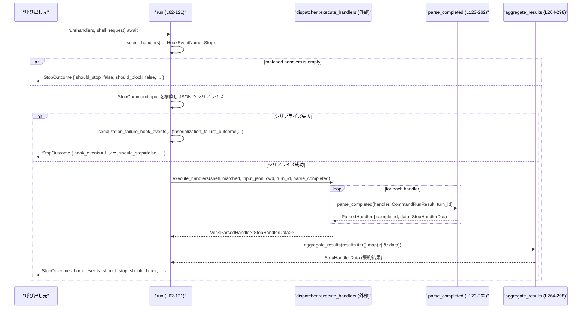

# hooks/src/events/stop.rs コード解説

## 0. ざっくり一言

- 「Stop」フックを実行し、その結果から **会話を止めるか／ブロックするか／続行するか** を決定し、上位に返すモジュールです（`run` が中核）。
- 各フック実行結果を `HookCompletedEvent` として記録しつつ、集約的な停止決定 (`StopOutcome`) を計算します。

---

## 1. このモジュールの役割

### 1.1 概要

- このモジュールは **Stop イベント用のフック** を実行し、フックの標準出力／終了コード／JSON を解析して、
  - 停止すべきか (`should_stop`)
  - ブロックすべきか (`should_block`)
  - その理由 (`stop_reason` / `block_reason`)
  - モデルへの継続プロンプト (`continuation_fragments`)
  を決定します（`run` / `parse_completed` / `aggregate_results`）。  
  根拠: `StopOutcome` と `StopHandlerData` 定義（hooks/src/events/stop.rs:L34-50, L264-298）。
- さらに、フックの実行ログを `HookCompletedEvent` として構築し、上位に返す役割も持ちます（hooks/src/events/stop.rs:L239-242, L252-261）。

### 1.2 アーキテクチャ内での位置づけ

このモジュールは「Stop」イベント用の薄い調整レイヤで、実際のフック実行は engine/dispatcher に委譲しています。

```mermaid
graph TD
    subgraph "hooks/src/events/stop.rs (L21-309)"
        SR[StopRequest<br>(L21-31)]
        SO[StopOutcome<br>(L34-41)]
        SHD[StopHandlerData<br>(L43-50)]
        Preview[preview (L52-60)]
        Run[run (L62-121)]
        Parse[parse_completed (L123-262)]
        Agg[aggregate_results (L264-298)]
    end

    Dispatcher[engine::dispatcher<br>(別モジュール)]
    CommandRunner[engine::command_runner::CommandRunResult<br>(別モジュール)]
    OutputParser[engine::output_parser::parse_stop<br>(別モジュール)]
    Common[events::common<br>(別モジュール)]
    Schema[schema::StopCommandInput / NullableString<br>(別モジュール)]
    Protocol[codex_protocol::*<br>(別クレート)]

    Preview --> Dispatcher
    Run --> Dispatcher
    Run --> Schema
    Run --> Common
    Run --> Parse
    Parse --> CommandRunner
    Parse --> OutputParser
    Parse --> Common
    Agg --> Common
    Run --> Agg
    SR --> Run
    SO --> Run
    SO --> Preview
    SO --> Protocol
```

- `preview` は、Stop イベントにマッチするハンドラの一覧とそのメタ情報を返す **プレビュー専用** API です（hooks/src/events/stop.rs:L52-60）。
- `run` は、Stop 用にマッチしたハンドラを選択し、`dispatcher::execute_handlers` に実行を委譲し、その結果を `parse_completed` と `aggregate_results` で処理します（L62-121）。
- `parse_completed` はフック 1 本分の実行結果 (`CommandRunResult`) から `HookCompletedEvent` と `StopHandlerData` を生成します（L123-262）。
- `aggregate_results` はすべてのハンドラの `StopHandlerData` を集約し、最終的な停止・ブロック決定を行います（L264-298）。

### 1.3 設計上のポイント

- **責務の分割**
  - リクエスト入力構造体 (`StopRequest`) と出力 (`StopOutcome`) をこのモジュールで定義（L21-41）。
  - フック 1 本分の結果表現 (`StopHandlerData`) と解析ロジック (`parse_completed`) を分離（L43-50, L123-262）。
  - 集約ロジックを `aggregate_results` に分離し、実行ロジック (`run`) から切り出し（L264-298）。
- **エラーハンドリング方針**
  - シリアライズ失敗時は **フック実行自体をスキップ** し、既に構築済みの `HookCompletedEvent` 群をそのまま返しつつ `should_stop`/`should_block` はすべて false にする（`serialization_failure_outcome`、L300-308）。
  - フックの `error` フィールド、終了コード、標準出力が不正な JSON の場合などは、`HookRunStatus::Failed` と `HookOutputEntryKind::Error` を生成し、サイレントに無視しない（L136-143, L194-200, L222-235）。
- **停止 vs ブロックの優先度**
  - 単一ハンドラ内では、`continue=false`（＝停止）は `decision:block` より優先される（L155-172 とテスト L377-399）。
  - 集約結果では、どれか 1 つでも `should_stop` が true なら全体として `should_block` は false となる（L268-271）。
- **状態を持たない設計**
  - すべての状態は `StopRequest` / `StopOutcome` / `StopHandlerData` などの値で受け渡しされ、モジュール内にグローバルなミュータブル状態はありません。

### 1.4 コンポーネント一覧（インベントリー）

| 種別 | 名前 | 概要 | 可視性 | 行範囲 |
|------|------|------|--------|--------|
| 構造体 | `StopRequest` | Stop フック実行に必要な入力コンテキスト | `pub` | hooks/src/events/stop.rs:L21-31 |
| 構造体 | `StopOutcome` | Stop フック群の実行結果と集約された決定 | `pub` | L34-41 |
| 構造体 | `StopHandlerData` | ハンドラ 1 本分の停止／ブロック判断と継続プロンプト | `crate` 内 private | L43-50 |
| 関数 | `preview` | Stop 用ハンドラを選択し、実行サマリ一覧を返す | `pub(crate)` | L52-60 |
| 関数 | `run` | Stop 用ハンドラを実行し、`StopOutcome` を構築する async 関数 | `pub(crate)` | L62-121 |
| 関数 | `parse_completed` | 1 ハンドラ分の `CommandRunResult` を解析して `HookCompletedEvent` と `StopHandlerData` を生成 | private | L123-262 |
| 関数 | `aggregate_results` | 複数の `StopHandlerData` から集約結果を計算 | private | L264-298 |
| 関数 | `serialization_failure_outcome` | 入力シリアライズ失敗時のデフォルト `StopOutcome` を構築 | private | L300-308 |
| テスト | `block_decision_with_reason_sets_continuation_prompt` 他 7 件 | `parse_completed` / `aggregate_results` の挙動検証 | `#[cfg(test)] mod tests` 内 | L311-545 |
| テスト補助 | `handler`, `run_result` | テスト用のダミー `ConfiguredHandler` / `CommandRunResult` 生成 | tests モジュール内 | L522-544 |

---

## 2. 主要な機能一覧

- Stop フック入力の構築とシリアライズ（`StopRequest` → `StopCommandInput` → JSON）  
  根拠: hooks/src/events/stop.rs:L62-90
- Stop 対象ハンドラの選択とプレビュー（`preview`）  
  根拠: L52-60
- Stop フック群の非同期実行（`run` → `dispatcher::execute_handlers`）  
  根拠: L101-109
- 各フック結果の解析（標準出力 JSON / エラー / 終了コード）と `HookCompletedEvent` 生成（`parse_completed`）  
  根拠: L123-262
- 複数フックの停止／ブロック判断の集約（`aggregate_results`）  
  根拠: L264-298
- 失敗時（シリアライズ失敗など）の安全なフォールバック（`serialization_failure_outcome`）  
  根拠: L300-308

---

## 3. 公開 API と詳細解説

### 3.1 型一覧（構造体・列挙体など）

| 名前 | 種別 | 役割 / 用途 | 主なフィールド | 行範囲 |
|------|------|-------------|----------------|--------|
| `StopRequest` | 構造体 | Stop フックを実行するために必要なコンテキスト入力 | `session_id`, `turn_id`, `cwd`, `transcript_path`, `model`, `permission_mode`, `stop_hook_active`, `last_assistant_message` | L21-31 |
| `StopOutcome` | 構造体 | Stop フック群の実行結果と、その集約的な停止・ブロック決定 | `hook_events`, `should_stop`, `stop_reason`, `should_block`, `block_reason`, `continuation_fragments` | L34-41 |
| `StopHandlerData` | 構造体 | 1 ハンドラ分の判定結果（内部用） | `should_stop`, `stop_reason`, `should_block`, `block_reason`, `continuation_fragments` | L43-50 |

※ `StopCommandInput`, `NullableString`, `HookCompletedEvent` などは他モジュールで定義され、本ファイルには定義がありません。

---

### 3.2 関数詳細

#### `preview(handlers: &[ConfiguredHandler], _request: &StopRequest) -> Vec<HookRunSummary>`

**概要**

- Stop イベントに登録されているハンドラのうち、実行対象となるものを選び、その「実行予定サマリ」(`HookRunSummary`) のリストを返します（実行はしないプレビュー）。  
  根拠: hooks/src/events/stop.rs:L52-60

**引数**

| 引数名 | 型 | 説明 |
|--------|----|------|
| `handlers` | `&[ConfiguredHandler]` | 全ハンドラ設定一覧。`dispatcher::select_handlers` に渡され、Stop 用のハンドラだけが選択されます（L52-57）。 |
| `_request` | `&StopRequest` | Stop リクエスト情報。現在の実装では使用しておらず、変数名先頭に `_` が付いています（L53-55）。将来のフィルタ条件に利用される可能性がありますが、このファイルからは断定できません。 |

**戻り値**

- `Vec<HookRunSummary>`  
  選択された各ハンドラに対する「実行中サマリ」。`dispatcher::running_summary` の返す値を `collect` したものです（L56-59）。

**内部処理の流れ**

1. `dispatcher::select_handlers` を呼び出して、`HookEventName::Stop` にマッチするハンドラだけを抽出（L56）。
2. そのイテレータに対して `dispatcher::running_summary` を適用し、`HookRunSummary` のベクタに変換（L57-59）。
3. そのまま返却。

**Examples（使用例）**

```rust
// handlers はどこか別の場所で構築される ConfiguredHandler の配列とする
let request = StopRequest {
    session_id: ThreadId::from("thread-1"), // ThreadId の作り方は別クレート依存
    turn_id: "turn-1".to_string(),
    cwd: std::path::PathBuf::from("/workspace"),
    transcript_path: None,
    model: "gpt-4".to_string(),
    permission_mode: "default".to_string(),
    stop_hook_active: true,
    last_assistant_message: None,
};

let summaries: Vec<HookRunSummary> = preview(&handlers, &request); // hooks/src/events/stop.rs:L52-60
for summary in &summaries {
    // 実際に何が含まれるかは dispatcher::running_summary に依存
    println!("Will run hook {:?}", summary);
}
```

**Errors / Panics**

- この関数内では `Result` や `panic!` は使用していません。
- ただし、`dispatcher::select_handlers` / `dispatcher::running_summary` が内部で panic する可能性については、このファイルからは分かりません（定義が別モジュールのため）。

**Edge cases（エッジケース）**

- `handlers` に Stop イベント用のハンドラが 1 つもない場合：空の `Vec` が返されます（`select_handlers` の結果が空の場合も通常どおり map/collect されるため）。

**使用上の注意点**

- 実際のフックは実行しないため、`StopOutcome` などの停止判定は得られません。あくまで UI 表示やログ向けの「予定一覧」に利用することが想定されます（関数名と戻り値からの推測であり、コードからは用途までは断定できません）。

---

#### `run(handlers: &[ConfiguredHandler], shell: &CommandShell, request: StopRequest) -> StopOutcome` （async）

**概要**

- Stop イベント用ハンドラを選択し、非同期で実行した上で、各ハンドラの結果から **停止／ブロック判定と理由・継続プロンプト** を集約して `StopOutcome` として返します。  
  根拠: hooks/src/events/stop.rs:L62-121

**引数**

| 引数名 | 型 | 説明 |
|--------|----|------|
| `handlers` | `&[ConfiguredHandler]` | 全ハンドラ一覧。Stop イベント用にフィルタされます（L67-68）。 |
| `shell` | `&CommandShell` | コマンド実行環境。`dispatcher::execute_handlers` に渡されます（L101-102）。 |
| `request` | `StopRequest` | Stop フックの入力情報一式（セッション ID、ターン ID など）。`StopCommandInput` に変換され、JSON にシリアライズされます（L80-90）。 |

**戻り値**

- `StopOutcome`  
  Stop フック群の実行結果、およびそれに基づく停止／ブロック判定です（L113-120）。

**内部処理の流れ**

1. `dispatcher::select_handlers` で Stop イベント用ハンドラを抽出し、`matched` とする（L67-68）。
2. `matched` が空なら、フックは何もせず、`StopOutcome` をデフォルト値（`should_stop=false` など）で返す（L69-78）。
3. `StopCommandInput` を組み立て、`serde_json::to_string` でシリアライズ（L80-90）。
   - `NullableString::from_path` / `from_string` で `Option<PathBuf>` / `Option<String>` をシリアライズ用に変換（L83, L89）。
4. シリアライズに失敗した場合、`common::serialization_failure_hook_events` でエラー内容を含む `HookCompletedEvent` 群を構築し、それを `serialization_failure_outcome` に渡して `StopOutcome` を返して終了（L91-98, L300-308）。
5. シリアライズ成功時は、`dispatcher::execute_handlers` を呼び出し、各ハンドラを実行（L101-109）。
   - 引数として `shell`, `matched`, `input_json`, `cwd`, `turn_id`, そしてコールバック関数 `parse_completed` を渡します。
   - 戻り値 `results` は各ハンドラごとに `completed`（`HookCompletedEvent`）と `data`（`StopHandlerData`）を持つ構造体のリストです。
6. `aggregate_results` に `results.iter().map(|result| &result.data)` を渡して集約結果を計算（L111）。
7. 最後に `StopOutcome` を構築して返す（L113-120）。

**Examples（使用例）**

```rust
// 非同期コンテキスト内（tokio 等のランタイム上）にいることを前提とします。
async fn handle_stop(handlers: &[ConfiguredHandler], shell: &CommandShell) -> anyhow::Result<()> {
    let request = StopRequest {
        session_id: ThreadId::from("thread-1"),
        turn_id: "turn-1".to_string(),
        cwd: std::path::PathBuf::from("/workspace"),
        transcript_path: None,
        model: "gpt-4".to_string(),
        permission_mode: "default".to_string(),
        stop_hook_active: true,
        last_assistant_message: Some("last reply".to_string()),
    };

    let outcome = run(handlers, shell, request).await; // hooks/src/events/stop.rs:L62-121

    if outcome.should_stop {
        println!("Stop conversation: {:?}", outcome.stop_reason);
    } else if outcome.should_block {
        println!("Block and ask user: {:?}", outcome.block_reason);
        for fragment in &outcome.continuation_fragments {
            println!("Prompt fragment: {}", fragment.text);
        }
    } else {
        println!("Continue normally");
    }

    Ok(())
}
```

**Errors / Panics**

- 関数シグネチャは `StopOutcome` を直接返しており、`Result` ではありません。
  - シリアライズ失敗時は `serialization_failure_outcome` によって「失敗を示す `HookCompletedEvent` 群」と「停止・ブロックとも false の `StopOutcome`」として返します（L91-98, L300-308）。
- `dispatcher::execute_handlers` や `serde_json::to_string` が panic するかどうかは、このファイルからは分かりません。いずれも `unwrap` 等は使用していません。

**Edge cases（エッジケース）**

- Stop 用ハンドラが 1 つも登録されていない場合：
  - `hook_events` は空、`should_stop=false`, `should_block=false` の `StopOutcome` が即座に返ります（L69-78）。
- `StopCommandInput` のシリアライズに失敗した場合：
  - どのフックも実行されず、`serialization_failure_hook_events` から得られた `hook_events` と、すべて false の判定を持つ `StopOutcome` が返ります（L91-98, L300-308）。

**使用上の注意点**

- `run` は async 関数のため、呼び出し側は何らかの非同期ランタイム（tokio など）の上で `.await` する必要があります。
- エラー情報は `StopOutcome` 自体ではなく、主に `hook_events` 内の `HookRunStatus` や `HookOutputEntryKind::Error` として表現されます（`parse_completed` での生成、L136-143 など）。エラーの詳細を扱いたい場合は、`hook_events` を併せて見る前提です。

---

#### `parse_completed(handler: &ConfiguredHandler, run_result: CommandRunResult, turn_id: Option<String>) -> dispatcher::ParsedHandler<StopHandlerData>`

**概要**

- 1 本の Stop フック実行結果 (`CommandRunResult`) を解析し、
  - `HookCompletedEvent`（ログ・ステータス・メッセージ）
  - `StopHandlerData`（停止／ブロック判定と継続プロンプト）
  を組み立てた `dispatcher::ParsedHandler` を返します。  
  根拠: hooks/src/events/stop.rs:L123-262

**引数**

| 引数名 | 型 | 説明 |
|--------|----|------|
| `handler` | `&ConfiguredHandler` | 実行したハンドラ設定。`completed_summary` に渡されます（L241）。 |
| `run_result` | `CommandRunResult` | 実際のコマンド実行結果（開始時刻、終了時刻、終了コード、stdout/stderr、エラー情報など）（L124-126）。 |
| `turn_id` | `Option<String>` | この実行に紐づくターン ID。`HookCompletedEvent` に格納されます（L239-241）。 |

**戻り値**

- `dispatcher::ParsedHandler<StopHandlerData>`  
  - `completed`: `HookCompletedEvent`（`dispatcher::completed_summary` の戻り値を含む）  
  - `data`: `StopHandlerData`（停止・ブロック・継続プロンプト情報）

**内部処理の流れ（アルゴリズム）**

1. ローカル変数として `entries`, `status`, `should_stop`, `stop_reason`, `should_block`, `block_reason`, `continuation_prompt` を初期化（L128-134）。
2. `run_result.error` を確認（L136）。
   - `Some(error)` の場合：
     - ステータスを `Failed` とし（L138）、`HookOutputEntryKind::Error` で `entries` にエラーメッセージを追加（L139-142）。
   - `None` の場合は、`run_result.exit_code` に応じて分岐（L144-236）：
     1. `Some(0)`（正常終了）:
        - stdout を `trim` して空文字かどうか確認（L146-147）。
          - 空なら何もせず終了（「成功だが無指示」扱い）。
          - 空でなく `output_parser::parse_stop(&run_result.stdout)` が `Some(parsed)` を返す場合（L148）:
            - `parsed.universal.system_message` があれば Warning として記録（L149-154）。
            - `parsed.universal.suppress_output` は読み出すだけで未使用（L155）。
            - `parsed.universal.continue_processing` を確認（L156）:
              - `false` の場合（＝続行しない）:
                - `status = Stopped`, `should_stop = true`, `stop_reason` をセット（L157-160）。
                - `stop_reason` が `Some` の場合は `HookOutputEntryKind::Stop` として entries に追加（L160-165）。
              - `true` の場合:
                - `parsed.invalid_block_reason` が `Some` なら `Failed` として Error メッセージを追加（L166-171）。
                - それ以外で `parsed.should_block` が true なら（L172）:
                  - `parsed.reason` を `trimmed_non_empty` で前後空白除去しつつ空文字でないか検証（L173-175）。
                  - 正常な理由がある場合は `status = Blocked`, `should_block = true`, `block_reason` と `continuation_prompt` にセットし（L176-180）、`HookOutputEntryKind::Feedback` を追加（L181-183）。
                  - 理由が空または空白のみの場合は `Failed` としてエラーを追加（L185-191）。
            - `parse_stop` が `None` の場合：
              - `Failed` とし、「invalid stop hook JSON output」として Error を追加（L194-200）。
     2. `Some(2)`（特殊なブロックコード）:
        - `common::trimmed_non_empty(&run_result.stderr)` で stderr から非空文字列を抽出（L203）。
          - 取得できた場合は `Blocked` として `should_block=true`、`block_reason` と `continuation_prompt` をセットし、Feedback メッセージを追加（L204-211）。
          - 取得できない場合は `Failed` としてエラーを追加（L213-219）。
     3. その他の `Some(exit_code)`:
        - `Failed` とし、「hook exited with code {exit_code}」という Error を追加（L222-227）。
     4. `None`（終了コードなし）:
        - `Failed` とし、「hook exited without a status code」という Error を追加（L229-234）。
3. `HookCompletedEvent` を構築（L239-242）。
   - `dispatcher::completed_summary(handler, &run_result, status, entries)` により run 情報をまとめます。
4. `continuation_prompt` が `Some(prompt)` の場合は `HookPromptFragment::from_single_hook(prompt, completed.run.id.clone())` で 1 要素の `Vec` を生成（L243-249）。`None` の場合は空ベクタ。
5. `dispatcher::ParsedHandler` を組み立てて返却（L252-261）。

**Examples（使用例）**

テストコードが実例になっています。例えば、「decision:block with reason」を返した stdout に対する挙動:

```rust
let parsed = parse_completed(
    &handler(), // テスト用のダミー ConfiguredHandler
    run_result(
        Some(0),
        r#"{"decision":"block","reason":"retry with tests"}"#,
        "",
    ),
    Some("turn-1".to_string()),
);

assert_eq!(
    parsed.data,
    StopHandlerData {
        should_stop: false,
        stop_reason: None,
        should_block: true,
        block_reason: Some("retry with tests".to_string()),
        continuation_fragments: vec![HookPromptFragment {
            text: "retry with tests".to_string(),
            hook_run_id: parsed.completed.run.id.clone(),
        }],
    }
);
assert_eq!(parsed.completed.run.status, HookRunStatus::Blocked);
```

根拠: hooks/src/events/stop.rs:L329-355

**Errors / Panics**

- 関数自体は `Result` を返さず、失敗は `HookRunStatus::Failed` と Error エントリで表現されます。
- `output_parser::parse_stop` や `common::trimmed_non_empty` が panic するかは、このファイルからは分かりません。
- `HookPromptFragment::from_single_hook` や `dispatcher::completed_summary` も外部依存で、panic の有無は不明です。

**Edge cases（エッジケース）**

テストコードが多くのエッジケースをカバーしています。

- `decision:"block"` だが `reason` が欠如：  
  - `StopHandlerData::default()`（すべて false/None）となり、`HookRunStatus::Failed` + Error エントリが生成されます（L357-373）。
- `decision:"block"` だが `reason` が空白のみ：  
  - 同様に Failed + Error。「non-empty reason が必要」というメッセージ（L446-462）。
- `continue:false` と `decision:"block"` の両方が指定された場合：  
  - `continue:false`（＝停止）が優先され、`should_stop=true`、`should_block=false` となります（L377-399）。
- stdout が JSON でない文字列：
  - `HookRunStatus::Failed` と「invalid stop hook JSON output」Error になります（L466-481）。
- exit code 2 だが stderr が空白のみ：  
  - ブロック扱いにはならず、Failed + Error になります（L425-443）。

**使用上の注意点**

- フック実装側は、`output_parser::parse_stop` の期待する JSON 形式に従う必要があります。形式違反はすべて「Failed」として扱われます（L194-200）。
- `decision:"block"` を返す場合は、**必ず非空の `reason`** を返さないと失敗扱いになります（L173-191 とテスト L357-373, L446-462）。
- exit code 2 の場合、stdout は無視され stderr だけが continuation prompt として使用される設計になっています（L202-212, テスト L401-423）。

---

#### `aggregate_results<'a>(results: impl IntoIterator<Item = &'a StopHandlerData>) -> StopHandlerData`

**概要**

- 複数の `StopHandlerData` を集約し、
  - 全体として停止すべきか (`should_stop`)
  - ブロックすべきか (`should_block`)
  - 複数ブロック理由の結合 (`block_reason`)
  - 複数継続プロンプトの連結 (`continuation_fragments`)
  を決定します。  
  根拠: hooks/src/events/stop.rs:L264-298

**引数**

| 引数名 | 型 | 説明 |
|--------|----|------|
| `results` | `impl IntoIterator<Item = &'a StopHandlerData>` | 各ハンドラの判定結果のイテレータ。参照として受け取ります（L264-266）。 |

**戻り値**

- `StopHandlerData`  
  集約された 1 つの判定結果です（L291-297）。

**内部処理の流れ**

1. `results` を `Vec<&StopHandlerData>` に収集（L267）。
2. `should_stop` を「どれか 1 つでも `should_stop` が true か」の OR で決定（L268）。
3. `stop_reason` は「最初に見つかった `Some(stop_reason)`」を採用（`find_map` 使用、L269）。
4. `should_block` は `!should_stop && any(result.should_block)` で決定。  
   つまり「誰も stop しておらず、誰かが block しているときだけ block」となります（L270）。
5. `block_reason` は `should_block` が true の場合のみ生成し、`common::join_text_chunks` ですべての `block_reason`（`Some` のもの）を結合（L271-278）。false の場合は None（L278-280）。
6. `continuation_fragments` は `should_block` が true の場合に、`should_block` な結果だけから `continuation_fragments` を連結（L281-287）。false の場合は空ベクタ（L287-289）。
7. 上記をフィールドに持つ `StopHandlerData` を返却（L291-297）。

**Examples（使用例）**

テストでは、ブロック理由の連結順序が定義されています。

```rust
let aggregate = aggregate_results([
    &StopHandlerData {
        should_stop: false,
        stop_reason: None,
        should_block: true,
        block_reason: Some("first".to_string()),
        continuation_fragments: vec![HookPromptFragment::from_single_hook(
            "first", "run-1",
        )],
    },
    &StopHandlerData {
        should_stop: false,
        stop_reason: None,
        should_block: true,
        block_reason: Some("second".to_string()),
        continuation_fragments: vec![HookPromptFragment::from_single_hook(
            "second", "run-2",
        )],
    },
]);

assert_eq!(
    aggregate,
    StopHandlerData {
        should_stop: false,
        stop_reason: None,
        should_block: true,
        block_reason: Some("first\n\nsecond".to_string()),
        continuation_fragments: vec![
            HookPromptFragment::from_single_hook("first", "run-1"),
            HookPromptFragment::from_single_hook("second", "run-2"),
        ],
    }
);
```

根拠: hooks/src/events/stop.rs:L484-519

**Errors / Panics**

- `common::join_text_chunks` が panic するかは、このファイルからは分かりません。
- 空イテレータの場合も `Vec::new()` から集約されるだけで、特別なエラー処理はありません。

**Edge cases（エッジケース）**

- 1 件も `should_stop` / `should_block` が true でない場合：
  - すべて false / None / 空ベクタの `StopHandlerData` が返ります。
- `should_stop=true` の結果が 1 つでもある場合：
  - `should_block` は必ず false。したがって `block_reason` と `continuation_fragments` は無視されます（L270-288）。
- `block_reason` が `None` のものは、結合対象から除外されます（`filter_map`、L273-276）。

**使用上の注意点**

- 複数のハンドラが異なる `stop_reason` を返した場合でも、**最初の 1 件のみ** が採用されます（L269）。どの順番で評価されるかは、この関数に渡すイテレータの順序に依存します。
- ブロック理由は `common::join_text_chunks` による結合方式に依存しており、テストからは `"first\n\nsecond"` のように空行で区切られることが確認できます（L484-519）。

---

#### `serialization_failure_outcome(hook_events: Vec<HookCompletedEvent>) -> StopOutcome`

**概要**

- Stop フック入力のシリアライズに失敗した場合に返す **フォールバック用の `StopOutcome`** を構築します。  
  根拠: hooks/src/events/stop.rs:L300-308

**引数**

| 引数名 | 型 | 説明 |
|--------|----|------|
| `hook_events` | `Vec<HookCompletedEvent>` | シリアライズ失敗に関する `HookCompletedEvent` 群。`common::serialization_failure_hook_events` から渡されます（L93-97）。 |

**戻り値**

- `StopOutcome`  
  `hook_events` をそのまま持ちつつ、`should_stop=false`, `should_block=false` などの「何もしない」判定になります（L300-308）。

**内部処理の流れ**

1. 渡された `hook_events` をそのまま `StopOutcome::hook_events` に格納。
2. 停止・ブロック関連のフィールドはすべて「停止もブロックもしない」状態で初期化（L302-307）。

**使用上の注意点**

- この関数は `run` 内でのみ使用されています（L91-98）。外部から直接呼び出されることは想定されていません（可視性も private）。
- シリアライズエラーそのものの内容は、`hook_events` 側に含まれている前提です（`common::serialization_failure_hook_events` の実装はこのファイルには現れません）。

---

### 3.3 その他の関数

テストモジュール内の補助関数です。

| 関数名 | 役割（1 行） | 行範囲 |
|--------|--------------|--------|
| `handler()` | Stop 用のダミー `ConfiguredHandler` を生成するテスト補助関数 | hooks/src/events/stop.rs:L522-531 |
| `run_result(exit_code, stdout, stderr)` | 任意の `CommandRunResult` を組み立てるテスト補助関数 | L534-544 |

---

## 4. データフロー

### 4.1 代表的な処理シナリオ（run → parse_completed → aggregate_results）

Stop イベントが発火したとき、上位コードからは `run` が呼ばれます。その内部で Stop 用ハンドラが選択・実行され、それぞれの結果が `parse_completed` で解析され、最後に `aggregate_results` で集約されます。



- `parse_completed` に渡される `CommandRunResult` の具体的な構造（プロセス ID やコマンド文字列など）はこのファイルには現れませんが、少なくとも `exit_code`, `stdout`, `stderr`, `error` が存在することが分かります（L124-126, L145-147, L202-215）。
- `aggregate_results` は `parse_completed` の `data` フィールドだけを見ているため、ハンドラごとのログメッセージ内容には依存していません（L111, L264-298）。

---

## 5. 使い方（How to Use）

### 5.1 基本的な使用方法

このモジュールを利用する典型的なコードフローは以下のようになります。

```rust
use hooks::events::stop::{StopRequest, StopOutcome}; // 実際のパスはクレート構成に依存
use crate::engine::{ConfiguredHandler, CommandShell}; // engine 側の型

async fn handle_turn_stop(
    handlers: &[ConfiguredHandler],
    shell: &CommandShell,
    thread_id: ThreadId,
    turn_id: String,
) -> StopOutcome {
    // Stop フックの入力を構築する（L21-31）
    let request = StopRequest {
        session_id: thread_id,
        turn_id,
        cwd: std::env::current_dir().unwrap_or_default(),
        transcript_path: None,
        model: "gpt-4".to_string(),
        permission_mode: "default".to_string(),
        stop_hook_active: true,
        last_assistant_message: None,
    };

    // Stop フックを実行する（L62-121）
    let outcome = run(handlers, shell, request).await;

    // outcome を返すか、ここで判定・ログ出力などを行う
    outcome
}
```

- 上位コード側では `should_stop` / `should_block` と理由 (`stop_reason` / `block_reason`) を参照して、会話の制御を行うことが想定されます。
- 詳細なログを表示したい場合は `outcome.hook_events` に含まれる `HookCompletedEvent` を参照します。

### 5.2 よくある使用パターン

1. **事前プレビューと実行の分離**

   - UI で「どの Stop フックが走るか」を事前表示する際には `preview` を使用し、実際に Stop 処理に入る段階で `run` を呼び出す、という使い分けが可能です。

   ```rust
   // プレビュー（実行なし）
   let summaries = preview(&handlers, &request);
   // summaries を UI やログに表示

   // 実際の実行
   let outcome = run(&handlers, &shell, request).await;
   ```

2. **停止とブロックの分岐処理**

   ```rust
   match (outcome.should_stop, outcome.should_block) {
       (true, _) => {
           // 完全に停止
       }
       (false, true) => {
           // ブロックしてユーザ確認などを行う
       }
       (false, false) => {
           // 続行
       }
   }
   ```

### 5.3 よくある間違い

```rust
// 間違い例: StopOutcome の hook_events を無視し、エラー原因を追えない
let outcome = run(&handlers, &shell, request).await;
if outcome.should_stop {
    // なぜ止まったのか分からない
}

// 正しい例: hook_events から HookRunStatus や Error メッセージを確認する
let outcome = run(&handlers, &shell, request).await;
for event in &outcome.hook_events {
    println!(
        "hook {} finished with status {:?}",
        event.run.id, event.run.status
    );
    for entry in &event.run.entries {
        println!("  {:?}: {}", entry.kind, entry.text);
    }
}
```

### 5.4 使用上の注意点（まとめ）

- **前提条件**
  - `run` は async 関数であり、非同期ランタイム上で `.await` される前提です（L62）。
  - `handlers` や `shell` は外部で適切に構築されている必要があります（本ファイルには生成ロジックはありません）。
- **エラーハンドリング**
  - フック実行時のエラーは `HookRunStatus::Failed` と `HookOutputEntryKind::Error` で表現され、`StopOutcome` のフラグに直接は現れない場合があります（例: すべてのフックが失敗しても `should_stop` は false のままになりえます）。
- **安全性（Rust 特有）**
  - このモジュール内では `unsafe` は一切使用されておらず、所有権は値の受け渡しのみで管理されています（例: `StopRequest` は `run` にムーブされる、L62-66）。
  - 共有データへの同時書き込みはなく、スレッドセーフ性は主に外部コンポーネント（`CommandShell` や `dispatcher`）に委ねられています。
- **並行性**
  - `run` 自体は 1 回の呼び出しごとにシーケンシャルですが、内部で `dispatcher::execute_handlers` がどのように並行実行するかは、このファイルからは分かりません。
  - `StopHandlerData` や `StopOutcome` は `Send` / `Sync` かどうか明示されていませんが、基本的には所有権を移動させて使う設計です。

---

## 6. 変更の仕方（How to Modify）

### 6.1 新しい機能を追加する場合

例: Stop フックに新しい判定種別（例: 「一時停止」）を追加したい場合。

1. **データ構造の拡張**
   - 新しい状態を表すフラグや理由フィールドが必要であれば、`StopHandlerData` にフィールドを追加します（L43-50）。
   - それに応じて `StopOutcome` にもフィールドを追加することで、上位層まで情報を伝播できます（L34-41）。
2. **解析ロジックの拡張**
   - 新しい JSON フィールドや exit code を解釈する必要がある場合は、`parse_completed` 内の分岐（L145-236）にロジックを追加します。
   - 必要に応じて `output_parser::parse_stop` の戻り値型も拡張する必要がありますが、それは別モジュールの変更になります。
3. **集約ロジックの拡張**
   - 新しいフラグを集約したい場合は、`aggregate_results` を修正し、OR/AND のルールを定義します（L264-298）。
4. **テストの追加**
   - 既存の tests モジュール（L311-545）と同様のスタイルで、新しい挙動を検証するテストを追加します。

### 6.2 既存の機能を変更する場合

- **影響範囲の確認**
  - `parse_completed` と `aggregate_results` のどちらか（または両方）に変更が必要かを確認します。
  - `StopOutcome` のフィールドに手を入れる場合は、このモジュール以外での利用箇所も検索する必要があります（このファイルだけでは分かりません）。
- **契約（前提条件・返り値の意味）**
  - `decision:"block"` には非空の `reason` が必須、`continue:false` は `decision:"block"` より優先、といった「事実上の仕様」はテストコードに反映されています（L329-399, L446-462）。これらを変える場合はテストもそれに合わせて変更する必要があります。
- **テスト・使用箇所の再確認**
  - `parse_completed` の仕様を変更する場合、tests モジュール内のほとんどのテストが影響を受けます（L329-481）。
  - `aggregate_results` の仕様変更は `aggregate_results_concatenates_blocking_reasons_in_declaration_order` テストなどに反映されます（L484-519）。

---

## 7. 関連ファイル

このモジュールと密接に関係するファイル・ディレクトリは次のとおりです（いずれもこのチャンクには定義が現れません）。

| パス | 役割 / 関係 |
|------|------------|
| `hooks/src/events/common.rs`（想定） | `serialization_failure_hook_events`, `trimmed_non_empty`, `join_text_chunks` などを提供し、本モジュールから呼び出されています（L12, L93, L173-175, L203, L271-277）。 |
| `engine/dispatcher.rs`（想定） | ハンドラの選択 (`select_handlers`), 実行 (`execute_handlers`), サマリ作成 (`running_summary`, `completed_summary`), `ParsedHandler` 型などを提供します（L16, L52-57, L101-109, L239-242, L252-261）。 |
| `engine/command_runner.rs` | `CommandRunResult` 型の定義。フック実行の結果（exit code, stdout, stderr, error 等）を表します（L15, L124-126）。 |
| `engine/output_parser.rs` | `parse_stop` 関数を通じて Stop フックの stdout JSON をパースします（L17, L148）。 |
| `schema/stop_command_input.rs` など（想定） | `StopCommandInput` 型の定義。Stop フックへの入力 JSON のスキーマを表します（L19, L80-90）。 |
| `schema/nullable_string.rs` など（想定） | `NullableString::{from_path, from_string}` を提供し、Option 値からシリアライズ表現を生成します（L18, L83, L89）。 |
| `codex_protocol` クレート | `ThreadId`, `HookCompletedEvent`, `HookEventName`, `HookOutputEntry`, `HookOutputEntryKind`, `HookRunStatus`, `HookRunSummary`, `HookPromptFragment` など、プロトコル関連の型を提供します（L3-10, L35-40）。 |

---

### Bugs / Security / Contracts / Edge Cases まとめ（補足）

- **潜在的な挙動上の注意点（Bugs に関連）**
  - exit code 0 かつ stdout が空文字列の場合、`HookRunStatus::Completed` かつ `StopHandlerData::default()` となり、「フックは成功したが何も指示しなかった」扱いになります（L145-148）。この挙動が仕様通りかどうかは、このファイルからは判断できません。
  - すべてのフックが `Failed` になった場合でも、`StopOutcome.should_stop` / `should_block` は false のままになりうるため、「エラーがあったから停止する」という挙動はこの層では行っていません。
- **Security**
  - フック実行自体は `dispatcher::execute_handlers` と `CommandShell` に委譲されており、このモジュール内で OS コマンド文字列の組み立てや危険な操作は行っていません（L101-109）。
  - 任意コマンド実行に関するセキュリティポリシは engine 層の実装に依存し、このチャンクからは評価できません。
- **Contracts**
  - フックの stdout JSON は `output_parser::parse_stop` が解釈できる形式である必要があります。形式違反は必ず `Failed` になります（L148-200）。
  - `decision:"block"` 時には非空の `reason` が必須という契約が、コードとテストで明示されています（L173-191, L357-373, L446-462）。
  - exit code 2 は「stderr に continuation prompt を返すブロック決定」という特別な契約になっています（L202-212, L401-423）。
- **Edge Cases**
  - 上で述べた JSON 不正・reason 欠如・exit code 2 + stderr 空白のみなど、多くが tests モジュールでカバーされています（L329-481）。
- **Observability**
  - すべてのエラー／警告／停止／フィードバックは `HookOutputEntryKind` で分類され、`HookCompletedEvent.run.entries` に記録されます（生成は主に `parse_completed`、L139-142, L151-153, L161-164, L168-171, L181-183, L187-191, L197-199, L209-211, L215-219, L225-227, L231-234）。
  - これにより、上位レイヤからフックごとの挙動を詳細に観測できます。
