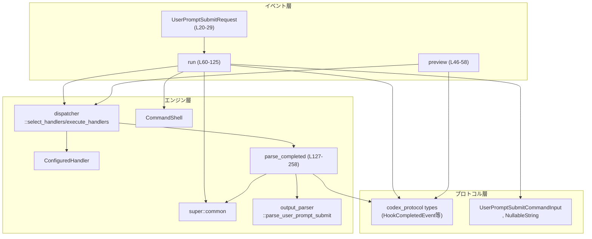
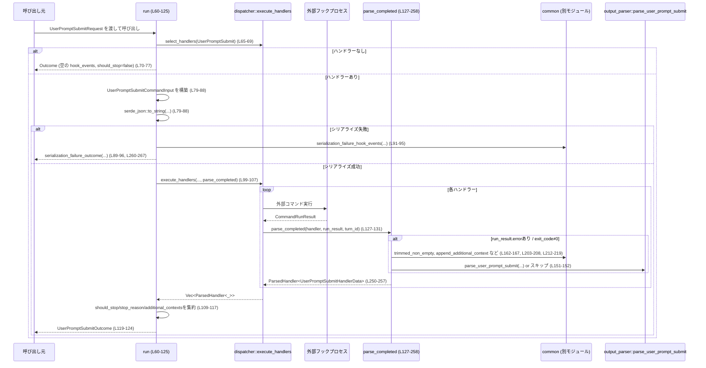

# hooks/src/events/user_prompt_submit.rs

## 0. ざっくり一言

ユーザーがプロンプトを送信したときに呼び出される「UserPromptSubmit」フックを実行し、その結果から「処理を続行すべきか」「停止理由」「追加コンテキスト」を集約して返すモジュールです。外部コマンドの実行結果をパースして `HookCompletedEvent` と内部用データに変換します。  
（全体の根拠: `hooks/src/events/user_prompt_submit.rs:L20-267`）

---

## 1. このモジュールの役割

### 1.1 概要

- このモジュールは **ユーザーのプロンプト送信時に登録されたフック（外部コマンド）を呼び出し、その結果を集約する問題** を扱います。
- 具体的には、`UserPromptSubmitRequest` を JSON にシリアライズして各ハンドラー（フック）に渡し、その標準出力・終了コードを `parse_completed` で解析し、  
  - 実行ログ (`HookCompletedEvent` のリスト)  
  - 処理を止めるかどうか (`should_stop` / `stop_reason`)  
  - モデルへの追加コンテキスト (`additional_contexts`)  
  を `UserPromptSubmitOutcome` として返します。  
  （根拠: `run`, `parse_completed` の処理フロー `L60-125`, `L127-258`）

### 1.2 アーキテクチャ内での位置づけ

外部からの呼び出し・エンジン内部・外部コマンドとの関係は概ね次のようになっています。



- `preview` はハンドラー選択だけを行い、実行せずに `HookRunSummary` を返します（`L46-58`）。
- `run` は `dispatcher::execute_handlers` に `parse_completed` をコールバックとして渡し、各ハンドラー実行結果を `ParsedHandler<UserPromptSubmitHandlerData>` に変換します（`L99-107`, `L127-258`）。

### 1.3 設計上のポイント

- **状態レス**  
  - このモジュール自体はグローバルな状態を持たず、関数はすべて入力引数に対して純粋に結果を返します。中間状態はローカル変数内にとどまります（`L127-137`）。
- **非同期実行モデル**  
  - フック実行を行う `run` は `async fn` として定義され、`dispatcher::execute_handlers(...).await` に委譲しています（`L60-64`, `L99-107`）。  
    実際の並行実行の詳細は `dispatcher` モジュール側にあります（このチャンクからは不明）。
- **外部コマンドの安全なラッピング**  
  - 外部コマンドのエラー (`run_result.error`), 終了コード (`exit_code`), 標準出力・標準エラーをすべて `parse_completed` でパターンマッチし、失敗時には `HookRunStatus::Failed` を設定します（`L138-243`）。
  - `unwrap` や `expect` などによるパニックを伴う操作はなく、すべて `match` / `if let` で安全に分岐しています。
- **プロトコルとの明確な境界**  
  - 外部公開されるのはシンプルなリクエスト・アウトカム型 (`UserPromptSubmitRequest`, `UserPromptSubmitOutcome`) であり、内部の詳細（`UserPromptSubmitHandlerData` や `dispatcher::ParsedHandler<_>`）は非公開です（`L20-44`, `L127-258`）。

---

## 2. 主要な機能一覧

- フック入力の構築とシリアライズ: `UserPromptSubmitRequest` から `UserPromptSubmitCommandInput` を生成して JSON に変換します（`L79-88`）。
- フックハンドラーのプレビュー: 実行せず、どのハンドラーがマッチするかを `HookRunSummary` として取得します（`preview`, `L46-58`）。
- フックハンドラーの実行と集約: すべてのマッチしたハンドラーを実行し、`HookCompletedEvent` と停止判定・追加コンテキストを集約します（`run`, `L60-125`）。
- コマンド実行結果のパース: `CommandRunResult` から `HookRunStatus` / 出力エントリ / 内部データを組み立てます（`parse_completed`, `L127-258`）。
- シリアライズ失敗時の結果生成: 入力 JSON 化に失敗したときに、事前に生成済みの `HookCompletedEvent` 群をラップして `UserPromptSubmitOutcome` を返します（`L260-267`）。

---

## 3. 公開 API と詳細解説

### 3.1 型・関数インベントリー

#### 構造体・内部データ

| 名前 | 種別 | 可視性 | 役割 / 用途 | 定義位置 |
|------|------|--------|-------------|----------|
| `UserPromptSubmitRequest` | 構造体 | `pub` | ユーザーのプロンプト送信フックに渡す入力情報（セッション ID, ターン ID, カレントディレクトリ, モデル名等）を保持します。 | `hooks/src/events/user_prompt_submit.rs:L20-29` |
| `UserPromptSubmitOutcome` | 構造体 | `pub` | フック実行後に得られる結果を集約します。<br/>- フックごとの完了イベント<br/>- 処理継続可否 (`should_stop`/`stop_reason`)<br/>- モデルに渡す追加コンテキスト一覧 | `hooks/src/events/user_prompt_submit.rs:L31-37` |
| `UserPromptSubmitHandlerData` | 構造体 | `struct`（非公開） | 各ハンドラー実行結果ごとの内部用データ。`run` が全体を集約するときに使用します。<br/>- `should_stop`<br/>- `stop_reason`<br/>- モデル向け追加コンテキスト | `hooks/src/events/user_prompt_submit.rs:L39-44` |

#### 関数（本体）

| 名前 | シグネチャ（簡略） | 可視性 | 役割 / 用途 | 定義位置 |
|------|--------------------|--------|-------------|----------|
| `preview` | `fn preview(handlers: &[ConfiguredHandler], _request: &UserPromptSubmitRequest) -> Vec<HookRunSummary>` | `pub(crate)` | 指定された `handlers` のうち `HookEventName::UserPromptSubmit` にマッチするものを選び、実行せずに実行サマリを返します。 | `L46-58` |
| `run` | `async fn run(handlers: &[ConfiguredHandler], shell: &CommandShell, request: UserPromptSubmitRequest) -> UserPromptSubmitOutcome` | `pub(crate)` | UserPromptSubmit フックを実際に実行し、その結果を `UserPromptSubmitOutcome` に集約します。 | `L60-125` |
| `parse_completed` | `fn parse_completed(handler: &ConfiguredHandler, run_result: CommandRunResult, turn_id: Option<String>) -> dispatcher::ParsedHandler<UserPromptSubmitHandlerData>` | `fn`（非公開） | 単一ハンドラーの `CommandRunResult` を解析し、`HookCompletedEvent` と内部データ (`UserPromptSubmitHandlerData`) に変換します。`dispatcher::execute_handlers` のコールバックとして使用されます。 | `L127-258` |
| `serialization_failure_outcome` | `fn serialization_failure_outcome(hook_events: Vec<HookCompletedEvent>) -> UserPromptSubmitOutcome` | `fn`（非公開） | 入力 JSON シリアライズに失敗した場合に、既に構築された `HookCompletedEvent` 群を `UserPromptSubmitOutcome` にラップします。 | `L260-267` |

#### テスト用関数・補助

| 名前 | 種別 | 役割 / 用途 | 定義位置 |
|------|------|-------------|----------|
| `continue_false_preserves_context_for_later_turns` | テスト関数 | `continue:false` と `stopReason` を含む JSON 出力のケースを検証します。 | `L284-318` |
| `claude_block_decision_blocks_processing` | テスト関数 | `decision:"block"` と `reason` を含む JSON 出力のブロックケースを検証します。 | `L320-354` |
| `claude_block_decision_requires_reason` | テスト関数 | `decision:"block"` で `reason` が空なケースがエラーになることを検証します。 | `L356-384` |
| `exit_code_two_blocks_processing` | テスト関数 | 終了コード `2` + stderr に理由が書かれているケースでブロック扱いになることを検証します。 | `L387-410` |
| `handler` | テスト補助関数 | テスト用のダミー `ConfiguredHandler` を生成します。 | `L413-423` |
| `run_result` | テスト補助関数 | テスト用の `CommandRunResult` を構築します。 | `L425-435` |

---

### 3.2 主要関数の詳細

#### `run(handlers: &[ConfiguredHandler], shell: &CommandShell, request: UserPromptSubmitRequest) -> UserPromptSubmitOutcome`  （非同期）

**概要**

- `HookEventName::UserPromptSubmit` にマッチするすべての `ConfiguredHandler` を選択し、外部コマンドとして実行します。
- 各実行結果を `parse_completed` で解析し、  
  - フックごとの `HookCompletedEvent`  
  - 全体としての `should_stop` / `stop_reason` / `additional_contexts`  
  を計算して `UserPromptSubmitOutcome` として返します。  
  （根拠: `hooks/src/events/user_prompt_submit.rs:L60-125`）

**引数**

| 引数名 | 型 | 説明 |
|--------|----|------|
| `handlers` | `&[ConfiguredHandler]` | 利用可能なフック設定の配列です。`dispatcher::select_handlers` を通じて、`HookEventName::UserPromptSubmit` のものが選択されます（`L65-69`）。 |
| `shell` | `&CommandShell` | 外部コマンド実行に使用されるシェル実装です。`dispatcher::execute_handlers` に渡されます（`L99-106`）。 |
| `request` | `UserPromptSubmitRequest` | フックに渡す入力情報（セッション ID / ターン ID / CWD / モデル名 / パーミッションモード / プロンプトなど）です（`L79-88`）。 |

**戻り値**

- `UserPromptSubmitOutcome`  
  - `hook_events`: 実際に実行した各ハンドラーの `HookCompletedEvent` 一覧（`L119-120`）。
  - `should_stop`: いずれかのハンドラーが `data.should_stop == true` を返したかどうか（`L109`）。
  - `stop_reason`: 最初に見つかった `stop_reason`（`Option<String>`）。`find_map` により最初の `Some` を採用します（`L110-112`）。
  - `additional_contexts`: 各ハンドラーから集めた追加コンテキスト（`common::flatten_additional_contexts` で結合, `L113-117`）。

**内部処理の流れ**

1. `dispatcher::select_handlers` を用いて、`HookEventName::UserPromptSubmit` にマッチするハンドラーだけを取り出します（`L65-69`）。
2. マッチしたハンドラーが空であれば、空の `hook_events` と `should_stop = false` の `UserPromptSubmitOutcome` を即座に返します（`L70-77`）。
3. `UserPromptSubmitCommandInput` を組み立て、`serde_json::to_string` で JSON 文字列にシリアライズします（`L79-88`）。
   - 失敗した場合は `serialization_failure_outcome` に委譲して返します（`L89-96`）。
4. `dispatcher::execute_handlers` に対して、以下のパラメータで非同期実行を依頼します（`L99-107`）。
   - `shell`, マッチしたハンドラー一覧, JSON 入力, CWD、`Some(request.turn_id)`、およびコールバック `parse_completed`。
5. `execute_handlers` から `Vec<dispatcher::ParsedHandler<UserPromptSubmitHandlerData>>` を受け取り、  
   - `should_stop`: 任意の `result.data.should_stop` が `true` かどうか（`L109`）。  
   - `stop_reason`: `result.data.stop_reason` の最初の `Some`（`L110-112`）。  
   - `additional_contexts`: `data.additional_contexts_for_model` を平坦化（`L113-117`）。  
   を計算します。
6. 最終的な `UserPromptSubmitOutcome` を構築し、`results` の `completed` 部分を `hook_events` に詰めて返します（`L119-124`）。

**Examples（使用例）**

> 注: `CommandShell` や `ConfiguredHandler` の具体的な生成方法はこのファイルからは分かりません。そのため、下記ではコメントで省略します。

```rust
use hooks::events::user_prompt_submit::{
    UserPromptSubmitRequest,
    UserPromptSubmitOutcome,
};
use codex_protocol::ThreadId;
use std::path::PathBuf;

// 非同期コンテキスト内（tokio などのランタイム前提）
async fn handle_user_prompt(prompt: String) -> UserPromptSubmitOutcome {
    // handlers と shell の準備（実際の構築方法はこのファイルからは不明）
    let handlers: Vec<ConfiguredHandler> = /* ... */;
    let shell: CommandShell = /* ... */;

    let request = UserPromptSubmitRequest {
        session_id: ThreadId::new("session-1".to_string()), // 実際のコンストラクタは不明
        turn_id: "turn-1".to_string(),
        cwd: PathBuf::from("/workspace"),
        transcript_path: None,
        model: "gpt-4".to_string(),
        permission_mode: "default".to_string(),
        prompt,
    };

    // フック実行
    hooks::events::user_prompt_submit::run(&handlers, &shell, request).await
}
```

**Errors / Panics**

- `run` 自身は `Result` ではなく `UserPromptSubmitOutcome` を直接返すため、エラーはすべて `HookCompletedEvent` と `HookRunStatus` に反映されます。
  - JSON シリアライズ失敗時: `serde_json::to_string` が `Err` を返した場合、`common::serialization_failure_hook_events` で生成したフックイベントをまとめて返します（`L89-96`, `L260-267`）。
  - 各ハンドラー実行時のエラーや異常終了は、`parse_completed` 内の処理で `HookRunStatus::Failed` などに変換されます（`L138-243`）。
- この関数内には `unwrap` / `expect` はなく、明示的な `panic!` もありません。

**Edge cases（エッジケース）**

- ハンドラーが 0 件: `should_stop = false`, `hook_events = []`, `additional_contexts = []` で即時リターンします（`L70-77`）。
- JSON シリアライズ失敗:
  - `UserPromptSubmitOutcome` は返されますが、`should_stop = false` で `hook_events` 内にエラー情報が含まれている想定です（`serialization_failure_outcome`, `L260-267`）。
- `results` すべて `data.should_stop == false`:
  - `should_stop = false`、`stop_reason = None` となります（`L109-112`）。
- 複数ハンドラーが `stop_reason` を返す:
  - 最初の `Some` のみ採用されます（`find_map`, `L110-112`）。

**使用上の注意点**

- `run` は `async fn` なので、必ず非同期ランタイム（tokio など）の中で `.await` して呼び出す必要があります（Rust の `Future` モデル）。
- `request.cwd` で指定するディレクトリは、フックコマンドが前提とするディレクトリと一致している必要があります。そうでないとフック側が期待どおり動作しない可能性があります（`L83-84`, `L103`）。
- ハンドラー数が多い場合、外部コマンド実行が増えるためレイテンシ・負荷が上がります。`dispatcher` 側が並行実行するかどうかはこのチャンクでは不明です。
- `should_stop` は「UserPromptSubmit フックの結果として、このターン以降の処理を止める」ことを示す内部フラグであり、呼び出し側でこの意味を正しく解釈する必要があります（`L109`, `L171-188`）。

---

#### `parse_completed(handler: &ConfiguredHandler, run_result: CommandRunResult, turn_id: Option<String>) -> dispatcher::ParsedHandler<UserPromptSubmitHandlerData>`

**概要**

- 単一フックハンドラーの実行結果 (`CommandRunResult`) から:
  - 実行ステータス (`HookRunStatus`) と出力エントリ (`Vec<HookOutputEntry>`) を持つ `HookCompletedEvent`
  - 内部用の停止判定・追加コンテキスト (`UserPromptSubmitHandlerData`)
  を構築して返す関数です。  
  （根拠: `hooks/src/events/user_prompt_submit.rs:L127-258`）

**引数**

| 引数名 | 型 | 説明 |
|--------|----|------|
| `handler` | `&ConfiguredHandler` | 実行されたハンドラーの設定情報。`dispatcher::completed_summary` に渡されます（`L247`）。 |
| `run_result` | `CommandRunResult` | コマンドの実行結果（開始/終了時刻、`exit_code`, `stdout`, `stderr`, `error` など）を保持する構造体です（定義は別モジュール）。 |
| `turn_id` | `Option<String>` | この実行が関連する対話ターン ID。`HookCompletedEvent` に保存されます（`L245-247`）。 |

**戻り値**

- `dispatcher::ParsedHandler<UserPromptSubmitHandlerData>`  
  - `completed`: `HookCompletedEvent`（`HookRunStatus` と `HookOutputEntry` エントリ群を含む）  
  - `data`: `UserPromptSubmitHandlerData`（`should_stop`, `stop_reason`, `additional_contexts_for_model`）

**内部処理の流れ（アルゴリズム）**

1. 初期化:
   - `entries: Vec<HookOutputEntry>` を空で作成。
   - `status = HookRunStatus::Completed`、`should_stop = false`、`stop_reason = None`、`additional_contexts_for_model = Vec::new()` を初期値に設定します（`L132-136`）。
2. `run_result.error` を確認:
   - `Some(error)` の場合:  
     - `status = HookRunStatus::Failed` に設定。  
     - `kind: Error` の `HookOutputEntry` を追加（`L138-145`）。
   - `None` の場合: `exit_code` に基づき処理続行（`L146`）。
3. `exit_code` による分岐:
   - `Some(0)` 正常終了（`L147-210`）:
     - `stdout.trim()` を `trimmed_stdout` として取得（`L148-149`）。
     - `trimmed_stdout` が空なら何もせず終了（`L149-150`）。
     - そうでなければ `output_parser::parse_user_prompt_submit(&run_result.stdout)` を試みる（`L151-152`）。
       - パース成功 (`Some(parsed)`) の場合:
         - `parsed.universal.system_message` が `Some` なら `Warning` エントリとして追加（`L153-158`）。
         - `parsed.invalid_block_reason.is_none()` かつ `parsed.additional_context` が `Some` なら `append_additional_context` を呼び、`entries` と `additional_contexts_for_model` 両方に反映（`L159-167`）。
         - `parsed.universal.continue_processing` に応じて:
           - `false` （継続しない）:
             - `status = HookRunStatus::Stopped`、`should_stop = true`、`stop_reason = parsed.universal.stop_reason.clone()`（`L169-172`）。
             - `stop_reason` が `Some` なら `kind: Stop` エントリを追加（`L173-177`）。
           - `true` かつ `parsed.invalid_block_reason` が `Some`:
             - `status = HookRunStatus::Failed`、`kind: Error` のエントリを追加（`L179-184`）。
           - それ以外で `parsed.should_block == true`:
             - `status = HookRunStatus::Blocked`、`should_stop = true`、`stop_reason = parsed.reason.clone()`（`L185-188`）。
             - `reason` が `Some` なら `kind: Feedback` エントリを追加（`L189-193`）。
       - パース失敗 (`None`) かつ `trimmed_stdout` が `{` または `[` で始まる:
         - JSON 形式だが仕様どおりにパースできなかったとみなし、`status = HookRunStatus::Failed`、`kind: Error` で固定文言「hook returned invalid user prompt submit JSON output」を追加（`L196-201`）。
       - パース失敗 (`None`) かつ JSON らしくない場合:
         - `trimmed_stdout` 全体を「追加コンテキスト」とみなし、`append_additional_context` でエントリと内部データに追加（`L202-208`）。
   - `Some(2)`（特別扱いのブロックコード, `L211-227`）:
     - `common::trimmed_non_empty(&run_result.stderr)` が `Some(reason)`:
       - `status = HookRunStatus::Blocked`、`should_stop = true`、`stop_reason = Some(reason.clone())`（`L212-215`）。
       - `kind: Feedback` エントリとして `reason` を追加（`L216-219`）。
     - `None` の場合:
       - `status = HookRunStatus::Failed` にし、「UserPromptSubmit hook exited with code 2 but did not write a blocking reason to stderr」という `Error` エントリを追加（`L221-225`）。
   - その他 `Some(exit_code)`:
     - `status = HookRunStatus::Failed` とし、`"hook exited with code {exit_code}"` の `Error` エントリを追加（`L228-233`）。
   - `None`（終了コードなし）:
     - `status = HookRunStatus::Failed` とし、「hook exited without a status code」の `Error` エントリを追加（`L235-240`）。
4. `HookCompletedEvent` を構築:
   - `turn_id` と `dispatcher::completed_summary(handler, &run_result, status, entries)` から `HookCompletedEvent` を作成（`L245-248`）。
5. `dispatcher::ParsedHandler<UserPromptSubmitHandlerData>` を返す:
   - `completed` に上記イベントを、
   - `data` に `UserPromptSubmitHandlerData { should_stop, stop_reason, additional_contexts_for_model }` を格納して返します（`L250-257`）。

**Examples（使用例）**

`parse_completed` は通常、直接呼び出されず `dispatcher::execute_handlers` 内からコールバックとして利用されます。このファイル内のテストでは、次のように `CommandRunResult` を作って直接呼び出しています。

```rust
// テスト内の例（簡略化）
// 正常終了 & JSON 出力で continue:false, stopReason:"pause"
let parsed = parse_completed(
    &handler(),                     // テスト用 ConfiguredHandler (L413-423)
    run_result(
        Some(0),
        r#"{"continue":false,"stopReason":"pause","hookSpecificOutput":{"hookEventName":"UserPromptSubmit","additionalContext":"do not inject"}}"#,
        "",
    ),                              // CommandRunResult (L425-435)
    Some("turn-1".to_string()),
);

// parsed.data/parsed.completed.run の検証は tests セクションを参照
```

**Errors / Panics**

- `parse_completed` 自体は `Result` を返さず、エラーはすべて `HookRunStatus::*` と `HookOutputEntryKind::*` に変換されます。
- `panic` につながる操作（`unwrap` / `expect`）は使用されていません。
- エラー・異常の表現:
  - コマンド実行時の `run_result.error` が存在する: `HookRunStatus::Failed` + `Error` エントリ（`L138-145`）。
  - `exit_code` が `Some(0)` 以外で `2` でもない: `Failed` + `"hook exited with code {exit_code}"`（`L228-233`）。
  - `exit_code` が `None`: `Failed` + `"hook exited without a status code"`（`L235-240`）。
  - JSON らしいが仕様の JSON になっていない: `Failed` + `"hook returned invalid user prompt submit JSON output"`（`L196-201`）。
  - `decision:"block"` で `reason` が空などの仕様違反は、`parsed.invalid_block_reason` として表現され、`Failed` + 該当メッセージになります（`L179-184`）。テスト `claude_block_decision_requires_reason` がこの経路を検証しています（`L356-384`）。

**Edge cases（エッジケース）**

- `stdout` 完全空: 何もエントリを追加せず、`status: Completed` のままとなります（`L148-150`）。
- `stdout` が JSON 形式だが `parse_user_prompt_submit` でパースできない:
  - `status: Failed` かつ固定エラーメッセージで `Error` エントリが追加されます（`L196-201`）。
- `stdout` がプレーンテキスト（JSON でない）:
  - そのまま追加コンテキストとして扱われ、`append_additional_context` によって `Context` エントリと `additional_contexts_for_model` に保存されます（`L202-208`）。
- `exit_code == 2` かつ `stderr` に空白以外がない:
  - 「コード 2 だがブロック理由なし」とみなされ `Failed` + エラーメッセージになります（`L221-225`）。  
  - テスト `exit_code_two_blocks_processing` は「理由がある場合」に限り `Blocked` になることを確認しています（`L387-410`）。

**使用上の注意点**

- `parse_completed` は `dispatcher::execute_handlers` から呼び出される前提で設計されており、`dispatcher::ParsedHandler<_>` を返します。そのため、単体で使う場合はこの戻り値型との整合性に注意が必要です。
- 追加コンテキストを `entries` と `additional_contexts_for_model` の両方に格納するため、呼び出し側で二重に適用してしまわないよう設計上意識が必要です（`L162-167`, `L203-208`）。
- `parsed.universal.suppress_output` は `_` で束縛されているだけで使われていません（`L168`）。このフラグの意味は別モジュール仕様に依存します。

---

#### `preview(handlers: &[ConfiguredHandler], _request: &UserPromptSubmitRequest) -> Vec<HookRunSummary>`

**概要**

- 実際にフックを実行せず、「UserPromptSubmit イベントに対してどのハンドラーが選ばれるか」を `HookRunSummary` のリストとして返します。  
  （根拠: `hooks/src/events/user_prompt_submit.rs:L46-58`）

**引数**

| 引数名 | 型 | 説明 |
|--------|----|------|
| `handlers` | `&[ConfiguredHandler]` | すべてのハンドラー設定。`dispatcher::select_handlers` に渡されます。 |
| `_request` | `&UserPromptSubmitRequest` | 将来的な拡張用の引数と考えられますが、このチャンクでは使われていません（プレースホルダ、`L47-48`）。 |

**戻り値**

- `Vec<HookRunSummary>`: 実行前のサマリ情報。`dispatcher::running_summary` から生成されます（`L55-57`）。

**内部処理の流れ**

1. `dispatcher::select_handlers(handlers, HookEventName::UserPromptSubmit, None)` でマッチするハンドラーだけを抽出（`L50-54`）。
2. それぞれのハンドラーに対して `dispatcher::running_summary(&handler)` を適用し、`HookRunSummary` のベクタにして返します（`L55-57`）。

**使用上の注意点**

- `_request` は未使用なので、現在は「どのハンドラーが UserPromptSubmit を扱うか」の静的情報だけが得られます。
- 実行時の成否・停止判定などは含まれません。

---

#### `serialization_failure_outcome(hook_events: Vec<HookCompletedEvent>) -> UserPromptSubmitOutcome`

**概要**

- 入力 JSON シリアライズに失敗したケースで使用されるヘルパー関数です。
- 既に用意された `hook_events` を `UserPromptSubmitOutcome` に包み、`should_stop = false`, `stop_reason = None`, `additional_contexts = []` を設定します。  
  （根拠: `hooks/src/events/user_prompt_submit.rs:L260-267`）

**引数**

| 引数名 | 型 | 説明 |
|--------|----|------|
| `hook_events` | `Vec<HookCompletedEvent>` | シリアライズ失敗に関するエラー情報を含むと想定されるイベントリスト。`common::serialization_failure_hook_events` が生成します（`L91-95`）。 |

**戻り値**

- `UserPromptSubmitOutcome`: `hook_events` 以外はすべて「デフォルト値」（停止しない）です。

**使用上の注意点**

- この関数は `run` 内の `serde_json::to_string` 失敗ケースでのみ呼び出されています（`L89-96`）。
- 呼び出し側で `hook_events` に含まれるエラー情報を適切にログ・可視化する必要があります。

---

### 3.3 その他の関数

テストモジュール内の関数は、このモジュールの期待される挙動を具体例として示しています。

| 関数名 | 役割（1 行） | 根拠 |
|--------|--------------|------|
| `continue_false_preserves_context_for_later_turns` | `continue:false` + `stopReason` ケースで、追加コンテキストと停止理由が正しく保存されることを検証します。 | `L284-318` |
| `claude_block_decision_blocks_processing` | `decision:"block"` + `reason` ケースで、ステータスが `Blocked` となり停止理由が設定されることを検証します。 | `L320-354` |
| `claude_block_decision_requires_reason` | `decision:"block"` で `reason` がない場合に `Failed` とエラーが返ることを検証します。 | `L356-384` |
| `exit_code_two_blocks_processing` | `exit_code = 2` かつ stderr に理由がある場合に `Blocked` となることを検証します。 | `L387-410` |

---

## 4. データフロー

ここでは `run` が呼び出されてから各フックが実行され、結果が `UserPromptSubmitOutcome` として返るまでの典型的な流れを示します。

### 4.1 シーケンス図（フック実行フロー）



---

## 5. 使い方（How to Use）

### 5.1 基本的な使用方法

ユーザーがプロンプトを送信した際に、このモジュールを通じてフックを実行し、その結果を元に処理を続行するかどうか判断するユースケースが想定されます。

```rust
use hooks::events::user_prompt_submit::{
    UserPromptSubmitRequest,
    UserPromptSubmitOutcome,
};
use codex_protocol::ThreadId;
use std::path::PathBuf;

// 非同期ランタイム上で実行される関数の例
async fn on_user_prompt(
    all_handlers: Vec<ConfiguredHandler>,
    shell: CommandShell, // 実際には &CommandShell で渡す
    session_id: ThreadId,
    turn_id: String,
    model: String,
    prompt: String,
) -> UserPromptSubmitOutcome {
    let request = UserPromptSubmitRequest {
        session_id,
        turn_id: turn_id.clone(),
        cwd: PathBuf::from("/workspace"),
        transcript_path: None,
        model,
        permission_mode: "default".to_string(),
        prompt,
    };

    // フック実行
    let outcome = hooks::events::user_prompt_submit::run(
        &all_handlers,
        &shell,
        request,
    ).await;

    // outcome.should_stop / outcome.stop_reason / outcome.additional_contexts を元に処理分岐
    outcome
}
```

※ `CommandShell`・`ConfiguredHandler` の具体的な構築方法は、このチャンクには現れないため不明です。

### 5.2 よくある使用パターン

- **事前プレビューと本実行を分けるパターン**
  - まず `preview` でどのフックが実行されるか UI に表示し、ユーザーの同意を得てから `run` を呼ぶ。
  - `preview` は `_request` を利用していませんが、将来的にリクエスト内容でフィルターを変える拡張も想定しやすい構造です（`L47-48`）。

```rust
// 事前プレビュー例（簡略化）
let summaries = hooks::events::user_prompt_submit::preview(
    &all_handlers,
    &request,   // 現時点では使われない
);
// summaries を UI に表示するなど
```

- **停止判定と追加コンテキストの利用**
  - `outcome.additional_contexts` を次のモデル呼び出しのシステムプロンプトやコンテキストに追加する。
  - `outcome.should_stop` が `true` の場合はユーザーにフィードバックメッセージ（`HookOutputEntryKind::Stop` / `Feedback`）を表示し、次のターンへの進行を止める。

### 5.3 よくある間違い（想定）

このチャンクから推測できる範囲で、誤用につながりそうな点を挙げます。

```rust
// 誤り例: handlers に UserPromptSubmit に対応しないハンドラーしか渡していない
let outcome = run(&handlers_without_user_prompt_submit, &shell, request).await;
// => matched が空になり、hook_events も空のまま常に should_stop=false となる（L65-77）

// 誤り例: 非同期コンテキストの外で run を呼ぶ
let outcome = hooks::events::user_prompt_submit::run(&handlers, &shell, request);
// => async fn を await していないためコンパイルエラーになる
```

正しい例:

```rust
// 正しい: tokio ランタイム上で await する
#[tokio::main]
async fn main() {
    let outcome = hooks::events::user_prompt_submit::run(&handlers, &shell, request).await;
    // outcome を利用
}
```

### 5.4 モジュール全体の注意点（安全性・エラー・並行性）

- **外部コマンド実行に伴う安全性**
  - このモジュールはフックを外部コマンドとして実行しますが、その呼び出しは `dispatcher` と `CommandShell` に委譲されています。  
    コマンドインジェクションや権限昇格に関する安全性は、これらのモジュールの実装に依存します（このチャンクには現れない）。
- **エラーハンドリング**
  - すべての異常は `HookRunStatus` と `HookOutputEntryKind` の組み合わせとして表現され、呼び出し側はこれをチェックするだけでエラー内容を把握できます（`L138-145`, `L196-201`, `L221-225`, `L228-240`）。
- **並行性**
  - `run` が `async fn` であることから、複数のフック実行は非同期に行われる可能性がありますが、実際に並行実行されるかどうかは `dispatcher::execute_handlers` の実装に依存し、このチャンクからは分かりません。

---

## 6. 変更の仕方（How to Modify）

### 6.1 新しい機能を追加する場合

例: UserPromptSubmit フックに新しい入力フィールド（例: ユーザーのロール情報）を追加する場合。

1. **入力構造体の拡張**
   - `UserPromptSubmitRequest` に新しいフィールドを追加します（`L20-29`）。
2. **シリアライズ対象の更新**
   - `UserPromptSubmitCommandInput` の定義（別モジュール）に同様のフィールドを追加し、`run` 内の構築コードに新フィールドを反映します（`L79-88`）。
3. **フック側との契約**
   - 外部フックが新しいフィールドを受け取れるように更新し、`output_parser::parse_user_prompt_submit` の仕様も必要に応じて拡張します（このチャンクには現れない）。
4. **テストの追加**
   - 新しいフィールドを含む JSON を `run_result.stdout` に含めたテストケースを追加し、`parse_completed` が意図どおり振る舞うことを確認します（既存テストのスタイルは `L284-410` を参照）。

### 6.2 既存の機能を変更する場合

- **停止判定ロジックの変更**
  - 停止条件（`should_stop` / `stop_reason`）は `parse_completed` の  
    - `continue_processing` フラグ（`L169-177`）  
    - `invalid_block_reason`（`L179-184`）  
    - `should_block` / `reason`（`L185-193`）  
    に依存しています。仕様変更時はこれらの分岐すべてと対応テスト（`L284-410`）を確認する必要があります。
- **終了コード 2 の扱い変更**
  - 現在は「政策によりブロック」のような特別扱いとして `Blocked` か `Failed` に分岐します（`L211-227`）。ここを変更する場合、`exit_code_two_blocks_processing` テスト（`L387-410`）も合わせて更新する必要があります。
- **エラーメッセージ文言の変更**
  - いくつかの固定メッセージ（例: 「hook returned invalid user prompt submit JSON output」`L196-201`）はテストから直接比較されている可能性があります。変更前にテスト検索・更新が必要です。

---

## 7. 関連ファイル・モジュール

このモジュールと密接に関係するモジュール（コードから参照できる範囲）は次のとおりです。

| モジュール / 型 | 役割 / 関係 | 根拠 |
|----------------|-------------|------|
| `super::common` | 追加コンテキストの結合・シリアライズ失敗時のイベント生成・文字列トリミングなどの共通処理を提供します。 | `L11`, `L91-95`, `L113-117`, `L162-167`, `L203-208`, `L212-219` |
| `crate::engine::CommandShell` | 外部コマンド実行の抽象化されたシェルです。`run` から `dispatcher::execute_handlers` に渡されます。 | `L12`, `L99-106` |
| `crate::engine::ConfiguredHandler` | 各フックの設定（コマンド、タイムアウトなど）を表す型です。`preview`, `run`, `parse_completed`、テストで使用されています。 | `L13`, `L46-58`, `L127-131`, `L413-423` |
| `crate::engine::command_runner::CommandRunResult` | 外部コマンド実行の結果を表す型です。`parse_completed` とテストで使用されています。 | `L14`, `L127-131`, `L425-435` |
| `crate::engine::dispatcher` | ハンドラー選択 (`select_handlers`)・ハンドラー実行 (`execute_handlers`)・完了サマリ生成 (`completed_summary`)・`ParsedHandler` 型を提供します。 | `L15`, `L50-57`, `L65-69`, `L99-107`, `L247-251` |
| `crate::engine::output_parser` | フックの stdout を構造化データにパースする `parse_user_prompt_submit` を提供します。 | `L16`, `L151-152` |
| `crate::schema::UserPromptSubmitCommandInput` | フックに渡される JSON 入力のスキーマです。`run` 内で構築されています。 | `L18`, `L79-88` |
| `crate::schema::NullableString` | `Option<PathBuf>` を JSON 文字列に変換するためのヘルパー型です。トランスクリプトパスのシリアライズに用いられています。 | `L17`, `L82` |
| `codex_protocol` 関連型 (`ThreadId`, `HookCompletedEvent`, `HookEventName`, `HookOutputEntry`, `HookOutputEntryKind`, `HookRunStatus`, `HookRunSummary`) | フック実行の ID 管理、結果表現、イベント名など、プロトコル層の型群です。 | `L3-9`, `L20-23`, `L31-37`, `L46-58`, `L127-258`, `L269-277` |

---

## 付録: 想定される不具合・セキュリティ・テスト・性能などの観点

### 不具合・セキュリティ上の注意（このチャンクから読み取れる範囲）

- **フック側 JSON 仕様との整合性**
  - `output_parser::parse_user_prompt_submit` に依存しているため、フック側が仕様と異なる JSON を返した場合に `Failed` ステータスや汎用エラーメッセージになり得ます（`L151-152`, `L196-201`）。
- **エラー情報の喪失リスク**
  - JSON らしい出力だがパースできなかった場合、元の stdout の内容は汎用エラーメッセージに置き換えられます。原因調査のために元 JSON をログに残すかどうかは、このモジュール外の責務になります。

### コントラクト / エッジケースのまとめ

- **停止条件**  
  - `continue_processing == false` または `should_block == true`、あるいは `exit_code == 2` + stderr に理由あり、のいずれかで `should_stop == true` になります（`L169-177`, `L185-193`, `L212-219`）。
- **仕様違反 JSON**  
  - `decision:"block"` で理由がないなどのケースは `invalid_block_reason` として扱われ、`Failed` + エラーメッセージになります（`L179-184`, テスト `L356-384`）。
- **stdout の扱い**  
  - 空文字: 何も生成しない  
  - JSON: パース成功なら構造化処理、パース失敗なら汎用エラー  
  - 非 JSON: 追加コンテキストとして扱う（`L148-208`）。

### テストカバレッジの要点

- 4 つのテストで以下がカバーされています（`L284-410`）。
  - `continue:false` + `stopReason` → `Stopped` + `Stop` エントリ。
  - `decision:"block"` + `reason` → `Blocked` + `Feedback` エントリ。
  - `decision:"block"` + 理由なし → `Failed` + エラーエントリ。
  - `exit_code == 2` + stderr: 理由あり → `Blocked` + `Feedback` エントリ。
- 一方で、以下はテストからは分かりません（このチャンクには現れない）。
  - `run_result.error` が `Some` なケース。
  - `exit_code` が `Some(0)` 以外かつ `2` でもないケース。
  - JSON らしいがパース不能な stdout のケース。

### 性能・スケーラビリティに関する考慮点

- このモジュールはハンドラーごとに外部コマンドを実行します（`dispatcher::execute_handlers` 経由, `L99-107`）。  
  ハンドラー数が増えるほど、プロンプト1回あたりのオーバーヘッドが増加することが想定されます。
- 内部計算（集約・パース）は軽量であり、主なコストは I/O（プロセス起動・標準出力読み込み）側に偏る構造です。

### リファクタリング・観測性

- **観測性**  
  - このファイル内ではログ出力は行っておらず、観測ポイントは主に `HookCompletedEvent` と `HookOutputEntry` に集約されています（`L245-248`）。
  - ログやメトリクスを追加する場合、`parse_completed` 内で `status` 決定時にフックするとよい構造になっています（実際に追加するかどうかは別途検討事項です）。
- **責務の分離**  
  - フックの入力構築 (`run` 前半) と結果パース (`parse_completed`) が明確に分離されているため、将来的に他イベント（例: SystemPromptSubmit）へ同様のパターンを適用しやすい構造になっています。
