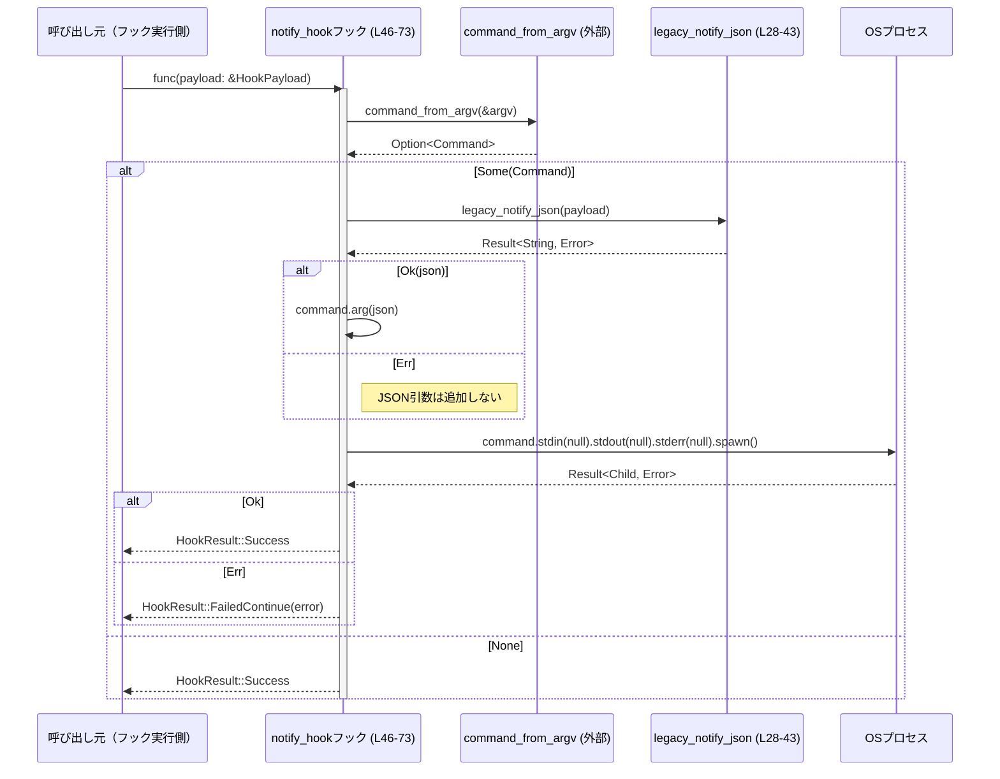

# hooks/src/legacy_notify.rs コード解説

---

## 0. ざっくり一言

`legacy_notify.rs` は、エージェント実行完了時の情報を JSON にシリアライズし、外部プロセスに **最後のコマンドライン引数として渡す「レガシー通知フック」** を定義するモジュールです（根拠: `hooks/src/legacy_notify.rs:L12-26,L28-43,L46-73`）。

---

## 1. このモジュールの役割

### 1.1 概要

- エージェントの「1ターン完了」イベントを、既存ツール群が期待している JSON 形式に変換します（根拠: `UserNotification::AgentTurnComplete` 定義とテスト `expected_notification_json`。`hooks/src/legacy_notify.rs:L15-25,L87-97`）。
- その JSON を、外部コマンドの **最後の argv** として付加し、標準入出力を捨てた状態で非同期にプロセスを spawn するフック `notify_hook` を提供します（根拠: `notify_hook` 実装。`hooks/src/legacy_notify.rs:L46-73`）。

### 1.2 アーキテクチャ内での位置づけ

このモジュール内の主要コンポーネントと外部依存の関係を、簡略図で示します。

```mermaid
graph TD
  subgraph hooks/src/legacy_notify.rs
    A[UserNotification<br/>(L15-25)]
    B[legacy_notify_json<br/>(L28-43)]
    C[notify_hook<br/>(L46-73)]
  end

  D[Hook型<br/>(外部crate)]
  E[HookEvent / HookPayload<br/>(外部crate)]
  F[HookResult<br/>(外部crate)]
  G[command_from_argv<br/>(外部crate)]
  H[serde_json<br/>(外部crate)]
  I[std::process::Command / Stdio<br/>(標準ライブラリ)]
  
  C --> D
  C --> E
  C --> F
  C --> G
  C --> I
  B --> E
  B --> H
  A --> H
```

- `notify_hook` が公開フック生成関数であり、`Hook` 型（外部）インスタンスを返します（根拠: `pub fn notify_hook(...) -> Hook`。`hooks/src/legacy_notify.rs:L46-73`）。
- フック内部で `legacy_notify_json` を呼び出し、`UserNotification` を JSON に変換します（根拠: `legacy_notify_json` 呼び出し。`hooks/src/legacy_notify.rs:L57-58`）。
- プロセス実行には `command_from_argv`（外部ユーティリティ）と `std::process::Command` を利用します（根拠: `command_from_argv` と `spawn` の使用。`hooks/src/legacy_notify.rs:L53-54,L66-69`）。

### 1.3 設計上のポイント

- **責務の分割**
  - JSON フォーマットの定義とシリアライズを `UserNotification` + `legacy_notify_json` に分離（根拠: `UserNotification` と `legacy_notify_json` の構成。`hooks/src/legacy_notify.rs:L15-25,L28-43`）。
  - プロセス起動や非同期フックとしてのラッピングは `notify_hook` が担当（根拠: `notify_hook` 実装。`hooks/src/legacy_notify.rs:L46-73`）。

- **状態管理**
  - フック生成時の `argv: Vec<String>` を `Arc<Vec<String>>` に包み、フック呼び出しごとにクローンして共有可能にしています。これにより、ライフタイム `'static` な非同期クロージャ内でも安全に使用できます（根拠: `Arc::new`, `Arc::clone`, `async move`。`hooks/src/legacy_notify.rs:L47,L51-52`）。

- **エラーハンドリング方針**
  - JSON 生成に失敗した場合は **通知引数を付けずに処理を継続** します（根拠: `if let Ok(notify_payload) = legacy_notify_json(...) { ... }`。`hooks/src/legacy_notify.rs:L57-59`）。
  - プロセス起動 `spawn()` の失敗は `HookResult::FailedContinue` で呼び出し側に伝えます（根拠: `match command.spawn() { ... }`。`hooks/src/legacy_notify.rs:L66-69`）。
  - `legacy_notify_json` 自体は `HookEvent::AfterAgent` 以外を受け取ると `Err(serde_json::Error)` を返す設計です（根拠: `HookEvent::AfterToolUse` アーム。`hooks/src/legacy_notify.rs:L40-42`）。

- **並行性**
  - フック処理本体は `async move` な Future として実装されており、呼び出し側の非同期ランタイム上で実行される前提です（根拠: `Box::pin(async move { ... })`。`hooks/src/legacy_notify.rs:L52-70`）。
  - `Command::spawn()` 呼び出し後に子プロセスを待機していないため、通知プロセスは **非同期に実行される fire-and-forget 型** になります（根拠: `spawn()` から返る Child を使用していない。`hooks/src/legacy_notify.rs:L66-68`）。

---

## 2. 主要な機能一覧

- レガシー通知 JSON 生成: `HookPayload` から歴史的なワイヤフォーマットに準拠した JSON 文字列を生成する（根拠: `legacy_notify_json` とテスト。`hooks/src/legacy_notify.rs:L28-43,L117-143`）。
- レガシー通知フック生成: 任意の `argv` を基に外部コマンドを構築し、必要に応じて通知 JSON を argv の末尾に追加して非同期に実行する `Hook` を生成する（根拠: `notify_hook`。`hooks/src/legacy_notify.rs:L46-73`）。

---

## 3. 公開 API と詳細解説（コンポーネントインベントリー含む）

このセクションでは、本ファイル内の型と関数の一覧（コンポーネントインベントリー）と、公開 API の詳細を示します。

### 3.1 型一覧（構造体・列挙体など）

| 名前 | 種別 | 公開範囲 | 役割 / 用途 | 定義位置 |
|------|------|----------|-------------|-----------|
| `UserNotification` | 列挙体（enum） | モジュール内非公開 | レガシー通知の JSON 形状を表す内部表現。現在は `AgentTurnComplete` バリアントのみを持ち、エージェントターン完了時の情報一式を保持する | `hooks/src/legacy_notify.rs:L15-25` |

`UserNotification::AgentTurnComplete` のフィールド:

- `thread_id: String` — スレッド ID（UUID 文字列）を表します（根拠: テストでの値。`hooks/src/legacy_notify.rs:L18,L90`）。
- `turn_id: String` — ターン ID を表します（根拠: `hooks/src/legacy_notify.rs:L19,L91`）。
- `cwd: String` — 実行時のカレントディレクトリのパス文字列（根拠: `hooks/src/legacy_notify.rs:L20,L92`）。
- `client: Option<String>` — クライアント識別子。`None` の場合はシリアライズ時にフィールド自体が省略されます（`skip_serializing_if = "Option::is_none"`、根拠: `hooks/src/legacy_notify.rs:L21-22`）。
- `input_messages: Vec<String>` — ユーザーからの入力メッセージ群（根拠: `hooks/src/legacy_notify.rs:L23,L94`）。
- `last_assistant_message: Option<String>` — 直近のアシスタントメッセージ。`None` の場合は JSON では `"last-assistant-message": null` になります（`Option<T>` フィールドのデフォルト動作、根拠: `hooks/src/legacy_notify.rs:L24` と serde の仕様）。

シリアライズ関連の属性:

- `#[serde(tag = "type", rename_all = "kebab-case")]` により、  
  - JSON には `type` フィールドが追加され、バリアント名が `kebab-case` で格納されます（ここでは `"agent-turn-complete"`）。  
  - フィールド名も `kebab-case` に変換されます（例: `thread_id` → `"thread-id"`）。  
  （根拠: 属性とテスト期待値。`hooks/src/legacy_notify.rs:L13-14,L87-96`）
- バリアント側の `#[serde(rename_all = "kebab-case")]` もフィールド名変換を明示しています（根拠: `hooks/src/legacy_notify.rs:L16`）。

### 3.2 関数詳細（公開 API）

#### `legacy_notify_json(payload: &HookPayload) -> Result<String, serde_json::Error>`

**概要**

`HookPayload` 内の `HookEvent` を元に、レガシーなユーザー通知 JSON 文字列を生成します。  
`AfterAgent` イベントのみをサポートし、それ以外のイベントでは `Err` を返します（根拠: `match &payload.hook_event` の分岐。`hooks/src/legacy_notify.rs:L28-43`）。

**引数**

| 引数名 | 型 | 説明 |
|--------|----|------|
| `payload` | `&HookPayload` | フック呼び出し時のコンテキスト。`cwd`, `client`, `hook_event` などを含む（定義は別モジュール。ここでは使用箇所のみから読み取れる範囲）。`hooks/src/legacy_notify.rs:L28-37` |

**戻り値**

- `Ok(String)` — レガシー通知 JSON 文字列。  
  テスト `expected_notification_json` に示されるフォーマットに準拠します（根拠: `hooks/src/legacy_notify.rs:L87-97,L117-143`）。
- `Err(serde_json::Error)` —  
  - イベント種別が `HookEvent::AfterAgent` 以外の場合（現在は `AfterToolUse` 分岐）  
  - または `serde_json::to_string` が何らかの理由で失敗した場合  
  に返されます（根拠: `hooks/src/legacy_notify.rs:L31-38,L40-42`）。

**内部処理の流れ**

1. `payload.hook_event` を参照し、`HookEvent::AfterAgent { event }` か `HookEvent::AfterToolUse { .. }` かを分岐します（根拠: `match &payload.hook_event`。`hooks/src/legacy_notify.rs:L28-31,L40`）。
2. `AfterAgent` の場合:
   - `UserNotification::AgentTurnComplete` を組み立てます。
     - `thread_id`: `event.thread_id.to_string()`（外部型 `ThreadId` から文字列へ）。  
     - `turn_id`: `event.turn_id.clone()`。  
     - `cwd`: `payload.cwd.display().to_string()`（パス → 表示用文字列）。  
     - `client`: `payload.client.clone()`（`Option<String>`）。  
     - `input_messages`: `event.input_messages.clone()`。  
     - `last_assistant_message`: `event.last_assistant_message.clone()`。  
     （根拠: `hooks/src/legacy_notify.rs:L31-37`）
   - それを `serde_json::to_string` で JSON 文字列にシリアライズします（根拠: `hooks/src/legacy_notify.rs:L31,L38`）。
3. `AfterToolUse` の場合:
   - `serde_json::Error::io(std::io::Error::other("..."))` を生成して `Err` として返します（根拠: `hooks/src/legacy_notify.rs:L40-42`）。

**Examples（使用例）**

テストコードに近い形での使用例です（`HookPayload` / `HookEventAfterAgent` の詳細定義は別モジュールです）。

```rust
use codex_protocol::ThreadId;
use std::path::Path;
use hooks::legacy_notify_json;
use hooks::{HookPayload, HookEvent, HookEventAfterAgent}; // 実際のパス名は crate 構成に依存

fn build_payload() -> HookPayload {
    HookPayload {
        session_id: ThreadId::new(),                         // セッションID
        cwd: Path::new("/Users/example/project").to_path_buf(),
        client: Some("codex-tui".to_string()),
        triggered_at: chrono::Utc::now(),
        hook_event: HookEvent::AfterAgent {
            event: HookEventAfterAgent {
                thread_id: ThreadId::from_string(
                    "b5f6c1c2-1111-2222-3333-444455556666"
                ).expect("valid thread id"),
                turn_id: "12345".to_string(),
                input_messages: vec![
                    "Rename `foo` to `bar` and update the callsites.".to_string(),
                ],
                last_assistant_message: Some(
                    "Rename complete and verified `cargo build` succeeds.".to_string(),
                ),
            },
        },
    }
}

fn main() -> Result<(), Box<dyn std::error::Error>> {
    let payload = build_payload();
    let json = legacy_notify_json(&payload)?;                // 正常なら JSON 文字列を取得
    println!("{json}");
    Ok(())
}
```

この例の JSON 出力は、テスト `expected_notification_json` と同じ構造になります（根拠: テスト実装。`hooks/src/legacy_notify.rs:L87-97,L117-143`）。

**Errors / Panics**

- `Err(serde_json::Error)` になるケース:
  - `payload.hook_event` が `HookEvent::AfterToolUse { .. }` の場合  
    → `serde_json::Error::io` を用いて明示的にエラーを生成（メッセージ: `"legacy notify payload is only supported for after_agent"`）。  
    （根拠: `hooks/src/legacy_notify.rs:L40-42`）
  - シリアライズ対象の `UserNotification` を `serde_json::to_string` する際に失敗した場合（例えば極端に大きなデータや、serde 実装由来のエラーなど）。コード上ではこの可能性をそのまま `Result` で返しています（根拠: `hooks/src/legacy_notify.rs:L31-38`）。
- この関数内には `panic!` を直接呼び出すコードはありません（根拠: `hooks/src/legacy_notify.rs:L28-43`）。

**Edge cases（エッジケース）**

- `hook_event` が `AfterToolUse` の場合:
  - `Err` が返るため、呼び出し側で適切にハンドリングする必要があります（根拠: `hooks/src/legacy_notify.rs:L40-42`）。
- `client: None` の場合:
  - JSON から `"client"` フィールド自体が省略されます（`skip_serializing_if` 属性、根拠: `hooks/src/legacy_notify.rs:L21-22`）。
- `last_assistant_message: None` の場合:
  - `"last-assistant-message": null` としてシリアライズされます（`Option<T>` フィールドの標準挙動と、明示的な `skip_serializing_if` がないことから。根拠: `hooks/src/legacy_notify.rs:L24`）。
- `input_messages` が空ベクタの場合:
  - `"input-messages": []` としてシリアライズされます（serde の標準挙動）。

**使用上の注意点**

- この関数は **`HookEvent::AfterAgent` 専用** です。他のイベント種別に対してレガシー通知 JSON を生成したい場合は、呼び出し前に `hook_event` を確認するか、別の関数を用意する必要があります（根拠: `AfterToolUse` で必ず `Err`。`hooks/src/legacy_notify.rs:L40-42`）。
- 返される JSON のフィールド名・構造はテストで固定化されており、既存クライアントとの互換性を保つ必要があります。変更する場合は `expected_notification_json` とクライアント実装の両方を確認する必要があります（根拠: テストコード。`hooks/src/legacy_notify.rs:L87-97,L117-143`）。

---

#### `notify_hook(argv: Vec<String>) -> Hook`

**概要**

任意のコマンドライン引数ベクタ `argv` から `Hook` を構築するファクトリ関数です。  
生成されたフックは、呼び出し時に `command_from_argv` で外部コマンドを組み立て、必要なら `legacy_notify_json` が生成した通知 JSON を追加引数として付けた上で、子プロセスを非同期に `spawn()` します（根拠: `hooks/src/legacy_notify.rs:L46-73`）。

**引数**

| 引数名 | 型 | 説明 |
|--------|----|------|
| `argv` | `Vec<String>` | ベースとなるコマンドライン引数リスト。最初の要素が実行ファイル、それ以降が引数であることが想定されます（具体的な解釈は `command_from_argv` に委ねられています）。`hooks/src/legacy_notify.rs:L46-47,L53` |

**戻り値**

- `Hook` — フックシステム（外部）で使用されるフック定義。  
  - `name` フィールドは `"legacy_notify"` で固定です（根拠: `hooks/src/legacy_notify.rs:L48-50`）。
  - `func` フィールドには、`HookPayload` を受け取り `HookResult` を返す非同期処理が格納されます（根拠: 非同期クロージャの実装。`hooks/src/legacy_notify.rs:L50-71`）。

**内部処理の流れ（フック呼び出し時）**

以下は、返された `Hook` の `func` が実行される際の流れです。



根拠: `command_from_argv` の呼び出し・`Option` の分岐・`legacy_notify_json` 呼び出し・`Stdio::null()` 設定・`spawn` 結果に応じた `HookResult` の生成（`hooks/src/legacy_notify.rs:L53-69`）。

**Examples（使用例）**

```rust
use hooks::notify_hook;
use hooks::{HookPayload, HookEvent}; // 実際のパスは crate 構成による

#[tokio::main] // 例: tokio ランタイム上でフックを実行する場合
async fn main() {
    // ベースとなるコマンド: "legacy-notifier" を起動
    let hook = notify_hook(vec!["legacy-notifier".to_string()]);

    // 何らかの場所で HookPayload が構築される（詳細は別モジュール）
    let payload: HookPayload = build_payload_somewhere();

    // Hook の func を実行（実際にはフックフレームワーク側が呼び出す想定）
    let result = (hook.func)(&payload).await;

    // HookResult の扱いはフックフレームワークの設計に依存
    println!("hook result: {:?}", result);
}
```

※ `build_payload_somewhere` や `Hook` 型の実際の定義は、このファイルには現れません（根拠: `use crate::Hook;` のみで定義は別ファイル。`hooks/src/legacy_notify.rs:L6`）。

**Errors / Panics**

- フック呼び出し時のエラーパス:
  - `command_from_argv(&argv)` が `None` を返す場合  
    → 何もせず `HookResult::Success` を返します（エラーにはなりません）。  
    （根拠: `match command_from_argv { Some(command) => ..., None => return HookResult::Success }`。`hooks/src/legacy_notify.rs:L53-56`）
  - `legacy_notify_json(payload)` が `Err` の場合  
    → JSON 引数を追加しないだけで、そのままコマンドを実行します。エラーは上位に伝播されません。  
    （根拠: `if let Ok(notify_payload) = legacy_notify_json(payload)`。`hooks/src/legacy_notify.rs:L57-59`）
  - `command.spawn()` が `Err(err)` を返す場合  
    → `HookResult::FailedContinue(err.into())` として呼び出し側に返します（根拠: `hooks/src/legacy_notify.rs:L66-69`）。
- この関数／フック内には明示的な `panic!` 呼び出しはありません（根拠: `hooks/src/legacy_notify.rs:L46-73`）。

**Edge cases（エッジケース）**

- `argv` が空、または無効で `command_from_argv` が `None` を返す場合:
  - フックは何も実行せずに成功 (`HookResult::Success`) を返します（根拠: `hooks/src/legacy_notify.rs:L53-56`）。
- `HookPayload.hook_event` が `AfterToolUse` など `legacy_notify_json` がサポートしないイベントの場合:
  - 通知引数が追加されないだけで、コマンド自体はそのまま実行されます（根拠: `legacy_notify_json` のエラーを無視。`hooks/src/legacy_notify.rs:L40-42,L57-59`）。
- 子プロセスがすぐに終了／クラッシュしたとしても:
  - このコードは `spawn()` の成否だけを見ており、子プロセスの終了コードや実際の成否は観測していません（根拠: `Child` を保持していない。`hooks/src/legacy_notify.rs:L66-69`）。

**使用上の注意点**

- フックは **fire-and-forget** 型であり、通知プロセスの結果を待機しません。そのため、通知処理の成否に依存したロジック（例: 通知が成功したらのみ次の処理に進む）は、このフック単体では実現できません（根拠: `spawn()` 後に `await` などを行っていない。`hooks/src/legacy_notify.rs:L66-69`）。
- 標準入出力・標準エラーをすべて `Stdio::null()` にリダイレクトしているため、通知プロセスが出力するログは失われます。デバッグや監視が必要な場合、ここを変更する必要があります（根拠: `.stdin(Stdio::null()).stdout(Stdio::null()).stderr(Stdio::null())`。`hooks/src/legacy_notify.rs:L61-64`）。
- JSON 引数は `Command::arg` によって **1つの argv 要素** として渡されるため、スペースや特殊文字はシェルで解釈されず、安全に渡される前提です（`command` が `std::process::Command` であることから。根拠: `command.spawn()` の使用。`hooks/src/legacy_notify.rs:L53-54,L66-69`）。
- `argv` の解釈ロジックは `command_from_argv` に依存しており、ここでは詳細が分かりません。この関数の仕様変更は、`notify_hook` の挙動に直接影響します（根拠: `use crate::command_from_argv;` と呼び出しのみで定義なし。`hooks/src/legacy_notify.rs:L10,L53`）。

### 3.3 その他の関数（テスト用／補助）

| 関数名 | 役割（1 行） | 定義位置 |
|--------|--------------|----------|
| `expected_notification_json() -> Value` | レガシー通知 JSON の期待形状（`serde_json::Value`）を組み立てるテスト用ヘルパー | `hooks/src/legacy_notify.rs:L87-97` |
| `test_user_notification()` | `UserNotification::AgentTurnComplete` を直接シリアライズし、期待 JSON と一致することを検証する単体テスト | `hooks/src/legacy_notify.rs:L99-115` |
| `legacy_notify_json_matches_historical_wire_shape()` | `HookPayload` から `legacy_notify_json` を通じて生成された JSON が期待形状と一致することを検証する単体テスト | `hooks/src/legacy_notify.rs:L117-143` |

---

## 4. データフロー

ここでは、典型的なシナリオ「エージェント実行後にレガシー通知フックが呼ばれる」場合のデータフローを示します。

1. 外部のフックフレームワークが `notify_hook(argv)` を呼び、`Hook` を登録します（根拠: `hooks/src/legacy_notify.rs:L46-50`）。
2. エージェント実行完了時に、フレームワークが `HookPayload`（`hook_event` が `AfterAgent`）を渡して `Hook.func` を呼び出します（根拠: `HookPayload` と `HookEvent::AfterAgent` の使用。`hooks/src/legacy_notify.rs:L28-37,L119-137`）。
3. フック関数内で `command_from_argv(&argv)` により `Command` が構築されます（根拠: `hooks/src/legacy_notify.rs:L53-54`）。
4. 続いて `legacy_notify_json(payload)` により、`UserNotification::AgentTurnComplete` が JSON 文字列にシリアライズされます（根拠: `hooks/src/legacy_notify.rs:L57-58,L31-38`）。
5. JSON 生成が成功した場合、その文字列が `command.arg(...)` によって **最後の引数** として追加されます（根拠: `hooks/src/legacy_notify.rs:L57-59`）。
6. `stdin`, `stdout`, `stderr` が `Stdio::null()` に設定された後、`command.spawn()` により子プロセスが起動されます（根拠: `hooks/src/legacy_notify.rs:L61-64,L66-67`）。
7. フックは `spawn()` の成功／失敗に基づいて `HookResult` を返し、終了します（根拠: `hooks/src/legacy_notify.rs:L66-69`）。

---

## 5. 使い方（How to Use）

### 5.1 基本的な使用方法

フレームワーク側での典型的な利用イメージです（フレームワークの実装はこのファイルには含まれません）。

```rust
use hooks::notify_hook;
use hooks::{HookRegistry, HookPayload}; // 仮の型名。実際は crate 構成に依存

fn register_hooks(registry: &mut HookRegistry) {
    // レガシー通知用コマンド: "legacy-notifier" を呼び出す想定
    let hook = notify_hook(vec!["legacy-notifier".into()]);
    registry.register(hook);                            // フックを登録
}

// どこかでエージェント実行後に
async fn after_agent(payload: HookPayload, registry: &HookRegistry) {
    registry.run_hooks(&payload).await;                // 登録済みフックの func が呼ばれる
}
```

このとき、`legacy-notifier` プロセスには、最後の引数として通知 JSON が渡されます（`AfterAgent` イベントの場合）。

### 5.2 よくある使用パターン

1. **特定クライアント専用の通知コマンド**

```rust
// "codex-tui" 向け通知コマンドを登録する例
let hook = notify_hook(vec![
    "codex-tui-notifier".into(),
    "--mode".into(),
    "legacy".into(),
]);
// HookPayload.client に "codex-tui" がセットされていれば、JSONにも "client": "codex-tui" が含まれる
```

1. **JSON だけを変更したくない場合**

- レガシーなワイヤフォーマットを維持する必要があるときは、  
  `UserNotification` と `expected_notification_json` の両方を変更しないようにし、  
  ロジック側 (`command_from_argv` や通知コマンド本体) 側で分岐を行います  
  （根拠: テストが JSON 形状を固定化している。`hooks/src/legacy_notify.rs:L87-97,L117-143`）。

### 5.3 よくある間違い

```rust
// 間違い例: AfterToolUse イベントにもレガシー通知を期待している
fn on_after_tool_use(payload: &HookPayload, hook: &Hook) {
    // hook.func(payload) を呼んでも、legacy_notify_json は Err を返し、
    // JSON 引数は追加されない（HookResult は Success か FailedContinue）
}

// 正しい理解: AfterAgent 専用
fn on_after_agent(payload: &HookPayload, hook: &Hook) {
    // payload.hook_event が AfterAgent の場合のみ、
    // legacy_notify_json が Ok になり、JSON 引数が追加される
}
```

根拠: `HookEvent::AfterToolUse` では `legacy_notify_json` が `Err` を返し、呼び出し側の `notify_hook` はそのエラーを握りつぶしているため（`hooks/src/legacy_notify.rs:L40-42,L57-59`）。

### 5.4 使用上の注意点（まとめ）

- **イベント種別の前提**
  - レガシー通知 JSON は `AfterAgent` イベントのみに意味を持ちます。他のイベントで JSON を期待する設計は、この実装とは一致しません（根拠: `hooks/src/legacy_notify.rs:L28-31,L40-42`）。

- **通知結果の観測不可**
  - 子プロセスの終了コードや標準出力が一切観測されないため、「通知失敗を検知してリトライする」などの要件はこのモジュール単体では満たせません（根拠: `Child` ハンドル未使用と `Stdio::null()`。`hooks/src/legacy_notify.rs:L61-64,L66-69`）。

- **エラーの握りつぶし**
  - JSON 生成エラー (`legacy_notify_json` の `Err`) はログにも `HookResult` にも現れません。通知 JSON の内容が不正な場合でも、フック全体は成功扱いになる可能性があります（根拠: `if let Ok(...)` パターン。`hooks/src/legacy_notify.rs:L57-59`）。

- **セキュリティ観点**
  - JSON は `Command::arg` によって 1 引数として渡されるため、シェル経由でのコマンドインジェクションリスクは低い設計です。ただし、通知先プログラム側で JSON をどのように解釈するかは別途検討が必要です（根拠: `command` が `std::process::Command` であることと `spawn()` の使用。`hooks/src/legacy_notify.rs:L53-54,L66-69`）。

- **並行実行**
  - フック本体は `async` であり、複数のフック呼び出しが並行して走る環境でも、共有しているのは `Arc<Vec<String>>` のみであり、`argv` は不変データなのでデータ競合は発生しません（根拠: `Arc::new(argv)` と `Arc::clone(&argv)` のみで書き換えがない。`hooks/src/legacy_notify.rs:L47,L51`）。

---

## 6. 変更の仕方（How to Modify）

### 6.1 新しい機能を追加する場合

- **通知内容を増やしたい場合**
  1. `UserNotification::AgentTurnComplete` に新しいフィールドを追加する（例: `duration_ms` など）（根拠: enum 定義。`hooks/src/legacy_notify.rs:L17-25`）。
  2. `legacy_notify_json` 内で、そのフィールドに対応する値を `HookPayload` や `HookEventAfterAgent` から設定する（根拠: フィールド組み立てロジック。`hooks/src/legacy_notify.rs:L31-37`）。
  3. テスト `expected_notification_json` と `test_user_notification`／`legacy_notify_json_matches_historical_wire_shape` を更新し、新フィールドの JSON 形状を検証する（根拠: 現在のテスト構造。`hooks/src/legacy_notify.rs:L87-97,L99-115,L117-143`）。

- **別種のイベントにもレガシー通知をしたい場合**
  1. `HookEvent` における新しいバリアント（または既存バリアント）に対応する `UserNotification` の新バリアントを追加する。
  2. `legacy_notify_json` の `match` にそのバリアント用のアームを追加し、新しい JSON 形状を定義する（根拠: 現在の 2 分岐構造。`hooks/src/legacy_notify.rs:L28-43`）。
  3. 追加バリアント用のテストを作成し、期待される JSON との一致を検証する。

### 6.2 既存の機能を変更する場合

- **JSON 形状を変更する際の注意点**
  - 既存クライアントとの互換性を損なう可能性があるため、テスト `expected_notification_json` とクライアント側の実装を必ず確認する必要があります（根拠: テストがワイヤフォーマットを固定化している。`hooks/src/legacy_notify.rs:L87-97,L117-143`）。

- **エラーハンドリングの変更**
  - `legacy_notify_json` の `Err` を無視せずログ出力や `HookResult` への反映を行いたい場合は、`notify_hook` 内の

    ```rust
    if let Ok(notify_payload) = legacy_notify_json(payload) { ... }
    ```

    部分を変更する必要があります（根拠: `hooks/src/legacy_notify.rs:L57-59`）。
  - 変更時は、フックフレームワーク全体で `HookResult::FailedContinue` などの扱いがどうなっているかを確認する必要があります（`HookResult` の定義はこのファイルにはありません。`hooks/src/legacy_notify.rs:L9`）。

- **入出力の扱い**
  - 子プロセスの標準出力／標準エラーをログに残したい場合は、`Stdio::null()` の部分を `Stdio::inherit()` や `Stdio::piped()` などに変更し、それに応じた読み出し処理を追加する必要があります（根拠: `hooks/src/legacy_notify.rs:L61-64`）。

---

## 7. 関連ファイル

このモジュールと密接に関係する型・機能は、このファイルには定義されておらず、他のファイルに存在します（コード内の `use` から分かる範囲）。

| パス / シンボル | 役割 / 関係 |
|----------------|------------|
| `crate::Hook` | フックのメタ情報と実行関数を表す型。`notify_hook` の戻り値として使用されます（根拠: `hooks/src/legacy_notify.rs:L6,L46`）。 |
| `crate::HookEvent` | フック呼び出し時のイベント種別。`AfterAgent` / `AfterToolUse` などのバリアントを持ちます（根拠: `hooks/src/legacy_notify.rs:L7,L28-31,L40`）。 |
| `crate::HookPayload` | フック呼び出し時のコンテキスト (cwd, client, hook_event 等) をまとめた構造体（根拠: フィールド使用箇所。`hooks/src/legacy_notify.rs:L8,L28-37,L119-137`）。 |
| `crate::HookResult` | フック実行結果を表す型。`Success` / `FailedContinue` などのバリアントを持つと推測されますが、詳細はこのファイルからは分かりません（根拠: 使用箇所。`hooks/src/legacy_notify.rs:L9,L55-56,L66-69`）。 |
| `crate::command_from_argv` | `Vec<String>` から `std::process::Command` を生成するユーティリティ。`notify_hook` 内で使用されています（根拠: `hooks/src/legacy_notify.rs:L10,L53-54`）。 |
| `crate::HookEventAfterAgent` | `HookEvent::AfterAgent` のペイロードを表す型。テストで使用されています（根拠: `hooks/src/legacy_notify.rs:L85,L124-135`）。 |

テスト関連:

| パス / シンボル | 役割 / 関係 |
|----------------|------------|
| `codex_protocol::ThreadId` | スレッド ID 型。`thread_id` の生成・文字列化に使用されています（根拠: `hooks/src/legacy_notify.rs:L78,L119-127`）。 |
| `chrono::Utc` | テスト用のタイムスタンプ生成に使用されています（根拠: `hooks/src/legacy_notify.rs:L123`）。 |
| `pretty_assertions::assert_eq` | テストにおける JSON 比較用アサーションマクロ（根拠: `hooks/src/legacy_notify.rs:L79,L113,L141`）。 |

以上が、`hooks/src/legacy_notify.rs` の公開 API・コアロジック・関連コンポーネント・データフローの整理です。
