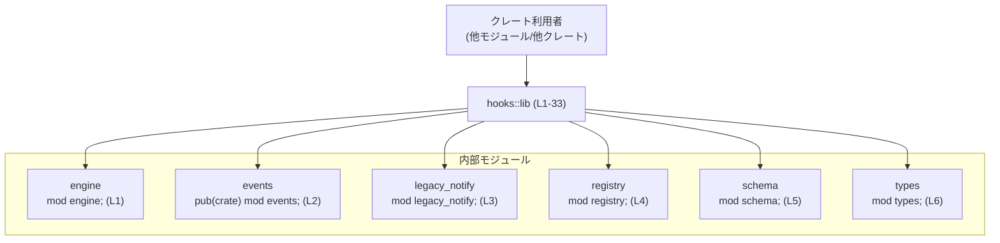

# hooks/src/lib.rs

## 0. ざっくり一言

`hooks` クレート全体の「表玄関」として、内部モジュールで定義されたフック関連の型・関数を再エクスポートするファイルです（hooks/src/lib.rs:L1-L33）。

---

## 1. このモジュールの役割

### 1.1 概要

- このファイルは、フック（Hook）機構に関する各種モジュールを `mod` 宣言で束ね（engine, events, legacy_notify, registry, schema, types）、その中の型や関数を外部に公開するための再エクスポートを行います（hooks/src/lib.rs:L1-L6, L7-L33）。
- ビジネスロジックや処理フローはほぼ含まず、公開 API の整形と名前空間の整理が主な役割です。

### 1.2 アーキテクチャ内での位置づけ

このファイルはクレートのルートとして、内部モジュールをまとめ、その一部を外部に見せる「ファサード（窓口）」になっています。



- 利用者は基本的に `hooks` ルートから `Hook`, `Hooks`, `HookEvent*` などをインポートすれば済み、`events` や `types` といった内部モジュールを直接意識する必要はない構造になっています（hooks/src/lib.rs:L7-L33）。
- `events` モジュールは `pub(crate)` で宣言されており（hooks/src/lib.rs:L2）、クレート外から直接は見えませんが、そこにある型は `pub use` により外部公開されています（例: hooks/src/lib.rs:L7-L17）。

### 1.3 設計上のポイント

コードから読み取れる範囲での特徴は次のとおりです。

- **ファサード設計**  
  - ルートモジュールで多数の `pub use` を行い、内部のモジュール構成を隠しつつ、まとまった API を提供しています（hooks/src/lib.rs:L7-L33）。
- **可視性の制御**  
  - `events` モジュール自体は `pub(crate)` でクレート内部専用ですが、その内部の型を `lib.rs` から `pub use` することで外部公開しています（hooks/src/lib.rs:L2, L7-L17）。
- **役割ごとのモジュール分割**（名前からの推測であり、詳細はこのチャンクからは不明）
  - `engine`: フック実行エンジンに関する処理がまとまっている可能性が高い（hooks/src/lib.rs:L1）。
  - `registry`: フックの登録や設定を扱うモジュールであることが名称から推測されます（hooks/src/lib.rs:L4）。
  - `legacy_notify`: レガシーな通知インターフェースを扱うモジュールと想定されます（hooks/src/lib.rs:L3）。

---

## 2. 主要な機能一覧（コンポーネントインベントリー）

このファイルが外部に公開している主なコンポーネントを列挙します。種別は Rust の命名規則（CamelCase = 型、snake_case = 関数/値）に基づく推測であり、厳密な定義はこのチャンクには現れません。

### 2.1 モジュール一覧

| モジュール | 可視性 | 役割 / 用途（名前からの推測を含む） | 根拠 |
|-----------|--------|---------------------------------------|------|
| `engine` | クレート内 | フック実行ロジックやランタイムをまとめる内部モジュールの可能性 | hooks/src/lib.rs:L1 |
| `events` | クレート内（`pub(crate)`） | 各種フックイベント（pre/post tool use, session start 等）を型として定義するモジュールの可能性 | hooks/src/lib.rs:L2 |
| `legacy_notify` | クレート内 | 旧式の通知/フック呼び出しインターフェースを保持するモジュールの可能性 | hooks/src/lib.rs:L3 |
| `registry` | クレート内 | フックの登録、設定、コマンドライン連携等を扱うモジュールの可能性 | hooks/src/lib.rs:L4 |
| `schema` | クレート内 | スキーマやそのフィクスチャ（テスト用データ）生成を扱うモジュールの可能性 | hooks/src/lib.rs:L5 |
| `types` | クレート内 | 共通のフック関連型定義を集約したモジュールの可能性 | hooks/src/lib.rs:L6 |

### 2.2 再エクスポートされる主な型・関数一覧

> 「種別」は命名規則からの推定であり、実際に構造体/列挙体/関数のどれかはこのチャンクだけでは断定できません。

| 名前 | 推定種別 | 概要（名前からの推測 + 「詳細不明」明記） | 根拠 |
|------|----------|--------------------------------------------|------|
| `PostToolUseOutcome` | 型（推定） | 「ツール使用後」の結果を表すイベント型の一種と思われるが詳細不明 | hooks/src/lib.rs:L7 |
| `PostToolUseRequest` | 型（推定） | ツール使用後フックへのリクエストペイロード型と思われるが詳細不明 | hooks/src/lib.rs:L8 |
| `PreToolUseOutcome` | 型（推定） | 「ツール使用前」の結果/応答を表す型と思われるが詳細不明 | hooks/src/lib.rs:L9 |
| `PreToolUseRequest` | 型（推定） | ツール使用前フックへのリクエストペイロード型と思われるが詳細不明 | hooks/src/lib.rs:L10 |
| `SessionStartOutcome` | 型（推定） | セッション開始イベントの結果を表す型と思われるが詳細不明 | hooks/src/lib.rs:L11 |
| `SessionStartRequest` | 型（推定） | セッション開始フックへのリクエスト型と思われるが詳細不明 | hooks/src/lib.rs:L12 |
| `SessionStartSource` | 型（推定） | セッション開始の発生源（ユーザー/システム等）を表す列挙体の可能性 | hooks/src/lib.rs:L13 |
| `StopOutcome` | 型（推定） | 「停止」イベントの結果を表す型と思われるが詳細不明 | hooks/src/lib.rs:L14 |
| `StopRequest` | 型（推定） | 停止フックへのリクエスト型と思われるが詳細不明 | hooks/src/lib.rs:L15 |
| `UserPromptSubmitOutcome` | 型（推定） | ユーザープロンプト送信イベントの結果型と思われるが詳細不明 | hooks/src/lib.rs:L16 |
| `UserPromptSubmitRequest` | 型（推定） | ユーザープロンプト送信フックへのリクエスト型と思われるが詳細不明 | hooks/src/lib.rs:L17 |
| `legacy_notify_json` | 関数/値（推定） | レガシーな JSON ベースの通知を行う API と思われるが詳細不明 | hooks/src/lib.rs:L18 |
| `notify_hook` | 関数/値（推定） | 汎用的なフック通知 API と思われるが詳細不明 | hooks/src/lib.rs:L19 |
| `Hooks` | 型（推定） | フック全体を管理するエントリポイント（サービス/マネージャ）型の可能性 | hooks/src/lib.rs:L20 |
| `HooksConfig` | 型（推定） | フック機構全体の設定情報を保持する型と思われるが詳細不明 | hooks/src/lib.rs:L21 |
| `command_from_argv` | 関数/値（推定） | コマンドライン引数（argv）から何らかの「コマンド」オブジェクトを生成する関数と思われるが詳細不明 | hooks/src/lib.rs:L22 |
| `write_schema_fixtures` | 関数/値（推定） | スキーマ関連のフィクスチャを書き出すユーティリティ関数と思われるが詳細不明 | hooks/src/lib.rs:L23 |
| `Hook` | 型（推定） | 単一のフックを表すドメイン型の可能性 | hooks/src/lib.rs:L24 |
| `HookEvent` | 型（推定） | フックによって扱われるイベントの基底/共通表現の可能性 | hooks/src/lib.rs:L25 |
| `HookEventAfterAgent` | 型（推定） | エージェント処理後に発火するイベントの表現の可能性 | hooks/src/lib.rs:L26 |
| `HookEventAfterToolUse` | 型（推定） | ツール使用後に発火するイベントの表現の可能性 | hooks/src/lib.rs:L27 |
| `HookPayload` | 型（推定） | フックに渡されるペイロード（データ）を表す型の可能性 | hooks/src/lib.rs:L28 |
| `HookResponse` | 型（推定） | フックからの応答内容を表す型の可能性 | hooks/src/lib.rs:L29 |
| `HookResult` | 型（推定） | フック実行結果（成功/失敗等）をラップする型の可能性 | hooks/src/lib.rs:L30 |
| `HookToolInput` | 型（推定） | ツールへの入力を表す型の可能性 | hooks/src/lib.rs:L31 |
| `HookToolInputLocalShell` | 型（推定） | ローカルシェル向けのツール入力を表す特殊化型の可能性 | hooks/src/lib.rs:L32 |
| `HookToolKind` | 型（推定） | ツールの種類（種別）を表す列挙体の可能性 | hooks/src/lib.rs:L33 |

---

## 3. 公開 API と詳細解説

### 3.1 型一覧（構造体・列挙体など）

上記 2.2 の CamelCase な名前は、Rust の慣例から「型」である可能性が高いですが、このチャンクにはその定義本体が含まれていないため、構造体か列挙体かなどの詳細は不明です。

ここでは、特に中心的と思われる型を抜粋します。

| 名前 | 推定種別 | 役割 / 用途（推測であり厳密な仕様ではない） | 根拠 |
|------|----------|---------------------------------------------|------|
| `Hooks` | 型（推定） | 複数の `Hook` を保持し、登録・実行を行う「フックマネージャ」に相当する中心的な型である可能性 | hooks/src/lib.rs:L20 |
| `HooksConfig` | 型（推定） | `Hooks` の初期化や挙動を制御する設定値をまとめる型である可能性 | hooks/src/lib.rs:L21 |
| `Hook` | 型（推定） | 単一のフック定義（名前、イベント種別、実行方法など）を表す可能性 | hooks/src/lib.rs:L24 |
| `HookEvent` | 型（推定） | フック対象となるイベントの共通インターフェース/基底型の可能性 | hooks/src/lib.rs:L25 |
| `HookPayload` | 型（推定） | 各種イベントのコンテキスト情報や入力データを格納する型の可能性 | hooks/src/lib.rs:L28 |
| `HookResponse` | 型（推定） | フックから返される応答内容（メッセージ、変更要求など）を表す可能性 | hooks/src/lib.rs:L29 |
| `HookResult` | 型（推定） | フックの実行結果（成功/失敗、エラー情報など）を表す可能性 | hooks/src/lib.rs:L30 |

> これらの「役割」は名前と他の再エクスポートとの関係からの推測であり、実際のフィールドやメソッド、エラー挙動などはこのチャンクからは分かりません。

### 3.2 関数詳細

このファイルには関数の**定義本体**は含まれておらず、`legacy_notify_json`, `notify_hook`, `command_from_argv`, `write_schema_fixtures` などはすべて他モジュールからの再エクスポートです（hooks/src/lib.rs:L18-L19, L22-L23）。

そのため、以下では「関数詳細テンプレート」を形式的に適用しますが、シグネチャや内部処理はすべて「不明」となります。

#### `legacy_notify_json(...)` （推定）

**概要**

- `legacy_notify_json` は `legacy_notify` モジュールから再エクスポートされている関数/値です（hooks/src/lib.rs:L18）。
- 名称から、レガシー方式の JSON ベース通知を行う関数であると推測されますが、具体的な仕様・安全性・エラー挙動は不明です。

**引数 / 戻り値**

- 型・個数ともに、このチャンクには記載がなく不明です。

**内部処理の流れ**

- 本チャンクに定義がないため不明です。

**Examples（使用例）**

- シグネチャが不明なため、コンパイル可能な具体例は提示できません。

**Errors / Panics**

- Result 型の戻り値や panic の有無など、エラー挙動は不明です。

**Edge cases（エッジケース）**

- 不明です。

**使用上の注意点**

- このファイルからは、同期/非同期、スレッド安全性、入出力の有無などを判断できません。

#### `notify_hook(...)`（推定）

- 再エクスポート元: `legacy_notify`（hooks/src/lib.rs:L19）
- その他の項目（引数、戻り値、内部処理、エラー挙動など）はすべて不明です。

#### `command_from_argv(...)`（推定）

- 再エクスポート元: `registry`（hooks/src/lib.rs:L22）
- 名前から、「コマンドライン引数（argv）から内部で使用するコマンド表現を組み立てる関数」と推測されますが、具体的な仕様は不明です。

#### `write_schema_fixtures(...)`（推定）

- 再エクスポート元: `schema`（hooks/src/lib.rs:L23）
- 名前から、スキーマ関連のフィクスチャファイルを書き出す関数と推測されますが、詳細不明です。

### 3.3 その他の関数

- このチャンクにおいて、他に関数と推定できる再エクスポートはありません（hooks/src/lib.rs:L1-L33 に関数定義自体が存在しません）。

---

## 4. データフロー

このファイル単体には、実行時処理のロジックが一切含まれていません。そのため、ここでは「データフロー」を次のように**型・関数名解決の流れ**として説明します。

### 4.1 型・関数参照のフロー

```mermaid
sequenceDiagram
    title "型/関数名の解決フロー (hooks/src/lib.rs:L1-33)"

    participant U as "ユーザーコード\n(他モジュール/他クレート)"
    participant L as "hooks::lib\n(L1-33)"
    participant T as "types モジュール"
    participant E as "events モジュール"
    participant R as "registry モジュール"
    participant N as "legacy_notify モジュール"
    participant S as "schema モジュール"

    U->>L: use crate::{Hook, Hooks, HookEvent, ...}
    L-->>T: Hook / HookEvent* / HookPayload 等の実体へ解決\n(pub use types::...; L24-L33)
    L-->>E: PostToolUse* / PreToolUse* / SessionStart* / Stop* / UserPromptSubmit* へ解決\n(pub use events::...; L7-L17)
    U->>L: use crate::{command_from_argv}
    L-->>R: command_from_argv の実体へ解決\n(pub use registry::...; L22)
    U->>L: use crate::{legacy_notify_json, notify_hook}
    L-->>N: legacy_notify_json / notify_hook の実体へ解決\n(pub use legacy_notify::...; L18-L19)
    U->>L: use crate::{write_schema_fixtures}
    L-->>S: write_schema_fixtures の実体へ解決\n(pub use schema::...; L23)
```

- 実行時には、ユーザーコードが呼び出すのは `hooks` クレート（あるいは `crate` ルート）上の関数/型ですが、コンパイル時にそれらは内部モジュールへと解決されます。
- 内部モジュール内でどのような処理や I/O、並行処理が行われるかは、このチャンクからは分かりません。

---

## 5. 使い方（How to Use）

### 5.1 基本的な使用方法

このファイルの役割は再エクスポートなので、「他のモジュールからどのようにインポートするか」が主な利用方法になります。

以下は同一クレート内の別モジュールから利用する想定例です（シグネチャ不明の関数は呼び出さず、インポート例のみ示しています）。

```rust
// 別モジュール（例: src/main.rs や src/runner.rs）側のコード例

// フック関連の中心的な型を crate ルートからインポートする
use crate::{
    Hooks,                 // hooks/src/lib.rs:L20 で再エクスポート
    HooksConfig,           // hooks/src/lib.rs:L21
    Hook,                  // hooks/src/lib.rs:L24
    HookEvent,             // hooks/src/lib.rs:L25
    HookResult,            // hooks/src/lib.rs:L30
    // 必要に応じてイベント型やツール入力型もインポート可能
    PostToolUseRequest,    // hooks/src/lib.rs:L8
    PostToolUseOutcome,    // hooks/src/lib.rs:L7
};
```

この例が示すのは、「内部モジュールのパス（`types::Hook` 等）を意識せず、クレートルートから一括して型をインポートできる」という点です。

### 5.2 よくある使用パターン（推測ベース）

このチャンクからコードフローは分かりませんが、名前から想定される典型的なパターンは次のようなものです（あくまで参考レベルです）。

- フック管理:
  - `HooksConfig` を作成し、それに基づいて `Hooks` インスタンスを初期化する。
  - `Hook`/`HookEvent` を使ってフックを登録・実行する。
- CLI 連携:
  - `command_from_argv` を使ってコマンドライン引数からフック関連のコマンドを組み立てる。
- スキーマ/テスト支援:
  - `write_schema_fixtures` を使って、フックイベントのスキーマやテスト用フィクスチャを生成する。

具体的なコードは、シグネチャが不明なため提示できません。

### 5.3 よくある間違い（起こりうる誤用の例）

このファイルから確実にいえる注意点は可視性に関するものです。

```rust
// 誤りになりうる例（クレート外から）
use hooks::events::post_tool_use::PostToolUseRequest;
// ↑ events モジュールは pub(crate) なので、クレート外からは見えない可能性が高い（L2）

// 正しい可能性が高い例
use hooks::PostToolUseRequest;
// ↑ lib.rs から pub use されていれば、クレート外からも直接インポートできる（L8）
```

- **ポイント**: `events` モジュールは `pub(crate)` 宣言なので、クレート外からは非公開ですが、その内部の型は lib.rs から `pub use` されているため、クレート名直下からインポートする必要があります（hooks/src/lib.rs:L2, L7-L17）。

### 5.4 使用上の注意点（まとめ）

- **可視性**  
  - クレート外からは `events` モジュールを直接参照せず、lib.rs 経由の再エクスポートを利用する必要があります。
- **安全性 / エラー / 並行性**  
  - このファイル自体には実行ロジックや I/O、スレッド関連のコードが一切ないため、ここからは安全性やエラー挙動、並行性に関する情報は得られません。
  - 実際の挙動は `engine`, `registry`, `legacy_notify`, `schema`, `types`, `events` 各モジュールの実装に依存します（hooks/src/lib.rs:L1-L6）。

---

## 6. 変更の仕方（How to Modify）

### 6.1 新しい機能を追加する場合

`hooks` クレートに新しいフック機能やイベント型を追加する場合、lib.rs に対しては次のような変更が想定されます。

1. **内部モジュール側に定義を追加する**  
   - 例: `types` モジュールに新しい `HookEvent*` 型を追加する、`events` モジュールに新しいイベント用サブモジュールを追加するなど。  
   - 実際のファイルパスや定義内容はこのチャンクには現れません。

2. **lib.rs に `mod` や `pub use` を追加する**  
   - 新しいモジュールを追加した場合は `mod new_module;` を追加します。
   - 外部公開したい型や関数があれば、ここで `pub use new_module::TypeName;` のように再エクスポートします。

3. **公開範囲の検討**  
   - 内部実装に留めたいものは `mod` / `pub(crate) mod` のままにし、必要最低限の型/関数のみ `pub use` します。

### 6.2 既存の機能を変更する場合

- **影響範囲の確認**
  - ある型や関数を削除/名称変更する場合、その名前を `pub use` している行を必ず確認します（hooks/src/lib.rs:L7-L33）。
  - `pub use` が存在するということは、クレート外からも利用されている可能性があるため、後方互換性への影響が大きくなります。

- **契約（インターフェース）の維持**
  - このファイルでの契約は「特定の名前がクレートルートから見えること」です。
  - 内部実装を変えても、この公開名を維持する限り、外部コードへの影響は最小限にできます。

- **テスト・利用箇所の再確認**
  - 変更対象の型・関数が `pub use` されている場合、クレート外のコード（別リポジトリを含む）でも利用されている可能性があるため、利用箇所の確認が必要になります。

---

## 7. 関連ファイル

このファイルに登場するモジュールと、それらとの関係をまとめます。実際のファイルパス（`engine.rs` なのか `engine/mod.rs` なのか）は、このチャンクだけでは判別できません。

| パス / モジュール | 役割 / 関係 |
|------------------|------------|
| `engine` モジュール | フック実行ロジックやランタイムを含むと推測される内部モジュール。lib.rs から `mod engine;` で宣言されている（hooks/src/lib.rs:L1）。 |
| `events` モジュール | 各種イベント型を定義していると推測される内部モジュール。`pub(crate) mod events;` としてクレート内部に公開され（hooks/src/lib.rs:L2）、その一部が lib.rs から再エクスポートされている（hooks/src/lib.rs:L7-L17）。 |
| `legacy_notify` モジュール | `legacy_notify_json`, `notify_hook` の実体が定義されているモジュール（hooks/src/lib.rs:L3, L18-L19）。 |
| `registry` モジュール | `Hooks`, `HooksConfig`, `command_from_argv` の実体を提供するモジュール（hooks/src/lib.rs:L4, L20-L22）。 |
| `schema` モジュール | `write_schema_fixtures` の実体を提供し、スキーマ/フィクスチャ関連を扱うモジュールの可能性（hooks/src/lib.rs:L5, L23）。 |
| `types` モジュール | `Hook`, `HookEvent*`, `HookPayload`, `HookResponse`, `HookResult`, `HookToolInput*`, `HookToolKind` の実体を定義するモジュール（hooks/src/lib.rs:L6, L24-L33）。 |

---

### このファイル単体での Bugs / Security / Contracts / Edge Cases まとめ

- **Bugs/Security**  
  - このファイルは `mod` 宣言と `pub use` のみで構成されており、実行時ロジックがないため、典型的なロジックバグやセキュリティホールはここからは見当たりません。
- **Contracts（契約）**  
  - 外部から見える名前（再エクスポートされた型・関数名）が、クレートの公開 API として機能することが暗黙の契約です。
- **Edge Cases**  
  - 実行時のエッジケース（空入力、境界値、不正フォーマット等）は、すべて内部モジュールに委ねられており、このファイルからは分かりません。
- **並行性**  
  - `async`, `Send`, `Sync` などの並行性に関する記述は一切なく、このファイルだけからスレッド安全性などの性質を判断することはできません。
