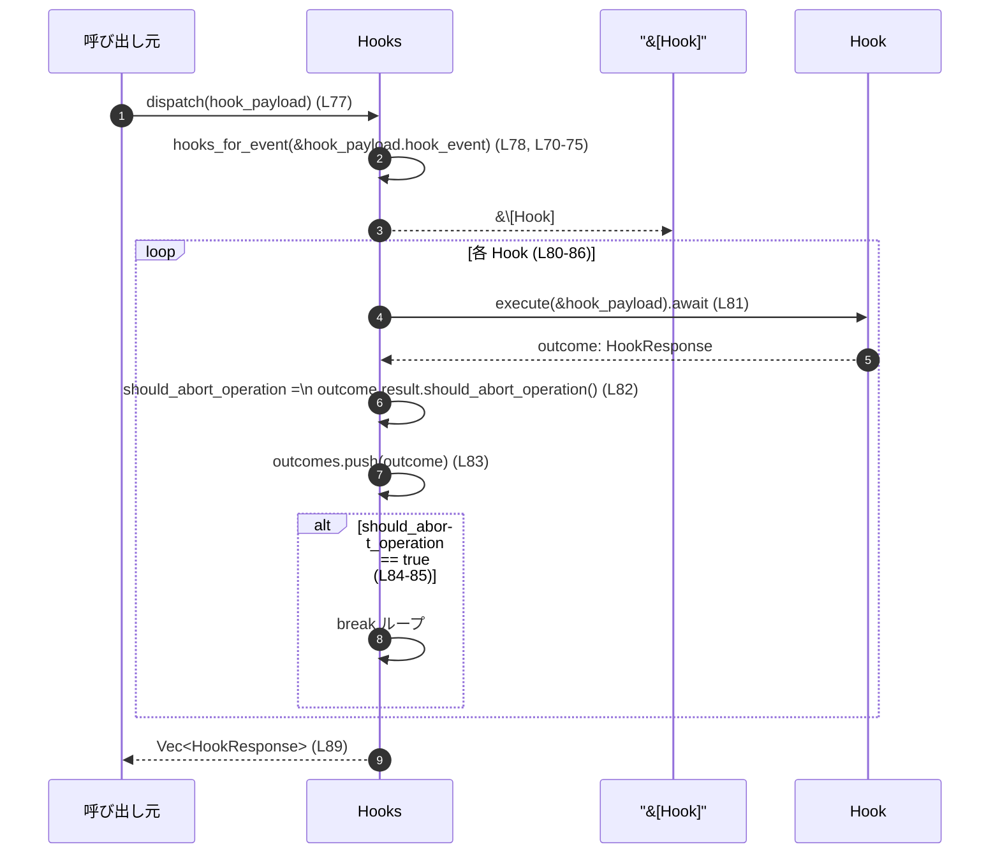
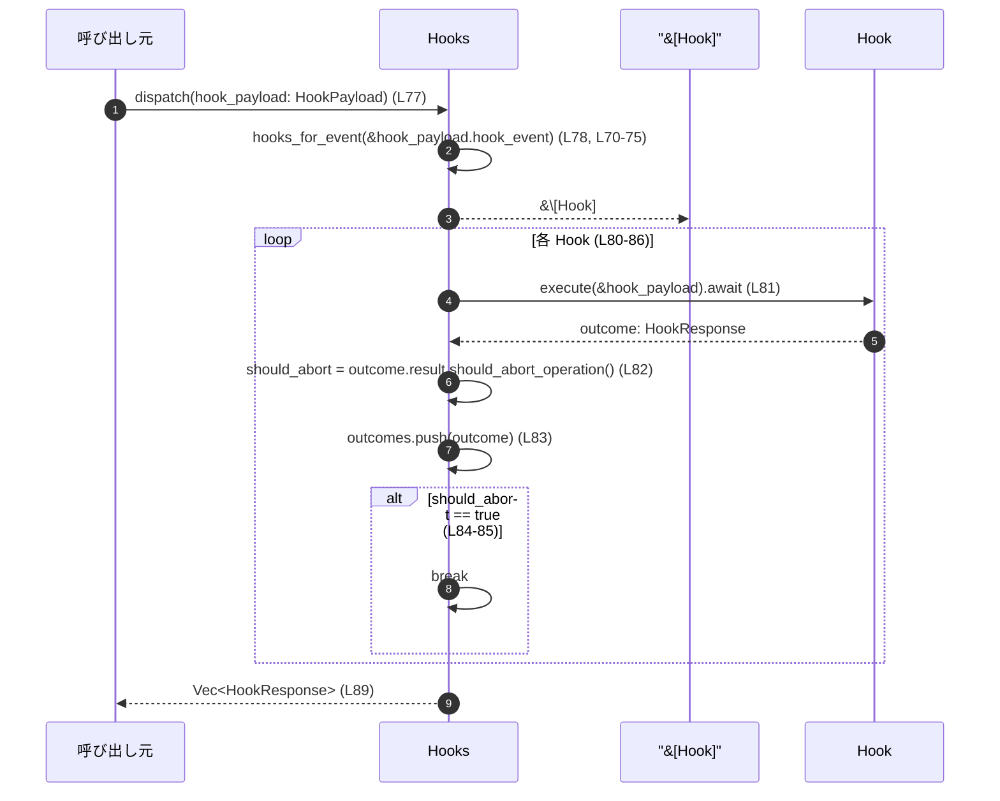

# hooks/src/registry.rs コード解説

## 0. ざっくり一言

`hooks/src/registry.rs` は、フック機構のフロントエンドです。  
設定 (`HooksConfig`) から `Hooks` を構築し、

- 「レガシーなコマンド実行型フック」（`Hook` ベクタ）
- 「ClaudeHooksEngine ベースのフック」（各種 *preview/run* メソッド）

を呼び出すための公開 API をまとめています（`registry.rs:L21-64, L77-152, L155-162`）。

---

## 1. このモジュールの役割

### 1.1 概要

このモジュールは **フックの登録と実行を統合管理するため** に存在し、以下の機能を提供します。

- 設定 (`HooksConfig`) から `Hooks` インスタンスを生成（レガシー通知フックの組み立てとエンジン初期化）  
  （`registry.rs:L21-28, L44-64`）
- 指定イベントに紐づく `Hook` を順次実行する `dispatch`  
  （`registry.rs:L70-75, L77-90`）
- セッション開始／ツール利用前後／ユーザープロンプト送信／停止などのフックを  
  ClaudeHooksEngine に委譲して *preview* / *run* するメソッド群  
  （`registry.rs:L92-152`）
- `argv` から `tokio::process::Command` を構築するユーティリティ  
  （`registry.rs:L155-162`）

### 1.2 アーキテクチャ内での位置づけ

このファイルに現れる依存関係を簡略化すると次のようになります。

```mermaid
graph TD
  subgraph "hooks/src/registry.rs"
    HC["HooksConfig\n(L21-28)"]
    H["Hooks\n(L30-35)"]
    CMD["command_from_argv\n(L155-162)"]
  end

  H -->|保持| Engine["ClaudeHooksEngine\n(crate::engine)"]
  H -->|内部フィールド| HookVecAfterAgent["Vec<Hook> after_agent\n(L32,60)"]
  H -->|内部フィールド| HookVecAfterTool["Vec<Hook> after_tool_use\n(L33,61)"]

  HC -->|ConfigLayerStack| CLS["ConfigLayerStack\n(codex_config)"]
  H -->|利用| CLS

  H -->|イベントAPI| EvStart["SessionStartRequest/Outcome\n(crate::events::session_start)"]
  H -->|イベントAPI| EvPreTool["PreToolUseRequest/Outcome\n(crate::events::pre_tool_use)"]
  H -->|イベントAPI| EvPostTool["PostToolUseRequest/Outcome\n(crate::events::post_tool_use)"]
  H -->|イベントAPI| EvUser["UserPromptSubmitRequest/Outcome\n(crate::events::user_prompt_submit)"]
  H -->|イベントAPI| EvStop["StopRequest/Outcome\n(crate::events::stop)"]

  H -->|dispatchで利用| HTypes["Hook / HookEvent / HookPayload / HookResponse\n(crate::types)"]

  CMD -->|構築| TokioCmd["tokio::process::Command"]

  note right of H
    hooks_for_event (L70-75) で
    HookEvent → Vec<Hook>
    を選択
  end
```

- `Hooks` は上位コードから利用されるファサード的な構造体で、実際のロジックの多くは `ClaudeHooksEngine` と `Hook` 実装側に委譲されています。
- このチャンクには `ClaudeHooksEngine` や `Hook` の実装は現れないため、それらの内部処理の詳細は不明です。

### 1.3 設計上のポイント（コードから読み取れる範囲）

- **責務分割**
  - 設定表現 (`HooksConfig`) と実行ロジック (`Hooks`) を分離しています（`registry.rs:L21-35`）。
  - イベントごとのフック選択は `hooks_for_event` に集約されています（`registry.rs:L70-75`）。
  - Engine ベースのフックは `ClaudeHooksEngine` に委譲し、このモジュールは薄いラッパーです（`registry.rs:L92-152`）。
- **状態管理**
  - `Hooks` は
    - レガシーな `after_agent: Vec<Hook>`（通知フック）
    - `after_tool_use: Vec<Hook>`（将来用と思われるフィールド）
    - `ClaudeHooksEngine` インスタンス  
    をフィールドとして保持する状態付きの構造体です（`registry.rs:L30-35`）。
- **エラーハンドリング方針**
  - このファイル内では `unwrap` / `expect` は使用されておらず、`unwrap_or_default` と `Option` を利用する形で安全に分岐しています（`registry.rs:L45-50, L55-56, L155-162`）。
  - Engine や Hook 実行の失敗は `Outcome` / `HookResponse` 側で扱われる設計になっており、このファイルからは詳細は見えません（`registry.rs:L77-83, L113-152`）。
- **並行性**
  - `dispatch` や `run_*` は `async fn` であり非同期コンテキストでの利用を前提としています（`registry.rs:L77, L113, L121, L125, L136, L150`）。
  - `dispatch` 内のフック実行は `for` ループ＋`await` で **逐次実行** されます。複数フックを並列には実行しません（`registry.rs:L80-82`）。

---

## 2. 主要な機能一覧

このモジュールが提供する主要な機能を機能レベルで列挙します。

- HooksConfig の管理:
  - レガシー通知の `argv`、フック機能フラグ、設定スタック、シェルプログラムなどを保持（`registry.rs:L21-28`）
- Hooks インスタンスの構築:
  - `HooksConfig` から `Hooks::new` でレガシーフックと `ClaudeHooksEngine` を初期化（`registry.rs:L44-64`）
- レガシー Hook のディスパッチ:
  - `HookPayload` に応じて `HookEvent` ごとの `Vec<Hook>` を選択し、順次 `Hook::execute` を実行（`registry.rs:L70-75, L77-90`）
- ClaudeHooksEngine による各イベントの preview/run:
  - `SessionStart`, `PreToolUse`, `PostToolUse`, `UserPromptSubmit`, `Stop` に対する preview/run API をまとめて公開（`registry.rs:L92-152`）
- 起動時警告の取得:
  - Engine が保持する警告メッセージ一覧の参照（`registry.rs:L66-68`）
- `argv` から `tokio::process::Command` の生成:
  - 空チェック付きで `Command` を構築するユーティリティ関数（`registry.rs:L155-162`）

---

## 3. 公開 API と詳細解説

### 3.1 型・関数一覧（コンポーネントインベントリー）

#### 構造体

| 名前 | 種別 | 公開 | 役割 / 用途 | 定義位置 |
|------|------|------|-------------|----------|
| `HooksConfig` | 構造体 | `pub` | フック機構の設定値を保持する。レガシー通知用 `argv`、機能フラグ、設定レイヤースタック、シェルプログラムと引数を含む。 | `registry.rs:L21-28` |
| `Hooks` | 構造体 | `pub` | フック実行のフロントエンド。レガシー `Hook` ベクタと `ClaudeHooksEngine` を内部に保持し、各種イベント向け API を提供する。 | `registry.rs:L30-35` |

#### 主なメソッド・関数

| 名前 | 種別 | 公開 | 概要 | 定義位置 |
|------|------|------|------|----------|
| `Hooks::new(config: HooksConfig) -> Hooks` | 関数（関連関数） | `pub` | 設定から `Hooks` を構築し、レガシー通知フックと `ClaudeHooksEngine` を初期化する。 | `registry.rs:L44-64` |
| `Hooks::startup_warnings(&self) -> &[String]` | メソッド | `pub` | 内部の `ClaudeHooksEngine` が保持する起動時警告メッセージをスライスで返す。 | `registry.rs:L66-68` |
| `Hooks::dispatch(&self, hook_payload: HookPayload) -> Vec<HookResponse>` | `async` メソッド | `pub` | `HookEvent` に対応する `Hook` を順次実行し、その結果を `Vec<HookResponse>` として返す。途中で中断フラグが立った場合は後続フックを実行しない。 | `registry.rs:L77-90` |
| `Hooks::preview_session_start(&self, &SessionStartRequest) -> Vec<HookRunSummary>` | メソッド | `pub` | セッション開始イベントに対し、ClaudeHooksEngine がどのフックを実行するかのサマリを返す。 | `registry.rs:L92-97` |
| `Hooks::preview_pre_tool_use(&self, &PreToolUseRequest) -> Vec<HookRunSummary>` | メソッド | `pub` | ツール使用前イベントのフック実行サマリを返す。 | `registry.rs:L99-104` |
| `Hooks::preview_post_tool_use(&self, &PostToolUseRequest) -> Vec<HookRunSummary>` | メソッド | `pub` | ツール使用後イベントのフック実行サマリを返す。 | `registry.rs:L106-111` |
| `Hooks::run_session_start(&self, SessionStartRequest, Option<String>) -> SessionStartOutcome` | `async` メソッド | `pub` | セッション開始フックを実行し、その結果を返す。実行は ClaudeHooksEngine に委譲される。 | `registry.rs:L113-119` |
| `Hooks::run_pre_tool_use(&self, PreToolUseRequest) -> PreToolUseOutcome` | `async` メソッド | `pub` | ツール使用前フックを実行し、結果を返す。 | `registry.rs:L121-123` |
| `Hooks::run_post_tool_use(&self, PostToolUseRequest) -> PostToolUseOutcome` | `async` メソッド | `pub` | ツール使用後フックを実行し、結果を返す。 | `registry.rs:L125-127` |
| `Hooks::preview_user_prompt_submit(&self, &UserPromptSubmitRequest) -> Vec<HookRunSummary>` | メソッド | `pub` | ユーザープロンプト送信イベントのフック実行サマリを返す。 | `registry.rs:L129-134` |
| `Hooks::run_user_prompt_submit(&self, UserPromptSubmitRequest) -> UserPromptSubmitOutcome` | `async` メソッド | `pub` | ユーザープロンプト送信フックを実行し、結果を返す。 | `registry.rs:L136-140` |
| `Hooks::preview_stop(&self, &StopRequest) -> Vec<HookRunSummary>` | メソッド | `pub` | 停止イベントのフック実行サマリを返す。 | `registry.rs:L143-147` |
| `Hooks::run_stop(&self, StopRequest) -> StopOutcome` | `async` メソッド | `pub` | 停止イベントのフックを実行し、結果を返す。 | `registry.rs:L150-152` |
| `Hooks::hooks_for_event(&self, &HookEvent) -> &[Hook]` | メソッド | `fn`（モジュール外非公開） | `HookEvent` に対応する内部 `Vec<Hook>` を選択するヘルパー。`dispatch` のみから利用される。 | `registry.rs:L70-75` |
| `command_from_argv(argv: &[String]) -> Option<Command>` | 関数（自由関数） | `pub` | `argv` の先頭をプログラム名、それ以降を引数として `tokio::process::Command` を構築する。空や空文字列の場合は `None` を返す。 | `registry.rs:L155-162` |

---

### 3.2 重要関数の詳細解説

#### `Hooks::new(config: HooksConfig) -> Self`

**概要**

`HooksConfig` をもとに、レガシー通知用フック `after_agent` と `ClaudeHooksEngine` を初期化して `Hooks` を構築します（`registry.rs:L44-64`）。

**引数**

| 引数名 | 型 | 説明 |
|--------|----|------|
| `config` | `HooksConfig` | フック機構全体の設定。通知フック用 `argv`、フラグ、シェル設定などを含む（`registry.rs:L21-28`）。 |

**戻り値**

- `Hooks`  
  - `after_agent`: `config.legacy_notify_argv` から生成された `Vec<Hook>`（要素数は 0 または 1）（`registry.rs:L45-50`）
  - `after_tool_use`: 空の `Vec<Hook>`（このファイル内では常に空、`registry.rs:L60-61`）
  - `engine`: `ClaudeHooksEngine::new(...)` で生成されたエンジン（`registry.rs:L51-58`）

**内部処理の流れ**

1. `config.legacy_notify_argv`（`Option<Vec<String>>`）を取り出す（`registry.rs:L45-47`）。
2. `filter` で以下を満たす場合だけ保持する（`registry.rs:L47`）。
   - `argv` が空でない
   - `argv[0]`（プログラム名）が空文字列でない
3. 条件を満たした場合のみ `crate::notify_hook` で `Hook` に変換し（`Option<Hook>`）、`into_iter().collect()` で `Vec<Hook>` にする（要素数 0 or 1）（`registry.rs:L48-50`）。
4. `ClaudeHooksEngine::new` を呼び出し、次を渡す（`registry.rs:L51-58`）。
   - `feature_enabled`: `config.feature_enabled`
   - `config_layer_stack`: `config.config_layer_stack.as_ref()`（`Option<&ConfigLayerStack>`）
   - `CommandShell { program, args }`:
     - `program`: `config.shell_program.unwrap_or_default()`（`None` の場合は空文字列）
     - `args`: `config.shell_args`
5. 得られた `after_agent` / `engine` と、空の `after_tool_use` を使って `Hooks` を生成する（`registry.rs:L59-63`）。

**Examples（使用例）**

```rust
use hooks::registry::{Hooks, HooksConfig}; // モジュールパスは例示
use codex_config::ConfigLayerStack;

fn build_hooks(stack: ConfigLayerStack) -> Hooks {
    let mut config = HooksConfig::default();             // すべて None / false / 空Vec で初期化（L21-28）
    config.feature_enabled = true;                       // フック機能を有効化
    config.config_layer_stack = Some(stack);             // 設定レイヤーを渡す
    config.shell_program = Some("bash".to_string());     // シェルプログラムを指定
    config.shell_args = vec!["-c".to_string()];          // デフォルト引数

    // レガシー通知コマンドを設定（argv形式）
    config.legacy_notify_argv = Some(vec![
        "/usr/local/bin/notify".to_string(),
        "--mode=after_agent".to_string(),
    ]);

    Hooks::new(config)                                   // Hooks を構築（L44-64）
}
```

**Errors / Panics**

- この関数自身は `Result` を返さず、`panic` を起こしうる操作（`unwrap` など）も含まれていません。
- `ClaudeHooksEngine::new` 内のエラー挙動はこのチャンクには現れません。

**Edge cases（エッジケース）**

- `config.legacy_notify_argv` が `None` または空ベクタの場合  
  → `after_agent` は空の `Vec<Hook>` になります（`registry.rs:L45-50`）。
- `legacy_notify_argv` は存在するが、先頭要素の文字列が空文字列の場合  
  → `filter` により除外され、`after_agent` は空 `Vec<Hook>` になります（`registry.rs:L47-50`）。
- `shell_program` が `None` の場合  
  → `CommandShell.program` は空文字列になります（`registry.rs:L55-56`）。その扱いは `ClaudeHooksEngine` 側に依存し、このチャンクには現れません。

**使用上の注意点**

- `legacy_notify_argv` からは **最大 1 個の Hook** しか生成されません（`Option<Vec<String>>` → `Option<Hook>` → `Vec<Hook>` のため、`registry.rs:L45-50`）。
- `after_tool_use` はこのコンストラクタ内で初期化されますが、設定から値が流入する箇所はこのファイルにありません（`registry.rs:L32-33, L60-61`）。  
  `HookEvent::AfterToolUse` にレガシーフックを紐付けたい場合、別途どこかで `after_tool_use` を設定する必要がありますが、そのコードはこのチャンクには現れません。
- `shell_program` が空文字列のままでもコンパイル上は問題ありませんが、外部プロセス起動時にエラーになる可能性があります。実際の挙動は `ClaudeHooksEngine` / `CommandShell` の実装に依存します。

---

#### `Hooks::startup_warnings(&self) -> &[String]`

**概要**

内部に保持している `ClaudeHooksEngine` から、起動時に検出された警告メッセージをスライスとして返すシンプルなアクセサです（`registry.rs:L66-68`）。

**引数**

| 引数名 | 型 | 説明 |
|--------|----|------|
| `&self` | `&Hooks` | `Hooks` インスタンスへの共有参照。 |

**戻り値**

- `&[String]`  
  エンジンが保持している警告メッセージのスライス（所有権はエンジン側）。呼び出し側は読み取り専用で利用します。

**内部処理の流れ**

1. `self.engine.warnings()` をそのまま返します（`registry.rs:L67`）。

**Examples（使用例）**

```rust
fn print_startup_warnings(hooks: &Hooks) {
    for warning in hooks.startup_warnings() {            // L66-68
        eprintln!("[hooks warning] {warning}");
    }
}
```

**Errors / Panics**

- このメソッド自体はエラーや `panic` を発生させるコードを含みません。
- `warnings()` の実装次第ですが、このチャンクにはその挙動は現れません。

**Edge cases**

- 警告が 1 件もない場合、空スライス `&[]` が返ると推測されますが、実際の実装はこのチャンクには現れません。
- `Hooks::default()` で構築した直後は、設定に応じて警告が出るかどうかは不明です（`registry.rs:L37-41`）。

**使用上の注意点**

- 返却値はスライスなので、呼び出し側で要素を変更することはできません（Rust の借用規則によりコンパイルエラーになります）。
- 長さが 0 の場合も想定してコードを書く必要があります。

---

#### `Hooks::hooks_for_event(&self, hook_event: &HookEvent) -> &[Hook]`

**概要**

`HookEvent` の種類に応じて、内部に保持している `Vec<Hook>` のうち適切なものを返すヘルパーです。`dispatch` からのみ利用されます（`registry.rs:L70-75`）。

**引数**

| 引数名 | 型 | 説明 |
|--------|----|------|
| `&self` | `&Hooks` | `Hooks` インスタンス。 |
| `hook_event` | `&HookEvent` | 実行対象イベント（`AfterAgent` / `AfterToolUse`）。 |

**戻り値**

- `&[Hook]` (`&Vec<Hook>` の型強制によるスライス)  
  指定イベントに対応するフック一覧（読み取り専用）。

**内部処理の流れ**

1. `match hook_event` でパターンマッチ（`registry.rs:L71-74`）。
2. `HookEvent::AfterAgent { .. }` の場合は `&self.after_agent` を返す。
3. `HookEvent::AfterToolUse { .. }` の場合は `&self.after_tool_use` を返す。

**Examples（使用例）**

```rust
fn count_hooks_for_event(hooks: &Hooks, event: &HookEvent) -> usize {
    hooks.hooks_for_event(event).len()                   // L70-75
}
```

**Errors / Panics**

- `match` は列挙体の全バリアントを網羅する必要があるため、`HookEvent` に新しいバリアントが追加された場合はコンパイル時エラーになります。  
  → 実行時 `panic` ではなく、コンパイル時に問題が検出される設計です。

**Edge cases**

- `after_agent` / `after_tool_use` が空ベクタの場合  
  → 空スライスが返されます。
- `after_tool_use` はこのファイル内では常に空ベクタで初期化されるため（`registry.rs:L33, L61`）、`HookEvent::AfterToolUse` に対して `hooks_for_event` を呼び出すと、常に空スライスが返されます。

**使用上の注意点**

- 新しい `HookEvent` バリアントを追加した場合は、このメソッドの `match` にも必ず対応分岐を追加する必要があります。さもないとコンパイルエラーになります。
- `after_tool_use` にフックを登録する処理はこのチャンクには存在しないため、`AfterToolUse` イベントのレガシーフックが必要であれば、このフィールドに値を設定する実装を別途追加する必要があります。

---

#### `Hooks::dispatch(&self, hook_payload: HookPayload) -> Vec<HookResponse>`

**概要**

`HookPayload` 内の `HookEvent` に対応する `Hook` を選択し、非同期に **順次** 実行します。各 `Hook` の結果を `Vec<HookResponse>` に蓄積し、途中で `should_abort_operation()` が `true` になった場合はそれ以降のフックを実行せずに終了します（`registry.rs:L77-90`）。

**引数**

| 引数名 | 型 | 説明 |
|--------|----|------|
| `&self` | `&Hooks` | フックレジストリ。 |
| `hook_payload` | `HookPayload` | フック実行に必要な情報をまとめたペイロード。`hook_event` フィールドを含む（`registry.rs:L78`）。 |

**戻り値**

- `Vec<HookResponse>`  
  実行された各 `Hook` の結果。途中で中断された場合、実行済みフック分のみ含まれます（`registry.rs:L79, L83-89`）。

**内部処理の流れ**

1. `hooks_for_event(&hook_payload.hook_event)` を呼び出して、対象イベントの `&[Hook]` を取得（`registry.rs:L78, L70-75`）。
2. `hooks.len()` と同じ容量を持つ `Vec::with_capacity` で `outcomes` を準備（`registry.rs:L79`）。
3. `for hook in hooks` でフックを 1 件ずつ処理（`registry.rs:L80`）。
   1. `hook.execute(&hook_payload).await` でフックを非同期実行し、`outcome` を取得（`registry.rs:L81`）。
   2. `outcome.result.should_abort_operation()` を呼び出し、中断フラグを得る（`registry.rs:L82`）。
   3. `outcome` を `outcomes` に push（`registry.rs:L83`）。
   4. 中断フラグが `true` の場合、`break` でループを抜ける（`registry.rs:L84-85`）。
4. `outcomes` を返す（`registry.rs:L89`）。

**処理フロー図（dispatch (L77-90)）**



**Examples（使用例）**

```rust
use hooks::registry::Hooks;
use crate::types::HookPayload; // 実際のパスはこのチャンクには現れません

async fn run_after_agent_hooks(hooks: &Hooks, payload: HookPayload) {
    let responses = hooks.dispatch(payload).await;       // L77-90

    for resp in responses {
        // HookResponse の内容に応じた処理（ログ出力など）
        // 詳細型はこのチャンクには現れません
    }
}
```

**Errors / Panics**

- このメソッド自体は `Result` を返していません。
- 各 `Hook` のエラーは `HookResponse` またはその内部の `result` にエンコードされる設計と推測されますが、詳細はこのチャンクには現れません。
- `hooks_for_event` の `match` は列挙体バリアントを完全に網羅しているため、実行時 `panic` を起こすような `match` の抜けはありません（コンパイル時に検出されます）。

**Edge cases（エッジケース）**

- 対応する `Hook` が 1 件もない場合（空スライス）  
  → `outcomes` は空の `Vec` として返されます（`with_capacity(0)` のみ、`registry.rs:L79`）。
- 最初のフックで `should_abort_operation()` が `true` の場合  
  → その 1 件のみ結果を格納し、残りのフックは実行されません（`registry.rs:L82-85`）。
- `Hook::execute` が内部で `panic` した場合の扱いはこのチャンクには現れません。通常、非同期タスク内の `panic` はランタイムに依存するため、注意が必要です。

**使用上の注意点**

- **並行性**  
  - フックは 1 件ずつ **逐次実行** されます。複数フックを並列に実行したい場合は、このレイヤーではなく `Hook` 実装側または上位レイヤーで並列化を検討する必要があります。
- **中断挙動**  
  - 中断フラグが立った後のフックは一切実行されません。  
    「必ず実行してほしいフック」がある場合は、そのフックが中断フラグに依存しない設計にするか、順番を考慮する必要があります。
- **所有権と借用**  
  - `hook_payload` の所有権は `dispatch` にムーブされますが、各 `Hook` の `execute` には参照 `&hook_payload` を渡しているため、同じペイロードを複数フックで共有できます（`registry.rs:L77-82`）。  
    Rust の所有権・借用規則により、ライフタイムの不整合によるメモリ安全性の問題はコンパイル時に防がれます。

---

#### `Hooks::run_session_start(&self, request: SessionStartRequest, turn_id: Option<String>) -> SessionStartOutcome`

**概要**

セッション開始イベントに対応するフックを実行し、その結果を `SessionStartOutcome` として返す非同期メソッドです。実際の処理は `ClaudeHooksEngine` に委譲されます（`registry.rs:L113-119`）。

**引数**

| 引数名 | 型 | 説明 |
|--------|----|------|
| `&self` | `&Hooks` | フックレジストリ。 |
| `request` | `SessionStartRequest` | セッション開始イベントの詳細情報。 |
| `turn_id` | `Option<String>` | 関連するターン ID（存在しない場合は `None`）。 |

**戻り値**

- `SessionStartOutcome`  
  Engine 側で実行されたフックの結果を表す型。詳細はこのチャンクには現れません。

**内部処理の流れ**

1. `self.engine.run_session_start(request, turn_id).await` を呼び出し、その結果をそのまま返します（`registry.rs:L118`）。

**Examples（使用例）**

```rust
use hooks::registry::Hooks;
use crate::events::session_start::SessionStartRequest; // 実際のパスはこのファイル先頭に一致

async fn handle_session_start(hooks: &Hooks, req: SessionStartRequest) {
    let outcome = hooks
        .run_session_start(req, Some("turn-1".to_string()))
        .await;                                          // L113-119

    // outcome に基づく処理（ログ、レスポンス生成など）
}
```

**Errors / Panics**

- このメソッド自体はエラー型を返していません。エラーや失敗は `SessionStartOutcome` の中に表現される設計と思われますが、詳細はこのチャンクには現れません。
- Engine 内部の `panic` の可能性については不明です。

**Edge cases**

- `turn_id` が `None` の場合  
  → そのまま `ClaudeHooksEngine::run_session_start` に渡されます（`registry.rs:L113-118`）。Engine 側の扱いは不明です。
- `request` の内容が空や不完全な場合の挙動は、このファイルからは分かりません。

**使用上の注意点**

- 非同期関数のため、`tokio` などの非同期ランタイム上で `.await` する必要があります（`registry.rs:L2, L113`）。
- `run_*` 系メソッドは実際にフックを **実行** するのに対し、`preview_*` 系はあくまで実行サマリを返すだけです。用途を混同しないようにする必要があります（`registry.rs:L92-111, L113-152`）。

---

#### `Hooks::preview_session_start(&self, request: &SessionStartRequest) -> Vec<codex_protocol::protocol::HookRunSummary>`

**概要**

セッション開始イベントに対して、実際にフックを実行せずに「どのフックがどのように実行されるか」のサマリを返すメソッドです（`registry.rs:L92-97`）。

**引数**

| 引数名 | 型 | 説明 |
|--------|----|------|
| `&self` | `&Hooks` | フックレジストリ。 |
| `request` | `&SessionStartRequest` | セッション開始イベントのリクエスト。共有参照で渡す。 |

**戻り値**

- `Vec<codex_protocol::protocol::HookRunSummary>`  
  フック実行サマリのリスト。具体的なフィールドはこのチャンクには現れません。

**内部処理の流れ**

1. `self.engine.preview_session_start(request)` をそのまま呼び出し、その結果を返します（`registry.rs:L96`）。

**Examples（使用例）**

```rust
use hooks::registry::Hooks;
use crate::events::session_start::SessionStartRequest;

fn debug_session_start_plan(hooks: &Hooks, req: &SessionStartRequest) {
    let plan = hooks.preview_session_start(req);         // L92-97
    for summary in plan {
        // HookRunSummary の内容をログに出すなど
    }
}
```

**Errors / Panics**

- このメソッド自体はエラーや `panic` を明示的に発生させません。
- Engine 内部のエラーハンドリングは不明です。

**Edge cases**

- 該当するフックが存在しない場合、空のベクタが返る可能性がありますが、実際の挙動は Engine に依存します。

**使用上の注意点**

- 実際の副作用（外部コマンド実行など）はこのメソッドでは発生しない（はず）であり、「事前確認」用途に適しています。
- `request` は参照渡しなので、`run_session_start` と同じオブジェクトを再利用できます。

---

#### `Hooks::run_user_prompt_submit(&self, request: UserPromptSubmitRequest) -> UserPromptSubmitOutcome`

> `run_pre_tool_use` や `run_post_tool_use` などと同じパターンの代表例として扱います（`registry.rs:L136-140`）。

**概要**

ユーザープロンプト送信イベントに対するフックを実行し、その結果を返します。処理は ClaudeHooksEngine に委譲されます（`registry.rs:L136-140`）。

**引数**

| 引数名 | 型 | 説明 |
|--------|----|------|
| `&self` | `&Hooks` | フックレジストリ。 |
| `request` | `UserPromptSubmitRequest` | ユーザープロンプト送信イベントの情報。 |

**戻り値**

- `UserPromptSubmitOutcome`  
  実行結果。型の詳細は別モジュールに定義され、このチャンクには現れません。

**内部処理の流れ**

1. `self.engine.run_user_prompt_submit(request).await` を呼び出し、その結果を返します（`registry.rs:L140`）。

**Examples（使用例）**

```rust
use hooks::registry::Hooks;
use crate::events::user_prompt_submit::UserPromptSubmitRequest;

async fn on_user_prompt(hooks: &Hooks, req: UserPromptSubmitRequest) {
    let outcome = hooks.run_user_prompt_submit(req).await; // L136-140
    // outcome に応じて処理分岐など
}
```

**Errors / Panics / Edge cases / 使用上の注意点**

- `run_session_start` と同様、エラーは戻り値型にエンコードされる設計で、このチャンクからは詳細不明です。
- 非同期関数のため async ランタイム上で実行する必要があります。

---

#### `command_from_argv(argv: &[String]) -> Option<Command>`

**概要**

`Vec<String>` のスライス（argv 形式）から `tokio::process::Command` を構築するユーティリティ関数です。空配列や先頭要素が空文字列の場合には `None` を返し、それ以外では `Some(Command)` を返します（`registry.rs:L155-162`）。

**引数**

| 引数名 | 型 | 説明 |
|--------|----|------|
| `argv` | `&[String]` | プログラム名＋引数のリスト。Unix の `argv` に相当。 |

**戻り値**

- `Option<Command>`  
  - `Some(Command)`: 有効な `argv` から構築できた場合。
  - `None`: `argv` が空、または先頭要素（プログラム名）が空文字列の場合。

**内部処理の流れ**

1. `argv.split_first()?` を呼び出し、先頭要素 `program` と残り `args` に分割します（`registry.rs:L156`）。
   - `argv` が空の場合、`?` により即座に `None` を返します。
2. `program.is_empty()` をチェックし、空文字列なら `None` を返します（`registry.rs:L157-158`）。
3. `Command::new(program)` で `Command` を生成します（`registry.rs:L160`）。
4. `command.args(args)` で残りの引数を設定します（`registry.rs:L161`）。
5. `Some(command)` を返します（`registry.rs:L162`）。

**Examples（使用例）**

```rust
use hooks::registry::command_from_argv;
use tokio::process::Command;

fn build_notify_command() -> Option<Command> {
    let argv = vec![
        "/usr/local/bin/notify".to_string(),
        "--flag".to_string(),
    ];
    command_from_argv(&argv)                            // L155-162
}
```

**Errors / Panics**

- この関数自体は `panic` を発生させるようなコードを含みません。
- `Command::new` や `args` 設定は通常 `panic` しませんが、実際に `spawn` するときのエラーは別途扱う必要があります。

**Edge cases（エッジケース）**

- `argv` が `[]`（長さ 0） → `None` を返します（`split_first()?` により、`registry.rs:L156`）。
- `argv[0]` が空文字列 → `None` を返します（`registry.rs:L157-158`）。
- 引数が 1 件だけ（プログラム名のみ） → 引数なしの `Command` が生成されます。

**使用上の注意点**

- この関数は外部プロセスの起動設定に直結するため、`argv` の内容がユーザー入力などから構成される場合は、一般的に OS コマンドインジェクションのリスクがあります。  
  このファイルからは `argv` の由来は分かりませんが、値の検証やホワイトリスト制約を別レイヤーで行うことが望ましいです。
- 返り値が `None` のケースを呼び出し側で必ずハンドリングする必要があります。

---

### 3.3 その他の関数（一覧）

上記で個別に解説しなかったメソッドの概要です。いずれも `ClaudeHooksEngine` への薄い委譲になっています。

| 関数名 | 概要 | 定義位置 |
|--------|------|----------|
| `Hooks::preview_pre_tool_use(&self, &PreToolUseRequest) -> Vec<HookRunSummary>` | ツール使用前のフック実行サマリを返す。 | `registry.rs:L99-104` |
| `Hooks::preview_post_tool_use(&self, &PostToolUseRequest) -> Vec<HookRunSummary>` | ツール使用後のフック実行サマリを返す。 | `registry.rs:L106-111` |
| `Hooks::run_pre_tool_use(&self, PreToolUseRequest) -> PreToolUseOutcome` | ツール使用前フックを実行し結果を返す（async）。 | `registry.rs:L121-123` |
| `Hooks::run_post_tool_use(&self, PostToolUseRequest) -> PostToolUseOutcome` | ツール使用後フックを実行し結果を返す（async）。 | `registry.rs:L125-127` |
| `Hooks::preview_user_prompt_submit(&self, &UserPromptSubmitRequest) -> Vec<HookRunSummary>` | ユーザープロンプト送信イベントのフック実行サマリを返す。 | `registry.rs:L129-134` |
| `Hooks::preview_stop(&self, &StopRequest) -> Vec<HookRunSummary>` | 停止イベントのフック実行サマリを返す。 | `registry.rs:L143-147` |
| `Hooks::run_stop(&self, StopRequest) -> StopOutcome` | 停止イベントのフックを実行し、結果を返す（async）。 | `registry.rs:L150-152` |

---

## 4. データフロー

ここでは、レガシー `Hook` のディスパッチ処理（`dispatch (L77-90)`）を例に、データフローを整理します。

### 処理の要点

- 入力は `HookPayload` で、その中の `hook_event` によって対象フックの集合が決まります（`registry.rs:L78`）。
- `hooks_for_event` が `HookEvent` → `&[Hook]` の対応付けを行います（`registry.rs:L70-75`）。
- `Hook::execute` は非同期で呼び出され、それぞれの結果は `HookResponse` として蓄積されます（`registry.rs:L81-83`）。
- `HookResponse.result.should_abort_operation()` が `true` になると、それ以降のフックは実行されません（`registry.rs:L82-85`）。

### シーケンス図（dispatch (L77-90)）



- `HookPayload` の構造や `HookResponse` の具体的なフィールドは、このチャンクには現れませんが、データフローとしては
  - `HookPayload` → `Hook::execute` → `HookResponse` → `HookResponse.result.should_abort_operation()`  
  という流れになります。

---

## 5. 使い方（How to Use）

### 5.1 基本的な使用方法

典型的なフローとして、以下の 3 段階になります。

1. `HooksConfig` を構築する
2. `Hooks::new` で `Hooks` を初期化する
3. イベントに応じて `preview_*` / `run_*` / `dispatch` を呼び出す

```rust
use hooks::registry::{Hooks, HooksConfig, command_from_argv};
use crate::events::session_start::SessionStartRequest;
use crate::types::HookPayload;

#[tokio::main]                                          // tokio ランタイム（例）
async fn main() {
    // 1. 設定や依存オブジェクトを用意する
    let mut config = HooksConfig::default();            // L21-28
    config.feature_enabled = true;
    config.shell_program = Some("bash".into());
    config.shell_args = vec!["-c".into()];
    config.legacy_notify_argv = Some(vec![
        "/usr/local/bin/notify".into(),
        "--mode=after_agent".into(),
    ]);

    // 2. Hooks を初期化する
    let hooks = Hooks::new(config);                     // L44-64

    // 起動時の警告を確認する
    for w in hooks.startup_warnings() {                 // L66-68
        eprintln!("[hooks warning] {w}");
    }

    // 3-1. セッション開始イベントの preview と run
    let session_req = SessionStartRequest { /* フィールドは省略 */ };
    let plan = hooks.preview_session_start(&session_req); // L92-97
    println!("plan for session_start: {}", plan.len());

    let outcome = hooks
        .run_session_start(session_req, None)           // L113-119
        .await;
    // outcome に応じた処理…

    // 3-2. レガシー Hook の dispatch（例: AfterAgent）
    let payload = HookPayload { /* hook_event を含む */ };
    let responses = hooks.dispatch(payload).await;       // L77-90
    println!("executed {} hooks", responses.len());
}
```

### 5.2 よくある使用パターン

1. **preview と run の組み合わせ**

   - preview で「何が起こるか」を確認し、問題なければ run を実行するというパターンが想定されます。

   ```rust
   fn dry_run_then_execute(hooks: &Hooks, req: &SessionStartRequest) {
       let summaries = hooks.preview_session_start(req); // L92-97
       // summaries を確認してから…
       // 実際の run は別の async コンテキストで行う
   }
   ```

2. **外部コマンドの構築のみ行う**

   - `command_from_argv` を使って `Command` を構築し、後続処理で `spawn` する。

   ```rust
   use tokio::process::Command;
   use hooks::registry::command_from_argv;

   async fn spawn_notify() -> std::io::Result<()> {
       let argv = vec!["/usr/bin/notify".into(), "hello".into()];
       if let Some(mut cmd) = command_from_argv(&argv) {   // L155-162
           let status = cmd.status().await?;
           println!("exit status: {status}");
       }
       Ok(())
   }
   ```

### 5.3 よくある間違い（推測されるもの）

```rust
// 間違い例: 非同期メソッドを同期コンテキストで直接呼ぶ
fn wrong(hooks: &Hooks, payload: HookPayload) {
    // コンパイルエラー: async fn の戻り値は Future であり、ここでは .await できない
    let _ = hooks.dispatch(payload);
}

// 正しい例: async コンテキスト内で .await する
async fn correct(hooks: &Hooks, payload: HookPayload) {
    let responses = hooks.dispatch(payload).await;      // L77-90
    // ...
}
```

```rust
// 間違い例: command_from_argv の None ケースを無視
let argv = Vec::<String>::new();
let cmd = command_from_argv(&argv).unwrap();           // パニックの可能性

// 正しい例: Option をマッチさせる
if let Some(cmd) = command_from_argv(&argv) {          // L155-162
    // cmd を使った処理
} else {
    eprintln!("invalid argv");
}
```

### 5.4 使用上の注意点（まとめ）

- **非同期メソッド**
  - `dispatch` および `run_*` 系メソッドはすべて `async fn` です（`registry.rs:L77, L113, L121, L125, L136, L150`）。必ず非同期ランタイム上で `.await` する必要があります。
- **レガシーフックの範囲**
  - 現状、このファイル内で設定から構築されるレガシーフックは `after_agent` のみであり、`after_tool_use` は空のままです（`registry.rs:L32-33, L60-61, L70-74`）。
- **中断挙動**
  - `dispatch` は中断フラグが立つと以降のフックを実行しません。フックの順序や中断条件を設計する際に考慮が必要です（`registry.rs:L82-85`）。
- **外部コマンド**
  - `command_from_argv` で構築した `Command` をどのように実行するか（`spawn` / `status`）は呼び出し側に委ねられています。外部入力をそのまま `argv` にする場合は、一般的な OS コマンドインジェクション対策が必要です。

---

## 6. 変更の仕方（How to Modify）

### 6.1 新しい機能を追加する場合

1. **新しいイベント種別を追加したい場合**
   - `HookEvent` に新しいバリアントを追加した場合は、`Hooks::hooks_for_event` の `match` にも対応ケースを追加する必要があります（`registry.rs:L70-75`）。
   - 必要に応じて `Hooks` に新しい `Vec<Hook>` フィールドを追加し、`Hooks::new` で初期化します（`registry.rs:L30-35, L59-63`）。

2. **新しい Engine ベースのイベントを追加したい場合**
   - `ClaudeHooksEngine` に `preview_*` / `run_*` のメソッドを追加（このチャンクには現れません）。
   - `Hooks` にも同名の公開メソッドを追加し、Engine への委譲を実装します（`registry.rs:L92-152` を参考）。

3. **レガシー after_tool_use フックを設定可能にしたい場合**
   - `HooksConfig` に after_tool_use 用設定フィールドを追加する（このファイルには未定義）。
   - `Hooks::new` でその設定から `after_tool_use: Vec<Hook>` を構築する処理を追加する（`registry.rs:L44-64`）。

### 6.2 既存の機能を変更する場合の注意点

- **フックの中断条件を変更する場合**
  - 現在は `outcome.result.should_abort_operation()` の真偽で判定しています（`registry.rs:L82-85`）。  
    仕様変更に伴い別条件にしたい場合は、この箇所がエントリポイントになります。
  - ここを変更すると、全てのレガシー Hook に対して影響があるため、呼び出し側の期待仕様を確認する必要があります。

- **HooksConfig のフィールドを変更する場合**
  - `Hooks::new` での利用箇所を合わせて変更する必要があります（`registry.rs:L44-64`）。
  - `Default` 実装（`#[derive(Default)]`）を利用しているため、フィールド追加時はデフォルト値の妥当性も考慮する必要があります（`registry.rs:L21`）。

- **コマンド構築ロジックを変更する場合**
  - `command_from_argv` は複数箇所から使われうるユーティリティです（現時点ではこのファイル以外の利用箇所は不明）。挙動変更（例: 空文字列の扱い）を行うと、そこに依存するコードの動作が変わる可能性があります（`registry.rs:L155-162`）。

---

## 7. 関連ファイル

このモジュールと密接に関係する型やモジュール（ファイルパスはこのチャンクには現れません）をまとめます。

| モジュール / 型 | 役割 / 関係 | 根拠 |
|----------------|------------|------|
| `crate::engine::ClaudeHooksEngine` | Engine ベースのフック処理の実装を提供する。`Hooks` がインスタンスを保持し、各種 `preview_*` / `run_*` を委譲する。 | `use crate::engine::ClaudeHooksEngine;`（`registry.rs:L4`）、`Hooks` フィールド（`registry.rs:L34`） |
| `crate::engine::CommandShell` | シェルプログラム名と引数を保持する構造体。`ClaudeHooksEngine::new` の引数として `Hooks::new` から渡される。 | `use crate::engine::CommandShell;`（`registry.rs:L5`）、`registry.rs:L51-57` |
| `codex_config::ConfigLayerStack` | 設定レイヤーを表す型。`HooksConfig` の一部として保持され、Engine 初期化時に参照として渡される。 | `use codex_config::ConfigLayerStack;`（`registry.rs:L1`）、`registry.rs:L25, L51-53` |
| `crate::types::{Hook, HookEvent, HookPayload, HookResponse}` | レガシー Hook 関連の型群。`Hooks` がベクタとして保持し、`dispatch` 内で実行する。 | `use crate::types::*;`（`registry.rs:L16-19`）、`registry.rs:L32-33, L70-75, L77-83` |
| `crate::events::session_start::{SessionStartRequest, SessionStartOutcome}` | セッション開始イベント用のリクエストと結果型。`preview_session_start` / `run_session_start` の引数・戻り値。 | `registry.rs:L10-11, L92-97, L113-119` |
| `crate::events::pre_tool_use::{PreToolUseRequest, PreToolUseOutcome}` | ツール使用前イベント用の型。 | `registry.rs:L8-9, L99-104, L121-123` |
| `crate::events::post_tool_use::{PostToolUseRequest, PostToolUseOutcome}` | ツール使用後イベント用の型。 | `registry.rs:L6-7, L106-111, L125-127` |
| `crate::events::user_prompt_submit::{UserPromptSubmitRequest, UserPromptSubmitOutcome}` | ユーザープロンプト送信イベント用の型。 | `registry.rs:L14-15, L129-134, L136-140` |
| `crate::events::stop::{StopRequest, StopOutcome}` | 停止イベント用の型。 | `registry.rs:L12-13, L143-147, L150-152` |
| `tokio::process::Command` | 非同期プロセス実行用のコマンド型。`command_from_argv` で構築される。 | `use tokio::process::Command;`（`registry.rs:L2`）、`registry.rs:L155-162` |

---

### 補足: Bugs / Security / Contracts / テスト / パフォーマンス観点（このチャンクから読み取れる範囲）

- **観測される挙動上の注意点**
  - `after_tool_use` がこのファイル内で一度も設定されておらず常に空であるため、`HookEvent::AfterToolUse` に対するレガシー Hook 実行はこのモジュールだけを見る限り行われません（`registry.rs:L32-33, L60-61, L70-74`）。これは仕様かもしれませんが、レガシー after_tool_use フックを期待している場合は要確認です。
- **セキュリティ**
  - 外部コマンド構築（`command_from_argv`）を用いるコードでは、`argv` の内容をどこで・どのように生成するかが重要です。このチャンクには `argv` の由来は現れないため、呼び出し側の実装で OS コマンドインジェクション対策を行う必要があります。
- **契約 / エッジケース**
  - `dispatch` が「中断フラグが立った時点で後続フックを実行しない」という契約を持つことがコードから読み取れます（`registry.rs:L82-85`）。この振る舞いを前提にしている呼び出し側がいる可能性があるため、仕様変更時は注意が必要です。
- **テスト**
  - このファイル内にテストコード（`#[cfg(test)]` など）は存在しません。
  - 単体テストを追加する場合、`Hooks` のメソッドは多くが他モジュールに委譲しているため、`ClaudeHooksEngine` や `Hook` をテストダブル（モック）に差し替えられる設計があるかどうかが重要になります。このチャンクにはその仕組みは現れません。
- **パフォーマンス**
  - `dispatch` は逐次実行のため、フック数が多く、各フックが重い処理を行う場合は全体の応答時間に直結します（`registry.rs:L80-82`）。
  - 一方で、`Vec::with_capacity(hooks.len())` により、少なくとも結果ベクタの再確保は抑制されています（`registry.rs:L79`）。

この範囲が、このチャンクから客観的に読み取れる内容です。
