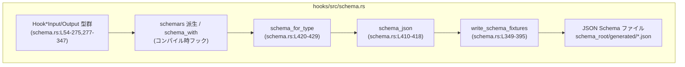
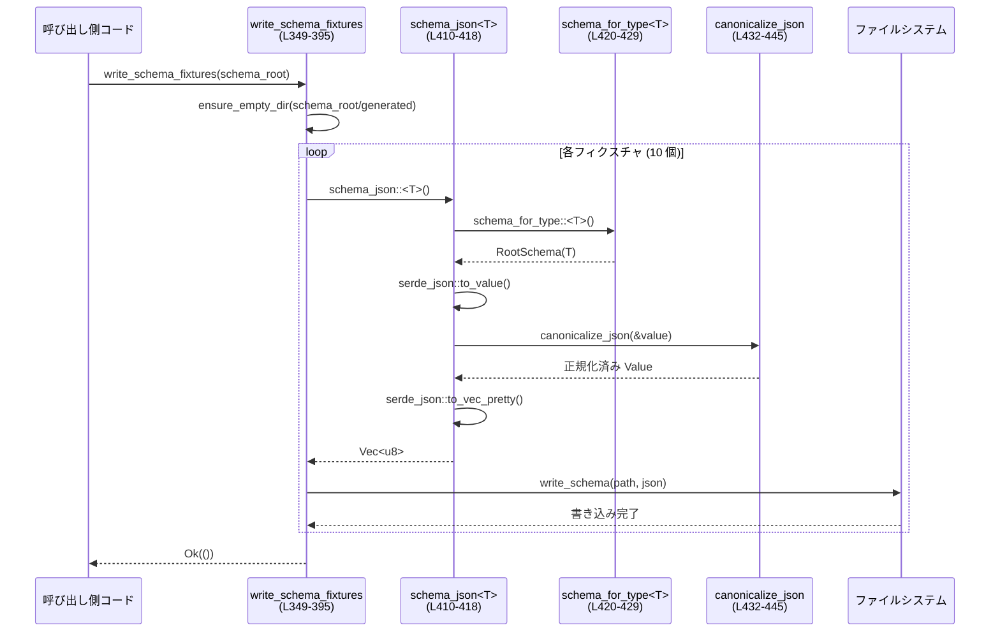

# hooks/src/schema.rs

## 0. ざっくり一言

このモジュールは、Claude/Codex のフック（`PreToolUse`, `PostToolUse`, `SessionStart` など）の **入力／出力ワイヤフォーマットの型定義** と、それらから **JSON Schema を生成し、固定フィクスチャファイルとして書き出す処理** を提供します（`schema.rs:L15-L269`, `schema.rs:L349-L395`）。

---

## 1. このモジュールの役割

### 1.1 概要

- Claude のフック用コマンド（`pre-tool-use`, `post-tool-use`, `session-start`, `user-prompt-submit`, `stop`）の **入力／出力 JSON 形式** を Rust の構造体・列挙体として定義します（`schema.rs:L54-L275`, `schema.rs:L277-L347`）。
- `schemars` クレートを使ってそれらから **JSON Schema (Draft 7)** を生成し、`schema/generated/*.schema.json` に書き出すユーティリティ `write_schema_fixtures` を提供します（`schema.rs:L349-L395`）。
- JSON Schema の順序を安定させるために、オブジェクトのキーを再帰的にソートした「正規化 JSON」を生成します（`schema.rs:L432-L445`）。
- テストで、生成されたスキーマが既存のフィクスチャと一致すること、および `turn_id` 拡張が必ず含まれることを検証します（`schema.rs:L579-L603`, `schema.rs:L605-L637`）。

### 1.2 アーキテクチャ内での位置づけ

このファイル内で完結しており、外部から直接利用される公開関数は `write_schema_fixtures` のみです（`schema.rs:L349-L395`）。型定義はフック入出力の「ワイヤフォーマット」を表現し、`schemars` の derive と補助関数によって JSON Schema が生成されます。



### 1.3 設計上のポイント

- `serde` + `schemars` を併用し、**実際のシリアライズ形式と JSON Schema を 1 ソースで管理**しています（`schema.rs:L54-L66` など）。
- ほぼすべてのワイヤ型に `#[serde(deny_unknown_fields)]` を指定し、不明なフィールドを受け取ったときにデシリアライズエラーにする方針です（`schema.rs:L56`, `schema.rs:L84`, `schema.rs:L99` など）。
- JSON Schema 生成時の設定で `settings.option_add_null_type = false` とし（`schema.rs:L424-L427`）、`Option<T>` は「null を許容する型」ではなく「プロパティの有無」で表現されています。明示的に `string`/`null` 型を許可したい場合は `NullableString` を使います（`schema.rs:L27-L39`, `schema.rs:L41-L52`）。
- `canonicalize_json` でオブジェクトのキー順をソートしており、JSON Schema の比較が安定します（`schema.rs:L432-L445`）。
- `#[schemars(schema_with = "...")]` と文字列定数／列挙値用のスキーマ関数で、文字列フィールドの値を **定数や列挙に制約**しています（`schema.rs:L173-L179`, `schema.rs:L448-L488`, `schema.rs:L499-L510`）。
- テストにより、`turn_id` フィールドが必ず存在し `string` 型・必須であることを保証しつつ、Claude の公開仕様からの Codex 独自拡張であることがコメントされています（`schema.rs:L605-L637`）。

---

## 2. コンポーネント一覧

### 2.1 型一覧（構造体・列挙体）

主要な型を一覧します（`Visibility` はこのモジュール視点）。

| 名前 | 種別 | 役割 / 用途 | Visibility | 定義位置 |
|------|------|-------------|-----------|----------|
| `NullableString` | 構造体 (newtype) | `Option<String>` をラップし、`string` または `null` 型としてスキーマを定義するために使用 | `pub(crate)` | `schema.rs:L27-L39` |
| `HookUniversalOutputWire` | 構造体 | すべてのフック出力に共通のフィールド（`continue`, `stop_reason` 等） | `pub(crate)` | `schema.rs:L54-L66` |
| `HookEventNameWire` | 列挙体 | フックイベント名 (`PreToolUse`, `PostToolUse`, `SessionStart`, `UserPromptSubmit`, `Stop`) | `pub(crate)` | `schema.rs:L68-L80` |
| `PreToolUseCommandOutputWire` | 構造体 | `pre-tool-use` 出力ワイヤ | `pub(crate)` | `schema.rs:L82-L95` |
| `PostToolUseCommandOutputWire` | 構造体 | `post-tool-use` 出力ワイヤ | `pub(crate)` | `schema.rs:L97-L110` |
| `PostToolUseHookSpecificOutputWire` | 構造体 | `post-tool-use` 出力のフック固有ペイロード | `pub(crate)` | `schema.rs:L112-L122` |
| `PreToolUseHookSpecificOutputWire` | 構造体 | `pre-tool-use` 出力のフック固有ペイロード | `pub(crate)` | `schema.rs:L124-L137` |
| `PreToolUsePermissionDecisionWire` | 列挙体 | permission レベルの決定 (`allow`/`deny`/`ask`) | `pub(crate)` | `schema.rs:L139-L147` |
| `PreToolUseDecisionWire` | 列挙体 | `pre-tool-use` の全体的な決定 (`approve`/`block`) | `pub(crate)` | `schema.rs:L149-L155` |
| `PreToolUseToolInput` | 構造体 | `pre-tool-use` 入力の tool パラメータ | `pub(crate)` | `schema.rs:L157-L162` |
| `PreToolUseCommandInput` | 構造体 | `pre-tool-use` コマンド入力ワイヤ (`session_id`, `turn_id` 等) | `pub(crate)` | `schema.rs:L164-L182` |
| `PostToolUseToolInput` | 構造体 | `post-tool-use` 入力の tool パラメータ | `pub(crate)` | `schema.rs:L184-L189` |
| `PostToolUseCommandInput` | 構造体 | `post-tool-use` コマンド入力ワイヤ | `pub(crate)` | `schema.rs:L191-L210` |
| `SessionStartCommandOutputWire` | 構造体 | `session-start` 出力ワイヤ | `pub(crate)` | `schema.rs:L212-L221` |
| `SessionStartHookSpecificOutputWire` | 構造体 | `session-start` 出力のフック固有ペイロード | `pub(crate)` | `schema.rs:L223-L230` |
| `UserPromptSubmitCommandOutputWire` | 構造体 | `user-prompt-submit` 出力ワイヤ | `pub(crate)` | `schema.rs:L232-L245` |
| `UserPromptSubmitHookSpecificOutputWire` | 構造体 | `user-prompt-submit` 出力のフック固有ペイロード | `pub(crate)` | `schema.rs:L247-L254` |
| `StopCommandOutputWire` | 構造体 | `stop` 出力ワイヤ | `pub(crate)` | `schema.rs:L256-L269` |
| `BlockDecisionWire` | 列挙体 | `block` のみを取る決定値 | `pub(crate)` | `schema.rs:L271-L275` |
| `SessionStartCommandInput` | 構造体 | `session-start` コマンド入力ワイヤ | `pub(crate)` | `schema.rs:L277-L291` |
| `UserPromptSubmitCommandInput` | 構造体 | `user-prompt-submit` コマンド入力ワイヤ | `pub(crate)` | `schema.rs:L314-L329` |
| `StopCommandInput` | 構造体 | `stop` コマンド入力ワイヤ | `pub(crate)` | `schema.rs:L331-L347` |
| `tests` モジュール内の型 | - | テスト専用、外部 API とは無関係 | private | `schema.rs:L517-L638` |

補足:

- 入力側の構造体 (`*CommandInput`) は `Serialize` + `JsonSchema` であり、`Deserialize` は derive されていません。これは「このモジュールから外部へ送る JSON」と「そのスキーマ」を表現する用途であると解釈できます（コード上、受信側としては使われていません）。
- 出力側の構造体 (`*CommandOutputWire`, `*HookSpecificOutputWire`) は `Serialize` + `Deserialize` + `JsonSchema` を持ち、外部（フック実装）からの JSON をパースする用途を持つことがコメント・命名から示唆されます。

### 2.2 関数・メソッド一覧

**公開／汎用関数**

| 名前 | 種別 | 役割 / 用途 | Visibility | 定義位置 |
|------|------|-------------|-----------|----------|
| `write_schema_fixtures(schema_root: &Path) -> anyhow::Result<()>` | 関数 | 各フック入力／出力型の JSON Schema を生成し、`schema_root/generated/*.json` に書き出すメイン API | `pub` | `schema.rs:L349-L395` |
| `write_schema(path: &Path, json: Vec<u8>) -> anyhow::Result<()>` | 関数 | バイト列を指定パスに書き込むヘルパー | private | `schema.rs:L397-L400` |
| `ensure_empty_dir(dir: &Path) -> anyhow::Result<()>` | 関数 | ディレクトリを一度削除して空の状態で再作成 | private | `schema.rs:L402-L407` |
| `schema_json<T: JsonSchema>() -> anyhow::Result<Vec<u8>>` | 関数 | 型 `T` から RootSchema を生成し、正規化した JSON Schema を pretty-print したバイト列に変換 | private | `schema.rs:L410-L418` |
| `schema_for_type<T: JsonSchema>() -> RootSchema` | 関数 | `SchemaSettings::draft07` をベースに `T` の RootSchema を生成 | private | `schema.rs:L420-L429` |
| `canonicalize_json(value: &Value) -> Value` | 関数 | JSON `Value` 内のすべてのオブジェクトのキーをソートし、安定した JSON 表現を生成 | private | `schema.rs:L432-L445` |
| `string_const_schema(value: &str) -> Schema` | 関数 | 文字列型 + `const` 制約を持つ JSON Schema を生成 | private | `schema.rs:L490-L497` |
| `string_enum_schema(values: &[&str]) -> Schema` | 関数 | 文字列型 + `enum` 値のリストを持つ JSON Schema を生成 | private | `schema.rs:L499-L510` |
| `default_continue() -> bool` | 関数 | `HookUniversalOutputWire::continue` のデフォルト値 `true` を返す | private | `schema.rs:L513-L515` |

**JsonSchema 補助関数（`#[schemars(schema_with = "...")]` で使用）**

| 名前 | 役割 | 定義位置 |
|------|------|----------|
| `session_start_hook_event_name_schema` | `"SessionStart"` という定数文字列スキーマ | `schema.rs:L448-L450` |
| `post_tool_use_hook_event_name_schema` | `"PostToolUse"` 定数文字列スキーマ | `schema.rs:L452-L454` |
| `post_tool_use_tool_name_schema` | `"Bash"` 定数文字列スキーマ | `schema.rs:L456-L458` |
| `pre_tool_use_hook_event_name_schema` | `"PreToolUse"` 定数文字列スキーマ | `schema.rs:L460-L462` |
| `pre_tool_use_tool_name_schema` | `"Bash"` 定数文字列スキーマ | `schema.rs:L464-L466` |
| `user_prompt_submit_hook_event_name_schema` | `"UserPromptSubmit"` 定数文字列スキーマ | `schema.rs:L468-L470` |
| `stop_hook_event_name_schema` | `"Stop"` 定数文字列スキーマ | `schema.rs:L472-L474` |
| `permission_mode_schema` | `default` など 5 値からなる permission_mode の列挙スキーマ | `schema.rs:L476-L483` |
| `session_start_source_schema` | `startup`/`resume`/`clear` の列挙スキーマ | `schema.rs:L486-L488` |

**メソッド／impl 内の関数**

| 名前 | 種別 | 役割 / 用途 | 定義位置 |
|------|------|-------------|----------|
| `NullableString::from_path(path: Option<PathBuf>) -> Self` | メソッド | `Option<PathBuf>` から display 文字列を生成して内部に保持 | `schema.rs:L31-L34` |
| `NullableString::from_string(value: Option<String>) -> Self` | メソッド | そのまま `Option<String>` をラップ | `schema.rs:L36-L38` |
| `impl JsonSchema for NullableString::schema_name` | メソッド | スキーマ名 `"NullableString"` を返す | `schema.rs:L41-L44` |
| `impl JsonSchema for NullableString::json_schema` | メソッド | `string` または `null` を許すスキーマを返す | `schema.rs:L46-L51` |
| `SessionStartCommandInput::new(...) -> Self` | メソッド | `SessionStartCommandInput` の構築を簡略化し、`hook_event_name` を `"SessionStart"` に固定 | `schema.rs:L293-L312` |

**テスト関数**

| 名前 | 役割 | 定義位置 |
|------|------|----------|
| `expected_fixture(name: &str) -> &'static str` | フィクスチャファイルを `include_str!` で読み込む | `schema.rs:L539-L573` |
| `normalize_newlines(value: &str) -> String` | 改行コードを `\n` に正規化 | `schema.rs:L575-L577` |
| `generated_hook_schemas_match_fixtures()` | 生成したスキーマとフィクスチャが一致することを検証 | `schema.rs:L579-L603` |
| `turn_scoped_hook_inputs_include_codex_turn_id_extension()` | 各 turn-scoped input スキーマに `turn_id` が必須 string として含まれることを検証 | `schema.rs:L605-L637` |

---

## 3. 公開 API と詳細解説

### 3.1 型一覧（概要）

公開 API 観点で重要な型は以下です（詳細な一覧は 2.1 参照）。

- `*CommandInput` 群（`PreToolUseCommandInput`, `PostToolUseCommandInput`, `SessionStartCommandInput`, `UserPromptSubmitCommandInput`, `StopCommandInput`）: フック呼び出し時に送信する JSON の形を表します（`schema.rs:L164-L182`, `schema.rs:L191-L210`, `schema.rs:L277-L291`, `schema.rs:L314-L329`, `schema.rs:L331-L347`）。
- `*CommandOutputWire` 群: フックから返ってくる JSON の形を表します（`schema.rs:L82-L95`, `schema.rs:L97-L110`, `schema.rs:L212-L221`, `schema.rs:L232-L245`, `schema.rs:L256-L269`）。
- `NullableString`: `string`/`null` 型を表すヘルパー（`schema.rs:L27-L39`, `schema.rs:L41-L52`）。

### 3.2 関数詳細

#### `pub fn write_schema_fixtures(schema_root: &Path) -> anyhow::Result<()>` （`schema.rs:L349-L395`）

**概要**

- このモジュールのメイン公開 API であり、各フックのコマンド入力／出力型から JSON Schema を生成し、`schema_root/generated/*.schema.json` に書き出します。

**引数**

| 引数名 | 型 | 説明 |
|--------|----|------|
| `schema_root` | `&Path` | `generated` ディレクトリを配置するルートパス。テストでは `TempDir` 上の `schema` ディレクトリが渡されています（`schema.rs:L581-L583`）。 |

**戻り値**

- `anyhow::Result<()>`  
  - 成功時: `Ok(())`  
  - 失敗時: `Err` にファイルシステム／シリアライズ関連のエラー情報がラップされます。

**内部処理の流れ**

1. `schema_root.join(GENERATED_DIR)` で `generated` サブディレクトリのパスを作成（`schema.rs:L350`）。
2. `ensure_empty_dir` を呼び出し、`generated` ディレクトリを一度削除して空で作成（`schema.rs:L351`）。
3. 各フィクスチャファイルごとに `write_schema` を呼ぶ（`schema.rs:L353-L392`）。  
   例:  
   - `POST_TOOL_USE_INPUT_FIXTURE` + `schema_json::<PostToolUseCommandInput>()?`（`schema.rs:L353-L356`）  
   - `PRE_TOOL_USE_OUTPUT_FIXTURE` + `schema_json::<PreToolUseCommandOutputWire>()?` など。
4. すべて成功した場合 `Ok(())` を返す（`schema.rs:L394`）。

**Examples（使用例）**

```rust
use std::path::Path;
use hooks::schema::write_schema_fixtures; // 実際のパスはクレート構成による

fn main() -> anyhow::Result<()> {
    // 例: プロジェクトルートの "schema" ディレクトリを指定
    let schema_root = Path::new("schema");
    write_schema_fixtures(schema_root)?; // generated/*.json を生成
    Ok(())
}
```

**Errors / Panics**

- `ensure_empty_dir` 内での `remove_dir_all` / `create_dir_all` 失敗（パーミッション、存在しない親ディレクトリなど）により `Err` を返します（`schema.rs:L402-L407`）。
- `schema_json::<T>()` が `serde_json::to_value` や `to_vec_pretty` で失敗した場合も `Err` を返します（`schema.rs:L410-L418`）。
- `write_schema` 内での `std::fs::write` エラーも `Err` に伝播します（`schema.rs:L397-L400`）。
- この関数内で `panic!` はしていません。

**Edge cases（エッジケース）**

- `schema_root` が存在しない場合: `ensure_empty_dir` 内の `dir.exists()` が `false` となり、直接 `create_dir_all` が呼ばれます（`schema.rs:L402-L407`）。
- 既に `generated` ディレクトリが存在し、中にファイルがある場合: `remove_dir_all` で再帰的に削除された後、新しく作成されます（`schema.rs:L402-L405`）。
- 複数スレッド／プロセスから同じ `schema_root` に対して同時に呼び出された場合の振る舞いは、このファイルからは分かりませんが、ファイルシステム上のレースコンディションが起こり得ます。

**使用上の注意点**

- `schema_root` 配下の `generated` ディレクトリは **完全に削除されて再生成** されるため、手動で配置したファイルを置くべきではありません。
- この関数はブロッキング I/O を行うため、大量のスキーマ生成を高頻度に行う用途には適していませんが、通常はビルド／テスト時のバッチ処理で問題ない設計です。
- エラーは `anyhow::Result` でラップされるため、上位で `?` による伝播や `context` の付与がしやすくなっています。

---

#### `fn schema_json<T>() -> anyhow::Result<Vec<u8>>` （`schema.rs:L410-L418`）

**概要**

- 型 `T` の JSON Schema を生成し、**オブジェクトキーをソートした JSON** を pretty-print した UTF-8 バイト列として返します。`write_schema_fixtures` からのみ呼び出されています（`schema.rs:L353-L392`）。

**引数**

| 引数名 | 型 | 説明 |
|--------|----|------|
| `T` | 型パラメータ (`T: JsonSchema`) | `schemars::JsonSchema` トレイトを実装する任意の型。 |

**戻り値**

- `anyhow::Result<Vec<u8>>`  
  - 成功時: JSON Schema を表す prettified な UTF-8 バイト列。  
  - 失敗時: `serde_json::Error` などが `anyhow::Error` にラップされて返ります。

**内部処理の流れ**

1. `schema_for_type::<T>()` で `RootSchema` を取得（`schema.rs:L414`）。
2. `serde_json::to_value(schema)` で `serde_json::Value` に変換（`schema.rs:L415`）。
3. `canonicalize_json(&value)` によってオブジェクトキーをソート（`schema.rs:L416`）。
4. `serde_json::to_vec_pretty(&value)` で整形済み JSON バイト列を生成し、`Ok` で返します（`schema.rs:L417`）。

**Examples（使用例）**

```rust
use serde_json::Value;
use hooks::schema::schema_json; // 実際の公開状況は crate 構成に依存（このファイルでは private）

fn dump_session_start_schema() -> anyhow::Result<Value> {
    let bytes = schema_json::<hooks::schema::SessionStartCommandInput>()?;
    let value: Value = serde_json::from_slice(&bytes)?;
    Ok(value)
}
```

**Errors / Panics**

- `serde_json::to_value` または `to_vec_pretty` で失敗すると `Err` を返します。
- `canonicalize_json` 自体は `match` で全パターンを網羅しており、`panic!` はありません（`schema.rs:L432-L445`）。

**Edge cases**

- JSON Schema 内に循環参照などがあっても、`schemars` がそれを表現する `RootSchema` を生成できる限り、本関数は通常どおり動作します。循環の有無はこのファイルからは分かりません。
- 非常に大きなスキーマの場合、メモリ使用量とソートコストが増大しますが、このファイル内では対象スキーマはフック用の比較的小さなものです。

**使用上の注意点**

- この関数は private で、主に `write_schema_fixtures` から使われます。外部から直接利用したい場合は公開 API を追加する必要があります（このチャンクには現れません）。
- 返り値は **バイト列** なので、文字列が必要なら `String::from_utf8` か `serde_json::from_slice` などで変換します。

---

#### `fn schema_for_type<T>() -> RootSchema` （`schema.rs:L420-L429`）

**概要**

- `schemars::SchemaSettings::draft07()` をベースに、型 `T` の RootSchema を生成します。`Option<T>` に対して `null` タイプを自動付与しない設定を行っている点が特徴です。

**引数**

| 引数名 | 型 | 説明 |
|--------|----|------|
| `T` | 型パラメータ (`T: JsonSchema`) | JSON Schema を生成する対象型。 |

**戻り値**

- `RootSchema` – `schemars` が生成した JSON Schema のルート構造体。

**内部処理の流れ**

1. `SchemaSettings::draft07()` を取得（`schema.rs:L424`）。
2. `.with(|settings| { settings.option_add_null_type = false; })` で設定を変更（`schema.rs:L425-L427`）。  
   - デフォルトでは `Option<T>` に `null` 型が自動で追加されますが、それを無効化。
3. `.into_generator()` でスキーマジェネレータを作成（`schema.rs:L428`）。
4. `.into_root_schema_for::<T>()` で `T` の RootSchema を生成（`schema.rs:L429`）。

**使用例**

直接使われているのは `schema_json` の中だけです（`schema.rs:L414`）。

**Errors / Panics**

- ここでは `Result` を返しておらず、`schemars` 側の実装に依存しますが、通常は panic せずに `RootSchema` を構築します（コードからは詳細は分かりません）。

**Edge cases / 契約**

- `Option<T>` フィールドは「null を許す」ではなく、「プロパティが存在しない（省略される）」ことでオプションを表現するスキーマになります。
- 明示的に `null` を許したい場合は、このファイルでは `NullableString` に対して手書きの `JsonSchema` 実装で対応しています（`schema.rs:L41-L52`）。

---

#### `fn canonicalize_json(value: &Value) -> Value` （`schema.rs:L432-L445`）

**概要**

- JSON 値内のすべての `Object` のキーをソートして、新しい `Value` を返します。`Array` 内の要素にも再帰的に適用します。

**引数**

| 引数名 | 型 | 説明 |
|--------|----|------|
| `value` | `&serde_json::Value` | 正規化したい JSON 値。 |

**戻り値**

- `serde_json::Value` – 同じ構造・値を持つが、すべてのオブジェクトのキー順が昇順にソートされた新しい値。

**内部処理の流れ**

1. `match value { ... }` で型ごとに処理を分岐（`schema.rs:L433`）。
2. `Value::Array(items)` の場合: `items.iter().map(canonicalize_json).collect()` で各要素に再帰的に適用（`schema.rs:L434`）。
3. `Value::Object(map)` の場合（`schema.rs:L435-L443`）:
   - `map.iter().collect()` で `(key, value)` ペアのベクタを作成（`schema.rs:L436`）。
   - `entries.sort_by(|(left, _), (right, _)| left.cmp(right))` でキー文字列を昇順ソート（`schema.rs:L437`）。
   - 新しい `Map` を作成し、ソート済みエントリを順に挿入しつつ、値側にも `canonicalize_json` を適用（`schema.rs:L438-L441`）。
4. それ以外の型（`String`, `Number`, `Bool`, `Null`）はそのままクローンして返します（`schema.rs:L444`）。

**Examples（使用例）**

```rust
use serde_json::json;
use hooks::schema::canonicalize_json; // このファイルでは private

let value = json!({"b": 2, "a": {"d": 4, "c": 3}});
let canonical = canonicalize_json(&value);
// canonical["a"] のオブジェクトキーは "c", "d" の順にソートされる
```

**Errors / Panics**

- `Map::with_capacity(map.len())` 等、通常のヒープ確保以外にエラーは発生せず、panic もありません（`schema.rs:L438`）。

**Edge cases**

- ネストの深い JSON に対しても再帰的に処理されます。再帰の深さに対する明示的な制限はありませんが、ここで扱う JSON Schema は実務上それほど深くならないことが多いです。
- 同じキーを持つことは JSON オブジェクト上ありえないため、ソート後もエントリ数は変わりません。

**使用上の注意点**

- 安定した JSON 出力を得るための内部ユーティリティであり、外部から直接呼ぶことは想定されていません（このファイルでは private）。
- 大きなオブジェクトに対してはソートと再帰にコストがかかるため、頻繁に呼ぶ用途には注意が必要ですが、本モジュールではスキーマ生成時のみ使用されています。

---

#### `fn string_const_schema(value: &str) -> Schema` （`schema.rs:L490-L497`）

**概要**

- `"type": "string"` かつ `"const": value` を持つ JSON Schema を生成します。`hook_event_name` など、値が固定の文字列フィールドに使用されています。

**引数**

| 引数名 | 型 | 説明 |
|--------|----|------|
| `value` | `&str` | 許可する唯一の文字列値。 |

**戻り値**

- `schemars::schema::Schema` – `type: string` と `const: value` を持つスキーマ。

**内部処理の流れ**

1. `SchemaObject` を `instance_type: Some(InstanceType::String.into())` で初期化（`schema.rs:L491-L493`）。
2. `schema.const_value = Some(Value::String(value.to_string()));` で定数値を設定（`schema.rs:L495`）。
3. `Schema::Object(schema)` として返す（`schema.rs:L496`）。

**使用箇所**

- `session_start_hook_event_name_schema`, `post_tool_use_hook_event_name_schema` などの関数から呼ばれています（`schema.rs:L448-L470`）。

**注意点**

- Rust 側のフィールド型は `String` ですが、スキーマ上はこの関数により **一意の値のみを許可**する形になっています。スキーマに従う実装であれば他の文字列は送ってこない前提です。

---

#### `fn string_enum_schema(values: &[&str]) -> Schema` （`schema.rs:L499-L510`）

**概要**

- `"type": "string"` かつ `"enum": [values...]` を持つ JSON Schema を生成します。`permission_mode` や `source` フィールドで使用されています。

**引数**

| 引数名 | 型 | 説明 |
|--------|----|------|
| `values` | `&[&str]` | 許可される文字列値の配列。 |

**戻り値**

- `Schema` – 列挙値を持つ文字列型スキーマ。

**内部処理の流れ**

1. `SchemaObject` を `instance_type: Some(InstanceType::String.into())` で初期化（`schema.rs:L500-L502`）。
2. `values.iter().map(|value| Value::String((*value).to_string())).collect()` で JSON 文字列値のベクタを作成（`schema.rs:L504-L508`）。
3. `schema.enum_values = Some(…)` として設定し、`Schema::Object(schema)` で返します（`schema.rs:L503-L510`）。

**使用箇所**

- `permission_mode_schema`（`schema.rs:L476-L483`）
- `session_start_source_schema`（`schema.rs:L486-L488`）

**Edge cases**

- `values` が空配列の場合の動作は、このファイル内では利用されておらず、`string_enum_schema` の呼び出しも常に非空配列を渡しています。

---

#### `impl SessionStartCommandInput { fn new(...) -> Self }` （`schema.rs:L293-L312`）

**概要**

- `SessionStartCommandInput` のコンストラクタ的メソッドで、`NullableString::from_path` を利用しつつ `hook_event_name` を `"SessionStart"` に固定します。

**引数**

| 引数名 | 型 | 説明 |
|--------|----|------|
| `session_id` | `impl Into<String>` | セッション ID |
| `transcript_path` | `Option<PathBuf>` | トランスクリプトファイルへのパス（あれば） |
| `cwd` | `impl Into<String>` | カレントディレクトリ |
| `model` | `impl Into<String>` | モデル名 |
| `permission_mode` | `impl Into<String>` | パーミッションモード |
| `source` | `impl Into<String>` | 起動元 (`startup`/`resume`/`clear` のいずれかが想定されますが、値チェックはここでは行っていません) |

**戻り値**

- `SessionStartCommandInput` – 各フィールドが引数から構築され、`hook_event_name` が `"SessionStart"` に設定されたインスタンス。

**内部処理の流れ**

1. 各 `impl Into<String>` 引数を `into()` で `String` に変換（`schema.rs:L303-L303,L305-L305,L307-L307,L308-L308,L309-L309`）。
2. `transcript_path` は `NullableString::from_path(transcript_path)` で `Option<PathBuf>` から変換（`schema.rs:L304`）。
3. `hook_event_name` は `"SessionStart".to_string()` で固定（`schema.rs:L306`）。

**Examples（使用例）**

```rust
use std::path::PathBuf;
use hooks::schema::SessionStartCommandInput;

let input = SessionStartCommandInput::new(
    "session-123",
    Some(PathBuf::from("/tmp/transcript.json")),
    "/workspace",
    "claude-3-opus",
    "default",
    "startup",
);
// input を serde_json::to_string などでシリアライズして送信できる
```

**Errors / Panics**

- このメソッド内ではエラーも panic も発生しません。引数はそのままフィールドに詰められます。

**Edge cases**

- `transcript_path` が `None` の場合、`NullableString::from_path` により内部の `Option<String>` は `None` になります（`schema.rs:L31-L34`）。
- `permission_mode` や `source` の文字列がスキーマ指定と異なる値であっても、ここでは検証されません。スキーマとの整合性は実行時とは別の問題です。

**使用上の注意点**

- スキーマ上は `permission_mode` と `source` が限定された列挙値として表現されるため（`schema.rs:L476-L483`, `schema.rs:L486-L488`）、フックとの通信時にはそれらに従う必要があります。  
  ただし、このメソッド自体は自由な文字列を許容します。

---

### 3.3 その他の関数（概要）

| 関数名 | 役割（1 行） | 定義位置 |
|--------|--------------|----------|
| `write_schema(path: &Path, json: Vec<u8>)` | `std::fs::write` を呼び出すだけの薄いラッパー | `schema.rs:L397-L400` |
| `ensure_empty_dir(dir: &Path)` | 既存ディレクトリを削除し、空で作り直す | `schema.rs:L402-L407` |
| `session_start_hook_event_name_schema` など各 `*_hook_event_name_schema` | 各種 `hook_event_name` フィールドに対応する定数文字列スキーマを返す | `schema.rs:L448-L470` |
| `permission_mode_schema` | `permission_mode` フィールドの列挙スキーマを返す | `schema.rs:L476-L483` |
| `session_start_source_schema` | `source` フィールドの列挙スキーマを返す | `schema.rs:L486-L488` |
| `default_continue` | `HookUniversalOutputWire::continue` のデフォルト値を返す | `schema.rs:L513-L515` |

---

## 4. データフロー

### 4.1 スキーマ生成のフロー

フック用型から JSON Schema ファイルが生成されるまでの流れです。



### 4.2 テストにおけるデータフロー

- `generated_hook_schemas_match_fixtures`（`schema.rs:L579-L603`）では、  
  1. 一時ディレクトリに対して `write_schema_fixtures` を実行。  
  2. `include_str!` で読み込んだ既存のフィクスチャ（`../schema/generated/*.json`）と、生成されたファイルを文字列比較します。
- `turn_scoped_hook_inputs_include_codex_turn_id_extension`（`schema.rs:L605-L637`）では、  
  1. `schema_json::<PreToolUseCommandInput>` などを直接呼び出して `Value` に変換。  
  2. `schema["properties"]["turn_id"]["type"]` が `"string"` であること。  
  3. `schema["required"]` に `"turn_id"` が含まれること。  
  を検証しています。

---

## 5. 使い方（How to Use）

### 5.1 基本的な使用方法（スキーマフィクスチャ生成）

ビルドスクリプトやメンテナンス用のバイナリから `write_schema_fixtures` を呼ぶイメージです。

```rust
use std::path::Path;
use hooks::schema::write_schema_fixtures; // 実際のパスはクレート構成による

fn main() -> anyhow::Result<()> {
    // リポジトリ内の schema ディレクトリを指定
    let schema_root = Path::new("schema");
    write_schema_fixtures(schema_root)?;
    Ok(())
}
```

- これにより `schema/generated/*.schema.json` が再生成されます。
- 既存のフィクスチャと差分が出た場合、テスト `generated_hook_schemas_match_fixtures` を参考に更新可否を判断できます（`schema.rs:L579-L603`）。

### 5.2 よくある使用パターン

1. **テストでの検証（既存コード）**

   - `tests::generated_hook_schemas_match_fixtures` のように、一時ディレクトリでスキーマ生成 → 期待フィクスチャと比較することで、型定義変更時にスキーマ差分を検出しています（`schema.rs:L579-L603`）。

2. **スキーマを直接コードから参照**

   - `schema_json::<PreToolUseCommandInput>()` などを使って `serde_json::Value` を得て、その場で検査することも可能です（テスト `turn_scoped_hook_inputs_include_codex_turn_id_extension` を参照、`schema.rs:L605-L637`）。

### 5.3 よくある間違い（想定）

このファイルから推測できる範囲での誤用例です。

```rust
// 誤り例: 既存の generated ディレクトリに手動で追加したファイルを保持したい
let schema_root = Path::new("schema");
write_schema_fixtures(schema_root)?;
// => schema_root/generated は完全に削除されるため、手動ファイルは失われる

// 正しいパターン: generated ディレクトリは常に自動生成専用とする
```

```rust
// 誤り例: permission_mode にスキーマで許可されない値をセット
let input = SessionStartCommandInput::new(
    "session",
    None,
    ".",
    "model",
    "some-unknown-mode", // スキーマでは許可されない
    "startup",
);
// Rust 側ではコンパイル・実行できるが、
// スキーマ通りのクライアント／サーバ側でバリデーションエラーになる可能性がある
```

### 5.4 使用上の注意点（まとめ）

- **ディレクトリ操作**: `write_schema_fixtures` は `schema_root/generated` を完全に削除して再作成します（`schema.rs:L402-L407`）。このディレクトリを他用途で共有しない前提が必要です。
- **スキーマと実際の値の整合性**:
  - `permission_mode`, `source`, `hook_event_name`, `tool_name` などは JSON Schema 上で列挙・定数制約されています（`schema.rs:L173-L179`, `schema.rs:L476-L488`）。  
  - Rust では単なる `String` なので、値の制約は別レイヤーで守る必要があります。
- **並行性**:
  - このモジュール内で明示的な同期処理は行っていません。`write_schema_fixtures` を同じディレクトリに対して並行に実行すると、ファイル削除・生成の競合が起こる可能性があります。
- **エラー処理**:
  - すべての外部リソースアクセス（ファイル I/O, JSON シリアライズ）は `?` 演算子で `anyhow::Error` に包まれて上位に伝播されます（`schema.rs:L349-L395`, `schema.rs:L410-L418`, `schema.rs:L397-L400`, `schema.rs:L402-L407`）。

---

## 6. 変更の仕方（How to Modify）

### 6.1 新しいフック／スキーマを追加する場合

このファイルから読み取れる一般的な手順です。

1. **型定義を追加**

   - 新しいコマンド入力／出力用の構造体・列挙体を、既存の `*CommandInput` / `*CommandOutputWire` に倣って定義します（`serde` と `JsonSchema` の derive、`deny_unknown_fields` など、`schema.rs:L82-L110`, `schema.rs:L164-L182` を参考）。

2. **必要に応じて schema_with 関数を追加**

   - `hook_event_name` や固定の `tool_name` を持つ場合、`string_const_schema` または `string_enum_schema` を利用した `*_schema` 関数を追加します（`schema.rs:L448-L488`）。

3. **フィクスチャファイル名の定数追加**

   - 上部の定数群に新しいフィクスチャファイル名を追加します（`schema.rs:L15-L25`）。

4. **`write_schema_fixtures` に出力処理を追加**

   - 他のフィクスチャと同様に `write_schema(&generated_dir.join(NEW_FIXTURE), schema_json::<NewType>()?)?;` を追加します（`schema.rs:L353-L392`）。

5. **テスト更新**

   - `expected_fixture` の `match` に新しいフィクスチャ名と `include_str!` を追加（`schema.rs:L539-L573`）。
   - `generated_hook_schemas_match_fixtures` のフィクスチャ配列に追加（`schema.rs:L585-L595`）。
   - 必要であれば追加の検証テストを作成。

### 6.2 既存の機能を変更する場合

- **型変更の影響範囲**
  - 任意の `*CommandInput` / `*CommandOutputWire` のフィールドや型を変更すると、`schema_json::<T>()` の結果が変わり、`generated_hook_schemas_match_fixtures` テストが失敗します（`schema.rs:L579-L603`）。
  - 新しいフィールドを追加した場合、`#[serde(deny_unknown_fields)]` によるデシリアライズ挙動（未知フィールドの拒否）が変わる可能性があります。

- **契約（前提条件）への注意**
  - `StopCommandOutputWire` のコメントにあるように、「`decision == block` のとき `reason` が必須」というようなセマンティクスは JSON Schema では表現されておらず、別レイヤーで検証されます（`schema.rs:L265-L268`）。この契約を変える場合は、スキーマに影響しないため、テストやパーサ側の変更も必要です（このチャンクには現れません）。

- **ファイル出力のパスや命名変更**
  - 定数と `include_str!` のパスが密接に結びついているため、ファイル名を変更する場合は定数・`write_schema_fixtures`・テストすべてを揃えて更新する必要があります（`schema.rs:L15-L25`, `schema.rs:L353-L392`, `schema.rs:L539-L573`）。

---

## 7. 関連ファイル

このモジュールから直接参照されているファイルパスは以下です。

| パス | 役割 / 関係 |
|------|------------|
| `../schema/generated/post-tool-use.command.input.schema.json` など | テストで `include_str!` により読み込まれる既存 JSON Schema フィクスチャ（`schema.rs:L541-L569`）。`write_schema_fixtures` が生成するファイルと一致することがテストされます。 |
| `schema_root/generated/*.schema.json` | テスト時に `TempDir` 配下に生成される JSON Schema ファイル群（`schema.rs:L581-L583`, `schema.rs:L598-L599`）。本番利用時は任意の `schema_root` 配下の `generated` ディレクトリとして使われます。 |

このチャンク内には、これらのスキーマがどのプロセス（例: CLI, サーバ）から利用されるかを示すコードは存在しないため、利用者側の詳細は不明です。
